# 第53章 多活架构

## 章节概览

多活架构（Multi-Active Architecture）是应对大规模分布式系统高可用挑战的核心解决方案。传统的主备（Active-Standby）模式中，备中心长期闲置，资源浪费严重且切换风险极高。多活架构的核心思想是让多个数据中心同时承担业务流量——既提升系统整体吞吐能力，又大幅降低灾难恢复的复杂度和风险。

本章系统阐述多活架构从理论到实践的完整知识体系：

- **理论基础**：同城双活与异地多活的架构差异、数据同步机制、流量调度策略、单元化设计原理、数据一致性模型
- **核心技巧**：单元化路由规则设计、数据分片与同步优化、跨机房会话管理、灰度切换机制、监控与运维体系
- **实战案例**：阿里巴巴双十一多活实践、饿了么异地多活改造、携程多数据中心架构
- **常见误区**：纠正"多活等于完全对等""多活解决所有可用性问题"等十大典型认知偏差
- **练习方法**：从单机房模拟到跨区域部署的渐进式学习路径

通过本章学习，读者将能够理解多活架构的设计哲学，掌握核心设计模式和实施方法，并具备在实际项目中规划和落地多活方案的能力。

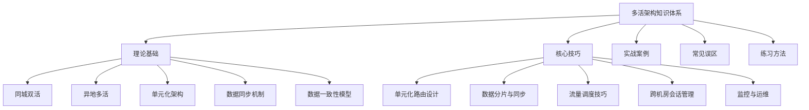

***

# 多活架构理论基础

## 1. 多活架构的核心概念

多活架构是指在分布式系统中，让多个数据中心（或机房）同时处于活跃状态，共同承担业务流量的架构模式。与传统的主备模式不同，多活架构中的每个数据中心都是"活"的——都能独立处理用户请求，不存在长期闲置的备份资源。

### 1.1 架构演进路径

高可用架构经历了几个关键阶段，每一步演进都伴随着更大的技术复杂度和更高的可用性保障：

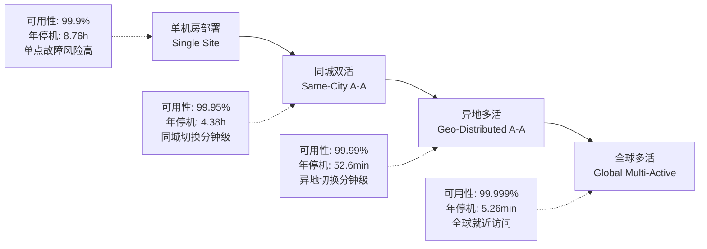

| 架构形态 | 可用性目标 | 数据中心距离 | 典型延迟 | 数据同步方式 | 适用场景 |
|----------|-----------|-------------|---------|------------|---------|
| 单机房部署 | 99.9%-99.95% | 0 | <1ms | 无需同步 | 中小型业务、开发测试 |
| 同城双活 | 99.95%-99.99% | <50km | 1-3ms | 同步复制 | 中大型业务、金融核心 |
| 异地多活 | 99.99%-99.999% | 100-3000km | 10-100ms | 异步复制 | 超大型业务、全球化 |
| 全球多活 | 99.999%+ | >3000km | 50-300ms | 混合同步/异步 | 全球化业务 |

### 1.2 CAP定理与多活架构

理解多活架构必须从CAP定理出发。分布式系统中，一致性（Consistency）、可用性（Availability）和分区容忍性（Partition Tolerance）三者不可兼得。在多活架构的场景下，网络分区是客观存在的（机房间网络可能中断），因此P是必须满足的。设计者只能在C和A之间选择：

- **选择AP**：多活架构的主流选择。牺牲强一致性，换取高可用性。数据通过异步复制同步，允许短暂不一致，但保证所有节点都能响应请求。
- **选择CP**：少数场景（如金融核心交易）会选择强一致性。通过同步复制或共识协议（Paxos/Raft）确保数据一致，但牺牲可用性（同步延迟期间部分节点不可用）。

更实用的框架是**PACELC定理**：在分区（P）发生时选择可用性（A）还是一致性（C）；在正常运行（E）时选择延迟（L）还是一致性（C）。多活架构通常采用**PA/EL**策略——分区时选可用性，正常时选低延迟（最终一致性）。

### 1.3 多活架构的能力边界

多活架构主要解决的是**基础设施层面**的可用性问题——当某个数据中心故障时，其他数据中心可以接管流量。但它无法解决：

- **应用层面的Bug**：内存泄漏、死锁、逻辑错误在所有单元同时爆发
- **数据层面的风险**：异步复制延迟导致的切换后数据丢失
- **新增的复杂性**：数据同步、流量调度、跨单元通信引入新的故障点
- **运维层面的挑战**：更复杂的监控、更长的故障定位时间、更高的变更风险

因此，多活架构必须配合完善的监控告警、故障演练、应用容错设计和运维体系，才能真正提升系统可用性。

***

## 2. 同城双活架构

同城双活是最基础的多活形态，指在同一城市或相邻区域的两个数据中心同时提供服务。由于地理位置接近（通常在50公里以内），同城机房之间的网络延迟极低（通常在1-3毫秒），这为数据同步和一致性保障提供了有利条件。

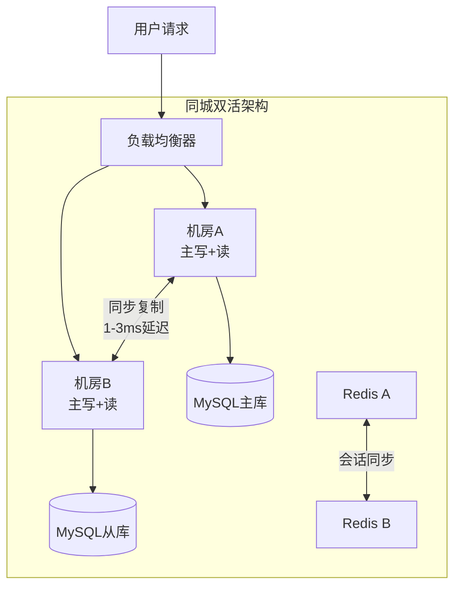

### 2.1 共享存储方案

同城双活最简单的实现方式是共享存储。两个机房通过SAN（Storage Area Network）或分布式存储系统共享同一份数据。底层存储通常采用同步复制机制，确保两个机房看到的数据完全一致。

**优点**：实现简单，数据一致性容易保障。

**缺点**：
- 存储层成为单点，共享存储故障影响两个机房
- 同步复制增加写入延迟，高并发场景下成为性能瓶颈
- 存储设备成本高，且需要专用的光纤通道网络

**适用场景**：数据量较小、写入并发不高的业务系统，或作为过渡方案。

### 2.2 数据库同步方案

更常见的同城双活方案是基于数据库的同步复制。主库在机房A，备库在机房B，通过数据库原生的同步复制机制保持数据一致。

**MySQL半同步复制配置示例**：

```sql
-- 机房A（主库）配置
SET GLOBAL rpl_semi_sync_master_enabled = 1;
SET GLOBAL rpl_semi_sync_master_timeout = 1000;  -- 1秒超时后降级为异步

-- 机房B（从库）配置
SET GLOBAL rpl_semi_sync_slave_enabled = 1;

-- 查看半同步状态
SHOW STATUS LIKE 'Rpl_semi_sync%';
```

在这种模式下，机房A处理所有写请求，机房B承担部分读请求（读写分离）。当机房A故障时，机房B可以快速提升为主库，接管全部流量。切换过程通常在秒级完成。

**PostgreSQL同步流复制配置示例**：

```ini
# 机房B（从库）postgresql.conf
synchronous_standby_names = 'standby1'
synchronous_commit = on

# 机房A（主库）pg_hba.conf
# 允许从库连接进行流复制
host replication replicator 10.0.2.0/24 md5
```

### 2.3 流量切换机制

同城双活的流量切换通常基于DNS和负载均衡器配合。正常情况下，两个机房按比例分配流量（如50:50或70:30）。当某个机房故障时，DNS解析将所有流量指向健康机房。

| 切换手段 | 切换速度 | 粒度 | 复杂度 | 适用场景 |
|---------|---------|------|-------|---------|
| DNS切换 | 1-10分钟 | 地域级 | 低 | 整体机房切换 |
| GSLB | 30秒-5分钟 | 地域+健康检查 | 中 | 智能流量调度 |
| HTTPDNS/SDK | 1-10秒 | 用户级 | 高 | 精细流量控制 |
| 应用层重定向 | 毫秒级 | 请求级 | 最高 | 实时流量控制 |

**DNS TTL配置建议**：
- 正常时期：TTL设为300秒，减少DNS查询压力
- 计划切换前30分钟：TTL降低到60秒，加速切换收敛
- 切换完成后：TTL恢复到300秒

### 2.4 同城双活的关键约束

同城双活虽然实现相对简单，但有几个关键约束需要注意：

- **存储层限制**：SAN光纤通道通常有距离限制（约10-30公里），超出后延迟和成本急剧上升
- **电力独立性**：两个机房应使用独立的电力供应系统。如果共用同一个变电站，大面积停电会导致两个机房同时不可用
- **网络独立性**：两个机房应通过不同的网络路径连接，避免单条光缆中断导致两个机房网络隔离
- **运维能力**：需要具备在秒级完成数据库主从切换的能力，这要求从库与主库的数据延迟始终在可接受范围内

***

## 3. 异地多活架构

异地多活是多活架构的高级形态，指在不同地域的多个数据中心同时提供服务。由于地理距离导致的高延迟（20-100毫秒），异地多活面临的技术挑战远大于同城双活。

### 3.1 单元化架构

单元化（Unitization）是异地多活的核心设计理念。所谓"单元"（Unit），是指一个能够独立完成业务闭环的最小架构单元。每个单元包含完整的技术栈：接入层、应用层、数据层，能够独立处理用户请求而无需跨单元调用。

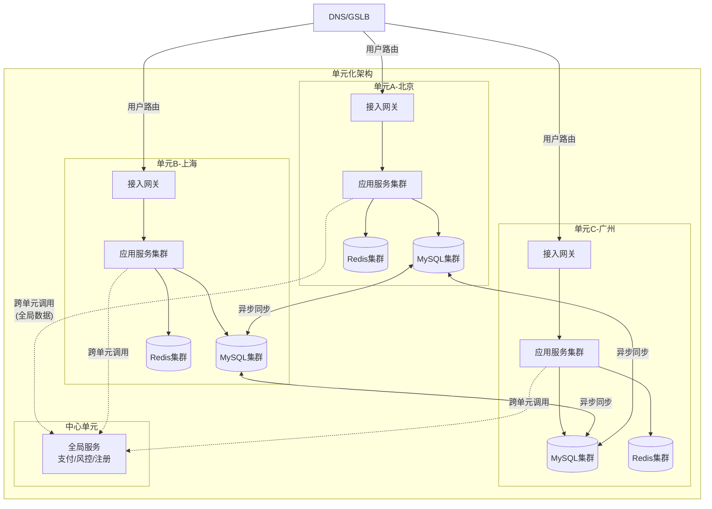

**单元化架构的关键设计决策**：

1. **单元划分粒度**：用户按照某种规则（如用户ID取模、地理位置归属）划分到不同单元。每个单元拥有独立的数据集，用户的读写请求都在其归属单元内完成。

2. **全局服务处理**：某些全局性服务（支付、风控、用户注册）无法按用户维度分片，需要部署在"中心单元"中，其他单元通过远程调用访问。

3. **跨单元交互最小化**：单元化的目标是让95%以上的请求在单元内闭环处理。只有少数全局性操作才需要跨单元调用。

**以电商平台为例的单元划分**：

```python
# 单元路由逻辑示例
def route_to_unit(user_id: int, total_units: int = 3) -> str:
    """
    根据用户ID决定其归属单元
    0-3 -> 单元A（北京）
    4-6 -> 单元B（上海）
    7-9 -> 单元C（广州）
    """
    unit_index = user_id % total_units
    units = ['unit-a-beijing', 'unit-b-shanghai', 'unit-c-guangzhou']
    return units[unit_index]

# 单元内业务闭环：用户的所有数据操作都在归属单元内完成
class UnitRouter:
    def __init__(self):
        self.unit_configs = {
            'unit-a-beijing': {'db': '10.0.1.100', 'cache': '10.0.1.200'},
            'unit-b-shanghai': {'db': '10.0.2.100', 'cache': '10.0.2.200'},
            'unit-c-guangzhou': {'db': '10.0.3.100', 'cache': '10.0.3.200'},
        }

    def get_unit_connection(self, user_id: int):
        unit = route_to_unit(user_id)
        return self.unit_configs[unit]
```

### 3.2 数据分片策略

数据分片是单元化架构的基础。常见分片维度及其适用场景：

| 分片维度 | 适用场景 | 优点 | 缺点 | 典型案例 |
|---------|---------|------|------|---------|
| 按用户ID分片 | 社交、电商等用户中心业务 | 同一用户数据完全本地化 | 跨用户交互需跨单元 | 阿里巴巴交易系统 |
| 按地理位置分片 | LBS、本地生活 | 用户访问延迟最低 | 用户流动性导致跨单元 | 饿了么外卖系统 |
| 按业务线分片 | 多业务线独立演进 | 各业务独立部署 | 业务间依赖需跨机房 | 携程旅行平台 |
| 混合分片 | 复杂业务系统 | 灵活适配多种场景 | 设计复杂度高 | 全球化电商平台 |

**混合分片策略示例**：

```yaml
# 分片策略配置示例
sharding:
  # 第一层：按地理位置分片
  geo_routing:
    - region: "华东"
      units: ["unit-b-shanghai"]
      fallback: "unit-a-beijing"
    - region: "华南"
      units: ["unit-c-guangzhou"]
      fallback: "unit-a-beijing"
    - region: "其他"
      units: ["unit-a-beijing"]
      fallback: "unit-b-shanghai"

  # 第二层：在每个地域内按用户ID分片
  user_routing:
    strategy: "user_id_mod"
    modulus: 3
    mapping:
      0: "unit-a-beijing"
      1: "unit-b-shanghai"
      2: "unit-c-guangzhou"

  # 全局数据不分片，全量同步到所有单元
  global_data:
    tables: ["product", "category", "config", "promotion"]
    sync_mode: "async_full"
    sync_interval: "300s"
```

### 3.3 数据同步机制

异地多活的数据同步面临巨大挑战。由于机房间网络延迟较高，同步复制会严重影响写入性能，因此通常采用异步复制。

**主流数据同步方案对比**：

| 方案 | 原理 | 典型延迟 | 一致性保证 | 适用场景 | 代表工具 |
|------|------|---------|-----------|---------|---------|
| Binlog复制 | 解析数据库日志同步 | 1-5秒 | 最终一致 | 关系型数据库同步 | Canal、Maxwell、Debezium |
| DTS服务 | 云厂商托管的同步服务 | 1-5秒 | 最终一致 | 云上多活 | 阿里云DTS、AWS DMS |
| 消息队列同步 | 将变更事件发布到MQ | 100ms-5秒 | 最终一致 | 需要解耦的场景 | Kafka、RocketMQ |
| 分布式数据库 | 数据库原生多副本 | <100ms | 强一致/最终一致 | 新建系统 | TiDB、CockroachDB |

**Canal数据同步配置示例**：

```properties
# canal.properties 核心配置
canal.destinations = example
canal.instance.master.address = 10.0.1.100:3306
canal.instance.dbUsername = canal
canal.instance.dbPassword = canal_password
canal.instance.filter.regex = mydb\\..*  # 只同步mydb库

# 同步到目标库的消费者配置
canal.mq.topic = canal-sync-topic
canal.mq.partition = 3  # 3个分区并行消费
```

**同步延迟监控脚本**：

```bash
#!/bin/bash
# check_sync_delay.sh - 检查主从同步延迟
MASTER_POS=$(mysql -h 10.0.1.100 -u monitor -p'xxx' -e "SHOW MASTER STATUS" | awk 'NR==2{print $2}')
SLAVE_POS=$(mysql -h 10.0.2.100 -u monitor -p'xxx' -e "SHOW SLAVE STATUS" | awk '{print $33}')
DELAY=$((MASTER_POS - SLAVE_POS))

if [ $DELAY -gt 1000 ]; then
    echo "CRITICAL: 同步延迟 ${DELAY} 字节"
    # 触发告警
    curl -X POST https://alert.example.com/api/send \
        -d "msg=同步延迟严重: ${DELAY} bytes"
elif [ $DELAY -gt 100 ]; then
    echo "WARNING: 同步延迟 ${DELAY} 字节"
else
    echo "OK: 同步延迟 ${DELAY} 字节"
fi
```

### 3.4 冲突解决策略

在多活架构中，同一数据可能在多个数据中心同时被修改，产生数据冲突。冲突解决是多活架构最具挑战性的问题之一。

| 策略 | 原理 | 优点 | 缺点 | 适用场景 |
|------|------|------|------|---------|
| 最后写入胜出(LWW) | 时间戳最新的写入覆盖 | 实现简单 | 可能丢失中间状态 | 用户偏好设置 |
| 以主单元为准 | 每个分片指定主单元 | 数据一致性强 | 主单元写入延迟高 | 核心交易数据 |
| CRDT | 特殊数据结构自动合并 | 无需人工干预 | 只适用于特定数据类型 | 计数器、集合 |
| 业务层冲突检测 | 应用层实现冲突逻辑 | 灵活可控 | 实现复杂 | 转账、库存扣减 |

**CRDT实现示例（G-Counter）**：

```python
from typing import Dict
import threading

class GCounter:
    """
    Grow-only Counter CRDT
    每个节点维护自己的计数，合并时取各节点最大值
    天然支持多活场景下的并发计数
    """
    def __init__(self, node_id: str):
        self.node_id = node_id
        self.counts: Dict[str, int] = {}
        self.lock = threading.Lock()

    def increment(self, amount: int = 1):
        with self.lock:
            self.counts[self.node_id] = self.counts.get(self.node_id, 0) + amount

    def value(self) -> int:
        return sum(self.counts.values())

    def merge(self, other: 'GCounter'):
        """合并两个计数器：取各节点计数的最大值"""
        with self.lock:
            for node, count in other.counts.items():
                self.counts[node] = max(self.counts.get(node, 0), count)

# 使用示例
counter_a = GCounter("node-a-beijing")
counter_b = GCounter("node-b-shanghai")

# 两个节点并发计数
counter_a.increment(5)
counter_b.increment(3)

# 合并后结果为 8（5+3）
counter_a.merge(counter_b)
print(counter_a.value())  # 8
```

***

## 4. 流量调度策略

流量调度是多活架构的入口，决定了用户请求被发送到哪个数据中心。高效的流量调度不仅能提升用户体验，还能在故障时快速切换流量。

### 4.1 分层调度架构

多活架构的流量调度通常采用分层架构，每一层解决不同粒度的调度问题：

```mermaid
graph TB
    User[用户请求] --> L1

    subgraph 第一层：DNS/GSLB
        L1[DNS解析/GSLB] -->|"地域级调度"| L1R[返回最近数据中心IP]
    end

    L1R --> L2

    subgraph 第二层：负载均衡器
        L2[LB: Nginx/HAProxy/F5] -->|"实例级调度"| L2R[分配到健康后端]
    end

    L2R --> L3

    subgraph 第三层：应用层路由
        L3[接入网关] -->|"用户/业务级调度"| L3R[路由到归属单元]
    end

    L3R --> AppA[单元A服务]
    L3R --> AppB[单元B服务]
    L3R --> AppC[单元C服务]
```

| 调度层级 | 技术手段 | 调度粒度 | 切换速度 | 适用场景 |
|---------|---------|---------|---------|---------|
| 第一层 | DNS/GSLB | 地域/运营商 | 分钟级 | 整体流量引导 |
| 第二层 | 负载均衡器 | 实例级 | 秒级 | 机房内流量分配 |
| 第三层 | 应用层路由 | 用户/业务级 | 毫秒级 | 精细流量控制 |

### 4.2 DNS调度与GSLB

DNS调度是最基础的流量调度方式。通过为不同地域的用户返回不同的IP地址，将用户引导到对应的数据中心。

GSLB（Global Server Load Balancing）是DNS的增强型方案，综合考虑用户地理位置、数据中心健康状态、负载水平、网络质量等因素，动态决定用户的最优接入点。

**主流GSLB方案对比**：

| 方案 | 路由策略 | 健康检查 | 特点 | 适用场景 |
|------|---------|---------|------|---------|
| AWS Route 53 | 延迟/地理/权重/故障转移 | TCP/HTTP/HTTPS | 全球覆盖广、SLA高 | AWS云上多活 |
| 阿里云全局加速 | 延迟/地理/权重 | HTTP/TCP | 国内体验好 | 国内多活 |
| F5 BIG-IP GTM | 延迟/地理/权重/轮询 | 多种协议 | 功能全面、企业级 | 传统IDC多活 |
| Cloudflare LB | 地理/池优先级/动态 | HTTP/TCP | CDN集成好 | 全球化业务 |

### 4.3 Anycast

Anycast是一种网络层的流量调度技术。多个数据中心共享同一个IP地址，BGP协议自动将用户的流量路由到最近的数据中心。

**优点**：切换速度快（BGP收敛通常在秒级）、对应用层透明。

**缺点**：只能按网络距离调度（非物理距离）、对BGP配置要求高、无法根据负载动态调整。

**典型应用**：DNS根服务器、CDN节点调度、Cloudflare全球网络。

### 4.4 应用层路由

在DNS和网络层之下，应用层路由提供最精细的流量控制。通过HTTP重定向、反向代理、客户端SDK等手段，根据用户的登录状态、业务属性、灰度策略等因素，将请求路由到特定的数据中心。

**应用层路由网关配置示例**（Nginx）：

```nginx
# 基于用户ID的单元路由
map $http_x_user_id $target_unit {
    default unit-a;
    "~^[0-3]" unit-a;    # 用户ID以0-3开头 -> 北京
    "~^[4-6]" unit-b;    # 用户ID以4-6开头 -> 上海
    "~^[7-9]" unit-c;    # 用户ID以7-9开头 -> 广州
}

upstream unit_a { server 10.0.1.10:8080; }
upstream unit_b { server 10.0.2.10:8080; }
upstream unit_c { server 10.0.3.10:8080; }

server {
    listen 443 ssl;

    # 根据路由结果转发到对应单元
    location / {
        proxy_pass http://$target_unit;
        proxy_set_header X-Forwarded-For $proxy_add_x_forwarded_for;
        proxy_set_header X-Real-IP $remote_addr;
    }

    # 灰度切换：1%流量切到新单元
    split_clients "${remote_addr}${request_uri}" $canary {
        1% unit-b-new;
        *  $target_unit;
    }
}
```

***

## 5. 跨机房会话管理

在多活架构中，用户的会话管理是棘手问题。如果用户请求被路由到不同数据中心，如何保证会话连续性？

### 5.1 方案对比

| 方案 | 原理 | 一致性 | 性能 | 复杂度 | 适用场景 |
|------|------|-------|------|-------|---------|
| 会话粘滞 | 同用户请求固定路由到同一单元 | 强 | 高 | 低 | 单元化架构（首选） |
| 会话同步 | 多数据中心间同步Session数据 | 强 | 中 | 中 | 非单元化架构 |
| 无状态设计 | Session存客户端（JWT）或集中存储 | 视实现 | 高 | 中 | 微服务架构 |
| 分布式Session | 集中式Session存储（Redis） | 强 | 中 | 中 | 混合架构 |

### 5.2 会话粘滞实现

在单元化架构中，通过路由规则天然实现了会话粘滞——用户的请求始终被路由到其归属单元。

```python
class SessionAffinityMiddleware:
    """
    基于用户ID的会话粘滞中间件
    确保同一用户的所有请求都被路由到同一个单元
    """
    def __init__(self, unit_router: UnitRouter):
        self.router = unit_router
        # 本地缓存用户->单元映射，减少查询开销
        self.user_unit_cache = {}

    def route(self, request) -> str:
        user_id = request.headers.get('X-User-ID')
        if not user_id:
            # 未登录用户：按地理位置路由
            return self.route_by_geo(request.client_ip)

        # 已登录用户：固定路由到归属单元
        if user_id not in self.user_unit_cache:
            unit = self.router.route_to_unit(int(user_id))
            self.user_unit_cache[user_id] = unit

        return self.user_unit_cache[user_id]
```

### 5.3 无状态设计

最理想的方案是将应用设计为无状态（Stateless），会话信息存储在客户端（JWT Token）或集中式数据存储中。这样用户的请求可以被任意数据中心处理，无需关心会话亲和性。

**JWT方案的关键配置**：

```yaml
# JWT Token结构示例
jwt:
  header:
    alg: RS256
    typ: JWT
  payload:
    sub: "user_123456"        # 用户ID（用于路由）
    unit: "unit-a-beijing"     # 归属单元信息
    iat: 1719398400           # 签发时间
    exp: 1719402000           # 过期时间（1小时）
    iss: "auth.example.com"   # 签发者

# 各单元共享签名密钥，确保Token在所有单元都可验证
# 但路由决策基于Token中的unit字段
```

***

## 6. 数据一致性挑战

多活架构最大的技术挑战在于数据一致性。根据业务场景选择合适的一致性模型，是多活架构设计的核心决策之一。

### 6.1 一致性模型选择

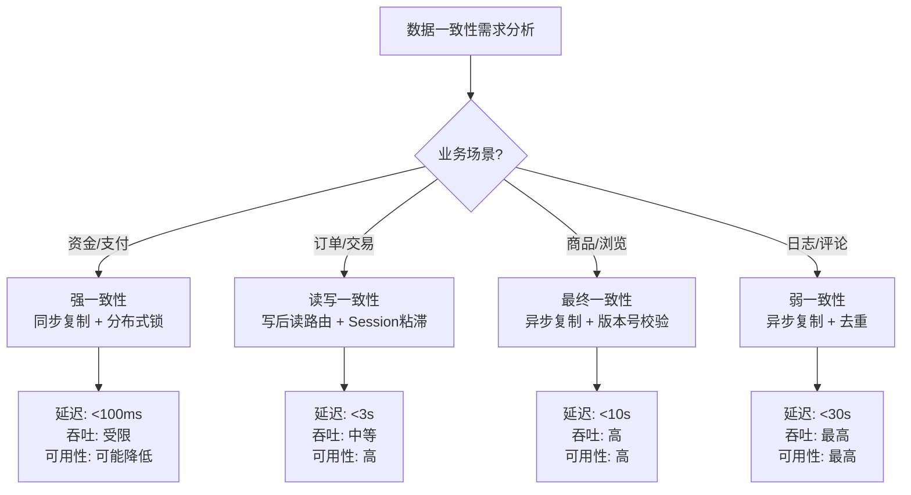

| 业务场景 | 一致性要求 | 推荐策略 | 典型延迟容忍 | 实现复杂度 |
|---------|-----------|---------|------------|-----------|
| 支付/转账 | 强一致 | 同步复制 + 分布式锁 | <100ms | 高 |
| 下单/改价 | 读写一致 | 写后读路由 + Session粘滞 | <3s | 中 |
| 商品浏览 | 最终一致 | 异步复制 + 版本号校验 | <10s | 低 |
| 评论/日志 | 弱一致 | 异步复制 + 去重 | <30s | 最低 |

### 6.2 读写一致性保障

在最终一致性模型下，保证用户读到自己刚写入的数据是常见需求。常用技巧：

**写后读路由**：用户的写入操作完成后，在响应中返回数据的"版本号"或"写入时间"。后续读请求携带版本号，路由层判断本地数据是否满足版本要求，如果不满足则转发到写入发生的单元读取。

```python
class ReadAfterWriteRouter:
    """写后读路由：保证用户能读到自己刚写入的数据"""

    def handle_write(self, user_id: int, data):
        unit = self.router.route_to_unit(user_id)
        version = self.db[unit].write(data)
        return {
            "status": "ok",
            "version": version,
            "unit": unit,
            "read_hint": f"next_read_should_go_to:{unit}"  # 提示后续读路由
        }

    def handle_read(self, user_id: int, read_version: int = None):
        preferred_unit = self.router.route_to_unit(user_id)

        if read_version:
            # 检查本地数据版本是否满足要求
            local_version = self.db[preferred_unit].get_version(user_id)
            if local_version >= read_version:
                return self.db[preferred_unit].read(user_id)
            else:
                # 版本不满足，转发到写入单元
                return self.forward_to_write_unit(user_id)

        # 无版本要求，正常路由
        return self.db[preferred_unit].read(user_id)
```

### 6.3 跨单元事务

当业务操作涉及多个单元的数据时，跨单元事务是巨大挑战。常用解决方案：

**Saga模式**：

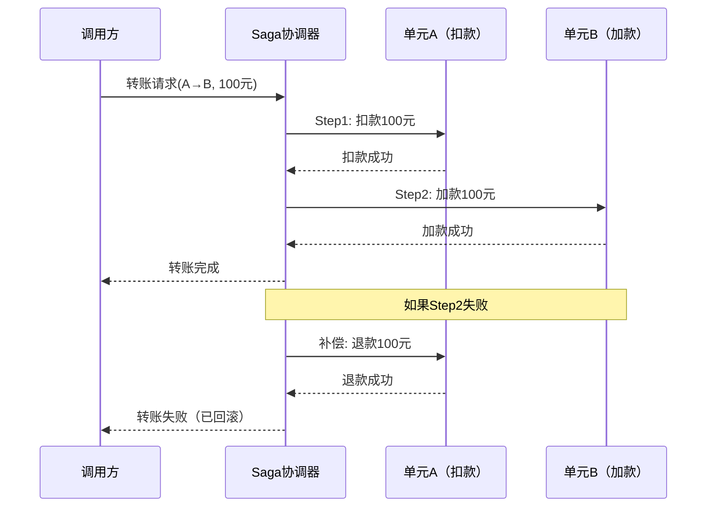

**Saga模式实现代码**：

```python
from enum import Enum
from typing import List, Callable
import logging

class StepStatus(Enum):
    PENDING = "pending"
    COMPLETED = "completed"
    FAILED = "failed"
    COMPENSATED = "compensated"

class SagaStep:
    def __init__(self, name: str, action: Callable, compensation: Callable):
        self.name = name
        self.action = action
        self.compensation = compensation
        self.status = StepStatus.PENDING

class SagaCoordinator:
    """
    Saga事务协调器
    按顺序执行各步骤，失败时反向补偿
    """
    def __init__(self):
        self.steps: List[SagaStep] = []

    def add_step(self, name: str, action: Callable, compensation: Callable):
        self.steps.append(SagaStep(name, action, compensation))

    def execute(self, context: dict) -> bool:
        completed_steps = []

        for step in self.steps:
            try:
                logging.info(f"执行步骤: {step.name}")
                step.action(context)
                step.status = StepStatus.COMPLETED
                completed_steps.append(step)
            except Exception as e:
                logging.error(f"步骤 {step.name} 失败: {e}")
                step.status = StepStatus.FAILED
                # 反向补偿已完成的步骤
                self._compensate(completed_steps[::-1], context)
                return False

        return True

    def _compensate(self, steps: List[SagaStep], context: dict):
        for step in steps:
            try:
                logging.info(f"补偿步骤: {step.name}")
                step.compensation(context)
                step.status = StepStatus.COMPENSATED
            except Exception as e:
                logging.error(f"补偿步骤 {step.name} 失败: {e}")
                # 补偿失败需要人工介入
                self._alert_human_intervention(step, context)

# 使用示例：用户A向用户B转账100元
saga = SagaCoordinator()
saga.add_step(
    name="单元A扣款",
    action=lambda ctx: deduct_from_unit_a(ctx['user_a'], 100),
    compensation=lambda ctx: refund_to_unit_a(ctx['user_a'], 100)
)
saga.add_step(
    name="单元B加款",
    action=lambda ctx: credit_to_unit_b(ctx['user_b'], 100),
    compensation=lambda ctx: deduct_from_unit_b(ctx['user_b'], 100)
)

success = saga.execute({'user_a': 'A001', 'user_b': 'B002'})
```

**TCC（Try-Confirm-Cancel）模式**：

```python
class TCCService:
    """
    TCC分布式事务示例：转账操作
    Try: 预留资源（冻结金额）
    Confirm: 确认扣款（实际扣除冻结金额）
    Cancel: 取消扣款（解冻金额）
    """
    def try_deduct(self, user_id: str, amount: float) -> bool:
        """Try阶段：冻结金额"""
        balance = self.db.get_balance(user_id)
        if balance < amount:
            return False
        # 冻结金额，不实际扣除
        self.db.freeze(user_id, amount)
        return True

    def confirm_deduct(self, user_id: str, amount: float) -> bool:
        """Confirm阶段：确认扣款，扣除冻结金额"""
        self.db.confirm_freeze(user_id, amount)
        return True

    def cancel_deduct(self, user_id: str, amount: float) -> bool:
        """Cancel阶段：取消扣款，解冻金额"""
        self.db.unfreeze(user_id, amount)
        return True

    def try_credit(self, user_id: str, amount: float) -> bool:
        """Try阶段：记录待入账"""
        self.db.record_pending_credit(user_id, amount)
        return True

    def confirm_credit(self, user_id: str, amount: float) -> bool:
        """Confirm阶段：确认入账"""
        self.db.apply_pending_credit(user_id, amount)
        return True

    def cancel_credit(self, user_id: str, amount: float) -> bool:
        """Cancel阶段：取消入账"""
        self.db.cancel_pending_credit(user_id, amount)
        return True
```

### 6.4 跨单元消息顺序

当消息需要跨单元传递时，顺序保证是挑战。常用技巧：

| 技巧 | 原理 | 适用场景 | 注意事项 |
|------|------|---------|---------|
| 单分区有序 | 同一用户的消息路由到同一分区 | 用户维度操作保序 | 分区内有序，跨分区无序 |
| 逻辑时钟 | Lamport时钟/向量时钟确定因果关系 | 需要因果序的场景 | 实现复杂，调试困难 |
| 幂等消费 | 消费端实现幂等，乱序到达也不影响 | 所有跨单元消息 | 需要设计幂等键 |
| 版本号过滤 | 消息携带版本号，消费端过滤过期消息 | 对时效性要求高的场景 | 需要维护版本号 |

***

## 7. 故障场景与切换策略

多活架构的设计目标之一是在各种故障场景下保持业务可用。

### 7.1 故障分类与影响

| 故障类型 | 影响范围 | 切换复杂度 | RTO目标 | RPO目标 |
|---------|---------|-----------|---------|---------|
| 单机房故障 | 整个数据中心不可用 | 中 | <5分钟 | <30秒数据丢失 |
| 网络分区 | 机房间网络中断 | 高 | <10分钟 | 需评估 |
| 部分服务故障 | 某个服务实例不可用 | 低 | <1分钟 | 0 |
| 数据库主库故障 | 写入暂时不可用 | 中 | <30秒 | <1秒数据丢失 |
| 数据不一致 | 业务数据冲突 | 高 | 视情况 | 可能需要人工修复 |

### 7.2 切换策略设计

**分级切换策略**：

| 优先级 | 业务类型 | 切换时机 | 容量要求 |
|--------|---------|---------|---------|
| P0 | 核心交易（下单、支付） | 立即切换 | 需预留50%冗余 |
| P1 | 核心读（商品浏览、搜索） | 5分钟内切换 | 需预留30%冗余 |
| P2 | 辅助功能（评论、推荐） | 30分钟内切换 | 按需切换 |
| P3 | 离线任务（报表、日志） | 延后切换 | 不影响用户体验 |

**灰度切换流程**：

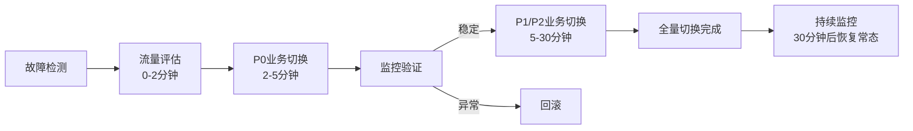

### 7.3 故障检测机制

```python
class HealthChecker:
    """
    多维度健康检查器
    综合技术指标和业务指标判断数据中心健康状态
    """
    def __init__(self, unit_id: str):
        self.unit_id = unit_id
        self.consecutive_failures = 0
        self.failure_threshold = 3  # 连续3次失败才判定故障
        self.cooldown_period = 300  # 切换后5分钟冷却期
        self.last_switch_time = 0

    def check_health(self) -> dict:
        checks = {
            "tcp_connect": self._check_tcp(),
            "http_health": self._check_http(),
            "db_connectivity": self._check_database(),
            "sync_latency": self._check_sync_latency(),
            "business_metrics": self._check_business(),
        }

        # 计算健康分数
        score = sum(1 for v in checks.values() if v["healthy"]) / len(checks)

        if score < 0.6:
            self.consecutive_failures += 1
        else:
            self.consecutive_failures = 0

        return {
            "unit_id": self.unit_id,
            "score": score,
            "checks": checks,
            "is_unhealthy": self.consecutive_failures >= self.failure_threshold,
            "should_switch": (
                self.consecutive_failures >= self.failure_threshold
                and time.time() - self.last_switch_time > self.cooldown_period
            )
        }

    def _check_tcp(self) -> dict:
        """TCP连接检查"""
        try:
            sock = socket.create_connection(("10.0.1.100", 8080), timeout=3)
            sock.close()
            return {"healthy": True, "latency_ms": "< 3ms"}
        except Exception as e:
            return {"healthy": False, "error": str(e)}

    def _check_http(self) -> dict:
        """HTTP健康检查"""
        try:
            resp = requests.get(
                "http://10.0.1.100:8080/health",
                timeout=5
            )
            return {
                "healthy": resp.status_code == 200,
                "latency_ms": resp.elapsed.total_seconds() * 1000
            }
        except Exception as e:
            return {"healthy": False, "error": str(e)}

    def _check_sync_latency(self) -> dict:
        """数据同步延迟检查"""
        delay = self._get_sync_delay()
        return {
            "healthy": delay < 5000,  # 延迟小于5秒为健康
            "delay_ms": delay
        }

    def _check_business(self) -> dict:
        """业务指标检查：交易成功率"""
        success_rate = self._get_transaction_success_rate()
        return {
            "healthy": success_rate > 0.99,  # 成功率大于99%
            "success_rate": success_rate
        }
```

***

## 8. 成本效益分析

实施多活架构需要投入大量资源，必须进行系统的成本效益分析。

### 8.1 成本模型

| 成本维度 | 计算方法 | 3单元多活示例 |
|---------|---------|-------------|
| 硬件 | 单机房成本 × N + 跨地域专线 | 200万×3 + 60万 = 660万 |
| 开发 | 人月数 × 月成本 | 20人×12月×3万 = 720万 |
| 运维 | 年增加的运维人力和工具 | 100万/年 |
| 机会成本 | 改造期间影响新业务开发 | 约200万/年 |

### 8.2 收益量化

| 收益维度 | 量化方法 | 示例 |
|---------|---------|------|
| 可用性提升 | 每增加1个9的SLA对应的业务收入 | 99.9%→99.99%：减少8.76小时/年宕机，按每小时100万收入，年收益约876万 |
| 延迟优化 | 就近访问带来的转化率提升 | 延迟降低100ms，转化率提升1%，年增收500万 |
| 容量扩展 | 多机房分担峰值流量 | 避免单机房扩容的硬件投入200万 |

### 8.3 决策框架

**何时选择同城双活**：
- 日活用户 < 1000万
- 可用性要求 99.9%-99.99%
- 技术团队 < 50人
- 预算有限

**何时选择异地多活**：
- 日活用户 > 5000万
- 可用性要求 99.99%以上
- 技术团队有分布式系统经验
- 3年ROI > 2（累计收益/累计成本 > 2）

**何时选择全球多活**：
- 全球化业务，用户分布在多个大洲
- 各区域用户量 > 100万
- 对延迟敏感（如游戏、实时协作）
- 有全球部署的运维能力

***

# 多活架构核心技巧

## 1. 单元化路由规则设计

单元化路由是多活架构的基石，路由规则的设计直接决定了系统的可用性和可维护性。

### 1.1 路由键选择

路由键（Routing Key）的选择是单元化设计的第一步。理想的路由键应满足：

1. **数据访问局部性好**：同一用户的数据尽量集中在一个单元
2. **分布均匀**：避免热点单元，负载均衡
3. **业务语义清晰**：便于理解和维护
4. **迁移友好**：支持动态调整用户归属

**路由键选择对比**：

| 路由键 | 局部性 | 均匀性 | 语义 | 迁移 | 适用场景 |
|--------|-------|-------|------|------|---------|
| 用户ID | 高 | 好（哈希后） | 清晰 | 支持 | 社交、电商 |
| 手机号 | 高 | 一般（号段不均） | 清晰 | 困难 | 通讯类 |
| 地理位置 | 中 | 一般 | 清晰 | 困难 | LBS、本地生活 |
| 设备ID | 高 | 好 | 一般 | 支持 | IoT、游戏 |

### 1.2 路由表管理

路由表定义了路由键到单元的映射关系，需要支持动态调整。

```yaml
# 路由表配置示例（存储在Nacos配置中心）
routing_table:
  version: 42
  updated_at: "2024-01-15T10:30:00Z"
  rules:
    # 规则1：按用户ID哈希
    - type: "hash"
      key: "user_id"
      modulus: 3
      mapping:
        0: "unit-a-beijing"
        1: "unit-b-shanghai"
        2: "unit-c-guangzhou"

    # 规则2：特定用户强制路由（用于故障迁移）
    - type: "explicit"
      users: ["user_001", "user_002"]
      target: "unit-b-shanghai"

    # 规则3：全量数据不路由，所有单元均可访问
    - type: "broadcast"
      tables: ["product", "config"]

  # 路由表更新策略
  update_strategy:
    method: "push"  # push: 配置中心推送; pull: 客户端定期拉取
    push_interval: "10s"  # 推送间隔
    pull_interval: "30s"  # 拉取间隔（兜底）
    consistency: "eventual"  # 允许短暂不一致
```

### 1.3 例外数据处理

某些数据无法按照常规规则进行单元划分，需要特殊处理：

| 数据类型 | 处理策略 | 同步方式 | 一致性要求 |
|---------|---------|---------|-----------|
| 商品目录 | 全量同步 | 异步全量复制 | 最终一致 |
| 系统配置 | 全量同步 | 配置中心推送 | 最终一致 |
| 全局自增ID | 中心化处理 | 中心单元生成 | 强一致 |
| 支付渠道 | 中心化处理 | 中心单元管理 | 强一致 |
| 用户关系 | 混合策略 | 好友关系全量同步 | 最终一致 |

***

## 2. 数据分片与同步技巧

### 2.1 双写避免

多活架构中最常见的数据同步陷阱是"双写"——同一数据在两个单元同时被写入。

**核心原则**：每个数据分片只有一个"写入源"（Write Source）。用户的写入请求只被发送到其归属单元。如果用户请求被路由到非归属单元，应用层应将写入请求转发到归属单元执行。

```python
class WriteForwardingMiddleware:
    """写入转发中间件：防止双写"""

    def process_write(self, request, user_id: int):
        current_unit = self.get_current_unit()  # 当前请求所在的单元
        home_unit = self.router.route_to_unit(user_id)  # 用户的归属单元

        if current_unit == home_unit:
            # 在归属单元内，直接写入
            return self.db.write(request.data)
        else:
            # 不在归属单元，转发到归属单元
            return self.forward_to_unit(home_unit, request)
```

### 2.2 增量同步优化

| 优化技巧 | 原理 | 效果 | 实现方式 |
|---------|------|------|---------|
| 批量合并 | 多条变更合并为一个批次 | 减少网络往返，吞吐提升3-5倍 | Canal batchSize参数 |
| 并行同步 | 按分片/表级别并行 | 充分利用带宽 | 多线程/多消费者 |
| 压缩传输 | gzip/lz4压缩同步数据 | 减少带宽消耗50-80% | 同步组件压缩配置 |
| 选择性同步 | 过滤不需要的数据 | 减少同步数据量 | DTS表/字段过滤 |
| 增量合并 | 同一行多次变更合并 | 减少目标端写入次数 | 同步组件合并逻辑 |

### 2.3 数据校验与修复

```bash
#!/bin/bash
# data_verify.sh - 主从数据校验脚本
# 使用pt-table-checksum进行全量校验

MASTER_HOST="10.0.1.100"
SLAVE_HOST="10.0.2.100"
DATABASE="mydb"

echo "=== 开始数据校验 ==="
pt-table-checksum \
    --host=$MASTER_HOST \
    --user=checksum_user \
    --password=xxx \
    --databases=$DATABASE \
    --tables=orders,users,products \
    --chunk-size=10000 \
    --method=CHECKSUM \
    2>&amp;1 | tee /var/log/checksum_$(date +%Y%m%d).log

echo "=== 校验不一致的表 ==="
pt-table-sync \
    --execute \
    --sync-to-master \
    --host=$SLAVE_HOST \
    --user=sync_user \
    --password=xxx \
    h=$MASTER_HOST,D=$DATABASE,t=orders

echo "=== 校验完成 ==="
```

***

## 3. 流量调度技巧

### 3.1 灰度切换机制

**按比例切换**：先切换1%的流量，观察系统状态，逐步增加比例（1%→5%→20%→50%→100%）。每一步都监控关键指标。

**按用户分组切换**：内部测试用户→普通用户→VIP用户。VIP用户最后切换，确保系统稳定性充分验证。

**按地域切换**：边缘区域→核心区域。边缘区域用户量少，风险低，作为"试验田"。

### 3.2 故障检测与自动切换

**三层检测体系**：

| 检测层级 | 检测方式 | 检测周期 | 判定条件 | 适用场景 |
|---------|---------|---------|---------|---------|
| 基础设施层 | TCP/ICMP探测 | 3-5秒 | 连续3次失败 | 网络/服务不可达 |
| 应用层 | HTTP健康检查 | 5-10秒 | 状态码≠200 | 服务异常 |
| 业务层 | 业务指标监控 | 30-60秒 | 成功率<99% | 业务逻辑故障 |

**自动切换状态机**：

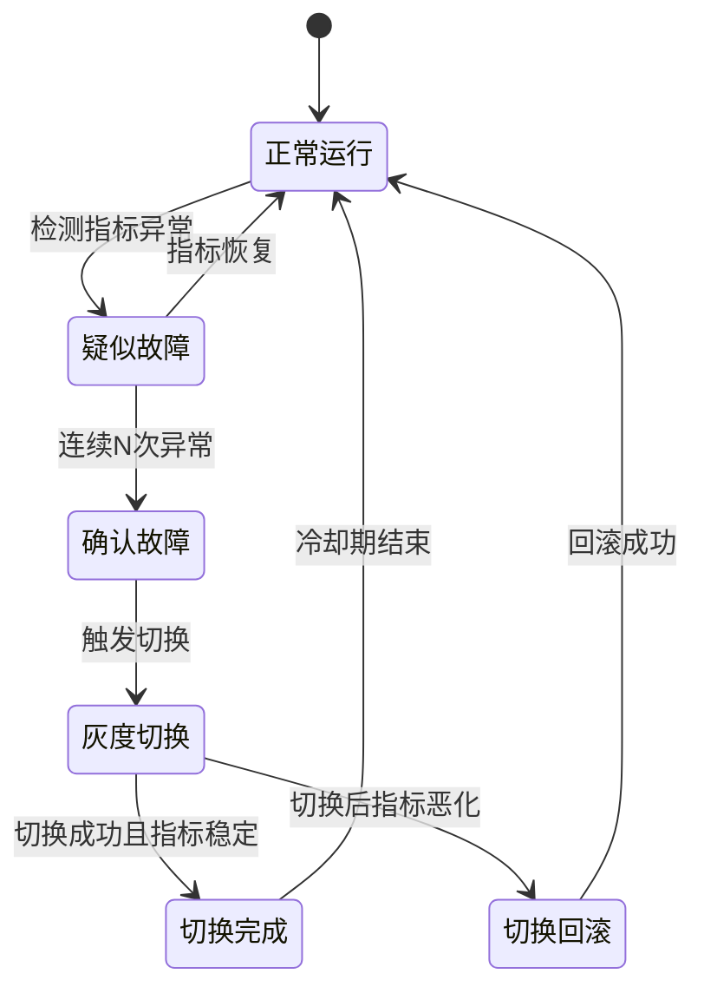

***

## 4. 跨机房数据一致性技巧

### 4.1 Session一致性保障

```python
class ConsistencyGateway:
    """一致性网关：在应用层保障读写一致性"""

    def __init__(self):
        self.write_window = 10  # 写后读窗口：10秒

    def handle_read(self, request):
        user_id = request.user_id
        write_timestamp = request.headers.get('X-Write-Timestamp')

        if write_timestamp:
            age = time.time() - float(write_timestamp)
            if age < self.write_window:
                # 在写后读窗口内，强制路由到写入单元
                write_unit = request.headers.get('X-Write-Unit')
                return self.read_from_unit(user_id, write_unit)

        # 正常路由
        unit = self.router.route_to_unit(user_id)
        return self.read_from_unit(user_id, unit)
```

### 4.2 幂等消费设计

```python
class IdempotentConsumer:
    """幂等消息消费者：防止跨单元消息重复处理"""

    def __init__(self, redis_client):
        self.redis = redis_client
        self.idempotency_ttl = 3600  # 幂等键过期时间：1小时

    def consume(self, message):
        idempotency_key = f"idempotent:{message.message_id}"

        # 检查是否已处理
        if self.redis.exists(idempotency_key):
            logging.info(f"消息 {message.message_id} 已处理，跳过")
            return True

        try:
            # 执行业务逻辑
            self.process_message(message)

            # 标记为已处理（带过期时间）
            self.redis.setex(idempotency_key, self.idempotency_ttl, "1")
            return True
        except Exception as e:
            logging.error(f"处理消息失败: {e}")
            return False
```

***

## 5. 监控与运维技巧

### 5.1 多维度监控体系

```yaml
# Prometheus监控规则示例
groups:
  - name: multi_active_alerts
    rules:
      # 数据同步延迟告警
      - alert: SyncDelayHigh
        expr: mysql_slave_status_seconds_behind_master > 5
        for: 1m
        labels:
          severity: warning
        annotations:
          summary: "数据同步延迟超过5秒"

      - alert: SyncDelayCritical
        expr: mysql_slave_status_seconds_behind_master > 30
        for: 30s
        labels:
          severity: critical
        annotations:
          summary: "数据同步延迟超过30秒，需要立即处理"

      # 流量分布异常告警
      - alert: TrafficImbalance
        expr: |
          abs(
            (rate(http_requests_total{unit="unit-a"}[5m]) /
             rate(http_requests_total[5m])) - 0.33
          ) > 0.1
        for: 5m
        labels:
          severity: warning
        annotations:
          summary: "单元A流量占比偏离预期超过10%"

      # 跨单元调用比例告警
      - alert: CrossUnitCallHigh
        expr: cross_unit_call_ratio > 0.1
        for: 5m
        labels:
          severity: warning
        annotations:
          summary: "跨单元调用比例超过10%，需要优化路由规则"
```

### 5.2 故障演练机制

| 演练类型 | 频率 | 范围 | 目的 | 工具 |
|---------|------|------|------|------|
| 组件级故障注入 | 每周 | 单个组件 | 验证组件级容错 | ChaosBlade、Chaos Mesh |
| 单元级故障模拟 | 每月 | 整个单元 | 验证流量切换 | 自定义脚本 |
| 机房级故障模拟 | 每季度 | 整个数据中心 | 验证异地切换 | 混沌工程平台 |
| 全链路压测 | 每季度 | 全系统 | 验证峰值承载 | JMeter、Locust |

### 5.3 容量规划

**容量计算公式**：

正常运行容量 = 设计流量 × 1.2（20%冗余）
故障切换容量 = 设计流量 × N/(N-1)（N个单元中允许1个故障）

**示例**：
- 3个单元，总流量30000 QPS，每单元设计10000 QPS
- 正常运行：每单元需 10000 × 1.2 = 12000 QPS 容量
- 故障切换（1个单元故障）：剩余2个单元各需承接 30000/2 = 15000 QPS
- 冗余系数：15000/12000 = 1.25，即每单元需预留25%额外容量

***

# 多活架构实战案例

## 案例一：阿里巴巴双十一多活实践

### 背景

阿里巴巴的电商业务在双十一期间面临极端流量峰值，2019年双十一交易峰值达到每秒54.4万笔。从2013年开始，阿里巴巴启动了"三地五中心"的多活架构改造。

### 架构设计

阿里巴巴的多活架构以"单元化"为核心，整个系统被划分为多个"单元"，每个单元是完整的业务闭环。采用"冷热数据分离"策略：

- **用户维度数据**（订单、购物车）：按用户ID分片到不同单元
- **商品维度数据**（商品详情、库存）：在所有单元中全量复制
- **全局数据**（营销规则、支付渠道）：集中在"中心单元"

数据同步使用自研DTS服务，通过解析MySQL binlog将数据变更实时同步到其他单元，同步延迟1-3秒。

### 关键数据

| 指标 | 改造前 | 改造后 |
|------|-------|-------|
| 单机房峰值压力 | 100% | 降低60%以上 |
| 故障切换时间 | 小时级 | 分钟级 |
| 年可用性 | 99.9% | 99.99% |
| 双十一峰值TPS | 未公开 | 54.4万笔/秒 |

### 技术亮点

1. **全链路压测**：双十一前进行多轮全链路压测，模拟极端流量场景
2. **流量调度三层架构**：DNS/GSLB（地域级）→ 接入网关（用户级）→ 服务层（业务级）
3. **单元化部署**：核心交易单元3-4个，每个单元独立完整
4. **智能限流**：基于单元容量的动态限流，防止单元过载

***

## 案例二：饿了么异地多活改造

### 背景

饿了么业务覆盖全国数百个城市，2018年启动异地多活改造，目标是"同城双活、异地灾备"。

### 特殊挑战

1. **实时性要求极高**：订单状态、骑手位置、配送时间需要实时更新
2. **地理位置强相关**：用户、商家、骑手通常在同一城市
3. **多方交互复杂**：一个订单涉及用户、商家、骑手、平台四方

### 解决方案

饿了么按城市维度进行单元划分，同一城市的用户、商家、骑手数据集中在一个单元中。通过"就近接入+单元内闭环"策略，确保核心业务链路延迟最小化。

### 实施过程

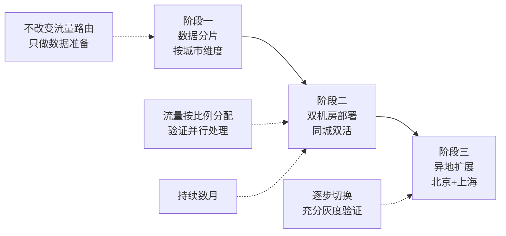

### 效果

改造完成后，核心交易系统在北京和上海两个机房同时提供服务。单机房故障时，流量切换时间从小时级降低到分钟级，用户体验影响大幅减小。

***

## 案例三：携程多数据中心架构

### 背景

携程业务涵盖酒店、机票、火车票、旅游度假等领域，需要在多个地域部署数据中心，提供低延迟服务。

### 架构设计

携程采用"区域化部署+全局化调度"模式：

- **区域数据层**：酒店库存、航班信息等区域相关数据，只在本区域同步
- **全局数据层**：用户账号、会员积分等全球访问数据，采用"主写多读"模式

### 关键技术

1. **智能路由**：基于地理位置、网络环境、业务类型动态选择最优数据中心
2. **数据一致性网关**：自动从其他区域获取最新数据，确保用户看到的信息最新
3. **故障自愈**：自动切换流量并评估数据同步延迟

### 效果

| 指标 | 改造前 | 改造后 | 改善幅度 |
|------|-------|-------|---------|
| 中国用户平均响应时间 | 基准 | -40% | 40%降低 |
| 海外用户响应时间 | 基准 | -60% | 60%降低 |
| 系统整体可用性 | 99.9% | 99.95% | 0.05%提升 |

***

# 多活架构常见误区

## 误区一：多活等于完全对等

**误区表现**：认为所有数据中心应该是完全对等的——相同的服务、相同的数据、相同的流量。

**为什么是误区**：现实中的多活架构通常是"非对称多活"。全局性服务（支付、风控）天然中心化，不同机房条件差异大，渐进式改造必然导致过渡期非对称。

**纠正方法**：采用"核心对称、外围非对称"策略。核心交易链路尽量单元化对称，全局性服务接受非对称部署。

| 判断维度 | 适合对称多活 | 适合非对称多活 |
|---------|------------|--------------|
| 业务类型 | 用户维度数据为主 | 混合业务，有全局性服务 |
| 机房条件 | 各机房硬件、网络接近 | 机房条件差异较大 |
| 团队能力 | 成熟分布式系统经验 | 正在从单机房演进 |
| 可用性要求 | 99.99%以上，预算充足 | 99.9%-99.99%，预算有限 |

***

## 误区二：多活可以解决所有可用性问题

**误区表现**："上了多活架构，可用性问题就一劳永逸了。"

**为什么是误区**：多活只解决基础设施层面的可用性。应用Bug、数据不一致、新增复杂性带来的故障，多活架构都无法避免。更危险的是，同一份代码部署在多个数据中心，一个Bug会同时在所有单元爆发。

**可用性公式**：可用性 = 基础设施冗余 × 应用容错能力 × 运维响应速度。多活只覆盖第一个维度。

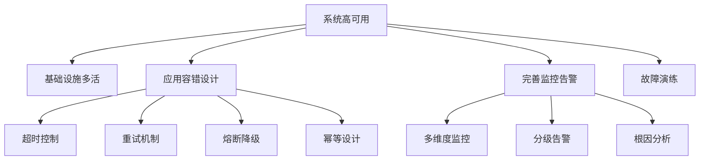

***

## 误区三：数据同步延迟可以忽略不计

**误区表现**："同步延迟只有几秒，对业务没影响。"

**为什么是误区**：异地多活场景下同步延迟通常在秒级。用户在单元A下单后切换到单元B查看，数据未同步会导致"订单丢失"体验问题。移动端网络切换尤为常见。

**真实案例**：某电商平台异地多活改造后，用户在上海机房下单后网络波动切换到北京机房，订单数据尚未同步（约3秒），用户看到"订单不存在"后重复下单，导致重复扣款。上线第一周发生超过200次。

**纠正方法**：
1. 写后读路由：写入后10秒内强制路由到写入单元
2. Session粘滞：同一Session内请求固定路由到同一单元
3. 同步复制用于关键路径：支付、转账等高一致性要求操作

***

## 误区四：单元化拆分越细越好

**误区表现**：追求极致拆分粒度，认为粒度越细隔离性越好。

**为什么是误区**：N个单元之间的数据同步链路数为O(N²)。1000个单元意味着约50万条同步链路，管理成本不可接受。每个单元都需要独立基础设施，过多单元导致资源浪费。

**合理单元数量**：

| 业务规模 | 日活用户 | 推荐单元数 |
|---------|---------|-----------|
| 中小型 | <100万 | 2（同城双活即可） |
| 大型 | 100万-5000万 | 3（按地域或ID哈希） |
| 超大型 | >5000万 | 3-5（按地域+业务线） |

判断标准：**如果无法清楚说出每个单元的职责和边界，说明单元拆分有问题。**

***

## 误区五：多活改造可以一步到位

**误区表现**：试图一次性完成从单机房到异地多活的全部改造，追求"大而全"一步到位。

**为什么是误区**：多活改造涉及数据分片、流量路由、数据同步、会话管理、监控体系等多个维度的变更，每个维度都有独立的技术风险。一次性全面改造意味着风险叠加——任何一个维度出问题都可能导致全系统故障。同时，团队对多活架构的理解和运维能力需要渐进式培养，一步到位超越团队能力边界，失败概率极高。

**纠正方法**：采用"四阶段渐进式"改造路线，每个阶段有明确目标和验收标准，当前阶段稳定运行3个月以上才进入下一阶段：

| 阶段 | 周期 | 目标 | 验收标准 | 风险等级 |
|------|------|------|---------|---------|
| 阶段一：数据分片 | 2-3个月 | 按路由键将数据划分到不同逻辑单元 | 路由准确率>99.9%，数据无丢失 | 低 |
| 阶段二：同城双活 | 3-6个月 | 两个机房同时提供读写服务 | 故障切换<5分钟，数据延迟<1秒 | 中 |
| 阶段三：异地多活 | 6-12个月 | 三个以上地域单元独立运行 | 异地切换<10分钟，同步延迟<5秒 | 高 |
| 阶段四：全球多活 | 12-18个月 | 全球多地域部署，就近访问 | 各区域独立容灾，全球流量调度 | 极高 |


**每阶段退出检查清单**：
- [ ] 监控体系覆盖所有新增组件
- [ ] 故障演练至少完成3轮且恢复时间达标
- [ ] 运维手册更新并完成团队培训
- [ ] 压测验证容量满足N+1冗余要求
- [ ] 回滚方案经过实际验证

## 误区六：多活架构只关注技术实现

**误区表现**：认为多活架构改造纯技术问题，只关注架构设计和代码实现，忽视流程、组织和人员配套。

**为什么是误区**：多活架构涉及多个团队（数据、平台、业务、运维）的协作，故障切换需要明确的决策链和通知机制，变更审批需要跨部门协调。缺乏组织配套会导致：切换时互相推诿、变更无序引发事故、故障响应慢于技术切换速度。

**纠正方法**：技术方案与组织配套同步推进，建立三个配套体系：

**1. 故障切换流程（Runbook）**：

```yaml
runbook:
  name: "机房故障切换"
  decision_chain:
    - role: "值班SRE"
      action: "确认故障"
      timeout: "2分钟"
      escalation: "SRE负责人"
    - role: "SRE负责人"
      action: "批准切换"
      timeout: "5分钟"
      escalation: "技术总监"
  notification:
    - channel: "企微/飞书告警群"
      on: "故障确认"
    - channel: "电话通知"
      on: "切换执行"
    - channel: "邮件通报"
      on: "切换完成"
  post_action:
    - "切换后15分钟内完成数据一致性检查"
    - "24小时内输出故障报告"
    - "48小时内完成复盘会议"
```

**2. 跨团队协作矩阵**：

| 角色 | 职责 | 响应时间 | 联系方式 |
|------|------|---------|---------|
| 值班SRE | 故障检测、初步诊断、触发切换 | 5分钟 | 电话+IM |
| 数据DBA | 数据同步状态确认、主从切换 | 10分钟 | 电话+IM |
| 平台开发 | 流量调度配置、路由规则调整 | 15分钟 | IM |
| 业务负责人 | 业务影响评估、降级策略决策 | 20分钟 | 电话 |
| 运维负责人 | 整体协调、对外沟通 | 即时 | 电话 |

**3. 变更审批流程**：
- 路由规则变更：需DBA+平台TL双人审批
- 同步策略变更：需DBA+架构师评审
+- 全量切换操作：需技术总监审批+值班SRE执行

## 误区七：过度依赖DNS切换

**误区表现**：将DNS切换作为唯一的流量调度手段，认为改个DNS就能完成机房切换。

**为什么是误区**：DNS切换存在四个致命缺陷：
- **TTL收敛慢**：即使TTL设为60秒，全球DNS缓存完全收敛需要5-10分钟，期间部分用户仍访问故障机房
- **调度粒度粗**：DNS只能按地域/运营商调度，无法精确到用户级别
- **DNS本身不可靠**：DNS服务可能遭受DDoS攻击或配置错误，成为新的单点
- **无法局部切换**：DNS切换只能整体迁移整个地域的流量，无法只切换部分业务

**真实案例**：某电商在故障切换时仅依赖DNS变更，由于运营商DNS缓存未及时刷新，30%的用户在切换后15分钟内仍持续访问故障机房，投诉量激增。

**纠正方法**：采用三层分级调度架构，DNS仅作为第一层兜底：

```mermaid
graph TB
    subgraph 第一层：DNS/GSLB（分钟级兜底）
        D1[DNS解析] -->|地域级| D2[GSLB健康检查]
        D2 -->|故障切换| D3[返回新IP]
    end

    subgraph 第二层：负载均衡器（秒级主动）
        L1[四层LB] -->|实例级| L2[七层LB]
        L2 -->|健康检查3秒| L3[主动摘除故障后端]
    end

    subgraph 第三层：应用层路由（毫秒级精细）
        A1[接入网关] -->|用户级| A2[路由规则引擎]
        A2 -->|实时决策| A3[转发到目标单元]
    end

    D3 -.->|兜底| L1
    L3 -.->|兜底| A1
```

**各层职责与切换速度对比**：

| 调度层 | 切换速度 | 调度粒度 | 切换范围 | 适用场景 |
|--------|---------|---------|---------|---------|
| 第三层：应用路由 | 毫秒级 | 用户级 | 单个请求 | 首选，主动切换 |
| 第二层：负载均衡 | 秒级 | 实例级 | 单个后端 | 应用层故障时兜底 |
| 第一层：DNS/GSLB | 分钟级 | 地域级 | 整个地域 | 前两层都不可用时兜底 |

## 误区八：忽视全局数据的处理

**误区表现**：将所有数据都按用户维度进行分片，忽略商品、配置、促销等全局性数据的特殊处理需求。

**为什么是误区**：全局数据有三个特点与用户维度数据截然不同：（1）写入频率低但读取频率极高（如商品详情被所有用户访问）；（2）一致性要求高（促销规则错误会影响所有用户）；（3）数据量大（百万级商品全量同步的带宽成本）。简单地全量同步或按用户分片都会导致问题。

**纠正方法**：建立三级数据分层模型，不同类型的数据采用不同的同步策略：

| 数据层级 | 典型数据 | 分片策略 | 同步方式 | 一致性要求 | 同步延迟容忍 |
|---------|---------|---------|---------|-----------|------------|
| 用户维度 | 订单、购物车、收藏 | 按用户ID分片 | Binlog增量同步 | 最终一致 | <5秒 |
| 商品维度 | 商品详情、库存、价格 | 全量复制到所有单元 | 异步全量+增量 | 最终一致 | <30秒 |
| 全局维度 | 支付渠道、营销规则、系统配置 | 中心化存储+只读副本 | 配置中心推送 | 强一致（写入时）| <1秒 |

**全局数据同步架构**：

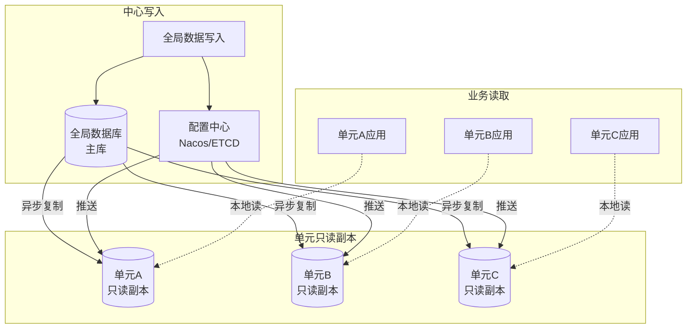

**关键设计原则**：全局数据只允许在中心单元写入，所有单元通过只读副本读取。这避免了全局数据的双写冲突，同时保证所有单元看到一致的全局视图。

## 误区九：故障切换"一刀切"

**误区表现**：机房故障时所有业务同时切换，不分优先级，追求"一次性全部切过去"。

**为什么是误区**：所有业务同时切换会导致：（1）切换瞬间目标机房流量暴增，可能引发二次故障；（2）无法验证切换效果，出问题时影响面最大化；（3）低优先级业务（如报表生成）的切换可能占用核心业务的资源和运维注意力。

**纠正方法**：采用"分级切换+灰度验证"策略，按业务重要性分批切换：

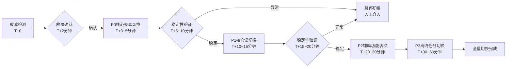

**每步切换的验证指标**：

| 切换步骤 | 关键指标 | 达标阈值 | 不达标处理 |
|---------|---------|---------|-----------|
| P0切换 | 交易成功率 | >99.9% | 立即回滚，人工介入 |
| P1切换 | 页面加载P99延迟 | <2秒 | 暂停，排查后重试 |
| P2切换 | 服务错误率 | <0.1% | 暂停，确认无影响后继续 |
| P3切换 | 任务完成率 | >95% | 允许延后，不紧急 |

## 误区十：忽视成本评估

**误区表现**：只看到多活架构带来的可用性提升，忽视其高昂的建设成本和持续运维成本。

**为什么是误区**：多活架构的成本是"冰山型"——可见的硬件成本只是水面上的部分，水面下是巨大的开发改造成本、运维人力成本和机会成本。很多团队在改造进行到一半时才发现预算不足，被迫半途而废或降低质量标准，反而造成更大损失。

**纠正方法**：进行全面TCO（Total Cost of Ownership）分析，使用以下公式计算3年ROI：

3年ROI = (3年累计收益 - 3年累计成本) / 3年累计成本

当 ROI > 2 时，多活改造值得投入
当 ROI 在 1-2 之间，需要评估战略价值
当 ROI < 1 时，不建议实施

**3年TCO明细计算**：

| 成本项 | 计算方式 | 3单元示例（3年） |
|--------|---------|----------------|
| 硬件成本 | 单机房成本×N + 跨地域专线 | (200万×3) + 60万×3 = 780万 |
| 开发成本 | 人月数×月成本（含改造+新功能损失） | 20人×12月×3万×2 = 1440万 |
| 运维成本 | 年增运维人力+监控工具+演练成本 | 150万×3 = 450万 |
| 专线成本 | 机房间专线年租 | 60万×3 = 180万 |
| 培训成本 | 团队培训+外部专家咨询 | 50万 |
| **合计** | | **2900万** |

**收益量化计算**：

| 收益项 | 量化方法 | 3年累计 |
|--------|---------|--------|
| 可用性提升 | 每小时宕机损失×减少的宕机时间 | 100万/h × 8h/年 × 3年 = 2400万 |
| 延迟优化 | 转化率提升×客单价×用户量 | 500万/年 × 3年 = 1500万 |
| 容量扩展 | 避免单机房扩容的硬件投入 | 400万 |
| 品牌声誉 | 减少用户流失（难以精确量化） | 约500万 |
| **合计** | | **4800万** |

**ROI = (4800 - 2900) / 2900 = 0.66，即3年ROI约1.66**

> 当ROI < 2时，需要综合考虑战略价值：是否为监管合规要求、竞品已实现多活、用户增长预期等因素。纯粹从财务角度看，中小规模业务（DAU < 500万）的多活ROI通常不足2。

**不同规模业务的成本对比**：

| 业务规模 | DAU | 推荐方案 | 3年TCO | 3年收益预估 | ROI |
|---------|-----|---------|--------|-----------|-----|
| 小型 | <100万 | 同城双活 | 500万 | 600万 | 1.2 |
| 中型 | 100-1000万 | 异地双活 | 1500万 | 2500万 | 1.67 |
| 大型 | 1000-5000万 | 异地三活 | 3000万 | 4800万 | 1.6 |
| 超大型 | >5000万 | 异地多活(3-5) | 5000万+ | 10000万+ | >2.0 |

### 误区速查表

| 序号 | 误区 | 正确做法 | 风险等级 |
|------|------|---------|---------|
| 1 | 多活等于完全对等 | 核心对称+外围非对称 | 中 |
| 2 | 多活解决所有可用性问题 | 多活+应用容错+监控+演练 | 高 |
| 3 | 数据同步延迟可忽略 | 写后读路由+Session粘滞 | 高 |
| 4 | 单元拆分越细越好 | 合理2-5个单元 | 中 |
| 5 | 多活改造一步到位 | 分阶段渐进实施 | 中 |
| 6 | 只关注技术实现 | 技术+流程+组织配套 | 中 |
| 7 | 过度依赖DNS切换 | 分层调度架构 | 中 |
| 8 | 忽视全局数据 | 数据分层模型 | 高 |
| 9 | 故障切换一刀切 | 分级切换+灰度验证 | 高 |
| 10 | 忽视成本评估 | 全面TCO分析+ROI评估 | 中 |

***

# 多活架构练习方法

## 阶段一：单机房模拟多活（1-2周）

### 练习1：单元化服务拆分

**目标**：在一个机房内创建多个"逻辑单元"模拟多活架构。

**环境准备**：

```bash
# 使用Docker Compose搭建3个MySQL实例
mkdir -p ~/multi-active-lab &amp;&amp; cd ~/multi-active-lab

cat > docker-compose.yml << 'EOF'
version: '3.8'
services:
  mysql-a:
    image: mysql:8.0
    container_name: mysql-unit-a
    ports:
      - "3307:3306"
    environment:
      MYSQL_ROOT_PASSWORD: root123
      MYSQL_DATABASE: mydb
    volumes:
      - ./init.sql:/docker-entrypoint-initdb.d/init.sql

  mysql-b:
    image: mysql:8.0
    container_name: mysql-unit-b
    ports:
      - "3308:3306"
    environment:
      MYSQL_ROOT_PASSWORD: root123
      MYSQL_DATABASE: mydb

  mysql-c:
    image: mysql:8.0
    container_name: mysql-unit-c
    ports:
      - "3309:3306"
    environment:
      MYSQL_ROOT_PASSWORD: root123
      MYSQL_DATABASE: mydb

  app:
    build: .
    ports:
      - "8080:8080"
    depends_on:
      - mysql-a
      - mysql-b
      - mysql-c
EOF

# 初始化SQL
cat > init.sql << 'EOF'
CREATE TABLE users (
    id BIGINT PRIMARY KEY,
    name VARCHAR(100),
    email VARCHAR(200),
    unit_id VARCHAR(20)
);

CREATE TABLE orders (
    id BIGINT PRIMARY KEY,
    user_id BIGINT,
    amount DECIMAL(10,2),
    status VARCHAR(20),
    created_at TIMESTAMP DEFAULT CURRENT_TIMESTAMP,
    INDEX idx_user_id (user_id)
);
EOF

docker-compose up -d
```

**实现路由逻辑**：

```python
# router.py - 单元化路由
import mysql.connector

UNIT_CONFIGS = {
    'unit-a': {'host': 'localhost', 'port': 3307, 'db': 'mydb'},
    'unit-b': {'host': 'localhost', 'port': 3308, 'db': 'mydb'},
    'unit-c': {'host': 'localhost', 'port': 3309, 'db': 'mydb'},
}

def get_unit(user_id: int) -> str:
    """根据用户ID路由到对应单元"""
    units = ['unit-a', 'unit-b', 'unit-c']
    return units[user_id % len(units)]

def get_connection(user_id: int):
    """获取用户归属单元的数据库连接"""
    unit = get_unit(user_id)
    config = UNIT_CONFIGS[unit]
    return mysql.connector.connect(
        host=config['host'],
        port=config['port'],
        database=config['db'],
        user='root',
        password='root123'
    )

# 验证：用户的读写操作只在其归属单元中执行
def test_routing():
    for user_id in range(10):
        unit = get_unit(user_id)
        conn = get_connection(user_id)
        cursor = conn.cursor()
        cursor.execute(
            "INSERT INTO users (id, name, email, unit_id) VALUES (%s, %s, %s, %s)",
            (user_id, f"user_{user_id}", f"user_{user_id}@test.com", unit)
        )
        conn.commit()
        print(f"User {user_id} -> {unit}")
    print("路由验证完成！")
```

### 练习2：数据同步实践

**使用Canal监听binlog**：

```bash
# 1. 下载Canal
wget https://github.com/alibaba/canal/releases/download/canal-1.1.7/canal.deployer-1.1.7.tar.gz
tar -xzf canal.deployer-1.1.7.tar.gz

# 2. 配置Canal（canal/conf/example/instance.properties）
cat > canal/conf/example/instance.properties << 'EOF'
canal.instance.master.address=127.0.0.1:3307
canal.instance.dbUsername=canal
canal.instance.dbPassword=canal
canal.instance.filter.regex=mydb\\..*
EOF

# 3. 启动Canal
sh bin/startup.sh

# 4. 编写同步消费者
cat > sync_consumer.py << 'PYEOF'
from canal.client import CanalConnector
import json

connector = CanalConnector(host='127.0.0.1', port=11111)
connector.connect()
connector.subscribe('mydb.*')

while True:
    message = connector.get_without_acking(100)
    if message and message.entries:
        for entry in message.entries:
            if entry.entry_type == 1:  # ROWDATA
                data = json.loads(entry.store_value)
                print(f"同步数据: {data}")
                # 将变更应用到目标单元
                apply_to_target_unit(data)
    connector.ack(batch_id)
PYEOF

python3 sync_consumer.py
```

**观察关键指标**：
- 同步延迟随负载的变化趋势
- 大事务对同步延迟的影响
- 同步中断后的恢复行为

***

## 阶段二：同城双机房多活（2-3周）

### 练习3：同城双机房部署

```bash
# 使用两台虚拟机模拟双机房
# 机房A (10.0.1.0/24)
# 机房B (10.0.2.0/24)

# 在机房A部署MySQL主库
mysql -e "CHANGE MASTER TO MASTER_HOST='10.0.2.100', MASTER_USER='repl', MASTER_PASSWORD='repl123', MASTER_AUTO_POSITION=1;"

# 在机房B部署MySQL从库
mysql -e "CHANGE MASTER TO MASTER_HOST='10.0.1.100', MASTER_USER='repl', MASTER_PASSWORD='repl123', MASTER_AUTO_POSITION=1;"

# 配置半同步复制
mysql -e "SET GLOBAL rpl_semi_sync_master_enabled=1; SET GLOBAL rpl_semi_sync_master_timeout=1000;"

# 验证复制状态
mysql -e "SHOW SLAVE STATUS\G" | grep -E "Slave_IO_Running|Slave_SQL_Running|Seconds_Behind_Master"
```

### 练习4：故障切换演练

```bash
#!/bin/bash
# fault_injection.sh - 故障注入脚本

echo "=== 模拟机房A故障 ==="
# 停止机房A的所有服务
docker stop mysql-unit-a
docker stop app-unit-a

echo "=== 等待故障检测 ==="
sleep 15  # 等待健康检查发现故障

echo "=== 验证流量切换 ==="
# 检查机房B是否接管了所有流量
curl -s http://localhost:8080/health | jq '.active_units'

echo "=== 检查数据一致性 ==="
mysql -h 10.0.2.100 -e "SELECT COUNT(*) FROM users; SELECT COUNT(*) FROM orders;"

echo "=== 恢复机房A ==="
docker start mysql-unit-a
docker start app-unit-a

echo "=== 等待数据同步恢复 ==="
sleep 30

echo "=== 验证双机房恢复正常 ==="
mysql -h 10.0.1.100 -e "SHOW SLAVE STATUS\G" | grep Seconds_Behind_Master
mysql -h 10.0.2.100 -e "SHOW SLAVE STATUS\G" | grep Seconds_Behind_Master
```

**关键观察点**：
- 切换过程中用户的体验影响
- 切换完成时间
- 数据同步恢复时间
- 部分故障（仅数据库故障，应用正常）时的降级行为

***

## 阶段三：异地多活模拟（3-4周）

### 练习5：跨区域数据同步

```bash
# 在两个不同云区域部署（如阿里云华北和华东）
# 对比同城同步和异地同步的延迟差异

# 监控同步延迟
watch -n 1 'mysql -h master-host -e "SHOW MASTER STATUS" | awk "NR==2{print \$2}" > /tmp/master_pos.txt; \
mysql -h slave-host -e "SHOW SLAVE STATUS" | awk "{print \$33}" > /tmp/slave_pos.txt; \
echo "Master: $(cat /tmp/master_pos.txt) Slave: $(cat /tmp/slave_pos.txt) Delay: $(( $(cat /tmp/master_pos.txt) - $(cat /tmp/slave_pos.txt) )) bytes"'
```

### 练习6：跨单元转账（Saga模式）

```python
# saga_transfer.py - 跨单元转账实现
import time
import logging

logging.basicConfig(level=logging.INFO)

class TransferSaga:
    def __init__(self, db_a, db_b):
        self.db_a = db_a  # 单元A数据库连接
        self.db_b = db_b  # 单元B数据库连接

    def transfer(self, from_user: str, to_user: str, amount: float) -> bool:
        """Saga模式转账：先扣款再加款，失败则补偿"""
        try:
            # Step 1: 单元A扣款
            logging.info(f"Step1: 从 {from_user} 扣款 {amount}")
            self.db_a.execute(
                "UPDATE accounts SET balance = balance - %s WHERE user_id = %s",
                (amount, from_user)
            )
            if self.db_a.get_balance(from_user) < 0:
                raise Exception("余额不足")

            # Step 2: 单元B加款
            logging.info(f"Step2: 向 {to_user} 加款 {amount}")
            self.db_b.execute(
                "UPDATE accounts SET balance = balance + %s WHERE user_id = %s",
                (amount, to_user)
            )

            # 记录事务日志
            self.db_a.execute(
                "INSERT INTO saga_log (from_user, to_user, amount, status) VALUES (%s, %s, %s, 'SUCCESS')",
                (from_user, to_user, amount)
            )

            logging.info("转账成功")
            return True

        except Exception as e:
            logging.error(f"转账失败: {e}")
            # 补偿：退回单元A
            try:
                logging.info("执行补偿：退回单元A")
                self.db_a.execute(
                    "UPDATE accounts SET balance = balance + %s WHERE user_id = %s",
                    (amount, from_user)
                )
            except Exception as comp_error:
                logging.error(f"补偿失败: {comp_error}，需要人工介入")
            return False
```

***

## 阶段四：全链路演练（2-3周）

### 练习7：全链路压测

```bash
# 使用Locust进行全链路压测
cat > locustfile.py << 'EOF'
from locust import HttpUser, task, between

class MultiActiveUser(HttpUser):
    wait_time = between(1, 3)

    def on_start(self):
        self.user_id = self.environment.parsed_options.user_id
        self.headers = {"X-User-ID": str(self.user_id)}

    @task(5)
    def browse_products(self):
        self.client.get("/api/products", headers=self.headers)

    @task(3)
    def view_order(self):
        self.client.get(f"/api/orders?user_id={self.user_id}", headers=self.headers)

    @task(1)
    def create_order(self):
        self.client.post("/api/orders", json={
            "product_id": 123,
            "quantity": 1
        }, headers=self.headers)
EOF

# 启动压测
locust -f locustfile.py --host=http://localhost:8080 \
    --users=1000 --spawn-rate=50 \
    --csv=results
```

**关注指标**：
- 各单元流量分布是否均匀
- 数据同步延迟在高负载下的表现
- 故障切换是否正常工作
- 系统性能拐点（最大稳定QPS）

### 练习8：混沌工程实验

```bash
# 使用Chaos Mesh进行故障注入（Kubernetes环境）

# 1. 安装Chaos Mesh
helm repo add chaos-mesh https://charts.chaos-mesh.org
helm install chaos-mesh chaos-mesh/chaos-mesh -n chaos-testing

# 2. 注入网络延迟（模拟跨区域同步延迟）
cat > network-delay.yaml << 'EOF'
apiVersion: chaos-mesh.org/v1alpha1
kind: NetworkChaos
metadata:
  name: cross-unit-delay
  namespace: chaos-testing
spec:
  action: delay
  mode: all
  selector:
    labelSelectors:
      app: mysql-unit-b
  delay:
    latency: "50ms"  # 模拟50ms网络延迟
    correlation: "75"
    jitter: "10ms"
EOF
kubectl apply -f network-delay.yaml

# 3. 注入Pod故障（模拟单元故障）
cat > pod-kill.yaml << 'EOF'
apiVersion: chaos-mesh.org/v1alpha1
kind: PodChaos
metadata:
  name: kill-unit-a
  namespace: chaos-testing
spec:
  action: pod-kill
  mode: one
  selector:
    labelSelectors:
      app: mysql-unit-a
  scheduler:
    cron: "@every 30m"  # 每30分钟杀一次
EOF
kubectl apply -f pod-kill.yaml

# 4. 观察系统行为
kubectl logs -f -l app=monitoring --tail=100
```

***

## 持续学习建议

### 阅读推荐

| 书名 | 作者 | 核心内容 | 适合阶段 |
|------|------|---------|---------|
| 《数据密集型应用系统设计》 | Martin Kleppmann | 分布式数据系统设计原理 | 入门-进阶 |
| 《分布式系统：概念与设计》 | Coulouris et al. | 分布式系统理论基础 | 入门-进阶 |
| 《Designing Data-Intensive Applications》 | Kleppmann | 数据一致性、复制、分片 | 进阶 |
| 《Site Reliability Engineering》 | Google SRE团队 | 可靠性工程实践 | 进阶-高级 |

### 开源项目参考

| 项目 | 语言 | 特点 | 适用场景 |
|------|------|------|---------|
| Vitess | Go | YouTube开源，MySQL分片+跨区域复制 | MySQL多活 |
| CockroachDB | Go | 分布式SQL，全球部署+强一致性 | 新建系统 |
| TiDB | Go | PingCAP开源，兼容MySQL，跨区域部署 | MySQL兼容多活 |
| YugabyteDB | C++ | 分布式SQL，PostgreSQL兼容 | PG多活 |

### 工具清单

| 类别 | 工具 | 用途 |
|------|------|------|
| 数据同步 | Canal、Maxwell、Debezium | Binlog解析与同步 |
| 流量调度 | Nginx、HAProxy、Envoy | 应用层流量调度 |
| 服务网格 | Istio、Linkerd | 多活架构下的服务治理 |
| 混沌工程 | Chaos Mesh、ChaosBlade、Litmus | 故障注入与演练 |
| 监控告警 | Prometheus、Grafana、Jaeger | 多维度监控与链路追踪 |
| 配置中心 | Nacos、Etcd、ZooKeeper | 路由表与配置管理 |

***

# 本章小结

## 核心概念回顾

多活架构是应对大规模分布式系统高可用挑战的核心解决方案。本章从五个维度系统阐述了多活架构的设计原理和实践方法。

**多活架构的本质**：让多个数据中心同时承担业务流量，既提升系统吞吐能力，又降低灾难恢复风险。从同城双活到异地多活，技术复杂度逐步增加，但可用性保障也随之提升。

**单元化架构**：异地多活的核心设计理念。通过将用户划分到不同的单元中，实现数据访问的本地化，避免跨机房的数据访问。

## 关键技术总结

| 技术领域 | 核心要点 | 关键指标 |
|---------|---------|---------|
| 数据同步 | 异步复制是异地多活主流方案 | 同步延迟 < 5秒 |
| 流量调度 | DNS/GSLB + 负载均衡器 + 应用层路由 | 切换时间 < 5分钟 |
| 单元化设计 | 路由键选择 + 路由表管理 + 例外数据处理 | 单元数 2-5个 |
| 冲突解决 | LWW / 主单元优先 / CRDT | 数据丢失 < 30秒 |
| 一致性保障 | 写后读路由 + Session粘滞 | 读写一致性窗口 < 10秒 |

## 实践要点

1. **渐进式改造**：数据分片 → 同城双活 → 异地多活，每个阶段有明确目标和验收标准
2. **监控先行**：在实施多活架构之前，先建立完善的监控体系
3. **故障演练**：常态化混沌工程，组件级每周、单元级每月、机房级每季度
4. **组织配套**：技术方案 + 流程规范 + 组织架构调整同步推进

## 决策矩阵

| 业务规模 | 可用性要求 | 推荐方案 | 预算参考（3年） |
|---------|-----------|---------|---------------|
| <100万DAU | 99.9%-99.95% | 同城双活 | 200-500万 |
| 100万-5000万DAU | 99.95%-99.99% | 异地双活/三活 | 1000-3000万 |
| >5000万DAU | 99.99%+ | 异地多活（3-5单元） | 3000万+ |
| 全球化业务 | 99.999% | 全球多活 | 视规模而定 |

## 技术演进展望

随着云计算和边缘计算的发展，多活架构正在向更广泛的形态演进：

- **云原生多活**：利用Kubernetes和Service Mesh实现更灵活的单元化部署和流量管理
- **边缘多活**：将计算能力下沉到边缘节点，为IoT和实时应用提供更低延迟的服务
- **新型分布式数据库**：CockroachDB、TiDB、YugabyteDB原生支持跨区域部署和强一致性，简化多活实施
- **AI辅助运维**：基于机器学习的故障预测、自动切换决策、容量规划

未来，多活架构将不再是少数大厂的专利，而是越来越多企业可以落地的标准架构方案。掌握多活架构的设计原理和实践方法，将成为高级工程师和架构师的必备技能。
