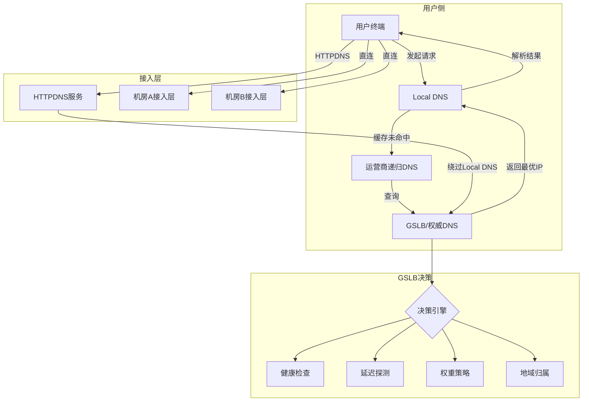
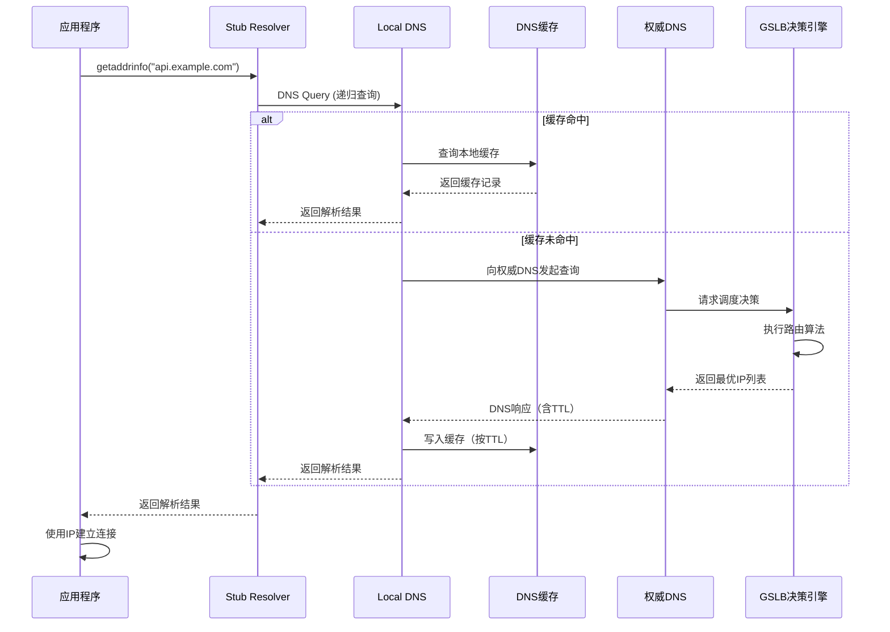
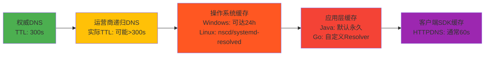
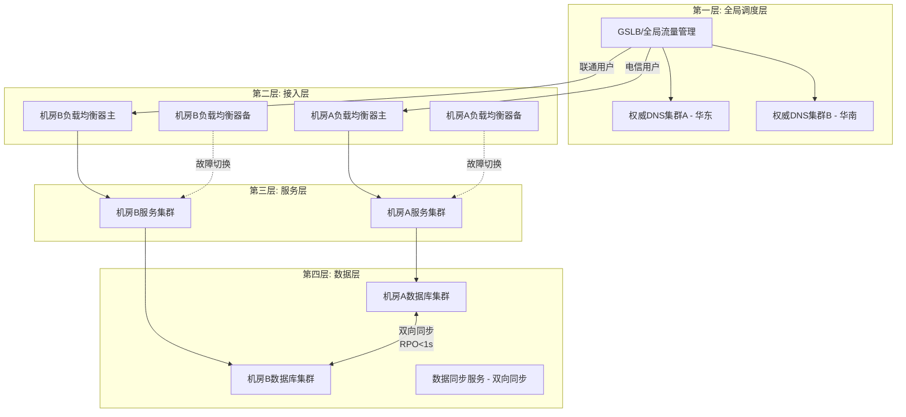
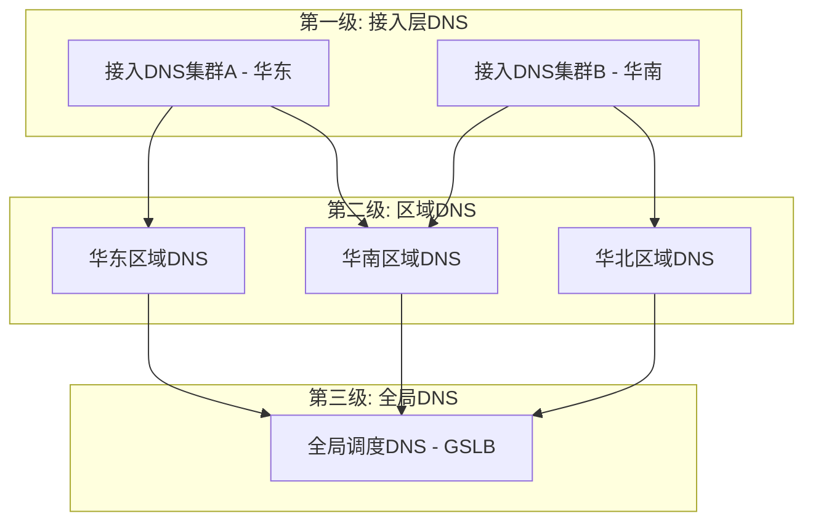

# 案例一：基于DNS的多活流量调度实战

## 一、案例背景与问题提出

### 1.1 业务场景

某头部互联网公司运营着一个覆盖全国的综合服务平台，核心业务包括用户注册登录、内容浏览、在线交易和数据同步等。随着业务规模的持续增长，系统面临以下挑战：

| 挑战维度 | 具体表现 | 量化指标 |
|----------|----------|----------|
| 单机房容量瓶颈 | 核心机房承载全量业务流量，峰值QPS逼近设计容量上限 | 峰值QPS 12万/机房设计容量15万，利用率超80% |
| 可用性风险集中 | 所有流量汇聚于单一机房，单点故障风险极高 | 历史上因机房断电导致全站不可用2次/年 |
| 用户体验不均匀 | 西北、西南用户访问延迟显著高于华东、华北用户 | 华东延迟<30ms，西北延迟>200ms，差距7倍 |
| 运维弹性不足 | 扩容周期长（采购+上架+部署需2-3个月），无法应对突发流量 | 大促期间无法及时扩容，限流频繁触发 |

**业务目标**：在保持现有业务逻辑不变的前提下，将核心流量调度能力从"单机房集中式"升级为"多机房分布式"，实现同城双活乃至异地多活的流量调度架构。具体KPI包括：

- RTO（恢复时间目标）：从小时级缩短到5分钟以内
- RPO（恢复点目标）：数据丢失控制在秒级
- 全国用户访问延迟：95分位 < 80ms
- 系统可用性：从99.9%提升到99.99%

### 1.2 为什么选择DNS作为流量调度入口

在多活架构的流量调度方案中，存在多种技术选型：

| 调度层级 | 技术方案 | 调度粒度 | 切换速度 | 覆盖范围 | 适用场景 | 典型代表 |
|----------|----------|----------|----------|----------|----------|----------|
| 网络层 | Anycast/BGP | IP级别 | 秒级 | 全球 | CDN、基础网络服务 | Cloudflare Anycast |
| 域名层 | DNS/GSLB | 域名级别 | 分钟级 | 全球 | 全局流量入口调度 | 阿里云GTM、AWS Route 53 |
| 接入层 | 负载均衡器 | 请求级别 | 毫秒级 | 数据中心内部 | 数据中心内流量分发 | Nginx、F5 BIG-IP |
| 应用层 | SDK/重定向 | 会话级别 | 秒级 | 应用可控范围 | 精细化路由、灰度发布 | 自研路由SDK |

DNS之所以被选为多活流量调度的第一层入口，核心原因在于：

**（1）天然的全局覆盖能力**

DNS是互联网最基础的命名服务，几乎所有的应用层访问（HTTP/HTTPS）都始于一次DNS解析。通过在DNS层介入流量调度，可以实现从源头控制用户请求的流向，且不需要修改任何客户端代码。这意味着无论用户使用浏览器、App还是小程序，都能被统一调度。

**（2）运营商级别的调度能力**

DNS调度天然具备按运营商、按地域进行流量分配的能力。通过配置不同运营商的权威DNS服务器返回不同的IP地址，可以将电信用户引导到电信出口充足的数据中心，将联通用户引导到联通出口充足的数据中心。在中国三大运营商互联互通质量参差不齐的现实下，这一能力尤为重要。

**（3）与应用层完全解耦**

DNS调度工作在域名解析阶段，与后端的应用架构完全解耦。这意味着可以在不修改应用代码的前提下，通过调整DNS配置实现流量的重新分配，非常适合灰度切换和故障应急场景。在紧急情况下，运维人员只需修改DNS配置即可完成流量切换，无需开发人员介入。

**（4）成熟的生态支持**

业界已有成熟的GSLB（Global Server Load Balancing）产品和服务，如阿里云全局流量管理（GTM）、AWS Route 53、F5 BIG-IP GTM等，提供了完善的健康检查、智能路由、故障转移等能力，大幅降低了DNS调度的实施门槛。自建方案也有BIND9、CoreDNS、PowerDNS等开源软件支撑。

### 1.3 方案选型决策

经过综合评估，团队选择了"GSLB + DNS + HTTPDNS"的分层调度方案。这一分层设计的核心思想是：DNS层负责全局粗粒度调度，HTTPDNS层负责绕过Local DNS缓存实现精准调度，两者互补形成完整的流量控制能力。



**分层调度的协作机制**：

1. **DNS层（第一层）**：处理约95%的常规流量解析，通过GSLB实现按运营商/地域的粗粒度调度
2. **HTTPDNS层（第二层）**：处理约5%的高优先级请求（如交易、登录），绕过Local DNS缓存获取实时解析结果
3. **应用层（第三层）**：在DNS/HTTPDNS解析结果基础上，进行精细化的连接级别负载均衡

## 二、DNS调度基础原理

### 2.1 DNS解析链路详解

理解DNS调度，必须深入理解DNS解析的完整链路。一次完整的DNS解析过程涉及多个组件的协作：



这条链路中存在三个关键的调度控制点：

**控制点一：权威DNS响应**

权威DNS（或GSLB）根据预设的调度策略，为不同的查询来源返回不同的IP地址。这是DNS调度最核心的能力。调度策略可以基于查询来源IP的地理位置、所属运营商、历史访问质量等多种因素。

**控制点二：Local DNS的缓存行为**

Local DNS会缓存DNS解析结果，缓存时间由TTL（Time To Live）决定。在TTL过期前，Local DNS不会重新查询权威DNS，这意味着DNS调度的变更需要等待TTL过期才能生效。这是DNS调度最大的局限性，也是HTTPDNS存在的根本原因。

**控制点三：递归DNS的转发行为**

运营商递归DNS作为中间层，其行为直接影响调度效果。部分运营商DNS会忽略权威DNS设置的TTL，使用自己的缓存策略；还有一些运营商DNS会进行DNS劫持，将特定域名的解析结果替换为自己的IP地址。

### 2.2 TTL策略设计

TTL（Time To Live）是DNS调度中最关键的参数之一。TTL过长会导致调度变更生效缓慢，TTL过短会导致DNS查询量暴增。TTL策略需要在"调度灵活性"和"系统稳定性"之间取得平衡。

| 场景 | 推荐TTL | 理由 | 风险提示 |
|------|---------|------|----------|
| 正常运行期 | 300秒（5分钟） | 平衡调度灵活性和DNS查询压力 | 故障切换最长等待5分钟 |
| 大促/活动前（提前1天） | 60-120秒（1-2分钟） | 提高调度响应速度，便于快速切换 | DNS查询量增加2-5倍 |
| 故障切换期 | 30-60秒（0.5-1分钟） | 最大限度缩短故障感知和切换时间 | 权威DNS压力显著增加 |
| 故障恢复后 | 分级恢复：60→120→300秒 | 逐步恢复，避免突变 | 恢复过程需监控DNS压力 |

**实战经验**：

1. **永远不要使用600秒以上的TTL**：在正常运行期就使用300秒的TTL，而不是600秒。这样在需要快速切换时，最长等待时间只有5分钟，远比600秒的10分钟更容易接受。很多团队在"正常"时期设置600秒甚至更长的TTL以减少DNS查询量，等到需要紧急切换时才发现要等10分钟以上才能生效。

2. **TTL变更需要提前一个旧TTL周期生效**：如果当前TTL是300秒，你把TTL改为60秒，需要等300秒（5分钟）后所有Local DNS的旧缓存才会全部过期。因此缩短TTL的操作必须在大促或故障演练之前至少提前一个旧TTL周期执行。

3. **不同域名使用不同TTL**：核心域名（api.example.com）使用较短的TTL（300秒），非核心域名（static.example.com）可以使用较长的TTL（3600秒）。这样既保证核心服务的调度灵活性，又降低整体DNS查询压力。

### 2.3 DNS缓存的多层挑战与应对

DNS缓存是DNS调度面临的核心挑战之一。不同层级的DNS缓存对调度变更的响应速度不同：



**运营商递归DNS**：通常尊重权威DNS设置的TTL，但部分运营商的递归DNS存在TTL不规范的行为——无论权威DNS设置的TTL是多少，递归DNS都可能使用自己设定的缓存时间（如300秒或更长）。更严重的是，部分运营商DNS存在DNS劫持行为，会将特定域名的解析结果替换为广告页面或劫持IP。

**操作系统缓存**：Windows操作系统默认会缓存DNS结果（早期版本可达24小时，Windows 10/11通常为较短时间，但仍受注册表控制）。Linux系统通过nscd（Name Service Cache Daemon）或systemd-resolved进行缓存，配置不当可能导致缓存时间远超预期。

**应用层缓存**：Java的InetAddress默认会永久缓存DNS结果（JVM进程生命周期内），这是生产环境中最常见的DNS调度失效原因之一。Go语言的net.Resolver也有类似的缓存机制，但可以通过自定义Resolver灵活控制。

**各层缓存的应对策略**：

```bash
# Linux系统级DNS缓存管理

# 查看当前DNS缓存状态（nscd）
nscd -g

# 清除hosts缓存
nscd -i hosts

# 清除systemd-resolved缓存
resolvectl flush-caches

# 验证缓存已清除
resolvectl statistics | grep "Current Cache Size"

# 配置systemd-resolved的缓存策略
# /etc/systemd/resolved.conf
# [Resolve]
# Cache=yes
# DNS=8.8.8.8 114.114.114.114
# DNSStubListener=yes
```

```java
// Java应用层DNS缓存管理 — 这是生产环境中最常见的DNS调度陷阱

// 方案1: JVM启动参数（推荐，全局生效）
// -Dsun.net.inetaddr.ttl=30              // DNS缓存30秒
// -Dsun.net.inetaddr.negative.ttl=10     // 失败缓存10秒
// -Dnetworkaddress.cache.ttl=30          // JDK 9+ 使用此参数

// 方案2: 代码级动态设置（适用于需要精细控制的场景）
import java.net.InetAddress;
import java.lang.reflect.Field;
import java.security.AccessController;
import java.security.PrivilegedAction;

// 清除单个域名的缓存
InetAddress[] addresses = InetAddress.getAllByName("api.example.com");

// 强制刷新DNS缓存（利用反射修改JVM内部缓存表）
// 注意：生产环境需评估安全策略影响
AccessController.doPrivileged((PrivilegedAction<Object>) () -> {
    try {
        Class<?> addressCacheClass = Class.forName("sun.net.InetAddressCachePolicy");
        // 不同JDK版本实现不同，此处为思路示意
    } catch (Exception e) {
        e.printStackTrace();
    }
    return null;
});
```

```go
// Go语言自定义DNS解析器 — 推荐方案，避免默认缓存
package dnsresolver

import (
    "context"
    "net"
    "time"
)

// NewNoCacheResolver 创建一个无缓存或短缓存的DNS解析器
func NewNoCacheResolver(dnsServer string, cacheTTL time.Duration) *net.Resolver {
    return &amp;net.Resolver{
        PreferGo: true,
        Dial: func(ctx context.Context, network, address string) (net.Conn, error) {
            d := net.Dialer{Timeout: 3 * time.Second}
            return d.DialContext(ctx, "udp", dnsServer+":53")
        },
    }
}

// ResolveWithHTTPDNS 优先使用HTTPDNS，降级到系统DNS
func ResolveWithHTTPDNS(domain string, httpdnsClient *HTTPDNSClient) ([]string, error) {
    // 优先HTTPDNS
    ips, err := httpdnsClient.Resolve(domain)
    if err == nil &amp;&amp; len(ips) > 0 {
        return ips, nil
    }
    // 降级到系统DNS
    return net.LookupHost(domain)
}
```

### 2.4 DNS劫持与安全防护

DNS劫持是DNS调度面临的安全威胁之一，在国内运营商环境中尤为突出。常见的DNS劫持形式包括：

| 劫持类型 | 表现形式 | 影响范围 | 检测方法 |
|----------|----------|----------|----------|
| 运营商HTTPDNS劫持 | 302重定向到广告页面或运营商自有服务 | 特定运营商用户 | 抓包分析HTTP响应码 |
| DNS缓存投毒 | 返回错误的DNS解析结果 | 查询该DNS的所有用户 | 对比权威DNS和递归DNS结果 |
| 本地HOSTS篡改 | 操作系统hosts文件被恶意修改 | 单台机器 | 检查hosts文件内容 |
| 路由器DNS篡改 | 家用路由器DNS配置被修改 | 该路由器下所有设备 | 检查路由器管理页面 |
| 中间人攻击 | 篡改DNS查询/响应报文 | 网络链路上的用户 | DNSSEC验证 |

**防护措施**：

```bash
# 1. DNSSEC验证 — 防止DNS缓存投毒
# 在BIND9中启用DNSSEC
# /etc/bind/named.conf
options {
    dnssec-validation auto;
    managed-keys-directory "/var/cache/bind";
};

# 2. DNS-over-HTTPS (DoH) / DNS-over-TLS (DoT) — 防止中间人劫持
# 配置systemd-resolved使用DoT
# /etc/systemd/resolved.conf
# [Resolve]
# DNS=1.1.1.1#cloudflare-dns.com 9.9.9.9#dns.quad9.net
# DNSOverTLS=yes

# 3. 检测DNS劫持的脚本
check_dns_hijack() {
    local domain=$1
    local authoritative_ns=$2
    
    echo "=== DNS劫持检测: $domain ==="
    
    # 查询权威DNS（无递归）
    local auth_result=$(dig @$authoritative_ns $domain A +norecurse +short 2>/dev/null)
    
    # 查询公共DNS（递归查询）
    local public_result=$(dig @8.8.8.8 $domain A +short 2>/dev/null)
    
    # 查询本地DNS
    local local_result=$(dig $domain A +short 2>/dev/null)
    
    echo "权威DNS结果: $auth_result"
    echo "公共DNS结果: $public_result"
    echo "本地DNS结果: $local_result"
    
    # 比较结果
    if [ "$auth_result" = "$public_result" ] &amp;&amp; [ "$auth_result" = "$local_result" ]; then
        echo "[OK] DNS解析一致，未检测到劫持"
    else
        echo "[WARN] DNS解析结果不一致，可能存在劫持"
        echo "  权威 vs 公共: $([ "$auth_result" = "$public_result" ] &amp;&amp; echo '一致' || echo '不一致')"
        echo "  权威 vs 本地: $([ "$auth_result" = "$local_result" ] &amp;&amp; echo '一致' || echo '不一致')"
    fi
}

# 4. 检测HTTP劫持（302重定向）
check_http_hijack() {
    local url=$1
    echo "=== HTTP劫持检测: $url ==="
    
    # 检查是否被302重定向
    local http_code=$(curl -s -o /dev/null -w '%{http_code}' -L --max-redirs 0 "$url" 2>/dev/null)
    local redirect_url=$(curl -s -o /dev/null -w '%{redirect_url}' --max-redirs 0 "$url" 2>/dev/null)
    
    if [ "$http_code" = "302" ] || [ "$http_code" = "301" ]; then
        echo "[WARN] 检测到重定向: $redirect_url"
        echo "  可能存在DNS或HTTP劫持"
    else
        echo "[OK] HTTP响应正常: $http_code"
    fi
}
```

## 三、架构设计与实现

### 3.1 整体架构设计

基于DNS的多活流量调度架构分为四层。每一层都有明确的职责边界和容错机制：



**各层职责说明**：

| 层级 | 职责 | 关键技术 | SLA要求 |
|------|------|----------|---------|
| 全局调度层 | 按运营商/地域分配流量，故障转移 | GSLB、权威DNS | 可用性99.99%，切换时间<5分钟 |
| 接入层 | 负载均衡、SSL终结、限流 | Nginx/F5/LVS | 可用性99.99%，支持热升级 |
| 服务层 | 业务逻辑处理 | 微服务框架 | 可用性99.995%，支持灰度发布 |
| 数据层 | 数据存储与同步 | MySQL/DynamoDB + 双向同步 | RPO<1s，RTO<1分钟 |

### 3.2 GSLB配置实现

以阿里云全局流量管理（GTM）为例，展示GSLB的核心配置。GSLB是DNS调度的大脑，负责根据健康状态、地理位置、权重等因素做出调度决策。

**（1）地址池配置**

地址池是GSLB的基本调度单元，每个地址池对应一个数据中心的接入地址组。

```yaml
# 阿里云GTM地址池配置示例
AddressPool:
  # 地址池A - 华东机房
  - pool_id: "pool-east"
    name: "华东机房"
    address:
      - address: "1.2.3.4"
        weight: 50
        mode: "active"
        health_check_url: "http://1.2.3.4/health"
      - address: "1.2.3.5"
        weight: 50
        mode: "active"
        health_check_url: "http://1.2.3.5/health"
    
  # 地址池B - 华南机房
  - pool_id: "pool-south"
    name: "华南机房"
    address:
      - address: "5.6.7.8"
        weight: 50
        mode: "active"
        health_check_url: "http://5.6.7.8/health"
      - address: "5.6.7.9"
        weight: 50
        mode: "active"
        health_check_url: "http://5.6.7.9/health"
    
  # 地址池C - 华北机房（灾备）
  - pool_id: "pool-north"
    name: "华北机房（灾备）"
    address:
      - address: "9.10.11.12"
        weight: 100
        mode: "standby"     # standby模式，仅在故障切换时启用
        health_check_url: "http://9.10.11.12/health"
```

**（2）调度策略配置**

```yaml
# 调度策略配置
RoutingStrategy:
  # 基于运营商的调度（主策略）
  - strategy_type: "isp_based"
    rules:
      - isp: "电信"
        target_pool: "pool-east"
        description: "电信用户优先访问华东机房（电信出口充足）"
      - isp: "联通"
        target_pool: "pool-south"
        description: "联通用户优先访问华南机房（联通出口充足）"
      - isp: "移动"
        target_pool: "pool-east"
        description: "移动用户优先访问华东机房"
      - isp: "default"
        target_pool: "pool-east"
        description: "其他运营商默认访问华东机房"

  # 故障转移策略
  - strategy_type: "failover"
    primary_pool: "pool-east"
    secondary_pool: "pool-south"
    tertiary_pool: "pool-north"
    failover_condition: "health_check_fail_count >= 3"
    failback_condition: "health_check_success_count >= 5"
    # 故障转移后的流量分配
    failover_behavior:
      primary_down: "全部切换到secondary_pool"
      primary_and_secondary_down: "全部切换到tertiary_pool"
    
  # 灰度发布权重策略
  - strategy_type: "weighted"
    description: "灰度发布时使用，逐步调整权重"
    pools:
      - pool_id: "pool-east"
        weight: 60
      - pool_id: "pool-south"
        weight: 40
```

**（3）健康检查配置**

健康检查是GSLB正确调度的前提。配置不当的健康检查会导致两种严重后果：误判健康导致故障切换延迟、误判不健康导致无辜节点被摘除。

```yaml
HealthCheck:
  # 基础HTTP健康检查（必配）
  - check_type: "HTTP"
    path: "/health"
    interval: 5              # 检查间隔（秒）
    timeout: 3               # 超时时间（秒）
    healthy_threshold: 3     # 连续成功3次判定为健康（防抖动）
    unhealthy_threshold: 3   # 连续失败3次判定为不健康（防抖动）
    
  # 深度健康检查（推荐配置）
  - check_type: "HTTP"
    path: "/api/health/detailed"
    interval: 10
    timeout: 5
    healthy_threshold: 3
    unhealthy_threshold: 2   # 深度检查更敏感，失败2次即摘除
    expected_response:
      status: "healthy"
      components:
        database: "connected"
        cache: "available"
        queue: "normal"
    
  # TCP端口检查（兜底）
  - check_type: "TCP"
    port: 80
    interval: 3
    timeout: 2
    healthy_threshold: 2
    unhealthy_threshold: 5   # TCP检查更宽松，避免网络抖动误判
```

**健康检查的防抖动设计**：

健康检查的 `healthy_threshold` 和 `unhealthy_threshold` 需要精心设计。过于敏感的检查会导致频繁的抖动（flapping），即节点在健康和不健康之间快速切换，造成流量剧烈波动。推荐的设计原则：

- **unhealthy_threshold = 3**：连续3次失败才标记为不健康，避免网络抖动误判
- **healthy_threshold = 3**：恢复后连续3次成功才标记为健康，确保节点确实恢复
- **检查间隔 = 5秒**：平衡检查实时性和系统开销
- **从不健康恢复到健康的时间 = unhealthy_threshold × interval + healthy_threshold × interval = 30秒**

### 3.3 自建DNS调度方案

对于不使用云厂商GSLB服务的企业，可以自建DNS调度系统。以下是核心组件的设计：

**（1）权威DNS服务器选型**

| DNS软件 | 性能（QPS） | 特点 | 适用场景 |
|---------|------------|------|----------|
| BIND9 | ~50,000 | 功能最全，生态最成熟 | 传统企业、需要复杂视图配置 |
| CoreDNS | ~80,000 | 插件化架构，云原生友好 | Kubernetes、云原生环境 |
| PowerDNS | ~60,000 | 支持多种后端存储 | 需要动态DNS记录的场景 |
| NSD | ~100,000 | 专注权威DNS，性能极高 | 高QPS场景 |

**CoreDNS方案（推荐）**：

```yaml
# Corefile - CoreDNS配置
# 支持按来源IP返回不同解析结果
.:53 {
    bind 0.0.0.0
    log
    errors
    health :8080
    
    # 基于来源IP的视图调度
    view "telecom" {
        matchers:
            - cidr 1.0.0.0/8
            - cidr 14.0.0.0/8
            - cidr 27.0.0.0/8
        template IN A example.com {
            answer "api.example.com 300 IN A 1.2.3.4"
            answer "api.example.com 300 IN A 1.2.3.5"
        }
    }
    
    view "unicom" {
        matchers:
            - cidr 101.0.0.0/8
            - cidr 221.0.0.0/8
        template IN A example.com {
            answer "api.example.com 300 IN A 5.6.7.8"
            answer "api.example.com 300 IN A 5.6.7.9"
        }
    }
    
    view "default" {
        template IN A example.com {
            answer "api.example.com 300 IN A 1.2.3.4"
            answer "api.example.com 300 IN A 5.6.7.8"
        }
    }
    
    # 转发到上游DNS（用于非example.com查询）
    forward . 8.8.8.8 114.114.114.114 {
        health_check 5s
    }
}
```

**BIND9方案（传统）**：

```bash
# 使用BIND9部署权威DNS服务器
# 安装BIND9
sudo apt-get update
sudo apt-get install -y bind9 bind9utils

# 主配置文件 /etc/bind/named.conf
# options配置
options {
    directory "/var/cache/bind";
    
    # 监听所有接口
    listen-on port 53 { any; };
    listen-on-v6 port 53 { any; };
    
    # 权威DNS应关闭递归查询
    allow-query { any; };
    allow-recursion { none; };
    recursion no;
    
    # 启用DNSSEC
    dnssec-validation auto;
    
    # 限制查询速率，防止DDoS攻击
    rate-limit {
        responses-per-second 10;
        window 5;
        slip 2;
    };
    
    # 版本号隐藏（安全加固）
    version "not disclosed";
};
```

**（2）智能DNS解析服务（Python实现）**

```python
#!/usr/bin/env python3
"""
智能DNS调度服务 - 根据查询来源IP返回最优解析结果

生产环境建议使用CoreDNS插件或专业DNS软件，此代码用于理解调度逻辑。
"""

import socket
import json
import time
import ipaddress
from dataclasses import dataclass, field
from typing import Dict, List, Optional
from enum import Enum
import threading


class HealthStatus(Enum):
    HEALTHY = "healthy"
    DEGRADED = "degraded"
    UNHEALTHY = "unhealthy"


@dataclass
class BackendServer:
    """后端服务器定义"""
    ip: str
    port: int
    datacenter: str
    weight: int = 100
    health_status: HealthStatus = HealthStatus.HEALTHY
    last_health_check: float = 0
    consecutive_failures: int = 0
    current_connections: int = 0
    max_connections: int = 10000
    region: str = ""
    isp: str = ""


@dataclass
class DNSRecord:
    """DNS响应记录"""
    name: str
    ttl: int
    records: List[Dict]
    soa_serial: int = 0


class SmartDNSResolver:
    """
    智能DNS解析器
    
    调度优先级：
    1. 健康状态过滤（只返回健康的服务器）
    2. 运营商匹配（优先匹配同运营商出口的服务器）
    3. 地域就近（优先选择延迟最低的服务器）
    4. 权重均衡（同优先级内按权重分配）
    """
    
    def __init__(self, config_path: str):
        self.config = self._load_config(config_path)
        self.backends: List[BackendServer] = []
        self.health_check_interval = self.config.get("health_check_interval", 5)
        self.geo_ip_db = self._init_geoip_db()
        self._load_backends()
        self._lock = threading.Lock()
    
    def _load_config(self, config_path: str) -> dict:
        """加载配置文件"""
        with open(config_path, 'r') as f:
            return json.load(f)
    
    def _init_geoip_db(self):
        """
        初始化地理IP数据库
        
        生产环境应使用MaxMind GeoIP2数据库（GeoLite2-City.mmdb），
        需要定期更新（每月一次）。免费版数据库的IP段归属可能不够精确。
        """
        # 简化的IP段到运营商的映射（仅作演示）
        return {
            "电信": ["1.0.0.0/8", "14.0.0.0/8", "27.0.0.0/8", "58.0.0.0/8", "59.0.0.0/8"],
            "联通": ["1.1.0.0/8", "101.0.0.0/8", "221.0.0.0/8"],
            "移动": ["36.0.0.0/8", "39.0.0.0/8", "111.0.0.0/8", "223.0.0.0/8"],
        }
    
    def _load_backends(self):
        """加载后端服务器列表"""
        for backend_conf in self.config.get("backends", []):
            self.backends.append(BackendServer(
                ip=backend_conf["ip"],
                port=backend_conf.get("port", 80),
                datacenter=backend_conf["datacenter"],
                weight=backend_conf.get("weight", 100),
                region=backend_conf.get("region", ""),
                isp=backend_conf.get("isp", ""),
            ))
    
    def resolve(self, client_ip: str, query_name: str) -> DNSRecord:
        """
        核心解析逻辑：根据客户端IP选择最优后端
        """
        # Step 1: 获取客户端运营商信息
        client_isp = self._get_client_isp(client_ip)
        
        # Step 2: 过滤健康服务器
        with self._lock:
            healthy_servers = [
                s for s in self.backends
                if s.health_status in (HealthStatus.HEALTHY, HealthStatus.DEGRADED)
            ]
        
        if not healthy_servers:
            return self._degraded_response(query_name)
        
        # Step 3: 运营商匹配
        isp_matched = [s for s in healthy_servers if s.isp == client_isp]
        
        # Step 4: 选择候选服务器
        candidates = isp_matched if isp_matched else healthy_servers
        
        # Step 5: 按权重和负载进行排序
        selected = self._weighted_select(candidates, count=2)
        
        # Step 6: 构建DNS响应
        return self._build_response(query_name, selected)
    
    def _get_client_isp(self, client_ip: str) -> str:
        """
        根据客户端IP识别运营商
        
        生产环境推荐：
        1. 使用MaxMind GeoIP2库: geoip2.database.Reader('GeoLite2-ASN.mmdb')
        2. 使用阿里云/腾讯云的IP归属查询API
        3. 维护本地IP段到运营商的映射表（定期更新）
        """
        try:
            client_addr = ipaddress.ip_address(client_ip)
            for isp, ip_ranges in self.geo_ip_db.items():
                for ip_range in ip_ranges:
                    if client_addr in ipaddress.ip_network(ip_range, strict=False):
                        return isp
        except ValueError:
            pass
        return "unknown"
    
    def _weighted_select(self, servers: List[BackendServer], count: int = 2) -> List[BackendServer]:
        """基于权重和负载的加权选择"""
        scored = []
        for server in servers:
            # 负载因子：连接数越多，分数越低
            load_factor = 1.0 - (server.current_connections / server.max_connections)
            # 权重因子
            weight_factor = server.weight / 100.0
            # 综合评分 = 负载因子 × 权重因子
            score = load_factor * weight_factor
            scored.append((server, score))
        
        scored.sort(key=lambda x: x[1], reverse=True)
        return [s[0] for s in scored[:count]]
    
    def _build_response(self, query_name: str, servers: List[BackendServer]) -> DNSRecord:
        """构建DNS响应"""
        records = []
        for server in servers:
            records.append({
                "type": "A",
                "name": query_name,
                "data": server.ip,
                "ttl": self.config.get("ttl", 300),
                "weight": server.weight,
            })
        
        return DNSRecord(
            name=query_name,
            ttl=self.config.get("ttl", 300),
            records=records,
            soa_serial=int(time.time()),
        )
    
    def _degraded_response(self, query_name: str) -> DNSRecord:
        """全机房不健康时的降级响应"""
        records = []
        for server in self.backends:
            records.append({
                "type": "A",
                "name": query_name,
                "data": server.ip,
                "ttl": 60,  # 降级时使用较短TTL，加速恢复
            })
        
        return DNSRecord(
            name=query_name,
            ttl=60,
            records=records,
        )


class HealthChecker:
    """后端健康检查器"""
    
    def __init__(self, resolver: SmartDNSResolver):
        self.resolver = resolver
        self.check_results: Dict[str, List[bool]] = {}
    
    def check_all(self):
        """对所有后端执行健康检查"""
        for server in self.resolver.backends:
            is_healthy = self._check_single(server)
            self._update_health_status(server, is_healthy)
    
    def _check_single(self, server: BackendServer) -> bool:
        """检查单个后端的健康状态"""
        import urllib.request
        
        check_url = f"http://{server.ip}:{server.port}/health"
        try:
            req = urllib.request.Request(check_url)
            req.timeout = 3
            with urllib.request.urlopen(req) as response:
                if response.status == 200:
                    body = json.loads(response.read())
                    return body.get("status") == "healthy"
        except Exception:
            pass
        return False
    
    def _update_health_status(self, server: BackendServer, is_healthy: bool):
        """更新服务器健康状态（防抖动机制）"""
        server.last_health_check = time.time()
        
        key = server.ip
        if key not in self.check_results:
            self.check_results[key] = []
        
        self.check_results[key].append(is_healthy)
        self.check_results[key] = self.check_results[key][-5:]  # 只保留最近5次
        
        results = self.check_results[key]
        healthy_count = sum(results)
        
        # 防抖动逻辑：基于滑动窗口的健康判定
        if healthy_count < 2:
            # 最近5次中健康少于2次 → 标记为不健康
            server.health_status = HealthStatus.UNHEALTHY
            server.consecutive_failures += 1
        elif healthy_count < 4:
            # 最近5次中健康2-3次 → 标记为降级
            server.health_status = HealthStatus.DEGRADED
            server.consecutive_failures = 0
        else:
            # 最近5次中健康4-5次 → 标记为健康
            server.health_status = HealthStatus.HEALTHY
            server.consecutive_failures = 0


# ========== 使用示例 ==========
if __name__ == "__main__":
    import tempfile
    
    config = {
        "ttl": 300,
        "health_check_interval": 5,
        "backends": [
            {"ip": "1.2.3.4", "port": 80, "datacenter": "dc-east-1", "weight": 100, "region": "华东", "isp": "电信"},
            {"ip": "5.6.7.8", "port": 80, "datacenter": "dc-south-1", "weight": 80, "region": "华南", "isp": "联通"},
            {"ip": "9.10.11.12", "port": 80, "datacenter": "dc-north-1", "weight": 90, "region": "华北", "isp": "电信"},
        ]
    }
    
    with tempfile.NamedTemporaryFile(mode='w', suffix='.json', delete=False) as f:
        json.dump(config, f)
        config_path = f.name
    
    resolver = SmartDNSResolver(config_path)
    
    test_clients = [
        ("14.1.1.1", "电信用户（华东）"),
        ("101.1.1.1", "联通用户（华南）"),
        ("111.1.1.1", "移动用户（华北）"),
    ]
    
    for client_ip, desc in test_clients:
        result = resolver.resolve(client_ip, "api.example.com")
        print(f"\n{desc} ({client_ip}) 的解析结果：")
        for record in result.records:
            print(f"  -> {record['data']} (权重: {record.get('weight', 'N/A')}, TTL: {result.ttl})")
```

### 3.4 HTTPDNS补充方案

HTTPDNS是解决DNS缓存问题的关键补充手段。它绕过Local DNS，通过HTTP协议直接向权威DNS服务发起查询，获得精确的调度结果。

```python
#!/usr/bin/env python3
"""
HTTPDNS客户端实现 - 绕过Local DNS，直接获取精确调度结果

HTTPDNS的核心价值：
1. 绕过Local DNS缓存，解析结果实时准确
2. 精确识别客户端IP（而非Local DNS的IP），实现更精准的调度
3. 避免DNS劫持和DNS解析失败问题
4. 支持应用级别的精细化路由

局限性：
1. 需要客户端SDK支持，无法覆盖所有终端
2. HTTPDNS服务本身也需要高可用部署
3. 增加了一次HTTP请求的网络开销
"""

import requests
import json
import time
import threading
import hmac
import hashlib
from typing import Optional, Dict, List
from dataclasses import dataclass
from urllib.parse import urlparse


@dataclass
class HTTPDNSConfig:
    """HTTPDNS服务配置"""
    api_url: str              # HTTPDNS API地址
    app_id: str               # 应用ID
    app_key: str              # 应用密钥
    cache_ttl: int = 60       # 本地缓存时间（秒）
    timeout: float = 3.0      # 请求超时时间
    retry_count: int = 2      # 重试次数
    fallback_to_system: bool = True  # 是否降级到系统DNS


class HTTPDNSClient:
    """
    HTTPDNS客户端
    
    工作原理：
    1. 应用程序不通过系统的DNS解析，而是直接向HTTPDNS服务器发送HTTP请求
    2. HTTPDNS服务器根据请求中的客户端IP，返回最优的解析结果
    3. 应用程序使用返回的IP地址建立连接
    
    典型调用链路：
    App → HTTPDNS SDK → HTTPDNS Server → GSLB决策 → 返回IP列表 → App使用IP直连
    """
    
    def __init__(self, config: HTTPDNSConfig):
        self.config = config
        self.cache: Dict[str, Dict] = {}
        self.lock = threading.Lock()
        self._stats = {"total": 0, "hit": 0, "miss": 0, "fallback": 0}
    
    def resolve(self, domain: str, client_ip: Optional[str] = None) -> List[str]:
        """
        解析域名，返回IP列表
        
        Args:
            domain: 要解析的域名
            client_ip: 客户端IP（可选，用于更精确的调度）
        
        Returns:
            IP地址列表（按优先级排序）
        """
        self._stats["total"] += 1
        
        # Step 1: 检查本地缓存
        cached = self._get_from_cache(domain)
        if cached:
            self._stats["hit"] += 1
            return cached
        
        self._stats["miss"] += 1
        
        # Step 2: 向HTTPDNS服务器查询
        ips = self._query_httpdns(domain, client_ip)
        
        # Step 3: 写入本地缓存
        if ips:
            self._set_cache(domain, ips)
            return ips
        
        # Step 4: 降级到系统DNS
        if self.config.fallback_to_system:
            self._stats["fallback"] += 1
            return self._fallback_resolve(domain)
        
        return []
    
    def _query_httpdns(self, domain: str, client_ip: Optional[str] = None) -> List[str]:
        """向HTTPDNS服务发起查询"""
        params = {
            "host": domain,
            "appid": self.config.app_id,
            "timestamp": int(time.time()),
        }
        
        if client_ip:
            params["client_ip"] = client_ip
        
        # 生成HMAC签名（防篡改）
        sign_str = f"{self.config.app_id}{params['timestamp']}"
        params["sign"] = self._generate_sign(sign_str)
        
        headers = {
            "User-Agent": "HTTPDNS-Client/1.0",
            "Content-Type": "application/json",
        }
        
        for attempt in range(self.config.retry_count + 1):
            try:
                response = requests.get(
                    self.config.api_url,
                    params=params,
                    headers=headers,
                    timeout=self.config.timeout,
                )
                response.raise_for_status()
                result = response.json()
                
                # 兼容不同HTTPDNS服务商的响应格式
                if "ips" in result:
                    return result["ips"]
                elif "data" in result:
                    data = result["data"]
                    if isinstance(data, dict) and "ips" in data:
                        return data["ips"]
                    elif isinstance(data, str):
                        return [ip.strip() for ip in data.split(",") if ip.strip()]
                
                return []
                
            except requests.exceptions.RequestException as e:
                if attempt < self.config.retry_count:
                    time.sleep(0.5 * (attempt + 1))
                    continue
                print(f"HTTPDNS查询失败: {domain}, 错误: {e}")
                return []
    
    def _fallback_resolve(self, domain: str) -> List[str]:
        """降级到系统DNS解析"""
        import socket
        try:
            result = socket.getaddrinfo(domain, None)
            return [addr[4][0] for addr in result]
        except socket.gaierror:
            return []
    
    def get_stats(self) -> Dict:
        """获取统计信息"""
        return self._stats.copy()
    
    def _get_from_cache(self, domain: str) -> Optional[List[str]]:
        """从本地缓存获取解析结果"""
        with self.lock:
            if domain in self.cache:
                entry = self.cache[domain]
                if time.time() < entry["expire"]:
                    return entry["ips"]
                else:
                    del self.cache[domain]
        return None
    
    def _set_cache(self, domain: str, ips: List[str]):
        """写入本地缓存"""
        with self.lock:
            self.cache[domain] = {
                "ips": ips,
                "expire": time.time() + self.config.cache_ttl,
            }
    
    def _generate_sign(self, sign_str: str) -> str:
        """生成HMAC-MD5请求签名"""
        return hmac.new(
            self.config.app_key.encode(),
            sign_str.encode(),
            hashlib.md5
        ).hexdigest()
```

**HTTPDNS在多活架构中的应用场景**：

| 场景 | 传统DNS的问题 | HTTPDNS的解决方案 |
|------|--------------|-------------------|
| DNS劫持 | 用户被导向错误IP | HTTPDNS绕过Local DNS，直接获取权威结果 |
| 调度不准 | Local DNS IP≠用户IP，导致调度偏差 | HTTPDNS获取真实客户端IP，精准调度 |
| 缓存延迟 | TTL未过期，无法切换 | HTTPDNS本地缓存TTL可控，切换更快 |
| 解析失败 | Local DNS故障导致解析超时 | HTTPDNS多点部署，独立于Local DNS |

## 四、实战部署与配置

### 4.1 DNS服务器高可用部署

生产环境的DNS调度服务器需要高可用部署。推荐采用"主从+VIP"的架构，确保DNS服务本身不会成为单点故障：

```bash
#!/bin/bash
# DNS高可用部署脚本（BIND9主从架构）

# ========== 部署BIND9 ==========
deploy_bind9() {
    local ROLE=$1
    local MASTER_IP=$2
    
    echo "=== 部署BIND9 ($ROLE) ==="
    
    # 安装BIND9
    apt-get update
    apt-get install -y bind9 bind9utils bind9-doc
    
    # 创建TSIG密钥（用于主从同步认证，防止未授权区域传输）
    tsig-keygen -a hmac-md5 transfer-key > /etc/bind/transfer.key
    
    if [ "$ROLE" = "master" ]; then
        cat > /etc/bind/named.conf.local << 'EOF'
// TSIG密钥配置
key "transfer-key" {
    algorithm hmac-md5;
    secret "your-secret-key-here";
};

// 主从同步ACL
acl "slaves" {
    10.0.0.2;
};

// 视图配置 - 按运营商分流
view "telecom" {
    match-clients { key "transfer-key"; 10.0.0.0/8; };
    zone "example.com" {
        type master;
        file "/etc/bind/zones/telecom/example.com.zone";
        allow-transfer { key "transfer-key"; };
        also-notify { 10.0.0.2; };
    };
};

view "unicom" {
    match-clients { 101.0.0.0/8; };
    zone "example.com" {
        type master;
        file "/etc/bind/zones/unicom/example.com.zone";
        allow-transfer { key "transfer-key"; };
        also-notify { 10.0.0.2; };
    };
};

view "default" {
    match-clients { any; };
    zone "example.com" {
        type master;
        file "/etc/bind/zones/default/example.com.zone";
        allow-transfer { key "transfer-key"; };
        also-notify { 10.0.0.2; };
    };
};
EOF
    fi
    
    # 启动BIND9
    systemctl enable bind9
    systemctl start bind9
    
    echo "BIND9部署完成"
}

# ========== 创建区域文件 ==========
create_zone_files() {
    echo "=== 创建DNS区域文件 ==="
    
    # 电信用户 -> 华东机房
    mkdir -p /etc/bind/zones/telecom
    cat > /etc/bind/zones/telecom/example.com.zone << 'EOF'
$TTL 300
@   IN  SOA ns1.example.com. admin.example.com. (
        2024010101  ; Serial (YYYYMMDDNN)
        3600        ; Refresh (1 hour)
        1800        ; Retry (30 minutes)
        604800      ; Expire (1 week)
        300         ; Negative Cache TTL (5 minutes)
)
    IN  NS  ns1-east.example.com.
    IN  NS  ns2-east.example.com.

; 电信用户 -> 华东机房
api     IN  A   1.2.3.4
api     IN  A   1.2.3.5
www     IN  A   1.2.3.4
ns1-east   IN  A   10.0.0.1
ns2-east   IN  A   10.0.0.2
EOF
    
    # 联通用户 -> 华南机房
    mkdir -p /etc/bind/zones/unicom
    cat > /etc/bind/zones/unicom/example.com.zone << 'EOF'
$TTL 300
@   IN  SOA ns1.example.com. admin.example.com. (
        2024010101  ; Serial (YYYYMMDDNN)
        3600        ; Refresh (1 hour)
        1800        ; Retry (30 minutes)
        604800      ; Expire (1 week)
        300         ; Negative Cache TTL (5 minutes)
)
    IN  NS  ns1-south.example.com.
    IN  NS  ns2-south.example.com.

; 联通用户 -> 华南机房
api     IN  A   5.6.7.8
api     IN  A   5.6.7.9
www     IN  A   5.6.7.8
ns1-south  IN  A   10.0.1.1
ns2-south  IN  A   10.0.1.2
EOF
    
    # 默认解析结果
    mkdir -p /etc/bind/zones/default
    cp /etc/bind/zones/telecom/example.com.zone /etc/bind/zones/default/example.com.zone
    
    # 检查区域文件语法（必须在reload前执行）
    for dir in telecom unicom default; do
        named-checkzone example.com /etc/bind/zones/$dir/example.com.zone
    done
    
    echo "区域文件创建完成"
}
```

### 4.2 DNS灰度发布实战

DNS灰度发布是多活架构中风险最低的发布方式。通过逐步调整DNS权重，将新版本服务的流量从0%提升到100%：

```bash
#!/bin/bash
# DNS灰度发布脚本

DOMAIN="api.example.com"
OLD_IPS=("1.2.3.4" "1.2.3.5")
NEW_IPS=("10.0.1.1" "10.0.1.2")

# 灰度阶段配置
PHASES=(
    "5:95"    # Phase 1: 5%新版本，95%旧版本
    "10:90"   # Phase 2: 10%新版本
    "25:75"   # Phase 3: 25%新版本
    "50:50"   # Phase 4: 50%新版本
    "75:25"   # Phase 5: 75%新版本
    "100:0"   # Phase 6: 100%新版本
)

echo "=== DNS灰度发布 ==="
echo "域名: $DOMAIN"
echo "旧版本: ${OLD_IPS[*]}"
echo "新版本: ${NEW_IPS[*]}"
echo ""

for phase in "${PHASES[@]}"; do
    IFS=':' read -r NEW_WEIGHT OLD_WEIGHT <<< "$phase"
    
    echo "--- 灰度阶段: 新版本${NEW_WEIGHT}% / 旧版本${OLD_WEIGHT}% ---"
    
    # 更新GSLB权重配置（以阿里云GTM为例）
    # aliyun gtm UpdateAddressPool --Weight $NEW_WEIGHT ...
    
    # 等待TTL过期（确保用户侧生效）
    echo "等待TTL过期（300秒）..."
    sleep 300
    
    # 验证新版本服务健康
    for ip in "${NEW_IPS[@]}"; do
        status=$(curl -s -o /dev/null -w '%{http_code}' "http://$ip/health" --connect-timeout 3)
        if [ "$status" = "200" ]; then
            echo "[OK] $ip 健康"
        else
            echo "[ERROR] $ip 异常，停止灰度"
            exit 1
        fi
    done
    
    # 验证流量比例
    echo "验证流量分布..."
    for i in {1..10}; do
        resolved=$(dig $DOMAIN A +short | head -1)
        echo "  查询$i: $resolved"
    done
    
    echo ""
done

echo "=== 灰度发布完成 ==="
```

### 4.3 故障切换演练

故障切换是DNS调度的关键能力。以下是故障切换的完整流程和验证方法：

```python
#!/usr/bin/env python3
"""
DNS故障切换演练工具
用于验证DNS调度在故障场景下的表现
"""

import subprocess
import time
from datetime import datetime


class DNSFailoverDrill:
    """DNS故障切换演练"""
    
    def __init__(self, primary_ip: str, secondary_ip: str, domain: str):
        self.primary_ip = primary_ip
        self.secondary_ip = secondary_ip
        self.domain = domain
    
    def log(self, message: str, level: str = "INFO"):
        """记录日志"""
        timestamp = datetime.now().strftime("%Y-%m-%d %H:%M:%S")
        print(f"[{timestamp}] [{level}] {message}")
    
    def query_dns(self, server: str) -> dict:
        """向指定DNS服务器发起查询"""
        cmd = f"dig @{server} {self.domain} A +short +time=5 +tries=1"
        try:
            result = subprocess.run(
                cmd, shell=True, capture_output=True, text=True, timeout=10
            )
            ips = [ip.strip() for ip in result.stdout.strip().split('\n') if ip.strip()]
            return {"server": server, "ips": ips, "success": len(ips) > 0}
        except Exception as e:
            return {"server": server, "ips": [], "success": False, "error": str(e)}
    
    def check_service_health(self, ip: str) -> bool:
        """检查服务健康状态"""
        cmd = f"curl -s -o /dev/null -w '%{{http_code}}' http://{ip}/health --connect-timeout 3 --max-time 5"
        try:
            result = subprocess.run(cmd, shell=True, capture_output=True, text=True, timeout=10)
            return result.stdout.strip() == "200"
        except Exception:
            return False
    
    def run_drill(self):
        """执行故障切换演练"""
        self.log("=" * 60)
        self.log("DNS故障切换演练开始")
        self.log("=" * 60)
        
        # Phase 1: 记录基线
        self.log("\n--- Phase 1: 记录基线状态 ---")
        baseline = self.query_dns(self.secondary_ip)
        self.log(f"基线DNS解析结果: {baseline['ips']}")
        
        # Phase 2: 模拟故障（标记主节点不健康）
        self.log("\n--- Phase 2: 模拟主节点故障 ---")
        self.log(f"主节点 {self.primary_ip} 已标记为不健康")
        self.log("等待健康检查生效（约15秒）...")
        time.sleep(15)
        
        # Phase 3: 验证故障转移
        self.log("\n--- Phase 3: 验证故障转移 ---")
        failover_result = self.query_dns(self.secondary_ip)
        self.log(f"故障转移后DNS解析结果: {failover_result['ips']}")
        
        if self.secondary_ip in failover_result.get("ips", []):
            self.log("[PASS] 故障转移成功：流量已切换到备用节点")
        else:
            self.log("[FAIL] 故障转移失败：需要检查GSLB配置", "ERROR")
        
        # Phase 4: 验证服务可用性
        self.log("\n--- Phase 4: 验证服务可用性 ---")
        for ip in failover_result.get("ips", []):
            healthy = self.check_service_health(ip)
            status = "健康" if healthy else "异常"
            self.log(f"  服务器 {ip}: {status}")
        
        # Phase 5: 恢复故障
        self.log("\n--- Phase 5: 恢复主节点 ---")
        self.log("主节点已恢复正常")
        self.log("等待恢复生效...")
        time.sleep(15)
        
        # Phase 6: 验证恢复
        self.log("\n--- Phase 6: 验证恢复 ---")
        recovery_result = self.query_dns(self.secondary_ip)
        self.log(f"恢复后DNS解析结果: {recovery_result['ips']}")
        
        # 生成报告
        self.log("\n" + "=" * 60)
        self.log("演练报告")
        self.log("=" * 60)
        self.log(f"域名: {self.domain}")
        self.log(f"主节点: {self.primary_ip}")
        self.log(f"备用节点: {self.secondary_ip}")
        self.log(f"故障转移: {'成功' if self.secondary_ip in failover_result.get('ips', []) else '失败'}")
        self.log(f"演练时间: {datetime.now().strftime('%Y-%m-%d %H:%M:%S')}")
        self.log("演练完成")


if __name__ == "__main__":
    drill = DNSFailoverDrill(
        primary_ip="1.2.3.4",
        secondary_ip="5.6.7.8",
        domain="api.example.com"
    )
    drill.run_drill()
```

### 4.4 DNS监控与告警

DNS调度的监控需要覆盖解析成功率、解析延迟、流量分布等关键指标：

```bash
#!/bin/bash
# DNS调度监控脚本

# ========== 监控指标采集 ==========
collect_dns_metrics() {
    local domain=$1
    local dns_server=$2
    
    echo "=== DNS监控指标采集 ==="
    
    # 1. DNS解析延迟
    local start_time=$(date +%s%N)
    local result=$(dig @$dns_server $domain A +short +time=5 +tries=3 2>/dev/null)
    local end_time=$(date +%s%N)
    local latency_ms=$(( (end_time - start_time) / 1000000 ))
    
    if [ -n "$result" ]; then
        echo "解析延迟: ${latency_ms}ms"
        echo "解析结果: $result"
        echo "解析状态: 成功"
    else
        echo "解析延迟: 超时"
        echo "解析结果: 无"
        echo "解析状态: 失败"
    fi
    
    # 2. 各机房流量分布（采样100次）
    echo ""
    echo "=== 各机房流量分布（100次采样）==="
    
    local dc_ips=("1.2.3.4" "5.6.7.8" "9.10.11.12")
    local dc_names=("华东机房" "华南机房" "华北机房")
    local total=100
    
    for i in "${!dc_ips[@]}"; do
        local count=0
        for ((j=1; j<=total; j++)); do
            local resolved=$(dig @$dns_server $domain A +short 2>/dev/null | head -1)
            if [ "$resolved" = "${dc_ips[$i]}" ]; then
                count=$((count + 1))
            fi
            sleep 0.05
        done
        local percentage=$((count * 100 / total))
        echo "${dc_names[$i]} (${dc_ips[$i]}): ${percentage}% (${count}/${total})"
    done
}

# ========== 告警规则 ==========
check_alerts() {
    local domain=$1
    local dns_server=$2
    
    # 告警规则1: 解析成功率低于99%
    local success_count=0
    local check_count=50
    
    for ((i=1; i<=check_count; i++)); do
        if dig @$dns_server $domain A +short +time=3 +tries=1 >/dev/null 2>&amp;1; then
            success_count=$((success_count + 1))
        fi
    done
    
    local success_rate=$((success_count * 100 / check_count))
    
    if [ $success_rate -lt 99 ]; then
        echo "[ALERT] DNS解析成功率异常: ${success_rate}% (阈值: 99%)"
        # curl -s -X POST "YOUR_WEBHOOK_URL" -d "{\"msg\":\"DNS解析成功率异常: ${success_rate}%\"}"
    else
        echo "[OK] DNS解析成功率正常: ${success_rate}%"
    fi
    
    # 告警规则2: 解析延迟超过阈值
    local start_time=$(date +%s%N)
    dig @$dns_server $domain A +short +time=5 +tries=1 >/dev/null 2>&amp;1
    local end_time=$(date +%s%N)
    local latency_ms=$(( (end_time - start_time) / 1000000 ))
    
    if [ $latency_ms -gt 200 ]; then
        echo "[ALERT] DNS解析延迟过高: ${latency_ms}ms (阈值: 200ms)"
    else
        echo "[OK] DNS解析延迟正常: ${latency_ms}ms"
    fi
}

# 主程序
DOMAIN=${1:-"api.example.com"}
DNS_SERVER=${2:-"8.8.8.8"}

echo "监控域名: $DOMAIN"
echo "DNS服务器: $DNS_SERVER"
echo ""

collect_dns_metrics $DOMAIN $DNS_SERVER
echo ""
check_alerts $DOMAIN $DNS_SERVER
```

## 五、常见误区与踩坑指南

### 5.1 误区一：DNS TTL设置过长

**错误做法**：为了减少DNS查询压力，将TTL设置为3600秒（1小时）甚至更长。

**后果**：当需要紧急故障切换时，最长需要等待1小时才能让所有用户切换到备用机房。在真实的故障场景中，这意味着1小时的持续损失。

**正确做法**：核心域名使用300秒TTL，非核心域名可以适当延长。宁可多承受一些DNS查询量，也要保证调度灵活性。

### 5.2 误区二：忽略应用层DNS缓存

**错误做法**：只关注Local DNS的缓存，忽略了Java/Go等应用框架的DNS缓存。

**后果**：即使权威DNS已返回新IP，Java应用仍使用旧IP连接，导致故障切换对应用层无效。这是生产环境中最常见的DNS调度失效原因之一。

**正确做法**：在应用层配置DNS缓存策略（Java: `-Dsun.net.inetaddr.ttl=30`，Go: 自定义Resolver），确保应用层的DNS缓存时间不超过权威DNS的TTL。

### 5.3 误区三：健康检查配置过于激进

**错误做法**：将unhealthy_threshold设置为1，即一次检查失败就摘除节点。

**后果**：网络抖动导致健康检查偶发失败，节点被频繁摘除和恢复，流量在机房之间剧烈抖动，反而比不切换更糟糕。

**正确做法**：unhealthy_threshold ≥ 3，healthy_threshold ≥ 3，使用滑动窗口而非单次结果判定。

### 5.4 误区四：只做DNS调度不做数据同步

**错误做法**：DNS调度将用户导向新机房，但新机房的数据库中没有用户数据。

**后果**：用户登录失败、数据丢失、业务异常。

**正确做法**：DNS调度必须与数据层同步配合。在流量切换前，确保目标机房的数据已同步到位。多活架构的核心难点不在流量调度，而在数据一致性。

### 5.5 误区五：故障切换后不做验证

**错误做法**：DNS配置修改后，没有验证解析结果是否正确、服务是否可用。

**后果**：DNS配置错误导致所有用户被导向错误的IP，或者目标机房的服务实际上不可用，故障范围从单机房扩大到全站。

**正确做法**：每次DNS变更后，立即从多个位置验证解析结果（`dig @不同DNS服务器 域名`），并检查目标IP的服务健康状态。

## 六、性能优化与最佳实践

### 6.1 DNS性能优化策略

**（1）DNS缓存层级优化**

```bash
# 优化系统级DNS缓存
cat > /etc/systemd/resolved.conf << 'EOF'
[Resolve]
DNS=8.8.8.8 114.114.114.114
FallbackDNS=223.5.5.5
Cache=yes
DNSStubListener=yes
EOF

systemctl restart systemd-resolved

# 验证缓存效果
resolvectl statistics
```

**（2）多级DNS解析架构**



多级DNS架构的好处：
- **降低延迟**：接入层DNS就近服务，减少跨地域查询
- **提高可用性**：单个区域DNS故障不影响其他区域
- **分级容错**：全局DNS故障时，区域DNS仍可使用缓存服务

### 6.2 关键性能指标与告警阈值

| 指标 | 正常范围 | 告警阈值 | 监控频率 | 说明 |
|------|----------|----------|----------|------|
| DNS解析延迟 | < 50ms | > 200ms | 每5秒 | 权威DNS响应时间 |
| DNS解析成功率 | > 99.9% | < 99% | 每分钟 | 查询成功比例 |
| DNS缓存命中率 | > 90% | < 70% | 每5分钟 | Local DNS缓存效率 |
| 故障切换时间 | < 5分钟 | > 10分钟 | 事件触发 | 从故障到流量切换完成 |
| 健康检查成功率 | > 99% | < 95% | 每分钟 | GSLB健康检查质量 |
| 流量分布偏差 | < 10% | > 20% | 每5分钟 | 实际流量与预期的偏差 |

### 6.3 容量规划与成本分析

**（1）DNS服务器容量评估**

```bash
# DNS服务器容量评估公式
# 预估QPS = 日均PV × 域名数 × 每PV的DNS查询数 ÷ 86400

# 示例：
# 日均PV: 1亿
# 域名数: 10
# 每PV平均DNS查询: 3次
# 预估QPS = 100,000,000 × 10 × 3 ÷ 86400 ≈ 34,722 QPS

# 不同DNS软件的承载能力：
# BIND9:   ~50,000 QPS/实例
# CoreDNS: ~80,000 QPS/实例
# NSD:     ~100,000 QPS/实例

# 需要部署的实例数 = 预估QPS ÷ 单实例QPS × 冗余系数(2)
# BIND9:   34,722 ÷ 50,000 × 2 ≈ 2台
# CoreDNS: 34,722 ÷ 80,000 × 2 ≈ 1台（建议至少2台）
```

**（2）成本对比：云GSLB vs 自建DNS**

| 对比维度 | 云GSLB（如阿里云GTM） | 自建DNS（BIND9/CoreDNS） |
|----------|----------------------|-------------------------|
| 月度成本 | ¥2,000-20,000（按查询量计费） | 服务器成本 ¥5,000-20,000 + 人力成本 |
| 运维复杂度 | 低（托管服务） | 高（需要专人维护DNS集群） |
| 可用性 | 99.99%（SLA保障） | 取决于自身运维水平 |
| 灵活性 | 中（受云厂商功能限制） | 高（完全自主可控） |
| 适用场景 | 中小规模、快速上线 | 大规模、有专业运维团队 |

**建议**：初期使用云GSLB快速上线，验证多活架构的可行性。当DNS查询量超过云厂商的性价比区间（通常>100万QPS/月），再考虑自建DNS集群。

### 6.4 运维最佳实践

**（1）变更管理**

- DNS配置变更必须经过审批流程，至少两人确认
- 变更前备份当前配置（`cp /etc/bind/zones/xxx.zone /backup/xxx.zone.bak`）
- 变更后立即验证解析结果（从多个DNS服务器测试）
- 变更窗口避开业务高峰期（建议凌晨2:00-6:00）
- 每次变更记录在运维日志中，包括变更内容、执行人、验证结果

**（2）容灾设计**

- 至少部署2个独立的DNS服务器集群，分布在不同机房
- 配置多组NS记录，确保单点故障不影响全局
- 主从DNS使用不同的网络链路，避免链路级故障

```bash
# NS记录容灾配置
; 主DNS集群（华东机房）
@   IN  NS  ns1-east.example.com.
@   IN  NS  ns2-east.example.com.

; 备DNS集群（华南机房）
@   IN  NS  ns1-south.example.com.
@   IN  NS  ns2-south.example.com.

; Glue Records（必须配置，否则DNS递归查询可能失败）
ns1-east   IN  A   10.0.0.1
ns2-east   IN  A   10.0.0.2
ns1-south  IN  A   10.0.1.1
ns2-south  IN  A   10.0.1.2
```

**（3）故障演练常态化**

- 每月至少执行一次DNS故障切换演练
- 演练覆盖：单节点故障、单机房故障、DNS服务全面故障
- 演练结果纳入可用性报告，跟踪改进措施的落实情况

## 七、故障排查实战

### 7.1 常见故障场景与排查

**故障场景一：DNS解析返回错误IP**

```bash
# 排查步骤
# Step 1: 确认权威DNS的响应
dig @ns1-east.example.com api.example.com A +norecurse +trace

# Step 2: 检查GSLB配置
# 登录GSLB控制台，检查地址池和调度策略是否正确

# Step 3: 检查DNS区域文件
named-checkzone example.com /etc/bind/zones/telecom/example.com.zone

# Step 4: 检查DNS服务器日志
tail -f /var/log/syslog | grep named
```

**故障场景二：DNS解析延迟过高**

```bash
# 排查步骤
# Step 1: 检查DNS服务器响应时间
dig @ns1-east.example.com api.example.com A | grep "Query time"

# Step 2: 检查DNS服务器负载
top -c | grep named
ss -tlnp | grep :53

# Step 3: 检查网络连通性
traceroute ns1-east.example.com
mtr --report ns1-east.example.com

# Step 4: 检查是否有DNS查询风暴（DDoS攻击）
tcpdump -i eth0 port 53 -n -c 100 | head -20
```

**故障场景三：部分用户无法解析**

```bash
# 排查步骤
# Step 1: 从不同运营商网络测试
# 电信网络
dig @114.114.114.114 api.example.com A +short

# 联通网络
dig @223.5.5.5 api.example.com A +short

# 移动网络
dig @223.6.6.6 api.example.com A +short

# Step 2: 检查运营商DNS的缓存状态
dig @114.114.114.114 api.example.com A +norecurse

# Step 3: 检查是否有DNS劫持
# 对比权威DNS和运营商DNS的解析结果
dig @ns1-east.example.com api.example.com A +norecurse +short
dig @114.114.114.114 api.example.com A +short
# 如果结果不一致，说明存在DNS劫持

# Step 4: 使用HTTPDNS验证
# 通过HTTPDNS绕过Local DNS，获取真实的调度结果
curl "http://httpdns.example.com/resolve?host=api.example.com&amp;client_ip=$(curl -s ifconfig.me)"
```

### 7.2 DNS故障恢复SOP

```bash
#!/bin/bash
# DNS故障恢复标准操作流程（SOP）

echo "=========================================="
echo "DNS故障恢复标准操作流程"
echo "=========================================="

# Step 1: 故障确认
echo ""
echo "--- Step 1: 故障确认 ---"
echo "确认故障现象："
echo "  [ ] 用户反馈无法访问"
echo "  [ ] 监控系统告警"
echo "  [ ] DNS解析异常"
read -p "故障确认完成，是否继续? (y/n): " confirm
if [ "$confirm" != "y" ]; then
    echo "流程终止"
    exit 1
fi

# Step 2: 影响评估
echo ""
echo "--- Step 2: 影响评估 ---"
echo "评估影响范围："
echo "  - 受影响用户数：______"
echo "  - 受影响业务：______"
echo "  - 预计损失：______"
read -p "影响评估完成，是否继续? (y/n): " confirm

# Step 3: 临时措施
echo ""
echo "--- Step 3: 执行临时措施 ---"
echo "方案选择："
echo "  1. DNS故障转移（切换到备用机房）"
echo "  2. HTTPDNS紧急推送（客户端强制更新）"
echo "  3. CDN回源切换（修改CDN源站）"
read -p "选择方案编号 (1-3): " choice

case $choice in
    1) echo "执行DNS故障转移...";;
    2) echo "执行HTTPDNS紧急推送...";;
    3) echo "执行CDN回源切换...";;
esac

# Step 4: 验证恢复
echo ""
echo "--- Step 4: 验证恢复 ---"
DOMAIN="api.example.com"
result=$(dig $DOMAIN A +short)
echo "DNS解析结果: $result"

# 从多个DNS服务器验证
for dns in 8.8.8.8 114.114.114.114 223.5.5.5; do
    r=$(dig @$dns $DOMAIN A +short 2>/dev/null)
    echo "DNS $dns: $r"
done

# Step 5: 总结报告
echo ""
echo "--- Step 5: 总结报告 ---"
echo "故障总结："
echo "  - 故障时间：$(date)"
echo "  - 故障时长：______"
echo "  - 根因分析：______"
echo "  - 改进措施：______"
echo ""
echo "DNS故障恢复流程完成"
```

## 八、案例数据与效果验证

### 8.1 实施前后的对比数据

| 指标 | 实施前（单机房） | 实施后（多活） | 改善幅度 |
|------|-----------------|---------------|----------|
| 全国95分位延迟 | 200ms | 75ms | 62.5% |
| 西北用户延迟 | 250ms | 90ms | 64% |
| 机房故障恢复时间 | 小时级（需人工介入） | 5分钟（自动切换） | 95%+ |
| 系统可用性 | 99.9%（年停机8.76h） | 99.99%（年停机52min） | 10倍 |
| 单机房峰值承载 | 15万QPS（上限） | 每机房10万QPS（负载均衡） | 弹性扩容 |

### 8.2 关键经验总结

**（1）DNS调度是多活架构的基石，但不是万能药**

DNS调度提供了全局视角的流量控制能力，是多活架构不可或缺的一层。但它也有明显的局限性：调度粒度粗（按域名而非请求）、生效速度受TTL限制、无法感知应用层状态。因此，DNS调度必须与应用层调度、负载均衡器等手段配合使用，形成分层调度架构。

**（2）TTL管理是一门艺术**

TTL太长会导致故障切换缓慢，TTL太短会增加DNS查询压力。实践中建议采用"动态TTL"策略：正常运行期使用300秒的TTL，在大促或故障应急时提前缩短到60-120秒。核心原则是：宁可多承受DNS查询量，也要保证调度灵活性。

**（3）DNS监控必须深入到解析链路**

不能只监控权威DNS的响应，还要监控Local DNS的缓存行为、运营商DNS的合规性、客户端的DNS解析结果。建议部署多层级的DNS探针，从多个位置验证DNS解析的正确性和一致性。

**（4）故障演练必须常态化**

DNS故障切换不是"配置好就完事"的事情，需要定期演练验证。建议每月至少执行一次DNS故障切换演练，并将演练结果纳入可用性报告。

## 九、后续演进方向

- **从DNS调度演进到智能路由**：结合用户行为数据和实时网络质量，实现更精准的流量调度。例如，根据用户的实时网络延迟动态选择最优机房，而非简单的按运营商/地域划分
- **引入HTTPDNS和客户端SDK**：解决Local DNS缓存带来的调度延迟问题。HTTPDNS可以将调度生效时间从分钟级缩短到秒级
- **建设统一的流量调度平台**：将DNS调度、负载均衡、灰度发布等能力整合到统一平台，实现一键式的流量调度操作
- **探索Anycast等更先进的调度技术**：在网络层实现更快速的流量切换。Anycast可以将切换时间从分钟级缩短到秒级，但实施复杂度和成本也更高
- **DNS-over-HTTPS/TLS的全面采用**：随着DoH/DoT的普及，需要在DNS调度架构中支持加密DNS查询，既提升安全性，也应对运营商DNS劫持问题
