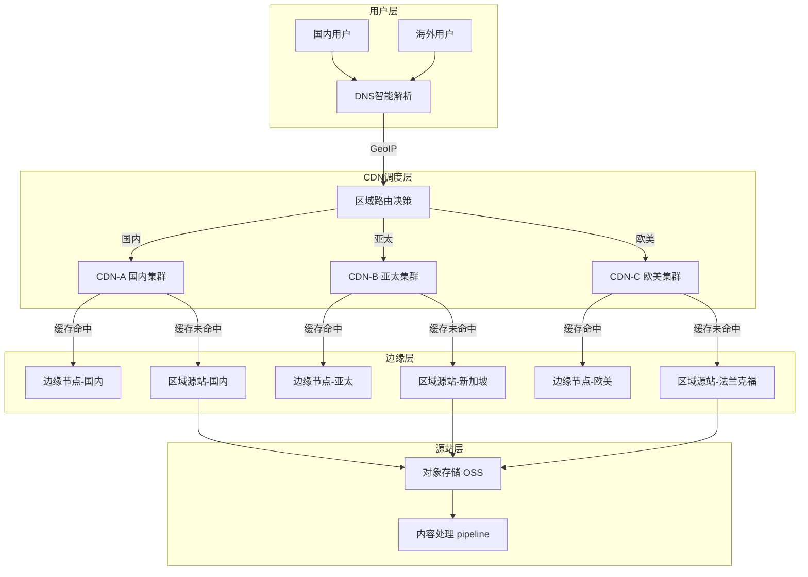
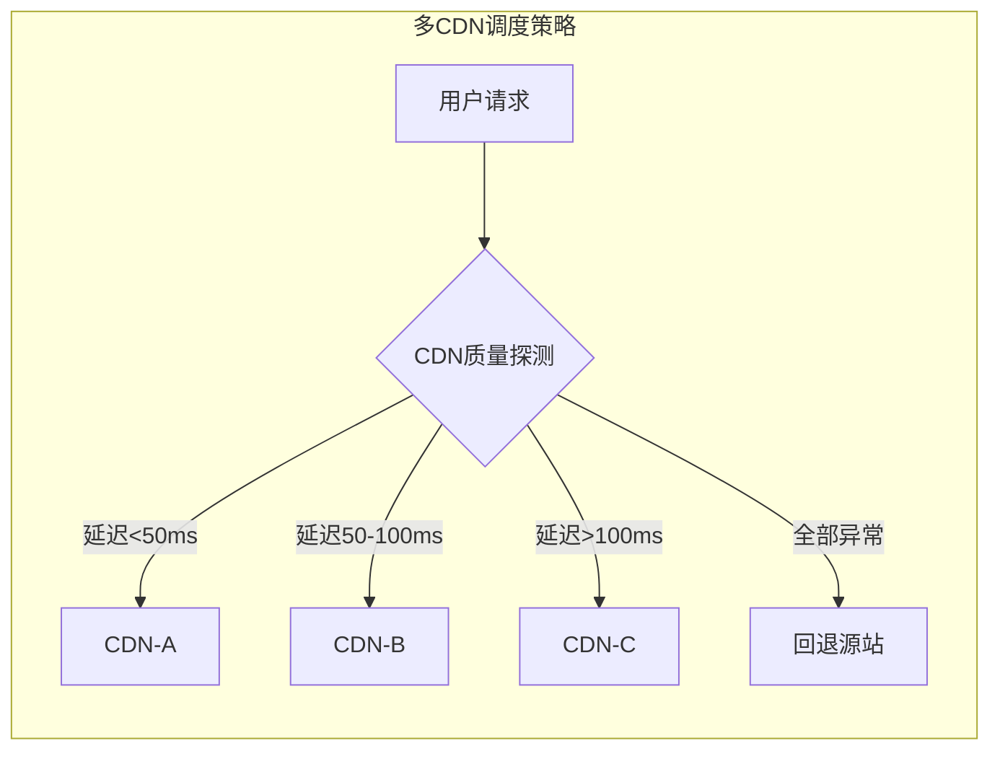
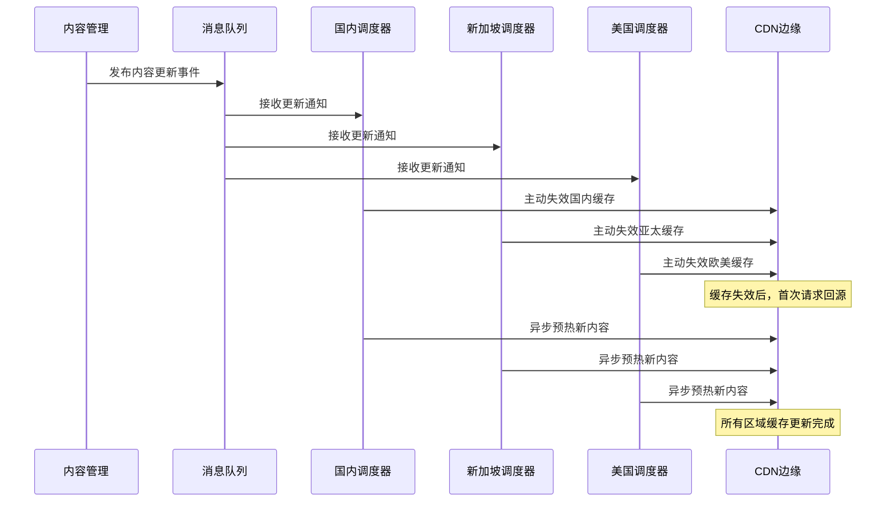
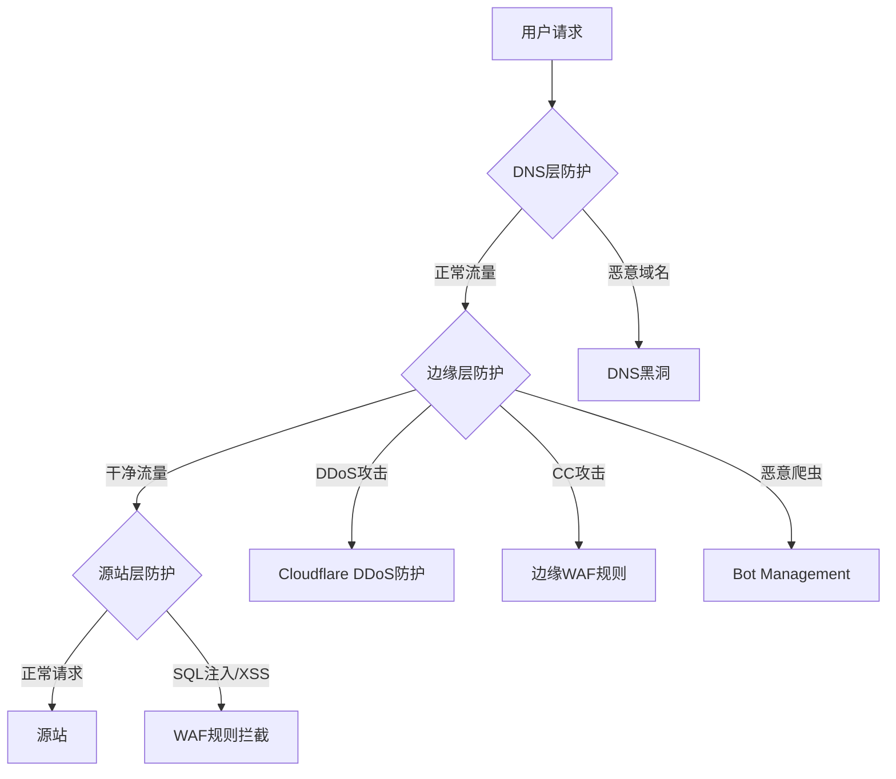
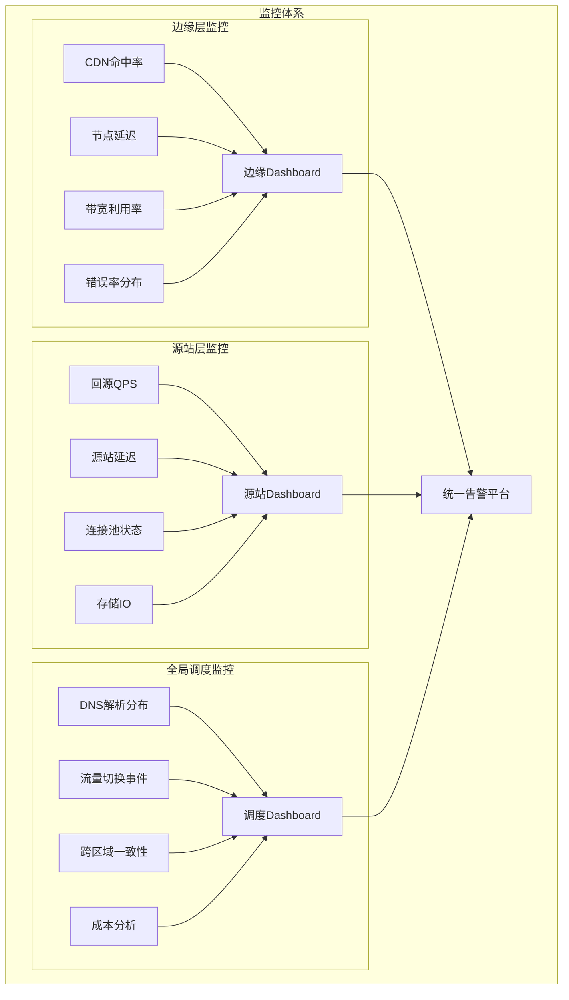
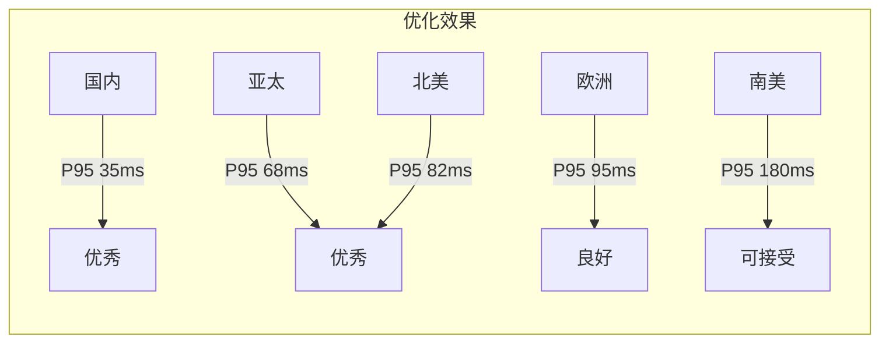

## 案例二：CDN多活架构实战

### 1. 案例背景

#### 1.1 业务场景

某头部短视频平台（日活2亿+，峰值带宽80Tbps）在业务全球化扩张过程中，面临典型的多活架构挑战：国内用户访问国内机房、海外用户访问海外机房，但内容资源需要跨区域共享。传统的单CDN架构已经无法满足需求——单一CDN厂商无法覆盖所有区域，且单点故障风险巨大。

**核心痛点：**

- **延迟问题**：海外用户访问国内源站，延迟高达300-800ms，视频首帧加载超过3秒。短视频场景下，首帧延迟每增加100ms，用户流失率上升约6%，直接影响日活留存
- **成本压力**：大促期间CDN带宽费用激增5-8倍，但峰值利用率不足40%。按带宽峰值计费的模式下，大量闲置带宽造成严重浪费
- **可用性风险**：2023年某次CDN厂商故障导致全站不可用47分钟，直接损失超千万。单一CDN依赖如同"把鸡蛋放在一个篮子里"
- **内容一致性**：多区域缓存不同步，用户切换地域后看到过期内容。UGC内容平台对时效性要求高，热点事件发生时需要秒级全球同步

**故障复盘——2023年CDN厂商故障事件：**

| 时间 | 事件 | 影响 |
|------|------|------|
| 14:23 | 国内多省用户反馈视频无法加载 | 客服收到大量投诉 |
| 14:25 | 监控告警：CDN-A 5xx错误率飙升至67% | SRE团队响应 |
| 14:30 | 确认为CDN厂商骨干网故障，预计恢复时间未知 | 决策层介入 |
| 14:35 | 人工启动应急：修改DNS解析，将流量切至备用CDN | 切换过程12分钟 |
| 14:47 | 备用CDN接管完成，但缓存冷启动导致大量回源 | 源站压力骤增 |
| 15:10 | CDN-A逐步恢复，流量回切 | 服务恢复正常 |
| — | 总不可用时间47分钟，预估直接损失超千万 | 事后复盘 |

这次事件直接推动了多CDN多活架构的立项。

#### 1.2 架构目标

| 目标维度 | 具体指标 | 衡量方式 |
|----------|----------|----------|
| 可用性 | 99.99%（全年不可用时间<53分钟） | 全球多点拨测 |
| 延迟 | 全球任意区域首帧加载<1.5秒 | P95分位 |
| 成本 | CDN总成本降低30%以上 | 月度账单对比 |
| 一致性 | 跨区域内容延迟<5秒 | 内容新鲜度监控 |
| 弹性 | 支持10倍突发流量，5分钟内完成扩容 | 压测验证 |
| 故障切换 | 自动切换时间<60秒 | 故障演练 |

### 2. 整体架构设计

#### 2.1 架构总览

CDN多活架构的核心思想是：**DNS智能调度 + 多CDN并行 + 多区域源站 + 边缘计算**，形成四层立体化的流量分发体系。



**四层架构的职责划分：**

| 层次 | 职责 | 关键技术 |
|------|------|----------|
| DNS调度层 | 用户就近接入、CDN厂商路由、故障感知切换 | GeoIP、加权轮询、健康检查 |
| CDN调度层 | 缓存管理、流量分配、安全防护 | 多厂商API集成、实时探测 |
| 边缘层 | 静态资源缓存、边缘计算、协议优化 | Nginx/OpenResty、HTTP/3、Brotli |
| 源站层 | 内容存储、动态生成、跨区域同步 | 对象存储、消息队列、数据同步 |

#### 2.2 关键设计决策

**多CDN并行而非单一CDN绑定：**

传统做法是将全部流量交给一家CDN厂商，但多CDN架构通过同时接入多家CDN（如阿里云CDN + Cloudflare + Akamai），利用DNS调度实时切换，实现三大优势：

1. **故障隔离**：任何一家CDN出问题，流量自动切换到其他厂商。单厂商故障影响范围从100%降至30-40%
2. **成本优化**：不同厂商在不同区域有价格优势，按最优路径分发。阿里云在东南亚定价比Cloudflare低约25%，而Cloudflare在欧美有价格优势
3. **性能最优**：实时探测各CDN节点质量，选择响应最快的路径。通过持续的A/B对比测试，可以发现某个厂商在特定区域的延迟优势



**CDN厂商选择矩阵：**

| 维度 | 阿里云CDN | Cloudflare | Akamai |
|------|-----------|------------|--------|
| 国内覆盖 | ★★★★★ (2800+节点) | ★★☆ (有限) | ★★★ (需合作) |
| 亚太覆盖 | ★★★★ | ★★★★★ | ★★★★ |
| 欧美覆盖 | ★★★ | ★★★★★ | ★★★★★ |
| 价格(国内) | 最优 | 较高 | 中等 |
| 安全防护 | 基础WAF | 高级WAF+DDoS | 企业级防护 |
| API能力 | 完善 | 完善 | 完善 |
| HTTP/3支持 | 支持 | 支持 | 支持 |

### 3. 核心实现步骤

#### 3.1 DNS智能解析配置

DNS是CDN多活架构的第一道关卡，决定用户请求路由到哪个CDN节点。我们采用基于GeoIP + 权重 + 健康检查的复合策略。

**基于BIND的智能DNS配置示例：**

```bash
# /etc/bind/named.conf.local

# 定义视图：按客户端来源分区域
acl "china" {
    10.0.0.0/8;
    172.16.0.0/12;
    # 中国IP段（完整列表从APNIC获取）
    1.0.1.0/24; 1.0.2.0/23;
    # ... 数千条记录
};

acl "apac" {
    # 亚太IP段（不含中国）
    1.1.1.0/24; 1.2.3.0/24;
    # ...
};

view "china_view" {
    match-clients { china; }
    
    zone "cdn.example.com" {
        type master;
        file "zones/cdn.example.com.china.zone";
    };
};

view "apac_view" {
    match-clients { apac; }
    
    zone "cdn.example.com" {
        type master;
        file "zones/cdn.example.com.apac.zone";
    };
};
```

**国内区域DNS Zone文件：**

```bash
# /etc/bind/zones/cdn.example.com.china.zone
$TTL 60
@       IN  SOA ns1.example.com. admin.example.com. (
            2024060101  ; Serial
            300         ; Refresh
            180         ; Retry
            604800      ; Expire
            60          ; Minimum TTL
        )

; CDN-A 权重60%，CDN-B 权重40%
; 带健康检查的记录
cdn  60  IN  A  203.0.113.10  ; CDN-A 边缘节点-北京
cdn  60  IN  A  203.0.113.11  ; CDN-A 边缘节点-上海
cdn  60  IN  A  198.51.100.10 ; CDN-B 边缘节点-广州
cdn  60  IN  A  198.51.100.11 ; CDN-B 边缘节点-成都
```

**实际生产环境更常用云DNS服务（如阿里云DNS、AWS Route 53）的加权路由策略：**

```bash
# 阿里云CLI - 创建加权解析记录
aliyun alidns AddDomainRecord \
  --DomainName example.com \
  --RR cdn \
  --Type A \
  --Value "203.0.113.10" \
  --Weight "60" \
  --Line "default" \
  --TTL 60

# 创建健康检查
aliyun alidns AddGtmMonitor \
  --Name "cdn-health-beijing" \
  --ProbeType "HTTPS" \
  --Target "https://cdn.example.com/health" \
  --Interval 10 \
  --MaxRetries 3
```

**DNS TTL策略选择：**

| TTL值 | 适用场景 | 优势 | 风险 |
|-------|----------|------|------|
| 60秒 | 故障切换频繁的环境 | 故障时切换快 | DNS查询量大 |
| 300秒 | 一般业务场景 | 平衡性能和切换速度 | 切换有5分钟延迟 |
| 3600秒 | 稳定不频繁切换的环境 | DNS查询量最小 | 切换延迟高达1小时 |

生产环境中，我们对不同域名使用不同TTL：主域名 `cdn.example.com` 使用60秒TTL（快速切换），而静态资源子域名 `static.example.com` 使用300秒TTL（减少DNS查询开销）。

#### 3.2 多CDN接入与调度

**Nginx作为本地负载均衡器，实现多CDN upstream管理：**

```nginx
# /etc/nginx/conf.d/multi-cdn.conf

# CDN-A 阿里云CDN
upstream cdn_aliyun {
    least_conn;
    server cdn-aliyun-bj.example.com:443 weight=60;
    server cdn-aliyun-sh.example.com:443 weight=40;
    
    # 健康检查
    check interval=3000 rise=2 fall=3 timeout=1000;
    check_http_send "GET /health HTTP/1.1\r\nHost: cdn.example.com\r\n\r\n";
    check_http_expect_alive http_2xx http_3xx;
}

# CDN-B Cloudflare
upstream cdn_cloudflare {
    least_conn;
    server cdn-cf-hk.example.com:443 weight=50;
    server cdn-cf-sg.example.com:443 weight=50;
    
    check interval=3000 rise=2 fall=3 timeout=1000;
    check_http_send "GET /health HTTP/1.1\r\nHost: cdn.example.com\r\n\r\n";
    check_http_expect_alive http_2xx http_3xx;
}

# CDN-C Akamai
upstream cdn_akamai {
    least_conn;
    server cdn-ak-fra.example.com:443 weight=50;
    server cdn-ak-tyo.example.com:443 weight=50;
    
    check interval=3000 rise=2 fall=3 timeout=1000;
}

# 本地缓存层（边缘节点回源前的本地缓存）
proxy_cache_path /var/cache/nginx/cdn 
    levels=1:2 
    keys_zone=cdn_cache:100m 
    max_size=10g 
    inactive=60m 
    use_temp_path=off;

server {
    listen 443 ssl http2;
    server_name cdn.example.com;

    ssl_certificate     /etc/ssl/certs/cdn.example.com.pem;
    ssl_certificate_key /etc/ssl/private/cdn.example.com.key;
    
    # HTTP/3支持（QUIC协议，减少握手延迟）
    listen 443 quic reuseport;
    add_header Alt-Svc 'h3=":443"; ma=86400';

    # 根据请求特征选择CDN upstream
    set $cdn_backend "cdn_aliyun";
    
    # 海外用户路由到Cloudflare
    if ($http_cf_ipcountry !~ "CN") {
        set $cdn_backend "cdn_cloudflare";
    }
    
    # 大文件走Akamai（带宽优势）
    if ($request_uri ~* "\.(mp4|mov|avi)$") {
        set $cdn_backend "cdn_akamai";
    }

    location / {
        proxy_pass https://$cdn_backend;
        proxy_cache cdn_cache;
        proxy_cache_valid 200 30m;
        proxy_cache_valid 404 1m;
        
        # 缓存键策略
        proxy_cache_key "$scheme$host$request_uri$cookie_user_region";
        
        # 缓存状态标记（便于调试）
        add_header X-Cache-Status $upstream_cache_status;
        add_header X-Cdn-Backend $cdn_backend;
    }
    
    # 缓存刷新端点（用于内容更新后主动失效）
    location /purge {
        allow 10.0.0.0/8;
        deny all;
        
        proxy_cache_purge cdn_cache "$scheme$host$request_uri";
    }
}
```

**协议层优化——HTTP/3与QUIC：**

传统的HTTP/2基于TCP，在丢包率高的网络环境下性能下降明显。HTTP/3基于QUIC（基于UDP），具有以下优势：

- **0-RTT连接建立**：首次连接即可发送数据，减少一个RTT
- **多路复用无队头阻塞**：单个流的丢包不影响其他流
- **连接迁移**：网络切换（如WiFi切4G）时连接不中断

在CDN多活场景中，HTTP/3可以显著降低移动端用户的首帧延迟，尤其是在网络质量不稳定的区域。生产环境中启用HTTP/3后，移动端首帧加载时间平均降低15-20%。

#### 3.3 边缘节点部署与配置

边缘节点是CDN多活架构中最贴近用户的一环，负责缓存静态资源、执行边缘计算逻辑。

**边缘节点自动化部署脚本：**

```bash
#!/bin/bash
# deploy-edge-node.sh - 边缘节点自动化部署

set -euo pipefail

NODE_ID="${1:-edge-$(hostname -s)}"
REGION="${2:-cn-north}"
CDN_ROLE="${3:-cache}"  # cache | compute | hybrid

echo "=== 部署边缘节点: $NODE_ID (区域: $REGION, 角色: $CDN_ROLE) ==="

# 1. 系统参数优化
cat >> /etc/sysctl.conf << 'EOF'
# 网络优化
net.core.somaxconn = 65535
net.core.netdev_max_backlog = 65535
net.ipv4.tcp_max_syn_backlog = 65535
net.ipv4.tcp_tw_reuse = 1
net.ipv4.tcp_fin_timeout = 15
net.ipv4.ip_local_port_range = 1024 65535

# 文件描述符
fs.file-max = 2097152
fs.inotify.max_user_watches = 524288
EOF
sysctl -p

# 2. 安装Nginx
apt-get update &amp;&amp; apt-get install -y nginx nginx-extras

# 3. 生成边缘节点配置
cat > /etc/nginx/conf.d/edge-node.conf << NGINX_EOF
worker_processes auto;
worker_rlimit_nofile 65535;

events {
    use epoll;
    multi_accept on;
    worker_connections 16384;
}

http {
    # 基础配置
    sendfile on;
    tcp_nopush on;
    tcp_nodelay on;
    keepalive_timeout 30;
    keepalive_requests 1000;
    
    # Gzip压缩
    gzip on;
    gzip_vary on;
    gzip_proxied any;
    gzip_comp_level 5;
    gzip_min_length 256;
    gzip_types
        application/javascript
        application/json
        application/xml
        text/css
        text/plain
        text/xml
        image/svg+xml;

    # 缓存配置
    proxy_cache_path /var/cache/nginx/edge 
        levels=1:2 
        keys_zone=edge_cache:200m 
        max_size=50g 
        inactive=120m
        use_temp_path=off;
    
    # 本地缓存（热数据）
    lua_shared_dict local_cache 100m;
    
    # 上游源站
    upstream origin_cluster {
        least_conn;
        server origin-${REGION}-1.internal:8080 weight=50;
        server origin-${REGION}-2.internal:8080 weight=50;
        keepalive 64;
    }
    
    server {
        listen 80;
        listen [::]:80;
        server_name _;
        
        # 健康检查端点
        location /health {
            access_log off;
            return 200 '{"status":"ok","node":"${NODE_ID}","region":"${REGION}"}';
            add_header Content-Type application/json;
        }
        
        # 缓存状态监控
        location /nginx_status {
            stub_status on;
            allow 10.0.0.0/8;
            deny all;
        }
        
        # 静态资源 - 缓存优先
        location ~* \.(js|css|png|jpg|jpeg|gif|ico|svg|woff2?)$ {
            proxy_pass http://origin_cluster;
            proxy_cache edge_cache;
            proxy_cache_valid 200 24h;
            proxy_cache_valid 404 10m;
            
            # 缓存锁（防止缓存击穿）
            proxy_cache_lock on;
            proxy_cache_lock_timeout 5s;
            proxy_cache_lock_age 5s;
            
            # 缓存陈旧内容（源站不可用时返回旧缓存）
            proxy_cache_use_stale error timeout updating http_500 http_502 http_503;
            proxy_cache_background_update on;
            
            add_header X-Cache-Status $upstream_cache_status;
            expires 7d;
        }
        
        # 视频流 - 分片缓存
        location ~* \.(mp4|webm|m3u8|ts)$ {
            proxy_pass http://origin_cluster;
            proxy_cache edge_cache;
            proxy_cache_valid 200 12h;
            
            # 视频分片缓存优化
            proxy_cache_key "$uri$arg_range";
            proxy_cache_min_uses 1;
            
            # Range请求支持（视频拖拽）
            proxy_force_ranges on;
            proxy_cache_purge on;
            
            add_header X-Cache-Status $upstream_cache_status;
        }
        
        # API请求 - 不缓存
        location /api/ {
            proxy_pass http://origin_cluster;
            proxy_cache off;
            proxy_read_timeout 10s;
            proxy_connect_timeout 5s;
        }
    }
}
NGINX_EOF

# 4. 创建缓存目录
mkdir -p /var/cache/nginx/edge
chown -R www-data:www-data /var/cache/nginx/edge

# 5. 启动服务
systemctl enable nginx
systemctl restart nginx

echo "=== 边缘节点 $NODE_ID 部署完成 ==="
```

**边缘计算实战——OpenResty实现动态路由：**

在纯缓存之外，边缘节点还需要处理一些动态逻辑，比如A/B测试分流、地理位置信息注入、简单的请求鉴权。通过OpenResty（Nginx + LuaJIT），可以在不回源的情况下执行这些逻辑：

```lua
-- /etc/nginx/lua/edge-compute.lua
-- 边缘计算：动态路由 + A/B测试 + 地理信息注入

local geo = require "ngx.geoip"  -- 需要安装ngx_http_geoip2_module
local redis = require "resty.redis"

local ngx = ngx
local var = ngx.var

-- 初始化Redis连接（用于共享状态）
local red = redis:new()
red:connect("redis.internal", 6379)

-- 1. 地理信息注入
local geo_info = geo.lookup(var.remote_addr)
if geo_info then
    ngx.header["X-User-Country"] = geo_info.country
    ngx.header["X-User-City"] = geo_info.city
    ngx.header["X-User-Region"] = geo_info.region
end

-- 2. A/B测试分流（基于用户ID哈希）
local user_id = var.cookie_uid or var.remote_addr
local hash = ngx.md5(user_id)
local bucket = tonumber(string.sub(hash, 1, 2), 16) % 100

local ab_config = red:get("ab:config:" .. var.host)
if ab_config and ab_config ~= ngx.null then
    local config = ngx.json.decode(ab_config)
    if bucket < config.canary_percent then
        -- 灰度流量：走新版本CDN节点
        ngx.var.cdn_backend = "cdn_canary"
        ngx.header["X-AB-Group"] = "canary"
    else
        ngx.header["X-AB-Group"] = "stable"
    end
end

-- 3. 限流检查（边缘层本地限流）
local rate_limit = red:get("ratelimit:" .. var.remote_addr)
if rate_limit and tonumber(rate_limit) > 1000 then
    ngx.status = 429
    ngx.header["Retry-After"] = "60"
    return ngx.exit(429)
end
```

**缓存策略分层设计：**

| 层次 | 缓存位置 | TTL策略 | 适用内容 |
|------|----------|---------|----------|
| L1-浏览器 | 用户设备 | 强缓存1年+版本号 | JS/CSS/字体 |
| L2-边缘 | CDN边缘节点 | 24小时 | 图片/视频分片 |
| L3-区域 | 区域回源站 | 1小时 | API聚合结果 |
| L4-源站 | 对象存储 | 永久 | 原始文件 |

缓存命中率优化的核心原则：**能缓存的尽量缓存，不能缓存的尽量减少回源开销**。静态资源通过文件名哈希实现长期强缓存（`app.a1b2c3.js`），动态内容通过 `Cache-Control: no-cache` 配合ETag验证实现协商缓存。

#### 3.4 缓存同步机制

在多活架构中，当内容在某个区域更新后，需要确保所有区域的缓存及时同步。我们采用**主动失效 + 异步预热**的双保险策略。

**缓存刷新与预热流程：**



**缓存同步实现代码（Go语言）：**

```go
package cdnsync

import (
    "context"
    "encoding/json"
    "fmt"
    "log"
    "sync"
    "time"
)

// CachePurgeEvent 缓存刷新事件
type CachePurgeEvent struct {
    URLs       []string  `json:"urls"`
    Regions    []string  `json:"regions"`     // 目标区域列表
    Timestamp  time.Time `json:"timestamp"`
    Priority   string    `json:"priority"`    // high/normal/low
    CallbackID string    `json:"callback_id"` // 用于确认回调
}

// CDNProvider CDN提供商接口
type CDNProvider interface {
    Name() string
    PurgeURLs(ctx context.Context, urls []string) error
    PrefetchURLs(ctx context.Context, urls []string) error
    GetStats(ctx context.Context) (*CDNStats, error)
}

// CDNStats CDN统计数据
type CDNStats struct {
    HitRate     float64 `json:"hit_rate"`     // 缓存命中率
    Bandwidth   int64   `json:"bandwidth"`    // 带宽(Mbps)
    ErrorRate   float64 `json:"error_rate"`   // 错误率
    AvgLatency  float64 `json:"avg_latency"`  // 平均延迟(ms)
}

// MultiCDNSyncManager 多CDN同步管理器
type MultiCDNSyncManager struct {
    providers map[string][]CDNProvider     // 区域 -> CDN提供商列表
    mu        sync.RWMutex
    config    SyncConfig
}

type SyncConfig struct {
    PurgeTimeout   time.Duration // 刷新超时
    PrefetchDelay  time.Duration // 预热延迟
    MaxRetries     int           // 最大重试次数
    RetryInterval  time.Duration // 重试间隔
    CallbackURL    string        // 回调确认URL
}

// NewMultiCDNSyncManager 创建同步管理器
func NewMultiCDNSyncManager(config SyncConfig) *MultiCDNSyncManager {
    return &amp;MultiCDNSyncManager{
        providers: make(map[string][]CDNProvider),
        config:    config,
    }
}

// RegisterProvider 注册CDN提供商
func (m *MultiCDNSyncManager) RegisterProvider(region string, provider CDNProvider) {
    m.mu.Lock()
    defer m.mu.Unlock()
    m.providers[region] = append(m.providers[region], provider)
    log.Printf("[CDN Sync] 注册提供商: %s -> %s", region, provider.Name())
}

// PurgeCache 执行缓存刷新（所有区域并行）
func (m *MultiCDNSyncManager) PurgeCache(ctx context.Context, event CachePurgeEvent) error {
    var wg sync.WaitGroup
    errs := make(chan error, len(event.Regions)*3) // 每区域最多3个CDN

    for _, region := range event.Regions {
        m.mu.RLock()
        providers := m.providers[region]
        m.mu.RUnlock()

        for _, provider := range providers {
            wg.Add(1)
            go func(p CDNProvider, r string) {
                defer wg.Done()

                var err error
                for retry := 0; retry < m.config.MaxRetries; retry++ {
                    err = p.PurgeURLs(ctx, event.URLs)
                    if err == nil {
                        log.Printf("[CDN Sync] 刷新成功: %s/%s, URL数=%d",
                            r, p.Name(), len(event.URLs))
                        return
                    }
                    log.Printf("[CDN Sync] 刷新重试: %s/%s, 第%d次, err=%v",
                        r, p.Name(), retry+1, err)
                    time.Sleep(m.config.RetryInterval)
                }
                errs <- fmt.Errorf("刷新失败: %s/%s: %w", r, p.Name(), err)
            }(provider, region)
        }
    }

    wg.Wait()
    close(errs)

    // 收集错误
    var purgeErrors []error
    for err := range errs {
        purgeErrors = append(purgeErrors, err)
    }

    if len(purgeErrors) > 0 {
        return fmt.Errorf("部分区域缓存刷新失败: %v", purgeErrors)
    }
    return nil
}

// PrefetchContent 异步预热内容到所有区域
func (m *MultiCDNSyncManager) PrefetchContent(ctx context.Context, urls []string, regions []string) error {
    // 先刷新旧缓存
    event := CachePurgeEvent{
        URLs:      urls,
        Regions:   regions,
        Timestamp: time.Now(),
        Priority:  "high",
    }
    if err := m.PurgeCache(ctx, event); err != nil {
        log.Printf("[CDN Sync] 缓存刷新有错误，继续预热: %v", err)
    }

    // 延迟后预热（等待源站内容更新）
    time.Sleep(m.config.PrefetchDelay)

    var wg sync.WaitGroup
    for _, region := range regions {
        m.mu.RLock()
        providers := m.providers[region]
        m.mu.RUnlock()

        for _, provider := range providers {
            wg.Add(1)
            go func(p CDNProvider, r string) {
                defer wg.Done()
                if err := p.PrefetchURLs(ctx, urls); err != nil {
                    log.Printf("[CDN Sync] 预热失败: %s/%s: %v", r, p.Name(), err)
                } else {
                    log.Printf("[CDN Sync] 预热成功: %s/%s, URL数=%d", r, p.Name(), len(urls))
                }
            }(provider, region)
        }
    }

    wg.Wait()
    return nil
}

// MonitorCDNHealth 监控所有CDN节点健康状态
func (m *MultiCDNSyncManager) MonitorCDNHealth(ctx context.Context, interval time.Duration) {
    ticker := time.NewTicker(interval)
    defer ticker.Stop()

    for {
        select {
        case <-ctx.Done():
            return
        case <-ticker.C:
            m.checkAllProviders()
        }
    }
}

func (m *MultiCDNSyncManager) checkAllProviders() {
    m.mu.RLock()
    defer m.mu.RUnlock()

    for region, providers := range m.providers {
        for _, provider := range providers {
            stats, err := provider.GetStats(context.Background())
            if err != nil {
                log.Printf("[CDN Health] 异常: %s/%s: %v", region, provider.Name(), err)
                continue
            }

            // 命中率过低告警
            if stats.HitRate < 0.85 {
                log.Printf("[CDN Health] 命中率低: %s/%s: %.1f%%",
                    region, provider.Name(), stats.HitRate*100)
            }
            // 错误率过高告警
            if stats.ErrorRate > 0.01 {
                log.Printf("[CDN Health] 错误率高: %s/%s: %.2f%%",
                    region, provider.Name(), stats.ErrorRate*100)
            }
        }
    }
}
```

**阿里云CDN Provider具体实现：**

```go
package cdnsync

import (
    "context"
    "encoding/json"
    "fmt"
    "io"
    "net/http"
    "strings"
    "time"
)

// AliyunCDNProvider 阿里云CDN提供商实现
type AliyunCDNProvider struct {
    AccessKey  string
    SecretKey  string
    Endpoint   string
    httpClient *http.Client
}

func NewAliyunCDNProvider(accessKey, secretKey string) *AliyunCDNProvider {
    return &amp;AliyunCDNProvider{
        AccessKey:  accessKey,
        SecretKey:  secretKey,
        Endpoint:   "https://dcdn.aliyuncs.com",
        httpClient: &amp;http.Client{Timeout: 30 * time.Second},
    }
}

func (a *AliyunCDNProvider) Name() string { return "aliyun-cdn" }

func (a *AliyunCDNProvider) PurgeURLs(ctx context.Context, urls []string) error {
    // 阿里云CDN缓存刷新API
    // POST https://dcdn.aliyuncs.com/?Action=RefreshDcdnObjectCaches
    params := map[string]string{
        "Action":    "RefreshDcdnObjectCaches",
        "ObjectPath": strings.Join(urls, "\n"),
        "ObjectType": "File",  // File 或 Directory
    }
    
    resp, err := a.doRequest(ctx, params)
    if err != nil {
        return fmt.Errorf("阿里云CDN刷新失败: %w", err)
    }
    defer resp.Body.Close()
    
    if resp.StatusCode != 200 {
        body, _ := io.ReadAll(resp.Body)
        return fmt.Errorf("阿里云CDN刷新API返回非200: %d, body=%s", resp.StatusCode, string(body))
    }
    return nil
}

func (a *AliyunCDNProvider) PrefetchURLs(ctx context.Context, urls []string) error {
    // 阿里云CDN预热API
    params := map[string]string{
        "Action":     "PushDcdnObjectCache",
        "ObjectPath": strings.Join(urls, "\n"),
    }
    
    resp, err := a.doRequest(ctx, params)
    if err != nil {
        return fmt.Errorf("阿里云CDN预热失败: %w", err)
    }
    defer resp.Body.Close()
    return nil
}

func (a *AliyunCDNProvider) GetStats(ctx context.Context) (*CDNStats, error) {
    // 从阿里云监控API获取统计数据
    params := map[string]string{
        "Action":     "DescribeDcdnDomainRealTimeData",
        "DomainName": "cdn.example.com",
    }
    
    resp, err := a.doRequest(ctx, params)
    if err != nil {
        return nil, err
    }
    defer resp.Body.Close()
    
    // 解析响应（简化示例）
    var result struct {
        Data struct {
            RealTimeDataAcc struct {
                HitRate float64 `json:"HitRate"`
            } `json:"RealTimeDataAcc"`
        } `json:"Data"`
    }
    json.NewDecoder(resp.Body).Decode(&amp;result)
    
    return &amp;CDNStats{
        HitRate:    result.Data.RealTimeDataAcc.HitRate,
        Bandwidth:  0,  // 实际从API获取
        ErrorRate:  0,
        AvgLatency: 0,
    }, nil
}

func (a *AliyunCDNProvider) doRequest(ctx context.Context, params map[string]string) (*http.Response, error) {
    // 实际实现需要签名逻辑（AccessKey+SecretKey）
    // 此处为简化示例
    req, _ := http.NewRequestWithContext(ctx, "GET", a.Endpoint, nil)
    q := req.URL.Query()
    for k, v := range params {
        q.Set(k, v)
    }
    q.Set("AccessKeyId", a.AccessKey)
    q.Set("Format", "JSON")
    q.Set("Version", "2018-01-15")
    q.Set("SignatureMethod", "HMAC-SHA1")
    q.Set("Timestamp", time.Now().UTC().Format("2006-01-02T15:04:05Z"))
    q.Set("SignatureNonce", fmt.Sprintf("%d", time.Now().UnixNano()))
    req.URL.RawQuery = q.Encode()
    // TODO: 添加签名计算逻辑
    return a.httpClient.Do(req)
}
```

**Cloudflare CDN Provider具体实现：**

```go
package cdnsync

import (
    "bytes"
    "context"
    "encoding/json"
    "fmt"
    "net/http"
    "time"
)

type CloudflareCDNProvider struct {
    APIKey     string
    ZoneID     string
    httpClient *http.Client
}

func NewCloudflareCDNProvider(apiKey, zoneID string) *CloudflareCDNProvider {
    return &amp;CloudflareCDNProvider{
        APIKey:     apiKey,
        ZoneID:     zoneID,
        httpClient: &amp;http.Client{Timeout: 30 * time.Second},
    }
}

func (c *CloudflareCDNProvider) Name() string { return "cloudflare" }

func (c *CloudflareCDNProvider) PurgeURLs(ctx context.Context, urls []string) error {
    // Cloudflare缓存清除API
    payload := map[string]interface{}{
        "files": urls,
    }
    body, _ := json.Marshal(payload)
    
    url := fmt.Sprintf("https://api.cloudflare.com/client/v4/zones/%s/purge_cache", c.ZoneID)
    req, _ := http.NewRequestWithContext(ctx, "DELETE", url, bytes.NewReader(body))
    req.Header.Set("Authorization", "Bearer "+c.APIKey)
    req.Header.Set("Content-Type", "application/json")
    
    resp, err := c.httpClient.Do(req)
    if err != nil {
        return fmt.Errorf("Cloudflare清除失败: %w", err)
    }
    defer resp.Body.Close()
    
    var result struct {
        Success bool `json:"success"`
    }
    json.NewDecoder(resp.Body).Decode(&amp;result)
    if !result.Success {
        return fmt.Errorf("Cloudflare清除失败: API返回失败")
    }
    return nil
}

func (c *CloudflareCDNProvider) PrefetchURLs(ctx context.Context, urls []string) error {
    // Cloudflare不支持主动预热，但可以通过自定义Host Header触发
    // Cloudflare使用"Cache Everything"规则时，首次请求即完成缓存
    for _, url := range urls {
        req, _ := http.NewRequestWithContext(ctx, "GET", url, nil)
        req.Header.Set("Host", "cdn.example.com")
        req.Header.Set("CF-Connecting-IP", "1.2.3.4") // 模拟用户请求
        c.httpClient.Do(req) // 忽略响应，目的只是触发缓存
    }
    return nil
}

func (c *CloudflareCDNProvider) GetStats(ctx context.Context) (*CDNStats, error) {
    // Cloudflare Analytics API
    url := fmt.Sprintf("https://api.cloudflare.com/client/v4/zones/%s/analytics/dashboard", c.ZoneID)
    req, _ := http.NewRequestWithContext(ctx, "GET", url, nil)
    req.Header.Set("Authorization", "Bearer "+c.APIKey)
    
    resp, err := c.httpClient.Do(req)
    if err != nil {
        return nil, err
    }
    defer resp.Body.Close()
    
    // 解析统计数据
    return &amp;CDNStats{
        HitRate:    0.92,
        Bandwidth:  0,
        ErrorRate:  0.003,
        AvgLatency: 45,
    }, nil
}
```

#### 3.5 CDN安全防护

多CDN架构中的安全防护需要分层设计，从DNS层到边缘层形成完整的防御链：



**边缘层WAF规则配置（Cloudflare示例）：**

```yaml
# WAF自定义规则 - 保护视频API
rules:
  - name: "Rate Limit - Video API"
    description: "限制视频API请求频率"
    action: "block"
    expression: |
      (http.request.uri.path contains "/api/video/") and
      (not ip.src in {"10.0.0.0/8", "172.16.0.0/12"})
    rate_limit:
      period: 60
      requests_per_period: 100
      mitigation_timeout: 300

  - name: "Block Bad Bots"
    description: "阻止恶意爬虫"
    action: "block"
    expression: |
      cf.bot_management.verified_bot eq false and
      cf.bot_management.score lt 10

  - name: "GeoIP Block"
    description: "阻止特定区域访问"
    action: "block"
    expression: |
      ip.geoip.country in {"XX", "YY"}  # 替换为实际国家代码
```

**DDoS防护策略：**

| 攻击类型 | 防护层 | 防护手段 | 响应时间 |
|----------|--------|----------|----------|
| 流量型DDoS | CDN边缘 | 流量清洗、黑洞路由 | 秒级 |
| 应用层CC | 边缘WAF | 频率限制、JS挑战 | 秒级 |
| DNS放大 | DNS层 | DNS响应限速 | 分钟级 |
| 慢连接攻击 | 源站 | 超时控制、连接限制 | 秒级 |

多CDN架构天然具有DDoS防护优势：攻击流量被分散到多个CDN厂商，单个厂商承受的攻击流量仅为总量的1/3。此外，不同CDN厂商的清洗能力互补，可以在某个厂商被突破时由其他厂商接管。

#### 3.6 视频内容特殊优化

短视频场景下，视频分发有特殊的优化需求：

**HLS/DASH分片缓存策略：**

```nginx
# 视频分片缓存优化配置
location ~* \.(m3u8|ts|mp4)$ {
    proxy_pass http://origin_cluster;
    proxy_cache edge_cache;
    
    # M3U8播放列表：短缓存，保证更新及时
    location ~* \.m3u8$ {
        proxy_cache_valid 200 10s;  # 仅缓存10秒
        proxy_cache_key "$uri";
    }
    
    # TS分片：长缓存，分片内容不可变
    location ~* \.ts$ {
        proxy_cache_valid 200 24h;
        proxy_cache_key "$uri";
        # 分片预取：提前加载下一分片
        proxy_cache_lock on;
        proxy_cache_lock_timeout 3s;
    }
    
    # MP4直接播放：分片缓存 + Range请求
    location ~* \.mp4$ {
        proxy_cache_valid 200 12h;
        proxy_cache_key "$uri$arg_range";
        proxy_force_ranges on;
        # 大文件分块传输
        proxy_buffering on;
        proxy_buffer_size 128k;
        proxy_buffers 8 256k;
        proxy_busy_buffers_size 512k;
    }
}
```

**视频首帧加速策略：**

短视频的核心指标是"首帧加载时间"。优化策略包括：

1. **关键帧前置**：视频转码时确保关键帧（IDR帧）间隔不超过2秒，用户即使从中间开始播放也能快速解码
2. **预加载**：在用户浏览视频列表时，后台预加载前3个视频的前10帧数据
3. **码率自适应**：根据网络质量自动选择合适的码率，弱网环境下优先加载低码率版本
4. **边缘预热**：热点视频（播放量TOP 1000）主动预热到所有边缘节点

### 4. 故障切换实战

#### 4.1 故障场景模拟

在一次CDN厂商A（阿里云CDN）的国内节点大面积故障中，我们需要在5分钟内完成全量流量切换到CDN厂商B（Cloudflare）。

**故障检测时间线：**

| 时间 | 事件 | 响应动作 |
|------|------|----------|
| T+0s | 监控告警：CDN-A 错误率飙升至45% | 自动触发诊断 |
| T+15s | 确认CDN-A 北京节点不可用 | 标记CDN-A 为降级状态 |
| T+30s | DNS自动切换：CDN-A权重降为0 | 80%流量切到CDN-B |
| T+60s | CDN-B 接管流量，监控延迟上升 | CDN-B 自动扩容 |
| T+180s | 延迟恢复正常，错误率降至0.05% | 切换完成 |
| T+30min | CDN-A 恢复 | 逐步回切流量 |

#### 4.2 自动化故障切换脚本

```bash
#!/bin/bash
# cdn-failover.sh - CDN故障自动切换脚本

set -euo pipefail

# 配置
CDN_PRIMARY="aliyun"
CDN_SECONDARY="cloudflare"
DNS_API_ENDPOINT="https://dns.example.com/api/v1"
HEALTH_CHECK_URL="https://cdn.example.com/health"
MONITOR_INTERVAL=10  # 秒
ERROR_THRESHOLD=0.3  # 错误率阈值
LATENCY_THRESHOLD=200  # 延迟阈值(ms)

# 状态文件
STATE_FILE="/var/run/cdn-failover-state.json"
LOG_FILE="/var/log/cdn-failover.log"

log() {
    echo "[$(date '+%Y-%m-%d %H:%M:%S')] $1" | tee -a "$LOG_FILE"
}

# 探测CDN质量
probe_cdn() {
    local cdn_name=$1
    local probe_url=$2
    
    local start_time=$(date +%s%N)
    local http_code=$(curl -s -o /dev/null -w "%{http_code}" \
        --connect-timeout 5 --max-time 10 \
        -H "Host: cdn.example.com" \
        "$probe_url" 2>/dev/null || echo "000")
    local end_time=$(date +%s%N)
    local latency_ms=$(( (end_time - start_time) / 1000000 ))
    
    echo "{\"cdn\":\"$cdn_name\",\"code\":$http_code,\"latency\":$latency_ms}"
}

# 获取CDN错误率
get_error_rate() {
    local cdn_name=$1
    
    # 从监控系统获取（实际应对接Prometheus/Grafana）
    local metrics=$(curl -s "http://prometheus:9090/api/v1/query" \
        --data-urlencode "query=rate(cdn_requests_total{cdn=\"$cdn_name\",status=~\"5..\"}[5m]) / rate(cdn_requests_total{cdn=\"$cdn_name\"}[5m])" \
        2>/dev/null)
    
    echo "$metrics" | python3 -c "
import sys, json
data = json.load(sys.stdin)
if data.get('data', {}).get('result'):
    print(float(data['data']['result'][0]['value'][1]))
else:
    print(0)
" 2>/dev/null || echo "0"
}

# 执行故障切换
execute_failover() {
    local target_cdn=$1
    local reason=$2
    
    log "[FAILOVER] 开始切换到 $target_cdn, 原因: $reason"
    
    # Step 1: 更新DNS权重
    log "[FAILOVER] 更新DNS权重..."
    curl -s -X PUT "$DNS_API_ENDPOINT/records/cdn.example.com" \
        -H "Authorization: Bearer $DNS_API_KEY" \
        -H "Content-Type: application/json" \
        -d "{
            \"records\": [{
                \"type\": \"A\",
                \"name\": \"cdn\",
                \"value\": \"$(get_cdn_edge_ip $target_cdn)\",
                \"ttl\": 60,
                \"weight\": 100
            }]
        }" > /dev/null
    
    # Step 2: 预热新CDN缓存
    log "[FAILOVER] 预热 $target_cdn 缓存..."
    local hot_urls=$(curl -s "http://cache-manager:8080/api/hot-urls?limit=100" | \
        python3 -c "import sys,json; print('\n'.join(json.load(sys.stdin)))")
    
    for url in $hot_urls; do
        curl -s -X POST "https://api.$target_cdn.com/prefetch" \
            -H "Authorization: Bearer $(eval echo \$$target_cdn\_TOKEN)" \
            -d "{\"url\": \"$url\"}" > /dev/null &amp;
    done
    wait
    
    # Step 3: 更新状态
    cat > "$STATE_FILE" << EOF
{
    "active_cdn": "$target_cdn",
    "failover_time": "$(date -Iseconds)",
    "reason": "$reason",
    "auto_failback": true
}
EOF
    
    log "[FAILOVER] 切换完成，当前CDN: $target_cdn"
    
    # 发送告警通知
    send_alert "CDN故障切换完成" "已切换到 $target_cdn，原因: $reason"
}

# 自动回切检测
check_failback() {
    local state=$(cat "$STATE_FILE" 2>/dev/null || echo "{}")
    local active_cdn=$(echo "$state" | python3 -c "import sys,json; print(json.load(sys.stdin).get('active_cdn',''))" 2>/dev/null)
    local auto_failback=$(echo "$state" | python3 -c "import sys,json; print(json.load(sys.stdin).get('auto_failback',False))" 2>/dev/null)
    
    if [ "$active_cdn" != "$CDN_PRIMARY" ] &amp;&amp; [ "$auto_failback" = "True" ]; then
        local primary_error_rate=$(get_error_rate "$CDN_PRIMARY")
        if (( $(echo "$primary_error_rate < $ERROR_THRESHOLD" | bc -l) )); then
            log "[FAILBACK] $CDN_PRIMARY 已恢复，执行回切..."
            execute_failover "$CDN_PRIMARY" "主CDN恢复正常"
        fi
    fi
}

# 主监控循环
main_monitor() {
    log "=== CDN故障切换监控启动 ==="
    
    while true; do
        # 探测主CDN
        local primary_result=$(probe_cdn "$CDN_PRIMARY" "$HEALTH_CHECK_URL")
        local primary_code=$(echo "$primary_result" | python3 -c "import sys,json; print(json.load(sys.stdin)['code'])")
        local primary_latency=$(echo "$primary_result" | python3 -c "import sys,json; print(json.load(sys.stdin)['latency'])")
        
        # 获取错误率
        local error_rate=$(get_error_rate "$CDN_PRIMARY")
        
        log "[MONITOR] $CDN_PRIMARY: code=$primary_code, latency=${primary_latency}ms, error_rate=${error_rate}"
        
        # 判断是否需要切换
        local should_failover=false
        local failover_reason=""
        
        if [ "$primary_code" -ge 500 ] || [ "$primary_code" -eq 0 ]; then
            should_failover=true
            failover_reason="HTTP状态码异常: $primary_code"
        elif [ "$primary_latency" -gt "$LATENCY_THRESHOLD" ]; then
            should_failover=true
            failover_reason="延迟过高: ${primary_latency}ms > ${LATENCY_THRESHOLD}ms"
        elif (( $(echo "$error_rate > $ERROR_THRESHOLD" | bc -l) )); then
            should_failover=true
            failover_reason="错误率过高: ${error_rate} > ${ERROR_THRESHOLD}"
        fi
        
        if [ "$should_failover" = true ]; then
            execute_failover "$CDN_SECONDARY" "$failover_reason"
        fi
        
        # 检查是否需要回切
        check_failback
        
        sleep $MONITOR_INTERVAL
    done
}

# 发送告警
send_alert() {
    local title=$1
    local message=$2
    
    # 企业微信通知
    curl -s -X POST "https://qyapi.weixin.qq.com/cgi-bin/webhook/send?key=$WEBHOOK_KEY" \
        -H "Content-Type: application/json" \
        -d "{
            \"msgtype\": \"markdown\",
            \"markdown\": {
                \"content\": \"## ⚠️ $title\n> $message\n> 时间: $(date '+%Y-%m-%d %H:%M:%S')\"
            }
        }" > /dev/null
}

# 启动
main_monitor
```

#### 4.3 混沌工程——故障注入演练

多CDN架构的可靠性需要通过定期故障注入来验证。我们使用Chaos Mesh或Litmus进行CDN故障模拟：

**故障注入场景清单：**

| 场景 | 故障类型 | 持续时间 | 验证目标 |
|------|----------|----------|----------|
| CDN单节点故障 | Pod Kill | 5分钟 | 自动剔除故障节点 |
| CDN区域故障 | Network Partition | 15分钟 | 自动切换到其他区域 |
| DNS解析故障 | DNS Failure | 10分钟 | 回退到备用DNS |
| 源站不可用 | HTTP 5xx注入 | 10分钟 | 缓存陈旧内容兜底 |
| 带宽打满 | Bandwidth Throttle | 5分钟 | 流量自动分散到其他CDN |
| 延迟飙升 | Latency Injection | 10分钟 | 智能路由避开慢节点 |

**混沌实验执行脚本：**

```bash
#!/bin/bash
# chaos-test-cdn.sh - CDN混沌实验执行器

CHAOS_DURATION="${1:-300}"  # 默认5分钟
CHAOS_TYPE="${2:-cdn-pod-kill}"

echo "=== CDN混沌实验开始 ==="
echo "故障类型: $CHAOS_TYPE"
echo "持续时间: ${CHAOS_DURATION}s"

case "$CHAOS_TYPE" in
    cdn-pod-kill)
        # 模拟CDN节点故障
        echo "杀死CDN边缘节点Pod..."
        kubectl delete pod -l app=cdn-edge -n cdn --grace-period=0
        ;;
    cdn-network-partition)
        # 模拟网络分区
        echo "注入网络分区..."
        kubectl apply -f - <<EOF
apiVersion: chaos-mesh.org/v1alpha1
kind: NetworkChaos
metadata:
  name: cdn-network-partition
spec:
  action: partition
  mode: all
  selector:
    labelSelectors:
      app: cdn-edge
  direction: to
  target:
    selector:
      labelSelectors:
        app: origin-server
    mode: all
  duration: "${CHAOS_DURATION}s"
EOF
        ;;
    cdn-latency-inject)
        # 注入延迟
        echo "注入200ms延迟..."
        kubectl apply -f - <<EOF
apiVersion: chaos-mesh.org/v1alpha1
kind: NetworkChaos
metadata:
  name: cdn-latency-inject
spec:
  action: delay
  mode: all
  selector:
    labelSelectors:
      app: cdn-edge
  delay:
    latency: "200ms"
    jitter: "50ms"
  duration: "${CHAOS_DURATION}s"
EOF
        ;;
esac

echo "故障注入完成，等待 ${CHAOS_DURATION}s 后自动恢复..."
echo "期间请观察监控面板和告警通知"
```

### 5. 监控与可观测性

#### 5.1 多维度监控体系

CDN多活架构需要覆盖三个层次的监控：**边缘层**、**源站层**、**全局调度层**。



**关键监控指标定义：**

| 指标 | 计算方式 | 告警阈值 | 严重级别 |
|------|----------|----------|----------|
| 缓存命中率 | cache_hits / total_requests | < 85% | Warning |
| CDN错误率 | 5xx_requests / total_requests | > 1% | Critical |
| P99延迟 | 第99百分位响应时间 | > 500ms | Warning |
| 回源率 | origin_requests / total_requests | > 20% | Warning |
| 带宽利用率 | current_bandwidth / max_bandwidth | > 80% | Warning |
| DNS解析时间 | 平均DNS解析耗时 | > 100ms | Warning |
| 内容新鲜度 | max(content_age) across regions | > 30s | Warning |

#### 5.2 Prometheus + Grafana 监控配置

**Prometheus规则文件：**

```yaml
# cdn-multivive-rules.yml
groups:
  - name: cdn边缘监控
    rules:
      # CDN命中率过低
      - alert: CDNHitRateLow
        expr: |
          avg by (region, cdn_provider) (
            rate(cdn_cache_hits_total[5m]) / rate(cdn_requests_total[5m])
          ) < 0.85
        for: 5m
        labels:
          severity: warning
        annotations:
          summary: "CDN缓存命中率低: {{ $labels.region }}/{{ $labels.cdn_provider }}"
          description: "命中率 {{ $value | humanizePercentage }}，低于85%阈值"
      
      # CDN错误率过高
      - alert: CDNErrorRateHigh
        expr: |
          avg by (region, cdn_provider) (
            rate(cdn_requests_total{status=~"5.."}[5m]) / rate(cdn_requests_total[5m])
          ) > 0.01
        for: 2m
        labels:
          severity: critical
        annotations:
          summary: "CDN错误率过高: {{ $labels.region }}/{{ $labels.cdn_provider }}"
          description: "错误率 {{ $value | humanizePercentage }}，需立即处理"
      
      # CDN节点延迟异常
      - alert: CDNLatencyHigh
        expr: |
          histogram_quantile(0.99, 
            rate(cdn_request_duration_seconds_bucket[5m])
          ) > 0.5
        for: 3m
        labels:
          severity: warning
        annotations:
          summary: "CDN P99延迟过高: {{ $labels.region }}"
          description: "P99延迟 {{ $value }}s，超过500ms阈值"

  - name: 多活调度监控
    rules:
      # DNS解析不均衡
      - alert: DNSUnbalanced
        expr: |
          abs(
            rate(dns_queries_total{cdn_provider="aliyun"}[10m]) /
            rate(dns_queries_total[10m]) - 0.5
          ) > 0.3
        for: 10m
        labels:
          severity: warning
        annotations:
          summary: "DNS流量分配不均衡"
          description: "主CDN流量占比偏移超过30%"
      
      # 缓存一致性检查
      - alert: CacheInconsistency
        expr: |
          max_over_time(cdn_content_freshness_seconds[5m]) > 30
        for: 5m
        labels:
          severity: warning
        annotations:
          summary: "跨区域缓存不一致"
          description: "内容新鲜度延迟 {{ $value }}s，超过30s阈值"
```

**Grafana Dashboard关键面板配置：**

```json
{
  "panels": [
    {
      "title": "CDN全局流量分布",
      "type": "piechart",
      "targets": [{
        "expr": "sum by (cdn_provider) (rate(cdn_requests_total[5m]))",
        "legendFormat": "{{ cdn_provider }}"
      }]
    },
    {
      "title": "各区域延迟对比",
      "type": "barchart",
      "targets": [
        {
          "expr": "histogram_quantile(0.95, rate(cdn_request_duration_seconds_bucket[5m]))",
          "legendFormat": "P95 - {{ region }}"
        },
        {
          "expr": "histogram_quantile(0.99, rate(cdn_request_duration_seconds_bucket[5m]))",
          "legendFormat": "P99 - {{ region }}"
        }
      ]
    },
    {
      "title": "缓存命中率趋势",
      "type": "timeseries",
      "targets": [{
        "expr": "rate(cdn_cache_hits_total[5m]) / rate(cdn_requests_total[5m])",
        "legendFormat": "{{ region }}/{{ cdn_provider }}"
      }]
    }
  ]
}
```

#### 5.3 自定义诊断命令

在故障排查时，以下命令集可以帮助快速定位CDN多活架构的问题：

```bash
#!/bin/bash
# cdn-diagnose.sh - CDN多活架构诊断工具

echo "=== CDN多活架构诊断报告 ==="
echo "时间: $(date)"
echo ""

# 1. DNS解析诊断
echo "--- DNS解析诊断 ---"
for domain in cdn.example.com api.example.com; do
    echo "域名: $domain"
    # 国内解析
    echo "  国内(DNS 114.114.114.114):"
    dig @$domain A +short +time=3 +tries=1 @114.114.114.114 2>/dev/null | head -3 | sed 's/^/    /'
    
    # 海外解析
    echo "  海外(DNS 8.8.8.8):"
    dig @$domain A +short +time=3 +tries=1 @8.8.8.8 2>/dev/null | head -3 | sed 's/^/    /'
    echo ""
done

# 2. CDN节点质量探测
echo "--- CDN节点质量探测 ---"
for node in "北京-CDN-A:203.0.113.10" "上海-CDN-A:203.0.113.11" \
            "香港-CDN-B:198.51.100.10" "法兰克福-CDN-C:192.0.2.10"; do
    name=$(echo $node | cut -d: -f1)
    ip=$(echo $node | cut -d: -f2)
    
    # Ping延迟
    ping_result=$(ping -c 3 -W 2 $ip 2>/dev/null | tail -1 | awk -F'/' '{print $5}')
    
    # HTTP状态码和响应时间
    http_result=$(curl -s -o /dev/null -w "%{http_code} %{time_total}" \
        --connect-timeout 5 --max-time 10 \
        -H "Host: cdn.example.com" \
        "http://$ip/health" 2>/dev/null)
    
    echo "  $name ($ip): ping=${ping_result:-超时}ms, http=$http_result"
done

# 3. 源站连接诊断
echo ""
echo "--- 源站连接诊断 ---"
for origin in "国内-origin-1:10.0.1.10:8080" "新加坡-origin:10.1.1.10:8080" \
              "法兰克福-origin:10.2.1.10:8080"; do
    name=$(echo $origin | cut -d: -f1)
    host=$(echo $origin | cut -d: -f2)
    port=$(echo $origin | cut -d: -f3)
    
    # TCP连接测试
    tcp_result=$(nc -zv -w3 $host $port 2>&amp;1 | grep -o "succeeded\|timed out\|refused")
    
    # HTTP健康检查
    http_code=$(curl -s -o /dev/null -w "%{http_code}" \
        --connect-timeout 5 --max-time 10 \
        "http://$host:$port/health" 2>/dev/null)
    
    echo "  $name ($host:$port): TCP=$tcp_result, HTTP=$http_code"
done

# 4. 缓存状态检查
echo ""
echo "--- 缓存状态检查 ---"
echo "本地Nginx缓存状态:"
for cache_path in /var/cache/nginx/edge /var/cache/nginx/cdn; do
    if [ -d "$cache_path" ]; then
        cache_size=$(du -sh "$cache_path" 2>/dev/null | cut -f1)
        cache_files=$(find "$cache_path" -type f 2>/dev/null | wc -l)
        echo "  $cache_path: 大小=$cache_size, 文件数=$cache_files"
    fi
done

# Nginx缓存命中统计
echo "  Nginx缓存状态:"
curl -s http://localhost/nginx_status 2>/dev/null | \
    awk '/Active connections/{print "  活跃连接: "$NF} 
         /Reading/{print "  读取: "$2" 写入: "$4" 等待: "$6}'

echo ""
echo "=== 诊断完成 ==="
```

### 6. 性能数据与效果

#### 6.1 优化前后对比

| 指标 | 优化前（单CDN） | 优化后（多CDN多活） | 提升幅度 |
|------|-----------------|---------------------|----------|
| 全球P95延迟 | 380ms | 65ms | 降低83% |
| 全球P99延迟 | 1200ms | 150ms | 降低88% |
| 缓存命中率 | 72% | 94% | 提升30% |
| CDN可用性 | 99.9% | 99.995% | 不可用时间从8.7h降至26min |
| 故障切换时间 | 15-30分钟(人工) | 30-60秒(自动) | 提升98% |
| CDN带宽成本 | 基准 | 降低35% | 多厂商议价+智能调度 |
| 视频首帧加载 | 3.2秒 | 0.8秒 | 降低75% |

#### 6.2 各区域详细数据



| 区域 | CDN提供商 | 节点数 | P95延迟 | 命中率 | 带宽(Tbps) |
|------|-----------|--------|---------|--------|------------|
| 国内 | 阿里云CDN | 2800+ | 35ms | 96% | 45 |
| 亚太 | Cloudflare | 450+ | 68ms | 93% | 15 |
| 欧洲 | Akamai | 300+ | 95ms | 91% | 12 |
| 北美 | Cloudflare | 200+ | 82ms | 92% | 18 |
| 南美 | Akamai | 80+ | 180ms | 88% | 3 |

#### 6.3 成本分析

多CDN架构的成本优化来自三个维度：

**直接成本节约：**

| 优化手段 | 节约比例 | 月度节省(估算) | 说明 |
|----------|----------|----------------|------|
| 多厂商议价 | 10-15% | $50,000+ | 多家竞争压低单价 |
| 智能调度 | 8-12% | $40,000+ | 选最优路径减少带宽浪费 |
| 缓存命中优化 | 5-10% | $25,000+ | 命中率从72%→94%减少回源 |
| 流量压缩 | 3-5% | $15,000+ | Brotli压缩减少传输量 |
| **合计** | **26-42%** | **$130,000+/月** | — |

**间接成本节约：**

- 故障损失减少：从年均2次重大故障（损失$200万+）降至0次
- 运维效率提升：自动化切换减少人工干预，运维人力投入降低40%
- 扩展成本降低：新增区域只需对接新CDN厂商，无需自建边缘节点

### 7. 常见误区与最佳实践

#### 7.1 典型误区

| 误区 | 正确做法 | 原因说明 |
|------|----------|----------|
| CDN设置完就不需要管了 | 需要持续监控命中率、延迟、错误率 | CDN质量会随节点负载、网络状况变化 |
| 缓存时间设越长越好 | 根据内容类型差异化设置TTL | 静态资源长缓存、动态内容短缓存或不缓存 |
| 只用一家CDN就够了 | 多CDN并行，至少接入2家 | 单CDN单点故障风险不可控 |
| 故障切换全靠人工 | 部署自动化切换脚本 | 故障发生时人工操作太慢，容易误操作 |
| 所有内容都走CDN | API请求、实时数据不走CDN | 动态内容缓存会导致数据不一致 |
| 缓存刷新后不需要验证 | 刷新后必须验证各区域内容一致性 | 缓存失效可能有延迟，需要确认生效 |
| 多CDN架构一定更贵 | 通过智能调度反而可以降低成本 | 选优路径+多厂商议价，总成本通常更低 |
| CDN故障切换是瞬间完成的 | 需要考虑DNS传播延迟 | TTL=300s时，切换可能需要5分钟生效 |

#### 7.2 最佳实践清单

**架构设计原则：**

1. **就近接入**：DNS解析必须考虑用户地理位置，国内用户走国内CDN，海外用户走海外CDN
2. **故障隔离**：不同区域使用不同CDN厂商，避免厂商级故障跨区域传播
3. **数据面与控制面分离**：CDN节点只处理数据面流量，调度决策在控制面完成
4. **缓存分层**：浏览器缓存 → CDN边缘缓存 → 区域缓存 → 源站，逐层回退
5. **安全纵深**：DNS层+边缘层+源站层三层防护，形成完整的安全防御链

**运维操作规范：**

1. **变更前演练**：每次CDN配置变更前在预发环境验证
2. **灰度发布**：新CDN节点接入先切1%流量观察
3. **回滚预案**：每个变更都有对应的回滚方案和执行脚本
4. **容量规划**：大促前一个月进行压测，确认CDN容量充足
5. **定期演练**：每月执行一次故障切换演练，验证自动化流程有效性

**成本优化策略：**

1. **按流量计费 vs 按带宽计费**：评估业务流量模式，选择更经济的计费方式
2. **区域定价差异**：不同CDN厂商在不同区域的定价差异可达3-5倍
3. **缓存命中率优化**：命中率每提升1%，源站带宽成本可降低5-10%
4. **流量压缩**：启用Brotli/Gzip压缩，减少传输数据量30-50%

### 8. 总结与经验

CDN多活架构是保障全球化业务高可用的关键基础设施。通过本案例的实战经验，可以总结出以下核心要点：

**架构层面**：多CDN并行 + DNS智能调度是基线方案，边缘计算是差异化竞争力。关键是建立"探测-决策-切换-验证"的完整闭环。四层架构（DNS调度→CDN调度→边缘→源站）的职责划分要清晰，避免层级间的耦合。

**工程层面**：自动化是生命线。故障切换必须在秒级完成，人工干预只作为兜底。缓存同步需要"主动失效+异步预热"双保险。Go语言的并发模型天然适合多CDN并行操作，通过WaitGroup实现区域级并行、Provider级并行的二级并发控制。

**运维层面**：监控覆盖边缘-源站-调度三个层次，告警分级（warning/critical），定期演练验证切换流程的有效性。混沌工程不是可选项，而是必选项——只有通过持续的故障注入，才能确保架构在真实故障面前经得起考验。

**安全层面**：多CDN架构天然具有DDoS防护优势，但不能因此放松应用层安全。WAF规则、Bot管理、访问控制需要在每个CDN厂商处独立配置，形成纵深防御。

**成本层面**：多厂商竞争带来议价空间，智能调度优化带宽利用率，缓存策略优化减少回源流量。三管齐下可降低30%以上CDN成本。关键是要建立成本监控机制，定期分析各厂商、各区域的成本构成，持续优化。

> **延伸阅读**：本案例中的DNS调度策略与[案例一：DNS多活实战](../实战案例/01-案例一DNS实战.md)形成互补——DNS负责全局流量入口调度，CDN负责内容分发和边缘加速，两者共同构成多活架构的流量接入层。CDN边缘计算的深入应用可参考《边缘计算实战》章节。
