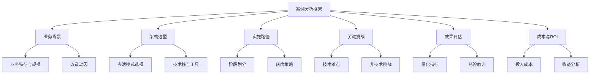
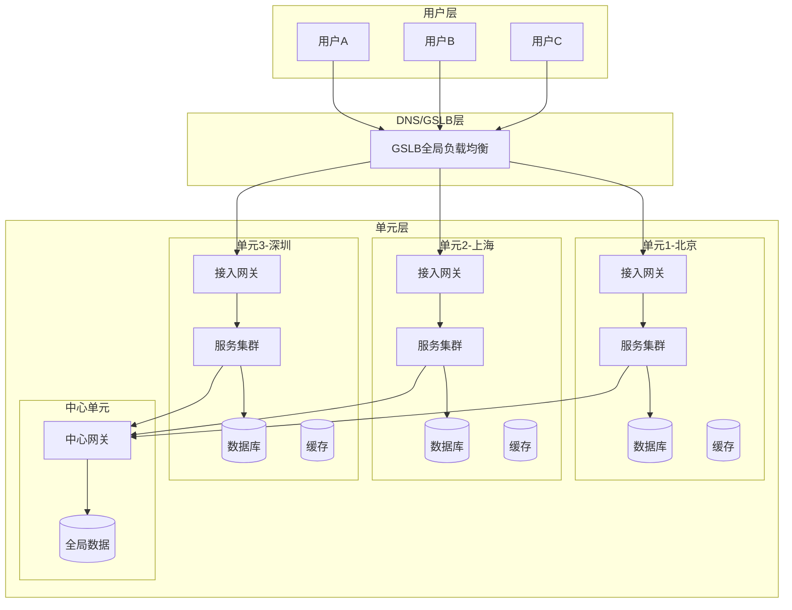
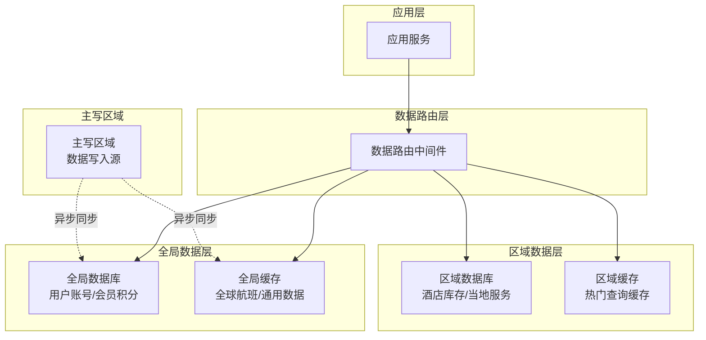
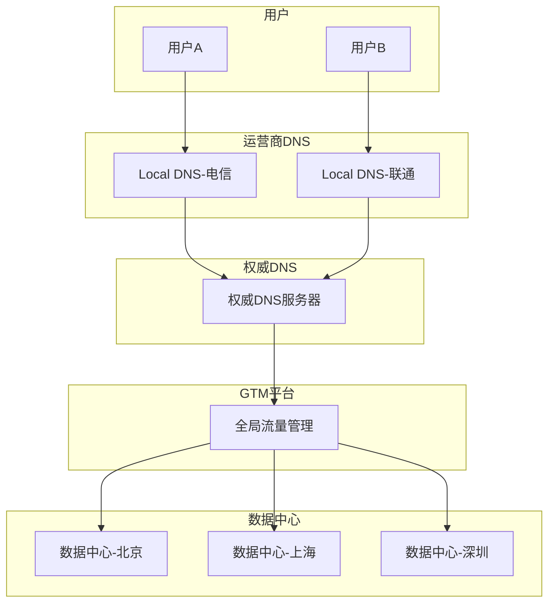
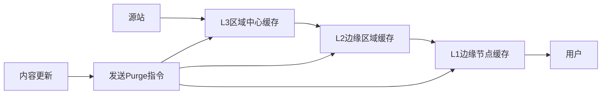

# 多活架构实战案例

理论和技巧的学习固然重要，但多活架构的真正精髓往往藏在实战案例之中。一个真实的多活改造案例，胜过十篇技术博客的抽象描述。本节通过剖析业界典型的多活架构实践，帮助读者从"知道"走向"理解"，从"理解"走向"能做"。

## 为什么案例学习至关重要

多活架构是分布式系统中复杂度最高的领域之一。它涉及数据同步、流量调度、单元化设计、一致性保障、故障切换等多个子系统的协同，任何单一技术点的文档都无法呈现全局视图。案例学习的价值在于：

**第一，还原真实决策场景。** 技术文档往往只呈现"最终方案"，而案例分析能够还原团队在"为什么选方案A而不选方案B"这个关键节点上的思考过程。例如，饿了么为什么选择按城市维度做单元划分，而不是按用户ID哈希？背后是外卖业务天然的地理局部性特征决定的。这种决策背后的权衡逻辑，是架构师最核心的能力。

**第二，暴露方案的边界条件。** 每种多活方案都有其适用场景和局限。通过案例分析，读者可以看到方案在极端情况下的表现——比如双十一峰值流量下的行为、单机房故障时的实际切换效果。更重要的是，可以看到方案在非预期场景下的行为，比如跨地域网络抖动时的降级策略、数据中心级别的级联故障如何被遏制。这些边界条件在理论文档中往往被一笔带过。

**第三，提供可复用的工程模式。** 真实案例中沉淀的工程实践（如阿里巴巴的全链路压测、饿了么的三阶段改造路径），可以直接作为其他团队的参考模板，大幅降低试错成本。

**第四，揭示跨领域的联动效应。** 多活架构的改造不是纯技术决策，它涉及组织架构调整、运维流程重塑、成本预算规划、团队能力建设等多个维度。案例分析能够帮助读者理解这些非技术因素如何影响最终方案的选择和落地效果。

## 案例分析框架

在阅读以下每个案例时，建议按照统一的分析框架进行解构：



| 分析维度 | 核心问题 | 关注要点 |
|----------|----------|----------|
| 业务背景 | 为什么要做多活？ | 业务规模、可用性要求、改造动因（增长驱动 or 灾备驱动） |
| 架构选型 | 选了什么模式？为什么？ | 同城双活 vs 异地多活、单元化方案、数据同步策略 |
| 实施路径 | 怎么一步步落地的？ | 阶段划分、灰度策略、回滚机制、每阶段的验收标准 |
| 关键挑战 | 遇到了什么坑？ | 数据一致性、跨单元事务、流量调度异常、组织协调 |
| 效果评估 | 最终结果如何？ | RTO/RPO指标、性能数据、成本变化、用户体感 |
| 成本与ROI | 投入产出比如何？ | 基础设施成本、人力成本、改造周期、业务收益 |

## 案例全景对比

本章涵盖的实战案例覆盖了不同行业、不同规模、不同多活形态的典型场景。以下是对所有案例的全景对比：

| 对比维度 | 阿里巴巴双十一 | 饿了么异地多活 | 携程多数据中心 | DNS多活调度 | CDN多活部署 |
|----------|---------------|---------------|---------------|------------|------------|
| **行业** | 电商 | 外卖/本地生活 | 在线旅行 | 基础设施 | 内容分发 |
| **多活形态** | 异地多活（三地五中心） | 同城双活+异地灾备 | 区域化多活 | 全球多活 | 边缘多活 |
| **核心单元划分** | 用户ID哈希 | 城市维度 | 区域+业务维度 | 地理位置 | 内容类型 |
| **数据同步方式** | DTS（binlog同步） | binlog+消息队列 | 主写多读+异步同步 | DNS传播 | 对象存储同步 |
| **流量调度层级** | 三层（DNS+网关+服务） | 两层（DNS+接入层） | 三层（GSLB+区域网关+服务） | 单层（DNS） | 两层（Anycast+GSLB） |
| **一致性模型** | 最终一致性 | 最终一致性 | 主写多读 | 最终一致性 | 最终一致性 |
| **改造周期** | 2年+（持续演进） | 约6个月 | 1年+ | 月级 | 周级 |
| **峰值能力** | 54.4万笔/秒 | 数万单/分钟 | 数万QPS | 亿级解析/天 | Tbps级带宽 |
| **改造驱动力** | 规模+可用性双重驱动 | 可用性为主 | 全球化扩展 | 基础设施可靠性 | 内容分发性能 |
| **最大技术挑战** | 单元化数据一致性 | 骑手调度实时性 | 全球数据同步延迟 | DNS缓存收敛 | 缓存一致性 |

## 核心案例详解

### 案例一：阿里巴巴双十一多活实践

#### 业务背景与改造动因

阿里巴巴的电商业务是国内多活架构实践的标杆。改造动因来自两个方面：

**规模驱动**：2019年双十一交易峰值达到每秒54.4万笔，单机房根本无法承载如此规模的并发写入。即使通过垂直扩展（升级硬件）和水平扩展（增加服务器），单机房的网络带宽、电力供应和散热能力都有物理上限。以网络为例，单机房的出口带宽通常在Tbps级别，而双十一的峰值流量会逼近这个上限。

**可用性驱动**：作为国民级电商平台，任何分钟级的不可用都会造成巨大的商业损失和品牌影响。2015年某云服务商的大规模故障事件是推动多活建设的直接诱因——当时多个依赖该服务商的业务出现了长时间不可用，暴露出单一机房部署的脆弱性。传统的主备模式切换时间在分钟级以上，无法满足业务对高可用的要求。

#### 架构设计："三地五中心"到"单元化部署"

阿里巴巴的多活架构经历了两个重要阶段：

**第一阶段：三地五中心（2013-2016）**。在北京、上海、深圳三个城市部署五个数据中心，通过数据库同步复制保持数据一致。这个阶段解决了"单机房故障"的问题，但单元化程度不够，跨机房调用仍然较多。此阶段的核心矛盾是：虽然有了多机房，但业务逻辑并未按单元化设计，导致跨机房调用占比高达30-40%，网络延迟和数据一致性成为瓶颈。

**第二阶段：单元化部署（2017至今）**。以"单元化"为核心设计理念，将系统划分为多个独立的业务单元。每个单元包含完整的技术栈，能独立处理用户请求。单元之间通过标准化接口通信，最大程度减少跨单元依赖。这一阶段的关键创新是"单元亲和性路由"——通过在接入层建立用户ID到单元的映射表，确保同一用户的所有请求都被路由到同一个单元。



**数据分层策略**是阿里巴巴多活架构的关键创新。不同数据类型采用不同的分片和同步策略：

| 数据类型 | 示例数据 | 分片策略 | 同步方式 | 一致性要求 |
|----------|----------|----------|----------|------------|
| 用户维度数据 | 订单、购物车、浏览历史 | 按用户ID哈希分片到单元 | 单元内强一致 | 强一致 |
| 商品维度数据 | 商品详情、评价、推荐 | 全量复制到所有单元 | DTS异步同步 | 最终一致 |
| 全局维度数据 | 支付渠道、营销规则 | 集中部署在中心单元 | 远程调用 | 强一致 |
| 搜索维度数据 | 商品搜索、推荐算法 | 各单元独立索引 | 定时全量同步 | 最终一致 |

这种分层策略的核心思想是：**不是所有数据都适合按同一维度分片**。高频写入的用户数据需要强一致性和低延迟，所以按用户ID分片到单元内；低频变更的商品数据需要全量可读，所以全量复制；全局性的规则数据变更频率极低但影响范围大，所以集中管理。

#### 流量调度：三层漏斗

阿里巴巴的流量调度采用三层漏斗式架构：

**第一层：DNS/GSLB**。基于用户的IP地址和地理位置，将用户引导到最近的数据中心。这一层的调度粒度较粗（城市级别），但覆盖面最广。GSLB（Global Server Load Balancing）不仅考虑地理位置，还会综合数据中心的健康状态、当前负载等因素。当某个数据中心出现异常时，GSLB可以在30秒内将流量切换到其他中心。

**第二层：接入网关**。在数据中心内部，接入网关根据用户的ID进行单元路由。通过路由表查询用户归属单元，如果用户归属本机房则直接处理，否则转发到归属单元。路由表是一个全局一致的映射关系，通过配置中心统一分发，确保所有网关的路由决策一致。

**第三层：服务层路由**。在服务层内部，根据具体的业务场景进行更精细的路由。例如，全局搜索请求可以路由到任意单元（因为搜索数据在各单元都有副本），而订单操作必须路由到订单归属单元（因为订单数据只在一个单元中）。

这三层调度的关键设计原则是：**越靠近用户，调度越粗粒度；越靠近数据，调度越精细**。DNS层做宏观的地域级路由，网关层做微观的单元级路由，服务层做业务语义级路由。

#### 全链路压测：双十一的"秘密武器"

阿里巴巴在双十一前会进行多轮全链路压测，这是多活架构稳定性的关键保障。全链路压测的核心要点：

1. **影子库/影子表**：在生产环境中创建影子数据库和影子表，压测流量写入影子库，不影响真实数据。影子库的Schema与生产库完全一致，确保压测结果的真实性和有效性。

2. **压测流量标记**：通过请求头标记压测流量（如`X-Performance-Test: true`），在全链路中透传，确保压测流量不会被误处理。同时，压测流量的用户ID使用预分配的测试ID段，避免与真实用户数据混淆。

3. **逐步加压**：从10%开始逐步增加到200%的预估峰值流量，每一步都观察系统各项指标（RT、错误率、资源使用率）。通常分为四个阶段：单机验证→集群验证→全链路验证→极端场景验证。

4. **故障注入**：在压测过程中主动注入故障（如关闭某个机房、模拟网络分区），验证系统的容灾能力。这是最接近真实故障的验证方式，能够发现常规测试无法覆盖的问题。

5. **压测数据清理**：压测结束后，需要彻底清理影子库中的测试数据，确保不会影响生产环境的数据完整性。

#### 关键数据

| 指标 | 数据 |
|------|------|
| 交易峰值 | 54.4万笔/秒（2019年双十一） |
| 单元数量 | 3个核心单元+1个中心单元 |
| 数据同步延迟 | 1-3秒（正常状态） |
| 故障切换时间 | 分钟级（DNS切换）+ 秒级（应用层切换） |
| 单元内请求占比 | >95%（跨单元调用极少） |
| 可用性 | 99.99%+ |
| 压测峰值 | 实际峰值的200% |
| 路由表规模 | 数亿用户ID到单元的映射 |

#### 核心经验

1. **单元化是异地多活的唯一可行路径**。没有单元化，跨机房的数据访问会成为性能瓶颈。单元化的核心是让95%以上的请求在单元内闭环处理。

2. **全链路压测是信心的来源**。只有在生产环境验证过，才知道系统能扛多少。"没有压测过的系统，不知道它能扛多少；压测过的系统，知道它一定能扛多少。"

3. **数据分层比数据分片更灵活**。不是所有数据都适合按同一维度分片，分层处理是务实的选择。分层的核心是根据数据的变更频率、访问模式和一致性要求来制定不同的策略。

4. **渐进式改造比一步到位更可靠**。从三地五中心到单元化部署，经历了数年的演进。每一步都有明确的目标和验证标准，通过充分的灰度验证后才进入下一阶段。

5. **路由表一致性是单元化的生命线**。如果不同网关对同一用户的路由决策不一致，会导致数据被写入错误的单元，引发数据混乱。路由表的分发必须通过配置中心统一下发，并有完善的版本校验机制。

### 案例二：饿了么异地多活改造

#### 业务背景与改造动因

饿了么作为国内领先的外卖平台，业务覆盖全国数百个城市。改造动因与阿里巴巴有相似之处（容量和可用性），但外卖业务的独特特征带来了不同的技术挑战：

**实时性要求极高**：外卖订单从下单到骑手接单、取餐、配送，整个链路对延迟极其敏感。订单状态、骑手位置、预计送达时间等数据需要实时更新，任何秒级的延迟都可能影响骑手调度效率。一个典型的外卖场景：用户下单后30秒内需要完成商家接单、骑手匹配，这对系统的端到端延迟要求极为苛刻。

**地理位置强相关**：外卖业务天然具有地理局部性——用户、商家、骑手通常在同一个城市（甚至同一个商圈）。这种特征既是优势（天然适合按城市做单元划分），也是挑战（跨城市的场景处理）。数据显示，超过97%的外卖订单是同城订单，这为按城市划分提供了天然的数据基础。

**多方交互复杂**：一个外卖订单涉及用户、商家、骑手、平台四方交互。订单状态机包含数十个状态转换（待接单→已接单→已取餐→配送中→已送达→已完成），任何一个环节的数据不一致都可能导致业务异常。例如，如果骑手位置数据与订单状态不一致，可能导致调度系统给一个已经取餐的骑手分配新订单。

#### 单元划分策略：按城市维度

饿了么选择按城市维度进行单元划分，这是其业务特征决定的最优选择：

**为什么不用用户ID哈希？** 用户ID哈希虽然能实现均匀分布，但外卖订单的数据（用户地址、商家位置、骑手位置）都与城市强相关。如果按用户ID分片，同一城市的用户可能被分散到不同单元，导致骑手调度需要跨单元查询，严重增加系统复杂度。更具体地说：一个在北京的骑手要接单，需要查询附近所有待接订单，如果订单被分散到不同单元，骑手调度的延迟会从10ms飙升到100ms以上，严重影响调度效率。

**按城市划分的优势**：

- 同一城市的用户、商家、骑手数据集中在一个单元中，数据访问完全本地化
- 骑手调度算法可以完全在单元内完成，无需跨单元调用，延迟控制在10ms以内
- 单个城市的数据量相对可控，不存在热点单元问题（一线城市数据量最大，但也只占总量的5-8%）
- 故障隔离效果好——单个城市的数据中心故障只影响该城市的服务

**按城市划分的挑战**：

- 不同城市的订单量差异巨大（一线城市 vs 三四线城市），需要动态调整资源分配。北京单元的服务器数量可能是某个三线城市单元的50倍以上
- 用户在不同城市间移动（出差、旅行）时，需要处理跨单元的用户归属切换。切换流程需要在用户下单时检测当前位置与归属城市是否一致，如果不一致则触发归属迁移
- 全国性的营销活动（如平台红包）需要跨单元的数据查询，这类场景通过"全局数据层"来解决

#### 三阶段改造路径

饿了么的多活改造采用三阶段渐进式路径：

**阶段一：数据分片（约2个月）**

这一阶段的核心目标是将单体数据库拆分为按城市分片的数据库集群，为后续的多活部署做数据准备。关键操作：

1. **数据模型梳理**：梳理核心数据模型，确定按城市分片的表和不分片的全局表。典型的分片表包括：订单表（按下单城市分片）、商家表（按所属城市分片）、骑手表（按活动城市分片）。典型的全局表包括：用户账号表、平台配置表、营销规则表。

2. **数据库分库分表**：按城市ID将数据分配到不同的MySQL实例。通常采用"库级分片"——每个城市一个独立的数据库实例，避免单实例的连接数和QPS瓶颈。

3. **数据路由中间件开发**：开发或引入数据路由中间件（如基于ShardingSphere或自研的路由组件），对业务代码透明地实现分片路由。业务代码通过逻辑表名访问数据，中间件根据路由规则将请求转发到实际的物理表。

4. **数据同步链路建立**：为同城双活做准备，建立MySQL半同步复制链路。

此阶段不改变流量路由，业务代码几乎无感知，风险最低。验证标准：分片后的数据库集群能正确处理所有业务场景，数据路由准确率100%。

**阶段二：同城双活（约3个月）**

在同城的两个机房同时部署完整的服务栈，通过数据同步保持两个机房的数据一致：

1. **部署同城第二个机房**：复制第一个机房的应用服务和数据库配置，部署完整的第二套服务栈。

2. **配置MySQL半同步复制**：确保两个机房的数据强一致（延迟<3ms）。半同步复制的机制是：主库在收到从库的ACK确认后才返回写入成功，确保至少两个机房都有数据副本。

3. **流量按比例分配**：流量按比例（如60:40）分配到两个机房，逐步验证并行处理能力。灰度过程通常持续2-4周，从10%开始逐步增加到50:50。

4. **故障切换演练**：实施多次故障切换演练，验证机房级容灾能力。演练场景包括：主机房完全断电、数据库主从切换、网络分区模拟。

关键验证指标：双机房并行处理时的延迟增量（应<5ms）、数据同步延迟（应<3ms）、故障切换RTO（目标<5分钟）。

**阶段三：异地扩展（约3个月）**

在不同地域增加新的数据中心，逐步将架构升级为异地多活：

1. **部署新数据中心**：在目标地域（如从北京扩展到上海）部署新的数据中心。

2. **配置跨地域数据同步**：由于跨地域的网络延迟较高（北京到上海约30-50ms），无法使用半同步复制，改为binlog异步同步。异步同步的RPO（Recovery Point Objective）在正常网络条件下<1秒。

3. **灰度切换流量**：从1%开始逐步增加到新数据中心的流量比例。灰度过程中密切监控数据同步延迟和用户体验指标。

4. **跨地域场景验证**：验证跨地域场景下的数据一致性和用户体验，特别是用户跨城市移动时的切换流程。

#### 关键技术挑战与解决方案

**挑战一：骑手调度的实时性保障**

骑手调度是外卖业务的核心链路，对延迟要求极高（<100ms）。在多活架构中，骑手位置数据需要实时更新，调度算法需要快速计算最优匹配。

解决方案：将骑手调度完全限制在单元内部。骑手注册时根据其主要活动区域分配到对应城市的单元，调度算法只在单元内进行匹配。具体实现：

- 骑手APP通过GPS每10秒上报一次位置，位置数据写入骑手所在城市的单元数据库
- 调度服务查询同一城市单元内的所有可用骑手，计算最优匹配
- 当骑手跨城市移动时（如从北京骑到天津），通过异步消息更新其归属单元，过程中有短暂的"归属迁移窗口"（通常<30秒），此窗口内骑手暂时不接单

**挑战二：跨城市订单处理**

虽然大多数外卖订单是同城的，但仍有少数跨城场景（如用户给异地亲友点外卖）。这类订单涉及两个单元的数据交互。

解决方案：采用"下单城市归属"原则——订单归属于下单地址所在城市的单元。具体流程：

1. 用户在APP中输入收货地址，系统根据地址解析出城市ID
2. 订单写入收货地址所在城市的单元（而非用户所在城市的单元）
3. 用户侧的展示通过跨单元查询实现（读操作），订单的写操作在归属单元内完成
4. 如果用户与收货地址不在同一城市，用户侧的订单列表需要同时查询用户归属城市和收货地址城市两个单元

**挑战三：全局营销活动的数据一致性**

平台级营销活动（如双十一红包、满减活动）需要在所有城市同步生效。如果活动数据只在一个单元中更新，其他单元的用户可能看到不一致的活动信息。

解决方案：营销规则数据作为"全局数据"全量复制到所有单元。具体实现：

- 活动配置变更通过消息广播机制同步到所有单元，使用版本号机制确保各单元的数据版本一致
- 每个活动配置带有版本号，单元在本地缓存活动数据，定期拉取最新版本
- 如果单元的活动数据版本落后于主版本，通过降级策略（如暂时禁用该活动）避免不一致

**挑战四：城市资源弹性伸缩**

不同城市的订单量差异巨大，且有明显的周期性波动（工作日午餐高峰、周末晚餐高峰、节假日全天高峰）。按城市划分后，需要实现细粒度的资源弹性伸缩。

解决方案：

- 建立城市级别的资源调度模型，根据历史数据预测未来7天的订单量变化
- 提前15分钟进行资源预热，避免冷启动延迟
- 对于突发流量（如极端天气导致订单暴增），通过自动扩缩容策略在5分钟内完成资源扩容
- 设置资源上限，避免单个城市异常流量影响全局资源池

#### 关键数据

| 指标 | 数据 |
|------|------|
| 覆盖城市 | 数百个城市 |
| 单元划分维度 | 城市 |
| 改造总周期 | 约6个月 |
| 故障切换时间 | 从小时级降至分钟级 |
| 核心链路延迟 | <100ms（单元内） |
| 跨单元调用占比 | <5% |
| 同城订单占比 | >97% |
| 数据同步延迟 | <3ms（同城）/ <1秒（异地） |
| 灰度切换周期 | 每次1-2周 |

#### 核心经验

1. **业务特征决定单元划分维度**。饿了么选择城市维度而非用户ID维度，是业务局部性驱动的正确决策。外卖的地理局部性（97%同城订单）决定了按城市划分是最自然的选择。

2. **三阶段渐进式改造是低风险路径**。数据分片→同城双活→异地扩展，每一步都有明确的验证点和回滚机制。任何阶段发现问题都可以回退到上一阶段，不会影响生产服务。

3. **全局数据的全量复制是务实选择**。不是所有数据都适合分片，低频变更的全局数据（如营销规则、平台配置）直接全量复制更简单可靠，避免了跨单元查询的复杂性。

4. **实时性要求高的业务必须限制在单元内**。跨单元的实时调用是性能杀手（延迟从10ms飙升到100ms+），通过合理的单元设计来避免跨单元实时调用。

5. **灰度切换必须有量化标准**。每次灰度都有明确的通过标准（延迟增量<5ms、错误率<0.01%、数据一致性100%），达到标准才继续放量，否则立即回滚。

### 案例三：携程多数据中心架构

#### 业务背景与改造动因

携程作为中国领先的在线旅行平台，业务涵盖酒店、机票、火车票、旅游度假等多个领域。与电商和外卖不同，在线旅行业务有其独特的多活需求：

**全球化特征**：携程不仅服务国内用户，还服务于大量海外用户。用户分布在全球各地，需要在多个地域部署数据中心以保证访问速度。海外用户占比约20-30%，主要分布在东南亚、北美、欧洲等地区。

**业务多样性**：不同业务线的数据特征差异很大——酒店库存是高度地域化的（每个城市的酒店独立），航班信息是全局化的（全球航班统一管理），用户账号是跨地域的。这种业务多样性决定了不能用单一的分片维度来处理所有数据。

**读写比例失衡**：旅行平台的读操作远多于写操作（用户大量浏览搜索，少量下单支付），读写比约为9:1。这种读写比例适合"主写多读"的多活模式——读操作可以在多个副本上执行，写操作集中在主区域。

**高峰特征明显**：旅行平台的流量高峰与节假日高度相关（国庆、春节、暑假），峰值流量可能是日常的5-10倍。多活架构需要具备快速扩容能力以应对周期性高峰。

#### 架构设计："区域化部署+全局化调度"

携程的多数据中心架构采用"区域化部署+全局化调度"的双层模式：

**区域化部署**：在中国大陆、东南亚、北美等区域分别部署数据中心。每个区域的数据中心负责服务该区域的用户，核心业务数据在区域内闭环处理。区域内的请求延迟控制在50ms以内，用户体验与单机房部署无差异。

**全局化调度**：通过全球化的流量调度系统，根据用户的地理位置和业务类型，动态选择最优的数据中心。调度系统综合考虑网络延迟、数据中心负载、数据就近性等因素。调度决策在100ms内完成，对用户完全透明。

#### 分层数据架构

携程的数据管理采用分层架构，这是其多活设计的核心创新：



**区域数据层**：存储与特定区域相关的数据（如中国区的酒店库存、东南亚区的当地玩乐产品）。这些数据只在本区域的中心和备份之间同步，不跨区域复制。优点是同步延迟低（<10ms）、数据一致性好；缺点是跨区域查询需要远程调用（延迟50-200ms）。

**全局数据层**：存储需要全球访问的数据（如用户账号、会员积分、航班信息）。全局数据层采用"主写多读"模式——数据写入在指定的主区域执行（如中国区），然后异步同步到其他区域。其他区域可以进行读取操作，但写入需要路由到主区域。全局数据的同步延迟在100-500ms之间，对于非实时性场景（如会员积分变更）完全可接受。

**缓存加速层**：在区域数据层和全局数据层之上，部署多级缓存来加速读取。热门查询（如热门城市的酒店列表、常用航班信息）被缓存在区域级的Redis集群中，命中率通常>90%，大幅降低了数据库压力。

#### 关键技术

**智能路由系统**：携程的路由系统不仅考虑地理位置，还综合多种因素做出决策。路由逻辑的核心是"业务语义感知"——不同类型的请求有不同的路由策略：

```python
def route_request(user, request_type):
    """携程智能路由决策"""
    # 1. 地理位置：获取用户最近的数据中心
    nearest_dc = geo_lookup(user.ip_address)
    
    # 2. 业务类型：不同业务的路由策略不同
    if request_type == "hotel_search":
        # 酒店搜索：按目的地路由到区域数据中心
        # 原因：酒店库存是区域数据，就近访问延迟最低
        region = hotel_region_lookup(request.destination)
        return region.datacenter
    
    elif request_type == "flight_booking":
        # 航班预订：路由到全球数据中心（全局数据）
        # 原因：航班信息是全局数据，需要跨区域一致性
        return global_dc_for_flights
    
    elif request_type == "user_profile":
        # 用户信息：路由到用户主区域
        # 原因：用户信息写入需要强一致性
        return user.primary_region.datacenter
    
    elif request_type == "payment":
        # 支付：强制路由到主区域（数据一致性要求）
        # 原因：支付涉及资金安全，必须保证强一致性
        return master_region.datacenter
    
    elif request_type == "review_read":
        # 评价读取：就近路由（只读操作）
        # 原因：评价数据是只读的，就近访问即可
        return nearest_dc
    
    # 3. 默认策略：就近路由
    return nearest_dc
```

**数据一致性网关**：在应用层实现读写一致性保障。当用户刚在一个区域写入数据后立即读取时，网关会判断本地数据是否足够新。具体机制：

- 每次写操作完成后，记录写入的时间戳和区域标识
- 后续读操作携带时间戳，网关比较当前时间与最后写入时间的差值
- 如果差值超过同步延迟的P99值（如500ms），从主区域获取最新数据
- 如果差值在正常范围内，直接从本地副本读取（可能有短暂的不一致，但延迟最低）

这种机制在"读己之写"（read-your-writes）场景下提供了良好的用户体验，同时避免了每次读操作都远程调用主区域的性能开销。

**故障自愈机制**：当某个区域的数据中心出现故障时，系统自动执行以下步骤：

1. **故障检测**（30秒内）：通过多维度健康检查（HTTP探针、TCP连接、业务指标）确认故障。单一维度的故障不触发切换，需要至少两个维度同时异常才判定为真正故障，避免误切换。

2. **流量切换**（1-3分钟）：GSLB将故障区域的流量切换到最近的健康区域。切换过程中，新区域接管请求，故障区域的请求被丢弃（对于非关键操作）或排队等待（对于关键操作如支付）。

3. **数据评估**（切换前）：检查数据同步延迟，确保切换后的数据丢失在RPO目标内。如果同步延迟过大（如>10秒），暂停切换并告警，由人工介入决策。

4. **降级策略**（切换中）：对实时性要求高的操作（如支付、库存扣减）暂时降级到只读模式，避免在数据不一致的情况下执行写操作。

5. **恢复同步**（故障恢复后）：故障区域恢复后，先进行增量数据同步（从最后一个同步点开始），同步完成后逐步切回流量。切回过程同样采用灰度策略，从10%开始逐步增加。

#### 关键数据

| 指标 | 数据 |
|------|------|
| 数据中心数量 | 3个主要区域（中国大陆/东南亚/北美） |
| 用户平均响应时间降低 | 中国用户40%，海外用户60% |
| 系统可用性 | 从99.9%提升到99.95% |
| 主写区域 | 中国大陆 |
| 跨区域数据同步延迟 | 100-500ms（异步） |
| 区域内请求占比 | >80% |
| 读写比 | 9:1 |
| 缓存命中率 | >90% |
| 故障检测时间 | <30秒 |
| 故障切换时间 | 1-3分钟 |

#### 核心经验

1. **业务多样性需要分层数据架构**。不同业务线的数据特征差异大（酒店库存 vs 航班信息 vs 用户账号），不能用单一维度做分片。分层架构的核心是根据数据的访问模式和一致性要求来制定不同的管理策略。

2. **"主写多读"是全球多活的务实选择**。在数据一致性和访问延迟之间取得了合理的平衡。对于读多写少的场景，"主写多读"既保证了写入的一致性，又通过多副本读取降低了延迟。

3. **智能路由要考虑多维度因素**。仅靠地理位置不够，业务类型和数据归属同样重要。路由决策的核心是"业务语义感知"——不同类型的请求有不同的路由策略。

4. **海外用户覆盖需要真正的全球部署**。仅靠国内机房无法满足海外用户的延迟要求（跨洋延迟>200ms），需要在海外部署独立的数据中心。

5. **故障自愈需要"渐进式"而非"突变式"**。故障切换不是简单的"一刀切"，而是一个渐进的过程：先检测→再评估→再降级→再切换→再恢复。每个步骤都有明确的触发条件和回滚机制。

## 补充案例：DNS多活调度与CDN多活部署

### DNS多活调度实战

DNS是多活架构中最基础也最关键的流量调度手段。DNS多活调度看似简单（只是修改DNS记录指向不同的IP地址），但在实际生产环境中面临诸多挑战。

#### 核心挑战与解决方案

**挑战一：DNS缓存导致切换延迟**

DNS记录的TTL（Time To Live）设置是DNS多活调度的核心参数。TTL设置过长会导致故障切换缓慢（最长等待TTL时间才能生效），设置过短会增加DNS服务器压力（频繁查询）。

实践中通常采用分层TTL策略：

| 场景 | TTL设置 | 原因 |
|------|---------|------|
| 正常运行 | 300秒（5分钟） | 平衡缓存效果和切换速度 |
| 计划内维护 | 60秒 | 提前降低TTL，确保切换时缓存快速过期 |
| 故障切换 | 30秒 | 紧急降低TTL，加速流量切换 |
| 全球DNS | 60-300秒 | 根据区域网络条件调整 |

故障切换时配合HTTPDNS（基于HTTP协议的DNS解析，绕过运营商DNS缓存）和客户端SDK实现秒级切换。HTTPDNS直接向权威DNS服务器查询，避免了运营商Local DNS的缓存延迟。

**挑战二：DNS解析的一致性问题**

不同运营商、不同地域的DNS缓存行为不同，同一时刻不同用户可能解析到不同的IP地址。这被称为"DNS解析不一致"问题。解决方法：

- 部署全局流量管理（GTM）平台，统一管理DNS解析策略
- 使用Anycast技术，让多个数据中心共享同一个IP地址，通过BGP路由自动引导用户到最近的中心
- 监控各运营商的DNS解析结果，发现不一致时及时调整

**挑战三：DNS劫持与容错**

运营商DNS劫持可能导致用户被解析到错误的IP地址（如广告页面）。实践中需要部署DNSSEC（DNS安全扩展）进行防篡改检测，同时在客户端实现备用解析通道：

- DNSSEC通过数字签名验证DNS响应的真实性，防止DNS响应被篡改
- 客户端SDK内置备用DNS服务器列表，当主解析通道异常时自动切换
- 监控DNS解析结果的一致性，发现异常时告警并切换

**挑战四：DNS解析的灰度发布**

DNS多活调度支持灰度发布——通过调整DNS权重，逐步将流量从旧版本切换到新版本。关键点：

- 灰度比例通过GTM平台实时调整，调整生效时间取决于TTL
- 灰度过程中同时监控新旧版本的各项指标（延迟、错误率、业务指标）
- 发现异常时立即回滚DNS权重，将流量切回旧版本
- 灰度完成后的切换需要保持足够长的时间（通常>24小时），确保所有DNS缓存都已过期

#### 典型架构



### CDN多活部署实战

CDN（内容分发网络）本身就是多活架构的一种形态——通过在全球部署边缘节点，实现内容的就近分发。CDN多活部署的关键要点：

#### 节点选择与调度

CDN的节点调度需要综合考虑多个因素：

| 调度因素 | 权重 | 说明 |
|----------|------|------|
| 用户地理位置 | 40% | 优先选择距离用户最近的节点 |
| 节点负载 | 25% | 避免将流量集中到过载节点 |
| 内容热度 | 20% | 热门内容优先分发到更多节点 |
| 源站距离 | 10% | 考虑回源链路的延迟和带宽 |
| 成本因素 | 5% | 在满足性能前提下优化成本 |

智能调度算法通常采用"加权最短路径"算法，实时计算每个用户到各个节点的综合评分，选择评分最高的节点。算法的更新频率通常为每5-10分钟一次，能够适应节点状态和网络条件的变化。

#### 缓存一致性策略

多节点部署下，缓存内容的一致性是一个核心挑战。当源站内容更新时，需要通过缓存失效（Purge）机制通知所有边缘节点刷新内容。实践中通常采用多级缓存策略：



- **L1（边缘节点）**：直接服务用户，缓存热门内容，TTL通常为5-30分钟
- **L2（边缘区域）**：多个L1节点共享的上级缓存，TTL通常为1-24小时
- **L3（区域中心）**：接近源站的缓存层，TTL通常为24小时-7天

内容更新时的Purge流程：
1. 源站内容变更后，主动向CDN调度系统发送Purge请求
2. 调度系统向所有缓存节点广播Purge指令
3. 收到Purge指令的节点删除本地缓存，下次请求时回源获取最新内容
4. 对于时效性要求高的内容（如直播流），采用短TTL（5-10秒）而非Purge机制

#### 故障转移与高可用

CDN节点故障是常态（硬件故障、网络中断、DDoS攻击等）。CDN的故障转移机制：

1. **节点健康检查**：调度系统持续监控每个节点的健康状态（HTTP响应码、延迟、错误率、连接数），健康检查间隔通常为10-30秒。

2. **自动故障转移**：当节点健康状态异常时，调度系统自动将该节点的流量切换到其他健康节点。切换过程对用户完全透明，用户无感知。

3. **流量预热**：新节点接管流量后，需要进行缓存预热（从源站或上级缓存拉取内容），避免首次请求全部回源导致源站压力骤增。

4. **容灾演练**：定期进行节点级和区域级的容灾演练，验证故障转移机制的有效性。演练场景包括：单节点故障、多节点同时故障、区域级网络中断。

#### CDN多活的典型应用场景

| 场景 | CDN策略 | 关键指标 |
|------|---------|----------|
| 静态资源加速 | 文件级缓存，长TTL | 缓存命中率>95% |
| 视频流媒体 | 分片缓存，自适应码率 | 缓冲率<1%，卡顿率<0.5% |
| API加速 | 动态路由，短TTL | 延迟降低30-50% |
| 全站加速 | 智能路由+混合缓存 | 整体延迟降低40-60% |
| DDoS防护 | 流量清洗+节点分散 | 清洗能力Tbps级 |

## 案例启示：从实践中提炼的设计原则

综合以上案例，可以提炼出多活架构设计的核心原则：

### 原则一：业务特征决定架构形态

没有放之四海而皆准的多活方案。阿里巴巴选择用户ID哈希做单元划分，饿了么选择城市维度，携程选择区域+业务混合维度——每种选择都是业务特征驱动的。在设计多活架构时，第一步不是画架构图，而是深入理解业务的数据访问模式和局部性特征。

具体来说，需要回答以下问题：
- 数据的自然分片维度是什么？（用户ID、地理位置、业务类型？）
- 读写比例是多少？（读多写少适合多副本，读写均衡需要更复杂的一致性策略）
- 数据的一致性要求有多高？（强一致需要同步复制，最终一致可以异步复制）
- 故障影响范围是什么？（单机房故障 vs 区域故障 vs 全局故障）

### 原则二：渐进式改造优于一步到位

三个核心案例都采用了分阶段实施的策略。一步到位的多活改造风险极高，因为涉及的技术点太多，任何一个环节出错都可能导致全局故障。分阶段实施的核心是：每个阶段都有明确的目标和验收标准，通过充分的测试验证后进入下一阶段。

典型的改造阶段划分：

| 阶段 | 目标 | 周期 | 风险等级 | 验证标准 |
|------|------|------|----------|----------|
| 阶段一 | 数据分片 | 2-3个月 | 低 | 数据路由准确率100% |
| 阶段二 | 同城双活 | 3-4个月 | 中 | 故障切换RTO<5分钟 |
| 阶段三 | 异地扩展 | 3-6个月 | 中高 | 跨地域数据同步延迟<1秒 |
| 阶段四 | 全面多活 | 持续 | 高 | 可用性99.99%+ |

### 原则三：数据一致性是永恒的挑战

所有案例都面临数据一致性的挑战，且都选择了"最终一致性"作为基础模型。对于少数需要强一致性的场景（如支付），通过路由到主区域的方式来保证。这种"大部分最终一致+关键路径强一致"的策略，是当前多活架构的主流实践。

在实际工程中，数据一致性的保障需要多个层面的配合：

- **数据层**：通过数据库复制机制（半同步/异步）保证数据副本的一致性
- **缓存层**：通过缓存失效策略（Write-Through/Write-Behind）保证缓存与数据库的一致性
- **应用层**：通过一致性网关（Read-Your-Writes）保证用户视角的一致性
- **监控层**：通过数据一致性监控（校验和比对）及时发现并修复不一致

### 原则四：监控和演练是可靠性的保障

多活架构的复杂度决定了其故障模式也更复杂。没有完善的监控和定期的故障演练，多活架构的可靠性无法真正得到保障。阿里巴巴的全链路压测、饿了么的故障切换演练，都是这一原则的体现。

监控体系建设的关键要素：

| 监控维度 | 关键指标 | 告警阈值 |
|----------|----------|----------|
| 数据同步 | 同步延迟、同步失败率 | 延迟>1秒、失败率>0.01% |
| 流量调度 | 路由准确率、切换成功率 | 准确率<99.9%、成功率<99% |
| 单元健康 | 错误率、延迟P99、资源使用率 | 错误率>0.1%、P99>200ms |
| 一致性 | 数据校验通过率 | 通过率<99.99% |

故障演练的频率和范围建议：
- **日常演练**：每周进行单机级别的故障注入（如杀死某个服务实例）
- **月度演练**：每月进行机房级别的故障模拟（如关闭某个机房的流量入口）
- **季度演练**：每季度进行区域级别的故障模拟（如模拟跨地域网络中断）
- **年度演练**：每年进行极端场景演练（如双机房同时故障）

### 原则五：成本控制是长期运营的关键

多活架构的基础设施成本通常是单机房部署的2-3倍。在设计阶段就需要充分考虑成本控制：

- **按需分配资源**：不同城市的单元根据实际流量分配资源，避免资源浪费
- **冷热数据分离**：冷数据存储在低成本的存储介质（如对象存储），热数据存储在高性能的数据库和缓存中
- **弹性伸缩**：根据流量变化自动调整资源，高峰期扩容、低谷期缩容
- **成本监控**：建立成本监控体系，定期分析各单元的资源使用效率，发现并优化浪费

## 常见误区与反模式

在多活架构的实践中，有一些常见的误区和反模式需要警惕：

### 误区一：过度追求强一致性

很多团队在设计多活架构时，试图在所有场景下都保证强一致性。这不仅技术实现极其复杂，而且性能代价巨大。正确的做法是：**只有少数关键路径（如支付、库存扣减）需要强一致性，大部分场景采用最终一致性即可**。最终一致性并不意味着"不一致"，而是在一个合理的时间窗口内（通常<1秒）数据最终会达到一致状态。

### 误区二：忽视灰度发布的重要性

有些团队在多活改造中急于一步到位，跳过了灰度发布阶段。这极其危险——多活架构的复杂度意味着很多问题只有在真实流量下才能暴露。正确的做法是：**每个阶段都必须经过充分的灰度验证**，从1%的流量开始逐步增加，每一步都确认所有指标正常后才继续放量。

### 误区三：只关注技术方案，忽视组织配合

多活架构改造不仅是技术决策，还需要组织架构的配合。如果运维团队、开发团队、业务团队之间缺乏协同，技术方案再好也无法落地。例如，如果运维团队不具备多机房运维能力，多活架构的故障切换就无法真正执行。正确的做法是：**在技术方案确定的同时，同步规划组织能力建设**，包括培训、流程制定、责任划分等。

### 误区四：低估数据同步的复杂度

数据同步看似简单（"不就是把数据从A复制到B吗？"），但实际工程中充满陷阱：网络分区时的数据冲突、同步延迟导致的读写不一致、数据格式变更时的兼容性问题、大事务同步导致的延迟飙升……每一个都可能导致严重的生产事故。正确的做法是：**将数据同步作为独立的子系统来设计和运维**，建立完善的监控、告警和自动恢复机制。

### 误区五：忽视故障演练的价值

"我们的架构设计得很完善，应该不会出问题"——这是最危险的想法。多活架构的故障模式极其复杂，很多故障场景在设计阶段无法完全预见。只有通过真实的故障演练，才能发现架构中的盲点。正确的做法是：**定期进行故障演练**，从单机故障到区域故障，逐步扩大演练范围和难度。

## 如何从案例中学习

阅读案例不是目的，从案例中提取可复用的经验才是目的。建议读者：

1. **带着问题阅读**。在阅读每个案例前，先思考："如果是我来做这个改造，我会怎么设计？"然后对比案例中的方案，思考差异背后的原因。这种"主动思考+对比验证"的学习方式，远比被动阅读有效。

2. **关注决策过程而非技术细节**。案例中最有价值的不是某个具体的技术实现，而是"为什么选择这个方案"的决策过程。技术实现会过时，但决策逻辑是通用的。例如，饿了么为什么选择城市维度做单元划分？背后的决策逻辑是"业务局部性决定数据分片维度"——这个逻辑适用于所有具有地理局部性的业务。

3. **提取可复用的模式**。每个案例中都有可以复用的工程模式（如饿了么的三阶段改造路径、携程的分层数据架构），将这些模式记录下来，作为未来项目的参考。建议建立一个"多活架构模式库"，分类整理各种可复用的模式。

4. **对比不同案例的异同**。将多个核心案例放在一起对比，思考同样是多活架构，为什么不同公司的方案差异如此之大？这种差异背后的根本原因是业务特征的差异。通过对比，可以更深刻地理解"业务特征决定架构形态"这一核心原则。

5. **模拟实战场景**。尝试将案例中的方案应用到自己熟悉的业务场景中，思考需要做哪些调整。例如，如果你的业务是在线教育平台，应该如何设计多活架构？可以参考携程的"业务多样性需要分层数据架构"思路，按课程类型（直播课 vs 录播课）和地域（国内 vs 海外）来设计数据分层。

6. **关注失败教训**。成功的案例固然值得学习，但失败的教训更有价值。在阅读案例时，特别关注"踩过的坑"和"走过的弯路"——这些往往是技术博客中不会提及的真实经验。

## 本章小结

本章通过剖析阿里巴巴、饿了么、携程三个核心案例，以及DNS多活调度和CDN多活部署两个补充案例，全面展示了多活架构在不同行业、不同规模、不同场景下的实践方式。

核心要点回顾：

- **单元化是异地多活的核心设计思想**，通过将系统划分为独立的业务单元，实现请求的本地化处理和故障的隔离
- **数据分层比单一维度分片更灵活**，不同类型的数据根据其访问模式和一致性要求采用不同的管理策略
- **渐进式改造是低风险的落地路径**，从数据分片到同城双活再到异地扩展，每一步都有明确的验证标准
- **监控和演练是可靠性的根本保障**，没有经过验证的多活架构只是"纸上的多活"
- **业务特征决定架构形态**，没有放之四海而皆准的多活方案，只有最适合自身业务的方案

多活架构的建设是一个持续演进的过程，没有终点。希望通过本章的案例分析，读者能够建立对多活架构的全局认知，为未来的实践打下坚实的基础。
