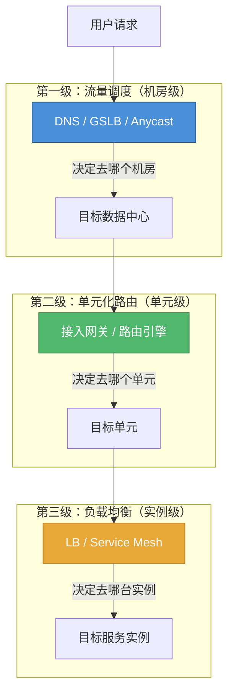
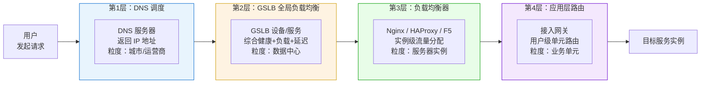
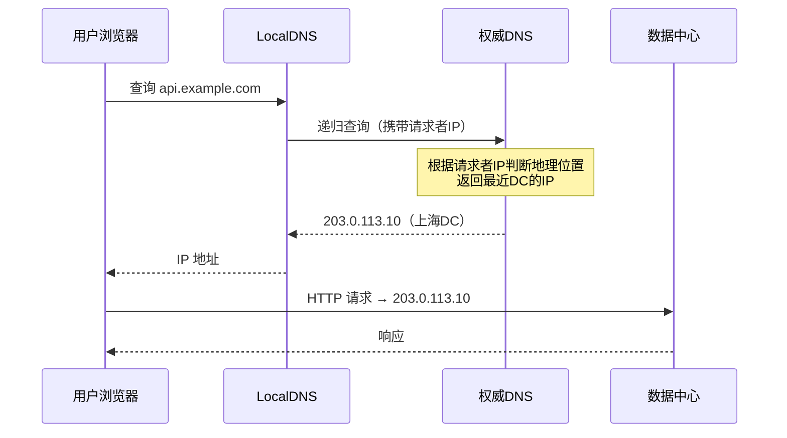
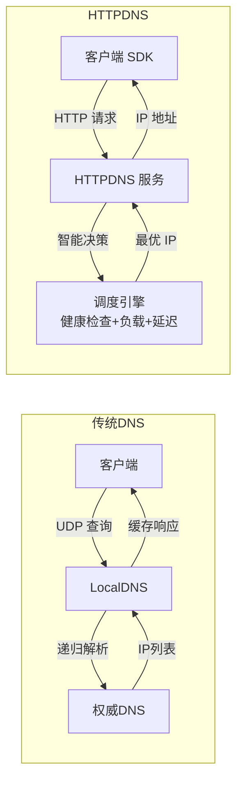
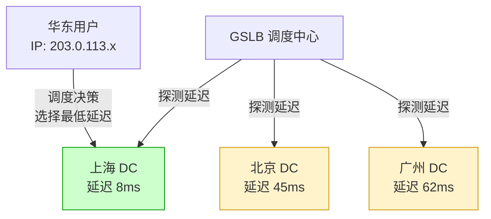
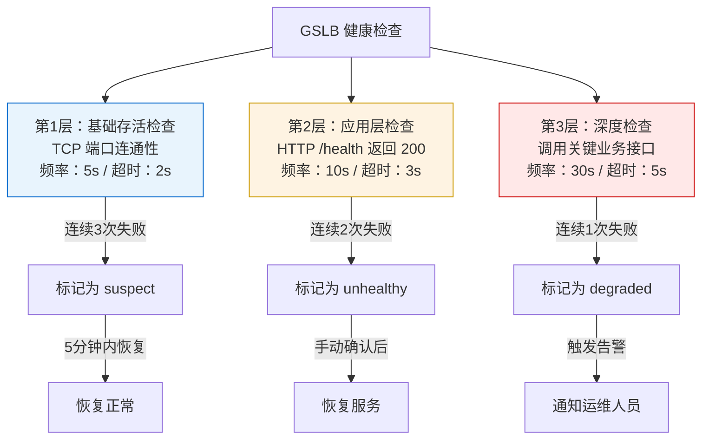
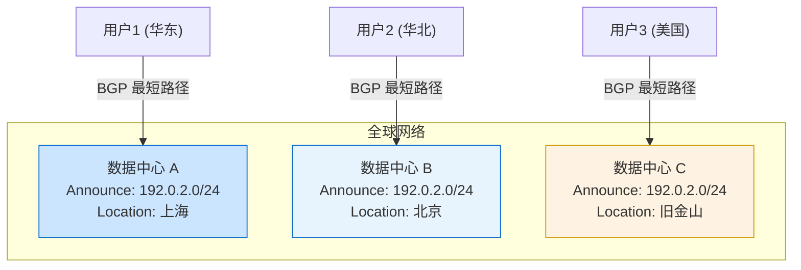
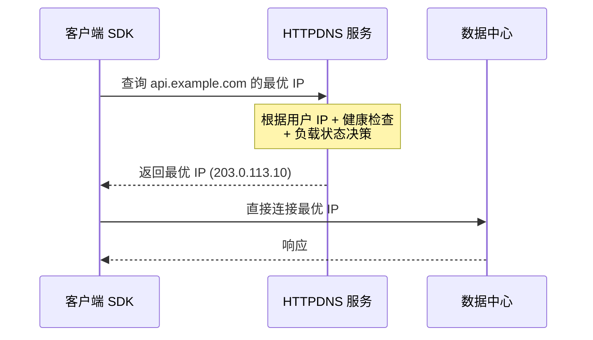
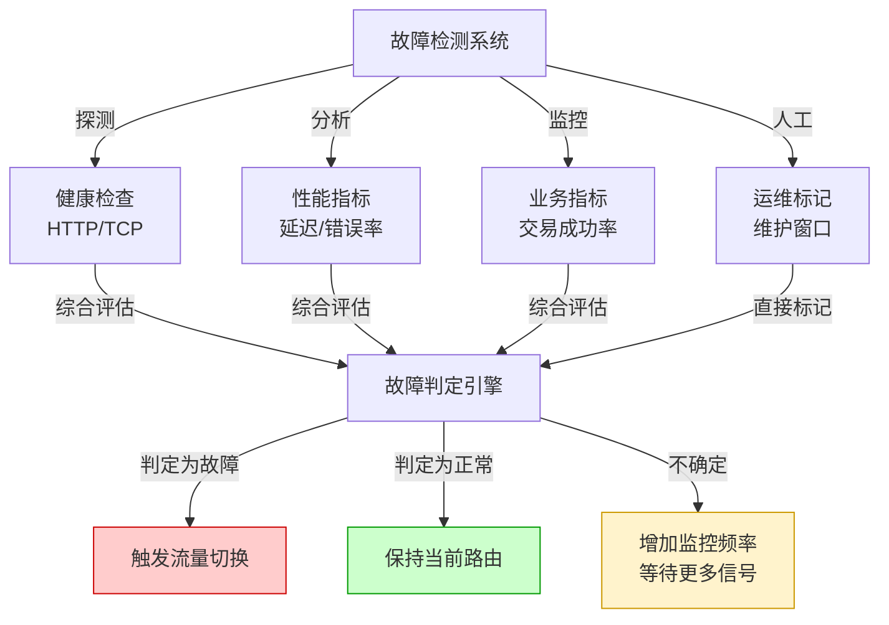
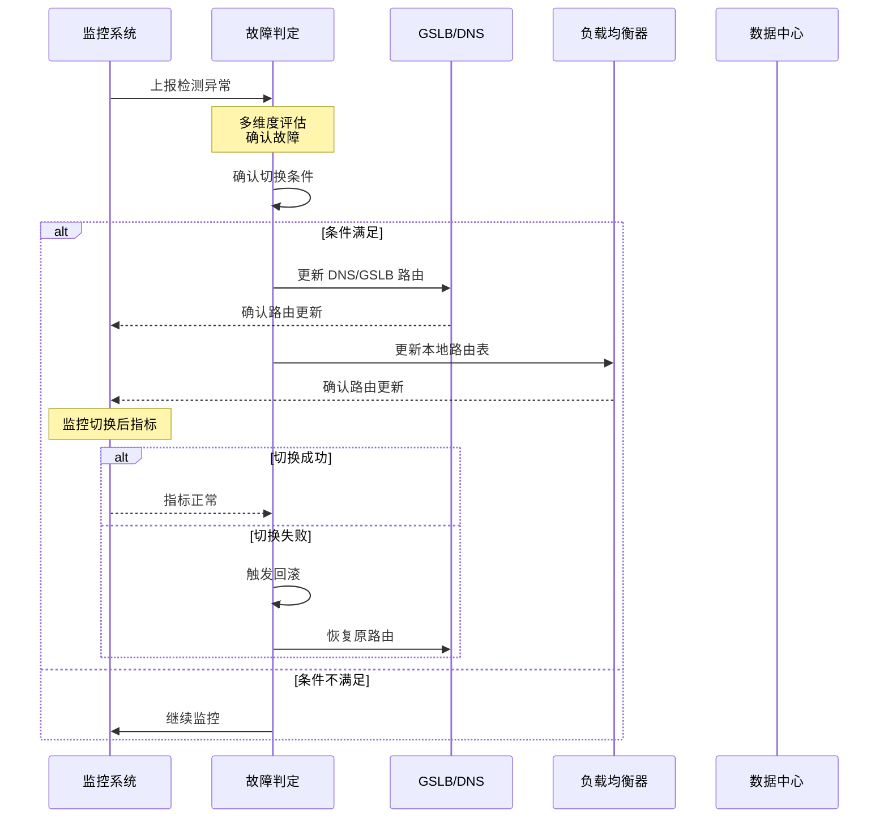

# 流量调度：多活架构的"总调度员"

流量调度是多活架构的入口层和第一道关卡。用户发起的每一个请求，首先要经过流量调度系统的"分流"，才能到达正确的数据中心、正确的单元、正确的服务实例。调度的准确性、及时性和健壮性，直接决定了多活架构的价值能否真正实现。

本节从道法术器四个层面系统讲解流量调度——从设计哲学到架构方法，从工程实践到工具选型，帮助读者建立完整的流量调度知识体系。

---

## 1. 流量调度的本质与战略定位

### 1.1 为什么流量调度是多活架构的"生命线"

在单机房架构中，所有请求都指向同一个入口，不需要复杂的调度。但多活架构引入了多个数据中心，流量调度的复杂度呈指数级增长——它不仅要决定"请求去哪里"，还要在故障时快速切换、在扩容时平滑迁移、在大促时动态均衡。

**调度失误的四种典型后果：**

| 失误类型 | 具体表现 | 业务影响 | 严重程度 |
|---------|---------|---------|---------|
| 跨地域访问 | 用户被调度到距离很远的机房 | 延迟从 10ms 飙升到 100ms+，页面加载缓慢 | ⚠️ 高 |
| 数据不归属 | 请求到达没有用户数据的单元 | 跨单元查询或返回错误，业务逻辑异常 | 🔴 极高 |
| 负载不均 | 大量用户集中在某个机房 | 该机房过载，其他机房空闲，资源浪费 | ⚠️ 高 |
| 切换失败 | 机房故障时流量不能及时切换 | 服务中断，用户无法访问 | 🔴 极高 |

**真实案例：某电商大促 DNS 调度事故**

某头部电商在双十一期间，因 DNS TTL 设置为 600 秒（10 分钟），在主机房突发流量打满时，手动修改 DNS 记录将流量切到备机房。但由于大量 LocalDNS 的缓存未过期，实际流量切换收敛花了 25 分钟，期间主机房持续过载，部分用户无法下单。事后复盘：提前将 TTL 降至 60 秒并预热备机房，本可在 2 分钟内完成切换。

### 1.2 流量调度在多活架构中的位置

流量调度是多活架构"三级调度体系"的第一级：



- **第一级（本节重点）**：流量调度——决定用户请求去哪个数据中心，解决"机房级"分流
- **第二级**：单元化路由——在机房内部决定请求去哪个单元，解决"单元级"路由
- **第三级**：负载均衡——在单元内部决定请求去哪个服务实例，解决"实例级"分配

三级调度层层递进、各司其职。流量调度是整条链路的起点，它的决策质量直接影响后续两级的效率。

**关键设计原则：各层只管自己那一级的决策，不要越权。** 例如，DNS 层不应该做单元级路由，GSLB 不应该做实例级负载均衡。越权会导致多层决策冲突，路由结果不可预测。

### 1.3 流量调度的核心指标

评价一个流量调度系统的优劣，需要关注以下核心指标：

| 指标 | 定义 | 健康基准 | 优秀基准 |
|------|------|---------|---------|
| 调度准确率 | 请求被路由到正确机房的比例 | > 99.5% | > 99.9% |
| 调度延迟 | 从请求到达到路由决策完成的时间 | < 50ms | < 10ms |
| 故障切换时间 | 机房故障到流量完全切换的时间 | < 5 分钟 | < 30 秒 |
| 切换成功率 | 故障切换后成功处理请求的比例 | > 99% | > 99.9% |
| 误切换率 | 健康机房被误判为故障的次数 | < 1 次/月 | < 1 次/季度 |
| 调度可用性 | 调度系统自身的可用性 | > 99.9% | > 99.99% |
| 流量均衡度 | 各机房流量分布的标准差 | < 20% | < 10% |
| 调度幂等性 | 同一用户同一时段被调度到同一机房 | > 95% | > 99% |

其中，**调度幂等性**是最容易被忽视但极其重要的指标。如果同一用户在短时间内被交替调度到不同机房，会导致会话不一致（如购物车数据不同步、登录态丢失）。幂等性越高，用户体验越好，跨机房数据同步压力越小。

### 1.4 流量调度的设计哲学

在深入技术细节之前，先建立正确的设计哲学：

**原则一：调度决策要"快而粗"，业务处理要"慢而精"。** 流量调度发生在请求链路的最前端，延迟要求极高（毫秒级）。因此调度算法要简单高效，不要在调度层做复杂的业务逻辑判断。

**原则二：宁可多留冗余，不可少一分容错。** 每个数据中心都要预留足够的溢出容量。如果三个机房各承载 33% 的流量，当一个机房故障时，剩余两个机房需要各承担 50% 的流量——每个机房都需要预留至少 50% 的溢出容量。

**原则三：灰度是唯一的真理，全量切换是最大的风险。** 任何调度规则的变更，包括 DNS 记录修改、GSLB 策略调整、路由规则更新，都必须经过灰度验证。一次未经灰度的全量切换，可能导致全局故障。

**原则四：假设所有组件都可能故障。** DNS 可能被劫持，GSLB 可能宕机，健康检查可能误判，LocalDNS 缓存可能不可控。调度系统的设计必须在每一层都有兜底方案。

---

## 2. 分层调度架构详解

多活架构的流量调度采用分层设计，每层解决不同粒度的问题，组合起来形成从宏观到微观的完整调度能力。

### 2.1 四层调度模型



| 层次 | 技术手段 | 调度粒度 | 决策依据 | 切换速度 | 实现位置 |
|------|---------|---------|---------|---------|---------|
| 第1层 | DNS / HTTPDNS | 城市 / 运营商 | IP 地理位置 | 1-10 分钟 | DNS 服务器 |
| 第2层 | GSLB | 数据中心 | 健康+负载+延迟 | 30 秒-5 分钟 | 专用设备/云服务 |
| 第3层 | LB（Nginx/HAProxy/F5） | 服务器实例 | 连接数+响应时间 | 秒级 | 数据中心内部 |
| 第4层 | 应用网关 / SDK | 业务单元 | 用户 ID + 路由规则 | 毫秒级 | 应用层 |

**每一层的职责边界必须清晰**，避免功能重叠导致的调度冲突。常见的错误是让多层同时做相同维度的决策（如 GSLB 和应用网关都按地理位置调度），导致路由结果不确定。

### 2.2 各层之间的协作关系

一个用户请求的完整调度链路：

1. **DNS 层**：用户浏览器查询域名 `api.example.com`，DNS 根据用户 IP 的地理位置返回最近数据中心的 IP（如上海机房的 `203.0.113.10`）
2. **GSLB 层**：GSLB 在 DNS 响应前检查各数据中心的健康状态。如果上海机房负载过高（> 80%），可能返回杭州机房的 IP 作为替代
3. **负载均衡层**：请求到达上海机房的入口负载均衡器（Nginx），Nginx 根据后端实例的连接数和响应时间，将请求分发到最优实例
4. **应用网关层**：应用网关从请求中提取用户 ID（如从 JWT Token 中解析），通过路由规则引擎计算该用户归属的单元（如 Unit-B），将请求转发到该单元处理

### 2.3 各层切换能力对比

理解各层的切换能力差异，是设计切换策略的基础：

| 维度 | DNS 层 | GSLB 层 | LB 层 | 应用网关层 |
|------|--------|---------|-------|-----------|
| 切换粒度 | 机房级 | 机房级 | 实例级 | 单元/用户级 |
| 切换延迟 | 分钟级（受 TTL 制约） | 秒级 | 秒级 | 毫秒级 |
| 切换精度 | 粗（城市/运营商） | 中（DC 级） | 高（实例级） | 极高（用户级） |
| 是否需要客户端配合 | 否 | 否 | 否 | 是（需集成 SDK 或走网关） |
| 故障场景适用性 | 灾难级故障 | 机房级故障 | 实例级故障 | 逻辑级故障 |
| 切换回滚难度 | 高（需等缓存过期） | 中 | 低 | 低 |

**设计启示**：真正的生产系统需要多层协同切换。DNS/GSLB 负责宏观层面的机房级切换，LB 和应用网关负责微观层面的实例/单元级切换。两者结合才能实现既"大刀阔斧"又"精准细微"的流量调度。

---

## 3. DNS 调度深度解析

DNS 调度是流量调度的第一层，也是覆盖面最广、影响最深远的一层。理解 DNS 调度的原理和陷阱，是做好流量调度的基础。

### 3.1 DNS 调度的工作原理

DNS 调度的核心思路是：**为不同地域的用户返回不同的 IP 地址，将用户引导到对应的数据中心。**



**DNS 调度的地理判断依据**：

DNS 服务器通过请求者 IP（即 LocalDNS 的出口 IP）来判断用户的大致地理位置。这个判断依赖于 IP 地理位置数据库（如 MaxMind GeoIP），精度通常在城市级别。

### 3.2 DNS 调度的三种模式

**模式一：静态 DNS 配置**

最简单的方式是在权威 DNS 中为域名配置多条 A 记录，每条指向不同数据中心的 IP，通过轮询（Round Robin）或固定权重分配流量。

```dns
; 静态 DNS 配置示例
api.example.com.  300  IN  A  203.0.113.10   ; 上海 DC
api.example.com.  300  IN  A  198.51.100.20  ; 北京 DC
api.example.com.  300  IN  A  192.0.2.30     ; 广州 DC
```

优点：实现简单，无需额外设备。缺点：无法感知故障，无法智能调度，切换靠手工修改 DNS 记录。适用于流量小、对可用性要求不高的场景。

**模式二：智能 DNS（GeoDNS）**

智能 DNS 根据请求者的 IP 地址，自动返回最近的数据中心 IP。主流的智能 DNS 服务包括 AWS Route 53、阿里云 DNS、Cloudflare 等。

```yaml
# AWS Route 53 地理位置路由配置示例
# 华东用户 → 上海 DC
- Name: api.example.com
  Type: A
  SetIdentifier: shanghai
  GeoLocation:
    Continent: ASIA
    Country: CN
    SubdivisionCode: SH
  TTL: 60
  ResourceRecords:
    - Value: 203.0.113.10

# 华北用户 → 北京 DC
- Name: api.example.com
  Type: A
  SetIdentifier: beijing
  GeoLocation:
    Continent: ASIA
    Country: CN
    SubdivisionCode: BJ
  TTL: 60
  ResourceRecords:
    - Value: 198.51.100.20

# 默认 → 上海 DC（兜底）
- Name: api.example.com
  Type: A
  SetIdentifier: default
  GeoLocation:
    Country: "*"
  TTL: 60
  ResourceRecords:
    - Value: 203.0.113.10
```

**模式三：HTTPDNS**

HTTPDNS 绕过传统的 DNS 解析链路（LocalDNS → 递归 DNS → 权威 DNS），由客户端直接通过 HTTP 接口向 HTTPDNS 服务查询 IP 地址。



HTTPDNS 的核心优势：

- **绕过 LocalDNS 缓存**：LocalDNS 的缓存可能导致用户被调度到错误的数据中心（如运营商 LocalDNS 部署在非本地城市）
- **绕过 DNS 劫持**：某些运营商的 LocalDNS 会篡改 DNS 响应（DNS 劫持），HTTPDNS 通过 HTTP 接口通信，避免此问题
- **更精细的调度**：HTTPDNS 可以获取客户端真实 IP（而非 LocalDNS 的出口 IP），调度更精准
- **更快的切换**：不依赖 DNS 缓存过期，切换实时生效
- **支持动态权重**：可以根据后端 DC 的实时负载动态调整返回的 IP 列表和权重

**HTTPDNS 服务端实现要点**：

```python
class HTTPDNSService:
    """HTTPDNS 调度服务核心逻辑"""

    def resolve(self, client_ip: str, domain: str) -> dict:
        """
        根据客户端 IP 和后端状态，返回最优的 IP 列表
        """
        # 1. 获取所有可用的 DC 列表
        dc_list = self.get_healthy_datacenters(domain)

        # 2. 根据客户端 IP 计算各 DC 的网络延迟得分
        scored_dcs = []
        for dc in dc_list:
            latency_score = self.score_latency(client_ip, dc.endpoint)
            load_score = self.score_load(dc.current_load)
            health_score = self.score_health(dc.health_status)
            weight = (
                0.4 * latency_score +
                0.3 * load_score +
                0.3 * health_score
            )
            scored_dcs.append((dc, weight))

        # 3. 按得分降序排列，返回前 3 个
        scored_dcs.sort(key=lambda x: x[1], reverse=True)
        top_dcs = scored_dcs[:3]

        return {
            "ips": [
                {
                    "ip": dc.endpoint,
                    "ttl": 60,
                    "region": dc.region,
                }
                for dc, _ in top_dcs
            ]
        }
```

### 3.3 DNS TTL 管理策略

TTL（Time To Live）是 DNS 缓存的生存时间，直接决定了故障切换的收敛速度。TTL 的设置需要在"切换速度"和"DNS 压力"之间取得平衡。

| 场景 | TTL 建议值 | 理由 |
|------|----------|------|
| 正常运行期 | 300 秒（5 分钟） | 平衡切换速度和 DNS 查询压力 |
| 计划切换前 30 分钟 | 60 秒 | 提前降低 TTL，加速切换收敛 |
| 大促/故障演练前 | 30 秒 | 需要快速切换能力 |
| 切换完成后 | 恢复到 300 秒 | 减少 DNS 查询压力 |

**TTL 管理的实操要点**：

1. **提前降 TTL**：DNS 缓存是分布式的，LocalDNS 的缓存可能比 TTL 指定的时间更长（部分运营商会延长缓存）。计划切换前至少提前 2 个 TTL 周期降低 TTL
2. **分批降 TTL**：先从 300 秒降到 120 秒，观察 30 分钟后再降到 60 秒，避免一次性大幅变更引起 DNS 系统异常
3. **切换后恢复**：切换完成并确认稳定后，尽快恢复 TTL 到正常值，避免权威 DNS 承受过大的查询压力
4. **监控 TTL 收敛**：切换期间持续监控各地区的 DNS 解析结果，确认 TTL 收敛进度。可通过在不同城市部署探针，定期查询 DNS 来验证

**TTL 收敛时间的计算公式**：

实际收敛时间 ≈ 最大 TTL 值 × 1.5 ~ 2 倍

LocalDNS 缓存的最大 TTL 不一定等于权威 DNS 配置的 TTL。部分运营商的 LocalDNS 可能会将 TTL 延长到配置值的 1.5-2 倍。因此，在规划切换窗口时，必须按最大 TTL 的 2 倍来估算完全收敛时间。

### 3.4 DNS 调度的已知陷阱

**陷阱一：LocalDNS 缓存漂移**

用户的请求经过多级 DNS 缓存，最终到达权威 DNS 时，看到的"请求者 IP"可能是 LocalDNS 的出口 IP，而非用户的真实 IP。如果 LocalDNS 的部署位置与用户不一致（如某些运营商的 LocalDNS 集中部署在少数几个城市），会导致调度偏差。

**解决方案**：部署 HTTPDNS 服务，通过客户端 SDK 直接获取最优 IP，绕过 LocalDNS 的干扰。

**陷阱二：DNS 缓存导致切换慢**

传统 DNS 的 TTL 缓存机制意味着：当 DNS 记录变更后，所有 LocalDNS 需要等缓存过期才会拉取新记录。在 TTL=300 秒的情况下，切换可能需要 5-10 分钟才能完全收敛。

**解决方案**：
- 缩短 TTL（代价是 DNS 查询压力增加）
- 使用 HTTPDNS 绕过缓存
- 在 DNS 层之外，叠加应用层的快速切换能力

**陷阱三：DNS 劫持和污染**

部分运营商或中间网络设备会篡改 DNS 响应，将域名解析到错误的 IP（如广告服务器）。这在多活架构中可能导致流量被路由到完全错误的数据中心。

**解决方案**：
- 使用 DNSSEC（DNS 安全扩展）对 DNS 响应进行签名验证
- 使用 HTTPDNS 通过 HTTPS 加密通信，避免中间人篡改
- 客户端实现 IP 验证机制，确认返回的 IP 在已知的合法 IP 列表中

**陷阱四：IPv4/IPv6 双栈问题**

随着 IPv6 的普及，DNS 可能返回 A 记录（IPv4）和 AAAA 记录（IPv6）。如果两个协议栈指向不同的数据中心，可能导致同一用户的 IPv4 和 IPv6 请求被路由到不同机房，引发会话不一致。

**解决方案**：在 DNS 配置中确保 A 记录和 AAAA 记录指向同一数据中心，或者通过应用层统一处理双栈请求。

**陷阱五：DNS 查询的尾延迟效应**

DNS 查询链路中，任何一个环节的慢响应都会拖累整体解析速度。例如，LocalDNS 向权威 DNS 发起递归查询时，如果权威 DNS 响应慢（如网络抖动），LocalDNS 会等待直到超时。用户感知到的 DNS 解析延迟 = 所有环节延迟之和。

**解决方案**：
- 权威 DNS 部署在多个地理位置，使用 Anycast 加速
- 客户端 DNS 解析设置合理的超时（如 3 秒）和重试逻辑
- 使用 HTTPDNS 作为备选通道，当传统 DNS 解析超时时自动降级

---

## 4. GSLB 全局负载均衡

GSLB（Global Server Load Balancing）是 DNS 调度的增强版。它不仅考虑用户的地理位置，还综合各数据中心的健康状态、负载水平、网络质量等因素，动态决定用户的最优接入点。

### 4.1 GSLB 与普通 DNS 的区别

| 维度 | 普通 DNS | GSLB |
|------|---------|------|
| 调度依据 | 仅 IP 地理位置 | 健康+负载+延迟+地理位置 |
| 故障感知 | 无 | 实时健康检查 |
| 调度粒度 | 城市/运营商级 | 数据中心级 |
| 切换速度 | 受 TTL 限制（分钟级） | 健康检查触发（秒级-分钟级） |
| 负载均衡 | 不支持或仅支持权重 | 支持多种均衡算法 |
| 实现方式 | DNS 服务器配置 | 专用 GSLB 设备/云服务 |

### 4.2 GSLB 的核心调度策略

**策略一：基于延迟的路由（Latency-Based Routing）**

GSLB 实时探测各数据中心到用户的网络延迟，将用户导向延迟最低的数据中心。



GSLB 通过以下方式获取延迟数据：
- **主动探测**：在各城市的探测节点定期向各数据中心发送 TCP/HTTP 探测请求，测量 RTT（Round-Trip Time）
- **被动统计**：从各数据中心的负载均衡器收集真实用户的连接建立时间（TCP Handshake Time），作为延迟参考
- **混合模式**：主动探测保证数据新鲜度，被动统计保证数据真实性。两者结合使用效果最佳

**策略二：基于权重的路由（Weighted Routing）**

管理员为各数据中心分配权重，按权重比例分配流量。适用于需要精确控制流量分布的场景。

```yaml
# GSLB 权重路由配置示例
routes:
  - datacenter: shanghai
    weight: 50        # 50% 流量
    endpoint: 203.0.113.10
  - datacenter: beijing
    weight: 30        # 30% 流量
    endpoint: 198.51.100.20
  - datacenter: guangzhou
    weight: 20        # 20% 流量
    endpoint: 192.0.2.30
```

**策略三：基于故障转移的路由（Failover Routing）**

为主数据中心指定备数据中心。当主中心故障时，GSLB 自动将流量切换到备中心。

```yaml
# GSLB 故障转移路由配置示例
routes:
  - datacenter: shanghai
    primary: true
    endpoint: 203.0.113.10
    health_check:
      url: /health
      interval: 5s
      timeout: 3s
      unhealthy_threshold: 3
  - datacenter: beijing
    primary: false
    endpoint: 198.51.100.20
    failover_for: shanghai
```

**策略四：综合智能路由**

生产环境中，通常需要组合多种策略。GSLB 的决策逻辑可以抽象为：

最终得分 = w1 × 延迟得分 + w2 × 负载得分 + w3 × 健康得分 + w4 × 地理得分

其中各权重（w1-w4）根据业务特点调整。例如：
- 交互式业务（IM、游戏）：延迟权重最高（w1=0.5）
- 批处理业务：负载权重最高（w2=0.4）
- 高可用业务：健康权重最高（w3=0.5）

### 4.3 主流 GSLB 产品对比

| 产品 | 厂商 | 路由策略 | 健康检查 | 价格级别 | 适用场景 |
|------|------|---------|---------|---------|---------|
| Route 53 | AWS | 延迟/权重/故障转移/地理位置 | HTTP/TCP/HTTPS | 中 | AWS 生态用户 |
| 全球加速 | 阿里云 | 延迟/权重/故障转移 | HTTP/TCP | 中 | 阿里云生态用户 |
| Cloudflare Load Balancer | Cloudflare | 延迟/权重/故障转移/轮询 | HTTP/TCP/Ping | 低-中 | CDN 用户 |
| F5 BIG-IP GTM | F5 | 自定义规则 | 多种协议 | 高 | 企业级私有部署 |
| NS1 | NS1 | 智能过滤路由 | 多种协议 | 中 | 企业级 SaaS |
| CoreDNS + 插件 | 开源自建 | 自定义开发 | 自定义 | 低（运维成本高） | 技术能力强的团队 |

### 4.4 GSLB 健康检查设计

健康检查是 GSLB 感知故障的基础。检查策略需要兼顾准确性（不误判）和及时性（快发现）。

**健康检查的分层设计：**



**各层检查的详细设计：**

| 检查层 | 检查内容 | 频率 | 超时 | 判定条件 | 响应动作 |
|--------|---------|------|------|---------|---------|
| 基础存活 | TCP 端口连接 | 5 秒 | 2 秒 | 连续 3 次失败 | 标记 suspect，不立即切换 |
| 应用层 | HTTP GET /health | 10 秒 | 3 秒 | 连续 2 次失败 | 标记 unhealthy，触发切换 |
| 深度检查 | 业务接口（如 /api/ping） | 30 秒 | 5 秒 | 连续 1 次失败 | 标记 degraded，发送告警 |
| 业务指标 | 交易成功率 | 持续监控 | — | < 95% 持续 5 分钟 | 标记 abnormal，人工介入 |

**健康检查的防误判机制：**

- **多点探测**：从至少 2 个不同的探测点发起检查，避免因单一探测点的网络问题导致误判
- **连续失败阈值**：单次检查失败不触发切换，需要连续 N 次失败才判定为故障（通常 N=2-3）
- **恢复确认**：故障恢复后，需要连续 N 次检查成功才恢复服务（通常 N=3-5），避免频繁抖动
- **切换冷却期**：切换后 5 分钟内不再触发新的切换，给系统一个稳定窗口

**健康检查的 /health 接口设计规范**：

一个合格的健康检查接口需要反映真实的后端状态，而不仅仅是"进程还活着"：

```python
@app.route('/health')
def health_check():
    """
    健康检查接口：返回 200 表示健康，返回 503 表示异常
    检查内容包括：数据库连接、Redis 连接、关键依赖服务
    """
    checks = {
        "database": check_database(),
        "redis": check_redis(),
        "downstream_order": check_order_service(),
    }

    all_healthy = all(checks.values())

    status_code = 200 if all_healthy else 503
    return jsonify({
        "status": "healthy" if all_healthy else "degraded",
        "checks": checks,
        "timestamp": time.time(),
    }), status_code

def check_database():
    """检查数据库连接是否正常"""
    try:
        with db.connection(timeout=2) as conn:
            conn.execute("SELECT 1")
        return True
    except Exception:
        return False
```

---

## 5. Anycast 网络层调度

Anycast 是一种在网络层实现的流量调度技术，多个数据中心共享同一个 IP 地址，BGP 协议自动将用户的流量路由到最近（网络距离最近）的数据中心。

### 5.1 Anycast 的工作原理



当多个数据中心向 BGP 网络宣告同一个 IP 前缀时，BGP 路由器会根据 AS Path 长度（即经过的自治系统数量）选择最近的路径。用户的流量自然被路由到网络距离最近的数据中心。

### 5.2 Anycast vs DNS 调度 vs GSLB

| 维度 | DNS 调度 | GSLB | Anycast |
|------|---------|------|---------|
| 工作层次 | 应用层（DNS 协议） | 应用层（DNS + 健康检查） | 网络层（BGP） |
| 调度粒度 | 城市级 | 数据中心级 | 网络拓扑级 |
| 切换速度 | 受 TTL 限制（分钟级） | 秒级-分钟级 | 秒级（BGP 收敛） |
| 故障感知 | 无 | 实时健康检查 | BGP 路由撤销 |
| 实现复杂度 | 低 | 中-高 | 高（需要 BGP 知识） |
| 适用场景 | 通用 | 通用 | CDN、DNS、DDoS 防护 |

### 5.3 Anycast 的典型应用场景

**场景一：CDN 节点调度**

CDN 是 Anycast 最成功的应用。Cloudflare、Akamai 等 CDN 厂商在全球部署数百个节点，所有节点共享同一个 Anycast IP。用户的请求自动路由到最近的 CDN 节点，无需 DNS 层面的调度。

**场景二：DNS 服务器部署**

大型 DNS 服务商（如 Cloudflare 1.1.1.1、Google 8.8.8.8）使用 Anycast 部署 DNS 服务器。全球用户访问同一个 IP，BGP 自动将请求路由到最近的 DNS 节点。

**场景三：DDoS 防护**

Anycast 天然具有 DDoS 分散能力。攻击流量被分散到全球多个数据中心，每个节点只承担一部分攻击流量，避免单点过载。

### 5.4 Anycast 在多活架构中的局限

尽管 Anycast 具有切换快、对应用透明等优点，但在多活架构中也有明显局限：

- **调度依据单一**：BGP 只看网络拓扑距离，不考虑数据中心的负载和健康状态。一个网络距离近但负载很高的数据中心可能被选中
- **BGP 配置门槛高**：需要与 ISP 合作宣告 IP 前缀，配置和维护 BGP 路由需要专业的网络工程能力
- **流量不对称**：BGP 路由的不对称性可能导致请求和响应走不同的路径，增加调试难度
- **不支持精细化调度**：无法按用户 ID、业务类型等应用层维度做路由决策

因此，在多活架构中，Anycast 通常作为 DNS/GSLB 的补充，而非替代方案。

**Anycast 在多活架构中的最佳组合方式**：

Anycast 最适合解决"第一跳"的就近接入问题——即让用户的请求先到达一个"合理的"数据中心。到达之后，再由 GSLB 或应用网关根据业务逻辑做精细化路由。两者结合的优势在于：Anycast 提供毫秒级的网络层就近接入，GSLB 提供应用层的智能决策，形成"网络层快 + 应用层准"的双重保障。

---

## 6. 应用层智能路由

应用层路由是流量调度中最灵活的一层，能够根据业务逻辑做精细化的路由决策。

### 6.1 HTTP 重定向路由

最简单的应用层路由方式是在接入层返回 HTTP 302/307 重定向，将请求指向正确的数据中心。

```python
class TrafficRouter:
    """应用层流量路由器"""

    def route(self, request: HttpRequest) -> str:
        user_id = self.extract_user_id(request)
        target_dc = self.calculate_target_dc(user_id)

        # 检查当前请求是否已经在目标 DC
        if request.headers.get('X-Forwarded-DC') == target_dc:
            return None  # 不需要重定向

        # 返回重定向
        target_url = f"https://{target_dc}.api.example.com{request.path}"
        return redirect(target_url, status_code=307)

    def calculate_target_dc(self, user_id: int) -> str:
        """根据用户 ID 计算目标数据中心"""
        dc_list = ['shanghai', 'beijing', 'guangzhou']
        return dc_list[user_id % len(dc_list)]
```

HTTP 重定向路由的优缺点：
- **优点**：实现简单，无需客户端改造
- **缺点**：增加一次 HTTP 往返（约 1-2 个 RTT），用户体验有轻微影响

### 6.2 客户端 SDK 路由

通过在客户端（App/Web）集成路由 SDK，客户端在发起请求前先查询最优接入点，直接向目标数据中心发起连接。



客户端 SDK 路由的核心逻辑：

```python
class ClientRouter:
    """客户端路由 SDK"""

    def get_optimal_endpoint(self, service_name: str) -> str:
        # 1. 从缓存获取路由表
        routing_table = self.get_cached_routing_table()

        # 2. 按用户 ID 计算归属 DC
        user_id = self.get_current_user_id()
        home_dc = self.calculate_home_dc(user_id, routing_table)

        # 3. 检查归属 DC 是否健康
        if self.is_dc_healthy(home_dc):
            return routing_table[home_dc]['endpoint']

        # 4. 归属 DC 不健康，选择备选 DC
        backup_dc = self.select_backup_dc(home_dc, routing_table)
        return routing_table[backup_dc]['endpoint']

    def calculate_home_dc(self, user_id: int, table: dict) -> str:
        """一致性哈希计算归属 DC"""
        hash_value = self.consistent_hash(user_id)
        for dc_name, dc_info in table.items():
            if dc_info['shard_min'] <= hash_value < dc_info['shard_max']:
                return dc_name
        return list(table.keys())[0]  # 兜底
```

### 6.3 反向代理路由

在数据中心入口部署反向代理（如 Nginx、Envoy），根据请求特征做路由决策。

```nginx
# Nginx 反向代理路由配置示例
upstream shanghai_backend {
    server 10.0.1.10:8080;
    server 10.0.1.11:8080;
    keepalive 32;
}

upstream beijing_backend {
    server 10.0.2.10:8080;
    server 10.0.2.11:8080;
    keepalive 32;
}

server {
    listen 443 ssl;

    # 基于用户 ID 的路由
    location /api/ {
        # 从 JWT Token 中提取 user_id
        set $user_id $cookie_user_id;

        # 根据 user_id 路由到不同 upstream
        if ($user_id ~ "^[0-2]") {
            proxy_pass http://shanghai_backend;
        }
        if ($user_id ~ "^[3-5]") {
            proxy_pass http://beijing_backend;
        }

        # 默认路由到上海
        proxy_pass http://shanghai_backend;

        # 传递路由信息到下游
        proxy_set_header X-Forwarded-DC $target_dc;
        proxy_set_header X-User-ID $user_id;
    }
}
```

### 6.4 Service Mesh 路由

在云原生环境下，Service Mesh（如 Istio、Linkerd）提供了更强大的流量调度能力：

```yaml
# Istio VirtualService 路由配置示例
apiVersion: networking.istio.io/v1beta1
kind: VirtualService
metadata:
  name: order-service
spec:
  hosts:
    - order-service
  http:
    # 按用户 ID 分流到不同单元
    - match:
        - headers:
            x-user-id:
              regex: "^[0-2].*"
      route:
        - destination:
            host: order-service
            subset: unit-a
    - match:
        - headers:
            x-user-id:
              regex: "^[3-5].*"
      route:
        - destination:
            host: order-service
            subset: unit-b
    # 默认路由
    - route:
        - destination:
            host: order-service
            subset: unit-c
```

### 6.5 应用层路由方案选型

| 方案 | 适用场景 | 优点 | 缺点 |
|------|---------|------|------|
| HTTP 重定向 | Web 端、简单场景 | 实现简单，无需客户端改造 | 多一次 HTTP 往返 |
| 客户端 SDK | App 端 | 精准、可控、无额外延迟 | 需要客户端集成和发版 |
| 反向代理 | 统一接入层 | 透明、易维护 | 路由逻辑受限于代理能力 |
| Service Mesh | 微服务架构 | 功能强大、策略灵活 | 架构复杂度高 |

选型原则：**没有万能方案，根据业务场景组合使用**。典型的组合是：DNS/GSLB 做第一层粗分流 + 应用层路由做第二层精细路由。

---

## 7. 灰度切换机制

大规模流量切换（如故障切换、机房迁移、大促扩容）不能一步到位，必须分阶段灰度进行。灰度切换是降低切换风险的核心手段。

### 7.1 灰度切换的三种策略

**策略一：按比例灰度**


每一步都需要设置明确的"通过标准"和"回滚条件"：

| 阶段 | 流量比例 | 通过标准 | 回滚条件 | 观察时间 |
|------|---------|---------|---------|---------|
| 内部测试 | 1% | 功能回归通过 | 任何功能异常 | 30 分钟 |
| 小比例外部 | 5% | 错误率 < 0.1%，延迟无明显增长 | 错误率 > 0.5% 或延迟增长 > 50% | 1 小时 |
| 中等比例 | 20% | 核心指标正常，无用户投诉 | 出现用户投诉或指标异常 | 2 小时 |
| 大比例 | 50% | 系统稳定运行 | 指标出现波动 | 4 小时 |
| 全量 | 100% | 持续稳定运行 24 小时 | — | 24 小时 |

**策略二：按用户分组灰度**

先切换内部用户 → 再切换普通用户 → 最后切换 VIP 用户。

灰度顺序：
1. 内部员工账号（约 100 人）→ 验证 1 天
2. 灰度测试用户（约 1 万人）→ 验证 1 天
3. 普通用户（50%）→ 验证 2 天
4. VIP 用户（最后切换）→ 验证 1 天
5. 全量用户 → 持续监控

VIP 用户放在最后切换的原因：VIP 用户对体验最敏感，问题最先被发现。等普通用户验证充分后再切换 VIP 用户，可以最大限度保障 VIP 体验。

**策略三：按地域灰度**

先切换边缘区域的流量 → 再切换核心区域的流量。边缘区域用户量少，切换风险低，可以作为"试验田"。

### 7.2 灰度切换的工程实现

灰度切换需要路由规则支持"灰度标签"，流量调度系统根据灰度标签决定请求是否使用新规则。

```yaml
# 灰度切换配置
grayscale:
  # 当前灰度状态
  current_phase: 2  # 第 2 阶段

  phases:
    - phase: 0
      name: "shadow_mode"
      traffic_ratio: 0
      description: "影子模式：新规则仅记录日志，不实际路由"

    - phase: 1
      name: "internal_test"
      traffic_ratio: 1
      target_group: "internal_employees"
      description: "内部测试流量"

    - phase: 2
      name: "small_scale"
      traffic_ratio: 5
      target_group: "all_users"
      description: "小比例外部流量"
      pass_criteria:
        error_rate_max: 0.001
        latency_increase_max: 0.5
      rollback_criteria:
        error_rate_trigger: 0.005
        latency_increase_trigger: 1.0

    - phase: 3
      name: "medium_scale"
      traffic_ratio: 20
      pass_criteria:
        error_rate_max: 0.0005
      rollback_criteria:
        error_rate_trigger: 0.002
        user_complaint_trigger: 1

    - phase: 4
      name: "large_scale"
      traffic_ratio: 50

    - phase: 5
      name: "full_traffic"
      traffic_ratio: 100
```

### 7.3 自动回滚机制

灰度切换必须配合自动回滚能力。当切换后指标异常时，系统应能自动回滚到上一个稳定状态。

```python
class GrayscaleManager:
    """灰度切换管理器"""

    def __init__(self, config: GrayscaleConfig):
        self.config = config
        self.current_phase = 0

    def advance_phase(self):
        """推进到下一个灰度阶段"""
        next_phase = self.current_phase + 1
        if next_phase > self.config.max_phase:
            return  # 已完成全量切换

        # 检查通过标准
        metrics = self.collect_current_metrics()
        if not self.check_pass_criteria(metrics):
            self.rollback()
            return

        # 推进灰度
        self.apply_phase(next_phase)
        self.current_phase = next_phase

    def rollback(self):
        """自动回滚到上一个稳定阶段"""
        previous_phase = max(0, self.current_phase - 1)
        self.apply_phase(previous_phase)
        self.current_phase = previous_phase

        # 发送告警
        self.alert_ops(
            f"灰度切换回滚：从阶段 {self.current_phase} 回滚到阶段 {previous_phase}"
        )

    def check_pass_criteria(self, metrics: dict) -> bool:
        """检查当前阶段的通过标准"""
        phase_config = self.config.get_phase(self.current_phase)
        criteria = phase_config.pass_criteria

        if metrics['error_rate'] > criteria.error_rate_max:
            return False
        if metrics['latency_increase'] > criteria.latency_increase_max:
            return False
        return True
```

---

## 8. 故障自动切换

故障自动切换是多活架构高可用的最后一道防线。当某个数据中心发生故障时，流量调度系统必须能快速、准确地将流量切换到健康的数据中心。

### 8.1 故障检测机制



**故障判定的多维度评估：**

| 检测维度 | 数据来源 | 判定逻辑 | 权重 |
|---------|---------|---------|------|
| 应用存活 | HTTP 健康检查 | 连续 3 次返回非 200 | 0.3 |
| 数据库可达 | TCP 连接测试 | 连接超时 > 3 秒 | 0.3 |
| 数据同步延迟 | 同步监控指标 | 延迟 > 30 秒 | 0.2 |
| 响应延迟 | 负载均衡器指标 | P99 延迟 > 5 秒 | 0.1 |
| 错误率 | 应用日志/监控 | 错误率 > 5% | 0.1 |

**综合得分计算：**

故障得分 = Σ(维度得分 × 权重)

其中每个维度得分：
- 正常 = 0
- 异常 = 1

判定阈值：
- 得分 >= 0.5 → 判定为故障，触发切换
- 0.3 <= 得分 < 0.5 → 判定为疑似故障，增加监控频率
- 得分 < 0.3 → 判定为正常

### 8.2 自动切换流程



### 8.3 切换后的数据一致性保障

流量切换后，用户请求被路由到备用数据中心，但备用中心的数据可能不是最新的（因为异步复制存在延迟）。需要采取以下保障措施：

| 场景 | 处理策略 | 具体实现 |
|------|---------|---------|
| 读取操作 | 读修复（Read Repair） | 首次读取时发现数据版本落后，触发一次同步拉取 |
| 写入操作 | 写入路由 | 写入请求转发到原主单元，确保写入源唯一 |
| 支付操作 | 人工确认 | 切换后提示用户刷新页面确认支付状态 |
| 订单操作 | 幂等处理 | 订单操作天然幂等，重复执行不会产生副作用 |
| 数据冲突 | LWW + 日志 | 以最后写入胜出策略处理冲突，同时记录冲突日志供后续审计 |

### 8.4 故障切换的容灾演练

故障切换不能只在纸面上设计，必须定期进行实战演练来验证。容灾演练的核心目标是：验证切换流程的正确性、测量切换时间、发现潜在问题。

**演练的三个级别：**

| 级别 | 方式 | 影响范围 | 频率 | 验证内容 |
|------|------|---------|------|---------|
| L1：桌面演练 | 在文档和配置层面走查切换流程 | 无 | 每月 | 流程完整性、配置正确性 |
| L2：模拟切换 | 在测试环境模拟故障，验证自动切换逻辑 | 测试环境 | 每季度 | 切换时间、数据一致性、回滚能力 |
| L3：实战切换 | 在生产环境选择低峰期进行真实切换 | 生产环境（低峰） | 每半年 | 全链路验证，包括网络、DNS、应用、数据 |

**L3 实战切换的标准操作流程：**

1. 提前准备
   - 确认所有机房容量满足 100% 流量承接
   - 降低 TTL 到 60 秒
   - 通知所有相关团队
   - 确认回滚方案

2. 执行切换
   - 选择凌晨低峰期（流量 < 30%）
   - 按灰度比例逐步切换
   - 每个阶段观察 30 分钟

3. 监控验证
   - 实时监控各 DC 的流量分布、延迟、错误率
   - 确认切换后用户体验无异常
   - 验证数据一致性

4. 切换完成
   - 确认全量切换成功
   - 观察 2 小时稳定期
   - 恢复 TTL 到正常值

5. 复盘总结
   - 记录实际切换时间
   - 记录发现的问题
   - 更新切换手册

---

## 9. 容量规划与弹性调度

流量调度不仅仅是"把流量导向正确的机房"，还需要确保目标机房有足够的容量承接流量。容量规划是流量调度的基础保障。

### 9.1 容量规划的基本原则

**N+1 冗余原则**：如果有 N 个数据中心承载线上流量，每个机房都要预留足够的容量，使得任意一个机房故障后，剩余 N-1 个机房能承接 100% 的流量。

单机房容量要求 = 总流量 / (N-1) × 安全系数(1.2)

例如，3 机房架构下，假设总流量为 30000 QPS：
- 正常情况下，每个机房承载 10000 QPS
- 单机房故障时，剩余 2 个机房需要各承载 15000 QPS
- 考虑 1.2 倍安全系数，每个机房需要预留 18000 QPS 的容量

### 9.2 弹性扩缩容策略

在大促、活动等流量高峰场景下，预先扩容是保障调度效果的关键。

```yaml
# 弹性调度配置
elastic_scaling:
  # 大促预扩容
  pre_scaling:
    trigger: "大促前 3 天"
    action: "各 DC 扩容至 1.5 倍日常容量"
    verify: "压测验证扩容后的实际承载能力"

  # 实时弹性
  real_time:
    metric: "DC CPU 使用率"
    scale_up_threshold: 70%     # CPU > 70% 时扩容
    scale_down_threshold: 30%   # CPU < 30% 时缩容
    cooldown: 300s              # 扩缩容冷却期

  # 跨机房流量调拨
  traffic_shifting:
    enabled: true
    trigger: "某 DC 负载 > 80%，且其他 DC 负载 < 50%"
    max_shift_ratio: 30%       # 单次最多调拨 30% 流量
    shift_interval: 60s        # 每次调拨间隔
```

### 9.3 流量预测与调度预判

基于历史数据和实时趋势，预测未来的流量变化，提前调整调度策略。

```python
class TrafficPredictor:
    """流量预测器：基于历史模式预测未来流量"""

    def predict_next_hour(self, dc_name: str) -> float:
        """
        预测未来 1 小时的流量
        基于：历史同期数据 + 实时趋势 + 日历因子
        """
        # 历史同期（如过去 4 周同一时段的均值）
        historical_avg = self.get_historical_avg(dc_name, hours=1)

        # 实时趋势（当前流量的增长率）
        current_trend = self.get_current_trend(dc_name)

        # 日历因子（节假日、大促等特殊日期）
        calendar_factor = self.get_calendar_factor()

        predicted = historical_avg * (1 + current_trend) * calendar_factor
        return predicted

    def should_pre_scale(self, dc_name: str) -> dict:
        """判断是否需要预扩容"""
        predicted = self.predict_next_hour(dc_name)
        current_capacity = self.get_current_capacity(dc_name)

        if predicted > current_capacity * 0.8:
            return {
                "action": "scale_up",
                "target_capacity": predicted * 1.2,
                "urgency": "high" if predicted > current_capacity else "medium"
            }
        return {"action": "none"}
```

---

## 10. 性能优化与调优

流量调度系统的性能直接影响用户体验。以下是关键的优化手段。

### 10.1 DNS 解析优化

**本地缓存策略：**

```python
class DNSCache:
    """DNS 解析结果本地缓存"""

    def __init__(self, ttl=60):
        self.cache = {}
        self.ttl = ttl

    def resolve(self, domain: str) -> str:
        now = time.time()

        # 检查缓存是否命中且未过期
        if domain in self.cache:
            cached_ip, cached_time = self.cache[domain]
            if now - cached_time < self.ttl:
                return cached_ip

        # 缓存未命中或已过期，重新解析
        ip = self.dns_lookup(domain)
        self.cache[domain] = (ip, now)
        return ip
```

**DNS 预解析：**

在页面加载或 App 启动时，提前解析后续可能用到的域名，避免首次请求时的 DNS 解析延迟。

```html
<!-- 页面头部预解析关键域名 -->
<link rel="dns-prefetch" href="//api.example.com">
<link rel="dns-prefetch" href="//cdn.example.com">
<link rel="preconnect" href="https://api.example.com" crossorigin>
```

### 10.2 连接复用与连接池

流量调度的每一层都涉及网络连接，连接复用可以显著降低延迟。

```python
class ConnectionPool:
    """跨数据中心连接池"""

    def __init__(self):
        self.pools = {}  # dc_name -> connection_pool

    def get_connection(self, dc_name: str) -> Connection:
        """获取到指定 DC 的连接（优先复用已有连接）"""
        if dc_name not in self.pools:
            self.pools[dc_name] = self.create_pool(dc_name)

        pool = self.pools[dc_name]
        conn = pool.get_connection(timeout=5)

        if conn is None:
            # 连接池耗尽，创建新连接
            conn = self.create_connection(dc_name)

        return conn
```

**连接池的关键参数：**

| 参数 | 建议值 | 说明 |
|------|-------|------|
| 最大连接数 | 100-500 | 根据后端 DC 的承载能力调整 |
| 最小空闲连接 | 10-50 | 保持一定空闲连接，避免冷启动延迟 |
| 连接超时 | 3-5 秒 | 跨 DC 连接延迟较高，超时不宜过短 |
| 空闲超时 | 60-300 秒 | 及时回收空闲连接，释放资源 |
| 健康检查间隔 | 30 秒 | 定期检查连接健康状态 |

### 10.3 调度决策缓存

路由计算结果可以缓存，避免每次请求都重复计算。

```python
class RoutingCache:
    """路由决策缓存"""

    def __init__(self, ttl=300):
        self.cache = {}
        self.ttl = ttl

    def get_route(self, user_id: int) -> str:
        cache_key = f"user_{user_id}"
        now = time.time()

        if cache_key in self.cache:
            target_dc, cached_time = self.cache[cache_key]
            if now - cached_time < self.ttl:
                return target_dc

        # 缓存未命中，计算路由
        target_dc = self.calculate_route(user_id)
        self.cache[cache_key] = (target_dc, now)
        return target_dc
```

缓存注意事项：
- 缓存 TTL 应小于路由规则的变更频率，确保规则变更能在缓存过期后生效
- 路由规则变更时应主动清除相关缓存，而非等待自然过期
- 缓存容量需要预估，避免缓存过大占用内存

### 10.4 调度链路的端到端延迟预算

流量调度涉及多层决策，每一层都会增加延迟。需要为每一层设定延迟预算，确保端到端延迟可控：

| 环节 | 延迟预算 | 优化手段 |
|------|---------|---------|
| DNS 解析 | < 50ms | 本地缓存 + 预解析 |
| GSLB 决策 | < 10ms | 路由表缓存，避免实时计算 |
| LB 分发 | < 5ms | 连接池复用，避免新建连接 |
| 应用网关路由 | < 5ms | 规则引擎缓存，避免实时匹配 |
| **端到端合计** | **< 70ms** | **各层协同优化** |

如果某一层的延迟超出预算，需要针对性优化，而不是试图在其他层"省时间"。

---

## 11. 监控与可观测性

流量调度系统的监控需要覆盖调度质量、系统健康、业务影响三个维度。

### 11.1 调度质量监控

| 监控指标 | 采集方式 | 告警阈值 | 含义 |
|---------|---------|---------|------|
| 调度准确率 | 采样日志分析 | < 99% 告警 | 请求被路由到正确 DC 的比例 |
| 调度延迟 | 接入层埋点 | P99 > 50ms 告警 | 从请求到达到路由决策完成的时间 |
| DNS 解析成功率 | DNS 服务器日志 | < 99.9% 告警 | DNS 解析成功的比例 |
| HTTPDNS 调用延迟 | SDK 埋点 | P99 > 100ms 告警 | HTTPDNS 接口的响应时间 |

### 11.2 系统健康监控

```bash
#!/bin/bash
# monitor_traffic_routing.sh - 流量调度系统健康监控

# 1. 检查各 DC 的健康状态
DC_ENDPOINTS=("shanghai:203.0.113.10" "beijing:198.51.100.20" "guangzhou:192.0.2.30")

for dc in "${DC_ENDPOINTS[@]}"; do
    name="${dc%%:*}"
    ip="${dc##*:}"

    # HTTP 健康检查
    status=$(curl -s -o /dev/null -w "%{http_code}" --connect-timeout 3 "http://${ip}/health" 2>/dev/null)

    if [ "$status" = "200" ]; then
        echo "OK: ${name} (${ip}) - HTTP ${status}"
    else
        echo "CRITICAL: ${name} (${ip}) - HTTP ${status}"
        # 发送告警
        curl -s -X POST "$ALERT_WEBHOOK" \
            -H "Content-Type: application/json" \
            -d "{\"level\":\"critical\",\"dc\":\"${name}\",\"msg\":\"健康检查失败: HTTP ${status}\"}"
    fi
done

# 2. 检查 DNS 解析是否正常
RESOLVED_IP=$(dig +short api.example.com @8.8.8.8 | head -1)
echo "DNS 解析结果: api.example.com → ${RESOLVED_IP}"

# 3. 检查流量分布是否均衡
for dc in "${DC_ENDPOINTS[@]}"; do
    name="${dc%%:*}"
    # 从负载均衡器获取当前连接数
    connections=$(curl -s "http://${dc##*:}/nginx_status" 2>/dev/null | grep -oP '\d+ active' | grep -oP '\d+')
    echo "${name} 活跃连接数: ${connections:-N/A}"
done
```

### 11.3 业务影响监控

流量调度的最终目的是保障业务。需要监控调度对业务指标的影响：

| 业务指标 | 监控方式 | 关注点 |
|---------|---------|--------|
| 页面加载时间 | 前端埋点（RUM） | 调度到远端 DC 是否导致延迟增加 |
| API 成功率 | 后端埋点 | 跨 DC 调用是否导致成功率下降 |
| 用户投诉率 | 客服系统 | 是否因调度问题导致用户体验下降 |
| 订单转化率 | 业务系统 | 调度延迟是否影响用户下单行为 |

---

## 12. 常见误区与陷阱

### 误区一：过度依赖 DNS 调度

许多团队认为 DNS 调度足以解决所有流量调度问题。实际上，DNS 调度的切换速度受 TTL 限制，在故障场景下可能需要 5-10 分钟才能完全收敛。生产环境必须在 DNS 层之外叠加 HTTPDNS 或应用层路由作为补充。

**纠正方法**：建立"DNS + HTTPDNS + 应用层"三级调度体系，DNS 负责基础分流，HTTPDNS 负责精准调度，应用网关负责业务级路由。

### 误区二：健康检查过于简单

仅检查端口连通性（TCP 握手成功）无法感知应用层的逻辑故障（如数据库连接池耗尽、下游服务超时）。健康检查必须覆盖应用层甚至业务层，才能真实反映服务状态。

**纠正方法**：采用分层健康检查（TCP → HTTP → 业务接口），设置合理的连续失败阈值，避免单次失败就触发切换。

### 误区三：灰度切换一步到位

"全部切换"是最危险的切换方式。即使经过充分测试，真实流量场景也可能暴露测试中未发现的问题。任何大规模流量切换都必须分阶段灰度，并配合自动回滚能力。

**纠正方法**：制定标准的灰度流程（1% → 5% → 20% → 50% → 100%），每一步都有明确的通过标准和回滚条件。

### 误区四：忽略调度系统的自身可用性

流量调度系统本身也是分布式系统，也可能故障。如果 GSLB 或 DNS 服务本身不可用，整个多活架构的调度能力就会丧失。调度系统必须自身具备高可用性（至少双机房部署），并且在调度系统故障时有兜底方案（如使用缓存的路由表继续服务）。

**纠正方法**：GSLB 双活部署 + 本地路由表兜底。当 GSLB 不可用时，各机房的 LB 使用缓存的路由规则继续服务。

### 误区五：忽视 LocalDNS 缓存的不确定性

LocalDNS 的缓存行为不可控——不同运营商、不同地区的 LocalDNS 缓存策略可能不同。不能假设 DNS 记录变更后所有用户都能在 TTL 时间内感知到变化。重要切换必须配合 HTTPDNS 或应用层路由。

**纠正方法**：在重要切换前部署 DNS 监控探针，实时验证各地区的 DNS 解析收敛情况，不要"盲信 TTL"。

### 误区六：调度规则与数据分片脱节

流量调度和数据分片必须协同设计。如果流量调度将用户路由到了一个没有其数据的 DC，就会出现"数据不归属"问题。路由规则的变更必须与数据分片的调整同步进行。

**纠正方法**：建立"路由规则 ↔ 数据分片"的联动变更机制，任何一方变更前必须确认另一方已准备就绪。

---

## 13. 最佳实践清单

| 类别 | 实践要点 | 优先级 |
|------|---------|--------|
| 架构设计 | 采用分层调度架构，各层职责清晰不重叠 | 🔴 必须 |
| 架构设计 | DNS + HTTPDNS 双通道，避免单一调度路径 | 🔴 必须 |
| 架构设计 | 调度系统自身至少双机房部署 | 🔴 必须 |
| 健康检查 | 至少覆盖应用层和业务层两个维度 | 🔴 必须 |
| 健康检查 | 多点探测 + 连续失败阈值，防止误判 | 🔴 必须 |
| 健康检查 | 设置切换冷却期，避免频繁切换 | ⚠️ 重要 |
| 灰度切换 | 任何大规模切换必须分阶段灰度 | 🔴 必须 |
| 灰度切换 | 配置自动回滚机制，异常时自动回退 | 🔴 必须 |
| 灰度切换 | VIP 用户最后切换，内部用户最先验证 | ⚠️ 重要 |
| DNS 管理 | 提前降低 TTL，计划切换前至少 2 个 TTL 周期 | ⚠️ 重要 |
| DNS 管理 | A 记录和 AAAA 记录指向同一 DC | ⚠️ 重要 |
| 性能优化 | DNS 预解析 + 连接池复用 | ⚠️ 重要 |
| 性能优化 | 路由决策结果缓存，避免重复计算 | ⚠️ 重要 |
| 监控 | 调度准确率、切换时间、流量分布实时监控 | 🔴 必须 |
| 监控 | 业务指标（成功率、延迟）与调度指标联动 | ⚠️ 重要 |
| 容量规划 | 每个 DC 预留 N/(N-1) 倍容量应对故障切换 | 🔴 必须 |
| 容量规划 | 定期进行全链路压测，验证调度系统的切换能力 | ⚠️ 重要 |
| 运维 | 路由规则变更与数据分片调整同步执行 | 🔴 必须 |
| 运维 | 建立调度系统的变更审批流程 | ⚠️ 重要 |
| 运维 | 定期故障演练，验证切换流程的正确性 | ⚠️ 重要 |

---

## 14. 实战配置参考

### 14.1 GSLB 完整配置示例

```yaml
# GSLB 完整配置参考（适用于阿里云全球加速 / AWS Route 53 类似配置）
gslb:
  # 监控探测配置
  health_check:
    protocol: HTTP
    path: /health
    port: 443
    interval: 10s
    timeout: 3s
    healthy_threshold: 3     # 连续 3 次成功标记为健康
    unhealthy_threshold: 2   # 连续 2 次失败标记为不健康

  # 探测点配置
  probe_points:
    - city: "shanghai"
      endpoint: "114.114.114.114"
    - city: "beijing"
      endpoint: "223.5.5.5"
    - city: "guangzhou"
      endpoint: "119.29.29.29"

  # 数据中心定义
  datacenters:
    - name: shanghai
      endpoint: 203.0.113.10
      region: "华东"
      weight: 50
      primary: true
      capacity:
        normal: 10000         # 正常容量 QPS
        overflow: 15000       # 过载容量 QPS

    - name: beijing
      endpoint: 198.51.100.20
      region: "华北"
      weight: 30
      primary: false
      capacity:
        normal: 8000
        overflow: 12000

    - name: guangzhou
      endpoint: 192.0.2.30
      region: "华南"
      weight: 20
      primary: false
      capacity:
        normal: 6000
        overflow: 9000

  # 调度策略
  routing_policy:
    primary: "latency_based"       # 默认：基于延迟
    fallback: "weight_based"       # 降级：基于权重
    failover: "nearest_healthy"    # 故障转移：最近的健康 DC

  # 故障转移配置
  failover:
    enabled: true
    cooldown: 300s                 # 切换冷却期 5 分钟
    max_failovers_per_hour: 3      # 每小时最多切换 3 次
    auto_rollback: true            # 异常时自动回滚
```

### 14.2 DNS 配置参考

```bash
# 权威 DNS 区域文件配置参考
$ORIGIN example.com.
$TTL 300

; 主域名 - 正常 TTL
api         IN  A     203.0.113.10       ; 上海 DC（默认）
            IN  A     198.51.100.20      ; 北京 DC
            IN  A     192.0.2.30         ; 广州 DC

; 降低 TTL 用于计划切换（提前 30 分钟修改）
; api       IN  A     203.0.113.10
;           IN  A     198.51.100.20
;           IN  A     192.0.2.30
;  TTL 60   ← 降低 TTL

; HTTPDNS 接入域名
httpdns-api IN  A     203.0.113.10       ; HTTPDNS 专用 IP
            IN  A     198.51.100.20
```

### 14.3 监控告警配置参考

```yaml
# 流量调度监控告警规则（Prometheus 格式参考）
alerts:
  - name: "调度准确率下降"
    query: |
      sum(rate(traffic_routing_correct_total[5m])) /
      sum(rate(traffic_routing_total[5m])) < 0.99
    severity: critical
    message: "调度准确率降至 99% 以下"

  - name: "GSLB 切换频繁"
    query: |
      increase(traffic_routing_failover_total[1h]) > 3
    severity: warning
    message: "1 小时内 GSLB 切换超过 3 次"

  - name: "DNS 解析失败率升高"
    query: |
      sum(rate(dns_query_failed_total[5m])) /
      sum(rate(dns_query_total[5m])) > 0.001
    severity: critical
    message: "DNS 解析失败率超过 0.1%"

  - name: "调度延迟过高"
    query: |
      histogram_quantile(0.99,
        sum(rate(traffic_routing_latency_seconds_bucket[5m])) by (le)
      ) > 0.05
    severity: warning
    message: "调度 P99 延迟超过 50ms"

  - name: "DC 负载不均"
    query: |
      max(rate(traffic_routing_total[5m])) by (dc) /
      min(rate(traffic_routing_total[5m])) by (dc) > 3
    severity: warning
    message: "DC 间流量分布不均，最大/最小比超过 3"
```

---

## 15. 本节小结

流量调度是多活架构的入口和第一道关卡。本节从架构设计到工程实践，系统讲解了流量调度的核心知识：

**架构层面**：理解四层调度模型（DNS → GSLB → LB → 应用网关），各层职责清晰、协同工作，从宏观到微观层层递进地完成流量调度。

**技术层面**：掌握 DNS 调度（含 TTL 管理和陷阱规避）、GSLB 全局负载均衡（多策略组合）、Anycast 网络层调度（适用场景和局限）、应用层智能路由（HTTP 重定向/客户端 SDK/Service Mesh）四大核心技术。

**工程层面**：落地灰度切换机制（按比例/按用户/按地域）、故障自动切换流程（多维度检测+自动决策+数据一致性保障）、性能优化手段（DNS 缓存/连接复用/调度决策缓存）、监控体系（调度质量+系统健康+业务影响）。

**运维层面**：避免六大常见误区（DNS 过度依赖/健康检查简单化/切换一步到位/忽略调度系统自身可用性/忽视 LocalDNS 不确定性/调度与数据分片脱节），遵循最佳实践清单。

流量调度不是孤立的技术点，它与数据分片和单元化路由构成了多活架构核心技巧的"铁三角"。只有三者协同设计、配合落地，多活架构才能真正发挥其高可用、高性能的价值。
