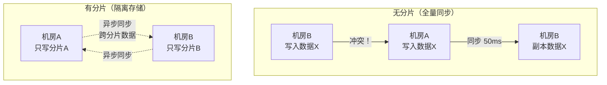
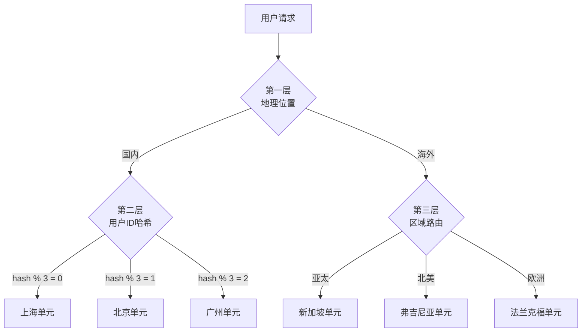
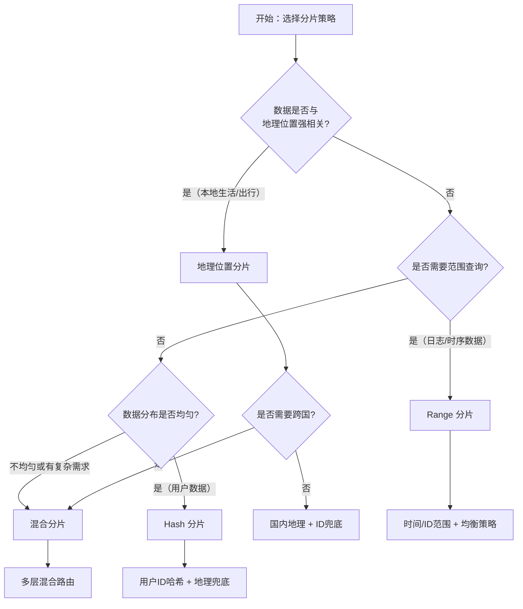
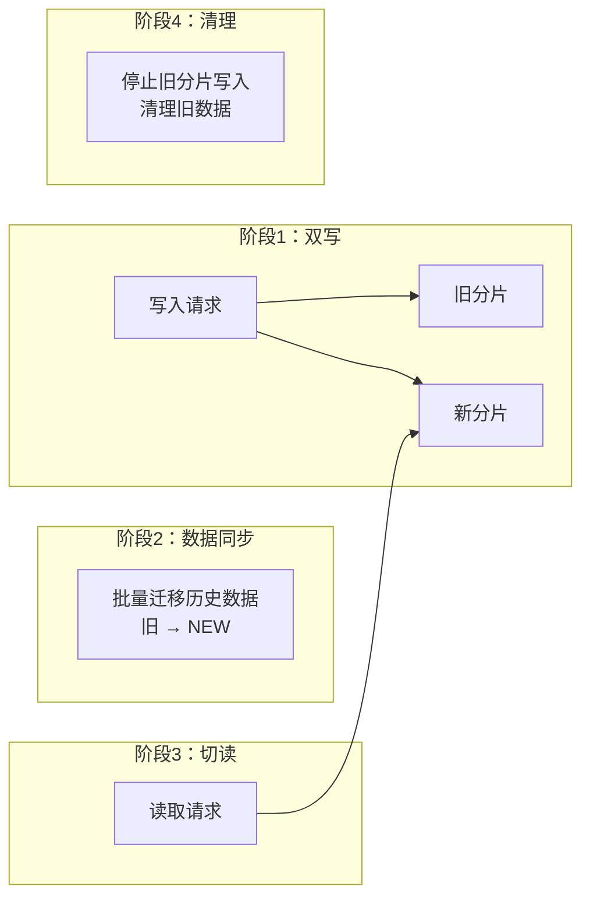
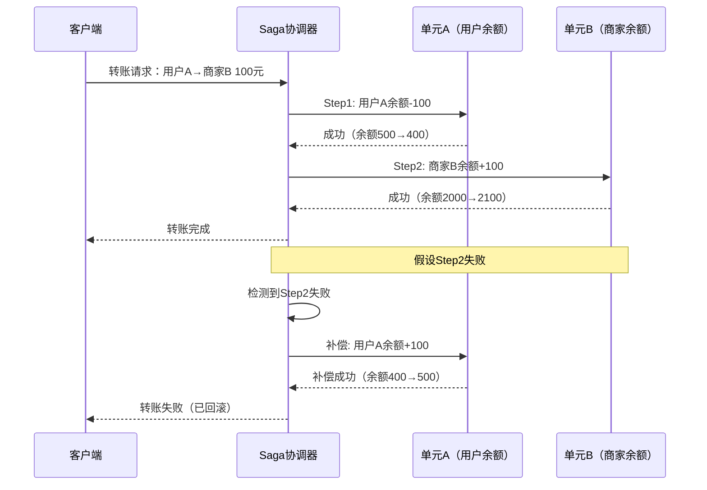
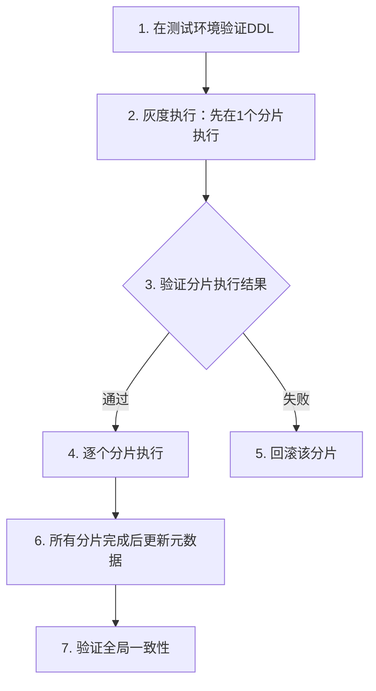
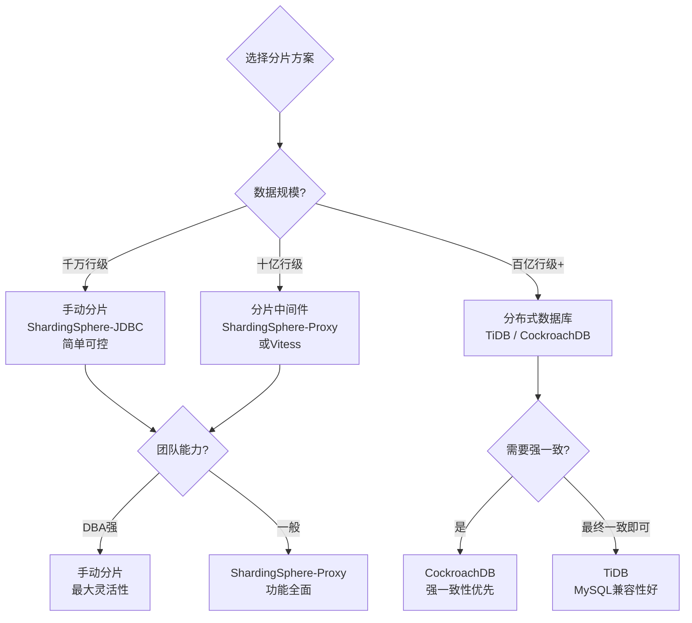
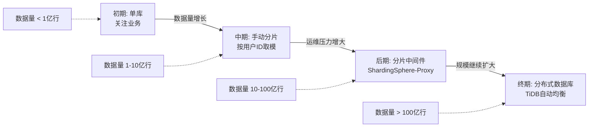

# 二、数据分片

数据分片（Data Sharding）是多活架构落地的基石技术。如果说流量调度决定了"用户的请求去哪个机房"，那么数据分片决定了"用户的数据存在哪里"。二者配合，才能真正实现单元化——让每个数据中心独立处理完整的业务请求，无需跨机房读写数据。

在上一节中，我们通过流量调度实现了请求的就近路由。但仅有请求路由是不够的——如果用户A在北京机房下单，订单数据却存在上海机房，请求还是得跨机房访问，延迟惩罚依然存在。数据分片的目标就是让数据的归属与流量的归属保持一致：请求到哪个机房，数据就在哪个机房。

本节从分布式ID生成（分片的前置条件）出发，深入讲解分片策略设计、分片键选择、数据分布均衡、跨分片查询、在线迁移、一致性保障等核心技巧，并提供可直接落地的代码实现和配置模板。

---

## 1. 分片的本质与挑战

### 1.1 为什么多活必须做数据分片

在单机房架构中，所有数据集中存储在一个数据库集群里，任何请求都能直接访问全部数据。但在多活架构中，多个数据中心分布在不同地域，机房间的网络延迟在 10-100ms 量级。如果每个机房都能写全量数据，就面临两个致命问题：

- **写冲突**：两个机房同时修改同一条记录，产生不可调和的数据矛盾
- **延迟惩罚**：每次跨机房读写都增加 20-200ms 延迟，用户体验严重劣化

数据分片的核心思路是**数据隔离**——将数据按某种维度拆分到不同单元，每个单元只拥有和处理自己分片的数据。这样，95% 以上的请求在单元内就能闭环完成，避免了跨机房数据访问。



### 1.2 分片面临的核心挑战

分片不是简单地把数据"拆开存"，它引入了一系列需要解决的工程问题：

| 挑战 | 具体表现 | 影响 |
|------|---------|------|
| 分片键选择 | 分片键决定数据归属，选错导致热点或跨分片查询暴增 | 系统性能和可用性的根因 |
| 分布式ID | 分片后自增ID冲突，需要全局唯一且有序的ID方案 | 数据路由和排序的基础 |
| 数据倾斜 | 某些分片数据量远大于其他分片 | 部分节点过载，整体吞吐受限 |
| 跨分片操作 | 用户A的数据在机房1，用户B在机房2，交互操作必须跨机房 | 延迟增加、一致性难保证 |
| 数据迁移 | 新增单元或扩容时需要在线迁移数据 | 迁移期间的一致性和可用性 |
| 全局数据 | 商品库、配置表等无法按用户维度分片 | 需要独立的同步和一致性策略 |
| DDL变更 | 分片表的Schema变更需要在所有分片同步执行 | 变更窗口长、风险高 |

---

## 2. 分布式ID生成：分片的前置条件

分片的首要问题是：数据拆分后，原来的自增主键（AUTO_INCREMENT）会在各分片产生重复ID。因此，分片架构的**第一个技术决策**就是分布式ID方案。选错ID方案，后续的分片路由、数据迁移、跨分片查询都会受到严重影响。

### 2.1 分布式ID的核心要求

| 要求 | 说明 | 重要性 |
|------|------|--------|
| 全局唯一 | 所有分片生成的ID不能重复 | 基本要求，重复则数据混乱 |
| 趋势递增 | ID整体随时间递增，便于排序和索引 | 影响B+Tree索引性能 |
| 不依赖中心 | 不能依赖单点服务生成ID | 单点故障导致全局不可用 |
| 高可用 | ID生成服务不能成为瓶颈 | 影响写入吞吐 |
| 信息安全 | 不能暴露业务量和顺序 | 防止竞品爬取和攻击 |

### 2.2 主流方案对比

| 方案 | 原理 | 性能 | 依赖 | 适用场景 |
|------|------|------|------|---------|
| UUID | 128位随机生成 | 极高 | 无 | 日志、非排序场景 |
| Snowflake | 时间戳+机器ID+序列号 | 高（单机400万/秒） | 时钟同步 | 通用场景（推荐） |
| 数据库号段 | 批量申请ID段 | 高（减少DB交互） | 数据库 | 中等规模 |
| Redis INCR | Redis原子递增 | 中（受Redis吞吐限制） | Redis | 小规模、已有Redis |
| Leaf（美团） | Snowflake+号段双模式 | 高 | 数据库 | 大规模生产环境 |

### 2.3 Snowflake算法详解

Snowflake是Twitter开源的分布式ID生成算法，也是业界最广泛采用的方案。其核心思想是将64位整数分为四个部分：

0 | 41位时间戳 | 5位数据中心ID | 5位工作机器ID | 12位序列号
│   │           │               │               │
│   │           │               │               └─ 毫秒内自增序列号（0-4095）
│   │           │               └─ 同一数据中心内的机器编号（0-31）
│   │           └─ 数据中心编号（0-31），多活场景对应不同机房
│   └─ 毫秒级时间戳，可用约69年
└─ 符号位，固定为0

```python
import time
import threading

class SnowflakeGenerator:
    """Snowflake分布式ID生成器
    
    结构: 0 | 41位时间戳 | 5位数据中心ID | 5位机器ID | 12位序列号
    
    时间戳: 毫秒级，从自定义纪元开始，可用约69年
    数据中心ID: 0-31，支持32个数据中心
    机器ID: 0-31，每个数据中心32台机器
    序列号: 毫秒内自增，每毫秒最多4096个ID
    """
    
    # 自定义纪元: 2024-01-01 00:00:00 UTC
    EPOCH = 1704067200000
    
    # 各部分的位数
    DATACENTER_BITS = 5
    WORKER_BITS = 5
    SEQUENCE_BITS = 12
    
    # 最大值
    MAX_DATACENTER_ID = (1 << DATACENTER_BITS) - 1   # 31
    MAX_WORKER_ID = (1 << WORKER_BITS) - 1            # 31
    MAX_SEQUENCE = (1 << SEQUENCE_BITS) - 1            # 4095
    
    # 位移
    WORKER_SHIFT = SEQUENCE_BITS                       # 12
    DATACENTER_SHIFT = SEQUENCE_BITS + WORKER_BITS     # 17
    TIMESTAMP_SHIFT = SEQUENCE_BITS + WORKER_BITS + DATACENTER_BITS  # 22
    
    def __init__(self, datacenter_id: int, worker_id: int):
        if datacenter_id > self.MAX_DATACENTER_ID:
            raise ValueError(f"数据中心ID不能超过{self.MAX_DATACENTER_ID}")
        if worker_id > self.MAX_WORKER_ID:
            raise ValueError(f"机器ID不能超过{self.MAX_WORKER_ID}")
        
        self.datacenter_id = datacenter_id
        self.worker_id = worker_id
        self.sequence = 0
        self.last_timestamp = -1
        self.lock = threading.Lock()
    
    def _current_millis(self) -> int:
        return int(time.time() * 1000)
    
    def _wait_next_millis(self, last_ts: int) -> int:
        """等待下一毫秒"""
        ts = self._current_millis()
        while ts <= last_ts:
            ts = self._current_millis()
        return ts
    
    def generate(self) -> int:
        """生成下一个唯一ID"""
        with self.lock:
            timestamp = self._current_millis()
            
            if timestamp < self.last_timestamp:
                raise RuntimeError(
                    f"时钟回拨! 拒绝生成ID, "
                    f"回拨了{self.last_timestamp - timestamp}ms"
                )
            
            if timestamp == self.last_timestamp:
                # 同一毫秒内, 序列号自增
                self.sequence = (self.sequence + 1) &amp; self.MAX_SEQUENCE
                if self.sequence == 0:
                    # 序列号用完, 等待下一毫秒
                    timestamp = self._wait_next_millis(self.last_timestamp)
            else:
                # 新毫秒, 序列号归零
                self.sequence = 0
            
            self.last_timestamp = timestamp
            
            # 组装ID
            return (
                ((timestamp - self.EPOCH) << self.TIMESTAMP_SHIFT) |
                (self.datacenter_id << self.DATACENTER_SHIFT) |
                (self.worker_id << self.WORKER_SHIFT) |
                self.sequence
            )
    
    @staticmethod
    def parse(snowflake_id: int) -> dict:
        """解析Snowflake ID的各部分"""
        sequence = snowflake_id &amp; 0xFFF
        worker_id = (snowflake_id >> 12) &amp; 0x1F
        datacenter_id = (snowflake_id >> 17) &amp; 0x1F
        timestamp = (snowflake_id >> 22) + SnowflakeGenerator.EPOCH
        return {
            "datacenter_id": datacenter_id,
            "worker_id": worker_id,
            "sequence": sequence,
            "timestamp": timestamp,
            "datetime": time.strftime(
                "%Y-%m-%d %H:%M:%S", time.localtime(timestamp / 1000)
            ),
        }


# 使用示例
gen = SnowflakeGenerator(datacenter_id=1, worker_id=1)
order_id = gen.generate()
print(f"生成订单ID: {order_id}")
print(f"解析结果: {SnowflakeGenerator.parse(order_id)}")
```

### 2.4 Snowflake的时钟回拨问题与解决

Snowflake算法的最大风险是**时钟回拨**——当NTP同步时间时，系统时钟可能向后跳跃，导致生成重复ID。常见解决方案：

| 方案 | 原理 | 优点 | 缺点 |
|------|------|------|------|
| 直接拒绝 | 检测到回拨直接报错 | 简单可靠 | 服务不可用 |
| 等待追上 | 回拨量小于阈值时等待 | 无ID浪费 | 服务延迟 |
| 预分配位 | 预留3位记录回拨次数 | 容忍小幅回拨 | 可用年限减少 |
| 备用序列 | 回拨时切换到备用位段 | 透明处理 | 实现复杂 |

```python
class ResilientSnowflake(SnowflakeGenerator):
    """容忍时钟回拨的Snowflake实现"""
    
    # 使用5位记录回拨次数（替代原来数据ID的高位）
    MAX_ROLLBACK_COUNT = 31
    
    def __init__(self, datacenter_id: int, worker_id: int,
                 max_rollback_ms: int = 5000):
        super().__init__(datacenter_id, worker_id)
        self.max_rollback_ms = max_rollback_ms
        self.rollback_count = 0
    
    def generate(self) -> int:
        with self.lock:
            timestamp = self._current_millis()
            
            if timestamp < self.last_timestamp:
                rollback_ms = self.last_timestamp - timestamp
                
                if rollback_ms > self.max_rollback_ms:
                    raise RuntimeError(
                        f"时钟回拨{rollback_ms}ms, 超过容忍阈值{self.max_rollback_ms}ms"
                    )
                
                self.rollback_count += 1
                if self.rollback_count > self.MAX_ROLLBACK_COUNT:
                    raise RuntimeError("回拨次数超限, 需要重启服务")
                
                # 使用回拨后的时钟, 但不重置序列号
                timestamp = self.last_timestamp
            else:
                self.rollback_count = 0
            
            if timestamp == self.last_timestamp:
                self.sequence = (self.sequence + 1) &amp; self.MAX_SEQUENCE
                if self.sequence == 0:
                    timestamp = self._wait_next_millis(self.last_timestamp)
            else:
                self.sequence = 0
            
            self.last_timestamp = timestamp
            
            return (
                ((timestamp - self.EPOCH) << self.TIMESTAMP_SHIFT) |
                (self.datacenter_id << self.DATACENTER_SHIFT) |
                (self.worker_id << self.WORKER_SHIFT) |
                self.sequence
            )
```

### 2.5 多活场景的ID方案选型

在多活架构中，Snowflake的"数据中心ID"字段天然映射到不同的机房。但需要注意：

- **各机房独立生成ID**：每个机房部署自己的Snowflake节点，使用不同的datacenter_id，确保ID全局唯一
- **ID不可作为分片键**：Snowflake ID的趋势递增特性会导致新数据集中写入最新分片（Range分片下），通常用user_id做分片键，Snowflake ID做主键
- **备机房ID生成器**：灾备机房也需要预部署ID生成器，避免切换时ID冲突

---

## 3. 分片策略详解

分片策略是数据分片的核心设计决策。不同的业务场景需要不同的分片维度，策略选择直接影响系统的性能、扩展性和运维复杂度。

### 3.1 Hash 分片

**原理**：对分片键进行哈希运算后取模，将数据均匀分布到各个分片。

```python
import hashlib

def hash_shard(key: str, shard_count: int) -> int:
    """Hash分片：对key做MD5后取模"""
    digest = hashlib.md5(key.encode()).hexdigest()
    return int(digest, 16) % shard_count
```

**优点**：
- 数据分布均匀，理论上不存在热点
- 路由计算简单，O(1) 时间复杂度
- 实现成熟，主流数据库和中间件都内置支持

**缺点**：
- 扩容时需要重新哈希（rehash），数据迁移量大
- 不支持范围查询（如"查询最近7天的订单"需要扫描所有分片）
- 顺序写入的场景下可能产生写热点

**典型应用**：用户维度的订单表、社交关系表、用户行为日志。

### 3.2 Range 分片

**原理**：按分片键的值范围划分，每个分片负责一段连续的区间。

```python
class RangeShardRouter:
    """范围分片路由器"""
    
    # 分片边界配置：(起始值, 结束值, 分片名)
    SHARD_RANGES = [
        (0,        1_000_000,  "shard-0-beijing"),
        (1_000_000, 5_000_000, "shard-1-shanghai"),
        (5_000_000, 10_000_000,"shard-2-guangzhou"),
        (10_000_000, None,     "shard-3-chengdu"),
    ]
    
    def route(self, user_id: int) -> str:
        for low, high, shard_name in self.SHARD_RANGES:
            if high is None:
                if user_id >= low:
                    return shard_name
            elif low <= user_id < high:
                return shard_name
        raise ValueError(f"无法路由 user_id={user_id}")
    
    def range_query(self, start_id: int, end_id: int) -> list:
        """范围查询：只需扫描涉及的分片"""
        affected_shards = []
        for low, high, shard_name in self.SHARD_RANGES:
            upper = high if high else float('inf')
            if low < end_id and upper > start_id:
                affected_shards.append(shard_name)
        return affected_shards
```

**优点**：
- 天然支持范围查询，效率高
- 扩容方便——只需新增分片处理新范围，已有数据无需迁移
- 数据有天然的时空局部性（如按时间分片的日志表）

**缺点**：
- 容易产生热点（新注册用户集中在最新分片）
- 数据分布不均匀，各分片容量差异大
- 分片边界需要精心设计，否则需要频繁调整

**典型应用**：按时间分片的日志表、按 ID 区间分配的订单表（如订单号前缀代表地域）。

### 3.3 地理位置分片

**原理**：根据用户 IP 或注册地等地理位置信息将数据分配到最近的数据中心。

```python
import geoip2.database
import geoip2.errors

class GeoShardRouter:
    """地理位置分片路由器"""
    
    def __init__(self, db_path: str):
        self.reader = geoip2.database.Reader(db_path)
        # 各区域对应的数据中心
        self.region_map = {
            "east_china":  "unit-shanghai",
            "north_china": "unit-beijing",
            "south_china": "unit-guangzhou",
            "west_china":  "unit-chengdu",
        }
        # 未匹配到的区域使用默认单元
        self.default_unit = "unit-beijing"
    
    def route(self, ip: str) -> str:
        try:
            response = self.reader.city(ip)
            country = response.country.iso_code
            subdivision = response.subdivisions.most_specific.name
            
            # 简化映射逻辑
            if country == "CN":
                if subdivision in ["上海", "江苏", "浙江", "安徽"]:
                    return self.region_map["east_china"]
                elif subdivision in ["北京", "天津", "河北", "山东"]:
                    return self.region_map["north_china"]
                elif subdivision in ["广东", "福建", "海南"]:
                    return self.region_map["south_china"]
                elif subdivision in ["四川", "重庆", "云南", "贵州"]:
                    return self.region_map["west_china"]
            
            return self.default_unit
        except geoip2.errors.AddressNotFoundError:
            return self.default_unit
```

**优点**：
- 用户就近访问延迟最低
- 就近写入减少跨机房同步量
- 自然实现地域容灾

**缺点**：
- 用户流动性导致跨地域访问（出差、旅行）
- IP 定位精度有限（VPN、CDN 代理导致误判）
- 用户分布不均匀（一线城市用户远多于其他地区）

**典型应用**：本地生活服务（美团外卖）、出行服务（滴滴打车）、内容分发（视频 CDN）。

### 3.4 混合分片策略

实际生产环境中，单一策略很难满足所有需求。混合分片策略将多种维度组合，兼顾就近访问、负载均衡和业务需求。



**混合策略配置模板**：

```yaml
sharding_strategy:
  # 第一层：按地域大区划分
  tier1_geo:
    regions:
      - name: "国内"
        geo_codes: ["CN"]
        fallback_unit: "unit-beijing"
      - name: "海外"
        geo_codes: ["*"]
        next_tier: "tier2_overseas"
  
  # 第二层：国内按用户ID均匀分片
  tier2_cn:
    strategy: "hash_mod"
    shard_key: "user_id"
    modulus: 3
    mapping:
      0: "unit-shanghai"
      1: "unit-beijing"  
      2: "unit-guangzhou"
  
  # 第三层：海外按区域路由
  tier2_overseas:
    strategy: "region_based"
    regions:
      - name: "亚太"
        countries: ["JP", "KR", "SG", "TH", "VN"]
        unit: "unit-singapore"
      - name: "北美"
        countries: ["US", "CA", "MX"]
        unit: "unit-virginia"
      - name: "欧洲"
        countries: ["GB", "DE", "FR", "NL"]
        unit: "unit-frankfurt"
      - name: "其他海外"
        unit: "unit-singapore"  # 兜底
```

### 3.5 策略选择决策树

面对具体业务，如何选择合适的分片策略？以下决策流程可以帮助你做出判断：



---

## 4. 分片键设计：最关键的决策

分片键（Shard Key）的选择是数据分片中最关键的设计决策，一旦确定往往难以更改。选错分片键会导致严重的性能和可用性问题。

### 4.1 分片键选择原则

| 原则 | 说明 | 反例 |
|------|------|------|
| **高基数** | 分片键的取值范围要足够广，确保数据均匀分布 | 用"性别"做分片键（只有男/女两个值） |
| **高频访问** | 分片键应该是大多数查询的条件之一 | 查询条件是"手机号"，分片键选"订单号" |
| **不可变性** | 分片键的值一旦确定不应改变 | 用户迁移城市后需要改写归属 |
| **业务内聚** | 相关数据应使用相同的分片键，避免跨分片查询 | 订单用"订单号"分片，但用户查订单用"用户ID" |
| **写入均匀** | 分片键对应的写入不应集中在某个区间 | 自增ID做分片键，新数据全落在最新分片 |

### 4.2 常见分片键选择场景

```python
class ShardKeySelector:
    """分片键选择器：根据业务场景推荐分片键"""
    
    RECOMMENDATIONS = {
        "电商用户": {
            "primary_key": "user_id",
            "reason": "用户的订单、购物车、地址簿都以用户为中心",
            "access_pattern": "95%请求带user_id，5%跨用户操作",
            "overflow_strategy": "跨用户操作路由到中心单元",
        },
        "订单系统": {
            "primary_key": "user_id",
            "reason": "订单查询90%来自下单用户本人",
            "alternate_key": "order_id（用于管理后台按订单号查询）",
            "access_pattern": "C端查user_id，B端查order_id",
            "overflow_strategy": "管理后台走中心单元的全局索引",
        },
        "社交关系": {
            "primary_key": "user_id",
            "reason": "好友列表、消息以用户为中心",
            "access_pattern": "发消息/查好友是user_id维度",
            "overflow_strategy": "跨用户消息走异步消息队列",
        },
        "商品数据": {
            "primary_key": "product_id",
            "reason": "商品数据是全局共享的，按product_id分片",
            "special": "通常作为全局数据全量同步到所有单元",
        },
        "日志系统": {
            "primary_key": "timestamp（Range分片）",
            "reason": "日志按时间范围查询是主要场景",
            "access_pattern": "写入密集、按时间范围查询",
        },
    }
    
    @classmethod
    def recommend(cls, scenario: str) -> dict:
        return cls.RECOMMENDATIONS.get(scenario, {
            "primary_key": "请根据访问模式分析",
            "reason": "无推荐，需要具体分析",
        })
```

### 4.3 分片键热key问题与解决

即使选择了高基数的分片键，仍然可能出现热点。典型场景包括：网红用户、大促活动、地域集中。

**热点检测**：

```python
import time
from collections import defaultdict

class HotKeyDetector:
    """分片键热点检测器"""
    
    def __init__(self, window_seconds: int = 60, threshold: int = 10000):
        self.window = window_seconds
        self.threshold = threshold
        self.access_log = defaultdict(list)  # shard_key -> [timestamps]
    
    def record_access(self, shard_key: str):
        now = time.time()
        self.access_log[shard_key].append(now)
        # 清理过期记录
        self.access_log[shard_key] = [
            t for t in self.access_log[shard_key] 
            if now - t < self.window
        ]
    
    def detect_hot_keys(self) -> list:
        """检测当前窗口内的热点key"""
        hot_keys = []
        for key, timestamps in self.access_log.items():
            if len(timestamps) > self.threshold:
                hot_keys.append({
                    "key": key,
                    "qps": len(timestamps) / self.window,
                    "hot_level": "critical" if len(timestamps) > self.threshold * 3 
                                else "warning",
                })
        return sorted(hot_keys, key=lambda x: x["qps"], reverse=True)
```

**热点解决策略**：

| 策略 | 实现方式 | 适用场景 | 注意事项 |
|------|---------|---------|---------|
| 本地缓存 | 热点key的数据缓存在应用内存 | 读热点（如热门商品） | 需要缓存失效机制 |
| 分片打散 | 将热点key的后缀加随机数拆成多个key | 写热点（如秒杀库存） | 合并查询时需要聚合 |
| 限流降级 | 对热点key的访问进行限流 | 极端热点场景 | 会牺牲部分用户体验 |
| 动态迁移 | 将热点数据迁移到专用节点 | 持续性热点 | 需要在线迁移能力 |

**分片打散代码示例**（秒杀库存场景）：

```python
import random

class HotKeyScatter:
    """热点key打散：将单个key拆分为N个子key"""
    
    def __init__(self, key: str, shard_count: int = 64):
        self.base_key = key
        self.shard_count = shard_count
    
    def get_sub_key(self, operation: str = None) -> str:
        """获取一个随机子key，用于写入分散"""
        suffix = random.randint(0, self.shard_count - 1)
        return f"{self.base_key}:shard:{suffix}"
    
    def get_all_sub_keys(self) -> list:
        """获取所有子key，用于聚合读取"""
        return [f"{self.base_key}:shard:{i}" 
                for i in range(self.shard_count)]
    
    def scatter_write(self, redis_client, amount: int):
        """写入分散到多个子key"""
        sub_key = self.get_sub_key()
        redis_client.decrby(sub_key, amount)
    
    def aggregate_read(self, redis_client) -> int:
        """聚合读取所有子key的总和"""
        total = 0
        for sub_key in self.get_all_sub_keys():
            val = redis_client.get(sub_key)
            if val:
                total += int(val)
        return total

# 秒杀库存打散示例
stock = HotKeyScatter("seckill:product:12345:stock", shard_count=64)

# 初始化总库存
total_stock = 1000
for i in range(64):
    redis_client.set(f"seckill:product:12345:stock:shard:{i}", 
                     total_stock // 64)

# 用户抢购时分散扣减
stock.scatter_write(redis_client, 1)

# 查询剩余库存时聚合
remaining = stock.aggregate_read(redis_client)
```

---

## 5. 跨分片查询与聚合

分片隔离了数据，但也带来了跨分片查询的难题。当业务需要查询横跨多个分片的数据时，需要设计合理的查询策略。

### 5.1 跨分片查询模式

**模式一：分片并行查询 + 结果聚合**

```python
import concurrent.futures
from typing import List, Dict, Any

class CrossShardQuery:
    """跨分片查询引擎"""
    
    def __init__(self, shard_connections: Dict[str, Any]):
        self.shards = shard_connections
    
    def parallel_query(self, sql: str, max_workers: int = 8) -> List[Dict]:
        """并行查询所有分片，合并结果"""
        results = []
        
        with concurrent.futures.ThreadPoolExecutor(
            max_workers=max_workers
        ) as executor:
            futures = {
                executor.submit(self._query_shard, shard_id, sql): shard_id
                for shard_id in self.shards
            }
            
            for future in concurrent.futures.as_completed(futures):
                shard_id = futures[future]
                try:
                    shard_result = future.result(timeout=5)
                    results.extend(shard_result)
                except Exception as e:
                    print(f"分片 {shard_id} 查询失败: {e}")
                    # 可选：标记该分片为不可用
        
        return results
    
    def _query_shard(self, shard_id: str, sql: str) -> List[Dict]:
        conn = self.shards[shard_id]
        cursor = conn.cursor(dictionary=True)
        cursor.execute(sql)
        return cursor.fetchall()


class CrossShardPaginator:
    """跨分片分页查询"""
    
    def __init__(self, query_engine: CrossShardQuery):
        self.engine = query_engine
    
    def search(self, sql_template: str, page: int = 1, 
               page_size: int = 20) -> dict:
        """
        跨分片分页：先从所有分片取topN，再内存排序截取
        适用于非精确分页场景（允许少量偏差）
        """
        # 每个分片多取一些，确保合并后够用
        fetch_size = page * page_size
        sql = sql_template.format(limit=fetch_size, offset=0)
        
        all_results = self.engine.parallel_query(sql)
        
        # 全局排序（根据具体排序字段调整）
        all_results.sort(key=lambda x: x.get('created_at', ''), 
                         reverse=True)
        
        # 截取当前页
        start = (page - 1) * page_size
        end = start + page_size
        page_data = all_results[start:end]
        
        return {
            "data": page_data,
            "page": page,
            "page_size": page_size,
            "total_approx": len(all_results),
        }
```

**模式二：全局二级索引**

对于需要跨分片查询的字段，建立全局二级索引，将索引数据全量同步到每个单元。

```python
class GlobalSecondaryIndex:
    """全局二级索引管理器"""
    
    def __init__(self):
        # 索引表结构：index_field_value -> [shard_id, primary_key]
        self.index = {}
    
    def index_record(self, index_field: str, value: str, 
                     shard_id: str, primary_key: str):
        """建立索引"""
        key = f"{index_field}:{value}"
        if key not in self.index:
            self.index[key] = []
        self.index[key].append({"shard": shard_id, "pk": primary_key})
    
    def lookup(self, index_field: str, value: str) -> list:
        """通过索引查找数据所在的分片"""
        key = f"{index_field}:{value}"
        return self.index.get(key, [])
```

**模式三：异步聚合**

对于实时性要求不高的跨分片查询（如报表、统计），采用异步方式：各分片定期将聚合结果上报到中心节点，中心节点汇总后提供查询。

```python
class AsyncAggregator:
    """异步聚合器：各分片定期上报聚合结果"""
    
    def __init__(self):
        self.shard_stats = {}  # shard_id -> {metric: value}
        self.last_update = {}  # shard_id -> timestamp
    
    def report(self, shard_id: str, metrics: dict):
        """分片上报聚合指标"""
        self.shard_stats[shard_id] = metrics
        self.last_update[shard_id] = time.time()
    
    def get_global_metrics(self) -> dict:
        """获取全局聚合结果"""
        total = {}
        for shard_id, metrics in self.shard_stats.items():
            for metric, value in metrics.items():
                total[metric] = total.get(metric, 0) + value
        return total
    
    def get_staleness(self) -> dict:
        """检查各分片数据的新鲜度"""
        now = time.time()
        return {
            shard_id: now - ts 
            for shard_id, ts in self.last_update.items()
        }
```

### 5.2 跨分片查询策略对比

| 策略 | 延迟 | 数据一致性 | 实现复杂度 | 适用场景 |
|------|------|-----------|-----------|---------|
| 并行查询+内存聚合 | 高（取决于最慢分片） | 实时 | 低 | 低频跨分片查询 |
| 全局二级索引 | 中（本地索引查询） | 近实时 | 中 | 需要按非分片键查询 |
| 异步聚合 | 低（查询本地数据） | 有延迟（秒~分钟级） | 低 | 报表、统计、大屏 |
| CDC事件同步 | 中 | 最终一致 | 高 | 需要跨分片关联查询 |

---

## 6. 数据在线迁移与再平衡

随着业务增长或架构调整，数据分片可能需要扩容（增加单元）或再平衡（重新分配数据）。在线迁移的关键挑战是：**迁移过程中不能影响业务的正常读写**。

### 6.1 双写迁移方案

双写是数据迁移最常用的方案，核心思路是：在迁移过程中同时写入新旧两个位置，迁移完成后切读到新位置，最后停止旧位置的写入。



**双写迁移完整实现**：

```python
import threading
import time
from enum import Enum

class MigrationPhase(Enum):
    PREPARE = "prepare"           # 准备阶段
    DUAL_WRITE = "dual_write"     # 双写阶段
    SYNC_DATA = "sync_data"       # 数据同步阶段
    SWITCH_READ = "switch_read"   # 切读阶段
    CLEANUP = "cleanup"           # 清理阶段
    COMPLETE = "complete"         # 完成

class ShardMigrator:
    """分片在线迁移管理器"""
    
    def __init__(self, source_db, target_db, shard_key: str):
        self.source = source_db
        self.target = target_db
        self.shard_key = shard_key
        self.phase = MigrationPhase.PREPARE
        self.migrated_count = 0
        self.error_count = 0
    
    def start_migration(self, batch_size: int = 1000):
        """启动迁移流程"""
        print(f"开始迁移: {self.source} -> {self.target}")
        
        # 阶段1: 启用双写
        self.phase = MigrationPhase.DUAL_WRITE
        self._enable_dual_write()
        
        # 阶段2: 同步历史数据
        self.phase = MigrationPhase.SYNC_DATA
        self._sync_historical_data(batch_size)
        
        # 阶段3: 切读
        self.phase = MigrationPhase.SWITCH_READ
        self._switch_read_target()
        
        # 阶段4: 验证数据一致性
        self._verify_consistency()
        
        # 阶段5: 清理
        self.phase = MigrationPhase.CLEANUP
        self._cleanup_source()
        
        self.phase = MigrationPhase.COMPLETE
        print(f"迁移完成: 共迁移 {self.migrated_count} 条, "
              f"错误 {self.error_count} 条")
    
    def _enable_dual_write(self):
        """启用双写：后续的写操作同时写入新旧两个分片"""
        # 实际实现中，通过配置中心或路由规则启用双写
        print("[双写] 启用双写模式")
    
    def _sync_historical_data(self, batch_size: int):
        """批量同步历史数据"""
        offset = 0
        while True:
            # 从源分片批量读取
            records = self.source.query(
                f"SELECT * FROM orders ORDER BY id LIMIT {batch_size} "
                f"OFFSET {offset}"
            )
            
            if not records:
                break
            
            # 写入目标分片（使用 UPSERT 防止重复）
            for record in records:
                try:
                    self.target.upsert(record)
                    self.migrated_count += 1
                except Exception as e:
                    self.error_count += 1
                    print(f"迁移记录失败: {record['id']}, 错误: {e}")
            
            offset += batch_size
            print(f"[同步] 已迁移 {self.migrated_count} 条")
    
    def _switch_read_target(self):
        """切换读取目标到新分片"""
        print("[切读] 将读取请求切换到新分片")
        # 实际实现中，通过路由配置切换读目标
    
    def _verify_consistency(self):
        """验证数据一致性"""
        source_count = self.source.count("orders")
        target_count = self.target.count("orders")
        
        if source_count != target_count:
            print(f"[警告] 数据不一致: 源={source_count}, "
                  f"目标={target_count}")
            # 触发告警
    
    def _cleanup_source(self):
        """清理源分片数据"""
        print("[清理] 停止双写，清理旧分片数据")
```

### 6.2 一致性哈希迁移

一致性哈希（Consistent Hashing）可以最小化扩容时的数据迁移量。新增节点只需从相邻节点接收部分数据，而不需要全量重新分配。

```python
import hashlib
import bisect

class ConsistentHashRing:
    """一致性哈希环"""
    
    def __init__(self, virtual_nodes: int = 150):
        self.virtual_nodes = virtual_nodes
        self.ring = {}           # hash_value -> node_name
        self.sorted_keys = []    # 排序后的hash值列表
        self.nodes = set()       # 物理节点集合
    
    def _hash(self, key: str) -> int:
        return int(hashlib.md5(key.encode()).hexdigest(), 16)
    
    def add_node(self, node_name: str):
        """添加节点"""
        self.nodes.add(node_name)
        for i in range(self.virtual_nodes):
            virtual_key = f"{node_name}:vn{i}"
            hash_val = self._hash(virtual_key)
            self.ring[hash_val] = node_name
            bisect.insort(self.sorted_keys, hash_val)
    
    def remove_node(self, node_name: str):
        """移除节点"""
        self.nodes.discard(node_name)
        for i in range(self.virtual_nodes):
            virtual_key = f"{node_name}:vn{i}"
            hash_val = self._hash(virtual_key)
            if hash_val in self.ring:
                del self.ring[hash_val]
                self.sorted_keys.remove(hash_val)
    
    def get_node(self, key: str) -> str:
        """获取key对应的节点"""
        if not self.ring:
            raise RuntimeError("哈希环为空")
        
        hash_val = self._hash(key)
        idx = bisect.bisect_right(self.sorted_keys, hash_val)
        if idx == len(self.sorted_keys):
            idx = 0
        return self.ring[self.sorted_keys[idx]]
    
    def get_migration_plan(self, new_node: str) -> dict:
        """计算新增节点后的迁移计划：只迁移受影响的key"""
        new_node_positions = set()
        for i in range(self.virtual_nodes):
            virtual_key = f"{new_node}:vn{i}"
            hash_val = self._hash(virtual_key)
            new_node_positions.add(hash_val)
        
        # 迁移量 = 新节点占环上的比例
        migration_ratio = self.virtual_nodes / (
            len(self.nodes) * self.virtual_nodes + self.virtual_nodes
        )
        return {
            "new_node": new_node,
            "estimated_migration_ratio": f"{migration_ratio:.1%}",
            "affected_nodes": list(self.nodes),
        }

# 使用示例
ring = ConsistentHashRing(virtual_nodes=150)
ring.add_node("unit-beijing")
ring.add_node("unit-shanghai")
ring.add_node("unit-guangzhou")

# 查看用户路由
user_id = "user_10001"
node = ring.get_node(user_id)
print(f"用户 {user_id} -> 节点: {node}")

# 扩容：新增成都单元，只迁移约1/4的数据
plan = ring.get_migration_plan("unit-chengdu")
print(f"迁移计划: {plan}")
ring.add_node("unit-chengdu")
```

### 6.3 迁移过程中的数据一致性保障

| 阶段 | 读操作 | 写操作 | 一致性风险 | 保障措施 |
|------|--------|--------|-----------|---------|
| 准备 | 旧分片 | 旧分片 | 无 | 数据备份 |
| 双写+同步 | 旧分片 | 新旧分片 | 新分片数据可能落后 | 写入确认机制 |
| 切读 | 新分片 | 新旧分片 | 读到未同步完的数据 | 校验已迁移标记 |
| 停旧写 | 新分片 | 新分片 | 迁移中的新写入丢失 | 双写窗口覆盖迁移时间 |

---

## 7. 数据分片与一致性保障

在多活架构中，数据分片后的一致性保障面临双重挑战：既要保证同一分片内的数据一致，又要处理跨分片操作的事务性。

### 7.1 分片内一致性

每个分片通常采用主从复制架构。分片内的数据一致性取决于复制策略：

| 复制方式 | 一致性 | 延迟 | 可用性 | 适用场景 |
|---------|--------|------|--------|---------|
| 同步复制 | 强一致 | 高 | 低 | 金融核心交易 |
| 半同步复制 | 读写一致 | 中 | 中 | 电商订单核心表 |
| 异步复制 | 最终一致 | 低 | 高 | 用户行为日志 |
| 组提交（Group Commit） | 最终一致 | 低 | 高 | 高吞吐写入场景 |

**MySQL 半同步复制配置**：

```sql
-- 主库配置
SET GLOBAL rpl_semi_sync_master_enabled = 1;
SET GLOBAL rpl_semi_sync_master_timeout = 1000;  -- 1秒超时降级
SET GLOBAL rpl_semi_sync_master_wait_for_slave_count = 1;  -- 至少1个从库确认

-- 从库配置
SET GLOBAL rpl_semi_sync_slave_enabled = 1;

-- 验证配置
SHOW STATUS LIKE 'Rpl_semi_sync%';
```

### 7.2 跨分片事务：Saga 模式

跨分片操作无法使用传统的分布式事务（2PC/XA），因为跨机房的协调延迟过高。Saga 模式通过将长事务拆分为一系列本地事务，配合补偿操作实现最终一致性。



**Saga 协调器实现**：

```python
from enum import Enum
from typing import List, Callable, Optional
import logging
import json

class StepStatus(Enum):
    PENDING = "pending"
    COMPLETED = "completed"
    FAILED = "failed"
    COMPENSATED = "compensated"

class SagaStep:
    def __init__(self, name: str, action: Callable, 
                 compensation: Callable):
        self.name = name
        self.action = action
        self.compensation = compensation
        self.status = StepStatus.PENDING
        self.result = None

class SagaCoordinator:
    """Saga事务协调器"""
    
    def __init__(self, saga_id: str):
        self.saga_id = saga_id
        self.steps: List[SagaStep] = []
        self.logger = logging.getLogger(f"saga.{saga_id}")
    
    def add_step(self, name: str, action: Callable, 
                 compensation: Callable):
        self.steps.append(SagaStep(name, action, compensation))
    
    def execute(self) -> dict:
        """执行Saga事务，失败时自动补偿"""
        completed_steps = []
        
        for step in self.steps:
            try:
                self.logger.info(f"执行步骤: {step.name}")
                step.result = step.action()
                step.status = StepStatus.COMPLETED
                completed_steps.append(step)
                
            except Exception as e:
                self.logger.error(f"步骤失败: {step.name}, 错误: {e}")
                step.status = StepStatus.FAILED
                
                # 触发补偿
                self._compensate(completed_steps)
                return {
                    "status": "failed",
                    "failed_step": step.name,
                    "error": str(e),
                    "compensated": True,
                }
        
        return {"status": "completed", "steps": len(self.steps)}
    
    def _compensate(self, completed_steps: List[SagaStep]):
        """逆序补偿已执行的步骤"""
        for step in reversed(completed_steps):
            try:
                self.logger.info(f"补偿步骤: {step.name}")
                step.compensation()
                step.status = StepStatus.COMPENSATED
            except Exception as e:
                self.logger.critical(
                    f"补偿失败: {step.name}, 错误: {e}. "
                    f"需要人工介入!"
                )


# 使用示例：跨单元转账
def transfer(saga: SagaCoordinator):
    saga.add_step(
        name="扣减用户A余额",
        action=lambda: db_shard_a.execute(
            "UPDATE users SET balance=balance-100 WHERE id='A'"
        ),
        compensation=lambda: db_shard_a.execute(
            "UPDATE users SET balance=balance+100 WHERE id='A'"
        ),
    )
    saga.add_step(
        name="增加商家B余额",
        action=lambda: db_shard_b.execute(
            "UPDATE users SET balance=balance+100 WHERE id='B'"
        ),
        compensation=lambda: db_shard_b.execute(
            "UPDATE users SET balance=balance-100 WHERE id='B'"
        ),
    )
    return saga.execute()
```

### 7.3 最终一致性的版本控制

在最终一致性模型下，通过版本号（Vector Clock 或 Lamport Timestamp）追踪数据的因果关系，防止并发写入的覆盖丢失。

```python
import threading
import time
from dataclasses import dataclass, field
from typing import Dict

@dataclass
class VersionedRecord:
    """带版本号的数据记录"""
    key: str
    value: str
    version: Dict[str, int] = field(default_factory=dict)
    timestamp: float = 0.0

class VersionVector:
    """向量时钟：追踪多节点的因果关系"""
    
    def __init__(self, node_id: str):
        self.node_id = node_id
        self.clock: Dict[str, int] = {}
        self.lock = threading.Lock()
    
    def increment(self):
        with self.lock:
            self.clock[self.node_id] = self.clock.get(self.node_id, 0) + 1
    
    def merge(self, other: Dict[str, int]):
        """合并另一个向量时钟"""
        with self.lock:
            for node, ts in other.items():
                self.clock[node] = max(self.clock.get(node, 0), ts)
    
    def happens_before(self, other: Dict[str, int]) -> bool:
        """判断当前时钟是否在other之前"""
        for node in set(list(self.clock.keys()) + list(other.keys())):
            if self.clock.get(node, 0) > other.get(node, 0):
                return False
        return True
    
    def concurrent_with(self, other: Dict[str, int]) -> bool:
        """判断是否与other并发"""
        return (not self.happens_before(other) and 
                not VersionVector._static_hb(other, self.clock))
    
    @staticmethod
    def _static_hb(a: dict, b: dict) -> bool:
        for node in set(list(a.keys()) + list(b.keys())):
            if a.get(node, 0) > b.get(node, 0):
                return False
        return True


class VersionedStore:
    """带版本控制的分片存储"""
    
    def __init__(self, node_id: str):
        self.node_id = node_id
        self.store: Dict[str, VersionedRecord] = {}
        self.vv = VersionVector(node_id)
    
    def write(self, key: str, value: str, 
              incoming_version: Dict[str, int] = None) -> VersionedRecord:
        """写入数据并更新版本号"""
        self.vv.increment()
        
        existing = self.store.get(key)
        
        if existing and incoming_version:
            if self.vv.concurrent_with(incoming_version):
                # 并发写入冲突，使用 LWW（最后写入胜出）
                if existing.timestamp > time.time():
                    return existing  # 已有更新的写入
        
        record = VersionedRecord(
            key=key,
            value=value,
            version=dict(self.vv.clock),
            timestamp=time.time(),
        )
        self.store[key] = record
        return record
    
    def read(self, key: str) -> Optional[VersionedRecord]:
        """读取数据"""
        return self.store.get(key)
    
    def merge_from_remote(self, remote_record: VersionedRecord):
        """从远程分片同步数据"""
        existing = self.store.get(remote_record.key)
        
        if existing is None:
            # 本地没有，直接写入
            self.store[remote_record.key] = remote_record
            self.vv.merge(remote_record.version)
        elif remote_record.version.get(self.node_id, 0) > \
             existing.version.get(self.node_id, 0):
            # 远程版本更新，覆盖本地
            self.store[remote_record.key] = remote_record
            self.vv.merge(remote_record.version)
```

---

## 8. 分片运维与变更管理

### 8.1 DDL 变更管理

分片表的Schema变更（加字段、加索引、改类型）比单库复杂得多——需要在所有分片同步执行，且不能影响在线业务。以下是DDL变更的标准流程：



**关键原则**：

- **向后兼容**：新Schema必须兼容旧数据，先加列后改逻辑
- **分批执行**：不要同时在所有分片执行DDL，逐个执行并在中间穿插验证
- **避免锁表**：使用Online DDL（如MySQL 8.0的ALGORITHM=INPLACE）或pt-online-schema-change
- **回滚预案**：每次DDL变更都要准备回滚脚本

```bash
# pt-online-schema-change 示例：在线加字段
pt-online-schema-change \
  --alter "ADD COLUMN vip_level INT DEFAULT 0" \
  --execute \
  --host=shard-0 \
  --database=ecommerce \
  --table=users

# 逐分片执行，每个分片完成后验证
for shard in shard-0 shard-1 shard-2 shard-3; do
    echo "执行DDL: $shard"
    pt-online-schema-change \
      --alter "ADD COLUMN vip_level INT DEFAULT 0" \
      --execute \
      --host=$shard \
      --database=ecommerce \
      --table=users
    
    # 验证字段存在
    mysql -h $shard -e "DESCRIBE ecommerce.users" | grep vip_level
done
```

### 8.2 连接池管理

分片环境下，每个应用实例需要连接多个数据库分片。连接池管理不当会导致连接风暴或连接泄漏：

```python
import MySQLdb
from dbutils.pooled_db import PooledDB
from typing import Dict

class ShardedConnectionPool:
    """分片连接池管理器"""
    
    def __init__(self, shard_configs: Dict[str, dict], 
                 pool_size: int = 20, max_overflow: int = 10):
        """
        shard_configs: {
            "shard-0": {"host": "10.0.1.100", "port": 3306, ...},
            "shard-1": {"host": "10.0.2.100", "port": 3306, ...},
        }
        """
        self.pools = {}
        for shard_id, config in shard_configs.items():
            self.pools[shard_id] = PooledDB(
                creator=MySQLdb,
                maxconnections=pool_size + max_overflow,
                mincached=5,           # 最小空闲连接
                maxcached=pool_size,   # 最大空闲连接
                blocking=True,         # 连接耗尽时阻塞等待
                host=config["host"],
                port=config["port"],
                user=config["user"],
                passwd=config["password"],
                database=config["database"],
                charset="utf8mb4",
            )
    
    def get_connection(self, shard_id: str):
        """获取指定分片的连接"""
        if shard_id not in self.pools:
            raise ValueError(f"未知分片: {shard_id}")
        return self.pools[shard_id].connection()
    
    def execute_on_shard(self, shard_id: str, sql: str, params=None):
        """在指定分片执行SQL"""
        conn = self.get_connection(shard_id)
        try:
            cursor = conn.cursor()
            cursor.execute(sql, params)
            conn.commit()
            return cursor.fetchall()
        except Exception:
            conn.rollback()
            raise
        finally:
            conn.close()  # 归还到连接池
    
    def health_check(self) -> dict:
        """检查所有分片连接池状态"""
        status = {}
        for shard_id, pool in self.pools.items():
            try:
                conn = pool.connection()
                cursor = conn.cursor()
                cursor.execute("SELECT 1")
                conn.close()
                status[shard_id] = "healthy"
            except Exception as e:
                status[shard_id] = f"unhealthy: {e}"
        return status
```

### 8.3 核心监控指标

```python
from prometheus_client import Gauge, Counter, Histogram

# ---- 分片级别指标 ----
shard_data_size = Gauge(
    'shard_data_size_bytes', 
    '分片数据大小',
    ['shard_id', 'database', 'table']
)

shard_qps = Counter(
    'shard_queries_total',
    '分片查询总量',
    ['shard_id', 'operation']  # operation: read/write
)

shard_latency = Histogram(
    'shard_query_latency_seconds',
    '分片查询延迟',
    ['shard_id', 'operation'],
    buckets=[0.001, 0.005, 0.01, 0.05, 0.1, 0.5, 1.0]
)

shard_replication_delay = Gauge(
    'shard_replication_delay_seconds',
    '分片主从复制延迟',
    ['shard_id']
)

shard_balance_ratio = Gauge(
    'shard_balance_ratio',
    '分片数据量偏差比 (最大/最小)',
    ['sharding_group']
)

# ---- 跨分片指标 ----
cross_shard_query_total = Counter(
    'cross_shard_queries_total',
    '跨分片查询总量',
    ['query_type']
)

migration_progress = Gauge(
    'shard_migration_progress',
    '数据迁移进度 (0-100%)',
    ['migration_id']
)
```

### 8.4 分片健康检查脚本

```bash
#!/bin/bash
# shard_health_check.sh - 分片健康检查

SHARDS=("shard-0:10.0.1.100:3306" "shard-1:10.0.2.100:3306" 
        "shard-2:10.0.3.100:3306" "shard-3:10.0.4.100:3306")
ALERT_THRESHOLD_DELAY=1000  # 复制延迟告警阈值(秒)
ALERT_THRESHOLD_SIZE_GB=500 # 数据量告警阈值(GB)

for shard in "${SHARDS[@]}"; do
    IFS=':' read -r name host port <<< "$shard"
    echo "=== 检查分片: $name ($host:$port) ==="
    
    # 1. 连接检查
    if ! mysql -h "$host" -P "$port" -u monitor -p'xxx' \
        -e "SELECT 1" &amp;>/dev/null; then
        echo "[CRITICAL] $name 无法连接!"
        continue
    fi
    
    # 2. 复制延迟检查
    delay=$(mysql -h "$host" -P "$port" -u monitor -p'xxx' -e \
        "SHOW SLAVE STATUS\G" 2>/dev/null | \
        grep "Seconds_Behind_Master" | awk '{print $2}')
    
    if [ -n "$delay" ] &amp;&amp; [ "$delay" -gt "$ALERT_THRESHOLD_DELAY" ]; then
        echo "[WARNING] $name 复制延迟: ${delay}s"
    else
        echo "[OK] $name 复制延迟: ${delay}s"
    fi
    
    # 3. 数据量检查
    data_size=$(mysql -h "$host" -P "$port" -u monitor -p'xxx' -N -e \
        "SELECT ROUND(SUM(data_length + index_length) / 1024 / 1024 / 1024, 2) 
         FROM information_schema.tables 
         WHERE table_schema NOT IN ('mysql','information_schema','performance_schema','sys')" 2>/dev/null)
    
    echo "[INFO] $name 数据量: ${data_size}GB"
done

# 4. 分片均衡度检查
echo ""
echo "=== 分片均衡度 ==="
sizes=()
for shard in "${SHARDS[@]}"; do
    IFS=':' read -r name host port <<< "$shard"
    size=$(mysql -h "$host" -P "$port" -u monitor -p'xxx' -N -e \
        "SELECT ROUND(SUM(data_length + index_length) / 1024 / 1024 / 1024, 2) 
         FROM information_schema.tables 
         WHERE table_schema NOT IN ('mysql','information_schema','performance_schema','sys')" 2>/dev/null)
    sizes+=("$size")
    echo "$name: ${size}GB"
done

# 计算最大/最小比值
max_size=$(printf '%s\n' "${sizes[@]}" | sort -n | tail -1)
min_size=$(printf '%s\n' "${sizes[@]}" | sort -n | head -1)
if [ "$min_size" != "0" ] &amp;&amp; [ -n "$min_size" ]; then
    ratio=$(echo "scale=2; $max_size / $min_size" | bc)
    echo "最大/最小比值: ${ratio}x"
    if (( $(echo "$ratio > 2.0" | bc -l) )); then
        echo "[WARNING] 分片均衡度差，建议进行数据再平衡"
    fi
fi
```

### 8.5 常见分片问题排查清单

| 问题现象 | 可能原因 | 排查方法 | 解决方案 |
|---------|---------|---------|---------|
| 某分片响应变慢 | 数据倾斜/热点key | 查看分片数据量和QPS分布 | 热点打散、负载均衡 |
| 跨分片查询超时 | 路由规则错误/分片数过多 | 检查路由日志和查询计划 | 优化路由、减少跨分片查询 |
| 数据迁移失败 | 目标分片容量不足/冲突 | 查看迁移日志和错误信息 | 扩容目标分片、处理冲突 |
| 复制延迟持续增大 | 写入量超过从库处理能力 | 监控主从延迟和IO负载 | 升级从库配置、优化写入模式 |
| 数据不一致 | 双写窗口未完全覆盖迁移时间 | 对比新旧分片数据 | 全量校验+增量补偿 |
| Snowflake ID重复 | 时钟回拨/节点ID冲突 | 检查NTP同步和节点配置 | 部署NTP容错、检查节点注册 |

---

## 9. 分片方案选型：主流技术对比

选择合适的分片中间件或数据库，直接影响开发效率和运维成本。

### 9.1 方案对比

| 方案 | 类型 | 分片方式 | 在线扩容 | 跨分片JOIN | 事务支持 | 运维复杂度 | 适用规模 |
|------|------|---------|---------|-----------|---------|-----------|---------|
| ShardingSphere-Proxy | 中间件 | Hash/Range/自定义 | 支持(需迁移) | 有限 | XA/Saga | 中 | 千万~百亿行 |
| Vitess | 中间件 | Range/Hash | 在线分裂 | 有限 | 本地事务 | 中高 | 万亿行级 |
| TiDB | 分布式数据库 | 自动Range | 自动均衡 | 完整支持 | 分布式事务 | 低 | 百亿~千亿行 |
| CockroachDB | 分布式数据库 | 自动Range | 自动均衡 | 完整支持 | 分布式事务 | 低 | 百亿行级 |
| MySQL手动分片 | 手动 | 自定义 | 手动迁移 | 不支持 | 本地事务 | 高 | 千万~十亿行 |
| ProxySQL | 读写分离+路由 | 自定义规则 | 不涉及数据 | 不支持 | 无 | 低 | 读写分离场景 |

### 9.2 选型建议



### 9.3 真实案例参考

| 公司 | 场景 | 分片方案 | 分片键 | 分片数 | 效果 |
|------|------|---------|--------|--------|------|
| 阿里巴巴 | 支付宝交易流水 | 自研OceanBase | 用户ID | 数千 | 单表万亿行，99.99%可用 |
| 美团 | 外部订单 | ShardingSphere | 用户ID + 地域 | 数百 | 单机房闭环率>95% |
| 滴滴出行 | 出行订单 | 自研分布式DB | 用户ID + 城市 | 数十 | 跨城场景延迟<50ms |
| 字节跳动 | 用户关系 | 自研ByteKV | 用户ID | 数千 | 万亿级关系图谱 |
| 腾讯 | 微信消息 | 自研TDSQL | 用户ID | 数百 | 十亿级用户实时消息 |

---

## 10. 最佳实践总结

### 10.1 分片设计检查清单

在设计数据分片方案时，逐项检查以下要点：

- [ ] 分布式ID方案已确定（推荐Snowflake），各机房的datacenter_id已分配
- [ ] 分片键已根据访问模式分析确定，覆盖 95% 以上的查询路径
- [ ] 分片数量考虑了未来 3-5 年的数据增长预期
- [ ] 分片均衡度监控已部署，偏差超过 2 倍时触发告警
- [ ] 跨分片查询路径已明确，使用二级索引或异步聚合避免全分片扫描
- [ ] 数据迁移方案已验证（双写窗口时间 > 历史数据同步时间）
- [ ] 全局数据（商品库、配置表）有独立的同步策略
- [ ] 热点 key 检测和打散机制已就位
- [ ] 分片内复制延迟监控已部署
- [ ] DDL变更流程已标准化（灰度执行、回滚预案）
- [ ] 连接池配置已优化（每分片连接数、超时设置）

### 10.2 常见误区

| 误区 | 正确认识 |
|------|---------|
| 分片越多越好 | 过多分片增加管理复杂度和跨分片查询概率，通常 3-8 个分片就够 |
| 分片后就不需要缓存 | 分片解决数据归属问题，缓存解决性能问题，两者互补 |
| Hash 分片能解决所有问题 | Hash 不支持范围查询，日志/时序类数据更适合 Range 分片 |
| 在线迁移可以随时中断 | 迁移中断后需要完整回滚或重跑，应选择低峰期执行 |
| 分片键可以随时修改 | 分片键变更等于重建整个分片方案，设计时必须谨慎 |
| Snowflake ID可以代替分片键 | Snowflake ID的趋势递增特性导致写入集中，不适合做分片键 |
| 用了分布式数据库就不用管分片 | TiDB等虽自动分片，但分片键选择、热点处理仍需人工调优 |

### 10.3 分片方案演进路径


