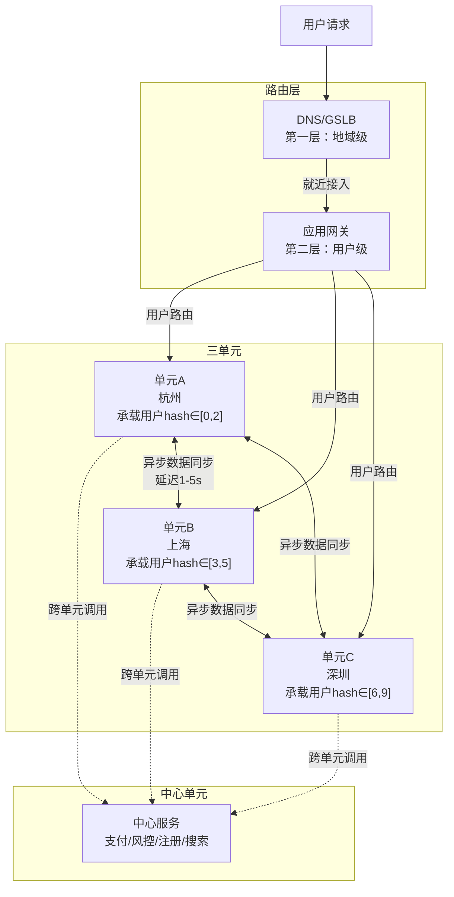
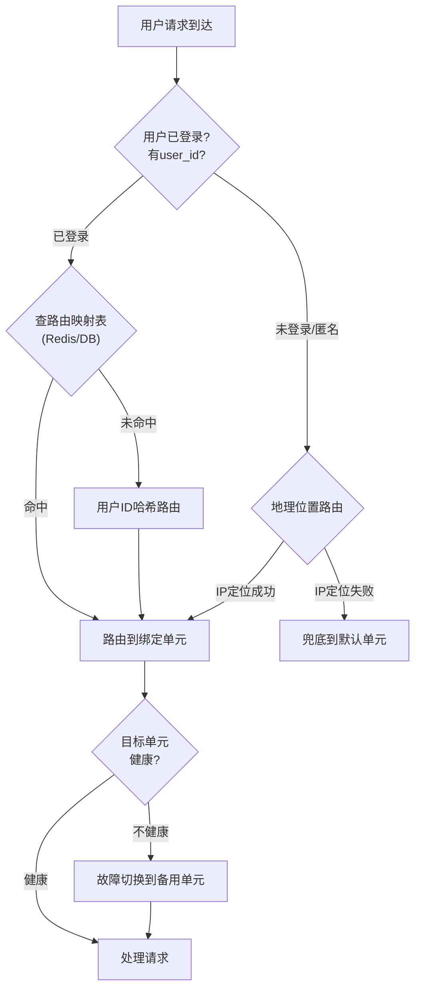
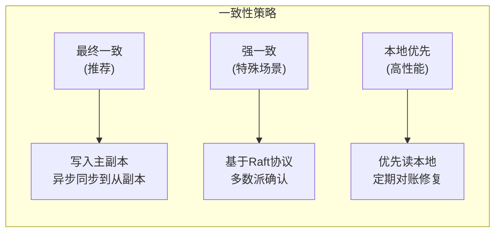
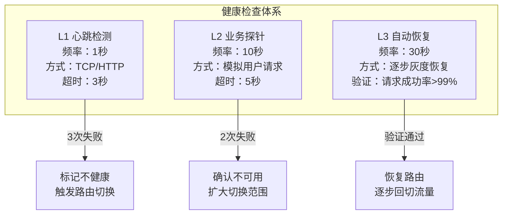

# 三单元化路由

## 1. 概述：为什么是"三单元"

三单元化路由是异地多活架构中最经典的路由模式。它将整个系统拆分为三个地理位置隔离的"单元"（Unit），通过路由层将用户请求精确分配到归属单元，实现**用户级的流量隔离和就近访问**。

这种设计的核心思想来源于一个朴素的工程直觉：**让每个用户只在一个地方处理业务，避免分布式事务的复杂性**。用户A的所有请求只走杭州单元，用户B的所有请求只走上海单元——路由层的职责就是确保这个"归属关系"始终正确。

### 1.1 为什么是"三"而不是"二"或"四"

选择三单元并非随意，而是工程实践中权衡多个约束后的最优解：

| 约束维度 | 二单元 | 三单元 | 四单元 |
|---------|--------|--------|--------|
| 故障容错 | 一个挂了，另一个承载100%流量，容量压力大 | 一个挂了，另外两个各承担50%，容量余量充足 | 故障切换更平稳，但运维复杂度急剧上升 |
| 数据同步链路 | 1条（A↔B） | 3条（A↔B, B↔C, A↔C） | 6条，同步管理困难 |
| 跨城网络拓扑 | 两点一线，简单 | 三角形拓扑，天然冗余 | 四边形+对角线，链路复杂 |
| 成本 | 较低 | 中等 | 偏高 |
| 典型架构 | 同城双活 | 异地多活（国内主流） | 全球多活（Google Spanner） |

**核心结论**：三单元在故障容错能力、同步链路复杂度和运维成本之间取得了最佳平衡。

从数学角度看，三单元在任意两个城市之间都存在直连链路，形成了天然的三角冗余。当任意一条链路中断时，流量可以通过第三条链路绕行——这种"任意两点可达"的特性是二单元无法提供的。而四单元虽然容错能力更强，但数据同步链路数从3条激增到6条（C(4,2)=6），运维复杂度呈指数增长。

业界标杆验证了这一选择的合理性：
- **阿里巴巴"三地五中心"**：杭州、上海、深圳三地，其中杭州有两个数据中心，形成3+2的容灾布局
- **饿了么异地多活**：以三单元为基础骨架，承载日均千万级订单
- **美团外卖多活**：三地部署，按用户维度切分流量，保障单单元故障时服务不中断
- **蚂蚁金服"两地三中心"**：杭州+上海两个城市各部署单元，辅以灾备中心

### 1.2 三单元路由的全景架构



路由层分为两层协同工作：

- **第一层（DNS/GSLB）**：将用户引导到最近的机房接入点，粒度是"地域+运营商"。例如北京联通用户被解析到北京CDN节点，再回源到上海单元
- **第二层（应用网关）**：根据用户ID、业务属性等精确路由到归属单元，粒度是"用户级"

两层缺一不可——DNS解决"从哪里进来"，应用网关解决"到哪个单元处理"。没有DNS层，所有用户都涌向同一个接入点，网关成为瓶颈；没有应用网关层，DNS只能做到地域级粗粒度路由，无法保证用户数据局部性。

### 1.3 中心单元的设计原则

三单元中每个单元承载独立的用户流量，但并非所有业务都能切分。以下业务天然具备全局属性，需要独立的中心单元：

| 业务类型 | 为什么不能切分 | 典型服务 |
|---------|--------------|---------|
| 支付清算 | 资金流水必须全局一致 | 支付核心、对账、退款 |
| 风控决策 | 需要全局行为数据才能识别异常 | 风控引擎、反欺诈 |
| 用户注册/登录 | 新用户注册时归属单元尚未确定 | 注册服务、账号中心 |
| 全局搜索 | 搜索索引需要全量数据 | ES集群、搜索推荐 |
| 系统公告/通知 | 需要触达所有用户 | 消息中心、推送服务 |

中心单元的设计遵循**无状态化**原则——中心单元本身不存储用户状态数据，只提供全局服务接口。这样即使中心单元故障，单元内的用户仍可使用本地服务，只是涉及全局操作时降级返回。

---

## 2. 路由规则设计

路由规则决定了每个用户请求被分配到哪个单元。规则设计的核心目标是：**均匀分配、低延迟访问、最小化跨单元调用**。

### 2.1 用户ID哈希路由（最主流）

**原理**：对用户ID做哈希取模，将用户均匀分配到三个单元。同一用户的所有请求始终路由到同一单元，保证数据局部性。

```python
import hashlib
from typing import Dict, List

class ThreeUnitRouter:
    """
    三单元哈希路由器
    职责：根据用户ID计算归属单元，处理故障切换
    """
    
    # 三个单元的定义（按地理位置）
    UNITS = [
        {"name": "hangzhou-01", "region": "hangzhou", "endpoint": "hz.internal.com:8080"},
        {"name": "shanghai-01", "region": "shanghai", "endpoint": "sh.internal.com:8080"},
        {"name": "shenzhen-01", "region": "shenzhen", "endpoint": "sz.internal.com:8080"},
    ]
    
    # 健康状态表（生产环境中由心跳检测模块实时更新）
    health_status: Dict[str, bool] = {
        "hangzhou-01": True,
        "shanghai-01": True,
        "shenzhen-01": True,
    }
    
    def __init__(self, virtual_unit_count: int = 10):
        """
        Args:
            virtual_unit_count: 虚拟单元数，用于一致性哈希。
                                设为10的倍数方便扩缩容时数据迁移量可控。
        """
        self.virtual_unit_count = virtual_unit_count
        # 构建虚拟单元→物理单元的映射
        self._build_vnode_map()
    
    def _build_vnode_map(self):
        """构建虚拟节点映射表"""
        self.vnode_map = {}
        units = self.UNITS
        for i in range(self.virtual_unit_count):
            # 每个物理单元承担 virtual_unit_count/3 个虚拟节点
            physical_idx = i % len(units)
            self.vnode_map[i] = units[physical_idx]
    
    def _hash(self, user_id: str) -> int:
        """计算用户ID的哈希值"""
        digest = hashlib.md5(user_id.encode()).hexdigest()
        return int(digest, 16)
    
    def route(self, user_id: str) -> Dict:
        """
        核心路由方法：将用户ID映射到目标单元
        
        路由逻辑：
        1. 计算user_id的哈希值
        2. 哈希值 % 虚拟单元数 → 得到虚拟节点编号
        3. 虚拟节点编号 → 映射到物理单元
        4. 检查物理单元健康状态，不健康则故障切换
        """
        hash_val = self._hash(user_id)
        vnode_id = hash_val % self.virtual_unit_count
        target_unit = self.vnode_map[vnode_id]
        
        # 检查目标单元健康状态
        if self.health_status.get(target_unit["name"], False):
            return target_unit
        
        # 故障切换：选择最近的健康单元
        return self._failover(user_id, exclude=target_unit["name"])
    
    def _failover(self, user_id: str, exclude: str) -> Dict:
        """
        故障切换策略：
        1. 优先选择距离原单元最近的健康单元
        2. 如果所有单元都挂了，抛出系统级熔断异常
        """
        candidates = [
            u for u in self.UNITS
            if u["name"] != exclude and self.health_status.get(u["name"], False)
        ]
        
        if not candidates:
            raise RuntimeError(
                f"所有单元均不可用，系统熔断。用户={user_id}。"
                "请立即检查网络和各单元状态。"
            )
        
        # 选择负载最低的候选单元（简化实现，生产中应读取实时负载指标）
        return candidates[0]
    
    def mark_unhealthy(self, unit_name: str):
        """标记单元为不健康，触发路由重计算"""
        self.health_status[unit_name] = False
        print(f"[ALERT] 单元 {unit_name} 标记为不健康，受影响流量将自动切换")
    
    def mark_healthy(self, unit_name: str):
        """恢复单元健康状态"""
        self.health_status[unit_name] = True
        print(f"[INFO] 单元 {unit_name} 恢复健康")


# ---- 使用示例 ----
router = ThreeUnitRouter(virtual_unit_count=10)

# 模拟1000个用户的路由分布
from collections import Counter
dist = Counter()
for i in range(1000):
    uid = f"user_{i:06d}"
    unit = router.route(uid)
    dist[unit["name"]] += 1

print("路由分布统计:")
for name, count in sorted(dist.items()):
    print(f"  {name}: {count} 用户 ({count/10:.1f}%)")
```

**哈希路由的关键设计要点**：

1. **虚拟节点**：直接 `user_id % 3` 在用户ID分布不均时会导致热点。使用虚拟节点（如10个或100个）可以平滑分布差异。虚拟节点数量的选择经验公式：`物理节点数 × 100~200` 可以达到较好的均匀度
2. **一致性哈希**：扩缩容时只影响部分用户的路由，而非全量重新分配。例如从3单元扩到4单元时，只有约1/4的用户需要迁移。相比取模哈希（100%重分配），一致性哈希将迁移量控制在可管理范围内
3. **哈希函数选择**：MD5足够（路由场景不需要密码学安全性），FNV-1a速度更快适合高频路由计算（比MD5快3-5倍）。在网关层每秒处理数十万请求时，哈希函数的性能差异直接影响整体吞吐

### 2.2 地理位置路由

**原理**：通过客户端IP解析用户地理位置，将请求路由到最近的单元。

```python
import ipaddress
from typing import Optional

class GeoRouter:
    """
    基于地理位置的三单元路由器
    适用场景：外卖、出行、本地生活等LBS业务
    """
    
    # 各单元覆盖的IP段（生产中应使用MaxMind GeoLite2或类似数据库）
    GEO_IP_RANGES = {
        "hangzhou-01": {
            "ranges": [
                ("10.10.0.0", "10.10.255.255"),    # 浙江省IP段
                ("10.11.0.0", "10.11.127.255"),     # 江苏南部IP段
            ],
            "provinces": ["浙江", "江苏南部", "上海"],   # 兜底：省市级匹配
        },
        "shanghai-01": {
            "ranges": [
                ("10.20.0.0", "10.20.255.255"),    # 上海市IP段
                ("10.21.0.0", "10.21.127.255"),     # 安徽东部IP段
            ],
            "provinces": ["上海", "安徽东部"],
        },
        "shenzhen-01": {
            "ranges": [
                ("10.30.0.0", "10.30.255.255"),    # 广东省IP段
                ("10.31.0.0", "10.31.127.255"),     # 福建省IP段
            ],
            "provinces": ["广东", "福建", "海南"],
        },
    }
    
    # 兜底单元：无法解析地理位置时使用
    DEFAULT_UNIT = "hangzhou-01"
    
    def route(self, client_ip: str, user_id: Optional[str] = None) -> str:
        """
        根据客户端IP路由到最近单元
        如果IP解析失败且提供了user_id，回退到哈希路由
        """
        # 尝试IP地理定位
        unit = self._match_ip(client_ip)
        if unit:
            return unit
        
        # IP匹配失败，尝试回退策略
        if user_id:
            return self._hash_fallback(user_id)
        
        return self.DEFAULT_UNIT
    
    def _match_ip(self, ip_str: str) -> Optional[str]:
        """在IP段表中匹配"""
        try:
            ip_num = int(ipaddress.ip_address(ip_str))
        except ValueError:
            return None
        
        for unit_name, config in self.GEO_IP_RANGES.items():
            for start, end in config["ranges"]:
                start_num = int(ipaddress.ip_address(start))
                end_num = int(ipaddress.ip_address(end))
                if start_num <= ip_num <= end_num:
                    return unit_name
        return None
    
    def _hash_fallback(self, user_id: str) -> str:
        """哈希兜底：IP定位失败时按用户ID分配"""
        import hashlib
        h = int(hashlib.md5(user_id.encode()).hexdigest(), 16)
        idx = h % 3
        return list(self.GEO_IP_RANGES.keys())[idx]
```

**地理路由的已知坑点**：

| 问题 | 表现 | 应对方案 |
|------|------|---------|
| CDN/代理干扰 | 用户请求经过CDN节点后，源IP变为CDN节点地址，定位到错误的机房 | 使用 `X-Forwarded-For` 或 `CF-Connecting-IP` 取真实IP |
| VPN/企业出口 | 企业用户通过总部出口上网，全部被路由到同一单元 | 结合用户ID哈希兜底 |
| IP库时效性 | 新分配的IP段未及时更新到GeoIP数据库 | 定期更新IP库（建议月度），配置兜底单元 |
| 用户出差/旅行 | 用户从杭州出差到深圳，IP定位到深圳单元但数据在杭州单元 | 核心数据以用户归属单元为准，地理位置仅做接入层优化 |
| IPv6普及 | 部分运营商IPv6地址定位精度差 | IPv4优先，IPv6回退到哈希路由 |
| 双栈用户 | 同一用户IPv4和IPv6来源不同，导致路由抖动 | 以用户ID为准，IP仅作为首次接入的参考 |

### 2.3 混合路由（生产推荐）

生产环境中几乎不会单独使用某一种路由规则，而是采用**分层混合路由**策略：



**混合路由的核心规则优先级**：

1. 精确路由表（Redis/DB中存储的 user_id → unit_name 映射）  → 最高优先级
2. 用户ID哈希路由（新用户首次访问时计算并写入精确路由表）    → 次优先级
3. 地理位置路由（未登录用户/匿名访问）                       → 兜底
4. 默认单元路由（所有规则都不匹配时）                        → 最终兜底

这种分层设计的关键优势在于：**精确路由表保证了路由的确定性**。一旦用户被分配到某个单元，无论后续路由规则如何变化，该用户始终路由到同一单元。哈希路由只在新用户首次访问时触发，计算结果立即写入精确路由表，后续请求直接查表即可。

---

## 3. 路由表管理

路由表是三单元路由的"神经中枢"，记录了用户与单元的绑定关系。路由表的设计直接决定了路由的性能、一致性和可维护性。

### 3.1 路由表存储方案

| 方案 | 读性能 | 写性能 | 一致性 | 容灾 | 适用场景 |
|------|--------|--------|--------|------|---------|
| Redis Cluster | <1ms | <1ms | 最终一致 | Redis集群自身高可用 | 主流方案，适合绝大多数场景 |
| MySQL + 本地缓存 | 1-5ms（缓存命中）/ 5-20ms（未命中） | 5-20ms | 强一致 | MySQL主从 + 缓存降级 | 对一致性要求极高的场景 |
| 配置中心（Nacos/Apollo） | <1ms | 100-500ms | 最终一致 | 配置中心集群 | 路由规则变更不频繁的场景 |
| 应用内存 + 定期同步 | <0.1ms | N/A（只读） | 延迟同步 | 多副本冗余 | 超高性能要求，路由表变化少 |

**生产推荐方案：Redis Cluster + 本地缓存（L1 Cache）**

```python
import time
import json
from typing import Optional, Dict

class RoutingTableManager:
    """
    三单元路由表管理器
    存储方案：Redis Cluster（持久层） + 本地内存缓存（L1层）
    
    读路径：L1缓存 → Redis → 默认路由（哈希计算）
    写路径：Redis → 异步刷新L1缓存
    """
    
    LOCAL_CACHE_TTL = 300       # 本地缓存过期时间：5分钟
    LOCAL_CACHE_MAX_SIZE = 100000  # 本地缓存最大条目数
    
    def __init__(self, redis_client, unit_router):
        self.redis = redis_client
        self.router = unit_router  # ThreeUnitRouter实例
        
        # L1本地缓存：user_id → unit_name
        self._local_cache: Dict[str, tuple] = {}  # key → (unit_name, expire_ts)
        self._local_cache_hits = 0
        self._local_cache_misses = 0
    
    def lookup(self, user_id: str) -> str:
        """
        查找用户归属单元
        
        三级查找策略：
        1. L1本地缓存（最快，但可能过期）
        2. Redis路由表（权威数据源）
        3. 哈希计算兜底（新用户）
        """
        # 第一级：L1本地缓存
        cached = self._local_cache.get(user_id)
        if cached:
            unit_name, expire_ts = cached
            if time.time() < expire_ts:
                self._local_cache_hits += 1
                return unit_name
            else:
                del self._local_cache[user_id]  # 过期清除
        
        self._local_cache_misses += 1
        
        # 第二级：Redis路由表
        redis_key = f"unit:route:{user_id}"
        unit_name = self.redis.get(redis_key)
        if unit_name:
            self._refresh_local_cache(user_id, unit_name)
            return unit_name
        
        # 第三级：哈希计算（新用户首次访问）
        unit_info = self.router.route(user_id)
        unit_name = unit_info["name"]
        
        # 写入Redis（异步，不阻塞当前请求）
        self.redis.setex(redis_key, 86400 * 30, unit_name)  # 30天过期
        self._refresh_local_cache(user_id, unit_name)
        
        return unit_name
    
    def _refresh_local_cache(self, user_id: str, unit_name: str):
        """刷新本地缓存"""
        # 简单LRU：超过最大容量时清空一半
        if len(self._local_cache) >= self.LOCAL_CACHE_MAX_SIZE:
            # 按过期时间排序，删除最早的50%
            sorted_keys = sorted(
                self._local_cache.keys(),
                key=lambda k: self._local_cache[k][1]
            )
            for k in sorted_keys[:self.LOCAL_CACHE_MAX_SIZE // 2]:
                del self._local_cache[k]
        
        self._local_cache[user_id] = (
            unit_name,
            time.time() + self.LOCAL_CACHE_TTL
        )
    
    def migrate_user(self, user_id: str, target_unit: str):
        """
        用户迁移：将用户从当前单元迁移到目标单元
        场景：扩缩容、热点用户迁移、单元降级
        
        关键：迁移必须是原子操作，确保路由和数据同时切换
        """
        old_unit = self.lookup(user_id)
        
        if old_unit == target_unit:
            return  # 已在目标单元
        
        # Step 1: 冻结用户写入（短暂锁）
        lock_key = f"unit:lock:{user_id}"
        self.redis.setex(lock_key, 30, "migrating")  # 30秒超时
        
        try:
            # Step 2: 双写阶段 —— 同时向新旧单元写入数据
            # （具体数据迁移逻辑由数据同步模块处理）
            
            # Step 3: 更新路由表（原子操作）
            redis_key = f"unit:route:{user_id}"
            pipe = self.redis.pipeline()
            pipe.set(redis_key, target_unit)
            pipe.expire(redis_key, 86400 * 30)
            pipe.execute()
            
            # Step 4: 刷新本地缓存
            self._refresh_local_cache(user_id, target_unit)
            
            print(f"[MIGRATE] 用户 {user_id}: {old_unit} → {target_unit}")
            
        finally:
            self.redis.delete(lock_key)
    
    def get_cache_stats(self) -> Dict:
        """缓存命中率统计"""
        total = self._local_cache_hits + self._local_cache_misses
        hit_rate = self._local_cache_hits / total if total > 0 else 0
        return {
            "local_cache_size": len(self._local_cache),
            "local_cache_hits": self._local_cache_hits,
            "local_cache_misses": self._local_cache_misses,
            "hit_rate": f"{hit_rate:.2%}",
        }
```

### 3.2 路由表的一致性保障

三单元场景下，路由表一致性面临特殊挑战：三个单元各自维护一份路由表副本，更新操作可能在副本间产生不一致。



**生产环境的一致性保障措施**：

1. **写入路由**：所有路由表写操作统一打到同一个"路由主节点"（通常部署在杭州单元），避免多点写入冲突
2. **同步机制**：路由变更通过Redis Pub/Sub或消息队列广播到三个单元的本地缓存
3. **对账修复**：每5分钟执行一次三单元路由表对账，发现不一致时以路由主节点为准
4. **降级策略**：路由表同步延迟超过阈值时，自动降级为哈希路由（无状态计算，不依赖路由表）

```python
class RoutingTableReconciler:
    """
    路由表对账修复器
    每5分钟运行一次，修复三单元间的路由不一致
    """
    
    def __init__(self, redis_clients: Dict[str, any]):
        """
        Args:
            redis_clients: 三个单元的Redis客户端
                           {"hangzhou-01": client_hz, "shanghai-01": client_sh, ...}
        """
        self.clients = redis_clients
        self.primary_unit = "hangzhou-01"  # 路由主节点
    
    def reconcile(self):
        """执行对账修复"""
        # 获取主节点的完整路由表
        primary_routes = self._dump_routes(self.clients[self.primary_unit])
        
        inconsistencies = []
        
        # 逐个从节点对账
        for unit_name, client in self.clients.items():
            if unit_name == self.primary_unit:
                continue
            
            slave_routes = self._dump_routes(client)
            
            # 比较差异
            for user_id, primary_unit in primary_routes.items():
                slave_unit = slave_routes.get(user_id)
                if slave_unit and slave_unit != primary_unit:
                    inconsistencies.append({
                        "user_id": user_id,
                        "expected": primary_unit,
                        "actual": slave_unit,
                        "unit": unit_name,
                    })
        
        if inconsistencies:
            print(f"[RECONCILE] 发现 {len(inconsistencies)} 条不一致路由")
            self._fix_inconsistencies(inconsistencies)
        else:
            print("[RECONCILE] 路由表一致，无需修复")
    
    def _dump_routes(self, redis_client) -> Dict[str, str]:
        """导出Redis中的路由表"""
        routes = {}
        cursor = 0
        while True:
            cursor, keys = redis_client.scan(cursor, match="unit:route:*", count=1000)
            for key in keys:
                user_id = key.decode().replace("unit:route:", "")
                unit_name = redis_client.get(key).decode()
                routes[user_id] = unit_name
            if cursor == 0:
                break
        return routes
    
    def _fix_inconsistencies(self, issues: list):
        """修复不一致：以主节点数据为准"""
        primary_client = self.clients[self.primary_unit]
        
        for issue in issues:
            # 从主节点读取权威值
            correct_unit = primary_client.get(f"unit:route:{issue['user_id']}").decode()
            
            # 更新到不一致的节点
            target_client = self.clients[issue["unit"]]
            target_client.set(f"unit:route:{issue['user_id']}", correct_unit)
            
            print(f"  修复: {issue['user_id']} @ {issue['unit']}: "
                  f"{issue['actual']} → {correct_unit}")
```

---

## 4. 健康检查与故障切换

三单元路由的高可用能力取决于健康检查的灵敏度和故障切换的速度。

### 4.1 多层健康检查体系



| 检查层级 | 检查内容 | 检查频率 | 故障判定 | 恢复策略 |
|---------|---------|---------|---------|---------|
| L1 心跳检测 | TCP端口存活 | 1秒 | 连续3次失败 | 自动恢复 |
| L2 业务探针 | 模拟下单/查询 | 10秒 | 连续2次失败 | 灰度恢复 |
| L3 数据完整性 | 主从同步延迟 | 60秒 | 延迟>10秒 | 延迟恢复后回切 |

三层检查形成**漏斗式过滤**：L1快速发现网络层故障（秒级），L2验证业务可用性（十秒级），L3确认数据完整性（分钟级）。只有三层都通过才认为单元完全健康，任一层失败都会触发相应级别的处理。

### 4.2 故障切换策略

```python
import time
from enum import Enum
from typing import Callable

class UnitState(Enum):
    HEALTHY = "healthy"
    DEGRADED = "degraded"
    UNHEALTHY = "unhealthy"
    RECOVERING = "recovering"

class FailoverManager:
    """
    三单元故障切换管理器
    
    切换策略：
    1. 检测到单元故障 → 立即切换该单元的流量
    2. 故障切换遵循"就近原则"：优先切换到地理距离最近的健康单元
    3. 切换后监控目标单元负载，防止雪崩
    4. 故障恢复后逐步回切，避免流量突变
    """
    
    # 三单元的故障切换优先级矩阵
    # 含义：当某行的单元故障时，优先切换到哪列的单元
    FAILOVER_MATRIX = {
        "hangzhou-01": ["shanghai-01", "shenzhen-01"],   # 杭州挂→优先上海
        "shanghai-01": ["hangzhou-01", "shenzhen-01"],   # 上海挂→优先杭州
        "shenzhen-01": ["shanghai-01", "hangzhou-01"],   # 深圳挂→优先上海
    }
    
    # 单元容量余量：每个单元最多承担自身容量 + 余量
    CAPACITY_BUFFER = 0.3  # 30%容量余量
    
    def __init__(self, unit_capacity: Dict[str, int]):
        """
        Args:
            unit_capacity: 各单元的容量上限（QPS）
                           {"hangzhou-01": 50000, "shanghai-01": 50000, ...}
        """
        self.unit_capacity = unit_capacity
        self.unit_current_load: Dict[str, int] = {name: 0 for name in unit_capacity}
        self.unit_state: Dict[str, UnitState] = {
            name: UnitState.HEALTHY for name in unit_capacity
        }
        self._failover_count: Dict[str, int] = {name: 0 for name in unit_capacity}
    
    def on_unit_failure(self, failed_unit: str, affected_users: list) -> dict:
        """
        处理单元故障：将故障单元的用户切换到备用单元
        
        Returns:
            切换结果报告
        """
        self.unit_state[failed_unit] = UnitState.UNHEALTHY
        self._failover_count[failed_unit] += 1
        
        candidates = self.FAILOVER_MATRIX.get(failed_unit, [])
        
        report = {
            "failed_unit": failed_unit,
            "affected_users": len(affected_users),
            "migrations": [],
            "warnings": [],
        }
        
        # 计算每个备用单元能承接的用户数
        for candidate in candidates:
            if self.unit_state[candidate] != UnitState.HEALTHY:
                report["warnings"].append(f"{candidate} 状态非健康，跳过")
                continue
            
            # 计算容量余量
            remaining = (
                self.unit_capacity[candidate] * (1 + self.CAPACITY_BUFFER)
                - self.unit_current_load[candidate]
            )
            
            # 估算能承接的用户数（假设每个用户平均1 QPS）
            max_users = int(remaining)
            
            if max_users <= 0:
                report["warnings"].append(
                    f"{candidate} 容量不足，当前负载={self.unit_current_load[candidate]}, "
                    f"容量上限={self.unit_capacity[candidate]}"
                )
                continue
            
            # 分配用户
            users_to_migrate = affected_users[:max_users]
            affected_users = affected_users[max_users:]
            
            self.unit_current_load[candidate] += len(users_to_migrate)
            
            report["migrations"].append({
                "target_unit": candidate,
                "user_count": len(users_to_migrate),
                "remaining_capacity": max_users - len(users_to_migrate),
            })
            
            if not affected_users:
                break
        
        # 如果还有未分配的用户
        if affected_users:
            report["warnings"].append(
                f"仍有 {len(affected_users)} 个用户无法分配到备用单元"
            )
        
        return report
    
    def on_unit_recovery(self, recovered_unit: str):
        """
        处理单元恢复：逐步回切流量
        
        关键：不能一次性把流量全部切回，需要灰度恢复：
        1. 先恢复10%的流量，观察10分钟
        2. 成功后恢复30%的流量，再观察10分钟
        3. 最后恢复100%的流量
        """
        self.unit_state[recovered_unit] = UnitState.RECOVERING
        
        recovery_steps = [0.10, 0.30, 1.0]  # 灰度恢复比例
        recovery_intervals = [600, 600, 0]   # 每步观察间隔（秒）
        
        print(f"[RECOVERY] 单元 {recovered_unit} 开始灰度恢复")
        print(f"[RECOVERY] 计划步骤: {recovery_steps}")
        
        # 实际执行需要异步调度，此处为伪代码
        for step_pct, interval in zip(recovery_steps, recovery_intervals):
            print(f"[RECOVERY] 恢复 {step_pct*100:.0f}% 流量到 {recovered_unit}")
            # 这里应实现实际的流量回切逻辑
            # 1. 更新路由表，将部分用户切回恢复的单元
            # 2. 监控10分钟内的请求成功率、错误率、延迟
            # 3. 指标达标则进入下一步，不达标则回滚
        
        self.unit_state[recovered_unit] = UnitState.HEALTHY
        print(f"[RECOVERY] 单元 {recovered_unit} 完全恢复")
    
    def get_status_report(self) -> str:
        """生成当前系统状态报告"""
        lines = ["=== 三单元状态报告 ==="]
        for name, state in self.unit_state.items():
            load = self.unit_current_load[name]
            capacity = self.unit_capacity[name]
            usage_pct = load / capacity * 100 if capacity > 0 else 0
            failover_count = self._failover_count[name]
            lines.append(
                f"  {name}: {state.value} | "
                f"负载: {load}/{capacity} ({usage_pct:.1f}%) | "
                f"累计切换: {failover_count}次"
            )
        return "\n".join(lines)
```

### 4.3 切换过程中的流量处理

故障切换不是简单的"停这边、启那边"，需要处理切换过程中的边缘情况：

| 边缘场景 | 风险 | 处理方案 |
|---------|------|---------|
| 切换中的进行中请求 | 用户正在下单时被切换，订单数据不一致 | 切换前等待当前请求处理完成（drain period），超时强制中断并返回"请重试" |
| DNS缓存未过期 | 部分用户仍解析到故障机房 | TTL提前降低 + HTTPDNS强制推送新地址 |
| Cookie/Session不一致 | 用户Session在故障单元，新单元无法识别 | 全局Session存储（Redis Cluster）+ 降级为免登模式 |
| 双写冲突 | 切换瞬间两个单元同时处理同一用户请求 | 分布式锁（Redis SETNX）保证同一用户同一时刻只在一个单元处理 |

```python
class DrainController:
    """
    切换前的流量排空控制器
    
    工作流程：
    1. 标记单元为"排空中"
    2. 拒绝新请求路由到该单元
    3. 等待存量请求处理完成
    4. 超时后强制中断剩余请求
    """
    
    DRAIN_TIMEOUT = 30  # 排空超时：30秒
    
    def drain(self, unit_name: str, routing_table, active_requests: dict):
        """
        排空指定单元的流量
        """
        print(f"[DRAIN] 开始排空单元 {unit_name}")
        
        # Step 1: 停止新流量进入
        routing_table.mark_unhealthy(unit_name)
        
        # Step 2: 等待存量请求完成
        unit_requests = {
            req_id: req for req_id, req in active_requests.items()
            if req.get("unit") == unit_name
        }
        
        if not unit_requests:
            print(f"[DRAIN] 单元 {unit_name} 无存量请求，排空完成")
            return
        
        print(f"[DRAIN] 等待 {len(unit_requests)} 个存量请求完成...")
        
        # Step 3: 等待超时
        start = time.time()
        while time.time() - start < self.DRAIN_TIMEOUT:
            remaining = {
                req_id: req for req_id, req in unit_requests.items()
                if not req.get("completed", False)
            }
            if not remaining:
                print(f"[DRAIN] 所有请求已完成，排空成功")
                return
            time.sleep(1)
        
        # Step 4: 超时，强制中断
        forced = {
            req_id: req for req_id, req in unit_requests.items()
            if not req.get("completed", False)
        }
        print(f"[DRAIN] 超时，强制中断 {len(forced)} 个请求")
        for req_id in forced:
            # 返回友好错误信息，引导用户重试
            forced[req_id]["response"] = {
                "status": 503,
                "message": "服务正在切换，请稍后重试"
            }
```

---

## 5. 跨单元路由

三单元架构中，并非所有请求都能在单元内闭环处理。当请求涉及其他单元的数据时，需要跨单元路由。

### 5.1 跨单元请求分类

| 请求类型 | 示例 | 一致性要求 | 路由策略 |
|---------|------|-----------|---------|
| 读-跨单元 | 查看朋友的订单 | 最终一致 | 读副本数据（接受秒级延迟） |
| 写-跨单元 | 给朋友转账 | 强一致 | 路由到数据归属单元执行 |
| 读-全局 | 查看商品列表、搜索 | 最终一致 | 读中心单元副本 |
| 写-全局 | 发布商品、系统公告 | 强一致 | 路由到中心单元执行 |

### 5.2 跨单元路由实现

```python
class CrossUnitRouter:
    """
    跨单元请求路由器
    
    当请求涉及的数据不在本地单元时，需要决定：
    1. 是路由到目标单元执行？
    2. 还是在本地单元暂存，异步同步？
    """
    
    def __init__(self, routing_table: RoutingTableManager):
        self.routing_table = routing_table
    
    def route_cross_unit_request(
        self,
        user_id: str,
        target_user_id: str,
        operation: str,
        data: dict,
        local_unit: str
    ) -> dict:
        """
        跨单元请求路由
        
        Args:
            user_id: 发起请求的用户
            target_user_id: 目标数据归属的用户
            operation: 操作类型（read/write）
            data: 请求数据
            local_unit: 本地单元名称
        """
        # 确定目标数据的归属单元
        target_unit = self.routing_table.lookup(target_user_id)
        
        if target_unit == local_unit:
            # 目标数据在本地单元，直接处理
            return {"route": "local", "unit": local_unit}
        
        # 目标数据在其他单元
        if operation == "write":
            return self._route_write(user_id, target_user_id, target_unit, data)
        else:
            return self._route_read(target_unit, data)
    
    def _route_write(self, user_id, target_user_id, target_unit, data) -> dict:
        """
        写跨单元：路由到目标单元执行
        
        关键考虑：
        1. 目标单元故障时怎么办？→ 写入本地消息队列，异步重试
        2. 写入超时怎么办？→ 返回"操作已提交，稍后可查看结果"
        3. 并发冲突怎么办？→ 利用数据归属权保证：同一数据只在归属单元写入
        """
        return {
            "route": "remote_write",
            "target_unit": target_unit,
            "payload": {
                "from_user": user_id,
                "to_user": target_user_id,
                "data": data,
                "timestamp": time.time(),
                "idempotency_key": f"{user_id}:{target_user_id}:{time.time()}"
            },
            # 超时降级：如果远程写入失败，将操作写入本地消息队列
            "fallback": "local_mq",
            "timeout_ms": 3000,
        }
    
    def _route_read(self, target_unit, data) -> dict:
        """
        读跨单元：优先读本地副本，读不到再读目标单元
        
        读本地副本的延迟 < 1ms（内存），读远程单元的延迟 = 跨城网络延迟（10-100ms）
        因此大多数读操作可以接受本地副本的秒级延迟
        """
        return {
            "route": "remote_read",
            "target_unit": target_unit,
            "prefer_local_replica": True,     # 优先读本地副本
            "replica_staleness_max": 5,        # 副本最大延迟：5秒
            "timeout_ms": 5000,                # 超时：5秒
        }
```

### 5.3 跨单元路由的性能优化

跨单元调用的最大瓶颈是**网络延迟**。以三城市（杭州↔上海 10ms，杭州↔深圳 30ms，上海↔深圳 25ms）为例：

| 优化手段 | 原理 | 延迟收益 |
|---------|------|---------|
| 读副本优先 | 数据同步到本地副本，读操作不跨城 | 10-30ms → <1ms |
| 请求合并 | 将多个跨单元读请求合并为一次批量查询 | 减少网络往返次数 |
| 异步写入 | 跨单元写入通过消息队列异步完成 | 写操作延迟从30ms降到<1ms |
| 预取缓存 | 预测可能访问的跨单元数据，提前同步到本地 | 消除首次访问延迟 |
| 并行请求 | 同时向多个单元发起请求，取最快返回的结果 | 降低尾延迟 |

---

## 6. 灰度路由

灰度路由是在新版本发布、流量迁移、单元扩缩容等场景中，将流量逐步切换到新目标的技术手段。

### 6.1 灰度路由的典型场景

| 场景 | 目标 | 灰度方式 |
|------|------|---------|
| 新单元上线 | 将部分流量迁移到新单元 | 按用户ID百分比放量：1% → 10% → 50% → 100% |
| 版本发布 | 将部分用户切到新版本实例 | 按用户ID尾号灰度：尾号0 → 尾号0,1 → 全量 |
| 故障恢复 | 将流量从备用单元切回原单元 | 分阶段回切：10% → 30% → 100% |
| 热点迁移 | 将热点用户迁移到空闲单元 | 手动指定迁移用户列表 |

### 6.2 灰度路由实现

```python
import hashlib
from dataclasses import dataclass, field
from typing import Dict, List

@dataclass
class GrayRule:
    """灰度规则"""
    name: str                           # 规则名称
    source_unit: str                    # 源单元
    target_unit: str                    # 目标单元
    percentage: float                   # 灰度比例：0.0 ~ 1.0
    user_whitelist: List[str] = field(default_factory=list)   # 白名单用户
    user_blacklist: List[str] = field(default_factory=list)   # 黑名单用户
    enabled: bool = True
    
    def match(self, user_id: str, current_unit: str) -> bool:
        """判断用户是否命中灰度规则"""
        if not self.enabled:
            return False
        
        if current_unit != self.source_unit:
            return False
        
        # 白名单优先
        if self.user_whitelist and user_id in self.user_whitelist:
            return True
        
        # 黑名单排除
        if self.user_blacklist and user_id in self.user_blacklist:
            return False
        
        # 百分比灰度：通过对用户ID哈希取模实现确定性分配
        hash_val = int(hashlib.md5(user_id.encode()).hexdigest()[:8], 16)
        return (hash_val % 10000) < (self.percentage * 10000)


class GrayRouter:
    """
    灰度路由器
    
    使用场景：
    1. 新单元上线时，逐步放量
    2. 版本发布时，灰度切换
    3. 故障恢复时，渐进回切
    """
    
    def __init__(self):
        self.rules: List[GrayRule] = []
    
    def add_rule(self, rule: GrayRule):
        self.rules.append(rule)
    
    def remove_rule(self, rule_name: str):
        self.rules = [r for r in self.rules if r.name != rule_name]
    
    def route(self, user_id: str, base_unit: str) -> str:
        """
        应用灰度规则，返回最终路由结果
        
        优先级：白名单 > 黑名单 > 百分比灰度
        """
        for rule in self.rules:
            if rule.match(user_id, base_unit):
                return rule.target_unit
        return base_unit
    
    def increase_percentage(self, rule_name: str, step: float = 0.1):
        """逐步提升灰度比例"""
        for rule in self.rules:
            if rule.name == rule_name:
                old_pct = rule.percentage
                rule.percentage = min(1.0, rule.percentage + step)
                print(
                    f"[GRAY] 规则 {rule_name}: "
                    f"{old_pct*100:.0f}% → {rule.percentage*100:.0f}%"
                )
                return
        raise ValueError(f"规则 {rule_name} 不存在")


# ---- 灰度发布示例 ----
gray_router = GrayRouter()

# 场景：新单元 shenzhen-01 上线，逐步从 hangzhou-01 迁移流量
rule = GrayRule(
    name="sz-launch-2024Q1",
    source_unit="hangzhou-01",
    target_unit="shenzhen-01",
    percentage=0.05,   # 初始5%
    user_whitelist=["user_00001", "user_00002", "user_00003"],  # 内部测试用户
)
gray_router.add_rule(rule)

# 模拟灰度过程
for pct in [0.05, 0.1, 0.2, 0.5, 1.0]:
    rule.percentage = pct
    migrated = sum(
        1 for i in range(1000)
        if gray_router.route(f"user_{i:06d}", "hangzhou-01") == "shenzhen-01"
    )
    print(f"灰度 {pct*100:.0f}%: {migrated}/1000 用户路由到深圳")
```

---

## 7. 监控与可观测性

三单元路由的监控需要覆盖路由准确性、延迟、故障切换效果等多个维度。

### 7.1 核心监控指标

| 指标 | 计算方式 | 告警阈值 | 含义 |
|------|---------|---------|------|
| 路由命中率 | 命中路由表的请求数 / 总请求数 | < 99% | 路由表覆盖率 |
| 路由延迟 | 路由计算耗时 | > 1ms (P99) | 路由层性能 |
| 跨单元调用占比 | 跨单元请求数 / 总请求数 | > 5% | 单元闭环率 |
| 故障切换耗时 | 从检测到故障到流量切换完成 | > 30s | 切换速度 |
| 路由表不一致数 | 三单元路由表的差异条数 | > 0 | 一致性保障 |
| 单元负载不均衡度 | (最大负载 - 最小负载) / 平均负载 | > 50% | 流量分布均匀性 |

### 7.2 监控脚本

```bash
#!/bin/bash
# three_unit_monitor.sh - 三单元路由健康监控
# 建议每30秒执行一次

set -euo pipefail

# 三个单元的接入端点
UNITS=("hz.internal.com:8080" "sh.internal.com:8080" "sz.internal.com:8080")
UNIT_NAMES=("hangzhou" "shanghai" "shenzhen")
ALERT_WEBHOOK="https://alert.example.com/webhook"

# 颜色输出
RED='\033[0;31m'
GREEN='\033[0;32m'
YELLOW='\033[1;33m'
NC='\033[0m'

echo "========================================="
echo " 三单元路由健康检查 - $(date '+%Y-%m-%d %H:%M:%S')"
echo "========================================="

alert_needed=false
alert_msg=""

for i in "${!UNITS[@]}"; do
    endpoint="${UNITS[$i]}"
    name="${UNIT_NAMES[$i]}"
    
    # 1. HTTP健康检查
    status=$(curl -s -o /dev/null -w "%{http_code}" \
        --connect-timeout 3 --max-time 5 \
        "http://${endpoint}/health" 2>/dev/null || echo "000")
    
    # 2. 路由一致性检查（通过 /api/route/check 接口）
    route_info=$(curl -s --connect-timeout 3 --max-time 5 \
        "http://${endpoint}/api/route/stats" 2>/dev/null || echo "{}")
    
    # 3. 同步延迟检查
    sync_delay=$(curl -s --connect-timeout 3 --max-time 5 \
        "http://${endpoint}/api/sync/delay" 2>/dev/null || echo "9999")
    
    # 输出状态
    if [ "$status" = "200" ]; then
        echo -e "${GREEN}[OK]${NC} ${name}: HTTP=${status}, 同步延迟=${sync_delay}ms"
    elif [ "$status" = "503" ]; then
        echo -e "${RED}[FAIL]${NC} ${name}: HTTP=${status} (服务降级)"
        alert_needed=true
        alert_msg="${alert_msg}${name} 服务降级(HTTP 503)\n"
    else
        echo -e "${RED}[DOWN]${NC} ${name}: HTTP=${status} (无法连接)"
        alert_needed=true
        alert_msg="${alert_msg}${name} 无法连接(HTTP ${status})\n"
    fi
    
    # 同步延迟告警
    if [ "${sync_delay:-9999}" -gt 5000 ]; then
        echo -e "${YELLOW}[WARN]${NC} ${name}: 同步延迟 ${sync_delay}ms > 5000ms"
        alert_needed=true
        alert_msg="${alert_msg}${name} 同步延迟过高: ${sync_delay}ms\n"
    fi
done

# 发送告警
if [ "$alert_needed" = true ]; then
    curl -s -X POST "$ALERT_WEBHOOK" \
        -H "Content-Type: application/json" \
        -d "{\"text\": \"[三单元路由告警]\n${alert_msg}\"}" \
        > /dev/null 2>&amp;1 || true
    echo -e "\n${RED}告警已发送${NC}"
else
    echo -e "\n${GREEN}所有单元正常${NC}"
fi
```

### 7.3 Grafana 仪表盘关键面板

生产环境建议在 Grafana 中配置以下面板：

1. **三单元流量分布**：实时显示三个单元各自承接的 QPS 比例，正常应接近 1:1:1
2. **路由延迟分布**：P50/P95/P99 路由计算延迟，P99 应 < 1ms
3. **跨单元调用趋势**：跨单元调用占比趋势图，突增可能意味着路由异常
4. **故障切换事件时间线**：标记每次故障切换的时间点和影响范围
5. **路由表大小**：三单元各自维护的路由表条目数，应基本一致
6. **单元健康状态**：三个单元的实时健康状态（绿/黄/红）

---

## 8. 常见误区与最佳实践

### 8.1 典型误区

| 误区 | 正确做法 |
|------|---------|
| 路由规则写死在代码里，不支持动态调整 | 路由规则外置到配置中心或Redis，支持运行时热更新 |
| 只做一次哈希分配，不做负载均衡 | 结合一致性哈希 + 实时负载感知，动态调整流量分配 |
| 健康检查只检查端口存活 | 必须检查业务可用性（模拟下单、查询等端到端探针） |
| 故障切换是全量切换 | 应该灰度切换，先切10%观察，再逐步扩大 |
| 忽略路由表的一致性 | 定期对账修复，路由变更通过原子操作保证一致性 |
| 所有请求都走路由表查询 | 合理使用本地缓存，减少路由表查询的网络开销 |
| 跨单元调用使用同步RPC | 优先异步消息解耦，同步RPC只在必要时使用 |
| 忽略切换过程中的边缘请求 | 切换前先排空（drain），处理完存量请求再切 |

### 8.2 最佳实践清单

路由设计：
  ✓ 使用虚拟节点 + 一致性哈希，保证流量均匀分布
  ✓ 路由规则分层：精确映射 > 哈希路由 > 地理路由 > 默认路由
  ✓ 路由表支持热更新，不重启服务即可调整路由规则
  ✓ 新用户首次访问时计算路由并持久化，后续直接查表

容错设计：
  ✓ 心跳检测（1s）+ 业务探针（10s）+ 数据完整性检查（60s）三层健康检查
  ✓ 故障切换灰度执行：10% → 30% → 100%，每步观察10分钟
  ✓ 切换前执行流量排空（drain），超时后强制中断
  ✓ 所有单元保持30%的容量余量，确保能承接故障单元的流量

性能优化：
  ✓ 路由查询使用L1本地缓存 + Redis两级缓存
  ✓ 读操作优先读本地副本，减少跨城调用
  ✓ 跨单元写入通过消息队列异步完成
  ✓ 路由计算使用FNV-1a等快速哈希算法

可观测性：
  ✓ 监控路由命中率、路由延迟、跨单元调用占比
  ✓ 三单元路由表一致性对账（每5分钟）
  ✓ 故障切换事件自动记录和告警
  ✓ 单元负载均衡度实时监控

---

## 9. 实战：Nginx + Lua 三单元路由网关

以下是一个可直接用于生产的 Nginx + Lua 三单元路由网关配置：

```nginx
# nginx.conf - 三单元路由网关核心配置

# 路由映射表（生产中应从Redis动态加载）
# 这里使用Lua的共享内存存储
lua_shared_dict unit_routing 50m;
lua_shared_dict unit_health 1m;
lua_shared_dict unit_load 1m;

# 初始化路由表
init_by_lua_block {
    -- 哈希路由映射：user_id_hash % 10 → unit
    local routing_map = {
        [0] = "hangzhou",
        [1] = "hangzhou",
        [2] = "hangzhou",
        [3] = "shanghai",
        [4] = "shanghai",
        [5] = "shanghai",
        [6] = "shenzhen",
        [7] = "shenzhen",
        [8] = "shenzhen",
        [9] = "shenzhen",  -- 4:3:3分配，深圳多一个虚拟节点
    }
    
    local shm = ngx.shared.unit_routing
    for hash_mod, unit in pairs(routing_map) do
        shm:set("vnode:" .. hash_mod, unit)
    end
    
    -- 初始化健康状态
    local health = ngx.shared.unit_health
    health:set("hangzhou", true)
    health:set("shanghai", true)
    health:set("shenzhen", true)
    
    -- 初始化单元地址
    local units = ngx.shared.unit_routing
    units:set("addr:hangzhou", "10.0.1.100:8080")
    units:set("addr:shanghai", "10.0.2.100:8080")
    units:set("addr:shenzhen", "10.0.3.100:8080")
}

upstream hangzhou_backend {
    server 10.0.1.100:8080;
    server 10.0.1.101:8080;
    keepalive 32;
}

upstream shanghai_backend {
    server 10.0.2.100:8080;
    server 10.0.2.101:8080;
    keepalive 32;
}

upstream shenzhen_backend {
    server 10.0.3.100:8080;
    server 10.0.3.101:8080;
    keepalive 32;
}

server {
    listen 80;
    server_name api.example.com;
    
    location / {
        # 使用Lua动态路由，避免nginx if-is-evil问题
        access_by_lua_block {
            -- 1. 获取用户ID
            local user_id = ngx.req.get_headers()["X-User-Id"]
            if not user_id then
                -- 未登录用户：使用IP地理路由（简化：分配到默认单元）
                user_id = "anonymous_" .. ngx.var.remote_addr
            end
            
            -- 2. 计算哈希路由
            local md5 = require("resty.md5")
            local resty_md5 = md5:new()
            resty_md5:update(user_id)
            local digest = resty_md5:final()
            local hash_val = tonumber(string.format("%02x%02x%02x%02x", 
                digest[1], digest[2], digest[3], digest[4]), 16)
            local vnode = hash_val % 10
            
            -- 3. 查询路由表
            local shm = ngx.shared.unit_routing
            local unit = shm:get("vnode:" .. vnode)
            
            if not unit then
                unit = "hangzhou"  -- 默认单元
            end
            
            -- 4. 健康检查
            local health = ngx.shared.unit_health
            local is_healthy = health:get(unit)
            
            if not is_healthy then
                -- 故障切换：选择第一个健康的单元
                local candidates = {"hangzhou", "shanghai", "shenzhen"}
                for _, candidate in ipairs(candidates) do
                    if health:get(candidate) then
                        unit = candidate
                        break
                    end
                end
            end
            
            -- 5. 动态设置上游（使用Lua的balancer或header传递）
            ngx.req.set_header("X-Routed-Unit", unit)
            ngx.var.target_unit = unit
        }
        
        # 使用Lua balancer选择upstream，避免nginx if指令的已知问题
        set $target_unit hangzhou;
        
        # 注意：nginx的if指令在某些场景下有已知问题（"if is evil"）
        # 生产环境建议使用lua-resty-upstream或init_worker_by_lua实现动态负载均衡
        # 以下为简化实现，推荐替换为Lua balancer
        access_by_lua_block {
            local unit = ngx.req.get_headers()["X-Routed-Unit"] or "hangzhou"
            local addr = ngx.shared.unit_routing:get("addr:" .. unit)
            if addr then
                ngx.var.upstream_addr = addr
            end
        }
        
        proxy_pass http://$upstream_addr;
        
        # 通用代理设置
        proxy_set_header Host $host;
        proxy_set_header X-Real-IP $remote_addr;
        proxy_set_header X-Forwarded-For $proxy_add_x_forwarded_for;
        proxy_connect_timeout 3s;
        proxy_read_timeout 30s;
    }
    
    # 健康检查接口（供监控调用）
    location /health {
        content_by_lua_block {
            local health = ngx.shared.unit_health
            ngx.say("hangzhou: " .. tostring(health:get("hangzhou")))
            ngx.say("shanghai: " .. tostring(health:get("shanghai")))
            ngx.say("shenzhen: " .. tostring(health:get("shenzhen")))
        }
    }
    
    # 路由统计接口
    location /route/stats {
        content_by_lua_block {
            local shm = ngx.shared.unit_routing
            ngx.say("Total vnode entries: " .. shm:free_space())
        }
    }
}
```

---

## 10. 本节小结

三单元化路由是异地多活架构落地的关键一环。核心要点回顾：

1. **路由规则设计**：用户ID哈希路由为主，地理位置路由为辅，精确映射表兜底，三层策略协同工作
2. **路由表管理**：Redis持久存储 + 本地缓存两级架构，定期三单元对账保证一致性
3. **故障切换**：三层健康检查（心跳+探针+数据完整性），灰度切换（10%→30%→100%），切换前流量排空
4. **跨单元调用**：读副本优先，写异步消息，同步RPC仅在必要时使用
5. **灰度路由**：通过百分比灰度实现平滑的流量迁移和版本发布

掌握这些技巧，就能在实际项目中设计和运维一套可靠的三单元路由系统，在保障高可用的同时控制好复杂度和成本。
