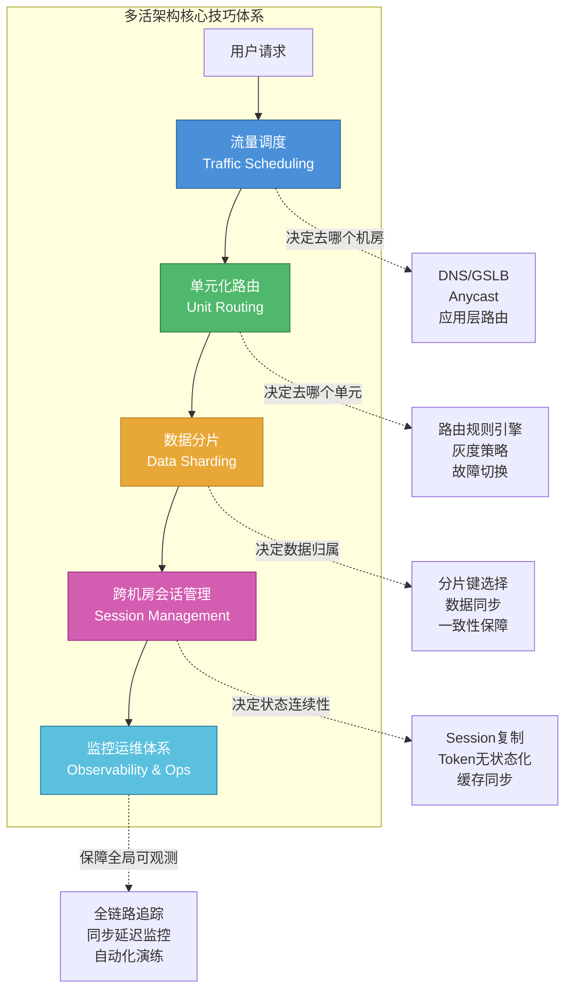
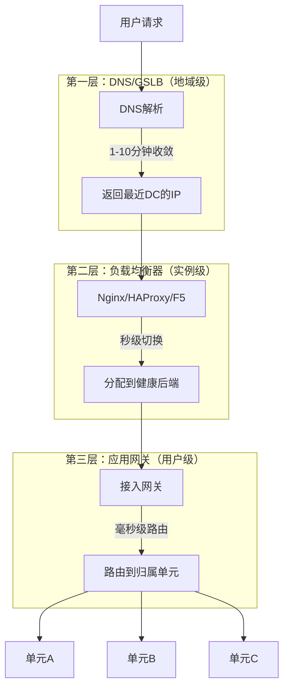
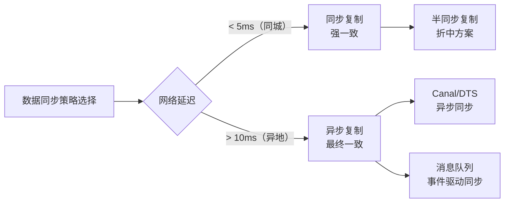
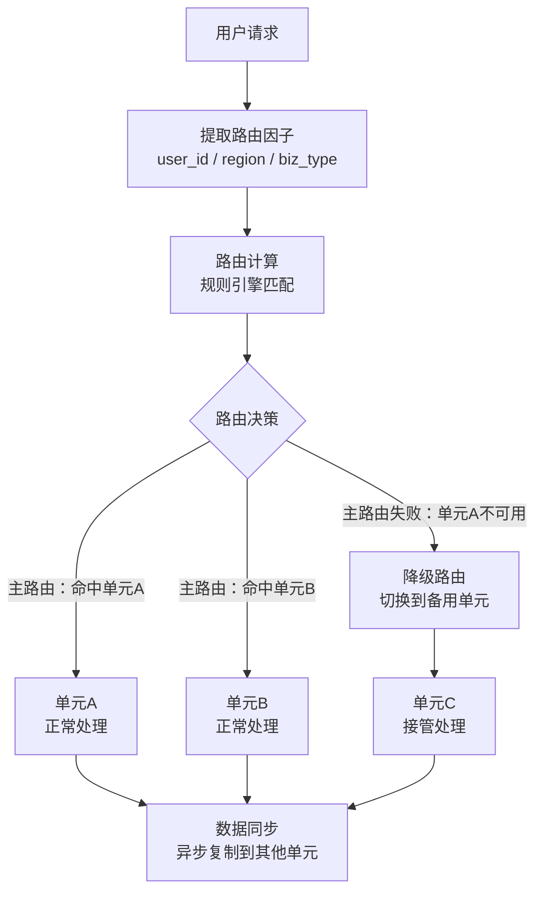
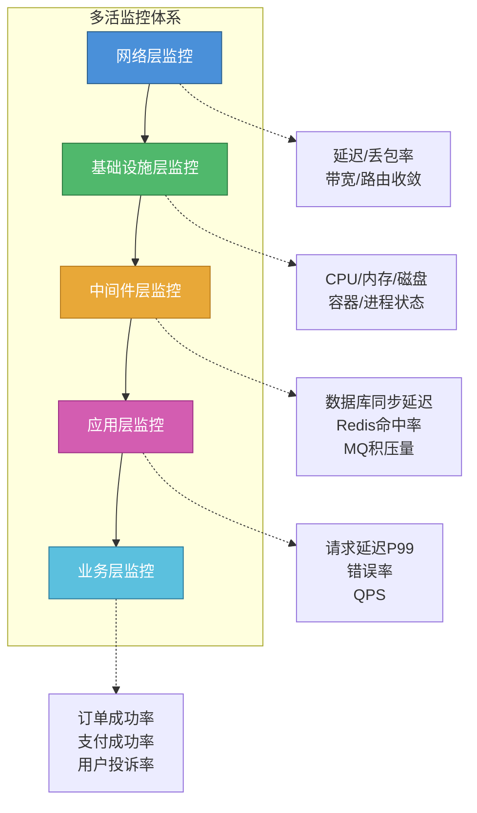
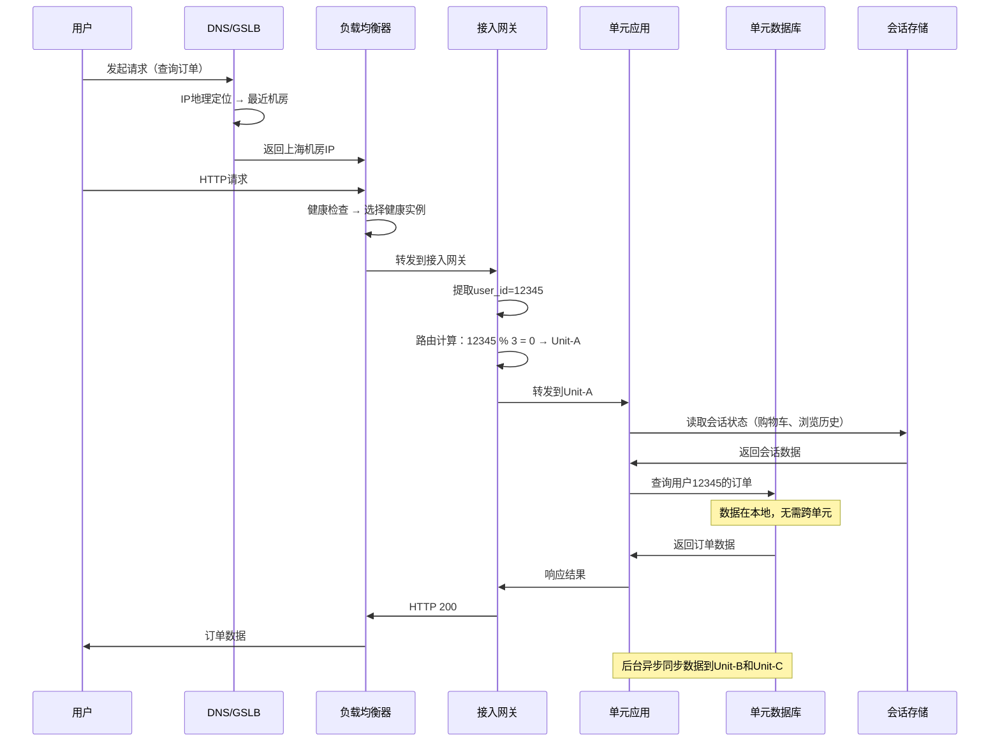

# 多活架构核心技巧

多活架构的理论基础回答了"为什么需要多活"和"多活的基本形态是什么"。但要将理论落地为生产系统，还需要一套完整的工程技巧——如何让流量精准地到达正确的数据中心，如何将数据合理地切分到不同单元，如何确保每个用户请求都在其归属单元内完成闭环处理，如何在多机房之间保持会话连续性，以及如何构建贯穿全链路的监控运维体系。这五者构成了多活架构从架构蓝图到可运行系统的完整桥梁。

本节聚焦于多活架构落地过程中最核心的五项工程技巧：**流量调度**、**数据分片**、**单元化路由**、**跨机房会话管理**和**监控运维体系**。它们并非相互独立，而是一个环环相扣的技术链条：流量调度决定用户请求去往哪个数据中心，单元化路由决定该请求在数据中心内部被哪个单元承接，数据分片决定了该单元拥有哪些数据、如何保持与其他单元的数据同步，会话管理确保用户在多机房之间的交互状态不丢失，监控运维体系则为整条链路提供可观测性和故障响应能力。



---

## 五项技巧的协同关系

理解协同关系的最佳方式是追踪一个用户请求的完整生命周期：

1. **流量调度层**：用户发起请求，DNS/GSLB 根据用户 IP 的地理位置将其引导至最近的数据中心（如上海机房）
2. **单元化路由层**：上海机房的接入网关提取用户 ID，通过路由规则引擎计算该用户归属的单元（如 Unit-B 上海），将请求转发到该单元
3. **数据分片层**：Unit-B 的应用服务处理请求时，直接访问本地分库（该用户的所有数据都在本地），完成业务逻辑后返回响应
4. **会话管理层**：用户在 Unit-B 上的操作状态（购物车、浏览历史、登录态）被持久化，即使后续请求被路由到其他单元也能恢复
5. **监控运维层**：全链路的每一个环节都有指标采集和告警，任何一个环节出现异常都能被即时发现并处理

这个过程中，95%以上的请求不需要跨单元调用，这就是单元化架构追求的目标——**单元内闭环**。只有少数全局性服务（支付、风控、注册）才需要跨单元访问中心单元。

| 技术环节 | 核心问题 | 关键指标 | 典型延迟 | 失败影响 |
|---------|---------|---------|---------|---------|
| 流量调度 | 用户去哪个机房 | 调度准确率、切换速度 | 分钟级（DNS）到秒级（应用层） | 流量打到错误机房，数据不归属 |
| 单元化路由 | 请求去哪个单元 | 路由命中率、规则匹配速度 | 毫秒级 | 请求路由到无数据的单元 |
| 数据分片 | 数据怎么切分 | 数据均衡度、同步延迟 | 秒级（异步同步） | 数据不一致、跨单元查询 |
| 会话管理 | 状态怎么保持 | 会话命中率、恢复成功率 | 毫秒级（缓存读取） | 用户状态丢失，需要重新登录 |
| 监控运维 | 全链路可观测 | 告警准确率、MTTR | 秒级（检测延迟） | 故障发现延迟，恢复时间延长 |

---

## 一、流量调度：多活架构的"总调度员"

流量调度是多活架构的入口层，解决的核心问题是：**在多数据中心的架构下，如何把用户请求精准、高效地引导到最合适的数据中心。**

这看似简单，实则涉及多维度的决策。一个看似直达的用户请求，在底层经历了 DNS 解析、GSLB 智能调度、负载均衡器实例分配等多层路由，每一层都在做"最优选择"。

### 为什么流量调度如此关键

流量调度的准确性直接决定了多活架构的价值能否实现。调度失误的后果远比想象中严重：

- **跨地域访问**：用户被调度到距离很远的数据中心，网络延迟从 10ms 飙升到 100ms+，直接表现为页面加载缓慢。研究表明，页面加载时间每增加 100ms，转化率下降 1%
- **数据不归属**：用户的请求到了一个没有其数据的单元，要么跨单元查询（引入额外延迟），要么返回错误
- **负载不均**：大量用户被集中在某个机房，导致该机房过载而其他机房空闲，违背了多活的初衷
- **故障切换失败**：某个机房故障时，流量不能及时切换到健康机房，导致服务中断

### 流量调度的三层架构

多活架构的流量调度采用分层设计，每层解决不同粒度的调度问题：



**第一层：DNS/GSLB（地域级调度）**

这一层解决"用户去哪个城市"的问题。通过 DNS 解析或 GSLB（Global Server Load Balancing），根据用户的 IP 地址判断其地理位置，返回最近数据中心的 IP。

| 方案 | 工作原理 | 切换速度 | 优点 | 缺点 |
|------|---------|---------|------|------|
| 普通 DNS | 静态配置，按地域返回 IP | 1-10 分钟（取决于 TTL） | 实现简单 | 切换慢，无法感知故障 |
| GSLB | 基于健康检查动态调整解析结果 | 30 秒-5 分钟 | 能感知故障，智能调度 | 成本高，配置复杂 |
| HTTPDNS | 客户端直接调 HTTP 接口获取 IP | 1-10 秒 | 绕过 LocalDNS 缓存，切换快 | 需要客户端 SDK 集成 |
| Anycast | 多机房共享同一 IP，BGP 自动路由 | 秒级（BGP 收敛） | 切换快，对应用透明 | 无法感知负载，需网络层配合 |

**Anycast 调度详解**：Anycast 是一种网络层的流量调度技术。多个数据中心共享同一个 IP 地址，BGP 协议自动将用户的流量路由到最近的数据中心。其核心优势在于 BGP 收敛速度远快于 DNS 切换——当某个节点故障时，BGP 路由会在秒级收敛到其他节点。Cloudflare、Google DNS（8.8.8.8）都大量使用 Anycast。但 Anycast 只能按网络距离调度（BGP 路由路径决定），无法考虑服务器负载，且对 BGP 配置要求极高，不适合初次引入多活的团队。

**主流 GSLB 产品对比**：

| 产品 | 路由策略 | 健康检查 | 特点 | 适用场景 |
|------|---------|---------|------|---------|
| AWS Route 53 | 延迟/地理/权重/故障转移 | TCP/HTTP/HTTPS | 全球覆盖广、SLA 99.99% | AWS 云上多活 |
| 阿里云全局流量管理 | 延迟/地理/权重 | HTTP/TCP | 国内体验好，与阿里云生态深度集成 | 国内多活 |
| F5 BIG-IP GTM | 延迟/地理/权重/轮询 | 多种协议 | 功能全面、企业级 | 传统 IDC 多活 |
| Cloudflare LB | 地理/池优先级/动态 | HTTP/TCP | CDN 集成好，全球节点多 | 全球化业务 |
| NS1 | 建议/性能/地理/过滤 | 多种协议 | API 优先，自动化友好 | DevOps 团队 |

**第二层：负载均衡器（实例级调度）**

这一层解决"机房内去哪台服务器"的问题。通过 Nginx、HAProxy 或硬件负载均衡器（F5），根据后端实例的健康状态和负载水平，将请求分配到最合适的实例。

常见的负载均衡算法在多活场景下的选择：

| 算法 | 原理 | 多活场景适用性 | 注意事项 |
|------|------|-------------|---------|
| 轮询（Round Robin） | 依次分配到每个实例 | 一般 | 无法感知实例负载差异 |
| 加权轮询 | 按权重分配 | 较好 | 需要合理设置权重 |
| 最少连接 | 分配到连接数最少的实例 | 好 | 需要实时统计连接数 |
| IP Hash | 按客户端 IP 哈希分配 | 好（保证会话亲和性） | IP 变化时会话丢失 |
| 一致性 Hash | 按 Key 一致性哈希分配 | 好（扩缩容时影响最小） | 实现复杂度较高 |

**第三层：应用网关（用户级调度）**

这一层解决"请求去哪个单元"的问题。应用网关根据用户 ID、业务类型、灰度策略等信息，将请求路由到用户归属的单元。这是单元化架构的核心入口，也是路由规则最灵活的一层。

### 关键设计要点

**DNS TTL 管理策略**

DNS 缓存是流量调度的最大挑战之一。TTL 设置过长，故障切换时旧记录迟迟不过期；TTL 设置过短，DNS 查询压力暴增。一个经过验证的 TTL 管理策略：

```yaml
# DNS TTL 管理配置
dns_ttl_strategy:
  normal:
    ttl: 300        # 正常时期：5分钟，平衡切换速度和DNS压力
    description: "日常运行，最大化缓存命中率"
  pre_switch:
    ttl: 60         # 计划切换前30分钟降到60秒
    description: "计划内切换，提前30分钟开始降低TTL"
    trigger: "运维手动触发或定时任务"
  emergency:
    ttl: 30         # 故障/大促前降到30秒
    description: "紧急切换或大促预热，最快收敛速度"
    trigger: "故障检测自动触发或手动触发"
  post_switch:
    ttl: 300        # 切换完成后恢复
    description: "切换完成确认后恢复，通常在切换后30分钟"
```

**重要实践**：在实际生产中，很多故障切换失败的原因不是 GSLB 不工作，而是本地 DNS 缓存（ISP 的 Recursive DNS）不遵守 TTL 设置。部分运营商的 DNS 缓存 TTL 最小值为 300 秒，即使你设置了 30 秒 TTL，本地 DNS 仍可能缓存 5 分钟。应对方案是配合 HTTPDNS 作为补充手段，客户端 SDK 直接向权威 DNS 查询，绕过本地 DNS 缓存。

**健康检查设计**

健康检查是 GSLB 感知故障的基础。检查策略需要兼顾准确性和及时性：

| 检查层级 | 检查方式 | 能发现的问题 | 建议频率 | 误判风险 |
|---------|---------|------------|---------|---------|
| 端口级 | TCP 连接测试 | 进程崩溃 | 5 秒 | 高（进程存活但服务不可用） |
| 应用层 | HTTP GET /health 返回 200 | 服务不可用 | 10 秒 | 低（能反映真实服务状态） |
| 深度检查 | 调用关键接口（如 DB 连通性） | 依赖故障 | 30 秒 | 最低（但增加自身压力） |
| 业务级 | 模拟真实业务请求 | 业务逻辑异常 | 60 秒 | 最低（但实现成本高） |

**最佳实践**：采用分层检查策略——端口级检查高频运行（5 秒），应用层检查中频运行（10 秒），深度检查低频运行（30 秒）。只有连续 N 次检查失败才标记为不健康，避免瞬时抖动导致误判。推荐配置：连续 3 次端口检查失败标记 `suspicious`，连续 2 次应用层检查失败标记 `unhealthy`，连续 1 次深度检查失败标记 `critical`。

**灰度切换流程**

大规模流量切换不能一步到位，需要分阶段灰度进行：

阶段1：内部测试流量（1%）
  - 仅内部员工和测试账号走目标机房
  - 验证目标机房功能正常、数据完整
  - 检查指标：错误率、延迟、CPU/内存

阶段2：小比例外部流量（5%）
  - 通过 GSLB 权重或 HTTPDNS 引入真实用户
  - 观察真实用户场景下的各项指标
  - 检查指标：用户投诉率、订单成功率、支付成功率

阶段3：逐步放量（10% → 30% → 50%）
  - 每个阶段观察 15-30 分钟
  - 设置自动回滚条件（如错误率 > 0.1% 自动回滚）
  - 检查指标：全链路延迟 P99、数据库连接池使用率

阶段4：全量切换（100%）
  - 确认前 3 阶段所有指标正常
  - 保留回滚能力至少 2 小时
  - 切换完成后更新监控基线

### 流量调度的常见陷阱

| 陷阱 | 表现 | 根因 | 应对方案 |
|------|------|------|---------|
| DNS 缓存不收敛 | 故障切换后仍有大量流量打到旧机房 | ISP DNS 不遵守 TTL | 配合 HTTPDNS + 客户端重试 |
| 健康检查误判 | 健康的机房被误标记为不健康 | 检查过于敏感（单次失败就切换） | 连续 N 次失败才标记 |
| 雪崩效应 | 一个机房故障导致其他机房过载 | 切换时没有限流保护 | 灰度切换 + 流量上限保护 |
| 调度振荡 | 流量在两个机房之间反复切换 | 健康检查在临界状态反复翻转 | 设置迟滞区间（hysteresis） |

---

## 二、数据分片：多活架构的"数据版图"

数据分片是单元化架构的基础，解决的核心问题是：**如何将海量数据合理地切分到多个数据中心，使得每个单元拥有自己独立的数据集，同时保持跨单元的数据最终一致性。**

数据分片的设计质量直接决定了单元化架构的成败。切分得好，95%以上的请求在单元内闭环；切分得不好，跨单元调用频繁，多活架构退化为分布式单体。

### 为什么数据分片是核心难题

在单机房架构中，所有数据共享一个数据库，不存在分片问题。但多活架构要求每个单元拥有独立的数据集，这就带来了三个核心挑战：

**挑战一：分片键的选择**

分片键决定了数据按什么维度切分。选错了分片键，会导致严重的数据倾斜或大量跨单元查询。以电商平台为例：

| 分片键 | 同一用户请求闭环率 | 跨单元场景 | 适用场景 |
|-------|-----------------|----------|---------|
| 用户 ID | 高（95%+） | 用户间交互（转账、消息） | 电商、社交、SaaS |
| 商品 ID | 低（30%） | "我的订单"查询需跨单元聚合 | 商品推荐、库存管理 |
| 订单 ID | 极低（0%） | 几乎所有业务查询都跨单元 | 不推荐作为主分片键 |
| 地理位置 | 中高（85%） | 跨区域用户交互 | 外卖、打车、本地生活 |

实践中，**按用户 ID 分片**是电商、社交等用户中心类业务的主流选择。因为大多数业务操作是"用户操作自己的数据"，按用户分片能让这部分请求完全本地化。

**挑战二：全局数据的处理**

并非所有数据都适合分片。某些数据天然是全局性的：

| 数据类型 | 特点 | 处理方式 | 同步频率 |
|---------|------|---------|---------|
| 商品目录 | 所有用户都需要查看 | 全量同步到所有单元 | 每 5 分钟 |
| 系统配置 | 全局一致，变更频率低 | 全量同步到所有单元 | 变更后实时推送 |
| 营销活动 | 所有用户都参与，有时间窗口 | 全量同步到所有单元 | 活动上线时实时同步 |
| 用户数据 | 按用户维度隔离 | 按分片规则分配到对应单元 | N/A（本地数据） |
| 交易数据 | 与用户强关联 | 跟随用户分片 | N/A（本地数据） |
| 地区数据 | 按区域隔离 | 按地域分片 | N/A（本地数据） |

全局数据的同步方式通常是异步全量复制，同步间隔根据数据变更频率决定。对于变更不频繁的配置数据，可以采用"变更推送"模式——配置中心检测到变更后主动推送到所有单元，而非定时轮询。

**挑战三：数据同步与一致性**

多活架构中，数据同步面临"速度 vs 一致性"的根本矛盾：



| 同步方式 | 原理 | 写入延迟 | 数据安全性 | 适用场景 |
|---------|------|---------|-----------|---------|
| 同步复制 | 等待所有副本确认后返回 | 随机房距离线性增长 | 零数据丢失 | 同城双活（延迟 < 3ms） |
| 异步复制 | 本地完成后立即返回，后台同步 | 极低 | 可能丢失秒级数据 | 异地多活（延迟 > 10ms） |
| 半同步复制 | 至少一个副本确认后返回 | 中等 | 极少量数据可能丢失 | 同城主从 + 异地异步的混合模式 |

### 数据分片的关键实践

**分片策略配置模板**

一个完整的分片配置需要覆盖路由规则、全局数据、同步策略三个维度：

```yaml
# 多活数据分片配置模板
sharding:
  # 分片键配置
  shard_key: "user_id"
  shard_strategy: "consistent_hash"  # 一致性哈希，便于扩缩容
  virtual_nodes: 150  # 虚拟节点数，决定数据均衡度

  # 单元定义
  units:
    - name: "unit-a-beijing"
      region: "华北"
      shard_range: [0, 33]  # user_id % 100 在 [0, 33]
      db_endpoint: "10.0.1.100:3306"
      cache_endpoint: "10.0.1.200:6379"
      capacity_weight: 40  # 容量权重（北京机房资源多）
    - name: "unit-b-shanghai"
      region: "华东"
      shard_range: [34, 66]
      db_endpoint: "10.0.2.100:3306"
      cache_endpoint: "10.0.2.200:6379"
      capacity_weight: 35
    - name: "unit-c-guangzhou"
      region: "华南"
      shard_range: [67, 99]
      db_endpoint: "10.0.3.100:3306"
      cache_endpoint: "10.0.3.200:6379"
      capacity_weight: 25

  # 全局数据同步
  global_tables:
    - table: "product"
      sync_mode: "async"
      sync_interval: "300s"
      priority: "normal"
    - table: "config"
      sync_mode: "push"  # 变更推送模式
      priority: "high"

  # 同步监控阈值
  sync_monitor:
    max_delay_bytes: 1024
    max_delay_seconds: 5
    alert_channel: "ops-alerts"
    auto_rollback: true  # 延迟超过阈值时自动触发告警
```

**一致性哈希 vs 取模分片**

| 维度 | 取模分片 | 一致性哈希 |
|------|---------|-----------|
| 实现复杂度 | 简单（user_id % N） | 中等（需要虚拟节点） |
| 扩容影响 | 大量数据迁移（几乎所有数据重新映射） | 仅迁移 1/N 的数据 |
| 数据均衡度 | 一般（取模后分布不一定均匀） | 好（虚拟节点保证均衡） |
| 单元故障时数据迁移 | 需要重新计算所有映射 | 只需迁移故障节点的数据 |
| 适用场景 | 单元数量固定不变（3-5 个） | 频繁扩缩容的场景（全球化业务） |

实际生产中，如果单元数量相对稳定（通常 3-5 个），取模分片因实现简单而更常用。如果需要频繁扩缩容（如全球化业务新增区域），一致性哈希是更好的选择。

**数据重分片（Resharding）**

当业务增长需要新增或缩减单元时，数据重分片是不可避免的操作。重分片的核心挑战是：在不停服、不丢数据的前提下，将数据从旧分片迁移到新分片。


重分片的关键步骤：

1. **双写阶段**：所有写操作同时写入新旧两个分片。通过在业务代码中添加分片路由中间件实现，路由表通过配置中心热更新
2. **存量迁移**：使用批量数据迁移工具（如 DataX、DTS）将历史数据从旧分片迁移到新分片。迁移过程中需要处理增量数据（双写阶段产生的新数据）
3. **一致性校验**：对新旧分片的数据进行逐条比对，确保迁移无遗漏、无错误。校验维度包括记录数、关键字段哈希值、抽样数据内容
4. **流量切换**：逐步将读请求从旧分片切到新分片（灰度比例 1% → 10% → 50% → 100%）
5. **清理旧数据**：确认新分片完全稳定后，清理旧分片中的数据（保留 7 天作为安全窗口）

### 数据同步延迟的监控与告警

同步延迟是多活架构最需要关注的指标之一。延迟过大意味着故障切换时数据丢失风险增加：

```bash
#!/bin/bash
# monitor_sync_delay.sh - 多活数据同步延迟监控脚本

MASTER_HOST="10.0.1.100"
SLAVE_HOST="10.0.2.100"
ALERT_THRESHOLD=10000  # 延迟字节阈值
CRITICAL_THRESHOLD=50000

# 获取同步延迟（基于GTID的精确延迟检测）
DELAY=$(mysql -h $SLAVE_HOST -u monitor -p"$MONITOR_PWD" -e \
  "SELECT TIMESTAMPDIFF(SECOND, MAX(completed_time), NOW()) as delay_seconds
   FROM performance_schema.replication_connection_status
   WHERE SERVICE_STATE = 'ON';" 2>/dev/null | tail -1)

if [ -z "$DELAY" ] || [ "$DELAY" = "NULL" ]; then
    echo "CRITICAL: 无法获取同步状态，可能同步已中断"
    curl -s -X POST $ALERT_WEBHOOK \
        -H "Content-Type: application/json" \
        -d "{\"level\":\"critical\",\"msg\":\"多活同步状态异常: 无法读取同步延迟\"}"
    exit 1
fi

if [ "$DELAY" -gt 60 ]; then
    echo "CRITICAL: 同步延迟 ${DELAY}s，数据丢失风险极高"
    curl -s -X POST $ALERT_WEBHOOK \
        -d "{\"level\":\"critical\",\"msg\":\"同步延迟严重: ${DELAY}s\"}"
elif [ "$DELAY" -gt 10 ]; then
    echo "WARNING: 同步延迟 ${DELAY}s，需要关注"
    curl -s -X POST $ALERT_WEBHOOK \
        -d "{\"level\":\"warning\",\"msg\":\"同步延迟偏高: ${DELAY}s\"}"
else
    echo "OK: 同步延迟 ${DELAY}s，状态正常"
fi
```

**关键监控指标**：

| 指标 | 健康范围 | 警告阈值 | 严重阈值 | 含义 |
|------|---------|---------|---------|------|
| 同步延迟（秒） | < 3s | > 10s | > 60s | 切换时可能丢失的数据时间窗口 |
| 同步延迟（字节） | < 1KB | > 10KB | > 100KB | 同步积压的数据量 |
| 同步中断时长 | 0 | > 5min | > 30min | 数据同步是否中断 |
| 跨单元查询比例 | < 5% | > 10% | > 20% | 单元化是否真正落地 |
| 全局数据同步延迟 | < 30s | > 120s | > 600s | 全局数据的新鲜度 |

---

## 三、单元化路由：多活架构的"导航系统"

单元化路由是多活架构中最精细的调度环节，解决的核心问题是：**在确定请求到达某个数据中心后，如何将请求精准地路由到用户归属的单元，确保业务操作在单元内闭环完成。**

如果说流量调度决定了"用户去北京还是上海"，那么单元化路由决定了"用户在北京机房的 Unit-A 还是 Unit-B"。路由的正确性直接影响业务逻辑的正确性——路由到错误的单元意味着"用户找不到自己的数据"。

### 单元化路由的核心机制

一个完整的单元化路由链路包括三个阶段：规则定义、路由计算、故障切换。



**路由因子的提取**

路由因子是路由计算的输入。不同业务场景下，路由因子的选择不同：

| 路由因子 | 提取方式 | 适用场景 | 示例 |
|---------|---------|---------|------|
| user_id | 登录态 Token 解析 | 用户中心业务（电商、社交） | 交易、订单、个人中心 |
| phone / region | 请求参数提取 | 区域强相关业务（外卖、打车） | 按城市/区域服务 |
| biz_type | 请求路径/参数解析 | 多业务混合场景 | 支付走中心单元，浏览走本地单元 |
| order_id | 数据库反查 user_id | 订单相关操作 | 订单详情、售后 |
| tenant_id | SaaS 多租户标识 | B2B SaaS 平台 | 租户数据隔离 |

**路由因子提取的实现**：

```python
from typing import Optional
import re

class RoutingFactorExtractor:
    """路由因子提取器：从请求中提取路由所需的关键信息"""

    def extract(self, request: dict) -> dict:
        """提取所有可用的路由因子"""
        factors = {}

        # 1. 从登录态 Token 中提取 user_id
        token = request.get('headers', {}).get('Authorization', '')
        user_id = self._parse_user_id_from_token(token)
        if user_id:
            factors['user_id'] = user_id

        # 2. 从请求参数中提取区域信息
        region = request.get('params', {}).get('region')
        if region:
            factors['region'] = region

        # 3. 从请求路径中提取业务类型
        path = request.get('path', '')
        biz_type = self._infer_biz_type(path)
        if biz_type:
            factors['biz_type'] = biz_type

        return factors

    def _parse_user_id_from_token(self, token: str) -> Optional[int]:
        """从 JWT 或 Session Token 中解析 user_id"""
        if not token or not token.startswith('Bearer '):
            return None
        # 实际项目中使用 JWT 解码库
        # 这里简化为从 token 中提取 user_id 字段
        try:
            payload = decode_jwt(token[7:])  # 去掉 'Bearer ' 前缀
            return payload.get('user_id')
        except Exception:
            return None

    def _infer_biz_type(self, path: str) -> Optional[str]:
        """根据请求路径推断业务类型"""
        patterns = {
            r'^/api/payment': 'payment',       # 支付走中心单元
            r'^/api/user/register': 'register', # 注册走中心单元
            r'^/api/order': 'order',            # 订单走用户归属单元
            r'^/api/product': 'product',        # 商品走任意单元（全局数据）
        }
        for pattern, biz_type in patterns.items():
            if re.match(pattern, path):
                return biz_type
        return None
```

### 路由规则设计原则

**原则一：确定性路由**

同一用户的同一请求，在任何时间点都应该被路由到相同的单元。路由规则必须是确定性的——给定相同的输入，永远产生相同的输出。这保证了缓存命中率和数据局部性。

反例：基于"当前负载"做路由决策。虽然负载均衡看起来合理，但同一用户每次被路由到不同单元，导致缓存失效、数据不一致。

**原则二：路由规则可热更新**

路由规则不能硬编码在应用中，必须支持不重启服务的情况下动态更新。典型实现方式：

```yaml
# 路由规则配置（存储在配置中心，支持热更新）
routing_rules:
  version: 3
  updated_at: "2026-06-26T10:30:00+08:00"
  rules:
    # 主路由规则
    - name: "user_based_routing"
      priority: 1
      condition: "request.has_login_token"
      action:
        type: "hash_route"
        key: "user_id"
        modulus: 3
        mapping:
          0: "unit-a"
          1: "unit-b"
          2: "unit-c"

    # 区域路由规则（优先级更高）
    - name: "geo_routing"
      priority: 0  # 优先级最高
      condition: "request.region in ['华东']"
      action:
        type: "fixed_route"
        target: "unit-b"

    # 全局服务路由
    - name: "global_service"
      priority: 0
      condition: "request.path.startsWith('/api/payment')"
      action:
        type: "fixed_route"
        target: "unit-center"

  # 降级路由配置
  fallback:
    - condition: "target_unit.health == 'unhealthy'"
      action: "route_to_nearest_healthy_unit"
    - condition: "target_unit.db_delay > 10s"
      action: "route_to_standby_unit"
```

**原则三：灰度发布能力**

新规则上线不能一步到位全量生效，需要支持按比例灰度：

灰度发布步骤：
1. 新规则版本推送到配置中心（标记为 shadow 模式）
2. 路由引擎同时评估新旧规则，新规则结果仅记录日志（不实际路由）
3. 对比新旧规则路由结果，确认一致性 > 99.9%
4. 开启灰度模式：1% 流量使用新规则
5. 监控 30 分钟，确认无异常
6. 逐步放大灰度比例：5% → 20% → 50% → 100%
7. 下线旧规则

### 路由故障切换机制

单元化路由的高可用是多活架构的命脉。当某个单元不可用时，路由引擎必须能在秒级将流量切换到备用单元。

**故障检测**

路由引擎通过以下信号判断单元健康状态：

| 检测维度 | 检测方式 | 判定条件 | 响应动作 |
|---------|---------|---------|---------|
| 应用存活 | HTTP 健康检查 | 连续 3 次返回非 200 | 标记为 unhealthy |
| 数据库可达 | TCP 连接测试 | 连接超时 > 3 秒 | 标记为 db_unreachable |
| 数据延迟 | 同步监控指标 | 延迟 > 30 秒 | 标记为 high_delay |
| 人工标记 | 运维接口 | 维护窗口 | 标记为 maintenance |

**切换策略**

```python
class UnitRouteEngine:
    """单元化路由引擎核心逻辑"""

    def route(self, user_id: int, request_context: dict) -> str:
        # 1. 优先匹配特殊路由规则（如全局服务）
        special_unit = self.match_special_rules(request_context)
        if special_unit:
            return special_unit

        # 2. 根据用户ID计算归属单元
        target_unit = self.calculate_home_unit(user_id)

        # 3. 检查目标单元健康状态
        if self.is_healthy(target_unit):
            return target_unit

        # 4. 主单元不健康，执行降级路由
        return self.fallback_route(user_id, target_unit)

    def fallback_route(self, user_id: int, failed_unit: str) -> str:
        """
        降级路由策略：
        1. 优先选择同区域的备用单元（延迟最低）
        2. 其次选择最近的健康单元
        3. 最后选择任一健康单元（兜底）
        """
        # 同区域备选
        same_region = self.get_same_region_units(failed_unit)
        for unit in same_region:
            if self.is_healthy(unit):
                self.emit_metric("fallback_same_region", unit)
                return unit

        # 最近健康单元
        nearest = self.get_nearest_healthy_unit(failed_unit)
        if nearest:
            self.emit_metric("fallback_nearest", nearest)
            return nearest

        # 兜底：任一健康单元
        any_healthy = self.get_any_healthy_unit()
        self.emit_metric("fallback_any", any_healthy)
        return any_healthy
```

**切换后的数据一致性保障**

当路由引擎将用户流量切换到备用单元时，需要处理一个关键问题：备用单元的数据可能不是最新的。处理策略：

- **可接受延迟**：如果切换前的异步同步延迟在 SLA 范围内（如 < 5 秒），用户感知到的数据差异很小
- **读修复**：切换后首次读取时，如果发现数据版本落后，触发一次同步拉取
- **写冲突预案**：如果原单元恢复后存在数据冲突，以最后写入胜出（LWW）策略处理
- **用户通知**：对于关键操作（如支付），在切换后提示用户刷新页面确认状态

---

## 四、跨机房会话管理：多活架构的"状态管家"

多活架构中一个容易被忽视但极其关键的问题是：**用户的会话状态如何在多个数据中心之间保持连续。** 当用户请求被调度到不同机房、或某个机房故障需要切换时，如果用户的登录态、购物车、浏览历史等状态丢失，用户体验将严重受损。

### 会话管理的核心挑战

在单机房架构中，会话管理很简单——Session 存储在某台服务器的内存中，通过负载均衡器的会话粘滞（Sticky Session）保证同一用户始终访问同一台服务器。但在多活架构中，这个方案彻底失效：

| 挑战 | 表现 | 影响 |
|------|------|------|
| 会话粘滞失效 | 用户被调度到不同机房，本地 Session 找不到 | 用户被强制登出 |
| Session 复制延迟 | 跨机房复制 Session 数据有延迟 | 购物车、表单填写内容丢失 |
| 缓存不一致 | Redis 缓存在不同机房各自独立 | 登录态校验失败 |
| 长连接断开 | WebSocket 连接只能连接一个机房 | 实时通知中断 |

### 会话管理的三种方案

**方案一：Session 集中式存储（推荐）**

将 Session 从应用服务器内存中抽离，存储到全局共享的 Session 存储服务中。应用服务器无状态化，任何请求可以被路由到任何机房的任何实例。

```mermaid
graph TB
    subgraph 方案一：Session集中式存储
        Client[用户请求] --> LB[负载均衡器]
        LB --> AppA[机房A应用]
        LB --> AppB[机房B应用]
        AppA --> SessionStore[(Session Store<br/>Redis Cluster)]
        AppB --> SessionStore
    end
```

Session Store 的部署方式：

| 部署方式 | 架构 | 一致性 | 延迟 | 适用场景 |
|---------|------|-------|------|---------|
| 单机房 Redis | 所有机房连同一组 Redis | 强一致 | 受网络距离影响 | 同城双活 |
| Redis 主从 + Sentinel | 每个机房一套 Redis，主从同步 | 最终一致 | 本地读取快 | 异地多活 |
| Redis Cluster 跨机房 | 多机房部署 Redis Cluster | 最终一致 | 取决于 Slot 分布 | 大规模多活 |

**异地多活场景下的 Session 存储配置**：

```yaml
# Session Store 配置
session:
  store_type: "redis_cluster"
  # 每个机房部署本地 Redis，通过 Redis Sentinel 实现主从切换
  clusters:
    - name: "beijing"
      endpoint: "10.0.1.200:6379"
      role: "master"  # 正常情况下是写入主节点
    - name: "shanghai"
      endpoint: "10.0.2.200:6379"
      role: "slave"   # 正常情况下是从节点，只读
  # 故障切换时角色变更
  failover:
    strategy: "auto"  # Sentinel 自动切换
    detection_timeout: "5s"
    switch_timeout: "30s"
  # Session 属性
  ttl: 1800           # 30分钟过期
  key_prefix: "sess:"
  serializer: "json"
```

**方案二：Token 无状态化（JWT，推荐）**

更彻底的方案是让会话完全无状态化。使用 JWT（JSON Web Token）替代传统 Session，将用户身份信息编码到 Token 中，客户端每次请求携带 Token，服务端无需存储会话状态。

```python
import jwt
import time
from typing import Optional

class JWTSessionManager:
    """基于JWT的无状态会话管理"""

    def __init__(self, secret_key: str, algorithm: str = "HS256"):
        self.secret_key = secret_key
        self.algorithm = algorithm

    def create_token(self, user_id: int, extra_claims: dict = None) -> str:
        """创建JWT Token"""
        payload = {
            "user_id": user_id,
            "iat": int(time.time()),           # 签发时间
            "exp": int(time.time()) + 1800,    # 30分钟过期
            "jti": str(uuid.uuid4()),          # 唯一ID，用于防重放
        }
        if extra_claims:
            payload.update(extra_claims)
        return jwt.encode(payload, self.secret_key, algorithm=self.algorithm)

    def verify_token(self, token: str) -> Optional[dict]:
        """验证JWT Token，任何机房都能独立验证"""
        try:
            payload = jwt.decode(token, self.secret_key, algorithms=[self.algorithm])
            return payload
        except jwt.ExpiredSignatureError:
            return None  # Token 过期
        except jwt.InvalidTokenError:
            return None  # Token 无效

    def refresh_token(self, token: str) -> Optional[str]:
        """刷新Token（延长过期时间）"""
        payload = self.verify_token(token)
        if not payload:
            return None
        # 重新生成Token，保留原有用户信息
        return self.create_token(
            user_id=payload["user_id"],
            extra_claims={k: v for k, v in payload.items()
                         if k not in ("iat", "exp", "jti")}
        )
```

JWT 方案的关键优势在于**天然支持多活**——任何机房持有相同的 `secret_key`，就能独立验证 Token，无需跨机房访问 Session Store。但 JWT 也有局限：无法主动使 Token 失效（如用户修改密码后旧 Token 仍有效），需要配合 Token 黑名单或短期 Token + 频繁刷新来解决。

**方案三：混合方案（生产推荐）**

生产环境中通常采用混合方案：JWT 用于身份认证（无状态），Redis 用于存储会话状态数据（如购物车、草稿等需要跨请求持久化的状态）。

┌─────────────────────────────────────────────────────────┐
│                    混合会话管理方案                        │
├─────────────────────────────────────────────────────────┤
│                                                         │
│  认证层（无状态）：JWT Token                               │
│  ├─ 用户身份信息编码在 Token 中                             │
│  ├─ 任何机房都能独立验证                                    │
│  └─ 有效期短（15-30分钟），频繁刷新                          │
│                                                         │
│  状态层（有状态）：Redis Session Store                     │
│  ├─ 购物车、表单草稿、操作历史                               │
│  ├─ 每个机房部署本地 Redis，主从同步                         │
│  └─ TTL 设为 30 分钟，与 JWT 过期时间对齐                    │
│                                                         │
│  关键设计：                                               │
│  ├─ Redis Key = userId + ":" + sessionId                 │
│  ├─ 写操作在归属单元的 Redis 主节点执行                      │
│  ├─ 读操作在本地 Redis 读取（可能读到从节点数据）              │
│  └─ 故障切换时，接受短暂的状态数据不一致                      │
│                                                         │
└─────────────────────────────────────────────────────────┘

### 跨机房会话的关键实践

**会话数据的分类与处理策略**

并非所有会话数据都同等重要，需要根据业务影响分级处理：

| 数据类型 | 重要性 | 丢失影响 | 处理策略 |
|---------|-------|---------|---------|
| 登录态 | 极高 | 用户被强制登出 | JWT + Redis 双重保障 |
| 购物车 | 高 | 用户需要重新添加商品 | Redis 持久化 + 跨机房同步 |
| 表单草稿 | 中 | 需要重新填写 | Redis 持久化，不跨机房同步 |
| 浏览历史 | 低 | 推荐准确性下降 | 仅本地 Redis，不同步 |
| 操作日志 | 低 | 影响较小 | 异步写入，允许延迟 |

**WebSocket 长连接的多活处理**

WebSocket 连接是天然有状态的——客户端与特定服务器建立连接后，后续消息只能通过该连接传输。在多活架构中，需要特殊处理：

1. **连接粘滞**：WebSocket 连接建立时，通过路由因子确定连接到哪个机房的哪个服务器，后续消息通过同一连接传输
2. **断线重连策略**：客户端检测到连接断开时，重新建立连接。重连时重新进行路由计算，可能连接到不同的机房
3. **消息补偿**：在连接断开期间产生的消息，通过 HTTP 接口拉取补偿，确保不丢失

```javascript
// 客户端 WebSocket 重连逻辑
class ResilientWebSocket {
    constructor(url, options = {}) {
        this.url = url;
        this.maxRetries = options.maxRetries || 5;
        this.retryDelay = options.retryDelay || 1000;
        this.connect();
    }

    connect() {
        this.ws = new WebSocket(this.url);
        this.ws.onopen = () => {
            console.log('WebSocket connected');
            this.retryCount = 0;
        };
        this.ws.onclose = (event) => {
            if (event.code !== 1000 &amp;&amp; this.retryCount < this.maxRetries) { // 非正常关闭
                this.retryCount++;
                const delay = this.retryDelay * Math.pow(2, this.retryCount - 1); // 指数退避
                console.log(`Reconnecting in ${delay}ms (attempt ${this.retryCount})`);
                setTimeout(() => this.connect(), delay);
            }
        };
        this.ws.onerror = (error) => {
            console.error('WebSocket error:', error);
        };
    }
}
```

---

## 五、监控运维体系：多活架构的"神经系统"

多活架构的复杂度远高于单机房架构，没有完善的监控运维体系，再精巧的架构设计也无法在生产环境中稳定运行。监控运维体系解决的核心问题是：**如何实时感知整个多活系统的健康状态，在故障发生时快速定位根因并恢复。**

### 监控体系的分层设计

多活架构的监控需要覆盖从网络层到业务层的完整链路，每一层关注的指标不同：



**各层监控的关键指标**：

| 监控层级 | 核心指标 | 采集方式 | 告警阈值 | 关联影响 |
|---------|---------|---------|---------|---------|
| 网络层 | 机房间 RTT、丢包率、带宽利用率 | Prometheus Blackbox Exporter | RTT > 50ms 或丢包 > 1% | 数据同步延迟增加 |
| 基础设施层 | CPU/内存/磁盘、容器健康状态 | Node Exporter / cAdvisor | CPU > 80% 或内存 > 85% | 服务响应变慢 |
| 中间件层 | DB 同步延迟、Redis 命中率、MQ 积压 | 自定义 Exporter + Grafana | 同步延迟 > 10s | 数据不一致风险 |
| 应用层 | 请求延迟 P99、错误率、QPS | APM（SkyWalking/Jaeger） | P99 > 500ms 或错误率 > 0.1% | 用户体验下降 |
| 业务层 | 订单成功率、支付成功率、注册转化率 | 业务埋点 + 实时计算 | 成功率 < 99% | 直接营收损失 |

### 全链路追踪

多活架构中，一个用户请求可能跨越多个机房、多个服务，全链路追踪是定位问题的关键工具：

```python
import uuid
from contextlib import contextmanager

class MultiActiveTracer:
    """多活架构全链路追踪器"""

    def __init__(self):
        self.trace_id = str(uuid.uuid4())
        self.spans = []

    @contextmanager
    def span(self, name: str, attributes: dict = None):
        """记录一个追踪跨度"""
        span_id = str(uuid.uuid4())
        span = {
            "span_id": span_id,
            "trace_id": self.trace_id,
            "name": name,
            "start_time": time.time(),
            "attributes": attributes or {},
        }
        try:
            yield span
        finally:
            span["end_time"] = time.time()
            span["duration_ms"] = (span["end_time"] - span["start_time"]) * 1000
            self.spans.append(span)

    def get_trace(self) -> list:
        """获取完整链路信息"""
        return sorted(self.spans, key=lambda s: s["start_time"])

    def export_to_jaeger(self):
        """导出到 Jaeger 格式（示例）"""
        # 将 spans 转换为 Jaeger Thrift 格式并发送
        pass

# 使用示例
tracer = MultiActiveTracer()

with tracer.span("dns_resolve", {"domain": "api.example.com", "resolved_to": "10.0.2.100"}):
    # DNS 解析
    pass

with tracer.span("unit_route", {"user_id": 12345, "target_unit": "unit-b"}):
    # 单元路由计算
    pass

with tracer.span("db_query", {"unit": "unit-b", "table": "orders"}):
    # 数据库查询
    pass

# 打印链路
for span in tracer.get_trace():
    print(f"[{span['name']}] {span['duration_ms']:.1f}ms - {span['attributes']}")
```

### 故障演练框架

多活架构的可靠性不是设计出来的，而是"练"出来的。定期的故障演练是验证多活架构有效性的唯一手段。

**故障演练的分级体系**：

| 演练级别 | 演练内容 | 影响范围 | 执行频率 | 审批级别 |
|---------|---------|---------|---------|---------|
| L1 - 桌面演练 | 走查故障切换流程文档 | 无 | 每月 | 团队负责人 |
| L2 - 组件演练 | 模拟单个组件故障（如 Redis 宕机） | 非生产环境 | 每周 | 团队负责人 |
| L3 - 单元演练 | 模拟整个单元故障 | 生产环境，限流保护 | 每月 | 架构师 + 运维 |
| L4 - 机房演练 | 模拟整个机房故障 | 生产环境全量流量 | 每季度 | CTO 审批 |
| L5 - 灾难恢复 | 模拟城市级灾难 | 所有流量切换 | 每半年 | CEO 审批 |

**故障演练的执行流程**：

演练前准备：
├── 1. 确认演练范围和影响
├── 2. 通知相关团队和业务方
├── 3. 准备回滚方案和应急联系人
├── 4. 确认监控告警正常工作
└── 5. 记录当前系统基线指标

演练执行：
├── 1. 执行故障注入（如停止某个单元的服务）
├── 2. 观察监控面板，记录各项指标变化
├── 3. 验证自动切换是否按预期触发
├── 4. 验证业务功能是否正常
└── 5. 记录发现的问题

演练后恢复：
├── 1. 恢复被停止的服务
├── 2. 确认数据一致性
├── 3. 等待系统稳定（通常 30 分钟）
└── 4. 恢复正常监控阈值

演练总结：
├── 1. 编写演练报告（发现问题、改进措施）
├── 2. 更新故障处理手册（Runbook）
├── 3. 跟踪改进措施的落地情况
└── 4. 分享演练经验（跨团队）

### 多活架构的 Runbook 模板

Runbook（运维手册）是故障发生时的操作指南，标准化的 Runbook 能显著缩短 MTTR（平均恢复时间）：

```yaml
# Runbook: 数据中心故障切换
runbook_id: "DC-FAILOVER-001"
title: "数据中心故障切换操作手册"
severity: "P1 - 严重"
estimated_mttr: "5-15分钟"
owner: "基础设施团队"

# 触发条件
triggers:
  - "GSLB 健康检查连续 3 次失败"
  - "机房网络中断超过 2 分钟"
  - "核心数据库无法连接超过 1 分钟"

# 操作步骤
steps:
  - step: 1
    action: "确认故障"
    command: "检查 GSLB 控制台，确认目标机房健康状态"
    expected: "目标机房显示 unhealthy"
    timeout: "30秒"

  - step: 2
    action: "触发流量切换"
    command: |
      # 方式一：GSLB 控制台手动切换
      # 方式二：执行切换脚本
      ./scripts/switch_traffic.sh --from unit-a --to unit-b --reason "DC failure"
    expected: "所有流量切换到健康机房"
    timeout: "2分钟"

  - step: 3
    action: "验证切换结果"
    command: |
      # 检查切换后各指标
      curl -s http://monitor.internal/api/health | jq '.units[] | {name, health, qps}'
    expected: "健康机房 QPS 上升，故障机房 QPS 为 0"
    timeout: "1分钟"

  - step: 4
    action: "业务验证"
    command: |
      # 检查核心业务指标
      curl -s http://monitor.internal/api/business-metrics | jq '.order_success_rate'
    expected: "订单成功率 > 99%"
    timeout: "5分钟"

  - step: 5
    action: "通知相关方"
    command: |
      # 发送通知
      curl -X POST $NOTIFY_WEBHOOK -d '{"event": "DC_FAILOVER_COMPLETE", "from": "unit-a", "to": "unit-b"}'
    expected: "通知发送成功"

# 回滚操作
rollback:
  - step: "恢复原机房流量"
    command: "./scripts/switch_traffic.sh --from unit-b --to unit-a --reason "rollback""
    condition: "新机房出现异常"
```

---

## 六者协同：端到端的请求处理流程

将五项技巧串联起来，一个完整的多活架构请求处理流程如下：



这个流程中五项技巧各自的角色：

1. **流量调度**确保用户请求到达最近的上海机房（而不是北京或广州），减少网络延迟
2. **单元化路由**在上海机房内部将请求路由到 Unit-A（用户 12345 的归属单元），确保数据在本地
3. **数据分片**保证用户 12345 的所有数据（订单、用户信息、偏好设置）都在 Unit-A 的数据库中，查询无需跨单元
4. **会话管理**确保用户 12345 的购物车、浏览历史等状态在 Unit-A 的 Redis 中可用，请求处理后状态及时持久化
5. **监控运维**全链路追踪这个请求的每一个环节，任何环节出现异常都能被即时发现

当 Unit-A 发生故障时：
- 流量调度层发现上海机房 Unit-A 不健康，GSLB 可能将流量切到北京机房
- 单元化路由引擎的 fallback 机制将用户 12345 的请求路由到 Unit-B（同区域备选）
- Unit-B 从异步同步的数据副本中读取用户 12345 的数据（可能有几秒延迟，但在 SLA 允许范围内）
- 会话管理通过 JWT + Redis 确保用户状态在 Unit-B 上恢复
- 监控系统自动检测到 Unit-A 异常，触发告警并开始故障演练流程

---

## 常见误区与最佳实践

### 误区一：多活等于完全对等

**误区**：认为多活架构中的所有数据中心必须完全对等，拥有相同的资源和流量。

**现实**：多活架构中的数据中心完全可以是"非对等"的。常见的非对等模式包括：
- **主从多活**：主中心承担 70% 流量，从中心承担 30%
- **分级多活**：核心交易只在一个中心写入，其他中心只读
- **能力差异**：不同中心部署不同能力（如 A 中心有完整服务，B 中心只有核心服务）

非对等多活降低了架构复杂度，适合初次引入多活的团队。

### 误区二：多活解决所有可用性问题

**误区**：认为上了多活架构，系统的可用性就有保障了。

**现实**：多活架构只解决基础设施层面的可用性（机房级故障），无法解决：
- 应用层 Bug（在所有单元同时爆发）
- 数据层风险（异步复制延迟导致切换后数据丢失）
- 依赖故障（第三方支付、短信服务不可用）
- 人为操作失误（错误的配置变更）

多活架构必须配合完善的监控告警、故障演练、应用容错设计和运维体系，才能真正提升系统可用性。

### 误区三：数据同步延迟越小越好

**误区**：追求极致的数据同步速度，将异步同步间隔设得很短。

**现实**：同步间隔过短会导致：
- 网络带宽消耗大（大量 binlog 或消息在机房间传输）
- 数据库压力增大（频繁读取 binlog）
- 故障时放大影响范围（同步链路故障影响面更广）

正确的做法是根据业务容忍度设置合理的同步间隔。对于大多数业务，3-5 秒的同步延迟已经足够。只有对数据新鲜度要求极高的场景（如实时库存）才需要更短的同步间隔。

### 误区四：路由规则越复杂越好

**误区**：设计大量复杂的路由规则，覆盖所有边界情况。

**现实**：路由规则越复杂，出错概率越高，维护成本越大。路由规则的设计应遵循"简单优先"原则：
- 90% 的流量用最简单的规则（如 user_id % N）
- 9% 的流量用中等复杂度的规则（如区域路由）
- 1% 的流量才需要特殊处理（如全局服务）

### 最佳实践清单

| 领域 | 最佳实践 | 优先级 |
|------|---------|-------|
| 流量调度 | 配合 HTTPDNS 绕过 ISP DNS 缓存 | 高 |
| 流量调度 | 健康检查采用分层策略（端口 + 应用层 + 深度） | 高 |
| 数据分片 | 分片键选择优先考虑用户 ID | 高 |
| 数据分片 | 全局数据采用变更推送模式而非定时轮询 | 中 |
| 单元化路由 | 路由规则存储在配置中心，支持热更新 | 高 |
| 单元化路由 | 新规则上线前必须经过 shadow 模式验证 | 高 |
| 会话管理 | 采用 JWT + Redis 混合方案 | 高 |
| 会话管理 | Token 有效期设为 15-30 分钟 | 中 |
| 监控运维 | 建立全链路追踪体系 | 高 |
| 监控运维 | 定期故障演练（至少每季度一次） | 架构级 |

---

## 学习路径建议

本节的五个主题建议按照以下顺序学习：

1. **先学流量调度**：理解请求如何到达正确的机房，建立多层调度的全局视角
2. **再学数据分片**：理解数据如何切分，这是单元化架构的基础约束
3. **然后学单元化路由**：理解请求如何在机房内部被精准路由，将前两者的知识串联起来
4. **接着学跨机房会话管理**：理解状态如何在多机房之间保持连续
5. **最后学监控运维体系**：理解如何保障整条链路的可观测性和故障响应能力

对于有经验的读者，可以直接跳到自己最感兴趣的主题。每个主题都包含独立的代码示例和配置模板，可以单独实践。

**推荐的实践路径**：

| 阶段 | 实践内容 | 工具 | 预期产出 |
|------|---------|------|---------|
| 入门 | 用 Nginx 模拟简单的流量调度 | Nginx + Docker | 能理解 DNS/GSLB 的基本原理 |
| 进阶 | 搭建双机房数据同步 | MySQL 主从 + Canal | 能实现基本的数据异步同步 |
| 中级 | 实现单元化路由引擎 | Python/Go + Redis | 能处理路由规则匹配和故障切换 |
| 高级 | 搭建完整的多活模拟环境 | Kubernetes + 多集群 | 能端到端验证多活架构 |
| 专家 | 设计并执行故障演练 | Chaos Engineering 工具 | 能系统性验证多活架构的可靠性 |
