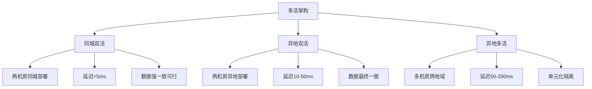
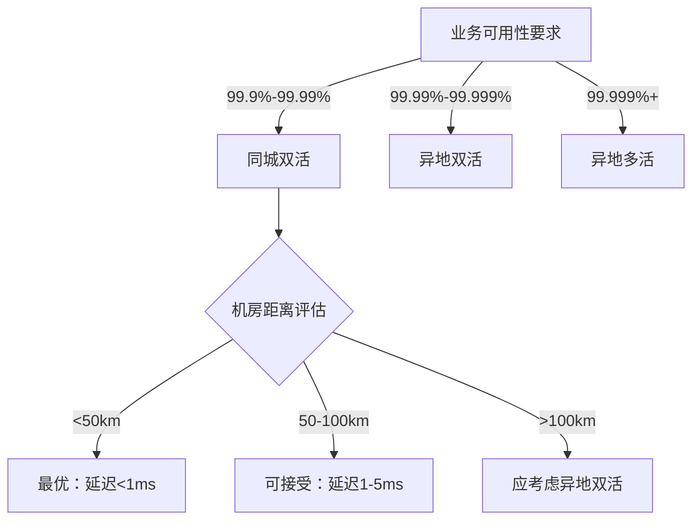
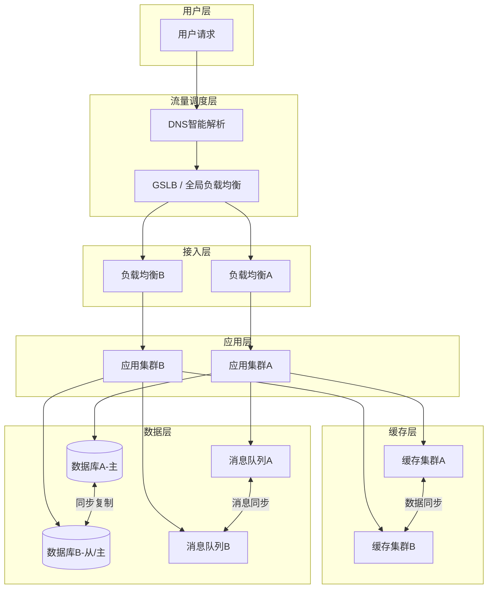
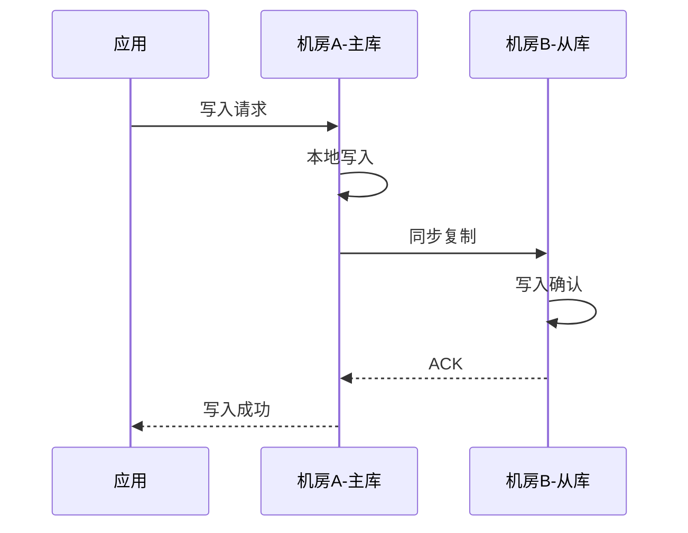
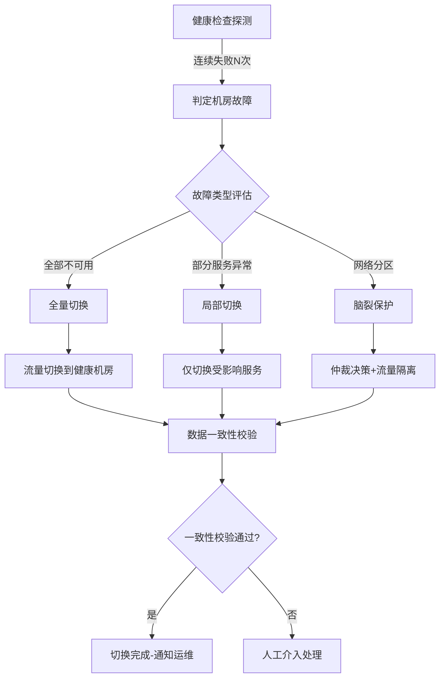
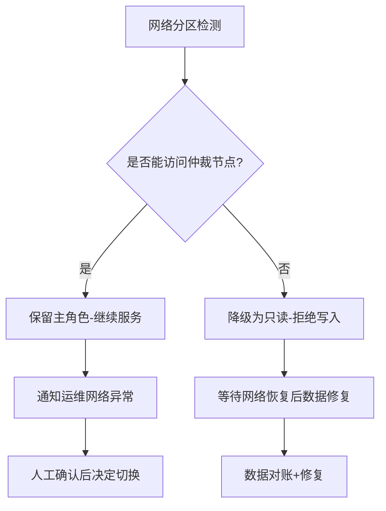
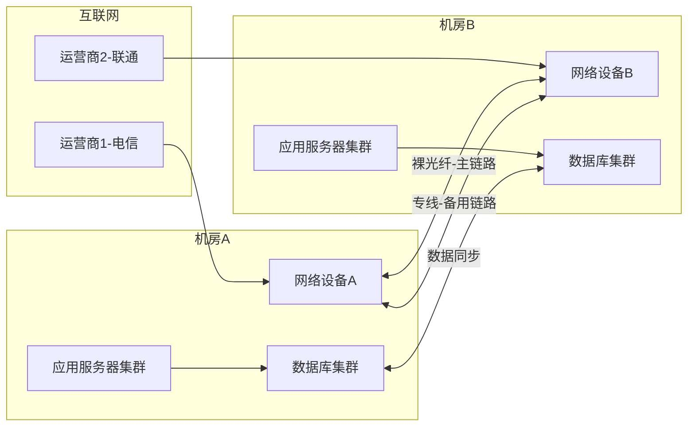
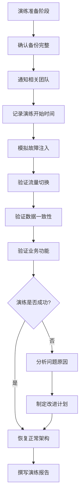
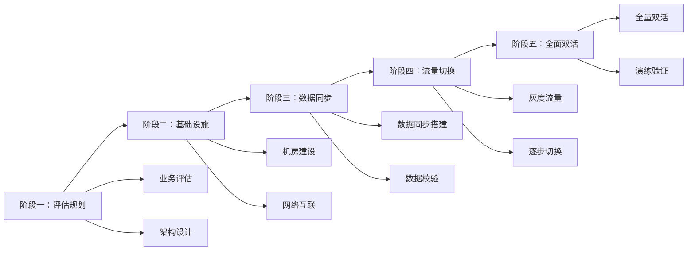
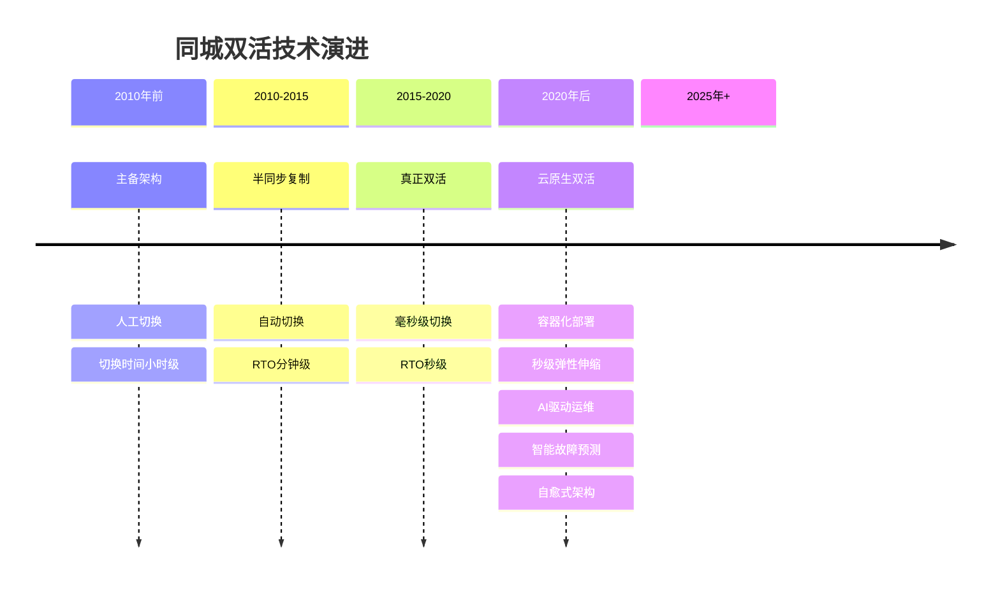

# 同城双活架构

## 一、什么是同城双活

### 1.1 定义与核心概念

同城双活（City-Level Dual-Active）是指在同一座城市（或 100 公里范围以内）部署两套相互独立但数据实时同步的生产中心，**两个中心同时承担线上流量**，当其中一个中心发生故障时，另一个中心能够即时接管全部业务，用户几乎无感知。

与传统的「主备架构」（Active-Standby）不同，同城双活有三个核心特征：

| 特征 | 含义 | 与主备架构的区别 |
|---|---|---|
| **双活** | 两个数据中心都在处理真实业务流量，而非一个工作、一个闲置 | 主备模式下备机房平时不承载流量，资源利用率低 |
| **同城** | 两个机房位于同一城市或 100 公里范围以内，光纤往返延迟通常在 1ms 以内 | 同城意味着可以实现数据强一致性，这是异地架构做不到的 |
| **实时同步** | 数据在两个中心之间保持同步（强一致或最终一致），确保故障切换时不丢数据 | 主备模式通常异步复制，切换时可能丢失少量数据 |

### 1.2 为什么需要同城双活

在单数据中心架构下，一旦机房遭遇火灾、断电、网络割接、硬件批量故障等灾难，整个业务将完全不可用。对于金融、电商、支付等对可用性要求极高的系统，这种风险是不可接受的。

同城双活解决的核心问题：

| 单活架构的风险 | 同城双活的解决方案 | 量化收益 |
|---|---|---|
| 机房级故障导致业务全部中断 | 两个机房互为备份，故障自动切换 | 年度可用性从 99.95% 提升到 99.99% |
| 故障恢复时间长（小时级） | 秒级甚至毫秒级自动切换 | RTO 从 4 小时缩短到 < 30 秒 |
| 数据在单一机房，丢失风险高 | 数据实时同步至两个机房，双重保障 | RPO 从小时级缩短到秒级甚至零丢失 |
| 扩容只能垂直扩展 | 两个机房均可横向扩展容量 | 峰值处理能力翻倍 |

**何时需要同城双活？** 满足以下任一条件就应认真考虑：

- 业务可用性要求 ≥ 99.99%（年停机 < 52 分钟）
- 单次故障造成的经济损失超过同城双活的年化增量成本
- 监管合规要求（金融、支付等行业有明确的容灾标准）
- 用户规模达到百万级 DAU 以上，单机房已无法满足峰值负载

### 1.3 与其他多活模式的定位

多活架构按地理分布可分为三个层级，同城双活是其中最基础、也最成熟的一种：



| 架构模式 | 典型距离 | 网络延迟 | 数据一致性 | 复杂度 | 年化成本增量 | 适用场景 |
|---|---|---|---|---|---|---|
| 同城双活 | <100km | 0.5-5ms | 强一致可行 | 中等 | +50%-80% | 城市级容灾，99.99% 可用性 |
| 异地双活 | 500-1500km | 10-50ms | 最终一致 | 较高 | +100%-150% | 跨区域容灾，多活读写 |
| 异地多活 | 跨国/洲际 | 50-200ms+ | 因果一致 | 极高 | +200%-400% | 全球化业务，单元化部署 |

**选型决策路径：**



---

## 二、架构设计原理

### 2.1 整体架构拓扑

同城双活的典型架构包含六个核心层次，从用户请求到数据落盘形成完整的链路：



**各层职责：**

| 层次 | 核心组件 | 职责 | 关键设计点 |
|---|---|---|---|
| 流量调度层 | GSLB + DNS | 将用户请求分发到合适的机房 | 健康检查、智能路由、故障自动切换 |
| 接入层 | 四/七层负载均衡 | 机房内流量分发 | 会话保持、SSL 卸载、限流熔断 |
| 应用层 | 无状态应用集群 | 业务逻辑处理 | 无状态设计、配置中心统一管理 |
| 缓存层 | Redis 集群 | 热点数据缓存、会话存储 | 跨机房同步策略、缓存预热机制 |
| 数据层 | MySQL + MQ | 核心数据存储和异步通信 | 数据同步方式、一致性保障 |
| 运维层 | 监控/告警/日志 | 全链路可观测 | 统一监控面板、跨机房日志聚合 |

### 2.2 流量分配策略

同城双活中，流量分配是最关键的设计决策之一。不同的分配策略直接影响数据一致性、切换效率和系统复杂度。

**模式一：按比例分配**

将流量按固定比例分配到两个机房，例如 50:50 或 40:60。适用于两个机房承载能力相当的场景。

```python
# GSLB 流量分配配置示例（Nginx upstream 风格）
traffic_rules = {
    "primary_ratio": 0.5,        # 机房A承担50%流量
    "secondary_ratio": 0.5,      # 机房B承担50%流量
    "health_check_interval": 5,  # 健康检查间隔(秒)
    "failover_threshold": 3,     # 连续失败次数触发切换
    "failback_delay": 60,        # 故障恢复后延迟回切(秒)
}
```

**适用场景：** 读多写少的通用业务，两个机房硬件配置对等。
**风险点：** 跨机房读写频繁，数据一致性挑战大。

**模式二：按用户/地域分配**

根据用户 ID、IP 地址或其他维度，将不同用户路由到不同机房。同一用户的所有请求都落在同一个机房，数据局部性最好。

```python
# 基于用户ID的一致性哈希路由
def route_to_dc(user_id: str, dc_a_weight: int = 50, dc_b_weight: int = 50) -> str:
    """
    一致性哈希：将用户ID映射到指定机房
    确保同一用户的读写都在同一个数据中心
    """
    hash_val = consistent_hash(user_id, replicas=100)
    if hash_val < dc_a_weight:
        return "dc_a"
    else:
        return "dc_b"

def consistent_hash(key: str, replicas: int = 100) -> int:
    """简化的哈希分片实现"""
    import hashlib
    h = hashlib.md5(f"{key}_shard".encode()).hexdigest()
    return int(h, 16) % 100
```

**适用场景：** 有状态的用户业务，如电商、社交、金融。
**注意：** 需要处理用户迁移场景（机房缩容/扩容时的流量再分配）。

**模式三：按业务/服务分配**

不同业务系统分配到不同机房。例如：核心交易系统在机房A，数据分析系统在机房B。适合业务间耦合度较低的场景。

```yaml
# 业务维度的机房分配配置
service_routing:
  # 核心交易类（机房A为主）
  - service: order-service
    primary_dc: dc_a
    secondary_dc: dc_b
    mode: active-passive  # 核心交易采用主备模式
    
  # 用户服务类（双活）
  - service: user-service
    primary_dc: dc_a
    secondary_dc: dc_b
    mode: active-active  # 用户服务双活
    
  # 数据分析类（机房B为主）
  - service: analytics-service
    primary_dc: dc_b
    secondary_dc: dc_a
    mode: active-passive
```

**三种模式对比：**

| 分配策略 | 优点 | 缺点 | 适用场景 | 数据一致性 |
|---|---|---|---|---|
| 按比例分配 | 简单直观，负载均衡 | 跨机房读写频繁，一致性挑战大 | 读多写少的通用业务 | 需要最终一致 |
| 按用户分配 | 数据局部性好，一致性易保证 | 用户迁移复杂，热点问题 | 有状态的用户业务 | 可实现强一致 |
| 按业务分配 | 业务隔离清晰，互不干扰 | 跨机房调用链长，延迟高 | 业务间低耦合场景 | 因业务而异 |

### 2.3 数据同步机制

数据同步是同城双活的**技术核心**，直接决定了系统的数据一致性和切换时的数据完整性。

#### 2.3.1 数据库同步

同城双活中，数据库同步主要有三种方式，各有优劣：

**同步复制（Synchronous Replication）**

写操作在主库完成后，必须等待从库也确认写入成功，才向客户端返回成功。数据零丢失，但写入延迟增加。



MySQL 中通过半同步复制（Semi-Sync）实现，这是同城双活最常用的方案：

```sql
-- MySQL半同步复制配置
-- 主库配置
INSTALL PLUGIN rpl_semi_sync_master SONAME 'semisync_master.so';
SET GLOBAL rpl_semi_sync_master_enabled = 1;
SET GLOBAL rpl_semi_sync_master_timeout = 1000;  -- 1秒超时，降级为异步
SET GLOBAL rpl_semi_sync_master_wait_for_slave_count = 1;  -- 至少1个从库确认

-- 从库配置
INSTALL PLUGIN rpl_semi_sync_slave SONAME 'semisync_slave.so';
SET GLOBAL rpl_semi_sync_slave_enabled = 1;
```

**异步复制（Asynchronous Replication）**

主库写入成功后立即返回，不等待从库确认。延迟低，但存在数据丢失风险。仅适用于可容忍少量数据丢失的场景。

**半同步复制（Semi-Synchronous Replication）**

介于同步和异步之间：写操作至少要被一个从库接收并写入 relay log 后才返回成功。兼顾一致性和性能，是同城双活的**推荐方案**。

**三种复制方式对比：**

| 复制方式 | 数据丢失风险 | 写入延迟影响 | 实现复杂度 | 适用场景 |
|---|---|---|---|---|
| 同步复制 | 零丢失 | +1-5ms | 低 | 金融核心交易、账务系统 |
| 半同步复制 | 极低（超时降级） | +0.5-2ms | 中 | 电商、支付、通用核心业务 |
| 异步复制 | 可能丢失少量数据 | 几乎无影响 | 低 | 读多写少、容忍少量丢失的日志类数据 |

#### 2.3.2 缓存同步

Redis 缓存的跨机房同步是同城双活的另一个关键环节：

**方案一：Redis 双写**

应用同时向两个机房的 Redis 写入数据，读取时优先读本地缓存。

```python
import redis
import threading
from typing import Optional

class DualRedisCache:
    """同城双活缓存管理器"""
    
    def __init__(self, redis_a: redis.Redis, redis_b: redis.Redis, 
                 local_dc: str = "a", cross_dc_latency_ms: float = 1.0):
        self.redis_a = redis_a  # 机房A的Redis
        self.redis_b = redis_b  # 机房B的Redis
        self.local_dc = local_dc
        self.cross_dc_latency_ms = cross_dc_latency_ms
    
    def set(self, key: str, value: str, ttl: int = 3600, 
            async_cross_dc: bool = True) -> None:
        """
        双写：同时写入两个机房的缓存
        async_cross_dc=True 时，远端写入异步执行，降低写入延迟
        """
        local_redis = self._get_local_redis()
        
        # 本地写入（同步）
        local_redis.setex(key, ttl, value)
        
        # 远端写入
        if async_cross_dc:
            # 异步写入远端，不阻塞主流程
            thread = threading.Thread(
                target=self._async_remote_set,
                args=(key, value, ttl)
            )
            thread.daemon = True
            thread.start()
        else:
            # 同步写入远端，保证强一致
            remote_redis = self._get_remote_redis()
            remote_redis.setex(key, ttl, value)
    
    def _async_remote_set(self, key: str, value: str, ttl: int) -> None:
        """异步写入远端缓存，带重试机制"""
        remote_redis = self._get_remote_redis()
        for attempt in range(3):
            try:
                remote_redis.setex(key, ttl, value)
                return
            except redis.ConnectionError:
                if attempt < 2:
                    import time
                    time.sleep(0.1 * (attempt + 1))
    
    def get(self, key: str) -> Optional[str]:
        """优先读本地缓存，miss时读远端"""
        local_redis = self._get_local_redis()
        remote_redis = self._get_remote_redis()
        
        value = local_redis.get(key)
        if value is not None:
            return value
        
        # 本地未命中，读远端
        value = remote_redis.get(key)
        if value is not None:
            # 回填本地缓存
            local_redis.setex(key, 3600, value)
        return value
    
    def _get_local_redis(self) -> redis.Redis:
        return self.redis_a if self.local_dc == "a" else self.redis_b
    
    def _get_remote_redis(self) -> redis.Redis:
        return self.redis_b if self.local_dc == "a" else self.redis_a
```

**方案二：Redis Cluster 跨机房部署**

将 Redis Cluster 的部分分片部署在机房A，部分部署在机房B，通过 Cluster 内部的同步机制实现数据一致性。需要注意跨机房的 Cluster 节点间通信会增加延迟。

**方案三：Redis Sentinel 跨机房**

```yaml
# Redis Sentinel 跨机房配置
sentinel monitor mymaster dc-a-redis 6379 2  # 需要2个哨兵确认
sentinel down-after-milliseconds mymaster 5000
sentinel failover-timeout mymaster 30000
sentinel parallel-syncs mymaster 1

# 机房B的Sentinel也监控dc-a的主节点
# 实现跨机房的自动故障转移
```

| 缓存同步方案 | 一致性 | 延迟影响 | 复杂度 | 适用场景 |
|---|---|---|---|---|
| Redis 双写 | 最终一致 | +0.5-1ms | 低 | 通用场景，可容忍短暂不一致 |
| Redis Cluster 跨机房 | 强一致（分片内） | +1-3ms | 高 | 大规模缓存集群 |
| Redis Sentinel 跨机房 | 强一致（故障转移时） | +1-2ms | 中 | 中小规模，需要自动故障转移 |

### 2.4 故障切换机制

同城双活的故障切换需要做到快速、准确、可回滚：



**健康检查的多维度设计：**

```yaml
health_check:
  # 基础层检查
  infrastructure:
    - type: ICMP
      target: db-master
      interval: 1s
      timeout: 500ms
      
  # 数据库层检查
  database:
    - type: TCP
      target: db-master:3306
      interval: 2s
      timeout: 1s
    - type: SQL
      query: "SELECT 1"
      interval: 5s
      timeout: 2s
      
  # 应用层检查
  application:
    - type: HTTP
      url: /health
      interval: 5s
      timeout: 3s
      expected_status: 200
    - type: HTTP
      url: /health/deep  # 深度检查：验证依赖服务
      interval: 30s
      timeout: 10s
      
  # 缓存层检查
  cache:
    - type: Redis_PING
      interval: 2s
      timeout: 500ms
```

**关键设计要点：**

1. **健康检查**：多维度探测（HTTP 接口、TCP 端口、数据库连接、Redis 可达性），避免单维度误判
2. **切换决策**：需要多数派仲裁，防止脑裂（两个机房都认为对方故障，同时接管流量）
3. **切换时间**：目标 RTO（恢复时间目标）< 30 秒，通过预热、预加载等手段缩短
4. **回滚能力**：切换后支持一键回滚到原机房，切换窗口期保留双向同步

**切换时序控制：**

```python
class FailoverOrchestrator:
    """故障切换编排器"""
    
    def __init__(self):
        self切换步骤 = [
            ("停止写入故障机房", self.stop_writes_to_failed_dc),
            ("等待数据同步完成", self.wait_sync_drain),
            ("提升健康机房为读写", self.promote_healthy_dc),
            ("切换GSLB流量", self.switch_traffic),
            ("缓存预热", self.warmup_cache),
            ("验证数据一致性", self.verify_consistency),
        ]
    
    def execute_failover(self, failed_dc: str, healthy_dc: str):
        """执行完整的故障切换流程"""
        for step_name, step_func in self.切换步骤:
            print(f"执行: {step_name}")
            success = step_func(failed_dc, healthy_dc)
            if not success:
                print(f"失败: {step_name}，执行回滚")
                self.rollback()
                return False
        print("故障切换完成")
        return True
    
    def stop_writes_to_failed_dc(self, failed_dc, healthy_dc):
        """停止向故障机房写入"""
        # 更新路由配置，将写流量导向健康机房
        return update_routing(failed_dc, "read-only")
    
    def wait_sync_drain(self, failed_dc, healthy_dc, timeout_s=10):
        """等待同步复制队列排空"""
        # 检查复制延迟是否归零
        return wait_replication_catchup(timeout_s)
    
    def promote_healthy_dc(self, failed_dc, healthy_dc):
        """提升健康机房为读写主节点"""
        # 执行数据库提升操作
        return promote_to_primary(healthy_dc)
```

---

## 三、核心挑战与解决方案

### 3.1 数据一致性问题

**问题描述**

同城双活中，两个机房同时处理写请求，可能产生数据冲突。例如：用户在机房A修改了订单状态，同时在机房B也被修改，如何保证最终数据正确？

**解决方案对比：**

| 策略 | 原理 | 优点 | 缺点 | 适用场景 |
|---|---|---|---|---|
| 分片路由 | 同一用户/数据只在一个机房写入 | 无冲突，一致性好 | 流量分配不均，扩容复杂 | 有明确分片键的业务 |
| 最后写入胜出（LWW） | 以时间戳最新的写入为准 | 实现简单 | 可能丢失合法更新 | 可容忍更新丢失的场景 |
| 合并冲突 | 自定义冲突解决逻辑 | 保全所有更新 | 业务侵入性强 | 需要精确控制的业务 |
| 版本向量 | 记录每个副本的更新历史 | 精确检测冲突 | 实现复杂，存储开销大 | 分布式数据库 |

**推荐实践：分片路由 + 兜底冲突处理**

```python
# 用户维度的分片路由
class UserShardRouter:
    def __init__(self, dc_a_range=(0, 49999), dc_b_range=(50000, 99999)):
        self.dc_a_range = dc_a_range
        self.dc_b_range = dc_b_range
    
    def get_dc(self, user_id: int) -> str:
        """根据用户ID的末5位决定归属机房"""
        shard = user_id % 100000
        if self.dc_a_range[0] <= shard <= self.dc_a_range[1]:
            return "dc_a"
        return "dc_b"
    
    def get_write_dc(self, user_id: int) -> str:
        """写请求强制路由到归属机房"""
        return self.get_dc(user_id)
    
    def get_read_dc(self, user_id: int, preferred_dc: str = None) -> str:
        """读请求优先读归属机房，支持降级到对端"""
        if preferred_dc:
            return preferred_dc
        return self.get_dc(user_id)
    
    def can_migrate_user(self, user_id: int, target_dc: str) -> bool:
        """检查用户是否可以迁移到目标机房"""
        current_dc = self.get_dc(user_id)
        if current_dc == target_dc:
            return False  # 已在目标机房
        # 检查是否有未同步的数据
        return not has_pending_writes(user_id)
```

### 3.2 脑裂问题

**问题描述**

当两个机房之间的网络中断（但各自内部正常）时，可能出现「脑裂」——两个机房都认为对方故障，同时作为主节点接受写入。网络恢复后，两个机房的数据不一致，难以恢复。

**解决方案：多数派仲裁**



**典型仲裁方案：**

- **第三方机房仲裁**：在同城第三个机房部署仲裁节点，两个数据机房都向其发送心跳
- **共享存储仲裁**：使用共享的 ZooKeeper / etcd 集群作为仲裁
- **Quorum 机制**：写操作需要多数节点确认才算成功

```yaml
# ZooKeeper 集群仲裁配置
# 三个节点：机房A、机房B、机房C（仲裁节点）
ensemble:
  - server.1=dc-a-zk1:2888:3888
  - server.2=dc-b-zk1:2888:3888
  - server.3=dc-c-zk1:2888:3888  # 仲裁节点
quorum:
  min_nodes: 2  # 至少2个节点存活才可写
  election算法: fastleader
```

**脑裂防护的工程实践：**

```python
class SplitBrainProtector:
    """脑裂防护器"""
    
    def __init__(self, dc_id: str, zk_hosts: list):
        self.dc_id = dc_id
        self.zk_hosts = zk_hosts
        self.is_primary = False
    
    def check_quorum(self) -> bool:
        """检查是否满足多数派条件"""
        alive_nodes = 0
        for host in self.zk_hosts:
            if self._ping(host):
                alive_nodes += 1
        
        # 至少需要 (N/2 + 1) 个节点存活
        required = len(self.zk_hosts) // 2 + 1
        return alive_nodes >= required
    
    def on_network_partition(self):
        """网络分区发生时的处理"""
        if self.check_quorum():
            # 能访问多数派，保留主角色
            self.is_primary = True
            self._notify_ops("网络分区，本机房保留主角色")
        else:
            # 无法访问多数派，降级为只读
            self.is_primary = False
            self._enter_readonly_mode()
            self._notify_ops("网络分区，本机房降级为只读")
    
    def _enter_readonly_mode(self):
        """进入只读模式"""
        # 禁止所有写入操作
        # 仅允许读取已同步的数据
        pass
```

### 3.3 缓存与数据库不一致

**问题描述**

在故障切换过程中，缓存中的数据可能与数据库不一致。例如：机房A写入了新数据但缓存同步失败，切换到机房B后，机房B的缓存中还是旧数据。

**解决方案：多层次缓存一致性保障**

```python
class CacheConsistencyManager:
    """缓存一致性管理器"""
    
    def __init__(self, redis_client, db_client):
        self.redis = redis_client
        self.db = db_client
    
    def on_dc_switch(self, strategy: str = "hybrid"):
        """机房切换时的缓存处理"""
        if strategy == "warmup":
            self.warmup_cache_from_db()
        elif strategy == "short_ttl":
            self.short_ttl_approach()
        else:
            # 混合策略：热点数据预热 + 其余短TTL
            self.warmup_hot_keys()
            self.short_ttl_approach()
    
    def warmup_hot_keys(self):
        """预热热点缓存"""
        hot_keys = self.db.query(
            "SELECT key, value FROM cache_table "
            "WHERE access_count > 1000 AND updated_at > NOW() - INTERVAL 1 HOUR"
        )
        pipe = self.redis.pipeline()
        for key, value in hot_keys:
            pipe.setex(key, 7200, value)  # 2小时过期
        pipe.execute()
    
    def short_ttl_approach(self):
        """短期TTL策略：切换后缩短缓存过期时间"""
        # 将热点缓存的TTL从1小时缩短到60秒
        # 通过读穿透机制，缓存过期后自动从数据库加载最新数据
        self.redis.config_set("cache_short_ttl", 60)
    
    def verify_consistency(self, sample_size: int = 100) -> dict:
        """校验缓存与数据库的一致性"""
        inconsistent = 0
        samples = self.redis.randomkeys(sample_size)
        
        for key in samples:
            cached = self.redis.get(key)
            db_value = self.db.query(
                "SELECT value FROM cache_table WHERE key = %s", key
            )
            if cached != db_value:
                inconsistent += 1
                # 以数据库为准，更新缓存
                self.redis.setex(key, 3600, db_value)
        
        return {
            "total_samples": sample_size,
            "inconsistent": inconsistent,
            "consistency_rate": (sample_size - inconsistent) / sample_size
        }
```

### 3.4 消息队列的双活挑战

同城双活中，消息队列（如 Kafka、RocketMQ）的数据同步也是一个容易被忽视但极其重要的环节。

**核心问题：**

- 机房A产生的消息，机房B的消费者能否及时消费？
- 故障切换后，未消费的消息是否会丢失？
- 消费者的消费位点（offset）如何在两个机房之间同步？

**解决方案：**

```yaml
# Kafka 跨机房同步配置
replication:
  # 跨机房复制因子
  replication_factor: 2
  # 同步副本数量
  min_insync_replicas: 2
  # 允许的 ISR 缩减数量
  unclean_leader_election_enable: false
  
# 消费者位点同步
consumer:
  # 使用外部存储（如 Redis）同步消费位点
  offset_storage: redis
  sync_interval: 5s
```

---

## 四、实战落地要点

### 4.1 机房选型与网络

同城双活对两个机房有明确的要求：

| 要求项 | 具体标准 | 说明 | 验证方法 |
|---|---|---|---|
| 地理距离 | 10-50公里为最佳 | 太近无法防区域性灾难，太远延迟增大 | 地图测量+实地考察 |
| 网络延迟 | 往返 < 5ms | 通过裸光纤或专线连接 | 持续 ping 测试（至少24小时） |
| 网络带宽 | >= 10Gbps | 数据同步需要足够带宽 | iperf3 压测 |
| 独立电力 | 各机房独立供电+UPS | 不能共用同一电力系统 | 查阅机房电力架构图 |
| 独立网络 | 不共用同一光缆路由 | 避免单点光缆故障同时影响两个机房 | 网络拓扑审查 |
| 运维团队 | 各机房有独立运维能力 | 避免运维人员成为单点 | 团队架构评估 |
| 冗余链路 | 至少两条独立物理链路 | 主备链路，避免单点故障 | 链路故障切换测试 |

**网络架构设计：**



**网络质量监控：**

```bash
#!/bin/bash
# 跨机房网络质量监控脚本
DC_A_IP="10.1.1.1"
DC_B_IP="10.2.1.1"

while true; do
    # 延迟监控
    latency=$(ping -c 10 $DC_B_IP | tail -1 | awk -F '/' '{print $5}')
    echo "$(date): Cross-DC latency = ${latency}ms"
    
    # 带宽测试（每小时执行一次）
    if [ $(date +%M) -eq 0 ]; then
        iperf3 -c $DC_B_IP -t 10 -P 4 > /var/log/bandwidth_test.log
    fi
    
    # 丢包率监控
    packet_loss=$(ping -c 100 $DC_B_IP | grep "packet loss" | awk '{print $6}')
    echo "$(date): Packet loss = ${packet_loss}"
    
    sleep 60
done
```

### 4.2 数据库高可用配置

以 MySQL 为例，同城双活的典型部署方案：

**方案一：双主复制 + VIP 漂移**

```sql
-- 机房A (Server ID = 1)
-- my.cnf 配置
[mysqld]
server-id = 1
log-bin = mysql-bin
binlog-format = ROW
auto-increment-increment = 2
auto-increment-offset = 1    -- A机房: 1,3,5,7...
gtid-mode = ON
enforce-gtid-consistency = ON

-- 机房B (Server ID = 2)
-- my.cnf 配置
[mysqld]
server-id = 2
log-bin = mysql-bin
binlog-format = ROW
auto-increment-increment = 2
auto-increment-offset = 2    -- B机房: 2,4,6,8...
gtid-mode = ON
enforce-gtid-consistency = ON
```

通过 `auto-increment-increment=2` 和不同的 offset，避免两个主库的自增 ID 冲突。使用 GTID（Global Transaction ID）简化复制管理和故障切换。

**方案二：MGR（MySQL Group Replication）**

```sql
-- 配置 MGR 单主模式
SET GLOBAL group_replication_single_primary_mode = TRUE;
SET GLOBAL group_replication_enforce_update_everywhere_checks = FALSE;

-- 启动复制组
CHANGE REPLICATION SOURCE TO
  GROUP_REPLICATION_GROUP_NAME = 'aaaaaaaa-bbbb-cccc-dddd-eeeeeeeeeeee',
  GROUP_REPLICATION_START_ON_BOOT = OFF;

START GROUP_REPLICATION;
```

MGR 的优势在于内置了冲突检测和自动故障切换，更适合同城双活场景。

**方案三：Galera Cluster**

```ini
# Galera Cluster 配置
[mysqld]
binlog_format = ROW
default-storage-engine = InnoDB
innodb_autoinc_lock_mode = 2
bind-address = 0.0.0.0

# Galera Provider Configuration
wsrep_on = ON
wsrep_provider = /usr/lib64/galera/libgalera_smm.so
wsrep_cluster_name = "dual_active_cluster"
wsrep_cluster_address = "gcomm://dc-a-node1,dc-b-node1"
wsrep_node_name = "dc-a-node1"
wsrep_node_address = "10.1.1.1"
```

| 方案 | 数据一致性 | 故障切换 | 性能影响 | 运维复杂度 |
|---|---|---|---|---|
| 双主复制 | 强一致（半同步） | 需要手动/脚本切换 | +1-2ms | 中 |
| MGR 单主 | 强一致 | 自动切换 | +1-3ms | 中高 |
| Galera Cluster | 强一致 | 自动切换 | +2-5ms | 高 |

### 4.3 监控与告警体系

同城双活需要建立全方位的监控体系：

```yaml
# 监控指标体系
monitoring:
  # 机房级别指标
  datacenter:
    - name: 健康状态
      check: HTTP /health 探测
      interval: 5s
      alert_threshold: 连续3次失败
    
    - name: 数据同步延迟
      check: SHOW SLAVE STATUS 的 Seconds_Behind_Master
      interval: 10s
      alert_threshold: > 1s（告警），> 5s（紧急）
    
    - name: 跨机房网络延迟
      check: ICMP ping + 业务探针
      interval: 1s
      alert_threshold: > 3ms

  # 应用级别指标
  application:
    - name: 请求成功率
      check: HTTP 2xx / 总请求
      interval: 30s
      alert_threshold: < 99.9%
    
    - name: P99 响应时间
      check: 应用APM监控
      interval: 30s
      alert_threshold: > 500ms
    
    - name: 错误率
      check: HTTP 5xx / 总请求
      interval: 30s
      alert_threshold: > 0.1%

  # 数据级别指标
  data:
    - name: 数据一致性
      check: 定期对账任务
      interval: 5min
      alert_threshold: 不一致记录 > 0
    
    - name: 慢查询数量
      check: MySQL slow_log
      interval: 1min
      alert_threshold: > 10/min
    
    - name: 复制队列深度
      check: Seconds_Behind_Master
      interval: 10s
      alert_threshold: > 3s
```

**统一监控面板设计：**

┌─────────────────────────────────────────────────────────────┐
│                    同城双活监控大盘                           │
├───────────────────────┬─────────────────────────────────────┤
│  机房A状态            │  机房B状态                          │
│  ├── 健康: ✓         │  ├── 健康: ✓                        │
│  ├── QPS: 12,500     │  ├── QPS: 11,800                   │
│  ├── 延迟P99: 45ms   │  ├── 延迟P99: 52ms                 │
│  └── 错误率: 0.02%   │  └── 错误率: 0.03%                 │
├───────────────────────┴─────────────────────────────────────┤
│  跨机房同步                                                    │
│  ├── 数据同步延迟: 0.8ms ✓                                   │
│  ├── 复制队列: 0 条 ✓                                        │
│  └── 数据一致性: 100% ✓                                       │
├─────────────────────────────────────────────────────────────┤
│  流量分布                                                    │
│  ├── 机房A: 51.2%  ████████████████░░░░░░                   │
│  └── 机房B: 48.8%  ███████████████░░░░░░░                   │
└─────────────────────────────────────────────────────────────┘

### 4.4 故障切换演练

同城双活架构必须定期进行故障切换演练，验证系统的实际容灾能力：



**演练清单：**

| 演练项目 | 验证内容 | 通过标准 | 演练频率 |
|---|---|---|---|
| 机房A整体断电 | 流量是否自动切换到机房B | 切换时间 < 30秒 | 每季度 |
| 数据库主从切换 | 数据是否完整、无丢失 | 切换后数据对账一致 | 每月 |
| 网络中断 | 脑裂保护是否生效 | 写入被正确隔离 | 每季度 |
| 缓存失效 | 缓存预热是否正常 | 缓存命中率恢复 > 95% | 每月 |
| 部分服务故障 | 局部切换是否正常 | 仅受影响服务切换 | 每月 |
| 全链路压测 | 峰值负载下的容灾能力 | 切换后性能无明显下降 | 每半年 |

**演练报告模板：**

```markdown
# 故障切换演练报告

## 基本信息
- 演练时间：2024-XX-XX XX:XX - XX:XX
- 演练类型：机房A整体断电模拟
- 参与团队：SRE、DBA、业务开发

## 演练过程
1. 14:00 模拟机房A断电
2. 14:00:05 健康检查检测到异常
3. 14:00:15 流量开始切换
4. 14:00:28 流量切换完成
5. 14:01:00 数据一致性校验完成

## 演练结果
- 切换时间：23秒（目标 < 30秒）✓
- 数据丢失：0条 ✓
- 业务影响：无感知 ✓

## 发现的问题
1. 缓存预热耗时较长（8秒），可优化
2. 部分用户会话丢失

## 改进计划
1. 优化缓存预热脚本
2. 实现会话同步机制
```

### 4.5 迁移策略：从单活到同城双活

将现有单活系统迁移到同城双活是一个渐进式的过程，需要精心规划：



| 阶段 | 核心任务 | 时间周期 | 关键产出 |
|---|---|---|---|
| 评估规划 | 业务影响分析、架构设计、成本预算 | 2-4周 | 架构设计文档、ROI分析 |
| 基础设施 | 机房建设/租赁、网络互联、硬件部署 | 4-8周 | 机房就绪、网络测试报告 |
| 数据同步 | 数据库同步搭建、数据校验 | 2-4周 | 数据同步验证报告 |
| 流量切换 | 灰度切换、逐步切流 | 2-4周 | 切换操作手册、监控告警 |
| 全面双活 | 全量双活、演练验证 | 2-4周 | 演练报告、运维手册 |

**迁移过程中的风险控制：**

- **灰度切换**：从 1% 流量开始，逐步增加到 50%
- **实时对账**：每小时对两个机房的数据进行对账
- **快速回滚**：任何异常立即回滚到单活模式
- **业务低峰**：选择业务低峰期进行关键切换操作

---

## 五、成本分析与ROI

### 5.1 成本构成

同城双活的成本增量主要包括以下几个方面：

| 成本项 | 具体内容 | 占比 | 说明 |
|---|---|---|---|
| 基础设施 | 机房租赁、服务器、网络设备 | 40%-50% | 无需完全对等，可按6:4配置 |
| 网络专线 | 裸光纤或专线费用 | 15%-20% | 10Gbps专线年费约50-100万 |
| 运维人力 | 增加DBA、SRE人员 | 15%-20% | 至少增加2-3人 |
| 软件许可 | 数据库、中间件许可 | 10%-15% | 双机房需要双份许可 |
| 演练成本 | 定期演练的业务影响 | 5%-10% | 每季度一次全量演练 |

### 5.2 ROI 计算模型

```python
def calculate_roi(
    annual_revenue: float,           # 年营收
    current_availability: float,     # 当前可用性（如99.95%）
    target_availability: float,      # 目标可用性（如99.99%）
    dual_active_cost: float          # 同城双活年化成本
) -> dict:
    """计算同城双活的ROI"""
    
    # 计算年停机时间
    current_downtime_hours = (1 - current_availability) * 8760
    target_downtime_hours = (1 - target_availability) * 8760
    
    # 计算年损失
    hourly_loss = annual_revenue / 8760
    current_annual_loss = current_downtime_hours * hourly_loss
    target_annual_loss = target_downtime_hours * hourly_loss
    
    # 计算收益和ROI
    annual_benefit = current_annual_loss - target_annual_loss
    roi = (annual_benefit - dual_active_cost) / dual_active_cost
    
    return {
        "当前年停机时间": f"{current_downtime_hours:.1f}小时",
        "目标年停机时间": f"{target_downtime_hours:.1f}小时",
        "当前年损失": f"{current_annual_loss:.0f}元",
        "目标年损失": f"{target_annual_loss:.0f}元",
        "年收益": f"{annual_benefit:.0f}元",
        "同城双活年成本": f"{dual_active_cost:.0f}元",
        "ROI": f"{roi:.1%}"
    }

# 示例：年营收1亿的电商
result = calculate_roi(
    annual_revenue=100_000_000,
    current_availability=0.9995,
    target_availability=0.9999,
    dual_active_cost=5_000_000
)
print(result)
# 输出：
# 当前年停机时间: 4.4小时
# 目标年停机时间: 0.9小时
# 年收益: 3,977,396元
# ROI: -20.5% (需要进一步评估非量化收益)
```

### 5.3 非量化收益

除了直接的经济损失避免，同城双活还带来以下非量化收益：

- **品牌声誉保护**：避免因宕机导致的负面舆论
- **合规满足**：满足金融、支付等行业的监管要求
- **竞争壁垒**：更高的可用性是差异化竞争优势
- **团队能力提升**：建设双活的过程提升团队的分布式系统能力
- **技术积累**：为后续异地多活、全球化部署打下基础

---

## 六、经典案例

### 6.1 某大型电商同城双活实践

**背景：** 日均交易量 500 万笔，峰值 QPS 达到 2 万。单机房架构下，机房年度可用性仅 99.95%，曾因光纤施工中断导致 4 小时宕机。

**架构方案：**

机房A（望京）          机房B（亦庄）
┌─────────────┐      ┌─────────────┐
│  全量应用集群 │      │  全量应用集群 │
│  MySQL主库   │←同步→│  MySQL从库   │
│  Redis集群   │←同步→│  Redis集群   │
│  MQ集群      │←同步→│  MQ集群      │
└─────────────┘      └─────────────┘
         ↑                    ↑
         └──── GSLB调度 ─────┘

**核心数据：**

| 指标 | 改造前（单活） | 改造后（同城双活） |
|---|---|---|
| 年度可用性 | 99.95% | 99.99% |
| 故障切换时间 | 4小时（人工） | < 30秒（自动） |
| 数据丢失 | 可能丢失4小时 | RPO < 1秒 |
| 跨机房延迟 | 无 | 1.2ms |
| 年度基础设施成本 | 基准 | +60%（新增机房） |
| 峰值处理能力 | 2万QPS | 4万QPS（双机房叠加） |

**关键经验：**

1. **渐进式迁移**：先同步数据，再灰度切流，最后全量双活
2. **缓存是关键**：切换后缓存命中率从100%降到60%，通过预热脚本3分钟恢复到95%
3. **监控先行**：在双活之前就建立了完善的跨机房监控体系

### 6.2 某支付系统同城双活实践

**特殊挑战：** 支付系统对数据一致性要求极高（不允许任何资金差错），不能使用最终一致性方案。

**技术选型：**

- 数据库：MySQL 半同步复制（超时阈值 1 秒）
- 路由策略：用户维度分片（user_id % 2），确保同一用户的读写在同一个机房
- 缓存：Redis 主从 + 异步双写，切换时通过短 TTL + 读穿透保证一致性
- 切换：基于 ZooKeeper 的 Quorum 仲裁（3 节点，2/3 多数派）

**实施效果：**

改造后关键指标：
├── RTO (恢复时间目标): 15秒
├── RPO (数据丢失目标): 0（零丢失）
├── 跨机房延迟: 0.8ms
├── 日常切换演练成功率: 100%（连续12个月）
└── 真实故障切换案例: 3次（均成功）

**真实故障案例：**

2024年3月，机房A因市政施工导致光缆中断。系统自动检测到网络异常，触发脑裂保护机制，ZooKeeper仲裁判定机房A不可达，自动将流量切换到机房B。整个过程耗时18秒，用户无感知。光缆修复后，系统自动完成数据同步，恢复正常双活模式。

### 6.3 某银行同城双活实践

**背景：** 某城商行核心业务系统同城双活改造，涉及核心账务、信贷、支付等多个系统。

**技术特点：**

- 采用 MGR（MySQL Group Replication）实现多主复制
- 使用分布式事务框架（Seata）保证跨机房事务一致性
- 实现了"单元化"架构，每个机房独立处理完整业务链路

**改造周期：** 18个月（含评估、建设、迁移、验证）

**成本分析：**

| 成本项 | 金额（万元/年） | 占比 |
|---|---|---|
| 机房租赁 | 200 | 33% |
| 服务器及网络设备 | 150 | 25% |
| 网络专线 | 80 | 13% |
| 软件许可 | 70 | 12% |
| 人力成本 | 100 | 17% |
| **合计** | **600** | **100%** |

---

## 七、常见误区与最佳实践

### 7.1 常见误区

**误区一：同城双活 = 两个机房各部署一半服务**

同城双活不是简单地把服务分散部署。如果只部署了一半的服务，切换后另一半服务不可用，等于没有容灾能力。**正确做法是：两个机房都部署全量服务，按流量比例分配请求。**

**误区二：数据同步延迟不重要，最终一致就行**

同城双活的优势就在于低延迟带来的数据强一致性可能。如果退化为最终一致，不如直接做异地双活。**正确做法是：充分利用同城低延迟优势，采用同步或半同步复制。**

**误区三：做完同城双活就不需要演练了**

架构是设计出来的，但可靠性是练出来的。不做演练的同城双活，在真正故障时大概率会出问题。**正确做法是：至少每季度进行一次全量故障切换演练。**

**误区四：忽视脑裂问题**

网络分区导致的脑裂是同城双活最致命的风险。如果没有仲裁机制，两个机房同时写入将导致数据不可恢复。**正确做法是：部署独立的仲裁节点，实现 Quorum 机制。**

**误区五：认为同城双活成本只增加一倍**

同城双活的实际成本增加通常在 50%-80%（而非 100%），因为两个机房不需要完全对等。同时，还需要考虑运维人力、演练成本、网络专线费用等隐性成本。**正确做法是：做全面的 TCO（总拥有成本）分析。**

**误区六：只关注技术架构，忽视组织流程**

同城双活不仅是技术改造，更是组织流程的变革。如果没有配套的运维流程、应急预案、团队培训，技术架构再好也无法发挥价值。**正确做法是：技术改造与流程建设同步推进。**

### 7.2 最佳实践清单

| 领域 | 实践要点 | 优先级 |
|---|---|---|
| 架构设计 | 两个机房部署全量服务和数据，按用户或流量维度分配 | P0 |
| 数据同步 | 采用半同步复制，设置合理的超时阈值（建议1秒） | P0 |
| 脑裂防护 | 至少3个仲裁节点（奇数），采用 Quorum 多数派机制 | P0 |
| 缓存策略 | 读写穿透 + 短 TTL 预热，切换时执行缓存预热脚本 | P1 |
| 流量调度 | GSLB + DNS 双重保障，支持手动和自动切换 | P1 |
| 监控告警 | 数据同步延迟、跨机房延迟、数据一致性三大核心指标 | P1 |
| 故障演练 | 每季度至少一次全量切换演练，记录并改进 | P1 |
| 成本控制 | 主机房 60%，备机房 40%，无需完全对等 | P2 |
| 团队建设 | 建立跨机房运维能力，定期培训和知识共享 | P2 |
| 文档管理 | 维护完整的架构文档、操作手册、应急预案 | P2 |

---

## 八、技术演进与未来趋势



当前同城双活技术正在向以下方向演进：

- **云原生化**：基于 Kubernetes 的多集群联邦，实现跨机房的服务编排和弹性调度。通过 Cluster API 或 KubeFed 管理多个集群，实现统一的应用部署和运维。
- **数据同步增强**：基于 CDC（Change Data Capture）的实时数据同步，支持异构数据源。如 Debezium + Kafka 的架构，实现数据库变更的实时捕获和分发。
- **智能化运维**：AIOps 驱动的自动故障检测和切换决策，减少人工介入。通过机器学习模型预测潜在故障，提前进行预防性切换。
- **Serverless 双活**：函数计算级别的双活部署，按需启动，降低成本。云厂商的 FaaS 平台天然支持多可用区部署。
- **边缘计算融合**：将同城双活的理念延伸到边缘节点，实现更细粒度的就近服务。

同城双活作为多活架构的基础形态，是构建高可用分布式系统的必经之路。掌握同城双活的设计原理和实施要点，为后续的异地多活、全球化部署打下坚实基础。
