# 异地多活架构

## 一、什么是异地多活

异地多活（Geo-Distributed Multi-Active）是指在**两个或两个以上不同地理区域**的数据中心中，同时部署完整的业务服务，**每个数据中心都能独立处理用户请求**，并且数据在各中心之间通过异步或半同步方式保持最终一致性。

与同城双活相比，异地多活面临的核心挑战是**跨地域网络延迟**。同城双活中两个机房延迟通常在 1ms 以内，可以轻松实现强一致同步复制；而异地多活中，机房间距离通常在 500-2000 公里甚至跨洋，单程延迟 10-100ms，同步复制带来的性能损失不可接受，因此必须在一致性和可用性之间做出取舍。

### 1.1 异地多活的典型距离与延迟

理解不同部署模式下的网络延迟特征，是正确选择架构方案的前提。延迟直接决定了数据同步策略——同步复制在低延迟下可行，在高延迟下则成为性能杀手。

| 部署模式 | 典型距离 | 单程网络延迟 | 同步复制代价 | 适用架构 |
|---|---|---|---|---|
| 同城双活 | <100km | 0.5-2ms | 可接受，写延迟 +1-5ms | 强一致同步复制 |
| 异地双活 | 500-1500km | 10-30ms | 写延迟显著增加 | 半同步/最终一致 |
| 异地多活 | 1000-5000km+ | 30-100ms+ | 不可接受 | 单元化+最终一致 |
| 跨洲部署 | >5000km | 100-300ms | 完全不适用 | 全异步+本地优先 |

> **延迟的物理极限**：光在光纤中的传播速度约为 200,000 km/s（真空光速的 2/3）。北京到上海约 1,200km，光纤往返至少需要 12ms（理论下限），实际因路由跳转和设备处理通常在 25-35ms。北京到新加坡约 4,500km，往返至少 45ms，实际约 60-80ms。这些物理约束决定了异地多活的技术边界。

### 1.2 为什么需要异地多活

同城双活可以应对机房级故障，但无法应对**城市级灾难**。历史上的重大灾害事件证明了异地容灾的必要性：

| 事件 | 时间 | 影响 | 教训 |
|---|---|---|---|
| 日本东北大地震 | 2011年 | 多个数据中心受损，部分地区电力中断数周 | 同城备份不够，需要跨区域容灾 |
| 台湾地震致海缆中断 | 2006年 | 东南亚与北美间网络中断数天 | 跨洋链路需要冗余路由 |
| 阿里云上海可用区故障 | 2023年 | 部分云服务不可用数小时 | 云厂商自身也需要多地域部署 |
| Cloudflare 全球网络故障 | 2022年 | 全球范围内服务不可用 | 配置变更需要灰度，不能全局同时生效 |
| AWS us-east-1 宕机 | 2021年 | 依赖该区域的大量互联网服务中断 | 单区域依赖是系统性风险 |

异地多活解决的核心问题：

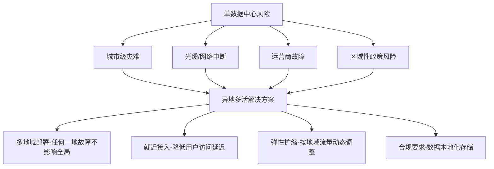

### 1.3 异地多活的适用场景

并非所有业务都需要异地多活。它适用于以下场景：

- **全球化用户分布**：用户分布在多个国家或地区，就近接入可以显著降低延迟。例如 TikTok 在全球部署了数十个边缘节点和多个核心数据中心
- **强容灾要求**：金融、支付、核心交易系统，不允许城市级灾难导致业务中断。央行要求核心支付系统 RTO < 30 分钟，RPO 趋近于零
- **数据合规要求**：GDPR 要求欧盟用户数据不出境，中国数据安全法要求重要数据本地化存储，东南亚各国也有类似法规
- **超大规模业务**：单数据中心无法承载全部流量，需要多地域分布式部署。淘宝双十一峰值 QPS 超过 50 万，单机房已无法承载

**不适用的场景：**

- 用户集中在单一城市的本地生活服务（如单城市外卖平台）
- 对数据强一致性要求极高且数据量不大的系统（如小型内部管理系统）
- 团队规模较小（<5 人运维），无法支撑多地运维复杂度
- 业务处于早期阶段，流量规模尚不需要多地部署

> **关键判断标准**：如果你的业务在某个 DC 宕机后，用户可以接受等待 30 分钟以上恢复，那你可能不需要异地多活，同城双活甚至主备模式就足够了。异地多活的运维成本是同城双活的 3-5 倍，投入必须匹配业务价值。

### 1.4 决策框架：是否需要异地多活？

在投入巨大的人力物力建设异地多活之前，务必经过严谨的评估。以下决策框架可以帮助团队做出正确的判断：

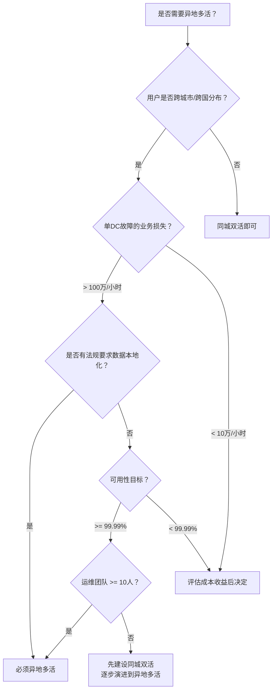

---

## 二、架构设计原理

### 2.1 整体架构拓扑

异地多活的典型架构比同城双活多了一个关键层——**全局流量调度层**，负责将用户请求路由到最近、最健康的数据中心。整个架构从上到下分为五层：用户接入层、全局调度层、数据中心层、数据同步层和监控运维层。

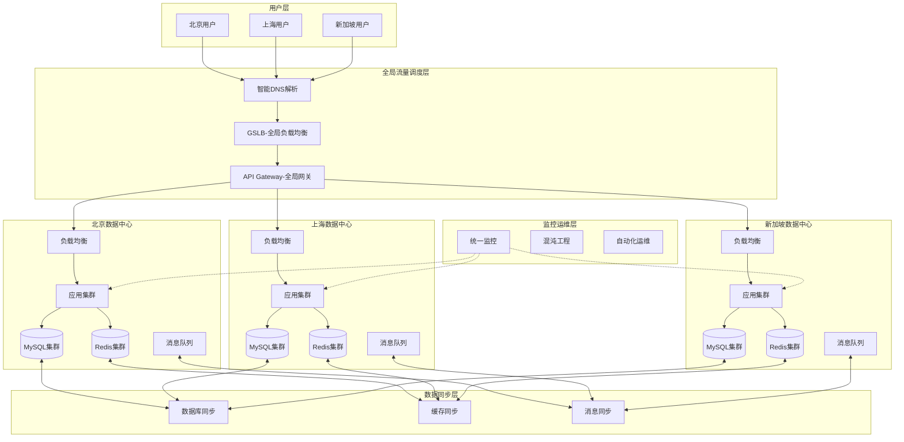

### 2.2 跨地域网络基础设施

网络是异地多活的"血管"，其质量和稳定性直接决定了数据同步的可靠性和用户体验。跨地域网络的选择和优化是架构设计中容易被忽视但至关重要的环节。

**网络链路类型对比：**

| 链路类型 | 延迟 | 带宽 | 成本 | 可靠性 | 适用场景 |
|---|---|---|---|---|---|
| 公网互联网 | 高，波动大 | 不保证 | 低 | 中 | 开发测试环境 |
| 云厂商专线（如阿里云CEN） | 低，稳定 | 1-10Gbps | 中高 | 高 | 生产环境首选 |
| 物理专线（裸光纤） | 最低 | 10-100Gbps | 极高 | 最高 | 金融级核心链路 |
| IPSec VPN隧道 | 中 | 受公网影响 | 低 | 中低 | 补充链路/备份 |
| SD-WAN | 中低，可优化 | 灵活 | 中 | 高 | 多分支互联 |

**网络冗余设计原则：**

1. **多链路冗余**：每个数据中心至少接入两条独立的物理链路（不同运营商或不同路由），避免单点故障。例如北京机房同时接入中国电信和中国联通的专线
2. **链路质量监控**：实时监控各链路的延迟、丢包率、抖动（Jitter），当某条链路质量下降时自动切换
3. **带宽规划**：数据同步的带宽需求取决于变更数据量。假设日均变更数据 100GB，同步延迟要求 <5秒，则需要至少 160Mbps 的持续同步带宽
4. **QoS 策略**：对不同类型的跨地域流量设置优先级——数据库同步 > 业务调用 > 日志传输 > 监控数据

```python
class CrossDCNetworkMonitor:
    """跨数据中心网络质量监控"""
    
    def __init__(self, dc_pairs: list):
        """
        dc_pairs: [("bj", "sh"), ("bj", "sg"), ("sh", "sg")]
        """
        self.dc_pairs = dc_pairs
        self.metrics = {}
    
    def measure_link_quality(self, source_dc: str, target_dc: str) -> dict:
        """
        测量链路质量，返回延迟、丢包率、抖动等指标
        生产环境应使用iperf3或专业网络探针
        """
        result = {
            "source": source_dc,
            "target": target_dc,
            "latency_ms": self._ping(target_dc),
            "packet_loss_pct": self._packet_loss(target_dc),
            "jitter_ms": self._jitter(target_dc, samples=50),
            "bandwidth_mbps": self._bandwidth_test(target_dc),
        }
        
        # 质量评级
        if result["latency_ms"] < 5 and result["packet_loss_pct"] < 0.1:
            result["grade"] = "excellent"
        elif result["latency_ms"] < 30 and result["packet_loss_pct"] < 1:
            result["grade"] = "good"
        elif result["latency_ms"] < 100 and result["packet_loss_pct"] < 5:
            result["grade"] = "degraded"
        else:
            result["grade"] = "poor"
        
        return result
    
    def get_best_path(self, source_dc: str, target_dc: str) -> str:
        """
        当直连链路质量差时，选择最优的中转路径
        例如：北京→新加坡直连质量差，可以走 北京→上海→新加坡
        """
        direct = self.measure_link_quality(source_dc, target_dc)
        if direct["grade"] in ["excellent", "good"]:
            return "direct"
        
        # 检查所有中转路径
        best_path = None
        best_latency = float("inf")
        
        for mid_dc in self._get_all_dcs():
            if mid_dc in (source_dc, target_dc):
                continue
            leg1 = self.measure_link_quality(source_dc, mid_dc)
            leg2 = self.measure_link_quality(mid_dc, target_dc)
            total = leg1["latency_ms"] + leg2["latency_ms"]
            if total < best_latency:
                best_latency = total
                best_path = f"{source_dc}→{mid_dc}→{target_dc}"
        
        return best_path or "direct"
```

### 2.3 全局流量调度

流量调度是异地多活的**第一道关卡**，决定了用户的请求落入哪个数据中心。调度策略需要在"就近接入"、"负载均衡"和"故障转移"三者之间取得平衡。

#### 2.3.1 DNS 层调度

通过智能 DNS 解析，根据用户 IP 的地理位置将域名解析到最近的数据中心：

```python
import dns.resolver
import geoip2.database
from ipaddress import ip_address

class GeoDNSRouter:
    """基于地理位置的DNS路由"""
    
    # 数据中心配置：区域 -> 数据中心地址
    DC_MAP = {
        "CN-NORTH": "bj.api.example.com",
        "CN-EAST": "sh.api.example.com",
        "AP-SOUTHEAST": "sg.api.example.com",
    }
    
    # 区域到数据中心的映射规则
    REGION_RULES = {
        "CN-NORTH": ["北京", "天津", "河北", "山东", "辽宁", "吉林", "黑龙江"],
        "CN-EAST": ["上海", "江苏", "浙江", "安徽", "广东", "福建"],
        "AP-SOUTHEAST": ["新加坡", "马来西亚", "泰国", "越南", "印度尼西亚"],
    }
    
    def __init__(self, geoip_db_path: str):
        self.reader = geoip2.database.Reader(geoip_db_path)
    
    def resolve(self, client_ip: str) -> str:
        """
        根据客户端IP解析到最近的数据中心
        1. 查询GeoIP获取城市/国家
        2. 匹配区域规则
        3. 返回对应数据中心地址
        """
        try:
            response = self.reader.city(client_ip)
            country = response.country.name
            city = response.city.name
            
            # 按优先级匹配区域
            for region, cities in self.REGION_RULES.items():
                if city in cities or country in cities:
                    return self.DC_MAP[region]
            
            # 默认返回最近的数据中心（可用性兜底）
            return self.DC_MAP["CN-EAST"]
            
        except Exception:
            # GeoIP查询失败时的兜底策略
            return self.DC_MAP["CN-EAST"]
```

**DNS 调度的局限性：**

DNS 调度虽然简单，但存在几个固有问题：
- **DNS 缓存**：客户端和中间 DNS 服务器会缓存解析结果，导致故障切换延迟（取决于 TTL 设置）
- **精度有限**：GeoIP 库的定位精度通常到城市级别，无法精确到运营商或机房
- **无负载感知**：DNS 不知道各 DC 的实时负载状态，可能将用户导向过载的 DC
- **客户端覆盖不全**：部分客户端（如 IoT 设备）可能不更新 DNS 缓存

因此，DNS 调度通常作为第一层粗粒度路由，配合上层的 GSLB 和应用层路由实现更精细的调度。

#### 2.3.2 GSLB 层调度

GSLB（Global Server Load Balancing）在 DNS 之上提供更精细的调度能力，包括健康检查、权重分配、故障转移：

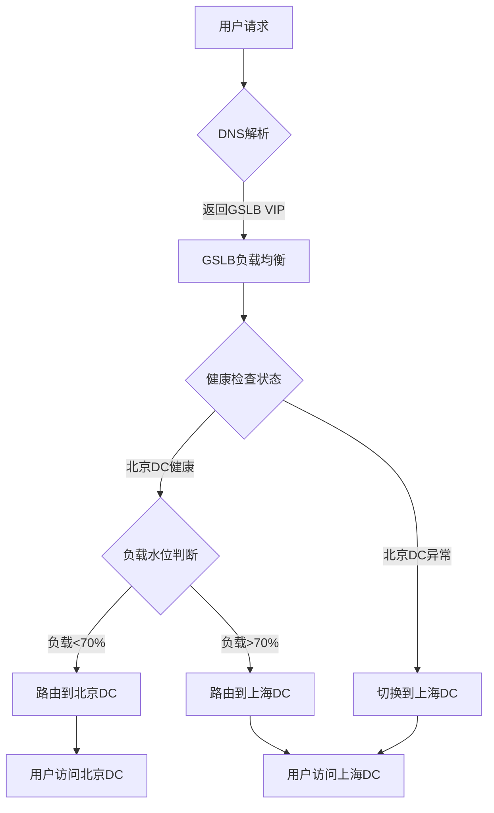

**GSLB 健康检查策略：**

| 检查维度 | 检查方式 | 超时阈值 | 失败判定 | 说明 |
|---|---|---|---|---|
| 网络可达性 | ICMP Ping | 3秒 | 连续3次失败 | 最基础的存活检查 |
| HTTP 接口 | GET /health | 5秒 | 连续2次失败 | 检查应用层可用性 |
| 数据库连通 | TCP 端口检查 | 3秒 | 连续3次失败 | 确保数据库可访问 |
| 业务指标 | 自定义脚本 | 10秒 | 连续2次失败 | 检查业务层健康度 |
| 数据同步状态 | 监控同步延迟 | 5秒 | 延迟>30s | 防止切换到数据落后的DC |
| 人工维护标记 | 配置开关 | 立即生效 | 手动触发 | 用于计划内维护 |

```yaml
# GSLB 配置示例
gslb:
  # 健康检查配置
  health_check:
    interval: 5s          # 检查间隔
    timeout: 3s           # 单次超时
    failure_threshold: 3  # 连续失败阈值
    recovery_threshold: 2 # 连续成功恢复阈值
  
  # 数据中心优先级与权重
  datacenters:
    - name: beijing
      priority: 1
      weight: 50
      endpoints:
        - vip: 1.2.3.4:443
        - vip: 1.2.3.5:443
      health_check:
        http_path: /api/health
        expect_status: 200
    
    - name: shanghai
      priority: 1
      weight: 50
      endpoints:
        - vip: 5.6.7.8:443
        - vip: 5.6.7.9:443
      health_check:
        http_path: /api/health
        expect_status: 200
    
    - name: singapore
      priority: 2
      weight: 100
      endpoints:
        - vip: 10.11.12.13:443
      health_check:
        http_path: /api/health
        expect_status: 200
  
  # 调度策略
  scheduling:
    method: weighted-round-robin  # 加权轮询
    failover: priority-based      # 按优先级故障转移
    sticky_session: false         # 异地场景不建议开启会话保持
```

#### 2.3.3 应用层路由

在应用层实现更细粒度的路由控制，可以基于用户 ID、业务类型、数据归属等维度：

```python
class AppLevelRouter:
    """应用层路由——决定请求在哪个DC处理"""
    
    def __init__(self, user_dc_mapping: dict, biz_rules: dict):
        self.user_dc_mapping = user_dc_mapping  # 用户->DC映射表
        self.biz_rules = biz_rules              # 业务路由规则
    
    def route(self, request) -> str:
        """
        路由决策优先级：
        1. 用户明确指定的DC（用户绑定关系）
        2. 业务规则指定的DC（如特定业务只在某DC处理）
        3. 就近接入（GeoIP判断）
        4. 兜底（默认DC）
        """
        # 优先级1：用户绑定
        user_id = request.get("user_id")
        if user_id and user_id in self.user_dc_mapping:
            return self.user_dc_mapping[user_id]
        
        # 优先级2：业务规则
        biz_type = request.get("biz_type")
        if biz_type and biz_type in self.biz_rules:
            return self.biz_rules[biz_type]
        
        # 优先级3：就近接入
        client_ip = request.get("client_ip")
        nearest_dc = self.geoip_route(client_ip)
        
        # 优先级4：检查目标DC负载
        if self.is_dc_overloaded(nearest_dc):
            return self.select_least_loaded_dc()
        
        return nearest_dc
```

### 2.4 数据分片策略

异地多活的核心难题是**数据归属**——同一个数据被多个 DC 同时修改，必然产生冲突。解决冲突最有效的策略是从根源上避免冲突：**让同一份数据只有一个 DC 能写入**。

#### 2.4.1 按用户维度分片

将用户按 ID 分配到固定的数据中心，该用户的所有读写操作都路由到归属 DC：

```python
import hashlib

class UserShardRouter:
    """用户维度的数据分片路由"""
    
    def __init__(self, dc_configs: list):
        """
        dc_configs: [
            {"name": "dc_bj", "weight": 40, "hash_range": (0, 3999)},
            {"name": "dc_sh", "weight": 40, "hash_range": (4000, 7999)},
            {"name": "dc_sg", "weight": 20, "hash_range": (8000, 9999)},
        ]
        """
        self.dc_configs = dc_configs
        self.total_slots = 10000
    
    def get_dc(self, user_id: str) -> str:
        """根据用户ID确定归属DC"""
        # 使用一致性哈希，减少DC增减时的数据迁移
        hash_val = int(hashlib.md5(str(user_id).encode()).hexdigest(), 16)
        slot = hash_val % self.total_slots
        
        for dc in self.dc_configs:
            start, end = dc["hash_range"]
            if start <= slot <= end:
                return dc["name"]
        
        # 兜底返回第一个DC
        return self.dc_configs[0]["name"]
    
    def get_write_dc(self, user_id: str) -> str:
        """写操作：强制路由到归属DC"""
        return self.get_dc(user_id)
    
    def get_read_dc(self, user_id: str, prefer_local: bool = True) -> str:
        """
        读操作：优先本地DC，支持降级
        prefer_local=True: 优先读本地DC缓存（低延迟）
        prefer_local=False: 读归属DC（强一致）
        """
        home_dc = self.get_dc(user_id)
        local_dc = self.get_local_dc()
        
        if prefer_local:
            return local_dc  # 读本地，接受短暂不一致
        else:
            return home_dc  # 读归属DC，保证一致
```

**分片策略对比：**

| 分片维度 | 实现方式 | 优点 | 缺点 | 适用场景 |
|---|---|---|---|---|
| 用户ID哈希 | `user_id % N` 或一致性哈希 | 无写冲突，一致性好 | 用户无法迁移DC，扩容需数据搬迁 | 以用户为核心（社交、电商） |
| 地理区域 | 按 IP/手机号归属地 | 就近访问延迟低 | 区域间流动用户处理复杂 | 本地生活、区域电商 |
| 业务类型 | 不同业务分配不同DC | 业务隔离清晰 | 跨DC调用链长 | 多BU独立运营 |
| 时间窗口 | 按时段切换DC主写权 | 灵活应对流量峰谷 | 实现复杂，窗口切换有风险 | 全球化业务的昼夜交替 |

> **分片策略的选择原则**：选分片维度的关键标准是"哪个维度能让 90% 以上的请求不需要跨 DC"。以用户为核心的系统选用户 ID，以商品为核心的系统选商品 ID，混合系统选用户 ID（用户是第一维度）+ 全局商品副本。如果分片后仍有大量跨 DC 调用，说明分片维度选择不当。

#### 2.4.2 二级分片——数据组维度

在用户分片之上，可以进一步按数据组（如订单、商品、库存）进行更细粒度的分片：

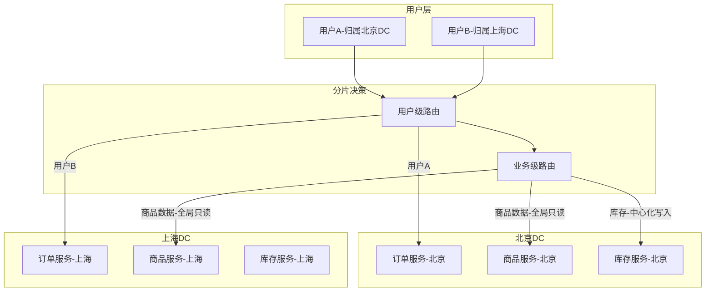

**关键原则**：

- **用户相关数据**（订单、个人资料）：按用户分片，归属 DC 独占写权限
- **全局共享数据**（商品目录、配置信息）：主 DC 写入，其他 DC 只读副本
- **高冲突数据**（库存、余额）：中心化写入或使用分布式事务保证
- **跨用户数据**（关注关系、群组）：冗余存储双方副本，写入时双向同步

---

## 三、数据同步机制

### 3.1 数据库同步

异地多活中，数据库同步是最核心也是最困难的技术环节。跨地域的网络延迟使得强一致同步复制不现实，必须选择合适的同步策略。

#### 3.1.1 同步策略对比

| 策略 | 一致性 | 延迟影响 | 数据丢失风险 | 实现复杂度 | 适用场景 |
|---|---|---|---|---|---|
| 同步复制 | 强一致 | +30-100ms | 零丢失 | 低 | 不适用于异地 |
| 半同步复制 | 准强一致 | +15-50ms | 超时降级时丢失 | 中 | 异地双活（距离近） |
| 异步复制 | 最终一致 | 几乎无影响 | 可能丢失少量 | 低 | 异地多活主流方案 |
| GTID 复制 | 最终一致 | 几乎无影响 | 可能丢失少量 | 中 | MySQL异地多活 |
| binlog 中转 | 最终一致 | +5-20ms | 极低 | 高 | 金融级异地多活 |

#### 3.1.2 基于 GTID 的 MySQL 异地同步

GTID（Global Transaction Identifier）是 MySQL 实现异地多活的推荐方案，它为每个事务分配全局唯一 ID，解决了传统 binlog 位点同步在故障切换后难以恢复的问题：

```sql
-- my.cnf 全局配置（所有DC的MySQL实例）
[mysqld]
# 启用GTID
gtid-mode = ON
enforce-gtid-consistency = ON
log-slave-updates = ON

# binlog配置
log-bin = mysql-bin
binlog-format = ROW
binlog-row-image = FULL
sync-binlog = 1

# 半同步复制（用于同城级同步，异地不推荐开启）
# rpl_semi_sync_master_enabled = 0  -- 异地场景关闭

-- 各DC的复制通道配置
-- 北京DC：接收上海DC的数据
CHANGE REPLICATION SOURCE TO
  SOURCE_HOST = 'sh-mysql.internal',
  SOURCE_PORT = 3306,
  SOURCE_USER = 'repl_user',
  SOURCE_AUTO_POSITION = 1,  -- GTID自动定位
  SOURCE_CONNECT_RETRY = 10,
  SOURCE_RETRY_COUNT = 86400;

-- 上海DC：接收北京DC的数据
CHANGE REPLICATION SOURCE TO
  SOURCE_HOST = 'bj-mysql.internal',
  SOURCE_PORT = 3306,
  SOURCE_USER = 'repl_user',
  SOURCE_AUTO_POSITION = 1,
  SOURCE_CONNECT_RETRY = 10,
  SOURCE_RETRY_COUNT = 86400;
```

#### 3.1.3 基于 binlog 中转的高可靠同步

对于金融级场景，可以通过 binlog 中转站（binlog relay）提高数据同步的可靠性和可追溯性：

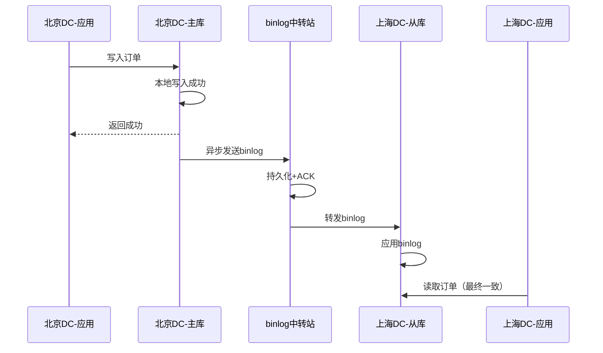

binlog 中转站的优势：

- **解耦生产者和消费者**：主库不直接连接从库，降低耦合
- **缓冲和重试**：网络抖动时 binlog 不丢失，中转站负责重试
- **可审计**：所有数据变更都有记录，支持回溯和审计
- **多消费方**：一个中转站可以向多个从库同步数据
- **流量整形**：中转站可以控制同步速率，避免从库被大量数据压垮

#### 3.1.4 冲突检测与处理

当分片策略失效（如用户漫游、边界条件）导致多个 DC 同时修改同一数据时，需要冲突检测和处理机制：

```python
class ConflictResolver:
    """数据冲突检测与解决"""
    
    def __init__(self):
        self.strategy_map = {
            "last_write_wins": self.lww_resolve,
            "merge": self.merge_resolve,
            "reject": self.reject_resolve,
        }
    
    def detect_conflict(self, local_version: dict, remote_version: dict) -> bool:
        """
        冲突检测：基于版本向量
        如果两个版本互不支配（都有对方没有的更新），则存在冲突
        """
        local_vv = local_version.get("version_vector", {})
        remote_vv = remote_version.get("version_vector", {})
        
        local_dominates = all(
            local_vv.get(k, 0) >= remote_vv.get(k, 0)
            for k in set(list(local_vv.keys()) + list(remote_vv.keys()))
        )
        remote_dominates = all(
            remote_vv.get(k, 0) >= local_vv.get(k, 0)
            for k in set(list(local_vv.keys()) + list(remote_vv.keys()))
        )
        
        return not (local_dominates or remote_dominates)
    
    def lww_resolve(self, local: dict, remote: dict) -> dict:
        """最后写入胜出（Last Write Wins）"""
        if local["timestamp"] >= remote["timestamp"]:
            return local
        return remote
    
    def merge_resolve(self, local: dict, remote: dict) -> dict:
        """自动合并（适合非冲突字段）"""
        merged = local.copy()
        for key, value in remote.items():
            if key not in merged or key in ["timestamp", "version_vector"]:
                continue
            if merged[key] != value:
                # 非冲突字段：取最新值
                # 冲突字段：标记需要人工处理
                merged[key] = value
                merged.setdefault("_conflict_fields", []).append(key)
        return merged
    
    def reject_resolve(self, local: dict, remote: dict) -> dict:
        """拒绝写入（需要人工介入）"""
        raise ConflictError(
            f"数据冲突: local={local['id']}@{local['timestamp']}, "
            f"remote={remote['id']}@{remote['timestamp']}. "
            f"请人工确认后重试。"
        )
```

**冲突处理策略选择指南：**

| 策略 | 数据安全性 | 自动化程度 | 业务影响 | 推荐场景 |
|---|---|---|---|---|
| 最后写入胜出 | 中等（可能丢合法更新） | 全自动 | 无 | 非关键数据（设置、偏好） |
| 自动合并 | 较高（保留双方更新） | 全自动 | 低 | 可合并字段（订单状态+物流信息） |
| 拒绝+人工 | 最高（确保正确） | 需人工 | 高 | 金融交易、库存变更 |
| CRDT | 高（数学保证收敛） | 全自动 | 无 | 计数器、集合、状态机 |

### 3.2 CRDT：无冲突复制数据类型

CRDT（Conflict-free Replicated Data Types）是近年来在分布式系统中越来越受重视的技术。它通过数学证明保证：无论副本以何种顺序接收更新，最终所有副本都会收敛到相同的状态，且无需协调或冲突解决。

**CRDT 的核心原理**：CRDT 利用了格（Lattice）的数学性质——定义一个偏序关系和合并操作（merge），使得合并操作满足交换律、结合律和幂等律。这意味着更新可以以任意顺序应用，最终结果一定相同。

**常见的 CRDT 类型：**

| CRDT 类型 | 数据结构 | 操作语义 | 合并规则 | 典型应用 |
|---|---|---|---|---|
| G-Counter | 计数器 | increment | 各节点取 max | 点赞数、访问计数 |
| PN-Counter | 正负计数器 | increment/decrement | 两个 G-Counter | 库存增减、余额 |
| G-Set | 只增集合 | add | union | 标签、权限集合 |
| OR-Set | 有序集合 | add/remove | 规则合并 | 购物车 |
| LWW-Register | 寄存器 | assign | 时间戳最新者胜 | 用户昵称、状态 |
| MV-Register | 多值寄存器 | assign | 保留所有最新版本 | 文档协作编辑 |

```python
class GCounter:
    """
    Grow-Only Counter（只增计数器）
    每个节点维护自己的计数，合并时取各节点最大值
    数学保证：满足交换律、结合律、幂等律
    """
    
    def __init__(self, node_id: str):
        self.node_id = node_id
        self.counts = {}  # {node_id: count}
    
    def increment(self, amount: int = 1):
        """本节点自增"""
        self.counts[self.node_id] = self.counts.get(self.node_id, 0) + amount
    
    def value(self) -> int:
        """返回当前总计数"""
        return sum(self.counts.values())
    
    def merge(self, other: "GCounter"):
        """
        合并另一个副本的状态
        核心：每个node取max，保证幂等性和最终一致性
        """
        for node_id, count in other.counts.items():
            self.counts[node_id] = max(self.counts.get(node_id, 0), count)


class PNCounter:
    """
    Positive-Negative Counter（正负计数器）
    由两个G-Counter组成：一个记录增加，一个记录减少
    适用于库存增减、余额变动等需要双向操作的场景
    """
    
    def __init__(self, node_id: str):
        self.positive = GCounter(node_id)
        self.negative = GCounter(node_id)
    
    def increment(self, amount: int = 1):
        self.positive.increment(amount)
    
    def decrement(self, amount: int = 1):
        self.negative.increment(amount)
    
    def value(self) -> int:
        return self.positive.value() - self.negative.value()
    
    def merge(self, other: "PNCounter"):
        self.positive.merge(other.positive)
        self.negative.merge(other.negative)


class ShoppingCart:
    """
    基于OR-Set的购物车
    支持多节点同时添加/删除商品，最终收敛到一致状态
    """
    
    def __init__(self, node_id: str):
        self.node_id = node_id
        self.items = {}  # {item_id: {tag: bool}}  tag=True表示存在
    
    def add(self, item_id: str):
        """添加商品——生成唯一tag"""
        import uuid
        tag = f"{self.node_id}:{uuid.uuid4().hex[:8]}"
        if item_id not in self.items:
            self.items[item_id] = {}
        self.items[item_id][tag] = True
    
    def remove(self, item_id: str):
        """删除商品——移除所有已知tag"""
        if item_id in self.items:
            self.items[item_id] = {}
    
    def get_items(self) -> list:
        """获取当前购物车内容——只返回有有效tag的商品"""
        return [
            item_id for item_id, tags in self.items.items()
            if any(tags.values())
        ]
    
    def merge(self, other: "ShoppingCart"):
        """
        合并购物车
        OR-Set的合并规则：tag的union
        add和remove的顺序不影响最终结果
        """
        for item_id, other_tags in other.items.items():
            if item_id not in self.items:
                self.items[item_id] = {}
            self.items[item_id].update(other_tags)
```

**CRDT 的适用边界：**

CRDT 并非万能药。它适用于"可以定义收敛合并操作"的场景，但不适用于需要全局排序或原子性约束的场景。例如：
- **适用**：计数器（点赞、浏览量）、集合（标签、好友列表）、状态机（在线/离线）
- **不适用**：需要全局唯一约束的 ID 生成、需要原子性保证的转账操作、需要全局排序的排行榜

### 3.3 缓存同步

#### 3.3.1 缓存同步策略

| 策略 | 一致性 | 延迟 | 复杂度 | 适用场景 |
|---|---|---|---|---|
| 本地缓存+TTL过期 | 最终一致 | 取决于TTL | 低 | 可容忍短暂不一致的场景 |
| Cache Invalidation广播 | 最终一致 | 毫秒级 | 中 | 大多数通用场景 |
| Redis Cluster跨地域 | 较高 | 取决于拓扑 | 高 | 需要全局一致缓存的场景 |
| 数据库回源 | 最终一致 | 低延迟读 | 低 | 缓存miss时穿透到DB |

**Cache Invalidation 广播方案实现：**

```python
import json
import redis

class GeoCacheManager:
    """异地多活缓存管理器"""
    
    def __init__(self, local_redis: redis.Redis, pubsub_redis: redis.Redis, dc_name: str):
        self.local_redis = local_redis
        self.pubsub_redis = pubsub_redis
        self.dc_name = dc_name
        self.CHANNEL = "cache_invalidation"
    
    def set(self, key: str, value: str, ttl: int = 3600):
        """写入缓存并广播失效消息"""
        # 1. 写入本地缓存
        self.local_redis.setex(key, ttl, value)
        
        # 2. 广播失效消息到其他DC
        invalidation_msg = json.dumps({
            "action": "invalidate",
            "key": key,
            "source_dc": self.dc_name,
            "timestamp": self._now_ms(),
        })
        self.pubsub_redis.publish(self.CHANNEL, invalidation_msg)
    
    def get(self, key: str) -> str | None:
        """读取本地缓存"""
        return self.local_redis.get(key)
    
    def subscribe_invalidations(self):
        """
        订阅失效消息——在另一个线程中运行
        收到其他DC的失效消息后，删除本地缓存
        """
        pubsub = self.pubsub_redis.pubsub()
        pubsub.subscribe(self.CHANNEL)
        
        for message in pubsub.listen():
            if message["type"] != "message":
                continue
            data = json.loads(message["data"])
            if data["source_dc"] == self.dc_name:
                continue  # 忽略自己发出的消息
            # 删除本地缓存
            self.local_redis.delete(data["key"])
```

#### 3.3.2 缓存一致性保障

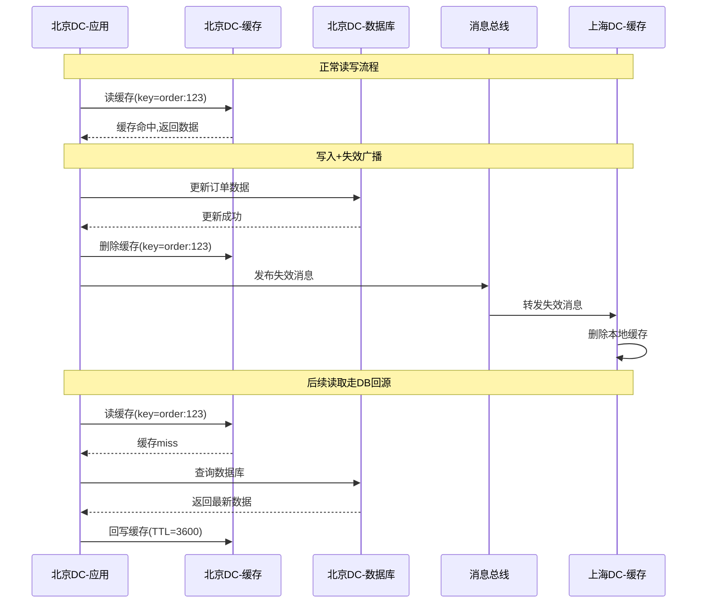

**缓存一致性的常见陷阱：**

1. **缓存与数据库双写不原子**：先更新数据库再删缓存，如果删缓存失败，会导致脏缓存。解决方案是使用"延迟双删"——更新 DB 后删缓存，延迟 500ms 再删一次
2. **缓存失效风暴**：大量缓存同时过期，导致瞬间大量请求穿透到 DB。解决方案是为 TTL 增加随机偏移量（如 `TTL ± 10%`）
3. **Pub/Sub 消息丢失**：Redis Pub/Sub 不保证消息送达。对于关键缓存失效，需要配合数据库 binlog 同步作为兜底

---

## 四、核心挑战与解决方案

### 4.1 跨地域延迟

**问题描述**

北京到上海的网络延迟约 10-20ms，北京到新加坡约 50-80ms。如果用户请求需要跨地域调用，延迟会显著增加。例如：北京用户下单时需要校验上海 DC 的库存，一次请求可能需要 20-80ms 的跨地域调用。

**解决方案**

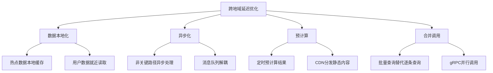

**具体优化手段：**

1. **数据本地化**：热点数据在每个 DC 维护本地缓存副本，读操作不跨地域
2. **异步化**：非关键路径（通知、日志、统计）通过消息队列异步处理
3. **预计算**：定时任务在各 DC 预计算常用数据（用户画像、推荐列表）
4. **合并调用**：将多个远程调用合并为一次批量请求
5. **调用链裁剪**：分析请求链路，将跨 DC 调用从关键路径上移除

```python
class LatencyOptimizer:
    """跨地域延迟优化器"""
    
    def __init__(self, dc_name: str, cross_dc_client):
        self.dc_name = dc_name
        self.cross_dc_client = cross_dc_client
        self.local_cache = {}
    
    def get_user_profile(self, user_id: str, force_remote: bool = False) -> dict:
        """
        用户画像查询——本地优先策略
        1. 查本地缓存
        2. 缓存miss时，异步从归属DC拉取
        3. 返回缓存数据（可能有短暂延迟，但不阻塞用户）
        """
        # Step 1: 本地缓存
        cache_key = f"user_profile:{user_id}"
        if cache_key in self.local_cache and not force_remote:
            return self.local_cache[cache_key]
        
        # Step 2: 后台异步拉取（不阻塞当前请求）
        self._async_refresh_profile(user_id)
        
        # Step 3: 返回缓存（即使过期也先返回旧数据）
        return self.local_cache.get(cache_key, self._get_default_profile())
    
    def batch_query_orders(self, user_ids: list[str]) -> dict:
        """
        批量查询订单——合并调用减少跨地域RTT
        不逐条查询，而是批量发送，一次RTT获取所有结果
        """
        # 构造批量请求
        batch_request = {
            "user_ids": user_ids,
            "fields": ["order_id", "status", "amount", "created_at"],
            "limit": 10,
        }
        
        # 一次跨地域调用
        result = self.cross_dc_client.batch_query(batch_request)
        return result
```

### 4.2 数据最终一致性

**问题描述**

异地多活中，数据同步存在延迟（通常 100ms - 几秒），在同步完成之前，不同 DC 的数据可能不一致。用户在 DC-A 写入的数据，DC-B 可能尚未同步完成。

**解决方案**

1. **读写分离路由**：用户的写操作路由到归属 DC，读操作优先读本地 DC（接受短暂不一致），关键读操作走归属 DC（保证一致）
2. **一致性等级标注**：业务层为每次读写操作标注一致性等级要求

```python
class ConsistencyRouter:
    """一致性感知的读写路由"""
    
    def read(self, user_id: str, key: str, consistency: str = "eventual") -> dict:
        """
        根据一致性等级决定读取策略
        """
        home_dc = self.get_user_home_dc(user_id)
        local_dc = self.get_local_dc()
        
        if consistency == "strong":
            # 强一致：必须读归属DC
            return self._read_from_dc(home_dc, key)
        
        elif consistency == "read_your_writes":
            # 读己所写：读本次会话写入过的DC
            session_dc = self.get_session_write_dc(user_id)
            if session_dc:
                return self._read_from_dc(session_dc, key)
            return self._read_from_dc(home_dc, key)
        
        else:
            # 最终一致：优先本地，降级到归属DC
            result = self._read_from_dc(local_dc, key)
            if result is None:
                result = self._read_from_dc(home_dc, key)
            return result
```

**一致性等级适用场景：**

| 一致性等级 | 含义 | 延迟 | 适用场景 |
|---|---|---|---|
| strong | 读到最新数据 | 高（跨地域） | 资金余额、库存数量 |
| read_your_writes | 能看到自己刚写入的数据 | 中 | 用户修改个人资料后立即查看 |
| eventual | 最终一致，可能读到旧数据 | 低（本地） | 商品列表、评论、浏览记录 |

### 4.3 故障切换与回切

**问题描述**

当一个 DC 完全不可用时，需要将流量切换到其他 DC。问题在于：

- 切换时可能丢失部分数据（异步复制的延迟窗口）
- 切换后用户归属关系需要调整
- 原 DC 恢复后的数据回补和回切

**故障切换流程：**

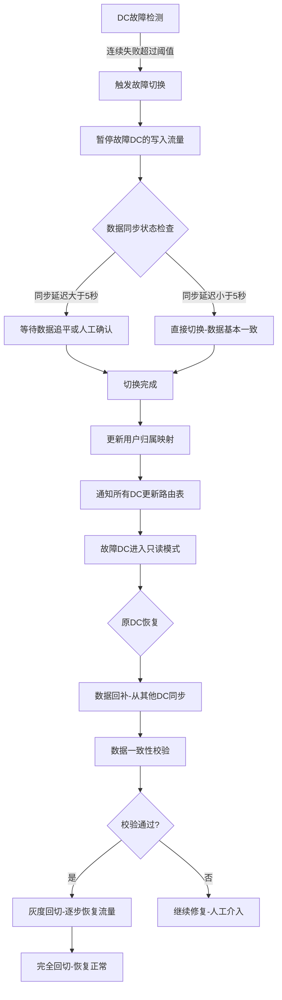

**切换过程中的数据保护：**

```python
class DCFailoverManager:
    """数据中心故障切换管理器"""
    
    def __init__(self, dc_configs: dict):
        self.dc_configs = dc_configs
        self.failover_state = {}
    
    def execute_failover(self, failed_dc: str) -> dict:
        """
        执行故障切换
        返回切换结果，包含数据状态和切换策略
        """
        # 1. 检查数据同步延迟
        sync_lag = self._check_sync_lag(failed_dc)
        
        # 2. 选择切换策略
        if sync_lag < 5:  # 同步延迟小于5秒
            strategy = "auto_switch"
        elif sync_lag < 60:  # 延迟在1分钟内
            strategy = "switch_with_warning"
        else:
            strategy = "manual_approval_required"
        
        # 3. 执行切换
        result = {
            "failed_dc": failed_dc,
            "sync_lag_seconds": sync_lag,
            "strategy": strategy,
            "target_dc": self._select_target_dc(failed_dc),
        }
        
        if strategy in ["auto_switch", "switch_with_warning"]:
            # 更新路由表
            self._update_routing_table(failed_dc, result["target_dc"])
            # 将故障DC标记为只读
            self._mark_dc_readonly(failed_dc)
            # 开启数据回补任务
            self._start_data_repair(failed_dc)
        
        return result
    
    def execute_fallback(self, recovered_dc: str) -> dict:
        """
        执行回切——将流量从备用DC恢复到原DC
        采用灰度策略，逐步恢复流量
        """
        # 1. 数据一致性校验
        consistency_check = self._check_data_consistency(recovered_dc)
        if not consistency_check["passed"]:
            return {"status": "aborted", "reason": consistency_check["mismatch"]}
        
        # 2. 灰度回切
        traffic_percentages = [1, 5, 10, 25, 50, 100]
        for pct in traffic_percentages:
            self._adjust_traffic(recovered_dc, pct)
            # 观察10分钟
            health = self._observe_dc_health(recovered_dc, duration=600)
            if not health["healthy"]:
                self._rollback_fallback(recovered_dc)
                return {"status": "rolled_back", "failed_at_pct": pct}
        
        return {"status": "completed", "recovered_dc": recovered_dc}
```

**故障切换的三大陷阱：**

1. **脑裂（Split-Brain）**：故障检测不准确导致两个 DC 都认为自己是主 DC。解决方案：使用 Fencing 机制（如分布式锁），确保同一时刻只有一个 DC 拥有写入权
2. **数据丢失窗口**：异步复制的延迟窗口内的数据在切换时丢失。解决方案：切换前记录同步位点，切换后通过日志回放补回丢失数据
3. **雪崩效应**：故障 DC 的流量涌入正常 DC，导致正常 DC 也过载。解决方案：切换时限制流入流量（如只切换 50% 流量），观察稳定后再逐步增加

### 4.4 全局ID生成

**问题描述**

异地多活中，每个 DC 都可能独立生成业务 ID（订单号、流水号）。如果使用简单的自增 ID，不同 DC 会产生重复 ID。

**解决方案**

```python
import time
import random
import threading

class GlobalIDGenerator:
    """
    全局唯一ID生成器
    ID结构: 时间戳(41bit) + DC标识(10bit) + 序列号(12bit)
    类似Snowflake，但DC标识由配置分配
    """
    
    # 每个DC分配唯一的标识（0-1023）
    DC_IDS = {
        "dc_bj": 1,
        "dc_sh": 2,
        "dc_sg": 3,
    }
    
    # 起始时间戳 (2024-01-01 00:00:00 UTC)
    EPOCH = 1704067200000
    
    MAX_SEQUENCE = 4095  # 2^12 - 1
    
    def __init__(self, dc_name: str):
        self.dc_id = self.DC_IDS[dc_name]
        self.sequence = 0
        self.last_timestamp = 0
        self.lock = threading.Lock()
    
    def generate(self) -> int:
        """生成全局唯一ID"""
        with self.lock:
            timestamp = self._current_millis()
            
            if timestamp == self.last_timestamp:
                # 同一毫秒内，序列号递增
                self.sequence = (self.sequence + 1) &amp; self.MAX_SEQUENCE
                if self.sequence == 0:
                    # 序列号溢出，等待下一毫秒
                    timestamp = self._wait_next_millis()
            else:
                self.sequence = 0
            
            self.last_timestamp = timestamp
            
            # 组装ID: 时间戳 | DC标识 | 序列号
            id_value = (
                ((timestamp - self.EPOCH) << 22) |
                (self.dc_id << 12) |
                self.sequence
            )
            return id_value
    
    def _current_millis(self) -> int:
        return int(time.time() * 1000)
    
    def _wait_next_millis(self) -> int:
        timestamp = self._current_millis()
        while timestamp <= self.last_timestamp:
            timestamp = self._current_millis()
        return timestamp
    
    @staticmethod
    def parse(id_value: int) -> dict:
        """解析ID的组成部分"""
        sequence = id_value &amp; 0xFFF           # 低12位
        dc_id = (id_value >> 12) &amp; 0x3FF     # 中间10位
        timestamp = (id_value >> 22) + GlobalIDGenerator.EPOCH  # 高41位
        return {
            "id": id_value,
            "dc_id": dc_id,
            "sequence": sequence,
            "timestamp": timestamp,
            "datetime": time.strftime("%Y-%m-%d %H:%M:%S", time.localtime(timestamp / 1000)),
        }
```

**全局 ID 方案对比：**

| 方案 | 唯一性保证 | 性能 | 可排序 | 信息密度 | 适用场景 |
|---|---|---|---|---|---|
| Snowflake变体 | 时间戳+DC标识+序列号 | 极高（单机百万/秒） | 按时间有序 | 高（含时间、DC信息） | 通用场景首选 |
| UUID v4 | 随机碰撞概率极低 | 高 | 无序 | 低（128bit，浪费空间） | 非关键ID |
| 号段分配 | 中心分配不重叠 | 高 | 按号段有序 | 高 | 需要连续ID的场景 |
| 数据库自增（中心化） | 数据库保证 | 低（需远程调用） | 完全有序 | 高 | 低并发场景 |

> **Snowflake 的时钟回拨问题**：如果 DC 的服务器发生时钟回拨（如 NTP 校时），Snowflake 可能生成重复 ID。解决方案：(1) 检测到时钟回拨时拒绝生成 ID 并告警；(2) 预留位做回拨次数标记，检测到回拨后切换到备用时间戳源；(3) 使用单调时钟（monotonic clock）替代系统时钟。

---

## 五、监控与可观测性

### 5.1 多活架构的监控体系

异地多活系统的监控比单 DC 系统复杂得多——不仅需要监控单个 DC 内部的健康状态，还需要监控 DC 之间的数据同步状态、网络质量和流量分布。

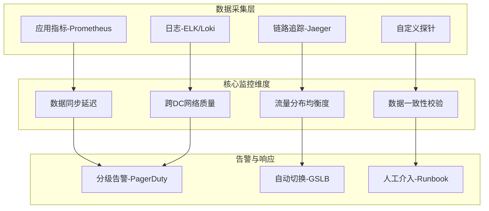

### 5.2 关键监控指标

| 监控维度 | 具体指标 | 告警阈值 | 处理方式 |
|---|---|---|---|
| 数据同步 | 同步延迟（lag） | > 5秒警告，> 30秒严重 | 检查网络和同步组件 |
| 数据同步 | 同步中断时长 | > 1分钟 | 立即排查，准备切换 |
| 网络质量 | DC间延迟 | > 正常值2倍 | 检查链路质量 |
| 网络质量 | 丢包率 | > 1% | 切换备用链路 |
| 流量分布 | 各DC QPS占比 | 偏差 > 30% | 调整GSLB权重 |
| 数据一致性 | 分片归属准确率 | < 99.9% | 检查路由配置 |
| 业务指标 | 各DC错误率 | > 0.1% | 排查具体DC问题 |

**数据同步延迟的监控实现：**

```python
class SyncLagMonitor:
    """数据同步延迟监控"""
    
    def __init__(self):
        self.alert_thresholds = {
            "warning": 5,    # 5秒警告
            "critical": 30,  # 30秒严重
            "emergency": 60, # 60秒紧急
        }
    
    def check_sync_lag(self, source_dc: str, target_dc: str) -> dict:
        """
        检查两个DC之间的数据同步延迟
        通过对比最近写入的GTID或binlog位点计算延迟
        """
        source_pos = self._get_gtid_position(source_dc)
        target_pos = self._get_gtid_position(target_dc)
        
        lag_seconds = self._calculate_lag(source_pos, target_pos)
        
        result = {
            "source": source_dc,
            "target": target_dc,
            "lag_seconds": lag_seconds,
            "source_gtid": source_pos,
            "target_gtid": target_pos,
        }
        
        # 告警判断
        if lag_seconds >= self.alert_thresholds["emergency"]:
            result["alert_level"] = "emergency"
            result["action"] = "prepare_failover"
        elif lag_seconds >= self.alert_thresholds["critical"]:
            result["alert_level"] = "critical"
            result["action"] = "investigate_and_fix"
        elif lag_seconds >= self.alert_thresholds["warning"]:
            result["alert_level"] = "warning"
            result["action"] = "monitor_closely"
        else:
            result["alert_level"] = "normal"
            result["action"] = "none"
        
        return result
```

---

## 六、混沌工程与故障演练

### 6.1 为什么需要故障演练

异地多活架构的复杂度意味着"纸上谈兵"远远不够。很多看起来完美的设计，在实际故障场景下会暴露出意想不到的问题。Netflix 的混沌工程实践证明：**主动注入故障、验证系统行为，比被动等待故障发生更安全**。

### 6.2 异地多活的故障演练清单

| 演练类型 | 具体场景 | 预期结果 | 验证要点 |
|---|---|---|---|
| DC级故障 | 模拟整个DC断网 | 流量自动切换到其他DC | 切换时间 < 60秒，数据无丢失 |
| 数据同步故障 | 模拟同步链路中断 | 业务不中断，告警触发 | 数据最终能追平 |
| 网络延迟注入 | 模拟DC间延迟从10ms升到200ms | 业务降级但不中断 | 本地缓存命中率提升 |
| 部分DC过载 | 模拟某DC流量暴增300% | GSLB自动分流 | 无DC被压垮 |
| 时钟不同步 | 模拟某DC时钟偏移10秒 | ID生成和排序不受影响 | Snowflake正确处理时钟回拨 |
| 配置变更错误 | 模拟错误的路由配置下发 | 快速回滚，影响最小 | 灰度发布+自动回滚生效 |

### 6.3 故障演练的实施原则

1. **从低风险场景开始**：先演练非核心业务（如日志服务），再演练核心业务（如交易服务）
2. **在生产环境演练**：只有生产环境的演练才能发现真实问题，但需要完备的回滚方案
3. **建立"爆炸半径"控制**：每次演练只影响一个 DC 的一小部分流量，观察稳定后再扩大范围
4. **记录并改进**：每次演练都要记录实际行为与预期的偏差，更新 Runbook 和架构设计

---

## 七、组织与运维

### 7.1 多DC运维团队模型

异地多活不仅是技术挑战，更是组织挑战。多地运维需要清晰的职责划分和协作机制。

**推荐的团队结构：**

| 角色 | 职责 | 人数建议 |
|---|---|---|
| 架构 Owner | 整体架构设计、技术决策、变更审批 | 1-2人 |
| DC 运维负责人 | 各DC的日常运维、容量管理、故障响应 | 每DC 1-2人 |
| SRE 工程师 | 监控体系建设、告警处理、演练执行 | 3-5人 |
| 数据同步工程师 | 同步链路维护、延迟优化、数据校验 | 2-3人 |
| 发布工程师 | 多DC灰度发布、配置管理、变更协调 | 1-2人 |

**关键协作流程：**

1. **统一发布窗口**：所有 DC 的变更必须在同一时间窗口内完成，避免版本不一致导致的数据兼容性问题
2. **变更审批机制**：核心配置变更（路由规则、同步策略）需要架构 Owner 审批
3. **On-Call 轮值**：确保任何时间都有人能响应跨 DC 的故障
4. **事后复盘**：每次故障和演练后进行复盘，持续改进

### 7.2 成本分析

异地多活的运维成本显著高于单 DC 或同城双活部署。在决策前需要充分评估成本。

**成本构成：**

| 成本项 | 单DC基准 | 同城双活 | 异地多活（3DC） | 说明 |
|---|---|---|---|---|
| 服务器/云资源 | 1x | 2x | 3-4x | 多DC完整部署 |
| 网络专线 | 无 | 0.2x | 1-2x | 跨地域专线成本高 |
| 人力成本 | 1x | 1.5x | 3-5x | 多地运维团队 |
| 数据存储 | 1x | 2x | 3-4x | 多副本存储 |
| 监控工具 | 1x | 1.2x | 2x | 多DC监控体系 |
| **总计** | **1x** | **~7x** | **~15-20x** | 相对于单DC |

> **成本优化建议**：(1) 利用云厂商的多可用区部署降低基础成本；(2) 非核心 DC 可以使用较小规模的部署，不需要与核心 DC 完全对等；(3) 通过单元化架构精确控制每个 DC 的资源分配，避免资源浪费。

---

## 八、实战案例

### 8.1 案例一：电商平台异地多活

**背景**：某头部电商平台，日均订单量 5000 万，用户分布在全国，核心机房在北京和上海。

**架构设计：**

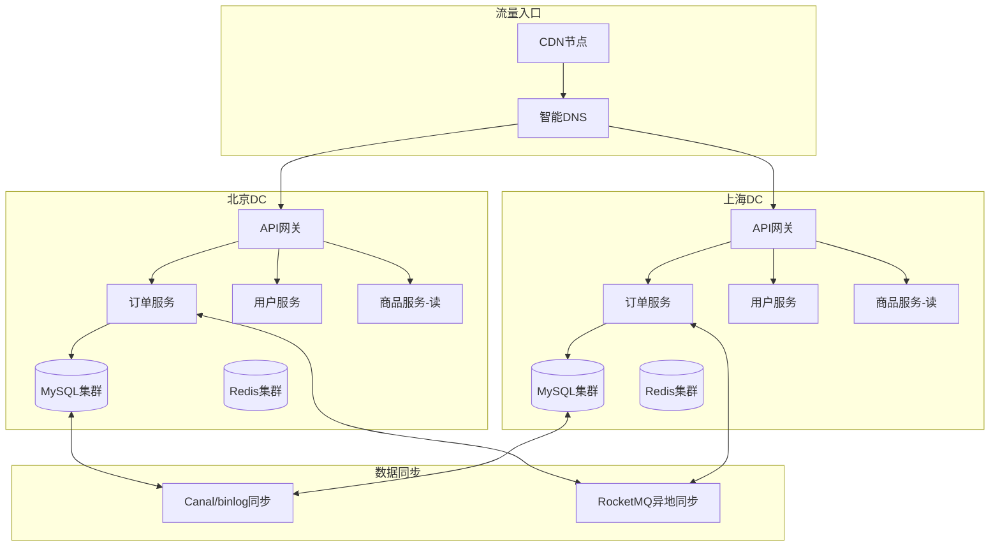

**关键决策：**

| 决策点 | 选择 | 原因 |
|---|---|---|
| 数据分片维度 | 用户ID | 用户是核心实体，按用户分片可避免写冲突 |
| 同步方式 | Canal + binlog异步 | 异步不阻塞写入，Canal提供可靠传输 |
| 缓存策略 | 本地缓存+失效广播 | 读性能优先，短暂不一致可接受 |
| 故障切换 | 自动+人工确认 | 核心业务需要人工确认，避免误切换 |
| ID生成 | Snowflake变体 | 每DC分配唯一标识，保证全局唯一 |

**效果数据：**

| 指标 | 单活（改造前） | 异地双活（改造后） |
|---|---|---|
| 可用性 | 99.95%（单DC） | 99.99%（双DC互备） |
| 读延迟（P99） | 30ms | 15ms（就近读本地缓存） |
| 写延迟（P99） | 15ms | 20ms（增加异步同步开销） |
| 故障恢复时间（RTO） | >30分钟 | <30秒（自动切换） |
| 数据恢复点（RPO） | 0 | <5秒（异步复制延迟窗口） |

### 8.2 案例二：游戏平台异地多活

**背景**：全球化游戏平台，用户分布在中国、东南亚、欧洲，需要低延迟的游戏体验。

**特殊挑战：**

- 游戏状态需要强实时性，延迟 >100ms 严重影响体验
- 玩家匹配需要跨 DC 协调
- 游戏道具交易需要严格一致性

**解决方案：**

```python
class GamePlatformGeoRouter:
    """游戏平台的地域路由策略"""
    
    def __init__(self):
        # 按区域划分游戏服务器集群
        self.region_clusters = {
            "CN": {"servers": ["bj-game-01", "sh-game-01"], "max_latency": 30},
            "SEA": {"servers": ["sg-game-01"], "max_latency": 80},
            "EU": {"servers": ["fr-game-01"], "max_latency": 120},
        }
    
    def match_player(self, player_id: str, game_mode: str) -> dict:
        """
        玩家匹配策略
        - 同区域优先匹配
        - 匹配池不足时跨区域扩展
        - 保证延迟在可接受范围内
        """
        player_region = self.get_player_region(player_id)
        cluster = self.region_clusters[player_region]
        
        # Step 1: 本区域匹配
        candidates = self.find_local_candidates(player_region, game_mode)
        
        if len(candidates) >= self.MIN_MATCH_COUNT:
            return {"region": player_region, "players": candidates}
        
        # Step 2: 跨区域扩展（选择延迟最低的相邻区域）
        nearby_regions = self.get_nearby_regions(player_region)
        for nearby in nearby_regions:
            candidates += self.find_remote_candidates(nearby, game_mode)
            if len(candidates) >= self.MIN_MATCH_COUNT:
                break
        
        # Step 3: 确保所有玩家延迟在阈值内
        max_latency = cluster["max_latency"]
        candidates = [p for p in candidates if self.estimate_latency(player_id, p) < max_latency]
        
        return {"region": "cross-region", "players": candidates[:self.MIN_MATCH_COUNT]}
```

**游戏平台的特殊设计：**

1. **实时状态同步**：游戏内的实时状态（如玩家位置、血量）不走数据库同步，而是通过游戏服务器之间的 UDP 直连同步，延迟控制在 20ms 以内
2. **道具交易的强一致性**：道具交易操作强制路由到道具归属 DC，使用分布式锁保证同一时刻只有一个玩家能操作同一件道具
3. **跨区域匹配池**：匹配系统维护一个全局的候选玩家池，但只在本区域匹配池不足时才扩展到相邻区域，平衡匹配速度和延迟体验

---

## 九、与其他架构模式的对比

### 9.1 同城双活 vs 异地多活

| 对比维度 | 同城双活 | 异地多活 |
|---|---|---|
| 地理分布 | 同城（<100km） | 异地（500-5000km+） |
| 网络延迟 | 0.5-5ms | 10-100ms+ |
| 数据一致性 | 强一致可行 | 最终一致 |
| 实现复杂度 | 中等 | 极高 |
| 运维成本 | 较低 | 高（多地运维团队） |
| 容灾能力 | 机房级 | 城市级/区域级 |
| 数据同步 | 同步复制 | 异步复制 |
| 故障切换 | 秒级自动 | 分钟级（可能需人工确认） |
| 适用规模 | 中大规模 | 超大规模/全球化 |
| 典型RPO | 0 | <5秒 |
| 典型RTO | <10秒 | <60秒 |

### 9.2 异地多活 vs 单活+异地灾备

| 对比维度 | 单活+异地灾备 | 异地多活 |
|---|---|---|
| 备用DC状态 | 冷备/温备，不处理流量 | 热备，同时处理流量 |
| 资源利用率 | 备用DC利用率低 | 所有DC均匀利用 |
| 故障切换时间 | 分钟到小时级 | 秒到分钟级 |
| 数据一致性 | 切换时可能有大量数据丢失 | 持续同步，丢失窗口小 |
| 成本 | 备用DC资源浪费 | 所有DC都在产出价值 |
| 切换风险 | 备用DC长期未验证，切换风险高 | 备用DC持续运行，风险低 |

---

## 十、常见误区与最佳实践

### 10.1 常见误区

**误区一：异地多活 = 所有DC都能同时写所有数据**

正确理解：异地多活不是所有DC无限制地同时读写同一份数据。核心策略是**数据分片**——每份数据只有一个DC负责写入，其他DC只读。只有在故障切换时才发生写入权转移。

**误区二：异地多活可以消除所有数据不一致**

正确理解：异地多活的定位是**最终一致性**。由于跨地域网络延迟，不同DC的数据在任何时刻都可能存在秒级甚至分钟级的不一致。业务设计必须接受并适配这种不一致。

**误区三：技术架构搞定就万事大吉**

正确理解：异地多活不仅是技术问题，更是**组织和流程问题**。需要：

- 多地运维团队的协调机制
- 统一的变更发布流程（不能一个DC更新而另一个不更新）
- 完善的监控和告警体系
- 定期的故障演练
- 清晰的职责划分和应急响应流程

**误区四：切换越快越好**

正确理解：故障切换不是越快越好，而是需要在**速度和正确性**之间平衡。过快的自动切换可能导致：

- 脑裂（两个DC同时认为自己是主DC）
- 数据丢失（同步延迟窗口内的数据）
- 误判（网络抖动被误判为DC故障）

推荐策略：**渐进式切换**——先降级（拒绝部分写入），再确认故障持续，最后执行切换。

**误区五：异地多活是银弹**

正确理解：异地多活的运维成本极高，不是所有业务都需要。很多场景下，同城双活+异地冷备已经足够。应该根据业务的可用性要求、用户分布、团队能力来决策。

**误区六：CRDT可以解决所有冲突问题**

正确理解：CRDT 只适用于可以定义收敛合并操作的数据类型。对于需要全局排序、原子性约束或业务逻辑判断的场景（如转账、库存扣减），CRDT 无法替代传统的冲突解决机制。

### 10.2 最佳实践清单

| 实践项 | 说明 | 优先级 |
|---|---|---|
| 数据分片先行 | 在架构设计阶段就确定数据分片策略 | P0 |
| 读写分离路由 | 写操作强制路由到归属DC | P0 |
| 一致性等级标注 | 业务层标注每次读写的一致性要求 | P0 |
| 灰度切换 | 故障切换和回切都采用灰度策略 | P1 |
| 定期故障演练 | 每季度至少一次全链路故障演练 | P1 |
| 监控数据同步延迟 | 实时监控各DC间的数据同步延迟 | P1 |
| 全局ID方案 | 在业务上线前确定全局唯一ID方案 | P1 |
| 缓存失效广播 | 使用Pub/Sub广播缓存失效事件 | P2 |
| 自动化运维工具 | 开发一键切换、数据校验等自动化工具 | P2 |
| 文档和Runbook | 完善故障处理SOP文档 | P2 |
| 网络冗余设计 | 每个DC至少两条独立链路 | P1 |
| 成本优化 | 利用云服务降低基础成本 | P2 |

---

## 十一、技术演进趋势

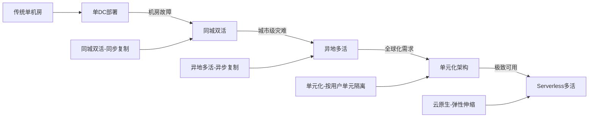

**当前趋势：**

1. **单元化架构兴起**：将用户按单元（如城市、用户ID段）划分，每个单元包含完整的服务栈，单元内强一致，单元间最终一致。这是异地多活的演进方向，也是下一节"单元化架构"将深入探讨的内容。

2. **云原生多活**：借助 Kubernetes 多集群、多地域部署能力，简化异地多活的运维复杂度。AWS Multi-Region、阿里云多可用区等云服务降低了多活的门槛。Kubernetes Federation v2 提供了跨集群的应用部署和管理能力。

3. **Serverless 多活**：利用 Serverless 架构天然的多AZ部署能力，无需管理底层基础设施，自动实现跨地域冗余。Cloudflare Workers、Vercel Edge Functions 等平台让开发者无需关心底层基础设施即可实现全球部署。

4. **CRDT 数据结构**：无冲突复制数据类型（Conflict-free Replicated Data Types）在分布式系统中的应用越来越广，它从数学层面保证多副本的最终一致性，减少冲突处理的业务复杂度。Redis 的 CRDT 模块、Automerge 和 Yjs 等协作编辑框架都在推动 CRDT 的工程化应用。

5. **智能调度 AI 化**：利用机器学习预测用户访问模式和 DC 负载，实现更精准的流量调度。Google 的 Maglev 和 Cloudflare 的 load balancing 都在探索基于 AI 的智能路由。

---

## 十二、本节小结

异地多活是多活架构体系中**复杂度最高、挑战最大、价值也最大**的架构模式。核心要点回顾：

1. **数据分片是基石**：没有合理的数据分片策略，异地多活将陷入无尽的冲突处理泥潭
2. **最终一致是常态**：接受并适配数据的最终一致性，而非追求不可能的强一致
3. **渐进式切换是保障**：故障切换和回切都必须采用灰度策略，宁慢勿错
4. **监控和演练是生命线**：再多的架构设计也需要通过监控验证、通过演练检验
5. **组织和流程是关键**：技术只是基础，团队协作、运维流程、应急预案同样重要
6. **成本评估要先行**：异地多活的运维成本是单DC的15-20倍，投入必须匹配业务价值
7. **CRDT 是工具不是银弹**：适用于特定场景，不能替代所有冲突解决机制

在下一节「单元化架构」中，我们将深入探讨如何在异地多活的基础上，通过单元化设计进一步提升系统的隔离性和可扩展性。
