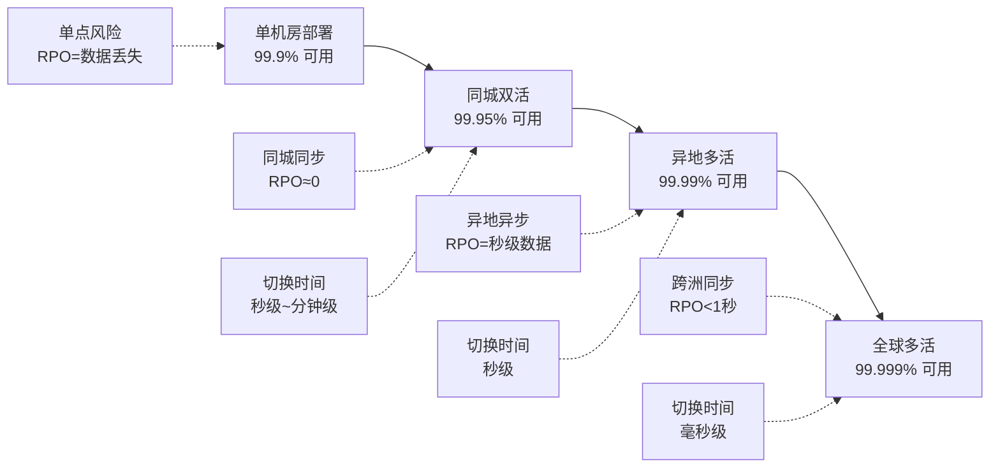
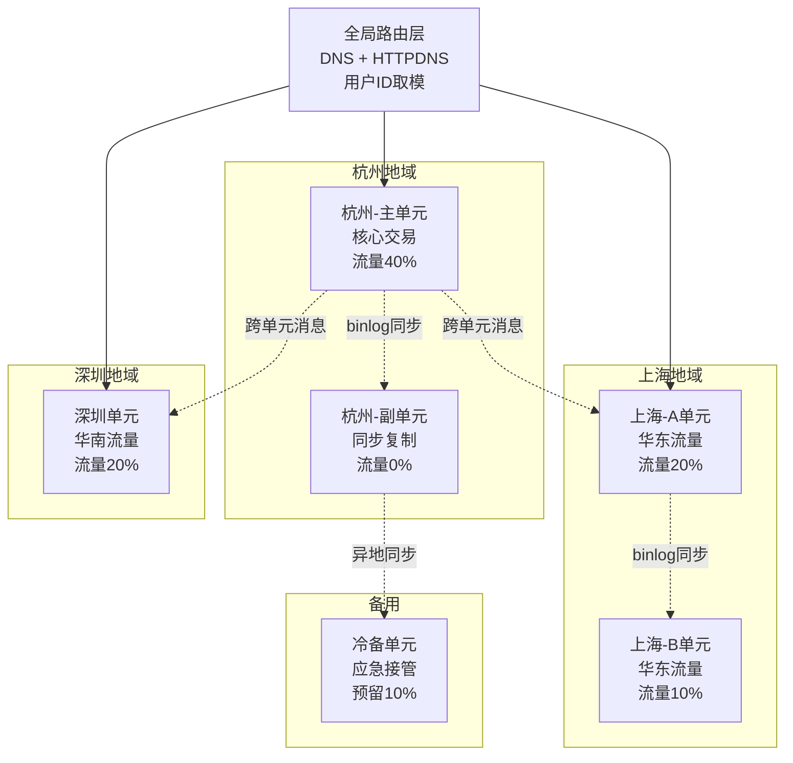
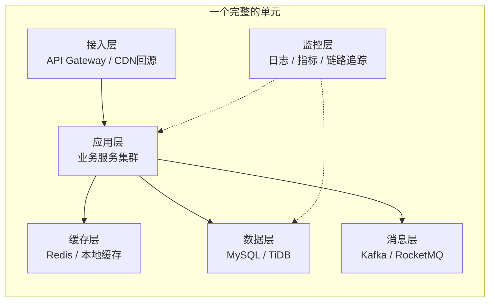
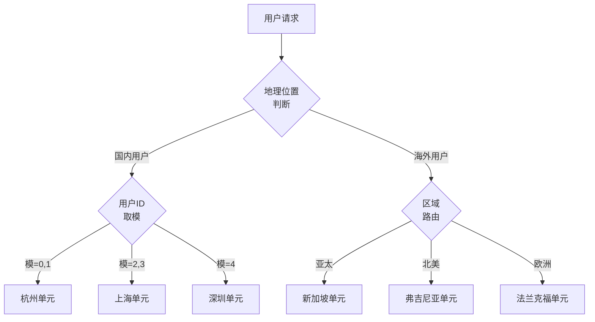
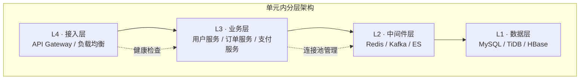
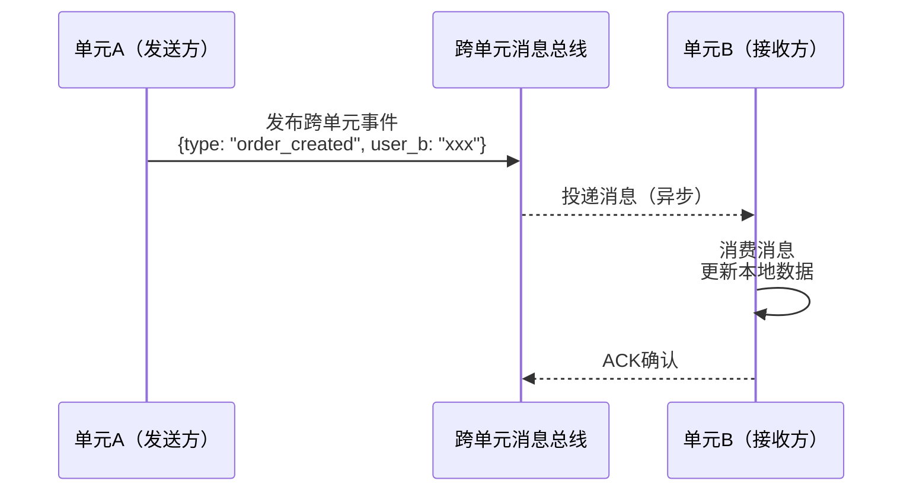
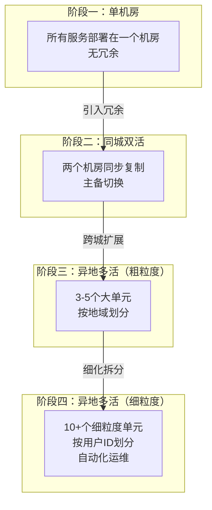

# 单元化架构

单元化架构（Unitization Architecture）是异地多活系统的核心设计范式。它回答了一个根本问题：当业务规模突破单机房承载极限时，如何将一个庞大的系统拆分为多个自治的、可独立运行的"单元"，让每个单元都能独立承担一部分用户流量，同时在故障时实现平滑切换。

与同城双活仅需同步两份数据不同，异地多活需要在数十毫秒甚至上百毫秒的跨城网络延迟下保证数据一致性和业务连续性。单元化架构正是解决这一矛盾的关键——它通过"划小管理域、就近访问、故障隔离"三大原则，将跨机房的复杂性限制在单元边界之内。

---

## 1. 单元化的起源与动机

### 1.1 从单体到多活的演进路径

分布式系统的高可用演进经历了一个清晰的阶梯：



每个阶段的跃迁都面临同一个核心矛盾：**可用性提升需要更多冗余节点，但更多节点带来更复杂的一致性管理**。单元化架构的本质思路是——不要让所有节点彼此通信（全网状拓扑），而是将节点组织成若干自治的"单元"，单元内部高度内聚，单元之间松耦合。

### 1.2 为什么需要单元化

| 痛点 | 无单元化的多活 | 有单元化的多活 |
|------|---------------|---------------|
| 数据同步 | 所有节点互相同步，N个节点需要O(N²)条同步链路 | 单元内同步，单元间仅同步跨域数据，链路数大幅降低 |
| 故障爆炸半径 | 一个节点故障可能引发全局数据不一致 | 故障被限制在单元内部，其他单元不受影响 |
| 容量扩展 | 新增节点需要与所有已有节点建立同步关系 | 新增单元只需接入路由层，无需改动已有单元 |
| 业务复杂度 | 每个请求都可能跨多个数据中心 | 用户请求在单元内闭环处理，跨单元调用极少 |

### 1.3 经典案例：阿里巴巴的"三地五中心"

阿里巴巴是国内最早系统性实践单元化架构的企业。其核心交易系统在2013年开始改造，经历了从"两地三中心"到"三地五中心"的演进：

**物理拓扑**：

| 地域 | 机房 | 角色 | 承载流量占比 |
|------|------|------|-------------|
| 杭州 | 杭州主单元（2个机房） | 主单元 + 核心交易 | 40% |
| 上海 | 上海单元（2个机房） | 同城容灾 + 华东流量 | 30% |
| 深圳 | 深圳单元（1个机房） | 异地容灾 + 华南流量 | 20% |
| 备用 | 冷备单元（1个机房） | 应急接管 | 10%（预留） |

**核心设计决策**：

- **路由规则**：用户ID取模（`user_id % 5`），将全量用户均匀分配到5个单元
- **数据归属**：每条订单、每笔交易数据由且仅由一个单元"拥有"，写操作路由到主人单元
- **中心单元**：商品库、搜索索引等全局数据由独立的中心单元管理，其他单元只读访问
- **跨单元调用**：A用户给B用户转账时，通过TCC分布式事务保证一致性，延迟控制在100ms以内



**双十一实战数据**：

- 峰值QPS达到每秒数十万笔交易，单元化架构使每个单元仅需处理全量流量的1/5
- 任一单元故障时，流量在秒级切换到其他单元，用户无感知
- 从2013年改造完成到2025年，该架构支撑了12届双十一，累计处理超过万亿笔交易
- 关键指标：RTO（恢复时间目标）< 30秒，RPO（恢复点目标）< 1秒

**阿里巴巴单元化的三条经验教训**：

1. **先非核心后核心**：先用商品推荐、搜索等非核心业务验证单元化方案，再推广到交易系统
2. **对账是生命线**：即使有分布式事务，仍然需要每小时全量对账，发现并修复微小的数据不一致
3. **容量余量不是越多越好**：初期预留了50%余量导致资源浪费严重，后来调整为25-30%，配合弹性伸缩

### 1.4 其他行业案例

**京东**：采用"三地多中心"架构，4-6个核心单元，路由策略为"用户ID + 地理位置"混合。京东的特色在于自研了数据同步工具JES（京东数据同步服务），支持毫秒级的跨单元数据同步。

**美团**：天然适合地理分片——外卖、到店等业务的用户行为高度本地化。美团的单元化以城市为单位，同一城市的用户请求在本城市机房内闭环处理，大幅降低了延迟。

**字节跳动**：抖音/TikTok的全球多活架构以区域为单元（亚太、欧洲、北美），每个区域内部再按用户ID细分。字节的特色在于"读写分离+就近写入"策略——写操作路由到用户归属单元，读操作就近路由到最近的单元。

---

## 2. 单元的核心概念

### 2.1 什么是"单元"

**单元（Unit）** 是一个能够独立完成业务闭环的最小架构单元。一个合格的单元必须满足以下条件：



具体而言：

- **接入层**：负责接收用户请求，完成鉴权、限流、路由等通用逻辑
- **应用层**：承载业务逻辑，处理用户的核心操作（下单、支付、浏览等）
- **缓存层**：提供热数据的快速访问，减轻数据库压力
- **数据层**：持久化存储本单元归属用户的数据，是单元自治的基石
- **消息层**：处理单元内的异步任务和事件驱动逻辑
- **监控层**：采集单元运行状态，支撑告警和故障排查

### 2.2 单元的边界定义

单元边界的定义决定了系统的拆分粒度和运行效率。边界定义需要回答三个核心问题：

**问题一：一个用户的请求应该在哪个单元处理？**

这就是"路由规则"（Routing Rule）。常见的路由规则包括：

| 路由规则 | 实现方式 | 适用场景 | 典型案例 |
|----------|----------|----------|----------|
| 用户ID取模 | `unit_id = user_id % N` | 以用户为中心的业务（社交、电商） | 淘宝、微信 |
| 地理位置 | 用户IP解析到最近单元 | 本地生活、LBS服务 | 美团、滴滴 |
| 业务分组 | 按业务线拆分单元 | 多业务线独立运行 | 字节跳动内部系统 |
| 混合规则 | 地理优先 + ID兜底 | 兼顾就近访问和均匀分布 | 蚂蚁金服 |

**问题二：跨单元的数据如何访问？**

当一个用户需要访问另一个单元的数据时（例如用户A给用户B转账），有两种策略：

- **主单元优先**：将操作路由到目标数据的主单元执行，确保强一致性
- **最终一致**：在本地单元暂存操作，通过异步消息同步到目标单元，接受秒级延迟

**问题三：单元故障时如何切换？**

单元故障切换的核心是"路由层切换"——将故障单元的流量重新路由到健康单元。这要求：

- 路由层能实时感知单元健康状态（通常通过心跳检测，间隔1-3秒）
- 目标单元有足够的容量承接额外流量（通常保持20-30%的容量余量）
- 切换过程对用户透明（路由层在DNS/TCP层面完成切换）

### 2.3 单元的分类

根据在多活体系中承担的角色，单元可以分为以下几类：

**流量单元（Traffic Unit）**：直接承接用户流量的单元，是多活架构的主体。每个流量单元包含完整的业务处理能力，用户请求在其归属单元内闭环处理。流量单元是数量最多、最核心的单元类型。

**中心单元（Central Unit）**：处理全局性、无法按用户分片的业务逻辑。典型场景包括：

- 全局商品库的查询和搜索
- 全站排行榜和推荐系统
- 跨用户的消息通知（如系统公告）
- 全局配置管理

中心单元通常只有1-2个，部署在离主站最近的机房。中心单元的设计需要特别关注以下问题：

| 设计考量 | 解决方案 | 说明 |
|----------|---------|------|
| 高可用 | 至少2个副本，主从切换 | 中心单元故障会导致所有流量单元失去全局数据 |
| 读性能 | 各流量单元缓存中心数据的本地副本 | 减少跨单元读取，延迟从100ms降至<1ms |
| 写一致性 | 中心单元写入后异步推送到各流量单元 | 接受秒级延迟，通过版本号检测过期数据 |
| 容量规划 | 按全站读QPS的1/10设计（缓存命中后） | 热数据缓存后，中心单元实际压力远小于全站 |

**管控单元（Control Unit）**：负责全局的运维管理、监控告警、配置下发等功能。管控单元不直接处理业务流量，但在故障切换和容量调度中起关键作用。

---

## 3. 单元划分策略

单元划分是单元化架构设计的第一步，也是最关键的决策之一。划分策略的选择直接影响数据分布的均匀性、跨单元调用的频率、以及故障切换的复杂度。

### 3.1 按用户ID分片

**原理**：将用户ID通过哈希取模（如 `user_id % N`）分配到固定单元。同一用户的所有数据（订单、购物车、浏览记录、好友关系等）都存储在同一个单元中。

**优点**：
- 用户的读写操作100%在本地单元完成，延迟最低
- 路由逻辑简单，只需对用户ID做一次哈希计算
- 数据分布均匀，不存在热点问题（前提是用户ID分布均匀）

**缺点**：
- 跨用户交互（如转账、消息、社交关系）必须跨单元处理
- 用户扩容时需要数据迁移（rehash），操作复杂度高

**适用场景**：以用户为中心的C端业务，如社交、电商、游戏。

**代码示例——用户路由计算**：

```python
import hashlib

class UnitRouter:
    """基于用户ID的单元路由"""
    
    def __init__(self, unit_count: int):
        self.unit_count = unit_count
    
    def get_unit_id(self, user_id: str) -> int:
        """计算用户归属单元ID"""
        hash_value = int(hashlib.md5(user_id.encode()).hexdigest(), 16)
        return hash_value % self.unit_count
    
    def get_unit_name(self, user_id: str) -> str:
        """获取用户归属单元名称"""
        unit_id = self.get_unit_id(user_id)
        # 单元命名规则：地域-编号，如 hangzhou-01
        unit_names = [
            "hangzhou-01", "hangzhou-02",
            "shanghai-01", "shanghai-02",
            "shenzhen-01"
        ]
        return unit_names[unit_id]


# 使用示例
router = UnitRouter(unit_count=5)
user_ids = ["user_10001", "user_20002", "user_30003"]

for uid in user_ids:
    unit = router.get_unit_name(uid)
    print(f"用户 {uid} → 归属单元: {unit}")
```

### 3.2 按地理位置分片

**原理**：根据用户的物理位置（通过IP地址解析获取）将其分配到最近的数据中心。

**优点**：
- 用户访问延迟最低，体验最佳
- 自然实现了就近访问，减少跨城网络传输

**缺点**：
- 用户流动性问题：出差、旅行时需要跨单元访问
- IP定位精度有限，存在误判（如CDN节点、VPN、代理）
- 部分地区的用户量可能远多于其他地区，导致负载不均衡

**适用场景**：与地理位置强相关的业务，如本地生活（美团）、出行（滴滴）、视频CDN。

**实现要点**：

```python
import ipaddress
from typing import Dict, Tuple

class GeoUnitRouter:
    """基于地理位置的单元路由"""
    
    # 各机房覆盖的IP段（简化示例）
    # 实际生产中使用GeoIP数据库（如MaxMind GeoLite2）
    GEO_RANGES: Dict[str, list] = {
        "hangzhou-01": [
            ("10.0.0.0", "10.255.255.255"),    # 杭州本地IP段
        ],
        "shanghai-01": [
            ("172.16.0.0", "172.31.255.255"),  # 上海本地IP段
        ],
        "beijing-01": [
            ("192.168.0.0", "192.168.255.255"), # 北京本地IP段
        ],
    }
    
    # 兜底单元（无法定位时使用）
    DEFAULT_UNIT = "hangzhou-01"
    
    def route(self, client_ip: str) -> str:
        """根据客户端IP路由到最近单元"""
        ip_num = int(ipaddress.ip_address(client_ip))
        
        for unit_name, ranges in self.GEO_RANGES.items():
            for start, end in ranges:
                start_num = int(ipaddress.ip_address(start))
                end_num = int(ipaddress.ip_address(end))
                if start_num <= ip_num <= end_num:
                    return unit_name
        
        # IP定位失败，使用兜底策略
        # 实际生产中会结合用户ID哈希作为兜底
        return self.DEFAULT_UNIT
```

### 3.3 按业务线分片

**原理**：将不同的业务线部署在不同的数据中心。例如，搜索服务在北京，推荐服务在上海，支付服务在深圳。

**优点**：
- 各业务线独立演进，互不影响
- 可以根据各业务线的资源需求独立扩缩容

**缺点**：
- 业务间的依赖（如搜索→推荐→支付）需要跨机房调用，增加延迟
- 用户体验可能受到跨机房调用延迟的影响

**适用场景**：企业内部多业务线共存、资源需求差异大的情况。

### 3.4 混合分片策略

实际生产环境中，单一的分片策略往往无法满足所有需求。混合分片策略将多种策略组合使用：



这种混合策略的核心思路是：

1. **第一层**：按大区域划分（国内/海外），确定大方向
2. **第二层**：在区域内按用户ID均匀分配，保证负载均衡
3. **兜底规则**：当主路由规则失败时，使用备用规则（如ID取模兜底）

### 3.5 分片策略对比

| 维度 | 用户ID分片 | 地理位置分片 | 业务线分片 | 混合分片 |
|------|-----------|-------------|-----------|---------| 
| 均匀性 | ★★★★★ | ★★☆☆☆ | ★★★☆☆ | ★★★★☆ |
| 就近访问 | ★★☆☆☆ | ★★★★★ | ★★☆☆☆ | ★★★★☆ |
| 跨单元调用 | ★★☆☆☆ | ★★★☆☆ | ★★☆☆☆ | ★★★☆☆ |
| 扩容复杂度 | ★★★★☆ | ★★☆☆☆ | ★☆☆☆☆ | ★★★☆☆ |
| 故障隔离 | ★★★★★ | ★★★★☆ | ★★★★★ | ★★★★★ |
| 实现复杂度 | ★★☆☆☆ | ★★★☆☆ | ★★★☆☆ | ★★★★★ |

---

## 4. 单元内架构设计

### 4.1 分层架构模型

每个单元内部采用分层架构，自下而上包括：



**各层职责与设计要点**：

**L4 · 接入层**
- 承载流量入口，完成 TLS 终止、限流熔断、请求路由
- 需要维护"用户→单元"的路由映射表
- 路由映射表支持动态更新，用于故障切换时实时重路由
- 典型实现：Nginx + Lua、Envoy、自研网关

**L3 · 业务层**
- 执行核心业务逻辑，是单元自治的关键
- 所有业务操作尽量在单元内闭环，避免跨单元调用
- 跨单元调用通过异步消息解耦，而非同步RPC
- 典型实现：Java Spring Cloud、Go微服务框架

**L2 · 中间件层**
- 提供缓存、消息队列、搜索等通用能力
- 每个单元拥有独立的 Redis Cluster、Kafka 集群
- 中间件的数据与单元内的数据层保持一致
- 典型实现：Redis Cluster、Apache Kafka、Elasticsearch

**L1 · 数据层**
- 持久化存储本单元归属用户的数据
- 数据的读写操作100%在单元内完成（理想状态）
- 跨单元的数据访问通过数据同步链路实现（异步、最终一致）
- 典型实现：MySQL + Binlog同步、TiDB（天然支持多副本）

### 4.2 数据归属设计

数据归属（Data Ownership）是单元化架构的核心约束：**每条数据有且仅有一个"主人"单元，所有写操作必须路由到主人单元执行**。

```python
from dataclasses import dataclass
from typing import Optional

@dataclass
class DataOwnership:
    """数据归属管理器"""
    
    # 数据类型 → 归属维度映射
    # 例如：订单属于用户，商品属于平台
    OWNERSHIP_RULES = {
        "order": "user_id",       # 订单归属到用户所在单元
        "cart": "user_id",        # 购物车归属到用户所在单元
        "browse_history": "user_id",
        "product": "central",     # 商品数据由中心单元统一管理
        "search_index": "central",
        "notification": "user_id",
    }
    
    def __init__(self, router: 'UnitRouter'):
        self.router = router
    
    def get_owner_unit(self, data_type: str, record: dict) -> str:
        """获取数据的归属单元"""
        rule = self.OWNERSHIP_RULES.get(data_type)
        
        if rule == "central":
            return "central-unit"
        
        if rule and rule in record:
            owner_id = str(record[rule])
            return self.router.get_unit_name(owner_id)
        
        # 默认归属到请求发起者的单元
        return "local"
    
    def is_local(self, data_type: str, record: dict, 
                 local_unit: str) -> bool:
        """判断数据是否在本单元内"""
        owner = self.get_owner_unit(data_type, record)
        return owner == local_unit


# 使用示例
router = UnitRouter(unit_count=5)
ownership = DataOwnership(router)

# 订单数据归属
order = {"user_id": "user_10001", "order_id": "ORD_20240101_001"}
owner = ownership.get_owner_unit("order", order)
print(f"订单 {order['order_id']} 归属单元: {owner}")

# 商品数据归属
product = {"product_id": "SKU_12345", "name": "iPhone 16"}
owner = ownership.get_owner_unit("product", product)
print(f"商品 {product['product_id']} 归属单元: {owner}")
```

**数据归属的三大原则**：

1. **唯一性原则**：一条数据在同一时刻只有一个主人单元，不存在"双写"场景
2. **可迁移性原则**：当用户从一个单元迁移到另一个单元时，其归属数据也必须随之迁移
3. **可审计性原则**：每次数据归属变更必须有完整的审计日志，便于事后追踪和对账

### 4.3 路由层设计

路由层是单元化架构的"大脑"，负责将每个用户请求精确路由到正确的单元。路由层的设计需要考虑以下关键要素：

**路由表设计**：

```python
import json
from typing import Dict, List
from dataclasses import dataclass, field

@dataclass
class UnitInfo:
    """单元信息"""
    name: str                    # 单元名称，如 hangzhou-01
    region: str                  # 地域，如 hangzhou
    endpoint: str                # 接入地址
    capacity: int                # 容量上限（QPS）
    current_load: int = 0        # 当前负载
    is_healthy: bool = True      # 健康状态
    priority: int = 0            # 故障切换优先级

class RoutingTable:
    """路由表管理"""
    
    def __init__(self):
        self.units: Dict[str, UnitInfo] = {}
        self.user_unit_map: Dict[str, str] = {}  # user_id → unit_name
    
    def register_unit(self, unit: UnitInfo):
        """注册单元"""
        self.units[unit.name] = unit
    
    def assign_user(self, user_id: str, unit_name: str):
        """分配用户到单元"""
        if unit_name not in self.units:
            raise ValueError(f"单元 {unit_name} 不存在")
        self.user_unit_map[user_id] = unit_name
    
    def route(self, user_id: str) -> UnitInfo:
        """路由用户到目标单元"""
        # 1. 查路由表
        if user_id in self.user_unit_map:
            unit_name = self.user_unit_map[user_id]
            unit = self.units[unit_name]
            if unit.is_healthy:
                return unit
        
        # 2. 健康检查失败，故障切换
        return self.failover(user_id)
    
    def failover(self, user_id: str) -> UnitInfo:
        """故障切换：将用户路由到备用单元"""
        # 按优先级选择健康单元
        candidates = sorted(
            [u for u in self.units.values() if u.is_healthy],
            key=lambda u: (u.priority, u.current_load)
        )
        
        if not candidates:
            raise RuntimeError("所有单元均不可用，系统熔断")
        
        # 选择负载最低的健康单元
        target = candidates[0]
        self.user_unit_map[user_id] = target.name
        return target
    
    def mark_unhealthy(self, unit_name: str):
        """标记单元为不健康"""
        if unit_name in self.units:
            self.units[unit_name].is_healthy = False
            # 触发该单元所有用户的故障切换
            affected = [
                uid for uid, un in self.user_unit_map.items() 
                if un == unit_name
            ]
            for uid in affected:
                self.failover(uid)
```

**路由表同步机制**：

路由表需要在所有接入节点间保持一致。常用的同步方式包括：

| 同步方式 | 延迟 | 一致性 | 适用场景 |
|----------|------|--------|----------|
| Redis集中存储 | <1ms | 强一致 | 中小规模，单元数<20 |
| 配置中心推送 | 100ms-1s | 最终一致 | 中大规模，单元数20-100 |
| 本地缓存 + 增量同步 | <10ms | 最终一致 | 超大规模，对延迟敏感 |
| DNS + HTTPDNS | 1s-60s | 最终一致 | 粗粒度的地域级路由 |

**路由一致性保障**：

路由表的"最终一致"可能导致短暂的路由不一致——用户请求到达错误的单元。解决策略：

1. **请求重定向**：目标单元发现用户不属于本单元时，返回302重定向到正确单元，接入层自动转发
2. **路由版本号**：每次路由变更附带版本号，接入层拒绝旧版本的路由表
3. **双写窗口**：路由切换时，在新旧两个单元同时写入数据，切换完成后关闭旧单元写入

---

## 5. 单元间通信

尽管单元化架构的目标是让请求在单元内闭环，但在实际业务中，跨单元交互不可避免。设计高效的单元间通信机制是单元化架构成功的关键。

### 5.1 跨单元调用的典型场景

| 场景 | 调用方向 | 一致性要求 | 推荐方案 |
|------|---------|-----------|---------|
| A用户给B用户转账 | 双向 | 强一致 | 主单元路由 + 分布式事务 |
| 用户查看全局排行榜 | 读取中心单元 | 最终一致 | 异步同步 + 本地缓存 |
| 系统公告推送到所有用户 | 广播 | 最终一致 | 异步消息队列 |
| 跨单元订单合并（如团购） | 汇聚 | 强一致 | Saga模式 |
| 搜索全站商品 | 读取中心单元 | 最终一致 | ES跨单元查询 |

### 5.2 同步调用模式

当跨单元操作需要强一致性时，采用同步调用模式。核心原则是：**写操作必须路由到数据的主单元执行**。

```python
class CrossUnitSyncCaller:
    """跨单元同步调用"""
    
    def __init__(self, routing_table: RoutingTable):
        self.routing_table = routing_table
    
    def transfer(self, from_user: str, to_user: str, amount: float):
        """
        转账操作：必须在目标用户所在单元执行
        采用 TCC（Try-Confirm-Cancel）模式保证一致性
        """
        from_unit = self.routing_table.route(from_user)
        to_unit = self.routing_table.route(to_user)
        
        if from_unit.name == to_unit.name:
            # 同一单元内，直接处理
            return self._local_transfer(from_user, to_user, amount)
        
        # 跨单元：采用 TCC 模式
        try:
            # Phase 1: Try - 在两个单元分别冻结资金
            self._call_remote(from_unit, "freeze", {
                "user_id": from_user, "amount": amount
            })
            self._call_remote(to_unit, "freeze", {
                "user_id": to_user, "amount": -amount  # 负数表示增加可用额度
            })
            
            # Phase 2: Confirm - 确认转账
            self._call_remote(from_unit, "confirm", {
                "user_id": from_user, "amount": amount
            })
            self._call_remote(to_unit, "confirm", {
                "user_id": to_user, "amount": -amount
            })
            
            return {"status": "success", "message": "转账成功"}
            
        except Exception as e:
            # Phase 3: Cancel - 回滚冻结
            self._call_remote(from_unit, "cancel", {
                "user_id": from_user, "amount": amount
            })
            self._call_remote(to_unit, "cancel", {
                "user_id": to_user, "amount": -amount
            })
            raise RuntimeError(f"转账失败，已回滚: {e}")
    
    def _call_remote(self, unit: UnitInfo, action: str, params: dict):
        """调用远程单元的接口"""
        # 实际生产中通过 RPC 框架（如 gRPC、Dubbo）调用
        url = f"http://{unit.endpoint}/api/{action}"
        # response = requests.post(url, json=params, timeout=5)
        # return response.json()
        pass
    
    def _local_transfer(self, from_user, to_user, amount):
        """本单元内转账"""
        # 本地数据库事务处理
        pass
```

### 5.3 异步通信模式

对于非强一致性的跨单元交互，异步通信是更好的选择。通过消息队列实现单元间的解耦：



**异步通信的关键设计**：

1. **幂等性**：消息可能被重复投递，消费者必须实现幂等处理
2. **有序性**：同一用户的消息需要保证顺序（通过user_id作为partition key）
3. **可靠性**：消息丢失的补偿机制（如定期全量对账）
4. **延迟控制**：异步通信的端到端延迟通常在1-5秒，需在业务上可接受

### 5.4 数据同步通道

单元间的数据同步是单元化架构的"生命线"。根据同步方式的不同，可以分为以下几类：

**实时同步（秒级）**

通过Canal/Maxwell等工具解析数据库binlog，实时将变更推送到目标单元。适用于对数据时效性要求较高的场景（如用户余额变动）。端到端延迟：1-5秒。

Canal的工作原理：


Canal的关键配置：

```yaml
# canal.properties 核心配置
canal.instance.mysql.slaveId=1234          # 唯一slave ID
canal.instance.master.address=10.0.0.1:3306  # 源库地址
canal.instance.dbUsername=canal
canal.instance.dbPassword=canal
canal.instance.filter.regex=.*\\..*         # 监听所有库表
canal.mq.topic=canal-sync-topic             # Kafka topic
```

**准实时同步（分钟级）**

通过定时任务（如Flink、Spark Streaming）将变更数据批量同步。适用于对时效性要求不高但数据量大的场景（如浏览历史）。端到端延迟：1-5分钟。

**最终同步（小时级/天级）**

通过离线任务（如Hive、Spark）定期做全量对账和增量同步。适用于离线报表、数据分析等场景。端到端延迟：1小时-24小时。

**数据同步的一致性保障**：

| 保障机制 | 实现方式 | 适用场景 |
|----------|---------|---------|
| 位点同步 | 记录binlog位点，断点续传 | Canal/Maxwell实时同步 |
| GTID同步 | 使用MySQL GTID保证全局唯一事务ID | 跨版本MySQL同步 |
| 全量对账 | 每小时/每天对比源库和目标库的hash | 所有同步场景的兜底 |
| 增量修复 | 对账发现差异后，只同步差异数据 | 大规模数据修复 |

---

## 6. 单元化架构的关键挑战

### 6.1 数据一致性

**挑战描述**：在单元化架构中，同一份数据可能在多个单元中存在副本。由于网络延迟和异步复制的存在，副本之间可能出现不一致。

**解决方案——分层一致性模型**：

| 一致性层级 | 适用数据 | 实现方式 | 延迟 |
|-----------|---------|---------|------|
| 强一致 | 资金、库存等核心数据 | 分布式事务（TCC/Saga） | 同步 |
| 会话一致 | 用户自己的数据 | 写后读路由到主单元 | 0秒 |
| 最终一致 | 评论、点赞等非核心数据 | binlog异步同步 | 1-5秒 |
| 弱一致 | 排行榜、推荐列表 | 定期批量同步 | 分钟级 |

**一致性保障的四层防线**：

1. **写入层**：核心数据通过TCC/Saga分布式事务保证强一致
2. **同步层**：binlog同步 + GTID位点追踪，保证不丢不重
3. **对账层**：每小时全量hash对账，发现并修复微小不一致
4. **修复层**：对账发现差异后，通过补偿任务自动修复

### 6.2 单元内热点

**挑战描述**：即使用户被均匀分配到各单元，仍可能出现"超级用户"（如网红、大V）导致单个单元负载远高于其他单元。

**热点问题的量化分析**：

假设采用用户ID取模分片，5个单元各承载20%流量。但如果某个"超级用户"（如拥有5000万粉丝的主播）被分配到单元A，其直播间开播时：

- 该用户的读请求（查看主页、动态）100%落在单元A
- 该用户的粉丝评论、点赞等写请求也需要路由到单元A
- 单元A的瞬时负载可能是其他单元的5-10倍

**解决方案**：

1. **读写分离**：热点用户的读请求分散到多个副本，写请求仍路由到主单元
2. **本地缓存**：热点数据缓存在接入层，减轻下游压力。例如，大V的主页数据缓存在CDN，用户请求直接从CDN获取，不回源
3. **限流降级**：对热点用户的非核心请求进行限流或降级（如延迟显示评论数）
4. **动态再平衡**：将热点用户的部分流量临时迁移到负载较低的单元（如将该用户的粉丝按ID再细分到不同单元）
5. **数据预热**：在热点事件（如直播、秒杀）发生前，提前将相关数据加载到各单元的缓存中

**代码示例——热点检测与降级**：

```python
import time
from collections import defaultdict

class HotspotDetector:
    """单元内热点检测器"""
    
    def __init__(self, threshold_qps: int = 10000, window_sec: int = 60):
        self.threshold_qps = threshold_qps
        self.window_sec = window_sec
        self.user_requests = defaultdict(list)  # user_id → [timestamp]
    
    def record(self, user_id: str):
        """记录用户请求"""
        now = time.time()
        self.user_requests[user_id].append(now)
        # 清理过期记录
        self.user_requests[user_id] = [
            t for t in self.user_requests[user_id]
            if now - t < self.window_sec
        ]
    
    def is_hotspot(self, user_id: str) -> bool:
        """判断用户是否为热点"""
        return len(self.user_requests[user_id]) > self.threshold_qps
    
    def get_degrade_level(self, user_id: str) -> str:
        """根据热点程度返回降级级别"""
        qps = len(self.user_requests[user_id])
        if qps > self.threshold_qps * 5:
            return "heavy"   # 重度降级：只返回缓存数据
        elif qps > self.threshold_qps * 2:
            return "medium"  # 中度降级：延迟非核心数据
        elif qps > self.threshold_qps:
            return "light"   # 轻度降级：限流非核心请求
        return "none"        # 不降级
```

### 6.3 路由准确性

**挑战描述**：路由表的准确性和实时性直接影响单元化架构的效果。路由错误会导致数据访问跨单元，增加延迟和不一致风险。

**解决方案**：

1. **路由表版本化**：每次路由变更都带版本号，防止旧版本覆盖新版本
2. **路由审计**：记录每次路由决策的日志，便于事后分析和纠错
3. **双写验证**：路由切换时，双写新旧两个单元，验证数据一致性后再切读
4. **灰度切换**：路由变更先对小比例用户生效，观察无异常后再全量推进

### 6.4 容量规划

**挑战描述**：每个单元的容量需要精确规划。容量过大会浪费资源，容量过小则无法承接故障切换时的额外流量。

**容量规划公式**：

单元容量 = 基准流量 / 单元数量 × (1 + 冗余系数)

其中：
- **基准流量**：正常情况下的峰值QPS
- **单元数量**：参与流量分配的单元总数
- **冗余系数**：通常为0.2-0.3（即预留20%-30%的余量用于故障切换）

**示例**：假设全站峰值QPS为100万，部署5个单元：
每个单元的流量 = 100万 / 5 = 20万 QPS
每个单元的容量 = 20万 × 1.3 = 26万 QPS（预留30%余量）

**容量规划的进阶考量**：

| 考量维度 | 说明 | 推荐值 |
|----------|------|--------|
| 冗余系数 | 故障切换时需要承接的额外流量比例 | 20%-30% |
| 增长系数 | 业务自然增长导致的流量增长 | 1.5-2倍（按年度规划） |
| 峰值系数 | 大促/活动期间的流量放大倍数 | 3-10倍（视业务而定） |
| 弹性上限 | 云资源能动态扩展的最大容量 | 基准的2-3倍 |

---

## 7. 单元化架构的演进路径

### 7.1 四阶段演进模型



### 7.2 每个阶段的关键任务

**阶段一 → 阶段二**：
- 建设同城第二个机房
- 实现数据库同步复制
- 建设基础的故障检测和切换能力
- 预计周期：3-6个月

**阶段二 → 阶段三**：
- 建设异地数据中心
- 实现单元化拆分和路由
- 建设跨单元数据同步通道
- 改造业务为"单元友好"（消除全局状态）
- 预计周期：6-12个月

**阶段三 → 阶段四**：
- 细化单元粒度，从3-5个扩展到10+个
- 建设自动化的路由管理和故障切换
- 实现容量的自动弹性伸缩
- 建设完善的监控和可观测体系
- 预计周期：12-24个月

### 7.3 单元化改造的典型陷阱

**陷阱一：全局状态未消除**

单体应用中常见的全局状态（如全局计数器、全局锁、Session共享存储）在单元化后会成为致命问题。例如，全局计数器如果只在一个单元更新，其他单元读到的就是过期数据。

**应对方案**：将全局状态拆分为"单元内局部状态 + 异步聚合"。例如，每个单元维护自己的计数器，通过消息队列异步聚合到中心单元。

**陷阱二：跨单元调用链过长**

改造初期，很多开发者习惯性地将跨单元调用写成同步RPC链路：A单元调B单元，B单元调C单元，C单元再调回A单元。这种"循环依赖"会导致延迟累积和级联故障。

**应对方案**：严格执行"单元内闭环"原则。跨单元调用必须是单向的、异步的。如果业务逻辑确实需要多单元协作，使用Saga模式编排，而非嵌套RPC。

**陷阱三：数据迁移不完整**

在将现有系统改造为单元化架构时，需要将历史数据按归属规则迁移到各单元。如果迁移不完整，会出现"数据孤岛"——部分数据在旧库，部分在新单元。

**应对方案**：采用"双读+灰度切换"策略。迁移期间同时读取新旧两个数据源，对比结果一致后再关闭旧数据源。迁移过程必须可回滚。

**陷阱四：测试覆盖不足**

单元化架构的复杂度远高于单机房架构，但很多团队的测试仍停留在单元测试层面，缺乏跨单元集成测试和故障注入测试。

**应对方案**：建立三层测试体系——单元内测试（常规单测）+ 跨单元集成测试（模拟真实网络延迟和故障）+ 混沌工程测试（随机注入网络分区、节点故障）。

---

## 8. 单元化架构的设计原则

### 8.1 六大设计原则

| 原则 | 含义 | 违反后果 |
|------|------|---------| 
| 单元自治 | 每个单元能独立处理用户请求，不依赖其他单元 | 一个单元故障导致全站不可用 |
| 数据归属明确 | 每条数据有且仅有一个主人单元 | 数据冲突，无法解决一致性问题 |
| 路由确定性 | 同一用户的请求始终路由到同一单元 | 会话中断，用户体验严重下降 |
| 无跨单元有状态调用 | 单元间通过无状态或异步方式通信 | 跨单元调用超时导致级联故障 |
| 优雅降级 | 跨单元依赖失败时能降级而非崩溃 | 一个单元慢导致全局雪崩 |
| 可观测性 | 每个单元的运行状态可独立监控 | 故障发现慢，恢复时间长 |

### 8.2 单元化改造的典型检查清单

在将现有系统改造为单元化架构时，需要逐项检查以下改造点：

□ 路由层改造
  □ 用户→单元的路由映射表
  □ 路由表的动态更新机制
  □ 路由故障的兜底策略

□ 数据层改造
  □ 识别全局数据（如商品库）与用户数据（如订单）
  □ 为用户数据设计分片键和归属规则
  □ 建设跨单元数据同步通道
  □ 实现数据的一致性校验和对账

□ 业务层改造
  □ 消除全局状态（如全局计数器、全局锁）
  □ 将同步跨单元调用改为异步消息
  □ 实现优雅降级（跨单元依赖不可用时的兜底逻辑）
  □ 确保所有接口的幂等性

□ 中间件层改造
  □ 每个单元部署独立的Redis集群
  □ 每个单元部署独立的Kafka集群
  □ 配置中心支持按单元隔离

□ 运维层改造
  □ 监控系统支持按单元维度聚合指标
  □ 告警系统支持按单元维度配置阈值
  □ 故障切换流程的自动化
  □ 容量评估和弹性伸缩机制

---

## 9. 单元化架构的可观测性设计

可观测性是单元化架构的"眼睛"——在多单元环境下，"看不见"比"做不到"更危险。一个完善的可观测性体系需要覆盖三个维度：指标（Metrics）、日志（Logs）、链路追踪（Traces）。

### 9.1 指标体系

**单元维度的核心指标**：

| 指标类别 | 具体指标 | 告警阈值（参考） | 说明 |
|----------|---------|----------------|------|
| 流量 | 单元QPS、请求成功率 | 成功率<99.9% | 监控流量分配是否均匀 |
| 延迟 | P50/P99延迟、跨单元调用延迟 | P99>500ms | 跨单元调用是延迟的主要来源 |
| 资源 | CPU使用率、内存使用率、磁盘IO | CPU>80%持续5分钟 | 检测容量瓶颈 |
| 数据 | 同步延迟、对账差异量 | 延迟>30秒，差异>0 | 数据一致性的核心保障 |
| 故障 | 单元健康状态、路由切换次数 | 切换>3次/小时 | 频繁切换说明系统不稳定 |

**全局维度的核心指标**：

| 指标 | 说明 | 告警阈值 |
|------|------|---------|
| 全站可用性 | 所有单元的加权可用性 | <99.95% |
| 跨单元调用占比 | 跨单元调用占总调用的比例 | >15%（说明单元化不充分） |
| 单元间数据一致性 | 对账差异率 | >0.01% |
| 故障切换成功率 | 故障切换后用户请求的成功率 | <99% |

### 9.2 日志体系

**日志标准化**：每个单元的日志必须包含统一的字段，便于跨单元关联分析：

```json
{
  "timestamp": "2025-01-15T10:30:45.123Z",
  "unit": "hangzhou-01",
  "service": "order-service",
  "trace_id": "abc123def456",
  "user_id": "user_10001",
  "user_unit": "hangzhou-01",
  "target_unit": "shanghai-01",
  "cross_unit": true,
  "latency_ms": 85,
  "status": "success"
}
```

**关键日志场景**：

- **路由决策日志**：记录每次路由选择的结果和原因，便于排查路由异常
- **跨单元调用日志**：记录跨单元调用的源单元、目标单元、延迟、结果
- **数据同步日志**：记录同步位点、延迟、成功/失败状态
- **故障切换日志**：记录切换触发原因、切换前后路由变化、切换耗时

### 9.3 链路追踪

跨单元的请求链路天然跨越多个数据中心，链路追踪是定位延迟瓶颈的关键工具。

**实现方案**：

1. **Trace ID透传**：在接入层生成全局唯一的Trace ID，随请求在所有单元间传递
2. **采样策略**：正常请求1%采样，跨单元调用100%采样（因为跨单元调用是延迟的主要来源）
3. **拓扑可视化**：通过链路追踪平台（如Jaeger、SkyWalking）可视化各单元间的调用关系和延迟分布

---

## 10. 单元化架构的成本分析

单元化架构虽然带来了高可用和故障隔离，但也显著增加了基础设施成本。在决策是否采用单元化架构时，需要进行全面的成本效益分析。

### 10.1 成本构成

| 成本类别 | 具体项目 | 占比（参考） | 说明 |
|----------|---------|-------------|------|
| 硬件/云资源 | 服务器、网络、存储 | 50-60% | 每个单元需要独立的完整技术栈 |
| 运维人力 | 多机房运维、监控、故障处理 | 20-25% | 需要7×24小时运维团队 |
| 开发改造 | 业务改造、数据迁移、测试 | 15-20% | 一次性投入，持续迭代 |
| 网络带宽 | 跨单元数据同步、流量切换 | 5-10% | 跨城专线成本较高 |

### 10.2 成本优化策略

1. **按需部署**：不是所有业务都需要单元化。核心交易系统优先单元化，非核心业务（如后台管理）可以只部署在主单元
2. **弹性伸缩**：利用云资源的弹性能力，在非峰值时段缩减单元容量
3. **混合部署**：将低优先级业务（如离线计算）部署在单元的空闲资源上
4. **缓存优化**：最大化缓存命中率，减少跨单元数据同步的带宽消耗

### 10.3 投入产出评估

**什么时候值得投入单元化架构？**

| 指标 | 不需要单元化 | 建议单元化 | 必须单元化 |
|------|------------|-----------|-----------|
| 日活用户 | <100万 | 100万-1000万 | >1000万 |
| 可用性要求 | 99.9%（年停机8.7小时） | 99.95%-99.99% | >99.99%（年停机52分钟） |
| 峰值QPS | <1万 | 1万-50万 | >50万 |
| 业务影响 | 单次故障损失<10万 | 单次故障损失10万-1000万 | 单次故障损失>1000万 |

---

## 11. 业界实践对比

| 企业 | 单元化方案 | 单元数量 | 路由策略 | 关键特点 |
|------|-----------|---------|---------|---------| 
| 阿里巴巴 | 三地五中心，单元化部署 | 5个核心单元 | 用户ID取模 | 以交易单元为核心，中心单元处理全局业务 |
| Google | Spanner全球分布 | 全球多副本 | 键范围分片 | TrueTime保证外部一致性，Paxos共识协议 |
| Facebook | TAO全球复制 | 多区域 | 主写多读 | 异步复制，读多写少优化，最终一致性 |
| 京东 | 三地多中心 | 4-6个单元 | 用户ID + 地理 | 与阿里类似的交易单元化，自研数据同步工具 |
| 美团 | 地理单元化 | 多城市 | 地理位置优先 | 本地生活业务天然适合地理分片 |

---

## 12. 总结

单元化架构是多活架构从"能用"到"好用"的关键跃迁。它的核心思想可以概括为：

1. **划小**：将大系统拆分为多个自治的小单元，每个单元包含完整的业务能力
2. **归属**：每条数据有明确的主人单元，写操作路由到主人单元执行
3. **隔离**：单元间松耦合，一个单元的故障不影响其他单元
4. **就近**：用户请求在归属单元内闭环处理，延迟最低

单元化架构不是银弹。它增加了系统设计和运维的复杂度，只有当业务规模和可用性要求达到一定阈值时才值得投入。对于日活百万以下的系统，同城双活已经足够；只有当日活千万以上、可用性要求99.99%以上时，单元化架构才成为必要的技术投资。

在实施单元化架构时，建议遵循"小步快跑"的演进策略：先在非核心业务上试点，积累经验后再推广到核心交易系统。同时，务必建立完善的监控和可观测体系——在单元化架构中，"看不见"比"做不到"更危险。

最后，记住单元化架构的三条铁律：**数据归属不能模糊、路由规则不能漂移、对账机制不能缺失**。做到这三点，单元化架构就能成为系统高可用的坚实基石。
