# 数据同步机制

## 1. 概述与背景

### 1.1 为什么数据同步是多活架构的核心难题

多活架构的本质是让多个数据中心同时提供服务。当所有机房都具备读写能力时，一个无法回避的问题随之而来：**如何保证不同机房中的数据始终处于一致或可控的状态？**

这个问题的复杂性远超单机房场景。在单机房中，所有服务共享同一份数据库，数据一致性由数据库事务天然保证。而在多活架构中，数据分布在物理隔离的多个机房中，机房间通过网络连接——网络是不可靠的。这就意味着：

- **写入可见性延迟**：机房A写入的数据，机房B可能需要数秒甚至更长时间才能看到
- **并发写入冲突**：同一份数据可能被不同机房同时修改，产生不可调和的矛盾
- **故障时数据丢失**：如果采用异步同步，主机房故障时从机房尚未同步的数据将永久丢失

这些问题直接影响多活架构的两大核心目标——**可用性**和**数据安全性**。选择不当的同步策略，轻则导致用户体验下降（看到过期数据），重则造成资金损失（重复扣款、订单丢失）。

### 1.2 数据同步的基本模型

从抽象层面看，数据同步解决的是**多副本间状态传播**的问题。其核心要素包括：

| 要素 | 说明 | 典型取值 |
|------|------|---------|
| 同步方向 | 单向还是双向 | 单向（主→从）、双向（多主互相同步） |
| 同步模式 | 同步还是异步 | 同步复制（等确认）、异步复制（发即忘） |
| 同步粒度 | 行级、事务级还是库级 | 行级（细粒度）、库级（粗粒度） |
| 冲突策略 | 发现冲突后如何处理 | LWW、CRDT、业务层仲裁 |
| 一致性保证 | 读写路径上的一致性级别 | 强一致、最终一致、因果一致 |

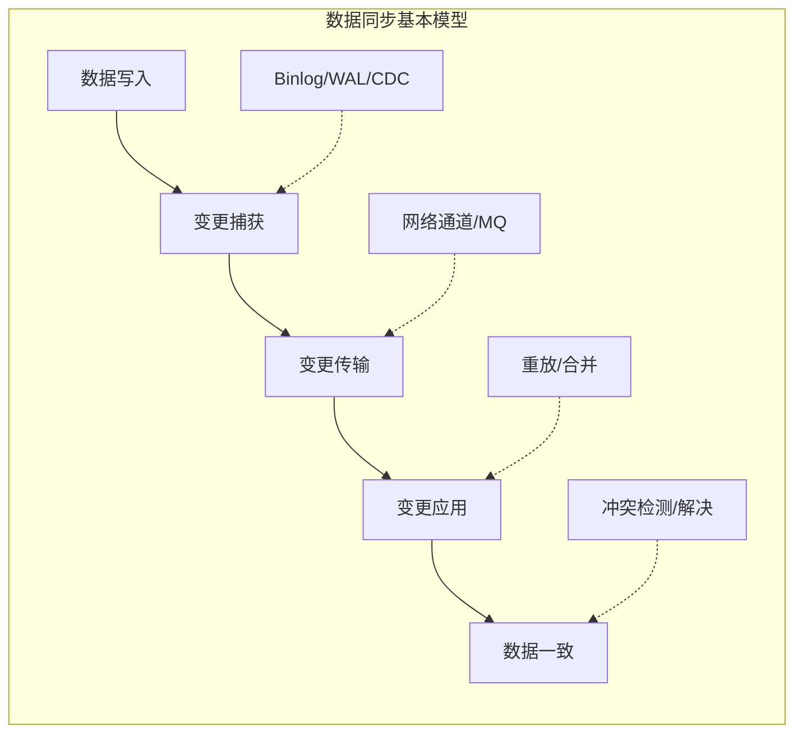

### 1.3 CAP定理与PACELC框架：数据同步的理论约束

理解数据同步机制，必须先理解分布式系统的理论约束。**CAP定理**（Brewer's Theorem）指出：在网络分区（Partition）发生时，系统必须在一致性（Consistency）和可用性（Availability）之间做出取舍。

但CAP定理仅描述了分区发生时的行为。Daniel Abadi在2012年提出的**PACELC框架**更完整地刻画了分布式数据库的设计权衡：

- **P**artition时：选择**A**vailability还是**C**onsistency？
- **E**lse（正常运行时）：选择**L**atency还是**C**onsistency？

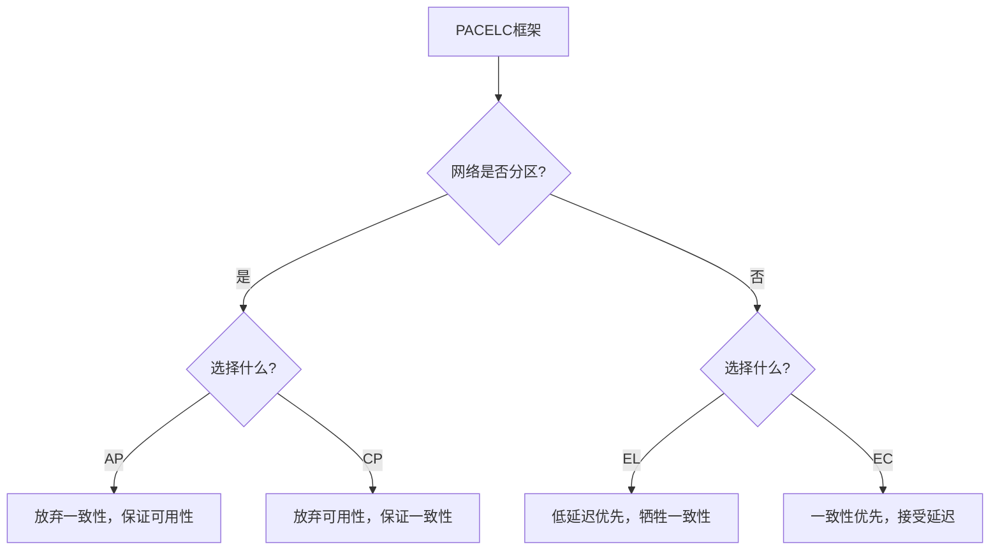

**常见系统的PACELC分类：**

| 系统 | 分区时 | 正常时 | PACELC类型 | 数据同步策略 |
|------|--------|--------|-----------|-------------|
| MySQL主从（异步） | AP（继续写主库） | EL（低延迟） | PA/EL | 异步复制，RPO>0 |
| MySQL半同步 | AP（超时降级） | 介于EL/EC | PA/EL(降级) | 半同步，动态切换 |
| TiDB（Raft） | CP（少数派不可写） | EC（多数派确认） | PC/EC | Raft强一致 |
| Cassandra | AP（继续写） | EL（可调） | PA/EL | 可调一致性级别 |
| MongoDB（多数派写） | CP | EC | PC/EC | Raft共识 |
| DynamoDB | AP | EL | PA/EL | 最终一致 |

**PACELC对数据同步策略选择的指导意义：**

1. **如果你的系统是PA/EL型**（如MySQL异步复制）：数据同步是异步的，需要通过应用层保证关键数据的一致性
2. **如果你的系统是PC/EC型**（如TiDB）：数据同步由数据库内核保证，但写入延迟较高
3. **混合策略**：大多数多活系统采用分层设计——核心交易走PC/EC路径，非核心数据走PA/EL路径

> **关键洞察：** 没有完美的同步策略，只有适合特定场景的权衡。金融系统选择PC/EC（强一致、高延迟），电商系统选择PA/EL（最终一致、低延迟），社交系统选择因果一致性（因果有序、中等延迟）。PACELC框架帮你理清选择的逻辑。

### 1.4 技术演进

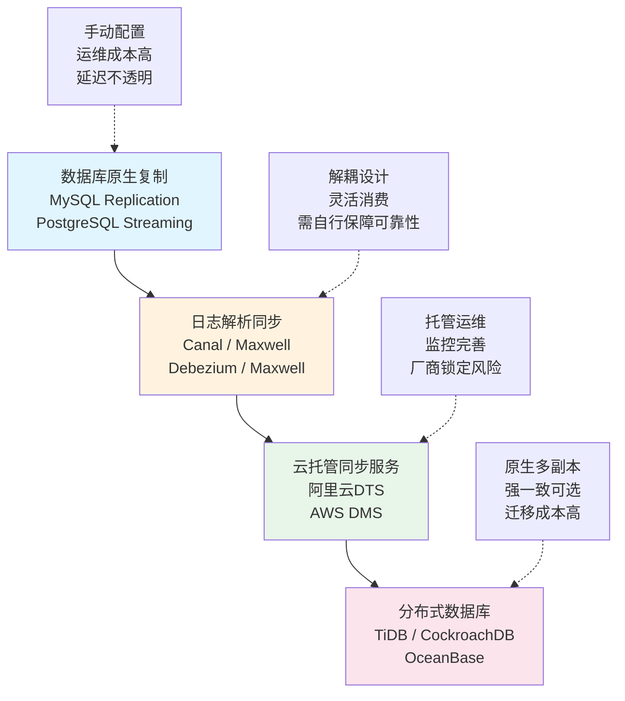

---

## 2. 同步复制与异步复制

数据同步最基本的分类维度是**同步模式**：写入操作是等所有副本确认后才返回成功（同步复制），还是写入主副本后立即返回、后续异步传播到其他副本（异步复制）。

### 2.1 同步复制（Synchronous Replication）

同步复制要求写入操作在所有（或指定数量的）副本上都持久化完成后，才向客户端返回成功。这保证了**写后读一致性**——任何节点上的读操作都能看到最新的写入结果。

**工作流程：**

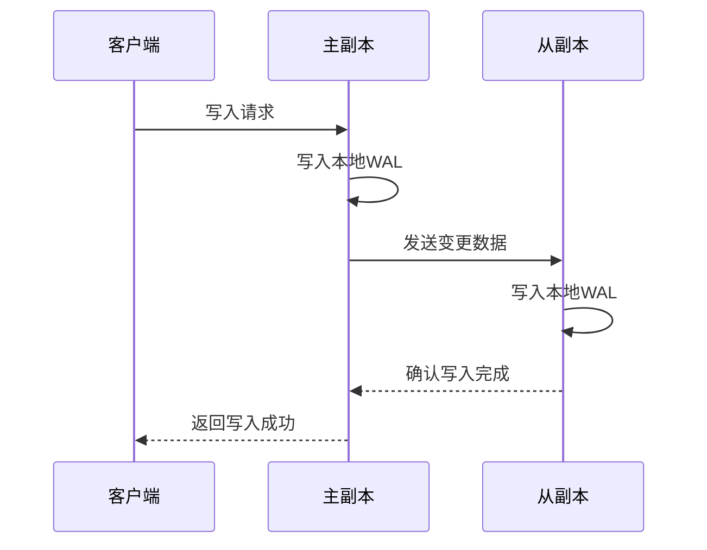

**核心优势：**

- **零数据丢失**：故障切换时RPO（Recovery Point Objective）为0，不会丢失任何已确认的写入
- **强一致性**：读取任何副本都能获取最新数据，不存在脏读
- **简化应用逻辑**：应用不需要处理"刚写入的数据读不到"的问题

**核心劣势：**

- **写入延迟增加**：每次写入都需要等待至少一个远程副本确认，延迟 = 本地写入延迟 + 网络往返延迟
- **可用性降低**：如果某个副本不可用，写入操作将失败或超时
- **吞吐量受限**：网络带宽和延迟成为写入性能的瓶颈

**适用场景：**

| 场景 | 说明 | 典型配置 |
|------|------|---------|
| 同城双活（<50km） | 网络延迟1-3ms，对写入性能影响可控 | 半同步复制，超时降级为异步 |
| 金融核心交易 | 零数据丢失是硬性要求 | 全同步复制，至少2个副本确认 |
| 配置管理数据 | 数据量小、写入频率低，一致性要求高 | 同步复制到所有副本 |

**MySQL半同步复制配置：**

```sql
-- 主库配置（机房A）
INSTALL PLUGIN rpl_semi_sync_master SONAME 'semisync_master.so';
SET GLOBAL rpl_semi_sync_master_enabled = 1;
SET GLOBAL rpl_semi_sync_master_timeout = 1000;  -- 1秒超时后自动降级为异步
SET GLOBAL rpl_semi_sync_master_wait_for_slave_count = 1;  -- 至少1个从库确认

-- 从库配置（机房B）
INSTALL PLUGIN rpl_semi_sync_slave SONAME 'semisync_slave.so';
SET GLOBAL rpl_semi_sync_slave_enabled = 1;

-- 验证配置
SHOW STATUS LIKE 'Rpl_semi_sync%';
-- Rpl_semi_sync_master_status: ON 表示半同步生效
-- Rpl_semi_sync_master_no_tx: 超时降级为异步的事务数
```

> **关键设计：超时降级机制。** 纯同步复制在远程副本故障时会导致写入完全阻塞。MySQL半同步复制的 `rpl_semi_sync_master_timeout` 参数（默认10秒）允许在超时后自动降级为异步复制，保证可用性不因远程副本故障而丧失。这是一个典型的**一致性与可用性之间的折中**。

### 2.2 异步复制（Asynchronous Replication）

异步复制中，主副本收到写入请求后立即持久化到本地日志并向客户端返回成功，之后再将变更异步传播到其他副本。主副本无需等待从副本的确认。

**工作流程：**

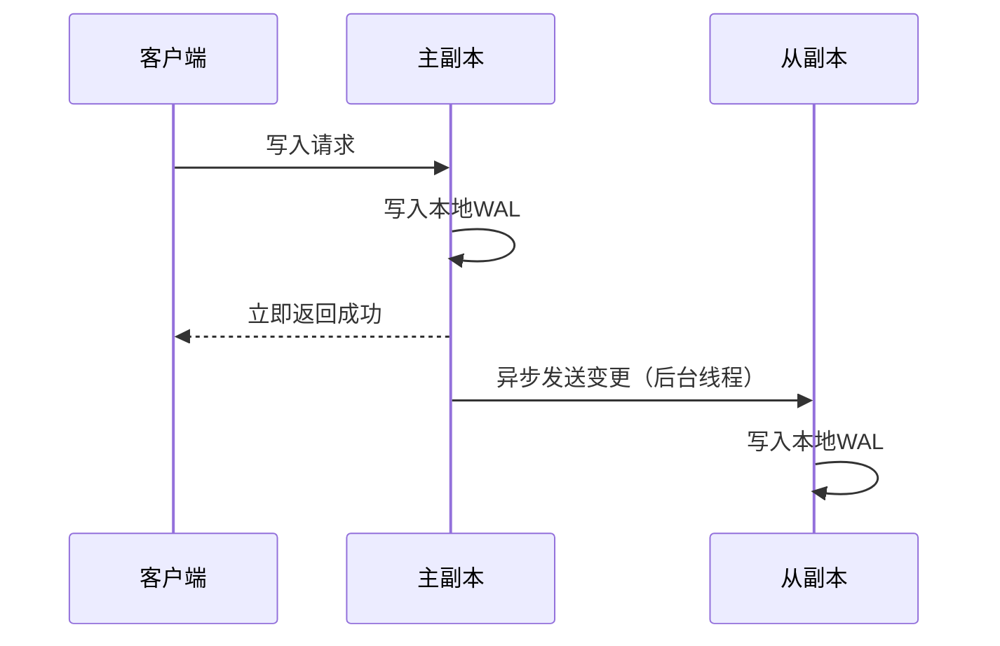

**核心优势：**

- **写入性能高**：写入延迟等于本地磁盘写入延迟，不受网络影响
- **高可用性**：即使所有从副本都不可用，写入操作仍可正常完成
- **支持跨地域同步**：网络延迟不影响写入路径，适合千里级别的数据中心间同步

**核心劣势：**

- **数据丢失风险**：主机房在从副本同步前故障，未同步的数据将丢失（RPO > 0）
- **读取延迟**：从副本上的读操作可能读到过期数据
- **一致性窗口**：不同副本之间存在数据不一致的时间窗口

**适用场景：**

| 场景 | 说明 | 典型延迟 |
|------|------|---------|
| 异地多活 | 机房间延迟50-100ms，同步复制不可接受 | 1-5秒 |
| 全局数据同步 | 商品、配置等全局数据异步分发到所有单元 | 1-10秒 |
| 日志分析同步 | 将业务数据同步到OLAP系统做分析 | 秒级到分钟级 |

### 2.3 半同步复制：一致性与可用性的平衡

半同步复制是同步与异步之间的折中方案。其核心思想是：**在正常情况下保持同步复制的强一致性保证，在从副本异常时自动降级为异步复制保障可用性。**

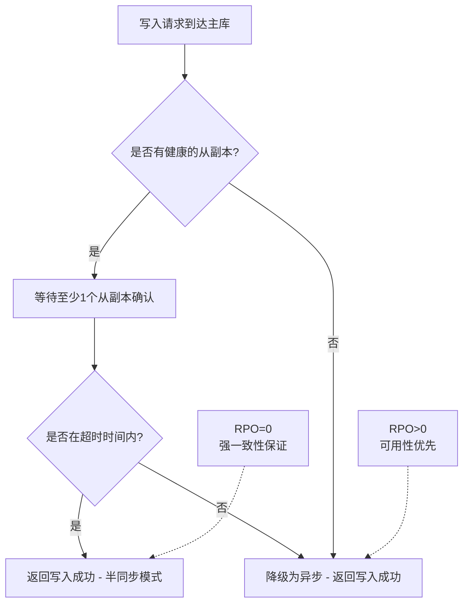

**三种模式的对比：**

| 维度 | 同步复制 | 半同步复制 | 异步复制 |
|------|---------|-----------|---------|
| RPO | 0 | 0（正常时）/ >0（降级时） | >0 |
| 写入延迟 | 高（网络往返） | 中（网络往返，超时可降级） | 低（仅本地写入） |
| 可用性 | 低（从库故障阻塞写入） | 中（超时后降级保障可用） | 高（不依赖从库） |
| 数据一致性 | 强一致 | 强一致（正常时） | 最终一致 |
| 部署复杂度 | 低 | 中 | 低 |
| 典型应用场景 | 同城双活核心数据 | 同城双活+异地容灾 | 异地多活全量同步 |

### 2.4 Group Replication与MGR

MySQL Group Replication（MGR）是MySQL 5.7.17引入的原生高可用方案，基于Paxos协议实现多节点间的数据同步和一致性保证。

**MGR的核心特性：**

- **基于Paxos的共识协议**：写入操作在多数节点上达成共识后才提交，保证数据一致性
- **自动成员管理**：节点加入/退出自动处理，无需人工干预
- **冲突检测**：基于乐观锁的认证机制，自动检测并拒绝冲突事务

**单主模式与多主模式：**

| 模式 | 写入节点 | 冲突处理 | 性能 | 适用场景 |
|------|---------|---------|------|---------|
| 单主模式 | 仅一个主节点 | 无需冲突处理 | 高 | 大多数生产场景 |
| 多主模式 | 所有节点均可写 | 自动检测冲突并回滚 | 较低 | 特殊多活需求 |

```sql
-- MGR单主模式配置示例
-- 所有节点的my.cnf
[mysqld]
server_id = 1  -- 每个节点不同
gtid_mode = ON
enforce_gtid_consistency = ON
binlog_checksum = NONE
log_slave_updates = ON
master_info_repository = TABLE
relay_log_info_repository = TABLE
transaction_write_set_extraction = XXHASH64

plugin_load_add = 'group_replication.so'
group_replication_group_name = "aaaaaaaa-bbbb-cccc-dddd-eeeeeeeeeeee"
group_replication_start_on_boot = OFF
group_replication_local_address = "10.0.1.100:33061"
group_replication_group_seeds = "10.0.1.100:33061,10.0.2.100:33061"
group_replication_single_primary_mode = ON  -- 单主模式
```

---

## 3. 数据变更捕获技术

数据同步的前提是**准确、完整、实时地捕获数据变更**。变更捕获（Change Data Capture, CDC）是数据同步的基石，其技术方案直接决定了同步的延迟、可靠性和侵入性。

### 3.1 基于数据库日志的捕获

数据库日志（MySQL的binlog、PostgreSQL的WAL、Oracle的Redo Log）是最权威的变更记录，记录了所有修改数据的操作。

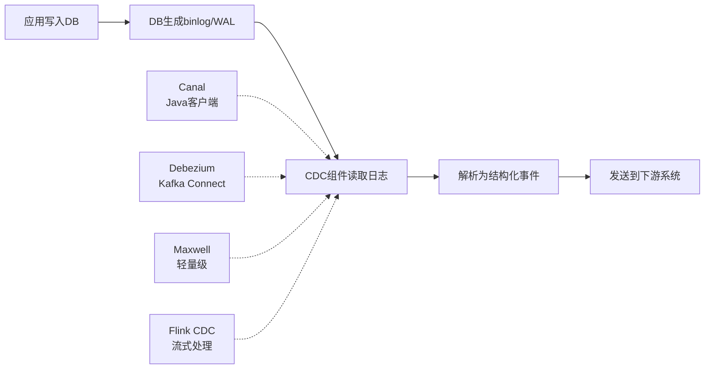

**主流CDC工具对比：**

| 工具 | 语言 | 原理 | 输出格式 | 部署方式 | 适用场景 |
|------|------|------|---------|---------|---------|
| Canal | Java | 伪装MySQL从库，解析binlog | JSON/Protobuf | 独立进程+MQ | 阿里系生态，大规模同步 |
| Maxwell | Java | 同上，更轻量 | JSON | 独立进程 | 轻量级同步，快速上手 |
| Debezium | Java | Kafka Connect Connector | Kafka Connect格式 | Kafka Connect集群 | Kafka生态，多数据库支持 |
| Flink CDC | Java | Flink Source Connector | Flink数据流 | Flink集群 | 流式处理场景 |

**Canal配置与使用示例：**

```properties
# canal.properties 核心配置
canal.destinations = example
canal.instance.master.address = 10.0.1.100:3306
canal.instance.dbUsername = canal
canal.instance.dbPassword = canal_secure_password
canal.instance.filter.regex = mydb\\.(user|order|payment)  # 只同步指定表

# 性能调优
canal.instance.memory.buffer.size = 16384  # 内存缓冲区大小
canal.instance.memory.buffer.memunit = 1024  # 内存单位
canal.instance.memory.rawEntry = true  # 是否保存原始entry

# MQ输出配置
canal.mq.servers = kafka01:9092,kafka02:9092,kafka03:9092
canal.mq.topic = canal-sync-topic
canal.mq.partition = 6  # 6个分区并行消费
canal.mq.dynamicTopic = mydb\\..*  # 动态topic，按库名分topic
```

```python
# Canal客户端消费示例
from canal.client import SimpleCanalConnector

def consume_binlog():
    connector = SimpleCanalConnector(
        address="127.0.0.1:11111",
        username="",
        password="",
        destination="example"
    )
    connector.connect()
    connector.subscribe("mydb\\..*")
    connector.rollback()

    while True:
        message = connector.get_without_ack(batch_size=1000)
        if message:
            for entry in message.get_raw_entries():
                if entry.entry_type == EntryType.ROWDATA:
                    row_change = RowChange()
                    row_change.ParseFromString(entry.store_value)
                    for row_data in row_change.row_datas:
                        if row_change.event_type == EventType.INSERT:
                            handle_insert(row_data.after_columns)
                        elif row_change.event_type == EventType.UPDATE:
                            handle_update(row_data.before_columns, row_data.after_columns)
                        elif row_change.event_type == EventType.DELETE:
                            handle_delete(row_data.before_columns)
            connector.ack(batch_id=message.id)
```

### 3.2 基于触发器的捕获

数据库触发器（Trigger）可以在数据变更时自动执行自定义逻辑，将变更记录写入专门的变更日志表。

```sql
-- MySQL触发器示例：捕获用户表变更
CREATE TABLE user_change_log (
    id BIGINT AUTO_INCREMENT PRIMARY KEY,
    table_name VARCHAR(64),
    operation VARCHAR(10),  -- INSERT/UPDATE/DELETE
    primary_key_value BIGINT,
    old_values JSON,
    new_values JSON,
    changed_at TIMESTAMP DEFAULT CURRENT_TIMESTAMP,
    INDEX idx_changed_at (changed_at)
) ENGINE=InnoDB;

DELIMITER //
CREATE TRIGGER trg_user_insert AFTER INSERT ON users FOR EACH ROW
BEGIN
    INSERT INTO user_change_log (table_name, operation, primary_key_value, new_values)
    VALUES ('users', 'INSERT', NEW.id, JSON_OBJECT('name', NEW.name, 'email', NEW.email));
END//

CREATE TRIGGER trg_user_update AFTER UPDATE ON users FOR EACH ROW
BEGIN
    INSERT INTO user_change_log (table_name, operation, primary_key_value, old_values, new_values)
    VALUES ('users', 'UPDATE', NEW.id,
            JSON_OBJECT('name', OLD.name, 'email', OLD.email),
            JSON_OBJECT('name', NEW.name, 'email', NEW.email));
END//

CREATE TRIGGER trg_user_delete AFTER DELETE ON users FOR EACH ROW
BEGIN
    INSERT INTO user_change_log (table_name, operation, primary_key_value, old_values)
    VALUES ('users', 'DELETE', OLD.id, JSON_OBJECT('name', OLD.name, 'email', OLD.email));
END//
DELIMITER ;
```

**触发器方案的优缺点：**

| 优点 | 缺点 |
|------|------|
| 无需额外基础设施 | 性能影响显著（每次写操作额外写入日志表） |
| 可以捕获应用层逻辑 | 触发器维护困难，容易遗漏 |
| 与数据库紧密耦合，数据完整 | 多表变更时日志表可能成为写入热点 |
| 支持所有SQL操作类型 | 批量操作时日志量爆炸 |

> **实践经验：** 触发器方案适合数据量小、变更频率低的核心表（如配置表、权限表），不适合高并发业务表（如订单表、流水表）。在高并发场景下，触发器的性能开销可能比CDC方案高出一个数量级。

### 3.3 基于日志序列号（LSN）的增量同步

PostgreSQL使用WAL（Write-Ahead Log）和LSN（Log Sequence Number）来实现增量同步。LSN是WAL中的唯一递增标识，可以精确定位同步位置。

```sql
-- PostgreSQL增量同步核心概念
-- 1. 查看主库当前LSN
SELECT pg_current_wal_lsn();  -- 输出类似: 0/15D6848

-- 2. 查看从库同步位置
SELECT pg_last_wal_receive_lsn();  -- 最后接收到的LSN
SELECT pg_last_wal_replay_lsn();   -- 最后回放的LSN

-- 3. 计算同步延迟（字节数）
SELECT pg_current_wal_lsn() - pg_last_wal_replay_lsn() AS lag_bytes;
```

**PostgreSQL同步复制配置：**

```ini
# 主库 postgresql.conf
wal_level = replica
max_wal_senders = 10
wal_keep_size = 1GB
synchronous_standby_names = 'FIRST 1 (standby1, standby2)'  # 至少1个从库确认
synchronous_commit = on  # 等待从库确认后再提交
```

```ini
# 从库 postgresql.conf
primary_conninfo = 'host=10.0.1.100 port=5432 user=replicator password=xxx'
hot_standby = on
recovery_target_timeline = 'latest'
```

### 3.4 基于消息队列的变更传播

将数据变更事件发布到消息队列（如Kafka、RocketMQ），下游消费者按需消费。这是实现数据同步解耦的经典模式。

```mermaid
graph TB
    subgraph 生产者（变更捕获）
        A[业务服务] -->|写入| B[(主库)]
        B -->|binlog| C[CDC组件]
    end

    subgraph 消息队列
        C --> D[Kafka Topic: db-changes]
        D --> D1["分区0"]
        D --> D2["分区1"]
        D --> D3["分区N"]
    end

    subgraph 消费者（同步应用）
        D1 --> E1[从库同步消费者]
        D1 --> E2[缓存更新消费者]
        D2 --> E3[搜索索引消费者]
        D2 --> E4[数据分析消费者]
        D3 --> E5[审计日志消费者]
    end
```

**消息队列方案的关键设计：**

```python
# Kafka消费者示例：数据库变更同步到从库
from confluent_kafka import Consumer, KafkaError
import json
import mysql.connector

class SyncConsumer:
    def __init__(self, kafka_config, target_db_config):
        self.consumer = Consumer(kafka_config)
        self.target_db = mysql.connector.connect(**target_db_config)
        self.consumer.subscribe(['db-changes'])

    def run(self):
        while True:
            msg = self.consumer.poll(1.0)
            if msg is None:
                continue
            if msg.error():
                if msg.error().code() == KafkaError._PARTITION_EOF:
                    continue
                raise Exception(f"Kafka error: {msg.error()}")

            change = json.loads(msg.value().decode('utf-8'))
            self.apply_change(change)
            self.consumer.commit(msg)  # 手动提交偏移量

    def apply_change(self, change):
        """将变更应用到目标库，需保证幂等性"""
        cursor = self.target_db.cursor()
        op = change['operation']
        table = change['table']
        data = change['data']

        if op == 'INSERT':
            columns = ', '.join(data.keys())
            placeholders = ', '.join(['%s'] * len(data))
            sql = f"INSERT IGNORE INTO {table} ({columns}) VALUES ({placeholders})"
            cursor.execute(sql, list(data.values()))

        elif op == 'UPDATE':
            set_clause = ', '.join([f"{k}=%s" for k in data.keys()])
            pk = change['primary_key']
            sql = f"UPDATE {table} SET {set_clause} WHERE id=%s"
            cursor.execute(sql, list(data.values()) + [pk])

        elif op == 'DELETE':
            pk = change['primary_key']
            sql = f"DELETE FROM {table} WHERE id=%s"
            cursor.execute(sql, [pk])

        self.target_db.commit()
```

> **幂等性设计是消息队列同步的生命线。** 由于消息可能重复投递（at-least-once语义），同步逻辑必须保证同一条变更多次应用的结果与一次应用完全一致。常用方法：使用 `INSERT IGNORE` 或 `ON DUPLICATE KEY UPDATE` 处理重复插入；使用版本号或时间戳防止旧数据覆盖新数据。

### 3.5 Schema演进：数据同步中最容易忽视的炸弹

在实际生产中，表结构不是一成不变的。加字段、改类型、拆分表——这些DDL操作是数据同步链路最大的潜在风险。如果同步工具不感知Schema变更，轻则同步失败，重则数据丢失或格式错乱。

**Schema变更对同步链路的影响：**

| DDL操作 | 对CDC的影响 | 风险等级 | 应对策略 |
|---------|-----------|---------|---------|
| ADD COLUMN | 下游表缺少新字段，INSERT失败 | 高 | 下游先加字段，再同步 |
| DROP COLUMN | 下游字段多余，数据截断 | 高 | 下游延迟删除字段 |
| MODIFY COLUMN类型 | 类型不兼容导致数据丢失 | 极高 | 先同步数据，再改类型 |
| RENAME TABLE | 同步链路找不到目标表 | 高 | 配置表名映射 |
| ADD INDEX | 下游无索引，写入变慢 | 中 | 下游先加索引 |
| DROP TABLE | 下游数据残留 | 中 | 联动删除或保留快照 |

**Schema演进的最佳实践——"滚动Schema变更"：**

时间线：
T0: 上游ALTER TABLE users ADD COLUMN phone VARCHAR(20)
T1: 下游ALTER TABLE users ADD COLUMN phone VARCHAR(20)  -- 先加字段
T2: 上游开始写入phone字段的数据  -- CDC开始捕获新字段
T3: 下游收到新字段数据，正常同步  -- Schema已对齐

**关键原则：DDL操作必须"下游先行"。** 即先在下游执行Schema变更，再在上游执行。这样CDC捕获到新Schema的数据时，下游已经具备对应的字段，不会出现同步失败。

**Canal/Debezium的Schema历史追踪：**

```json
// Debezium自动记录Schema变更历史到Kafka
// Topic: schema-changes.mydb
{
  "sourceConnector": "prod-mysql",
  "ts": 1687654321000,
  "ddl": "ALTER TABLE mydb.users ADD COLUMN phone VARCHAR(20) AFTER email",
  "databaseName": "mydb"
}
```

```java
// Flink CDC处理Schema变更的示例
public class SchemaAwareSync {
    public static void main(String[] args) {
        // Flink CDC自动处理加字段（下游表需提前存在对应字段）
        // 对于更复杂的Schema变更，需要实现自定义DDLHandler
        MySqlSource<String> source = MySqlSource.<String>builder()
            .hostname("10.0.1.100")
            .port(3306)
            .databaseList("mydb")
            .tableList("mydb.users")
            .username("cdc_user")
            .password("cdc_password")
            .deserializer(new JsonDebeziumDeserializationSchema())
            .includeSchemaChanges(true)  // 关键：包含Schema变更事件
            .build();
    }
}
```

> **生产教训：** 某电商公司凌晨执行了一次`ALTER TABLE orders ADD COLUMN discount DECIMAL(10,2)`操作，但下游同步表未提前加字段，导致凌晨2-4点的订单数据全部同步失败。由于监控仅配置了延迟告警而未监控同步错误率，问题在早上8点才被发现。建议：**DDL变更必须纳入变更管理流程**，同步团队必须提前知晓并协调。

### 3.6 CDC选型决策树

面对众多CDC工具，如何选择最适合的方案？以下决策树可以帮助快速定位：

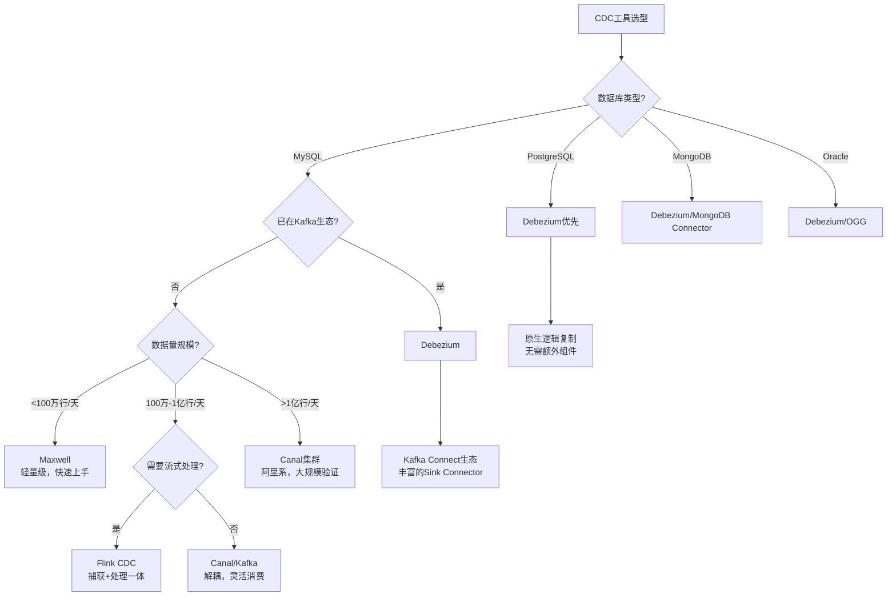

---

## 4. 主流同步工具与平台

### 4.1 阿里云DTS（Data Transmission Service）

DTS是阿里云提供的全托管数据传输服务，支持全量迁移、增量同步、数据订阅等功能。

**DTS工作原理：**

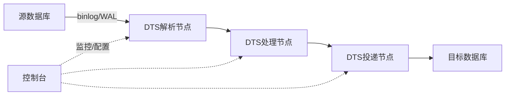

**DTS核心能力：**

| 功能 | 说明 | 典型延迟 |
|------|------|---------|
| 全量迁移 | 将源库全量数据迁移到目标库 | 取决于数据量 |
| 增量同步 | 实时捕获增量变更并同步 | 1-5秒 |
| 数据订阅 | 订阅变更事件，自行处理 | 1-2秒 |
| 反向同步 | 目标库到源库的增量同步 | 1-5秒 |
| 双向同步 | 两个库互相同步（多活场景） | 1-5秒 |

**DTS双向同步配置要点：**

- 需要配置同步对象白名单，避免环路同步（A→B→A的无限循环）
- 每条数据变更需要携带"来源标记"，同步组件跳过来自对端的数据
- 冲突策略需要提前定义（以哪端为准，或按字段合并）

### 4.2 Debezium + Kafka Connect

Debezium是一个开源的CDC平台，基于Kafka Connect构建，支持MySQL、PostgreSQL、MongoDB、Oracle等多种数据库。

**Debezium架构：**

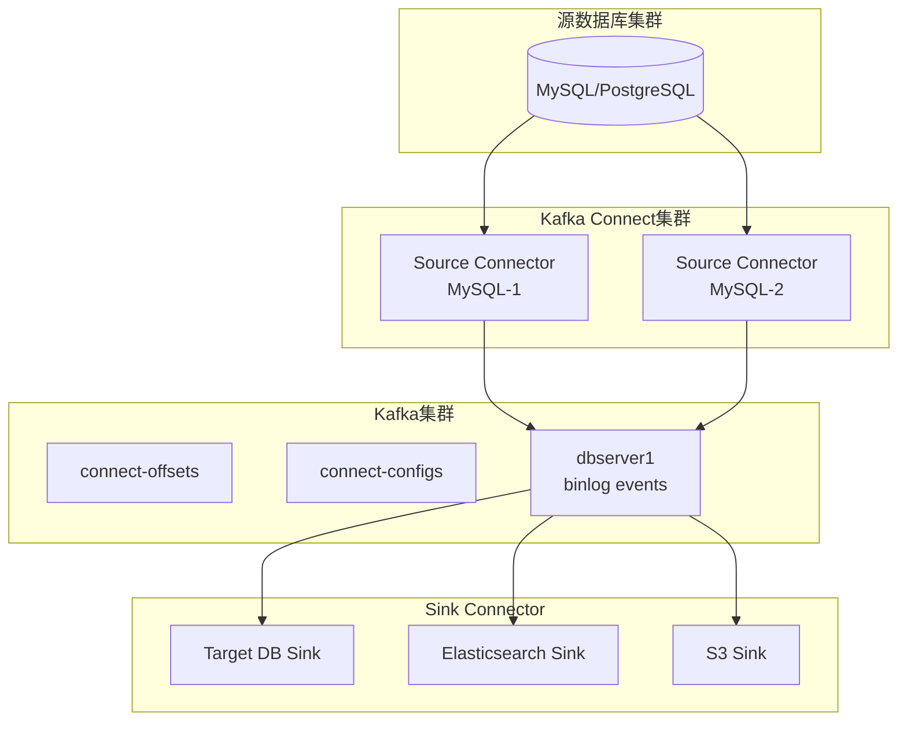

**Debezium MySQL Connector配置：**

```json
{
  "name": "mysql-source-connector",
  "config": {
    "connector.class": "io.debezium.connector.mysql.MySqlConnector",
    "database.hostname": "10.0.1.100",
    "database.port": "3306",
    "database.user": "debezium",
    "database.password": "secure_password",
    "database.server.id": "184054",
    "database.server.name": "prod-mysql",
    "database.include.list": "mydb",
    "table.include.list": "mydb.users,mydb.orders,mydb.payments",
    "database.history.kafka.bootstrap.servers": "kafka01:9092,kafka02:9092",
    "database.history.kafka.topic": "schema-changes.mydb",
    "snapshot.mode": "initial",
    "snapshot.locking.mode": "minimal",
    "transforms": "route,unwrap",
    "transforms.route.type": "org.apache.kafka.connect.transforms.RegexRouter",
    "transforms.route.regex": "([^.]+)\\.([^.]+)\\.([^.]+)",
    "transforms.route.replacement": "$3",
    "transforms.unwrap.type": "io.debezium.transforms.ExtractNewRecordState"
  }
}
```

### 4.3 分布式数据库的原生多副本

TiDB、CockroachDB、OceanBase等新一代分布式数据库将数据同步内置到数据库内核中，对外提供强一致或最终一致的多副本能力。

**TiDB多副本同步机制：**

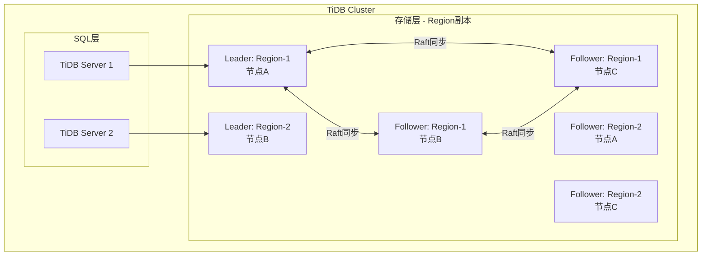

**TiDB与传统方案对比：**

| 维度 | TiDB (Raft) | MySQL主从 | Canal + MySQL |
|------|------------|-----------|--------------|
| 数据一致性 | 强一致（Raft多数派） | 异步时最终一致 | 最终一致 |
| 故障自愈 | 自动（PD调度） | 需要中间件或手动 | 需要独立运维 |
| 写入延迟 | 10-30ms（跨机房） | 1-3ms（本地写入） | 1-5秒（异步传播） |
| 扩展方式 | 水平扩展自动分片 | 需要中间件分片 | 需要应用层分片 |
| 运维复杂度 | 低（统一管理） | 中 | 高（多组件） |

### 4.4 Flink CDC：流式处理与数据同步的融合

Flink CDC将变更数据捕获与流式处理引擎结合，可以在同步过程中执行复杂的转换逻辑（如数据清洗、脱敏、聚合）。

```java
// Flink CDC实时同步示例：MySQL到MySQL
public class MySQLToMySQLSync {
    public static void main(String[] args) throws Exception {
        StreamExecutionEnvironment env = StreamExecutionEnvironment.getExecutionEnvironment();
        env.setParallelism(4);
        // 开启Checkpoint，保证exactly-once语义
        env.enableCheckpointing(60000, CheckpointingMode.EXACTLY_ONCE);

        // 数据源：MySQL
        Source<String, JsonNode, String> source = MySqlSource.<String>builder()
            .hostname("10.0.1.100")
            .port(3306)
            .databaseList("mydb")
            .tableList("mydb.orders")
            .username("cdc_user")
            .password("cdc_password")
            .deserializer(new JsonDebeziumDeserializationSchema())
            .startupOptions(StartupOptions.initial())
            .build();

        DataStream<String> stream = env.fromSource(
            source,
            WatermarkStrategy.noWatermarks(),
            "MySQL Source"
        );

        // 数据汇：MySQL
        Sink<String> sink = MySqlSink.<String>builder()
            .setUrl("10.0.2.100:3306/mydb")
            .setDriverName("com.mysql.cj.jdbc.Driver")
            .setUsername("sync_user")
            .setPassword("sync_password")
            .setDdlHandles(new String[]{
                "CREATE TABLE IF NOT EXISTS orders (id BIGINT PRIMARY KEY, user_id BIGINT, amount DECIMAL(10,2), status VARCHAR(20))"
            })
            .setRecordSerializer(new JsonDebeziumEventSerializer())
            .build();

        stream.sinkTo(sink);
        env.execute("MySQL to MySQL Sync");
    }
}
```

---

## 5. 数据一致性模型

多活架构中，不同的业务场景对数据一致性有不同的要求。理解一致性模型是选择同步策略的基础。

### 5.1 一致性模型全景

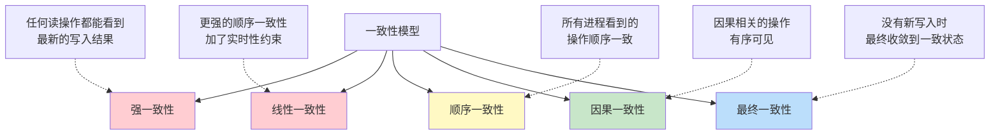

### 5.2 各一致性模型详解

**强一致性（Strong Consistency）：**

任何时刻从任意节点读取，都能看到最新写入的结果。等价于单节点数据库的行为。

- 实现方式：同步复制 + 多数派共识（Raft/Paxos）
- 延迟代价：每次读写都需要多数节点确认，延迟较高
- 适用场景：金融核心交易、库存扣减、支付系统
- 典型工具：TiDB（Raft模式）、CockroachDB、Spanner

**最终一致性（Eventual Consistency）：**

在没有新写入的情况下，经过足够的时间，所有副本最终会收敛到相同的状态。

- 实现方式：异步复制
- 一致性窗口：从写入成功到所有副本同步完成的时间差（通常1-5秒）
- 适用场景：商品信息、用户资料、浏览历史、社交动态
- 典型工具：MySQL异步复制、Canal+MQ、DTS异步同步

**因果一致性（Causal Consistency）：**

保证有因果关系的操作（如"先注册再下单"）在所有节点上以相同顺序可见，但没有因果关系的操作可以以不同顺序可见。

- 实现方式：向量时钟（Vector Clock）或混合逻辑时钟（HLC）
- 延迟代价：低于强一致，高于最终一致
- 适用场景：社交Feed流、聊天消息、协作编辑
- 典型工具：MongoDB（因果一致性会话）、CockroachDB

### 5.3 读己之写一致性（Read-Your-Writes Consistency）

多活架构中一个常见的用户体验问题：用户刚提交了一条评论，刷新页面却看不到。这是因为读请求被路由到了尚未同步到该变更的副本。

**解决方案：**

```python
# 读己之写一致性实现：写入后路由到同一副本读取
class ReadYourWriteRouter:
    """
    核心思路：用户写入操作完成后，将该用户的读请求
    临时路由到写入发生的副本，直到同步延迟收敛。
    """
    def __init__(self, sync_delay_ms=3000):
        self.sync_delay_ms = sync_delay_ms
        self.write_affinity = {}  # user_id -> (unit, timestamp)

    def route_write(self, user_id: int) -> str:
        """写入路由：返回写入单元"""
        unit = self.get_primary_unit(user_id)
        self.write_affinity[user_id] = (unit, time.time())
        return unit

    def route_read(self, user_id: int) -> str:
        """读取路由：检查是否有读亲和性"""
        if user_id in self.write_affinity:
            unit, write_time = self.write_affinity[user_id]
            elapsed_ms = (time.time() - write_time) * 1000
            if elapsed_ms < self.sync_delay_ms:
                return unit  # 路由到写入单元，保证读到最新数据
            else:
                del self.write_affinity[user_id]  # 超时，恢复正常路由
        return self.get_normal_read_unit(user_id)
```

### 5.4 线性一致性读

线性一致性读要求每次读操作都能获取到最新的已提交写入。在分布式数据库中，通常通过以下方式实现：

| 实现方式 | 原理 | 延迟代价 | 适用场景 |
|---------|------|---------|---------|
| 读Leader | 所有读操作路由到Leader副本 | 低 | Leader稳定的场景 |
| ReadIndex | Leader确认仍为Leader后返回最新index | 一次网络往返 | Raft协议场景 |
| Lease Read | 基于租约的本地读，无需网络通信 | 极低 | 租约有效期内 |
| Follower Read | 从Follower读取，等待apply到最新index | 较高 | 读多写少场景 |

---

## 6. 冲突检测与解决

在多活架构中，当两个机房同时修改同一份数据时，就会产生写入冲突。冲突解决是数据同步中最具挑战性的问题。

### 6.1 冲突的产生机制

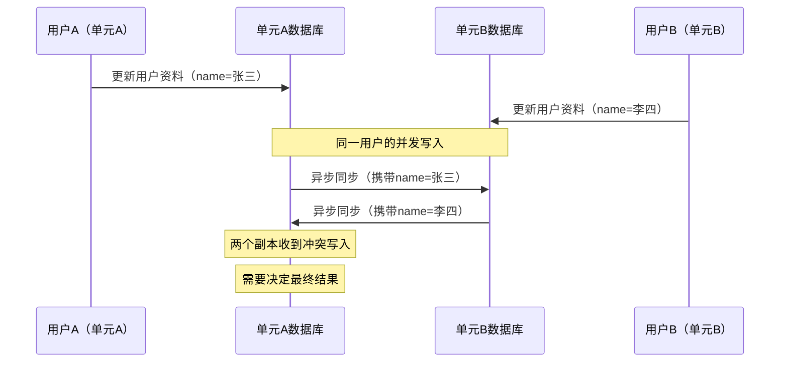

### 6.2 冲突预防：写路由锁定

最理想的冲突解决方案是**避免冲突发生**。通过写路由规则，确保同一数据的所有写入操作都路由到同一个节点。

```python
class WriteRouter:
    """
    写路由：确保同一分片的数据只在一个单元写入
    这是最简单有效的冲突预防策略
    """
    def __init__(self):
        self.primary_units = {}  # shard_key -> primary_unit

    def get_write_unit(self, user_id: int) -> str:
        """获取用户数据的主写入单元"""
        return self.primary_units.get(
            user_id % 1000,
            'unit-a'  # 默认主单元
        )

    def route_write(self, user_id: int, operation: dict) -> str:
        """路由写操作到主单元"""
        unit = self.get_write_unit(user_id)
        if unit != self.current_unit:
            # 非主单元：转发到主单元处理
            return self.remote_write(unit, user_id, operation)
        else:
            # 主单元：直接执行
            return self.local_write(user_id, operation)
```

**写路由的局限性：**

- 主单元写入延迟较高（跨机房网络往返）
- 主单元成为写入热点和单点故障
- 故障切换时需要短暂停止写入或接受少量不一致

### 6.3 冲突解决策略

当冲突无法避免时，需要选择合适的解决策略：

#### 6.3.1 最后写入胜出（LWW，Last Write Wins）

以时间戳为依据，最新的写入覆盖之前的写入。这是最简单、最常用的冲突解决策略。

```python
import time
import hashlib

class LWWRegister:
    """
    Last-Write-Wins寄存器
    每次写入附带时间戳，合并时取时间戳最新的值
    """
    def __init__(self):
        self.value = None
        self.timestamp = 0
        self.node_id = None

    def set(self, value, timestamp=None, node_id=None):
        if timestamp is None:
            timestamp = self._hybrid_logical_clock()
        if node_id is None:
            node_id = self.node_id
        # 仅在时间戳更新时覆盖
        if timestamp > self.timestamp:
            self.value = value
            self.timestamp = timestamp

    def merge(self, remote_value, remote_timestamp, remote_node):
        """
        合并远程值：取时间戳较大的值
        相同时按node_id字典序确定性选择
        """
        if (remote_timestamp > self.timestamp or
            (remote_timestamp == self.timestamp and remote_node > self.node_id)):
            self.value = remote_value
            self.timestamp = remote_timestamp

    def _hybrid_logical_clock(self):
        """混合逻辑时钟：兼顾物理时间精度和分布式序关系"""
        wall_time = int(time.time() * 1000)
        return wall_time
```

**LWW的问题：**

- **中间状态丢失**：A在t1写入"name=Alice"，B在t2写入"name=Bob"（t2>t1），最终结果是"Bob"，A的写入被静默覆盖
- **时钟偏移风险**：如果两个节点的系统时钟不同步，可能出现"较旧"的写入覆盖"较新"的写入

**缓解时钟偏移的方法：**

| 方法 | 原理 | 精度 | 实现复杂度 |
|------|------|------|-----------|
| NTP同步 | 定期与时间服务器同步 | 毫秒级 | 低 |
| 混合逻辑时钟(HLC) | 结合物理时钟和逻辑计数器 | 微秒级 | 中 |
| TrueTime（Spanner） | GPS+原子钟硬件支持 | 纳秒级 | 高（需专用硬件） |
| 向量时钟 | 每个节点维护逻辑时间戳 | 无法比较"最新" | 高 |

#### 6.3.2 CRDT（无冲突复制数据类型）

CRDT是一类特殊的数据结构，保证多个副本的并发修改可以**自动合并**，且合并结果与操作顺序无关（满足交换律、结合律和幂等律）。

**常见CRDT类型：**

| 类型 | 语义 | 适用场景 | 合并规则 |
|------|------|---------|---------|
| G-Counter | 只增计数器 | 浏览量、点赞数 | 各节点取最大值后求和 |
| PN-Counter | 可增减计数器 | 库存、余额（有限场景） | 正计数器+负计数器分别合并 |
| G-Set | 只增集合 | 标签、关注列表 | 取并集 |
| OR-Set | 可增删集合 | 购物车 | 添加-删除的确定性合并 |
| LWW-Register | 最后写入寄存器 | 简单键值对 | 取时间戳最新的值 |
| MV-Register | 多值寄存器 | 需要人工解决的冲突 | 保留所有并发值 |
| 2P-Set | 两阶段集合 | 删除操作不可撤销 | 添加集合并集 + 删除集合并集 |
| LWW-Element-Set | 带时间戳的集合 | 活跃用户集合 | 按时间戳决定每个元素状态 |

**PN-Counter实现：**

```python
class PNCounter:
    """
    Positive-Negative Counter CRDT
    支持增减操作，通过分离正负计数器实现无冲突合并
    """
    def __init__(self, node_id: str):
        self.node_id = node_id
        self.positive = GCounter(f"{node_id}-pos")
        self.negative = GCounter(f"{node_id}-neg")

    def increment(self, amount: int = 1):
        self.positive.increment(amount)

    def decrement(self, amount: int = 1):
        self.negative.increment(amount)

    def value(self) -> int:
        return self.positive.value() - self.negative.value()

    def merge(self, other: 'PNCounter'):
        self.positive.merge(other.positive)
        self.negative.merge(other.negative)

# 使用示例：多活场景下的库存计数
# 注意：PN-Counter只能保证计数一致，不能防止负数（需业务层保护）
counter_shanghai = PNCounter("shanghai")
counter_beijing = PNCounter("beijing")

counter_shanghai.increment(100)  # 上海入库100
counter_beijing.decrement(30)    # 北京出库30

# 合并后：100 - 30 = 70
counter_shanghai.merge(counter_beijing)
print(counter_shanghai.value())  # 70
```

**购物车CRDT（OR-Set）：**

```python
class ORSet:
    """
    Observed-Remove Set CRDT
    支持添加和删除操作的无冲突集合
    适用于多活场景下的购物车
    """
    def __init__(self, node_id: str):
        self.node_id = node_id
        self.elements = {}  # element -> set of (node, unique_tag)
        self.tombstones = {}  # element -> set of (node, unique_tag)
        self.counter = 0

    def add(self, element):
        self.counter += 1
        tag = (self.node_id, self.counter)
        if element not in self.elements:
            self.elements[element] = set()
        self.elements[element].add(tag)

    def remove(self, element):
        if element in self.elements:
            # 标记当前所有tag为已删除
            if element not in self.tombstones:
                self.tombstones[element] = set()
            self.tombstones[element].update(self.elements[element])

    def contains(self, element) -> bool:
        if element not in self.elements:
            return False
        alive = self.elements[element] - self.tombstones.get(element, set())
        return len(alive) > 0

    def merge(self, other: 'ORSet'):
        for elem, tags in other.elements.items():
            if elem not in self.elements:
                self.elements[elem] = set()
            self.elements[elem].update(tags)
        for elem, tags in other.tombstones.items():
            if elem not in self.tombstones:
                self.tombstones[elem] = set()
            self.tombstones[elem].update(tags)

# 使用示例：多活购物车
cart_bj = ORSet("beijing")
cart_sh = ORSet("shanghai")

cart_bj.add("iPhone 15")
cart_bj.add("AirPods Pro")
cart_sh.add("iPhone 15")
cart_sh.add("iPad Air")
cart_bj.remove("AirPods Pro")  # 北京用户移除了AirPods

# 合并后：{iPhone 15, iPad Air}
cart_bj.merge(cart_sh)
print([e for e in ["iPhone 15", "AirPods Pro", "iPad Air"] if cart_bj.contains(e)])
# ['iPhone 15', 'iPad Air']
```

#### 6.3.3 业务层冲突解决

对于无法用CRDT表达的复杂业务逻辑（如转账、库存扣减），需要在应用层实现冲突检测和解决。

```python
class InventoryService:
    """
    业务层冲突解决示例：库存扣减
    使用"预留-确认"模式防止超卖
    """
    def __init__(self, db):
        self.db = db

    def deduct_stock(self, order_id: str, sku_id: str, quantity: int) -> bool:
        """
        扣减库存的核心逻辑：
        1. 检查可用库存
        2. 预留库存（写入预留记录）
        3. 确认扣减（更新实际库存）
        """
        # 使用SELECT ... FOR UPDATE加行锁，防止并发扣减
        cursor = self.db.cursor()
        cursor.execute(
            "SELECT stock, reserved FROM inventory WHERE sku_id = %s FOR UPDATE",
            (sku_id,)
        )
        row = cursor.fetchone()
        available = row['stock'] - row['reserved']

        if available < quantity:
            return False  # 库存不足

        # 预留库存
        cursor.execute(
            "UPDATE inventory SET reserved = reserved + %s WHERE sku_id = %s",
            (quantity, sku_id)
        )

        # 写入预留记录（用于冲突检测）
        cursor.execute(
            "INSERT INTO stock_reservation (order_id, sku_id, quantity, unit_id, created_at) "
            "VALUES (%s, %s, %s, %s, NOW())",
            (order_id, sku_id, quantity, self.current_unit_id)
        )
        self.db.commit()
        return True

    def confirm_deduction(self, order_id: str) -> bool:
        """确认扣减：将预留转为实际扣减"""
        cursor = self.db.cursor()
        cursor.execute(
            "SELECT sku_id, quantity, unit_id FROM stock_reservation WHERE order_id = %s",
            (order_id,)
        )
        reservation = cursor.fetchone()

        if not reservation:
            return False

        # 从本单元实际扣减库存
        cursor.execute(
            "UPDATE inventory SET stock = stock - %s, reserved = reserved - %s WHERE sku_id = %s",
            (reservation['quantity'], reservation['quantity'], reservation['sku_id'])
        )

        # 删除预留记录
        cursor.execute(
            "DELETE FROM stock_reservation WHERE order_id = %s", (order_id,)
        )
        self.db.commit()
        return True
```

### 6.4 冲突解决策略选择矩阵

| 策略 | 实现复杂度 | 数据安全 | 性能影响 | 适用数据类型 | 典型案例 |
|------|-----------|---------|---------|-------------|---------|
| 写路由锁定 | 低 | 高 | 主单元写入延迟增加 | 所有数据 | 用户归属数据 |
| LWW | 低 | 中 | 无额外开销 | 简单键值对 | 用户偏好设置 |
| CRDT | 中 | 高 | 计算开销低 | 计数器/集合/寄存器 | 购物车、点赞数 |
| 业务层仲裁 | 高 | 最高 | 事务开销大 | 强一致性数据 | 转账、库存、支付 |
| 版本向量 | 中 | 高 | 存储和比较开销 | 并发修改检测 | 协作编辑 |

---

## 7. 同步链路的可靠性保障

数据同步不仅仅是"把数据从A搬到B"，更重要的是确保这条链路在各种异常情况下都能可靠运行。

### 7.1 Exactly-Once语义

在数据同步中，**Exactly-Once（恰好一次）** 是最理想的语义：每条变更恰好被应用一次，既不丢失也不重复。但真正的Exactly-Once在分布式系统中极难实现，通常通过**At-Least-Once + 幂等性**来近似。

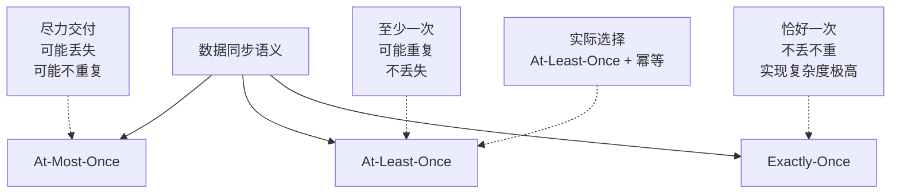

**幂等性设计模式：**

```python
class IdempotentApplier:
    """
    幂等变更应用器
    通过唯一键去重，保证同一变更多次应用的结果与一次应用一致
    """
    def __init__(self, db):
        self.db = db

    def apply_change(self, change_id: str, change_data: dict):
        """
        幂等应用变更：
        1. 检查change_id是否已处理
        2. 如果未处理，执行变更并记录
        3. 如果已处理，跳过
        """
        cursor = self.db.cursor()

        # 原子操作：检查并插入（利用唯一键约束）
        try:
            cursor.execute(
                "INSERT INTO applied_changes (change_id, applied_at) "
                "VALUES (%s, NOW())",
                (change_id,)
            )
        except mysql.connector.IntegrityError:
            # change_id已存在，说明已处理过，跳过
            return False

        # 执行实际变更
        self._execute_change(change_data)
        self.db.commit()
        return True

    def _execute_change(self, change_data: dict):
        """执行具体的变更操作"""
        # 根据变更类型执行SQL
        pass
```

### 7.2 断点续传与位点管理

同步链路中断后恢复时，需要从中断点继续，而非从头开始。这就需要可靠的**位点管理（Position Tracking）**。

```python
class SyncPositionManager:
    """
    同步位点管理器
    记录同步进度，支持断点续传
    """
    def __init__(self, redis_client, sync_id: str):
        self.redis = redis_client
        self.sync_id = sync_id
        self.position_key = f"sync:position:{sync_id}"

    def save_position(self, position: dict):
        """
        保存同步位点
        position示例: {"file": "mysql-bin.000003", "pos": 12345, "timestamp": 1687654321}
        """
        self.redis.hset(self.position_key, mapping=position)
        # 设置过期时间：30天
        self.redis.expire(self.position_key, 30 * 24 * 3600)

    def load_position(self) -> dict:
        """加载上次同步位点"""
        position = self.redis.hgetall(self.position_key)
        if not position:
            return None
        return {
            "file": position.get(b"file", b"").decode(),
            "pos": int(position.get(b"pos", 0)),
            "timestamp": int(position.get(b"timestamp", 0))
        }

    def ack_position(self, position: dict):
        """确认位点（批量处理后调用）"""
        self.save_position(position)
```

### 7.3 同步延迟监控

同步延迟是数据同步链路健康度的核心指标。需要建立完善的监控体系，及时发现并处理延迟异常。

```bash
#!/bin/bash
# sync_monitor.sh - 同步延迟监控脚本
# 检查MySQL主从同步延迟并上报监控系统

SLAVE_HOST="10.0.2.100"
MONITOR_USER="monitor"
ALERT_THRESHOLD_SECONDS=30

# 获取从库同步状态
SLAVE_STATUS=$(mysql -h "$SLAVE_HOST" -u "$MONITOR_USER" -p"$MONITOR_PASS" \
    -e "SHOW SLAVE STATUS\G" 2>/dev/null)

if [ -z "$SLAVE_STATUS" ]; then
    echo "CRITICAL: 无法连接从库 $SLAVE_HOST"
    curl -s -X POST "$ALERT_URL" \
        -H "Content-Type: application/json" \
        -d "{\"level\":\"critical\",\"msg\":\"无法连接从库 $SLAVE_HOST\"}"
    exit 1
fi

# 提取关键指标
IO_RUNNING=$(echo "$SLAVE_STATUS" | grep "Slave_IO_Running:" | awk '{print $2}')
SQL_RUNNING=$(echo "$SLAVE_STATUS" | grep "Slave_SQL_Running:" | awk '{print $2}')
SECONDS_BEHIND=$(echo "$SLAVE_STATUS" | grep "Seconds_Behind_Master:" | awk '{print $2}')
LAST_ERROR=$(echo "$SLAVE_STATUS" | grep "Last_Error:" | sed 's/.*Last_Error: //')

# 检查复制线程状态
if [ "$IO_RUNNING" != "Yes" ] || [ "$SQL_RUNNING" != "Yes" ]; then
    echo "CRITICAL: 复制线程异常 IO=$IO_RUNNING SQL=$SQL_RUNNING"
    echo "Error: $LAST_ERROR"
    curl -s -X POST "$ALERT_URL" \
        -H "Content-Type: application/json" \
        -d "{\"level\":\"critical\",\"msg\":\"复制线程异常: IO=$IO_RUNNING SQL=$SQL_RUNNING Error=$LAST_ERROR\"}"
    exit 1
fi

# 检查延迟
if [ "$SECONDS_BEHIND" = "NULL" ]; then
    echo "CRITICAL: 延迟值为NULL，同步可能已中断"
    exit 1
fi

if [ "$SECONDS_BEHIND" -gt "$ALERT_THRESHOLD_SECONDS" ]; then
    echo "WARNING: 同步延迟 ${SECONDS_BEHIND}秒（阈值${ALERT_THRESHOLD_SECONDS}秒）"
    curl -s -X POST "$ALERT_URL" \
        -H "Content-Type: application/json" \
        -d "{\"level\":\"warning\",\"msg\":\"同步延迟${SECONDS_BEHIND}秒\"}"
elif [ "$SECONDS_BEHIND" -gt 10 ]; then
    echo "INFO: 同步延迟 ${SECONDS_BEHIND}秒"
else
    echo "OK: 同步正常，延迟 ${SECONDS_BEHIND}秒"
fi
```

**监控指标体系：**

| 指标类别 | 具体指标 | 告警阈值 | 说明 |
|---------|---------|---------|------|
| 延迟指标 | Seconds_Behind_Master | >30秒警告，>300秒严重 | 复制延迟时间 |
| 位点指标 | Binlog距离差（字节） | >100MB警告，>1GB严重 | 主从位点差距 |
| 线程状态 | IO/SQL线程状态 | 非Running为严重 | 复制线程健康度 |
| 错误信息 | Last_Error/Last_IO_Error | 非空为严重 | 复制错误详情 |
| 吞吐指标 | 每秒同步事务数 | 低于写入TPS的80% | 同步吞吐量 |
| 数据完整性 | 校验和对比 | 不一致为严重 | 定期全量校验 |

### 7.4 数据校验与修复

同步链路运行过程中，可能因为各种原因（Bug、人为误操作、网络异常）导致主从数据不一致。需要定期进行数据校验和修复。

```python
class DataVerifier:
    """
    数据校验器：定期对比主从数据一致性
    基于行级校验和（checksum），快速定位不一致数据
    """
    def __init__(self, primary_db, replica_db):
        self.primary = primary_db
        self.replica = replica_db

    def verify_table(self, table_name: str, primary_key: str = "id",
                     batch_size: int = 1000) -> dict:
        """
        分批校验表数据一致性
        返回: {"consistent": bool, "diff_count": int, "diff_ids": [...]}
        """
        cursor_p = self.primary.cursor(dictionary=True)
        cursor_r = self.replica.cursor(dictionary=True)

        # 获取表的总行数
        cursor_p.execute(f"SELECT COUNT(*) as cnt FROM {table_name}")
        total_rows = cursor_p.fetchone()['cnt']

        diff_ids = []
        offset = 0

        while offset < total_rows:
            # 使用MD5校验和对比每行数据
            sql = (
                f"SELECT {primary_key}, MD5(CONCAT_WS('|', *)) as row_hash "
                f"FROM {table_name} ORDER BY {primary_key} LIMIT {batch_size} OFFSET {offset}"
            )
            cursor_p.execute(sql)
            primary_rows = {row[primary_key]: row['row_hash'] for row in cursor_p.fetchall()}

            cursor_r.execute(sql)
            replica_rows = {row[primary_key]: row['row_hash'] for row in cursor_r.fetchall()}

            # 对比
            all_keys = set(primary_rows.keys()) | set(replica_rows.keys())
            for key in all_keys:
                if primary_rows.get(key) != replica_rows.get(key):
                    diff_ids.append(key)

            offset += batch_size

        return {
            "table": table_name,
            "total_rows": total_rows,
            "diff_count": len(diff_ids),
            "diff_ids": diff_ids[:100],  # 最多返回100个差异ID
            "consistent": len(diff_ids) == 0
        }

    def repair_table(self, table_name: str, primary_key: str,
                     diff_ids: list):
        """
        修复不一致数据：从主库读取最新数据写入从库
        """
        cursor_p = self.primary.cursor(dictionary=True)
        cursor_r = self.replica.cursor()

        for batch_start in range(0, len(diff_ids), 100):
            batch = diff_ids[batch_start:batch_start + 100]
            placeholders = ','.join(['%s'] * len(batch))

            # 从主库读取最新数据
            cursor_p.execute(
                f"SELECT * FROM {table_name} WHERE {primary_key} IN ({placeholders})",
                batch
            )
            rows = cursor_p.fetchall()

            for row in rows:
                columns = ', '.join(row.keys())
                update_values = ', '.join([f"{k}=%s" for k in row.keys()])
                sql = (
                    f"INSERT INTO {table_name} ({columns}) VALUES ({','.join(['%s']*len(row))}) "
                    f"ON DUPLICATE KEY UPDATE {update_values}"
                )
                cursor_r.execute(sql, list(row.values()) + list(row.values()))

            self.replica.commit()
            print(f"已修复 {len(rows)} 行数据")
```

---

## 8. 数据同步的性能优化

### 8.1 批量写入与并行复制

将小的变更合并为批量操作，可以显著提升同步吞吐量。

| 优化策略 | 原理 | 性能提升 | 适用场景 |
|---------|------|---------|---------|
| 批量写入 | 合并多条SQL为一条 | 3-10倍 | 所有同步场景 |
| 并行复制 | 多线程回放binlog | 2-5倍 | MySQL多线程复制 |
| 压缩传输 | 减少网络传输量 | 看压缩比 | 跨地域同步 |
| 分区并行 | 按分片键并行同步 | 近线性扩展 | 多分片场景 |

**MySQL并行复制配置：**

```sql
-- MySQL 8.0 并行复制配置
SET GLOBAL slave_parallel_workers = 8;  -- 8个并行线程
SET GLOBAL slave_parallel_type = 'LOGICAL_CLOCK';  -- 基于逻辑时钟的并行
SET GLOBAL slave_preserve_commit_order = ON;  -- 保证提交顺序
SET GLOBAL binlog_transaction_dependency_tracking = WRITESET;  -- 写集合跟踪

-- 查看并行复制状态
SHOW STATUS LIKE 'Slave_parallel%';
```

### 8.2 选择性同步

并非所有数据都需要同步到所有副本。根据业务重要性和实时性要求，对同步策略进行分级。

```yaml
# 同步策略分级配置
sync_tiers:
  # Tier 0: 核心交易数据 - 同步复制，零丢失
  tier0_critical:
    tables: ["orders", "payments", "inventory"]
    mode: "synchronous"
    timeout_ms: 1000
    fallback: "async_after_timeout"

  # Tier 1: 用户数据 - 异步同步，秒级延迟
  tier1_user_data:
    tables: ["users", "profiles", "addresses"]
    mode: "async"
    target_delay_ms: 1000
    batch_size: 100

  # Tier 2: 内容数据 - 异步同步，可容忍分钟级延迟
  tier2_content:
    tables: ["articles", "comments", "likes"]
    mode: "async"
    target_delay_ms: 5000
    batch_size: 500

  # Tier 3: 日志/统计数据 - 批量异步，延迟不敏感
  tier3_analytics:
    tables: ["access_logs", "page_views", "aggregations"]
    mode: "async_batch"
    target_delay_ms: 60000
    batch_size: 5000
    compress: true
```

### 8.3 压缩与带宽优化

跨地域同步的网络带宽是昂贵资源，压缩可以显著降低传输成本。

| 数据特征 | 推荐压缩算法 | 压缩率 | CPU开销 | 适用场景 |
|---------|-------------|--------|---------|---------|
| 结构化文本 | LZ4 | 40-60% | 低 | binlog、SQL日志 |
| 二进制数据 | Zstandard(zstd) | 50-70% | 中 | 通用场景 |
| 高重复数据 | Snappy | 30-50% | 极低 | 实时性要求极高 |
| 归档压缩 | Gzip | 60-80% | 高 | 批量迁移 |

---

## 9. 安全与合规：数据同步不可忽视的维度

数据在机房间传输时，安全性和合规性是必须考虑的维度。很多团队在设计同步方案时只关注"能不能同步"，忽略了"能不能安全地同步"。

### 9.1 传输安全

数据同步链路中的数据在网络上传输，必须加密保护：

| 传输层加密方案 | 原理 | 性能开销 | 适用场景 |
|--------------|------|---------|---------|
| TLS/SSL加密 | 通道级加密，对应用透明 | 3-8%延迟增加 | 所有同步链路（推荐） |
| 数据库原生SSL | MySQL/PG的SSL复制 | 5-10%延迟增加 | 同城/异地复制 |
| 专线+VPN | 物理隔离+隧道加密 | 极低 | 金融/政务场景 |
| 应用层加密 | 字段级加密后同步 | 高（加解密开销） | 敏感字段（身份证、银行卡） |

```sql
-- MySQL SSL复制配置
-- 主库 my.cnf
[mysqld]
require_secure_transport = ON
ssl-ca = /etc/mysql/ssl/ca.pem
ssl-cert = /etc/mysql/ssl/server-cert.pem
ssl-key = /etc/mysql/ssl/server-key.pem

-- 从库连接时指定SSL
CHANGE MASTER TO
    MASTER_HOST='10.0.1.100',
    MASTER_SSL=1,
    MASTER_SSL_CA='/etc/mysql/ssl/ca.pem',
    MASTER_SSL_CERT='/etc/mysql/ssl/client-cert.pem',
    MASTER_SSL_KEY='/etc/mysql/ssl/client-key.pem';
```

```ini
-- PostgreSQL SSL复制配置
-- 从库 primary_conninfo 加上 sslmode
primary_conninfo = 'host=dc-a-db port=5432 user=replicator password=xxx sslmode=verify-full'
```

### 9.2 敏感数据处理

多活架构中，数据可能需要跨地域甚至跨国同步。不同地区对敏感数据的合规要求不同：

| 合规法规 | 适用地区 | 核心要求 | 对同步的影响 |
|---------|---------|---------|------------|
| GDPR | 欧盟 | 数据最小化、用户可删除 | 需要支持同步链路上的数据擦除 |
| PIPL（个保法） | 中国 | 数据本地化、出境评估 | 敏感数据不得出境 |
| PCI DSS | 全球 | 支付数据加密、访问控制 | 卡号必须加密同步 |
| HIPAA | 美国 | 健康数据保护 | 医疗数据需端到端加密 |

**敏感数据同步的实践方案：**

```python
class SensitiveDataSync:
    """
    敏感数据同步处理器
    在同步前对敏感字段进行脱敏/加密，下游解密使用
    """
    
    # 需要加密的敏感字段配置
    SENSITIVE_FIELDS = {
        'users': ['id_card', 'phone', 'email', 'bank_card'],
        'orders': ['bank_card', 'real_name'],
        'payments': ['bank_card', 'cvv', 'amount'],
    }
    
    def __init__(self, encrypt_key: str):
        self.cipher = AESCipher(encrypt_key)
    
    def mask_before_sync(self, table: str, row: dict) -> dict:
        """同步前脱敏：对敏感字段加密"""
        if table not in self.SENSITIVE_FIELDS:
            return row
        
        masked = row.copy()
        for field in self.SENSITIVE_FIELDS[table]:
            if field in masked and masked[field]:
                masked[field] = self.cipher.encrypt(str(masked[field]))
        return masked
    
    def unmask_after_sync(self, table: str, row: dict) -> dict:
        """同步后解密：仅在可信环境中解密"""
        if table not in self.SENSITIVE_FIELDS:
            return row
        
        unmasked = row.copy()
        for field in self.SENSITIVE_FIELDS[table]:
            if field in unmasked and unmasked[field]:
                unmasked[field] = self.cipher.decrypt(unmasked[field])
        return unmasked
```

### 9.3 同步链路的访问控制

数据同步链路是数据流动的通道，必须严格控制访问权限：

**最小权限原则：**

```sql
-- 为CDC创建专用数据库用户，仅授予必要权限
CREATE USER 'cdc_reader'@'10.0.%' IDENTIFIED BY 'strong_password';

-- MySQL: 仅授予binlog读取权限
GRANT REPLICATION SLAVE, REPLICATION CLIENT ON *.* TO 'cdc_reader'@'10.0.%';
GRANT SELECT ON mydb.* TO 'cdc_reader'@'10.0.%';
-- 不授予INSERT/UPDATE/DELETE权限

-- Canal/Debezium专用用户
CREATE USER 'canal_user'@'10.0.%' IDENTIFIED BY 'canal_password';
GRANT SELECT, REPLICATION SLAVE, REPLICATION CLIENT ON *.* TO 'canal_user'@'10.0.%';

-- PostgreSQL: 创建复制角色
CREATE ROLE replicator WITH REPLICATION LOGIN PASSWORD 'replicator_password';
GRANT CONNECT ON DATABASE mydb TO replicator;
GRANT USAGE ON SCHEMA public TO replicator;
GRANT SELECT ON ALL TABLES IN SCHEMA public TO replicator;
```

**审计日志——谁在什么时间同步了什么数据：**

```sql
-- 记录所有CDC用户的连接和操作
-- MySQL审计插件
INSTALL PLUGIN audit_log SONAME 'audit_log.so';
SET GLOBAL audit_log_policy = 'LOGINS';  -- 记录登录事件
SET GLOBAL audit_log_format = JSON;      -- JSON格式便于分析
```

---

## 10. 实际案例分析

### 10.1 阿里巴巴双十一数据同步实践

阿里巴巴的多活架构在双十一期间处理了每秒数十万笔交易，其数据同步方案经历了多年的演进。

**核心架构特点：**

- **三地五中心**：杭州（2个机房）+ 上海（1个机房）+ 深圳（2个机房）
- **单元化部署**：用户按ID分片到不同单元，单元内数据本地化
- **分层同步**：核心交易数据使用同步复制（单元内），全局数据使用异步同步（跨单元）
- **数据版本控制**：所有数据变更携带版本号（向量时钟），支持冲突检测

**关键指标：**

| 指标 | 数值 |
|------|------|
| 峰值TPS | >50万笔/秒 |
| 跨单元同步延迟 | <3秒 |
| 数据一致性SLA | 99.999% |
| 故障切换时间 | <30秒 |

### 10.2 蚂蚁金服全球多活数据同步

蚂蚁金服（Ant Group）在东南亚多个国家部署了多活架构，面临跨国网络延迟和数据合规的双重挑战。

**解决方案：**

- **分层一致性**：核心金融数据使用强一致（Raft协议），非核心数据使用最终一致
- **本地化优先**：用户数据优先存储在本地数据中心，减少跨境同步
- **合规同步**：敏感数据（身份证号、银行卡号）脱敏后才能跨境同步
- **渐进式同步**：先同步结构化数据，再异步同步附件和文件

### 10.3 PostgreSQL同步复制在同城双活中的实践

```sql
-- 完整的PostgreSQL同城双活同步配置

-- === 机房A（主库）postgresql.conf ===
wal_level = replica
max_wal_senders = 5
wal_keep_size = 2GB
synchronous_standby_names = 'FIRST 1 (dc_b_standby)'
synchronous_commit = remote_apply  -- 最强同步级别

-- === 机房B（从库）postgresql.conf ===
primary_conninfo = 'host=dc-a-db port=5432 user=replicator password=xxx sslmode=require'
hot_standby = on
recovery_target_timeline = 'latest'
max_worker_processes = 8

-- === 监控同步状态 ===
-- 在主库执行
SELECT
    client_addr,
    state,
    sent_lsn,
    write_lsn,
    flush_lsn,
    replay_lsn,
    pg_wal_lsn_diff(sent_lsn, replay_lsn) AS replay_lag_bytes,
    pg_size_pretty(pg_wal_lsn_diff(sent_lsn, replay_lsn)) AS replay_lag_pretty
FROM pg_stat_replication;

-- === 自动故障切换脚本（使用repmgr或Patroni） ===
-- 推荐使用Patroni实现自动failover
```

---

### 10.4 腾讯游戏多活架构的数据同步

腾讯游戏在全球部署了多套多活架构，其数据同步方案有几个独特特点：

- **玩家数据分层同步**：核心数据（角色、装备、货币）使用强一致同步，社交数据（好友列表、聊天记录）使用最终一致同步
- **跨Region同步优化**：利用玩家登录规律（同一玩家通常从固定地区登录），将玩家数据预同步到常用Region，减少跨Region同步延迟
- **补偿同步机制**：当检测到同步延迟超过阈值时，自动触发全量校验+增量修复

**关键指标：**

| 指标 | 数值 |
|------|------|
| 全球同步节点 | 8个Region |
| 核心数据同步延迟 | <500ms（同Region） |
| 跨Region同步延迟 | <3秒 |
| 日活用户数据同步量 | >50TB/天 |

### 10.5 字节跳动抖音直播多活数据同步

字节跳动的抖音直播业务面临独特的数据同步挑战：直播间数据（在线人数、弹幕、礼物）需要极低延迟的全球同步。

**技术方案：**

- **分层同步架构**：直播间实时数据（观看人数、弹幕流）通过自研消息队列（Apache RocketMQ增强版）实现毫秒级同步；用户偏好、推荐模型等非实时数据通过异步同步，延迟可接受分钟级
- **就近读取+异步写入**：用户就近接入最近的直播节点，写入操作异步同步到其他节点，通过版本向量保证因果一致性
- **热点数据缓存同步**：热门直播间数据预加载到所有Region的Redis集群，减少跨Region读取延迟

**核心数据流：**

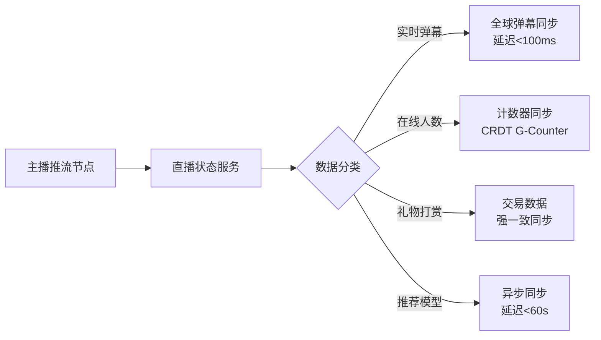

---

## 11. 常见误区与最佳实践

### 11.1 十大常见误区

| 编号 | 误区 | 正确认知 |
|------|------|---------|
| 1 | "异步复制不会丢数据" | 异步复制在主机房故障时可能丢失未同步的数据，RPO>0 |
| 2 | "同步复制=强一致性" | 同步复制只保证副本间一致，不保证分布式事务的一致性 |
| 3 | "延迟监控只需要看Seconds_Behind_Master" | 还需要监控字节差距、IO线程状态、错误日志等多维指标 |
| 4 | "Canal/Debezium不会丢数据" | CDC组件本身可能崩溃，需要监控位点和重启恢复 |
| 5 | "消息队列能保证顺序" | 分区内有序，跨分区无序，需要按分片键路由到同一分区 |
| 6 | "CRDT能解决所有冲突" | CRDT只适用于特定数据类型，不能用于复杂业务逻辑 |
| 7 | "NTP同步就够了" | NTP可能有毫秒级偏移，LWW场景下可能覆盖正确数据 |
| 8 | "全量校验每天跑一次" | 核心表应更频繁校验，非核心表可降低频率 |
| 9 | "同步组件不需要高可用" | CDC组件故障会导致同步中断，需要冗余部署和自动恢复 |
| 10 | "数据同步延迟越低越好" | 过低的同步延迟意味着同步阻塞写入，需要根据业务需求平衡 |

### 11.2 最佳实践清单

**架构设计阶段：**
- 明确每个数据域的RPO和RTO要求，据此选择同步模式
- 核心交易数据使用半同步或强一致方案，非核心数据使用异步方案
- 设计写路由规则，最大限度避免冲突
- 为CRDT不适用的场景准备业务层冲突解决方案

**实施部署阶段：**
- CDC组件（Canal/Debezium）至少部署2个实例，避免单点故障
- 消息队列（Kafka）至少3个Broker，`min.insync.replicas=2`
- 同步链路的位点信息持久化到高可用存储（Redis Cluster或ZooKeeper）
- 配置完善的监控告警：延迟、线程状态、错误、吞吐量

**运维保障阶段：**
- 定期执行数据校验（核心表每天，非核心表每周）
- 定期进行故障演练：模拟CDC组件崩溃、消息积压、网络分区
- 建立数据修复流程：发现不一致后如何快速修复
- 保持同步组件版本更新，关注安全补丁和性能优化

---

## 12. 数据同步的测试与验证

数据同步链路的正确性不能仅靠"看起来正常"来判断。需要建立系统化的测试体系，在上线前和运行中持续验证同步的正确性。

### 12.1 同步正确性测试框架

```python
class SyncTestFramework:
    """
    数据同步正确性测试框架
    核心思路：在主库写入，验证从库是否正确同步
    """
    
    def __init__(self, primary_db, replica_db, sync_delay_ms=3000):
        self.primary = primary_db
        self.replica = replica_db
        self.sync_delay_ms = sync_delay_ms
    
    def test_insert_sync(self, table: str, test_data: dict) -> bool:
        """测试INSERT同步：主库插入后，从库能否读到"""
        cursor_p = self.primary.cursor(dictionary=True)
        cursor_r = self.replica.cursor(dictionary=True)
        
        # 主库插入
        columns = ', '.join(test_data.keys())
        placeholders = ', '.join(['%s'] * len(test_data))
        cursor_p.execute(
            f"INSERT INTO {table} ({columns}) VALUES ({placeholders})",
            list(test_data.values())
        )
        self.primary.commit()
        
        # 等待同步
        time.sleep(self.sync_delay_ms / 1000)
        
        # 从库验证
        pk = test_data.get('id') or test_data.get(list(test_data.keys())[0])
        cursor_r.execute(f"SELECT * FROM {table} WHERE id = %s", (pk,))
        result = cursor_r.fetchone()
        
        if not result:
            print(f"FAIL: INSERT同步失败 - 从库找不到id={pk}")
            return False
        
        # 验证字段值
        for key, expected in test_data.items():
            if result.get(key) != expected:
                print(f"FAIL: 字段{key}值不一致 expected={expected} got={result.get(key)}")
                return False
        
        print(f"PASS: INSERT同步正确 - {table} id={pk}")
        return True
    
    def test_update_sync(self, table: str, pk: int, updates: dict) -> bool:
        """测试UPDATE同步"""
        cursor_p = self.primary.cursor(dictionary=True)
        cursor_r = self.replica.cursor(dictionary=True)
        
        set_clause = ', '.join([f"{k}=%s" for k in updates.keys()])
        cursor_p.execute(f"UPDATE {table} SET {set_clause} WHERE id=%s",
                        list(updates.values()) + [pk])
        self.primary.commit()
        
        time.sleep(self.sync_delay_ms / 1000)
        
        cursor_r.execute(f"SELECT * FROM {table} WHERE id = %s", (pk,))
        result = cursor_r.fetchone()
        
        for key, expected in updates.items():
            if result.get(key) != expected:
                print(f"FAIL: UPDATE同步失败 {key}: expected={expected} got={result.get(key)}")
                return False
        
        print(f"PASS: UPDATE同步正确 - {table} id={pk}")
        return True
    
    def test_delete_sync(self, table: str, pk: int) -> bool:
        """测试DELETE同步"""
        cursor_p = self.primary.cursor(dictionary=True)
        cursor_r = self.replica.cursor(dictionary=True)
        
        cursor_p.execute(f"DELETE FROM {table} WHERE id = %s", (pk,))
        self.primary.commit()
        
        time.sleep(self.sync_delay_ms / 1000)
        
        cursor_r.execute(f"SELECT COUNT(*) as cnt FROM {table} WHERE id = %s", (pk,))
        result = cursor_r.fetchone()
        
        if result['cnt'] > 0:
            print(f"FAIL: DELETE同步失败 - 从库仍存在id={pk}")
            return False
        
        print(f"PASS: DELETE同步正确 - {table} id={pk}")
        return True
    
    def test_concurrent_conflict(self, table: str, pk: int,
                                  unit_a_value: str, unit_b_value: str) -> dict:
        """测试并发写入冲突解决"""
        cursor_a = self.primary.cursor(dictionary=True)
        cursor_b = self.replica.cursor(dictionary=True)
        
        # 模拟并发写入
        cursor_a.execute(f"UPDATE {table} SET name=%s WHERE id=%s", (unit_a_value, pk))
        cursor_b.execute(f"UPDATE {table} SET name=%s WHERE id=%s", (unit_b_value, pk))
        
        self.primary.commit()
        self.replica.commit()
        
        time.sleep(self.sync_delay_ms * 2 / 1000)  # 双倍延迟等待双向同步
        
        # 检查最终一致性
        cursor_a.execute(f"SELECT name FROM {table} WHERE id = %s", (pk,))
        val_a = cursor_a.fetchone()['name']
        
        cursor_b.execute(f"SELECT name FROM {table} WHERE id = %s", (pk,))
        val_b = cursor_b.fetchone()['name']
        
        consistent = val_a == val_b
        return {
            'consistent': consistent,
            'unit_a_value': val_a,
            'unit_b_value': val_b,
            'expected_winner': 'LWW should pick one deterministically'
        }
```

### 12.2 压力测试：模拟真实同步负载

```python
import concurrent.futures
import time
import random

class SyncStressTest:
    """
    同步压力测试：模拟高并发写入下的同步行为
    验证：同步延迟、数据完整性、冲突处理在压力下的表现
    """
    
    def __init__(self, primary_db, replica_db, config):
        self.primary = primary_db
        self.replica = replica_db
        self.config = config  # {'table': 'orders', 'write_rate': 1000, 'duration_sec': 300}
    
    def run(self) -> dict:
        """执行压力测试"""
        results = {
            'writes_attempted': 0,
            'writes_succeeded': 0,
            'writes_failed': 0,
            'sync_latencies': [],
            'data_inconsistencies': 0,
        }
        
        start_time = time.time()
        
        with concurrent.futures.ThreadPoolExecutor(max_workers=10) as executor:
            futures = []
            for i in range(self.config['write_rate'] * self.config['duration_sec'] // 10):
                futures.append(executor.submit(self._write_order, i))
            
            for future in concurrent.futures.as_completed(futures):
                try:
                    result = future.result()
                    results['writes_attempted'] += 1
                    if result['success']:
                        results['writes_succeeded'] += 1
                    else:
                        results['writes_failed'] += 1
                except Exception as e:
                    results['writes_failed'] += 1
        
        # 最终一致性检查
        time.sleep(30)  # 等待所有同步完成
        results['data_inconsistencies'] = self._check_consistency()
        
        results['duration_sec'] = time.time() - start_time
        return results
    
    def _write_order(self, seq: int) -> dict:
        """模拟一笔订单写入"""
        try:
            cursor = self.primary.cursor()
            cursor.execute(
                "INSERT INTO orders (user_id, amount, status, created_at) VALUES (%s, %s, %s, NOW())",
                (random.randint(1, 100000), round(random.uniform(10, 10000), 2), 'pending')
            )
            self.primary.commit()
            return {'success': True, 'seq': seq}
        except Exception as e:
            return {'success': False, 'seq': seq, 'error': str(e)}
    
    def _check_consistency(self) -> int:
        """检查主从数据一致性"""
        cursor_p = self.primary.cursor()
        cursor_r = self.replica.cursor()
        
        cursor_p.execute("SELECT COUNT(*) as cnt FROM orders")
        primary_count = cursor_p.fetchone()[0]
        
        cursor_r.execute("SELECT COUNT(*) as cnt FROM orders")
        replica_count = cursor_r.fetchone()[0]
        
        diff = abs(primary_count - replica_count)
        if diff > 0:
            print(f"WARNING: 主从数据行数差异 primary={primary_count} replica={replica_count} diff={diff}")
        return diff
```

### 12.3 混沌工程：故障注入测试

数据同步链路必须经受各种故障场景的考验：

| 故障场景 | 注入方式 | 预期行为 | 验证方法 |
|---------|---------|---------|---------|
| CDC组件崩溃 | kill Canal进程 | 重启后从断点续传 | 检查位点恢复和数据完整性 |
| 消息队列积压 | 停止消费10分钟 | 恢复消费后追赶同步 | 监控延迟恢复时间 |
| 网络分区 | iptables阻断机房通信 | 超时降级为异步 | 检查降级日志和数据一致性 |
| 主库故障 | 关闭主库实例 | 故障切换到从库 | 检查RPO和RTO是否达标 |
| 从库磁盘满 | dd填充磁盘空间 | 同步暂停，告警触发 | 检查告警是否及时 |
| 时钟偏移 | ntpdate调整系统时间 | LWW决策不受显著影响 | 检查冲突解决结果 |

---

## 13. 本节总结

数据同步机制是多活架构的核心技术，决定了多活系统能否在高可用的同时保障数据安全。本节从以下维度进行了系统阐述：

```mermaid
graph TD
    A[数据同步机制] --> B[同步模式]
    A --> C[变更捕获]
    A --> D[一致性模型]
    A --> E[冲突解决]
    A --> F[可靠性保障]
    A --> G[性能优化]
    A --> H[安全合规]

    B --> B1[同步复制]
    B --> B2[异步复制]
    B --> B3[半同步复制]
    B --> B4[Group Replication]

    C --> C1[Binlog/WAL解析]
    C --> C2[触发器]
    C --> C3[消息队列]
    C --> C4[Flink CDC]
    C --> C5[Schema演进管理]

    D --> D1[强一致性]
    D --> D2[最终一致性]
    D --> D3[因果一致性]
    D --> D4[读己之写]

    E --> E1[写路由锁定]
    E --> E2[LWW]
    E --> E3[CRDT]
    E --> E4[业务层仲裁]

    F --> F1[Exactly-Once近似]
    F --> F2[断点续传]
    F --> F3[延迟监控]
    F --> F4[数据校验]

    G --> G1[批量写入]
    G --> G2[并行复制]
    G --> G3[选择性同步]
    G --> G4[压缩传输]

    H --> H1[传输加密]
    H --> H2[敏感数据处理]
    H --> H3[访问控制]
```

**核心要点回顾：**

1. **理论约束**：PACELC框架揭示了数据同步的根本权衡——一致性、可用性、延迟三者不可兼得，必须根据业务场景做出选择
2. **同步模式选择**取决于RPO要求：零丢失选同步/半同步，可容忍少量丢失选异步
3. **变更捕获**是同步的基石：Binlog解析（Canal/Debezium）是主流方案，Flink CDC适合流式处理场景
4. **Schema演进**是同步链路的隐藏炸弹：DDL变更必须"下游先行"，同步团队必须纳入变更管理流程
5. **一致性模型**决定用户体验：强一致适合金融场景，最终一致适合大多数业务
6. **冲突解决**是多活的终极挑战：写路由锁定是首选，CRDT适合特定数据类型，业务层仲裁适合复杂逻辑
7. **可靠性保障**是长期运维的关键：幂等性、位点管理、监控告警、数据校验缺一不可
8. **安全合规**不可忽视：传输加密、敏感数据脱敏、最小权限原则是同步链路的基本要求

**数据同步方案选型速查表：**

| 场景特征 | 推荐方案 | 核心工具 | 一致性级别 |
|---------|---------|---------|-----------|
| 同城双活，核心交易 | 半同步/MGR | MySQL半同步/TiDB | 强一致 |
| 异地多活，电商 | 单元化+异步同步 | Canal+Kafka+业务路由 | 最终一致 |
| 全球多活，社交 | 因向量时钟+异步 | Debezium+自研同步层 | 因果一致 |
| 金融核心，支付 | Raft/Paxos共识 | TiDB/CockroachDB | 强一致 |
| 数据湖同步 | CDC+流处理 | Flink CDC+Iceberg | 最终一致 |

数据同步不是"配好就不管"的运维操作，而是需要持续监控、定期验证、不断优化的长期工程。只有将同步链路的可靠性提升到与业务系统同等的重视程度，多活架构才能真正发挥作用。
