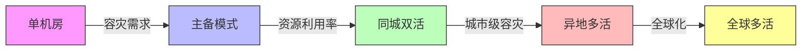
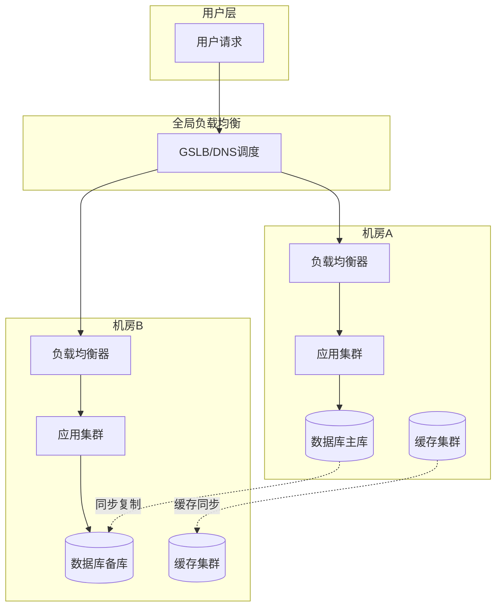
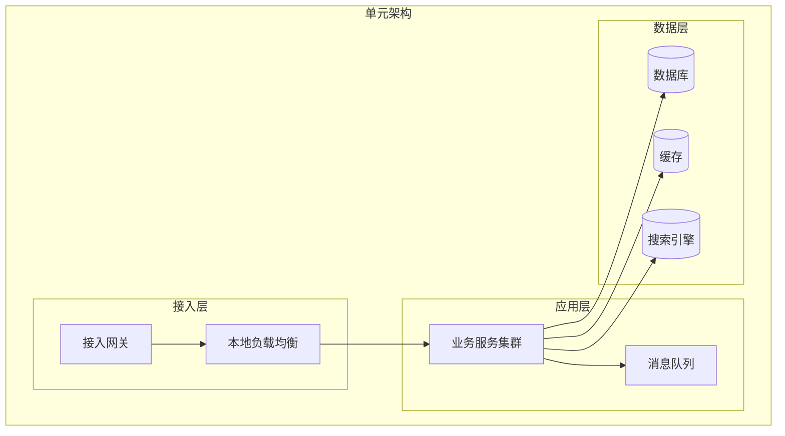
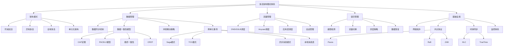

# 多活架构理论基础

多活架构是分布式系统领域中复杂度最高、收益也最大的架构模式之一。它从根本上改变了传统"主-备"容灾思路，让多个数据中心同时承担业务流量，既提升了系统整体吞吐能力，又大幅降低了灾难恢复的风险。然而，多活架构绝非简单地把服务部署到多个机房——它涉及数据一致性、流量调度、单元化设计、共识协议、故障切换等多个维度的深层理论问题，每一个维度都有其严格的理论基础和工程约束。

本节从理论层面系统阐述多活架构的核心概念、设计原理和关键要素，帮助读者建立完整的知识框架，为后续的实战技巧和案例分析奠定坚实基础。

---

## 1. 多活架构的演进与定义

### 1.1 高可用架构的演进路径

高可用架构的演进并非一蹴而就，而是经历了从简单到复杂、从低成本到高投入的渐进过程。理解这条演进路径，有助于判断自身系统所处的阶段以及下一步的演进方向。

**第一阶段：单机房部署（Single Site）**

最基础的部署形态。所有服务和数据部署在一个数据中心内，通过服务器集群和负载均衡器实现水平扩展。优点是架构简单、运维成本低；致命缺陷是单机房级别的故障（如断电、火灾、光缆被挖断）会导致业务完全不可用。单机房的可用性上限通常在99.9%（年停机约8.76小时），无法满足关键业务的需求。

**第二阶段：主备模式（Active-Standby）**

在单机房基础上增加一个灾备中心。正常情况下，主中心处理所有流量，备中心处于待命状态，通过数据同步保持与主中心的数据一致。当主中心发生故障时，手动或半自动地将流量切换到备中心。主备模式将可用性提升到99.95%-99.99%级别，但存在两个核心问题：备中心长期闲置，资源利用率不到50%；切换过程复杂且风险高，实测中主备切换失败的案例并不罕见。Gartner统计显示，约70%的企业在首次灾难恢复切换中遇到重大问题。

**第三阶段：同城双活（Same-City Active-Active）**

在同一城市的两个数据中心同时部署完整服务，两个中心同时承担业务流量。由于地理位置接近（通常50公里以内），网络延迟极低（1-3毫秒），可以通过同步复制保证数据强一致。同城双活解决了资源利用率问题，两个中心都在干活，但其保护范围仅限于机房级故障，无法抵御城市级灾难（如大面积停电、自然灾害）。

**第四阶段：异地多活（Geo-Distributed Multi-Active）**

在不同地域（如北京和上海、中国和美国）的多个数据中心同时提供服务。异地多活将保护范围扩展到城市级甚至区域级，可用性可达99.99%以上。但技术复杂度也成倍增长——跨地域的高延迟（20-100毫秒）使得同步复制不可行，必须采用异步复制，由此引入数据一致性的挑战。阿里、美团、饿了么等互联网巨头均已实施异地多活架构。

**第五阶段：全球多活（Global Multi-Active）**

面向全球化业务的终极形态。在全球多个大洲部署数据中心，通过智能调度将用户引导到最近的数据中心。全球多活的代表是Google的Spanner架构——通过TrueTime API（基于原子钟和GPS的精确时间同步）在全球范围内实现外部一致性（External Consistency），这是目前分布式系统理论的最高成就之一。CockroachDB受Spanner启发，使用混合逻辑时钟（HLC）在不依赖专用硬件的前提下近似实现类似效果。

| 演进阶段 | 数据中心数量 | 保护级别 | 可用性上限 | 技术复杂度 | 典型投入 |
|---------|------------|---------|-----------|-----------|---------|
| 单机房 | 1 | 服务器级 | 99.9% | 低 | 基准 |
| 主备模式 | 2 | 机房级 | 99.95% | 中 | 1.5-2倍 |
| 同城双活 | 2（同城） | 机房级 | 99.99% | 中高 | 2-2.5倍 |
| 异地多活 | 3+（异地） | 城市级 | 99.99%+ | 高 | 3-5倍 |
| 全球多活 | 5+（全球） | 区域级 | 99.999% | 极高 | 5-10倍 |

### 1.2 多活架构的核心定义

多活架构（Multi-Active Architecture）是指在分布式系统中，让多个数据中心（或机房）同时处于活跃状态，共同承担业务流量的架构模式。与主备模式的根本区别在于：

- **资源利用率**：多活架构中所有数据中心都参与业务处理，没有长期闲置的备份资源。每个机房都是"活"的，都能独立处理用户请求。
- **故障恢复方式**：主备模式依赖手动/半自动切换，切换时间长且风险高；多活架构通过流量调度机制实现自动或半自动切换，切换时间短且风险可控。
- **容量扩展**：多活架构天然支持水平扩展——增加新的数据中心即增加新的处理能力，而主备模式中增加备机并不能提升处理能力。
- **故障域隔离**：多活架构中每个数据中心是独立的故障域，单个机房的故障不会波及其他机房，实现了故障爆炸半径的有效控制。

但多活架构的核心挑战在于：**如何在多个数据中心同时提供服务的同时，保证数据的一致性和业务的正确性？** 这是贯穿整个多活架构理论的核心问题。

### 1.3 多活架构的本质矛盾

多活架构面临一个根本性的理论矛盾：**可用性与一致性之间的权衡**。这个矛盾可以用CAP定理来形式化描述。

CAP定理指出，在分布式系统中，一致性（Consistency）、可用性（Availability）和分区容忍性（Partition Tolerance）三者不可兼得，最多只能同时满足其中两个。在多活架构中，网络分区是客观存在的（机房间的网络可能中断），因此分区容忍性（P）是必须保证的。这意味着系统只能在一致性（C）和可用性（A）之间做出选择：

- **选择CP（一致性+分区容忍）**：当网络分区发生时，部分数据中心拒绝服务以保证数据一致性。代表方案是Google Spanner的Paxos协议。
- **选择AP（可用性+分区容忍）**：当网络分区发生时，所有数据中心继续提供服务，但数据可能暂时不一致。这是大多数多活架构的选择。

实际工程中，多活架构通常采用**混合策略**：大部分业务选择AP（最终一致性），少数对数据一致性要求极高的业务（如支付、转账）选择CP（强一致性或同步复制）。这种"大部分最终一致+关键路径强一致"的策略，是当前多活架构的主流实践。

---

## 2. 同城双活架构

同城双活是最基础的多活形态，也是大多数企业实施多活架构的第一步。理解同城双活的原理和约束，是理解更复杂的异地多活的前提。

### 2.1 架构模型

同城双活指在同一城市或相邻区域的两个数据中心同时提供服务。由于两个机房之间的物理距离通常在50公里以内，网络延迟极低（单程0.1-0.5毫秒，往返1-3毫秒），这为数据同步提供了极为有利的条件。

同城双活的典型部署拓扑如下：

### 2.2 共享存储方案

同城双活最简单的实现方式是共享存储。两个机房的应用服务器通过SAN（Storage Area Network）或分布式存储系统共享同一份数据。底层存储采用同步复制机制，确保两个机房看到的数据完全一致。

**工作原理**：应用服务器A和应用服务器B都连接到同一个分布式存储集群（如VMware vSAN、Ceph）。写入操作在存储层同步到两个物理位置，读取操作可以就近读取本地副本。

**优点**：实现简单，应用层无需感知双活逻辑；数据一致性天然保障，因为底层是同一份数据的同步副本；对现有应用的改造成本最低。

**缺点**：存储层成为单点瓶颈——一旦共享存储集群出现故障，两个机房都会受到影响。此外，同步复制会增加写入延迟（通常增加0.5-2毫秒），在高并发写入场景下可能成为性能瓶颈。共享存储方案的跨机房距离受限于光纤传输的物理极限，超过50公里后延迟和成本都急剧增加。

**适用场景**：适合对数据一致性要求极高、写入吞吐量不是特别大的场景，如金融交易系统的核心数据库。不适合高并发写入的互联网业务。

### 2.3 数据库同步方案

更常见的同城双活方案是基于数据库的同步复制。主库在机房A，备库在机房B，通过数据库原生的同步复制机制保持数据一致。

**MySQL半同步复制（Semi-Synchronous Replication）**：

MySQL的半同步复制是同城双活中最常用的方案。其工作原理是：主库执行写入操作后，将binlog发送给从库；从库接收到binlog并写入relay log后，向主库返回确认（ACK）；主库收到确认后才向客户端返回写入成功。这保证了每个已确认的写入操作至少存在于两个机房的数据库中。

半同步复制的关键参数是`rpl_semi_sync_master_timeout`（超时时间），通常设置为1-3秒。如果从库在超时时间内未返回ACK，复制会降级为异步模式，以保证写入性能不受影响。这个"降级"机制是半同步复制的一个重要特性——它在正常情况下保证数据同步，在异常情况下优先保证可用性。

MySQL 8.0引入了增强半同步复制（Enhanced Semi-Synchronous Replication），将ACK确认从"写入relay log"提升到"应用完binlog"，进一步缩小了数据不一致的窗口。

**PostgreSQL同步流复制（Synchronous Streaming Replication）**：

PostgreSQL的同步流复制通过`synchronous_commit`参数控制。设置为`on`时，事务提交必须等待备库确认；设置为`remote_write`时，只需等待备库将WAL写入操作系统缓存；设置为`remote_apply`时，需等待备库完成回放。在同城双活场景中，通常设置为`remote_write`以平衡一致性和性能。

PostgreSQL还支持通过` synchronous_standby_names`指定同步备库列表，可以配置多个同步备库，采用`ANY N`（任一N个确认即可）或`FIRST N`（前N个必须确认）的策略，灵活控制同步强度。

**同城延迟对同步复制的影响**：

同城机房间的网络延迟通常在1-3毫秒。对于单次写入操作，同步复制增加的延迟为2-6毫秒（往返两次网络传输）。对于单条SQL执行，这个延迟可以忽略不计。但在高并发场景下，如果每个事务都等待同步确认，整体吞吐量会受到显著影响。

典型的应对策略是**批量提交**：将多个小事务合并为一个大事务提交，分摊同步延迟的开销。例如，将100条INSERT合并为一个批次提交，同步延迟只增加一次而非100次。另一种策略是**异步化非关键写入**：将日志记录、统计计数等非关键操作改为异步复制，仅对核心业务数据使用同步复制，降低同步复制对整体吞吐的影响。

### 2.4 流量切换机制

同城双活的流量切换是实现高可用的关键环节。切换机制的设计需要平衡切换速度和切换风险。

**DNS切换**：

最基本的切换方式。正常情况下，DNS将两个机房的IP都返回给用户（加权轮询）。当机房A故障时，DNS将机房A的IP从解析结果中移除，所有流量导向机房B。DNS切换的缺点是受DNS缓存影响，切换时间通常在分钟级别（取决于TTL设置）。实践中通常将TTL设置为60秒，配合HTTPDNS和客户端SDK可以将切换时间缩短到秒级。

**负载均衡器切换**：

在DNS之上，通过全局负载均衡器（如F5 BIG-IP GTM、AWS Route 53、阿里云GTM）实现更精细的流量调度。负载均衡器通过持续的健康检查监控各机房状态，当检测到故障时自动调整流量分配。切换时间通常在秒级，比纯DNS切换快得多。

**应用层切换**：

最快速的切换方式。应用层通过心跳检测感知对端机房状态，当检测到对端不可用时，自动接管对端的流量。切换时间可以做到秒级甚至亚秒级，但实现复杂度最高，需要应用层具备流量接管的能力。

| 切换方式 | 切换时间 | 实现复杂度 | 适用场景 |
|---------|---------|-----------|---------|
| DNS切换 | 1-5分钟 | 低 | 基础容灾 |
| 负载均衡器切换 | 5-30秒 | 中 | 标准双活方案 |
| 应用层切换 | <5秒 | 高 | 对可用性要求极高的场景 |

---

## 3. 异地多活架构

异地多活是多活架构的高级形态，其核心目标是在不同地域的多个数据中心同时提供服务，以抵御城市级甚至区域级灾难。异地多活面临的技术挑战远大于同城双活，根本原因在于**地理距离带来的高延迟**。

### 3.1 同城双活与异地多活的关键差异

理解同城双活和异地多活的差异，是正确选择架构模式的前提。

| 维度 | 同城双活 | 异地多活 |
|------|---------|---------|
| 地理距离 | <50公里 | 100-3000+公里 |
| 网络延迟 | 1-3毫秒 | 20-100+毫秒 |
| 数据同步方式 | 同步复制 | 异步复制 |
| 数据一致性 | 强一致 | 最终一致 |
| 切换时间 | 秒级 | 分钟级 |
| 容灾级别 | 机房级 | 城市/区域级 |
| 技术复杂度 | 中 | 高 |
| 核心挑战 | 流量调度 | 数据一致性+单元化设计 |

这个差异表中最重要的信息是**数据同步方式的转变**。同城双活可以使用同步复制保证数据强一致，而异地多活由于高延迟，同步复制会导致写入性能急剧下降（每次写入增加40-200毫秒的延迟），因此必须采用异步复制。异步复制意味着在故障切换时，可能存在少量数据丢失（异步窗口内的数据）。

### 3.2 异地多活的核心挑战

**挑战一：跨地域延迟**

北京到上海的网络往返延迟约30毫秒，北京到广州约40毫秒，中国到美国约150-200毫秒。这些延迟使得同步复制不可行，必须采用异步复制。异步复制的窗口期内（通常1-5秒），如果发生故障切换，这部分数据将丢失。

跨地域延迟的具体影响：一次跨机房的数据库同步写入需要至少一个网络往返时间（RTT）。如果使用同步复制，单次写入延迟增加约30-200毫秒；在高并发场景下（如每秒1万次写入），同步复制的吞吐量可能下降到同城场景的1/10甚至更低。这就是为什么异地多活必须采用异步复制的根本原因。

**挑战二：数据一致性保障**

在异步复制模式下，如何保证业务的正确性？这是异地多活最核心的理论问题。常见策略包括：

- **读写一致性保障**：用户的写入操作完成后，后续的读请求被路由到写入发生的单元，确保用户能看到自己刚写入的数据。
- **业务层面的幂等设计**：即使数据在同步过程中出现重复或乱序，业务逻辑也能正确处理。
- **关键路径强一致**：对于支付、转账等关键操作，通过路由到单一主单元或使用分布式锁来保证强一致性。
- **冲突检测与合并**：当两个单元同时修改同一数据时，通过版本向量、时间戳或CRDT等机制自动检测和合并冲突。

**挑战三：流量调度的复杂性**

异地多活需要在多个地域之间智能调度流量。调度策略需要综合考虑用户的地理位置、网络环境、各数据中心的负载状态、数据就近性等多种因素。调度策略的失误可能导致流量被引导到错误的数据中心，引发性能下降甚至数据不一致。

**挑战四：故障域的隔离与恢复**

异地多活中，每个数据中心是一个独立的故障域。当某个数据中心故障时，需要将其流量切换到其他数据中心，同时保证切换过程中不产生数据冲突。这要求系统具备清晰的故障检测机制、流量切换策略和数据恢复流程。

### 3.3 异地多活的部署模式

根据数据中心之间的关系，异地多活有三种典型的部署模式：

**对等多活（Symmetric Multi-Active）**：所有数据中心的地位完全对等，每个中心都承担相同的业务功能和流量比例。这是理论上最理想的模式，但实现难度最大——需要解决所有数据中心之间的数据同步和冲突问题。实践中很少有系统能实现真正的对等多活，Google Spanner通过TrueTime+Paxos在一定程度上实现了这一目标。

**非对称多活（Asymmetric Multi-Active）**：各数据中心承担不同的业务角色。例如，主数据中心处理所有写操作，其他数据中心处理读操作。这种模式在数据一致性和性能之间取得了平衡，是目前最常用的异地多活模式。饿了么的"同城双活+异地灾备"就是一种非对称多活的变体。

**中心-边缘多活（Hub-Spoke Multi-Active）**：一个中心数据中心（Hub）处理全局性数据和关键写操作，多个边缘数据中心（Spoke）处理区域性业务。这种模式适合业务有明显地域特征的场景，如携程的"区域化部署+全局化调度"。

---

## 4. 共识协议与分布式一致性

共识协议是多活架构的理论基石之一。在多活架构中，当数据需要在多个数据中心之间保持一致时，底层依赖的就是共识协议。理解共识协议的原理，才能真正理解多活架构中"一致性"的含义和边界。

### 4.1 为什么需要共识协议

在分布式系统中，多个节点需要对某个值达成一致——比如"哪个数据中心持有某个数据分片的主写入权"。如果没有共识协议，当网络分区或节点故障时，不同节点可能做出矛盾的决策，导致数据冲突或脑裂（Split-Brain）。共识协议通过严格的数学证明，保证在满足特定条件时，系统中的所有正确节点最终能对某个值达成一致。

### 4.2 Paxos协议

Paxos由Leslie Lamport于1989年提出（论文《The Part-Time Parliament》），是分布式共识的经典理论基础。Paxos的三个角色——Proposer（提议者）、Acceptor（接受者）、Learner（学习者）——通过两阶段（Prepare/Promise和Accept/Accepted）的交互，保证在多数节点存活的情况下，系统能对一个值达成一致。

**Multi-Paxos**：实际系统中很少直接运行单次Paxos，而是运行连续的Multi-Paxos来对一系列值达成共识。Multi-Paxos通过选举一个稳定的Leader，让Leader跳过Prepare阶段直接发送Accept请求，大幅提升了吞吐量。Google的Chubby锁服务和Spanner数据库都基于Multi-Paxos实现。

**Paxos的工程挑战**：Lamport的原始Paxos论文以晦涩著称，工程实现困难。主要挑战包括：成员变更（如何在不中断服务的情况下增减节点）、日志压缩（如何避免日志无限增长）、活锁（两个Proposer交替抢占导致无法形成多数派）。这些挑战促使了Raft协议的诞生。

### 4.3 Raft协议

Raft由Diego Ongaro和John Ousterhout于2014年提出（论文《In Search of an Understandable Consensus Algorithm》），设计目标是比Paxos更容易理解和实现。Raft将共识问题分解为三个相对独立的子问题：

**Leader选举**：系统中的节点分为Leader、Follower和Candidate三种状态。正常运行时只有一个Leader，所有写请求都通过Leader处理。当Leader故障时，Follower在选举超时后转变为Candidate发起选举，获得多数投票后成为新Leader。选举超时时间随机化（150-300毫秒），避免多个Candidate同时发起选举导致活锁。

**日志复制**：Leader接收客户端请求，将操作追加到自己的日志中，然后并行发送AppendEntries RPC给所有Follower。当多数节点确认后，Leader提交该日志条目并应用到状态机，然后通知Follower提交。如果Follower的日志与Leader不一致，Leader会通过日志匹配和覆盖来修复Follower的日志。

**安全性保证**：Raft通过两个关键约束保证安全性——只有包含所有已提交日志的节点才能当选Leader（选举限制），以及Leader不会删除或覆盖已提交的日志条目（Leader Append-Only）。

**Raft在多活架构中的应用**：etcd（Kubernetes的核心存储）、Consul（HashiCorp的发现与配置工具）、TiKV（TiDB的存储引擎）都基于Raft实现。在多活架构中，Raft常用于配置中心、元数据管理和跨机房的强一致性数据同步。

### 4.4 ZAB协议

ZAB（ZooKeeper Atomic Broadcast）是Apache ZooKeeper使用的共识协议，由ZooKeeper团队于2008年提出。ZAB与Raft在设计思想上非常相似（实际上Raft的设计受到了ZAB的影响），主要区别在于：

- ZAB的Leader选举使用Epoch（纪元）号来标识任期，Raft使用Term
- ZAB的写入协议是两阶段的（Proposal+Commit），Raft是单阶段的（AppendEntries）
- ZAB强调"崩溃恢复"模式和"原子广播"模式的切换，Raft将Leader选举和日志复制统一在一个框架中

ZAB被广泛用于多活架构中的协调服务，如跨机房的配置同步、服务发现和分布式锁。

### 4.5 共识协议的性能约束

共识协议的性能受制于两个核心约束：

**多数派要求**：Paxos/Raft需要多数节点确认才能提交，在3节点部署中至少需要2个节点确认，在5节点部署中至少需要3个节点确认。这意味着在N节点的集群中，最多可以容忍`(N-1)/2`个节点故障。在跨机房部署中，如果每个机房部署一个节点，3机房集群可以容忍1个机房故障；如果某个机房部署了多数节点，则该机房成为关键故障点。

**网络延迟瓶颈**：每次提交都需要至少一个网络往返（Leader到Follower再返回），跨机房的延迟直接限制了写入吞吐量。在同城场景下（1-3毫秒RTT），单Leader的Raft集群写入吞吐量可以达到数千TPS；在异地场景下（30-200毫秒RTT），单Leader的写入吞吐量可能降到每秒几百TPS。因此，跨机房的强一致性场景通常采用分片架构，每个分片独立运行Raft/Paxos协议。

---

## 5. 单元化架构设计

单元化架构（Unitization）是异地多活的核心设计理念，也是解决跨地域数据访问性能问题的关键技术。理解单元化架构的原理和设计方法，是掌握异地多活的必经之路。

### 5.1 单元的定义与边界

所谓"单元"（Unit），是指一个能够独立完成业务闭环的最小架构单元。一个完整的单元包含以下层次：

单元的关键特征是**自包含性**（Self-Containment）和**独立性**（Independence）：

- **自包含性**：单元拥有完整的技术栈（接入层、应用层、数据层），能够独立处理用户请求，无需依赖其他单元的核心功能。
- **独立性**：单元之间的数据访问被最小化，每个单元主要处理自己归属的数据。跨单元的调用应该控制在极低比例（理想情况下<5%）。

单元的边界划定是单元化设计中最关键的决策。边界过大（一个单元包含太多业务），隔离性不足；边界过小（单元数量太多），管理开销急剧增加。实践中，合理的单元数量通常在2-5个之间。

### 5.2 单元划分策略

单元划分的核心目标是最大化数据访问的本地性——让同一个用户（或同一组数据）的所有操作尽可能在同一个单元内完成。常见的划分策略有以下几种：

**按用户ID划分**：以用户ID作为分片键，通过取模运算（如`user_id % N`）将用户均匀分配到N个单元中。这是最常用的划分策略，适用于以用户为中心的业务（如社交、电商、外卖）。优点是数据访问天然局部化，同一个用户的数据集中在同一个单元中；缺点是跨用户的交互（如转账、关注关系）需要跨单元处理。

按用户ID划分时，路由算法的设计至关重要。简单的取模运算在扩缩容时需要大规模数据迁移（改变N的值会影响几乎所有用户的归属）。更优雅的方案是使用**一致性哈希**（Consistent Hashing）：将用户ID映射到一个哈希环上，每个单元负责环上的一段范围。增减单元时，只需要迁移相邻单元的数据，影响范围最小。虚拟节点（Virtual Node）技术可以进一步改善一致性哈希的负载均衡效果——每个物理节点映射多个虚拟节点到哈希环上，使得负载分布更均匀。

**按地理位置划分**：根据用户的物理IP地址，将其分配到最近的数据中心。适用于对延迟极度敏感且业务与地理位置强相关的场景（如LBS服务、本地生活）。优点是用户访问延迟最低；缺点是用户流动性（出差、旅行）会导致归属频繁变化，且不同区域的用户量差异可能很大（一线城市 vs 三四线城市），导致热点单元问题。

**按业务维度划分**：将不同的业务线部署在不同的数据中心。例如，搜索服务在北京，推荐服务在上海，用户服务在广州。这种划分方式适合业务线之间耦合度低的场景，但业务间的依赖调用需要跨机房，延迟较高。

**混合划分策略**：实际系统中，往往需要结合多种划分维度。例如，用户维度数据按用户ID划分，商品维度数据在所有单元全量复制，全局维度数据（如支付渠道、风控规则）集中在一个"中心单元"中。阿里巴巴的多活架构就是典型的混合划分策略——这种"数据分层"的做法比单一维度的划分更加灵活务实。

| 划分维度 | 数据局部性 | 分布均匀性 | 跨单元交互 | 适用场景 |
|---------|-----------|-----------|-----------|---------|
| 用户ID | 高 | 高（取模） | 中（跨用户） | 社交、电商、外卖 |
| 地理位置 | 中（受流动性影响） | 低（区域差异大） | 低 | LBS、本地生活 |
| 业务维度 | 视业务而定 | 视业务而定 | 高（跨业务） | 业务耦合低的平台 |
| 混合策略 | 高 | 高 | 低 | 大型综合平台 |

### 5.3 例外数据处理

在单元化架构中，总有一些数据无法按照常规规则划分到特定单元中。这些"例外数据"的处理是单元化设计的难点之一。

**全局配置数据**：系统配置、功能开关、AB测试规则等全局性数据。这类数据的特点是读多写少、全局一致。处理方式是**全量复制到所有单元**——在任意单元修改后，通过配置中心（如Nacos、Etcd）广播到所有单元。

**公共字典数据**：城市列表、商品类目、行政区划等基础数据。与全局配置类似，采用全量复制策略。由于这类数据变更频率极低（通常由运营人员手动维护），全量复制的数据同步压力可以忽略不计。

**跨用户关系数据**：用户之间的关注关系、好友关系、家庭关系等。这类数据的特点是关联双方可能归属不同的单元。常见处理方式有两种：**冗余存储**（将关系数据在双方归属单元各存一份，写入时双向同步）或**中心化存储**（将关系数据存储在专门的"关系单元"中，其他单元通过远程查询访问）。

**全局唯一性约束数据**：全局自增ID、支付流水号、订单号等需要全局唯一的标识符。这类数据无法分片，必须集中管理。常见方案是**号段分配**：中心单元预先分配一批ID号段给各单元，各单元在号段内自主生成ID，号段用完后再向中心申请新号段。百度的UidGenerator、美团的Leaf都采用了类似的号段方案，单机每秒可生成数十万个唯一ID。

### 5.4 中心单元设计

在非对称多活架构中，通常需要一个"中心单元"（Center Unit）来处理无法分片的全局数据和跨单元操作。中心单元的设计需要考虑以下要素：

**功能定位**：中心单元承担全局数据的管理（如支付渠道、营销规则）和跨单元操作的协调（如转账、全局搜索）。它不处理常规的用户请求，只处理需要全局视角的特殊请求。

**高可用设计**：中心单元是系统的"单点"，其可用性要求比普通单元更高。通常采用同城双活部署——中心单元本身也有主备两个机房，通过同步复制保证数据一致性。当主中心故障时，备中心可以快速接管。

**性能优化**：由于所有单元的跨单元请求都会汇聚到中心单元，其负载可能很高。优化策略包括：全量缓存全局数据（减少数据库访问）、异步化非关键操作（如日志记录、统计分析）、预计算热门数据（如排行榜、热搜词）。

---

## 6. 数据同步机制

数据同步是多活架构的技术基石。同步机制的选择直接影响数据一致性、系统性能和故障恢复能力。

### 6.1 同步复制与异步复制

**同步复制（Synchronous Replication）**：

写入操作在主库执行后，必须等待从库确认（数据已写入）才向客户端返回成功。这保证了每个已确认的写入至少存在于两个副本中，不存在数据丢失风险。

同步复制的核心约束是**延迟**。每次写入都需要等待一次网络往返，在同城场景下（1-3毫秒）影响不大，但在异地场景下（20-100毫秒）会导致写入吞吐量下降一个数量级。因此，同步复制只适用于同城双活场景。

**异步复制（Asynchronous Replication）**：

写入操作在主库执行后立即向客户端返回成功，数据变更通过后台异步的方式同步到从库。异步复制的优点是写入延迟不受网络距离影响，适用于异地多活场景。缺点是存在数据丢失风险——如果主库在数据同步到从库之前发生故障，异步窗口内的数据将丢失。

异步窗口的大小取决于网络延迟和同步组件的处理能力。在正常的网络条件下，异步复制的延迟通常在1-5秒。通过优化同步组件（如并行同步、批量合并），可以将延迟压缩到秒级以内。

**半同步复制（Semi-Synchronous Replication）**：

同步复制和异步复制的折中方案。主库执行写入后，等待至少一个从库确认数据已接收（不一定是已应用），然后向客户端返回成功。这保证了每个已确认的写入至少存在于两个副本中，但不保证从库已完全应用数据。MySQL的半同步复制就是这种模式的典型实现。

### 6.2 基于Binlog的数据同步

基于数据库binlog的数据同步是多活架构中最常见的同步机制。其工作原理是：解析数据库的二进制日志（binlog），提取数据变更事件，然后将这些事件应用到目标数据库。

**Canal（阿里开源）**：

Canal是阿里巴巴开源的增量数据订阅和消费组件。它伪装成MySQL的从库，通过MySQL的主从复制协议获取binlog，解析后将数据变更事件推送给消费者。Canal支持集群部署和高可用，是生产环境中最常用的binlog解析工具之一。

Canal的工作流程：
1. Canal Server向MySQL Master注册为从库
2. MySQL Master将binlog推送给Canal Server
3. Canal Server解析binlog，提取数据变更事件（INSERT/UPDATE/DELETE）
4. Canal Client订阅变更事件，将事件应用到目标数据库

**Maxwell**：

Maxwell是另一个常用的binlog解析工具，由Zendesk开发。与Canal不同，Maxwell直接读取binlog并将其转换为JSON格式的事件，通过Kafka等消息队列推送给消费者。Maxwell的部署更简单（单进程），但功能不如Canal丰富。

**Flink CDC**：

Flink CDC（Change Data Capture）是Apache Flink提供的CDC组件，可以直接将数据库变更作为流式数据源接入Flink作业。Flink CDC支持MySQL、PostgreSQL、Oracle、MongoDB等多种数据库，且支持全量+增量一体化读取（通过binlog的位点记录），避免了传统方案中"先全量快照再切换增量"的复杂操作。在需要对数据变更做复杂处理（如过滤、转换、聚合）的场景中，Flink CDC比Canal/Maxwell更灵活。

**Binlog同步的局限性**：

- 只能捕获数据库层面的数据变更，无法捕获应用层的逻辑变更（如内存中的状态变化）
- binlog的格式依赖于数据库版本和配置，升级数据库可能导致同步组件需要适配
- 大事务（如批量UPDATE）可能产生大量的binlog，导致同步延迟
- DDL变更（如ALTER TABLE）需要特殊处理，否则可能中断同步链路

### 6.3 基于消息队列的数据同步

将数据变更事件发布到消息队列（如Kafka、RocketMQ），下游消费者将变更应用到目标数据库。这种模式与binlog同步相比，增加了更好的解耦性和可靠性。

**工作原理**：
1. 应用层在执行数据变更后，同时发布一条变更事件到消息队列
2. 消息队列保证事件的持久化和有序性
3. 目标数据中心的消费者从消息队列中读取事件，并应用到本地数据库

**与binlog同步的对比**：

| 维度 | Binlog同步 | 消息队列同步 |
|------|-----------|------------|
| 数据源 | 数据库日志 | 应用层事件 |
| 解耦程度 | 低（绑定数据库） | 高（应用层解耦） |
| 数据粒度 | 行级变更 | 业务语义事件 |
| 可靠性 | 依赖binlog保留策略 | 消息队列持久化保障 |
| 延迟 | 通常1-5秒 | 取决于消费者处理速度 |
| 适用场景 | 数据库级同步 | 业务级事件驱动 |

消息队列同步的一个重要优势是可以携带业务语义。例如，一条"订单创建"事件可以包含订单的完整信息，而binlog同步只会产生多条INSERT语句（订单表、订单明细表、库存扣减表等）。业务语义事件更容易在目标端进行冲突检测和处理。

### 6.4 DTS（Data Transmission Service）

DTS是云厂商（如阿里云、AWS DMS）提供的数据传输服务，集成了全量迁移和增量同步的能力。DTS通过解析binlog，提供实时的数据同步功能，典型的端到端延迟在1-5秒。

DTS的核心能力包括：
- **全量数据迁移**：将源数据库的全量数据迁移到目标数据库，作为增量同步的起点
- **增量实时同步**：实时捕获源数据库的变更，同步到目标数据库
- **数据过滤**：支持按库、表、字段进行选择性同步，过滤掉不需要的数据
- **监控告警**：实时监控同步延迟、同步状态，异常时自动告警

---

## 7. 数据一致性理论

数据一致性是多活架构中最核心的理论问题。本节深入探讨分布式系统中的一致性模型、理论约束和工程实践。

### 7.1 CAP定理详解

CAP定理（Brewer's Theorem）由Eric Brewer在2000年提出（2002年由Gilbert和Lynch给出严格证明），是分布式系统设计的基石理论。定理指出：在分布式系统中，一致性（Consistency）、可用性（Availability）和分区容忍性（Partition Tolerance）三者不可兼得。

**一致性（C）**：所有节点在同一时刻看到的数据是相同的。即写入操作完成后，任何后续的读操作都能读到最新值。这是线性一致性（Linearizability）的定义，是所有一致性模型中最强的一种。

**可用性（A）**：每个请求都能在合理的时间内得到非错误的响应（不保证是最新数据）。注意，CAP中的可用性指的是"每个非故障节点都能响应"，而不是"业务100%可用"。

**分区容忍性（P）**：系统在网络分区（节点之间的网络通信中断）的情况下仍然能继续运行。

在多活架构中，网络分区是客观存在的——机房间的网络可能因为光缆被挖断、路由器故障等原因中断。因此分区容忍性（P）是必须保证的。系统只能在C和A之间选择：

- **CP系统**：当网络分区发生时，部分节点拒绝服务以保证数据一致性。代表系统：ZooKeeper、HBase、MongoDB（默认配置）。
- **AP系统**：当网络分区发生时，所有节点继续提供服务，但数据可能暂时不一致。代表系统：Cassandra、DynamoDB、Eureka。

**CAP定理的工程含义**：大多数多活架构选择AP模式（最终一致性），因为业务的可用性比数据的实时一致性更重要。但通过工程手段，可以在AP的基础上为特定业务提供CP级别的强一致性保证（如支付操作路由到单一主单元）。

### 7.2 PACELC模型

CAP定理描述的是网络分区发生时的权衡，但在正常运行时（没有分区），系统仍然面临延迟（Latency）和一致性（Consistency）的权衡。PACELC模型由Daniel Abadi于2012年提出，扩展了CAP定理，更完整地描述了分布式系统的设计选择：

**PACELC的含义**：如果有分区（Partition），选择可用性（A）还是一致性（C）？否则（Else），选择低延迟（L）还是一致性（C）？

| 系统 | 分区时 | 正常时 | 模式 |
|------|-------|-------|------|
| DynamoDB | 选A | 选L | PA/EL |
| Cassandra | 选A | 选L | PA/EL |
| MySQL同步复制 | 选C | 选C | PC/EC |
| MongoDB | 选C | 选C | PC/EC |
| 阿里多活（核心交易） | 选C | 选L | PC/EL |

PACELC模型揭示了一个重要洞察：即使选择了AP模式（分区时选可用性），在正常运行时仍然可以在延迟和一致性之间做出选择。例如，多活架构在正常情况下可以通过写后读路由等机制提供接近强一致的体验，只在网络分区时才降级为最终一致性。

### 7.3 一致性模型的层次

分布式系统中存在多种一致性模型，从弱到强可以排列为一个层次：

**最终一致性（Eventual Consistency）**：在没有新的更新操作的情况下，经过足够长的时间，所有副本最终会收敛到相同的状态。这是多活架构中最常用的基线一致性模型。

**读写一致性（Read-Your-Writes）**：用户能读到自己刚写入的数据。通过将用户的后续读请求路由到写入发生的副本实现，是多活架构中最重要的用户体验保障机制之一。

**单调读（Monotonic Read）**：用户不会读到比之前更旧的数据。如果用户在不同副本间切换，每次读取的数据版本不会回退。

**因果一致性（Causal Consistency）**：有因果关系的操作按顺序可见。如果操作A发生在操作B之前（A→B），那么所有节点都能观察到这个顺序。没有因果关系的并发操作可以以不同顺序出现。

**线性一致性（Linearizability）**：最强的一致性模型，等价于全局时钟下的原子操作。所有操作看起来像是在某个全局时间点瞬间完成的。Google Spanner通过TrueTime实现了外部一致性（External Consistency，比线性一致性更强），在多活架构中提供了接近单机的强一致体验。

### 7.4 CRDT（无冲突复制数据类型）

CRDT（Conflict-free Replicated Data Types）是一种特殊的数据结构，设计目标是让多个副本的并发修改可以自动合并，无需人工干预或集中协调。

CRDT的核心原理是**交换律、结合律和幂等性**。只要合并操作满足这三个数学性质，无论副本的更新以什么顺序到达，最终都能收敛到相同的状态。

**常见的CRDT数据类型**：

- **G-Counter（Grow-Only Counter）**：只增不减的计数器。每个节点维护自己的计数，合并时取各节点计数的最大值。适用于点赞数、阅读量等场景。
- **PN-Counter（Positive-Negative Counter）**：支持增减的计数器。使用两个G-Counter，一个记录增加，一个记录减少，当前值为两者之差。
- **G-Set（Grow-Only Set）**：只增不减的集合。合并时取两个集合的并集。
- **OR-Set（Observed-Remove Set）**：支持添加和删除的集合。通过为每个元素分配唯一标签来解决删除冲突——删除操作只移除带有特定标签的元素，而不影响其他副本添加的同名元素。
- **LWW-Register（Last-Writer-Wins Register）**：最后写入者获胜的寄存器。当两个副本同时写入时，时间戳最大的写入生效。虽然简单粗暴，但在某些场景下（如用户昵称更新）是可接受的。

**CRDT在多活架构中的应用案例**：Redis的CRDB（Conflict-free Replicated Database）基于CRDT实现跨机房的无冲突数据同步，支持String、Hash、List、Set、Sorted Set等数据结构的自动合并。Apple的iCloud Keychain、Amazon的DynamoDB的向量时钟机制都借鉴了CRDT的思想。

CRDT的局限性：只适用于特定的数据类型，不适用于任意业务逻辑。例如，银行账户余额不能简单地用CRDT合并（两个节点同时扣款可能导致余额为负）。因此，CRDT通常作为多活架构中的辅助工具，用于处理低冲突的数据类型（如计数器、标签集合、用户在线状态），而非核心业务数据。

### 7.5 时钟同步与事件排序

在多活架构中，不同数据中心的事件需要一个全局的排序机制，否则无法判断"哪个事件先发生"。这涉及到时钟同步的问题。

**物理时钟的局限性**：计算机的物理时钟（石英振荡器）存在漂移，精度通常在每秒几毫秒到几十毫秒。NTP（Network Time Protocol）可以将时钟偏差校正到1-10毫秒级别，但在跨地域场景下，网络延迟的不确定性使得NTP的精度进一步下降。如果用物理时间戳来排序事件，可能出现"时间倒流"——节点A的时间显示事件X先于事件Y，但节点B的时间显示事件Y先于事件X。

**混合逻辑时钟（HLC, Hybrid Logical Clock）**：CockroachDB和MongoDB使用HLC来兼顾物理时间和逻辑顺序。HLC维护一个（物理时间部分, 逻辑计数器）的二元组：当物理时钟前进时，逻辑计数器重置为0；当物理时钟不变或后退时，逻辑计数器递增。HLC可以保证：如果事件X因果先于事件Y，则HLC(X) < HLC(Y)。同时，HLC的物理时间部分接近真实时间，便于人类理解和调试。

**TrueTime（Google Spanner）**：Google为Spanner设计的TrueTime API基于原子钟和GPS接收器，将时钟不确定性控制在1-7毫秒以内。TrueTime返回的不是一个时间点，而是一个时间区间[earliest, latest]，系统保证真实时间在这个区间内。Spanner在提交事务时等待（commit-wait）直到时间区间的下界超过提交时间，从而保证外部一致性。这是目前工程实践中最强的时间同步方案，但依赖于专用硬件（原子钟），其他企业难以复制。

**向量时钟（Vector Clock）**：向量时钟不依赖物理时钟，而是为每个节点维护一个计数器向量。节点本地事件发生时递增自己的分量，跨节点通信时携带并合并向量时钟。向量时钟可以精确判断事件的因果关系，但向量长度随节点数线性增长，在大规模部署中开销较大。Amazon DynamoDB早期使用向量时钟，后来改用了更轻量的解决方案。

### 7.6 跨单元事务模式

当业务操作涉及多个单元的数据时，需要分布式事务来保证数据一致性。多活架构中的分布式事务面临额外的挑战——跨单元的网络延迟使得传统的两阶段提交（2PC）性能不可接受。

**Saga模式**：

Saga模式将一个长事务拆分为多个本地事务，每个本地事务都有对应的补偿操作。如果某个步骤失败，按反向顺序执行已完成步骤的补偿操作，实现最终一致性。

Saga模式的优点是每个步骤都是本地事务，性能好；补偿操作是业务语义级别的，灵活度高。缺点是补偿逻辑需要精心设计（如"退款"操作需要考虑各种边界情况），且在补偿执行期间，其他用户可能看到中间状态的数据。

**TCC（Try-Confirm-Cancel）模式**：

TCC模式将每个操作分为三个阶段：Try（预留资源）、Confirm（确认执行）、Cancel（取消预留）。Try阶段检查并锁定资源（如冻结金额），Confirm阶段实际执行操作（扣除冻结金额），Cancel阶段释放资源（解冻金额）。

TCC模式相比Saga模式的优势是资源预留机制可以在Try阶段提前发现冲突，避免Saga中"执行到一半才发现资源不足"的问题。但TCC的实现复杂度更高，每个操作都需要实现三个接口。

**异步消息模式**：

将跨单元操作转化为异步消息，通过消息队列保证最终一致性。例如，用户在单元A下单后，发送一条"订单创建"消息到单元B（库存服务），单元B异步处理库存扣减。如果处理失败，通过重试机制保证最终成功。

异步消息模式的实现最简单，但一致性保证最弱——在消息处理完成前，用户可能看到不一致的状态。适用于对实时一致性要求不高的场景（如异步通知、数据同步）。

**本地消息表模式**：

将业务操作和消息发送放在同一个本地事务中，保证"要么都成功，要么都失败"。后台定时任务扫描消息表，将未发送的消息推送到消息队列。这种模式避免了分布式事务，同时保证了消息的可靠投递。在多活架构中，本地消息表可以与binlog同步结合使用，实现跨单元的可靠数据传递。

---

## 8. 流量调度策略

流量调度是多活架构的入口，决定了用户请求被发送到哪个数据中心。高效的流量调度需要在多个维度之间做出权衡：延迟、负载、数据就近性、故障恢复等。

### 8.1 分层调度架构

实际生产环境中，流量调度通常采用分层架构，每一层解决不同粒度的调度问题。

**第一层：DNS/GSLB（全局调度）**

基于用户的地理位置和网络环境，将用户引导到最近的数据中心。调度粒度为城市或区域级别，覆盖范围最广。这一层解决的是"用户应该去哪个城市"的问题。

GSLB的典型路由策略：
- **基于延迟的路由**：实时测量各数据中心的网络延迟，将用户导向延迟最低的数据中心
- **基于地理位置的路由**：根据用户的IP地址解析其地理位置，导向物理距离最近的数据中心
- **基于权重的路由**：按预设比例分配流量（如70:30），用于灰度发布或流量渐进式切换
- **基于故障转移的路由**：当主数据中心不可用时，自动将流量切换到备用数据中心

**第二层：接入网关（区域调度）**

在数据中心内部，接入网关根据用户的业务属性（如用户ID、业务类型）进行更精细的路由。这一层解决的是"用户应该去哪个单元"的问题。

接入网关的路由逻辑通常基于**路由表**——一张记录了用户ID到单元映射关系的查找表。路由表存储在高可用的配置中心（如Nacos、Etcd）中，并缓存在每个网关节点的内存中，以保证路由查询的低延迟。路由表的更新需要控制在秒级，确保用户变更归属单元后快速生效。

**第三层：服务层路由（业务调度）**

在服务层内部，根据具体的业务场景进行路由。例如，全局搜索请求可以路由到任意单元（数据在所有单元全量复制），而订单操作必须路由到订单归属单元。这一层解决的是"请求应该走哪条业务链路"的问题。

### 8.2 DNS调度的深度分析

DNS是互联网最基础的基础设施之一，也是多活架构中最常用的流量调度手段。但DNS调度有其固有的局限性，需要深入理解。

**DNS解析流程与延迟**：

用户发起DNS解析时，请求经过本地DNS缓存→递归解析器→根域名服务器→顶级域名服务器→权威域名服务器的层层查询。在多活架构中，通过配置权威域名服务器的解析策略（如智能DNS），可以实现基于地理位置的流量调度。

**DNS缓存的双刃剑效应**：

DNS记录的TTL（Time To Live）决定了缓存有效期。TTL设置过长（如3600秒），故障切换时大量用户仍然解析到故障机房的IP，切换延迟大；TTL设置过短（如10秒），DNS查询量急剧增加，DNS服务器压力大且用户访问延迟增加。

实践中通常将TTL设置为60-120秒，在故障切换时配合HTTPDNS和客户端SDK绕过DNS缓存，实现秒级切换。

**HTTPDNS**：

HTTPDNS是一种绕过传统DNS解析流程的方案。客户端直接通过HTTP协议向HTTPDNS服务发起查询，获取最优的数据中心IP。HTTPDNS的优点是不受运营商DNS缓存和劫持的影响，调度更精准，切换更快速。腾讯云、阿里云等都提供HTTPDNS服务，是移动端多活调度的必备组件。

### 8.3 Anycast调度

Anycast是一种网络层的流量调度技术，多个数据中心共享同一个IP地址。网络层的BGP（Border Gateway Protocol）协议自动将用户的流量路由到网络距离最近的数据中心。

Anycast的核心优势是**切换速度极快**。当某个数据中心故障时，BGP会自动收敛，将流量路由到其他声明了相同IP的数据中心。BGP收敛时间通常在秒级到分钟级，远快于DNS切换。

Anycast的典型应用是CDN和DNS根服务器。Cloudflare的全球CDN网络就大量使用Anycast技术，全球数百个数据中心共享少量的Anycast IP地址。

Anycast的局限性：只能按网络距离（而非物理距离）调度，有时候网络距离和物理距离并不一致（例如两个物理上相邻的数据中心可能分属不同的ISP，网络距离反而更远）。此外，Anycast的调度粒度是数据中心级别，无法实现更精细的流量控制。

### 8.4 调度策略的选择框架

选择流量调度策略时，需要综合考虑以下因素：

| 考量因素 | DNS/GSLB | Anycast | 应用层调度 |
|---------|----------|---------|-----------|
| 调度粒度 | 城市级 | 数据中心级 | 用户/请求级 |
| 切换速度 | 分钟级（秒级配合HTTPDNS） | 秒-分钟级 | 秒级 |
| 实现复杂度 | 低 | 高（需BGP支持） | 高 |
| 成本 | 低 | 中（需网络基础设施） | 低 |
| 可观测性 | 中 | 低（网络层黑盒） | 高 |
| 适用场景 | 通用 | CDN、DNS | 精细化运营 |

最佳实践是**分层组合使用**：第一层用GSLB做全局调度，第二层用接入网关做单元路由，第三层用服务层路由做业务分流。每一层解决不同粒度的问题，协同工作实现高效、灵活的流量调度。

---

## 9. 网络拓扑与基础设施

多活架构对网络基础设施有极高的要求。网络是连接多个数据中心的"血管"，其带宽、延迟、可靠性和隔离性直接影响多活架构的可行性和性能。

### 9.1 跨机房网络类型

**专线（Dedicated Line）**：

通过运营商或云厂商租用的专用光纤线路，提供稳定的带宽和低延迟。专线的优点是带宽有保障、延迟稳定、安全性高；缺点是成本高（按带宽计费，100Mbps专线月费通常在数万元）、建设周期长（新线路开通需要1-3个月）。专线适合核心业务数据的同步（如数据库同步、消息队列复制）。

**VPN（Virtual Private Network）**：

通过公网建立加密隧道连接两个数据中心。VPN的优点是成本低、部署快；缺点是带宽受限于公网质量、延迟不稳定、安全性低于专线。VPN适合作为专线的备份链路，或用于非核心数据的传输（如日志、监控数据）。

**MPLS（Multi-Protocol Label Switching）**：

运营商提供的多协议标签交换网络，介于专线和VPN之间。MPLS可以提供QoS（服务质量）保障，为不同类型的流量分配不同的优先级。适合对带宽和延迟有一定要求但预算有限的场景。

**SD-WAN（Software-Defined WAN）**：

软件定义的广域网技术，可以智能地在多条链路（专线、VPN、互联网）之间选择最优路径。SD-WAN支持链路质量的实时监测和动态切换，当主链路故障或质量下降时自动切换到备用链路。近年来越来越多的多活架构采用SD-WAN来管理跨机房网络。

### 9.2 网络带宽规划

跨机房的数据同步对网络带宽有明确的需求。以一个中等规模的电商系统为例：

- **数据库同步**：如果每秒产生100MB的binlog变更数据，同步到另一个机房需要至少100Mbps的可用带宽
- **缓存同步**：Redis的主从同步、Kafka的消息复制都需要持续的带宽
- **应用层数据传输**：跨机房的API调用、文件传输等

带宽规划需要考虑峰值流量和突发流量。通常按照峰值流量的2-3倍规划带宽，为突发流量留出余量。此外，需要将数据同步流量和用户流量分离，避免互相挤占带宽——可以通过VLAN划分、流量整形（Traffic Shaping）或QoS策略实现。

### 9.3 网络可靠性设计

**多链路冗余**：每个数据中心至少接入两条独立的物理链路（不同运营商或不同路由），避免单点故障。当主链路中断时，流量自动切换到备用链路。

**链路健康监测**：通过ICMP心跳、TCP探针或专用的链路质量监测工具（如iperf、MTR）实时监测链路的延迟、丢包率和吞吐量。当链路质量下降到阈值时触发告警和切换。

**网络割接规划**：运营商的网络割接（维护升级）可能导致链路短暂中断。需要提前了解运营商的割接计划，在割接期间手动切换到备用链路，避免对数据同步产生影响。

---

## 10. 跨机房会话管理

在多活架构中，用户的会话（Session）管理是一个容易被忽视但影响重大的问题。当用户的请求被路由到不同的数据中心时，如何保证会话的连续性和一致性，直接影响用户体验。

### 10.1 问题本质

HTTP协议本身是无状态的，用户的状态信息（登录态、购物车、操作上下文等）需要通过Session机制来维护。在单机房架构中，Session通常存储在服务器本地内存或集中的Session存储中，不存在一致性问题。但在多活架构中，用户的请求可能被路由到不同的数据中心，如果Session只存在于某个数据中心，用户切换数据中心后就会丢失会话状态。

### 10.2 会话粘滞（Session Stickiness）

最简单直接的方案是确保同一用户的所有请求都被路由到同一个数据中心。在单元化架构中，通过路由规则天然实现了会话粘滞——用户的请求始终被路由到其归属单元，Session自然不会丢失。

会话粘滞的实现方式：
- **基于Cookie的粘滞**：负载均衡器在用户的Cookie中注入路由标识，后续请求根据Cookie中的标识路由到指定数据中心
- **基于用户ID的粘滞**：接入网关根据用户ID计算归属单元，确保同一用户始终访问同一单元
- **基于IP的粘滞**：根据用户的IP地址进行路由（精确度最低，不推荐用于生产环境，因为NAT和代理服务器会导致大量用户共享同一IP）

会话粘滞的缺点是降低了流量调度的灵活性。当某个数据中心负载过高时，无法将部分用户的请求分流到其他数据中心（因为这会导致Session丢失）。

### 10.3 会话同步

如果无法保证会话粘滞，则需要在多个数据中心间同步Session数据。常见方案是将会话存储在共享的分布式缓存中（如Redis Cluster），所有数据中心都从同一个缓存集群读写Session。

会话同步的挑战：跨地域的Redis访问延迟较高（20-100毫秒），每次请求都需要访问远程缓存会显著增加响应时间。优化策略是**本地缓存+异步同步**：Session数据在本地缓存一份（TTL较短），同时异步从远程缓存同步更新。这样大部分请求读取本地缓存（低延迟），偶尔的更新延迟（秒级）对用户体验影响较小。

### 10.4 无状态设计

最理想的方案是将会话信息从服务器端移到客户端。用户的状态信息通过JWT（JSON Web Token）等机制存储在客户端，每次请求时携带完整的状态信息，服务器无需存储任何会话数据。

JWT方案的工作原理：
1. 用户登录时，服务器将用户信息（用户ID、角色、权限、归属单元等）编码为JWT Token
2. Token通过响应头返回给客户端
3. 客户端在后续请求中携带JWT Token
4. 服务器验证Token签名后，直接从Token中提取用户信息，无需查询Session存储

JWT方案的优点是完全无状态，服务器可以水平扩展到任意数量，用户请求可以被任何数据中心处理。缺点是Token体积较大（通常1-4KB），增加了网络传输开销；Token中的信息无法主动失效（需要配合黑名单或短过期时间来实现登出功能）。

---

## 11. 故障场景与切换策略

多活架构的设计目标之一是在各种故障场景下保持业务可用。理解不同故障场景的特征和应对策略，是多活架构设计的重要环节。

### 11.1 故障分类

多活架构面临的故障可以分为以下几类：

**单机房故障**：某个数据中心完全不可用（如断电、断网、自然灾害、运维误操作）。这是多活架构最主要的目标场景。切换过程包括：故障检测（秒级）、流量切换（DNS/GSLB切换在分钟级，应用层切换在秒级）、数据同步恢复（待故障机房恢复后进行增量同步）。

**网络分区**：机房间的网络连接中断，但各机房内部仍正常工作。这是最复杂的故障场景——每个机房都认为自己是正常的，但无法与其他机房通信。网络分区可能导致"脑裂"（Split-Brain）问题：两个机房同时处理同一个数据分片的写入，导致数据冲突。

应对网络分区的常见策略是**多数派原则**（Quorum）：拥有更多节点或数据的分区继续提供服务，少数派分区降级或停止服务。例如，在3个机房的部署中，如果机房A和B之间网络正常但与C中断，则A和B构成多数派继续服务，C停止接收新请求。Quorum的计算公式为：`R + W > N`，其中R是读取确认数，W是写入确认数，N是副本总数。当满足此条件时，读写操作的副本集合必然有交集，从而避免读到过期数据。

**部分服务故障**：某个机房的特定服务实例出现故障（如数据库主库宕机、某个微服务OOM），但机房整体仍可用。此时可以将故障服务的流量切换到其他机房的对应服务实例，同时保持其他服务的本地访问。

**数据不一致故障**：由于异步复制的延迟或同步组件的Bug，导致不同机房的数据出现不一致。这类故障的检测和修复最为困难，通常需要通过数据校验工具定期检查，发现不一致后通过人工或自动修复流程处理。

### 11.2 RTO与RPO

在评估多活架构的容灾能力时，两个核心指标是RTO和RPO：

**RTO（Recovery Time Objective，恢复时间目标）**：从故障发生到业务恢复的时间。RTO越小，业务中断时间越短。同城双活的RTO通常在秒级（应用层切换），异地多活的RTO通常在分钟级（DNS/GSLB切换）。

**RPO（Recovery Point Objective，恢复点目标）**：故障发生后，允许丢失的数据量（以时间衡量）。RPO越小，数据丢失越少。同步复制的RPO为0（不丢数据），异步复制的RPO取决于异步窗口的大小（通常1-5秒）。

多活架构的设计需要根据业务需求确定RTO和RPO目标，然后选择合适的技术方案来达成目标。例如，核心交易系统的RTO目标可能是<1分钟、RPO目标是<1秒，而辅助功能的RTO目标可能是<30分钟、RPO目标是<1分钟。

### 11.3 灰度切换机制

在进行流量切换时，灰度切换是降低风险的关键手段。灰度切换的核心思想是**逐步验证、逐步扩大**。

**按比例切换**：先切换1%的流量到目标机房，观察系统各项指标（错误率、延迟、成功率），如果没有异常再逐步增加比例（1%→5%→20%→50%→100%）。每一步都需要设置明确的"观察窗口"和"回滚条件"。

**按用户分组切换**：先切换内部测试用户（验证基本功能），再切换普通用户（验证大规模场景），最后切换VIP用户（确保系统充分稳定后再切换高价值用户）。VIP用户的切换放在最后，因为VIP用户对体验问题更敏感，容错空间更小。

**按地域切换**：先切换边缘区域的流量（用户量少，切换风险低），再切换核心区域的流量（用户量大，影响范围广）。边缘区域可以作为"试验田"，验证切换策略的有效性。

### 11.4 故障切换的自动决策

自动化故障检测和切换是多活架构高可用的关键。但自动化决策需要平衡两个风险：**误判**（将正常的机房判定为故障，导致不必要的切换）和**漏判**（未能及时发现故障，导致业务持续受损）。

多维度健康检查是减少误判的有效手段。单一指标（如HTTP健康检查）可能因瞬时波动而误判，综合多个维度的指标可以提高判断的准确性：

- **技术维度**：TCP连接状态、HTTP响应码、数据库连接池、CPU/内存使用率
- **性能维度**：响应时间P99、错误率、超时率
- **业务维度**：交易成功率、支付成功率、订单创建量
- **同步维度**：数据同步延迟、同步积压量

自动切换还需要设置**熔断阈值**和**冷却期**：
- **熔断阈值**：连续N次检查异常才判定为故障（避免瞬时抖动导致误切换）
- **冷却期**：切换后一段时间内不再触发新的切换（避免频繁切换导致系统震荡）

---

## 12. 监控与可观测性

多活架构的复杂性远超单机房架构，对监控和可观测性提出了更高的要求。没有完善的监控体系，多活架构就是"盲人骑马"——出了问题都不知道哪里出了问题。

### 12.1 多维度监控体系

**基础设施监控**：CPU、内存、磁盘、网络等基础指标，每个机房独立监控并汇总到统一的监控平台。关键指标包括网络延迟（跨机房RTT）、丢包率、带宽利用率。

**应用层监控**：请求延迟（P50/P99/P999）、错误率、QPS、成功率。需要按机房、单元、服务三个维度拆分，以便快速定位问题范围。

**数据同步监控**：binlog同步延迟、消息队列消费积压、数据一致性校验结果。这是多活架构特有的监控维度，同步延迟超过阈值时需要立即告警。

**业务指标监控**：交易成功率、支付成功率、订单创建量、用户活跃度等。业务指标的异常往往比技术指标的异常更能反映真实的问题。

### 12.2 链路追踪与关联分析

在多活架构中，一个用户请求可能跨越多个机房、多个单元。全链路追踪（Distributed Tracing）可以将这些跨机房的调用串联起来，帮助工程师快速定位延迟瓶颈和故障根因。

常用的链路追踪工具包括Jaeger、Zipkin、SkyWalking等。在多活架构中使用链路追踪时，需要在TraceID中携带机房和单元标识，便于在Trace视图中区分不同机房的Span。

### 12.3 数据一致性巡检

异步复制模式下，不同机房的数据可能出现不一致。需要定期运行数据一致性巡检程序，对比不同机房的数据副本，发现不一致后触发修复流程。

巡检策略通常包括：
- **抽样校验**：随机抽取一定比例的记录进行对比，适用于数据量大、实时性要求不高的场景
- **增量校验**：只校验最近一段时间内变更的数据，适用于对实时性要求较高的场景
- **全量校验**：在校验窗口内（如凌晨低峰期）对比全量数据，适用于数据量不大或对一致性要求极高的场景

---

## 13. 成本效益分析

多活架构是高收益但也高投入的架构模式。在决策是否实施多活架构时，需要进行系统的成本效益分析。

### 13.1 成本模型

多活架构的总成本包括一次性投入和持续性投入两部分：

**一次性投入**：
- 基础设施建设：新建或改造数据中心的成本（网络布线、服务器采购、存储设备、安全设备）
- 系统改造开发：对现有系统进行多活改造的开发成本（单元化拆分、数据同步、流量调度、监控体系）
- 测试验证：全链路压测、故障演练、灰度验证的时间和资源成本

**持续性投入**：
- 运维成本：多机房的日常运维、监控告警、故障处理的人力和工具成本
- 资源成本：多机房的服务器、网络带宽、电力等硬件资源成本
- 人力成本：需要配备具备分布式系统经验的工程师团队

以3单元异地多活为例的典型成本估算：

| 成本维度 | 一次性投入 | 年度持续投入 |
|---------|-----------|------------|
| 基础设施（3个机房+专线） | 600-1000万 | 200-300万/年 |
| 系统改造开发 | 500-800万 | 100-200万/年 |
| 测试验证 | 50-100万 | 20-50万/年 |
| 运维团队 | - | 150-300万/年 |
| **合计** | **1150-1900万** | **470-850万/年** |

### 13.2 收益量化

多活架构的收益主要体现在以下几个方面：

**可用性提升的收益**：可用性从99.9%提升到99.99%，意味着年停机时间从8.76小时减少到52.6分钟，减少了约8.23小时。如果按每小时停机损失100万收入计算，年收益约823万。

**延迟优化的收益**：通过就近访问降低用户延迟，提升用户体验和转化率。研究表明，页面加载延迟每增加100毫秒，转化率下降约1%。对于年GMV百亿的电商平台，1%的转化率提升意味着约1亿的年增收。

**容量扩展的收益**：多机房分担峰值流量，避免单机房的极限扩容。多活架构中的每个机房只需要承载1/N的峰值流量（N为机房数量），降低了对单机房硬件的要求。

### 13.3 决策框架

根据业务规模、可用性要求、技术团队能力和预算约束，选择合适的架构模式：

**选择同城双活的条件**：
- 日活用户在100万-1000万之间
- 可用性要求在99.9%-99.99%之间
- 技术团队有基本的分布式系统经验
- 预算有限（一次性投入<500万）

**选择异地多活的条件**：
- 日活用户>5000万
- 可用性要求>99.99%
- 技术团队有丰富的分布式系统经验
- 3年ROI>2（累计收益/累计成本>2）

**不建议实施多活的情况**：
- 日活用户<10万，单机房即可满足需求
- 业务对数据一致性要求极高且无法容忍任何延迟（如实时交易撮合）
- 技术团队缺乏分布式系统经验，贸然实施可能导致更多故障

---

## 14. 常见理论误区

### 误区一：多活等于完全对等

很多团队在规划多活架构时，认为所有数据中心应该是完全对等的——相同的服务、相同的数据、相同的流量。实际上，完全对等的多活架构几乎不可能实现，也不应该追求。

现实中的多活架构通常是"非对称多活"——各数据中心承担的业务比例可能不同，数据的分布也可能不均匀。例如，某些全局性服务（如支付、风控）可能只部署在一个"中心单元"中，其他单元通过远程调用来访问。这种非对称设计是合理的，它在复杂度和可用性之间取得了平衡。

追求完全对等会导致系统复杂度急剧上升。如果所有数据中心都要处理所有类型的请求，那么所有数据都需要在所有数据中心间同步，所有冲突都需要解决，所有事务都需要跨数据中心协调。这不仅增加了开发和运维成本，还可能引入更多的故障点。

### 误区二：多活可以解决所有可用性问题

多活架构主要解决的是"基础设施层面"的可用性问题——当某个数据中心发生故障时，其他数据中心可以接管流量。但多活架构无法解决"应用层面"的可用性问题。

如果应用程序本身存在Bug（如内存泄漏、死锁、逻辑错误），多活架构无法避免这些Bug引发的故障。事实上，多活架构的复杂性可能放大应用Bug的影响——一个在单机房环境中不明显的问题，在多活环境中可能导致数据不一致或级联故障。

此外，多活架构还引入了新的故障模式：数据同步延迟导致的不一致、路由规则错误导致的流量丢失、跨单元调用引发的级联故障、同步组件故障导致的数据断裂等。因此，多活架构需要配合完善的监控、告警、故障演练等运维手段，才能真正提升系统的可用性。

### 误区三：数据同步延迟可以忽略不计

在同城双活场景中，数据同步延迟确实很低（通常在毫秒级），在很多业务场景下可以忽略不计。但在异地多活场景中，数据同步延迟通常在秒级甚至更高，绝对不能忽略。

忽略数据同步延迟会导致严重的用户体验问题。例如，用户在单元A下单后切换到单元B查看订单，如果数据还没有同步到单元B，用户会认为订单丢失了。在电商、金融等对数据实时性要求高的业务中，这种体验问题可能是致命的。

正确的做法是在架构设计时充分考虑数据同步延迟的影响：通过读写一致性保障（写后读路由）、Session粘滞等机制来缓解用户体验问题；对于数据实时性要求极高的业务（如支付、转账），采用同步复制或路由到主单元的强一致性方案。

### 误区四：单元化拆分越细越好

过细的单元拆分（如每个用户一个单元）会带来严重的管理开销和资源浪费。单元是多活架构中管理和调度的基本单位，单元数量越多，路由规则越复杂，数据同步链路越多，运维难度越大。此外，每个单元都需要独立的基础设施（如负载均衡器、数据库实例），过多的单元会导致严重的资源浪费。

合理的单元数量通常是2-5个，具体取决于业务规模和可用性要求。对于大多数企业，3个单元（分布在3个城市）已经足够满足高可用需求。

### 误区五：多活架构一步到位即可

多活架构的改造是一个渐进式的过程，一步到位的风险极高。阿里巴巴从2013年开始启动多活改造，经历了从"三地五中心"到"单元化部署"的数年演进。饿了么的多活改造也分为数据分片、同城双活、异地扩展三个阶段，历时约6个月。

渐进式改造的核心原则是：每个阶段都有明确的目标和验收标准，通过充分的测试验证后才进入下一阶段。急于求成往往导致系统在未充分验证的情况下上线，一旦出现问题就是全局性的故障。

---

## 15. 理论总结与知识图谱

多活架构的理论体系可以归纳为以下核心知识点之间的关系：

掌握这些理论知识点及其相互关系，是正确设计和实施多活架构的前提。在后续的核心技巧和实战案例部分，我们将看到这些理论如何在工程实践中落地，以及业界领先企业在多活架构方面的具体实践。

---

## 延伸阅读

- Eric Brewer, "Toward Robust Distributed Systems" (PODC 2000) — CAP定理的原始提出
- Gilbert & Lynch, "Brewer's conjecture and the feasibility of consistent, available, partition-tolerant web services" (2002) — CAP定理的严格证明
- Diego Ongaro & John Ousterhout, "In Search of an Understandable Consensus Algorithm" (USENIX ATC 2014) — Raft协议论文
- Leslie Lamport, "The Part-Time Parliament" (ACTCS 1998) — Paxos协议原始论文
- Daniel Abadi, "Consistency Choices in Modern Distributed Databases" (2012) — PACELC模型
- Carlos Bailo, "CRDT: Consistency without concurrency control" — CRDT理论与实践
- James Corbett et al., "Spanner: Google's Globally-Distributed Database" (OSDI 2012) — Spanner架构详解
- 王坚, 《多活架构设计与实践》 — 阿里多活架构中文参考
