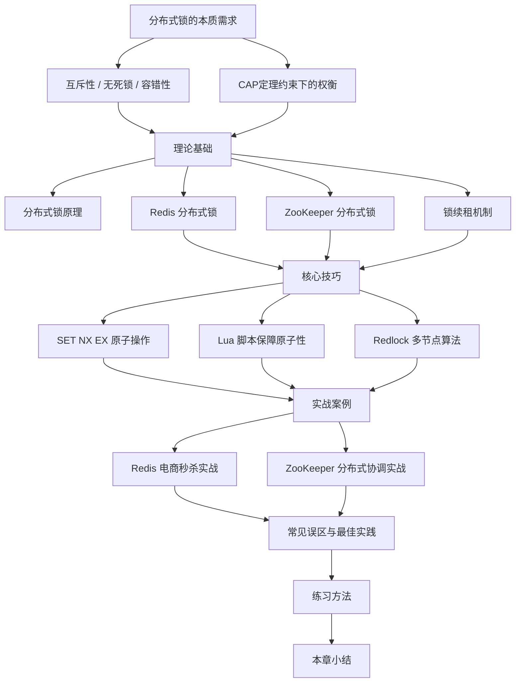

# 第五十四章 分布式锁——章节概览

## 本章定位：为什么需要一个完整的章节讲分布式锁

在单机应用时代，一把 `synchronized` 或 `ReentrantLock` 就能解决所有并发互斥问题。然而当应用被拆分成多个服务、部署在多台机器上时，进程内的锁彻底失效——**两台机器上的两个进程可以同时修改同一份资源**，数据一致性瞬间崩塌。

分布式锁，正是为了解决"跨进程、跨机器的互斥访问"这一根本问题而诞生的核心基础设施。它不是一个可选的优化手段，而是分布式系统中保证数据正确性的**必要条件**。

本章将从分布式锁的本质需求出发，系统性地讲解：

- **为什么**需要分布式锁（问题域）
- 分布式锁的**核心原理**是什么（理论基础）
- 如何用 Redis、ZooKeeper 等工具**实现**分布式锁（核心技巧）
- 真实生产环境中的**实战案例**（实战案例）
- 开发者最容易踩的**坑和误区**（常见误区）
- 如何**练习和巩固**所学知识（练习方法）

---

## 知识全景图

下图展示了本章的知识体系和各节之间的逻辑关系：

---

## 各节内容预览与阅读指南

### 第一部分：理论基础——理解"为什么"

| 小节 | 核心问题 | 关键知识点 | 预计阅读时间 |
|------|----------|------------|-------------|
| [分布式锁原理](理论基础/01-一分布式锁原理.md) | 分布式锁到底解决什么问题？ | 互斥性、无死锁、容错性、安全性、活性；CAP定理视角下的设计权衡 | 15分钟 |
| [Redis 分布式锁](理论基础/02-二Redis分布式锁.md) | 为什么 Redis 是分布式锁的首选？ | SET NX EX 原子命令、随机UUID防误删、Lua脚本安全释放 | 20分钟 |
| [ZooKeeper 分布式锁](理论基础/03-三ZooKeeper分布式锁.md) | ZooKeeper 锁和 Redis 锁有什么本质区别？ | 临时顺序节点、Watch机制、羊群效应、强一致性保证 | 15分钟 |
| [锁续租机制](理论基础/04-四锁续租机制.md) | TTL 设短了会误释放，设长了影响可用性，怎么办？ | Watchdog模式、自适应续约、续约间隔公式（TTL/3）、Redisson实现 | 15分钟 |

> **阅读建议**：理论基础是整章的地基。如果你已经熟悉分布式系统的基本概念，可以快速浏览"分布式锁原理"，重点精读 Redis 和 ZooKeeper 两个实现方案。

### 第二部分：核心技巧——掌握"怎么做"

| 小节 | 核心问题 | 关键知识点 | 预计阅读时间 |
|------|----------|------------|-------------|
| [SET NX EX](核心技巧/01-一SETNXEX.md) | 为什么不能用 SETNX + EXPIRE 两条命令？ | 原子性需求、竞态条件分析、SET NX EX 参数详解（NX/EX/PX/XX/KEEPTTL） | 15分钟 |
| [Lua 脚本](核心技巧/02-二Lua脚本.md) | 如何在 Redis 中实现复杂的原子操作？ | EVAL/EVALSHA 命令、原子性检查与释放、批量操作优化 | 10分钟 |
| [Redlock 算法](核心技巧/03-三Redlock算法.md) | 单节点 Redis 锁在主从切换时会丢失锁，如何解决？ | 多节点（N=5）独立加锁、Quorum多数派机制、时钟漂移问题、Martin Kleppmann 的批评与争议 | 20分钟 |

> **阅读建议**：核心技巧是动手能力的关键。SET NX EX 和 Lua 脚本是每个 Redis 分布式锁开发者的必备技能。Redlock 算法在面试中经常被问到，建议深入理解其设计思想和争议。

### 第三部分：实战案例——看到"真实世界"

| 小节 | 核心场景 | 关键经验 | 预计阅读时间 |
|------|----------|----------|-------------|
| [Redis 电商秒杀实战](实战案例/01-案例一Redis实战.md) | 电商大促期间的高并发锁竞争 | 监控分析→线程诊断→数据库慢查询→连接池调优→索引优化 | 15分钟 |
| [ZooKeeper 分布式协调实战](实战案例/02-案例二ZooKeeper实战.md) | 大促场景下的性能退化排查 | 系统监控→应用层诊断→数据库分析→根因定位与修复 | 15分钟 |

> **阅读建议**：实战案例展示了从问题发现到根因定位再到解决方案的完整排查链路。建议边读边思考："如果是我，会怎么排查？"

### 第四部分：避坑与巩固——走得更远

| 小节 | 核心价值 | 内容亮点 | 预计阅读时间 |
|------|----------|----------|-------------|
| [常见误区](04-常见误区.md) | 避免生产事故的必读清单 | 不安全的锁释放、Redis 主从切换丢锁、ZooKeeper 脑裂、TTL选择陷阱、锁竞争优化 | 20分钟 |
| [练习方法](05-练习方法.md) | 将知识转化为肌肉记忆 | 概念理解练习（30min）→ 动手实操练习（60min）→ 故障排查练习（45min） | 按需 |
| [本章小结](06-本章小结.md) | 回顾全章、提炼精华 | 核心知识点回顾、关键公式与模型、最佳实践清单、复习题 | 10分钟 |

---

## 读者分层阅读路线

不同基础的读者可以按以下路线高效阅读：

### 初学者路线（首次接触分布式锁）

理论基础 → 核心技巧(SET NX EX) → 实战案例 → 常见误区 → 本章小结

预计总时间：约 2.5 小时。建议先搭建本地 Redis 环境，边读边动手验证。

### 中级开发者路线（有 Redis 使用经验，想深入锁机制）

分布式锁原理(快速浏览) → 锁续租机制 → 核心技巧(Lua脚本 + Redlock) → 常见误区 → 练习方法

预计总时间：约 2 小时。重点关注锁续租和 Redlock，这两个是面试高频考点。

### 高级架构师路线（需要选型决策和架构设计能力）

理论基础(全部) → Redlock算法(含争议分析) → 常见误区 → 实战案例(对比两种实现) → 本章小结

预计总时间：约 1.5 小时。重点理解不同方案的适用场景和权衡取舍。

---

## 分布式锁的三大技术方案对比

在深入各节之前，先对三大主流方案有一个全局认知：

| 维度 | Redis 分布式锁 | ZooKeeper 分布式锁 | etcd 分布式锁 |
|------|---------------|-------------------|--------------|
| **性能** | 极高（亚毫秒级） | 中等（毫秒级） | 中等（毫秒级） |
| **一致性模型** | 最终一致（单节点强一致） | 强一致（ZAB协议） | 强一致（Raft协议） |
| **可用性** | 高（单点故障可快速恢复） | 中等（依赖Leader选举） | 中等（依赖Leader选举） |
| **实现复杂度** | 低（单条命令即可） | 中等（需理解临时节点和Watcher） | 中等（需理解Lease机制） |
| **适用场景** | 高并发、可容忍极小窗口的锁失效 | 强一致性要求、分布式协调 | 云原生环境、Kubernetes生态 |
| **生产成熟度** | 非常成熟（Redisson等） | 非常成熟（Curator等） | 较新但在快速增长 |
| **典型代表** | Redis + Redisson | ZooKeeper + Curator | etcd + go-etcdctl |

> **选型建议**：如果你的系统已经在用 Redis，优先选择 Redis 分布式锁；如果需要强一致性和复杂的分布式协调（如选主、配置管理），选择 ZooKeeper；如果在 Kubernetes 生态中，etcd 是自然的选择。

---

## 分布式锁的五大核心特性

无论选择哪种技术方案，一个合格的分布式锁都必须满足以下五个特性：

| 特性 | 含义 | 反面案例 |
|------|------|----------|
| **互斥性（Mutual Exclusion）** | 同一时刻只有一个客户端能持有锁 | 两个进程同时操作共享资源导致数据损坏 |
| **无死锁（Deadlock-Free）** | 即使持锁客户端崩溃，锁最终也能被释放 | 客户端宕机后锁永远不释放，其他客户端永远等待 |
| **容错性（Fault Tolerance）** | 部分节点故障不影响锁的整体可用性 | Redis 单点故障导致整个锁服务不可用 |
| **安全性（Safety）** | 只有锁的持有者才能释放锁 | 客户端 A 误删了客户端 B 持有的锁 |
| **活性（Liveness）** | 锁的获取和释放在有限时间内完成 | 锁竞争激烈时，某些客户端永远拿不到锁 |

---

## 前置知识要求

在学习本章之前，建议具备以下基础知识：

- **Redis 基础**：了解 Redis 的基本数据类型、命令和主从复制机制
- **Java/Python 并发编程**：理解线程、锁、竞态条件等概念
- **网络编程基础**：了解 TCP 连接、超时、心跳等概念
- **分布式系统基础**：了解 CAP 定理、一致性模型等基本概念（不了解也没关系，本章会从头讲解）

如果以上某些知识你还不太熟悉，可以在阅读对应小节时暂停，先查阅相关资料补充基础。

---

## 本章学习目标

完成本章学习后，你应该能够：

1. **说清楚**：分布式锁与单机锁的本质区别，以及分布式锁必须满足的五大特性
2. **选得对**：根据业务场景选择 Redis、ZooKeeper 或 etcd 作为分布式锁方案
3. **写得出来**：用 Redis 的 SET NX EX 命令和 Lua 脚本实现一个生产级分布式锁
4. **讲得明白**：向面试官解释 Redlock 算法的原理、优缺点和争议
5. **排查得了**：在生产环境中诊断和解决分布式锁相关的性能问题和数据一致性问题
6. **避得了坑**：识别并规避常见的分布式锁误区，如不安全的锁释放、TTL 选择不当等

---

## 重要提示

> **理论与实践并重**：分布式锁是一个高度依赖实践的知识领域。光看不练，到了生产环境一定会出问题。强烈建议在阅读理论部分时，同步搭建实验环境动手验证。
>
> **没有银弹**：不存在完美的分布式锁方案。Redis 快但一致性弱，ZooKeeper 一致性强但性能低，etcd 是折中但生态较新。理解权衡，才是真正的掌握。
>
> **面试高频考点**：Redlock 算法原理、Redis 主从切换丢锁问题、Lua 脚本原子性、Watchdog 续租机制——这四个知识点在技术面试中出现频率极高，务必深入理解。
