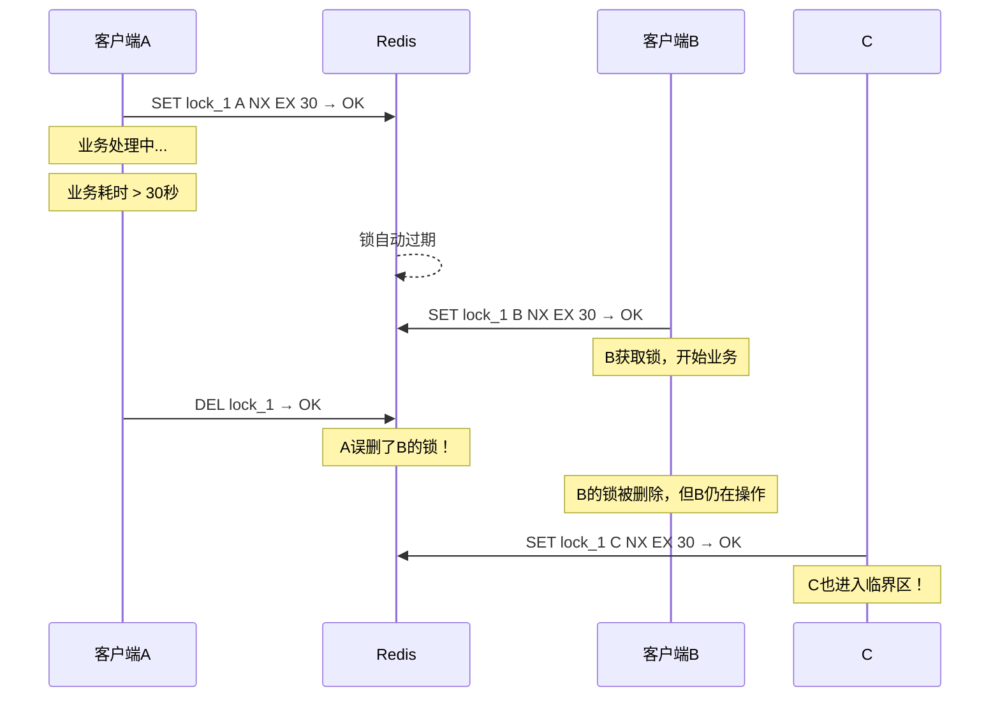
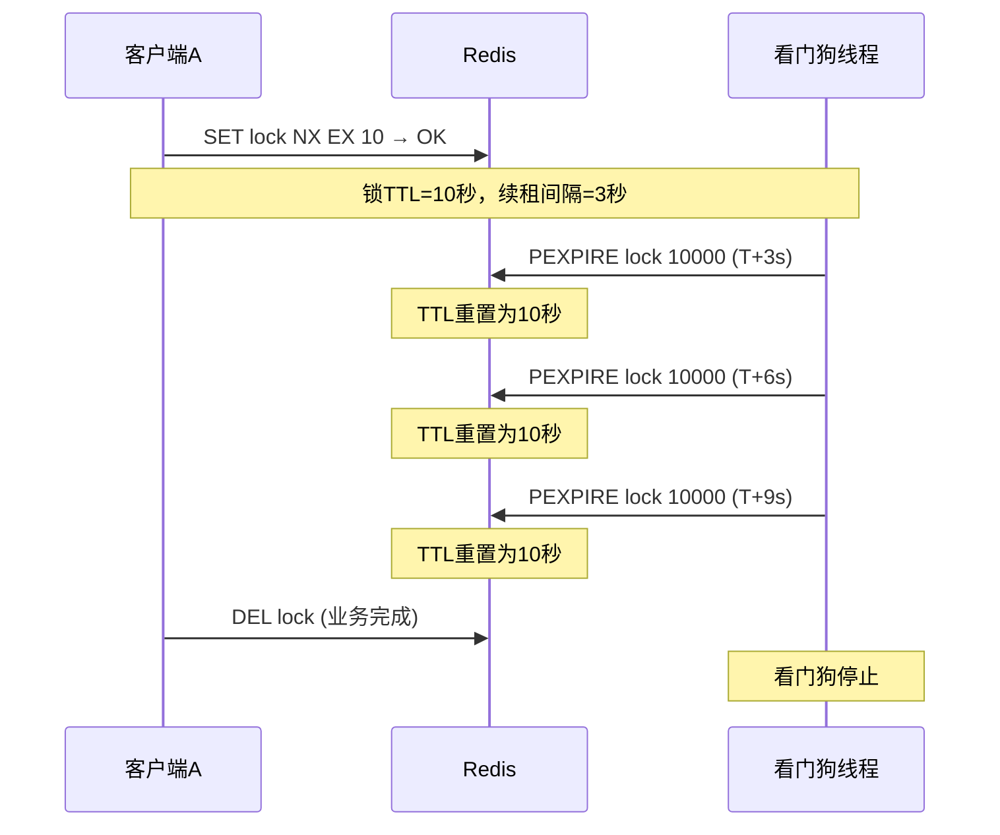
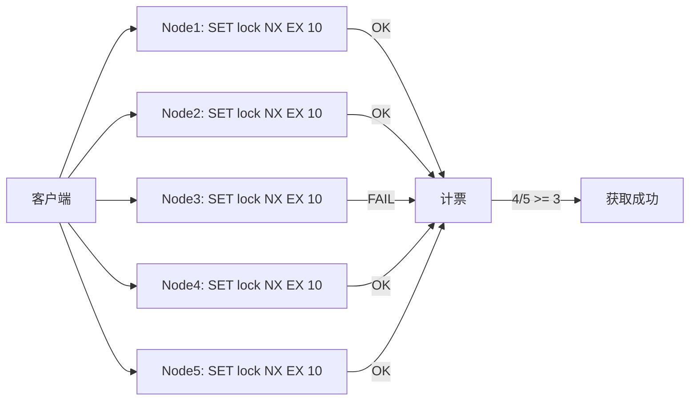
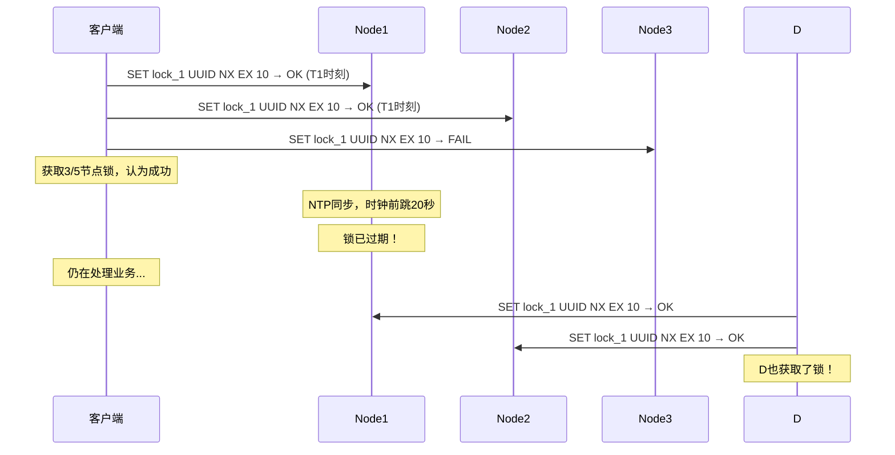
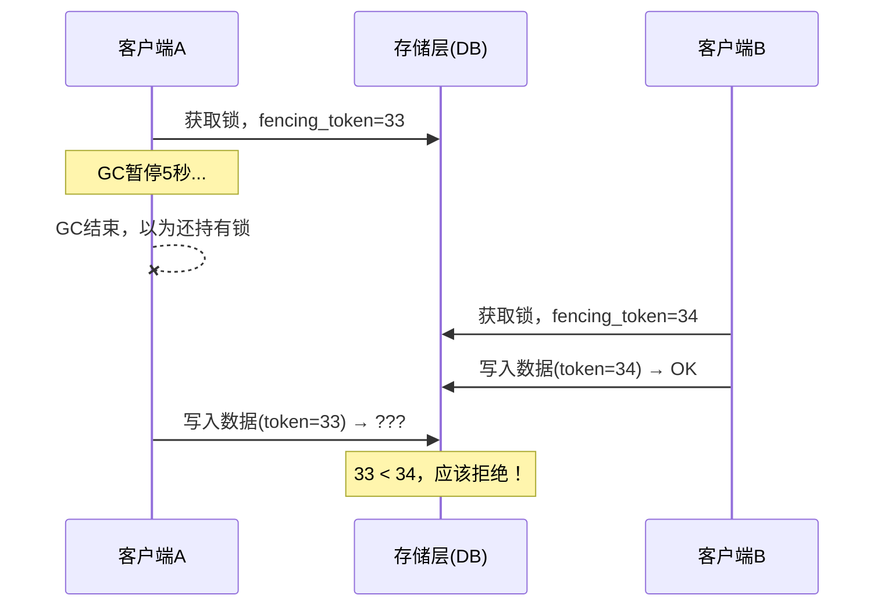
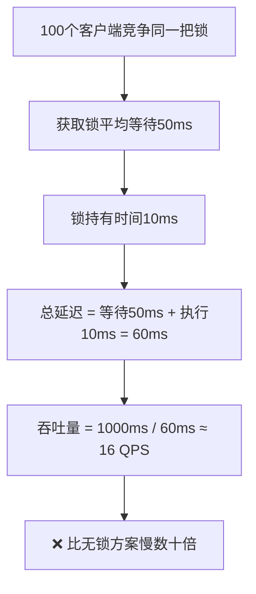

分布式锁是后端工程师最容易"自以为懂"的技术之一——一个 SET NX EX 加上过期时间，看起来三行代码就搞定了。然而，根据对数十个生产系统的分布式锁事故复盘，**超过 80% 的线上数据不一致问题，根源都指向分布式锁的误用**。这些事故的共同特点是：开发者对分布式环境的复杂性缺乏敬畏，用单机思维去处理跨进程、跨网络的协调问题。

本节系统梳理分布式锁从设计、实现到运维全生命周期中的高频误区。每个误区都按照"问题描述 → 典型错误 → 根因分析 → 正确方案 → 真实故障复盘"的结构展开，帮助你建立对分布式锁的正确心智模型。

---

## 误区一：锁释放不安全——"我的锁只能我删"

### 问题描述

许多开发者认为，只要自己获取了锁，释放时直接 DEL 就完了。这看似合理，实则暗藏致命的竞态条件——因为**获取锁和释放锁之间存在时间差**，而在这个时间差里，锁可能已经过期并被其他客户端获取。

### 错误实现

```python
# ❌ 错误：直接删除锁，无校验
def release_lock(lock_key):
    redis_client.delete(lock_key)
```

这个实现会导致以下灾难性场景：



**故障时间线**：

| 时间点 | 事件 | 后果 |
|--------|------|------|
| T+0s | 客户端A获取锁 | 正常 |
| T+30s | 锁过期，B获取锁 | 正常 |
| T+31s | A执行DEL释放锁 | B的锁被误删 |
| T+32s | C获取锁 | A、B、C三者同时进入临界区 |

### 根因分析

DEL 操作没有校验"谁是锁的当前持有者"，导致任何客户端都能删除任何锁。即使加上了过期时间，只要业务耗时超过锁的 TTL，就会出现"过期 → 被他人获取 → 被原持有者误删"的链式故障。

这个问题的本质是**Check-Then-Act 反模式**：GET 和 DEL 是两个独立操作，在它们之间锁的状态可能已经改变。必须将"比较值"和"删除"组合为一个原子操作。

### 正确方案：Lua脚本保证原子校验释放

```lua
-- release_lock.lua
-- KEYS[1]: 锁的key
-- ARGV[1]: 当前客户端的唯一标识（如 UUID）

if redis.call("GET", KEYS[1]) == ARGV[1] then
    return redis.call("DEL", KEYS[1])
else
    return 0
end
```

```python
import uuid
import redis
from redis.lock import Lock

class DistributedLock:
    def __init__(self, redis_client, lock_key, ttl=30):
        self.client = redis_client
        self.lock_key = lock_key
        self.ttl = ttl
        self.lock_value = str(uuid.uuid4())
        self.lock = Lock(
            redis_client,
            lock_key,
            timeout=self.ttl,
            thread_local=False
        )

    def acquire(self, blocking=True, timeout=None):
        """获取锁，失败返回True/False"""
        acquired = self.lock.acquire(
            blocking=blocking,
            timeout=timeout,
            token=self.lock_value
        )
        return acquired

    def release(self):
        """安全释放：校验持有者身份"""
        # 使用Lua脚本保证GET+DEL原子性
        release_script = self.client.register_script("""
            if redis.call("GET", KEYS[1]) == ARGV[1] then
                return redis.call("DEL", KEYS[1])
            else
                return 0
            end
        """)
        result = release_script(
            keys=[self.lock_key],
            args=[self.lock_value]
        )
        return result == 1
```

### 真实故障复盘

**案例**：某电商平台库存扣减服务，使用直接 DEL 释放锁。在一次数据库慢查询（P99 飙升至 85 秒）期间，锁 TTL 30 秒到期，3 个请求同时进入临界区，导致 1 件商品被扣减 3 次，实际库存变为负数。**直接经济损失：超卖订单退款 + 补偿优惠券，共计 2.3 万元。**

**核心原则**：释放锁必须是两步操作的原子组合——"比较值 + 删除"，不能分两步执行。

---

## 误区二：锁的过期时间设置不当——"30秒足够了"

### 问题描述

锁的 TTL（Time To Live）是分布式锁最关键的安全参数。设太短，业务没完成锁就过期；设太长，持有者崩溃后其他客户端等待时间过久。许多团队拍脑袋定一个 30 秒或 60 秒的过期时间，然后在生产环境遭遇锁提前过期导致的重复扣减。

### 三种典型错误

**错误A：固定TTL，不考虑业务特征**

```python
# ❌ 所有业务统一30秒过期
LOCK_TTL = 30

def deduct_stock(sku_id, quantity):
    with redis_lock("stock_lock:" + sku_id, LOCK_TTL):
        # 数据库查询 + 校验 + 扣减 + 记日志
        stock = query_stock(sku_id)        # 可能慢查询
        if stock >= quantity:
            deduct(sku_id, quantity)        # 涉及事务
            log_deduction(sku_id, quantity) # 异步日志可能阻塞
```

当数据库出现慢查询时（P99 从 2ms 飙升到 80ms），整个事务可能超过 30 秒，锁提前过期。

**错误B：过长的TTL导致故障恢复缓慢**

```python
# ❌ 为了"安全"设置超长过期时间
LOCK_TTL = 600  # 10分钟

def process_order(order_id):
    with redis_lock("order_lock:" + order_id, LOCK_TTL):
        # 如果进程在这个锁持有期间崩溃
        # 其他实例需要等待最多10分钟才能重试
        complex_processing(order_id)
```

**错误C：依赖锁的过期时间做业务超时控制**

```python
# ❌ 混淆了"锁过期"和"业务超时"两个不同概念
# 业务超时应该用Context Timeout，不是锁的TTL
with redis_lock("key", ttl=5):  # 5秒太短
    slow_operation()  # 操作可能需要20秒
```

### 正确方案：分层超时设计

锁的 TTL 和业务的超时是两个完全不同的关注点，必须分开管理：

1. **锁 TTL**：保证持有者崩溃后锁能自动释放（死锁防护）
2. **看门狗续租**：业务正常运行时，持续延长锁的过期时间
3. **业务超时**：用 Context Timeout / Deadline 控制业务本身的执行时间
4. **获取超时**：控制客户端等待获取锁的最大时间

```python
import signal
from contextlib import contextmanager
from threading import Thread, Event

class DistributedLockWithWatchdog:
    """带看门狗的分布式锁"""

    def __init__(self, redis_client, lock_key,
                 ttl=10,          # 锁的基础TTL（较短）
                 watchdog_interval=3,  # 续租间隔
                 max_retries=3):  # 续租最大次数
        self.client = redis_client
        self.lock_key = lock_key
        self.ttl = ttl
        self.watchdog_interval = watchdog_interval
        self.max_retries = max_retries
        self.lock_value = str(uuid.uuid4())
        self._watchdog_stop = Event()
        self._watchdog_thread = None
        self._retries = 0

    def acquire(self, blocking=True, timeout=None):
        """获取锁并启动看门狗续租"""
        acquired = self._try_acquire(blocking, timeout)
        if acquired:
            self._start_watchdog()
        return acquired

    def _start_watchdog(self):
        """后台线程定期续租"""
        def _renew():
            while not self._watchdog_stop.is_set():
                self._watchdog_stop.wait(self.watchdog_interval)
                if self._watchdog_stop.is_set():
                    break
                renewed = self._renew_lock()
                if renewed:
                    self._retries = 0
                else:
                    self._retries += 1
                    if self._retries >= self.max_retries:
                        # 续租失败，锁可能已丢失，触发告警
                        self._on_lock_lost()
                        break

        self._watchdog_thread = Thread(target=_renew, daemon=True)
        self._watchdog_thread.start()

    def _renew_lock(self):
        """续租：仅当自己仍是持有者时续期"""
        renew_script = self.client.register_script("""
            if redis.call("GET", KEYS[1]) == ARGV[1] then
                return redis.call("PEXPIRE", KEYS[1], ARGV[2])
            else
                return 0
            end
        """)
        result = renew_script(
            keys=[self.lock_key],
            args=[self.lock_value, self.ttl * 1000]
        )
        return result == 1

    def _on_lock_lost(self):
        """锁丢失回调：触发业务补偿"""
        # 记录日志、发送告警、触发重试等
        print(f"[WARN] Lock {self.lock_key} may be lost!")

    def release(self):
        """释放锁并停止看门狗"""
        self._watchdog_stop.set()
        if self._watchdog_thread:
            self._watchdog_thread.join(timeout=5)
        # 执行安全释放
        release_script = self.client.register_script("""
            if redis.call("GET", KEYS[1]) == ARGV[1] then
                return redis.call("DEL", KEYS[1])
            else
                return 0
            end
        """)
        return release_script(
            keys=[self.lock_key],
            args=[self.lock_value]
        ) == 1
```

### 看门狗续租原理



**关键设计要点**：续租间隔必须远小于锁 TTL（建议 ≤ TTL/3），否则在网络抖动时可能出现续租窗口不足的情况。

**过期时间选择指南**：

| 场景 | 推荐基础TTL | 看门狗续租间隔 | 说明 |
|------|------------|---------------|------|
| 简单计数器 | 5秒 | 不需要 | 操作极快，过期即失败 |
| 数据库事务 | 10秒 | 3秒 | 事务通常毫秒级完成 |
| 批量导入 | 30秒 | 10秒 | 大量数据写入 |
| 复杂计算 | 60秒 | 15秒 | CPU密集型操作 |
| 外部API调用 | 可变 | 5秒 | 对方响应时间不可控 |

---

## 误区三：误以为Redlock能解决一切——"多节点就安全了"

### 问题描述

Redlock（Redis分布式锁的多节点算法）被 Martin Kleppmann 在论文中详细批驳后，许多团队走向了两个极端：要么完全弃用 Redlock 回到单节点，要么盲目上 Redlock 而不理解它的前提条件和局限性。这场辩论的核心不在于"Redlock 是否正确"，而在于**你对一致性的需求到底是什么级别**。

### Redlock算法回顾

Redlock 的设计思路是在多个独立的 Redis 节点上（非主从复制）获取锁，通过多数派投票达成共识：



### Martin Kleppmann 的三把利剑

Martin Kleppmann 在 "How to do distributed locking" 中提出了三个根本性质疑：

**质疑1：时钟漂移**

Redlock 依赖各节点的系统时钟来计算锁的过期时间。如果某个节点的时钟发生跳变（NTP 同步、闰秒等），锁的过期时间可能远短于预期：



**质疑2：GC暂停与网络延迟**

客户端在获取锁后如果发生 GC 暂停（Java）或被 OS 调度出去，可能导致：

客户端A获取锁 → A的JVM发生Full GC（暂停15秒）
→ 锁过期 → 客户端B获取锁 → A的GC结束，A以为自己还持有锁

**质疑3：Redis异步复制**

Redis 的主从复制是异步的。如果客户端在主节点获取锁后、复制到从节点前主节点宕机，从节点提升为主节点后锁丢失：

时间线：
1. 客户端A在M1上 SET lock → OK
2. M1在复制到S1之前宕机
3. S1提升为新主节点
4. 客户端B在新主节点上 SET lock → OK
5. A和B同时持有锁！

### Antirez 的回应与辩论本质

Redlock 的作者 Antirez（Salvatore Sanfilippo）在 "Is Redlock safe?" 中对 Kleppmann 的批评逐条回应。这场辩论的本质不是算法对错，而是**你在用锁做什么**：

| 维度 | Kleppmann的立场 | Antirez的立场 | 真相 |
|------|----------------|--------------|------|
| 锁的用途 | 作为效率工具（避免重复工作）足够；作为正确性保证不够 | Redlock可以作为正确的互斥原语 | 两者都对，取决于场景 |
| Fencing Token | 必须有，否则锁不可靠 | Redlock本身可以提供token | Token确实需要，但Redis层面实现有难度 |
| 时钟问题 | 时钟跳变是现实威胁 | NTP有slew模式，不会大幅跳变 | 小型跳变影响有限，大幅跳变确实危险 |
| 异步复制 | 主从切换丢锁 | 可以配置为同步复制 | 同步复制严重影响性能 |

**正确理解**：Redlock 是一个在"效率"和"正确性"之间的折中方案。它比单节点 Redis 锁更强，但比 ZooKeeper/etcd 弱。选择哪种方案，取决于你的业务对一致性的要求。

### 正确方案：根据业务需求选择方案

```python
def choose_lock_strategy(requirements):
    """
    根据业务需求选择锁策略

    requirements: dict
        consistency: "strong" | "eventual"
        latency_p99: float (ms)
        failure_cost: "low" | "medium" | "high" | "critical"
        redis_nodes: int
    """

    if requirements["failure_cost"] == "critical":
        # 关键场景（资金、库存）：不依赖分布式锁做最终保证
        # 使用数据库乐观锁 + 分布式锁双重保障
        return "fencing_token_based"

    if requirements["consistency"] == "strong" and requirements["failure_cost"] in ("high", "critical"):
        # 强一致 + 高失败代价：使用ZooKeeper或etcd
        return "zookeeper"

    if requirements["redis_nodes"] <= 1 or requirements["failure_cost"] == "low":
        # 单Redis节点 + 低失败代价：SET NX EX + 看门狗
        return "single_redis_with_watchdog"

    if requirements["latency_p99"] < 10:
        # 低延迟要求：Redis而非ZooKeeper
        return "single_redis_with_watchdog"

    # 默认：单Redis + 重试 + 看门狗
    return "single_redis_with_watchdog"
```

### 三种方案深度对比

| 特性 | 单Redis锁 | Redlock | ZooKeeper/etcd |
|------|----------|---------|---------------|
| 一致性保证 | 最终一致 | 强一致（有争议） | 强一致（CP系统） |
| 获取延迟 | ~1ms | ~5-10ms | ~5-15ms |
| 可用性 | 高 | 中等 | 中等 |
| 故障恢复 | 秒级 | 秒级 | 秒级 |
| 适用场景 | 效率型锁 | 中等一致性需求 | 强一致性需求 |
| 运维复杂度 | 低 | 高 | 中等 |
| 典型代表 | Redis SET NX | Redisson Redlock | Apache Curator |

**决策矩阵**：

| 场景 | 推荐方案 | 原因 |
|------|---------|------|
| 秒杀库存扣减 | 单Redis + Lua + 乐观锁 | 低延迟，用乐观锁兜底 |
| 分布式定时任务去重 | ZooKeeper临时顺序节点 | 强一致，公平排队 |
| 订单状态机防并发 | 数据库行锁 + Redis分布式锁 | 双重保障 |
| 限流/熔断 | 单Redis计数器 | 最终一致即可 |
| 金融交易 | 数据库事务锁 + 对账 | 不应依赖分布式锁保证资金安全 |
| 分布式配置更新 | etcd Watch机制 | 强一致 + 变更通知 |

---

## 误区四：锁粒度过粗——"一把大锁解决所有问题"

### 问题描述

为了省事，许多团队用一把全局大锁保护所有操作，导致系统从单机时的高并发退化为串行执行。分布式锁的粒度应该与临界区保护的资源粒度一一对应。

### 典型反面案例

```python
# ❌ 粒度过粗：整个商品系统用一把锁
def process_request(request):
    with distributed_lock("global_lock"):  # 全局锁！
        if request.type == "query_stock":
            return query_stock(request.sku_id)
        elif request.type == "deduct_stock":
            return deduct_stock(request.sku_id, request.qty)
        elif request.type == "update_price":
            return update_price(request.sku_id, request.new_price)
```

**性能影响量化**：

假设系统有 100 个 SKU，QPS 为 10000（每 SKU 100 QPS）：

| 方案 | 锁粒度 | 最大并发 | 吞吐量 | 性能损耗 |
|------|--------|---------|--------|---------|
| 全局锁 | 1把 | 1 | ~100 QPS | 99% |
| SKU级锁 | 100把 | 100 | ~10000 QPS | 0% |
| 库位级锁 | 1000把 | 1000 | ~100000 QPS | 0% |

### 粒度选择的常见维度

| 维度 | 示例 | 适用场景 |
|------|------|---------|
| 用户ID | `lock:user:{uid}` | 用户级操作（余额、积分） |
| SKU ID | `lock:sku:{sku_id}` | 商品级操作（库存、价格） |
| 订单ID | `lock:order:{order_id}` | 订单级操作（状态流转） |
| 分片键 | `lock:shard:{shard_id}` | 分库分表场景 |
| 地理区域 | `lock:region:{region_id}` | 区域级资源（仓库存量） |

### 正确方案：分级锁策略

```python
class FineGrainedLock:
    """细粒度分布式锁管理"""

    def __init__(self, redis_client):
        self.client = redis_client

    def deduct_stock(self, sku_id, warehouse_id, quantity):
        """
        库存扣减：两级锁策略

        - 外层：SKU级锁（防同SKU并发扣减）
        - 内层：数据库行锁（防同库位并发扣减）
        """
        sku_lock = f"lock:stock:sku:{sku_id}"

        with self._acquire(sku_lock, ttl=10, watchdog=True):
            # SKU级锁保证同SKU串行
            # 库位级由数据库行锁保证
            warehouse = self._select_warehouse(sku_id, quantity)
            if warehouse:
                return self._deduct_from_warehouse(
                    sku_id, warehouse.id, quantity
                )
            return False

    def _acquire(self, lock_key, ttl=10, watchdog=True):
        """获取分布式锁"""
        # 实现同误区二中的看门狗方案
        ...
```

### 粒度选择的平衡点

锁粒度不是越细越好。过细的锁粒度会带来：

1. **锁数量爆炸**：Redis 中大量 key 增加内存开销和淘汰风险
2. **死锁风险增加**：多个细粒度锁同时持有时，顺序不一致容易死锁
3. **管理复杂度上升**：锁的命名、分组、监控都需要额外设计

**粒度选择三问**：
锁粒度设计三问：
1. 两把不同的锁保护的资源是否有关联？→ 无关则分开加锁
2. 持有锁的时间有多长？→ 越短越好，超过100ms考虑拆分
3. 竞争程度如何？→ 热点资源需要更细的锁粒度

---

## 误区五：忽视Fencing Token——"我的锁够安全了"

### 问题描述

即使锁的获取和释放都是正确的，仍然存在一个更深层的安全隐患：**锁的持有者在处理过程中，如果操作被延迟（GC暂停、网络延迟），它发出的写操作可能在锁释放后才到达存储层**，导致写操作覆盖了锁后续持有者的正确数据。

这是 Martin Kleppmann 在 "How to do distributed locking" 中提出的核心论点，也是最容易被忽视的分布式锁安全隐患。

### 问题场景



### 为什么 Fencing Token 容易被忽视

大多数开发者在实现分布式锁时只关注了"互斥"这一层，认为只要保证同一时刻只有一个客户端持有锁就够了。但分布式系统的现实是：

1. **锁的获取和写入不是原子的**——获取锁后还需要执行业务逻辑、网络请求、磁盘写入等操作
2. **网络是不可靠的**——写请求可能延迟到达
3. **存储层不感知锁的状态**——它只看到写请求，不知道这个请求是否"过期"

### 正确方案：Fencing Token

```python
# 存储层实现fencing token校验
class FencingTokenStore:
    """
    支持Fencing Token的存储层

    关键：锁服务在每次分配锁时递增token
    存储层校验token单调递增，拒绝旧token的写操作
    """

    def __init__(self):
        self.last_token = {}  # resource_id -> last_token

    def write(self, resource_id, fencing_token, data):
        """
        带Fencing Token的写入

        如果token <= 该资源最后接受的token，则拒绝写入
        """
        current_last = self.last_token.get(resource_id, 0)

        if fencing_token <= current_last:
            # 安全拒绝：这是过期客户端的延迟写入
            raise StaleTokenError(
                f"Token {fencing_token} <= last accepted {current_last}. "
                f"Possible stale write from a delayed client."
            )

        # 更新token并执行写入
        self.last_token[resource_id] = fencing_token
        self._do_write(resource_id, data)
        return True

    def _do_write(self, resource_id, data):
        """实际写入操作"""
        ...


# 锁服务递增token
class LockServiceWithFencingToken:
    def __init__(self, redis_client):
        self.client = redis_client

    def acquire_lock(self, lock_key):
        """获取锁并返回单调递增的fencing token"""
        token_key = f"fencing_token:{lock_key}"
        # INCR保证单调递增
        token = self.client.incr(token_key)
        # 同时获取锁
        acquired = self.client.set(
            lock_key, str(token), nx=True, ex=30
        )
        if acquired:
            return token
        return None
```

**注意**：上面的实现有一个竞态条件——INCR 和 SET 不是原子的。生产环境应该用 Lua 脚本保证原子性：

```lua
-- acquire_lock_with_token.lua
-- KEYS[1]: 锁的key
-- KEYS[2]: token计数器key
-- ARGV[1]: 客户端标识
-- ARGV[2]: 过期时间（毫秒）

local token = redis.call("INCR", KEYS[2])
local acquired = redis.call("SET", KEYS[1], ARGV[1], "NX", "PX", ARGV[2])
if acquired then
    return token
else
    -- 获取失败，回退token
    redis.call("DECR", KEYS[2])
    return nil
end
```

### Fencing Token 的三层保护模型

| 层次 | 保护机制 | Fencing Token作用 |
|------|---------|-------------------|
| 锁获取层 | SET NX | 互斥访问 |
| 锁释放层 | Lua脚本校验 | 只有持有者能释放 |
| 存储写入层 | Fencing Token校验 | 拒绝延迟写入 |

三层保护缺一不可。许多团队只做了前两层就认为"够安全了"，忽略了存储层的最终防线。

### 不同存储引擎的 Fencing Token 实现

| 存储引擎 | 实现方式 | 说明 |
|---------|---------|------|
| MySQL | WHERE version >= token | 利用乐观锁的版本号机制 |
| PostgreSQL | SELECT ... FOR UPDATE + 检查token | 事务内校验 |
| Redis | Lua脚本比较token | 存储层校验 |
| MongoDB | findAndModify + 条件更新 | 原子操作 + 条件 |
| S3/OSS | If-None-Match / 条件写入 | 利用对象存储的条件API |

---

## 误区六：忽略监控和可观测性——"能跑就行"

### 问题描述

分布式锁是系统中最脆弱的协调点之一，但许多团队在部署后完全不监控锁的状态，直到出了事故才追悔莫及。没有监控的分布式锁就像没有仪表盘的飞机——你不知道它什么时候会出问题。

### 为什么分布式锁特别需要监控

与普通的数据库操作不同，分布式锁的故障往往是**静默的**：

1. **锁丢失不报错**——业务继续执行，数据已经不一致
2. **锁竞争不可见**——性能下降但没有明确的错误日志
3. **锁过期太早**——业务偶尔重复执行，难以复现

### 必须监控的六大指标

```python
# Prometheus监控埋点示例
from prometheus_client import Counter, Histogram, Gauge

# 1. 锁获取耗时
lock_acquire_duration = Histogram(
    'distributed_lock_acquire_duration_seconds',
    'Time to acquire distributed lock',
    ['lock_key_prefix'],
    buckets=[0.001, 0.005, 0.01, 0.025, 0.05, 0.1, 0.25, 0.5, 1.0]
)

# 2. 锁获取结果
lock_acquire_total = Counter(
    'distributed_lock_acquire_total',
    'Lock acquire attempts',
    ['lock_key_prefix', 'result']  # result: success, timeout, error
)

# 3. 锁持有时间
lock_hold_duration = Histogram(
    'distributed_lock_hold_duration_seconds',
    'Duration lock was held',
    ['lock_key_prefix'],
    buckets=[0.01, 0.05, 0.1, 0.5, 1.0, 5.0, 10.0, 30.0]
)

# 4. 锁续租次数（看门狗指标）
lock_renewal_total = Counter(
    'distributed_lock_renewal_total',
    'Number of lock renewals',
    ['lock_key_prefix', 'result']  # result: success, failed
)

# 5. 锁竞争排队数
lock_waiters = Gauge(
    'distributed_lock_waiters',
    'Number of clients waiting for lock',
    ['lock_key_prefix']
)

# 6. 锁丢失事件（看门狗续租失败）
lock_lost_total = Counter(
    'distributed_lock_lost_total',
    'Number of times lock was lost unexpectedly',
    ['lock_key_prefix']
)
```

### Grafana告警规则

```yaml
# prometheus-alerts.yml
groups:
  - name: distributed_lock_alerts
    rules:
      # 锁获取超时率过高
      - alert: HighLockAcquireTimeoutRate
        expr: |
          rate(distributed_lock_acquire_total{result="timeout"}[5m])
          /
          rate(distributed_lock_acquire_total[5m])
          > 0.1
        for: 2m
        labels:
          severity: warning
        annotations:
          summary: "分布式锁获取超时率超过10%"
          description: "锁前缀: {{ $labels.lock_key_prefix }}"

      # 锁丢失事件
      - alert: DistributedLockLost
        expr: rate(distributed_lock_lost_total[5m]) > 0
        for: 1m
        labels:
          severity: critical
        annotations:
          summary: "检测到分布式锁意外丢失"
          description: "这可能导致并发数据冲突，请立即检查"

      # 锁持有时间异常
      - alert: LongLockHoldTime
        expr: |
          histogram_quantile(0.99,
            rate(distributed_lock_hold_duration_seconds_bucket[5m])
          ) > 30
        for: 5m
        labels:
          severity: warning
        annotations:
          summary: "锁持有时间P99超过30秒"
          description: "可能存在业务超时或锁未及时释放"
```

### 关键Grafana面板设计

| 面板 | 指标 | 告警阈值 | 说明 |
|------|------|---------|------|
| 锁获取成功率 | `lock_acquire_total{result="success"}` / 总量 | < 99% | 获取成功率低于99%需排查 |
| 锁获取P99耗时 | `lock_acquire_duration_seconds` P99 | > 100ms | 锁竞争过于激烈 |
| 锁持有时间P99 | `lock_hold_duration_seconds` P99 | > 业务阈值 | 业务可能超时 |
| 锁续租失败率 | `lock_renewal_total{result="failed"}` / 总量 | > 0 | 任何续租失败都需关注 |
| 锁丢失事件 | `lock_lost_total` 累计值 | > 0 | 立即告警 |
| 等待锁的客户端数 | `lock_waiters` | > 阈值 | 排队过多影响延迟 |

### 运维建议

1. **锁的 key 命名必须包含业务前缀**：如 `lock:stock:sku:12345`，方便按业务维度聚合监控
2. **在锁获取失败时记录详细上下文**：谁在等锁、等了多久、锁被谁持有
3. **定期审计锁的使用模式**：哪些锁竞争最激烈、哪些锁持有时间最长
4. **将锁监控与业务指标关联**：锁超时率上升时，对应的业务成功率是否下降

---

## 误区七：锁的可重入性处理不当——"递归调用会死锁"

### 问题描述

在实际业务中，分布式锁的持有者经常需要递归调用或调用已持锁的方法。如果锁不支持可重入，就会发生自死锁。这是一个在代码审查中极难发现的问题，因为只有在特定调用路径下才会触发。

### 典型场景

```python
# ❌ 不支持可重入的锁导致自死锁
def deduct_stock(sku_id, qty):
    with distributed_lock(f"lock:stock:{sku_id}"):
        order = create_order(sku_id, qty)
        # create_order内部也调用了deduct_stock（如拆单场景）
        # 第二次获取同一把锁时失败 → 死锁
        send_notification(order)

def create_order(sku_id, qty):
    with distributed_lock(f"lock:stock:{sku_id}"):  # 💥 自死锁！
        ...
```

### 更隐蔽的可重入场景

```python
# 场景1：装饰器链中的重复加锁
@distributed_lock("lock:order")  # 第一层加锁
def process_order(order_id):
    validate_order(order_id)      # 这个函数也加了锁

@distributed_lock("lock:order")  # 第二层加锁 → 死锁
def validate_order(order_id):
    ...

# 场景2：AOP/中间件中的隐式加锁
@rate_limiter(key="user:{uid}")  # 限流中间件
@distributed_lock("lock:user")   # 业务锁
def update_profile(user_id, data):
    save_to_db(data)              # DB层也有乐观锁校验
    notify_friends(user_id)       # 通知服务也加了用户锁 → 死锁
```

### 正确方案：可重入锁

```python
class ReentrantDistributedLock:
    """
    可重入分布式锁

    同一客户端（同一线程/协程）可以多次获取同一把锁
    通过记录持有次数来实现
    """

    def __init__(self, redis_client, lock_key, ttl=10):
        self.client = redis_client
        self.lock_key = lock_key
        self.ttl = ttl
        self.lock_value = str(uuid.uuid4())
        self._hold_count = 0  # 本地持有计数

    def acquire(self, blocking=True, timeout=None):
        # 第一次获取：需要从Redis竞争
        if self._hold_count == 0:
            acquired = self._redis_acquire(blocking, timeout)
            if not acquired:
                return False
            self._hold_count = 1
        else:
            # 重入：增加本地计数
            # 同时在Redis中延长过期时间
            self._hold_count += 1
            self._renew_ttl()
        return True

    def _redis_acquire(self, blocking, timeout):
        """从Redis竞争锁"""
        acquire_script = self.client.register_script("""
            if redis.call("SET", KEYS[1], ARGV[1], "NX", "PX", ARGV[2]) then
                return 1
            end
            return 0
        """)
        result = acquire_script(
            keys=[self.lock_key],
            args=[self.lock_value, self.ttl * 1000]
        )
        return result == 1

    def _renew_ttl(self):
        """重入时延长锁的过期时间"""
        renew_script = self.client.register_script("""
            if redis.call("GET", KEYS[1]) == ARGV[1] then
                return redis.call("PEXPIRE", KEYS[1], ARGV[2])
            end
            return 0
        """)
        renew_script(
            keys=[self.lock_key],
            args=[self.lock_value, self.ttl * 1000]
        )

    def release(self):
        """释放锁：支持重入"""
        if self._hold_count <= 0:
            raise RuntimeError("Lock not held or already released")

        self._hold_count -= 1
        if self._hold_count == 0:
            # 最后一次释放：从Redis中删除
            release_script = self.client.register_script("""
                if redis.call("GET", KEYS[1]) == ARGV[1] then
                    return redis.call("DEL", KEYS[1])
                end
                return 0
            """)
            release_script(
                keys=[self.lock_key],
                args=[self.lock_value]
            )
        else:
            # 还有重入层级：仅减少计数
            self._renew_ttl()
```

### 可重入锁的风险与限制

⚠️ 可重入锁虽然方便，但也带来风险：
1. 嵌套层级过深（>5层）通常意味着设计有问题
2. 本地计数 + 远程锁的状态可能不一致（进程崩溃时）
3. 不同机器上的线程无法重入同一把锁（只有同一线程才行）
4. 异步代码（async/await）中的可重入需要特别处理
5. 建议设置最大重入深度（如5层），超过则报错并记录调用栈

---

## 误区八：锁退化为性能瓶颈——"加了锁比不加锁还慢"

### 问题描述

当锁竞争激烈时，大量客户端在获取锁时排队等待，系统吞吐量急剧下降，出现"锁比不加锁还慢"的反直觉现象。

### 性能退化分析



### 竞争程度量化

| 并发客户端数 | 锁持有时间 | 平均等待时间 | 吞吐量 | 相比无锁方案 |
|------------|-----------|------------|--------|------------|
| 1 | 10ms | 0ms | 100 QPS | 1x |
| 10 | 10ms | ~50ms | ~17 QPS | 0.17x |
| 50 | 10ms | ~250ms | ~4 QPS | 0.04x |
| 100 | 10ms | ~500ms | ~2 QPS | 0.02x |

### 正确方案：减少竞争的工程手段

```python
class HighPerformanceLockStrategy:
    """高性能分布式锁策略"""

    # 策略1：本地锁 + 分布式锁分层
    # 本地并发通过进程内锁协调，仅跨进程时使用分布式锁
    import threading

    def layered_lock(self, resource_key):
        """分层锁：本地锁 + 分布式锁"""
        local_lock = threading.Lock()

        class LayeredContext:
            def __enter__(ctx):
                ctx.local_lock.acquire()
                # 仅在本地锁竞争时才访问Redis
                ctx.distributed_lock = acquire_distributed(resource_key)
                if not ctx.distributed_lock:
                    ctx.local_lock.release()
                    raise TimeoutError("Cannot acquire distributed lock")
                return ctx

            def __exit__(ctx, *args):
                ctx.distributed_lock.release()
                ctx.local_lock.release()

        return LayeredContext()

    # 策略2：乐观锁替代
    # 在冲突概率低的场景，用CAS替代互斥锁
    def optimistic_lock_deduct(self, sku_id, qty, max_retries=3):
        """乐观锁扣减：适合低冲突场景"""
        for attempt in range(max_retries):
            # 读取当前版本号
            stock = db.query(
                "SELECT quantity, version FROM stock WHERE sku_id = %s",
                sku_id
            )

            if stock.quantity < qty:
                return False, "Insufficient stock"

            # CAS更新：只有版本号匹配才更新
            affected = db.execute(
                """UPDATE stock
                   SET quantity = quantity - %s,
                       version = version + 1
                   WHERE sku_id = %s
                     AND version = %s
                     AND quantity >= %s""",
                qty, sku_id, stock.version, qty
            )

            if affected > 0:
                return True, "Success"

        return False, f"Failed after {max_retries} retries"

    # 策略3：锁超时快速失败
    # 不无限等待，超时后降级处理
    def lock_with_fallback(self, resource_key, fallback_fn):
        """获取锁失败时执行降级逻辑"""
        lock = try_acquire(resource_key, timeout=0.05)  # 50ms超时
        if lock:
            try:
                return primary_operation()
            finally:
                lock.release()
        else:
            # 降级：异步处理或返回排队结果
            return fallback_fn()
```

### 策略选择指南

| 冲突概率 | 推荐策略 | 原因 |
|---------|---------|------|
| 极低（<1%） | 乐观锁（CAS） | 无锁竞争开销 |
| 低（1-10%） | 本地锁 + 分布式锁 | 减少Redis访问 |
| 中（10-50%） | 分布式锁 + 快速失败 | 避免长时间等待 |
| 高（>50%） | 乐观锁 + 重试 | 互斥锁已不可接受 |
| 极高（热点） | 数据库分片 + 局部锁 | 从根本上减少竞争 |

---

## 误区九：忽略网络分区场景——"Redis不会丢数据"

### 问题描述

分布式系统中，网络分区（脑裂）是不可避免的。当 Redis 主节点与客户端之间的网络出现分区时，可能出现：客户端认为自己持有锁，但实际上锁已经在主从切换后丢失。

### 脑裂场景还原

```python
# 脑裂导致的库存超卖场景
"""
时间线：
T1: 客户端A在M上获取锁，开始扣减库存
T2: M与客户端A的网络分区，但M仍在运行
T3: Redis Sentinel检测到M不可达，S提升为新M'
T4: 客户端B在新M'上获取锁，扣减库存（库存=1，B扣1，库存=0）
T5: 网络分区恢复，A的写入到达M'，A的扣减也生效（库存=-1）！
"""
```

### Redis Sentinel 与 Cluster 的脑裂差异

| 特性 | Redis Sentinel | Redis Cluster |
|------|---------------|---------------|
| 故障检测 | Sentinel投票决定 | 集群内部Gossip协议 |
| 主从切换 | Sentinel发起 | 集群自动failover |
| 脑裂风险 | 中等（Sentinel有quorum机制） | 较高（分区可能形成多个master） |
| 锁丢失窗口 | 主从切换期间 | 分区期间 + 切换期间 |
| 缓解措施 | min-slaves-to-write | cluster-require-full-coverage |

### 正确方案：存储层兜底校验

```python
def safe_deduct_stock(sku_id, quantity):
    """
    分布式锁 + 数据库乐观锁双重保护

    分布式锁：减少冲突概率
    数据库乐观锁：保证最终正确性
    """
    with distributed_lock(f"lock:stock:{sku_id}"):
        stock = db.query(
            "SELECT quantity, version FROM stock WHERE sku_id = %s",
            sku_id
        )

        if stock.quantity < quantity:
            return False, "Insufficient stock"

        # 数据库层面的乐观锁校验
        affected = db.execute(
            """UPDATE stock
               SET quantity = quantity - %s,
                   version = version + 1
               WHERE sku_id = %s
                 AND version = %s
                 AND quantity >= %s""",
            quantity, sku_id, stock.version, quantity
        )

        if affected == 0:
            # 版本号不匹配，说明有并发写入
            # 分布式锁可能已失效，需要重试
            raise ConcurrencyConflict("Stock version mismatch")

        return True, "Success"
```

### 网络分区的最佳实践

1. **不要依赖分布式锁做最终的数据一致性保证**——锁只是降低冲突概率的手段
2. **关键数据操作必须有存储层兜底**——乐观锁、唯一约束、对账机制
3. **监控 Redis 的主从延迟**——`INFO replication` 中的 `master_repl_offset` 差值
4. **在 Sentinel 配置中设置合理的 min-slaves-to-write**——防止主节点在没有从节点同步时接受写入
5. **定期进行故障注入测试**——模拟网络分区，验证系统的容错能力

---

## 误区十：锁的key设计不当——"能用就行"

### 问题描述

锁的 key 命名看似是小事，实则影响深远。不规范的 key 命名会导致：不同业务的锁意外冲突、Redis 内存管理困难、问题排查时找不到对应的锁、监控数据无法按业务维度聚合。

### 典型错误

```python
# ❌ 错误1：key太短，容易冲突
lock("my_lock")

# ❌ 错误2：key包含动态变量但没有业务前缀
lock(f"{user_id}")  # user_id=123 和 order_id=123 冲突！

# ❌ 错误3：key包含完整数据（泄露敏感信息）
lock(f"lock:user:{phone_number}:{user_name}")

# ❌ 错误4：不同环境的key没有隔离
lock(f"lock:stock:{sku_id}")  # 测试环境和生产环境key相同
```

### 正确的 key 命名规范

格式：lock:{业务域}:{资源类型}:{资源ID}:{可选子类型}

示例：
lock:stock:sku:12345              # SKU库存锁
lock:order:order:ORD-20240101-001 # 订单锁
lock:user:balance:UID-12345       # 用户余额锁
lock:config:app:my-service        # 配置更新锁

环境隔离（通过Redis实例或key前缀）：
prod:lock:stock:sku:12345         # 生产环境
staging:lock:stock:sku:12345      # 预发布环境

### 命名规范检查清单

| 检查项 | 正确做法 | 错误做法 |
|--------|---------|---------|
| 业务前缀 | 包含业务域标识 | 无前缀或前缀模糊 |
| 资源类型 | 明确标注资源类型 | 只有ID没有类型 |
| 环境隔离 | 不同环境使用不同Redis或key前缀 | 共用同一个key |
| 敏感信息 | 不包含手机号、身份证等 | key中包含敏感数据 |
| 长度控制 | 总长度 < 128 字符 | 超长key影响性能 |
| 字符集 | 仅使用字母、数字、冒号、下划线 | 包含空格、特殊字符 |

---

## 误区十一：未做优雅降级——"锁服务挂了整个系统就挂了"

### 问题描述

当 Redis 集群发生故障、ZooKeeper 不可用时，所有依赖分布式锁的服务会全部失败，可能导致雪崩效应。分布式锁服务本身也是一个单点依赖，必须有降级方案。

### 降级层级设计

正常模式：主Redis锁
    ↓ 主Redis不可用
热备模式：备用Redis锁
    ↓ 备用Redis也不可用
降级模式：本地锁（仅保证单机内互斥）
    ↓ 需要跨实例协调
拒绝模式：返回"系统繁忙"，保护核心数据

### 正确方案：多级降级策略

```python
class ResilientDistributedLock:
    """
    弹性分布式锁：支持多级降级

    降级策略：
    1. 主锁服务（Redis/ZooKeeper）→ 正常流程
    2. 备份锁服务（备用Redis实例）→ 热备切换
    3. 本地锁 + 标记 → 降级为单机模式
    4. 直接拒绝 → 拒绝请求，保护核心服务
    """

    def __init__(self):
        self.primary_lock = RedisLockService(primary_redis)
        self.fallback_lock = RedisLockService(backup_redis)
        self.local_locks = {}  # 本地锁（降级用）
        self._circuit_breaker = CircuitBreaker(
            failure_threshold=5,
            recovery_timeout=30
        )

    def acquire(self, lock_key, timeout=5):
        # 策略1：主锁服务
        if self._circuit_breaker.is_closed:
            try:
                return self.primary_lock.acquire(lock_key, timeout)
            except Exception as e:
                self._circuit_breaker.record_failure()
                logger.warning(f"Primary lock failed: {e}")

        # 策略2：备份锁服务
        try:
            return self.fallback_lock.acquire(lock_key, timeout)
        except Exception:
            logger.warning("Fallback lock also failed")

        # 策略3：本地锁降级
        # 注意：仅在单机多线程场景有效
        if lock_key not in self.local_locks:
            self.local_locks[lock_key] = threading.Lock()
        acquired = self.local_locks[lock_key].acquire(timeout=timeout)
        if acquired:
            logger.warning(f"Using local lock for {lock_key}")
            return LocalLockGuard(self.local_locks[lock_key])

        # 策略4：拒绝
        raise LockServiceUnavailable(
            "All lock services unavailable, request rejected"
        )


class CircuitBreaker:
    """简单的熔断器"""

    def __init__(self, failure_threshold=5, recovery_timeout=30):
        self.failure_threshold = failure_threshold
        self.recovery_timeout = recovery_timeout
        self.failure_count = 0
        self.last_failure_time = None
        self._state = "closed"  # closed, open, half-open

    @property
    def is_closed(self):
        if self._state == "open":
            if time.time() - self.last_failure_time > self.recovery_timeout:
                self._state = "half-open"
                return True
            return False
        return True

    def record_failure(self):
        self.failure_count += 1
        self.last_failure_time = time.time()
        if self.failure_count >= self.failure_threshold:
            self._state = "open"

    def record_success(self):
        self.failure_count = 0
        self._state = "closed"
```

### 降级时的业务影响评估

| 降级层级 | 互斥保证 | 适用场景 | 业务影响 |
|---------|---------|---------|---------|
| 主Redis锁 | 跨实例互斥 | 正常运行 | 无 |
| 备用Redis锁 | 跨实例互斥 | 主Redis故障 | 无（切换延迟） |
| 本地锁 | 仅单机内互斥 | Redis整体不可用 | 可能重复执行 |
| 拒绝服务 | 无 | 所有锁服务不可用 | 请求失败 |

**关键原则**：降级到本地锁时，必须在业务层做额外校验（如数据库乐观锁），因为本地锁无法保证跨实例的互斥性。

---

## 误区十二：消费者端锁使用不当——"消息消费也要加锁"

### 问题描述

在消息队列（Kafka、RabbitMQ、RocketMQ）场景中，消费者端的分布式锁使用有其特殊性。许多开发者直接将 Web 端的锁模式搬到消费者端，导致消息重复消费或消费顺序错乱。

### 常见错误模式

```python
# ❌ 错误：对每条消息都加分布式锁
def consume_message(message):
    with distributed_lock(f"lock:msg:{message.id}"):
        process(message)
        # 如果处理耗时过长，锁过期后另一消费者重复消费

# ❌ 错误：用锁保证消息顺序
def consume_in_order(messages):
    for msg in messages:
        with distributed_lock(f"lock:queue:{msg.queue}"):
            process(msg)
            # 锁在每条消息间释放，无法保证全局顺序
```

### 消费者端的正确锁模式

```python
class MessageConsumerLock:
    """消息消费者的正确锁模式"""

    def consume_with_lock(self, message):
        """
        模式1：幂等性保证（推荐）

        不加分布式锁，而是通过消息ID做幂等校验
        这比分布式锁更可靠，因为：
        - 不存在锁过期导致的重复消费
        - 不需要额外的Redis依赖
        - 支持消费者重启后的恢复
        """
        # 检查消息是否已处理
        if self._is_already_processed(message.id):
            logger.info(f"Message {message.id} already processed, skip")
            return

        # 处理消息
        result = self._process(message)

        # 标记为已处理（幂等记录）
        self._mark_processed(message.id, result)

    def consume_with_partition_lock(self, message):
        """
        模式2：分区级锁（适用于顺序消费）

        对整个分区加锁，而不是单条消息
        """
        partition_key = f"lock:partition:{message.partition}"
        with distributed_lock(partition_key, ttl=60):
            # 分区内串行处理
            self._process(message)
            # 提交消费位点
            self._commit_offset(message)
```

### 消费者锁 vs Web锁 对比

| 维度 | Web端锁 | 消费者端锁 |
|------|--------|-----------|
| 加锁目的 | 防并发请求 | 防重复消费 |
| 推荐方案 | 分布式锁 | 幂等性校验 |
| 性能要求 | 低延迟 | 高吞吐 |
| 故障恢复 | 锁过期自动释放 | 消息重试机制 |
| 典型实现 | Redis SET NX | 数据库唯一约束 + 消息ID |

---

## 误区总结与自查清单

以下是分布式锁设计与实现的自查清单，建议在 Code Review 时逐项确认：

| 误区 | 错误做法 | 正确做法 | 检查项 |
|------|---------|---------|--------|
| 锁释放不安全 | 直接DEL | Lua脚本原子校验释放 | 释放锁时是否校验了持有者身份？ |
| TTL设置不当 | 固定值拍脑袋 | 看门狗动态续租 | 锁的TTL是否考虑了业务最大耗时？ |
| Redlock误用 | 盲目使用Redlock | 根据场景选型 | 是否理解Redlock的前提和局限？ |
| 锁粒度过粗 | 全局大锁 | 按资源维度拆分 | 锁的粒度是否足够细？ |
| 忽视Fencing Token | 只依赖锁 | 三层保护 | 存储层是否校验了单调递增token？ |
| 忽视监控 | 无监控 | Prometheus+Grafana | 是否监控了锁的获取/持有/丢失指标？ |
| 不支持可重入 | 直接报错 | 可重入计数 | 是否处理了同一线程重入的场景？ |
| 锁成性能瓶颈 | 无限等待 | 分层锁/乐观锁/快速失败 | 高竞争场景是否有性能预案？ |
| 忽视脑裂 | 依赖锁做最终保证 | 锁+乐观锁双重保护 | 网络分区后锁的状态是否安全？ |
| Key设计不当 | 随意命名 | 规范化命名+环境隔离 | 锁key是否包含业务前缀和环境标识？ |
| 无降级方案 | 锁服务挂则系统挂 | 多级降级+熔断 | 锁服务不可用时系统行为是什么？ |
| 消费者锁误用 | 每条消息加锁 | 幂等性校验 | 消费者端是否用对了锁模式？ |

---

## 实战经验：分布式锁的十二个"一定"

经过对数十个生产系统的分布式锁事故复盘，我们总结出以下"一定"：

1. **释放锁一定用 Lua 脚本**，GET+DEL 必须原子执行
2. **锁一定设置过期时间**，避免持有者崩溃导致死锁
3. **锁的 TTL 一定配合看门狗**，不能拍脑袋定死
4. **关键数据操作一定做兜底校验**，分布式锁只是减少冲突概率的手段
5. **锁的 key 一定包含业务标识**，避免不同业务的锁冲突
6. **锁的 value 一定是 UUID**，不能用主机名、IP 等可预测的值
7. **监控一定先行于上线**，没有监控的分布式锁就是定时炸弹
8. **高竞争场景一定做锁拆分**，能用乐观锁解决的就不用互斥锁
9. **降级方案一定提前设计**，锁服务不可用时系统不能全面崩溃
10. **锁的实现一定用成熟库**，不要自己造轮子（推荐：Redisson、redlock-rs、etcd client）
11. **消费者端一定优先用幂等性**，而不是对每条消息加分布式锁
12. **Fencing Token 一定在存储层校验**，不能只在锁服务层做

---

## 本节核心要点回顾

分布式锁的十二个误区，归根结底是三个核心认知：

1. 分布式锁不是万能的
   → 它只是降低冲突概率的手段，不是正确性的保证
   → 关键数据必须有存储层兜底（乐观锁、唯一约束、对账）

2. 分布式锁的实现必须考虑失败
   → 锁过期、网络分区、GC暂停、进程崩溃都是常态
   → 每个环节都需要有对应的容错设计

3. 分布式锁必须可观测
   → 没有监控的锁就是定时炸弹
   → 获取/持有/续租/丢失，每个环节都需要指标和告警
