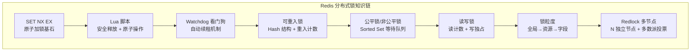
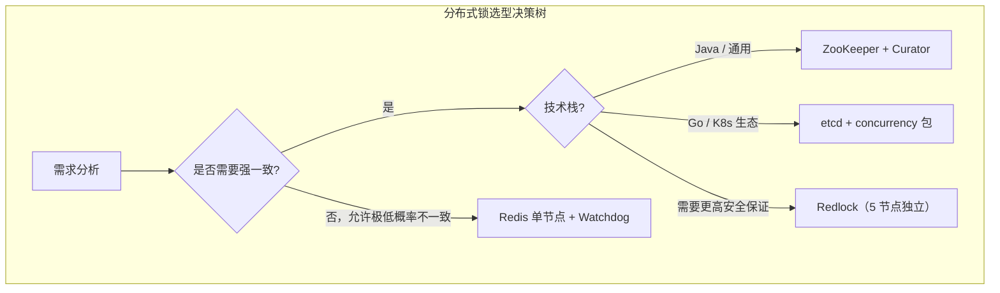

# 本章小结

分布式锁是分布式系统中最基础也最容易出错的协调原语。本章从"为什么需要分布式锁"出发，系统讲解了基于 Redis、ZooKeeper、etcd 三种技术栈的实现方案，深入剖析了 Redlock 算法争议、锁续租与看门狗机制、Fencing Token 安全增强等核心话题，并通过真实故障案例揭示了常见的工程陷阱。本节将全章知识体系做一次完整的回顾与凝练，帮助读者建立清晰的心智模型。

---

## 一、核心概念回顾

### 1.1 分布式锁的本质

分布式锁的本质是一个**分布在多个节点上的状态标记**，它代表某个客户端对某个资源的独占访问权。与单机互斥锁依赖 CPU 原子指令不同，分布式锁依赖一个所有参与节点都能访问的协调服务来实现跨进程、跨机器的互斥访问。

### 1.2 分布式锁的五大性质

| 性质 | 含义 | 违反后果 | 实现保障 |
|------|------|---------|---------|
| **互斥性** | 同一时刻只有一个客户端持有锁 | 并发冲突、数据不一致 | SET NX / 临时顺序节点 / Lease |
| **无死锁** | 客户端崩溃后锁最终能释放 | 资源永久不可用 | TTL 过期 / Session 断开自动删除 |
| **容错性** | 多数节点存活时锁服务可用 | 锁服务单点故障 | 主从复制 / 多节点投票 |
| **安全性** | 只有持有者能释放锁 | 误释放其他客户端的锁 | UUID Token + Lua 原子校验 |
| **活性** | 获取锁的请求最终总能成功 | 系统停滞、饥饿 | 重试机制 + 超时降级 |

### 1.3 CAP 视角下的方案选型

分布式锁面临一致性（C）、可用性（A）、分区容错性（P）之间的根本权衡，理解这个权衡是选择方案的根本依据：

| 方案 | CAP 偏向 | 加锁延迟 | 吞吐量 | 适用场景 |
|------|---------|---------|--------|---------|
| **Redis 单节点** | 偏 AP | < 1ms | 10万+ QPS | 高并发、容忍极低概率不一致 |
| **Redlock** | 偏 AP（增强） | 2-10ms | 数万 QPS | 需要比单节点更高的安全保证 |
| **ZooKeeper** | 偏 CP | 2-5ms | 1万+ QPS | 强一致要求、Leader 选举 |
| **etcd** | 偏 CP | 2-5ms | 1万+ QPS | 云原生、K8s 生态 |
| **数据库行锁** | 强一致 | 5-50ms | 受连接池限制 | 简单低并发、已有数据库场景 |

---

## 二、技术方案全景

### 2.1 Redis 分布式锁技术栈

Redis 凭借单线程执行模型和极低延迟，成为实现分布式锁最广泛的选择。全章围绕 Redis 方案构建了从基础到高级的完整知识链：

**核心知识点速查：**

| 知识点 | 关键命令/机制 | 核心要点 |
|--------|-------------|---------|
| 原子加锁 | `SET key value NX EX seconds` | NX 保证互斥，EX 防止死锁，一条命令原子执行 |
| 安全释放 | Lua 脚本：GET 比较 + DEL 删除 | 两步操作必须原子，否则可能误删其他客户端的锁 |
| 锁续租 | Watchdog 每 TTL/3 执行一次续期 | 解决 TTL 过短/过长的两难困境 |
| 可重入 | Redis Hash 结构，field=客户端ID, value=重入次数 | 每次加锁刷新过期时间，防止重入期间锁过期 |
| Redlock | N 个独立节点，N/2+1 成功即获取锁 | 解决主从切换丢锁问题，但存在时钟依赖争议 |
| Fencing Token | 锁服务返回单调递增 Token | 存储层校验 Token，防御锁失效的最后一道防线 |

### 2.2 ZooKeeper 分布式锁

ZooKeeper 利用**临时顺序节点（EPHEMERAL_SEQUENTIAL）**和 **Watcher 机制**实现公平的分布式锁：

- 每个客户端在锁路径下创建临时顺序节点，编号最小的客户端获得锁
- 其他客户端监听比自己编号小的前一个节点，实现精确通知而非惊群效应
- 会话断开时临时节点自动删除，天然实现"无死锁"保证
- Curator 框架封装了完整的锁实现（`InterProcessMutex`），支持可重入、可中断

**对比 Redis 方案的优势**：强一致性（ZAB 协议）、天然公平、无需额外 Watchdog 机制。**劣势**：性能较低（毫秒级延迟）、运维复杂度高。

### 2.3 etcd 分布式锁

etcd 基于 **Lease 租约**和 **Revision 版本号**实现分布式锁：

- 客户端创建 Lease 并绑定到 key，Lease 过期时 key 自动删除（类似 Redis TTL）
- 通过 Revision 机制保证操作的全局有序性
- Go 标准库 `concurrency` 包提供了开箱即用的 Mutex 实现
- 基于 Raft 协议保证强一致性

**适用场景**：Kubernetes 生态、Go 技术栈、需要与 K8s 服务发现集成的场景。

---

## 三、关键公式与模型

### 3.1 性能模型

| 概念 | 公式 | 说明 | 实际意义 |
|------|------|------|---------|
| 吞吐量 | QPS = 并发数 / 平均延迟 | Little 定律 | Redis 单实例：100 并发 / 1ms = 10 万 QPS |
| 锁有效时间 | 有效时间 = TTL - 获取耗时 - 时钟漂移 | Redlock 公式 | 必须确保有效时间 > 0，否则锁保护形同虚设 |
| Watchdog 周期 | 周期 = TTL / 3 | Redisson 默认策略 | 保证在锁过期前至少完成 2 次续期尝试 |
| 多数派阈值 | quorum = N / 2 + 1 | 共识算法基础 | 5 节点需 3 个成功，容忍 2 个故障 |
| P99 延迟 | 排序后第 99 百分位值 | 尾延迟指标 | 比平均值更能反映真实用户体验 |

### 3.2 一致性权衡模型

---

## 四、最佳实践清单

### 4.1 设计阶段

- [ ] **明确一致性需求**：区分"不能出错"和"尽量不出错"，前者选 ZK/etcd，后者选 Redis
- [ ] **评估锁的粒度**：按最小互斥单元划分，资源实例级（如 `order_lock:{id}`）通常是最佳平衡点
- [ ] **设计过期策略**：评估业务执行时间的波动范围（P99 耗时通常是平均值的 4-10 倍），据此设置 TTL
- [ ] **规划降级方案**：锁服务不可用时是否允许降级？降级为最终一致还是直接拒绝？
- [ ] **确定是否需要 Fencing Token**：金融、库存等高安全场景应配合 Fencing Token 使用

### 4.2 实现阶段

- [ ] **加锁必须原子**：使用 `SET key value NX EX seconds` 一条命令，绝不使用 `SETNX + EXPIRE` 两步
- [ ] **释放必须安全**：使用 Lua 脚本保证"校验 Token + 删除 Key"的原子性，绝不直接 `DEL`
- [ ] **Token 必须全局唯一**：使用 UUID 或纳秒级时间戳，避免不同客户端使用相同值
- [ ] **实现续租机制**：对于执行时间不确定的业务，必须启用 Watchdog 自动续租
- [ ] **使用 try-finally 确保释放**：所有获取锁的操作必须在 finally 块中释放，防止异常导致锁残留

### 4.3 部署阶段

- [ ] **Redis 部署**：单节点用于非关键场景；Sentinel/Cluster 用于高可用；Redlock 用于多节点独立部署
- [ ] **监控覆盖**：监控锁的获取成功率、等待时长、持有时长、续租成功率、释放延迟
- [ ] **告警阈值**：锁等待超时 > 5s、获取失败率 > 1%、续租失败率 > 0.1% 时触发告警
- [ ] **容量规划**：评估锁的并发量，确保 Redis 内存和连接池满足需求
- [ ] **压力测试**：模拟高并发、网络抖动、节点宕机等场景，验证锁的正确性

### 4.4 运维阶段

- [ ] **定期检查监控面板**：关注锁的 QPS、延迟、错误率趋势
- [ ] **分析死锁告警**：锁持有时间异常增长可能是客户端卡死或 Watchdog 故障
- [ ] **清理残留锁**：定期扫描超时未释放的锁，必要时手动清理
- [ ] **版本升级验证**：Redis 升级后验证 SET NX EX 命令行为是否一致

---

## 五、常见误区与纠正

本章通过真实故障案例揭示了分布式锁开发中的高频陷阱，以下是最关键的几个误区：

| 误区 | 错误做法 | 正确做法 | 根因分析 |
|------|---------|---------|---------|
| **锁释放不安全** | 直接 `DEL key` | Lua 脚本先校验 Token 再删除 | 非原子操作导致误删其他客户端的锁 |
| **SETNX + EXPIRE 两步** | 先 SETNX 再 EXPIRE | 一条 `SET NX EX` 原子命令 | SETNX 成功后崩溃，EXPIRE 不执行 → 死锁 |
| **TTL 设置不当** | 固定 30 秒 | Watchdog 自动续租 | 业务执行时间动态波动，固定 TTL 无法适配 |
| **忽视主从延迟** | Redis 主从模式直接用 | Redlock 或 ZK/etcd | 异步复制期间 Master 宕机 → 从节点无锁数据 |
| **不做幂等设计** | 完全依赖锁保证安全 | 锁 + 幂等 Token 双保险 | 锁不是万能的，极端情况下仍可能失效 |
| **锁粒度过粗** | 全局锁保护所有资源 | 按资源实例拆分锁 | 全局锁导致严重性能瓶颈 |
| **不处理锁续租失败** | 续租失败后继续操作 | 续租失败立即停止业务 | 锁已丢失但客户端不知道，继续操作引发并发冲突 |

---

## 六、性能数据参考

| 指标 | Redis 单节点 | Redlock（5节点） | ZooKeeper | etcd |
|------|-------------|-----------------|-----------|------|
| 加锁延迟 | < 1ms | 2-10ms | 2-5ms | 2-5ms |
| 释放延迟 | < 1ms | 2-10ms | 1-3ms | 1-3ms |
| 吞吐量 | 10万+ QPS | 数万 QPS | 1万+ QPS | 1万+ QPS |
| P99 延迟 | ~0.1ms | ~5ms | ~3ms | ~3ms |
| 一致性 | 最终一致（主从） | 增强一致（多数派） | 强一致（ZAB） | 强一致（Raft） |
| 故障恢复 | 秒级 | 秒级 | 秒级（ZAB 选举） | 秒级（Raft 选举） |

---

## 七、技术选型速查

根据业务需求快速选择分布式锁方案：

| 你的场景 | 推荐方案 | 理由 |
|---------|---------|------|
| 高并发秒杀/限流 | Redis 单节点 + Watchdog | 极致性能，毫秒级延迟 |
| 缓存击穿防护 | Redis 单节点（简单 SET NX） | 场景简单，不需要复杂机制 |
| 定时任务去重 | Redis + SetNX（TTL=任务周期） | 简单可靠，任务执行完自然过期 |
| 订单防重复提交 | Redis + Lua + 幂等 Token | 需要安全释放 + 幂等双重保障 |
| 分布式事务协调 | ZooKeeper / etcd | 强一致要求，不能容忍锁丢失 |
| Leader 选举 | ZooKeeper / etcd | 临时节点 + 顺序保证 |
| K8s 环境资源协调 | etcd（concurrency 包） | 原生集成，Go 生态 |
| 金融交易/库存扣减 | ZK/etcd + Fencing Token | 最高安全等级 |

---

## 八、思考题

### 基础题

1. **为什么分布式锁必须设置过期时间？** 与单机锁对比，分析不设 TTL 的后果。

2. **SET NX EX 为什么比 SETNX + EXPIRE 更安全？** 请用时序图说明两种方式在客户端崩溃时的行为差异。

3. **Lua 脚本在 Redis 分布式锁中扮演什么角色？** 为什么 GET + DEL 必须用 Lua 脚本实现原子性？

### 进阶题

4. **Redlock 算法的争议核心是什么？** 从 Kleppmann 和 Antirez 两个角度分别阐述，并给出你的工程选型建议。

5. **Watchdog 机制解决了什么问题？** 如果续期失败，客户端应该如何处理？请设计一个完整的续期失败处理流程。

6. **Fencing Token 是如何防御锁失效的？** 为什么说它是"最后一道防线"？哪些存储层支持 Token 校验？

### 实战题

7. **设计一个秒杀库存扣减的分布式锁方案**，要求：
   - 选择合适的锁方案并说明理由
   - 设计锁的粒度（全局/商品级/SKU级）
   - 处理库存超卖的边界情况
   - 实现幂等性保障
   - 设计降级方案

8. **在一个 5 节点 Redis 集群中**，如果同时有 3 个节点网络分区，Redlock 算法会如何表现？对比单节点方案和 ZooKeeper 方案在相同故障场景下的表现。

---

## 九、下一步学习建议

### 深入方向

1. **源码阅读**：阅读 Redisson 的 `RedissonLock` 源码，理解 Watchdog、可重入锁、公平锁的完整实现。重点关注 `lockInnerAsync()` 方法中的 Lua 脚本调用链。

2. **论文研究**：精读 Martin Kleppmann 的 "How to do distributed locking" 和 Antirez 的回应文章，理解分布式锁安全性证明的数学基础。推荐阅读 Lamport 的 "Time, Clocks, and the Ordering of Events in a Distributed System"。

3. **实践项目**：在自己的项目中实现一个生产级的分布式锁，包含完整的加锁、释放、续租、异常处理逻辑，并编写压力测试验证其正确性。

4. **社区参与**：关注 Redis、ZooKeeper、etcd 社区的最新 RFC 和改进提案，了解分布式锁技术的演进方向。

### 推荐资源

| 类型 | 资源 | 适用阶段 |
|------|------|---------|
| 书籍 | 《Designing Data-Intensive Applications》Martin Kleppmann | 理解分布式一致性基础 |
| 书籍 | 《Redis 设计与实现》黄健宏 | 深入 Redis 内部机制 |
| 源码 | Redisson GitHub 仓库 | 学习生产级锁实现 |
| 源码 | Apache Curator InterProcessMutex | 学习 ZooKeeper 锁实现 |
| 文章 | Martin Kleppmann "How to do distributed locking" | 理解 Redlock 争议 |
| 文章 | Antirez "Is Redlock safe?" | 理解 Redlock 的工程视角 |
| 工具 | Redis Benchmarks（redis-benchmark） | 验证锁操作的性能数据 |

---

## 十、全章知识图谱

```mermaid
graph TB
    DL["分布式锁"]

    DL --> F["基础理论"]
    DL --> R["Redis 方案"]
    DL --> Z["ZooKeeper 方案"]
    DL --> E["etcd 方案"]
    DL --> P["常见误区"]
    DL --> C["实战案例"]

    F --> F1["CAP 定理权衡"]
    F --> F2["互斥性/无死锁/容错性/安全性/活性"]
    F --> F3["单机锁 vs 分布式锁"]

    R --> R1["SET NX EX 原子加锁"]
    R --> R2["Lua 脚本安全释放"]
    R --> R3["Watchdog 自动续租"]
    R --> R4["Redlock 多节点算法"]
    R --> R5["可重入锁/公平锁/读写锁"]
    R --> R6["Fencing Token 安全增强"]
    R --> R7["锁粒度选择"]

    Z --> Z1["临时顺序节点"]
    Z --> Z2["Watcher 通知机制"]
    Z --> Z3["Curator 框架"]

    E --> E1["Lease 租约"]
    E --> E2["Revision 版本号"]
    E --> E3["concurrency 包"]

    P --> P1["释放不安全"]
    P --> P2["SETNX+EXPIRE 竞态"]
    P --> P3["TTL 设置不当"]
    P --> P4["忽视主从延迟"]
    P --> P5["锁粒度过粗"]

    C --> C1["秒杀库存扣减"]
    C --> C2["分布式定时任务"]
    C --> C3["订单状态机防并发"]
```

---

分布式锁看似简单——一个 SET 命令加个过期时间就完事了——但生产环境中的故障案例告诉我们，几乎每一次分布式锁引发的线上事故都源于"想当然"。理解每种方案的边界条件和失效模式，在安全性和性能之间做出合理的权衡，才是掌握分布式锁的关键。记住：**分布式锁不是万能的，它只是分布式系统一致性工具箱中的一个工具。** 在很多场景下，幂等设计、乐观锁、事件溯源等方案可能是更好的选择。技术选型的本质是权衡，而权衡的基础是对每种方案深入、准确的理解。
