# 第54章 分布式锁

## 章节概览

在单体应用中，我们使用互斥锁、信号量等原语来保护共享资源，确保同一时刻只有一个线程能访问临界区。然而在分布式系统中，多个进程运行在不同的机器上，传统的内存锁机制不再适用——一个运行在节点A的进程无法通过操作系统级别的锁来阻止节点B的进程访问同一资源。分布式锁应运而生，它通过一个所有节点都能访问的协调服务来实现跨进程、跨机器的互斥访问。

分布式锁广泛应用于以下场景：

- **秒杀库存扣减**：数千请求同时抢购同一商品，必须保证不超卖
- **定时任务去重**：多实例部署下防止同一任务被重复执行
- **分布式事务协调**：在两阶段提交中协调各参与者的锁状态
- **Leader选举**：从多个候选节点中选出一个主节点
- **资源唯一性保障**：确保某个唯一ID、订单号不被重复创建
- **分布式配置热更新**：保证配置变更在所有节点上原子生效
- **缓存击穿防护**：防止大量请求同时穿透缓存打到数据库

本章将系统地介绍分布式锁的理论基础与工程实践。首先深入分析基于Redis的分布式锁实现，包括SET NX EX原子操作、Lua脚本保证释放安全性、Redlock多节点算法及其争议；然后介绍基于ZooKeeper的分布式锁方案，利用临时顺序节点和Watcher机制实现公平的互斥语义；最后介绍基于etcd的分布式锁方案，利用Lease和Revision机制实现强一致的锁服务。在核心技巧部分，我们将讨论锁的续租与看门狗机制、可重入锁设计、读写分布式锁、锁粒度选择、Fencing Token防御机制以及无锁替代方案。实战案例部分将展示秒杀库存扣减、分布式定时任务调度、订单状态机防并发、分布式限流等真实场景。最后通过常见误区、故障排查方法和练习帮助读者建立正确的分布式锁心智模型。

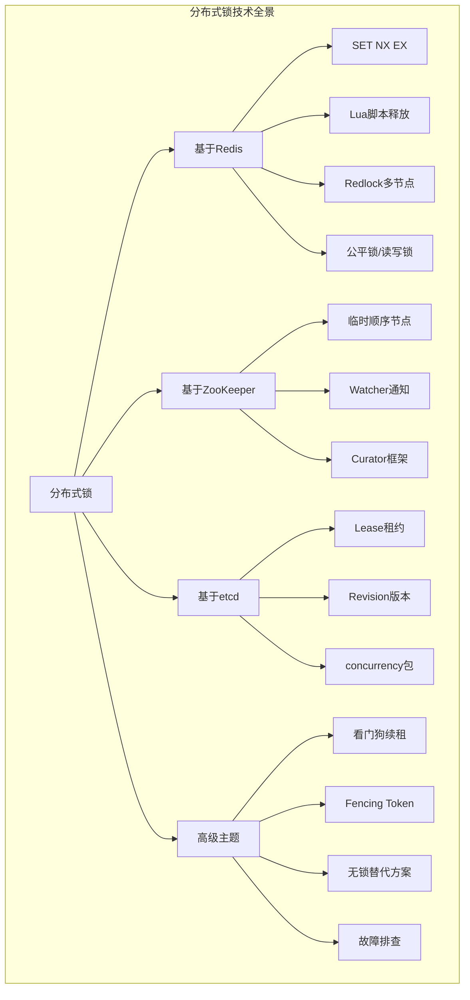

## 知识图谱

- 分布式锁的本质与必要性（CAP定理视角）
- Redis分布式锁（SET NX EX、Lua释放、Redlock）
- ZooKeeper分布式锁（临时顺序节点、Watcher、Curator）
- etcd分布式锁（Lease、Revision、concurrency包）
- 锁续租与看门狗（Watchdog）机制
- 可重入锁与读写锁
- Fencing Token与锁安全性
- 无锁替代方案（乐观锁、CAS）
- 故障排查与调试方法
- 云原生环境下的分布式锁选型

## 学习目标

1. 理解分布式锁解决的核心问题及适用场景，能区分"需要分布式锁"和"有更好替代方案"的情况
2. 掌握Redis、ZooKeeper、etcd三种主流分布式锁的实现原理与工程细节
3. 了解Redlock算法的原理、争议及工程选型建议
4. 能够设计安全、高效的分布式锁方案并规避常见陷阱
5. 能够排查分布式锁相关的生产故障，具备锁方案调优能力

---

## 一、分布式锁的本质

### 1.1 为什么需要分布式锁

在单体架构中，进程内的线程可以通过操作系统提供的互斥原语（如Java的`synchronized`、`ReentrantLock`，C++的`std::mutex`）来保护共享资源。这些原语依赖于CPU的原子指令（CAS、Test-and-Set）和内存屏障，在单机环境下高效且可靠。

然而，当系统演进为分布式架构后，问题变得复杂：

| 单机环境 | 分布式环境 |
|---------|-----------|
| 共享内存，同一地址空间 | 内存隔离，进程间无法直接访问 |
| 操作系统保证原子指令 | 需要网络通信，存在延迟和分区 |
| 锁的持有和释放在同一进程内 | 锁的状态需要在所有节点间同步 |
| 进程崩溃后OS回收资源 | 进程崩溃后锁可能残留（死锁） |
| 无需考虑时钟同步 | 时钟漂移、NTP跳变影响过期判断 |
| 网络调用延迟为纳秒级（总线） | 网络延迟为毫秒级（跨机房可能更高） |

分布式锁的本质是一个**分布在多个节点上的状态标记**，它代表了某个客户端对某个资源的独占访问权。这个状态标记必须在所有需要协调的节点之间达成一致，这使得分布式锁本质上是一个**分布式共识问题**。

### 1.2 分布式锁的核心性质

一个合格的分布式锁需要满足以下性质：

| 性质 | 含义 | 违反后果 |
|------|------|---------|
| **互斥性**（Mutual Exclusion） | 同一时刻只有一个客户端能持有锁 | 并发冲突，数据不一致 |
| **无死锁**（Deadlock Free） | 即使持有锁的客户端崩溃，锁最终也能被释放 | 资源永久不可用 |
| **容错性**（Fault Tolerance） | 大多数锁服务节点存活时，客户端能获取和释放锁 | 锁服务单点故障 |
| **安全性**（Safety） | 只有锁的持有者才能释放锁 | 误释放其他客户端的锁 |
| **活性**（Liveness） | 获取锁的请求最终总能成功 | 无限等待，系统停滞 |

**一个容易被忽视的性质——有序性**：在某些场景下，锁的获取需要遵循特定的顺序（如FIFO队列）。ZooKeeper和etcd天然支持这种有序性（顺序节点、Revision），而Redis需要通过Sorted Set手动实现。无序的锁可能导致饥饿（starvation）——某些客户端在高并发下长期无法获取锁。

### 1.3 CAP视角下的分布式锁

从CAP定理的角度看，分布式锁面临一致性（C）、可用性（A）、分区容错性（P）之间的权衡：


- **Redis单节点锁**：优先AP，牺牲部分一致性（主从切换可能丢锁）
- **ZooKeeper锁**：优先CP，牺牲部分可用性（Leader选举期间不可用）
- **etcd锁**：优先CP，基于Raft协议保证强一致性

理解这个权衡是选择分布式锁方案的根本依据。实际工程中，大部分业务场景（如缓存更新、定时任务去重）可以容忍短暂的不一致，选择Redis即可；但涉及资金、库存等场景，需要ZooKeeper或etcd的强一致性保证。

### 1.4 分布式锁与单机锁的本质区别

理解分布式锁与单机锁的区别，是避免"将分布式锁当单机锁使用"这一根本错误的前提：

| 维度 | 单机锁 | 分布式锁 |
|------|--------|---------|
| 作用范围 | 进程内线程 | 跨进程、跨机器 |
| 性能开销 | 纳秒级（内存操作） | 毫秒级（网络往返） |
| 故障模式 | 进程崩溃则锁自动释放 | 需要过期时间/会话机制 |
| 可重入 | 语言原生支持 | 需要额外设计 |
| 超时处理 | 无需考虑 | 必须设置合理超时 |
| 释放安全性 | 持有者天然唯一 | 需要标识+校验 |

**核心启示**：单机锁是内存级别的快速操作，可以频繁获取释放；分布式锁涉及网络通信，每次获取释放都有显著开销。因此，分布式锁应该尽量减少持有时间，缩小保护范围。

---

## 二、基于Redis的分布式锁

Redis因其高性能、简洁的数据结构和丰富的命令集，成为实现分布式锁最常用的选择。单节点Redis的锁性能可达数万QPS，远超基于共识协议的方案。

### 2.1 基本实现：SET NX EX

Redis的`SET`命令支持`NX`（Not eXists）和`EX`（expire seconds）选项，在一个原子操作中完成"不存在则设置"和"设置过期时间"两个步骤：

SET lock_key unique_value NX EX 30

- **NX**：仅当key不存在时才设置，保证互斥性
- **EX 30**：设置30秒过期时间，保证无死锁
- **unique_value**：客户端唯一标识（如UUID），用于安全释放

这种单命令原子操作避免了早期使用`SETNX` + `EXPIRE`两条命令带来的竞态条件：

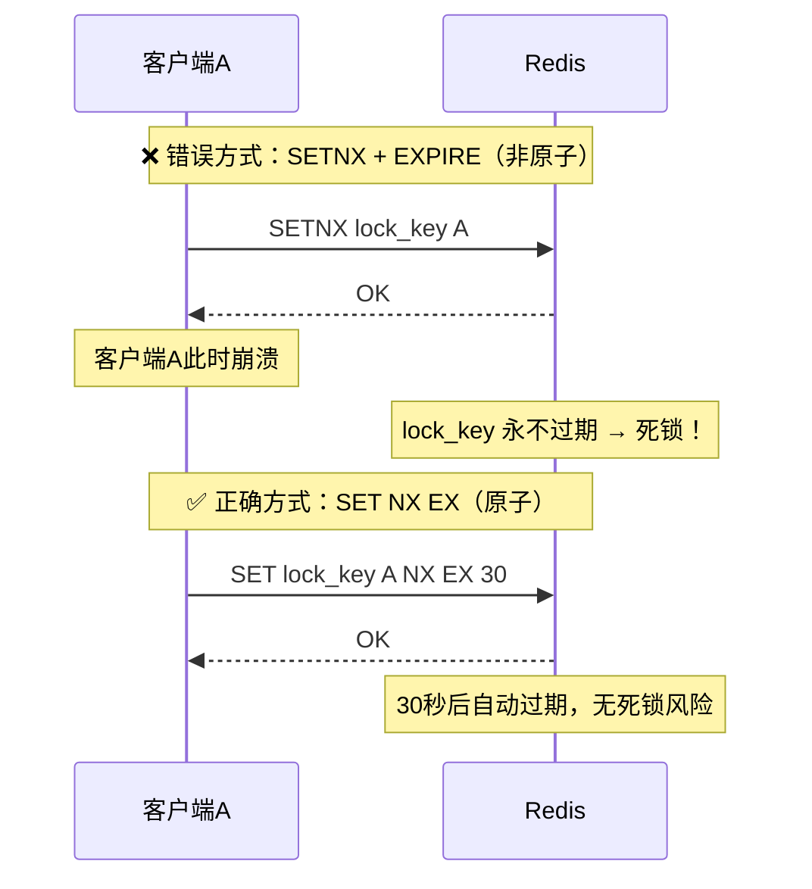

SET NX EX的原子性由Redis单线程模型天然保证——Redis在同一时刻只执行一个命令，不会在SET NX和EXPIRE之间插入其他命令。

**关于PX选项**：Redis还支持`PX`（毫秒级过期），适用于需要更精细过期控制的场景。例如`SET lock_key value NX PX 5000`设置5秒过期（毫秒精度）。

**性能数据**：在单节点Redis上，SET NX EX操作的P99延迟约0.1ms，单实例可支撑约10万+ QPS的锁操作。这对于绝大多数业务场景已经足够。

### 2.2 安全释放：Lua脚本

释放锁时需要确保"只有锁的持有者才能释放"。标准做法是先比较锁的值是否与自己的唯一标识一致，一致才删除。但这两个操作（比较和删除）必须是原子的：

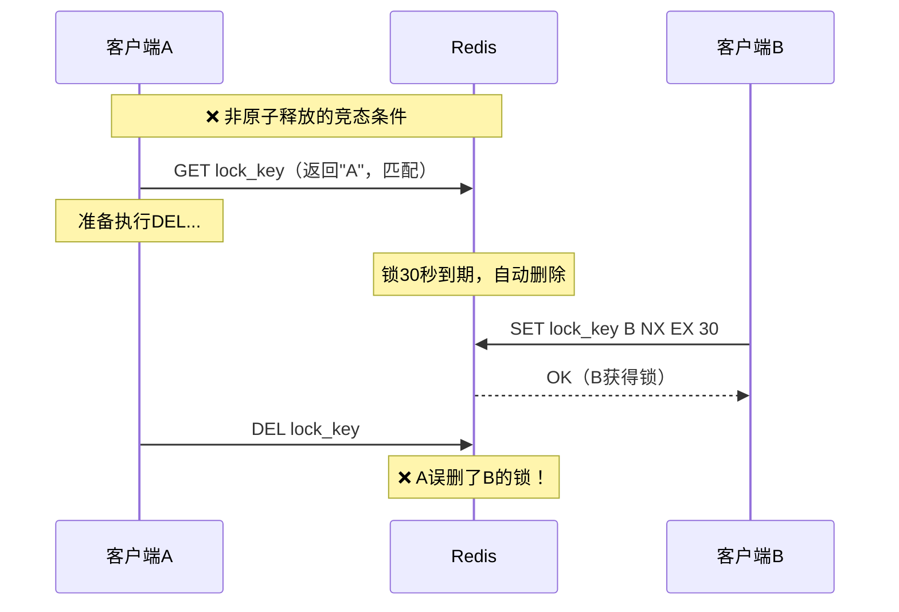

Redis通过Lua脚本保证原子执行：

```lua
-- release_lock.lua
if redis.call("GET", KEYS[1]) == ARGV[1] then
    return redis.call("DEL", KEYS[1])
else
    return 0
end
```

Redis保证Lua脚本的原子执行——脚本执行期间不会有其他命令插入，从而安全地完成"比较并删除"操作。这个看似简单的脚本是Redis分布式锁安全性的关键保障。

**扩展：支持超时的释放脚本**。在某些场景下，客户端可能需要释放一个已经过期但尚未被其他客户端获取的锁（或者处理看门狗续期失败后的清理）。更健壮的释放脚本可以增加`PTTL`检查：

```lua
-- 增强版释放脚本：检查是否为当前持有者，或锁已过期
if redis.call("GET", KEYS[1]) == ARGV[1] then
    return redis.call("DEL", KEYS[1])
elseif redis.call("EXISTS", KEYS[1]) == 0 then
    -- 锁已过期，可以安全清理残留状态
    return redis.call("DEL", KEYS[1])
else
    return 0
end
```

### 2.3 锁续租与看门狗机制

锁的过期时间设置面临两难困境：

- **过短**：业务未执行完锁就过期，其他客户端获取锁导致并发冲突
- **过长**：客户端崩溃后需要等待较长时间才能恢复，影响可用性

Redisson框架引入了**看门狗（Watchdog）机制**来解决这个问题：

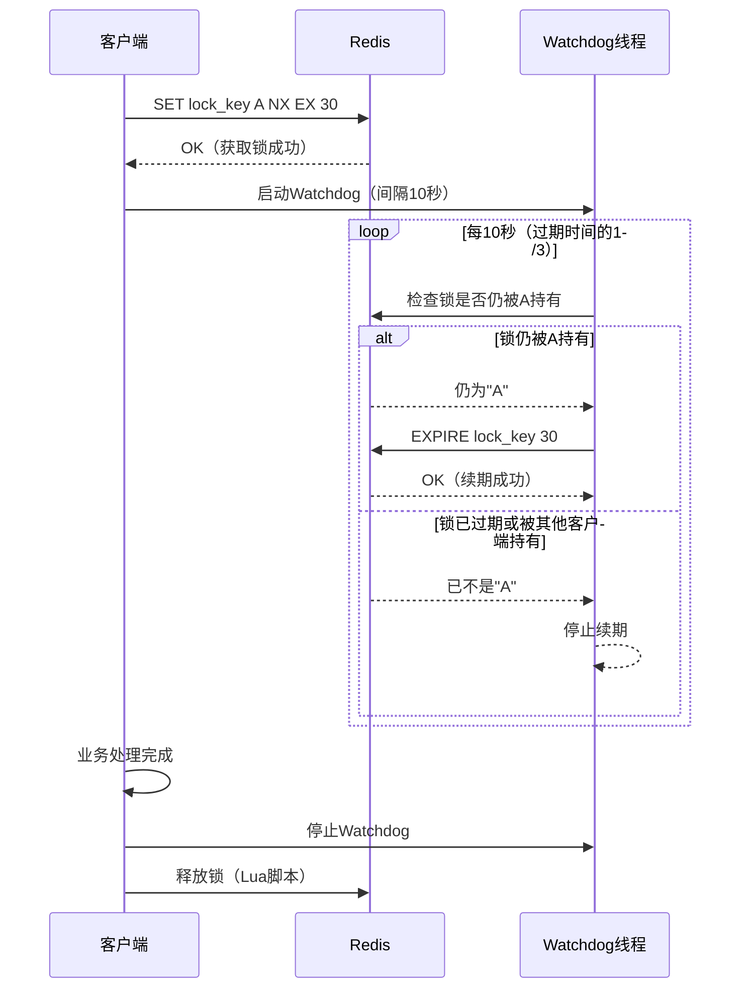

看门狗的核心逻辑：

1. 客户端获取锁成功后，启动后台守护线程
2. 线程每`leaseTime / 3`（默认30/3=10秒）执行一次续期
3. 续期操作使用Lua脚本原子性地"检查+续期"——只有确认锁仍被自己持有时才续期
4. 客户端正常完成后主动释放锁并停止看门狗
5. 客户端崩溃后看门狗线程随之终止，锁最终过期释放

```lua
-- 看门狗续期脚本
if redis.call("GET", KEYS[1]) == ARGV[1] then
    return redis.call("EXPIRE", KEYS[1], ARGV[2])
else
    return 0
end
```

**看门狗的设计哲学**：

- **续期间隔为什么是leaseTime/3而不是leaseTime/2？** 这是一个工程上的安全余量设计。假设leaseTime=30秒，每10秒续期一次。如果在第10秒时续期失败（如Redis短暂不可用），还有20秒的缓冲时间来重试。如果间隔是15秒（leaseTime/2），失败后只剩15秒缓冲，风险更高。
- **为什么用daemon线程？** 主进程退出时daemon线程自动终止，避免孤儿线程继续消耗资源。如果使用非daemon线程，主进程可能因为等待线程结束而无法退出。
- **为什么续期失败要主动停止？** 如果续期失败说明锁可能已经被其他客户端获取，继续持有业务状态会造成数据不一致。

**注意**：Redisson的Watchdog默认只在未显式指定`leaseTime`时启用。如果手动设置了`lock(key, leaseTime)`，Watchdog不会启动，需要自行管理续期。

### 2.4 Redlock算法及争议

当Redis以主从模式部署时，单节点的分布式锁存在一致性问题：

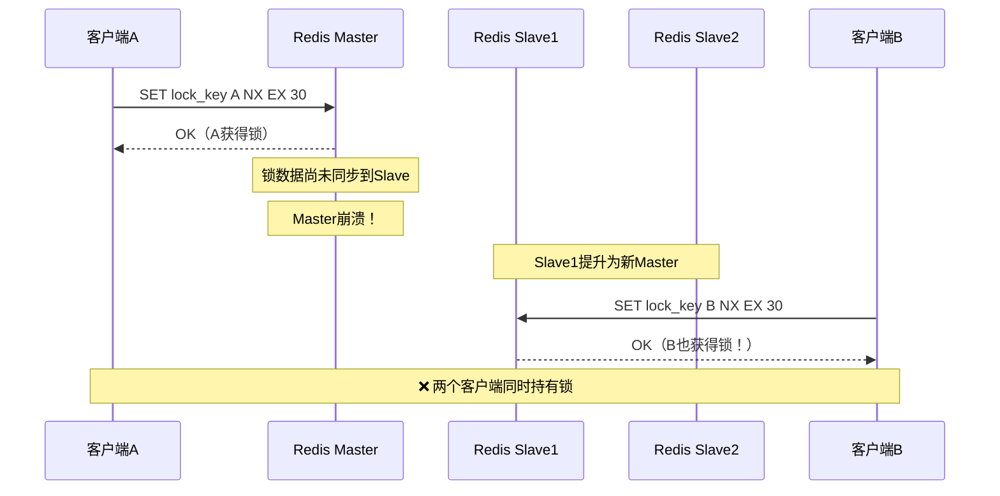

为解决这个问题，Redis作者Antirez提出了**Redlock算法**：

**算法步骤：**

1. 获取当前时间T1（毫秒精度）
2. 依次向N个独立的Redis节点发送SET NX EX请求（通常N=5）
3. 如果在大多数节点（N/2+1=3个）上成功获取锁，且总耗时未超过锁的有效时间，则认为获取锁成功
4. 锁的有效时间 = 设置的过期时间 - 获取锁的总耗时
5. 如果获取锁失败，在所有节点上释放锁

```mermaid
graph LR
    C[客户端] --> R1[Redis-1]
    C --> R2[Redis-2]
    C --> R3[Redis-3]
    C --> R4[Redis-4]
    C --> R5[Redis-5]
    R1 -->|OK| C
    R2 -->|OK| C
    R3 -->|OK| C
    R4 -->|FAIL| C
    R5 -->|OK| C
    Note over C: 5个节点中3个成功 → 获取锁成功
```

**Redlock的工程争议：**

Martin Kleppmann在其文章"How to do distributed locking"中指出了Redlock的根本缺陷：

| Kleppmann的论点 | Antirez的回应 |
|----------------|-------------|
| 依赖时钟同步假设：GC暂停、网络延迟可能导致锁过期判断失准 | Redis的过期时间是相对的而非绝对的，GC暂停同样影响Fencing Token |
| 时钟跳跃（NTP同步）可能导致安全性被破坏 | 生产环境应禁止时钟大幅跳跃，Redis有过期时间的安全余量 |
| 建议使用Fencing Token替代分布式锁 | Fencing Token需要存储层支持，实际中很多存储层不具备此能力 |
| Redlock的安全性证明存在漏洞 | Redlock在合理假设下是安全的，Kleppmann的攻击场景在实际中极难发生 |

**工程启示：**

- 对于**安全性要求极高**的场景（金融交易、库存扣减），不应仅依赖分布式锁，需要配合Fencing Token或幂等设计
- 对于**大多数业务场景**，单节点Redis锁配合合理的过期时间已经足够
- 如果需要强一致性的分布式锁，优先考虑ZooKeeper或etcd
- Redlock在工程上并不是"错误"的——它在合理的假设下提供了比单节点更强的安全保证，但不能作为安全性的唯一依赖

### 2.5 可重入锁

可重入锁允许同一个客户端（通常是同一个线程）在持有锁的情况下再次获取同一把锁而不会死锁。这在递归调用、嵌套方法调用等场景中非常必要。

实现可重入锁需要在锁的值中记录持有者的标识和重入次数。Redis中通常使用Hash结构：

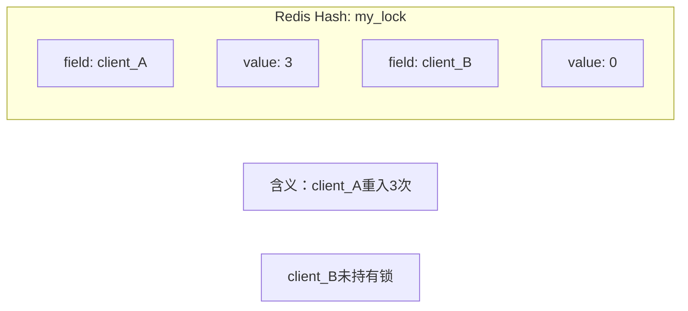

**加锁Lua脚本：**

```lua
-- 可重入锁加锁脚本
-- KEYS[1]: 锁的key
-- ARGV[1]: 客户端标识
-- ARGV[2]: 过期时间

-- 情况1：锁不存在，首次获取
if redis.call("EXISTS", KEYS[1]) == 0 then
    redis.call("HSET", KEYS[1], ARGV[1], 1)
    redis.call("EXPIRE", KEYS[1], ARGV[2])
    return 1
-- 情况2：锁已被自己持有，重入计数+1
elseif redis.call("HGET", KEYS[1], ARGV[1]) then
    redis.call("HINCRBY", KEYS[1], ARGV[1], 1)
    redis.call("EXPIRE", KEYS[1], ARGV[2])
    return 1
-- 情况3：锁被其他客户端持有
else
    return 0
end
```

**释放Lua脚本：**

```lua
-- 可重入锁释放脚本
if redis.call("HGET", KEYS[1], ARGV[1]) then
    local count = redis.call("HINCRBY", KEYS[1], ARGV[1], -1)
    -- 重入计数归零时，删除整个key
    if count == 0 then
        redis.call("DEL", KEYS[1])
    end
    return 1
else
    return 0
end
```

**关键点**：每次加锁成功都刷新过期时间，确保锁不会因重入而提前过期。Redisson的`RLock`就是这种实现的典型代表，其`tryLock()`方法支持可重入语义。

**可重入锁的陷阱**：

- 必须保证加锁和解锁的次数严格匹配。如果加锁3次但只解锁2次，锁永远不会被释放（重入计数为1而不是0）
- 可重入锁的过期时间是整体的，不是每次重入独立计算的。这意味着重入次数越多，业务逻辑需要在同样的过期时间内完成更多工作
- 跨线程不可重入——线程A获取的锁，线程B无法重入。这是可重入锁与线程绑定的特性

### 2.6 公平锁与非公平锁

| 特性 | 非公平锁 | 公平锁 |
|------|---------|--------|
| 获取顺序 | 不保证，随机竞争 | 严格按请求顺序分配 |
| 吞吐量 | 高（减少上下文切换） | 低（需要维护队列） |
| 饥饿风险 | 有可能 | 无 |
| 实现复杂度 | 简单 | 复杂 |
| 适用场景 | 大多数场景 | 需要严格顺序的场景 |

在Redis中实现公平锁，通常使用有序集合（Sorted Set）维护等待队列：

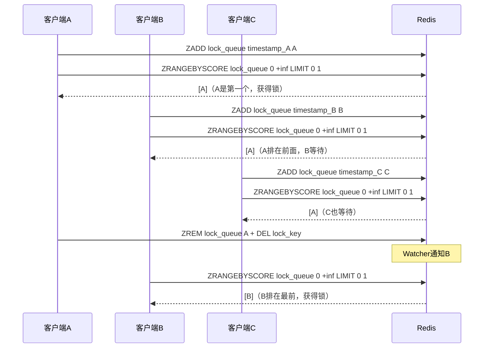

**Redis公平锁完整Lua脚本：**

```lua
-- 获取公平锁
-- KEYS[1]: 锁的key（STRING）
-- KEYS[2]: 等待队列（SORTED SET）
-- ARGV[1]: 客户端标识
-- ARGV[2]: 当前时间戳（毫秒）
-- ARGV[3]: 过期时间

-- 1. 如果锁不存在，直接获取
if redis.call("EXISTS", KEYS[1]) == 0 then
    redis.call("SET", KEYS[1], ARGV[1], "EX", ARGV[3])
    redis.call("ZADD", KEYS[2], ARGV[2], ARGV[1])
    return 1
end

-- 2. 如果锁已被自己持有，重入
if redis.call("GET", KEYS[1]) == ARGV[1] then
    redis.call("EXPIRE", KEYS[1], ARGV[3])
    return 1
end

-- 3. 加入等待队列
redis.call("ZADD", KEYS[2], ARGV[2], ARGV[1])

-- 4. 检查自己是否排在队首
local first = redis.call("ZRANGE", KEYS[2], 0, 0)[1]
if first == ARGV[1] then
    redis.call("SET", KEYS[1], ARGV[1], "EX", ARGV[3])
    return 1
else
    return 0
end
```

**释放公平锁的Lua脚本：**

```lua
-- 释放公平锁
-- KEYS[1]: 锁的key
-- KEYS[2]: 等待队列
-- ARGV[1]: 客户端标识

if redis.call("GET", KEYS[1]) == ARGV[1] then
    redis.call("DEL", KEYS[1])
    redis.call("ZREM", KEYS[2], ARGV[1])
    return 1
else
    return 0
end
```

ZooKeeper天然支持公平锁，因为临时顺序节点的创建是有序的（通过Znode的递增版本号），客户端只需监听比自己小的那个节点即可。

**公平锁的工程考量**：公平锁虽然避免了饥饿，但在高并发场景下性能明显低于非公平锁。原因是每次获取锁都需要维护和查询等待队列，增加了Redis的操作次数。如果业务场景对获取顺序没有强要求（如大多数缓存更新场景），优先使用非公平锁。

### 2.7 读写分布式锁

读写锁区分读操作和写操作：多个读操作可以并发执行，但写操作需要独占访问。在读多写少的场景下（如缓存更新、配置热加载），读写锁能显著提高并发性能。

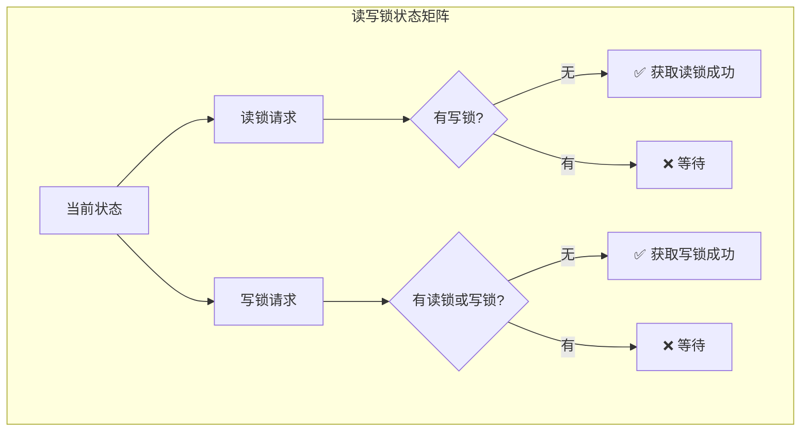

**Redis实现方案**（使用两个Hash结构）：

```lua
-- 获取读锁：检查写锁不存在，然后增加读锁计数
if redis.call("EXISTS", KEYS[2]) == 0 then
    redis.call("HINCRBY", KEYS[1], ARGV[1], 1)
    redis.call("EXPIRE", KEYS[1], ARGV[2])
    return 1
else
    return 0
end

-- 获取写锁：检查没有读锁和写锁
if redis.call("EXISTS", KEYS[2]) == 0 
   and redis.call("HLEN", KEYS[1]) == 0 then
    redis.call("HSET", KEYS[2], ARGV[1], 1)
    redis.call("EXPIRE", KEYS[2], ARGV[2])
    return 1
else
    return 0
end
```

其中`KEYS[1]`是读锁的key（Hash结构，field为客户端标识，value为读计数），`KEYS[2]`是写锁的key。

**释放读写锁的Lua脚本：**

```lua
-- 释放读锁
if redis.call("HGET", KEYS[1], ARGV[1]) then
    local count = redis.call("HINCRBY", KEYS[1], ARGV[1], -1)
    if count == 0 then
        redis.call("HDEL", KEYS[1], ARGV[1])
    end
    -- 如果没有读者了，删除整个key
    if redis.call("HLEN", KEYS[1]) == 0 then
        redis.call("DEL", KEYS[1])
    end
    return 1
else
    return 0
end

-- 释放写锁
if redis.call("GET", KEYS[2]) == ARGV[1] then
    return redis.call("DEL", KEYS[2])
else
    return 0
end
```

**读写锁的适用场景**：

| 场景 | 推荐锁类型 | 原因 |
|------|-----------|------|
| 缓存热加载（读远多于写） | 读写锁 | 允许并发读，减少锁竞争 |
| 配置中心推送更新 | 读写锁 | 读多写少，写操作独占即可 |
| 秒杀库存扣减 | 互斥锁 | 写操作密集，读写锁无优势 |
| 数据库连接池管理 | 读写锁 | 读取连接信息并发，写入（扩容/缩容）独占 |

### 2.8 锁粒度

锁粒度是指一把锁保护的资源范围。粒度的选择直接影响并发性能和实现复杂度：

| 粒度级别 | 示例 | 并发性 | 复杂度 | 适用场景 |
|---------|------|--------|--------|---------|
| 全局锁 | `global_lock` | 极低 | 极简 | 全量数据迁移、系统初始化 |
| 资源类型锁 | `order_lock` | 低 | 简单 | 同类型资源的批量操作 |
| 资源实例锁 | `order_lock:12345` | 高 | 中等 | 绝大多数业务场景 |
| 细分字段锁 | `order_field_lock:12345:status` | 极高 | 复杂 | 超高并发热点字段更新 |

**选择原则：**

1. 按业务资源的**最小互斥单元**划分——如果两个操作操作的是同一个字段，应该用同一把锁；如果操作不同字段，可以用不同的锁
2. 考虑**热点资源**的粒度——热点商品的库存锁要细化到商品级别，而非全品类
3. 评估**锁的数量级**——如果需要数百万把锁（如每用户一把），要考虑Redis的内存开销和key管理成本
4. **避免过粗**导致性能瓶颈，**避免过细**导致锁管理成本过高

**最佳实践**：资源实例粒度（如`order_lock:{order_id}`）通常是最佳平衡点，既保证了并发性能，又不会引入过多的锁管理开销。

**锁粒度的性能影响量化分析**：

假设一个电商系统有1000个商品参与秒杀，每秒产生10万请求，请求均匀分布：

- **全局锁**：所有请求竞争1把锁，理论最大QPS = 锁操作延迟的倒数 ≈ 10万/秒（但实际上每个请求需要等待锁释放，实际QPS远低于此）
- **商品级锁**：1000把锁，每把锁平均每秒处理100个请求，竞争大幅降低
- **库存+用户级锁**：如`stock:{product_id}:user:{user_id}`，每个用户独立操作不同key，完全无竞争

### 2.9 Fencing Token

Fencing Token是Martin Kleppmann提出的分布式锁安全增强机制，被认为是防御锁失效的**最后一道防线**。

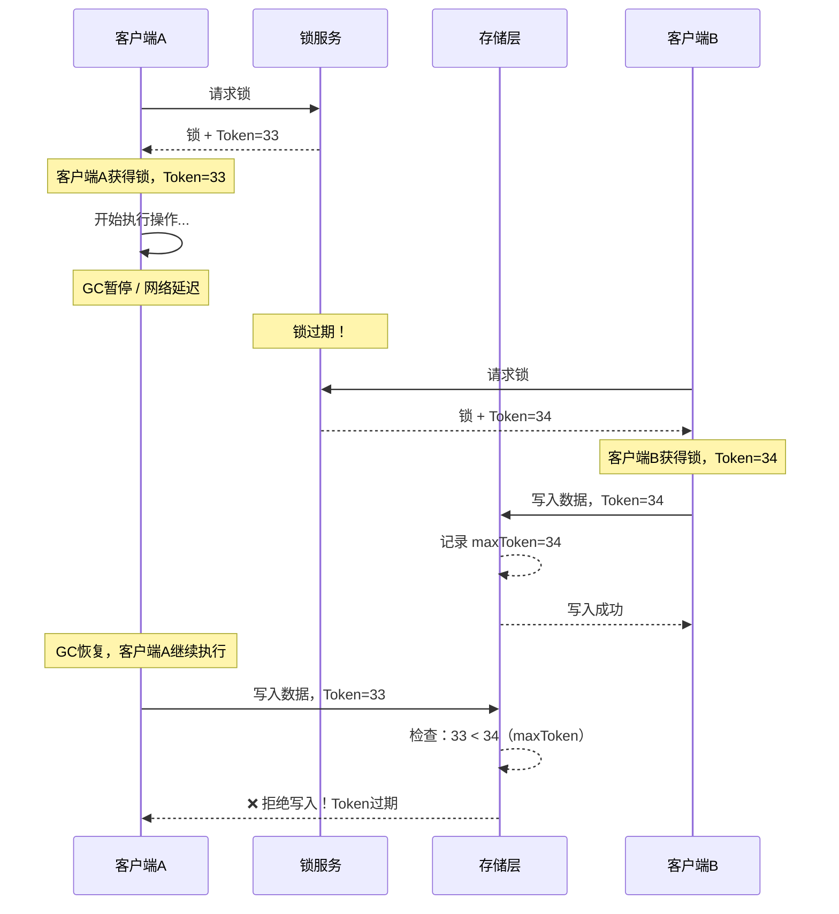

**核心思想**：锁服务每次授予锁时同时返回一个单调递增的Token，客户端在执行写操作时将Token一并发送给存储层，存储层检查Token是否大于已见过的最大Token，如果小于则拒绝写入。

**Token生成方式**：

```python
def acquire_lock_with_token(client, lock_key, expire_seconds=30):
    identifier = str(uuid.uuid4())
    success = client.set(lock_key, identifier, nx=True, ex=expire_seconds)
    if success:
        # 使用INCR生成单调递增的Token
        token = client.incr(f"{lock_key}:token")
        return identifier, token
    return None, None
```

**Fencing Token的精妙之处**：它将安全性保证从锁服务转移到了存储层。即使分布式锁本身出现安全问题（如两个客户端同时认为自己持有锁），存储层也能通过Token拒绝过期的写入。这种机制不依赖任何时间假设，是一种更可靠的安全保障机制。

**局限性**：Fencing Token要求存储层支持Token检查——关系数据库可以通过条件更新实现，但很多中间件（如Redis本身的SET操作）并不原生支持。在实际工程中，需要在应用层实现Token校验逻辑。

**Fencing Token在不同存储层的实现**：

| 存储层 | Token校验实现方式 | 示例 |
|--------|-------------------|------|
| MySQL | WHERE条件 + 单独Token表 | `UPDATE data SET value=X, token=T WHERE token < T` |
| PostgreSQL | UPSERT + 乐观锁 | `INSERT ... ON CONFLICT UPDATE WHERE ...` |
| Redis | Lua脚本原子校验 | `if GET token_key < T then SET ... end` |
| MongoDB | 条件更新 | `db.collection.updateOne({maxToken: {$lt: T}}, {...})` |
| S3/OSS | If-None-Match条件写 | 利用ETag实现条件覆盖 |

### 2.10 无锁替代方案

在某些场景下，分布式锁并非最优选择。无锁方案通常具有更好的性能和可用性：

| 方案 | 原理 | 适用场景 | 局限性 |
|------|------|---------|--------|
| **乐观锁** | 版本号/CAS操作 | 写冲突率低的场景 | 高冲突下重试开销大 |
| **Redis WATCH** | 事务监视 | 简单的读-改-写操作 | 不支持复杂事务 |
| **数据库唯一约束** | 唯一索引 | 保证数据唯一性 | 仅适用于插入场景 |
| **消息队列顺序消费** | 单分区单消费者 | 事件驱动架构 | 不适合同步操作 |
| **Redis Lua原子操作** | 将多步操作合为原子 | 可用Lua表达的逻辑 | 复杂逻辑难以表达 |

**乐观锁示例**（数据库版本号机制）：

```sql
-- 读取时记录版本号
SELECT value, version FROM resource WHERE id = 1;
-- 更新时检查版本号
UPDATE resource 
SET value = new_value, version = version + 1 
WHERE id = 1 AND version = old_version;
-- 如果影响行数为0，说明版本已变，需要重试
```

**Redis WATCH/MULTI/EXEC示例**：

```python
def optimistic_update(client, key, transform):
    max_retries = 3
    for attempt in range(max_retries):
        try:
            client.watch(key)
            value = client.get(key)
            new_value = transform(value)
            pipe = client.pipeline()
            pipe.multi()
            pipe.set(key, new_value)
            pipe.execute()
            return True
        except WatchError:
            if attempt == max_retries - 1:
                raise
            continue
        finally:
            client.unwatch()
```

**选择决策树**：

需要保证操作的互斥性？
├── 否 → 不需要分布式锁
└── 是 → 操作能否用Lua脚本原子化？
    ├── 是 → 使用Redis Lua原子操作（最优性能）
    └── 否 → 写冲突率低于10%？
        ├── 是 → 使用乐观锁（版本号/CAS）
        └── 否 → 需要跨多个服务协调？
            ├── 否 → 使用Redis分布式锁
            └── 是 → 需要强一致性？
                ├── 是 → 使用ZooKeeper/etcd锁
                └── 否 → 使用Redis分布式锁

---

## 三、基于ZooKeeper的分布式锁

ZooKeeper是Apache开源的分布式协调服务，基于ZAB（ZooKeeper Atomic Broadcast）协议实现强一致性。其分布式锁方案利用**临时顺序节点**（Ephemeral Sequential Node）和**Watcher机制**，提供了天然公平的互斥语义。

### 3.1 临时顺序节点

ZooKeeper的ZNode有两种关键特性：

- **临时性（Ephemeral）**：节点与客户端会话绑定，会话结束（客户端崩溃或断开）后节点自动删除——这天然解决了"客户端崩溃后锁残留"的问题
- **顺序性（Sequential）**：创建节点时ZooKeeper自动在路径名后追加递增的序号（如`/locks/resource_0000000001`）——这天然支持公平锁

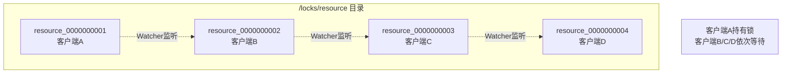

### 3.2 锁获取流程

基于ZooKeeper的分布式锁获取流程如下：

1. **创建临时顺序节点**：客户端在`/locks/resource`路径下创建临时顺序节点，如`resource_0000000001`
2. **获取子节点列表**：获取`/locks/resource`下所有子节点
3. **判断是否最小**：如果自己创建的节点序号最小，则获取锁成功
4. **注册Watcher**：如果不是最小节点，监听比自己小一号的节点（如客户端B监听客户端A的节点）
5. **等待通知**：当最小序号的客户端释放锁（删除节点）时，Watcher触发，回到步骤2重新判断

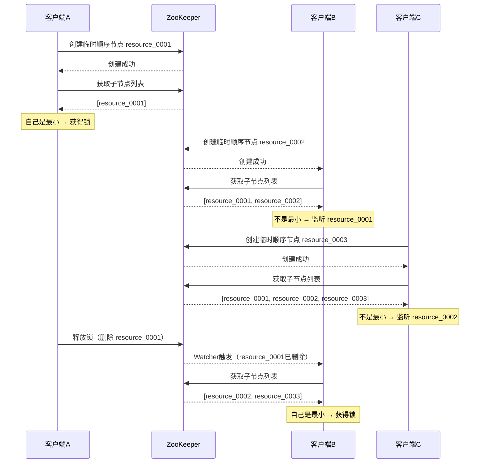

**ZooKeeper锁的一个关键问题——羊群效应（Herd Effect）**：当锁释放时，如果所有等待客户端都watch最小节点，会导致所有客户端同时被唤醒，但只有一个能获取锁，其余的再次进入等待。这在大量客户端竞争时会造成ZooKeeper的瞬时高负载。

**解决方案**：每个客户端只watch比自己小一号的节点（如上文所述），而不是watch最小节点。这样锁释放时只通知一个等待客户端，避免了羊群效应。

### 3.3 ZooKeeper vs Redis对比

| 维度 | Redis锁 | ZooKeeper锁 |
|------|---------|-------------|
| 一致性模型 | 最终一致（主从异步复制） | 强一致（ZAB协议） |
| 性能 | 极高（~10万QPS） | 中等（~1万QPS） |
| 公平性 | 需自行实现（Sorted Set） | 天然公平（顺序节点） |
| 故障恢复 | 依赖过期时间，可能丢锁 | 临时节点自动清理 |
| 实现复杂度 | 简单 | 中等 |
| 客户端生态 | redis-py、Jedis、Lettuce | kazoo（Python）、Curator（Java） |
| 适用场景 | 高并发缓存、秒杀 | 金融交易、Leader选举 |

### 3.4 Curator框架（Java）

Apache Curator是ZooKeeper最流行的Java客户端库，提供了开箱即用的分布式锁实现：

```java
import org.apache.curator.framework.CuratorFramework;
import org.apache.curator.framework.recipes.locks.InterProcessMutex;

// 创建锁实例
InterProcessMutex lock = new InterProcessMutex(client, "/locks/resource");

// 获取锁（阻塞）
if (lock.acquire(10, TimeUnit.SECONDS)) {
    try {
        // 临界区操作
        doSomething();
    } finally {
        lock.release();
    }
}
```

Curator的`InterProcessMutex`实现了可重入的互斥锁，还提供了`InterProcessReadWriteMutex`（读写锁）、`InterProcessSemaphoreMutex`（信号量）等变体。

**kazoo（Python）实现**：

```python
from kazoo.client import KazooClient
from kazoo.recipe.lock import Lock

client = KazooClient(hosts='127.0.0.1:2181')
client.start()

lock = Lock(client, "/locks/resource")
lock.acquire(timeout=10)
try:
    do_something()
finally:
    lock.release()
```

**ZooKeeper锁的工程注意点**：

- **会话超时设置**：会话超时决定了客户端崩溃后锁释放的延迟。设置太短会因网络抖动误判，设置太长则故障恢复慢。典型值为10-30秒
- **连接断开期间的行为**：ZooKeeper客户端在断开连接时无法获取锁，但临时节点仍存在。客户端重连后会话恢复，可以继续持有锁。如果会话已过期，临时节点已被删除，锁自动释放
- **Watch是一次性的**：ZooKeeper的Watch触发后需要重新注册。Curator封装了这个细节，但使用原生API时需要注意

---

## 四、基于etcd的分布式锁

etcd是CNCF毕业项目，基于Raft协议实现强一致性，是Kubernetes的底层存储。etcd的分布式锁利用**Lease（租约）**和**Revision（版本号）**机制，提供了简洁而可靠的锁服务。

### 4.1 Lease机制

etcd的Lease类似于Redis的过期时间，但更加灵活：

- 客户端创建一个Lease，设置TTL（如30秒）
- Lease绑定到一个或多个Key上，Lease过期时所有绑定的Key自动删除
- 客户端需要定期续租（KeepAlive），否则Lease过期，锁自动释放

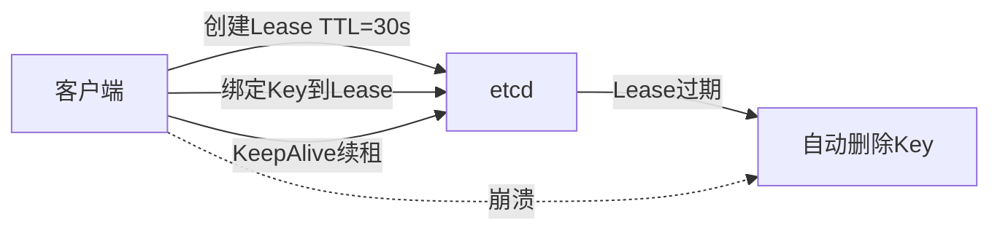

**Lease与Redis过期时间的对比**：

| 特性 | Redis EX/PX | etcd Lease |
|------|------------|-----------|
| 绑定Key数量 | 仅绑定当前Key | 一个Lease可绑定多个Key |
| 续期方式 | EXPIRE命令重新设置 | KeepAlive自动续期 |
| 过期精度 | 秒/毫秒 | 秒级 |
| 过期行为 | Key被删除 | Key被删除 + 事件通知 |

etcd Lease的优势在于可以将多个相关Key绑定到同一个Lease上，Lease过期时所有Key一起删除，这对于需要原子释放多把锁的场景非常有用。

### 4.2 Revision与前缀监视

etcd的每个Key都有全局递增的Revision，可以通过Revision确定操作的全局顺序：

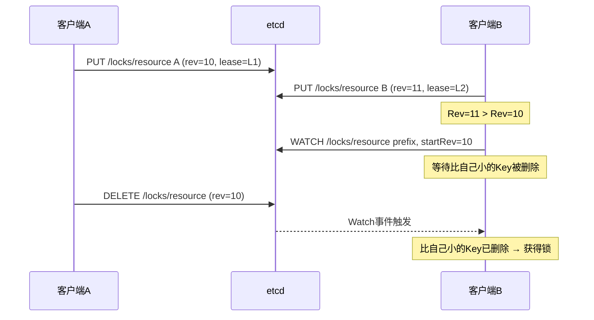

**etcd锁实现的关键步骤**：

1. **创建Lease并绑定锁Key**：`PUT /locks/resource my_id WITH LEASE=lease_id`
2. **获取创建时的Revision**：通过`Txn`响应获取
3. **监听前缀**：`WATCH /locks/resource`，同时维护当前最小Revision
4. **判断是否最小**：如果自己的Revision最小则获取锁
5. **等待通知**：等待比自己小的Key被删除的事件

**etcd锁相比ZooKeeper锁的优势**：Revision是全局单调递增的，不需要像ZooKeeper那样通过创建临时顺序节点来获取序号。etcd的锁不需要"临时"节点的概念，因为Lease过期时Key自动删除，效果等价。

### 4.3 etcd官方concurrency包

etcd提供了`concurrency`包，封装了完整的分布式锁实现：

```go
import (
    "go.etcd.io/etcd/client/v3"
    "go.etcd.io/etcd/client/v3/concurrency"
)

client, _ := clientv3.New(clientv3.Config{
    Endpoints: []string{"localhost:2379"},
})

// 创建会话（绑定Lease）
session, _ := concurrency.NewSession(client, concurrency.WithTTL(30))
defer session.Close()

// 创建锁
mutex := concurrency.NewMutex(session, "/locks/resource")

// 获取锁
mutex.Lock(context.Background())
defer mutex.Unlock(context.Background())

// 临界区操作
doSomething()
```

`concurrency.NewSession`内部自动创建Lease并启动KeepAlive，`NewMutex`封装了完整的锁逻辑。etcd的锁方案兼具ZooKeeper的强一致性和更好的云原生集成（Kubernetes生态）。

**etcd锁在Kubernetes生态中的应用**：

- **Operator Leader Election**：多个Operator实例使用etcd锁选举Leader，确保只有一个实例执行协调逻辑
- **Kubernetes Scheduler**：调度器内部使用类似机制保证同一时刻只有一个调度循环在执行
- **Custom Controller**：自定义控制器使用etcd锁保护共享状态

---

## 五、核心技巧

### 5.1 标准实现模式

#### 加锁的正确姿势

```python
import uuid
import redis

def acquire_lock(client, lock_key, expire_seconds=30):
    """获取分布式锁，返回唯一标识符；获取失败返回None"""
    identifier = str(uuid.uuid4())
    success = client.set(lock_key, identifier, nx=True, ex=expire_seconds)
    if success:
        return identifier
    return None
```

三个参数缺一不可：

- `nx=True`：保证互斥——只有key不存在时才设置
- `ex=expire_seconds`：保证无死锁——客户端崩溃后锁能自动过期
- `uuid`：保证安全释放——只有持有者才能释放自己的锁

#### 释放锁的Lua脚本

```python
RELEASE_SCRIPT = """
if redis.call("GET", KEYS[1]) == ARGV[1] then
    return redis.call("DEL", KEYS[1])
else
    return 0
end
"""

def release_lock(client, lock_key, identifier):
    """安全释放锁：先校验持有者身份，再删除"""
    return client.eval(RELEASE_SCRIPT, 1, lock_key, identifier)
```

**绝对不要**使用先GET再DEL的两步操作，因为在GET和DEL之间锁可能已过期并被其他客户端获取。

#### 看门狗续租实现

```python
import threading

class Watchdog:
    def __init__(self, client, lock_key, identifier, expire_seconds=30):
        self.client = client
        self.lock_key = lock_key
        self.identifier = identifier
        self.expire_seconds = expire_seconds
        self.interval = expire_seconds / 3  # 默认每1/3过期时间续期一次
        self._stop_event = threading.Event()
        self._thread = None

    def start(self):
        self._thread = threading.Thread(target=self._run, daemon=True)
        self._thread.start()

    def _run(self):
        while not self._stop_event.wait(self.interval):
            extend_script = """
            if redis.call("GET", KEYS[1]) == ARGV[1] then
                return redis.call("EXPIRE", KEYS[1], ARGV[2])
            else
                return 0
            end
            """
            result = self.client.eval(
                extend_script, 1, self.lock_key,
                self.identifier, self.expire_seconds
            )
            if not result:
                break  # 锁已不在自己手中，停止续期

    def stop(self):
        self._stop_event.set()
```

使用daemon线程确保主进程退出时看门狗线程也会终止。续期操作使用Lua脚本保证原子性：只有确认锁仍被自己持有时才续期。

#### 工程封装：上下文管理器

```python
import time
from contextlib import contextmanager

class LockAcquisitionError(Exception):
    pass

@contextmanager
def distributed_lock(client, lock_key, expire_seconds=30, 
                     retry_times=3, retry_delay=0.1):
    """分布式锁上下文管理器，确保异常安全"""
    identifier = None
    for _ in range(retry_times):
        identifier = acquire_lock(client, lock_key, expire_seconds)
        if identifier:
            break
        time.sleep(retry_delay)
    
    if not identifier:
        raise LockAcquisitionError(f"Failed to acquire lock: {lock_key}")
    
    watchdog = Watchdog(client, lock_key, identifier, expire_seconds)
    watchdog.start()
    try:
        yield identifier
    finally:
        watchdog.stop()
        release_lock(client, lock_key, identifier)

# 使用方式
with distributed_lock(redis_client, "order_lock:12345") as id:
    process_order(12345)
```

封装的关键点：自动重试获取锁、看门狗自动续期、上下文退出时自动释放、异常安全（即使业务代码抛出异常也能正确释放锁）。

### 5.2 锁粒度设计原则

选择锁粒度时遵循以下原则：

1. **按业务资源的最小互斥单元划分**——锁定单个订单`order_lock:{order_id}`，而非所有订单`order_lock`
2. **考虑热点资源的粒度**——热点商品需要细化到商品级别`stock_lock:{product_id}`
3. **评估锁的数量级**——如果需要数百万把锁，要考虑Redis的内存开销
4. **在粒度和复杂度之间寻找平衡点**——资源实例粒度通常是最佳选择

### 5.3 Fencing Token实践

```python
def acquire_lock_with_token(client, lock_key, expire_seconds=30):
    """获取锁并返回Fencing Token"""
    identifier = str(uuid.uuid4())
    success = client.set(lock_key, identifier, nx=True, ex=expire_seconds)
    if success:
        # 使用INCR生成单调递增的Token
        token = client.incr(f"{lock_key}:token")
        return identifier, token
    return None, None

def write_with_fencing(client, lock_key, identifier, token, data):
    """携带Fencing Token执行写操作"""
    # 下游存储层会检查Token的单调性
    response = requests.post(
        "https://storage-service/api/write",
        json={"data": data, "token": token},
        headers={"X-Lock-Identifier": identifier}
    )
    if response.status_code == 409:
        # Token过期，说明锁已被其他客户端获取
        raise StaleTokenError("Fencing Token rejected by storage layer")
    return response
```

### 5.4 生产环境监控

分布式锁在生产环境中必须有完善的监控。以下是关键监控指标：

| 指标 | 含义 | 告警阈值建议 |
|------|------|-------------|
| `lock.acquire.success_rate` | 获取锁成功率 | < 95% 告警 |
| `lock.acquire.wait_time_avg` | 平均等待时间 | > 100ms 告警 |
| `lock.acquire.wait_time_p99` | P99等待时间 | > 1s 告警 |
| `lock.hold_time_avg` | 平均持有时间 | > 预期值2倍告警 |
| `lock.hold_time_max` | 最长持有时间 | > 过期时间的80%告警 |
| `lock.renewal.count` | 看门狗续期次数 | 突增告警（可能存在长时间持有） |
| `lock.contention.count` | 锁竞争次数 | 持续高位告警 |
| `lock.renewal.failure` | 续期失败次数 | > 0 告警（锁可能丢失） |

**Prometheus埋点示例**：

```python
from prometheus_client import Counter, Histogram, Gauge

lock_acquire_total = Counter('lock_acquire_total', '锁获取尝试', ['lock_key', 'result'])
lock_wait_duration = Histogram('lock_wait_duration_seconds', '锁等待时间', ['lock_key'])
lock_hold_duration = Histogram('lock_hold_duration_seconds', '锁持有时间', ['lock_key'])
lock_renewal_total = Counter('lock_renewal_total', '锁续期次数', ['lock_key'])
lock_renewal_failures = Counter('lock_renewal_failures', '锁续期失败', ['lock_key'])

@contextmanager
def monitored_distributed_lock(client, lock_key, **kwargs):
    with lock_wait_duration.labels(lock_key).time():
        with distributed_lock(client, lock_key, **kwargs) as identifier:
            lock_acquire_total.labels(lock_key, 'success').inc()
            start = time.time()
            try:
                yield identifier
            finally:
                duration = time.time() - start
                lock_hold_duration.labels(lock_key).observe(duration)
```

**监控大盘的关键可视化**：

1. **锁竞争热力图**：按lock_key维度展示锁竞争频率，快速定位热点资源
2. **获取等待时间趋势**：P50/P95/P99等待时间的时间序列，观察是否有恶化趋势
3. **持有时间分布**：直方图展示锁持有时间分布，识别异常长持有
4. **续期失败率**：续期失败可能意味着Redis网络抖动或主从切换

---

## 六、实战案例

### 案例一：电商秒杀库存扣减

#### 场景描述

某电商平台的秒杀活动需要在高并发场景下保证库存扣减的准确性。商品库存存储在Redis中，数千个请求同时抢购同一商品，必须确保不会超卖。

#### 方案一：分布式锁保护

```python
def seckill_deduct_stock(redis_client, product_id, user_id):
    lock_key = f"seckill_lock:{product_id}"
    
    with distributed_lock(redis_client, lock_key, expire_seconds=5):
        stock_key = f"stock:{product_id}"
        stock = int(redis_client.get(stock_key) or 0)
        
        if stock <= 0:
            return {"success": False, "reason": "out_of_stock"}
        
        redis_client.decr(stock_key)
        
        # 记录购买用户，防止同一用户重复购买
        purchased_key = f"purchased:{product_id}"
        if redis_client.sismember(purchased_key, user_id):
            redis_client.incr(stock_key)  # 回滚库存
            return {"success": False, "reason": "already_purchased"}
        
        redis_client.sadd(purchased_key, user_id)
        return {"success": True}
```

**设计要点**：
- 锁粒度精确到商品ID，不同商品的秒杀互不影响
- 过期时间5秒——秒杀操作通常毫秒级完成，5秒留有充足余量
- 使用Set记录已购买用户，防止重复抢购
- 库存预热：活动开始前将库存加载到Redis

#### 方案二：Lua脚本无锁方案（高性能优化）

在极端高并发下，分布式锁的竞争开销可能成为瓶颈。优化方案是将库存检查和扣减合为Lua原子操作：

```lua
-- seckill.lua
local stock_key = KEYS[1]
local purchased_key = KEYS[2]
local user_id = ARGV[1]

-- 检查是否已购买
if redis.call("SISMEMBER", purchased_key, user_id) == 1 then
    return {0, -1}  -- 已购买
end

-- 检查库存并扣减
local stock = tonumber(redis.call("GET", stock_key) or "0")
if stock <= 0 then
    return {0, 0}  -- 无库存
end

redis.call("DECR", stock_key)
redis.call("SADD", purchased_key, user_id)
return {1, stock - 1}  -- 成功，返回剩余库存
```

```python
SECKILL_SCRIPT = """
local stock_key = KEYS[1]
local purchased_key = KEYS[2]
local user_id = ARGV[1]
if redis.call("SISMEMBER", purchased_key, user_id) == 1 then
    return {0, -1}
end
local stock = tonumber(redis.call("GET", stock_key) or "0")
if stock <= 0 then
    return {0, 0}
end
redis.call("DECR", stock_key)
redis.call("SADD", purchased_key, user_id)
return {1, stock - 1}
"""

def seckill_lua(redis_client, product_id, user_id):
    result = redis_client.eval(
        SECKILL_SCRIPT, 2,
        f"stock:{product_id}", f"purchased:{product_id}",
        user_id
    )
    success, remaining = result
    return {"success": bool(success), "remaining_stock": remaining}
```

**混合方案**：大部分请求通过Lua脚本快速处理（无锁），仅在Lua脚本判定需要复杂业务逻辑时回退到分布式锁模式。这样吞吐量可从锁方案的数千QPS提升到数万QPS。

**两种方案的性能对比**：

| 指标 | 分布式锁方案 | Lua无锁方案 |
|------|-------------|------------|
| 单商品QPS | ~3000 | ~50000+ |
| 延迟P99 | ~5ms | ~0.3ms |
| 代码复杂度 | 低（使用上下文管理器） | 中（Lua脚本） |
| 适用场景 | 需要复杂业务逻辑 | 简单的库存扣减 |
| 灵活性 | 高（可插入任意业务逻辑） | 低（逻辑必须写在Lua中） |

### 案例二：分布式定时任务调度

#### 场景描述

某后端系统部署了多个服务实例，每个实例都有定时任务模块。需要确保同一时刻只有一个实例执行某个定时任务（如每天凌晨的对账任务、每小时的报表生成），避免重复执行。

#### 实现

```python
def execute_scheduled_task(redis_client, task_name, task_func):
    lock_key = f"task_lock:{task_name}"
    lock_ttl = 300  # 5分钟，根据任务最大执行时间设置
    
    identifier = acquire_lock(redis_client, lock_key, lock_ttl)
    if not identifier:
        print(f"Instance skipped task: {task_name}, another instance is running")
        return
    
    watchdog = Watchdog(redis_client, lock_key, identifier, lock_ttl)
    watchdog.start()
    
    try:
        print(f"Instance acquired lock, executing task: {task_name}")
        task_func()
        print(f"Task completed: {task_name}")
    except Exception as e:
        print(f"Task failed: {task_name}, error: {e}")
        raise
    finally:
        watchdog.stop()
        release_lock(redis_client, lock_key, identifier)
```

**设计要点**：
- 任务名称作为锁的key，不同任务互不影响
- 过期时间根据任务最大执行时间设置，配合看门狗续期
- 任务完成后主动释放锁，让其他实例尽快获取执行权
- **任务必须具备幂等性**——实例崩溃后锁过期释放，其他实例可能重新执行

**替代方案对比**：在Kubernetes环境中，CronJob本身就保证了同一时刻只有一个Pod执行任务。但在非K8s部署或需要更灵活控制的场景下，分布式锁仍然是可靠的选择。

### 案例三：订单状态机防并发

#### 场景描述

订单系统中，状态流转需要遵循严格的状态机规则。在微服务架构下，支付回调和超时取消可能同时到达，需要保证状态流转的原子性和正确性。

#### 实现

```python
def update_order_status(redis_client, order_id, target_status, expected_current_status):
    lock_key = f"order_lock:{order_id}"
    
    with distributed_lock(redis_client, lock_key, expire_seconds=10):
        order = db.query_order(order_id)
        
        if order.status != expected_current_status:
            return {
                "success": False,
                "reason": f"Invalid state transition: {order.status} -> {target_status}"
            }
        
        if not is_valid_transition(order.status, target_status):
            return {"success": False, "reason": "Invalid transition"}
        
        db.update_order_status(order_id, target_status)
        return {"success": True}

def is_valid_transition(current, target):
    valid_transitions = {
        "PENDING_PAYMENT": ["PAID", "CANCELLED"],
        "PAID": ["SHIPPED", "CANCELLED"],
        "SHIPPED": ["COMPLETED", "RETURNED"],
    }
    return target in valid_transitions.get(current, [])
```

**双重保护**：分布式锁作为第一道防线（减少无效数据库请求），数据库乐观锁（`WHERE status = expected_current_status`）作为最终保障。即使分布式锁在极端情况下失效，数据库层面的条件更新也能保证状态一致性。

### 案例四：分布式限流

#### 场景描述

API网关需要实现滑动窗口限流，多个网关节点需要共享限流状态。传统单机限流（如令牌桶、漏桶）无法在分布式环境下协同工作。

#### 实现：基于Redis的滑动窗口限流锁

```python
import time

SLIDING_WINDOW_SCRIPT = """
local key = KEYS[1]
local window = tonumber(ARGV[1])  -- 窗口大小（秒）
local limit = tonumber(ARGV[2])   -- 限流次数
local now = tonumber(ARGV[3])     -- 当前时间戳（毫秒）

-- 清除窗口外的旧记录
redis.call("ZREMRANGEBYSCORE", key, 0, now - window * 1000)

-- 获取窗口内的请求数
local count = redis.call("ZCARD", key)

if count < limit then
    -- 未超限，添加当前请求
    redis.call("ZADD", key, now, now .. math.random())
    redis.call("EXPIRE", key, window)
    return {1, limit - count - 1}  -- 允许，返回剩余次数
else
    return {0, 0}  -- 拒绝
end
"""

def sliding_window_rate_limit(redis_client, client_id, window=1, limit=100):
    """滑动窗口限流"""
    key = f"rate_limit:{client_id}"
    now = int(time.time() * 1000)
    
    allowed, remaining = redis_client.eval(
        SLIDING_WINDOW_SCRIPT, 1,
        key, window, limit, now
    )
    
    return {
        "allowed": bool(allowed),
        "remaining": remaining,
        "retry_after": window if not allowed else 0
    }
```

**设计要点**：
- 使用Sorted Set的score存储请求时间戳，`ZREMRANGEBYSCORE`原子清除过期记录
- `ZCARD`统计窗口内请求数，与限流阈值比较
- 所有操作在一个Lua脚本中完成，保证原子性
- 不需要分布式锁本身——利用Redis的原子操作实现，避免了锁竞争开销

**限流方案对比**：

| 方案 | 实现复杂度 | 精确度 | 性能 | 适用场景 |
|------|-----------|--------|------|---------|
| 固定窗口计数 | 低 | 低（边界突发） | 极高 | 粗粒度限流 |
| 滑动窗口 | 中 | 高 | 高 | API网关限流 |
| 令牌桶 | 中 | 高 | 高 | 平滑限流 |
| 分布式锁+计数器 | 低 | 高 | 低 | 需要原子操作但并发不高 |

---

## 七、常见误区

### 误区一：使用SETNX加EXPIRE两步操作实现锁

这是最常见的错误。`SETNX`设置锁后，如果在执行`EXPIRE`之前客户端崩溃或网络中断，锁将永远无法过期，形成死锁。

**正确做法**：使用`SET key value NX EX seconds`一条命令完成，Redis保证原子性。很多遗留代码和早期教程使用两步操作，这是必须修正的技术债务。

### 误区二：释放锁时不校验持有者身份

直接使用`DEL`命令释放锁而不检查值，会导致误释放其他客户端的锁。典型场景：客户端A获取锁后执行耗时操作，锁过期，客户端B获取同一把锁，A完成后执行DEL会把B的锁删除。

**正确做法**：使用Lua脚本先比较值再删除，确保只有持有者才能释放。

### 误区三：过期时间设置过短且不续期

将过期时间设置得非常短（如1秒）以期快速释放，但忽略了网络延迟、GC暂停、下游服务超时等因素。锁过期后其他客户端获取锁，导致两个客户端同时操作。

**正确做法**：设置合理的过期时间（业务最大执行时间的2-3倍）并配合看门狗续期机制。

### 误区四：认为Redis主从切换不会丢锁

Redis主从架构下，主节点上的锁在同步到从节点前发生故障转移，新主节点上没有该锁的记录。

**正确做法**：安全性要求极高的场景使用ZooKeeper/etcd，或配合Fencing Token。

### 误区五：在锁内执行不确定时长的操作

在锁内执行HTTP调用、文件上传、大量数据处理等操作，可能导致锁在操作完成前过期。

**正确做法**：评估操作最大耗时，设置足够长的过期时间或使用看门狗续期。耗时操作应拆分为多个短操作，或使用消息队列异步处理。

### 误区六：忽略锁的可重入性

递归调用或嵌套调用场景中，同一客户端可能需要多次获取同一把锁。不支持可重入会导致死锁。

**正确做法**：设计时评估是否需要可重入，需要则使用Hash结构记录重入计数。

### 误区七：过度依赖分布式锁

将分布式锁视为银弹，不考虑乐观锁、数据库唯一约束、消息队列顺序消费等更轻量的替代方案。分布式锁引入外部依赖，增加了系统复杂度和故障点。

**正确做法**：优先考虑无锁方案（乐观锁、Lua原子操作），确实需要互斥语义时才使用分布式锁。

### 误区八：没有监控和告警

对锁的获取失败率、持有时间、等待时间等指标缺乏监控，锁竞争激烈或出现异常时无法及时发现。

**正确做法**：为关键分布式锁添加监控指标（获取成功率、平均等待时间、最长持有时间、续期次数），设置合理告警阈值。

### 误区九：锁的续期失败后不做处理

看门狗续期失败（如Redis网络抖动）后，如果业务逻辑没有相应的降级处理，可能导致锁过期而业务仍在执行。

**正确做法**：续期失败时主动终止业务操作或触发告警，不要假设锁一定还在自己手中。

### 误区十：使用错误的唯一标识作为锁的值

有些实现使用客户端IP或进程PID作为锁的值，但这些标识在容器化环境中可能重复（多Pod共享宿主机IP）。

**正确做法**：使用UUID或`hostname:PID:时间戳`组合确保全局唯一。

---

## 八、故障排查与调试

### 8.1 常见故障场景

| 故障现象 | 可能原因 | 排查方法 |
|---------|---------|---------|
| 锁获取失败率突增 | Redis主从切换、网络抖动、锁竞争加剧 | 检查Redis监控、网络延迟、锁持有时间 |
| 两个客户端同时持有锁 | 锁过期后业务未完成、Redis主从丢锁 | 检查业务执行时长vs锁过期时间、Fencing Token日志 |
| 任务重复执行 | 锁过期释放、看门狗续期失败 | 检查锁过期时间、续期日志、Redis连接状态 |
| 锁永不过期（死锁） | 客户端崩溃后锁未设过期时间 | 检查锁key的TTL、是否有EXPIRE设置 |
| 锁等待时间过长 | 锁持有时间过长、锁粒度过粗 | 检查持有时间分布、锁粒度是否合理 |

### 8.2 诊断工具与命令

**Redis锁状态检查**：

```bash
# 查看锁key是否存在及TTL
redis-cli GET lock_key
redis-cli PTTL lock_key

# 查看锁的等待队列（公平锁场景）
redis-cli ZRANGE lock_queue 0 -1 WITHSCORES

# 监控锁操作（实时观察SET NX EX的执行情况）
redis-cli MONITOR | grep lock_key

# 查看Redis内存中锁相关的key数量
redis-cli KEYS "lock:*" | wc -l
```

**ZooKeeper锁状态检查**：

```bash
# 查看锁目录下的临时顺序节点
zkCli.sh ls /locks/resource

# 查看特定锁节点的内容
zkCli.sh get /locks/resource/resource_0000000001

# 查看锁的Watcher注册情况
zkCli.sh stat /locks/resource/resource_0000000002
```

### 8.3 调试技巧

**日志埋点**：在加锁、释放锁、续期、续期失败等关键路径添加结构化日志：

```python
import logging

logger = logging.getLogger(__name__)

def acquire_lock_with_logging(client, lock_key, expire_seconds=30):
    identifier = str(uuid.uuid4())
    success = client.set(lock_key, identifier, nx=True, ex=expire_seconds)
    logger.info(
        "lock_acquire",
        extra={
            "lock_key": lock_key,
            "identifier": identifier,
            "success": success,
            "expire_seconds": expire_seconds
        }
    )
    return identifier if success else None
```

**锁行为录制**：在测试环境中录制所有锁操作，用于事后分析和问题复现：

```python
class LockRecorder:
    def __init__(self, redis_client):
        self.client = redis_client
        self.record_key = "lock_operations_log"
    
    def record(self, operation, lock_key, identifier, result, timestamp=None):
        import json
        self.client.RPUSH(self.record_key, json.dumps({
            "op": operation,
            "key": lock_key,
            "id": identifier,
            "result": result,
            "ts": timestamp or time.time()
        }))
```

**混沌工程测试**：使用工具模拟各种故障场景，验证锁方案的健壮性：

```bash
# 使用Toxiproxy模拟Redis网络延迟
toxiproxy-cli toxic add redis_proxy --type latency --attribute latency=100

# 使用tc模拟网络丢包
sudo tc qdisc add dev eth0 root netem loss 10%

# 模拟Redis主从切换
redis-cli -h master SLAVEOF NO ONE
```

---

## 九、练习方法

### 基础练习：手写Redis分布式锁

从零实现一个完整的Redis分布式锁，不依赖任何第三方库。使用Python的redis-py库，实现以下核心功能：

1. **基本加锁**：使用SET NX EX实现，返回唯一标识符
2. **安全释放**：使用Lua脚本实现比较并删除
3. **可重入锁**：使用Hash结构记录重入计数
4. **看门狗续期**：实现daemon线程定期续期
5. **上下文管理器**：封装为`with`语句，确保异常安全

编写单元测试验证：
- 互斥性：两个客户端不能同时持有锁
- 安全性：只有持有者能释放锁
- 可重入性：同一客户端可以多次获取同一把锁
- 自动过期：客户端崩溃后锁最终会过期

### 进阶练习：模拟Redlock算法

搭建5个独立的Redis实例（使用Docker Compose快速启动），实现Redlock算法的加锁和释放逻辑。编写测试用例模拟：

1. 正常加锁释放流程
2. 1个节点故障时的可用性（应仍能获取锁）
3. 2个节点故障时的不可用性（应无法获取锁）
4. 时钟偏移对安全性的影响（使用`faketime`工具）
5. 网络分区场景下的行为

### ZooKeeper分布式锁实践

使用kazoo（Python）或Curator（Java）实现基于ZooKeeper的分布式锁。对比其与Redis锁的实现差异：

1. 临时顺序节点的创建和管理
2. Watcher的注册与触发机制
3. 锁的公平性验证
4. 客户端崩溃后的锁释放速度对比

编写一个秒杀服务，分别用两种锁实现，对比功能和性能差异。

### etcd分布式锁实践

使用etcd的concurrency包实现分布式锁。观察：

1. Lease续租机制的工作原理
2. Revision全局有序性如何保证锁的公平性
3. 与ZooKeeper锁对比：会话管理、故障恢复、云原生集成

### 并发测试与压力测试

实现一个简单的计数器服务，多个线程同时对计数器进行递增操作，使用分布式锁保证原子性。

1. 验证最终计数器值等于总操作次数
2. 逐渐增加并发数（10→100→1000→10000），观察锁等待时间和吞吐量变化
3. 绘制并发数-吞吐量-延迟的关系图表
4. 识别锁竞争成为瓶颈的临界点

### 故障注入练习

使用Toxiproxy模拟以下故障：

1. **网络延迟**：将Redis连接延迟增加到100ms，观察锁获取时间变化
2. **网络分区**：模拟客户端与Redis之间的网络中断，验证锁过期释放
3. **Redis实例宕机**：停止Redis主节点，观察从节点提升后的锁行为
4. **时钟跳变**：使用`faketime`模拟NTP同步导致的时钟跳跃

### Fencing Token验证练习

实现带有Fencing Token的分布式锁，配合模拟存储层：

1. 故意在锁过期后不释放，模拟两个客户端同时认为自己持有锁的场景
2. 验证存储层通过Token检查拒绝过期写入的能力
3. 测试Token生成的单调递增性在并发场景下是否保证
4. 实现不同存储层（MySQL、Redis）的Token校验逻辑

---

## 十、本章小结

分布式锁是分布式系统中协调多节点对共享资源进行互斥访问的核心机制。本章从理论基础、实现技巧、实战案例、常见误区和故障排查五个维度系统地介绍了分布式锁的知识体系。

在理论基础部分，我们深入分析了三种主流的分布式锁实现方案。Redis分布式锁以SET NX EX命令为基础，通过Lua脚本保证释放操作的安全性，配合看门狗机制实现自动续期。Redlock算法试图在多节点Redis部署下提供更强的安全性保证，但其依赖时间假设的根本局限引发了Martin Kleppmann与Antirez之间的著名论战。ZooKeeper分布式锁利用临时顺序节点和Watcher机制，提供了天然公平的互斥语义和会话级别的自动清理。etcd分布式锁利用Lease和Revision机制，兼具强一致性和云原生集成优势。

在核心技巧部分，我们讨论了可重入锁、读写锁、锁粒度选择、Fencing Token等工程关键技术点，以及乐观锁、CAS等无锁替代方案。实战案例展示了秒杀库存扣减、分布式定时任务调度、订单状态机防并发、分布式限流四个典型场景。常见误区部分总结了十个典型错误，其共同根源是将分布式锁简单等同于单机锁的分布式版本。

故障排查部分提供了系统化的诊断方法，包括常见故障场景的排查清单、Redis/ZooKeeper的诊断命令、日志埋点和混沌工程测试方法。掌握这些排查技能，是将分布式锁从"能用"提升到"可靠"的关键。

## 核心要点回顾

| 要点 | 说明 |
|------|------|
| **选择合适的实现方案** | Redis锁性能高但一致性较弱，适合高并发场景；ZooKeeper/etcd锁基于共识协议，一致性更强，适合金融交易场景 |
| **安全性三要素** | 原子加锁（SET NX EX）、安全释放（Lua脚本校验持有者）、自动过期（过期时间+看门狗续期），三者缺一不可 |
| **锁粒度与性能** | 粒度越细并发性越好，但管理成本越高。资源实例粒度通常是最佳平衡点 |
| **不要仅依赖锁** | 高安全性场景需配合Fencing Token、数据库乐观锁、幂等设计等多重保障 |
| **监控与告警** | 生产环境必须有完善的锁监控，包括获取成功率、持有时间、等待时间等关键指标 |
| **优先考虑无锁方案** | 乐观锁、Lua原子操作、数据库唯一约束等在适用场景下优于分布式锁 |
| **故障排查能力** | 掌握Redis/ZK的诊断命令和日志分析方法，能快速定位锁相关故障 |

## 技术选型建议

| 维度 | Redis锁 | ZooKeeper锁 | etcd锁 |
|------|---------|-------------|--------|
| 性能 | 极高（~10万QPS） | 中等（~1万QPS） | 中等（~1万QPS） |
| 一致性 | 最终一致 | 强一致 | 强一致 |
| 公平性 | 需自行实现 | 天然公平 | 天然公平 |
| 运维复杂度 | 低 | 中 | 中（K8s生态集成好） |
| 客户端生态 | 最丰富 | Java生态为主 | Go生态为主 |
| 适用场景 | 高并发缓存、秒杀 | 金融/交易、Leader选举 | 云原生/K8s环境 |
| 故障恢复 | 依赖过期时间 | 临时节点自动清理 | Lease过期自动清理 |
| 安全性增强 | 需配合Fencing Token | 会话级别保证 | Revision级别保证 |

## 与其他章节的关联

- **分布式事务（第52章）**：分布式锁是实现分布式事务协调的重要手段，两阶段提交中的Prepare阶段需要持有锁。理解分布式锁的CAP权衡，有助于理解为什么2PC需要阻塞等待。
- **一致性协议（第50章）**：分布式锁本质上是共识问题的应用，Redis的单线程模型、ZooKeeper的ZAB协议、etcd的Raft协议是底层支撑。掌握一致性协议有助于理解不同锁方案的一致性保证差异。
- **分布式缓存（第51章）**：Redis是最常用的分布式锁实现载体，理解Redis的持久化、复制机制对正确使用分布式锁至关重要。Redis的主从复制延迟直接影响锁的安全性。
- **消息队列（第49章）**：消息队列的顺序消费是分布式锁的无锁替代方案之一。在事件驱动架构中，合理设计消息分区可以避免锁竞争。
- **微服务架构（第53章）**：微服务间的分布式锁协调是服务治理的重要课题。Service Mesh的出现为分布式锁提供了新的实现思路（如Envoy的全局锁过滤器）。

## 参考资料

1. Martin Kleppmann. "How to do distributed locking." 2016
2. Antirez. "Is Redlock safe?" 2016
3. Redis Documentation. "SET command." https://redis.io/commands/set/
4. Apache ZooKeeper Documentation. "Recipes." https://zookeeper.apache.org/doc/current/recipes.html
5. etcd Documentation. "Concurrency." https://pkg.go.dev/go.etcd.io/etcd/client/v3/concurrency
6. Redisson Documentation. "Distributed locks and synchronizers." https://redisson.org/docs/distributed-locks-and-synchronizers/
7. Apache Curator Documentation. "InterProcessMutex." https://curator.apache.org/docs/recipes/

***

分布式锁看似简单，实则是分布式系统中最容易出错的组件之一。掌握其原理和实践，不仅需要理解各种实现方案的技术细节，更需要建立对分布式系统本质特征的深刻认知。在实际工程中，没有完美的分布式锁方案，只有在特定约束下的最优选择。记住：分布式锁不是目的，而是手段——我们的目标是保证数据一致性，如果可以用更简单的方案达成，分布式锁就不应该是首选。
