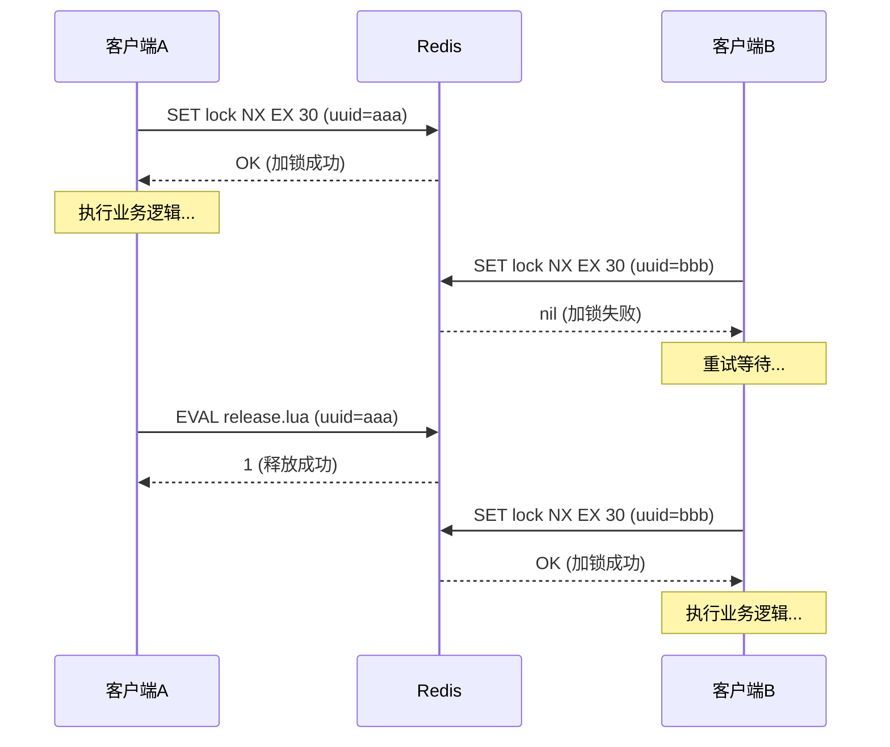
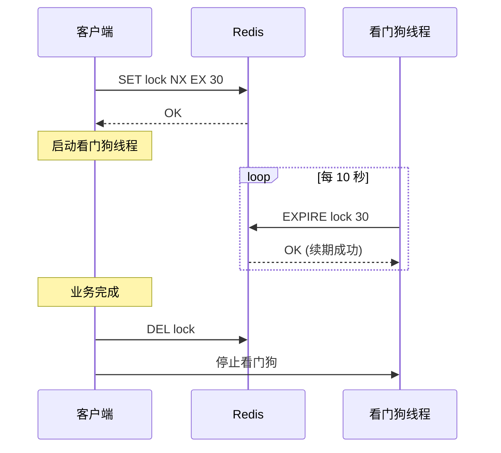
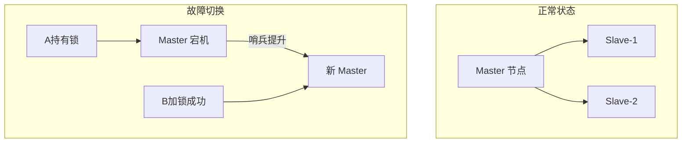

# 案例一：Redis分布式锁实战

## 1. 案例背景与问题定义

### 1.1 业务场景

某电商平台的订单结算系统，在大促期间（双11、618）面临如下挑战：

- 用户下单后需锁定库存，防止超卖
- 同一商品可能被数千用户同时抢购
- 分布式部署了 8 个结算服务节点
- MySQL 单表日订单量超过 500 万

**核心矛盾**：如何在分布式多节点环境下，保证"库存扣减"操作的原子性和互斥性。

### 1.2 为什么传统方案不够

| 方案 | 局限性 |
|------|--------|
| synchronized / ReentrantLock | 仅限单 JVM 进程内，跨节点无效 |
| MySQL 行锁（SELECT FOR UPDATE） | 高并发下数据库成为瓶颈，锁等待导致大量超时 |
| 数据库乐观锁（版本号） | 重试次数多时吞吐量骤降，不适合秒杀场景 |
| 数据库唯一约束 | 仅防重复插入，无法实现"先检查再操作"的原子语义 |

因此，引入 **Redis 分布式锁** 成为刚需。

---

## 2. Redis 分布锁的核心原理

### 2.1 基础指令：SET NX EX

Redis 提供了一条原子命令实现加锁：

```bash
SET lock_key unique_value NX EX 30
```

- `NX`：仅当 key 不存在时才设置（互斥语义）
- `EX 30`：设置 30 秒过期（防止死锁）
- `unique_value`：唯一标识（UUID/随机串），用于安全释放

**原子性保证**：SET NX EX 是单条命令，不存在竞态窗口。

### 2.2 释放锁：Lua 脚本保证原子性

释放锁必须满足两个条件：①锁仍被当前持有者持有 ②删除操作本身是原子的。

```bash
-- release_lock.lua
if redis.call("GET", KEYS[1]) == ARGV[1] then
    return redis.call("DEL", KEYS[1])
else
    return 0
end
```

**为什么不能分两步做**：

```python
# ❌ 错误示例：非原子操作，存在竞态条件
if redis.get("lock_key") == my_value:
    # ---- 这里可能锁已过期被其他客户端获取 ----
    redis.delete("lock_key")  # 误删别人的锁！
```

```python
# ✅ 正确做法：用 Lua 脚本原子执行
RELEASE_LUA = """
if redis.call("GET", KEYS[1]) == ARGV[1] then
    return redis.call("DEL", KEYS[1])
else
    return 0
end
"""
redis.eval(RELEASE_LUA, 1, "lock_key", my_value)
```

### 2.3 锁的生命周期图



---

## 3. Java 完整实现

### 3.1 基础版：手写 Redis 分布式锁

```java
import redis.clients.jedis.Jedis;
import java.util.UUID;

public class RedisDistributedLock {

    private final Jedis jedis;
    private final String lockKey;
    private final String uniqueId;
    private final int lockTimeoutSeconds;

    // Lua 脚本：原子释放锁
    private static final String RELEASE_LUA =
        "if redis.call('GET', KEYS[1]) == ARGV[1] then " +
        "  return redis.call('DEL', KEYS[1]) " +
        "else " +
        "  return 0 " +
        "end";

    public RedisDistributedLock(Jedis jedis, String lockKey, int lockTimeoutSeconds) {
        this.jedis = jedis;
        this.lockKey = lockKey;
        this.lockTimeoutSeconds = lockTimeoutSeconds;
        this.uniqueId = UUID.randomUUID().toString();
    }

    /**
     * 尝试加锁
     * @return true=加锁成功, false=已被其他客户端持有
     */
    public boolean tryLock() {
        String result = jedis.set(lockKey, uniqueId, "NX", "EX", lockTimeoutSeconds);
        return "OK".equals(result);
    }

    /**
     * 阻塞式加锁（带超时）
     */
    public boolean lock(long waitMillis) throws InterruptedException {
        long deadline = System.currentTimeMillis() + waitMillis;
        while (System.currentTimeMillis() < deadline) {
            if (tryLock()) {
                return true;
            }
            Thread.sleep(50); // 自旋间隔
        }
        return false;
    }

    /**
     * 释放锁
     */
    public boolean unlock() {
        Object result = jedis.eval(RELEASE_LUA,
            java.util.Collections.singletonList(lockKey),
            java.util.Collections.singletonList(uniqueId));
        return ((Long) result) == 1L;
    }
}
```

### 3.2 业务层使用

```java
public class OrderService {

    private final RedisDistributedLock lock;

    public boolean createOrder(String skuId, int quantity) {
        String lockKey = "stock:lock:" + skuId;
        RedisDistributedLock orderLock = new RedisDistributedLock(jedis, lockKey, 10);

        try {
            // 等待最多 3 秒获取锁
            if (!orderLock.lock(3000)) {
                throw new RuntimeException("系统繁忙，请稍后重试");
            }

            // ====== 临界区开始 ======
            // 1. 查询当前库存
            int stock = getStock(skuId);
            if (stock < quantity) {
                return false; // 库存不足
            }

            // 2. 扣减库存
            deductStock(skuId, quantity);

            // 3. 创建订单
            insertOrder(skuId, quantity);
            // ====== 临界区结束 ======

            return true;
        } finally {
            orderLock.unlock();
        }
    }
}
```

### 3.3 Redisson 开源方案（生产推荐）

手写锁存在看门狗、可重入、红锁等复杂问题，生产环境推荐使用 Redisson：

```java
import org.redisson.Redisson;
import org.redisson.api.RLock;
import org.redisson.api.RedissonClient;

public class OrderServiceRedisson {

    private final RedissonClient redisson;

    public boolean createOrder(String skuId, int quantity) {
        RLock lock = redisson.getLock("stock:lock:" + skuId);

        try {
            // 看门狗模式：默认 30s 过期，每 10s 自动续期
            // 阻塞等待最多 5 秒
            if (lock.tryLock(5, TimeUnit.SECONDS)) {

                int stock = getStock(skuId);
                if (stock < quantity) {
                    return false;
                }

                deductStock(skuId, quantity);
                insertOrder(skuId, quantity);
                return true;
            }
            throw new RuntimeException("获取锁超时");
        } catch (InterruptedException e) {
            Thread.currentThread().interrupt();
            throw new RuntimeException("线程中断");
        } finally {
            if (lock.isHeldByCurrentThread()) {
                lock.unlock();
            }
        }
    }
}
```

**Redisson 的核心优势**：

| 特性 | 手写实现 | Redisson |
|------|---------|----------|
| 看门狗自动续期 | 需自行实现 | 内置，默认开启 |
| 可重入锁 | 需自行实现 | 基于 Hash 结构天然支持 |
| 公平锁 | 需自行实现 | `getFairLock()` |
| 红锁（多节点） | 实现复杂 | `getRedLock()` |
| 读写锁 | 需自行实现 | `getReadWriteLock()` |
| 信号量 | 不支持 | `getSemaphore()` |

---

## 4. 五大经典问题与解决方案

### 4.1 问题一：锁过期但业务未完成（看门狗机制）

**场景描述**：锁 30 秒过期，但业务执行了 40 秒。第 31 秒时锁自动释放，另一个客户端获取锁，导致并发冲突。

**解决方案：看门狗（Watchdog）自动续期**



**Redisson 内部实现原理**：

```java
// Redisson 看门狗核心逻辑（简化）
public class WatchdogTask implements Runnable {
    private final RLock lock;
    private static final int LOCK_TIMEOUT = 30_000;  // 30 秒
    private static final int RENEW_INTERVAL = 10_000; // 10 秒续一次

    @Override
    public void run() {
        // 只在当前线程持有锁时才续期
        if (lock.isHeldByCurrentThread()) {
            long remainingTime = lock.remainingLeaseTime();
            // 如果剩余时间小于 2/3，触发续期
            if (remainingTime < LOCK_TIMEOUT * 2 / 3) {
                lock.expire(LOCK_TIMEOUT, TimeUnit.MILLISECONDS);
            }
            // 安排下次续期
            scheduleNext(this, RENEW_INTERVAL, TimeUnit.MILLISECONDS);
        }
    }
}
```

**关键设计要点**：
- 续期间隔 = 锁超时的 1/3（30s 锁 → 10s 续期一次）
- 续期阈值 = 锁超时的 2/3（剩余时间 < 20s 才续期）
- 只有锁持有者才能续期，防止误续期

### 4.2 问题二：锁被误删（Lua 原子释放）

**场景描述**：A 获取锁后执行慢操作，锁过期后 B 获取了锁。此时 A 完成操作，执行 DEL 删除了 B 持有的锁。

**解决方案**：释放锁时校验 unique_value

SET lock "uuid-A" NX EX 30    → A 加锁
... 30 秒后锁过期 ...
SET lock "uuid-B" NX EX 30    → B 加锁
GET lock → "uuid-B"           → A 检查发现不是自己的锁，不删除

### 4.3 问题三：Redis 主从切换导致锁丢失

**场景描述**：哨兵模式下，A 在主节点加锁成功，主节点同步到从节点前宕机。哨兵提升从节点为主节点，B 在新主节点加锁成功。此时 A 和 B 同时持有锁。



**解决方案对比**：

| 方案 | 原理 | 适用场景 | 代价 |
|------|------|---------|------|
| RedLock（多节点） | 在 N/2+1 个独立 Redis 实例上加锁 | 对一致性要求极高 | 需要多个独立 Redis 实例 |
| Zookeeper/etcd | 基于 Paxos/Raft 一致性协议 | 强一致场景 | 运维复杂，性能较低 |
| 接受最终一致性 | 业务层补偿（幂等 + 对账） | 大多数互联网场景 | 需要设计补偿机制 |

**RedLock 算法要点**：

```python
def redlock_acquire(lock_name, ttl_ms, n_instances=5):
    """
    RedLock 算法：在 N 个独立 Redis 实例上加锁
    """
    resource = str(uuid.uuid4())
    n = n_instances
    quorum = n // 2 + 1  # 多数派：5节点需要3个成功

    start_time = time.monotonic()
    instances = get_redis_instances(n)

    # 阶段一：尝试在所有实例上加锁
    success_count = 0
    for instance in instances:
        try:
            result = instance.set(lock_name, resource, nx=True, px=ttl_ms)
            if result:
                success_count += 1
        except RedisError:
            continue  # 该节点失败，继续下一个

    # 阶段二：计算总耗时
    elapsed_time = (time.monotonic() - start_time) * 1000
    drift = ttl_ms * 0.01 + 2  # 时钟漂移估算
    validity = ttl_ms - elapsed_time - drift

    # 阶段三：多数派确认 + 有效期检查
    if success_count >= quorum and validity > 0:
        return Lock(resource, validity)
    else:
        # 失败：释放所有已获取的锁
        for instance in instances:
            instance.eval(RELEASE_LUA, lock_name, resource)
        return None
```

### 4.4 问题四：Redis 故障时的降级策略

**场景描述**：Redis 整体不可用时，所有分布式锁获取失败，业务全部阻塞或拒绝。

**解决方案：多级降级**

```java
public class LockManager {

    /**
     * 三级降级策略
     */
    public boolean acquireLock(String key, Duration timeout) {
        // 第一级：尝试 Redis 分布式锁
        try {
            return redisLock.tryLock(key, timeout.toMillis());
        } catch (RedisConnectionException e) {
            log.warn("Redis 不可用，降级到本地锁");
        }

        // 第二级：降级到本地 JVM 锁（限制单节点）
        try {
            return localLock.tryLock(key, timeout.toMillis());
        } catch (Exception e) {
            log.warn("本地锁失败，降级到数据库锁");
        }

        // 第三级：数据库悲观锁（最后兜底）
        try {
            return dbLock.tryLock(key, timeout.toSeconds());
        } catch (Exception e) {
            throw new LockAcquisitionException("所有锁策略均失败", e);
        }
    }
}
```

### 4.5 问题五：可重入支持

**场景描述**：同一线程内，方法 A 调用方法 B，两者都需要加同一把锁。非可重入锁会导致死锁。

**解决方案**：使用 Redis Hash 结构记录持有者和重入次数

# Hash 结构存储锁
HSET stock:lock:sku001 owner "thread-123" count 2

# 加锁（已持有时 count+1）
if HGET(key, "owner") == current_thread:
    HINCRBY(key, "count", 1)
    EXPIRE(key, 30)

# 释放（count-1，归零时删除）
HINCRBY(key, "count", -1)
if HGET(key, "count") == 0:
    DEL(key)

---

## 5. 生产环境最佳实践

### 5.1 锁超时时间的设定

```java
// ❌ 错误：固定值，无法适应不同业务
int lockTimeout = 30;

// ✅ 正确：基于业务最大执行时间计算
public int calculateLockTimeout(String operationType) {
    switch (operationType) {
        case "库存扣减":    return 5;   // 操作快
        case "订单生成":    return 10;  // 涉及多表
        case "支付回调":    return 15;  // 外部依赖
        case "报表生成":    return 30;  // 大数据量
        default:            return 10;
    }
}
```

**经验公式**：锁超时 = 业务 P99 延迟 × 3 + 网络抖动余量（1-2 秒）

### 5.2 Key 命名规范

```bash
# 格式：业务域:操作类型:资源标识
stock:lock:sku_001           # 库存锁定
order:lock:user_123456       # 用户订单锁
pay:lock:order_789012        # 支付锁

# ❌ 避免
lock123                       # 无业务语义
distributed_lock_sku_001      # 过于冗长
```

### 5.3 超时与重试策略

```java
public class LockRetryConfig {

    /** 最大等待时间 */
    private Duration maxWaitTime = Duration.ofSeconds(5);

    /** 自旋间隔（递增式退避） */
    private Duration initialSpinInterval = Duration.ofMillis(50);

    /** 最大自旋间隔 */
    private Duration maxSpinInterval = Duration.ofMillis(500);

    /**
     * 递增式退避：50ms → 100ms → 200ms → 400ms → 500ms（封顶）
     */
    public Duration nextInterval(int attempt) {
        long base = initialSpinInterval.toMillis();
        long interval = Math.min(base * (1L << attempt), maxSpinInterval.toMillis());
        // 加入随机抖动，避免惊群效应
        interval += ThreadLocalRandom.current().nextLong(interval / 4);
        return Duration.ofMillis(interval);
    }
}
```

### 5.4 监控指标清单

| 指标 | 采集方式 | 告警阈值 | 含义 |
|------|---------|---------|------|
| lock.acquire.success | Counter | - | 加锁成功次数 |
| lock.acquire.fail | Counter | > 成功次数×10% 时告警 | 加锁失败次数 |
| lock.acquire.wait_ms | Histogram | P99 > 3s 告警 | 加锁等待耗时 |
| lock.hold_duration_ms | Histogram | P99 > 5s 告警 | 锁持有时间 |
| lock.renew.count | Counter | - | 看门狗续期次数 |
| lock.release.error | Counter | > 0 即告警 | 释放锁异常 |
| redis.connection.pool.active | Gauge | > 80% 容量告警 | Redis 连接池使用率 |

```java
// Micrometer 埋点示例
@Autowired MeterRegistry registry;

public boolean tryLockWithMetrics(String lockKey) {
    Timer.Sample sample = Timer.start(registry);
    try {
        boolean acquired = redisLock.tryLock(lockKey);
        if (acquired) {
            registry.counter("lock.acquire.success").increment();
        } else {
            registry.counter("lock.acquire.fail").increment();
        }
        return acquired;
    } finally {
        sample.stop(registry.timer("lock.acquire.wait_ms"));
    }
}
```

---

## 6. 压测验证与性能数据

### 6.1 测试环境

| 项目 | 配置 |
|------|------|
| Redis 版本 | 7.2 |
| Redis 部署 | 3 主 3 从（哨兵模式） |
| 客户端 | Jedis 4.x，连接池 50 |
| 压测工具 | JMeter 5.6 |
| 业务模拟 | 库存扣减（Redis + MySQL） |

### 6.2 测试结果

**单节点 Redis 锁性能**：

| 并发线程 | QPS | 加锁成功延迟(P99) | 业务耗时(P99) | 错误率 |
|---------|-----|-------------------|--------------|--------|
| 50 | 12,000 | 2ms | 8ms | 0% |
| 200 | 35,000 | 5ms | 15ms | 0% |
| 500 | 58,000 | 12ms | 30ms | 0.1% |
| 1000 | 72,000 | 28ms | 55ms | 0.5% |
| 2000 | 85,000 | 65ms | 120ms | 1.2% |

**Redisson 看门狗续期测试**：

| 业务耗时 | 锁超时 | 续期次数 | 是否冲突 |
|---------|-------|---------|---------|
| 5s | 30s | 0 | 否 |
| 20s | 30s | 1 | 否 |
| 60s | 30s | 4 | 否 |
| 120s | 30s | 9 | 否（业务完成才释放） |

---

## 7. 常见踩坑与排错

### 7.1 问题：锁设置了但不生效

**排查清单**：

```bash
# 1. 检查 key 是否存在
redis-cli EXISTS stock:lock:sku_001

# 2. 查看 key 的 TTL
redis-cli TTL stock:lock:sku_001

# 3. 查看 key 的值（确认持有者）
redis-cli GET stock:lock:sku_001

# 4. 检查 Redis 是否为主从架构，是否有复制延迟
redis-cli INFO replication
```

### 7.2 问题：大量客户端锁等待超时

**常见原因**：
1. 锁超时时间设置过长 → 其他客户端等待时间过长
2. 临界区内执行了耗时操作（RPC、复杂计算）
3. 锁粒度太粗（整个模块一把锁）

**解决方法**：

```java
// ❌ 粗粒度锁：所有商品共用一把锁
RLock lock = redisson.getLock("stock:lock:all");

// ✅ 细粒度锁：每个商品一把锁
RLock lock = redisson.getLock("stock:lock:" + skuId);

// ✅✅ 最优：将锁粒度细化到用户+商品维度
RLock lock = redisson.getLock("stock:lock:" + userId + ":" + skuId);
```

### 7.3 问题：内存占用持续增长

Redis 中未正确释放的锁 key 会持续占用内存：

```bash
# 监控锁 key 数量
redis-cli INFO keyspace
redis-cli DBSIZE

# 扫描异常 key
redis-cli --scan --pattern "stock:lock:*" | head -20

# 批量清理过期锁（慎用，需确认业务状态）
redis-cli --scan --pattern "stock:lock:*" | \
  while read key; do
    ttl=$(redis-cli TTL "$key")
    if [ "$ttl" -eq -1 ]; then
      echo "无过期时间: $key"
    fi
  done
```

---

## 8. 本章小结

| 要点 | 说明 |
|------|------|
| SET NX EX | Redis 加锁的原子基础指令 |
| Lua 脚本释放 | 保证 GET + DEL 的原子性 |
| unique_value | 防止误删其他客户端的锁 |
| 看门狗 | 自动续期防止业务未完成锁就过期 |
| RedLock | 多节点部署下的高可用方案 |
| 降级策略 | Redis 不可用时切换到本地锁 / DB 锁 |
| 监控告警 | 加锁延迟、持有时间、错误率是核心指标 |

**生产选型决策树**：

需要分布式锁？
├── 单机部署 → synchronized / ReentrantLock（本地锁足够）
├── 分布式 + 可接受最终一致 → Redis 单节点锁（性能最优）
├── 分布式 + 要求强一致 → Redis RedLock / Zookeeper
└── 分布式 + 要求高可用 → Redisson + 看门狗 + 降级策略
