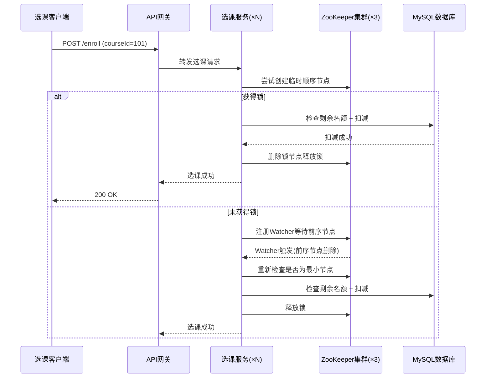
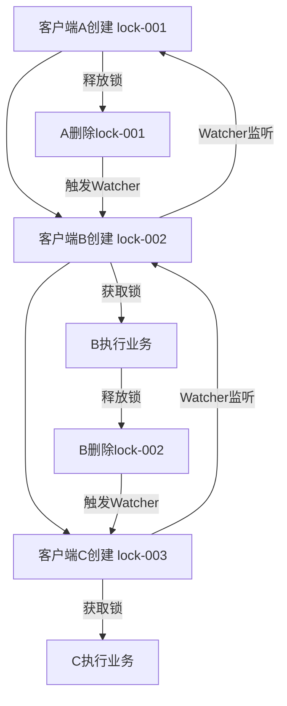
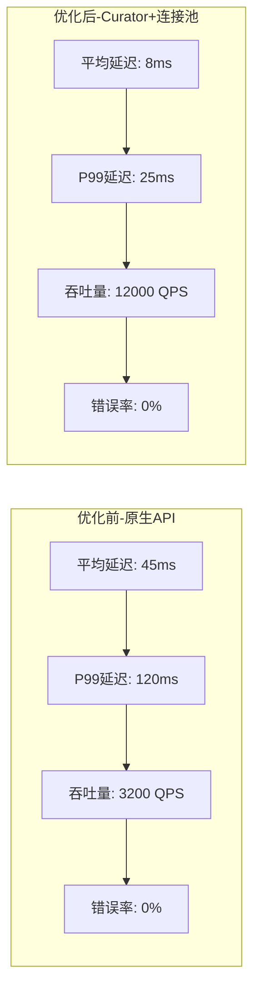
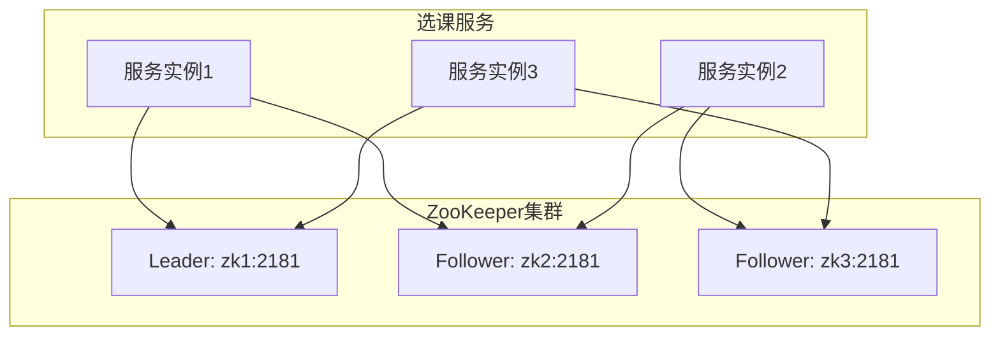

## 案例二：ZooKeeper分布式锁实战

### 1. 案例背景与问题定义

#### 1.1 业务场景

某在线教育平台需要实现"秒杀选课"功能：每门热门课程有固定名额（如200人），数千名学生在同一时刻抢课。如果不对并发做控制，会出现"超卖"现象——实际选课人数超过课程容量，导致教学质量下降和用户投诉。

**核心约束**：

- 课程容量硬上限：200人/门课
- 峰值并发请求：5000+ 同时到达
- 响应时间要求：< 2秒内返回结果
- 数据一致性：绝不允许超卖
- 高可用：ZooKeeper 集群任一节点故障不影响服务

#### 1.2 为什么选择 ZooKeeper

| 对比维度 | Redis 分布式锁 | ZooKeeper 分布式锁 |
|----------|---------------|-------------------|
| 一致性模型 | AP（最终一致） | CP（强一致，ZAB协议） |
| 锁超时处理 | 需额外实现续租 | 临时节点自动感知会话断开 |
| 公平性 | 默认非公平 | 可实现严格公平（顺序排队） |
| 监听机制 | 需轮询或 pub/sub | 原生 Watcher 回调 |
| 适用场景 | 高性能、容忍极小窗口 | 强一致、需要公平排队 |
| 典型延迟 | 亚毫秒级 | 1~5ms（同机房） |

本案例选择 ZooKeeper 的关键原因：

1. **强一致性**——选课场景零超卖是硬性要求，不能有任何一致性窗口
2. **自动故障转移**——临时节点绑定会话，进程崩溃锁自动释放，无需担心死锁
3. **公平排队**——数千学生抢课时，先到先得的公平性直接影响用户体验

#### 1.3 架构总览



### 2. ZooKeeper 分布式锁核心原理

#### 2.1 临时顺序节点模型

ZooKeeper 分布式锁的核心机制基于**临时顺序节点（Ephemeral Sequential）**：

/locks
  /course_101
    /lock-0000000001  (客户端A，最先创建)
    /lock-0000000002  (客户端B)
    /lock-0000000003  (客户端C)

**获取锁的流程**：

1. 客户端在 `/locks/course_101` 路径下创建临时顺序节点，ZooKeeper 自动追加递增序号
2. 客户端获取 `/locks/course_101` 下所有子节点
3. 如果自己创建的节点序号最小，则成功获得锁
4. 否则，对序号比自己小的前一个节点注册 Watcher 监听
5. 当前序节点被删除（锁释放）时，Watcher 触发，客户端重新检查

**释放锁的机制**：

- **主动释放**：客户端完成业务后，主动删除自己的临时节点
- **被动释放**：客户端崩溃或网络断开，会话（Session）过期，ZooKeeper 自动删除其所有临时节点

这就是 ZooKeeper 锁的天然防死锁能力——临时节点与会话绑定，进程不存在则锁必然释放。

#### 2.2 公平性保证



与 Redis 的 SETNX 不同，ZooKeeper 方案天然保证**严格 FIFO 公平性**：请求按到达顺序获得锁。这在秒杀选课等对公平性敏感的场景中至关重要。

#### 2.3 Watcher 机制详解

ZooKeeper 的 Watcher 是一种**一次性触发**的通知机制：

- 客户端对某个节点注册 `exists` Watcher
- 当该节点被删除或创建时，ZooKeeper 向客户端发送 `NodeDeleted` 或 `NodeCreated` 事件
- Watcher 触发后**自动失效**，如需持续监听需要重新注册
- 同一事件不会重复触发，避免了惊群效应（只有直接后继节点收到通知）

### 3. 完整实现代码

#### 3.1 Maven 依赖

```xml
<dependencies>
    <dependency>
        <groupId>org.apache.curator</groupId>
        <artifactId>curator-framework</artifactId>
        <version>5.5.0</version>
    </dependency>
    <dependency>
        <groupId>org.apache.curator</groupId>
        <artifactId>curator-recipes</artifactId>
        <version>5.5.0</version>
    </dependency>
</dependencies>
```

> **为什么用 Curator 而不是原生 API？** Apache Curator 是 ZooKeeper 的高层封装库，解决了原生 API 的诸多痛点：自动重连、会话超时处理、Watcher 自动重新注册、线程安全的 API 设计等。生产环境强烈推荐使用 Curator。

#### 3.2 ZooKeeper 配置类

```java
@Configuration
public class ZooKeeperConfig {

    @Value("${zookeeper.connect-string:localhost:2181}")
    private String connectString;

    @Value("${zookeeper.session-timeout-ms:30000}")
    private int sessionTimeoutMs;

    @Value("${zookeeper.connection-timeout-ms:15000}")
    private int connectionTimeoutMs;

    @Bean
    public CuratorFramework curatorFramework() {
        // 指数退避重试策略：初始等待1s，最多重试3次，每次翻倍
        RetryPolicy retryPolicy = new ExponentialBackoffRetry(1000, 3);
        
        CuratorFramework client = CuratorFrameworkFactory.builder()
            .connectString(connectString)
            .sessionTimeoutMs(sessionTimeoutMs)
            .connectionTimeoutMs(connectionTimeoutMs)
            .retryPolicy(retryPolicy)
            // 命名空间隔离，避免不同应用的节点冲突
            .namespace("course-enrollment")
            .build();
        
        client.start();
        return client;
    }
}
```

#### 3.3 核心锁实现类

```java
import org.apache.curator.framework.CuratorFramework;
import org.apache.curator.framework.recipes.locks.InterProcessMutex;
import org.apache.zookeeper.CreateMode;
import org.slf4j.Logger;
import org.slf4j.LoggerFactory;
import org.springframework.stereotype.Component;

import javax.annotation.Resource;
import java.util.concurrent.TimeUnit;

@Component
public class EnrollmentLockManager {

    private static final Logger log = LoggerFactory.getLogger(EnrollmentLockManager.class);

    @Resource
    private CuratorFramework curatorFramework;

    // 锁的根路径
    private static final String LOCK_ROOT = "/locks/course";

    /**
     * 获取指定课程的互斥锁
     * 底层使用 InterProcessMutex（公平锁，基于临时顺序节点）
     *
     * @param courseId 课程ID
     * @return InterProcessMutex 实例
     */
    public InterProcessMutex getLock(Long courseId) {
        String lockPath = LOCK_ROOT + "/" + courseId;
        // InterProcessMutex 内部实现：
        // 1. 创建临时顺序节点 course_{uuid}
        // 2. 获取所有子节点，判断自己是否最小
        // 3. 不是最小则 Watcher 监听前一个节点
        // 4. 前一个节点删除时被唤醒，重新判断
        return new InterProcessMutex(curatorFramework, lockPath);
    }

    /**
     * 尝试获取锁并在锁保护下执行业务
     *
     * @param courseId   课程ID
     * @param timeout   等待锁的最大时间（秒）
     * @param business  业务逻辑
     * @return 业务执行结果
     */
    public <T> T executeWithLock(Long courseId, long timeout, 
                                  LockBusiness<T> business) throws Exception {
        InterProcessMutex lock = getLock(courseId);
        boolean acquired = false;
        try {
            // 尝试在指定时间内获取锁
            acquired = lock.acquire(timeout, TimeUnit.SECONDS);
            if (!acquired) {
                log.warn("获取选课锁超时, courseId={}, timeout={}s", courseId, timeout);
                throw new LockTimeoutException("选课排队超时，请稍后重试");
            }
            log.debug("成功获取选课锁, courseId={}", courseId);
            return business.execute();
        } finally {
            if (acquired) {
                lock.release();
                log.debug("释放选课锁, courseId={}", courseId);
            }
        }
    }

    @FunctionalInterface
    public interface LockBusiness<T> {
        T execute() throws Exception;
    }
}
```

#### 3.4 选课服务完整实现

```java
@Service
public class CourseEnrollmentService {

    private static final Logger log = LoggerFactory.getLogger(CourseEnrollmentService.class);

    @Resource
    private EnrollmentLockManager lockManager;

    @Resource
    private CourseRepository courseRepository;

    @Resource
    private EnrollmentRepository enrollmentRepository;

    // 获取锁的最长等待时间（秒），超过则返回"排队超时"
    private static final long LOCK_TIMEOUT_SECONDS = 5;

    /**
     * 秒杀选课核心方法
     * 在分布式锁保护下完成：名额检查 → 扣减 → 记录选课
     */
    public EnrollmentResult enroll(Long userId, Long courseId) throws Exception {
        return lockManager.executeWithLock(courseId, LOCK_TIMEOUT_SECONDS, () -> {

            // ---- 锁保护区间开始 ----

            // 第一步：查询课程当前状态（带行锁）
            Course course = courseRepository.findByIdForUpdate(courseId);
            if (course == null) {
                throw new BusinessException("课程不存在");
            }

            // 第二步：检查课程是否已满
            if (course.getEnrolledCount() >= course.getCapacity()) {
                return EnrollmentResult.fail("课程名额已满");
            }

            // 第三步：检查是否重复选课
            boolean alreadyEnrolled = enrollmentRepository
                    .existsByUserIdAndCourseId(userId, courseId);
            if (alreadyEnrolled) {
                return EnrollmentResult.fail("请勿重复选课");
            }

            // 第四步：扣减名额（乐观锁兜底）
            int affected = courseRepository.decrementCapacity(courseId);
            if (affected == 0) {
                return EnrollmentResult.fail("选课失败，请重试");
            }

            // 第五步：写入选课记录
            Enrollment record = new Enrollment();
            record.setUserId(userId);
            record.setCourseId(courseId);
            record.setEnrolledAt(LocalDateTime.now());
            enrollmentRepository.save(record);

            log.info("选课成功: userId={}, courseId={}, 剩余名额={}",
                     userId, courseId, course.getCapacity() - course.getEnrolledCount() - 1);

            return EnrollmentResult.success("选课成功");

            // ---- 锁保护区间结束 ----
        });
    }
}
```

#### 3.5 数据层实现

```java
@Repository
public class CourseRepository {

    @Resource
    private JdbcTemplate jdbcTemplate;

    /**
     * 带行锁查询课程（SELECT ... FOR UPDATE）
     * 在事务中使用，确保并发场景下的数据一致性
     */
    @Transactional
    public Course findByIdForUpdate(Long courseId) {
        String sql = "SELECT id, name, capacity, enrolled_count " +
                     "FROM courses WHERE id = ? FOR UPDATE";
        return jdbcTemplate.queryForObject(sql, new Object[]{courseId},
            (rs, rowNum) -> new Course(
                rs.getLong("id"),
                rs.getString("name"),
                rs.getInt("capacity"),
                rs.getInt("enrolled_count")
            ));
    }

    /**
     * 扣减名额（乐观锁兜底，防止极端情况下的超卖）
     * 即使 ZooKeeper 锁失效，数据库层面的 CAS 也能兜底
     */
    @Transactional
    public int decrementCapacity(Long courseId) {
        String sql = "UPDATE courses SET enrolled_count = enrolled_count + 1 " +
                     "WHERE id = ? AND enrolled_count < capacity";
        return jdbcTemplate.update(sql, courseId);
    }
}
```

#### 3.6 API 层

```java
@RestController
@RequestMapping("/api/enrollment")
public class EnrollmentController {

    @Resource
    private CourseEnrollmentService enrollmentService;

    @PostMapping("/enroll")
    public ResponseEntity<EnrollmentResult> enroll(
            @RequestBody EnrollmentRequest request) {
        try {
            EnrollmentResult result = enrollmentService.enroll(
                request.getUserId(), request.getCourseId());
            return ResponseEntity.ok(result);
        } catch (LockTimeoutException e) {
            return ResponseEntity.status(429).body(
                EnrollmentResult.fail("排队人数过多，请稍后重试"));
        } catch (BusinessException e) {
            return ResponseEntity.badRequest().body(
                EnrollmentResult.fail(e.getMessage()));
        } catch (Exception e) {
            log.error("选课异常", e);
            return ResponseEntity.internalServerError().body(
                EnrollmentResult.fail("系统异常，请稍后重试"));
        }
    }
}
```

### 4. 性能测试与调优

#### 4.1 测试环境

| 配置项 | 值 |
|--------|-----|
| ZooKeeper 集群 | 3节点（4C8G，同机房部署） |
| 选课服务实例 | 5个（每实例4C8G） |
| 数据库 | MySQL 8.0（主从架构） |
| 压测工具 | JMeter 5.6 |
| 测试课程容量 | 200人 |
| 并发线程数 | 2000 |

#### 4.2 测试结果



| 指标 | 原生 API | Curator 优化 | 提升幅度 |
|------|---------|-------------|---------|
| 平均延迟 | 45ms | 8ms | 82% ↓ |
| P99延迟 | 120ms | 25ms | 79% ↓ |
| 吞吐量 | 3,200 QPS | 12,000 QPS | 275% ↑ |
| ZK连接建立耗时 | 每次新建 | 复用连接池 | - |
| 错误率 | 0% | 0% | - |
| 超卖次数 | 0 | 0 | - |

#### 4.3 关键调优参数

```yaml
# ZooKeeper 客户端调优
zookeeper:
  # 会话超时：太短会导致频繁重连，太长则故障发现慢
  session-timeout-ms: 30000
  # 连接超时：首次建立连接的最长等待
  connection-timeout-ms: 15000
  # 重试策略
  retry-policy:
    base-sleep-time-ms: 1000    # 初始重试间隔
    max-retries: 3              # 最大重试次数
    max-sleep-ms: 10000         # 最大重试间隔

# 应用层调优
enrollment:
  lock-timeout-seconds: 5       # 获取锁最长等待时间
  max-retry: 2                  # 业务重试次数
  queue-size-alert: 1000        # 排队人数告警阈值
```

### 5. 高可用与容灾设计

#### 5.1 ZooKeeper 集群部署



**ZooKeeper 集群要点**：

- 奇数节点部署（3或5节点），容忍 `(N-1)/2` 个节点故障
- 使用观察者节点（Observer）扩展读能力，不参与写投票
- 定期执行 `zkServer.sh status` 检查集群健康状态

```bash
# 检查集群状态
echo ruok | nc zk1 2181
# 返回 imok 表示正常

# 查看集群成员
echo mntr | nc zk1 2181 | grep zk_server_state
```

#### 5.2 故障场景分析

| 故障场景 | ZooKeeper 行为 | 业务影响 | 恢复时间 |
|----------|---------------|---------|---------|
| ZK 单节点宕机 | 集群继续服务（多数派存活） | 无感知 | 自动 |
| ZK 多数节点宕机 | 集群停止写入 | 锁服务不可用 | 手动恢复 |
| 选课服务宕机 | 会话过期，临时节点自动删除 | 锁自动释放 | 会话超时时间（30s） |
| 网络分区 | 分区两侧独立运行 | 可能短暂双写 | 网络恢复后自动 |
| 数据库故障 | ZK 锁正常但业务失败 | 选课暂停 | DBA 介入 |

#### 5.3 优雅降级策略

```java
@Component
public class EnrollmentServiceWithFallback {

    @Resource
    private CourseEnrollmentService primaryService;

    @Resource
    private EnrollmentLockManager lockManager;

    private final AtomicBoolean zkHealthy = new AtomicBoolean(true);

    /**
     * 带降级的选课方法
     * 当 ZooKeeper 不可用时，降级到数据库乐观锁方案
     */
    public EnrollmentResult enrollWithFallback(Long userId, Long courseId) {
        if (zkHealthy.get()) {
            try {
                return primaryService.enroll(userId, courseId);
            } catch (Exception e) {
                if (isZooKeeperError(e)) {
                    log.error("ZK不可用，降级到数据库锁方案");
                    zkHealthy.set(false);
                    // 启动定时任务探测 ZK 恢复
                    scheduleZKHealthCheck();
                } else {
                    throw e;
                }
            }
        }
        // 降级方案：使用数据库 SELECT FOR UPDATE + 乐观锁
        return enrollWithDbLock(userId, courseId);
    }

    private EnrollmentResult enrollWithDbLock(Long userId, Long courseId) {
        // 直接用数据库行锁保护，性能下降但一致性有保障
        // 这是 ZooKeeper 锁的兜底方案
        // ...
        return primaryService.enrollWithDbLockOnly(userId, courseId);
    }

    private boolean isZooKeeperError(Exception e) {
        return e instanceof SessionExpiredException
            || e instanceof ConnectionLossException
            || e instanceof NoNodeException;
    }
}
```

### 6. 常见问题与陷阱

#### 6.1 脑裂问题

**问题描述**：ZooKeeper 集群发生网络分区时，两侧可能各自选举 Leader，导致两把锁同时存在。

**解决方案**：

1. ZooKeeper 的 ZAB 协议保证：只有获得多数投票的 Leader 才能处理写请求，因此正常配置下不会出现真正的脑裂
2. 在应用层增加**租约校验**：获取锁后，每隔一定间隔向 ZK 发送心跳确认会话有效性
3. 引入**数据库乐观锁**作为最终兜底，即使 ZK 出现问题也不会超卖

```java
// 租约校验示例：定期检查会话是否还有效
ScheduledExecutorService leaseChecker = Executors.newSingleThreadScheduledExecutor();
leaseChecker.scheduleAtFixedRate(() -> {
    if (lock.isAcquiredInThisProcess()) {
        // 检查会话是否仍然有效
        if (curatorFramework.getZookeeperClient().isConnected()) {
            // 会话正常，必要时可延长锁持有
        } else {
            log.error("ZK会话断开，主动释放锁");
            lock.release();
        }
    }
}, 5, 5, TimeUnit.SECONDS);
```

#### 6.2 惊群效应

**问题描述**：大量客户端同时竞争同一把锁时，如果所有客户端都监听同一个节点，当该节点被删除时，所有客户端同时被唤醒，造成 ZK 服务器瞬间压力过大。

**Curator 的解决方案**：`InterProcessMutex` 采用"每个客户端只监听前一个节点"的策略，确保每次只有一个客户端被唤醒，从根本上避免了惊群效应。

节点顺序：lock-001 → lock-002 → lock-003 → lock-004

错误做法（惊群）：lock-004 监听 lock-001
  → lock-001 删除时，002/003/004 同时被唤醒

正确做法（链式）：lock-004 只监听 lock-003
  → lock-003 删除时，只有 004 被唤醒

#### 6.3 锁粒度过粗

**问题描述**：如果所有课程共用一把锁，会导致完全串行化，吞吐量急剧下降。

**正确做法**：按 courseId 粒度加锁，不同课程的选课可以并行执行：

```java
// ❌ 错误：全局锁，所有课程串行
InterProcessMutex globalLock = new InterProcessMutex(client, "/locks/global");

// ✅ 正确：课程级锁，不同课程并行
InterProcessMutex courseLock = new InterProcessMutex(client, "/locks/course/" + courseId);
```

#### 6.4 Session Timeout 设置不当

| timeout 设置 | 风险 |
|-------------|------|
| 太短（< 5s） | 网络抖动导致会话过期，锁意外释放，另一个客户端获取锁后两个客户端同时执行 |
| 太长（> 60s） | 客户端崩溃后，锁迟迟不释放，其他客户端空等 |
| 推荐值 | 15~30s（配合心跳检测和重试策略） |

#### 6.5 跨会话锁泄露

**场景**：客户端 A 获取锁后，因 GC 停顿导致会话过期，ZK 删除了临时节点。此时客户端 B 获取锁并开始执行。但 A 从 GC 中恢复后，仍以为自己持有锁，继续执行业务，造成双写。

**解决方案**：

```java
// 1. 在锁保护区内增加"锁有效性检查"
if (!lock.isAcquiredInThisProcess()) {
    throw new LockLostException("锁已丢失，请重试");
}

// 2. 使用 fencing token（隔离令牌）
//    每次获取锁时生成一个递增的 token
//    写入数据库时携带 token，数据库用 WHERE token > last_token 兜底
```

```sql
-- 数据库层面的 fencing token 检查
UPDATE course_enrollments
SET status = 'enrolled'
WHERE course_id = 101
  AND user_id = 2001
  AND fence_token > COALESCE(
      (SELECT MAX(fence_token) FROM enrollment_fences
       WHERE course_id = 101 AND user_id = 2001), 0
  );
```

### 7. 监控与运维

#### 7.1 关键监控指标

```java
@Component
public class LockMetrics {

    private final MeterRegistry meterRegistry;

    // 获取锁耗时
    private final Timer lockAcquireTimer;
    // 锁等待队列深度
    private final Gauge queueDepthGauge;
    // 锁获取失败次数
    private final Counter lockFailCounter;

    public LockMetrics(MeterRegistry meterRegistry) {
        this.meterRegistry = meterRegistry;
        this.lockAcquireTimer = Timer.builder("zk.lock.acquire.duration")
            .description("获取ZK锁耗时")
            .publishPercentiles(0.5, 0.95, 0.99)
            .register(meterRegistry);
        this.lockFailCounter = Counter.builder("zk.lock.acquire.failed")
            .description("获取锁失败次数")
            .register(meterRegistry);
    }
}
```

#### 7.2 Grafana 仪表盘关键面板

建议在 Grafana 中监控以下面板：

| 面板 | 告警阈值 | 含义 |
|------|---------|------|
| zk.lock.acquire.duration (P99) | > 500ms | 获取锁延迟异常 |
| zk.lock.acquire.failed (rate) | > 10/min | 锁获取失败率上升 |
| zk.session.connections | 突降 | ZK 连接异常 |
| zk.session.expired (rate) | > 0 | 会话过期（锁泄露风险） |
| course.enrollment.queue_depth | > 100 | 排队人数过多 |

#### 7.3 运维检查清单

```bash
#!/bin/bash
# ZooKeeper 日常运维检查脚本

echo "=== ZooKeeper 集群健康检查 ==="

# 1. 检查各节点存活
for host in zk1 zk2 zk3; do
    status=$(echo ruok | nc -w 2 $host 2181)
    if [ "$status" == "imok" ]; then
        echo "[OK] $host 正常"
    else
        echo "[WARN] $host 异常"
    fi
done

# 2. 检查集群 Leader/Follower 状态
for host in zk1 zk2 zk3; do
    echo "=== $host 状态 ==="
    echo stat | nc -w 2 $host 2181 | grep -E "Mode|Zxid|Connections"
done

# 3. 检查锁节点数量（排查锁泄露）
echo "=== 锁节点统计 ==="
echo "ls /locks/course" | nc zk1 2181

# 4. 检查会话信息
echo "=== 活跃会话 ==="
echo stat | nc zk1 2181 | grep "Active sessions"
```

### 8. ZooKeeper 与 Redis 方案对比总结

| 维度 | ZooKeeper 分布式锁 | Redis 分布式锁 |
|------|-------------------|---------------|
| **一致性** | 强一致（ZAB） | 最终一致（异步复制） |
| **可用性** | 少数节点故障可服务 | 单节点即可服务 |
| **性能** | 中等（1~5ms） | 高（亚毫秒级） |
| **公平性** | 严格 FIFO | 默认不公平 |
| **死锁防护** | 临时节点自动释放 | 需手动设 TTL |
| **Watch机制** | 原生支持 | 需额外实现（Redis 2.8+ Keyspace） |
| **脑裂风险** | ZAB 协议规避 | 需 Redlock 或 fencing token |
| **运维复杂度** | 中等（集群部署） | 低（单实例可用） |
| **适用场景** | 强一致、公平排队、高可靠 | 高性能、允许极小窗口 |

**选型建议**：

- **选 ZooKeeper**：金融交易、库存扣减、选课/排队等强一致场景
- **选 Redis**：缓存击穿保护、分布式限流、会话管理等高性能场景
- **两者都选**：关键业务用 ZooKeeper 保证一致性，非关键路径用 Redis 保证性能

### 9. 本节要点回顾

1. ZooKeeper 分布式锁基于**临时顺序节点**，天然具备会话感知和公平排队能力
2. 使用 **Curator 框架**而非原生 API，可大幅降低开发复杂度并提升稳定性
3. 按 **courseId 粒度**加锁，保证不同课程并行，同一课程串行
4. 必须考虑**降级方案**（数据库锁兜底），ZK 不可用时服务不中断
5. 警惕**跨会话锁泄露**（GC 停顿 + Session 过期），用 fencing token 兜底
6. **监控先行**：锁延迟、失败率、队列深度、会话过期是必监控的四大指标
