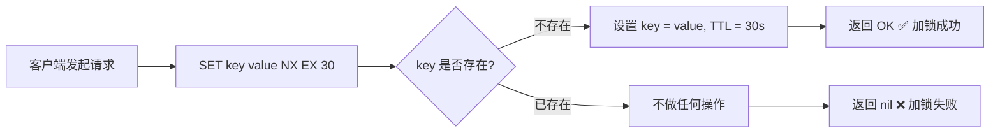
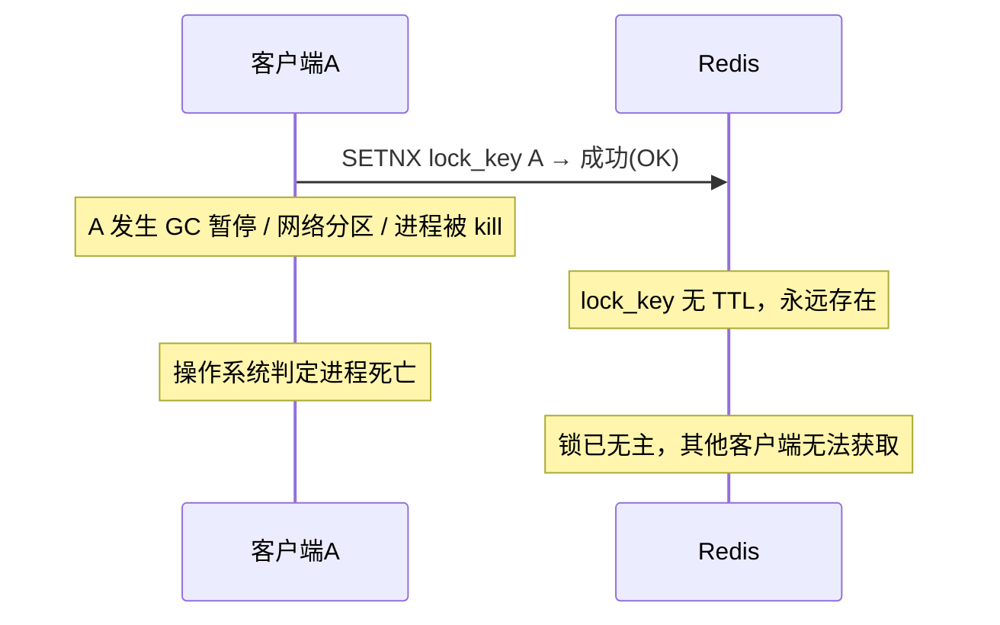
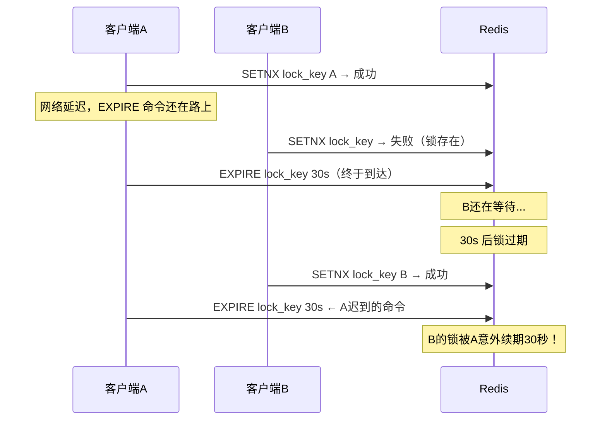
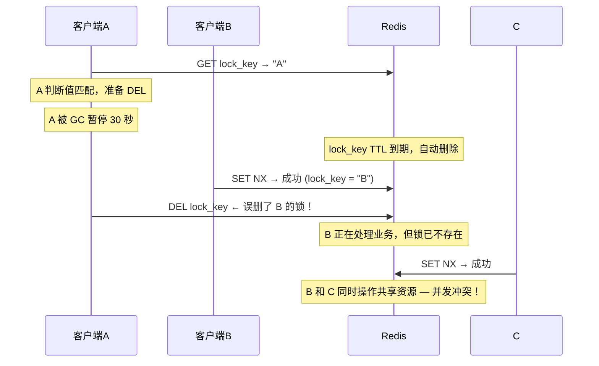
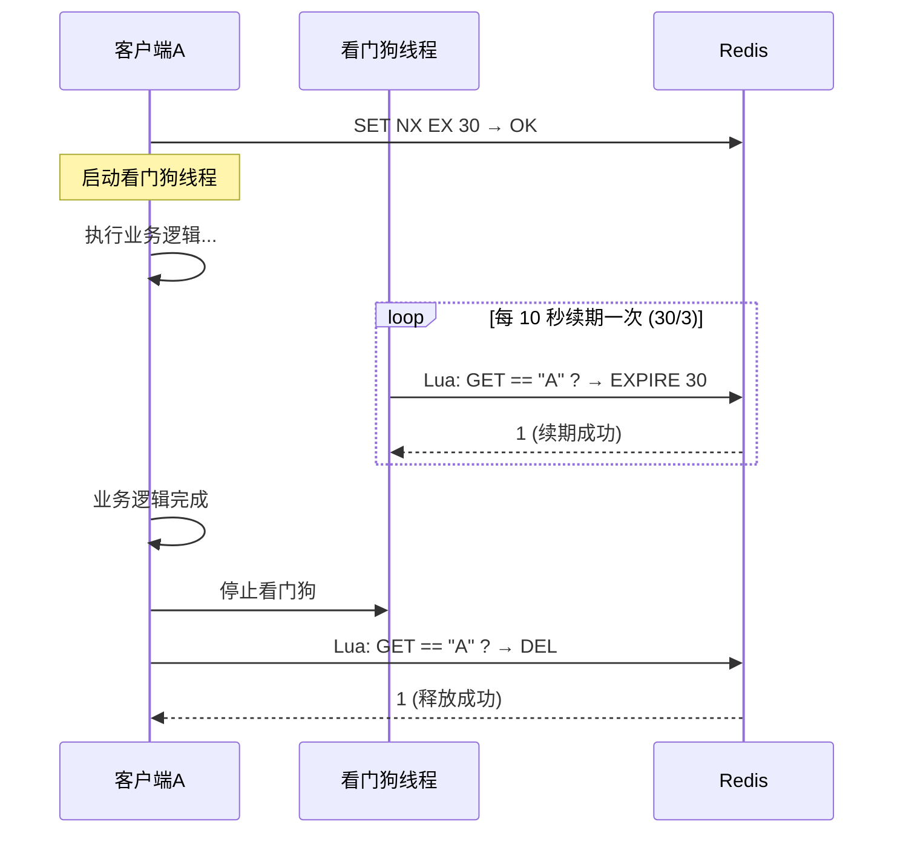
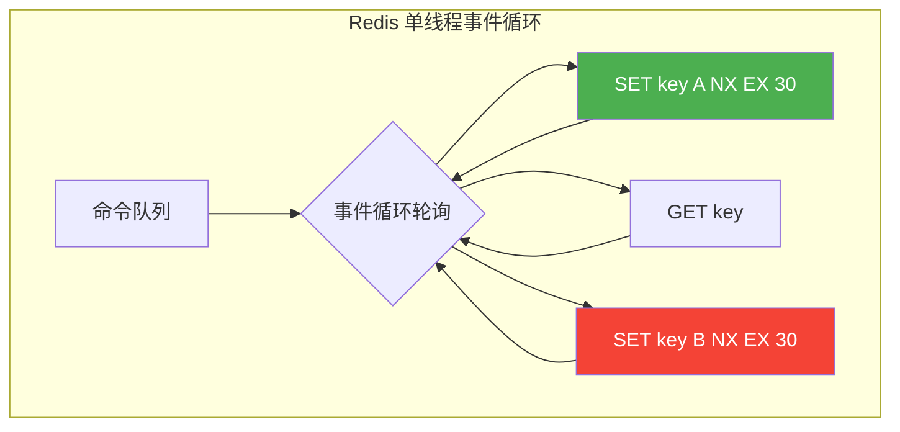

# 一、SET NX EX：Redis分布式锁的原子基石

> **本篇定位**：作为「核心技巧」篇的开篇，本文从 Redis 最底层的原子命令出发，完整构建一个生产可用的分布式锁。理解了 SET NX EX 的原子性原理，才能看懂后续 Lua 脚本扩展（第二篇）和 Redlock 多节点方案（第三篇）的设计动机。

## 1. 为什么是 SET NX EX

在分布式系统中，多个进程运行在不同的物理机器上，传统单机环境中的互斥锁（如 Java 的 `synchronized`、Python 的 `threading.Lock`）无法跨进程生效。我们需要一种能在多个独立节点之间协调互斥访问的机制——这就是分布式锁。

Redis 凭借其极高的性能（单实例 10 万+ QPS）和简洁的数据模型，成为实现分布式锁最广泛的选择。而 `SET key value NX EX seconds` 命令，正是 Redis 分布式锁最底层、最核心的原子操作。



这条命令在一次调用中同时完成三件事：

| 操作 | 命令参数 | 作用 |
|------|----------|------|
| 互斥检查 | `NX`（Not eXists） | 仅当 key 不存在时才设置，实现"抢锁"语义 |
| 设置值 | `value` 参数 | 存储锁持有者的唯一标识，用于安全释放 |
| 设置过期 | `EX seconds` | 指定锁的自动过期时间，防止客户端崩溃后死锁 |

三者合为一条原子命令，由 Redis 的单线程事件循环保证执行期间不会被其他命令打断——这正是 SET NX EX 的核心价值所在。

---

## 2. 从两步操作到原子命令：一段血泪史

### 2.1 早期的两步操作方案

在 Redis 2.6.12 之前，`SET` 命令不支持 `NX` 和 `EX` 参数。开发者只能用两条命令组合实现分布式锁：

```bash
# 第一步：设置锁（仅当不存在时）
SETNX lock_key unique_value

# 第二步：设置过期时间
EXPIRE lock_key 30
```

### 2.2 致命的竞态条件

这两条命令之间存在一个无法弥合的时间窗口。考虑以下两种典型时序：

**场景一：客户端崩溃，锁永不过期**



**场景二：EXPIRE 操作迟到，误续期**



在第二种场景中，客户端 B 持有锁，但 TTL 被客户端 A 迟到的 EXPIRE 命令延长了。这意味着 B 的锁可能远超预期时间，而 A 误以为自己仍然持有锁。

### 2.3 SET NX EX 的原子性彻底解决了这个问题

Redis 2.6.12 引入了 `SET` 命令的扩展参数，支持在一条命令中完成 NX 检查、值设置和 EX 设置。由于 Redis 是单线程模型，这条命令的执行是完全原子的——中间不会插入任何其他命令，从根本上消除了两步操作的竞态窗口。

```bash
# 一条命令，原子完成加锁
SET lock_key unique_value NX EX 30
```

如果命令返回 `OK`，表示加锁成功；返回 `nil`，表示锁已被其他客户端持有。

---

## 3. 命令参数深度解析

### 3.1 完整语法

SET key value [NX | XX] [EX seconds | PX milliseconds] [EXAT timestamp | PXAT ms-timestamp] [KEEPTTL]

与分布式锁相关的参数组合：

| 参数 | 含义 | 锁场景用途 |
|------|------|-----------|
| `NX` | 仅当 key 不存在时设置 | 实现互斥——"抢锁" |
| `EX seconds` | 设置过期时间（秒） | 防止客户端崩溃后死锁 |
| `PX milliseconds` | 设置过期时间（毫秒） | 需要更精细的过期控制时使用 |
| `XX` | 仅当 key 已存在时设置 | 不用于加锁，可用于续期 |
| `EXAT timestamp` | 设置 Unix 时间戳过期 | 需要精确控制过期时刻时使用 |
| `KEEPTTL` | 保留 key 现有 TTL | 更新 value 时不改变过期时间 |

### 3.2 NX vs XX：互斥与续期的对称设计

- **NX**（Not eXists）：仅在 key 不存在时执行 SET。这是加锁操作的核心——只有当前没有锁持有者时才能获取锁。
- **XX**（eXists）：仅在 key 已存在时执行 SET。可用于锁的续期操作——只有自己持有时才刷新 TTL。

```bash
# 加锁
SET lock_key "client-A-uuid" NX EX 30
# → OK（加锁成功）或 nil（锁已被持有）

# 续期（仅当锁仍是自己的时候）
SET lock_key "client-A-uuid" XX EX 30
# → OK（续期成功）或 nil（锁已被其他人持有或已过期）
```

注意：续期场景中 value 必须与加锁时一致，配合 `XX` 可以在一次原子操作中完成"身份验证+续期"。不过更安全的做法是使用 Lua 脚本（见[第二篇](../02-二Lua脚本.md)），因为 `XX` 只保证 key 存在，不验证 value 是否是自己的——如果锁过期后被他人获取，`XX` 会把新持有者的锁覆盖为自己的 value，造成双重持有。

### 3.3 EX vs PX：时间精度选择

- `EX`：过期时间以秒为单位，精度 1 秒。大多数场景足够。
- `PX`：过期时间以毫秒为单位，精度 1 毫秒。适用于对锁持有时间要求极精确的场景（如高频交易撮合引擎）。

```bash
# 秒级精度（默认选择）
SET lock_key "uuid" NX EX 30

# 毫秒级精度
SET lock_key "uuid" NX PX 30000
```

实际选择建议：绝大多数业务场景使用 `EX`（秒级）即可。毫秒级精度在分布式环境下意义有限，因为网络延迟本身就可能达到毫秒级，用 `PX` 带来的精度提升会被网络抖动抵消。

### 3.4 value 的设计：锁持有者的身份标识

value 是锁持有者的唯一标识，必须满足两个条件：

1. **全局唯一**：不同客户端的 value 绝不相同，否则会出现误释放
2. **可验证**：释放锁时能确认"这是不是我的锁"

推荐使用 UUID v4：

```python
import uuid

identifier = str(uuid.uuid4())
# 例如："a3f8b2c1-4d5e-6f78-9a0b-c1d2e3f4a5b6"
```

**为什么不用随机字符串？**

UUID v4 有 122 位随机性（2^122 种可能），碰撞概率在宇宙年龄内可以忽略。而简单的随机数或时间戳+进程 ID 组合在高并发场景下可能重复。

**为什么不存客户端 IP + 端口？**

虽然直观，但存在以下问题：

- 容器化环境下 IP 可能重复（Docker overlay 网络中多个容器共享同一虚拟 IP）
- 端口可能被复用（端口回收机制）
- 进程重启后标识变化，导致无法识别"这是之前的自己"

**进阶方案：结构化 value**

对于需要更多上下文的场景，可以将 value 设计为结构化数据：

```python
import json, uuid, os

identifier = json.dumps({
    "id": str(uuid.uuid4()),
    "host": os.uname().nodename,
    "pid": os.getpid(),
    "service": "order-service",
    "acquired_at": time.time()
})
```

这样在调试时可以直接从 Redis 中读取 value，快速定位锁的持有者。但要注意：结构化 value 会增加锁的存储开销，且释放时的比较逻辑不变。

---

## 4. 完整的加锁与释放实现

### 4.1 基础加锁

```python
import uuid
import time
import redis


class RedisDistributedLock:
    """基于 SET NX EX 的 Redis 分布式锁"""

    def __init__(self, client: redis.Redis, lock_key: str, expire_seconds: int = 30):
        self.client = client
        self.lock_key = lock_key
        self.expire_seconds = expire_seconds
        self.identifier = None

    def acquire(self, blocking: bool = True, timeout: float = -1) -> bool:
        """
        获取锁

        Args:
            blocking: 是否阻塞等待
            timeout: 最大等待时间（秒），-1 表示无限等待

        Returns:
            是否成功获取锁
        """
        identifier = str(uuid.uuid4())
        start_time = time.monotonic()

        while True:
            # 核心操作：SET NX EX 原子加锁
            result = self.client.set(
                self.lock_key,
                identifier,
                nx=True,
                ex=self.expire_seconds
            )

            if result:
                self.identifier = identifier
                return True

            if not blocking:
                return False

            # 检查是否超时
            if timeout >= 0:
                elapsed = time.monotonic() - start_time
                if elapsed >= timeout:
                    return False

            # 退避等待，避免空转占用 CPU
            time.sleep(0.01)

    def release(self) -> bool:
        """释放锁（使用 Lua 脚本保证原子性）"""
        if not self.identifier:
            return False

        # 必须用 Lua 脚本：先比较再删除，原子执行
        script = """
        if redis.call("GET", KEYS[1]) == ARGV[1] then
            return redis.call("DEL", KEYS[1])
        else
            return 0
        end
        """
        result = self.client.eval(script, 1, self.lock_key, self.identifier)
        return result == 1

    # 支持 with 语句，确保异常时也能释放锁
    def __enter__(self):
        if not self.acquire():
            raise TimeoutError(f"无法获取锁: {self.lock_key}")
        return self

    def __exit__(self, exc_type, exc_val, exc_tb):
        self.release()
        return False  # 不吞掉异常
```

### 4.2 使用示例

**方式一：手动管理锁生命周期**

```python
import redis

client = redis.Redis(host='localhost', port=6379, db=0)

lock = RedisDistributedLock(client, "order_lock:12345", expire_seconds=30)

if lock.acquire(blocking=True, timeout=5):
    try:
        # 执行需要互斥保护的业务逻辑
        process_order(12345)
    finally:
        lock.release()
else:
    print("获取锁超时，跳过本次操作")
```

**方式二：使用上下文管理器（推荐）**

```python
lock = RedisDistributedLock(client, "order_lock:12345", expire_seconds=30)

try:
    with lock:
        process_order(12345)
except TimeoutError:
    print("获取锁超时，跳过本次操作")
except Exception:
    # 即使业务异常，锁也会在 finally 中释放
    raise
```

### 4.3 关键代码解读

**`nx=True`**：对应 Redis 命令的 NX 参数。只有当 `order_lock:12345` 这个 key 不存在时，SET 才会成功。这是互斥性的根基。

**`ex=self.expire_seconds`**：设置锁的自动过期时间。即使持有锁的进程崩溃，锁也会在指定时间后自动释放，不会造成永久死锁。

**`identifier = str(uuid.uuid4())`**：每次加锁生成全新的 UUID 作为身份标识。这个值存入 Redis，释放锁时用来验证身份。

**释放锁使用 Lua 脚本**：不能用 GET + DEL 两步操作（见下文详细分析），必须用 Lua 脚本保证"比较+删除"的原子性。

---

## 5. 释放锁为什么必须用 Lua 脚本

这是 SET NX EX 分布式锁中第二个至关重要的技术点。

### 5.1 错误做法：GET + DEL 两步操作

```python
# ❌ 绝对不要这样做
def unsafe_release(client, lock_key, identifier):
    current_value = client.get(lock_key)
    if current_value == identifier:
        client.delete(lock_key)
```

### 5.2 竞态条件复现



A 在 T2 已经确认值匹配，但在 T5 执行 DEL 时，锁已经过期并被 B 获取。A 的 DEL 操作误删了 B 的锁，破坏了互斥性。

**核心问题**：GET 和 DEL 是两条独立的命令，在它们之间存在时间窗口。锁的 value 虽然"看起来"是自己的，但在执行 DEL 的那一刻，它可能已经不属于你了。

### 5.3 Lua 脚本的原子性保证

```lua
if redis.call("GET", KEYS[1]) == ARGV[1] then
    return redis.call("DEL", KEYS[1])
else
    return 0
end
```

Redis 执行 Lua 脚本时采用单线程原子执行模式——脚本执行期间不会有其他命令插入。这意味着"GET 检查值 → DEL 删除 key"这两个操作在逻辑上是不可分割的。如果在脚本执行期间锁过期并被 B 获取，A 的 GET 返回的将是 B 的值，比较失败，DEL 不会执行。

### 5.4 完整的释放锁实现

```python
RELEASE_LOCK_SCRIPT = """
if redis.call("GET", KEYS[1]) == ARGV[1] then
    return redis.call("DEL", KEYS[1])
else
    return 0
end
"""

def release_lock(client: redis.Redis, lock_key: str, identifier: str) -> bool:
    """原子地检查持有者身份并释放锁"""
    result = client.eval(RELEASE_LOCK_SCRIPT, 1, lock_key, identifier)
    return result == 1
```

`client.eval(script, 1, lock_key, identifier)` 的参数含义：

- `script`：Lua 脚本内容
- `1`：KEYS 数量（这里只有 1 个 key）
- `lock_key`：KEYS[1] 的值
- `identifier`：ARGV[1] 的值

> **关于 `EVAL` 的 KEYS 和 ARGV 分离设计**：Redis 强制将 key 和参数分开传递，是因为 Redis Cluster 根据 KEYS 决定将脚本路由到哪个节点。如果把 key 放在 ARGV 里，Cluster 模式下脚本会被路由到错误的节点执行。虽然单实例模式下不敏感，但养成这个习惯在迁移到集群时不会踩坑。

---

## 6. 锁续期：EXPIRE 与看门狗

### 6.1 两难困境

SET NX EX 的过期时间设置面临一个根本性矛盾：

| 过期时间太短 | 过期时间太长 |
|-------------|-------------|
| 业务还没执行完，锁就过期了 | 客户端崩溃后，其他客户端需要等很久才能获取锁 |
| 其他客户端获取锁，造成并发冲突 | 系统恢复速度变慢，影响可用性 |

例如：业务操作平均耗时 2 秒，偶尔因网络抖动需要 5 秒，极少数情况需要 10 秒。过期时间设为 3 秒会频繁出问题，设为 30 秒则崩溃后恢复太慢。

**量化分析**：假设业务 P99 耗时为 5 秒，如果将过期时间设为 30 秒（为安全起见留 6 倍余量），那么客户端崩溃后，其他客户端需要平均等待 15 秒（锁剩余 TTL 的期望值）才能获取锁。在高可用场景下，15 秒的不可用窗口是不可接受的。

### 6.2 看门狗（Watchdog）机制

Redisson 框架首创的看门狗机制是解决这一困境的标准方案。



核心思想：

1. 客户端获取锁后，启动一个后台线程
2. 后台线程每隔 `过期时间 / 3` 的时间检查锁是否仍被自己持有
3. 如果锁仍在，使用 `EXPIRE` 重新设置完整的过期时间
4. 客户端正常完成后释放锁，看门狗停止
5. 客户端崩溃后看门狗随之终止，锁最终过期自动释放

```python
import threading


class LockWatchdog:
    """分布式锁看门狗：自动续期防止锁提前过期"""

    def __init__(self, client, lock_key: str, identifier: str, expire_seconds: int = 30):
        self.client = client
        self.lock_key = lock_key
        self.identifier = identifier
        self.expire_seconds = expire_seconds
        self._stop_event = threading.Event()
        self._thread = None

        # 续期间隔 = 过期时间 / 3（与 Redisson 一致）
        self._interval = expire_seconds / 3

        # 续期 Lua 脚本：原子性地"验证身份 + 刷新 TTL"
        self._extend_script = """
        if redis.call("GET", KEYS[1]) == ARGV[1] then
            return redis.call("EXPIRE", KEYS[1], ARGV[2])
        else
            return 0
        end
        """

    def start(self):
        """启动看门狗后台线程"""
        self._thread = threading.Thread(
            target=self._run, daemon=True, name="lock-watchdog"
        )
        self._thread.start()

    def _run(self):
        """看门狗主循环：定期续期"""
        while not self._stop_event.wait(self._interval):
            result = self.client.eval(
                self._extend_script, 1,
                self.lock_key, self.identifier, self.expire_seconds
            )
            if not result:
                # 锁已不再属于自己（可能已过期或被其他客户端获取），停止续期
                break

    def stop(self):
        """停止看门狗"""
        self._stop_event.set()
        if self._thread:
            self._thread.join(timeout=1)
```

### 6.3 为什么续期也要用 Lua 脚本

续期操作同样需要"先验证身份再刷新 TTL"的原子性保证。如果用 GET + EXPIRE 两步操作，可能出现：

T1  GET lock_key → "A"（锁确实是自己的）
T2  （此时锁刚好过期，B 获取了锁）
T3  EXPIRE lock_key 30  ← 把 B 的锁续期了！

Lua 脚本通过原子执行避免了这种竞态。在 Lua 脚本执行期间，Redis 不会处理其他命令，所以 GET 到的值和后续操作是强一致的。

### 6.4 看门狗的参数选择

| 参数 | 默认值 | 说明 |
|------|--------|------|
| 续期间隔 | expire_seconds / 3 | Redisson 默认值，在及时续期和减少开销之间平衡 |
| 续期失败处理 | 立即停止 | 锁已丢失，继续续期无意义 |
| 线程类型 | daemon 线程 | 主进程退出时自动终止，不阻止 JVM 退出 |

为什么是 1/3 而不是 1/2 或 1/4？

- **1/2**：续期间隔太长，极端情况下（如网络延迟）可能来不及续期就过期
- **1/4**：续期太频繁，增加 Redis 负载
- **1/3**：在续期及时性和开销之间取得最佳平衡。即使一次续期失败，还有 2/3 的时间窗口进行重试

### 6.5 看门狗的失败模式分析

看门狗并非万能，理解它的失败边界同样重要：

| 失败场景 | 发生条件 | 后果 | 应对 |
|---------|---------|------|------|
| 网络分区 | 客户端与 Redis 之间网络中断 | 看门狗续期失败，锁过期 | 其他客户端获取锁，需配合幂等设计 |
| GC 长暂停 | JVM Full GC 超过续期间隔 | 看门狗线程被暂停，续期未及时发出 | 降低 GC 压力，使用 G1/ZGC |
| Redis 主从切换 | Sentinel 故障转移 | 主节点锁数据未同步到新主 | 考虑 Redlock（见[第三篇](../03-三Redlock算法.md)） |
| 看门狗线程异常 | 未捕获的异常导致线程退出 | 锁不再续期，可能提前过期 | 看门狗线程应有异常处理和自动重启机制 |

---

## 7. SET NX EX 的 Redis 内部实现

### 7.1 单线程模型与原子性

Redis 的核心事件循环运行在单线程中（Redis 6.0+ 虽引入多线程 I/O，但命令执行仍是单线程）。这意味着：

- 一条命令从开始执行到结束，不会被其他命令打断
- `SET key value NX EX 30` 在执行期间，其他客户端的任何命令都在等待队列中
- 这种"伪原子性"是 Redis 分布式锁方案简洁高效的根本原因



如图所示，A 和 B 的 SET NX EX 命令虽然几乎同时到达，但在事件循环中严格串行执行——这就是原子性的来源。

### 7.2 过期时间的惰性删除

Redis 的 key 过期采用惰性删除 + 定期删除策略：

- **惰性删除**：每次访问 key 时检查是否过期，过期则删除
- **定期删除**：Redis 每 100 毫秒随机抽取一批设置了过期时间的 key，删除其中已过期的 key

这意味着锁的过期不是精确到毫秒的，可能存在微小的延迟（通常在 100 毫秒以内）。在绝大多数业务场景中，这个延迟可以忽略不计。但在极端严格的场景下需要考虑这个因素。

### 7.3 持久化对锁的影响

Redis 的 RDB 快照是某一时刻的全量数据转储。如果在快照期间锁 key 被设置了但还没写入磁盘，Redis 崩溃重启后这个锁会丢失。AOF 持久化虽然更安全，但 `appendfsync everysec` 配置下仍可能丢失最多 1 秒的数据。

**实际影响**：在 Redis 崩溃重启的极短时间内，可能有两个客户端同时持有"同一把锁"。这是 Redis 分布式锁与 ZooKeeper/etcd 等基于共识协议方案的根本差异。对于安全性要求极高的场景，需要配合 Fencing Token（见[第六篇](../06-本章小结.md)）来兜底。

---

## 8. Redis Cluster 下的 SET NX EX

### 8.1 单节点方案的局限

在 Redis Cluster 中，数据被分片到多个节点。如果将锁 key 放在 slot 100 上，那么只有 slot 100 的主节点负责该锁。当该主节点宕机、从节点提升为主节点时，如果异步复制尚未完成，锁数据就会丢失。

```mermaid
flowchart LR
    subgraph Cluster["Redis Cluster"]
        M1["主节点 A\nslot 0-5460"] --- S1["从节点 A'"]
        M2["主节点 B\nslot 5461-10922"] --- S2["从节点 B'"]
        M3["主节点 C\nslot 10923-16383"] --- S3["从节点 C'"]
    end

    C[客户端] -->|"SET lock_key NX EX"| M1
    Note right of M1: 锁 key 在 slot 100
    Note right of M1: 异步复制到 S1 有延迟
```

### 8.2 应对策略

**策略一：设置合适的超时时间**

将 `TIMEOUT` 参数设置为足够大的值，确保在主从切换期间，旧锁能自然过期。

**策略二：使用 Redlock 算法**

当一致性要求高于可用性时，使用 Redlock 在多个独立 Redis 实例上同时加锁（详见[第三篇](../03-三Redlock算法.md)）。

**策略三：锁 key 强制路由**

使用 `{lock_key}` 的 hash tag 语法，确保相关锁 key 落在同一 slot：

```bash
# 所有关联的锁 key 都会落在同一个 slot
SET "{order}:lock:12345" "uuid" NX EX 30
SET "{order}:state:12345" "processing" NX EX 30
```

---

## 9. 性能基准与调优

### 9.1 SET NX EX 的性能特征

在标准硬件上，单个 Redis 实例执行 SET NX EX 的延迟约为 0.1-0.5 毫秒（取决于网络往返时间）。以下是典型的性能基准数据：

| 并发客户端数 | 单次加锁平均延迟 | 吞吐量（QPS） | 锁竞争率 |
|-------------|-----------------|--------------|---------|
| 1 | 0.1ms | ~100,000 | 0% |
| 10 | 0.2ms | ~50,000 | 15% |
| 100 | 1.5ms | ~8,000 | 65% |
| 1000 | 8ms | ~1,500 | 92% |

**关键洞察**：当并发客户端数超过 100 时，锁竞争率急剧上升，大量时间花在等待和重试上。这是分布式锁的固有局限——它本质上是将并行操作串行化。如果锁竞争率持续超过 50%，应考虑重构业务逻辑，将大锁拆分为多个小锁（见下文策略一）。

### 9.2 减少锁竞争的策略

**策略一：缩小锁粒度**

# 粗粒度（差）—— 所有订单操作竞争同一把锁
SET "order_lock" "uuid" NX EX 30

# 细粒度（好）—— 每个订单独立的锁
SET "order_lock:12345" "uuid" NX EX 30

锁粒度从"全局锁"缩小到"资源锁"，竞争者的数量从所有订单操作者降低为单个订单的操作者。

**策略二：减少锁持有时间**

```python
# ❌ 差：在锁内执行耗时操作
with distributed_lock(client, "my_lock"):
    result = call_slow_api()           # 500ms
    save_to_database(result)           # 200ms
    send_notification(result)          # 300ms
    # 锁持有时间：1000ms

# ✓ 好：只在必要时持有锁
result = call_slow_api()               # 不需要锁
with distributed_lock(client, "my_lock"):
    save_to_database(result)           # 只保护数据库写入：200ms
send_notification(result)              # 不需要锁
# 锁持有时间：200ms
```

**原则**：锁只保护"共享资源的临界区操作"，不包含任何 I/O 密集型或外部调用操作。

**策略三：使用重试退避策略**

```python
import random


def acquire_with_backoff(client, lock_key, identifier, expire_seconds=30,
                         max_retries=5, base_delay=0.01):
    """带指数退避和随机抖动的锁获取"""
    for attempt in range(max_retries):
        result = client.set(lock_key, identifier, nx=True, ex=expire_seconds)
        if result:
            return True

        # 指数退避 + 随机抖动，避免多个客户端同时重试
        delay = base_delay * (2 ** attempt) + random.uniform(0, base_delay)
        time.sleep(delay)

    return False
```

指数退避的核心思想：每次重试等待的时间翻倍，加上随机抖动（jitter），避免多个客户端在同一时刻"撞车"。

### 9.3 连接池配置

高并发场景下，Redis 连接池的配置直接影响分布式锁的性能：

```python
pool = redis.ConnectionPool(
    host='localhost',
    port=6379,
    db=0,
    max_connections=100,       # 最大连接数，应大于预期并发量
    socket_timeout=1,         # 命令执行超时（秒）
    socket_connect_timeout=1, # 连接建立超时（秒）
    retry_on_timeout=True,    # 超时时自动重试
)

client = redis.Redis(connection_pool=pool)
```

---

## 10. 常见错误与避坑指南

### 错误一：加锁后忘记设置过期时间

```python
# ❌ 危险：如果客户端崩溃，锁永远无法释放
client.set(lock_key, identifier, nx=True)

# ✓ 安全：SET NX EX 一步完成
client.set(lock_key, identifier, nx=True, ex=30)
```

### 错误二：用普通 DEL 释放锁

```python
# ❌ 危险：可能误删其他客户端的锁
client.delete(lock_key)

# ✓ 安全：Lua 脚本原子地验证身份后再删除
client.eval(RELEASE_SCRIPT, 1, lock_key, identifier)
```

### 错误三：用过期时间代替业务逻辑的正确性保障

```python
# ❌ 错误思路："锁过期30秒，我的操作只需要20秒，肯定没问题"
with distributed_lock(client, "my_lock", expire_seconds=30):
    call_external_api()  # 外部API响应时间不可控！可能要60秒
```

外部 API 的响应时间、网络延迟、GC 暂停都是不可预测的。过期时间的设置应该基于"最坏情况下的最大耗时"，并配合看门狗续期来应对不确定性。

### 错误四：在锁内执行阻塞操作

```python
# ❌ 在锁内执行用户交互或长时间等待
with distributed_lock(client, "my_lock"):
    wait_for_user_input()           # 用户可能1小时后才响应
    process_user_response()
```

锁应该只保护真正的临界区代码（共享资源的读写），不包含任何 I/O 阻塞或用户交互。

### 错误五：不处理加锁失败的情况

```python
# ❌ 加锁失败后静默跳过
identifier = client.set(lock_key, identifier, nx=True, ex=30)
if not identifier:
    pass  # 什么都没做，业务逻辑被跳过了
```

加锁失败应该有明确的处理策略：重试、返回错误、记录日志、触发告警。静默跳过会导致数据不一致且难以排查。

### 错误六：释放锁后继续使用旧的 identifier

```python
# ❌ 危险：释放锁后 identifier 仍存在，可能导致后续误操作
lock.release()
# lock.identifier 仍然是旧值
do_something_with(lock.identifier)  # 可能导致逻辑错误
```

释放锁后应将 identifier 置为 None，防止后续代码误用已失效的身份标识。

---

## 11. SET NX EX 与其他锁方案的对比

### 11.1 与 SETNX + EXPIRE 的对比

| 维度 | SETNX + EXPIRE（两步） | SET NX EX（原子） |
|------|----------------------|------------------|
| 原子性 | ❌ 不原子 | ✅ 原子 |
| 死锁风险 | ⚠️ 客户端崩溃后可能死锁 | ✅ 自动过期释放 |
| Redis 版本要求 | 任意版本 | ≥ 2.6.12 |
| 适用性 | 仅限遗留系统 | 所有新项目 |

### 11.2 与 Redlock 的对比

| 维度 | 单节点 SET NX EX | Redlock |
|------|-----------------|---------|
| 一致性 | 主从切换时可能丢锁 | 多节点保障，更安全 |
| 性能 | 极高（单次 RTT） | 较低（需访问 N 个节点） |
| 复杂度 | 简单 | 复杂 |
| 适用场景 | 大多数业务场景 | 安全性要求极高的场景 |

### 11.3 与 ZooKeeper 锁的对比

| 维度 | Redis SET NX EX | ZooKeeper 临时顺序节点 |
|------|----------------|---------------------|
| 实现复杂度 | 简单（一条命令） | 较复杂（创建节点 + Watcher） |
| 公平性 | 非公平（需额外实现） | 天然公平（FIFO 队列） |
| 一致性 | 最终一致 | 强一致 |
| 性能 | 高 | 中等 |
| 自动清理 | TTL 过期 | 会话结束自动删除 |
| 适用场景 | 高性能、可接受短暂不一致 | 强一致性、公平性要求高 |

---

## 12. 生产环境检查清单

在将基于 SET NX EX 的分布式锁部署到生产环境之前，逐项确认：

- [ ] **使用 SET NX EX 一条命令加锁**，不用 SETNX + EXPIRE 两步操作
- [ ] **value 使用 UUID v4**，保证全局唯一且可验证
- [ ] **释放锁使用 Lua 脚本**，先比较 value 再 DEL，原子执行
- [ ] **过期时间有兜底**，覆盖最坏情况下的最大业务耗时
- [ ] **看门狗续期已实现**（如果业务耗时不确定）
- [ ] **加锁失败有处理策略**（重试 / 降级 / 告警）
- [ ] **锁操作有监控**（获取成功率、持有时间、竞争次数）
- [ ] **已模拟测试**：客户端崩溃后锁能自动释放、并发场景下互斥性正确
- [ ] **Redis 持久化策略已评估**：RDB/AOF 的数据丢失风险是否可接受
- [ ] **Cluster 模式下已确认**：主从切换时的锁安全性是否有兜底方案

---

## 13. 本节小结

SET NX EX 是 Redis 分布式锁的原子基石，一条命令同时完成互斥检查、身份标识和自动过期三个关键操作。它的简洁高效得益于 Redis 的单线程模型，但也正是这种简洁容易让人忽视其中的陷阱：

1. **加锁必须原子**：SET NX EX 一条命令完成，不用两步操作
2. **释放必须安全**：Lua 脚本先验证身份再删除，防止误释放
3. **过期必须合理**：配合看门狗续期，应对不确定的业务耗时
4. **身份必须唯一**：UUID v4 作为 value，不可重复

掌握了这些原则，你就拥有了构建可靠 Redis 分布式锁的基础。在此之上，Lua 脚本（[第二篇](../02-二Lua脚本.md)）提供了更灵活的锁操作原子性保证，Redlock 算法（[第三篇](../03-三Redlock算法.md)）则在多节点场景下提供了更强的一致性保障。
