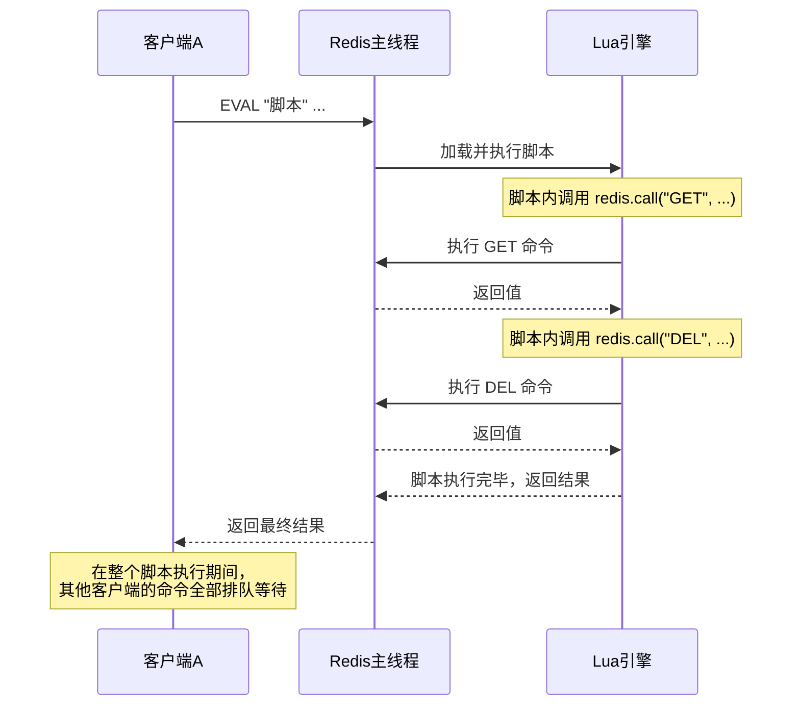

# 二、Lua脚本：Redis分布式锁的原子性引擎

在上一篇中，我们看到 `SET NX EX` 解决了加锁的原子性问题，而释放锁和续期操作却面临一个严峻挑战：Redis 没有原生的"先检查再操作"原子命令。`GET` + `DEL` 两步操作之间存在致命的竞态窗口。

Lua 脚本是 Redis 官方提供的解决方案——它允许我们将多条 Redis 命令打包为一个原子执行单元，从根本上消除竞态条件。本篇将从 Redis Lua 引擎的底层原理出发，系统讲解 Lua 脚本在分布式锁中的核心应用、高级模式和工程实践。

---

## 1. 为什么需要 Lua 脚本

### 1.1 Redis 命令的原子性边界

Redis 的每条命令都是原子的，但多条命令的组合不是。分布式锁的释放和续期操作都涉及"条件判断 + 数据修改"的复合逻辑，单条命令无法完成：

| 操作 | 需要的逻辑 | 单条命令能否实现 |
|------|-----------|:---:|
| 释放锁 | 检查持有者身份 → 删除 key | ❌ |
| 续期锁 | 检查持有者身份 → 刷新 TTL | ❌ |
| 可重入加锁 | 检查是否已持有 → 增加计数/首次设置 | ❌ |
| 公平排队锁 | 检查队列状态 → 插入/删除节点 | ❌ |

### 1.2 MULTI/EXEC 为什么不够

Redis 的事务机制 `MULTI/EXEC` 看似能打包多条命令，但它有一个根本缺陷：**事务中的命令无法根据前一条命令的结果做条件分支**。

```bash
# MULTI/EXEC 事务：无法实现条件逻辑
MULTI
GET lock_key          # 结果在 EXEC 之前不可用
DEL lock_key          # 无论 GET 返回什么，都会执行 DEL
EXEC
```

MULTI/EXEC 将所有命令先入队、再一起执行，命令之间没有数据依赖。而 Lua 脚本可以在执行过程中读取 GET 的返回值、做 if/else 判断、根据结果决定是否执行 DEL——这是事务无法做到的。

### 1.3 Lua 脚本的核心优势

| 特性 | MULTI/EXEC 事务 | Lua 脚本 |
|------|:---:|:---:|
| 原子执行 | ✅ | ✅ |
| 条件分支 | ❌ | ✅ |
| 循环逻辑 | ❌ | ✅ |
| 调用其他 Redis 命令 | ❌（入队后统一执行） | ✅（实时调用） |
| 复杂数据处理 | ❌ | ✅ |
| 错误处理 | 仅 EXEC 折断 | 细粒度 pcall |

---

## 2. Redis Lua 引擎原理

### 2.1 执行模型：单线程原子性

Redis 从 2.6.0 开始内置 Lua 解释器（基于 Lua 5.1）。当执行 Lua 脚本时，Redis 的事件循环会完全让出给 Lua 引擎——脚本执行期间，**没有任何其他客户端命令能够插入执行**。



这种原子性不是通过锁实现的，而是因为 Redis 的命令执行本身就是单线程的——Lua 脚本作为一个整体占据了整个命令执行窗口。

### 2.2 EVAL 命令语法

EVAL script numkeys key [key ...] arg [arg ...]

| 参数 | 说明 |
|------|------|
| `script` | Lua 脚本源代码 |
| `numkeys` | KEYS 数组的长度 |
| `key [key ...]` | 传入脚本的 key 列表，通过 `KEYS[1]`, `KEYS[2]` 访问 |
| `arg [arg ...]` | 传入脚本的参数列表，通过 `ARGV[1]`, `ARGV[2]` 访问 |

```bash
# 示例：原子地检查并删除锁
EVAL "
if redis.call('GET', KEYS[1]) == ARGV[1] then
    return redis.call('DEL', KEYS[1])
else
    return 0
end
" 1 lock_key:order_123 "uuid-of-client-A"
#   ↑ numkeys=1      ↑ KEYS[1]           ↑ ARGV[1]
```

**KEYS 与 ARGV 的区别**：

- `KEYS`：代表 Redis 的 key（数据存储位置），在 Redis Cluster 模式下用于路由到正确的节点
- `ARGV`：代表普通的参数值，不参与路由计算

在单实例模式下两者功能相同，但在集群模式下必须正确区分——错误地将 key 放入 ARGV 会导致集群路由失败。

### 2.3 EVALSHA：脚本缓存与复用

每次发送完整的 Lua 脚本源码会浪费带宽。Redis 提供了 `EVALSHA` 命令，通过脚本的 SHA1 哈希值来执行已缓存的脚本：

```bash
# 第一步：加载脚本到 Redis 缓存，返回 SHA1
SCRIPT LOAD "
if redis.call('GET', KEYS[1]) == ARGV[1] then
    return redis.call('DEL', KEYS[1])
else
    return 0
end
"
# → "a42059b356c875f0717db19a51f6963c5e645be8"

# 第二步：通过 SHA1 执行（节省传输开销）
EVALSHA "a42059b356c875f0717db19a51f6963c5e645be8" 1 lock_key "uuid-A"
```

生产环境推荐的工作模式：

```python
import hashlib
import redis

class LuaScriptManager:
    """Lua 脚本缓存管理器：自动处理 EVALSHA 降级"""

    def __init__(self, client: redis.Redis):
        self.client = client
        self._cache = {}  # script_source -> sha1

    def _sha1(self, script: str) -> str:
        return hashlib.sha1(script.encode()).hexdigest()

    def register(self, name: str, script: str):
        """注册脚本并缓存到 Redis"""
        sha1 = self._sha1(script)
        # SCRIPT LOAD 会覆盖同名缓存
        self.client.script_load(script)
        self._cache[name] = sha1

    def execute(self, name: str, keys: list, args: list):
        """
        通过名称执行脚本。
        优先 EVALSHA（仅传输 SHA1），失败则降级为 EVAL（传输完整脚本）。
        """
        sha1 = self._cache.get(name)
        if not sha1:
            raise ValueError(f"Script '{name}' not registered")

        try:
            return self.client.evalsha(sha1, len(keys), *keys, *args)
        except redis.exceptions.NoScriptError:
            # 脚本缓存被淘汰（如 Redis 重启），重新加载
            # 这里需要持有原始脚本，实际使用中建议同时缓存源码
            raise
```

### 2.4 脚本执行的限制

Redis 对 Lua 脚本有一些硬性约束，生产环境中必须注意：

| 限制项 | 默认值 | 说明 |
|--------|--------|------|
| 执行超时 | 5 秒（`lua-time-limit`） | 超时后 Redis 会记录慢脚本日志，但不会中断执行 |
| 脚本缓存上限 | 内存决定 | `SCRIPT FLUSH` 可清除所有缓存 |
| 禁止的命令 | `KEYS`, `SPUBLISH`, `SUBSCRIBE` 等 | 阻塞命令在脚本中被禁止，防止阻塞整个 Redis |
| 输出限制 | 无硬性限制 | 但应避免脚本返回过大数据集 |

```bash
# 查看和修改脚本超时配置
CONFIG GET lua-time-limit    # 默认 5000（毫秒）
CONFIG SET lua-time-limit 10000  # 改为 10 秒
```

**最佳实践**：Lua 脚本应保持简短精练，执行时间控制在 1 毫秒以内。分布式锁相关的脚本通常只有 3-5 条 Redis 命令，远不会触及超时限制。

---

## 3. 分布式锁的四大核心 Lua 脚本

### 3.1 安全释放锁

这是分布式锁中最基础也最关键的 Lua 脚本——"验证身份 + 删除 key"的原子操作：

```lua
-- safe_release.lua
-- 原子释放锁：仅当持有者匹配时才删除
-- KEYS[1] = 锁的 key
-- ARGV[1] = 持有者标识（UUID）
-- 返回: 1=释放成功, 0=不是自己的锁

if redis.call("GET", KEYS[1]) == ARGV[1] then
    return redis.call("DEL", KEYS[1])
else
    return 0
end
```

**为什么 GET + DEL 必须原子执行**：在上一篇的竞态条件分析中，我们已经看到 GET 和 DEL 之间如果存在时间窗口，客户端 A 可能在确认值匹配后、执行 DEL 前经历 GC 暂停，导致锁过期后被 B 获取，而 A 的 DEL 误删了 B 的锁。Lua 脚本将这两个操作绑定为不可分割的原子单元，彻底消除了这个竞态窗口。

**更安全的变体——用 Compare-And-Swap 替代 GET + DEL**：

```lua
-- safe_release_cas.lua
-- 使用 KEYS 模式匹配验证，防止 key 被重新分配到其他槽
if redis.call("GET", KEYS[1]) == ARGV[1] then
    return redis.call("DEL", KEYS[1])
else
    -- 锁不存在或已被其他人持有
    return 0
end
```

### 3.2 原子续期锁

续期操作需要"验证身份 + 刷新 TTL"的原子性，否则可能出现给别人的锁续期的竞态：

```lua
-- safe_extend.lua
-- 原子续期锁：仅当持有者匹配时才刷新 TTL
-- KEYS[1] = 锁的 key
-- ARGV[1] = 持有者标识（UUID）
-- ARGV[2] = 新的过期时间（秒）
-- 返回: 1=续期成功, 0=锁已丢失

if redis.call("GET", KEYS[1]) == ARGV[1] then
    return redis.call("EXPIRE", KEYS[1], ARGV[2])
else
    return 0
end
```

**毫秒精度版本**（用于对时间敏感的场景）：

```lua
-- safe_extend_ms.lua
-- 毫秒级续期
if redis.call("GET", KEYS[1]) == ARGV[1] then
    return redis.call("PEXPIRE", KEYS[1], ARGV[2])
else
    return 0
end
```

### 3.3 原子获取锁（带自动清理）

标准的 `SET NX EX` 加锁本身已经是原子的，但在某些高级场景中，我们需要在加锁时同时做一些额外的原子操作，比如检查并清理过期的辅助数据：

```lua
-- acquire_with_cleanup.lua
-- 加锁时同时清理关联的看门狗续期记录
-- KEYS[1] = 锁的 key
-- KEYS[2] = 续期记录的 key
-- ARGV[1] = 持有者标识
-- ARGV[2] = 过期时间（秒）
-- 返回: 1=加锁成功, 0=锁已被持有

local result = redis.call("SET", KEYS[1], ARGV[1], "NX", "EX", ARGV[2])
if result then
    -- 加锁成功，清除旧的续期记录
    redis.call("DEL", KEYS[2])
    return 1
else
    return 0
end
```

### 3.4 原子释放锁（带延迟清理）

在某些场景中，释放锁后需要同时清理关联数据（如队列中的请求记录），Lua 脚本可以保证这些操作的原子性：

```lua
-- release_with_cleanup.lua
-- 释放锁并清理关联数据
-- KEYS[1] = 锁的 key
-- KEYS[2] = 关联数据的 key（如等待队列）
-- ARGV[1] = 持有者标识
-- 返回: 1=释放成功, 0=不是自己的锁

if redis.call("GET", KEYS[1]) == ARGV[1] then
    redis.call("DEL", KEYS[1])
    -- 同时清理关联数据
    if KEYS[2] then
        redis.call("DEL", KEYS[2])
    end
    return 1
else
    return 0
end
```

---

## 4. 高级 Lua 脚本模式

### 4.1 可重入锁（Reentrant Lock）

可重入锁允许同一个客户端多次获取同一把锁（常见于递归调用或嵌套同步场景）。核心思路是用 Hash 结构存储持有者和重入计数：

```lua
-- reentrant_acquire.lua
-- 可重入加锁
-- KEYS[1] = 锁的 key（Hash 类型）
-- ARGV[1] = 持有者标识
-- ARGV[2] = 过期时间（秒）
-- ARGV[3] = 重入计数增量（通常为 1）

local lock_key = KEYS[1]
local holder = ARGV[1]
local ttl = tonumber(ARGV[2])
local increment = tonumber(ARGV[3])

-- 检查锁是否已被持有
local current_holder = redis.call("HGET", lock_key, "holder")
if current_holder == holder then
    -- 已被自己持有，增加重入计数
    redis.call("HINCRBY", lock_key, "count", increment)
    redis.call("EXPIRE", lock_key, ttl)
    return 1
elseif current_holder then
    -- 被其他客户端持有
    return 0
else
    -- 锁空闲，首次获取
    redis.call("HSET", lock_key, "holder", holder, "count", 1)
    redis.call("EXPIRE", lock_key, ttl)
    return 1
end
```

```lua
-- reentrant_release.lua
-- 可重入释放锁
-- KEYS[1] = 锁的 key（Hash 类型）
-- ARGV[1] = 持有者标识
-- 返回: 2=完全释放, 1=减少计数但未完全释放, 0=不是自己的锁

local lock_key = KEYS[1]
local holder = ARGV[1]

local current_holder = redis.call("HGET", lock_key, "holder")
if current_holder ~= holder then
    return 0
end

local count = redis.call("HINCRBY", lock_key, "count", -1)
if count <= 0 then
    -- 计数归零，完全释放
    redis.call("DEL", lock_key)
    return 2
else
    -- 还有重入层级，保留锁
    return 1
end
```

```lua
-- reentrant_extend.lua
-- 可重入锁续期
-- 仅当自己持有时才续期
-- KEYS[1] = 锁的 key（Hash 类型）
-- ARGV[1] = 持有者标识
-- ARGV[2] = 新的过期时间（秒）

local lock_key = KEYS[1]
local holder = ARGV[1]
local ttl = tonumber(ARGV[2])

if redis.call("HGET", lock_key, "holder") == holder then
    return redis.call("EXPIRE", lock_key, ttl)
else
    return 0
end
```

**可重入锁的完整 Python 实现**：

```python
import uuid
import threading
import redis


class ReentrantRedisLock:
    """基于 Lua 脚本的可重入 Redis 分布式锁"""

    def __init__(self, client: redis.Redis, lock_key: str, ttl: int = 30):
        self.client = client
        self.lock_key = f"reentrant_lock:{lock_key}"
        self.ttl = ttl
        self.identifier = str(uuid.uuid4())
        self._local_count = 0  # 本地重入计数（线程级）
        self._local_lock = threading.Lock()
        self._watchdog = None

        # 预注册 Lua 脚本
        self._acquire_script = """
        local current = redis.call("HGET", KEYS[1], "holder")
        if current == ARGV[1] then
            redis.call("HINCRBY", KEYS[1], "count", 1)
            redis.call("EXPIRE", KEYS[1], ARGV[2])
            return 1
        elseif current then
            return 0
        else
            redis.call("HSET", KEYS[1], "holder", ARGV[1], "count", 1)
            redis.call("EXPIRE", KEYS[1], ARGV[2])
            return 1
        end
        """
        self._release_script = """
        if redis.call("HGET", KEYS[1], "holder") ~= ARGV[1] then
            return 0
        end
        local count = redis.call("HINCRBY", KEYS[1], "count", -1)
        if count <= 0 then
            redis.call("DEL", KEYS[1])
            return 2
        else
            return 1
        end
        """

    def acquire(self, blocking=True, timeout=-1):
        import time
        start = time.monotonic()

        while True:
            with self._local_lock:
                result = self.client.eval(
                    self._acquire_script, 1,
                    self.lock_key, self.identifier, self.ttl
                )
                if result:
                    self._local_count += 1
                    return True

                if not blocking:
                    return False
                if timeout >= 0 and (time.monotonic() - start) >= timeout:
                    return False

            time.sleep(0.01)

    def release(self):
        with self._local_lock:
            if self._local_count <= 0:
                raise RuntimeError("Cannot release lock not held by this thread")

            result = self.client.eval(
                self._release_script, 1,
                self.lock_key, self.identifier
            )
            self._local_count -= 1
            return result >= 1
```

**可重入锁的锁结构对比**：

普通锁（String）:
  lock_key → "uuid-A"  (TTL=30s)

可重入锁（Hash）:
  reentrant_lock:order → {
      "holder": "uuid-A",
      "count": 3          ← 重入了 3 次
  }  (TTL=30s)

### 4.2 公平锁（FIFO Queue）

标准的 Redis 分布式锁是不公平的——所有等待者同时竞争，没有先来先服务的保证。通过 Lua 脚本和 Sorted Set 可以实现公平排队：

```lua
-- fair_acquire.lua
-- 公平锁获取：按请求时间排序，仅允许队首客户端获取锁
-- KEYS[1] = 锁的 key
-- KEYS[2] = 等待队列（Sorted Set，score=请求时间戳）
-- ARGV[1] = 持有者标识
-- ARGV[2] = 过期时间（秒）
-- ARGV[3] = 请求时间戳（毫秒）
-- ARGV[4] = 队列超时时间（秒）
-- 返回: 1=获取成功, 0=排队中, -1=排队超时

local lock_key = KEYS[1]
local queue_key = KEYS[2]
local holder = ARGV[1]
local ttl = tonumber(ARGV[2])
local timestamp = ARGV[3]
local queue_timeout = tonumber(ARGV[4])

-- 检查锁是否空闲
if redis.call("EXISTS", lock_key) == 0 then
    -- 锁空闲，直接获取
    redis.call("SET", lock_key, holder, "EX", ttl)
    return 1
end

-- 锁被占用，加入等待队列
redis.call("ZADD", queue_key, timestamp, holder)

-- 检查自己是否在队首
local first = redis.call("ZRANGE", queue_key, 0, 0, "WITHSCORES")
if first and first[1] == holder then
    -- 我是队首，检查锁是否即将过期（允许提前接管）
    local ttl_remaining = redis.call("TTL", lock_key)
    if ttl_remaining <= 1 then
        -- 锁即将过期，等待释放后获取
        redis.call("DEL", lock_key)
        redis.call("SET", lock_key, holder, "EX", ttl)
        redis.call("ZREM", queue_key, holder)
        return 1
    end
    return 0  -- 还在等锁过期
else
    -- 不是队首，检查排队是否超时
    local my_score = redis.call("ZSCORE", queue_key, holder)
    if my_score then
        local now = tonumber(redis.call("TIME")[1]) * 1000
                       + tonumber(redis.call("TIME")[2]) / 1000
        if (now - tonumber(my_score)) / 1000 > queue_timeout then
            -- 排队超时，移除自己
            redis.call("ZREM", queue_key, holder)
            return -1
        end
    end
    return 0
end
```

```lua
-- fair_release.lua
-- 公平锁释放：释放锁并通知队首等待者
-- KEYS[1] = 锁的 key
-- KEYS[2] = 等待队列（Sorted Set）
-- ARGV[1] = 持有者标识
-- 返回: 1=释放成功, 0=不是自己的锁

if redis.call("GET", KEYS[1]) == ARGV[1] then
    redis.call("DEL", KEYS[1])
    -- 移除自己在队列中的记录
    redis.call("ZREM", KEYS[2], ARGV[1])
    return 1
else
    return 0
end
```

**公平锁的等待队列可视化**：

Sorted Set (wait_queue:order_123):
  score=1000  → "client-A"    ← 队首，下一个获取锁
  score=1005  → "client-B"
  score=1012  → "client-C"    ← 队尾

### 4.3 读写锁

在读多写少的场景中，读写锁允许多个读操作并发执行，但写操作需要独占：

```lua
-- rw_acquire_read.lua
-- 获取读锁（共享锁）
-- KEYS[1] = 读锁计数 key
-- KEYS[2] = 写锁 key
-- ARGV[1 = 读锁持有者标识
-- ARGV[2] = 过期时间（秒）
-- 返回: 1=获取成功, 0=被写锁阻塞

-- 检查是否有写锁
if redis.call("EXISTS", KEYS[2]) == 1 then
    return 0
end

-- 增加读锁计数
redis.call("HINCRBY", KEYS[1], "count", 1)
redis.call("HSET", KEYS[1], ARGV[1], 1)
redis.call("EXPIRE", KEYS[1], ARGV[2])
return 1
```

```lua
-- rw_acquire_write.lua
-- 获取写锁（排他锁）
-- KEYS[1] = 读锁计数 key
-- KEYS[2] = 写锁 key
-- ARGV[1] = 写锁持有者标识
-- ARGV[2] = 过期时间（秒）
-- 返回: 1=获取成功, 0=被读锁或写锁阻塞

-- 检查是否有写锁
if redis.call("EXISTS", KEYS[2]) == 1 then
    return 0
end

-- 检查是否有读锁
local read_count = redis.call("HGET", KEYS[1], "count")
if read_count and tonumber(read_count) > 0 then
    return 0
end

-- 获取写锁
redis.call("SET", KEYS[2], ARGV[1], "EX", ARGV[2])
return 1
```

```lua
-- rw_release_read.lua
-- 释放读锁
-- KEYS[1] = 读锁计数 key
-- ARGV[1] = 读锁持有者标识
-- 返回: 1=释放成功, 0=不是自己的读锁

if redis.call("HGET", KEYS[1], ARGV[1]) then
    redis.call("HDEL", KEYS[1], ARGV[1])
    local count = redis.call("HINCRBY", KEYS[1], "count", -1)
    if count <= 0 then
        redis.call("DEL", KEYS[1])
    end
    return 1
else
    return 0
end
```

```lua
-- rw_release_write.lua
-- 释放写锁（与普通锁释放相同）
if redis.call("GET", KEYS[1]) == ARGV[1] then
    return redis.call("DEL", KEYS[1])
else
    return 0
end
```

### 4.4 自旋锁（Spin Lock with Backoff）

在高竞争场景中，简单的重试循环会导致 Redis 负载飙升。通过 Lua 脚本实现带指数退避的原子自旋：

```lua
-- spin_acquire.lua
-- 自旋获取锁：失败时返回等待时间，客户端据此退避
-- KEYS[1] = 锁的 key
-- ARGV[1] = 持有者标识
-- ARGV[2] = 过期时间（秒）
-- ARGV[3] = 最大重试次数
-- 返回: 1=获取成功, 0=获取失败（需要重试）, -1=超过最大重试

local lock_key = KEYS[1]
local holder = ARGV[1]
local ttl = tonumber(ARGV[2])
local max_retries = tonumber(ARGV[3])

-- 尝试获取锁
local result = redis.call("SET", lock_key, holder, "NX", "EX", ttl)
if result then
    return 1
end

-- 获取失败，检查锁的剩余 TTL，返回给客户端用于退避计算
local remaining_ttl = redis.call("TTL", lock_key)
if remaining_ttl <= 0 then
    -- 锁刚过期，立即重试
    result = redis.call("SET", lock_key, holder, "EX", ttl)
    if result then
        return 1
    end
end

return 0
```

---

## 5. 脚本调试与错误处理

### 5.1 常见 Lua 错误类型

| 错误类型 | 示例 | 原因 | 解决方案 |
|---------|------|------|---------|
| `ERR wrong number of arguments` | EVAL 脚本时 KEYS/ARGV 数量不匹配 | numkeys 参数错误 | 检查 EVAL 的 numkeys 参数 |
| `ERR bad lua script` | 语法错误 | Lua 语法问题 | 在本地用 lua 解释器测试 |
| `ERR script tried to access undefined global` | 使用了未定义的变量 | 变量名拼写错误 | 严格使用局部变量 |
| `redis.call() error` | 调用了不存在的 Redis 命令 | 命令名拼写错误 | 查阅 Redis 命令参考 |

### 5.2 错误处理模式

Lua 脚本中的错误会导致整个脚本终止并返回错误。使用 `pcall` 可以捕获错误，实现优雅降级：

```lua
-- 带错误处理的释放锁脚本
local ok, result = pcall(function()
    if redis.call("GET", KEYS[1]) == ARGV[1] then
        return redis.call("DEL", KEYS[1])
    else
        return 0
    end
end)

if ok then
    return result
else
    -- 脚本执行出错，记录日志但不抛出异常
    redis.log(redis.LOG_WARNING, "Lock release error: " .. tostring(result))
    return -1
end
```

### 5.3 本地调试技巧

在将 Lua 脚本部署到 Redis 之前，可以使用本地 Lua 解释器进行基础语法检查：

```bash
# 安装 Lua 解释器
sudo apt-get install lua5.1

# 创建 mock redis 库用于本地测试
cat > /tmp/redis_mock.lua << 'EOF'
redis = {
    call = function(cmd, ...)
        io.write("REDIS CALL: " .. cmd .. "\n")
        local args = {...}
        for _, v in ipairs(args) do
            io.write("  ARG: " .. tostring(v) .. "\n")
        end
        return "OK"  -- mock 返回值
    end,
    LOG_WARNING = 2,
    log = function(level, msg)
        io.write("LOG [" .. level .. "]: " .. msg .. "\n")
    end
}
EOF

# 在脚本开头引入 mock，然后测试
lua -e '
dofile("/tmp/redis_mock.lua")
KEYS = {"lock_key:order_123"}
ARGV = {"uuid-A"}
if redis.call("GET", KEYS[1]) == ARGV[1] then
    print("Would delete lock")
else
    print("Not my lock")
end
'
```

### 5.4 使用 redis-cli 测试脚本

```bash
# 方法一：直接在 redis-cli 中执行 Lua
redis-cli EVAL "
if redis.call('GET', KEYS[1]) == ARGV[1] then
    return redis.call('DEL', KEYS[1])
else
    return 0
end
" 1 my_lock "my-uuid"

# 方法二：从文件加载脚本
cat > /tmp/release_lock.lua << 'EOF'
if redis.call("GET", KEYS[1]) == ARGV[1] then
    return redis.call("DEL", KEYS[1])
else
    return 0
end
EOF

redis-cli EVAL "$(cat /tmp/release_lock.lua)" 1 my_lock "my-uuid"

# 方法三：SCRIPT LOAD + EVALSHA
redis-cli SCRIPT LOAD "$(cat /tmp/release_lock.lua)"
# → SHA1 哈希值
redis-cli EVALSHA <sha1> 1 my_lock "my-uuid"
```

---

## 6. 生产环境的 Lua 脚本管理

### 6.1 脚本注册中心

在大型项目中，多个分布式锁使用不同的 Lua 脚本。建议建立统一的脚本管理机制：

```python
import hashlib
import redis
from typing import Dict, Optional


class DistributedLockScripts:
    """分布式锁 Lua 脚本注册中心"""

    SCRIPTS: Dict[str, str] = {
        "safe_release": """
            if redis.call("GET", KEYS[1]) == ARGV[1] then
                return redis.call("DEL", KEYS[1])
            else
                return 0
            end
        """,

        "safe_extend": """
            if redis.call("GET", KEYS[1]) == ARGV[1] then
                return redis.call("EXPIRE", KEYS[1], ARGV[2])
            else
                return 0
            end
        """,

        "safe_extend_ms": """
            if redis.call("GET", KEYS[1]) == ARGV[1] then
                return redis.call("PEXPIRE", KEYS[1], ARGV[2])
            else
                return 0
            end
        """,

        "reentrant_acquire": """
            local current = redis.call("HGET", KEYS[1], "holder")
            if current == ARGV[1] then
                redis.call("HINCRBY", KEYS[1], "count", 1)
                redis.call("EXPIRE", KEYS[1], ARGV[2])
                return 1
            elseif current then
                return 0
            else
                redis.call("HSET", KEYS[1], "holder", ARGV[1], "count", 1)
                redis.call("EXPIRE", KEYS[1], ARGV[2])
                return 1
            end
        """,

        "reentrant_release": """
            if redis.call("HGET", KEYS[1], "holder") ~= ARGV[1] then
                return 0
            end
            local count = redis.call("HINCRBY", KEYS[1], "count", -1)
            if count <= 0 then
                redis.call("DEL", KEYS[1])
                return 2
            else
                return 1
            end
        """,
    }

    def __init__(self, client: redis.Redis):
        self.client = client
        self._sha_map: Dict[str, str] = {}
        self._loaded = False

    def load_all(self):
        """启动时将所有脚本加载到 Redis"""
        for name, script in self.SCRIPTS.items():
            sha1 = self.client.script_load(script.strip())
            self._sha_map[name] = sha1
        self._loaded = True

    def run(self, script_name: str, keys: list, args: list):
        """执行指定脚本，自动处理 EVALSHA 降级"""
        if not self._loaded:
            self.load_all()

        sha1 = self._sha_map.get(script_name)
        if not sha1:
            raise ValueError(f"Unknown script: {script_name}")

        try:
            return self.client.evalsha(sha1, len(keys), *keys, *args)
        except redis.exceptions.NoScriptError:
            # 缓存丢失，重新加载并重试
            script = self.SCRIPTS[script_name]
            sha1 = self.client.script_load(script.strip())
            self._sha_map[script_name] = sha1
            return self.client.evalsha(sha1, len(keys), *keys, *args)
```

### 6.2 脚本版本管理

当 Lua 脚本需要修改时（如修复 bug、优化逻辑），必须考虑兼容性问题：

版本管理策略：

v1.0:  初始版本
v1.1:  修复续期竞态
v2.0:  重构为可重入锁

每个版本保留原始脚本源码和 SHA1 哈希，支持灰度切换：
  - 新客户端使用 v2.0
  - 老客户端仍可使用 v1.0（SHA1 仍在缓存中）
  - 确认所有客户端迁移后，清理旧版本

### 6.3 监控与告警

```python
import time
import logging

logger = logging.getLogger(__name__)


class ScriptMonitor:
    """Lua 脚本执行监控"""

    def __init__(self, client: redis.Redis):
        self.client = client
        self._slow_threshold_ms = 1.0  # 超过 1ms 记为慢脚本

    def monitored_eval(self, script_name: str, script: str,
                       keys: list, args: list):
        """带监控的脚本执行"""
        start = time.perf_counter()
        try:
            result = self.client.eval(script, len(keys), *keys, *args)
            elapsed_ms = (time.perf_counter() - start) * 1000

            if elapsed_ms > self._slow_threshold_ms:
                logger.warning(
                    f"Slow Lua script '{script_name}': "
                    f"{elapsed_ms:.2f}ms (threshold: {self._slow_threshold_ms}ms)"
                )

            return result

        except Exception as e:
            elapsed_ms = (time.perf_counter() - start) * 1000
            logger.error(
                f"Lua script '{script_name}' failed after {elapsed_ms:.2f}ms: {e}"
            )
            raise
```

---

## 7. 性能基准与优化

### 7.1 Lua 脚本 vs 多命令的性能对比

| 场景 | 多条独立命令 | Lua 脚本 | 性能差异 |
|------|:---:|:---:|:---:|
| 释放锁（GET+DEL） | ~0.3ms（2次网络往返） | ~0.15ms（1次网络往返） | **快 2x** |
| 续期锁（GET+EXPIRE） | ~0.3ms | ~0.15ms | **快 2x** |
| 可重入加锁（HGET+HSET+EXPIRE） | ~0.5ms（3次往返） | ~0.15ms（1次往返） | **快 3x** |
| 公平锁获取（EXISTS+ZADD+ZRANGE） | ~0.6ms（4次往返） | ~0.15ms（1次往返） | **快 4x** |

Lua 脚本的性能优势主要来自两个方面：
1. **减少网络往返**：多条命令打包为一次网络传输
2. **原子性无需额外同步**：不需要应用层的锁或事务开销

### 7.2 优化策略

**策略一：保持脚本简短**

```lua
-- ✅ 好：简洁高效的脚本
if redis.call("GET", KEYS[1]) == ARGV[1] then
    return redis.call("DEL", KEYS[1])
else
    return 0
end

-- ❌ 差：不必要的复杂逻辑
local val = redis.call("GET", KEYS[1])
if val == false then
    redis.log(redis.LOG_WARNING, "Key not found: " .. KEYS[1])
    local exists = redis.call("EXISTS", KEYS[1])
    if exists == 1 then
        local ttl = redis.call("TTL", KEYS[1])
        redis.log(redis.LOG_WARNING, "Key exists with TTL: " .. ttl)
    end
    return -1
elseif val == ARGV[1] then
    local del_result = redis.call("DEL", KEYS[1])
    return del_result
else
    redis.log(redis.LOG_WARNING, "Value mismatch")
    return 0
end
```

**策略二：批量操作合并**

```lua
-- 批量释放多个锁（单次网络往返释放 N 把锁）
-- KEYS = [lock1, lock2, lock3, ...]
-- ARGV[1] = 持有者标识
local released = 0
for i = 1, #KEYS do
    if redis.call("GET", KEYS[i]) == ARGV[1] then
        redis.call("DEL", KEYS[i])
        released = released + 1
    end
end
return released
```

**策略三：避免不必要的数据读取**

```lua
-- ✅ 好：直接用 SET NX EX，一次命令完成
-- （不需要 Lua 脚本）
SET lock_key "uuid" NX EX 30

-- ❌ 差：用 Lua 脚本做 SET NX EX 能做的事
redis.call("EXISTS", KEYS[1])  -- 多余的 EXISTS 检查
redis.call("SET", KEYS[1], ARGV[1], "NX", "EX", ARGV[2])
```

---

## 8. 常见误区与陷阱

### 8.1 误区一：Lua 脚本能防止 Redis 主从切换丢锁

**错误认知**：Lua 脚本保证了原子性，所以分布式锁是安全的。

**事实**：Lua 脚本只保证单个 Redis 实例上的原子执行。如果 Redis 发生主从切换，Lua 脚本执行的结果（包括锁数据）可能因异步复制而丢失。Lua 脚本解决的是命令级别的竞态，不是节点级别的可用性。

### 8.2 误区二：EVAL 和 EVALSHA 有功能差异

**错误认知**：EVAL 执行完整脚本，EVALSHA 只执行缓存版本，功能不同。

**事实**：两者功能完全等价。EVALSHA 只是通过 SHA1 引用已缓存的脚本，减少了网络传输的数据量。如果 SHA1 对应的脚本不在缓存中，EVALSHA 会返回 `NOSCRIPT` 错误——此时需要降级为 EVAL 重新发送完整脚本。

### 8.3 误区三：脚本中的变量是全局的

**错误认知**：在 EVAL 中定义的变量在多次调用间保持状态。

**事实**：每次 EVAL 调用都是独立执行的，脚本中定义的局部变量不会在调用间保持。Lua 脚本是无状态的——如果你需要跨调用的状态管理，必须使用 Redis 的数据结构（String、Hash、List 等）来存储。

### 8.4 误区四：脚本越长功能越强

**错误认知**：把所有逻辑都写在一个 Lua 脚本里可以获得更多原子性保证。

**事实**：过长的脚本会占用 Redis 主线程过长时间，阻塞其他所有客户端的请求。Redis 官方建议脚本执行时间控制在几毫秒以内。应该将复杂的业务逻辑放在应用层，只将必须原子执行的最小操作集合放入 Lua 脚本。

### 8.5 误区五：KEYS 和 ARGV 可以互换

**错误认知**：KEYS 和 ARGV 只是命名不同，用哪个都一样。

**事实**：在 Redis Cluster 中，EVAL/EVALSHA 会根据 KEYS 列表来决定脚本应该在哪个节点上执行。如果把实际的 key 放入 ARGV，集群会将其路由到错误的节点，导致脚本操作的数据不在本节点上。单实例模式下无此问题，但养成正确使用 KEYS/ARGV 的习惯很重要。

---

## 9. Lua 脚本与分布式锁的完整架构

将所有 Lua 脚本整合为一个完整的分布式锁系统：

```python
import uuid
import time
import threading
import redis
from typing import Optional


class LuaBasedDistributedLock:
    """
    基于 Lua 脚本的生产级分布式锁

    支持特性：
    - 安全释放（身份验证原子化）
    - 原子续期（看门狗自动刷新）
    - 可重入（同一线程可多次获取）
    - 监控集成（执行耗时追踪）
    """

    def __init__(self, client: redis.Redis, lock_key: str,
                 ttl: int = 30, reentrant: bool = False):
        self.client = client
        self.lock_key = f"lock:{lock_key}"
        self.queue_key = f"lock_queue:{lock_key}"
        self.ttl = ttl
        self.reentrant = reentrant
        self.identifier = str(uuid.uuid4())
        self._reentrant_count = 0
        self._local_lock = threading.Lock()
        self._watchdog_thread: Optional[threading.Thread] = None
        self._watchdog_stop = threading.Event()

        # === Lua 脚本定义 ===
        if reentrant:
            self._acquire_script = """
            local cur = redis.call("HGET", KEYS[1], "holder")
            if cur == ARGV[1] then
                redis.call("HINCRBY", KEYS[1], "count", 1)
                redis.call("EXPIRE", KEYS[1], ARGV[2])
                return 1
            elseif cur then
                return 0
            else
                redis.call("HSET", KEYS[1], "holder", ARGV[1], "count", 1)
                redis.call("EXPIRE", KEYS[1], ARGV[2])
                return 1
            end
            """
            self._release_script = """
            if redis.call("HGET", KEYS[1], "holder") ~= ARGV[1] then
                return 0
            end
            local c = redis.call("HINCRBY", KEYS[1], "count", -1)
            if c <= 0 then
                redis.call("DEL", KEYS[1])
                return 2
            end
            return 1
            """
            self._extend_script = """
            if redis.call("HGET", KEYS[1], "holder") == ARGV[1] then
                return redis.call("EXPIRE", KEYS[1], ARGV[2])
            else
                return 0
            end
            """
        else:
            self._acquire_script = """
            if redis.call("SET", KEYS[1], ARGV[1], "NX", "EX", ARGV[2]) then
                return 1
            else
                return 0
            end
            """
            self._release_script = """
            if redis.call("GET", KEYS[1]) == ARGV[1] then
                return redis.call("DEL", KEYS[1])
            else
                return 0
            end
            """
            self._extend_script = """
            if redis.call("GET", KEYS[1]) == ARGV[1] then
                return redis.call("EXPIRE", KEYS[1], ARGV[2])
            else
                return 0
            end
            """

    def acquire(self, blocking: bool = True, timeout: float = -1,
                watchdog: bool = True) -> bool:
        """获取锁"""
        start = time.monotonic()

        while True:
            with self._local_lock:
                result = self.client.eval(
                    self._acquire_script, 1,
                    self.lock_key, self.identifier, self.ttl
                )
                if result:
                    if self.reentrant:
                        self._reentrant_count += 1
                    if watchdog and self._reentrant_count <= 1:
                        self._start_watchdog()
                    return True

            if not blocking:
                return False
            if timeout >= 0 and (time.monotonic() - start) >= timeout:
                return False

            time.sleep(0.01)

    def release(self) -> bool:
        """释放锁"""
        with self._local_lock:
            if self.reentrant and self._reentrant_count <= 0:
                raise RuntimeError("Lock not held by this thread")

            result = self.client.eval(
                self._release_script, 1,
                self.lock_key, self.identifier
            )

            if self.reentrant:
                self._reentrant_count -= 1
                if self._reentrant_count <= 0:
                    self._stop_watchdog()
            else:
                self._stop_watchdog()

            return result and result >= 1

    def extend(self) -> bool:
        """手动续期"""
        result = self.client.eval(
            self._extend_script, 1,
            self.lock_key, self.identifier, self.ttl
        )
        return bool(result)

    def _start_watchdog(self):
        """启动看门狗"""
        self._watchdog_stop.clear()
        interval = self.ttl / 3

        def _run():
            while not self._watchdog_stop.wait(interval):
                if not self.extend():
                    break  # 锁已丢失

        self._watchdog_thread = threading.Thread(
            target=_run, daemon=True, name="lock-watchdog"
        )
        self._watchdog_thread.start()

    def _stop_watchdog(self):
        """停止看门狗"""
        self._watchdog_stop.set()
        if self._watchdog_thread:
            self._watchdog_thread.join(timeout=1)
            self._watchdog_thread = None

    def __enter__(self):
        if not self.acquire():
            raise TimeoutError("Failed to acquire lock")
        return self

    def __exit__(self, *args):
        self.release()
```

---

## 10. 本节小结

Lua 脚本是 Redis 分布式锁安全性的最后一道防线。回顾本篇的核心要点：

| 知识点 | 核心结论 |
|--------|---------|
| 为什么需要 Lua | `GET + DEL` 两步操作存在竞态窗口，Lua 保证原子性 |
| EVAL vs EVALSHA | 功能等价，EVALSHA 减少网络传输，生产环境优先使用 |
| KEYS vs ARGV | KEYS 存放 Redis key（影响集群路由），ARGV 存放普通参数 |
| 脚本长度 | 保持精简（3-10 条 Redis 命令），避免阻塞主线程 |
| 可重入锁 | 用 Hash 替代 String，存储 holder + count |
| 公平锁 | 用 Sorted Set 实现 FIFO 排队 |
| 读写锁 | 读共享、写排他，用 Hash 计数 + String 排他 |
| 误区 | Lua 不能防止主从切换丢锁；KEYS/ARGV 不可互换 |

Lua 脚本将分布式锁从"基本可用"提升到了"生产可靠"。下一篇我们将探讨 Redlock 算法——当单节点 Redis 无法满足高可用需求时，如何通过多节点协作来增强锁的安全性。
