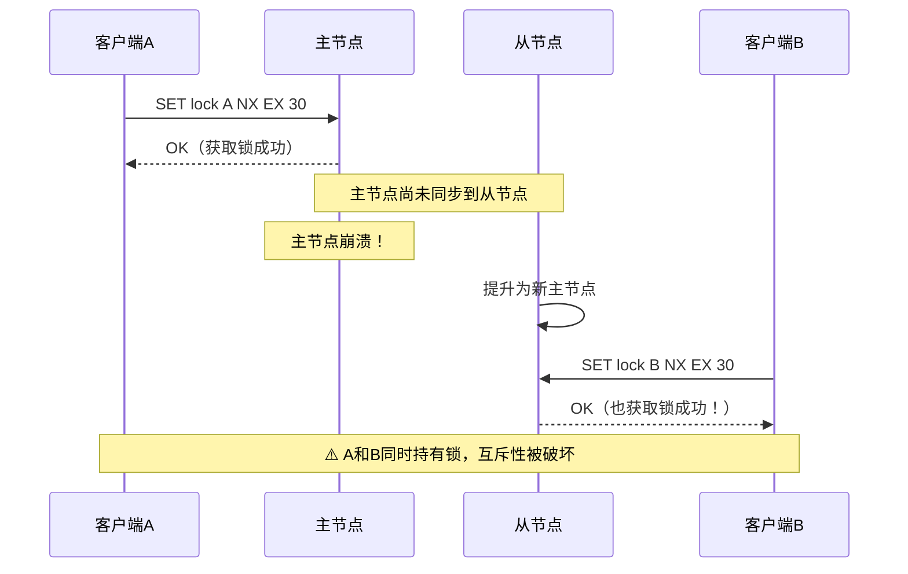
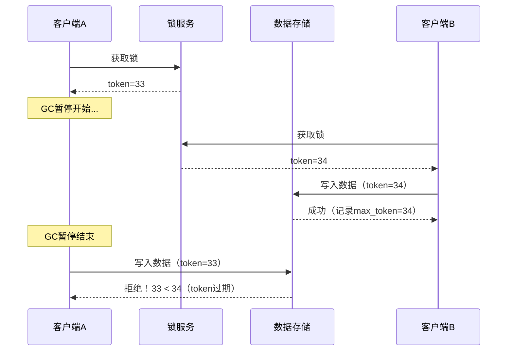
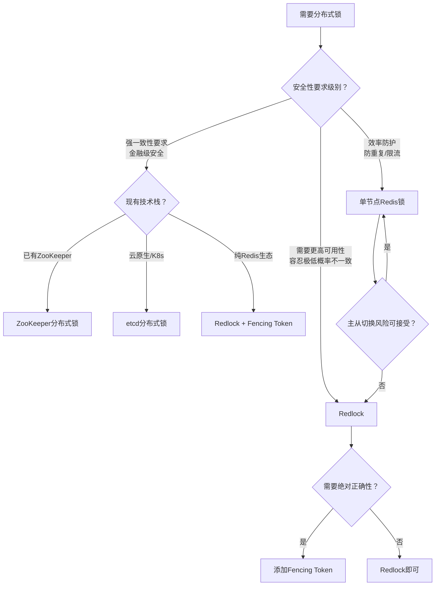

## Redlock算法：多节点Redis分布式锁的工程实践

> "在大多数场景下，单节点Redis锁已经足够；只有当你确实需要更高的可用性保证时，Redlock才值得考虑。" —— Antirez（Redis作者）

上一节我们介绍了基于单节点Redis的分布式锁，它简洁高效，但在生产环境中面临一个致命问题：**主从切换丢锁**。Redis主从复制是异步的，主节点崩溃后从节点提升为主，锁数据可能"消失"，导致两个客户端同时持有锁。Antirez提出的Redlock算法，正是在这个约束下寻找解决方案——通过在多个独立Redis实例上同时加锁，利用多数派投票来提升可靠性。

但这一方案在2016年引发了Martin Kleppmann与Antirez之间的经典论战，至今仍是分布式系统领域最具影响力的技术辩论之一。本节将完整剖析Redlock的原理、实现、争议和工程选型，帮助你在正确场景下做出正确决策。

### 1. 问题根源：单节点锁的致命缺陷

#### 1.1 主从切换丢锁场景

Redis主从复制采用异步机制：客户端在主节点写入锁数据后，主节点返回成功，然后才异步将数据同步到从节点。这个时间窗口内如果主节点崩溃，从节点提升为主节点，锁数据就"消失"了。

完整时序：

1. 客户端A在主节点执行 `SET lock_key A NX EX 30`，主节点返回OK
2. 主节点在将 `lock_key` 同步到从节点之前崩溃
3. 从节点提升为新主节点，`lock_key` 不存在
4. 客户端B在新主节点执行 `SET lock_key B NX EX 30`，也获得成功
5. 此时客户端A和B同时认为自己持有锁，互斥性被破坏



#### 1.2 为什么等待同步不可行

有人提出在获取锁后等待从节点同步完成再返回成功。但这带来两个严重问题：

- **性能退化**：每次加锁都要等待跨节点同步，延迟从亚毫秒级退化到毫秒级，高并发下吞吐量断崖式下降
- **仍不安全**：网络分区可能导致部分从节点未同步完成，只要有一个从节点提升为主，丢锁风险依然存在。更糟糕的是，等待同步本身也存在超时判定的灰色地带——同步超时后锁是否算获取成功？

根本矛盾在于：Redis主从复制的异步特性是其高性能的代价，无法在不牺牲性能的前提下通过等待同步解决。Redlock算法正是在这个约束下，通过改变架构（多独立实例替代主从复制）来寻找出路。

#### 1.3 Redis Cluster ≠ Redlock

这是一个常见混淆，必须明确区分：

| 维度 | Redis Cluster | Redlock |
|------|:---:|:---:|
| 本质 | Redis官方的分片方案 | 基于多个独立Redis实例的锁算法 |
| 数据分布 | key按slot分散到不同节点 | 每个实例持有完整的锁key副本 |
| 节点关系 | 主从复制，有数据同步 | 节点之间完全独立，无复制关系 |
| 一致性 | 异步复制，同主从架构 | 无复制，靠多数派投票 |
| 能否用于分布式锁 | 不能（主从异步复制问题依然存在） | 是Redlock的目标场景 |

**关键认知**：Redis Cluster解决的是数据分片和水平扩展问题，不解决主从切换时的锁丢失问题。不要因为用了Cluster就认为锁更安全了——Cluster内部每个主从组仍然存在异步复制的丢锁风险。

### 2. Redlock算法详解

#### 2.1 算法前提

Redlock算法需要N个独立的Redis实例（推荐N=5），这些实例必须满足：

- **完全独立**：每个实例之间没有主从关系，独立运行，不共享任何复制链路
- **物理隔离**：所有实例部署在不同的机器（或至少不同的故障域）上，避免同时宕机
- **时钟大致同步**：各实例的系统时钟误差在可接受范围内（通常通过NTP保持毫秒级同步）
- **网络可达**：客户端能同时访问所有实例（虽然允许个别实例暂时不可达）

#### 2.2 算法五步法

**第一步：获取当前时间（毫秒精度）**

```python
import time
start_time = int(time.time() * 1000)
```

记录起始时间戳，用于后续计算锁的有效时间窗口。这一步看似简单，却是Redlock正确性的关键——后续的"耗时小于TTL"判断完全依赖这个时间基准。

**第二步：依次向N个实例请求加锁**

使用相同的key、相同的随机value（UUID）和较短的超时时间（如5-50毫秒），快速尝试连接每个实例。超时时间设置较短是为了避免在某个故障节点上长时间阻塞——Redlock的安全性依赖于"快速失败"，而不是"死等"。

```python
def try_acquire_all(instances, lock_key, identifier, timeout_ms=50):
    """尝试在所有Redis实例上获取锁"""
    acquired = []
    for instance in instances:
        try:
            success = instance.set(
                lock_key, identifier, nx=True, ex=30,
                socket_timeout=timeout_ms / 1000.0
            )
            if success:
                acquired.append(instance)
        except Exception:
            # 连接失败（超时、拒绝连接、网络错误），跳过该节点
            continue
    return acquired
```

> **优化提示**：以上是串行实现，生产中建议并行发送请求（见4.2节），可将总延迟从 N×单次延迟 降低到 max(单次延迟)。

**第三步：计算获取锁消耗的时间**

```python
elapsed_ms = int(time.time() * 1000) - start_time
```

这个时间包含了网络延迟、服务端处理时间、以及可能的连接超时。Redlock要求这个总耗时必须小于锁的TTL，否则即使多数派投票通过，锁的"真实有效期"也已不足。

**第四步：判断是否获取锁成功**

成功条件（两个必须**同时**满足）：

- 在至少 **N/2+1** 个实例上成功获取锁（5节点需要至少3个，7节点需要至少4个）
- 获取锁消耗的**总时间**小于锁的过期时间（TTL）

```python
def evaluate_lock(acquired_count, total_instances, elapsed_ms, ttl_ms):
    """评估Redlock获取结果"""
    quorum = total_instances // 2 + 1
    time_valid = elapsed_ms < ttl_ms
    quorum_valid = acquired_count >= quorum

    if quorum_valid and time_valid:
        # 锁的有效时间 = TTL - 已消耗时间 - 时钟漂移容差
        validity = ttl_ms - elapsed_ms - drift(ttl_ms)
        return True, validity
    else:
        return False, 0

def drift(ttl_ms):
    """时钟漂移估算，Antirez建议取 TTL * 0.01 + 2ms

    例如 TTL=30000ms 时，drift = 302ms
    这意味着锁的实际有效期至少比理论值少302ms
    """
    return int(ttl_ms * 0.01) + 2
```

**为什么要减去时钟漂移？** 因为不同机器的系统时钟可能存在微小差异。假设客户端A的时钟比服务端快200ms，A认为锁还有10秒，实际上服务端可能已经在8秒前就过期了。drift()函数是对这种不确定性的保守估算。

**第五步：释放锁（无论成功与否）**

获取成功：在所有实例上释放锁（不只是成功获取的那几个），确保不留下"孤儿锁"。

获取失败：同样需要在所有实例上释放锁，因为在部分实例上可能已经成功获取了锁，必须清理干净。

释放时使用Lua脚本保证原子性——只删除自己持有的锁，不误删他人的锁：

```python
def release_all(instances, lock_key, identifier):
    """在所有实例上释放锁"""
    release_script = """
    if redis.call("GET", KEYS[1]) == ARGV[1] then
        return redis.call("DEL", KEYS[1])
    else
        return 0
    end
    """
    for instance in instances:
        try:
            instance.eval(release_script, 1, lock_key, identifier)
        except Exception:
            pass  # 释放失败不阻塞，TTL兜底过期
```

#### 2.3 算法的正确性直觉

Redlock为什么比单节点锁更安全？直觉上的解释：

主从切换丢锁的场景中，从节点提升为主节点后缺少锁数据。但如果锁同时存在于5个**独立**节点上，所有节点同时"丢失"锁数据的概率极低——5个独立节点中至少3个同时故障才能破坏互斥性。

用概率量化理解：

- 单节点：节点故障概率 P(failure) = 某个值，丢锁概率就是 P(failure)
- Redlock 5节点：丢锁概率 ≈ C(5,3) × P(failure)³（至少3个同时故障），如果 P(failure) = 0.01，丢锁概率 ≈ 0.00001，降低了1000倍

但这个论证有一个关键假设：**节点是独立的，故障是随机的**。如果存在系统性故障（机房断电、网络交换机故障、操作系统批量升级），所有节点可能同时受影响，Redlock同样无能为力。这就是为什么生产部署要求"不同的故障域"——不同机架、不同可用区、甚至不同云区域。

#### 2.4 完整的Redlock客户端实现

以下是一个生产级的Redlock客户端封装，包含完整的加锁、续期和释放逻辑：

```python
import time
import uuid
import threading
import logging
from typing import List, Optional, Tuple

logger = logging.getLogger(__name__)


class RedlockClient:
    """Redlock算法客户端实现

    特性：
    - 支持串行/并行加锁模式
    - 内置看门狗续期机制
    - 完整的重试与退避策略
    - 详细的指标采集接口
    """

    def __init__(self, instances: list, ttl_ms: int = 30000,
                 retry_count: int = 3, retry_delay_ms: int = 200,
                 quorum_timeout_ms: int = 50, parallel: bool = True):
        """
        Args:
            instances: Redis实例列表（redis-py连接对象）
            ttl_ms: 锁的过期时间（毫秒），建议设为业务最大执行时间的2-3倍
            retry_count: 获取失败后的重试次数（0=不重试）
            retry_delay_ms: 重试间隔基础值（毫秒），实际间隔随次数递增
            quorum_timeout_ms: 单个节点的连接超时（毫秒），建议5-50ms
            parallel: 是否并行向所有节点发送请求
        """
        self.instances = instances
        self.ttl_ms = ttl_ms
        self.retry_count = retry_count
        self.retry_delay_ms = retry_delay_ms
        self.quorum_timeout_ms = quorum_timeout_ms
        self.parallel = parallel

        # Lua脚本：原子性释放锁（只删自己持有的）
        self._release_script = """
        if redis.call("GET", KEYS[1]) == ARGV[1] then
            return redis.call("DEL", KEYS[1])
        else
            return 0
        end
        """
        # Lua脚本：原子性续期锁（验证持有权后延长TTL）
        self._extend_script = """
        if redis.call("GET", KEYS[1]) == ARGV[1] then
            return redis.call("PEXPIRE", KEYS[1], ARGV[2])
        else
            return 0
        end
        """

    def _drift(self) -> int:
        """计算时钟漂移容差（毫秒）

        Antirez公式：drift = TTL * 0.01 + 2ms
        用于扣除不确定的时钟偏差，确保返回的validity是保守下界
        """
        return int(self.ttl_ms * 0.01) + 2

    def _try_acquire_one(self, instance, key: str, value: str) -> bool:
        """尝试在单个实例上获取锁"""
        try:
            timeout_s = self.quorum_timeout_ms / 1000.0
            return bool(instance.set(
                key, value, nx=True, px=self.ttl_ms,
                socket_timeout=timeout_s
            ))
        except Exception as e:
            logger.warning(f"Failed to acquire on instance: {e}")
            return False

    def _try_acquire_parallel(self, key: str, value: str) -> int:
        """并行向所有实例请求加锁，返回成功数量"""
        import concurrent.futures

        acquired = 0
        timeout_s = self.quorum_timeout_ms / 1000.0

        with concurrent.futures.ThreadPoolExecutor(
            max_workers=len(self.instances)
        ) as executor:
            futures = {
                executor.submit(
                    self._try_acquire_one, inst, key, value
                ): inst
                for inst in self.instances
            }
            for future in concurrent.futures.as_completed(
                futures, timeout=timeout_s
            ):
                try:
                    if future.result():
                        acquired += 1
                except Exception:
                    pass
        return acquired

    def _try_acquire_sequential(self, key: str, value: str) -> int:
        """串行向所有实例请求加锁，返回成功数量"""
        acquired = 0
        for instance in self.instances:
            if self._try_acquire_one(instance, key, value):
                acquired += 1
        return acquired

    def acquire(self, key: str) -> Optional[Tuple[str, int, int]]:
        """
        获取Redlock分布式锁。

        Returns:
            (identifier, validity_ms, acquired_count) 或 None
            - identifier: 锁的唯一标识，释放和续期时必须传入
            - validity_ms: 锁的有效时间（毫秒），业务应在此时间内完成
            - acquired_count: 成功获取锁的节点数
        """
        identifier = f"{uuid.uuid4()}"
        quorum = len(self.instances) // 2 + 1

        for attempt in range(self.retry_count):
            start_ms = int(time.time() * 1000)

            # 并行或串行获取
            if self.parallel:
                acquired_count = self._try_acquire_parallel(key, identifier)
            else:
                acquired_count = self._try_acquire_sequential(
                    key, identifier
                )

            elapsed_ms = int(time.time() * 1000) - start_ms
            drift_ms = self._drift()
            validity_ms = self.ttl_ms - elapsed_ms - drift_ms

            if acquired_count >= quorum and validity_ms > 0:
                logger.info(
                    f"Lock acquired: {key}, quorum={acquired_count}/"
                    f"{len(self.instances)}, validity={validity_ms}ms"
                )
                return identifier, validity_ms, acquired_count
            else:
                logger.info(
                    f"Lock failed: {key}, acquired="
                    f"{acquired_count}/{len(self.instances)}, "
                    f"elapsed={elapsed_ms}ms"
                )
                # 获取失败，必须在所有实例上清理
                self._release_all(key, identifier)

                # 重试前等待，使用递增退避避免惊群效应
                if attempt < self.retry_count - 1:
                    jitter = (attempt + 1) * self.retry_delay_ms
                    time.sleep(jitter / 1000.0)

        logger.error(f"Lock acquisition exhausted: {key}")
        return None

    def _release_all(self, key: str, identifier: str):
        """在所有实例上释放锁"""
        for instance in self.instances:
            try:
                instance.eval(
                    self._release_script, 1, key, identifier
                )
            except Exception as e:
                logger.warning(f"Failed to release on instance: {e}")

    def extend(self, key: str, identifier: str,
               new_ttl_ms: Optional[int] = None) -> bool:
        """在多数节点上续期锁

        Args:
            key: 锁的key
            identifier: 获取锁时返回的唯一标识
            new_ttl_ms: 新的TTL（毫秒），默认使用初始TTL

        Returns:
            True表示续期成功（多数节点确认），False表示续期失败
        """
        ttl = new_ttl_ms or self.ttl_ms
        success_count = 0
        for instance in self.instances:
            try:
                result = instance.eval(
                    self._extend_script, 1, key, identifier, ttl
                )
                if result:
                    success_count += 1
            except Exception:
                continue

        quorum = len(self.instances) // 2 + 1
        extended = success_count >= quorum
        if not extended:
            logger.warning(
                f"Extend failed: {key}, only {success_count}/"
                f"{len(self.instances)} nodes confirmed"
            )
        return extended

    def release(self, key: str, identifier: str):
        """释放锁（在所有实例上）"""
        self._release_all(key, identifier)
```

#### 2.5 看门狗续期

业务执行时间往往不确定——数据库慢查询、第三方API超时、GC暂停都可能导致持锁时间超过预期。看门狗（Watchdog）通过后台线程定期续期，确保业务未完成时锁不会提前过期：

```python
class RedlockWatchdog:
    """Redlock看门狗，后台线程定期续期

    续期间隔 = validity_ms / 3（在锁过期前完成2-3次续期）
    当续期失败（多数节点不确认）时自动停止，释放锁的控制权
    """

    def __init__(self, client: RedlockClient, lock_key: str,
                 identifier: str, validity_ms: int,
                 on_lock_lost=None):
        """
        Args:
            client: RedlockClient实例
            lock_key: 锁的key
            identifier: 锁的唯一标识
            validity_ms: 锁的有效时间（毫秒）
            on_lock_lost: 锁丢失回调（可选），用于通知业务层
        """
        self.client = client
        self.lock_key = lock_key
        self.identifier = identifier
        self.validity_ms = validity_ms
        self.interval_ms = validity_ms // 3
        self.on_lock_lost = on_lock_lost
        self._stop = threading.Event()
        self._thread = None

    def start(self):
        """启动看门狗后台线程"""
        self._thread = threading.Thread(
            target=self._run, daemon=True
        )
        self._thread.start()
        logger.debug(
            f"Watchdog started for {self.lock_key}, "
            f"interval={self.interval_ms}ms"
        )

    def _run(self):
        while not self._stop.wait(self.interval_ms / 1000.0):
            success = self.client.extend(
                self.lock_key, self.identifier
            )
            if not success:
                logger.warning(
                    f"Watchdog lost lock: {self.lock_key}"
                )
                # 通知业务层锁已丢失（可选的回调机制）
                if self.on_lock_lost:
                    try:
                        self.on_lock_lost(self.lock_key)
                    except Exception as e:
                        logger.error(f"on_lock_lost callback error: {e}")
                break
            else:
                logger.debug(
                    f"Lock extended: {self.lock_key}, "
                    f"next check in {self.interval_ms}ms"
                )

    def stop(self):
        """停止看门狗（不释放锁，由调用方负责释放）"""
        self._stop.set()
        if self._thread and self._thread.is_alive():
            self._thread.join(timeout=2)
```

使用方式：

```python
# 创建Redlock客户端（5个独立Redis实例）
instances = [
    redis.Redis(host=f"10.0.0.{i}", port=6379)
    for i in range(1, 6)
]
redlock = RedlockClient(instances, ttl_ms=30000, retry_count=3)

# 获取锁
result = redlock.acquire("order_lock:12345")
if result:
    identifier, validity_ms, quorum = result
    print(f"锁获取成功: quorum={quorum}, 有效期={validity_ms}ms")

    # 锁丢失回调：通知业务层当前锁已不安全
    def on_lock_lost(key):
        logger.error(f"锁 {key} 已丢失，应立即中断业务操作")
        # 可以设置一个标志位让主业务循环退出

    # 启动看门狗（后台自动续期）
    watchdog = RedlockWatchdog(
        redlock, "order_lock:12345", identifier,
        validity_ms, on_lock_lost=on_lock_lost
    )
    watchdog.start()

    try:
        # 执行业务逻辑
        do_business_logic()
    finally:
        watchdog.stop()
        redlock.release("order_lock:12345", identifier)
        print("锁已释放")
else:
    print("获取锁失败，请稍后重试")
```

### 3. Fencing Token：锁的安全加固

#### 3.1 问题：GC暂停导致的"幽灵写入"

Redlock保证了"大多数节点上锁的互斥性"，但无法防御一类更隐蔽的问题：

1. 客户端A获取锁，validity=30秒
2. 客户端A执行业务逻辑时遭遇长时间GC暂停（假设35秒）
3. GC期间锁已过期，客户端B获取了同一把锁
4. 客户端B完成业务并释放锁
5. 客户端A从GC中恢复，执行写操作——**但此时它持有的锁已过期**

这就像你拿着一张已过期的门禁卡，门禁系统已经把权限给了别人，但你正好在门开着的时候走了进去。**Redlock无法解决这个问题，因为它无法感知客户端的"主观时间"与"客观时间"的偏差。**

#### 3.2 Fencing Token的工作原理

Fencing Token是一个单调递增的数字，每次获取锁时由锁服务分配。客户端写入数据时必须携带这个token，存储端（如数据库）会拒绝比当前已知token更小的请求：



#### 3.3 基于Fencing Token的Redis锁实现

```python
import threading
import time
import uuid


class FencingRedisLock:
    """带Fencing Token的Redis分布式锁

    每次获取锁时生成单调递增的token，
    写入数据时必须携带token，由存储层校验。
    """

    def __init__(self, redis_client, key: str, ttl_ms: int = 30000):
        self.r = redis_client
        self.key = key
        self.ttl_ms = ttl_ms
        self._token_counter_key = f"{key}:fencing_counter"

        # Lua脚本：原子性获取锁并递增fencing token
        self._acquire_script = """
        -- 获取当前计数器
        local counter = tonumber(
            redis.call("GET", KEYS[2]) or "0"
        )
        -- 尝试获取锁
        local result = redis.call(
            "SET", KEYS[1], ARGV[1], "NX", "PX", ARGV[2]
        )
        if result then
            -- 获取成功，递增并返回fencing token
            counter = counter + 1
            redis.call("SET", KEYS[2], counter)
            return counter
        else
            return nil
        end
        """
        self._release_script = """
        if redis.call("GET", KEYS[1]) == ARGV[1] then
            return redis.call("DEL", KEYS[1])
        else
            return 0
        end
        """

    def acquire(self, identifier: str = None) -> dict | None:
        """获取锁并返回fencing token

        Returns:
            {
                "identifier": "锁持有者标识",
                "fencing_token": 42,  # 单调递增的token
                "validity_ms": 29500
            } 或 None
        """
        if identifier is None:
            identifier = str(uuid.uuid4())

        start_ms = int(time.time() * 1000)
        token = self.r.eval(
            self._acquire_script, 2,
            self.key, self._token_counter_key,
            identifier, self.ttl_ms
        )
        elapsed_ms = int(time.time() * 1000) - start_ms

        if token is not None:
            return {
                "identifier": identifier,
                "fencing_token": token,
                "validity_ms": self.ttl_ms - elapsed_ms
            }
        return None

    def release(self, identifier: str):
        """释放锁"""
        self.r.eval(
            self._release_script, 1, self.key, identifier
        )


class FencingTokenValidator:
    """Fencing Token校验器

    在存储层使用，拒绝过期的token写入。
    适用于数据库表、文件、消息队列等任何存储。
    """

    def __init__(self):
        self._max_tokens = {}  # key -> max_token
        self._lock = threading.Lock()

    def validate(self, key: str, token: int) -> bool:
        """校验token是否有效

        Args:
            key: 资源标识（如表名、文件路径）
            token: 客户端携带的fencing token

        Returns:
            True表示token有效（≥已知最大token），False表示已过期
        """
        with self._lock:
            max_token = self._max_tokens.get(key, 0)
            if token >= max_token:
                self._max_tokens[key] = token
                return True
            return False

    def validate_and_write(self, key: str, token: int,
                           write_fn) -> bool:
        """校验token并执行写入（原子操作）

        Args:
            key: 资源标识
            token: fencing token
            write_fn: 实际的写入函数（无参数）

        Returns:
            True表示校验通过且写入成功
        """
        with self._lock:
            max_token = self._max_tokens.get(key, 0)
            if token >= max_token:
                result = write_fn()
                self._max_tokens[key] = token
                return True
            else:
                logger.warning(
                    f"Stale token rejected: {token} < {max_token} "
                    f"for key={key}"
                )
                return False
```

**使用示例——安全的订单处理：**

```python
import redis

r = redis.Redis(host="localhost", port=6379)
lock = FencingRedisLock(r, "order:12345", ttl_ms=30000)
validator = FencingTokenValidator()

# 获取锁
lock_info = lock.acquire()
if lock_info:
    try:
        token = lock_info["fencing_token"]

        # 执行业务逻辑...
        order_data = prepare_order()

        # 写入数据库时携带fencing token
        def write_to_db():
            db.execute(
                "INSERT INTO orders (id, data, token) VALUES (?, ?, ?)",
                (order_data["id"], order_data["data"], token)
            )

        # 校验token后再写入
        if validator.validate_and_write("orders", token, write_to_db):
            print("写入成功")
        else:
            print("token已过期，放弃写入")
    finally:
        lock.release(lock_info["identifier"])
```

> **关键认知**：Fencing Token的校验逻辑必须在**存储层**（数据库、文件系统）实现，不能只在客户端做。因为客户端本身可能GC暂停，暂停期间token已经过期但客户端不知道。

### 4. Martin Kleppmann vs Antirez：Redlock论战

#### 4.1 论战背景

2016年，Martin Kleppmann（《Designing Data-Intensive Applications》作者）发表文章《How to do distributed locking》，对Redlock提出了系统性的批评。Antirez随后发表了回应文章《Is Redlock safe?》。这场论战是分布式系统领域最具影响力的技术辩论之一，至今仍是系统设计面试和架构评审中的经典讨论话题。

#### 4.2 Kleppmann的两大批评

**批评一：依赖时间假设**

Redlock算法的正确性依赖以下时间假设：

- 各节点的系统时钟大致同步
- 获取锁的网络延迟远小于锁的TTL
- 业务代码的执行时间远小于锁的TTL

但在分布式系统中，这些假设不总是成立。**时钟跳跃**（如NTP校时、闰秒调整、虚拟机时钟漂移）可能使一个客户端认为锁仍然有效，而另一个客户端的视角中锁已过期。

具体场景：客户端A在节点1上获取锁，TTL=10秒。此时NTP服务将节点1的时钟向前调整了15秒，锁瞬间过期。客户端B在节点2上获取锁成功。A和B同时认为自己持有锁。

**批评二：缺少Fencing Token**

即使锁本身是安全的，客户端在持有锁期间也可能因为GC暂停、网络延迟、CPU调度等原因延迟执行写操作。在这段延迟时间内，锁可能已过期并被其他客户端获取。第一个客户端恢复后执行写操作，就会覆盖第二个客户端的写入——这与是否使用Redlock无关，是锁机制本身的固有缺陷。

Kleppmann的核心观点：**分布式锁应该只用于效率（efficiency），不能用于正确性（correctness）。** 用于正确性时，必须配合Fencing Token或存储层的乐观锁机制。

#### 4.3 Antirez的回应

Antirez对Kleppmann的部分论点进行了逐条反驳：

**关于时钟跳跃**：
- 在实际部署中，可以通过运维手段控制时钟漂移——启用NTP的`noadj`选项禁止大幅调整、使用`slew`模式平滑校时
- Redlock对时钟漂移的容忍度为 `TTL * 0.01 + 2ms`（例如TTL=30秒时容忍302ms漂移）
- 只要时钟偏差在这个范围内，算法就是安全的

**关于GC暂停**：
- 这个问题对**所有**分布式锁方案都存在，不仅限于Redlock
- 持锁客户端的GC暂停导致锁过期后被其他客户端获取，即使用ZooKeeper也不能完全解决（ZooKeeper的临时节点同样有会话超时问题）
- 这不是Redlock的缺陷，而是分布式锁的本质局限

**关于Fencing Token**：
- Antirez承认这是正确的建议，并建议在安全性要求极高的场景下配合使用
- 但同时指出，大多数业务场景中锁只是"尽力而为"的互斥，不需要Fencing Token的严格保证

#### 4.4 论战结论与工程启示

这场论战没有"胜负"，它揭示了一个深刻的事实——**没有完美的分布式锁，只有适合特定场景的权衡**：

| 场景 | 单节点Redis锁 | Redlock | ZooKeeper/etcd锁 | Fencing Token |
|------|:---:|:---:|:---:|:---:|
| 防止重复执行（效率） | ✅ 足够 | ✅ 更好 | ✅ 过度 | 不需要 |
| 防止数据损坏（正确性） | ❌ 不够 | ❌ 不够 | ⚠️ 依赖具体方案 | ✅ 必须 |
| GC暂停场景 | ❌ | ❌ | ❌ | ✅ 有效 |
| 时钟跳跃容错 | N/A | ⚠️ 受限 | ✅ 不依赖 | N/A |
| 运维复杂度 | 最低 | 中 | 高 | 视存储层而定 |

**工程决策指南**：

- **大多数业务场景**（缓存更新、限流、重复提交防护）：单节点Redis锁足够
- **需要更高可用性的场景**（多数据中心、主从故障切换频繁）：Redlock是合理的升级路径
- **金融级数据安全场景**（交易、支付、库存扣减）：无论用哪种锁，都必须配合Fencing Token或数据库层面的乐观锁/CAS
- **已有ZooKeeper/etcd的技术栈**：直接使用原生分布式锁，不必引入Redlock

### 5. Redlock的性能分析

#### 5.1 延迟开销

Redlock的延迟 = N个节点中最慢的连接延迟。由于使用了短超时（默认50ms），单个节点连接失败不会阻塞整体流程。

| 指标 | 单节点Redis锁 | Redlock（5节点串行） | Redlock（5节点并行） |
|------|:---:|:---:|:---:|
| 平均获取延迟 | 0.1-0.5ms | 1-5ms | 0.5-2ms |
| P99获取延迟 | 1-2ms | 10-20ms | 3-8ms |
| 网络往返次数 | 1次 | 最多5次 | 1次（并行） |

并行模式下，总延迟约等于最慢节点的延迟，而非所有节点延迟之和。**生产环境强烈建议使用并行模式。**

#### 5.2 吞吐量优化

并行获取锁的核心实现：

```python
import concurrent.futures

def try_acquire_parallel(self, instances, key, value, timeout_ms=50):
    """并行向所有实例请求加锁"""
    results = []

    def _try_one(instance):
        return self._try_acquire_one(instance, key, value)

    with concurrent.futures.ThreadPoolExecutor(
        max_workers=len(instances)
    ) as executor:
        futures = {
            executor.submit(_try_one, inst): inst
            for inst in instances
        }
        for future in concurrent.futures.as_completed(
            futures, timeout=timeout_ms / 1000.0
        ):
            try:
                if future.result():
                    results.append(futures[future])
            except Exception:
                pass

    return results
```

> **注意**：Python的GIL限制了真正的多线程并行，但网络IO操作（如Redis通信）在GIL等待期间会释放锁，所以线程池并行对IO密集型的Redis操作仍然有效。对于计算密集型场景，考虑使用asyncio或gevent。

影响吞吐量的关键因素：

- **节点数量**：从3增加到5，获取延迟增加约60%，但容错能力从1个故障提升到2个
- **锁竞争度**：高竞争场景下重试次数增加，有效吞吐量下降。建议通过监控重试率来评估竞争程度
- **TTL设置**：TTL过短导致频繁过期和重试，TTL过长导致故障恢复慢。最佳实践是TTL = 业务最大执行时间 × 2~3

#### 5.3 资源消耗

5个独立Redis实例意味着5倍的内存和CPU开销。但Redis本身资源消耗极低（空闲实例约1-2MB内存，CPU使用率接近0），这在生产环境中通常不是问题。真正的成本在于：

- **运维复杂度**：需要监控5个实例的状态、健康检查、版本升级
- **网络带宽**：每次加锁需要5次网络往返，并行模式下带宽峰值更高
- **部署成本**：如果是云环境，5个独立实例意味着5个ECS/EC2实例的费用

### 6. 选型决策与方案对比

#### 6.1 决策树



#### 6.2 Redlock vs ZooKeeper vs etcd 深度对比

| 维度 | Redlock | ZooKeeper | etcd |
|------|---------|-----------|------|
| 一致性模型 | 基于时间的概率性一致 | 基于ZAB协议的强一致 | 基于Raft协议的强一致 |
| 公平性 | 非公平（随机竞争） | 公平（临时顺序节点排序） | 公平（lease机制+修订号） |
| 故障检测 | 客户端主动连接超时 | 会话超时 + Watcher | lease租约自动过期 |
| 锁释放 | 主动释放 + TTL兜底 | 会话断开自动删除临时节点 | lease过期自动释放 |
| 时钟依赖 | 强依赖（影响安全性） | 不依赖 | 不依赖 |
| 运维复杂度 | 低（复用现有Redis） | 中高（ZAB协议维护） | 中（K8s生态集成好） |
| 性能 | 最高（Redis单线程高效） | 中（ZAB协议开销） | 中高（Raft协议开销） |
| 适用场景 | Redis生态、效率优先 | 传统Java生态、强一致 | 云原生、K8s生态 |

#### 6.3 主流库的Redlock实现

在实际项目中，通常不需要自己实现Redlock算法，主流客户端库已提供成熟方案：

**Java — Redisson（推荐）**

```java
import org.redisson.Redisson;
import org.redisson.api.RLock;
import org.redisson.config.Config;

Config config = new Config();
// 配置多个独立Redis实例（不是Cluster模式）
config.useSentinelServers()
    .addSentinelAddress(
        "redis://10.0.0.1:26379",
        "redis://10.0.0.2:26379",
        "redis://10.0.0.3:26379"
    );

RedissonClient redisson = Redisson.create(config);
RLock lock = redisson.getLock("myLock");

// 获取锁（默认30秒TTL，后台看门狗自动续期）
lock.lock();
try {
    // 业务逻辑
} finally {
    lock.unlock();
}
```

Redisson的RedLock实现位于 `RedissonRedLock` 类，继承自 `RLock`。它自动处理多实例加锁、quorum判断和释放逻辑。内置的看门狗（`LockWatchdogTimeout`）默认30秒TTL，每10秒续期一次。

**Python — python-redis-lock（推荐）**

```python
import redis
from redis.lock import Lock

r = redis.Redis(host="localhost", port=6379)
lock = Lock(r, "my_lock", timeout=30, blocking_timeout=5)

if lock.acquire():
    try:
        # 业务逻辑
        pass
    finally:
        lock.release()
```

> **注意**：`python-redis-lock`默认是单节点锁。如果需要Redlock，使用本节实现的 `RedlockClient` 或第三方库 `redlock-py`。

### 7. 部署与运维实践

#### 7.1 Docker Compose快速搭建测试环境

```yaml
# docker-compose-redlock.yml
version: '3.8'
services:
  redis-node-1:
    image: redis:7-alpine
    command: redis-server --port 6379 --appendonly yes --maxmemory 64mb
    ports: ["6379:6379"]
    volumes: ["redis1:/data"]

  redis-node-2:
    image: redis:7-alpine
    command: redis-server --port 6380 --appendonly yes --maxmemory 64mb
    ports: ["6380:6380"]
    volumes: ["redis2:/data"]

  redis-node-3:
    image: redis:7-alpine
    command: redis-server --port 6381 --appendonly yes --maxmemory 64mb
    ports: ["6381:6381"]
    volumes: ["redis3:/data"]

  redis-node-4:
    image: redis:7-alpine
    command: redis-server --port 6382 --appendonly yes --maxmemory 64mb
    ports: ["6382:6382"]
    volumes: ["redis4:/data"]

  redis-node-5:
    image: redis:7-alpine
    command: redis-server --port 6383 --appendonly yes --maxmemory 64mb
    ports: ["6383:6383"]
    volumes: ["redis5:/data"]

volumes:
  redis1:
  redis2:
  redis3:
  redis4:
  redis5:
```

启动并验证：

```bash
# 启动5个独立Redis实例
docker compose -f docker-compose-redlock.yml up -d

# 验证所有实例运行正常
for port in 6379 6380 6381 6382 6383; do
    echo "Port $port: $(redis-cli -p $port ping)"
done
# 预期输出：每个端口都返回 PONG
```

```python
# 连接测试
import redis
from redlock import RedlockClient

instances = [
    redis.Redis(host="localhost", port=port)
    for port in range(6379, 6384)
]
client = RedlockClient(instances, ttl_ms=30000)

result = client.acquire("test_lock")
if result:
    print(f"锁获取成功: quorum={result[2]}")
    client.release("test_lock", result[0])
else:
    print("获取锁失败")
```

#### 7.2 故障注入测试

验证Redlock在节点故障时的行为——这是部署前必须完成的验证：

```python
import time
import redis
from redlock import RedlockClient


def test_single_node_failure():
    """场景1：1个节点宕机，5变4，仍应成功获取（4≥3）"""
    instances = [
        redis.Redis(host="localhost", port=port)
        for port in range(6379, 6384)
    ]
    client = RedlockClient(instances, ttl_ms=30000)

    # 正常获取
    result = client.acquire("failover_test")
    assert result is not None, "全节点应成功"

    # 停止1个节点
    print("停止 redis-node-1...")
    # 通过Docker: docker stop redlock-redis-node-1-1
    # 或通过断开连接: instances[0].connection_pool.disconnect()

    # 4个节点中3个可用，仍应成功
    result2 = client.acquire("failover_test")
    assert result2 is not None, "4/5节点应成功"
    print(f"单节点故障: quorum={result2[2]}")

    # 清理
    for r in [result, result2]:
        if r:
            client.release("failover_test", r[0])


def test_two_node_failure():
    """场景2：2个节点宕机，5变3，仍应成功（3≥3）"""
    # 同上，停止2个节点
    # 3个节点仍满足quorum，应成功
    pass


def test_three_node_failure():
    """场景3：3个节点宕机，5变2，应失败（2<3）"""
    # 停止3个节点，只剩2个
    # 不满足quorum，应获取失败
    pass


def test_split_brain():
    """场景4：网络分区 2+3，只有3节点侧能获取锁

    模拟方法：
    1. 将节点1-2放在子网A，节点3-5放在子网B
    2. 使用 iptables 阻断子网间通信
    3. 在子网B侧的客户端应能获取锁
    4. 在子网A侧的客户端应无法获取锁

    tc命令示例：
    tc qdisc add dev eth0 root netem delay 999ms loss 100%
    """
    pass


def test_clock_drift():
    """场景5：时钟漂移测试

    模拟方法：
    1. 获取锁后，手动将客户端时钟向前调整
    2. 验证drift容差范围内的漂移不影响安全性
    """
    pass
```

#### 7.3 监控指标与告警

生产环境中必须监控以下Redlock相关指标：

```python
# 关键监控指标定义
METRICS = {
    # === 获取相关 ===
    "redlock.acquire.success":
        "获取锁成功次数",
    "redlock.acquire.failure":
        "获取锁失败次数（达到重试上限）",
    "redlock.acquire.retry":
        "获取锁重试次数（反映锁竞争程度）",
    "redlock.acquire.latency_ms":
        "获取锁耗时（毫秒）",
    "redlock.acquire.quorum_size":
        "每次获取的quorum大小（5节点中成功几个）",

    # === 持有相关 ===
    "redlock.hold.duration_ms":
        "锁持有时长（毫秒）",
    "redlock.hold.overdue":
        "锁持有超过TTL的次数（看门狗失效或未启用）",

    # === 续期相关 ===
    "redlock.extend.success":
        "续期成功次数",
    "redlock.extend.failure":
        "续期失败次数（可能锁已丢失）",
    "redlock.extend.latency_ms":
        "续期耗时（毫秒）",

    # === 节点相关 ===
    "redlock.node.connected":
        "各节点连接状态（1=正常，0=断开）",
    "redlock.node.latency_ms":
        "各节点响应延迟",
}
```

Prometheus + Grafana告警规则：

```yaml
# prometheus-alerts.yml
groups:
  - name: redlock
    rules:
      # 获取失败率过高——可能是节点不稳定或锁竞争激烈
      - alert: RedlockHighFailureRate
        expr: |
          rate(redlock_acquire_failure_total[5m])
          / rate(redlock_acquire_total[5m]) > 0.3
        for: 5m
        labels:
          severity: warning
        annotations:
          summary: "Redlock获取锁失败率超过30%"
          description: "过去5分钟失败率: {{ $value | humanizePercentage }}"

      # 节点宕机——需要立即处理，否则容错能力下降
      - alert: RedlockNodeDown
        expr: redlock_node_connected == 0
        for: 1m
        labels:
          severity: critical
        annotations:
          summary: "Redlock节点不可用"

      # 延迟异常——可能网络抖动或Redis性能问题
      - alert: RedlockHighLatency
        expr: |
          histogram_quantile(0.99,
            rate(redlock_acquire_latency_bucket[5m])
          ) > 100
        for: 5m
        labels:
          severity: warning
        annotations:
          summary: "Redlock获取锁P99延迟超过100ms"

      # 续期失败——锁可能即将丢失，需排查
      - alert: RedlockExtendFailure
        expr: rate(redlock_extend_failure_total[5m]) > 0
        for: 3m
        labels:
          severity: critical
        annotations:
          summary: "Redlock续期持续失败，锁可能丢失"
```

### 8. 常见陷阱与避坑指南

#### 陷阱一：把Redlock当作万能方案

Redlock解决的是Redis主从切换时的丢锁问题，它**不解决**GC暂停、网络延迟导致的锁过期问题。不要认为使用了Redlock就可以放心地用锁来保证数据一致性。始终需要配合业务层面的安全保障：

- Fencing Token：防止"幽灵写入"
- 幂等设计：即使重复执行也不会产生副作用
- 乐观锁/CAS：数据库层面的最终安全保障

#### 陷阱二：节点数量设置不当

| 节点数 | 容忍故障数 | 获取锁需成功数 | 评价 |
|:---:|:---:|:---:|------|
| 3 | 1 | 2 | 容错不足，2个节点同机架可能同时故障 |
| 5 | 2 | 3 | **推荐配置**，兼顾容错与运维成本 |
| 7 | 3 | 4 | 更高容错，但运维成本显著增加 |
| 9 | 4 | 5 | 收益递减，不建议 |

**奇数节点**可以最大化容错能力。例如4个节点只能容忍1个故障（需要3个成功），与3个节点的容错能力相同，但多了1个实例的运维成本。所以永远选奇数。

#### 陷阱三：锁的TTL与业务时间不匹配

- **TTL过短**：业务未完成锁就过期，即使有看门狗也存在竞态窗口（两次续期之间的时间段）
- **TTL过长**：故障恢复慢——持有锁的客户端崩溃后，其他客户端需要等待整个TTL才能获取锁

**建议**：TTL = 业务最大执行时间 × 2~3，配合看门狗续期。同时设置看门狗续期间隔 = TTL / 3，在锁过期前完成2-3次续期。

#### 陷阱四：忽略释放锁的错误

释放锁时某个节点可能已经宕机，这不影响其他节点的释放。不要因为释放失败就认为锁未释放——TTL兜底机制会确保锁最终过期。代码中释放失败只需记录日志，不需要重试。

但**必须**对所有实例执行释放操作（包括失败节点），因为：
- 失败节点恢复后，其上的"孤儿锁"会持续占用直到TTL过期
- 尽早清理可以减少其他客户端的等待时间

#### 陷阱五：在锁内进行同步IO

Redlock的延迟比单节点锁高（需要连接多个节点），如果在持锁期间再进行同步IO操作（数据库查询、HTTP调用），总延迟可能迅速累积导致锁过期。

**优化策略**：
- 将IO操作放在锁外（先准备数据，再获取锁执行关键写操作）
- 使用异步IO（asyncio、线程池）
- 减少锁内代码的执行时间——锁应该只保护"临界区"，不要把非必要的逻辑放在锁内

#### 陷阱六：混淆Redis Cluster和Redlock

如1.3节所述，Redis Cluster是分片方案，不是高可用锁方案。Cluster内部每个主从组仍然存在异步复制的丢锁风险。如果你需要多节点锁的安全性，要么用Redlock（5个独立实例），要么用ZooKeeper/etcd。

### 9. 实战案例：电商库存扣减中的Redlock

#### 9.1 场景描述

电商平台的秒杀活动需要对商品库存进行扣减。如果两个请求同时扣减同一商品的库存，可能导致超卖。使用Redlock + Fencing Token + 乐观锁三层防护：

```python
import redis
import time
from redlock import RedlockClient, RedlockWatchdog


class InventoryService:
    """电商库存扣减服务"""

    def __init__(self, redlock_client: RedlockClient, db_pool):
        self.redlock = redlock_client
        self.db = db_pool

    def deduct_stock(self, product_id: str, quantity: int) -> bool:
        """扣减库存（三层防护）"""

        lock_key = f"stock_lock:{product_id}"

        # 第一层：Redlock获取分布式锁
        result = self.redlock.acquire(lock_key)
        if not result:
            raise Exception(f"获取库存锁失败: {product_id}")

        identifier, validity_ms, quorum = result

        # 启动看门狗
        watchdog = RedlockWatchdog(
            self.redlock, lock_key, identifier, validity_ms
        )
        watchdog.start()

        try:
            # 第二层：数据库乐观锁（SELECT ... FOR UPDATE + CAS）
            with self.db.cursor() as cur:
                # 悲观锁读取当前库存
                cur.execute(
                    "SELECT stock, version FROM inventory "
                    "WHERE product_id = %s FOR UPDATE",
                    (product_id,)
                )
                row = cur.fetchone()
                if not row:
                    return False

                current_stock, version = row
                if current_stock < quantity:
                    return False  # 库存不足

                # 第三层：乐观锁更新（version CAS）
                affected = cur.execute(
                    "UPDATE inventory SET stock = stock - %s, "
                    "version = version + 1 "
                    "WHERE product_id = %s AND version = %s",
                    (quantity, product_id, version)
                )

                if affected == 0:
                    # 乐观锁冲突，说明另一个请求同时修改了
                    # 需要重试
                    self.db.rollback()
                    return self._retry_deduct(
                        product_id, quantity
                    )

                self.db.commit()
                return True

        finally:
            watchdog.stop()
            self.redlock.release(lock_key, identifier)

    def _retry_deduct(self, product_id, quantity, max_retries=3):
        """重试扣减（递增退避）"""
        for i in range(max_retries):
            time.sleep(0.1 * (i + 1))  # 100ms, 200ms, 300ms
            if self.deduct_stock(product_id, quantity):
                return True
        return False
```

#### 9.2 三层防护的必要性

为什么不能只用其中一层？

| 只用Redlock | 只用乐观锁 | 只用Redlock+乐观锁 |
|------|------|------|
| ❌ GC暂停后锁过期，并发请求可能同时通过 | ❌ 高并发下CAS冲突率极高，大量重试 | ✅ Redlock减少并发，乐观锁兜底 |
| ✅ 正常情况下保证互斥 | ✅ 数据库层面保证正确性 | ✅ 三层防护覆盖所有异常场景 |

### 10. 何时该用、何时不该用

**该用Redlock的场景**：

- Redis主从架构下需要更高可用性的分布式锁
- 已有Redis生态，不希望引入ZooKeeper/etcd的额外运维成本
- 对一致性要求"比单节点更好即可"，不要求绝对强一致
- 效率型场景（缓存更新、限流、任务去重）中主从切换风险不可接受

**不该用Redlock的场景**：

- 金融交易、支付等需要绝对正确的场景——用Fencing Token或数据库层面的强一致方案
- 已有ZooKeeper/etcd且团队熟悉——直接用更强的共识方案
- 对延迟极度敏感（微秒级要求）——Redlock的多次网络往返是瓶颈
- 单节点Redis锁已能满足需求——不过度设计

---

**总结**：Redlock算法是分布式系统设计中"权衡"思想的典型体现。它在性能和一致性之间找到了一个实用的平衡点，但这个平衡点并不适合所有场景。理解它的原理、优势和局限——特别是Kleppmann与Antirez论战中揭示的Fencing Token需求——才能在正确的场景下做出正确的选择。记住：没有完美的分布式锁，只有适合你场景的锁。
