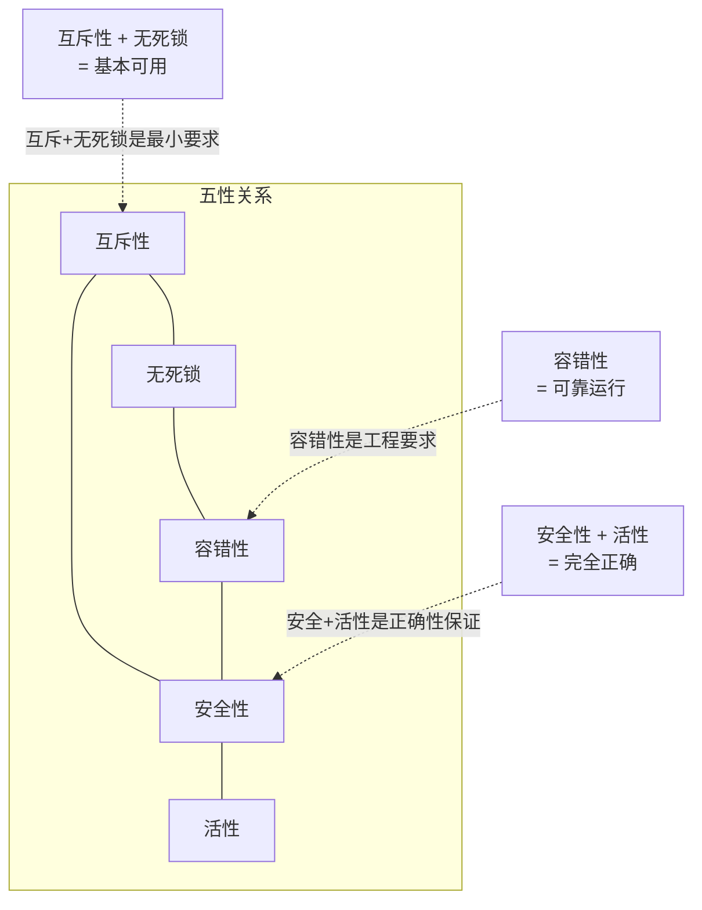
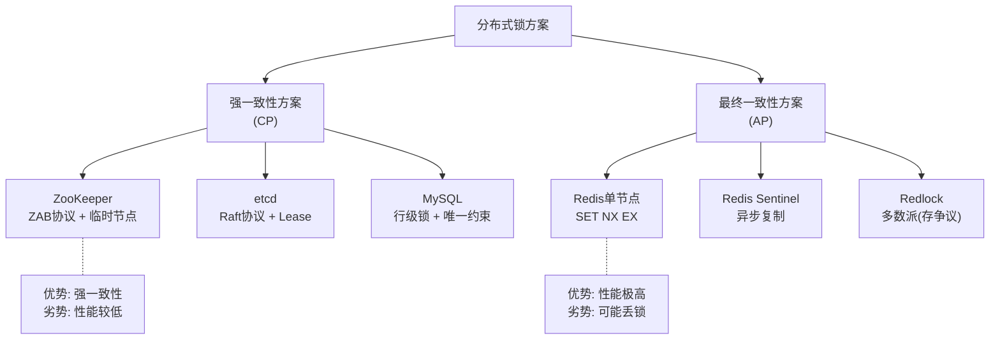

## 一、从单机锁到分布式锁：问题的起源

### 1.1 单机环境下的互斥

在单体应用中，多个线程共享同一进程的内存空间。当多个线程同时访问共享资源（全局变量、文件、数据库连接）时，竞态条件（Race Condition）会导致数据不一致。操作系统提供了成熟的互斥原语来解决这一问题：

| 原语 | 实现层级 | 原理 | 性能特征 |
|------|---------|------|---------|
| `synchronized`（Java） | JVM层面 | 基于Monitor对象，进入时加锁、退出时释放 | 偏向锁→轻量级锁→重量级锁，自适应升级 |
| `ReentrantLock`（Java） | 用户空间 | 基于CAS + AQS队列，支持公平/非公平 | 公平模式下吞吐量低于synchronized |
| `pthread_mutex`（C/C++） | 内核/用户空间 | 基于Futex，无竞争时用户态完成 | 零系统调用开销（无竞争时） |
| `std::mutex`（C++） | 内核层面 | 基于操作系统原语（如futex） | 依赖OS实现 |
| `multiprocessing.Lock`（Python） | 内核层面 | 基于信号量或文件锁 | 跨进程，性能较低 |

这些原语的共同前提是：**所有竞争者位于同一台机器、同一地址空间内**。它们依赖CPU的原子指令（Compare-And-Swap、Test-and-Set）和内存屏障来保证正确性。例如，Java的`synchronized`在底层通过`monitorenter`/`monitorexit`字节码指令操作对象头中的Mark Word，利用CAS原子操作实现锁的获取与释放。

### 1.2 分布式环境下的困境

当系统从单体架构演进为分布式架构——多台服务器各自运行独立进程，通过网络通信协作——上述单机锁原语完全失效。核心矛盾在于：

| 维度 | 单机环境 | 分布式环境 |
|------|---------|-----------|
| 内存模型 | 共享内存，同一地址空间 | 内存隔离，进程间无法直接访问 |
| 通信方式 | 函数调用（纳秒级） | 网络通信（毫秒级，存在延迟和丢包） |
| 原子性保证 | CPU指令级别（CAS、TAS） | 依赖远程协调服务，无硬件级原子性 |
| 故障模型 | 进程崩溃→OS回收所有资源（锁自动释放） | 进程崩溃→锁可能残留（远程锁不会自动释放） |
| 时钟模型 | 单一时钟，时间一致 | 多节点时钟独立，存在漂移 |

**一个具体场景**：电商系统部署了3个节点，每个节点都有一个定时任务负责清理过期订单。如果不用分布式锁，同一个过期订单可能被3个节点重复删除，导致重复退款。单机的`synchronized`无法阻止其他机器上的进程访问同一资源。

### 1.3 分布式锁的本质定义

分布式锁是一种**跨进程、跨机器的互斥协调机制**，它通过一个所有参与节点都能访问的外部协调服务，保证在任意时刻只有一个客户端（进程/线程）能对某个共享资源执行排他性操作。

更严格地说，分布式锁是一个**分布式共识问题的特例**——多个客户端需要就"谁持有锁"这一状态达成一致。这与经典的分布式共识问题（如Leader选举、原子广播）在理论基础层面是相通的。

---

## 二、分布式锁的核心性质：形式化定义

一个正确的分布式锁实现必须满足以下五个性质。这些性质不是"最好有"的建议，而是**缺一不可的必要条件**——任何一条被违反都可能导致严重的数据事故。

### 2.1 互斥性（Mutual Exclusion）

**定义**：对于任意两个不同的客户端C1和C2，在任意时刻，C1和C2不能同时持有同一把锁。

**违反后果**：两个客户端同时修改共享资源，导致数据不一致。例如，两个线程同时读取库存为10，各自扣减1，最终库存为9而非正确的8。

**实现保障**：锁服务必须提供原子性的"检查并设置"操作——在设置锁成功之前，其他客户端的请求必须被拒绝。在Redis中由`SET NX`的原子语义保证；在ZooKeeper中由临时节点的原子创建保证。

### 2.2 无死锁（Deadlock Free）

**定义**：即使持有锁的客户端崩溃、网络断开或长时间GC暂停，锁最终一定会被释放，不会永久占用资源。

**违反后果**：锁被永久持有，所有等待获取该锁的客户端无限阻塞，系统逐渐瘫痪。

**实现保障**：
- **超时机制**：为锁设置过期时间（TTL），到期后自动释放。Redis的`EX`参数、ZooKeeper的临时会话（Session Timeout）都提供此能力。
- **心跳续期**：客户端存活时定期续期；客户端崩溃后心跳停止，锁自动过期。

### 2.3 容错性（Fault Tolerance）

**定义**：当协调服务的少数节点发生故障时，锁服务整体仍然可用——客户端仍然能够获取和释放锁。

**违反后果**：协调服务的单点故障导致所有依赖锁的业务全部不可用，引发级联故障。

**实现保障**：
- Redis Sentinel或Cluster模式提供故障转移
- ZooKeeper基于ZAB协议，半数以上节点存活即可服务
- etcd基于Raft协议，多数派共识保证可用性

### 2.4 安全性（Safety）——锁的持有者才能释放

**定义**：只有锁的当前持有者才能成功释放锁。客户端不能释放其他客户端持有的锁。

**违反后果**：客户端A释放了客户端B持有的锁，B误以为自己仍持有锁继续执行，而此时其他客户端可能已经获取了锁，导致并发冲突。

**实现保障**：锁的值必须包含持有者的唯一标识（如UUID），释放时先比较标识是否匹配，匹配才删除。Redis中通过Lua脚本保证"比较+删除"的原子性。

### 2.5 活性（Liveness）——获取锁的请求最终总能成功

**定义**：只要锁服务正常运行，任何一个请求获取锁的客户端最终都能成功获取到锁（前提是没有其他客户端永久持有锁）。

**违反后果**：某些客户端永远无法获取锁，业务陷入停滞。这通常由饥饿（Starvation）问题引起。

**实现保障**：公平锁通过FIFO队列保证按请求顺序分配；非公平锁通过随机竞争在统计意义上保证公平性。

### 2.6 五性之间的关系

这五个性质之间存在内在的张力和制约：

在实际设计中，需要在这五性之间做权衡。例如，Redlock算法通过增加节点数量提升容错性，但Martin Kleppmann指出这可能在极端场景下损害安全性。单节点Redis锁牺牲了容错性（单点故障风险），但换取了极高的性能和简洁性。

---

## 三、理论基础：分布式共识与协调

分布式锁不是一个孤立的技术问题，它根植于分布式系统的理论基础之中。理解这些理论有助于做出正确的技术选型和架构决策。

### 3.1 CAP定理：分布式锁的根本权衡

CAP定理指出，一个分布式系统最多只能同时满足以下三项中的两项：

- **C（Consistency，一致性）**：所有节点在同一时刻看到的数据完全相同
- **A（Availability，可用性）**：每个请求都能收到一个（非错误的）响应
- **P（Partition Tolerance，分区容错性）**：系统在网络分区时仍能继续运行

由于网络分区在分布式系统中不可避免（网络总会出故障），P是必须保证的。因此实际的权衡是在C和A之间选择：

| 分布式锁方案 | 选择 | 含义 | 代价 |
|-------------|------|------|------|
| Redis单节点锁 | AP优先 | 高可用、高性能，但主从切换时可能短暂丢锁 | 强一致性无法保证 |
| Redis Sentinel锁 | AP优先 | Sentinel自动故障转移，但异步复制仍可能丢锁 | 主从切换期间有数据窗口 |
| Redlock（多节点） | 试图兼顾 | 通过多数派获取锁提升一致性 | Kleppmann证明在时钟异常时不安全 |
| ZooKeeper锁 | CP优先 | 基于ZAB协议，强一致性 | Leader选举期间短暂不可用 |
| etcd锁 | CP优先 | 基于Raft协议，线性一致性读写 | 性能低于Redis方案 |

**关键洞察**：不存在完美的分布式锁方案。选择哪种方案，取决于你的业务能容忍哪种故障——是偶尔的并发冲突（AP方案的代价），还是偶尔的服务不可用（CP方案的代价）。

### 3.2 FLP不可能性定理

FLP定理（以Fischer、Lynch、Paterson三位研究者命名）证明：在异步分布式系统中，如果至少有一个进程可能崩溃，那么不存在一个确定性算法能保证在有限时间内达成共识。

这对分布式锁的启示是深刻的：
- 在完全异步的网络模型下，**不可能**设计出一个既满足互斥性又保证活性的分布式锁
- 实际系统通过引入**超时机制**（将异步模型转化为部分同步模型）来绕过这一定理的限制
- ZooKeeper的Session Timeout、Redis的EX过期时间，本质上都是在异步系统中引入时间假设

### 3.3 分布式锁与共识协议的关系

分布式锁本质上是共识问题的一个特例。更准确地说，获取锁等价于在多个竞争者中选出唯一的"获胜者"——这与Leader选举问题同构。

| 共识问题 | 分布式锁的对应 |
|---------|--------------|
| Leader选举 | 获取锁（选出唯一的锁持有者） |
| 原子广播 | 锁状态变更的通知（所有节点感知锁的变化） |
| 共识提交 | 锁的授予确认（多节点就"谁持有锁"达成一致） |

不同的共识协议直接影响了分布式锁的实现方式：

- **基于单点权威的方案**（Redis单节点）：不使用共识协议，依赖单节点的权威性。性能最高，但单点故障风险最大。
- **基于多数派投票的方案**（Redlock、Raft/ZAB）：使用多数派共识。需要多数节点同意才能授予锁，安全性更高，但性能开销更大。
- **基于顺序保证的方案**（ZooKeeper临时顺序节点）：利用ZAB协议保证的全局顺序，天然支持公平锁。

### 3.4 一致性模型的层次

分布式锁的一致性需求可以从多个层次理解：

| 一致性模型 | 含义 | 分布式锁中的体现 | 代表方案 |
|-----------|------|----------------|---------|
| 强一致性（Linearizability） | 操作效果等价于某个全局顺序的串行执行 | 任意时刻只有一个客户端持有锁 | ZooKeeper、etcd |
| 顺序一致性（Sequential Consistency） | 所有进程看到的操作顺序一致，但不必是实时的 | 锁的获取顺序在所有观察者看来一致 | ZooKeeper（同一代内） |
| 最终一致性（Eventual Consistency） | 如果不再有更新，最终所有副本会收敛到相同值 | 短暂时间内可能有两个客户端认为自己持有锁 | Redis主从异步复制 |

**工程启示**：对于秒杀库存扣减、金融转账等场景，需要强一致性或至少提供补偿机制（如Fencing Token）；对于分布式定时任务去重、缓存刷新等场景，短暂的不一致通常可以接受。

---

## 四、分布式锁的分类体系

### 4.1 按协调服务分类

| 协调服务 | 协议/机制 | 一致性 | 性能（QPS） | 典型延迟 | 适用场景 |
|---------|----------|--------|------------|---------|---------|
| Redis（单节点） | SET NX EX | 最终一致 | 10万+ | <1ms | 高性能、可容忍短暂不一致 |
| Redis Sentinel | 异步复制 + Sentinel监控 | 最终一致 | 5万+ | 1-5ms | 需要高可用但仍以性能为主 |
| Redis Cluster | 哈希槽 + 异步复制 | 最终一致 | 5万+（分片后线性扩展） | 1-5ms | 超大规模锁服务 |
| ZooKeeper | ZAB协议 + 临时顺序节点 | 强一致 | 1-5万 | 5-20ms | 强一致性要求、公平锁 |
| etcd | Raft协议 + Lease | 强一致 | 1-3万 | 5-15ms | 云原生环境、Kubernetes生态 |
| MySQL | 表行锁 + 唯一约束 | 强一致 | 1千-5千 | 5-50ms | 低并发、已有DB基础设施 |

### 4.2 按锁语义分类

| 锁类型 | 语义 | 实现复杂度 | 典型应用 |
|-------|------|-----------|---------|
| 排他锁（独占锁） | 任意时刻只有一个持有者 | 低 | 秒杀、资源扣减 |
| 可重入锁 | 同一客户端可多次获取同一把锁 | 中 | 递归/嵌套调用场景 |
| 读写锁 | 读操作并发、写操作互斥 | 高 | 读多写少的缓存更新 |
| 公平锁 | 严格按请求顺序分配 | 高 | 需要严格顺序保证的场景 |
| 超时锁 | 在指定时间内未获取到锁则放弃 | 低 | 防止无限等待 |
| 乐观锁（CAS） | 不阻塞，冲突时重试 | 中 | 低冲突、高并发场景 |

### 4.3 按一致性保障分类

---

## 五、分布式锁的设计考量与核心权衡

### 5.1 性能 vs 安全性

这是分布式锁设计中最核心的权衡。以Redis为例：

- **高性能方案**：单节点SET NX EX，P99延迟<0.1ms，10万+ QPS。代价是主从切换时可能短暂失去互斥保证。
- **高安全方案**：Redlock多节点或ZooKeeper临时节点，P99延迟5-20ms，1-5万QPS。代价是性能下降一个数量级。

**决策框架**：
1. 并发冲突的后果是什么？如果后果是资金损失，选择安全性优先
2. 系统的QPS要求是多少？如果超过5万，Redis方案是唯一选择
3. 是否有补偿机制？如果业务层面有幂等设计或对账机制，可以适当降低锁的安全性要求

### 5.2 可用性 vs 一致性

- **可用性优先（AP方案）**：Redis单节点/Sentinel。在网络分区或节点故障时，系统仍能提供锁服务，但可能在故障窗口内出现两个客户端同时持有锁的情况。
- **一致性优先（CP方案）**：ZooKeeper/etcd。在网络分区时，少数派分区将无法获取锁，保证不会出现两个客户端同时持有锁，但牺牲了部分可用性。

**实际选择建议**：
- 如果业务可以接受"极小概率的并发冲突"（如通过下游幂等设计兜底），选AP方案
- 如果业务绝对不能接受并发冲突（如金融交易、库存超卖），选CP方案

### 5.3 锁粒度的选择

锁粒度决定了并发性能的上限。粒度过粗会人为制造瓶颈，粒度过细则增加管理复杂度和内存开销。

| 粒度示例 | 并发能力 | 管理成本 | 适用场景 |
|---------|---------|---------|---------|
| `lock:global` | 极低（串行化所有操作） | 极低 | 系统初始化、全量数据迁移 |
| `lock:order` | 低（同一类型操作串行） | 低 | 同类型资源的批量操作 |
| `lock:order:12345` | 中（仅同一订单的操作串行） | 中 | 大多数业务场景（推荐） |
| `lock:order:12345:status` | 高（仅同一字段的操作串行） | 高 | 超高并发热点字段（如库存） |
| `lock:order:12345:status:user_A` | 极高（区分操作者） | 极高 | 特殊场景（如多操作者并发编辑） |

**选择原则**：以"最小互斥单元"为基准——两个操作如果会互相干扰，就用同一把锁；不会互相干扰，就用不同的锁。典型推荐是**资源实例级别**（如`lock:order:{order_id}`），在性能和复杂度之间取得平衡。

### 5.4 过期时间的两难困境

锁的过期时间（TTL）面临经典的两难选择：

- **TTL过短**：业务逻辑还没执行完，锁就过期了。其他客户端获取锁后并发修改数据，导致竞态条件。
- **TTL过长**：客户端崩溃后，其他客户端需要等待很长时间才能获取锁，系统可用性降低。

**解决方案**：看门狗（Watchdog）机制——客户端获取锁后启动后台线程，定期检查锁是否仍被自己持有，如果持有则续期。Redisson框架的Watchdog默认以TTL/3的间隔续期（默认30秒的锁，每10秒续期一次）。客户端正常完成时主动释放锁并停止Watchdog；客户端崩溃后Watchdog线程随之终止，锁最终过期释放。

### 5.5 锁的释放安全性

释放锁是分布式锁中最容易出错的环节。核心问题是：**如何保证释放锁的客户端确实是锁的当前持有者？**

典型的错误模式：

时刻T1: 客户端A获取锁，TTL=30s
时刻T2: 客户端A的GC暂停了35秒
时刻T3: 锁过期，客户端B获取锁
时刻T4: 客户端A从GC恢复，执行DEL释放锁
时刻T5: ❌ A误删了B的锁！

**解决路径**（层层递进）：

1. **Lua脚本原子比较删除**：释放锁时先GET比较值，匹配才DEL。通过Redis的Lua脚本保证原子性。
2. **看门狗续期**：通过持续续期避免锁在业务执行期间过期，从根源上减少上述竞态窗口。
3. **Fencing Token**：锁服务在授予锁时返回一个单调递增的Token，客户端在写入数据时携带Token，存储层拒绝Token小于已见最大值的写入。这是Kleppmann提出的"最后一道防线"。

---

## 六、分布式锁的适用场景与反模式

### 6.1 典型适用场景

| 场景 | 为什么需要分布式锁 | 推荐方案 | 关键注意事项 |
|------|-------------------|---------|-------------|
| 秒杀库存扣减 | 多节点并发扣减同一商品库存，需防止超卖 | Redis + Lua原子扣减 | 配合乐观锁（版本号）做兜底 |
| 分布式定时任务去重 | 多实例部署，同一任务不应被重复执行 | Redis SET NX（带任务ID） | TTL设为任务执行最大时长 |
| 订单状态机防并发 | 同一订单的状态变更不能交叉执行 | Redis/ZK（带订单ID） | 状态变更需幂等 |
| Leader选举 | 从多个候选节点中选出唯一主节点 | ZooKeeper临时顺序节点 | 选主后需要Fencing Token保护写入 |
| 分布式缓存重建 | 防止缓存击穿（大量请求同时重建缓存） | Redis SET NX（带缓存Key） | 锁的TTL设为缓存重建时间 |
| 分布式事务协调 | 两阶段提交中协调各参与者的锁状态 | ZooKeeper/etcd | 超时机制防止协调者单点故障 |

### 6.2 常见反模式

**反模式一：用分布式锁替代幂等设计**

有些开发者试图用分布式锁保证操作的幂等性，但正确的做法是在业务层面实现幂等。分布式锁在释放后就不再保护后续操作，如果重试请求在锁释放后到达，仍然可能出现重复执行。

**正确做法**：分布式锁 + 业务幂等 = 双重保障。

**反模式二：锁的粒度过粗**

使用`global_lock`保护所有操作，导致所有请求串行化。这完全违背了分布式系统的并行设计初衷。

**反模式三：不设置过期时间**

为了"安全"而不设TTL，一旦客户端崩溃，锁永远不会释放。这比不用锁更危险。

**反模式四：在锁内执行耗时操作**

在持有锁期间执行网络调用、大量IO等耗时操作，导致锁持有时间过长，其他客户端长时间等待。应该只在临界区持有锁，临界区外的操作应尽快完成。

**反模式五：忽略锁的续期**

设置了较短的TTL但不实现续期机制，导致业务未完成锁就过期。或者设置了过长的TTL来"保险"，但这又增加了崩溃后的等待时间。

---

## 七、分布式锁与其他并发控制机制的对比

分布式锁不是唯一的并发控制手段。在实际系统设计中，往往需要将多种机制组合使用。

| 机制 | 原理 | 优点 | 缺点 | 适用场景 |
|------|------|------|------|---------|
| 分布式锁 | 排他访问，阻塞其他请求 | 强互斥保证 | 性能开销大，有死锁风险 | 强互斥需求 |
| 乐观锁（版本号） | 写入时检查版本号是否变化 | 无阻塞，高并发 | 冲突多时重试开销大 | 读多写少、低冲突 |
| CAS操作 | Compare-And-Swap，无锁编程 | 无锁、高性能 | ABA问题、重试风暴 | 简单变量的原子更新 |
| 分布式事务 | 两阶段提交/XA | ACID保证 | 性能差、协调者单点 | 强一致性事务 |
| 幂等设计 | 重复操作结果相同 | 容错性极好 | 需要业务层支持 | 所有分布式场景 |
| 消息队列串行化 | 同一消息只被一个消费者处理 | 天然串行、高吞吐 | 延迟增加 | 可异步的场景 |

**最佳实践**：不要孤立地使用分布式锁，而是将其作为多层防御体系的一部分：
1. **第一层：架构设计**——通过消息队列串行化、数据分片减少竞争
2. **第二层：锁机制**——对必须互斥的操作使用分布式锁
3. **第三层：乐观检查**——使用版本号或CAS做兜底验证
4. **第四层：幂等设计**——确保即使重复执行也不会产生副作用
5. **第五层：补偿机制**——对账、回滚等事后修复手段

---

## 八、本节要点回顾

1. **分布式锁的本质**：跨进程、跨机器的互斥协调机制，本质上是分布式共识问题的特例
2. **五大核心性质**：互斥性、无死锁、容错性、安全性、活性——缺一不可
3. **CAP定理约束**：分布式锁方案必须在一致性和可用性之间做出取舍，不存在完美方案
4. **FLP不可能性**：在纯异步模型下无法同时保证互斥性和活性，实际系统通过超时机制绕过
5. **分类体系**：按协调服务（Redis/ZooKeeper/etcd/DB）、锁语义（排他/可重入/读写/公平）、一致性模型（强一致/最终一致）三维分类
6. **核心权衡**：性能vs安全性、可用性vs一致性、锁粒度粗vs细、TTL短vs长
7. **最佳实践**：分布式锁应作为多层防御体系的一环，配合幂等设计、乐观锁、补偿机制使用
