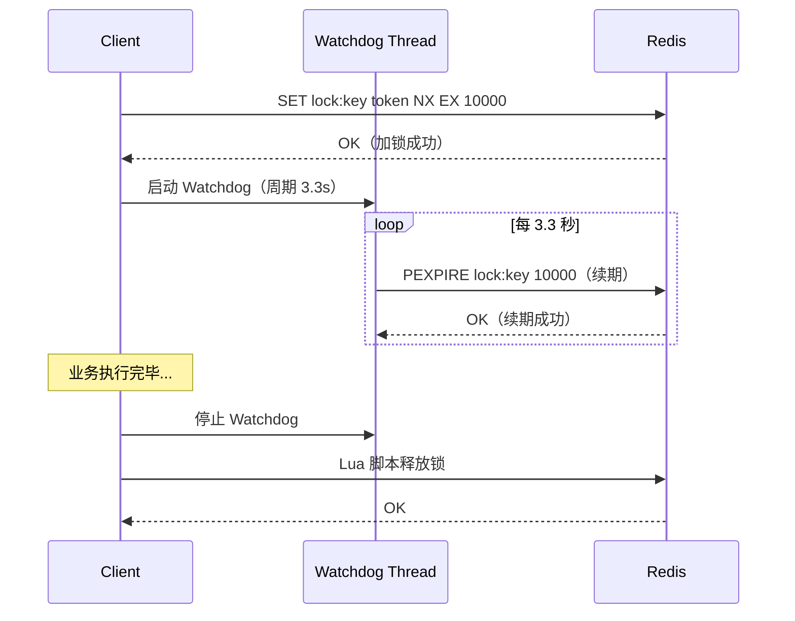
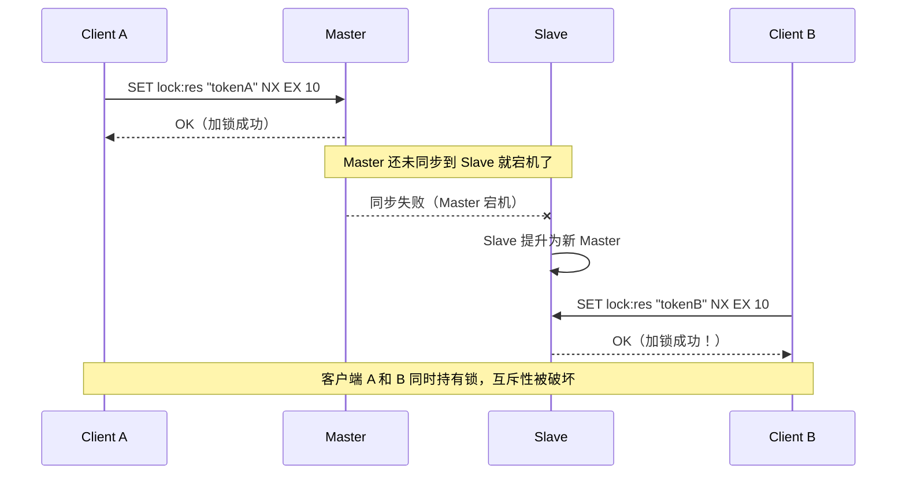
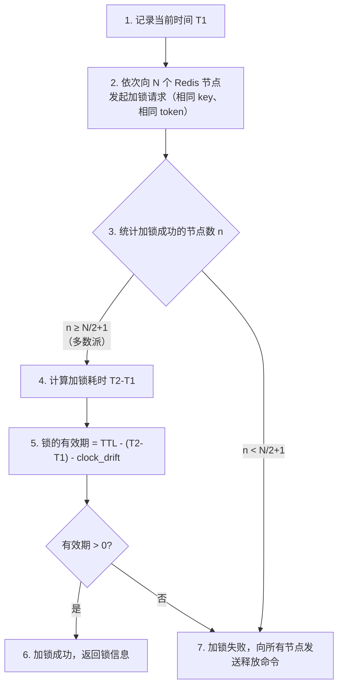
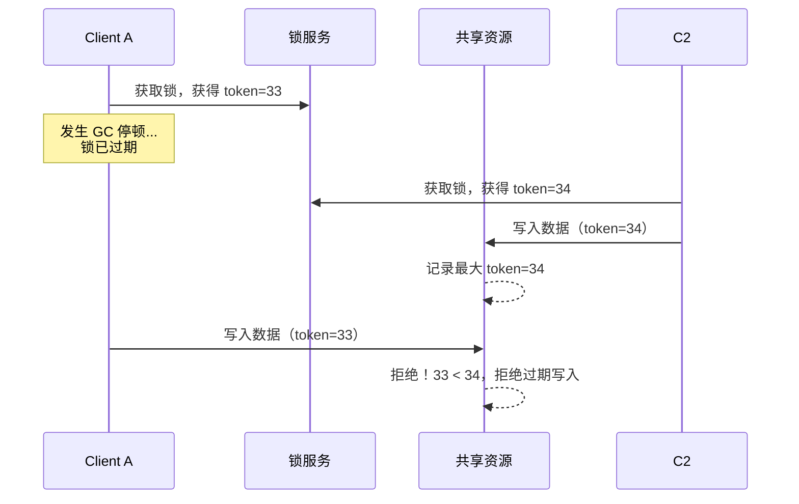
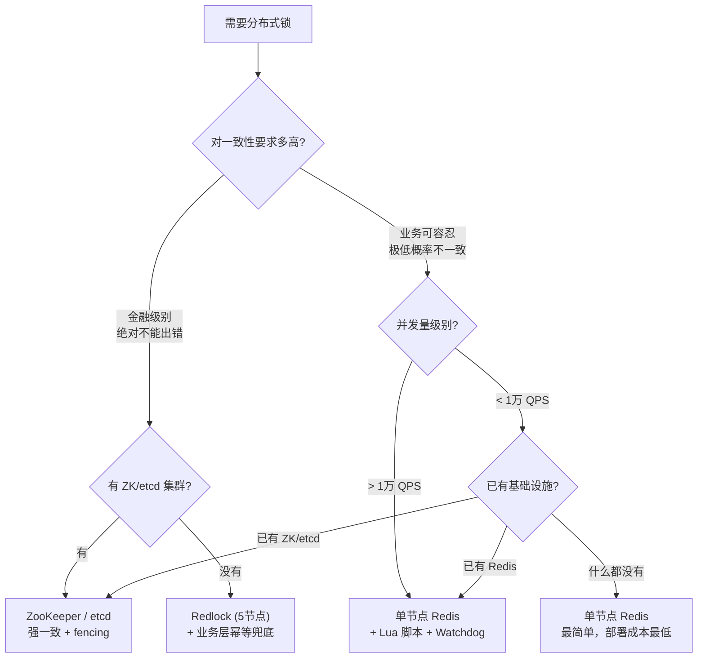
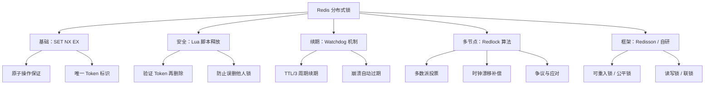

## 一、为什么选择 Redis 实现分布式锁

在分布式系统中，互斥访问共享资源需要一个所有节点都能感知的协调者。常见的实现方案包括基于数据库行锁、ZooKeeper 临时顺序节点、etcd Lease 以及 Redis 原子命令。Redis 方案的核心优势体现在三个维度：

| 维度 | Redis | ZooKeeper | etcd | 数据库行锁 |
|------|-------|-----------|------|-----------|
| 加锁延迟 | < 1ms（内存操作） | 2-5ms（ZAB 协议） | 2-5ms（Raft 协议） | 5-50ms（磁盘 IO） |
| 吞吐量 | 10万+ QPS/节点 | 1万+ QPS/节点 | 1万+ QPS/节点 | 受索引和连接池限制 |
| 运维成本 | 低（广泛部署） | 高（JVM + 复杂配置） | 中（Go 单二进制） | 已有则零成本 |
| 一致性保证 | 主从切换可能丢锁 | 强一致（ZAB） | 强一致（Raft） | 强一致（取决于隔离级别） |
| 适用场景 | 高并发、容忍极低概率不一致 | 强一致要求、协调服务 | 云原生、K8s 生态 | 简单低并发场景 |

Redis 之所以成为分布式锁的首选，本质上源于三个设计特性：

1. **单线程事件循环**：Redis 6.0 之前是纯粹的单线程模型（6.0 引入多线程 IO 但命令执行仍为单线程），天然避免了命令间的竞态条件。`SET key value NX EX ttl` 这条命令在执行期间不会被任何其他命令插入，原子性由引擎本身保证，无需额外的锁机制。
2. **丰富的原子操作原语**：`SET` 的 NX/XX/EX/PX/EXAT/PXAT/KEEPTTL 选项组合、`EVAL`/`EVALSHA` Lua 脚本执行、`MULTI`/`EXEC` 事务——这些原语覆盖了分布式锁所需的全部原子操作需求。
3. **亚毫秒级延迟**：基于内存的数据存储、IO 多路复用（epoll/kqueue）、零中间件开销，使得单次命令执行延迟通常在 0.1-0.3ms 之间，远低于基于磁盘或共识协议的方案。

**Redis 分布式锁的典型适用场景：**

- **缓存击穿防护**：热点 key 过期后，只允许一个请求回源重建缓存，其余请求等待或降级
- **秒杀/限流**：控制超卖，保证库存扣减的原子性，单实例可支撑 10 万+ 并发抢锁
- **定时任务去重**：多节点部署的 Worker 保证同一任务只被执行一次，避免重复执行
- **接口幂等控制**：防止重复提交导致的重复扣款、重复发货、重复通知
- **分布式 Session / 配置更新**：保证配置变更的有序执行，避免并发更新导致状态不一致
- **Leader 选举 / 故障转移**：轻量级的选主场景，如选择一个节点负责执行汇总统计

---

## 二、SET NX EX：原子加锁的基石

Redis 分布式锁的核心命令是 `SET key value NX EX seconds`，它将三个操作合并为一个原子命令：

- **SET**：设置键值对
- **NX**（Not Exists）：仅当 key 不存在时才设置，存在则返回 nil
- **EX**（Expire）：同时设置过期时间（秒），防止死锁

```bash
# 加锁：设置锁 key，值为随机 token，过期时间 10 秒
SET lock:order:12345 "uuid-abc-def-123" NX EX 10

# 返回 OK 表示加锁成功；返回 nil 表示锁已被持有
```

### 为什么不能用 SETNX + EXPIRE 两条命令

这是一个经典的错误模式，几乎每个初学者都会踩：

```bash
# 错误方式：非原子操作
SETNX lock:order:12345 "token"
# 如果客户端在此处崩溃，EXPIRE 不会执行 → 永久死锁！
EXPIRE lock:order:12345 10
```

这条路径存在两个致命缺陷：

| 问题 | 触发条件 | 后果 |
|------|---------|------|
| **死锁** | 客户端在 SETNX 和 EXPIRE 之间崩溃 | 锁永远存在，所有其他客户端永久阻塞 |
| **竞态条件** | 两个客户端几乎同时执行 SETNX，第一个成功后崩溃 | 第二个客户端的 SETNX 失败，但第一个客户端的 EXPIRE 尚未执行，锁无 TTL |

Redis 2.6.12 之前的版本不支持 SET 的 NX + EX 组合参数，当时需要借助 Lua 脚本或 `SET resource uuid NX PX milliseconds` 来实现原子加锁。2.6.12+ 版本的 SET 命令已经统一了 NX/XX/EX/PX/EXAT/PXAT/KEEPTTL 选项，是生产环境的首选。

### 毫秒级精度：SET PX

对于对锁持有时间要求更精确的场景（如高频交易、实时竞价），可以使用毫秒精度：

```bash
# 使用毫秒精度（PX），适合对锁持有时间要求更精确的场景
SET lock:resource "token-xyz" NX PX 10000
```

PX 与 EX 的选择原则：大多数业务场景用 EX（秒级）即可；只有当 TTL 需要低于 1 秒，或者业务逻辑的执行时间在毫秒级别时，才需要用 PX。

---

## 三、锁的值（Token）：为什么必须是随机唯一值

锁的 value 必须是一个调用者生成的全局唯一标识（通常是 UUID），而不是固定的字符串或客户端 ID。原因是：**释放锁时必须验证"是不是我加的锁"**。

```python
import uuid

token = str(uuid.uuid4())  # 例如: "550e8400-e29b-41d4-a716-446655440000"
```

如果所有客户端使用同一个 value，那么任何客户端都能释放其他客户端持有的锁，导致互斥性被破坏。

### Token 设计的几种方案对比

| 方案 | 格式示例 | 优点 | 缺点 |
|------|---------|------|------|
| UUID v4 | `550e8400-e29b-41d4-a716-446655440000` | 碰撞概率极低（2^122），无需协调 | 36 字节，占用较多内存 |
| 随机字节（16B） | `\xa3\xf2\x8b...`（16字节） | 更紧凑，16 字节 | 可读性差，调试不便 |
| 时间戳 + 随机数 | `1672531200-abc123` | 可读性好，便于排查 | 碰撞概率高于 UUID |
| 客户端ID + 序列号 | `worker-03:seq:42` | 有序可追踪 | 需要协调序列号，复杂 |

**生产推荐**：使用 UUID v4 或 16 字节随机数。UUID v4 的优势在于无需任何协调机制，且 stdlib 原生支持（Python、Java、Go、Node.js 均有），是最简单的正确选择。

### 注意：不要用 Redis 的客户端 ID 做 Token

某些实现用 Redis 客户端连接 ID（`CLIENT ID` 命令返回值）作为 token，这在连接复用（连接池）的场景下会导致问题：同一个连接可能被不同的线程/请求复用，导致 token 与持有者不匹配。UUID 是真正全局唯一的标识。

---

## 四、安全释放锁：Lua 脚本保证原子性

释放锁不能简单地执行 `DEL key`，因为可能出现：

1. 客户端 A 的锁因 TTL 过期自动释放
2. 客户端 B 获得锁
3. 客户端 A 此时执行 `DEL`，把客户端 B 的锁释放了

**安全释放流程：先验证 value 是否是自己设置的，再执行删除。两步操作必须是原子的。**

```lua
-- unlock.lua：安全释放 Redis 分布式锁
if redis.call("GET", KEYS[1]) == ARGV[1] then
    return redis.call("DEL", KEYS[1])
else
    return 0
end
```

### 为什么 GET + DEL 不是安全的

```python
# 危险！非原子的 GET + DEL 操作
if redis.get("lock:res") == my_token:
    # ⚠️ 此时锁可能已过期，其他客户端已获得锁
    # 如果下面的 DEL 执行，会删除别人的锁
    redis.delete("lock:res")
```

两步操作之间存在一个时间窗口。在这个窗口内：
- 客户端 A 的锁过期
- 客户端 B 获取到锁
- 客户端 A 的 `DEL` 执行，删除了客户端 B 的锁

Lua 脚本在 Redis 中是原子执行的——从 `EVAL` 开始到脚本返回，Redis 不会处理任何其他客户端的命令。这保证了 GET 检查和 DEL 删除之间没有其他命令插入。

### 使用 EVALSHA 优化脚本传输

在高频场景下，每次发送完整的 Lua 脚本文本会造成不必要的网络开销。Redis 支持 `SCRIPT LOAD` 预加载脚本，然后通过 `EVALSHA` 只发送脚本的 SHA1 哈希值：

```bash
# 预加载脚本，返回 SHA1 哈希
SCRIPT LOAD "if redis.call('GET', KEYS[1]) == ARGV[1] then return redis.call('DEL', KEYS[1]) else return 0 end"
# 返回: "a1b2c3d4e5f6..."

# 之后只需发送 SHA1 值
EVALSHA "a1b2c3d4e5f6..." 1 lock:res my-token
```

大多数 Redis 客户端库（如 redis-py）的 `register_script()` 方法已自动处理了 EVALSHA 的缓存和降级逻辑。

### 完整的 Python 实现：生产级 Redis 分布式锁

```python
import time
import uuid
import redis
from contextlib import contextmanager


class RedisDistributedLock:
    """生产级 Redis 分布式锁实现"""

    # 加锁脚本（可选，用于复杂的加锁逻辑）
    LOCK_SCRIPT = """
    if redis.call("SET", KEYS[1], ARGV[1], "NX", "PX", ARGV[2]) then
        return 1
    else
        return 0
    end
    """

    # 释放锁脚本：验证 + 删除，原子操作
    UNLOCK_SCRIPT = """
    if redis.call("GET", KEYS[1]) == ARGV[1] then
        return redis.call("DEL", KEYS[1])
    else
        return 0
    end
    """

    # 续期脚本：验证 owner + 续期，原子操作
    EXTEND_SCRIPT = """
    if redis.call("GET", KEYS[1]) == ARGV[1] then
        return redis.call("PEXPIRE", KEYS[1], ARGV[2])
    else
        return 0
    end
    """

    def __init__(self, redis_client: redis.Redis, key: str,
                 ttl_ms: int = 10000):
        """
        Args:
            redis_client: Redis 连接（建议使用连接池）
            key: 锁的名称（业务 key）
            ttl_ms: 锁过期时间（毫秒）
        """
        self.redis = redis_client
        self.key = f"lock:{key}"
        self.ttl_ms = ttl_ms
        self.token = str(uuid.uuid4())  # 全局唯一 token
        self._lock_script = self.redis.register_script(self.LOCK_SCRIPT)
        self._unlock_script = self.redis.register_script(self.UNLOCK_SCRIPT)
        self._extend_script = self.redis.register_script(self.EXTEND_SCRIPT)

    def acquire(self, timeout_ms: int = 30000, retry_interval_ms: int = 100) -> bool:
        """
        获取锁（阻塞重试）

        Args:
            timeout_ms: 最大等待时间（毫秒），0 表示非阻塞
            retry_interval_ms: 重试间隔（毫秒）
        Returns:
            True 表示获取成功，False 表示超时
        """
        end_time = time.monotonic() + timeout_ms / 1000.0

        while True:
            result = self._lock_script(
                keys=[self.key],
                args=[self.token, self.ttl_ms]
            )
            if result == 1:
                return True

            if timeout_ms == 0:
                return False

            remaining = end_time - time.monotonic()
            if remaining <= 0:
                return False

            time.sleep(retry_interval_ms / 1000.0)

    def release(self) -> bool:
        """安全释放锁"""
        result = self._unlock_script(
            keys=[self.key],
            args=[self.token]
        )
        return result == 1

    def extend(self, additional_ms: int = None) -> bool:
        """
        续期：延长锁的过期时间

        Args:
            additional_ms: 续期毫秒数，默认为初始 ttl_ms
        Returns:
            True 续期成功，False 说明锁已不属于自己
        """
        if additional_ms is None:
            additional_ms = self.ttl_ms

        result = self._extend_script(
            keys=[self.key],
            args=[self.token, additional_ms]
        )
        return result == 1

    @property
    def is_locked(self) -> bool:
        """检查当前锁是否仍由自己持有"""
        return self.redis.get(self.key) == self.token.encode()


@contextmanager
def distributed_lock(redis_client, key, ttl_ms=10000, timeout_ms=30000):
    """
    分布式锁上下文管理器

    用法:
        with distributed_lock(r, "order:12345"):
            process_order(12345)

    上下文管理器保证了：
    1. 获取锁失败时抛出 TimeoutError
    2. 业务代码执行完毕后（无论成功或异常）自动释放锁
    """
    lock = RedisDistributedLock(redis_client, key, ttl_ms)
    if not lock.acquire(timeout_ms=timeout_ms):
        raise TimeoutError(f"获取锁 {key} 超时（等待 {timeout_ms}ms）")
    try:
        yield lock
    finally:
        lock.release()
```

---

## 五、锁续期（Watchdog）机制

### 核心问题：锁的 TTL 应该设置多长

这是一个两难问题，没有"正确答案"：

- **太短**（如 5 秒）：业务还没执行完，锁就过期了，其他客户端获得锁，导致并发冲突
- **太长**（如 60 秒）：持有锁的客户端崩溃后，其他客户端需要等待很长时间才能获取锁，可用性下降

### 解决方案：自动续期（Watchdog）

Watchdog 模式在后台启动一个定时器，周期性地检查锁是否仍被持有，如果业务仍在执行就自动续期。客户端崩溃后 Watchdog 也崩溃，锁自然过期。这样既避免了 TTL 过短导致的锁丢失，又避免了 TTL 过长导致的死锁等待。



```python
import threading
import time


class RedisDistributedLockWithWatchdog(RedisDistributedLock):
    """带 Watchdog 自动续期的 Redis 分布式锁"""

    def __init__(self, redis_client, key, ttl_ms=10000):
        super().__init__(redis_client, key, ttl_ms)
        self._watchdog_thread = None
        self._stop_event = threading.Event()

    def acquire(self, timeout_ms=30000, retry_interval_ms=100) -> bool:
        """获取锁并启动 Watchdog"""
        success = super().acquire(timeout_ms, retry_interval_ms)
        if success:
            self._start_watchdog()
        return success

    def _start_watchdog(self):
        """启动后台续期线程，周期为 TTL 的 1/3"""
        self._stop_event.clear()
        interval = self.ttl_ms / 3000.0  # TTL 的 1/3

        def _watchdog_loop():
            while not self._stop_event.is_set():
                self._stop_event.wait(interval)
                if not self._stop_event.is_set():
                    if not self.extend():
                        # 续期失败，说明锁已丢失，停止 Watchdog
                        self._stop_event.set()
                        break

        self._watchdog_thread = threading.Thread(
            target=_watchdog_loop, daemon=True
        )
        self._watchdog_thread.start()

    def release(self) -> bool:
        """释放锁并停止 Watchdog"""
        self._stop_event.set()
        if self._watchdog_thread:
            self._watchdog_thread.join(timeout=2)
        return super().release()
```

### 续期周期选择的经验法则

| 锁 TTL | Watchdog 周期 | 说明 |
|--------|--------------|------|
| 10s | 3.3s | Redisson 默认策略：TTL/3 |
| 30s | 10s | 长任务场景（如批量导入、复杂报表生成） |
| 5s | 1.7s | 短任务高精度场景 |
| 60s | 20s | 极长事务场景（如大数据 ETL） |

续期周期必须远小于 TTL，确保在锁过期前完成续期；但也不能太频繁，避免对 Redis 产生不必要的压力。**TTL/3 是经过实战验证的最优比例**：它保证了在最坏情况下（续期请求延迟了 2 个周期），锁仍然不会过期。

### Watchdog 失败的处理策略

当 Watchdog 续期失败时，意味着锁可能已经被其他客户端获取或 Redis 节点发生了故障。此时应：

1. **立即停止业务逻辑**：不要继续操作共享资源
2. **记录告警日志**：便于事后排查
3. **通知上层调用方**：根据业务场景决定重试或降级

---

## 六、Redlock 算法：多节点下的分布式锁

### 6.1 单节点方案的致命缺陷

在 Redis 主从（Master-Slave）架构中，单节点分布式锁存在一个严重问题：



**问题的根源**：Redis 主从复制是异步的。Master 在执行 SET 命令后立即返回 OK，然后再异步将数据同步到 Slave。如果在同步完成前 Master 宕机，Slave 提升为新 Master 后将丢失这条锁数据。

这不是 Redis 特有的问题——**所有基于异步复制的系统都面临同样的挑战**。即使是 MySQL 的半同步复制，在极端情况下（如 `sync_binlog=1` 未配置）也可能出现类似问题。

### 6.2 Redlock 算法描述

Redlock 由 Redis 作者 Antirez（Salvatore Sanfilippo）在 2016 年提出，核心思想是：**使用 N 个独立的 Redis 单节点（非主从），在多数节点上加锁成功才算持有锁。**

**算法步骤：**



**算法的数学保证：**

在 5 个独立 Redis 节点中，即使有 2 个节点故障，剩余 3 个节点仍构成多数派（5/2+1=3），系统仍可正常工作。这使得 Redlock 在面对单点故障时比单节点方案可靠得多。

**关键设计细节：**

| 设计点 | 说明 |
|--------|------|
| 节点独立性 | 5 个节点必须是完全独立的 Redis 实例，不能是同一个 Cluster 的不同分片 |
| 多数派要求 | 需要 N/2+1 个节点成功（5 节点需 3 个），容忍最多 (N-1)/2 个节点故障 |
| 时钟漂移补偿 | 计算有效锁时间时减去 `TTL × clock_drift_factor + 2ms`，默认漂移因子为 1% |
| 失败清理 | 无论成功还是失败，都需要向所有节点发送释放命令，避免残留锁 |

```python
import time
import uuid
import redis
from typing import List, Optional


class Redlock:
    """
    Redlock 算法实现

    基于多个独立 Redis 单节点，通过多数派投票保证锁的安全性。
    注意：这是简化实现，生产环境建议使用 redlock-py 或 redislock 库。
    """

    def __init__(self, nodes: List[redis.Redis], ttl_ms: int = 10000,
                 clock_drift_factor: float = 0.01, retry_count: int = 3,
                 retry_delay_ms: int = 200):
        """
        Args:
            nodes: 独立的 Redis 连接列表（非主从，每个都是独立节点）
            ttl_ms: 锁过期时间（毫秒）
            clock_drift_factor: 时钟漂移因子（默认 1%，用于计算漂移上限）
            retry_count: 获取锁的最大重试次数
            retry_delay_ms: 重试间隔（毫秒）
        """
        self.nodes = nodes
        self.ttl_ms = ttl_ms
        self.quorum = len(nodes) // 2 + 1
        self.clock_drift_factor = clock_drift_factor
        self.retry_count = retry_count
        self.retry_delay_ms = retry_delay_ms

    def acquire(self, resource: str) -> Optional[dict]:
        """
        获取 Redlock 分布式锁

        Args:
            resource: 资源名称（锁的 key）
        Returns:
            成功返回 {'token': str, 'resource': str, 'validity_ms': int}，
            失败返回 None
        """
        token = str(uuid.uuid4())

        for attempt in range(self.retry_count):
            start_time_ms = int(time.time() * 1000)
            n = 0

            # 阶段一：向所有节点发起加锁
            for node in self.nodes:
                try:
                    if node.set(resource, token, nx=True, px=self.ttl_ms):
                        n += 1
                except redis.RedisError:
                    # 节点不可达，跳过
                    continue

            # 阶段二：计算锁有效期
            elapsed_ms = int(time.time() * 1000) - start_time_ms
            # 时钟漂移上限：节点数 × 时钟漂移因子 × TTL
            drift_ms = int(self.ttl_ms * self.clock_drift_factor) + 2
            validity_ms = self.ttl_ms - elapsed_ms - drift_ms

            # 阶段三：判断是否获得多数派
            if n >= self.quorum and validity_ms > 0:
                return {
                    'token': token,
                    'resource': resource,
                    'validity_ms': validity_ms
                }

            # 加锁失败，释放所有已获取的锁
            self._release_all(resource, token)

            # 重试等待
            if attempt < self.retry_count - 1:
                time.sleep(self.retry_delay_ms / 1000.0)

        return None

    def release(self, lock: dict):
        """释放锁"""
        self._release_all(lock['resource'], lock['token'])

    def _release_all(self, resource: str, token: str):
        """向所有节点释放锁"""
        unlock_script = """
        if redis.call("GET", KEYS[1]) == ARGV[1] then
            return redis.call("DEL", KEYS[1])
        else
            return 0
        end
        """
        for node in self.nodes:
            try:
                node.eval(unlock_script, 1, resource, token)
            except redis.RedisError:
                continue


# 使用示例
nodes = [
    redis.Redis(host='10.0.0.1', port=6379),
    redis.Redis(host='10.0.0.2', port=6379),
    redis.Redis(host='10.0.0.3', port=6379),
    redis.Redis(host='10.0.0.4', port=6379),
    redis.Redis(host='10.0.0.5', port=6379),
]

redlock = Redlock(nodes, ttl_ms=10000)
lock = redlock.acquire("order:12345")
if lock:
    try:
        process_order(12345)
    finally:
        redlock.release(lock)
else:
    print("获取 Redlock 失败，所有节点均不可达或竞争过于激烈")
```

**生产环境推荐使用成熟库**：

| 语言 | 推荐库 | 特点 |
|------|--------|------|
| Java | Redisson | 最成熟，支持可重入锁/公平锁/读写锁/联锁/RedLock |
| Python | redlock-py | 纯 Python 实现，API 简洁 |
| Python | python-redis-lock | 更轻量，支持上下文管理器 |
| Go | redsync | Redlock 的 Go 实现，支持多连接池 |
| Node.js | redlock | ioredis 官方维护，TypeScript 支持 |

### 6.3 Redlock 的争议：Martin Kleppmann vs Antirez

2016 年，Martin Kleppmann（《Designing Data-Intensive Applications》作者）发表了一篇著名的批评文章，对 Redlock 的安全性提出了根本性质疑。Antirez 随后进行了回应。这场辩论是分布式系统领域的经典案例，理解这场辩论对于正确使用分布式锁至关重要。

**Kleppmann 的核心论点（Redlock 不安全的三个场景）：**

| 场景 | 问题描述 | 影响 |
|------|---------|------|
| **GC 停顿 / 进程暂停** | 客户端获取锁后，发生长时间 GC 停顿（Java 可达数百毫秒），锁在停顿期间过期。客户端恢复后仍认为自己持有锁，实际已有其他客户端获得锁。 | 两个客户端同时操作共享资源 |
| **时钟跳跃** | NTP 同步、闰秒调整等导致某节点时钟大幅跳跃，锁提前过期 | 多个客户端同时持有锁 |
| **网络延迟** | 客户端请求因网络延迟到达各节点的时间差异巨大，虽然最终获得了多数派，但实际有效锁时间可能为零甚至为负 | 锁的保护形同虚设 |

**Kleppmann 的替代方案：Fencing Token**



Fencing Token 的核心思想是：**不完全依赖锁来保证安全，而是在共享资源端增加一层校验**。每次获取锁时，锁服务返回一个单调递增的 token。客户端在操作共享资源时携带该 token，资源端（如数据库）只接受 token 大于已见过最大值的请求。

Fencing Token 要求共享资源（如数据库、存储系统）能够识别并拒绝旧 token 的操作。这是一种端到端的解决方案，不依赖于锁本身的完美性。

**Antirez 的回应要点：**

- 如果客户端存在 GC 停顿问题，那么任何分布式锁方案（包括 ZooKeeper）都无法解决，因为问题出在客户端而非锁服务。ZooKeeper 的临时节点在 session 超时前不会被删除，但 session 超时时间通常设为秒级，同样无法解决 GC 停顿问题。
- 在实际环境中，时钟跳跃通常远小于锁 TTL（10 秒），可以通过合理设置 TTL 来容忍。NTP 的 `slew` 模式每秒只调整 0.5ms，不会产生大幅跳跃。
- 对于大多数业务场景，Redlock 的安全性已经足够，因为业务层通常有幂等保证。

**实践中的结论：**

- 如果你的共享资源支持 Fencing Token（如数据库乐观锁、CAS 操作），那么即使锁失效也能保证安全，Redlock 的争议对你就没有实际影响
- 如果对安全性要求极高（如金融交易），建议使用 ZooKeeper 或 etcd 等基于共识协议的方案，它们通过 epoch / revision 机制天然提供了 fencing 能力
- 对于绝大多数 Web 业务（限流、缓存击穿、去重等），单节点 Redis 锁 + 合理 TTL + 业务幂等已经足够
- **不要让理论争议阻碍实践**：理解争议的本质（GC 停顿时锁失效）比选择"绝对正确"的方案更重要。在绝大多数业务中，业务层的幂等保证才是安全的最后一道防线。

---

## 七、Redis Cluster 与 Sentinel 环境下的分布式锁

### 7.1 Redis Cluster 的锁问题

Redis Cluster 使用 16384 个哈希槽（Hash Slot）分布数据。当客户端对某个 key 执行 `SET lock:res token NX EX 10` 时：

1. 客户端计算 `CRC16("lock:res") % 16384` 得到槽位号
2. 请求被路由到负责该槽位的主节点
3. 如果该主节点故障，Cluster 自动故障转移，新主节点从旧主节点同步数据

**故障转移期间的问题：**


这与单节点主从的问题本质相同——**Redis Cluster 的异步复制无法避免故障转移期间的锁丢失。**Cluster 的故障转移机制（基于 Gossip 协议和投票）本身也存在一个时间窗口，在此窗口内旧 Master 可能仍接受写入（双写问题）。

### 7.2 Sentinel 环境的特殊问题

Sentinel 环境与 Cluster 的锁问题类似，但额外存在一个 Sentinel 切换期间的"窗口期"：

1. Sentinel 检测到 Master 宕机（通常需要 `down-after-milliseconds` 配置的时间，默认 30 秒）
2. Sentinel 发起选举，选出新的 Master
3. 旧 Master 上未同步到 Slave 的锁数据丢失

这个检测窗口通常比 Cluster 更长（Cluster 通过 Gossip 协议可以更快发现节点故障）。

### 7.3 应对策略

**策略一：RedLock（推荐用于强一致场景）**

使用 5 个完全独立的 Redis 实例（不是 Cluster 的 5 个节点），部署在不同的机器/可用区上。如上文 6.2 节所述。

**策略二：WAIT 命令（部分缓解）**

```bash
# 加锁后，等待至少 1 个从节点确认写入
SET lock:res token NX EX 10
WAIT 1 5000  # 等待至少 1 个副本，超时 5 秒
```

`WAIT` 不是真正的同步复制（它只等待从节点接收数据，不保证已持久化到磁盘），但在低延迟网络环境下可以显著降低锁丢失概率。代价是加锁延迟增加约 1-5ms。

**策略三：业务层兜底（推荐搭配使用）**

不追求锁的绝对安全，而是在业务层加入幂等保证：

```python
def deduct_stock(order_id, sku_id, quantity):
    """
    使用乐观锁（版本号）保证幂等
    即使分布式锁失效，也不会超卖
    """
    result = db.execute("""
        UPDATE inventory
        SET stock = stock - %(qty)s,
            version = version + 1
        WHERE sku_id = %(sku)s
          AND stock >= %(qty)s
          AND version = %(ver)s
    """, {'qty': quantity, 'sku': sku_id, 'ver': expected_version})

    if result.rowcount == 0:
        raise ConcurrencyError("库存扣减失败，可能已被并发修改")
```

**策略四：使用 Redis 7.x 的新特性**

Redis 7.0 引入了 `WAITAOF` 命令，可以等待 AOF 持久化完成，比 WAIT 更可靠。同时 Redis 7.0 的 ACL 改进可以限制锁 key 的写权限，防止误操作：

```bash
# Redis 7.0+: 等待 AOF 持久化到至少 1 个副本
SET lock:res token NX EX 10
WAITAOF 1 1 5000  # waitos=1, waitreplicas=1, timeout=5000ms
```

---

## 八、Redisson 框架：生产级 Java 实现

Redisson 是 Java 生态中最成熟的 Redis 分布式锁实现，内部封装了完整的 Watchdog 续期、可重入锁、读写锁、公平锁等功能。如果你的团队使用 Java，Redisson 是最省心的选择。

### 8.1 基本用法

```java
import org.redisson.Redisson;
import org.redisson.api.RLock;
import org.redisson.api.RedissonClient;
import org.redisson.config.Config;

public class RedisLockExample {

    public static void main(String[] args) {
        Config config = new Config();
        config.useSingleServer()
              .setAddress("redis://127.0.0.1:6379");

        RedissonClient redisson = Redisson.create(config);

        // 获取分布式锁
        RLock lock = redisson.getLock("order:12345");

        try {
            // 尝试获取锁，最多等待 30 秒，锁过期 10 秒
            // 如果 30 秒内未获取到锁，抛出异常
            // Watchdog 默认每 10 秒续期一次（TTL 的 1/3）
            if (lock.tryLock(30, 10, java.util.concurrent.TimeUnit.SECONDS)) {
                // 加锁成功，执行业务逻辑
                processOrder(12345);
            } else {
                throw new RuntimeException("获取锁超时");
            }
        } finally {
            if (lock.isHeldByCurrentThread()) {
                lock.unlock();
            }
        }
    }
}
```

### 8.2 Redisson 的 Watchdog 机制

Redisson 的 Watchdog 实现细节：

1. **触发条件**：调用 `tryLock()` 或 `lock()` 时**未指定 leaseTime（过期时间）**
2. **续期周期**：默认 30 秒（lockWatchdogTimeout / 3，可配置）
3. **续期策略**：每隔 30 秒将锁的过期时间重置为 30 秒
4. **停止条件**：业务执行完毕调用 `unlock()` 时取消 Watchdog
5. **线程隔离**：Watchdog 是 Netty 的 TimerTask，不阻塞业务线程
6. **单例复用**：同一 RedissonClient 内的所有锁共享一个 Watchdog 调度器，不会为每把锁创建独立线程

**Watchdog 不会触发的场景（重要陷阱）：**

```java
// 场景一：指定了 leaseTime，Watchdog 不会启动
lock.tryLock(5, 10, TimeUnit.SECONDS);
// leaseTime=10s，锁在 10s 后强制过期，不会续期
// 如果业务执行超过 10s，锁会丢失

// 场景二：手动指定 leaseTime 的 lock() 方法
lock.lock(10, TimeUnit.SECONDS);
// 同上，Watchdog 不启动

// 场景三：正确用法——不指定 leaseTime，让 Watchdog 自动管理
lock.tryLock(30, TimeUnit.SECONDS);  // 只指定 waitTime
// Watchdog 会自动续期，锁不会过期（直到 unlock）
```

**默认配置下的 Watchdog 行为：**

```java
// Redisson 默认 lockWatchdogTimeout = 30000ms (30秒)
// Watchdog 周期 = 30000 / 3 = 10000ms (10秒)
// 即：锁刚获取时 TTL=30s，10秒后续期到30s，20秒后续期到30s...

// 可自定义配置
Config config = new Config();
config.setLockWatchdogTimeout(15000);  // 15秒超时
// Watchdog 周期 = 15000 / 3 = 5000ms (5秒)
```

### 8.3 可重入锁

Redisson 的可重入锁基于 Redis Hash 结构实现，同一个线程可以多次获取同一把锁：

```java
RLock lock = redisson.getLock("resource");

lock.lock();
try {
    // 重入：同一线程再次获取同一把锁
    lock.lock();
    try {
        // 嵌套业务逻辑
        innerProcess();
    } finally {
        lock.unlock();  // 重入计数 -1
    }
} finally {
    lock.unlock();  // 重入计数归零，真正释放锁
}
```

内部实现原理（Redis Hash 结构）：

```bash
# 第一次加锁
HSET lock:resource <client-id> 1
EXPIRE lock:resource 30

# 第二次加锁（重入）
HINCRBY lock:resource <client-id> 1
# 值变为 2

# 第一次解锁
HINCRBY lock:resource <client-id> -1
# 值变为 1，锁不释放

# 第二次解锁
HINCRBY lock:resource <client-id> -1
# 值变为 0，DEL lock:resource，真正释放
```

### 8.4 公平锁与读写锁

Redisson 还提供了几种特殊锁类型，适用于不同的业务场景：

```java
// 公平锁：按请求顺序获取锁，避免饥饿
RLock fairLock = redisson.getFairLock("resource");
fairLock.lock();

// 读写锁：允许多个读操作并发，写操作互斥
RReadWriteLock rwLock = redisson.getReadWriteLock("resource");
rwLock.readLock().lock();     // 读锁：可并发
rwLock.writeLock().lock();    // 写锁：互斥

// 联锁：同时获取多把锁，全部成功才算成功
RLock lock1 = redisson.getLock("resource1");
RLock lock2 = redisson.getLock("resource2");
RedissonMultiLock multiLock = new RedissonMultiLock(lock1, lock2);
multiLock.lock();
```

---

## 九、常见陷阱与故障模式

### 陷阱一：锁过期但业务未完成

**场景**：TTL 设置为 10 秒，但业务因为数据库慢查询执行了 15 秒。

**后果**：锁在第 10 秒过期，另一个客户端获得锁，两个客户端同时操作共享资源。

**解决方案**：
- 启用 Watchdog 自动续期（Redisson 默认行为）
- 合理评估业务最长执行时间，设置足够的 TTL
- 业务层兜底：数据库乐观锁、幂等 key

### 陷阱二：删除了别人的锁

**场景**：客户端 A 的锁因超时过期，客户端 B 获得锁，客户端 A 执行 `DEL` 释放了客户端 B 的锁。

**解决方案**：释放锁时必须使用 Lua 脚本验证 token，参见第四节。

### 陷阱三：Redis 同步阻塞导致大量锁超时

**场景**：Redis 执行 `SAVE` 或 `BGSAVE` 导致主线程阻塞数秒，大量客户端的锁同时过期。

**解决方案**：
- 使用 `BGSAVE` 并确保 fork 操作不会阻塞太久（配置 `repl-backlog-size`）
- 使用 Redis AOF 替代 RDB 持久化（`appendfsync everysec`）
- 关键业务使用 Redlock 分散风险
- 监控 `latest_fork_usec` 指标，确保 fork 时间在可接受范围内

### 陷阱四：网络分区导致脑裂

**场景**：Redis 主从网络分区，旧 Master 仍然接受写入（旧客户端的 SET），新 Master 也被提升并接受写入（新客户端的 SET）。

**解决方案**：
- 使用 Redlock 或 Sentinel 的 `min-slaves-to-write` 配置
- Redis Cluster 的 `cluster-require-full-coverage no` 可以限制分区影响范围

### 陷阱五：锁粒度过粗

```python
# 错误：整个订单处理流程加一把大锁
with distributed_lock(r, "all_orders"):
    process_order(order_id)  # 每个订单都互斥 → 吞吐量极低

# 正确：按订单 ID 加锁，不同订单可并行
with distributed_lock(r, f"order:{order_id}"):
    process_order(order_id)  # 不同订单互不影响
```

**锁粒度选择原则**：锁的粒度应该恰好覆盖需要互斥的最小操作范围。粒度过粗会降低并发度，粒度过细会增加锁管理开销。一般按业务主键（如订单 ID、用户 ID）作为锁的 key。

### 陷阱六：使用 DEL 而非 Lua 脚本释放锁

```python
# 危险！非原子的 GET + DEL 操作
if redis.get("lock:res") == my_token:
    redis.delete("lock:res")  # 两步之间可能有其他客户端操作

# 正确：使用 Lua 脚本原子操作
unlock_script = """
if redis.call("GET", KEYS[1]) == ARGV[1] then
    return redis.call("DEL", KEYS[1])
else
    return 0
end
"""
```

### 陷阱七：连接池耗尽导致锁获取失败

在高并发场景下，如果 Redis 连接池配置不合理，可能出现"所有连接都在等待锁释放，新请求无法获取连接"的死锁：

```python
# 连接池配置建议
pool = redis.ConnectionPool(
    host='localhost',
    port=6379,
    max_connections=50,      # 根据并发量调整
    socket_timeout=5,        # 命令超时，防止无限等待
    socket_connect_timeout=2 # 连接超时
)

# 每次操作使用独立的连接，避免阻塞
client = redis.Redis(connection_pool=pool)
```

### 陷阱八：异常路径未释放锁

```python
# 危险：异常时锁可能不释放
lock.acquire()
do_something()  # 抛出异常
lock.release()  # 不会执行！

# 正确：使用上下文管理器或 try-finally
with distributed_lock(r, "order:12345"):
    do_something()  # 即使异常也会释放锁

# 或者
lock.acquire()
try:
    do_something()
finally:
    lock.release()
```

---

## 十、性能基准与选型决策

### 10.1 单节点 Redis 锁的性能数据

在标准环境下（Redis 7.x, 8核16G 服务器, 万兆网络）的基准测试：

| 指标 | 数值 | 说明 |
|------|------|------|
| 加锁延迟（无竞争） | 0.1-0.3ms | 单次 SET NX EX 命令 |
| 加锁延迟（有竞争） | 0.5-2ms | 包含重试等待 |
| 释放锁延迟 | 0.1-0.2ms | Lua 脚本执行 |
| 单实例加锁 QPS | 8-12 万 | 无竞争时的理论上限 |
| Watchdog 续期 QPS 开销 | < 100 QPS/锁 | 每 3-10 秒一次 |
| Redlock 加锁延迟 | 1-5ms | 取决于网络延迟和节点数 |
| 连接池获取延迟 | 0.01-0.1ms | 本地连接池，无网络开销 |

### 10.2 选型决策树



### 10.3 各方案的适用场景总结

| 方案 | 延迟 | 可靠性 | 复杂度 | 最佳场景 |
|------|------|--------|--------|---------|
| 单节点 Redis | 极低（<1ms） | 中（主从切换丢锁） | 低 | 高并发限流、缓存击穿防护、任务去重 |
| Redlock | 低（2-5ms） | 较高（多数派投票） | 中 | 多机房部署、不能依赖业务幂等 |
| ZooKeeper | 中（2-5ms） | 高（ZAB 强一致） | 高 | 金融交易、强一致要求、已有 ZK 集群 |
| etcd | 中（2-5ms） | 高（Raft 强一致） | 中 | K8s 生态、云原生架构 |
| 数据库行锁 | 高（5-50ms） | 高（事务保证） | 低 | 简单低并发、已有数据库连接池 |

---

## 十一、生产检查清单

在将 Redis 分布式锁部署到生产环境前，逐项确认：

1. **加锁方式**：使用 `SET key token NX PX ttl` 原子命令，不要用 `SETNX + EXPIRE` 两条命令
2. **锁的值**：使用 UUID 或其他全局唯一随机值作为 token，不要使用固定字符串
3. **释放锁**：使用 Lua 脚本原子验证 + 删除，不要用 `GET + DEL` 两条命令
4. **过期时间**：根据业务最长执行时间设置合理的 TTL，宁可稍长也不要太短
5. **自动续期**：长时间任务（>5 秒）必须启用 Watchdog 续期机制
6. **锁粒度**：按最小业务单元加锁（如按订单 ID），不要按模块加全局锁
7. **异常处理**：加锁失败时有明确的降级策略（重试、返回错误、跳过）；异常路径必须释放锁
8. **连接管理**：使用连接池，配置合理的超时参数（socket_timeout、socket_connect_timeout）
9. **幂等保证**：业务层有兜底的幂等机制（乐观锁、唯一索引等），这是安全的最后一道防线
10. **Redis 高可用**：配置 Sentinel 或 Cluster，确保 Redis 节点本身有冗余
11. **监控告警**：监控锁的获取耗时、持有时间、竞争失败次数、Watchdog 续期成功率
12. **压测验证**：上线前在预发环境进行锁竞争压力测试，确认在预期并发量下不会出现锁丢失

### 监控指标建议

| 指标 | 采集方式 | 告警阈值 |
|------|---------|---------|
| 锁获取延迟 | 客户端埋点 | P99 > 100ms |
| 锁竞争失败率 | 客户端埋点 | > 5% |
| 锁持有时间 | 客户端埋点 | 平均 > TTL × 0.8 |
| Watchdog 续期失败 | 客户端日志 | > 0 次/小时 |
| Redis 内存使用 | Redis INFO | > 80% 阈值 |
| Redis 延迟 | Redis SLOWLOG | > 5ms |

---

## 十二、总结

Redis 分布式锁的核心知识体系：



**一句话总结**：Redis 分布式锁以极低的延迟和极高的吞吐量见长，适合绝大多数高并发 Web 场景。使用时牢记三个关键原则——**原子加锁**（SET NX EX）、**原子释放**（Lua 脚本）、**自动续期**（Watchdog）。对于金融级强一致要求，搭配业务层幂等或切换到 ZooKeeper/etcd 方案。理解 Redlock 争议的本质（GC 停顿时锁失效）比选择"绝对正确"的方案更重要——在绝大多数业务中，业务层的幂等保证才是安全的最后一道防线。
