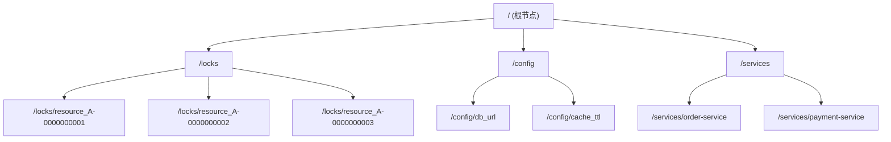
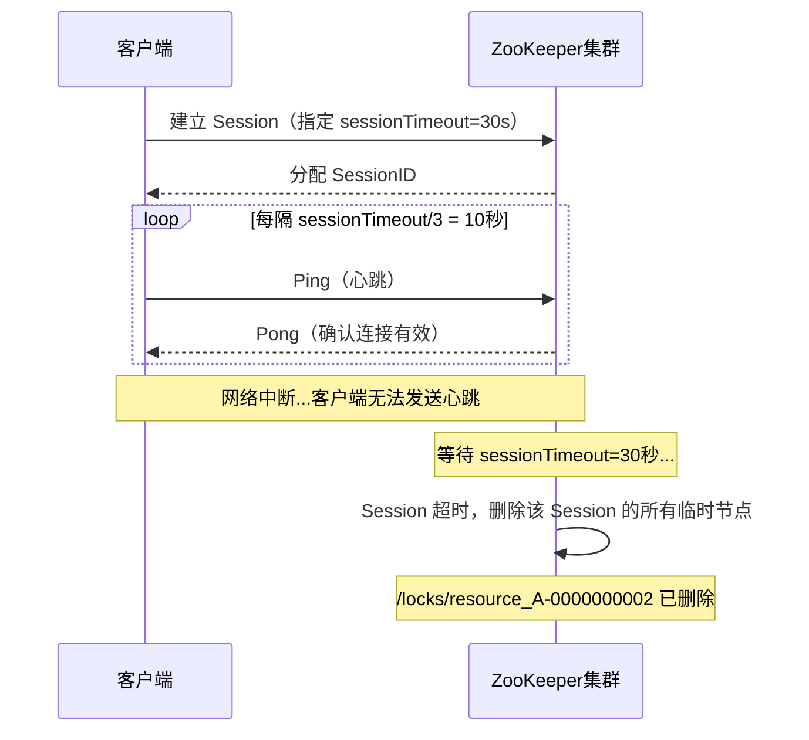
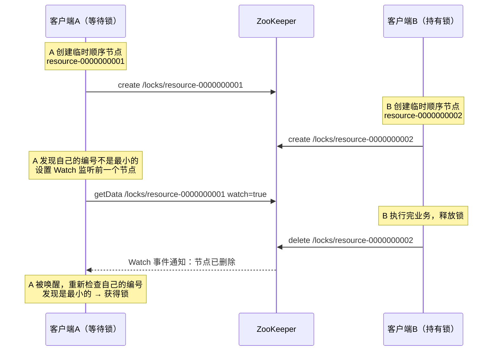
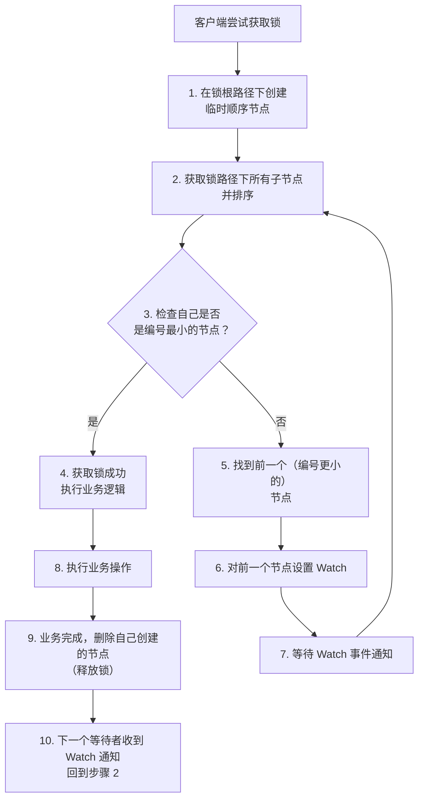
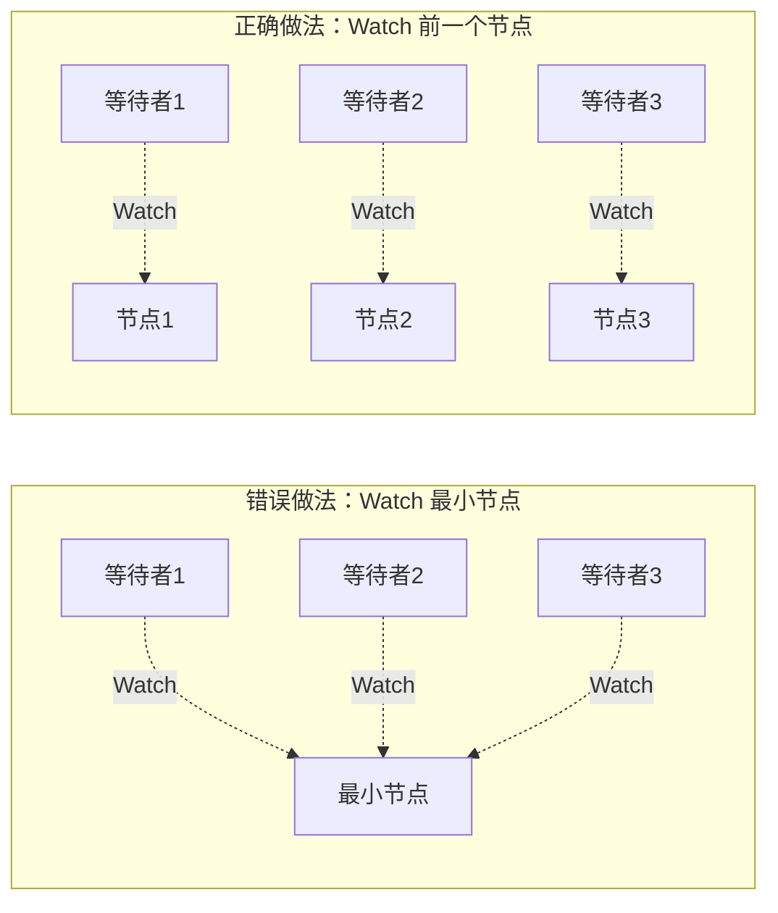
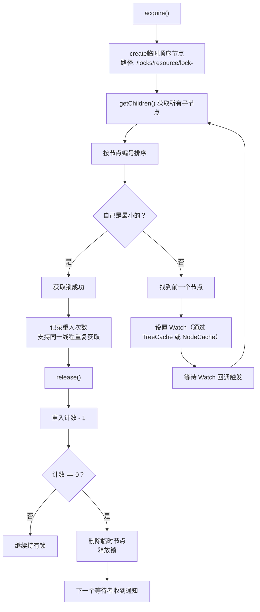
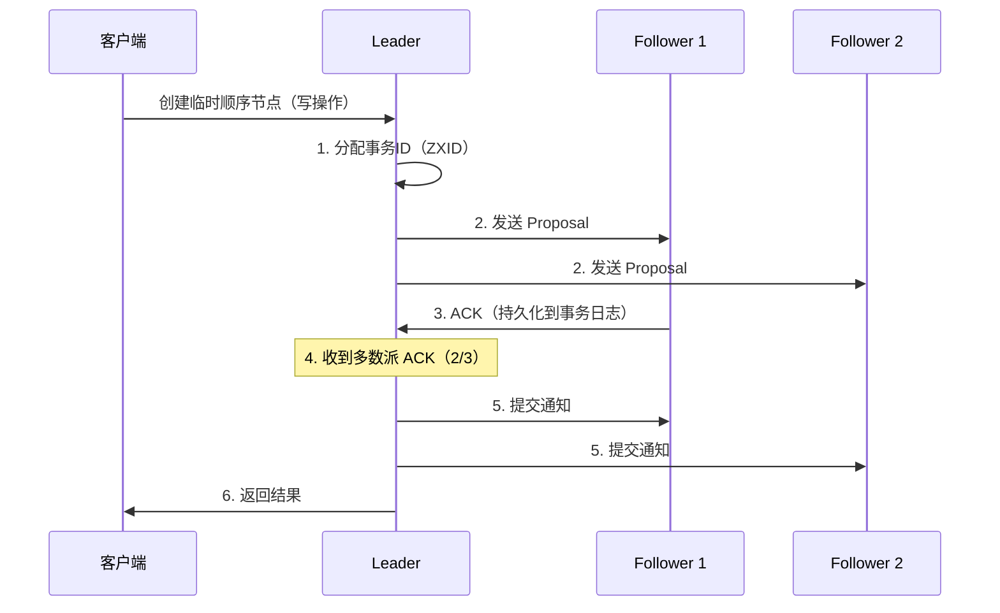
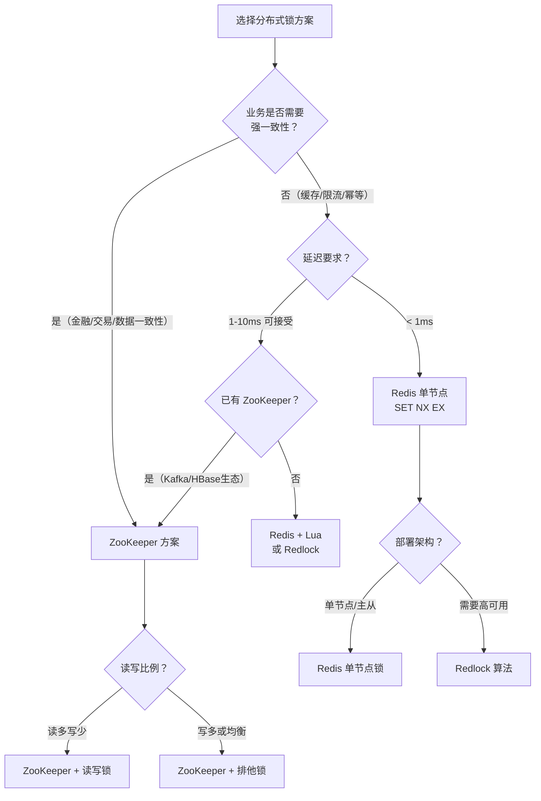
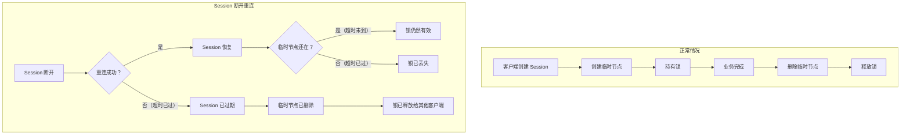

# ZooKeeper分布式锁

## 1. 概述与定位

在分布式锁的技术谱系中，ZooKeeper 方案与 Redis 方案构成了两条截然不同的路线：Redis 追求极致性能，ZooKeeper 追求强一致性。选择 ZooKeeper 实现分布式锁，本质上是选择了一条"用延迟换安全"的道路。

**ZooKeeper 的核心定位：** 它不是一个缓存或数据库，而是一个分布式协调服务。ZooKeeper 的设计目标是为分布式系统提供"顺序一致性、原子性、单一系统映像、持久性、可靠性"五大保证。分布式锁只是它提供的协调能力之一——服务注册发现、配置管理、Leader 选举、分布式队列等都是它的典型应用场景。

### 1.1 ZooKeeper 为什么能实现分布式锁

ZooKeeper 能实现分布式锁，依赖于三个核心机制的协同工作：

| 核心机制 | 作用 | 对锁的意义 |
|---------|------|-----------|
| **临时顺序节点（Ephemeral Sequential）** | 客户端创建的节点在 Session 断开时自动删除，且自动编号 | 保证锁持有者崩溃后锁自动释放，且等待者有明确的排队顺序 |
| **Watch 监听机制** | 客户端可以对节点设置监听，节点变化时收到通知 | 等待者不需要轮询，锁释放时立即被通知 |
| **ZAB 协议（强一致性）** | 所有写操作经过 Leader 提案→多数派投票→提交的流程 | 加锁操作在所有节点上看到的结果一致，不存在 Redis 主从切换丢锁的问题 |

这三个机制组合在一起，形成了一个**自愈的、有序的、强一致的**分布式锁方案。

### 1.2 ZooKeeper 分布式锁 vs Redis 分布式锁

在深入 ZooKeeper 之前，先明确两种方案的本质差异：

| 对比维度 | ZooKeeper | Redis |
|---------|-----------|-------|
| 一致性模型 | 强一致（ZAB 协议） | 主从切换时可能丢锁 |
| 加锁延迟 | 2-10ms（磁盘写入 + ZAB 共识） | < 1ms（内存操作） |
| 吞吐量 | 1万-3万 QPS/节点 | 10万+ QPS/节点 |
| 锁释放方式 | Session 超时自动删除临时节点 | 需要主动 DEL 或等待 TTL |
| 等待机制 | Watch 监听，O(1) 通知 | 轮询重试，有延迟 |
| 公平性 | 天然 FIFO（顺序节点编号） | 非公平（竞争式获取） |
| 客户端断开处理 | Session 超时 → 临时节点删除 → 锁自动释放 | TTL 超时 → 锁自动释放 |
| 运维复杂度 | 高（JVM + 依赖 + 复杂配置） | 低（单二进制，广泛部署） |
| 典型使用场景 | 强一致性要求、任务调度、Leader 选举 | 高并发、缓存击穿防护、限流 |

**选型建议：** 如果业务对一致性要求极高（如金融交易、分布式事务协调），或者已经部署了 ZooKeeper 集群（如 Hadoop/Kafka/HBase 生态），优先选择 ZooKeeper。如果追求低延迟和高吞吐，且能容忍极低概率的不一致（如缓存击穿防护、秒杀限流），Redis 是更好的选择。

---

## 2. ZooKeeper 基础概念

在理解 ZooKeeper 分布式锁之前，需要掌握几个关键概念。

### 2.1 数据模型：树形 ZNode 结构

ZooKeeper 的数据组织方式类似文件系统，每个节点称为 ZNode：



**ZNode 的四种类型：**

| 类型 | 特性 | 生命周期 | 锁相关用途 |
|------|------|---------|-----------|
| **持久节点（Persistent）** | 创建后一直存在，除非显式删除 | 手动删除前永久存在 | 存储锁的根路径（如 `/locks`） |
| **临时节点（Ephemeral）** | 与客户端 Session 绑定 | Session 断开后自动删除 | **锁的核心**：持有者创建临时节点，崩溃后自动释放 |
| **持久顺序节点（Persistent Sequential）** | 持久 + 自动追加递增编号 | 手动删除前永久存在 | 较少用于锁 |
| **临时顺序节点（Ephemeral Sequential）** | 临时 + 自动追加递增编号 | Session 断开后自动删除 | **锁的完美选择**：既自动释放，又有排队顺序 |

**临时节点的关键特性：** 临时节点的生命周期与创建它的客户端 Session 绑定。当客户端因崩溃、网络断开、GC 长时间停顿等原因无法维持 Session 时，ZooKeeper 服务端会在 Session 超时后自动删除该客户端创建的所有临时节点。这是 ZooKeeper 分布式锁"防死锁"的底层保障。

### 2.2 Session 机制：连接与心跳

客户端与 ZooKeeper 建立的是长连接（Session），通过心跳维持活性：



**Session 超时时间的选择：**

| Session 超时 | 适用场景 | 注意事项 |
|-------------|---------|---------|
| 5-10秒 | 对锁释放速度要求极高 | 网络抖动容易触发误删 |
| **10-30秒** | **通用场景** | **推荐值** |
| 30-60秒 | 网络环境较差 | 锁释放延迟增大 |
| > 60秒 | 极特殊场景 | 不推荐，故障恢复太慢 |

Session 超时设置需要在"快速释放"和"容忍网络抖动"之间找到平衡。过短会导致正常客户端因短暂网络抖动而丢锁，过长会导致崩溃后其他客户端等待过久。

### 2.3 Watch 监听机制

Watch 是 ZooKeeper 的事件通知机制，客户端可以对某个 ZNode 设置 Watch，当 ZNode 发生变化时收到通知：



**Watch 的两个关键特性：**

1. **一次性触发：** Watch 事件只通知一次。收到通知后，如果还需要继续监听，必须重新设置 Watch。这是 ZooKeeper 3.6+ 之前的行为，3.6+ 引入了持久递归 Watch（`addWatch`），可以持续监听。
2. **有序通知：** 客户端收到 Watch 通知时，一定能保证看到触发该事件的最新数据状态，不会出现"通知到了但数据还没更新"的情况。

---

## 3. 分布式锁算法详解

### 3.1 算法流程

ZooKeeper 分布式锁的标准实现基于"临时顺序节点 + Watch"模式，算法步骤如下：



**用伪代码描述：**

```python
import kazoo
from kazoo.client import KazooClient
import time
import uuid

class ZooKeeperDistributedLock:
    """
    基于临时顺序节点的 ZooKeeper 分布式锁
    """

    def __init__(self, zk_hosts: str, lock_path: str,
                 session_timeout: int = 30000):
        """
        Args:
            zk_hosts: ZooKeeper 集群地址，如 "host1:2181,host2:2181"
            lock_path: 锁的根路径，如 "/locks/order_resource"
            session_timeout: Session 超时时间（毫秒）
        """
        self.zk = KazooClient(hosts=zk_hosts, timeout=session_timeout)
        self.lock_path = lock_path
        self.node_name = str(uuid.uuid4())
        self.our_node_path = None

    def connect(self):
        """连接 ZooKeeper"""
        self.zk.start()
        # 确保锁的根路径存在（持久节点）
        self.zk.ensure_path(self.lock_path)

    def acquire(self, timeout: int = 30, retry_interval: float = 0.1) -> bool:
        """
        获取锁（阻塞等待，直到超时）

        Args:
            timeout: 最大等待时间（秒）
            retry_interval: Watch 失败后的重试间隔（秒）
        Returns:
            True 表示获取成功，False 表示超时
        """
        start_time = time.monotonic()

        # 步骤 1：创建临时顺序节点
        self.our_node_path = self.zk.create(
            path=f"{self.lock_path}/lock-",
            value=b"",
            ephemeral=True,       # 临时节点：Session 断开自动删除
            sequence=True,        # 顺序节点：自动追加递增编号
        )
        # our_node_path 例如: /locks/order_resource/lock-0000000003

        while True:
            # 步骤 2：获取所有子节点并排序
            children = self.zk.get_children(self.lock_path)
            children.sort()  # 按编号排序

            # 步骤 3：获取自己的节点名
            our_name = self.our_node_path.split("/")[-1]

            # 步骤 4：检查自己是否是最小的
            if children[0] == our_name:
                # 自己编号最小，获得锁
                return True

            # 步骤 5：找到前一个节点
            our_index = children.index(our_name)
            prev_node = children[our_index - 1]
            prev_path = f"{self.lock_path}/{prev_node}"

            # 步骤 6：对前一个节点设置 Watch
            event = threading.Event()

            @self.zk.DataWatch(prev_path)
            def watch_prev_node(data, stat):
                if stat is None:
                    # 节点已被删除（锁已释放），唤醒等待
                    event.set()

            # 步骤 7：等待 Watch 事件或超时
            elapsed = time.monotonic() - start_time
            remaining = timeout - elapsed
            if remaining <= 0:
                # 超时，删除自己创建的节点，放弃获取锁
                self._cleanup()
                return False

            event.wait(timeout=min(remaining, retry_interval))
            # Watch 触发后回到循环开头，重新检查排序

    def release(self):
        """释放锁：删除自己创建的临时节点"""
        self._cleanup()

    def _cleanup(self):
        """删除临时节点"""
        if self.our_node_path and self.zk.exists(self.our_node_path):
            self.zk.delete(self.our_node_path)

    def disconnect(self):
        """断开 ZooKeeper 连接"""
        self.zk.stop()
```

### 3.2 算法关键点剖析

#### 3.2.1 为什么用临时顺序节点而不是普通节点

| 方案 | 问题 | 风险 |
|------|------|------|
| 持久节点 + 手动删除 | 客户端崩溃后节点不删除 | **死锁**：其他客户端永远等待 |
| 临时节点 + 非顺序 | 客户端崩溃后自动删除 | **惊群效应**：多个等待者同时被唤醒竞争 |
| **临时节点 + 顺序** | **自动删除 + FIFO 排队** | **无**：崩溃安全，无惊群，天然公平 |

**惊群效应（Herd Effect）详解：**

在不使用顺序节点的方案中，当锁被释放时，所有等待的客户端都会收到通知并同时尝试获取锁，导致大量无意义的竞争。在 ZooKeeper 中，即使不使用顺序节点，可以通过"让每个等待者只 Watch 前一个节点"来避免惊群，但非顺序节点无法确定"前一个"是谁。临时顺序节点完美解决了这两个问题。

#### 3.2.2 为什么 Watch 前一个节点而不是最小节点

有两种常见的 Watch 策略：

**策略 A：Watch 最小节点变化（错误做法）**
- 当锁释放时，所有等待者都收到通知 → 惊群效应
- 即使只有一个锁释放，所有等待者都被唤醒，只有一个能获取锁，其余白白消耗资源

**策略 B：Watch 前一个节点变化（正确做法）**
- 每个等待者只监听排在自己前面的那一个节点
- 锁释放时，只有一个等待者收到通知 → 无惊群
- 整体通知开销为 O(1) 而非 O(n)



#### 3.2.3 为什么用 getChildren 而不是 getData

算法中使用 `getChildren` 获取所有子节点列表，而不是用 `getData` 读取特定节点。原因是：

- `getChildren` 是一次原子操作，返回锁路径下所有子节点的完整列表
- `getData` 只能读取单个节点的数据，无法知道全局排序
- `getChildren` 的结果保证是某一时刻的快照，不会出现"看到一半更新一半旧"的情况

### 3.3 算法的正确性分析

**互斥性保证：** 只有编号最小的临时顺序节点才能获取锁。由于节点编号全局唯一且递增，不会有两个客户端同时成为最小节点。

**防死锁保证：** 客户端崩溃 → Session 超时 → 临时节点自动删除 → 下一个等待者收到 Watch 通知 → 获取锁。不存在锁永远无法释放的情况。

**顺序性保证：** 节点编号由 ZooKeeper 服务端统一分配，严格递增。获取锁的顺序与创建节点的顺序一致。

**活锁保证：** 只要 ZooKeeper 集群正常运行，每个等待者最终都会收到通知并获取锁（前提是其 Session 仍然存活）。

---

## 4. 生产环境实现：Apache Curator

在实际生产环境中，直接使用 ZooKeeper 原生 API 实现分布式锁过于繁琐。Apache Curator 是 Netflix 开源的 ZooKeeper 客户端库，提供了经过充分测试的分布式锁实现。

### 4.1 Curator InterProcessMutex：可重入分布式锁

```java
import org.apache.curator.framework.CuratorFramework;
import org.apache.curator.framework.CuratorFrameworkFactory;
import org.apache.curator.framework.recipes.locks.InterProcessMutex;
import org.apache.curator.retry.ExponentialBackoffRetry;

import java.util.concurrent.TimeUnit;

public class ZkDistributedLockExample {

    public static void main(String[] args) throws Exception {
        // 1. 创建 Curator 客户端
        CuratorFramework client = CuratorFrameworkFactory.builder()
            .connectString("zk1:2181,zk2:2181,zk3:2181")
            .sessionTimeoutMs(30000)           // Session 超时 30 秒
            .connectionTimeoutMs(15000)         // 连接超时 15 秒
            .retryPolicy(new ExponentialBackoffRetry(
                1000,   // 初始重试间隔 1 秒
                3,      // 最大重试 3 次
                1000    // 最大重试间隔 1 秒
            ))
            .namespace("myapp")                 // 命名空间隔离
            .build();
        client.start();
        client.blockUntilConnected(15, TimeUnit.SECONDS);

        // 2. 创建可重入分布式锁
        InterProcessMutex lock = new InterProcessMutex(
            client,
            "/locks/order_resource"             // 锁路径
        );

        try {
            // 3. 尝试获取锁（最多等待 10 秒）
            if (lock.acquire(10, TimeUnit.SECONDS)) {
                try {
                    // 4. 锁获取成功，执行业务逻辑
                    System.out.println("获取锁成功，执行业务操作...");
                    processOrder();
                } finally {
                    // 5. 释放锁（必须在 finally 中）
                    lock.release();
                    System.out.println("锁已释放");
                }
            } else {
                // 6. 获取锁超时
                System.out.println("获取锁超时，跳过本次操作");
            }
        } catch (Exception e) {
            e.printStackTrace();
        } finally {
            client.close();
        }
    }

    private static void processOrder() throws InterruptedException {
        // 模拟业务操作
        Thread.sleep(2000);
    }
}
```

### 4.2 Curator 提供的四种锁

| 锁类型 | 类名 | 特性 | 适用场景 |
|--------|------|------|---------|
| **可重入排他锁** | `InterProcessMutex` | 同一线程可多次获取，其他线程等待 | 通用场景，最常用 |
| **不可重入排他锁** | `InterProcessSemaphoreMutex` | 同一线程获取多次会死锁 | 不可重入的场景 |
| **读写锁** | `InterProcessReadWriteLock` | 多个读者可以同时持有读锁，写锁互斥 | 读多写少场景 |
| **共享信号量** | `InterProcessSemaphoreV2` | 限制同时访问的客户端数量 | 限流、资源池控制 |
| **MultiLock** | `InterProcessMultiLock` | 同时获取多把锁，全部获取成功才算成功 | 需要同时锁定多个资源 |

**读写锁使用示例：**

```java
import org.apache.curator.framework.recipes.locks.InterProcessReadWriteLock;

// 创建读写锁
InterProcessReadWriteLock rwLock = new InterProcessReadWriteLock(
    client, "/locks/config_resource"
);

// 读锁：多个客户端可以同时获取
rwLock.readLock().acquire(10, TimeUnit.SECONDS);
try {
    // 读操作：可以并发执行
    readConfig();
} finally {
    rwLock.readLock().release();
}

// 写锁：排他，其他读锁和写锁都必须等待
rwLock.writeLock().acquire(10, TimeUnit.SECONDS);
try {
    // 写操作：独占执行
    updateConfig();
} finally {
    rwLock.writeLock().release();
}
```

**MultiLock 使用示例：**

```java
import org.apache.curator.framework.recipes.locks.InterProcessMultiLock;
import java.util.Arrays;

// 同时锁定多个资源（全部成功才算成功）
InterProcessMultiLock multiLock = new InterProcessMultiLock(
    client,
    Arrays.asList("/locks/account_A", "/locks/account_B")
);

// 两把锁同时获取成功，才能执行转账操作
multiLock.acquire(10, TimeUnit.SECONDS);
try {
    transfer(accountA, accountB, amount);
} finally {
    multiLock.release();
}
```

### 4.3 Curator 底层实现剖析

Curator 的 `InterProcessMutex` 内部实现值得深入理解，它比上面的伪代码更加健壮：



**Curator 的关键优化：**

1. **Watch 管理：** Curator 使用 `TreeCache`（旧版）或 `NodeCache` 来管理 Watch，确保在 Watch 丢失（如 ZooKeeper 连接闪断）时能自动重建。原生 API 的 Watch 是一次性的，Curator 帮你处理了重新注册的细节。

2. **Session 恢复：** Curator 在 Session 断开重连后，能自动重建临时节点（通过 `EnsurePath` 和重试策略），减少因网络闪断导致的锁丢失。

3. **锁竞争优化：** Curator 在获取子节点列表后使用本地缓存排序，避免每次都从 ZooKeeper 读取完整的子节点列表，减少网络开销。

4. **异常安全：** Curator 的锁实现确保在任何异常路径下都能正确清理临时节点，防止锁泄漏。

---

## 5. Python 生态实现

### 5.1 使用 kazoo 库

```python
import threading
import uuid
import time
import logging
from kazoo.client import KazooClient
from kazoo.recipe.lock import Lock

logger = logging.getLogger(__name__)


class ZooKeeperDistributedLock:
    """
    基于 kazoo 的 ZooKeeper 分布式锁封装

    kazoo 的 Lock recipe 内部实现了临时顺序节点 + Watch 的完整算法，
    本类在其基础上增加了超时控制、重试策略和统计功能。
    """

    def __init__(
        self,
        zk_hosts: str,
        lock_path: str,
        session_timeout: int = 30000,
        connect_timeout: int = 15,
    ):
        """
        Args:
            zk_hosts: ZooKeeper 集群地址，如 "zk1:2181,zk2:2181,zk3:2181"
            lock_path: 锁路径，如 "/locks/order_resource"
            session_timeout: Session 超时时间（毫秒）
            connect_timeout: 连接超时时间（秒）
        """
        self.zk = KazooClient(
            hosts=zk_hosts,
            timeout=session_timeout,
        )
        self.lock_path = lock_path
        self.connect_timeout = connect_timeout
        self._lock = None
        self._acquire_count = 0
        self._acquire_total_ms = 0.0

    def start(self):
        """连接 ZooKeeper 并确保锁路径存在"""
        self.zk.start()
        self.zk.ensure_path(self.lock_path)
        self._lock = Lock(self.zk, self.lock_path)
        logger.info(f"ZooKeeper connected, lock path: {self.lock_path}")

    def acquire(self, timeout: int = 30, retry: int = 3) -> bool:
        """
        获取锁（带重试）

        Args:
            timeout: 最大等待时间（秒）
            retry: 获取锁失败后的重试次数
        Returns:
            True 表示获取成功
        Raises:
            TimeoutError: 连接超时
            Exception: ZooKeeper 不可用
        """
        if self._lock is None:
            raise RuntimeError("Lock not initialized. Call start() first.")

        for attempt in range(retry):
            start = time.monotonic()
            try:
                acquired = self._lock.acquire(timeout=timeout)
                elapsed_ms = (time.monotonic() - start) * 1000
                self._acquire_count += 1
                self._acquire_total_ms += elapsed_ms

                if acquired:
                    logger.debug(
                        f"Lock acquired: {self.lock_path}, "
                        f"attempt={attempt + 1}, latency={elapsed_ms:.1f}ms"
                    )
                    return True
                else:
                    logger.warning(
                        f"Lock acquire timeout: {self.lock_path}, "
                        f"attempt={attempt + 1}/{retry}"
                    )
            except Exception as e:
                elapsed_ms = (time.monotonic() - start) * 1000
                logger.error(
                    f"Lock acquire error: {self.lock_path}, "
                    f"error={e}, latency={elapsed_ms:.1f}ms"
                )
                if attempt < retry - 1:
                    # 指数退避重试
                    backoff = min(2 ** attempt, 5)
                    time.sleep(backoff)

        return False

    def release(self):
        """释放锁"""
        if self._lock and self._lock.is_acquired:
            self._lock.release()
            logger.debug(f"Lock released: {self.lock_path}")

    def stop(self):
        """断开连接"""
        if self._lock and self._lock.is_acquired:
            self.release()
        self.zk.stop()
        logger.info(
            f"Lock stats: path={self.lock_path}, "
            f"acquire_count={self._acquire_count}, "
            f"avg_latency={self._acquire_total_ms / max(self._acquire_count, 1):.1f}ms"
        )

    def __enter__(self):
        self.start()
        if not self.acquire():
            raise TimeoutError(f"Failed to acquire lock: {self.lock_path}")
        return self

    def __exit__(self, exc_type, exc_val, exc_tb):
        try:
            self.release()
        finally:
            self.stop()
        return False


# ============ 使用示例 ============

def demo_basic_lock():
    """基本用法：上下文管理器"""
    with ZooKeeperDistributedLock(
        zk_hosts="zk1:2181,zk2:2181,zk3:2181",
        lock_path="/locks/order_12345",
    ) as lock:
        # 在此作用域内独占执行
        process_order(12345)


def demo_retry_lock():
    """带重试的用法"""
    zk_lock = ZooKeeperDistributedLock(
        zk_hosts="zk1:2181,zk2:2181,zk3:2181",
        lock_path="/locks/inventory",
    )
    zk_lock.start()

    try:
        if zk_lock.acquire(timeout=30, retry=3):
            try:
                update_inventory()
            finally:
                zk_lock.release()
        else:
            # 获取锁失败，降级处理
            handle_lock_contention()
    finally:
        zk_lock.stop()


def demo_multi_resource():
    """多资源锁定：按固定顺序避免死锁"""
    resources = sorted(["account_A", "account_B", "account_C"])
    locks = []

    try:
        # 按字母顺序依次获取锁，避免循环等待
        for res in resources:
            lock = ZooKeeperDistributedLock(
                zk_hosts="zk1:2181,zk2:2181,zk3:2181",
                lock_path=f"/locks/{res}",
            )
            lock.start()
            if not lock.acquire(timeout=10):
                raise TimeoutError(f"Cannot acquire lock: {res}")
            locks.append(lock)

        # 所有锁获取成功，执行跨资源操作
        transfer_funds("account_A", "account_B", 100)
        transfer_funds("account_B", "account_C", 50)

    finally:
        # 按相反顺序释放锁
        for lock in reversed(locks):
            try:
                lock.release()
            finally:
                lock.stop()
```

### 5.2 使用 kazoo.recipe.lock.Lock 的内部实现

kazoo 的 `Lock` 类内部实现值得注意，它使用了一种比"Watch 前一个节点"更健壮的策略：

```python
# kazoo Lock 的核心逻辑（简化版）
# 来源：kazoo/recipe/lock.py

class Lock:
    def acquire(self, timeout=None):
        # 1. 创建临时顺序节点
        self.create_lock_node()

        while True:
            # 2. 获取子节点列表并排序
            children = self.zk.get_children(self.path)

            # 3. 如果有更早的锁（编号更小），等待
            if self.valid_children(children):
                # Watch 前一个节点的变化
                predecessor = self.find_predecessor(children)
                event = self.zk.exists(
                    self.path + "/" + predecessor,
                    watch=self._watch_predecessor
                )
                if event is None:
                    # 前一个节点已消失，重新检查
                    continue

                # 等待事件触发或超时
                self.wait_event(timeout)
            else:
                # 自己是最小的，获取锁成功
                return True

    def release(self):
        """删除临时节点，释放锁"""
        self.zk.delete(self.path + "/" + self.node_name)
```

---

## 6. 性能特征与调优

### 6.1 ZooKeeper 的性能瓶颈

ZooKeeper 的性能受限于其一致性协议（ZAB），每个写操作都需要：

1. **Leader 提案：** 客户端写请求转发给 Leader
2. **Proposal 广播：** Leader 将提案广播给所有 Follower
3. **多数派确认：** 等待超过半数节点持久化（写入事务日志）
4. **提交通知：** Leader 向所有节点发送提交消息



**性能数据参考（3 节点集群）：**

| 操作类型 | 延迟 | 吞吐量 |
|---------|------|--------|
| 读操作（syncRead） | 1-3ms | 5万-10万 QPS |
| 读操作（asyncRead） | < 1ms | 10万+ QPS |
| **写操作（创建节点）** | **3-10ms** | **1万-3万 QPS** |
| Watch 通知延迟 | 1-5ms | — |

可以看到，ZooKeeper 的写操作（创建/删除临时节点）延迟在 3-10ms 范围内，远高于 Redis 的亚毫秒级延迟。这是分布式锁竞争激烈时的瓶颈所在。

### 6.2 性能调优参数

**1. Session 超时时间**

sessionTimeout = 30000  # 毫秒，推荐 10-30 秒

过短 → 网络抖动导致误删临时节点；过长 → 崩溃后锁释放太慢。

**2. 连接池大小**

对于高并发场景，单个 ZooKeeper 客户端连接可能成为瓶颈。Curator 支持配置共享连接池：

```java
CuratorFramework client = CuratorFrameworkFactory.builder()
    .connectString("zk1:2181,zk2:2181,zk3:2181")
    .sessionTimeoutMs(30000)
    .connectionPolicy(new ExponentialBackoffRetry(...))
    .maxCloseWaitMs(5000)  // 关闭连接时的最大等待时间
    .build();
```

**3. 事务日志磁盘**

ZooKeeper 的写性能高度依赖磁盘 IO。事务日志（`dataLogDir`）应该放在独立的 SSD 磁盘上，避免与快照目录（`dataDir`）共用磁盘。

```properties
# zoo.cfg 关键配置
dataDir=/var/lib/zookeeper/snapshots
dataLogDir=/var/lib/zookeeper/txlogs   # 放在 SSD 上
autopurge.snapRetainCount=5
autopurge.purgeInterval=24
```

**4. 节点数量与集群规模**

| 集群节点数 | 可容忍故障数 | 写延迟 | 推荐场景 |
|-----------|-------------|--------|---------|
| 3 | 1 | 3-8ms | 小规模，开发测试 |
| **5** | **2** | **5-12ms** | **生产环境推荐** |
| 7 | 3 | 8-15ms | 大规模，金融级 |
| 9+ | 4+ | > 15ms | 不推荐，延迟过高 |

集群节点数超过 7 后，ZAB 协议的通信开销显著增加，延迟会明显上升。

### 6.3 锁竞争优化策略

当锁竞争激烈时（大量客户端争抢同一把锁），可以采取以下优化：

**1. 锁粒度细化**

```python
# 粗粒度：所有订单争抢一把锁
lock_path = "/locks/orders"

# 细粒度：每个订单一把锁，只锁自己需要的
lock_path = f"/locks/order_{order_id}"
```

**2. 锁分段**

```python
# 将一个大锁拆成多个段锁
class ShardedLock:
    def __init__(self, zk_client, base_path, shard_count=16):
        self.shards = []
        for i in range(shard_count):
            lock = ZooKeeperDistributedLock(
                zk_client, f"{base_path}/shard_{i:04d}"
            )
            self.shards.append(lock)

    def acquire(self, resource_key: str):
        # 根据资源 key 的哈希值选择锁段
        shard_index = hash(resource_key) % len(self.shards)
        return self.shards[shard_index].acquire()
```

**3. 读写分离**

```java
InterProcessReadWriteLock rwLock = new InterProcessReadWriteLock(
    client, "/locks/config"
);

// 读操作并发执行，不需要排他
rwLock.readLock().acquire();
try {
    readConfig();
} finally {
    rwLock.readLock().release();
}
```

---

## 7. 常见误区与故障排查

### 7.1 误区一：以为临时节点删除是实时的

**错误认知：** "客户端崩溃后，ZooKeeper 会立即删除其临时节点，锁马上释放。"

**实际情况：** ZooKeeper 需要等待 Session 超时后才删除临时节点。如果 Session 超时设置为 30 秒，客户端崩溃后其他等待者最多需要等 30 秒才能获取锁。

客户端崩溃 → Session 维持 → 超时等待（最长 sessionTimeout）→ 临时节点删除 → 锁释放

**应对策略：** Session 超时时间不要设置过长；对于时效性要求极高的场景，考虑 Redis 方案（TTL 通常更短）。

### 7.2 误区二：认为 ZooKeeper 分布式锁没有死锁风险

**错误认知：** "ZooKeeper 临时节点保证了自动释放，不可能死锁。"

**实际情况：** ZooKeeper 的分布式锁确实不存在传统意义上的死锁，但存在"假死锁"——即锁持有者仍在运行但无法完成业务，导致其他客户端长时间等待。

**典型场景：**
- 锁持有者执行业务时触发了 Full GC，暂停数秒甚至数十秒
- 锁持有者的数据库连接池耗尽，业务逻辑阻塞在等待连接上
- 锁持有者依赖的下游服务超时，业务逻辑卡在重试循环中

**应对策略：** 结合业务层面的超时机制，不要让其他客户端无限期等待。设置合理的最大等待时间，超时后执行降级逻辑。

### 7.3 误区三：忽略 Watch 丢失的情况

**错误认知：** "设置了 Watch 后，一定会收到通知。"

**实际情况：** 在某些极端情况下（如 ZooKeeper 集群网络分区、客户端 Session 闪断重连），Watch 可能丢失。如果使用原生 API，需要在 Watch 回调中重新检查锁状态并重新注册 Watch。

**Curator 的解决方案：** Curator 内部使用 `TreeCache` / `NodeCache` 管理 Watch，能自动处理 Watch 丢失和重建，大幅降低了开发者的复杂度。

### 7.4 故障排查清单

| 症状 | 可能原因 | 排查方法 |
|------|---------|---------|
| 获取锁超时 | ZooKeeper 集群不可达 | `echo ruok \| nc zk1 2181`，检查四字命令 |
| 获取锁超时 | 锁路径下有大量残留节点 | `zkCli.sh -server zk1:2181 ls /locks` |
| 频繁锁丢失 | Session 超时设置过短 | 检查客户端日志中的 Session 重连事件 |
| 频繁锁丢失 | 网络延迟过高 | 使用 `zkCli.sh stat` 检查 Session 状态 |
| Watch 不触发 | Watch 注册失败 | 检查 `kazoo` / `Curator` 日志中的 Watch 注册 |
| 节点创建失败 | ZooKeeper 磁盘满 | 检查 ZooKeeper 节点的磁盘空间 |
| 连接频繁断开 | Session 超时太短或网络不稳 | 调大 `sessionTimeout`，检查网络质量 |

**常用 ZooKeeper 运维命令：**

```bash
# 检查 ZooKeeper 状态
echo stat | nc zk1 2181

# 查看所有连接的客户端
echo cons | nc zk1 2181

# 查看 Watch 信息
echo wchs | nc zk1 2181

# 查看节点数据
zkCli.sh -server zk1:2181 get /locks

# 查看子节点列表
zkCli.sh -server zk1:2181 ls /locks

# 删除残留的锁节点（谨慎操作！）
zkCli.sh -server zk1:2181 delete /locks/lock-0000000042
```

---

## 8. ZooKeeper 分布式锁的真实应用场景

### 8.1 Leader 选举

ZooKeeper 分布式锁最经典的应用之一是分布式系统中的 Leader 选举。多节点通过竞争同一把锁，获取锁的节点成为 Leader：

```python
class LeaderElection:
    """基于 ZooKeeper 临时顺序节点的 Leader 选举"""

    def __init__(self, zk_client, election_path, node_data):
        self.zk = zk_client
        self.election_path = election_path
        self.node_data = node_data
        self.is_leader = False
        self.node_path = None

    def run(self):
        """参与选举"""
        # 创建临时顺序节点
        self.node_path = self.zk.create(
            path=f"{self.election_path}/candidate-",
            value=self.node_data.encode(),
            ephemeral=True,
            sequence=True,
        )

        while True:
            # 获取所有候选人
            children = sorted(self.zk.get_children(self.election_path))

            if self.node_path.split("/")[-1] == children[0]:
                # 自己编号最小，成为 Leader
                self.is_leader = True
                self.on_become_leader()
                return
            else:
                # Watch 前一个候选人
                prev_idx = children.index(
                    self.node_path.split("/")[-1]
                ) - 1
                prev_node = children[prev_idx]
                event = threading.Event()

                @self.zk.DataWatch(f"{self.election_path}/{prev_node}")
                def watch_prev(data, stat):
                    if stat is None:
                        event.set()

                event.wait()

    def on_become_leader(self):
        """成为 Leader 后的回调"""
        print(f"Node {self.node_data} is now the LEADER")
```

### 8.2 分布式任务调度

在多节点部署的任务调度系统中，确保同一任务只被一个节点执行：

```python
class DistributedScheduler:
    """分布式任务调度器：保证任务不重复执行"""

    def __init__(self, zk_hosts):
        self.zk = KazooClient(hosts=zk_hosts)
        self.zk.start()
        self.zk.ensure_path("/scheduler/tasks")

    def execute_task(self, task_id: str):
        """尝试执行任务（使用锁保证不重复）"""
        lock_path = f"/scheduler/tasks/{task_id}"

        lock = ZooKeeperDistributedLock(
            zk_hosts=self.zk.hosts,
            lock_path=lock_path,
        )
        lock.start()

        try:
            if lock.acquire(timeout=5):
                # 检查任务是否已被其他节点完成
                if self.zk.exists(f"{lock_path}/completed"):
                    return "skipped"

                # 执行任务
                self._do_task(task_id)

                # 标记任务完成
                self.zk.create(
                    f"{lock_path}/completed",
                    value=b"done",
                    ephemeral=False,  # 持久节点，防止重复执行
                )
                return "completed"
            else:
                return "contended"
        finally:
            lock.release()
```

### 8.3 分布式配置更新

保证配置更新的原子性和顺序性：

```python
class DistributedConfigManager:
    """分布式配置管理器：保证配置更新有序执行"""

    def __init__(self, zk_hosts):
        self.zk = KazooClient(hosts=zk_hosts)
        self.zk.start()

    def update_config(self, config_name: str, new_value: dict):
        """原子性更新配置（锁保证同一时间只有一个更新在执行）"""
        lock = ZooKeeperDistributedLock(
            zk_hosts=self.zk.hosts,
            lock_path=f"/config/{config_name}/lock",
        )
        lock.start()

        try:
            if lock.acquire(timeout=10):
                # 读取当前配置版本
                current = self.zk.get(f"/config/{config_name}")
                version = json.loads(current[0]).get("version", 0)

                # 写入新配置（版本号递增）
                new_config = {
                    "value": new_value,
                    "version": version + 1,
                    "updated_at": time.time(),
                }
                self.zk.set(
                    f"/config/{config_name}",
                    json.dumps(new_config).encode(),
                )
                return True
            return False
        finally:
            lock.release()
```

---

## 9. ZooKeeper 分布式锁与 Redis 方案的深度对比

### 9.1 一致性保证的根本差异

**Redis 的 CAP 选择：偏向 AP（可用性 + 分区容错）**

主从架构下：
Client → Master（加锁成功）→ 还未同步到 Slave → Master 宕机
                                                         ↓
Client B → Slave（提升为新 Master）→ 加锁成功 → 两个客户端同时持有锁

**ZooKeeper 的 CAP 选择：偏向 CP（一致性 + 分区容错）**

ZAB 协议保证：
Client → Leader（创建临时节点）→ 广播 Proposal → 多数派 ACK → 提交
                                                              ↓
任何节点宕机后：其他客户端在任意 Follower 上读取，看到的结果一致

### 9.2 故障场景对比

| 故障场景 | Redis 表现 | ZooKeeper 表现 |
|---------|-----------|---------------|
| 主节点宕机，从节点提升 | **可能丢锁**（异步复制窗口内） | **不丢锁**（ZAB 保证已提交的数据不丢失） |
| 网络分区（脑裂） | 可能出现两个主节点同时接受写入 | 旧 Leader 无法获得多数派，停止服务（安全优先） |
| GC 长时间停顿 | 客户端可能持有已过期的锁 | Session 超时后临时节点自动删除（同 Redis） |
| 节点时钟跳跃 | TTL 计算可能异常 | 不使用 TTL，基于 Session 管理（不受影响） |
| 客户端崩溃 | 需等待 TTL 过期 | 需等待 Session 超时（两者类似） |

### 9.3 选型决策树



---

## 10. ZooKeeper 锁的高级话题

### 10.1 会话管理与锁恢复

ZooKeeper 的 Session 管理是分布式锁可靠性的基石。理解 Session 在故障恢复中的行为至关重要：



**Session 恢复的关键点：**

1. **Session 过期前重连：** 临时节点仍然存在，锁仍然有效。客户端可以继续持有锁并执行业务。

2. **Session 过期后重连：** ZooKeeper 会分配一个新的 Session ID，旧的临时节点已被删除。客户端需要重新创建临时节点来获取锁。

3. **Curator 的 Session 恢复策略：** Curator 提供了 `SessionConnectionPolicy`，可以在 Session 过期后自动重建连接并恢复临时节点，但这是应用层面的恢复，不是原生 ZooKeeper 的保证。

### 10.2 ACL 权限控制

在生产环境中，应该对锁节点设置 ACL，防止非法客户端释放其他客户端的锁：

```python
from kazoo.security import ACL

# 只有特定用户可以读写锁节点
acl = ACL(
    perms=ALL,  # 或 READ | WRITE | CREATE | DELETE
    scheme="digest",
    credential="lock_user:password_hash"
)

# 创建锁路径时设置 ACL
self.zk.create("/locks", b"", acl=[acl])

# 临时节点创建时继承 ACL
self.zk.create(
    "/locks/lock-0000000001",
    b"",
    ephemeral=True,
    sequence=True,
    acl=[acl],
)
```

在 Java 中使用 Curator 设置 ACL：

```java
// 创建带 ACL 的锁路径
String path = client.create()
    .withProtection()
    .withMode(CreateMode.EPHEMERAL_SEQUENTIAL)
    .withACL(ZooDefs.Ids.CREATOR_ALL_ACL)
    .forPath("/locks/resource/lock-");
```

### 10.3 ZooKeeper 集群部署建议

| 配置项 | 建议值 | 说明 |
|--------|--------|------|
| 节点数 | 3 或 5（奇数） | 3 节点容忍 1 故障，5 节点容忍 2 故障 |
| `tickTime` | 2000ms | ZooKeeper 的基本时间单位 |
| `initLimit` | 10 | Follower 初始化连接的 tick 数（20秒） |
| `syncLimit` | 5 | Follower 同步的 tick 数（10秒） |
| `maxClientCnxns` | 200 | 每个 IP 的最大连接数 |
| `autopurge.snapRetainCount` | 5 | 保留的快照数量 |
| `autopurge.purgeInterval` | 24 | 自动清理间隔（小时） |
| `dataLogDir` | SSD 独立磁盘 | 事务日志必须高性能磁盘 |
| `jvmHeapSize` | 4-8GB | ZooKeeper JVM 堆大小 |

---

## 11. 本节小结

ZooKeeper 分布式锁的核心是"临时顺序节点 + Watch 机制"，其优势在于强一致性和天然公平性，代价是相对较高的延迟（3-10ms）。在选型时需要权衡一致性需求与性能需求：

- **选 ZooKeeper：** 金融交易、分布式事务协调、Leader 选举、已有 Kafka/Hadoop 生态
- **选 Redis：** 高并发缓存击穿、秒杀限流、接口幂等、对延迟敏感的场景

无论选择哪种方案，都要注意：锁持有者的崩溃处理（TTL/Session 超时）、锁续期机制（Watchdog）、锁粒度优化（分段锁）、以及生产环境的运维监控。分布式锁不是万能药——它解决的是互斥访问问题，但引入了延迟、可用性和复杂度的代价。在设计系统时，应该先问自己"是否真的需要分布式锁"，而不是"如何实现分布式锁"。
