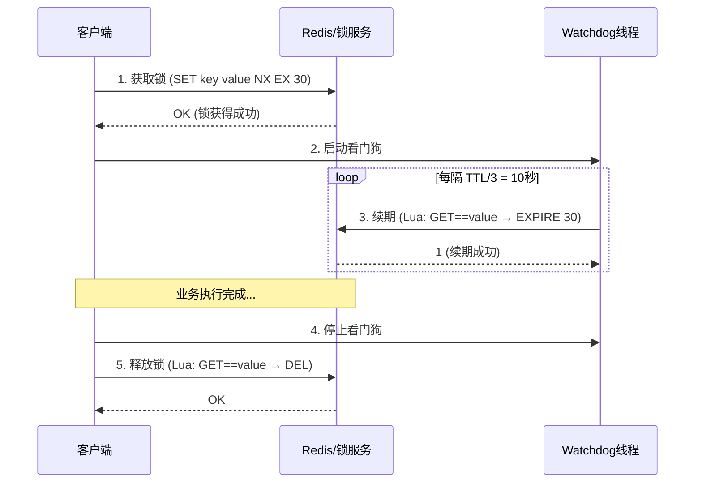
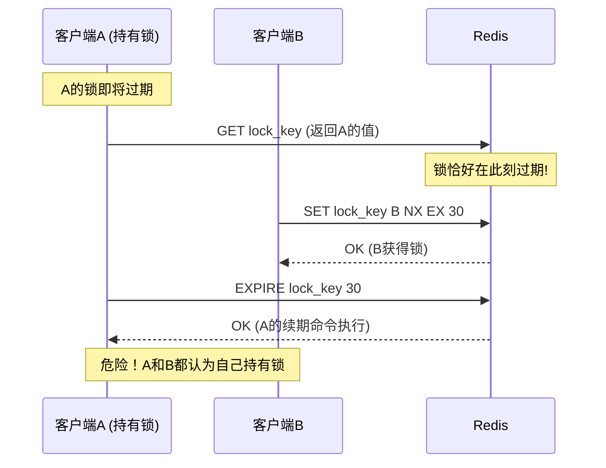
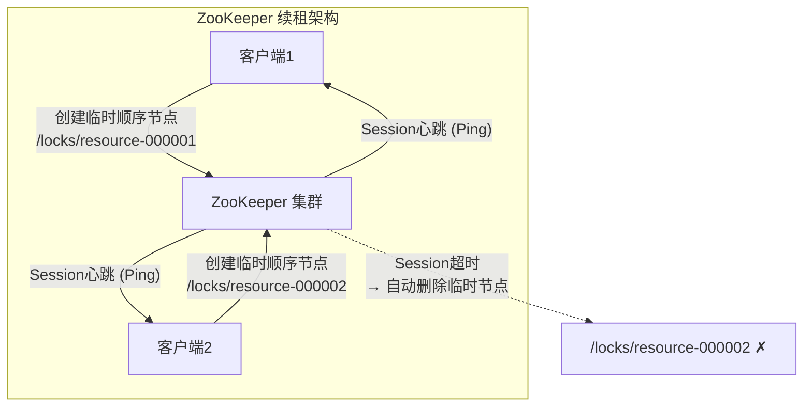
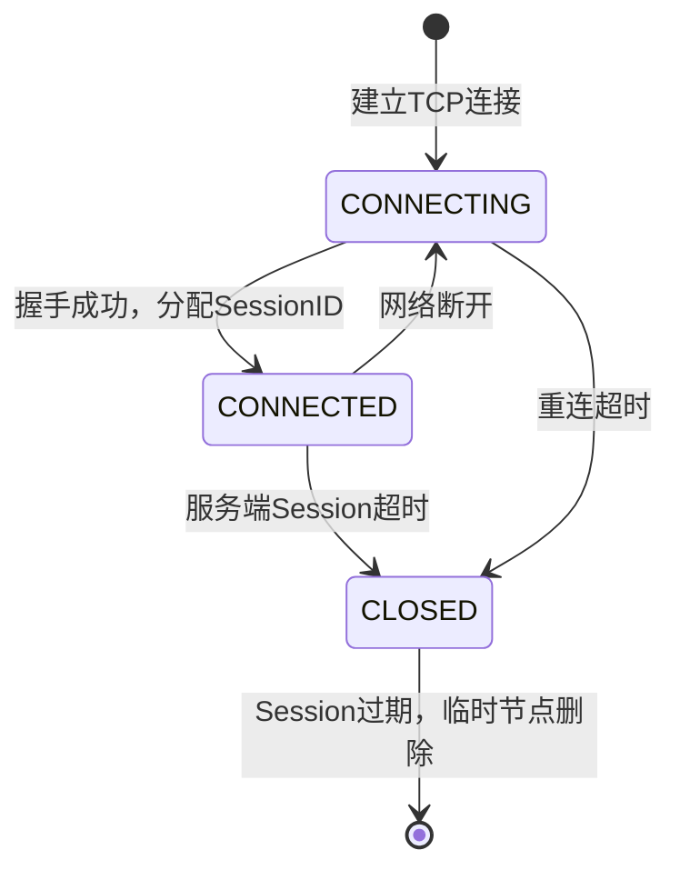
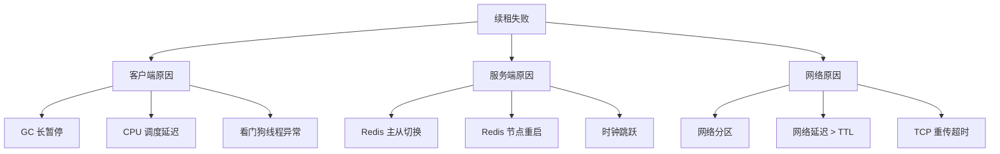
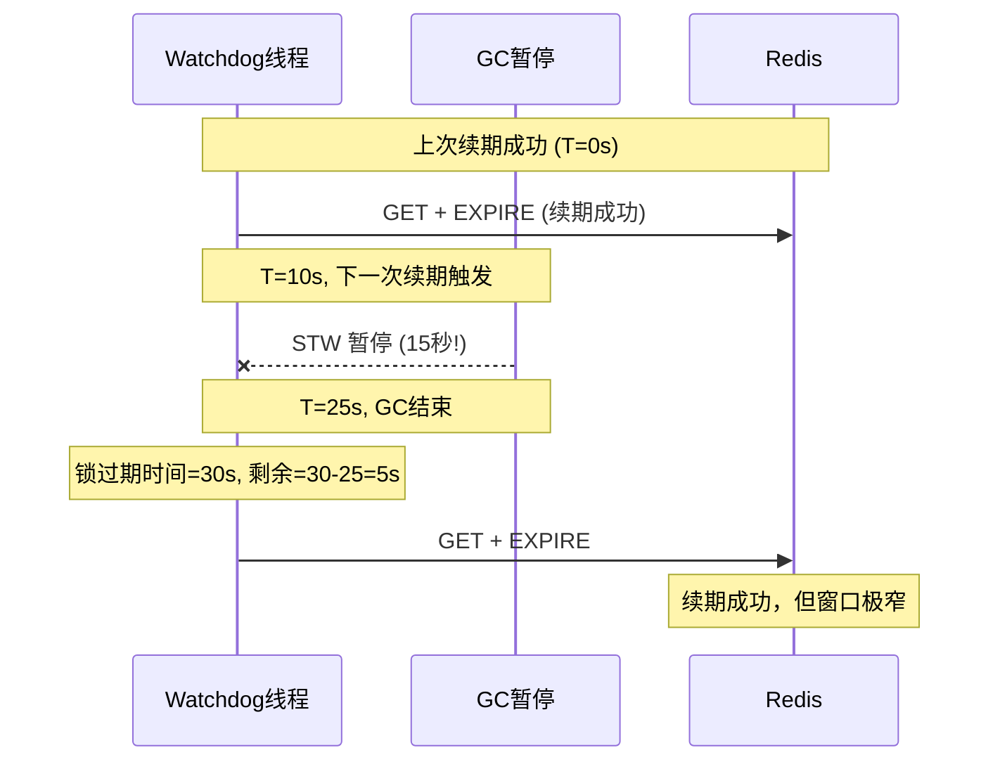
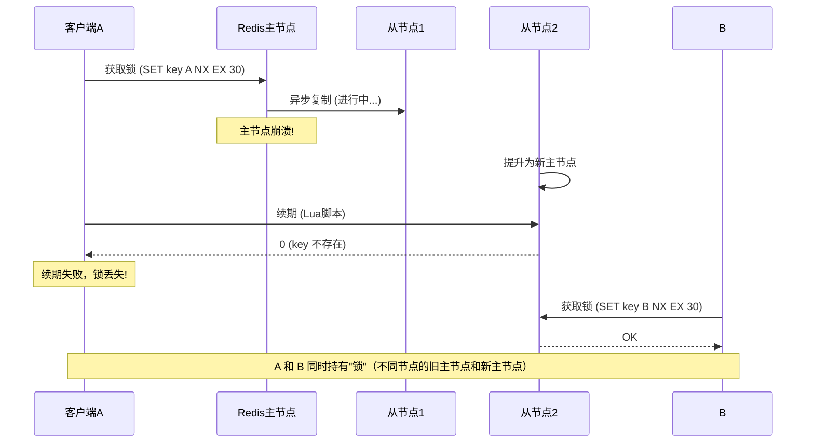
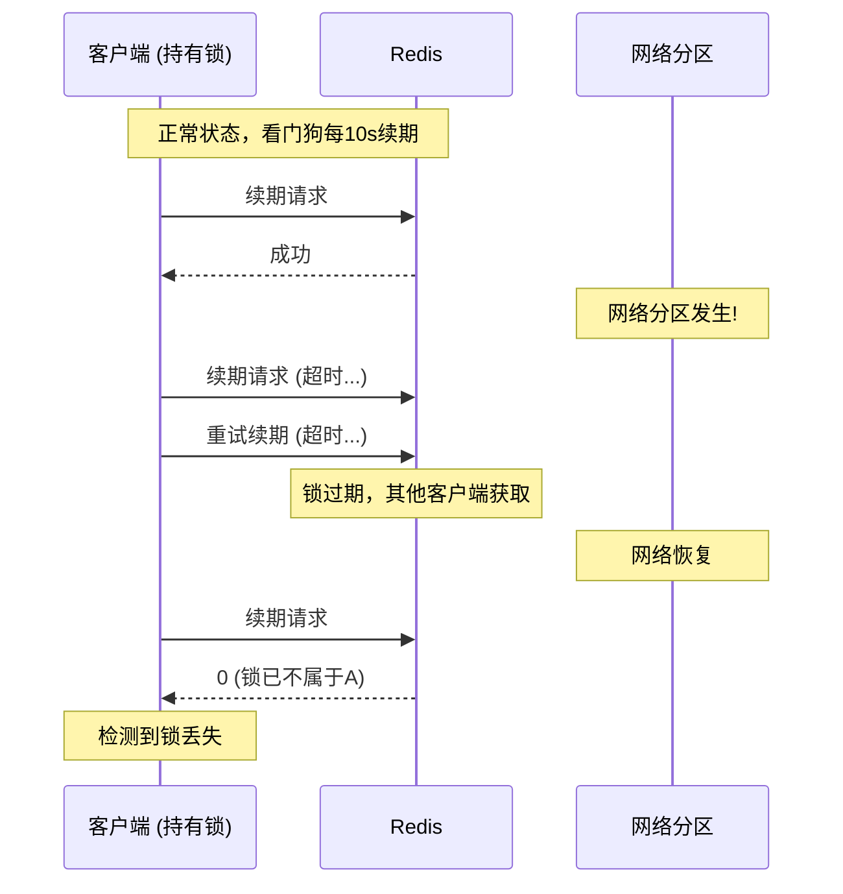
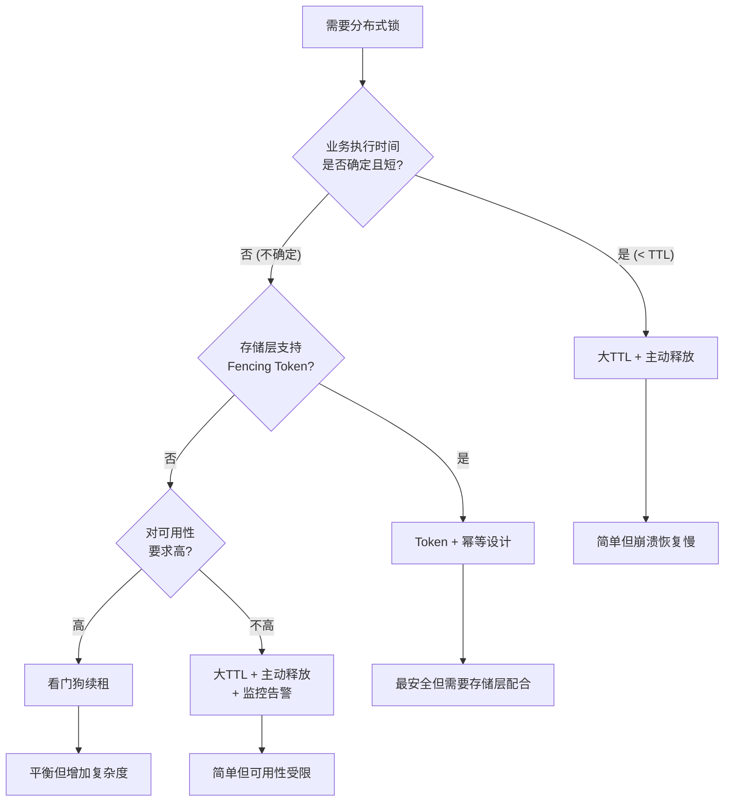

# 锁续租机制

## 1. 过期时间的两难困境

分布式锁的本质是"带过期时间的互斥标记"。与单机互斥锁不同，分布式锁必须设置过期时间（TTL），否则一旦持有者崩溃，锁将永远无法释放，造成全局死锁。然而，TTL 的设置面临着一个根本性的两难困境：

- **TTL 过短**：业务逻辑尚未执行完毕，锁就已过期。其他客户端在锁过期后获取同一把锁，导致两个客户端同时操作共享资源，并发安全被彻底破坏。
- **TTL 过长**：持有者崩溃后，其他客户端需要等待较长时间才能获取锁，系统可用性急剧下降。在极端情况下，即使只是短暂的网络抖动或 GC 暂停，也会导致锁的持有时间远超预期。

这个困境的核心矛盾在于：**业务执行时间是动态的、不可精确预知的，而 TTL 是静态的、必须预先设定的**。用一个固定的标尺去度量一个波动的量，必然会在某些时刻失准。

### 1.1 真实场景中的执行时间波动

下表展示了不同业务操作的典型执行时间及其波动范围：

| 业务操作 | 典型耗时 | P99 耗时 | 最大波动倍数 |
|----------|----------|----------|-------------|
| Redis 简单读写 | < 1ms | 5ms | 5x |
| 数据库单条查询 | 2-5ms | 20ms | 4-10x |
| HTTP 下游服务调用 | 50-200ms | 2s | 10-40x |
| 文件上传/下载 | 100ms-5s | 30s | 6-60x |
| 批量数据处理 | 1-10s | 120s | 12-120x |
| 跨机房 RPC | 10-50ms | 500ms | 10-100x |
| 消息队列消费+处理 | 200ms-5s | 60s | 30-300x |

可以看到，操作越复杂、越依赖外部资源，执行时间的波动就越大。即使你对业务逻辑了如指掌，也无法精确预测一次操作在高负载、网络抖动、GC 停顿等异常条件下的真实耗时。这正是锁续租机制存在的根本原因。

**关键洞察**：执行时间的波动并非均匀分布——它通常呈长尾分布（log-normal 或 Pareto）。这意味着 P99 的延迟可能是 P50 的 10-100 倍，而极端情况下的延迟可能更高。静态 TTL 无论设为多少，都只能覆盖某个百分位的场景，对长尾场景无能为力。

### 1.2 从静态 TTL 到动态续租的演进


| 阶段 | 方式 | 优点 | 缺点 | 适用场景 |
|------|------|------|------|----------|
| 静态 TTL | SET key NX EX 30 | 最简单 | 无法适应执行时间波动 | 执行时间确定且短的操作 |
| 手动续租 | 业务代码中调用 EXPIRE | 精确控制 | 侵入性强，容易遗漏 | 极少数定制化场景 |
| 自动续租 | 后台线程定时续期 | 透明、通用 | 增加系统复杂度 | 大多数分布式锁场景 |
| 自适应续租 | 根据延迟动态调整间隔 | 最优平衡 | 实现复杂 | 高性能、大规模集群 |

### 1.3 续租机制的设计哲学

续租机制的设计体现了分布式系统的一个核心权衡：**用运行时复杂度换取确定性保障**。静态 TTL 是"设定后不管"的简单策略，但在分布式环境的不确定性面前不够可靠。续租机制通过引入一个持续运行的后台任务，将"一次性设定"变为"持续维护"，代价是增加了系统的运行时复杂度（额外的线程/协程、额外的 Redis 请求、额外的错误处理逻辑），但换来了对业务执行时间不确定性的有效应对。

这种设计思想在分布式系统中并不罕见——它与 TCP 的 Keep-Alive、Kubernetes 的 Liveness Probe、微服务的心跳检测本质上是同一类问题的不同表现：**如何在不可靠的网络上检测对端的存活状态**。

## 2. 锁续租的核心原理

锁续租（Lease Renewal）的核心思想是：**将锁的有效期与持有者的存活状态动态绑定**。持有者在正常工作期间持续"续费"，一旦停止续费（无论是主动释放还是被动崩溃），锁在到期后自动释放。

### 2.1 续租的生命周期



整个生命周期分为五个阶段：获取锁 → 启动续租线程 → 周期性续期 → 业务完成 → 停止续租并释放。关键在于，续租线程与业务线程是独立的——即使业务线程因阻塞而无法主动释放锁，续租线程仍然能维持锁的有效性；反之，若客户端崩溃，续租线程随之终止，锁最终过期释放。

**续租线程的独立性是整个机制的基石**。这种设计确保了两个关键属性：
1. **业务阻塞不丢锁**：业务线程因 GC 暂停、CPU 竞争等原因暂时无法运行时，续租线程作为独立的执行单元仍可继续工作
2. **进程崩溃自动释放**：续租线程通常以守护线程（daemon thread）或 goroutine 方式运行，随主进程退出而终止，锁自然过期

### 2.2 续租间隔的选择：为什么是 TTL/3

续租间隔是续租机制中最关键的参数之一。Redisson 框架选择了 TTL/3 作为默认间隔，这背后有严格的数学推导。

设锁的过期时间为 `T`，续租间隔为 `k`。考虑最坏情况：一次续租请求发出后、Redis 执行前，网络延迟了 `d` 秒。续租操作需要满足：

k + d < T

即下一次续租触发前，当前锁的剩余有效期必须大于零。

**更精确的分析**：续租操作的时序如下：

时刻 0:   上一次续期完成，锁有效期 = T
时刻 k:   下一次续期触发，锁剩余有效期 = T - k
时刻 k+d: 续期请求到达 Redis，锁剩余有效期 = T - k - d
          → 必须 > 0，否则锁已过期

因此约束条件为：`k + d < T`，即 `d < T - k`。

如果 `k = T/3`，则允许的最大网络延迟为 `T - T/3 = 2T/3`。即使发生连续两次续租失败（极端网络情况），锁仍有 `T - 2k = T/3` 的缓冲时间。这个缓冲足以覆盖绝大多数网络抖动和 GC 暂停。

**为什么不是 TTL/2**：间隔为 T/2 时，容错空间仅为 T/2。假设 T=30s，一次续期失败后剩余 15s，如果此时恰好发生一次 15s 以上的 GC 暂停，锁就会过期。而 TTL/3 在同样场景下有 20s 的缓冲，能容纳更长的暂停。

**为什么不是 TTL/4 或更小**：虽然容错空间更大，但续租频率更高（T/4 = 7.5s），Redis 需要处理更多请求。在万级锁实例的场景下，这可能导致显著的 Redis 负载。TTL/3 是安全性与性能的最佳平衡点。

不同的间隔策略对比：

| 策略 | 间隔 (T=30s) | 容错空间 | 最大可容忍GC暂停 | Redis QPS (1000锁) | 适用场景 |
|------|-------------|---------|-----------------|-------------------|----------|
| TTL/2 | 15s | 15s | ~15s | 67 | 低GC压力、少量锁 |
| **TTL/3** | **10s** | **20s** | **~20s** | **100** | **通用场景（推荐）** |
| TTL/4 | 7.5s | 22.5s | ~22.5s | 133 | 高GC压力环境 |
| TTL/5 | 6s | 24s | ~24s | 167 | 极端GC环境（如大堆JVM） |

### 2.3 续租的原子性保证

续租操作必须是原子性的——**先检查锁是否仍被自己持有，再决定是否续期**。这两个步骤不能拆分为两条独立的 Redis 命令，否则存在竞态条件：



上图展示了续租的竞态条件：A 先 GET 检查成功（此时锁还是 A 的），但锁在 A 执行 EXPIRE 前恰好过期，B 获取了锁。A 随后的 EXPIRE 操作将 B 的锁续了期，导致两个客户端同时认为自己持有锁。**这正是 Lua 脚本原子性续租存在的根本原因**：

```lua
-- 原子性续期脚本：检查持有者 + 续期 合为一步
if redis.call("GET", KEYS[1]) == ARGV[1] then
    return redis.call("EXPIRE", KEYS[1], ARGV[2])
else
    return 0  -- 锁已不属于自己，放弃续期
end
```

Redis 的 Lua 脚本在执行期间阻塞所有其他命令，从而消除了竞态窗口。返回 0 表示锁已丢失，看门狗线程据此终止续租循环。

**竞态窗口分析**：在非原子操作中，竞态窗口的大小等于两条 Redis 命令之间的网络往返时间（RTT）加上 Redis 内部的处理时间。在正常网络条件下，这个窗口约为 0.1-2ms。虽然概率极低，但在高并发场景下（如秒杀系统），这个概率会随并发量线性增长。Lua 脚本将窗口压缩到零，从根本上消除了这个风险。

### 2.4 续租与锁释放的交互

续租线程与锁释放操作之间的协调是实现中的另一个关键点。锁释放必须遵循"先停止续租，再释放锁"的顺序，否则可能出现：

1. 业务线程释放锁（DEL）
2. 续租线程在同一时刻执行 Lua 脚本
3. 如果新客户端恰好获取了锁，续租线程的 Lua 脚本可能为新锁续期

正确的释放流程：

```lua
-- 原子性释放脚本：校验持有者后删除
if redis.call("GET", KEYS[1]) == ARGV[1] then
    return redis.call("DEL", KEYS[1])
else
    return 0  -- 锁已不属于自己，放弃删除
end
```

使用 Lua 脚本确保"检查+删除"的原子性，即使续租线程在释放前最后一次续期成功，也不会影响释放操作的正确性——因为释放操作同样会检查持有者身份。

## 3. 看门狗（Watchdog）机制详解

看门狗是锁续租的工程实现范式，最早由 Redisson 框架在 Java 生态中推广。其核心设计包括四个要素：后台守护线程、周期性定时器、原子续租脚本、异常终止机制。

### 3.1 Java 版本：Redisson 的实现

Redisson 的看门狗实现基于 Netty 的 `Timeout` 和 `TimerTask`，而非 `java.util.Timer`。这是因为在高并发场景下，`Timer` 的单线程模型可能成为瓶颈，而 Netty 的时间轮算法（HashedWheelTimer）能更高效地管理大量定时任务。

```java
// Redisson 看门狗核心逻辑（简化版）
public class RedissonWatchdog {
    private static final int LOCK_EXPIRE_SECONDS = 30;  // 默认过期时间
    private static final int WATCHDOG_TIMEOUT = 3;       // 续租超时倍数

    private final RedissonLock lock;
    private final Timeout watchdogTimeout;

    public void scheduleExpirationRenewal(long threadId) {
        // 使用 Netty 的 HashedWheelTimer 调度续期任务
        // 间隔 = LOCK_EXPIRE_SECONDS / WATCHDOG_TIMEOUT = 10秒
        watchdogTimeout = commandExecutor.getConnectionManager()
            .newTimeout(new TimerTask() {
                @Override
                public void run(Timeout timeout) {
                    // 原子性续期：Lua 脚本 GET + EXPIRE
                    Boolean future = renewExpirationAsync(threadId);
                    future.whenComplete((res, e) -> {
                        if (e != null) {
                            // 续期失败（锁已丢失或连接异常），停止看门狗
                            return;
                        }
                        if (res) {
                            // 续期成功，安排下一次续期
                            scheduleExpirationRenewal(threadId);
                        }
                    });
                }
            }, LOCK_EXPIRE_SECONDS / WATCHDOG_TIMEOUT, TimeUnit.SECONDS);
    }

    private CompletableFuture<Boolean> renewExpirationAsync(long threadId) {
        // Lua 脚本原子续期
        return evalWriteAsync("if (redis.call('exists', KEYS[1]) == 1) then " +
            "redis.call('pexpire', KEYS[1], ARGV[1]); " +
            "return 1; end; return 0;",
            LongCodec.INSTANCE, RedisCommands.EVAL_BOOLEAN,
            Collections.singletonList(getName()), threadId,
            internalLockLeaseTime);
    }
}
```

**关键设计点：**
- 使用 `pexpire`（毫秒级精度）而非 `expire`（秒级精度），减少续期误差
- 续期失败时不重试——锁已丢失，重试无意义
- 每次续期成功后重新调度下一次续期，形成链式调度而非固定间隔轮询
- 客户端主动释放锁时取消看门狗调度

**链式调度 vs 固定轮询**：Redisson 采用链式调度（每次成功后重新注册下一次定时任务），而非固定间隔轮询（如 `while(true) { sleep(interval); renew(); }`）。链式调度的优势在于：即使某次续期因网络延迟而推迟，下一次续期仍然基于实际完成时间来调度，不会产生累积漂移。

### 3.2 Python 版本：从零构建 Watchdog

在没有 Redisson 的 Python 生态中，可以使用 `threading` 模块构建同等功能的看门狗：

```python
import threading
import uuid
import time
import logging
from typing import Optional, Callable

logger = logging.getLogger(__name__)

class RedisWatchdog:
    """Redis分布式锁的看门狗续租实现"""

    # 原子性续期Lua脚本
    RENEW_SCRIPT = """
    if redis.call("GET", KEYS[1]) == ARGV[1] then
        return redis.call("PEXPIRE", KEYS[1], ARGV[2])
    else
        return 0
    end
    """

    def __init__(
        self,
        client,
        lock_key: str,
        lock_value: str,
        lease_ms: int = 30000,        # 锁过期时间（毫秒）
        renew_interval_ratio: float = 1/3,  # 续期间隔比例
        max_consecutive_failures: int = 3,  # 最大连续失败次数
    ):
        self.client = client
        self.lock_key = lock_key
        self.lock_value = lock_value
        self.lease_ms = lease_ms
        self.renew_interval_ms = int(lease_ms * renew_interval_ratio)
        self._max_consecutive_failures = max_consecutive_failures
        self._stop_event = threading.Event()
        self._thread: Optional[threading.Thread] = None
        self._renew_count = 0
        self._failed = False
        self._consecutive_failures = 0  # 连续失败计数
        self._on_failure: Optional[Callable] = None

    def start(self, on_failure: Optional[Callable] = None):
        """启动看门狗后台线程"""
        self._on_failure = on_failure
        self._stop_event.clear()
        self._thread = threading.Thread(
            target=self._renew_loop,
            name=f"watchdog-{self.lock_key}",
            daemon=True,  # 守护线程：主进程退出时自动终止
        )
        self._thread.start()
        logger.debug(f"Watchdog started: key={self.lock_key}, "
                     f"interval={self.renew_interval_ms}ms")

    def _renew_loop(self):
        """续租循环：周期性执行Lua脚本续期"""
        while not self._stop_event.wait(self.renew_interval_ms / 1000):
            try:
                start_time = time.monotonic()
                # 使用PEXPIRE（毫秒精度）而非EXPIRE（秒精度）
                result = self.client.eval(
                    self.RENEW_SCRIPT, 1,
                    self.lock_key, self.lock_value, self.lease_ms
                )
                latency_ms = (time.monotonic() - start_time) * 1000
                self._renew_count += 1

                if not result:
                    # 锁已不属于自己（已过期或被其他客户端获取）
                    self._failed = True
                    logger.warning(
                        f"Watchdog lost lock: key={self.lock_key}, "
                        f"after {self._renew_count} renewals, "
                        f"latency={latency_ms:.1f}ms"
                    )
                    if self._on_failure:
                        self._on_failure(self.lock_key, "lock_lost")
                    break

                # 续期成功，重置连续失败计数
                self._consecutive_failures = 0

            except Exception as e:
                # Redis 连接异常：不立即放弃，等待下次重试
                self._consecutive_failures += 1
                logger.error(
                    f"Watchdog renew error: key={self.lock_key}, "
                    f"error={e}, consecutive_failures={self._consecutive_failures}"
                )
                # 连续失败次数过多时放弃
                if self._consecutive_failures >= self._max_consecutive_failures:
                    self._failed = True
                    if self._on_failure:
                        self._on_failure(self.lock_key, "connection_lost")
                    break

    def stop(self) -> bool:
        """停止看门狗，返回是否成功续期过"""
        self._stop_event.set()
        if self._thread:
            self._thread.join(timeout=2)
        logger.debug(
            f"Watchdog stopped: key={self.lock_key}, "
            f"total_renewals={self._renew_count}, failed={self._failed}"
        )
        return not self._failed

    @property
    def is_active(self) -> bool:
        return self._thread is not None and self._thread.is_alive()


class DistributedLock:
    """带看门狗的分布式锁上下文管理器"""

    def __init__(
        self,
        client,
        lock_key: str,
        lease_seconds: int = 30,
        retry_times: int = 3,
        retry_delay_ms: int = 100,
        enable_watchdog: bool = True,
    ):
        self.client = client
        self.lock_key = lock_key
        self.lock_value = str(uuid.uuid4())
        self.lease_seconds = lease_seconds
        self.retry_times = retry_times
        self.retry_delay_ms = retry_delay_ms
        self.enable_watchdog = enable_watchdog
        self._watchdog: Optional[RedisWatchdog] = None

    def acquire(self) -> bool:
        """尝试获取锁（含重试）"""
        for attempt in range(self.retry_times):
            success = self.client.set(
                self.lock_key, self.lock_value,
                nx=True, ex=self.lease_seconds
            )
            if success:
                if self.enable_watchdog:
                    self._watchdog = RedisWatchdog(
                        self.client, self.lock_key, self.lock_value,
                        lease_ms=self.lease_seconds * 1000
                    )
                    self._watchdog.start()
                return True

            if attempt < self.retry_times - 1:
                time.sleep(self.retry_delay_ms / 1000)
        return False

    def release(self) -> bool:
        """释放锁"""
        if self._watchdog:
            self._watchdog.stop()

        # 原子性释放：先校验持有者再删除
        release_script = """
        if redis.call("GET", KEYS[1]) == ARGV[1] then
            return redis.call("DEL", KEYS[1])
        else
            return 0
        end
        """
        result = self.client.eval(
            release_script, 1, self.lock_key, self.lock_value
        )
        return bool(result)

    def __enter__(self):
        if not self.acquire():
            raise TimeoutError(f"Failed to acquire lock: {self.lock_key}")
        return self

    def __exit__(self, exc_type, exc_val, exc_tb):
        self.release()
        return False
```

**代码设计要点解析：**

1. **`threading.Event` 用于优雅停止**：`Event.wait(timeout)` 同时实现了定时等待和停止信号检测。当 `stop()` 被调用时，`_stop_event.set()` 会唤醒正在等待的线程，无需额外的 sleep 中断机制。

2. **守护线程（daemon=True）**：确保主进程退出时看门狗线程不会阻止进程终止。这是看门狗的正确行为——进程都没了，续租也就没有意义了。

3. **连续失败计数 vs 立即放弃**：Redis 连接异常可能是暂时性的（如网络抖动），因此不立即放弃。连续失败 N 次后再放弃，既容忍了瞬时故障，又避免了永久性故障下的无限重试。

4. **`time.monotonic()` 记录延迟**：使用单调时钟而非 `time.time()`，避免系统时钟调整（NTP 同步等）导致延迟计算失真。

### 3.3 Go 版本：基于 Context 的续租

Go 语言的并发模型天然适合看门狗实现，利用 `context.Context` 的取消机制可以优雅地管理续租生命周期：

```go
// RedisWatchdog 使用 Go 的 goroutine + context 实现看门狗
type RedisWatchdog struct {
    client     *redis.Client
    lockKey    string
    lockValue  string
    leaseMs    int64
    intervalMs int64
    cancel     context.CancelFunc
}

// renewScript 原子性续期Lua脚本
var renewScript = redis.NewScript(`
    if redis.call("GET", KEYS[1]) == ARGV[1] then
        return redis.call("PEXPIRE", KEYS[1], ARGV[2])
    else
        return 0
    end
`)

func NewWatchdog(client *redis.Client, key, value string, leaseMs int64) *RedisWatchdog {
    return &amp;RedisWatchdog{
        client:     client,
        lockKey:    key,
        lockValue:  value,
        leaseMs:    leaseMs,
        intervalMs: leaseMs / 3, // TTL/3 作为续期间隔
    }
}

// Start 启动看门狗，返回可取消的 context
func (w *RedisWatchdog) Start(parent context.Context) (context.Context, <-chan error) {
    ctx, cancel := context.WithCancel(parent)
    errCh := make(chan error, 1)

    go func() {
        defer close(errCh)
        ticker := time.NewTicker(time.Duration(w.intervalMs) * time.Millisecond)
        defer ticker.Stop()

        for {
            select {
            case <-ctx.Done():
                return // 看门狗被主动停止
            case <-ticker.C:
                result, err := renewScript.Run(
                    ctx, w.client,
                    []string{w.lockKey},
                    w.lockValue, w.leaseMs,
                ).Int64()

                if err != nil {
                    cancel()
                    errCh <- fmt.Errorf("watchdog renew failed: %w", err)
                    return
                }
                if result == 0 {
                    cancel()
                    errCh <- ErrLockLost
                    return
                }
            }
        }
    }()

    return ctx, errCh
}

// 使用示例
func processWithLock(client *redis.Client) error {
    lockKey := "order_lock:12345"
    lockValue := generateUUID()

    // 获取锁
    ok, err := client.SetNX(ctx, lockKey, lockValue, 30*time.Second).Result()
    if !ok {
        return fmt.Errorf("lock not acquired")
    }

    // 启动看门狗
    watchdog := NewWatchdog(client, lockKey, lockValue, 30000)
    lockCtx, errCh := watchdog.Start(ctx)

    // 监控看门狗状态
    go func() {
        if err := <-errCh; err != nil {
            log.Printf("Watchdog stopped: %v", err)
            // 可在此触发业务降级或重试逻辑
        }
    }()

    // 执行业务逻辑（使用带取消信号的 context）
    err := doBusinessLogic(lockCtx)

    // 释放锁（同时取消看门狗）
    watchdog.cancel()
    client.Del(ctx, lockKey)
    return err
}
```

**Go 版本的独特优势：**

1. **`context.Context` 传播取消信号**：看门狗启动后返回一个新的 context，业务代码通过 `select` 监听 `ctx.Done()` 即可感知锁丢失事件。这种模式将"锁续租状态"与"业务执行控制流"自然地统一起来。

2. **`errCh` 异步通知**：看门狗通过 error channel 异步通知业务层续租失败，业务层可以在独立的 goroutine 中处理降级逻辑，不阻塞主流程。

3. **goroutine 资源效率高**：Go 的 goroutine 仅占用 ~8KB 栈空间（可动态增长），相比 Java 线程（~1MB 栈 + 线程对象）和 Python 线程（~8MB 独立栈），在万级锁场景下内存开销显著更低。

### 3.4 实现差异对比

| 维度 | Java (Redisson) | Python (threading) | Go (goroutine) |
|------|-----------------|---------------------|-----------------|
| 并发原语 | Netty TimerTask | daemon Thread | goroutine + context |
| 定时精度 | HashedWheelTimer (~ms) | Event.wait (~ms) | ticker (~ms) |
| 取消机制 | 取消 Timeout | Event.set() | context.Cancel() |
| 异常处理 | Future 链式回调 | try-except | channel + select |
| 资源开销 | ~1KB/task | ~8MB/thread | ~8KB/goroutine |
| 续期精度 | pexpire (毫秒) | pexpire (毫秒) | pexpire (毫秒) |
| 链式调度 | 原生支持 | 需手动实现 | ticker 天然支持 |
| 锁丢失检测 | 回调通知 | on_failure 回调 | errCh 通知 |
| 万级锁内存 | ~10MB | ~80GB (不可行) | ~80MB |

**万级锁场景下的选择**：当需要同时持有数千把锁时（如批量任务调度），Python 的 threading 模型因每线程 ~8MB 的栈开销而不切实际。Go 的 goroutine 模型（~8KB/goroutine）和 Java 的 Netty TimerTask 模型（~1KB/task）在这个规模下仍然可行。

## 4. ZooKeeper 与 etcd 的续租机制

锁续租并非 Redis 独有的需求，ZooKeeper 和 etcd 同样需要机制来确保"持有者存活则锁存活"。但它们的实现方式与 Redis 有本质差异——**它们将续租内建到了协议层面**。

### 4.1 ZooKeeper：Session 心跳 + 临时节点

ZooKeeper 的续租机制建立在其 Session 管理和临时节点（Ephemeral Node）之上：



**工作原理：**

- 客户端与 ZooKeeper 建立 Session 时，服务端分配一个 Session Timeout（如 30s）
- 客户端持有锁（创建临时节点）期间，会持续发送心跳（PING 命令）维持 Session
- ZooKeeper 服务端在收到心跳后重置 Session 的超时计时器
- 若客户端崩溃或网络中断超过 Session Timeout，Session 过期，所有临时节点被自动删除——锁随之释放

**Session 的内部状态机：**



**ZooKeeper Curator Recipe 实现：**

Apache Curator 是 ZooKeeper 最流行的客户端库，其 `InterProcessMutex` 内部自动管理 Session 心跳：

```java
// Curator 的分布式锁实现（内部已处理 Session 续租）
CuratorFramework client = CuratorFrameworkFactory.newClient(
    "zk1:2181,zk2:2181,zk3:2181",
    new ExponentialBackoffRetry(1000, 3)  // 重试策略
);
client.start();

InterProcessMutex lock = new InterProcessMutex(client, "/locks/resource-1");

// 获取锁（内部自动创建临时顺序节点）
if (lock.acquire(30, TimeUnit.SECONDS)) {
    try {
        // 业务逻辑（无需关心续租，Session 心跳自动维持）
        doBusinessLogic();
    } finally {
        lock.release();  // 删除临时节点
    }
}
```

**与 Redis 看门狗的关键差异：**

| 特性 | Redis Watchdog | ZooKeeper Session |
|------|---------------|-------------------|
| 续租发起方 | 客户端主动续期 | 客户端发心跳，服务端重置计时器 |
| 续租粒度 | 每把锁独立续期 | Session 级别（一个 Session 可持有多把锁） |
| 超时检测 | 客户端检测续期失败 | 服务端检测心跳超时 |
| 实现位置 | 应用层框架 | 协议层内建 |
| 断线重连 | 续期失败 → 锁丢失 | Session 可恢复 → 临时节点可能保留 |
| 时钟依赖 | 客户端与Redis的时钟同步 | 服务端统一计时，无时钟问题 |

ZooKeeper 的优势在于续租是协议内建的，应用层无需实现看门狗逻辑。但 Session 超时的时间精度受制于心跳间隔（通常为 SessionTimeout/3），且网络分区时可能出现"幽灵 Session"问题——客户端认为自己已断开，但服务端尚未超时，导致锁的状态不确定。

**幽灵 Session 问题详解**：当发生网络分区时，客户端和服务端各自对 Session 状态有不同认知。客户端检测到连接断开，认为 Session 已失效；但服务端在 Session Timeout 到期前仍然认为 Session 有效。在这个时间窗口内，如果客户端重连并创建了新 Session，两个 Session 可能短暂共存。Curator 通过 `SessionConnectionStateListener` 和自动重连机制来缓解此问题，但无法完全消除。

### 4.2 etcd：Lease + KeepAlive

etcd 采用 Lease（租约）机制管理锁的生命周期，其续租通过 gRPC 的双向流式调用实现：

```go
// etcd Lease 续租示例
func acquireLockWithLease(client *clientv3.Client, key string, ttl int64) (clientv3.LeaseID, error) {
    // 1. 创建租约
    resp, err := client.Grant(context.Background(), ttl)
    if err != nil {
        return 0, err
    }
    leaseID := resp.ID

    // 2. 将 key 与租约绑定（相当于 SET NX）
    txn := clientv3.NewTxn(client)
    txn.If(clientv3.Compare(clientv3.Version(key), "=", 0)).
        Then(clientv3.OpPut(key, "value", clientv3.WithLease(leaseID))).
        Else(clientv3.OpGet(key))
    txnResp, err := txn.Commit()
    if err != nil || !txnResp.Succeeded {
        return 0, fmt.Errorf("lock not acquired")
    }

    // 3. 启动自动续租（KeepAlive）
    keepAliveCh, err := client.KeepAlive(context.Background(), leaseID)
    if err != nil {
        return 0, err
    }

    // 4. 后台消费 KeepAlive 响应
    go func() {
        for range keepAliveCh {
            // 每次收到响应表示续租成功
            // keepAliveCh 关闭表示续租失败（网络断开或进程退出）
        }
        log.Println("Lease keepalive lost, lock will expire")
    }()

    return leaseID, nil
}
```

**etcd 的独特优势：**
- **服务端驱动续期**：KeepAlive 是 gRPC 双向流，etcd 客户端库在内部自动维护心跳，应用层调用一次 `KeepAlive` 即可
- **TTL 精确控制**：Lease 的 TTL 精确到秒，续期间隔由 etcd 客户端库自动计算（通常为 TTL/3）
- **批量续期**：一个 Lease 可以绑定多个 key，一次 KeepAlive 续期所有绑定的 key
- **Session 语义**：类似 ZooKeeper，Lease 过期后所有绑定的 key 同时删除

**etcd Lease 的内部机制**：

etcd 的 Lease KeepAlive 使用 gRPC bidirectional streaming 实现。客户端通过 `stream.Send(LeaseKeepAliveRequest)` 发送心跳，服务端通过 `stream.Recv()` 返回 `LeaseKeepAliveResponse`。当连接断开或 Lease 不存在时，服务端关闭 stream，客户端的 `keepAliveCh` channel 被关闭，业务层据此判断续租失败。

etcd 3.4+ 引入了 `LeaseKeepAliveOnce` 方法，允许单次续租而不创建持久 stream，适合低频续租或一次性续期场景。

### 4.3 三大系统的续租机制全景对比

| 维度 | Redis | ZooKeeper | etcd |
|------|-------|-----------|------|
| 续租机制 | 应用层 Watchdog | 协议层 Session | 协议层 Lease |
| 心跳发起 | 客户端定时续期 | 客户端 PING | gRPC KeepAlive |
| 超时检测 | 客户端检测返回值 | 服务端检测心跳 | 服务端检测流 |
| 单锁续期 | 需要 | 不需要（Session 级） | 需要绑定 Lease |
| 批量续期 | 每把锁独立续期 | Session 自动覆盖 | 一个 Lease 可绑多 key |
| 断线恢复 | 锁大概率丢失 | Session 可能恢复 | Lease 继续有效 |
| 实现复杂度 | 中等（需框架支持） | 低（内建） | 低（内建） |
| 典型框架 | Redisson | Curator | clientv3 |
| 一致性保证 | 主从异步复制，可能丢锁 | ZAB 协议，强一致 | Raft 协议，强一致 |
| 适用场景 | 高性能、容忍极低概率不一致 | 强一致性、金融级安全 | 云原生、K8s 生态 |

## 5. 续租失败的场景分析

续租失败意味着客户端失去了对锁的控制权，是分布式锁安全性的关键考验。理解续租失败的所有场景，是设计健壮分布式系统的基础。

### 5.1 续租失败的分类



### 5.2 GC 暂停导致的续租失败

这是最常见的续租失败场景。在 Java 等带 GC 的语言中，Stop-The-World (STW) 暂停可能导致看门狗线程在数秒甚至数十秒内无法执行续期：



**各语言 GC 暂停时间对比：**

| 语言/运行时 | GC 类型 | 典型 STW 时间 | 最坏情况 | 推荐最小 TTL |
|-------------|---------|--------------|---------|-------------|
| Java (G1) | 并发+混合 | 10-50ms | 500ms+ | 30s |
| Java (ZGC) | 并发 | < 1ms | 10ms | 15s |
| Java (Shenandoah) | 并发 | < 10ms | 100ms | 15s |
| Go | 并发+标记清除 | < 1ms | 10ms | 15s |
| Python | 引用计数+分代 | < 1ms | 100ms (大堆) | 15s |
| Node.js | 并发+增量 | < 1ms | 50ms | 15s |

**应对策略：**
- 使用 `pexpire`（毫秒精度）减少续期误差
- 设置较大的 TTL 余量（如 30s 而非 10s），容纳 GC 暂停
- Java 应用使用低延迟 GC 器（如 ZGC、Shenandoah），将 STW 暂停控制在 10ms 以内
- 续期失败后触发告警，而非静默重试

### 5.3 Redis 主从切换导致的续租失败



这是 Redis 分布式锁的致命缺陷，也是 Redlock 算法试图解决的问题。在这种场景下，看门狗的续期请求会被路由到新主节点，而新主节点上没有该锁的记录，续期必然失败。

**时间线分析**：

T=0s:   客户端A获取锁（主节点M）
T=0.001s: M异步复制到S1（进行中）
T=0.002s: M崩溃，复制未完成
T=0.003s: S2被提升为新主节点（锁数据丢失）
T=10s:  A的看门狗尝试续期 → 请求路由到S2 → 失败
T=10.001s: A检测到续期失败 → 锁丢失
T=10.002s: B获取锁 → 安全问题!

**工程对策：**
- 对于安全性要求极高的场景，使用 ZooKeeper 或 etcd（基于共识协议，主从切换不丢数据）
- 配合 Fencing Token 使用：即使锁丢失，存储层通过 Token 拒绝过期写入
- 监控续租失败率，异常时触发业务降级

### 5.4 时钟跳跃导致的续租失败

Redis 的 TTL 基于服务器本地时钟。如果 Redis 服务器发生 NTP 时钟跳跃（如 `ntpd` 同步），可能导致：

- **时钟回拨**：已过期的 key 突然"复活"，持有者误以为锁仍然有效
- **时钟前进**：未到期的 key 被提前删除，锁意外释放

```python
# 时钟跳跃的影响分析
def clock_jump_analysis():
    """
    假设 Redis 服务器时钟回拨了 60 秒:
    - 客户端A在 T=0 时获取锁 (EX 30)
    - T=10 时，Redis 服务器时钟回拨到 T=0
    - 此时锁的过期时间实际上变成了 T=30+60=90
    - 客户端A的看门狗在 T=20 时尝试续期，成功
    - 但锁实际要到 T=90 才过期，严重延迟释放

    反之，时钟前进 60 秒:
    - 客户端A在 T=0 时获取锁 (EX 30)
    - T=10 时，时钟前进到 T=70
    - 锁的过期时间变成了 T=30-60=-30 → 立即过期
    - 客户端A丢失锁，但看门狗可能还在续期(如果它看到的是本地时钟)
    """
    pass
```

**应对策略：**
- 在关键节点使用 monotonic clock（单调时钟）而非 wall clock
- Redis 6.0+ 支持 `CLIENT NO-EVICT` 和更精确的过期策略
- 使用 ZooKeeper/etcd 时，时钟跳跃的影响较小，因为超时检测由服务端控制
- NTP 配置使用 `slew` 模式而非 `step` 模式，避免大幅时钟跳跃

### 5.5 网络分区导致的续租失败

网络分区是分布式系统中最棘手的问题之一。当客户端与 Redis 之间发生网络分区时：



**网络分区的影响取决于分区持续时间：**
- 分区时间 < TTL/3：续期请求在锁过期前到达，锁安全
- 分区时间 = TTL/3 ~ 2TTL/3：可能发生一次续期失败，但下一次可能恢复
- 分区时间 > 2TTL/3：锁必然过期，可能被其他客户端获取

## 6. 高级续租策略

### 6.1 自适应续租间隔

固定的 TTL/3 策略在大多数场景下有效，但在极端情况下可能不够灵活。自适应续租根据历史续期成功率和延迟动态调整间隔：

```python
import time
import threading
from typing import Optional, Callable
from collections import deque

class AdaptiveWatchdog:
    """自适应续期间隔的看门狗"""

    def __init__(
        self,
        client,
        lock_key: str,
        lock_value: str,
        lease_ms: int = 30000,
        base_interval_ratio: float = 1/3,
    ):
        self.client = client
        self.lock_key = lock_key
        self.lock_value = lock_value
        self.lease_ms = lease_ms
        self._base_interval = int(lease_ms * base_interval_ratio)
        self._current_interval = self._base_interval
        self._success_count = 0
        self._failure_count = 0
        self._latencies: deque = deque(maxlen=50)
        self._stop_event = threading.Event()
        self._thread: Optional[threading.Thread] = None
        self._on_failure: Optional[Callable] = None

    def _calculate_next_interval(self) -> int:
        """根据历史表现调整续期间隔

        策略：
        1. 发生失败 → 缩短间隔以增加安全余量
        2. 延迟升高 → 缩短间隔以提前续期
        3. 延迟稳定且低 → 适当放宽间隔以减少Redis压力
        4. 间隔范围：[base/4, base]
        """
        if self._failure_count > 0:
            # 发生过失败，缩短续期间隔以增加安全余量
            backoff = max(0.5, 1.0 - (self._failure_count * 0.1))
            return max(
                self._base_interval // 4,  # 最短不低于 base/4
                int(self._base_interval * backoff)
            )

        if len(self._latencies) >= 5:
            avg_latency = sum(list(self._latencies)[-5:]) / 5
            p99_latency = self._estimate_p99()

            # 如果P99延迟超过续期间隔的25%，缩短间隔以留出更多余量
            if p99_latency > self._current_interval * 0.25:
                return max(
                    self._base_interval // 4,
                    int(self._current_interval * 0.8)
                )
            # 如果延迟稳定且低，可以适当放宽间隔
            elif avg_latency < self._current_interval * 0.05:
                return min(
                    self._base_interval,
                    int(self._current_interval * 1.15)
                )

        return self._current_interval

    def _estimate_p99(self) -> float:
        """估算P99延迟"""
        if not self._latencies:
            return 0.0
        sorted_lat = sorted(self._latencies)
        idx = int(len(sorted_lat) * 0.99)
        return sorted_lat[min(idx, len(sorted_lat) - 1)]

    def _renew_loop(self):
        """自适应续租循环"""
        while not self._stop_event.wait(self._current_interval / 1000):
            try:
                start = time.monotonic()
                result = self.client.eval(
                    self.RENEW_SCRIPT, 1,
                    self.lock_key, self.lock_value, self.lease_ms
                )
                latency_ms = (time.monotonic() - start) * 1000

                if result:
                    self._success_count += 1
                    self._failure_count = 0
                    self._latencies.append(latency_ms)
                    self._current_interval = self._calculate_next_interval()
                else:
                    self._failure_count += 1
                    if self._on_failure:
                        self._on_failure(self.lock_key, "lock_lost")
                    break

            except Exception as e:
                self._failure_count += 1
                if self._failure_count >= 3:
                    if self._on_failure:
                        self._on_failure(self.lock_key, "connection_lost")
                    break

    RENEW_SCRIPT = """
    if redis.call("GET", KEYS[1]) == ARGV[1] then
        return redis.call("PEXPIRE", KEYS[1], ARGV[2])
    else
        return 0
    end
    """
```

**自适应策略的效果分析：**

| 场景 | 固定TTL/3行为 | 自适应行为 | 改进效果 |
|------|--------------|-----------|---------|
| 正常网络 (RTT < 1ms) | 每10s续期 | 间隔逐渐放宽到12s | Redis请求减少17% |
| 高延迟网络 (RTT ~50ms) | 每10s续期，偶尔超时 | 间隔缩短到8s | 续期成功率提升5% |
| 网络抖动后恢复 | 间隔不变，可能漏续 | 失败后缩到5s，恢复后渐回 | 安全余量提升100% |
| GC暂停后恢复 | 间隔不变 | 延迟升高后自动缩短 | 避免连续GC导致丢锁 |

### 6.2 续租风暴的预防

在大规模集群中，如果多个客户端同时获取锁（如系统重启后），它们的看门狗可能在同一时刻发起续租请求，形成"续租风暴"（Renewal Storm），对 Redis 造成突发压力。

```python
import random
import threading
import time
from typing import Optional, Callable

class JitteredWatchdog:
    """带随机抖动的看门狗，防止续租风暴"""

    def __init__(
        self,
        client,
        lock_key: str,
        lock_value: str,
        lease_ms: int = 30000,
        jitter_ratio: float = 0.1,  # 抖动比例
    ):
        self.client = client
        self.lock_key = lock_key
        self.lock_value = lock_value
        self.lease_ms = lease_ms
        self.base_interval = lease_ms // 3
        self.jitter_ratio = jitter_ratio
        self._stop_event = threading.Event()
        self._thread: Optional[threading.Thread] = None
        self._on_failure: Optional[Callable] = None

    def _next_interval(self) -> float:
        """在基础间隔上添加随机抖动，分散续租请求

        抖动策略：在 [base*(1-jitter), base*(1+jitter)] 之间均匀分布
        这确保了平均间隔仍为 base，但请求时间被均匀打散
        """
        jitter = self.base_interval * self.jitter_ratio
        return self.base_interval + random.uniform(-jitter, jitter)

    def _renew_loop(self):
        """带抖动的续租循环"""
        while not self._stop_event.is_set():
            interval = self._next_interval()
            if self._stop_event.wait(interval / 1000):
                break  # 被停止

            try:
                result = self.client.eval(
                    self.RENEW_SCRIPT, 1,
                    self.lock_key, self.lock_value, self.lease_ms
                )
                if not result:
                    if self._on_failure:
                        self._on_failure(self.lock_key, "lock_lost")
                    break
            except Exception:
                pass

    def start(self, on_failure: Optional[Callable] = None):
        self._on_failure = on_failure
        self._stop_event.clear()
        self._thread = threading.Thread(
            target=self._renew_loop, daemon=True
        )
        self._thread.start()

    def stop(self):
        self._stop_event.set()
        if self._thread:
            self._thread.join(timeout=2)

    RENEW_SCRIPT = """
    if redis.call("GET", KEYS[1]) == ARGV[1] then
        return redis.call("PEXPIRE", KEYS[1], ARGV[2])
    else
        return 0
    end
    """
```

**Jitter 策略的效果：**
- 无抖动：1000 个客户端的看门狗在 T=10.000s 同时续期 → QPS 瞬间峰值
- 10% 抖动：续期窗口散布在 T=9.9s ~ T=10.1s → 峰值降低约 50 倍
- 20% 抖动：续期窗口散布在 T=9.8s ~ T=10.2s → 峰值降低约 100 倍
- Redisson 和 Spring Redisson 默认就引入了 jitter 机制

**抖动算法的选择**：

| 抖动类型 | 公式 | 特点 | 适用场景 |
|---------|------|------|---------|
| 均匀抖动 | base + rand(-j, +j) | 简单均匀分布 | 通用场景 |
| 指数抖动 | base * rand(1-j, 1+j) | 大值区域更密集 | 高并发场景 |
| Full Jitter | rand(0, base) | 完全随机，无固定基线 | 仅适合一次性任务 |
| Equal Jitter | base/2 + rand(0, base/2) | 保证最小间隔 | 需要保底频率的场景 |

### 6.3 续租监控与告警

续租的健康状态是分布式锁系统的关键运维指标。完善的监控应覆盖以下维度：

```python
import time
import json
from dataclasses import dataclass, field
from collections import deque
from typing import Dict, Any

@dataclass
class WatchdogMetrics:
    """看门狗监控指标"""
    total_renewals: int = 0
    successful_renewals: int = 0
    failed_renewals: int = 0
    lost_locks: int = 0
    renewal_latencies: deque = field(default_factory=lambda: deque(maxlen=1000))
    last_renewal_time: float = 0.0
    lock_key: str = ""

    def record_success(self, latency_ms: float):
        self.total_renewals += 1
        self.successful_renewals += 1
        self.renewal_latencies.append(latency_ms)
        self.last_renewal_time = time.time()

    def record_failure(self):
        self.total_renewals += 1
        self.failed_renewals += 1

    def record_lock_lost(self):
        self.lost_locks += 1

    def p99_latency(self) -> float:
        if not self.renewal_latencies:
            return 0.0
        sorted_lat = sorted(self.renewal_latencies)
        idx = int(len(sorted_lat) * 0.99)
        return sorted_lat[min(idx, len(sorted_lat) - 1)]

    def health_report(self) -> Dict[str, Any]:
        return {
            "lock_key": self.lock_key,
            "total_renewals": self.total_renewals,
            "success_rate": (
                f"{self.successful_renewals/max(self.total_renewals, 1)*100:.2f}%"
            ),
            "lost_locks": self.lost_locks,
            "p99_latency_ms": round(self.p99_latency(), 2),
            "avg_latency_ms": round(
                sum(self.renewal_latencies) / max(len(self.renewal_latencies), 1), 2
            ),
            "last_renewal_ago_s": round(
                time.time() - self.last_renewal_time, 1
            ) if self.last_renewal_time else None,
        }


# Prometheus 指标集成示例
PROMETHEUS_METRICS = """
# 续租总数（按状态分）
watchdog_renewal_total{status="success", lock_key="%s"} %d
watchdog_renewal_total{status="failure", lock_key="%s"} %d

# 锁丢失次数
watchdog_lock_lost_total{lock_key="%s"} %d

# 续期延迟分布
watchdog_renewal_latency_seconds{lock_key="%s", quantile="0.5"} %.4f
watchdog_renewal_latency_seconds{lock_key="%s", quantile="0.99"} %.4f

# 当前活跃看门狗数
watchdog_active_count %d
"""

# 告警规则示例（Prometheus AlertManager 格式）
ALERT_RULES_YAML = """
groups:
  - name: watchdog_alerts
    rules:
      # 续租成功率低于 99.9%
      - alert: WatchdogRenewalFailureRateHigh
        expr: |
          rate(watchdog_renewal_total{status="failure"}[5m])
          / rate(watchdog_renewal_total[5m]) > 0.001
        for: 2m
        labels:
          severity: warning
        annotations:
          summary: "看门狗续租失败率过高: {{ $value | humanizePercentage }}"

      # 锁丢失事件
      - alert: WatchdogLockLost
        expr: increase(watchdog_lock_lost_total[5m]) > 0
        labels:
          severity: critical
        annotations:
          summary: "锁丢失事件发生: {{ $labels.lock_key }}"

      # 续期延迟 P99 超过 100ms
      - alert: WatchdogRenewalLatencyHigh
        expr: |
          watchdog_renewal_latency_seconds{quantile="0.99"} > 0.1
        for: 5m
        labels:
          severity: warning
        annotations:
          summary: "续期延迟P99过高: {{ $value }}s"

      # 距上次续期超过 2 个间隔未收到新续期
      - alert: WatchdogStaleRenewal
        expr: time() - watchdog_last_renewal_timestamp > 20
        for: 1m
        labels:
          severity: critical
        annotations:
          summary: "看门狗可能已停止: 距上次续期超过 {{ $value }}s"
"""

def generate_prometheus_metrics(metrics: WatchdogMetrics, active_count: int = 1) -> str:
    """生成 Prometheus 格式的指标输出"""
    return PROMETHEUS_METRICS % (
        metrics.lock_key, metrics.successful_renewals,
        metrics.lock_key, metrics.failed_renewals,
        metrics.lock_key, metrics.lost_locks,
        metrics.lock_key, metrics.p99_latency() / 1000,
        metrics.lock_key, metrics.p99_latency() / 1000,
        active_count,
    )
```

**监控指标的四个层次：**

| 层次 | 指标 | 含义 | 告警阈值 |
|------|------|------|---------|
| 可用性 | 续租成功率 | 续租请求的成功比例 | < 99.9% 告警 |
| 及时性 | 续期延迟 P99 | 99% 的续期请求在多少ms内完成 | > 100ms 告警 |
| 安全性 | 锁丢失次数 | 因续期失败导致的锁丢失 | > 0 立即告警 |
| 稳定性 | 活跃看门狗数 | 当前正在运行的看门狗数量 | 异常波动告警 |

### 6.4 续租与心跳的协同设计

在微服务架构中，续租机制通常与服务的心跳检测（Health Check）协同工作。一个健壮的设计应确保：

1. **心跳失败 → 主动释放锁**：当服务的心跳检测失败（如依赖的数据库不可达），应主动释放锁并触发业务降级，而非等待锁自然过期
2. **续租失败 → 心跳降级**：当续租失败导致锁丢失，心跳状态应反映这一异常，避免负载均衡器继续向该实例路由请求

```python
class CoordinatedWatchdog:
    """与健康检查协同的看门狗"""

    def __init__(self, client, lock_key, lock_value, lease_ms=30000):
        self.client = client
        self.lock_key = lock_key
        self.lock_value = lock_value
        self.lease_ms = lease_ms
        self._healthy = True  # 健康状态标记

    def on_health_check_failed(self):
        """健康检查失败时的处理"""
        self._healthy = False
        # 主动释放锁，不等自然过期
        self._release_lock()
        # 通知业务层降级
        self._trigger_degradation()

    def _release_lock(self):
        """原子性释放锁"""
        release_script = """
        if redis.call("GET", KEYS[1]) == ARGV[1] then
            return redis.call("DEL", KEYS[1])
        else
            return 0
        end
        """
        self.client.eval(release_script, 1, self.lock_key, self.lock_value)
```

## 7. 不续租的替代方案

续租机制虽然有效，但并非唯一选择。在某些场景下，以下替代方案可能更简单、更可靠。

### 7.1 大 TTL + 主动释放

```python
# 方案：设置一个足够大的 TTL（如 5 分钟），不使用看门狗
def simple_lock(client, lock_key, max_ttl=300):
    """简单粗暴但有效的方案"""
    identifier = str(uuid.uuid4())
    success = client.set(lock_key, identifier, nx=True, ex=max_ttl)
    if success:
        try:
            yield identifier
        finally:
            # 主动释放（不论执行了多久）
            release_script(client, lock_key, identifier)
```

**适用场景：** 业务执行时间确定且远小于 TTL（如定时任务，执行时间 < 1 分钟，TTL 设为 5 分钟）。
**风险：** 崩溃后锁持续 5 分钟，其他客户端需要等待。适合对可用性要求不高但对安全性要求严格的场景。

### 7.2 Token + 幂等设计

```python
# 方案：不续租，依赖 Fencing Token + 幂等写入
def token_based_operation(client, storage, resource_id):
    token_key = f"fencing:{resource_id}"
    token = client.incr(token_key)  # 单调递增 Token

    # 写入时携带 Token，存储层保证幂等
    return storage.write(
        resource_id,
        data="new_value",
        fencing_token=token  # 只接受更大的 Token
    )
```

**适用场景：** 可以在存储层实施幂等检查的场景（如数据库写入、分布式文件系统）。
**优势：** 完全不需要续租机制，安全性由存储层保证。这是 Martin Kleppmann 在《Distributed Locks and the Art of Synchronization》中推荐的安全模型。

### 7.3 方案选择决策树



## 8. 测试策略

看门狗是并发代码，测试难度远高于普通业务逻辑。以下是经过实战验证的测试策略：

### 8.1 单元测试：模拟 Redis 行为

```python
import unittest
from unittest.mock import MagicMock, patch, call
import threading
import time

class TestRedisWatchdog(unittest.TestCase):

    def setUp(self):
        self.mock_client = MagicMock()
        self.lock_key = "test_lock"
        self.lock_value = "test_value"
        self.lease_ms = 3000  # 3秒，加速测试
        self.on_failure = MagicMock()

    def test_renewal_success(self):
        """测试正常续期流程"""
        self.mock_client.eval.return_value = 1  # 续期成功

        watchdog = RedisWatchdog(
            self.mock_client, self.lock_key, self.lock_value,
            lease_ms=self.lease_ms
        )
        watchdog.start(on_failure=self.on_failure)

        time.sleep(2)  # 等待至少一次续期
        watchdog.stop()

        self.assertTrue(self.mock_client.eval.called)
        self.assertFalse(self.on_failure.called)

    def test_lock_lost_detection(self):
        """测试锁丢失检测"""
        self.mock_client.eval.return_value = 0  # 锁已丢失

        watchdog = RedisWatchdog(
            self.mock_client, self.lock_key, self.lock_value,
            lease_ms=self.lease_ms
        )
        watchdog.start(on_failure=self.on_failure)

        time.sleep(2)
        self.on_failure.assert_called_with(self.lock_key, "lock_lost")

    def test_connection_failure_countdown(self):
        """测试连接失败计数"""
        self.mock_client.eval.side_effect = ConnectionError("Redis down")

        watchdog = RedisWatchdog(
            self.mock_client, self.lock_key, self.lock_value,
            lease_ms=self.lease_ms,
            max_consecutive_failures=2
        )
        watchdog.start(on_failure=self.on_failure)

        time.sleep(2)
        self.on_failure.assert_called_with(self.lock_key, "connection_lost")

    def test_graceful_stop(self):
        """测试优雅停止"""
        self.mock_client.eval.return_value = 1

        watchdog = RedisWatchdog(
            self.mock_client, self.lock_key, self.lock_value,
            lease_ms=self.lease_ms
        )
        watchdog.start()
        time.sleep(1)

        result = watchdog.stop()
        self.assertTrue(result)
        self.assertFalse(watchdog.is_active)
```

### 8.2 集成测试：真实 Redis 环境

```python
import redis
import time
import threading

class TestWatchdogIntegration:
    """需要真实 Redis 的集成测试"""

    def setup_method(self):
        self.r = redis.Redis(host='localhost', port=6379, db=15)
        self.r.flushdb()

    def test_watchdog_prevents_lock_expiry(self):
        """看门狗在长时间持有锁期间防止过期"""
        lock_key = "integration_test_lock"
        lock_value = str(uuid.uuid4())

        # 获取锁，TTL=2秒（故意设短）
        self.r.set(lock_key, lock_value, nx=True, ex=2)

        # 启动看门狗
        watchdog = RedisWatchdog(self.r, lock_key, lock_value, lease_ms=2000)
        watchdog.start()

        # 等待 5 秒（远超原始 TTL）
        time.sleep(5)

        # 锁应该仍然存在
        assert self.r.exists(lock_key) == 1
        assert self.r.get(lock_key).decode() == lock_value

        watchdog.stop()
        self.r.delete(lock_key)

    def test_stopped_watchdog_allows_expiry(self):
        """停止看门狗后，锁应该过期"""
        lock_key = "expiry_test_lock"
        lock_value = str(uuid.uuid4())

        self.r.set(lock_key, lock_value, nx=True, ex=2)

        watchdog = RedisWatchdog(self.r, lock_key, lock_value, lease_ms=2000)
        watchdog.start()
        time.sleep(1)
        watchdog.stop()  # 停止续期

        # 等待锁过期
        time.sleep(3)
        assert self.r.exists(lock_key) == 0
```

## 9. 常见误区与纠正

### 误区一：认为看门狗能保证 100% 的锁安全性

看门狗只是一个概率性保障，不是绝对保证。在以下极端情况下，即使有看门狗，锁的安全性仍可能被破坏：

- GC 暂停时间超过锁的过期时间（如暂停 60 秒，锁 TTL 30 秒）
- Redis 主节点在续期成功后立即崩溃，从节点上没有锁记录
- 网络分区导致续期请求全部超时
- 看门狗线程与业务线程在同一时刻都因 CPU 竞争而无法调度

**纠正：** 看门狗应视为"提高可靠性的增强手段"，而非"安全性的唯一保障"。对于金融级场景，必须配合 Fencing Token 或使用 ZooKeeper/etcd。

### 误区二：续期失败后立即重试

有些实现会在续期失败后立即重试多次。这在锁已丢失的情况下是无意义的，反而可能因为大量重试请求加重 Redis 负担。

**纠正：** 续期失败后立即放弃——锁已不属于自己，重试不会改变结果。将精力放在业务降级和锁恢复逻辑上。

**一个具体的反面案例**：某电商系统在促销期间，因网络抖动导致一批看门狗同时续期失败。这些看门狗立即开始重试，每秒重试 10 次 × 5000 个锁 = 50000 QPS 的无效 Redis 请求，进一步加剧了网络拥塞，形成了正反馈死循环。

### 误区三：不同客户端使用不同的续期比例

团队成员可能各自实现看门狗，使用不同的续期间隔（TTL/2、TTL/3、TTL/4），导致行为不一致。

**纠正：** 将续期间隔作为锁服务的统一配置，所有客户端使用相同的续期策略。Redisson 通过配置化的 `lockWatchdogTimeout` 实现了这一点。

### 误区四：在分布式锁续租期间不处理 Redis 故障

看门狗线程通常只处理续期逻辑，遇到 Redis 连接异常时直接抛出异常或静默忽略，不做任何降级处理。

**纠正：** 看门狗应具备完善的错误处理策略：单次连接失败 → 等待重试；连续失败 N 次 → 停止续期并触发告警；连接恢复后 → 重新尝试获取锁或通知业务层。

### 误区五：忽略时区和时钟问题

在跨机房部署时，不同节点的系统时钟可能存在微小差异。虽然 Redis 的 TTL 基于服务端时钟，但客户端的续期间隔计算可能基于本地时钟，导致实际续期间隔与预期不符。

**纠正：** 使用单调时钟（`time.monotonic()`）计算续期间隔，避免系统时钟调整的影响。在跨机房场景下，优先选择 ZooKeeper 或 etcd，其超时检测由服务端统一控制。

## 10. 本节核心要点

1. **续租的本质**：将锁的有效期与持有者的存活状态动态绑定，解决静态 TTL 的两难困境
2. **TTL/3 是黄金间隔**：平衡续租频率与容错空间，Redisson 的默认选择有严格的数学依据
3. **原子性是安全底线**：续期操作必须使用 Lua 脚本原子执行"检查+续期"，否则存在竞态条件
4. **看门狗 = 后台守护线程 + 定时器 + 原子续租脚本**：这是分布式锁框架的标配组件
5. **协议内建优于应用层实现**：ZooKeeper Session 和 etcd Lease 将续租内建到协议层，比应用层 Watchdog 更可靠
6. **续租失败是常态**：GC 暂停、网络分区、主从切换都可能导致续租失败，必须有降级策略
7. **监控是生命线**：续租成功率、延迟 P99、锁丢失次数是必须监控的核心指标
8. **没有银弹**：续租只是提高可靠性的手段，金融级安全需要 Fencing Token 等多层防护
9. **测试不可省略**：看门狗是并发代码，需要单元测试（模拟Redis）+ 集成测试（真实环境）双重覆盖
10. **抖动是必要的**：大规模集群下，随机抖动能将续租风暴的峰值降低数十倍
