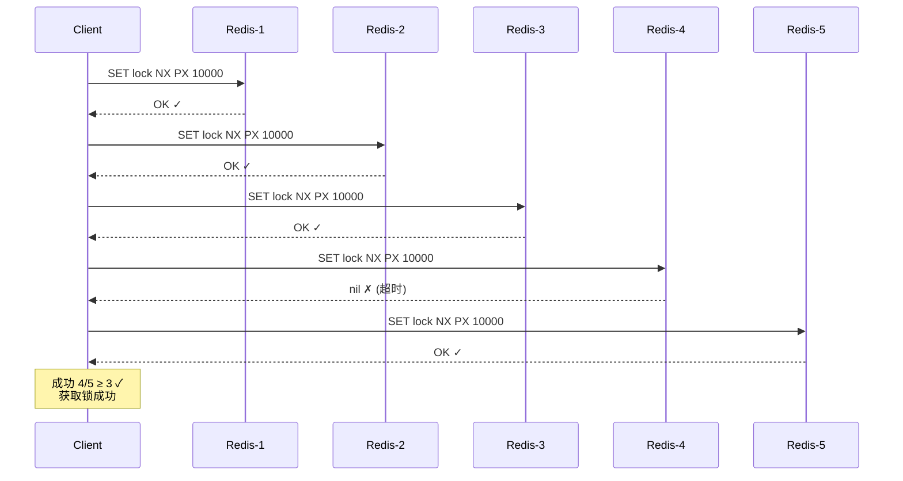
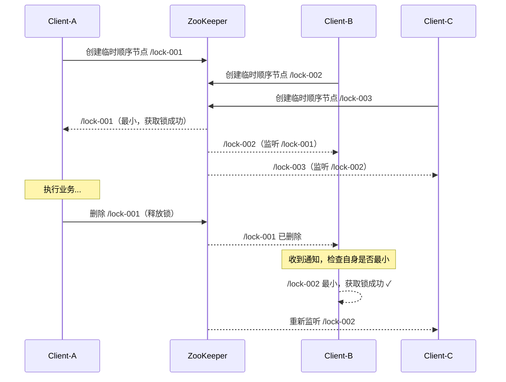
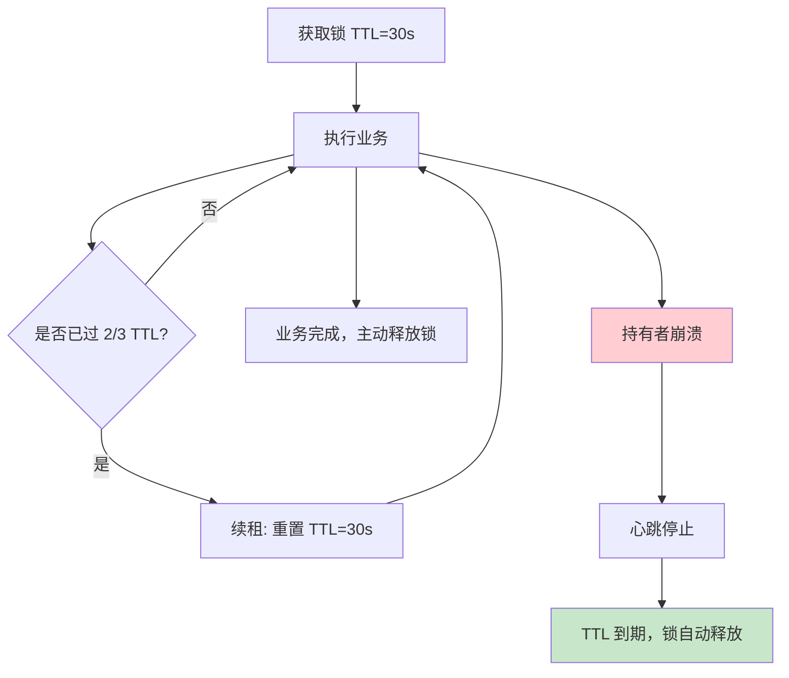
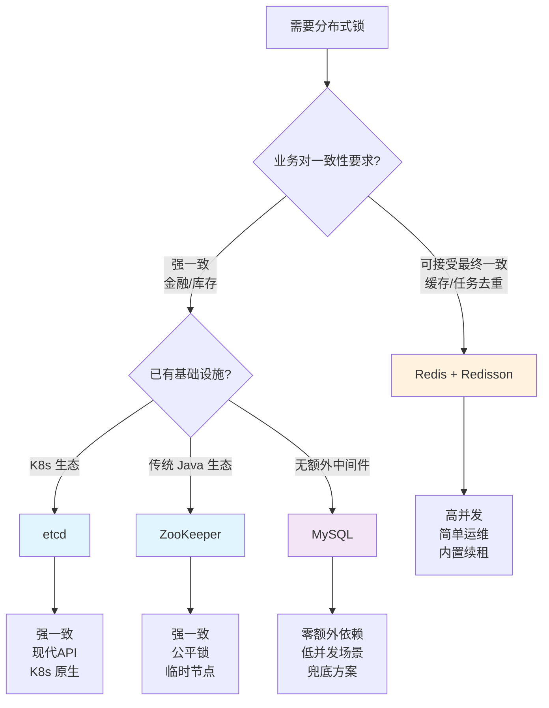

# 分布式锁理论基础

在单机应用中，`synchronized`、`ReentrantLock` 等进程内锁机制足以保护共享资源。然而，当系统演进为多节点、多进程的分布式架构后，进程内锁完全失效——不同 JVM 中的锁对象互不可见，竞态条件跨节点爆发。分布式锁正是为了解决这一根本问题而诞生的基础协调原语。

本章从分布式一致性的理论根源出发，系统讲解 Redis、ZooKeeper、etcd 三大主流实现方案的原理、适用场景与工程陷阱，为后续章节的实战部署与性能调优奠定扎实的理论基础。

---

## 一、为什么需要分布式锁

### 1.1 单机锁的失效场景

考虑一个典型的电商库存扣减服务：3 个无状态节点部署在不同服务器上，每个节点独立处理请求。当两个节点同时收到同一商品的扣减请求时：

节点A: 读取库存 = 1
节点B: 读取库存 = 1
节点A: 扣减后写入库存 = 0
节点B: 扣减后写入库存 = 0   ← 超卖！实际只扣了一次

`synchronized` 锁住的只是节点 A 的 JVM 内存，节点 B 的代码运行在另一个进程中，完全不受影响。这就是经典的**跨进程竞态条件**（Cross-Process Race Condition）。

### 1.2 分布式锁的核心需求

分布式锁必须同时满足以下四个特性：

| 特性 | 说明 | 反例 |
|------|------|------|
| **互斥性** | 任意时刻只有一个持有者 | 两个节点同时获取锁 → 数据不一致 |
| **无死锁** | 持有者崩溃后锁必须能被释放 | 节点宕机，锁永远不释放 → 其他节点永久阻塞 |
| **容错性** | 获取锁和释放锁的过程不依赖单一节点 | Redis 主节点宕机，锁信息丢失 → 脑裂 |
| **可重入** | 同一持有者可以多次获取同一把锁 | 持有者在嵌套调用中再次获取 → 自己死锁自己 |

### 1.3 分布式锁的典型应用场景

- **库存扣减**：防止超卖，保证库存扣减的原子性
- **定时任务调度**：多实例部署时，确保同一任务只有一个节点执行
- **缓存击穿保护**：热点 key 过期时，只有一个请求回源数据库，其余等待
- **分布式消息幂等**：消费者去重，确保同一条消息只被处理一次
- **配置热更新**：多节点同时监听配置变更时，只让一个节点执行刷新
- **Leader 选举**：无中心架构中选举协调者角色

---

## 二、CAP 定理与分布式锁的设计权衡

### 2.1 CAP 定理回顾

Eric Brewer 在 2000 年提出的 CAP 定理指出：分布式系统无法同时满足以下三个特性，最多只能同时满足两个：

- **C（Consistency）**：所有节点在同一时刻看到同一数据
- **A（Availability）**：每个请求都能在有限时间内得到响应（非错误）
- **P（Partition Tolerance）**：网络分区时系统仍能继续运行

由于网络分区在分布式系统中不可避免（P 是必须的），实际的选择是在 **CP** 和 **AP** 之间取舍。

### 2.2 不同实现方案的 CAP 定位

```mermaid
graph LR
    subgraph CP 系统
        ZK["ZooKeeper<br/>强一致性"]
        ETCD["etcd<br/>强一致性"]
    end
    subgraph AP 系统（倾向一致性）
        REDIS["Redis Sentinel<br/>AP + 异步复制"]
        REDISCL["Redis Cluster<br/>AP + 异步复制"]
    end
    style ZK fill:#e1f5fe
    style ETCD fill:#e1f5fe
    style REDIS fill:#fff3e0
    style REDISCL fill:#fff3e0
```

| 维度 | Redis（AP 倾向） | ZooKeeper（CP） | etcd（CP） |
|------|------------------|-----------------|------------|
| 一致性模型 | 最终一致性（异步复制） | 严格线性一致性（ZAB 协议） | 严格线性一致性（Raft 协议） |
| 可用性 | 高（单节点可响应） | 低（过半节点不可用则拒绝服务） | 低（过半节点不可用则拒绝服务） |
| 分区容忍 | 优雅降级 | 选举期间不可用 | 选举期间不可用 |
| 锁安全等级 | 依赖正确使用 | 强保证 | 强保证 |

**关键理解**：Redis 实现的分布式锁在严格意义上不是"完美"的——在主从切换的短暂窗口内可能出现锁丢失。但对于大多数业务场景（如缓存击穿、任务去重），这种概率极低且可接受。而金融、库存等强一致性场景则建议使用 ZooKeeper 或 etcd。

---

## 三、Redis 分布式锁

### 3.1 基本实现：SETNX + EXPIRE

最早的实现方式，利用 Redis 的原子命令：

```bash
# 加锁（SET NX PX milliseconds）
SET lock_key unique_value NX PX 30000

# 解锁（Lua 脚本保证原子性）
if redis.call("GET", KEYS[1]) == ARGV[1] then
    return redis.call("DEL", KEYS[1])
else
    return 0
end
```

**为什么必须用 Lua 脚本解锁？** 因为 GET + DEL 两条命令之间存在时间窗口，其他客户端可能在这期间获取到锁。如果直接执行 `DEL lock_key`，会误删别人的锁。

### 3.2 唯一标识（Unique Value）

每个客户端在加锁时必须生成一个全局唯一的标识（通常用 UUID），解锁时通过 Lua 脚本比对标识，确保只有锁的持有者才能释放。这防止了以下场景：

Client A: 获取锁，持有时长 30s
Client A: 执行业务，耗时超过 30s
Redis:    锁自动过期释放
Client B: 获取锁成功
Client A: 执行完毕，DEL lock_key  ← 误删了 Client B 的锁！

### 3.3 Redlock 算法

为了解决 Redis 主从切换时锁丢失的问题，Antirez（Redis 作者）提出了 Redlock 算法。

**算法流程：**

1. 获取当前系统时间 T1
2. 依次向 N 个 Redis 实例发送 `SET NX PX` 命令（N 推荐为 5）
3. 统计获取锁成功的实例数量
4. 计算获取锁的总耗时 = 当前时间 - T1
5. 如果成功实例数 ≥ ⌊N/2⌋ + 1 **且** 总耗时 < 锁的过期时间，则获取锁成功
6. 锁的有效时间 = 过期时间 - 获取锁的总耗时
7. 如果获取锁失败，向所有实例发送解锁请求



**Redlock 的争议：**

Martin Kleppmann 在 2016 年发表了对 Redlock 的批评，核心论点包括：

- **时钟漂移问题**：算法依赖各节点的本地时钟近似同步，但 NTP 校时可能导致时钟跳跃，破坏锁的安全性
- **GC 暂停问题**：Client 获取锁后若发生长时间 GC 暂停，锁过期后其他 Client 获取锁，恢复后原 Client 仍认为自己持有锁
- **进程暂停问题**：操作系统的调度延迟、网络延迟等不可控因素

Antirez 的回应：这些问题是所有分布式系统的共性挑战，Redlock 的设计目标是在"合理"假设下提供足够好的安全性，而非绝对完美。

**工程实践建议**：Redlock 适合对锁安全性要求较高但不需要严格线性一致性的场景。对于真正要求强一致性的场景，使用 ZooKeeper 或 etcd。

### 3.4 Redis 分布式锁的 Java 实现模板

```java
public class RedisDistributedLock {
    private final RedissonClient redisson;
    private final String lockKey;
    private final long leaseTime;

    public RedisDistributedLock(RedissonClient redisson, String lockKey, long leaseTime) {
        this.redisson = redisson;
        this.lockKey = lockKey;
        this.leaseTime = leaseTime;
    }

    /**
     * 尝试获取锁，支持可中断
     */
    public boolean tryLock(long waitTime, TimeUnit unit) throws InterruptedException {
        RLock lock = redisson.getLock(lockKey);
        // waitTime: 最多等待时间
        // leaseTime: 锁持有时间（自动续租）
        // unit: 时间单位
        return lock.tryLock(waitTime, leaseTime, unit);
    }

    /**
     * 释放锁
     */
    public void unlock() {
        RLock lock = redisson.getLock(lockKey);
        if (lock.isHeldByCurrentThread()) {
            lock.unlock();
        }
    }
}
```

Redisson 的关键优势：
- 内置看门狗（Watchdog）自动续租，默认 30s 过期，每 10s 续一次
- 支持可重入锁、公平锁、读写锁、信号量等多种锁语义
- 底层使用 Lua 脚本保证原子性
- 集群模式下自动处理故障转移

---

## 四、ZooKeeper 分布式锁

### 4.1 ZooKeeper 的数据模型与关键特性

ZooKeeper 维护一个类似文件系统的树形数据结构，每个节点称为 ZNode。与分布式锁相关的核心特性：

- **临时顺序节点（Ephemeral Sequential）**：客户端创建的节点在会话结束时自动删除，且自动在节点名后追加递增序号
- **Watcher 机制**：客户端可以监听某个 ZNode 的变化，当子节点变化时收到通知
- **会话管理**：通过心跳维持客户端会话，会话超时后临时节点自动删除（天然解决死锁问题）

### 4.2 基于临时顺序节点的锁实现

**加锁流程：**

1. 客户端在锁目录下创建临时顺序节点，如 `/locks/resource_0000000001`
2. 获取锁目录下的所有子节点，按序号排序
3. 如果当前节点是序号最小的节点，则获取锁成功
4. 否则，监听序号仅比自己小的那个节点（避免惊群效应）
5. 被监听的节点被删除时（即持有者释放锁或崩溃），客户端重新检查



**解锁流程：**
- 客户端删除自己创建的临时顺序节点
- 如果客户端崩溃，会话超时后临时节点自动删除

### 4.3 为什么推荐临时顺序节点

| 方案 | 问题 |
|------|------|
| 普通节点 + 等待 | 无法感知其他客户端释放锁，需要轮询 |
| 临时节点（非顺序） | 所有客户端同时竞争，惊群效应严重 |
| 顺序节点（非临时） | 客户端崩溃后节点不删除，死锁 |
| **临时顺序节点** | 自动删除 + 有序排队 + Watcher 通知，三者兼得 |

### 4.4 ZooKeeper 锁的优劣分析

**优势：**
- 强一致性（ZAB 协议保证所有写入在过半节点上持久化）
- 临时节点天然解决死锁（会话断开 → 节点删除 → 锁释放）
- 顺序节点天然实现公平锁（FIFO 排队）
- Watcher 机制避免轮询，降低 CPU 开销

**劣势：**
- 性能低于 Redis（写入需要过半节点确认）
- 客户端数量多时，Watcher 通知可能成为瓶颈（3.6+ 改进为递归 Watcher）
- 运维复杂度高（需要维护 ZK 集群，处理脑裂）
- 会话超时设置需要权衡：太短导致频繁重连，太长导致故障恢复慢

---

## 五、etcd 分布式锁

### 5.1 etcd 概述

etcd 是基于 Raft 协议的分布式 KV 存储，由 CoreOS 开发，是 Kubernetes 的默认后端存储。它提供了与 ZooKeeper 类似的强一致性保证，但 API 更现代化（gRPC + HTTP/JSON），运维更简单。

### 5.2 基于 etcd 的分布式锁原理

etcd 分布式锁的实现原理与 ZooKeeper 非常相似：

1. **Lease（租约）**：替代 ZooKeeper 的临时节点概念。客户端创建一个 Lease 并通过 KeepAlive 持续约，Lease 过期后关联的 key 自动删除
2. **Revision（版本号）**：每个写入操作都会递增全局版本号，用于判断锁的先后顺序
3. **Watch**：替代 ZooKeeper 的 Watcher，监听前一个 Revision 的 key 删除事件

**加锁流程（Go 客户端示例）：**

```go
session, _ := concurrency.NewSession(client, concurrency.WithTTL(15))
defer session.Close()

mutex := concurrency.NewMutex(session, "/locks/my-resource/")
mutex.Lock(context.TODO())
defer mutex.Unlock(context.TODO())

// 执行业务逻辑...
```

底层执行的操作：
1. 创建一个 15 秒的 Lease
2. 使用 `PUT key --lease=lease_id --prev_kv` 创建锁 key
3. 检查是否存在比自己 Revision 更小的 key；如果不存在，则获取锁成功
4. 否则 Watch 比自己 Revision 小的最后一个 key 的删除事件
5. 定期发送 KeepAlive 续租

### 5.3 etcd vs ZooKeeper

| 维度 | etcd | ZooKeeper |
|------|------|-----------|
| 一致性协议 | Raft | ZAB |
| API | gRPC + HTTP/JSON，RESTful 风格 | 自定义二进制协议 |
| 租约/临时节点 | Lease + KeepAlive | 临时顺序节点 |
| 语言生态 | Go 原生，多语言 SDK | Java 原生，其他语言通过 C 客户端绑定 |
| 运维难度 | 较低（单一二进制，健康检查简单） | 较高（JVM + myid 文件 + 四字命令） |
| 成熟度 | Kubernetes 生态标配，社区活跃 | 十年以上，久经考验 |
| Watcher | 前缀 Watch，支持过滤 | Watcher 一次性（3.6+ 支持持久 Watch） |

---

## 六、MySQL 分布式锁

作为兜底方案，MySQL 也可以实现分布式锁，适合没有 Redis/ZooKeeper 基础设施的场景。

### 6.1 基于唯一索引

```sql
-- 加锁表
CREATE TABLE distributed_lock (
    lock_key VARCHAR(64) NOT NULL,
    lock_holder VARCHAR(128) NOT NULL,
    expire_at TIMESTAMP NOT NULL,
    created_at TIMESTAMP DEFAULT CURRENT_TIMESTAMP,
    PRIMARY KEY (lock_key),
    INDEX idx_expire (expire_at)
);

-- 加锁：INSERT 成功即获取锁
INSERT INTO distributed_lock (lock_key, lock_holder, expire_at)
VALUES ('order_sync', 'node-1', DATE_ADD(NOW(), INTERVAL 30 SECOND));

-- 解锁：只有持有者能删除
DELETE FROM distributed_lock
WHERE lock_key = 'order_sync' AND lock_holder = 'node-1';

-- 清理过期锁（定时任务）
DELETE FROM distributed_lock WHERE expire_at < NOW();
```

### 6.2 基于乐观锁（version 字段）

```sql
-- 预置锁记录
UPDATE distributed_lock SET version = 0 WHERE lock_key = 'order_sync';

-- 加锁：CAS 操作
UPDATE distributed_lock
SET lock_holder = 'node-1', version = version + 1, expire_at = DATE_ADD(NOW(), INTERVAL 30 SECOND)
WHERE lock_key = 'order_sync' AND version = 0;

-- affected_rows = 1 → 获取成功
-- affected_rows = 0 → 已被其他节点持有
```

### 6.3 MySQL 锁的局限

- **性能差**：每次加锁解锁都是数据库写操作，QPS 通常在 100-500 量级
- **单点风险**：数据库宕机则锁服务不可用
- **死锁清理依赖定时任务**：过期锁不能即时释放，需等待清理周期
- **不支持 Watch/通知**：获取锁失败只能轮询或定时重试

适用场景：低并发、对性能要求不高、已有 MySQL 基础设施的内部管理系统。

---

## 七、锁续租机制

### 7.1 为什么需要续租

分布式锁通常设置一个过期时间（TTL），防止持有者崩溃后锁永不释放。但业务执行时间是不可预测的——网络抖动、GC 暂停、慢查询等都可能导致执行时间超过 TTL。

**未续租的灾难场景：**

T=0s    Client A 获取锁，TTL=30s
T=25s   Client A 仍在执行业务（DB慢查询）
T=30s   锁过期自动释放
T=30s   Client B 获取锁，开始执行
T=32s   Client A 执行完毕，尝试解锁
        → 误删 Client B 的锁（如果没有唯一标识保护）
        → 或解锁失败（如果有唯一标识保护），但业务已经双写

### 7.2 续租的核心思路

在锁持有期间，定期向锁服务发送心跳，延长锁的过期时间。如果持有者崩溃，心跳停止，锁在 TTL 后自动过期。



### 7.3 各实现方案的续租机制

**Redis（Redisson Watchdog）：**

Redisson 的 Watchdog 是最优雅的续租实现：

- 默认锁过期时间 30 秒（`lockWatchdogTimeout`）
- 后台线程每隔 10 秒（TTL / 3）检查锁是否仍被当前线程持有
- 如果持有，自动续租到 30 秒
- 如果业务执行超过 30 秒且未手动续租，锁过期释放

```java
// Redisson 自动续租（默认启用）
RLock lock = redisson.getLock("myLock");
lock.lock();  // 不指定 leaseTime 时，Watchdog 自动管理

// 如果指定了 leaseTime，Watchdog 不生效
lock.lock(60, TimeUnit.SECONDS);  // 手动指定过期时间，无自动续租
```

**ZooKeeper：**

ZooKeeper 的临时节点通过**会话心跳**隐式实现续租——只要客户端与 ZK 保持会话（默认每 2/3 sessionTimeout 发送心跳），临时节点就不会被删除。这相当于一种"全有或全无"的续租策略。

**etcd：**

etcd 通过 `KeepAlive` 流式 RPC 实现续租：

```go
// 续租
lease, _ := client.Grant(context.TODO(), 15)  // 15秒租约
ch, _ := client.KeepAlive(context.TODO(), lease.ID)
// 后台 goroutine 自动发送 KeepAlive 请求
```

### 7.4 续租的潜在风险

| 风险 | 说明 | 缓解方案 |
|------|------|----------|
| **GC 暂停后续租** | 客户端 GC 暂停超过 TTL，锁已过期但客户端恢复后误以为仍持有 | 业务层二次校验（CAS / 版本号比对） |
| **网络分区后续租** | 网络分区期间 KeepAlive 发送失败，锁过期；分区恢复后客户端仍持有旧锁引用 | 使用 fencing token（见下文） |
| **续租风暴** | 大量锁同时续租，给锁服务带来瞬时压力 | 续租时间加随机抖动（jitter），错峰续租 |
| **续租成功但业务失败** | 锁续租了但业务逻辑出错，锁一直持有到 TTL | 业务层 try-finally 确保释放 |

### 7.5 Fencing Token（栅栏令牌）

Fencing Token 是解决"GC 暂停后误用锁"问题的终极方案。每次获取锁时，锁服务返回一个单调递增的 token。业务在写入数据时携带 token，存储层（数据库、ZooKeeper 等）校验 token 是否大于上次写入的 token。

Client A: 获取锁，token = 33
Client A: 发生 GC 暂停...
Redis:    锁过期
Client B: 获取锁，token = 34
Client B: 写入数据，token = 34 ✓
Client A: GC 恢复，尝试写入，token = 33
          → 存储层拒绝：33 < 34，这是过期请求

数据库层面的实现：

```sql
-- 表增加 token 字段
UPDATE orders SET status = 'paid', token = 34 WHERE id = 1001;

-- 写入时校验
UPDATE orders SET status = 'paid', token = 34
WHERE id = 1001 AND token < 34;

-- affected_rows = 0 → token 已过期，拒绝写入
```

> 注意：Fencing Token 要求存储层支持条件写入（CAS），不是所有存储系统都能配合使用。Redis 本身不支持这种语义，需要在数据库层实现。

---

## 八、三大方案的全面对比

### 8.1 核心指标对比

| 维度 | Redis | ZooKeeper | etcd | MySQL |
|------|-------|-----------|------|-------|
| **性能（QPS）** | 10万+ | 1万+ | 5万+ | 500+ |
| **一致性** | 最终一致 | 强一致 | 强一致 | 强一致（单实例） |
| **可用性** | 高 | 中 | 中 | 中 |
| **锁释放** | TTL 过期 + 主动释放 | 临时节点 + 会话超时 | Lease 过期 + 主动释放 | TTL + 定时清理 |
| **公平性** | 非公平 | 公平（顺序节点） | 公平（Revision） | 取决于实现 |
| **可重入** | Redisson 支持 | 需自行实现 | 需自行实现 | 需自行实现 |
| **自动续租** | Watchdog | 会话心跳 | KeepAlive | 无（需自行实现） |
| **客户端复杂度** | 低（Redisson 封装完善） | 中 | 中 | 低 |
| **运维成本** | 低 | 高 | 中 | 低（复用已有 MySQL） |

### 8.2 选型决策树



### 8.3 混合架构策略

在大规模系统中，常见的做法是**分级锁策略**：

- **L1 — 进程内锁**（ReentrantLock）：保护极短临界区（< 1ms）
- **L2 — Redis 分布式锁**：保护大多数业务临界区（缓存、任务调度）
- **L3 — ZooKeeper/etcd 分布式锁**：保护强一致性要求的临界区（库存、支付）

```java
public class HierarchicalLock {
    private final ReentrantLock localLock = new ReentrantLock();
    private final RedisDistributedLock redisLock;
    private final ZkDistributedLock zkLock;

    public void executeCritical(String resource, CriticalLevel level, Runnable task) {
        switch (level) {
            case LOCAL:
                localLock.lock();
                try { task.run(); }
                finally { localLock.unlock(); }
                break;
            case DISTRIBUTED:
                if (redisLock.tryLock(5, TimeUnit.SECONDS)) {
                    try { task.run(); }
                    finally { redisLock.unlock(); }
                }
                break;
            case STRONG_CONSISTENT:
                if (zkLock.tryLock(10, TimeUnit.SECONDS)) {
                    try { task.run(); }
                    finally { zkLock.unlock(); }
                }
                break;
        }
    }
}
```

---

## 九、常见误区与最佳实践

### 9.1 常见误区

**误区一：SETNX + EXPIRE 分开执行**
```bash
# 错误！非原子操作
SETNX lock_key value
EXPIRE lock_key 30
```
如果 SETNX 成功后客户端崩溃，EXPIRE 未执行，锁永远不会释放。必须使用 `SET lock_key value NX PX 30000` 一条命令完成。

**误区二：直接 DEL 解锁**
```bash
# 错误！可能删除别人的锁
DEL lock_key
```
必须通过 Lua 脚本比对唯一标识后再删除。

**误区三：锁的粒度过粗**
```java
// 锁住整个业务逻辑
lock.lock();
// 查询用户 → 查询订单 → 查询库存 → 扣减 → 更新 → 通知
// 整个流程 5 秒，其他请求全部阻塞
```
应该只锁住真正需要互斥的最小代码段。

**误区四：忽略锁的超时设置**
```java
// 锁没有过期时间，客户端崩溃则死锁
RLock lock = redisson.getLock("myLock");
lock.lock();  // 底层有 Watchdog，但如果用原生 Redis 客户端则没有
```
使用原生 Redis 客户端时，必须设置合理的 TTL。

**误区五：认为 Redlock 是银弹**
Redlock 在极端情况（时钟跳变、长时间 GC）下仍可能失效。对于强一致性场景，应使用 ZK/etcd。

### 9.2 最佳实践清单

1. **必须设置 TTL**：所有锁都必须有最大持有时间，防止死锁
2. **使用唯一标识**：每个客户端生成 UUID 作为锁值，解锁时校验
3. **原子操作加解锁**：加锁用 `SET NX PX`，解锁用 Lua 脚本
4. **锁粒度最小化**：只锁临界区，不锁整个业务流程
5. **异常安全释放**：所有锁操作必须在 try-finally 中释放
6. **业务层兜底**：即使锁正常工作，业务层也要有幂等校验
7. **监控告警**：监控锁等待时间、持有时间、续租频率
8. **合理设置 TTL**：TTL = 最大业务执行时间 × 安全系数（建议 1.5-2 倍）
9. **续租时间抖动**：续租周期加入随机偏移，避免同时续租
10. **降级策略**：锁服务不可用时，有明确的降级方案（排队、拒绝、本地锁降级）

---

## 十、理论延伸

### 10.1 分布式锁与分布式事务

分布式锁保护的是**操作的互斥性**，而分布式事务保证的是**操作的原子性**。两者解决不同维度的问题，但常常配合使用：

- 分布式锁：确保同一资源同一时刻只有一个操作
- 分布式事务：确保多个资源的操作要么全成功要么全失败

典型场景：扣库存（分布式锁保护）+ 扣余额（分布式事务保证原子性）

### 10.2 分布式锁与 Leader 选举

分布式锁和 Leader 选举本质上是同一类问题——在一组对等节点中选出一个"胜出者"。区别在于：

- **分布式锁**：胜出者可以轮换，关注的是互斥
- **Leader 选举**：胜出者长期持有，关注的是稳定性

实践中，可以用分布式锁模拟 Leader 选举（所有节点竞争同一把锁，获取到锁的节点即为 Leader）。

### 10.3 分布式信号量与读写锁

分布式锁的扩展语义：

- **分布式信号量（Semaphore）**：允许 N 个客户端同时访问资源，适合限流、资源池管理
- **分布式读写锁**：允许多个读操作并发，写操作互斥，适合读多写少的场景
- **分布式可重入锁**：同一持有者可以多次获取，适合嵌套业务调用
- **分布式公平锁**：按请求顺序分配，避免饥饿

Redisson 对这些扩展语义都有完善的实现：

```java
// 分布式信号量
RSemaphore semaphore = redisson.getSemaphore("mySemaphore");
semaphore.tryAcquire();
// ...
semaphore.release();

// 分布式读写锁
RReadWriteLock rwLock = redisson.getReadWriteLock("myRWLock");
rwLock.readLock().lock();
// 多个读可以并发
rwLock.writeLock().lock();
// 写锁独占

// 分布式公平锁
RLock fairLock = redisson.getFairLock("myFairLock");
fairLock.lock();  // 按请求顺序排队获取
```

---

## 本章小结

分布式锁是分布式系统中最基础也最重要的协调原语之一。本章从理论层面覆盖了以下核心内容：

- **问题本质**：分布式锁解决的是跨进程竞态条件，核心要求是互斥、无死锁、容错、可重入
- **CAP 权衡**：Redis 选择可用性优先，ZooKeeper/etcd 选择一致性优先，选型取决于业务场景
- **三大实现方案**：Redis 适合高并发最终一致场景，ZooKeeper/etcd 适合强一致场景，MySQL 作为兜底
- **锁续租**：防止业务未完成时锁过期，Watchdog/会话心跳/KeepAlive 是各方案的续租实现
- **Fencing Token**：解决 GC 暂停等极端场景下锁失效的终极方案

掌握这些理论基础，才能在后续章节中做出正确的架构选择和性能调优决策。
