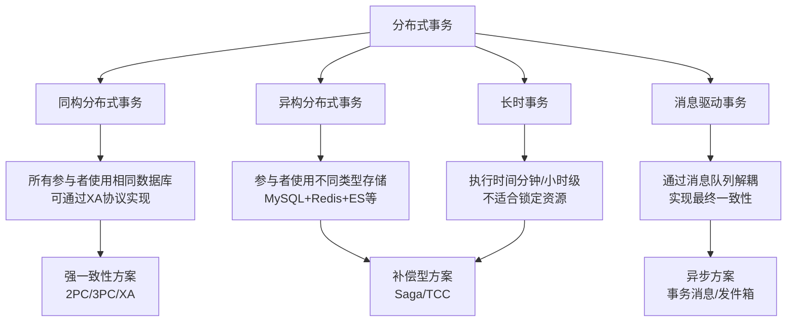
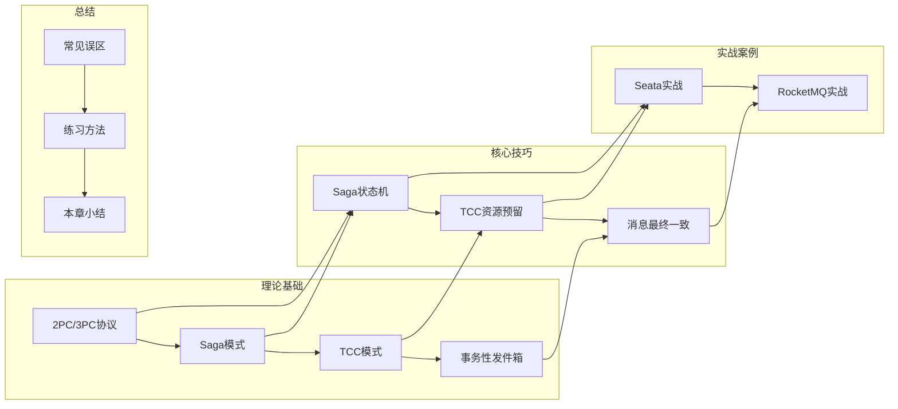
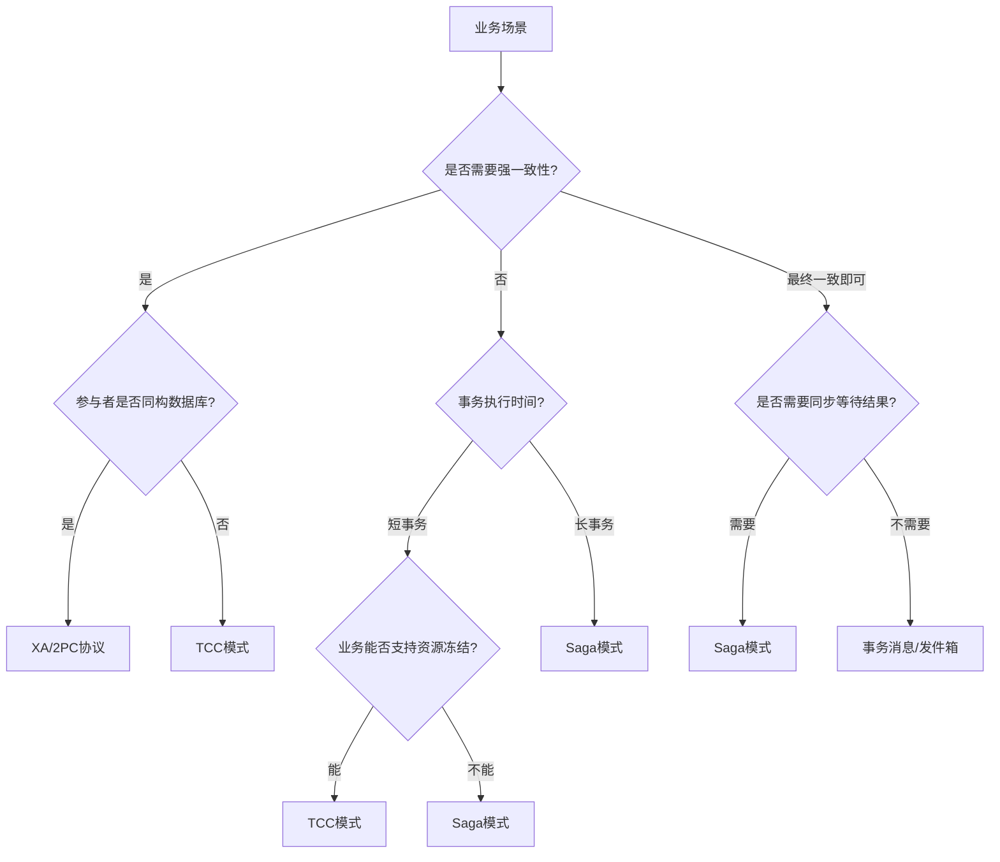

# 第55章 分布式事务：章节概览

## 为什么需要这一章

在单机数据库时代，一条 `BEGIN...COMMIT` 就能保证数据一致性。但当系统拆分成微服务、数据分散在多个数据库之后，这个看似简单的保证突然变成了整个系统最棘手的问题。

想象一个典型的电商下单流程：订单服务创建订单、库存服务扣减库存、支付服务冻结资金、积分服务累加积分。这四个操作分散在四个独立的服务和数据库中。如果库存扣减成功但支付冻结失败，如何保证订单不会出现"库存已扣但用户没付钱"的脏数据？

这就是分布式事务要解决的核心问题：**当一个业务操作需要跨越多个服务和数据库时，如何保证所有参与者要么全部成功、要么全部回滚，或者在失败后能恢复到一致状态。**

### 分布式事务的历史脉络

理解分布式事务的演进历程，有助于把握每种方案的设计动机：

| 年份 | 里程碑 | 意义 |
|------|--------|------|
| 1978 | Jim Gray 提出2PC协议 | 奠定分布式事务的理论基础，解决跨节点原子提交问题 |
| 1987 | Garcia-Molina & Salem 提出Saga | 突破2PC的阻塞限制，用补偿操作替代锁，开创最终一致性范式 |
| 1990s | XA标准由X/Open组织制定 | 为2PC提供工业级规范，主流数据库纷纷实现XA接口 |
| 2007 | Eric Brewer 提出CAP定理 | 从理论上证明分布式系统无法同时满足一致性、可用性和分区容错性 |
| 2015 | 阿里巴巴开源Seata | 将AT/TCC/Saga/XA统一到一个框架，大幅降低分布式事务的工程门槛 |
| 2018 | Chris Richardson 提出事件驱动Saga | 将Saga与事件溯源结合，进一步降低服务间耦合 |
| 2020s | 云原生事务（Temporal/Cadence） | 以工作流引擎驱动分布式事务，将事务逻辑提升为可编排的工作流 |

从2PC到Saga再到TCC，每一代方案都是对前一代局限性的回应。2PC解决了原子提交但引入了阻塞，Saga消除了阻塞但牺牲了隔离性，TCC用资源预留弥补了Saga的隔离性缺陷但增加了业务侵入。理解这条演进链，才能在面对实际场景时做出合理的技术选型。

### 为什么分布式事务如此困难

分布式事务的困难根植于分布式系统的根本约束。Lamport的"时钟之难"告诉我们，在没有全局时钟的系统中，确定事件的先后顺序本身就是未解决的难题。Fischer-Lynch-Paterson（FLP）不可能定理则证明，在异步系统中甚至无法保证一定能达成共识。这些理论结论意味着，任何分布式事务方案都必须在一致性、性能和可用性之间做出妥协——不存在"完美方案"，只有"适合场景的方案"。

本章从经典理论到工程实践，系统性地覆盖分布式事务的完整知识体系。

## 分布式事务的问题本质

### 从ACID到BASE

单机事务遵循ACID原则——原子性（Atomicity）、一致性（Consistency）、隔离性（Isolation）、持久性（Durability）。数据库引擎通过WAL日志、锁机制和MVCC来保证这些属性。

但在分布式环境中，ACID的每个属性都面临挑战：

| ACID属性 | 单机环境 | 分布式环境的挑战 |
|----------|---------|----------------|
| 原子性 | 数据库引擎保证 | 跨服务操作无法用单个数据库事务包裹 |
| 一致性 | 事务约束自动保证 | 多个数据库之间的数据可能不一致 |
| 隔离性 | 锁/MVCC保证 | 中间状态可能被其他服务读到 |
| 持久性 | redo日志保证 | 部分提交、部分失败时数据状态不确定 |

分布式系统被迫退而求其次，采用BASE原则——基本可用（Basically Available）、软状态（Soft State）、最终一致性（Eventually Consistent）。这不是妥协，而是在分布式约束下的务实选择。

BASE的三个维度需要分别理解：

- **基本可用（Basically Available）**：系统在出现故障时允许部分功能降级，但核心功能仍然可用。例如电商大促时，商品推荐服务可能降级，但下单和支付必须可用。这与"不可用"有本质区别——系统仍然在工作，只是可能响应变慢或部分功能暂时不可用。
- **软状态（Soft State）**：允许系统中的数据存在中间状态，且中间状态不影响整体可用性。例如订单状态可以是"处理中"，不需要立即变为"已完成"。软状态是最终一致性的前提——只有允许中间状态存在，才能异步地向最终状态收敛。
- **最终一致性（Eventually Consistent）**：系统保证在没有新的更新操作后，所有副本最终会达到一致状态。"最终"的时间窗口从毫秒到分钟不等，取决于系统设计和网络条件。DNS是最终一致性的经典案例——域名变更后全球DNS需要一定时间才能完全同步。

### 分布式事务的四大挑战

**网络不可靠**：节点之间的消息可能丢失、重复、乱序或延迟。TCP协议只能保证"最终可达"，无法保证"即时到达"。网络分区（Partition）是常态而非异常。Peter Deutsch在1994年总结的"分布式计算七大谬误"中，"网络可靠"排名第一——这个谬误至今仍在制造线上事故。

**节点可崩溃**：任何参与节点都可能在事务执行过程中的任意时刻宕机。数据库可能在写入redo日志后崩溃，应用服务可能在调用远程接口后超时。更棘手的是"拜占庭故障"——节点不仅可能崩溃，还可能返回错误的结果。

**没有全局时钟**：分布式系统中不存在所有节点共享的精确物理时钟。即使使用NTP同步，时钟偏移也在毫秒级。无法通过时间戳确定事件的全局顺序，这使得"先发生"和"后发生"的判断变得模糊。Lamport逻辑时钟和向量时钟是解决排序问题的理论工具，但在工程中往往引入过高的复杂度。

**CAP约束**：在网络分区发生时，系统必须在一致性（Consistency）和可用性（Availability）之间做出权衡。不可能同时满足三者。Gilbert和Lynch在2002年严格证明了CAP定理。实践中，大多数系统选择AP（可用性优先），通过最终一致性来处理分区恢复后的一致性问题。

### 分布式事务的分类

根据参与者类型和一致性要求，分布式事务可以分为以下几类：

- **同构分布式事务**：所有参与者使用相同类型的数据库（如都是MySQL），可以通过XA协议实现强一致性。XA协议通过两阶段提交协议在多个数据库之间协调事务的提交或回滚。由于参与者是同类型的数据库，协议的兼容性和性能都较好。
- **异构分布式事务**：参与者使用不同类型的存储系统（如MySQL + Redis + Elasticsearch），无法使用XA协议。这是微服务架构中最常见的场景——每个服务可以选择最适合自身业务的存储技术，但代价是失去了数据库层面的事务支持。
- **消息驱动事务**：通过消息队列实现跨服务的数据一致性，适用于异步解耦场景。核心思想是将"操作A完成后通知服务B执行操作B"的消息传递嵌入到操作A的本地事务中，确保消息和业务数据的一致性。
- **长时事务**：事务执行时间很长（分钟甚至小时级别），不适合锁定资源的方案。典型的如跨境支付（涉及多个银行的清算）、物流调度（涉及多个仓库的库存协调）、审批流程（涉及多个角色的逐级审批）。这类事务需要Saga或工作流引擎来管理。

## 本章的核心内容地图

本章按照"理论基础 → 核心技巧 → 实战案例 → 误区与练习"的递进结构组织，覆盖分布式事务从原理到工程的完整知识链。

## 各节内容导读

### 理论基础：四种经典模式

**55.1-55.3 分布式事务的问题定义与2PC/3PC协议**——这是整个章节的理论起点。2PC（Two-Phase Commit）由Jim Gray在1978年提出，通过协调者和参与者的两阶段交互实现原子提交。第一阶段（Prepare/投票阶段），协调者向所有参与者发送Prepare请求，参与者执行本地事务但不提交，然后回复Yes或No；第二阶段（Commit/提交阶段），如果所有参与者都回复Yes，协调者发送Commit命令，否则发送Rollback命令。

3PC（Three-Phase Commit）在Prepare和Commit之间增加PreCommit阶段，引入超时机制缓解阻塞问题。当参与者在PreCommit阶段后超时未收到Commit/Rollback指令，可以自主提交——因为既然已经进入PreCommit，说明协调者已经收到了所有Yes回复，提交是安全的。

理解2PC/3PC的原理和局限（阻塞、单点故障、性能瓶颈），是理解后续所有方案的前提。2PC的核心问题是"阻塞等待"——参与者在投票后必须等待协调者的最终决定，如果协调者宕机，参与者将无限期阻塞。

**55.4-55.5 Saga模式的理论模型与协调方式**——Saga模式由Garcia-Molina和Salem在1987年提出，核心思想是将长事务分解为一系列子事务（T1, T2, ..., Tn），每个子事务有对应的补偿操作（C1, C2, ..., Cn）。如果某个子事务Ti失败，逆序执行已成功子事务的补偿操作（Ci-1, Ci-2, ..., C1）。

Saga有两种协调方式：编排式（Orchestration）由中央编排器管理流程，编排器持有全局流程定义，按步骤调度各服务执行，适合复杂场景；协同式（Choreography）通过事件驱动实现松耦合，每个服务监听事件并产生新事件，适合简单场景。编排式的优点是流程清晰、易于调试和维护，缺点是编排器可能成为单点瓶颈；协同式的优点是服务间完全解耦，缺点是流程分散在各服务中，难以追踪和调试。

Saga的关键约束是**隔离性缺失**：子事务之间没有锁保护，一个子事务的中间状态可能被其他事务读到。例如T1扣减了库存但T2还没提交，此时另一个事务读到的库存已经是T1扣减后的值——如果T1最终补偿回滚，库存就会出现不一致。解决方案包括语义锁（在Try阶段锁定资源但不真正扣减）和交换律设计（确保补偿操作和正向操作满足交换律）。

**55.6 TCC模式：Try-Confirm-Cancel**——TCC通过资源预留提供比Saga更强的隔离保证。Try阶段冻结资源（如冻结账户余额、预留库存），Confirm阶段确认消耗（将冻结的资源正式扣减），Cancel阶段释放资源（将冻结的资源恢复原状）。三个阶段的接口由业务系统自行实现，框架不侵入业务逻辑。

TCC需要处理两个特殊问题：**空回滚**——Try请求由于网络延迟未到达，但Cancel请求先到达了（因为协调者以为Try超时了），此时Cancel需要识别这是"空"的回滚并直接返回成功；**悬挂**——Cancel执行后，延迟的Try请求才到达，此时Try需要识别这个请求对应的事务已经结束，拒绝执行。防御这两种问题的标准做法是引入事务控制表，记录每个事务在每个参与者的执行状态。

**55.7 事务性发件箱与消息驱动一致性**——解决微服务中的"双写"问题：如何在同一个操作中既写数据库又发消息。事务性发件箱（Transactional Outbox）在同一个数据库事务中写入业务数据和消息记录，然后由异步进程读取消息并发送到消息队列。本地消息表（Local Message Table）通过状态机管理消息生命周期，确保消息至少投递一次。CDC（Change Data Capture）通过监听数据库binlog实现实时变更捕获，无需侵入业务代码。RocketMQ事务消息通过半消息机制提供原生分布式事务支持——先发送半消息（不投递），执行本地事务后根据结果提交或回滚消息。

**55.8 Seata框架与分布式事务分类**——Seata是阿里巴巴开源的分布式事务框架（原名Fescar），提供AT、TCC、Saga和XA四种模式。AT模式通过拦截JDBC方法自动生成回滚日志（undo_log），对业务代码零侵入——开发者只需要加一个 `@GlobalTransactional` 注解即可开启分布式事务。XA模式基于数据库XA协议实现强一致性，适合同构数据库场景。Saga模式提供状态机编排能力，支持正向和补偿操作的灵活定义。TCC模式提供Try/Confirm/Cancel三个阶段的事务接口，由开发者自行实现资源预留逻辑。

### 核心技巧：工程化实现

**55.9 Saga编排器的工程实现**——一个生产级Saga编排器需要处理：重试策略（指数退避 + 抖动，避免重试风暴）、超时控制（为每个步骤设置独立超时，避免长尾请求拖垮系统）、补偿逻辑（补偿操作必须幂等，因为可能被多次调用）、并发安全（同一Saga实例的多个步骤不能并行执行）和状态持久化（所有状态变更必须先写入存储再执行，确保崩溃恢复后能继续执行）。本节提供完整的Saga编排器实现，包括步骤定义、执行引擎和状态管理。

**55.10 TCC资源预留的工程实现**——TCC的工程实现重点在于：资源冻结与解冻的精确控制（冻结金额不能超过可用余额，解冻金额不能超过冻结金额）、空回滚和悬挂的防御机制（通过事务控制表记录Try/Confirm/Cancel的执行状态）、以及Confirm/Cancel操作的幂等性保证（通过事务ID去重，确保同一事务的Confirm/Cancel只执行一次）。

**55.11 消息最终一致的工程实现**——覆盖事务性发件箱的轮询（定期扫描未发送的消息并重试）与CDC（监听binlog变更自动捕获数据）两种实现方式、本地消息表的状态机设计（待发送 → 已发送 → 已确认 → 已归档，以及失败重试逻辑）、以及RocketMQ事务消息的生产者端实现（半消息发送 → 执行本地事务 → 提交/回滚消息）。

### 实战案例：从理论到代码

**55.12 Seata实战：电商订单Saga实现**——以电商下单为场景，完整演示如何使用Seata的AT和Saga模式实现订单创建、库存扣减、资金冻结的分布式事务。包括服务拆分、数据模型设计、Saga流程定义、补偿操作实现、异常处理和测试验证。

**55.13 RocketMQ实战：TCC账户转账**——以银行转账为场景，演示如何使用RocketMQ事务消息实现跨行转账的最终一致性。包括事务消息的生产者实现、消费者幂等处理、转账记录的状态机设计、以及异常场景的补偿处理。

### 总结与提升

**55.14 常见误区**——分布式事务中最容易踩的坑：补偿遗漏（忘记写补偿逻辑或补偿逻辑不完整）、悬挂与空回滚（TCC的时序问题，未做防御性处理）、幂等性缺失（重试导致重复执行）、过度使用分布式事务（能用本地事务解决的场景强行引入分布式事务）、忽视最终一致性的时间窗口（业务上假设实时一致但实际有延迟）。

**55.15 练习方法**——通过动手实践巩固知识：实现Saga状态机（从零实现一个支持重试、补偿、超时的Saga编排器）、搭建TCC框架（实现Try/Confirm/Cancel三个阶段的资源预留与释放）、完成发件箱模式实验（本地消息表 + 轮询发送 + 消费者幂等）、进行性能对比测试（对比2PC、Saga、TCC在不同并发量下的吞吐量和延迟）。

**55.16 本章小结**——回顾核心概念，提供方案选型框架和延伸阅读资源。

## 分布式事务方案选型指南

面对具体的业务场景，如何选择合适的分布式事务方案？以下是决策框架：

| 维度 | 2PC/3PC | Saga | TCC | 事务消息/发件箱 |
|------|---------|------|-----|---------------|
| 一致性级别 | 强一致 | 最终一致 | 准强一致 | 最终一致 |
| 性能 | 低（全局锁） | 高（无锁） | 中（资源预留） | 高（异步） |
| 实现复杂度 | 低（协议固定） | 中（需设计补偿） | 高（三个接口+防悬挂） | 中（需设计消息表） |
| 业务侵入 | 无（XA） | 低（写补偿逻辑） | 高（需支持资源冻结） | 低（写消息表） |
| 适用场景 | 同构数据库、强一致要求 | 长事务、跨服务编排 | 资金类、高一致性要求 | 异步解耦、事件驱动 |
| 典型框架 | MySQL XA、Atomikos | Seata Saga、Temporal | Seata TCC、Hmily | RocketMQ、Kafka |
| 资源锁定 | 全局锁、时间长 | 无锁 | 冻结资源、时间短 | 无锁 |
| 补偿机制 | 无需（直接回滚） | 后向补偿 | Cancel释放 | 无需（消息重投） |
| 容错能力 | 协调者单点故障 | 天然支持重试 | 需防悬挂/空回滚 | 消息重投保证 |

### 选型决策流程

### 典型业务场景选型参考

| 业务场景 | 推荐方案 | 理由 |
|----------|----------|------|
| 电商下单（订单+库存+积分） | Saga或AT模式 | 步骤多、补偿逻辑清晰，性能要求高 |
| 银行转账（跨行） | TCC或事务消息 | 资金操作需要高一致性，但跨行系统异构无法用XA |
| 跨境支付（多国清算） | Saga + 工作流引擎 | 长时事务，涉及多个异构系统，需要人工审批节点 |
| 用户注册（写库+发欢迎邮件） | 事务消息/发件箱 | 邮件发送允许延迟，最终一致即可 |
| 库存同步（DB→Redis→ES） | CDC + 最终一致性 | 异构存储，实时性要求不高，性能优先 |
| 分布式缓存与DB双写 | TCC或事务消息 | 需要保证缓存与DB的一致性，TCC适合强一致，事务消息适合最终一致 |

**经验法则**：能用本地事务解决的，绝不用分布式事务；能用最终一致性的，不用强一致性；能用Saga的，不用TCC（实现复杂度更低）。分布式事务是最后的手段，不是第一选择。

## 本章的关键术语速查

在学习本章之前，建议先熟悉以下核心术语。遇到不理解的术语时，可以随时回到此处查阅：

| 术语 | 全称/来源 | 一句话解释 |
|------|-----------|------------|
| 2PC | Two-Phase Commit | 两阶段提交协议，通过Prepare和Commit两个阶段实现分布式原子提交 |
| 3PC | Three-Phase Commit | 三阶段提交协议，在2PC基础上增加PreCommit阶段缓解阻塞 |
| XA | X/Open XA | 由X/Open组织定义的分布式事务标准接口，基于2PC实现 |
| ACID | Atomicity, Consistency, Isolation, Durability | 数据库事务的四大属性：原子性、一致性、隔离性、持久性 |
| BASE | Basically Available, Soft State, Eventually Consistent | 分布式系统的设计原则：基本可用、软状态、最终一致性 |
| CAP | Consistency, Availability, Partition tolerance | CAP定理：三者最多只能同时满足两个 |
| Saga | Garcia-Molina & Salem, 1987 | 将长事务分解为子事务+补偿操作的模式 |
| TCC | Try-Confirm-Cancel | 通过资源预留实现分布式事务的模式，提供比Saga更强的隔离性 |
| Outbox | Transactional Outbox | 事务性发件箱，在本地事务中同时写入业务数据和消息记录 |
| CDC | Change Data Capture | 数据变更捕获，通过监听数据库日志（如binlog）实时捕获数据变化 |
| Seata | Simple Extensible Autonomous Transaction Area | 阿里开源的分布式事务框架，支持AT/TCC/Saga/XA四种模式 |
| AT | Automatic Transaction | Seata的自动事务模式，通过拦截SQL自动生成回滚日志，零业务侵入 |
| 幂等性 | Idempotency | 同一操作执行多次与执行一次的效果相同，是分布式系统的基本要求 |
| 空回滚 | Empty Rollback | TCC中Cancel到达但Try未执行的情况，需要识别并跳过 |
| 悬挂 | Suspended Transaction | TCC中Cancel已执行后Try才到达的情况，需要识别并拒绝 |
| undo_log | Undo Log | Seata AT模式的回滚日志，记录SQL执行前的数据快照 |
| 补偿操作 | Compensation | Saga中用于撤销已提交子事务影响的逆向操作 |

## 本章的学习路径建议

**入门读者**（预计学习时间：20-30小时）
1. 按顺序阅读理论基础（55.1-55.8），重点理解2PC的局限性如何催生了Saga和TCC
2. 通过实战案例（55.12-55.13）建立直觉，先跑通Demo再深入原理
3. 完成练习方法（55.15）中的发件箱模式实验，这是最容易上手的部分
4. 回顾常见误区（55.14），避免在未来项目中踩坑

**有经验的开发者**（预计学习时间：10-15小时）
1. 直接跳到核心技巧（55.9-55.11）学习工程实现
2. 重点关注Saga编排器的状态管理和TCC的空回滚/悬挂防御
3. 对照常见误区（55.14）检查自己项目中的潜在问题
4. 选择一种框架（Seata或Temporal）进行深度实践

**架构师**（预计学习时间：8-12小时）
1. 重点关注方案选型指南和各模式的权衡分析
2. 理解每种方案的适用边界——没有银弹，只有取舍
3. 结合自身业务场景，建立选型决策框架
4. 关注云原生事务引擎（Temporal/Cadence）的架构思想

## 前置知识

阅读本章需要以下基础知识：

- **微服务架构基础**：理解服务拆分原则、API网关的作用、服务注册与发现机制（如Consul、Nacos）。不需要精通，但需要知道微服务之间如何通信、为什么需要独立数据库
- **数据库事务**：理解ACID四属性的含义、四种隔离级别（读未提交/读已提交/可重复读/串行化）的区别、锁机制（行锁/表锁/间隙锁）的基本原理
- **消息队列**：了解Kafka/RocketMQ的基本概念——生产者、消费者、Topic、消费组、ACK机制。推荐先阅读《消息队列核心原理》相关章节
- **Java/Spring Boot**（实战部分）：Seata和RocketMQ的示例基于Java生态。需要了解Spring事务管理、AOP注解、RESTful API的基本用法
- **CAP/BASE理论**（建议但非必须）：有助于理解分布式系统的本质约束。如果还不熟悉，可以在阅读55.1-55.3时同步学习

### 推荐学习资源

| 资源 | 类型 | 适合阶段 | 说明 |
|------|------|----------|------|
| 《Designing Data-Intensive Applications》Martin Kleppmann | 书籍 | 入门+进阶 | 分布式系统必读经典，第7-9章覆盖事务和一致性 |
| 《微服务架构设计模式》Chris Richardson | 书籍 | 进阶 | Saga模式的提出者写的实战指南 |
| Seata官方文档（seata.io） | 文档 | 实战 | AT/TCC/Saga模式的API文档和示例代码 |
| Temporal.io文档 | 文档 | 进阶 | 云原生工作流引擎，内置分布式事务支持 |
| 论文：Sagas（Garcia-Molina & Salem, 1987） | 论文 | 理论 | Saga模式的原始论文，理解设计动机 |
| 论文：The Two-Phase Commit Protocol（Jim Gray, 1978） | 论文 | 理论 | 2PC协议的原始论文 |

## 常见问题预览

在开始深入学习之前，以下是最常被问到的问题：

**Q：2PC在实际生产中还能用吗？**
A：XA协议（基于2PC）在同构数据库场景下仍然可用，但由于性能差和阻塞问题，越来越多的系统转向Saga或TCC。MySQL 5.7+和8.0都支持XA事务，但生产环境中使用率较低。Seata的AT模式在底层实际上也借鉴了2PC的两阶段思想，但通过undo_log机制避免了全局锁——Prepare阶段只记录回滚日志，不锁数据行；只有在Commit/Rollback时才真正操作数据。

**Q：Saga和TCC到底选哪个？**
A：如果业务能支持资源冻结（如账户余额、库存），且对中间状态的一致性要求高，选TCC；如果业务逻辑简单、步骤较多、对性能要求高，选Saga。实践中Saga的使用频率远高于TCC，因为大多数业务不需要资源冻结级别的隔离。一个经验判断标准：如果业务中涉及资金操作（余额、钱包、积分账户），优先考虑TCC；如果只涉及状态变更（订单状态、审批流程），Saga就够了。

**Q：分布式事务是否意味着性能一定很差？**
A：不一定。Saga和事务消息模式几乎没有额外的性能开销（相比无事务场景），因为它们不引入锁机制。TCC有资源预留的开销但通常可控（冻结操作通常只需要更新一个状态字段）。只有2PC/XA模式因为全局锁会导致显著的性能下降——在高并发场景下，锁竞争会成为严重的瓶颈。选择正确的方案是性能优化的第一步。

**Q：Seata的AT模式适合所有场景吗？**
A：AT模式对业务零侵入，是最容易使用的方案，但有一些限制：不支持非SQL的资源（如Redis、MQ、HTTP调用）；undo_log可能影响写入性能（每次写操作需要额外记录回滚日志）；在高并发场景下可能出现全局锁竞争（AT模式使用全局锁保证写隔离）；不支持嵌套事务。对于这些场景，TCC或Saga模式更合适。AT模式最适合纯数据库操作、并发量中等的场景。

**Q：补偿操作一定能保证数据一致吗？**
A：补偿操作本身不保证"一致性"，而是保证"可恢复性"。Saga的补偿是后向补偿——如果T3失败，执行C2和C1来恢复到初始状态。但存在两个问题：一是补偿操作本身可能失败（需要重试机制保证最终完成）；二是补偿期间的中间状态对外可见（需要业务层面容忍或使用语义锁隐藏中间状态）。因此Saga的最终一致性是一个"收敛"过程，不是即时的。

**Q：什么时候可以不用分布式事务？**
A：很多场景看似需要分布式事务，其实可以通过架构设计规避。例如：将需要事务一致的操作合并到同一个服务和数据库中（服务聚合）；使用事件溯源（Event Sourcing）替代传统的CRUD操作；通过业务层面的对账和修复机制来处理不一致。分布式事务是最后的手段——在引入之前，先问自己"能否通过架构调整避免分布式事务"。
