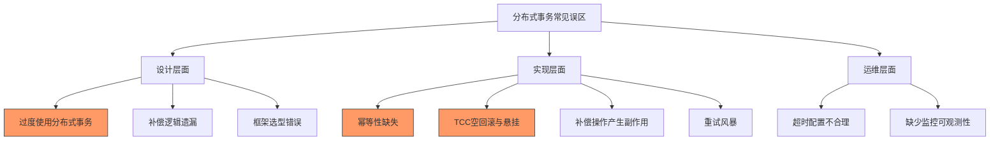
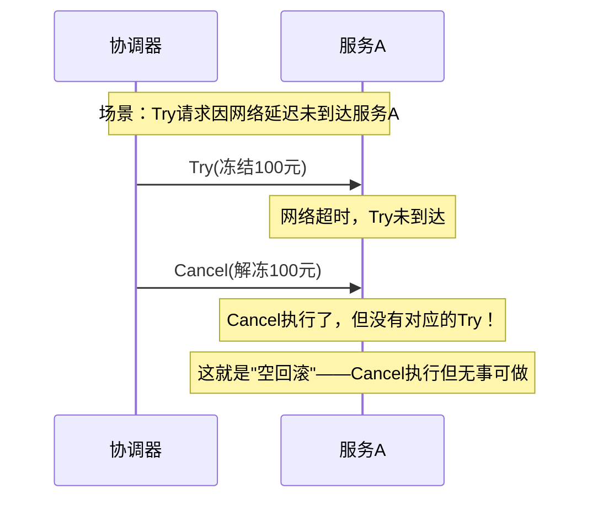
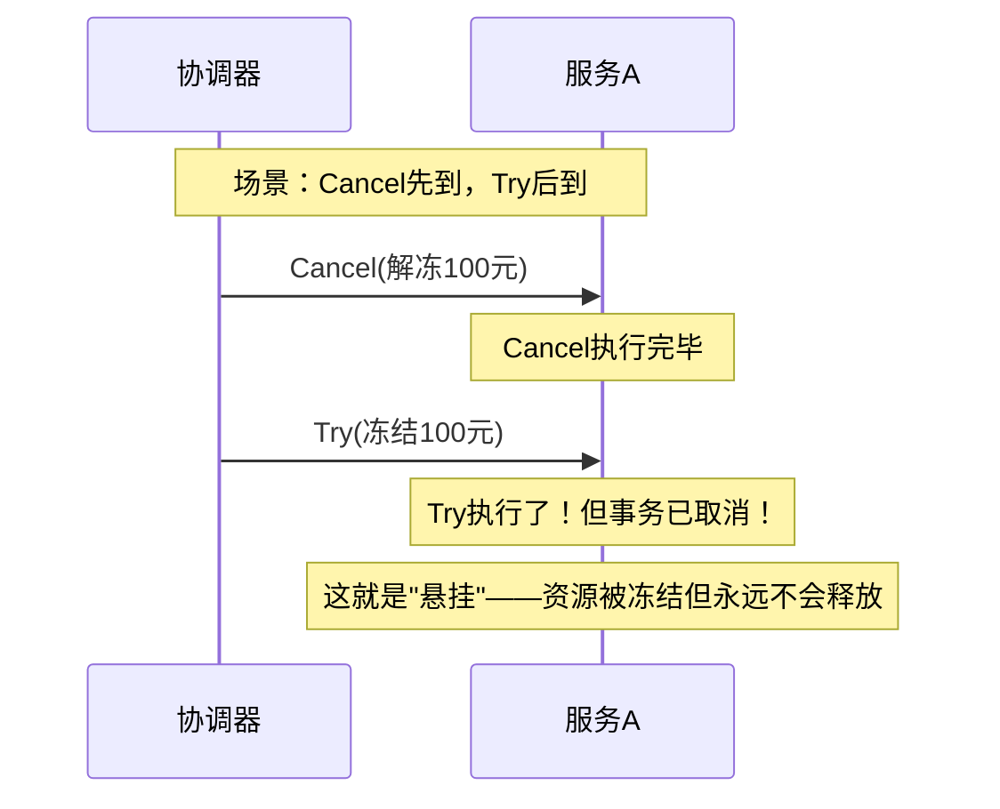
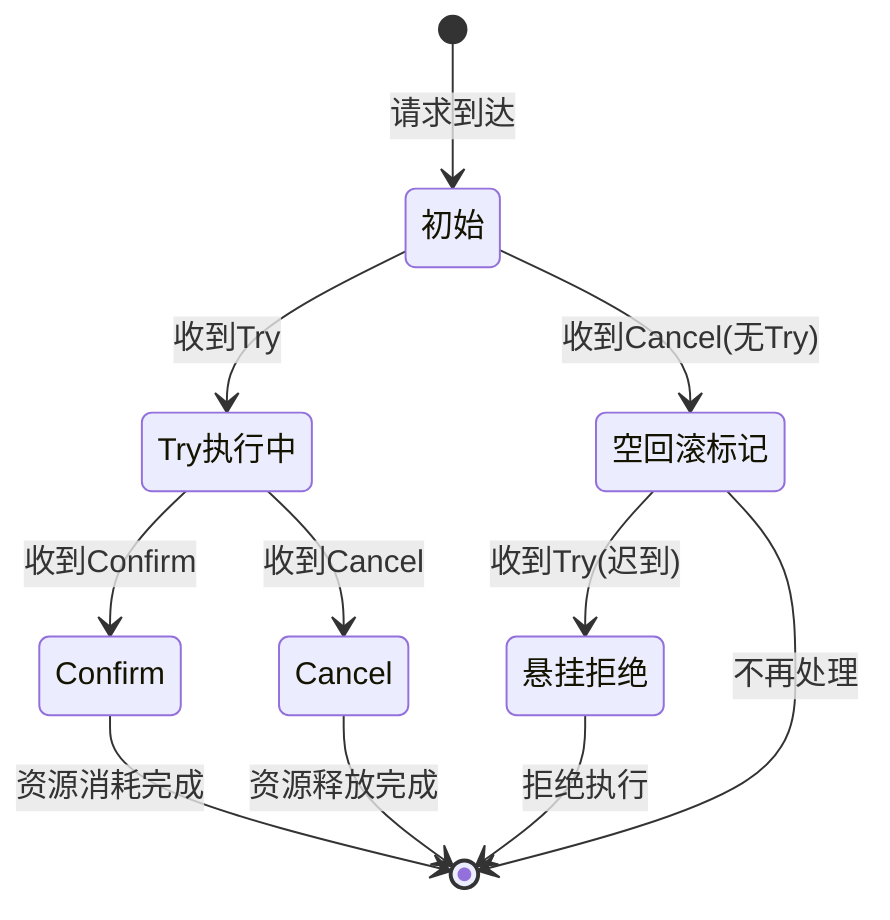
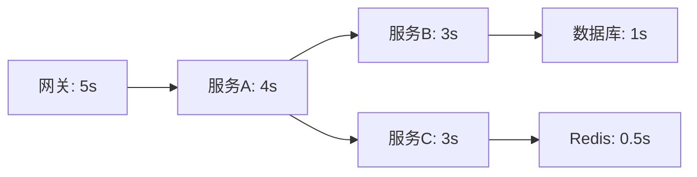
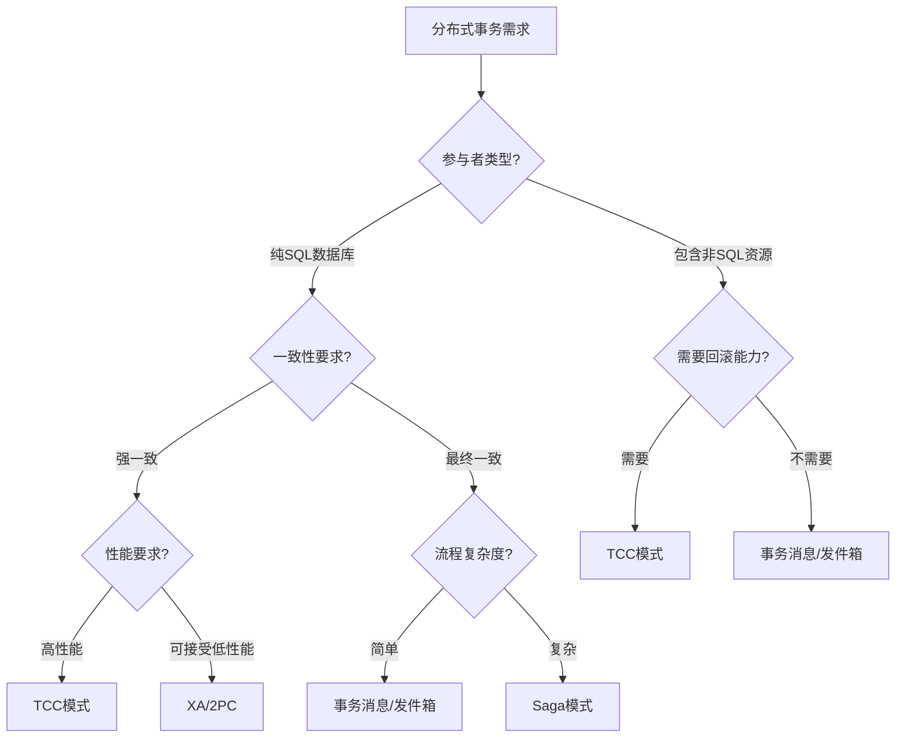

# 分布式事务常见误区

分布式事务的工程实践中有许多"看起来对、用起来坑"的设计决策。本节梳理最常见的九大误区，逐一分析其根因、后果和正确做法。每个误区都附带真实案例和可落地的防御策略，帮助你在生产环境避免这些代价高昂的错误。

## 误区总览



| 误区 | 严重程度 | 涉及模式 | 发生频率 |
|------|---------|---------|---------|
| 过度使用分布式事务 | 极高 | 所有模式 | 极高 |
| 补偿逻辑遗漏或不完整 | 极高 | Saga/TCC | 高 |
| 幂等性缺失 | 高 | 所有模式 | 高 |
| TCC空回滚与悬挂 | 高 | TCC | 中 |
| 补偿操作产生副作用 | 高 | Saga/TCC | 中 |
| 重试风暴 | 高 | 所有模式 | 中 |
| 超时配置不合理 | 中 | 所有模式 | 高 |
| 缺少监控可观测性 | 中 | 所有模式 | 极高 |
| 框架选型错误 | 中 | 所有模式 | 中 |

---

## 误区一：过度使用分布式事务

### 误区表现

"只要涉及多个服务调用，就引入分布式事务框架。"这是最常见的设计错误。许多团队一旦引入了Seata或类似框架，便倾向于在所有跨服务操作上都挂载全局事务，导致系统性能急剧下降、复杂度飙升。

```java
// 错误示范：在每个跨服务调用上都开启全局事务
@GlobalTransactional  // 不加区分地到处使用
public void processUserLogin(UserLoginDTO dto) {
    userService.updateLastLogin(dto.getUserId());    // 本地更新
    logService.writeLoginLog(dto);                   // 写日志
    notificationService.sendWelcome(dto);            // 发通知
    // 这三个操作完全不需要分布式事务！
}
```

### 根因分析

开发团队对"分布式事务"的边界认知模糊，没有区分"必须强一致"和"最终一致即可"的场景。具体原因包括：

- **恐惧驱动**：担心数据不一致导致事故，选择"最安全"的方案
- **技术展示**：引入新框架后想充分使用，过度设计
- **缺乏选型标准**：没有建立场景到方案的映射关系
- **早期决策惯性**：项目初期为了快速上线全用分布式事务，后续没有重构

### 严重后果

| 问题 | 具体表现 | 影响范围 |
|------|---------|---------|
| 性能暴跌 | 全局锁竞争、undo_log写入放大 | 所有相关接口 |
| 系统脆弱性增加 | 事务协调器成为单点，故障影响面扩大 | 全局 |
| 开发效率降低 | 每个接口都需要实现事务逻辑 | 全团队 |
| 运维复杂度上升 | 事务日志清理、状态恢复、监控告警 | 运维团队 |

### 正确做法：场景分级决策

根据数据一致性要求将操作分为三个等级：

**等级一：必须强一致（用分布式事务）**

典型场景：资金转移、库存与订单的原子性操作。这类操作如果出现不一致，会导致直接的财务损失。

```java
// 正确示范：仅在真正需要原子性时使用分布式事务
@GlobalTransactional
public void transferMoney(TransferDTO dto) {
    accountService.debit(dto.getFromAccount(), dto.getAmount());
    accountService.credit(dto.getToAccount(), dto.getAmount());
}
```

**等级二：最终一致即可（用消息/异步方案）**

典型场景：订单创建后发送通知、积分累加、日志记录。操作之间没有强依赖，允许短暂的不一致窗口。

```java
// 正确示范：用本地事务+消息表实现最终一致
public void createOrder(OrderDTO dto) {
    orderRepository.save(order);                     // 本地事务
    outboxRepository.save(new OutboxMessage(         // 同一事务内写消息
        "ORDER_CREATED", order.getId()
    ));
    // 异步投递消息，通知下游服务
}
```

**等级三：无需事务保证（直接调用）**

典型场景：读取配置、查询统计、非核心展示数据。数据不一致不影响核心业务。

```java
// 正确示范：非核心操作直接调用
public void displayDashboard(Long userId) {
    UserInfo user = userService.getUser(userId);       // 普通调用
    LogInfo log = logService.getRecentLog(userId);     // 普通调用
    // 两者独立，无一致性要求
}
```

### 选型决策矩阵

| 场景特征 | 推荐方案 | 原因 |
|---------|---------|------|
| 资金转移、库存扣减 | 2PC/XA 或 TCC | 必须强一致，不容许中间状态 |
| 长流程编排（订单→支付→物流） | Saga | 步骤多、时间长，补偿机制足够 |
| 事件驱动的异步操作 | 事务消息/发件箱 | 松耦合、高吞吐、允许延迟 |
| 纯查询、展示类操作 | 无需事务 | 无一致性需求 |
| 写入后发通知、记日志 | 本地事务+消息表 | 最终一致即可，零侵入 |

---

## 误区二：补偿逻辑遗漏或不完整

### 误区表现

Saga模式的核心是"正向操作 + 补偿操作"。但许多团队在实现时，正向逻辑写得非常完善，补偿逻辑却草草了事，甚至直接留空。

```python
# 错误示范：补偿逻辑缺失或不完整
class CreateOrderSaga:
    def execute(self, context):
        self.create_order(context)           # ✓ 正向逻辑完整
        self.deduct_inventory(context)       # ✓ 正向逻辑完整
        self.freeze_payment(context)         # ✓ 正向逻辑完整
    
    def compensate(self, context, failed_step):
        if failed_step == "create_order":
            self.cancel_order(context)       # ✓ 有补偿
        elif failed_step == "deduct_inventory":
            pass  # ← 致命错误：忘记写库存回滚！
        elif failed_step == "freeze_payment":
            self.unfreeze_payment(context)   # ✓ 有补偿
```

### 根因分析

- **补偿逻辑测试困难**：正向操作可以通过Happy Path快速验证，补偿逻辑只在异常时触发，容易被忽略
- **开发时序偏差**：先实现正向流程上线，补偿逻辑"后续再补"，结果一再拖延
- **业务理解不完整**：开发者只关注"成功时怎么做"，没有思考"失败时怎么恢复"

### 严重后果

当Saga执行到某一步失败需要补偿时，如果补偿逻辑缺失，系统将处于不一致状态：

正向执行：创建订单(✓) → 扣减库存(✓) → 冻结支付(✗ 失败)
需要补偿：取消订单(✓) → 回滚库存(✗ 无补偿！) → 解冻支付(不需要)
最终结果：订单已取消，但库存被永久扣减——用户永远买不到这件商品

### 正确做法：补偿完整性检查清单

**第一步：为每个正向操作建立补偿映射表**

| 正向操作 | 补偿操作 | 注意事项 |
|---------|---------|---------|
| 创建订单 | 取消/关闭订单 | 订单状态设为"CANCELLED"而非物理删除 |
| 扣减库存 | 恢复库存 | 必须恢复到原始数量，不能简单+1 |
| 冻结资金 | 解冻资金 | 恢复冻结状态，资金返回可用余额 |
| 发送消息 | 无（幂等消费即可） | 下游通过幂等性保证，不回滚已发消息 |
| 写入ES索引 | 删除ES文档 | 需要保存文档ID用于反向操作 |

**第二步：编写补偿逻辑时遵循"镜像原则"**

```java
// 正确示范：补偿逻辑与正向逻辑对称
public class InventoryCompensator implements StepCompensator {
    
    @Override
    public void compensate(SagaContext context) {
        String orderId = context.get("orderId");
        int quantity = context.get("quantity");  // 从上下文恢复原始值
        String skuId = context.get("skuId");
        
        // 恢复库存（必须使用事务保证原子性）
        inventoryRepository.restoreStock(skuId, quantity);
        
        // 记录补偿日志（用于审计和排查）
        compensationLogRepository.save(new CompensationLog(
            orderId, "INVENTORY_RESTORE", skuId, quantity, Instant.now()
        ));
    }
}
```

**第三步：强制执行补偿完整性测试**

```java
// 单元测试：验证每一步失败时补偿逻辑正确执行
@Test
void shouldCompensateInventoryWhenPaymentFails() {
    // 模拟支付服务不可用
    when(paymentService.freeze(any())).thenThrow(new RuntimeException("支付服务异常"));
    
    // 执行Saga
    sagaExecutor.execute(orderContext);
    
    // 验证补偿执行
    verify(inventoryService).restoreStock(eq("SKU001"), eq(2));
    verify(orderService).cancelOrder(anyString());
    
    // 验证最终状态一致
    Order order = orderRepository.findById(orderContext.getOrderId());
    assertEquals("CANCELLED", order.getStatus());
    
    int stock = inventoryRepository.getStock("SKU001");
    assertEquals(100, stock);  // 库存恢复到原始值
}
```

**第四步：建立补偿逻辑覆盖率度量**

在CI流水线中加入补偿覆盖率检查：

```yaml
# GitHub Actions 配置
- name: Check compensation coverage
  run: |
    # 每个Saga步骤必须有对应的补偿器
    steps=$(grep -r "@SagaStep" src/ | wc -l)
    compensators=$(grep -r "@StepCompensator" src/ | wc -l)
    if [ "$steps" != "$compensators" ]; then
      echo "ERROR: Some steps lack compensators!"
      echo "Steps: $steps, Compensators: $compensators"
      exit 1
    fi
```

---

## 误区三：幂等性缺失

### 误区表现

分布式事务中大量依赖重试机制来保证最终一致性。但如果接口本身不具备幂等性，重试会导致重复执行，产生脏数据。

```python
# 错误示范：接口非幂等，重试导致重复扣款
def debit_account(account_id, amount):
    account = Account.query.get(account_id)
    account.balance -= amount     # 每次调用都会扣减
    db.session.commit()
    return account.balance
```

### 根因分析

分布式系统的"语义"与单机系统有本质差异：

| 环境 | 调用语义 | 超时后的行为 |
|------|---------|------------|
| 单机 | 调用成功或失败，状态确定 | 程序异常，数据已回滚 |
| 分布式 | 调用可能丢失、重复、乱序 | 超时 ≠ 失败，可能已成功 |

超时后重试是最常见的重试场景。调用方不知道请求是否到达、是否执行成功，只能重试。如果接收方不具备幂等性，同一笔请求就会被执行多次。

### 严重后果

以支付扣款为例，假设用户购买一件 100 元的商品：

第一次请求：扣款 100 元 → 成功（但响应网络超时）
重试请求：  扣款 100 元 → 成功（重复扣款！）
最终结果：  用户被扣了 200 元，实际只买了一件商品

在高并发场景下，重试风暴可能在短时间内产生大量重复操作，导致的资金损失会成倍放大。

### 正确做法：全方位幂等性设计

**方案一：唯一请求ID（推荐）**

为每个请求生成全局唯一的请求ID，服务端通过ID去重：

```java
@Service
public class PaymentService {
    
    @Transactional
    public PaymentResult debit(String requestId, String accountId, BigDecimal amount) {
        // 1. 检查是否已处理过该请求
        Optional<IdempotentRecord> existing = idempotentRepository
            .findByRequestId(requestId);
        if (existing.isPresent()) {
            // 直接返回上次结果（幂等）
            return existing.get().getResult();
        }
        
        // 2. 执行扣款
        Account account = accountRepository.findById(accountId);
        account.debit(amount);
        accountRepository.save(account);
        
        // 3. 记录请求ID（在同一事务内）
        PaymentResult result = new PaymentResult(true, account.getBalance());
        idempotentRepository.save(new IdempotentRecord(
            requestId, result, Instant.now()
        ));
        
        return result;
    }
}
```

请求ID的生成方式：

| 方式 | 适用场景 | 优点 | 缺点 |
|------|---------|------|------|
| UUID | 通用 | 无中心化依赖 | 无序、存储空间大 |
| 业务ID组合 | 有天然业务键 | 可读、唯一性由业务保证 | 需要确保组合键唯一 |
| Snowflake | 高并发 | 有序、高性能 | 需要分布式ID生成器 |
| 请求签名 | 外部API | 防篡改 | 计算开销 |

**方案二：数据库唯一约束**

利用数据库的唯一索引防止重复插入：

```sql
-- 创建幂等表
CREATE TABLE idempotent_requests (
    request_id VARCHAR(64) PRIMARY KEY,
    result JSON,
    created_at TIMESTAMP DEFAULT CURRENT_TIMESTAMP,
    INDEX idx_created_at (created_at)
);

-- 插入时自动去重
INSERT IGNORE INTO idempotent_requests (request_id, result)
VALUES ('req_abc123', '{"success": true, "balance": 900}');
```

**方案三：乐观锁（适用于更新操作）**

```java
// 使用版本号实现乐观锁
@Modifying
@Query("UPDATE Account a SET a.balance = a.balance - :amount, "
     + "a.version = a.version + 1 "
     + "WHERE a.id = :id AND a.version = :version AND a.balance >= :amount")
int debitWithVersion(@Param("id") String id, 
                     @Param("amount") BigDecimal amount, 
                     @Param("version") long version);

// 调用方式
int affected = accountRepository.debitWithVersion(accountId, amount, expectedVersion);
if (affected == 0) {
    // 版本不匹配或余额不足，说明已被其他请求处理
    throw new ConcurrentModificationException("请求已被处理");
}
```

---

## 误区四：TCC空回滚与悬挂

### 误区表现

TCC（Try-Confirm-Cancel）模式需要处理两个特殊的时序问题：**空回滚**和**悬挂**。如果不加防御，这两个问题会导致资源泄露或数据不一致。

**空回滚场景**：



**悬挂场景**：



### 根因分析

TCC的三个阶段（Try-Confirm-Cancel）之间没有严格的时序保证。在网络分区、服务超时等情况下，消息的到达顺序是不确定的。如果不显式处理这种无序性，就会出现空回滚和悬挂。

### 严重后果

| 问题 | 后果 | 示例 |
|------|------|------|
| 空回滚 | 无实际影响，但如果补偿逻辑有副作用则可能出错 | 如果Cancel里做了"退还优惠券"，空回退还导致重复退还 |
| 悬挂 | 资源被永久占用，用户无法使用 | 用户余额被冻结但永远无法使用，客服投诉 |

### 正确做法：防御性编码

**防御空回滚**：Cancel执行前检查是否有对应的Try记录

```java
public class TccPaymentService implements TccService {
    
    @Override
    @Transactional
    public boolean try_(String xid, String resourceId, BigDecimal amount) {
        // 记录Try执行标记
        tccRecordRepository.save(new TccRecord(xid, resourceId, "TRY_EXECUTED"));
        
        // 冻结资金
        accountRepository.freezeAmount(resourceId, amount);
        return true;
    }
    
    @Override
    @Transactional
    public boolean cancel(String xid, String resourceId, BigDecimal amount) {
        // 检查是否有对应的Try记录
        Optional<TccRecord> record = tccRecordRepository.findByXidAndResource(xid, resourceId);
        if (record.isEmpty() || !"TRY_EXECUTED".equals(record.get().getStatus())) {
            // 没有Try记录 → 空回滚，记录标记后直接返回
            tccRecordRepository.save(new TccRecord(xid, resourceId, "EMPTY_ROLLBACK"));
            return true;
        }
        
        // 有Try记录 → 正常解冻
        accountRepository.unfreezeAmount(resourceId, amount);
        return true;
    }
    
    @Override
    @Transactional
    public boolean confirm(String xid, String resourceId, BigDecimal amount) {
        // 检查是否有对应的Try记录
        Optional<TccRecord> record = tccRecordRepository.findByXidAndResource(xid, resourceId);
        if (record.isEmpty()) {
            // 无Try记录，记录异常后直接返回
            log.error("Confirm called without Try, xid={}, resource={}", xid, resourceId);
            return true;
        }
        
        // 将冻结资金转为实际扣减
        accountRepository.confirmDeduction(resourceId, amount);
        return true;
    }
}
```

**防御悬挂**：Cancel执行后标记，后续Try到达时检测并拒绝

```java
@Override
@Transactional
public boolean try_(String xid, String resourceId, BigDecimal amount) {
    // 检查是否已执行过Cancel（防悬挂）
    Optional<TccRecord> record = tccRecordRepository.findByXidAndResource(xid, resourceId);
    if (record.isPresent() &amp;&amp; "EMPTY_ROLLBACK".equals(record.get().getStatus())) {
        // Cancel已执行且为空回滚 → Try不应该再执行，直接拒绝
        log.warn("Try rejected due to prior empty rollback, xid={}", xid);
        return false;
    }
    if (record.isPresent() &amp;&amp; "CANCELLED".equals(record.get().getStatus())) {
        // 正常Cancel已执行 → Try不应该再执行
        log.warn("Try rejected due to prior cancel, xid={}", xid);
        return false;
    }
    
    // 正常执行Try
    tccRecordRepository.save(new TccRecord(xid, resourceId, "TRY_EXECUTED"));
    accountRepository.freezeAmount(resourceId, amount);
    return true;
}
```

**TCC防悬挂完整状态机**：



---

## 误区五：补偿操作产生副作用

### 误区表现

补偿操作本身也应该是一个可重复、无副作用的操作。但实际开发中，补偿逻辑经常引入新的副作用，导致更大的不一致。

```python
# 错误示范：补偿操作产生了副作用
class OrderCompensator:
    def compensate(self, order):
        # 1. 取消订单（正确）
        order.status = "CANCELLED"
        
        # 2. 退还积分（正确）
        self.refund_points(order.user_id, order.points)
        
        # 3. 发送取消通知（错误！补偿中不应该发消息）
        self.notification_service.send(
            f"订单{order.id}已取消"  # 如果通知失败，整个补偿失败！
        )
        
        # 4. 更新库存统计（错误！这引入了新的依赖）
        self.stats_service.decrement(order.sku_id, order.quantity)
```

### 根因分析

开发者在写补偿逻辑时，习惯性地把"取消订单时应该做的所有事"都写进去，包括通知、统计、日志等。但补偿的核心目标是**恢复数据一致性**，不是"做完所有收尾工作"。

### 严重后果

- 补偿依赖外部服务（通知、统计），外部服务不可用时补偿失败，数据永远无法恢复
- 补偿中发消息，如果消息投递成功但后续步骤失败，可能导致不一致
- 补偿中更新统计数据，如果补偿重试，统计数据会被重复计算

### 正确做法：补偿操作的"纯函数"原则

补偿操作应该只做**恢复数据状态**这一件事，不依赖外部服务、不产生新数据、不发送消息。

```java
// 正确示范：补偿操作只做数据恢复
public class OrderCompensator implements StepCompensator {
    
    @Override
    @Transactional
    public void compensate(SagaContext context) {
        String orderId = context.get("orderId");
        
        // 只做数据状态恢复——将订单标记为已取消
        Order order = orderRepository.findById(orderId);
        order.setStatus(OrderStatus.CANCELLED);
        order.setCancelReason(context.get("failureReason"));
        order.setCancelledAt(Instant.now());
        orderRepository.save(order);
        
        // 通知、统计等通过事件驱动异步处理
        eventPublisher.publish(new OrderCancelledEvent(orderId));
    }
}

// 事件监听器独立处理通知和统计（与补偿解耦）
@Component
public class OrderCancelledHandler {
    
    @EventListener
    public void onOrderCancelled(OrderCancelledEvent event) {
        notificationService.sendCancelNotification(event.getOrderId());
        statsService.decrementOrderCount(event.getOrderId());
    }
}
```

**补偿操作检查清单**：

- [ ] 补偿逻辑中没有RPC调用（HTTP/gRPC）
- [ ] 补偿逻辑中没有发送消息（MQ）
- [ ] 补偿逻辑中没有写入外部存储（ES/Redis）
- [ ] 补偿逻辑是纯数据库操作（UPDATE/DELETE）
- [ ] 补偿逻辑可以安全重复执行（幂等）
- [ ] 补偿逻辑在同一事务内完成

---

## 误区六：重试风暴

### 误区表现

分布式事务中广泛使用重试机制来应对网络抖动和服务暂时不可用。但如果重试策略设计不当，大量重试请求会同时涌向故障服务，导致"重试风暴"，加剧故障甚至引发雪崩。

```java
// 错误示范：无限制重试 + 固定间隔
public void callWithRetry(Supplier<Result> action) {
    for (int i = 0; i < 10; i++) {      // 重试10次
        try {
            Result result = action.get();
            return result;
        } catch (Exception e) {
            Thread.sleep(1000);           // 每次等1秒
        }
    }
    throw new RuntimeException("重试耗尽");
}
// 问题：1000个并发请求，每个重试10次 = 10000个请求冲击故障服务
```

### 根因分析

| 问题 | 原因 | 后果 |
|------|------|------|
| 固定重试间隔 | 大量请求同时重试，形成"惊群效应" | 故障服务被瞬时大流量压垮 |
| 无限重试 | 没有设置重试上限 | 系统资源被持续消耗 |
| 所有请求都重试 | 没有区分暂时性故障和永久性故障 | 永久性故障也在无意义重试 |
| 无熔断机制 | 故障服务恢复前持续发送请求 | 故障传播到上游 |

### 正确做法：指数退避 + 抖动 + 熔断

```java
@Service
public class ResilientDistributedTransaction {
    
    private final CircuitBreaker circuitBreaker;
    
    @Retryable(
        retryFor = {TransientException.class},
        maxAttempts = 3,
        backoff = @Backoff(
            delay = 1000,      // 初始延迟1秒
            multiplier = 2,    // 每次翻倍
            maxDelay = 10000,  // 最大10秒
            random = true      // 加入随机抖动
        )
    )
    @CircuitBreaker(name = "paymentService", fallbackMethod = "paymentFallback")
    public PaymentResult callPaymentService(PaymentRequest request) {
        return paymentClient.process(request);
    }
    
    public PaymentResult paymentFallback(PaymentRequest request, Exception e) {
        // 熔断后的降级处理：记录到补偿队列，稍后重试
        compensationQueue.enqueue(request);
        return PaymentResult.pending();
    }
}
```

**重试策略对比**：

| 策略 | 重试间隔 | 适用场景 | 优点 | 缺点 |
|------|---------|---------|------|------|
| 固定间隔 | 1s, 1s, 1s | 无 | 简单 | 惊群效应 |
| 指数退避 | 1s, 2s, 4s | 通用 | 递减压力 | 仍可能聚集 |
| 指数退避+抖动 | 1s, 2.3s, 3.8s | 高并发（推荐） | 打散请求 | 实现略复杂 |
| Fibonacci退避 | 1s, 1s, 2s, 3s | 长任务 | 增长温和 | 间隔不够大 |

**熔断器配置参考**（以Resilience4j为例）：

```yaml
resilience4j:
  circuitbreaker:
    instances:
      paymentService:
        slidingWindowSize: 10           # 统计窗口：最近10次调用
        failureRateThreshold: 50        # 失败率 > 50% 打开熔断
        waitDurationInOpenState: 30s    # 熔断状态持续30秒
        permittedNumberOfCallsInHalfOpenState: 5  # 半开状态允许5次试探
        recordExceptions:
          - java.net.SocketTimeoutException
          - java.io.IOException
        ignoreExceptions:
          - BusinessException  # 业务异常不触发熔断
```

---

## 误区七：超时配置不合理

### 误区表现

分布式事务涉及多个服务的调用链，超时配置需要层层配合。许多团队要么使用默认超时（太短或太长），要么各层超时不协调，导致各种诡异问题。

```yaml
# 错误示范：各层超时不协调
# 网关超时
gateway:
  timeout: 3s          # 网关3秒超时

# 服务A调用服务B
serviceA:
  callB:
    timeout: 10s       # 服务A等服务B 10秒（超过网关超时！）

# 服务B调用服务C
serviceB:
  callC:
    timeout: 10s       # 服务B等服务C 10秒

# 结果：网关3秒就返回超时，但后端仍在执行！
# 用户看到超时重试 → 重复下单
```

### 根因分析

超时配置是一个系统级问题，需要从端到端的角度统一设计，而不是各服务独立配置。常见的超时不协调问题：

- **调用方超时 < 被调方处理时间**：请求被调用方丢弃（正在处理的事务中断）
- **各层超时不叠加**：A→B→C 的总超时应该有层级关系
- **超时后没有幂等保证**：超时≠失败，重试可能导致重复执行

### 严重后果

| 场景 | 后果 |
|------|------|
| 网关超时 < 服务超时 | 用户看到超时，但后端继续执行，用户重试导致重复操作 |
| 事务框架超时 < 业务处理时间 | 事务被强制回滚，但业务逻辑已部分执行 |
| 没有全局超时上限 | 一个慢请求占用线程池，导致整个服务不可用 |

### 正确做法：分层超时协调

**超时层级规则**：从外到内，超时递增。确保每一层都有足够的处理时间。



**推荐的超时配置参考值**：

| 层级 | 推荐超时 | 说明 |
|------|---------|------|
| API网关 | 3-5秒 | 用户可接受的等待上限 |
| 服务间调用 | 2-3秒 | 正常情况下应远小于此值 |
| 数据库操作 | 1秒 | 超过1秒的SQL需要优化 |
| 缓存操作 | 500毫秒 | 缓存本身应该很快 |
| 消息队列投递 | 1-2秒 | 异步操作，失败可重试 |
| 事务框架全局超时 | 30-60秒 | 视业务流程长度而定 |

**超时配置最佳实践**：

```java
// 使用配置中心统一管理超时（示例：Nacos配置）
@Configuration
public class TimeoutConfig {
    
    @Bean
    public RestTemplate restTemplate() {
        SimpleClientHttpRequestFactory factory = new SimpleClientHttpRequestFactory();
        factory.setConnectTimeout(3000);    // 连接超时 3s
        factory.setReadTimeout(3000);       // 读取超时 3s
        return new RestTemplate(factory);
    }
    
    // 分布式事务全局超时
    @Bean
    public GlobalTransactionConfig globalTransactionConfig() {
        return GlobalTransactionConfig.builder()
            .defaultTimeout(30)             // 默认30秒
            .orderServiceTimeout(10)        // 订单服务特殊配置
            .paymentServiceTimeout(15)      // 支付服务需要更长时间
            .build();
    }
}
```

---

## 误区八：缺少监控与可观测性

### 误区表现

分布式事务涉及多个服务的协作，出了问题排查难度极大。但许多团队在引入分布式事务后，没有建立配套的监控体系，导致问题发生后只能"凭感觉"排查。

```java
// 错误示范：没有日志、没有指标、没有追踪
@GlobalTransactional
public void createOrder(OrderDTO dto) {
    orderService.create(dto);          // 失败了？不知道为什么
    inventoryService.deduct(dto);      // 补偿了吗？不知道
    paymentService.freeze(dto);        // 卡在哪一步？不知道
}
```

### 根因分析

- **分布式事务的排查天然困难**：一个事务涉及多个服务的日志，需要关联分析
- **框架默认可观测性不足**：Seata等框架有基础日志，但缺少业务维度的监控
- **"能跑就行"心态**：开发时只关注功能实现，上线后才发现无法定位问题

### 严重后果

当分布式事务出现问题时，没有监控意味着：

- 无法发现事务失败率上升（直到用户投诉）
- 无法定位失败在哪个环节（需要人工逐个查日志）
- 无法分析事务执行耗时（性能问题无法诊断）
- 无法进行容量规划（不知道事务处理的吞吐量）

### 正确做法：分布式事务三支柱监控

**支柱一：分布式链路追踪（Trace）**

为每个分布式事务分配唯一的 TraceId，串联所有相关日志：

```java
@GlobalTransactional
public void createOrder(OrderDTO dto) {
    String traceId = TraceContext.currentTraceId();
    
    MDC.put("traceId", traceId);
    MDC.put("txType", "CREATE_ORDER");
    
    log.info("[TX_START] 创建订单, userId={}, amount={}", 
             dto.getUserId(), dto.getAmount());
    
    orderService.create(dto);
    log.info("[STEP_DONE] 订单创建成功, orderId={}", dto.getOrderId());
    
    inventoryService.deduct(dto);
    log.info("[STEP_DONE] 库存扣减成功, sku={}, quantity={}", 
             dto.getSkuId(), dto.getQuantity());
    
    paymentService.freeze(dto);
    log.info("[TX_COMMIT] 分布式事务提交成功");
}
```

**支柱二：关键指标采集（Metrics）**

使用 Prometheus 采集分布式事务的核心指标：

```java
@Component
public class DistributedTransactionMetrics {
    
    private final Counter txTotal = Counter.builder("dt_tx_total")
        .help("分布式事务总数")
        .tag("status", "success")  // 动态标签
        .register();
    
    private final Counter txFailure = Counter.builder("dt_tx_failure_total")
        .help("分布式事务失败数")
        .labelNames("failure_step", "failure_reason")
        .register();
    
    private final Histogram txDuration = Histogram.builder("dt_tx_duration_seconds")
        .help("分布式事务耗时")
        .buckets(0.1, 0.5, 1, 2, 5, 10, 30)
        .register();
    
    private final Gauge pendingCompensation = Gauge.builder("dt_pending_compensation")
        .help("待补偿事务数")
        .register();
    
    public void recordSuccess(String txType) {
        txTotal.labels("success").inc();
    }
    
    public void recordFailure(String step, String reason) {
        txFailure.labels(step, reason).inc();
    }
    
    public void recordDuration(double seconds) {
        txDuration.record(seconds);
    }
}
```

**需要监控的核心指标**：

| 指标 | 类型 | 告警阈值 | 说明 |
|------|------|---------|------|
| dt_tx_total | Counter | - | 事务总数（按成功/失败分） |
| dt_tx_failure_total | Counter | >10次/分钟 | 事务失败数（按步骤分） |
| dt_tx_duration_seconds | Histogram | P99 > 10s | 事务耗时分布 |
| dt_pending_compensation | Gauge | >100 | 待补偿事务积压量 |
| dt_compensation_success_rate | Gauge | <95% | 补偿成功率 |
| dt_step_failure_rate | Gauge | >5% | 单步骤失败率 |

**支柱三：结构化日志（Logging）**

```java
// 使用结构化日志记录事务生命周期
public class TransactionLogger {
    
    public void logTxStart(String traceId, String txType, Map<String, Object> context) {
        log.info(JsonMapper.toJson(Map.of(
            "event", "TX_START",
            "traceId", traceId,
            "txType", txType,
            "context", context,
            "timestamp", Instant.now()
        )));
    }
    
    public void logTxStep(String traceId, String step, String status, long durationMs) {
        log.info(JsonMapper.toJson(Map.of(
            "event", "TX_STEP",
            "traceId", traceId,
            "step", step,
            "status", status,
            "durationMs", durationMs,
            "timestamp", Instant.now()
        )));
    }
    
    public void logTxEnd(String traceId, String result, long totalDurationMs) {
        log.info(JsonMapper.toJson(Map.of(
            "event", "TX_END",
            "traceId", traceId,
            "result", result,
            "totalDurationMs", totalDurationMs,
            "timestamp", Instant.now()
        )));
    }
}
```

---

## 误区九：框架选型错误

### 误区表现

不根据业务场景选择合适的分布式事务框架，而是盲目追随"热门技术"或使用"最简单的方案"。

| 常见错误选型 | 场景 | 问题 |
|------------|------|------|
| 所有场景用Seata AT | 包含Redis、ES等非SQL资源 | AT模式只支持SQL资源 |
| 所有场景用2PC | 高并发电商系统 | 全局锁导致性能瓶颈 |
| 所有场景用Saga | 需要强一致的资金操作 | 最终一致不满足业务要求 |
| 自研分布式事务 | 团队无分布式系统经验 | 维护成本远超预期 |

### 正确做法：按场景精准选型

**选型核心原则**：先明确业务需求，再选择技术方案。不要反过来。



**各框架适用场景速查**：

| 框架/模式 | 适用 | 不适用 | 推荐理由 |
|-----------|------|--------|---------|
| Seata AT | 纯SQL、快速接入 | 非SQL资源、高并发 | 零侵入，上手快 |
| Seata TCC | 资金类、强一致 | 复杂流程、大量步骤 | 隔离性强，但开发成本高 |
| Seata Saga | 长流程编排 | 需要强一致 | 流程清晰，补偿可控 |
| Seata XA | 同构数据库、强一致 | 高并发、异构存储 | 标准协议，性能受限 |
| RocketMQ事务消息 | 异步解耦、事件驱动 | 需要同步等待结果 | 高吞吐，解耦彻底 |
| 自研方案 | 特殊业务需求 | 通用场景 | 灵活但维护成本极高 |

---

## 误区防御清单

在分布式事务系统上线前，使用以下清单逐项检查：

### 设计阶段

- [ ] **是否真正需要分布式事务？** 能否通过服务拆分粒度调整避免跨服务事务？
- [ ] **一致性需求是否明确？** 每个操作是否标注了强一致/最终一致/无要求？
- [ ] **补偿方案是否完整？** 每个正向操作是否有对应的补偿逻辑？
- [ ] **框架选型是否合理？** 是否根据场景选择了最合适的方案？

### 实现阶段

- [ ] **幂等性是否保证？** 所有可重试的接口是否实现了幂等？
- [ ] **TCC防悬挂是否实现？** 空回滚和悬挂是否都有防御措施？
- [ ] **补偿操作是否有副作用？** 补偿逻辑是否只做数据恢复？
- [ ] **重试策略是否合理？** 是否使用指数退避+抖动+熔断？
- [ ] **超时配置是否协调？** 各层超时是否有层级关系？

### 运维阶段

- [ ] **监控是否到位？** 是否有事务成功率、耗时、失败原因的监控？
- [ ] **告警是否配置？** 事务失败率超过阈值是否自动告警？
- [ ] **日志是否可追踪？** 是否可以通过TraceId串联完整的事务日志？
- [ ] **补偿积压是否监控？** 待补偿事务是否有积压告警？

---

## 本节小结

分布式事务的误区本质上可以归纳为三类：

1. **过度设计**：不需要分布式事务的场景引入了分布式事务，增加了不必要的复杂度和性能开销。解决方案是建立场景分级机制，严格区分强一致和最终一致的需求。

2. **防御不足**：实现了分布式事务但缺少必要的防御措施（幂等、空回滚、悬挂、重试策略），导致在异常场景下出现数据不一致。解决方案是将防御性编码作为分布式事务开发的标准实践。

3. **可观测性缺失**：分布式事务出了问题无法快速定位和修复。解决方案是建立完整的链路追踪、指标采集和结构化日志体系。

记住分布式事务的黄金法则：**能用本地事务解决的绝不用分布式事务；能用最终一致性的不用强一致性；能用Saga的不用TCC。** 分布式事务是最后的手段，不是第一选择。
