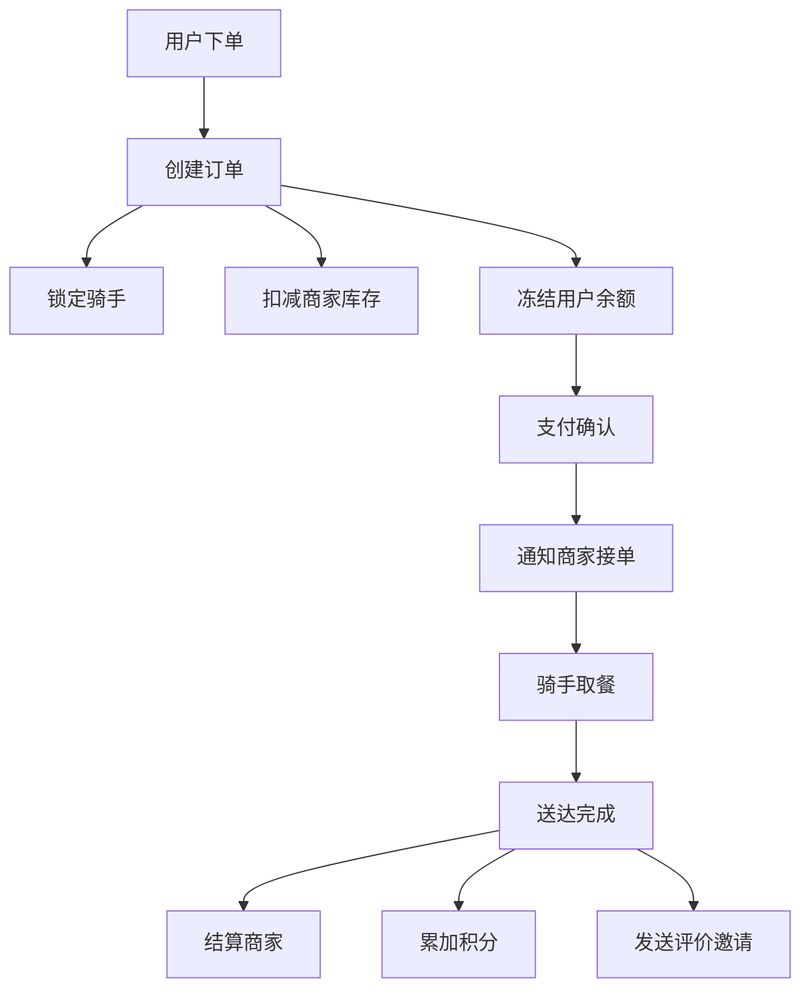

# 分布式事务练习方法

本节提供五个递进式的实践练习，覆盖本章所有核心知识点。从概念理解到架构设计，每个练习都设计了明确的目标、具体步骤和验收标准。建议按照顺序完成——前一个练习的知识是后一个练习的基础。


---

## 练习一：分布式事务核心概念理解（预计30分钟）

### 目标

能够清晰解释四种分布式事务模式（2PC/Saga/TCC/事务性发件箱）的原理、适用场景和核心权衡，理解CAP约束下的一致性选择。

### 步骤一：画出四种模式的时序图（15分钟）

选择以下场景——"用户下单购买商品，涉及订单服务、库存服务、支付服务"——分别画出四种模式下的调用时序：

**2PC模式时序图**

协调者(订单服务)          库存服务            支付服务
     |                     |                  |
     |--- Prepare -------->|                  |
     |--- Prepare -------->|-------->---------|
     |                     |                  |
     |<-- Vote-OK ---------|                  |
     |<-- Vote-OK ---------|--------<---------|
     |                     |                  |
     |--- Commit ---------->|                  |
     |--- Commit ---------->|-------->---------|
     |                     |                  |

注意2PC的阻塞点：协调者在收到所有Prepare响应前，参与者必须持有锁等待。

**Saga模式时序图**

Saga编排器              订单服务    库存服务    支付服务
  |                       |           |          |
  |-- CreateOrder ------->|           |          |
  |<-- OrderCreated ------|           |          |
  |                       |           |          |
  |-- DeductInventory --->|---------->|          |
  |<-- InventoryDeducted -|           |          |
  |                       |           |          |
  |-- FreezePayment ----->|---------->|-------->|
  |<-- PaymentFrozen -----|           |          |
  |                       |           |          |
  |  [如果支付失败，反向补偿]           |          |
  |<-- PaymentFailed -----|-----------|----------|
  |-- RestoreInventory -->|---------->|          |
  |-- CancelOrder ------->|           |          |

**TCC模式时序图**

TCC协调器               订单服务    库存服务    支付服务
  |                       |           |          |
  |=== Try阶段 ===        |           |          |
  |-- Try(CreateOrder) -->|           |          |
  |-- Try(DeductStock) -->|---------->|          |
  |-- Try(FreezePay) --->|---------->|-------->|
  |                       |           |          |
  | [全部Try成功]         |           |          |
  |=== Confirm阶段 ===   |           |          |
  |-- Confirm ----------->|---------->|-------->|
  |                       |           |          |
  | [任一Try失败]         |           |          |
  |=== Cancel阶段 ===    |           |          |
  |-- Cancel ------------>|---------->|-------->|

**事务性发件箱时序图**

订单服务(含本地消息表)         库存服务      支付服务
  |                             |              |
  | BEGIN TRANSACTION           |              |
  | INSERT INTO orders ...      |              |
  | INSERT INTO outbox ...      |              |
  | COMMIT                      |              |
  |                             |              |
  | [异步轮询/CDC读取outbox]    |              |
  |                             |              |
  |-- 发送消息: ORDER_CREATED ->|              |
  |                             |              |
  |  [消费者处理]               |              |
  |<------- ACK ----------------|              |
  |                             |              |
  | 标记消息为已发送              |              |

### 步骤二：对比分析表（10分钟）

完成以下对比表格，用自己的语言填写每个空格：

| 维度 | 2PC | Saga | TCC | 事务发件箱 |
|------|-----|------|-----|-----------|
| 一致性级别 | ? | ? | ? | ? |
| 性能影响 | ? | ? | ? | ? |
| 业务侵入程度 | ? | ? | ? | ? |
| 是否需要补偿逻辑 | ? | ? | ? | ? |
| 适用的事务时长 | ? | ? | ? | ? |
| 资源锁定方式 | ? | ? | ? | ? |

<details>
<summary>参考答案（点击展开）</summary>

| 维度 | 2PC | Saga | TCC | 事务发件箱 |
|------|-----|------|-----|-----------|
| 一致性级别 | 强一致 | 最终一致 | 准强一致 | 最终一致 |
| 性能影响 | 高（全局锁） | 低（无锁） | 中（资源冻结） | 低（异步） |
| 业务侵入程度 | 低（XA协议） | 中（需写补偿） | 高（三接口+防悬挂） | 低（写消息表） |
| 是否需要补偿逻辑 | 否（直接回滚） | 是（后向补偿） | 是（Cancel释放） | 否（消息重投） |
| 适用事务时长 | 短事务 | 长事务 | 短~中事务 | 异步场景 |
| 资源锁定方式 | 全局锁、长时间 | 无锁 | 冻结资源、短时间 | 无锁 |

</details>

### 步骤三：场景匹配练习（5分钟）

将以下业务场景匹配到最适合的分布式事务模式，并说明理由：

1. 银行跨行转账（A银行扣款 → B银行入账）
2. 电商下单（创建订单 → 扣库存 → 扣款 → 加积分）
3. 用户注册（创建账号 → 发欢迎邮件 → 初始化推荐列表）
4. 机票预订（锁座 → 支付 → 出票，要求中间状态不可见）
5. 库存同步（MySQL库存变更 → 同步到ES搜索索引）

<details>
<summary>参考答案（点击展开）</summary>

1. **TCC** — 资金操作要求准强一致，需要资源冻结（冻结A账户金额，确认后扣减）
2. **Saga** — 步骤多、跨服务、允许最终一致，每步失败可补偿
3. **事务发件箱** — 异步解耦，邮件发送失败不影响注册，重试即可
4. **TCC** — 要求中间状态不可见（座位锁定后别人不能买），准强一致
5. **事务发件箱** — CDC监听binlog异步同步，最终一致即可

</details>

### 验收标准

- [ ] 能画出四种模式的时序图，标注关键差异点
- [ ] 能完成对比表格并解释每个维度的含义
- [ ] 能为给定场景选择合适模式并给出合理理由

---

## 练习二：实现一个Saga状态机（预计60分钟）

### 目标

独立实现一个完整的Saga状态机，包含步骤定义、状态流转、补偿执行和超时处理。通过代码实践深入理解Saga模式的工程实现。

### 步骤一：定义Saga数据模型（10分钟）

```python
from enum import Enum
from dataclasses import dataclass, field
from typing import Callable, Optional, Dict, Any
from datetime import datetime, timedelta
import uuid

class SagaStepStatus(Enum):
    """Saga步骤状态"""
    PENDING = "PENDING"           # 待执行
    RUNNING = "RUNNING"           # 执行中
    COMPLETED = "COMPLETED"       # 已完成
    COMPENSATING = "COMPENSATING" # 补偿中
    COMPENSATED = "COMPENSATED"   # 已补偿
    FAILED = "FAILED"             # 已失败

class SagaStatus(Enum):
    """Saga全局状态"""
    PENDING = "PENDING"
    RUNNING = "RUNNING"
    COMPLETED = "COMPLETED"
    COMPENSATING = "COMPENSATING"
    COMPENSATED = "COMPENSATED"
    FAILED = "FAILED"

@dataclass
class SagaStep:
    """Saga步骤定义"""
    name: str
    action: Callable[[Dict[str, Any]], Dict[str, Any]]
    compensate: Callable[[Dict[str, Any]], None]
    status: SagaStepStatus = SagaStepStatus.PENDING
    result: Optional[Dict[str, Any]] = None
    error: Optional[str] = None
    max_retries: int = 3
    retry_count: int = 0
    timeout_seconds: int = 30
    step_id: str = field(default_factory=lambda: str(uuid.uuid4()))

@dataclass
class SagaDefinition:
    """Saga定义"""
    saga_id: str = field(default_factory=lambda: str(uuid.uuid4()))
    steps: list[SagaStep] = field(default_factory=list)
    status: SagaStatus = SagaStatus.PENDING
    context: Dict[str, Any] = field(default_factory=dict)
    created_at: datetime = field(default_factory=datetime.now)
    completed_at: Optional[datetime] = None
    current_step_index: int = 0
```

思考：为什么SagaStep要同时保存 `action` 和 `compensate`？因为Saga的核心保证是"每步失败都能反向补偿"——如果正向执行和补偿逻辑不在同一个定义中，很容易遗漏补偿。

### 步骤二：实现Saga执行引擎（25分钟）

```python
import logging
import time

logger = logging.getLogger(__name__)

class SagaExecutor:
    """Saga执行引擎"""
    
    def __init__(self):
        self.executed_steps: list[SagaStep] = []
    
    def execute(self, saga: SagaDefinition) -> SagaStatus:
        """
        执行Saga正向流程。
        任何一步失败时，反向补偿所有已完成步骤。
        """
        saga.status = SagaStatus.RUNNING
        
        for i, step in enumerate(saga.steps):
            saga.current_step_index = i
            step.status = SagaStepStatus.RUNNING
            logger.info(f"[Saga:{saga.saga_id}] 执行步骤: {step.name}")
            
            try:
                # 带重试的步骤执行
                result = self._execute_with_retry(step, saga.context)
                step.result = result
                step.status = SagaStepStatus.COMPLETED
                self.executed_steps.append(step)
                
                # 将步骤结果合并到Saga上下文
                if result:
                    saga.context.update(result)
                    
                logger.info(f"[Saga:{saga.saga_id}] 步骤完成: {step.name}")
                
            except Exception as e:
                step.status = SagaStepStatus.FAILED
                step.error = str(e)
                logger.error(f"[Saga:{saga.saga_id}] 步骤失败: {step.name}, 原因: {e}")
                
                # 执行反向补偿
                self._compensate(saga)
                saga.status = SagaStatus.COMPENSATED
                saga.completed_at = datetime.now()
                return SagaStatus.COMPENSATED
        
        # 所有步骤执行成功
        saga.status = SagaStatus.COMPLETED
        saga.completed_at = datetime.now()
        logger.info(f"[Saga:{saga.saga_id}] 全部步骤执行完成")
        return SagaStatus.COMPLETED
    
    def _execute_with_retry(self, step: SagaStep, context: Dict[str, Any]) -> Dict[str, Any]:
        """带重试和超时的步骤执行"""
        last_error = None
        
        for attempt in range(step.max_retries):
            try:
                logger.info(f"  步骤 {step.name} 第 {attempt + 1} 次尝试")
                result = step.action(context)
                return result
            except Exception as e:
                last_error = e
                step.retry_count = attempt + 1
                logger.warning(f"  步骤 {step.name} 失败 (第{attempt+1}次): {e}")
                
                if attempt < step.max_retries - 1:
                    # 指数退避
                    wait_time = min(2 ** attempt, 10)
                    time.sleep(wait_time)
        
        raise last_error
    
    def _compensate(self, saga: SagaDefinition):
        """反向补偿所有已完成的步骤"""
        logger.info(f"[Saga:{saga.saga_id}] 开始反向补偿...")
        
        # 反向遍历已执行的步骤
        for step in reversed(self.executed_steps):
            if step.status == SagaStepStatus.COMPLETED:
                step.status = SagaStepStatus.COMPENSATING
                try:
                    logger.info(f"  补偿步骤: {step.name}")
                    step.compensate(saga.context)
                    step.status = SagaStepStatus.COMPENSATED
                    logger.info(f"  补偿完成: {step.name}")
                except Exception as e:
                    # 补偿失败是严重问题，需要人工介入
                    logger.error(f"  补偿失败: {step.name}, 原因: {e}")
                    step.error = f"补偿失败: {e}"
                    # 记录补偿失败，但继续补偿其他步骤
```

关键设计点：
1. **反向遍历补偿**：已执行的步骤按逆序补偿，确保依赖关系正确
2. **指数退避重试**：`min(2^attempt, 10)` 秒，避免重试风暴
3. **补偿失败日志**：补偿失败不能吞掉异常，必须记录以便人工介入

### 步骤三：编写电商下单Saga示例（15分钟）

```python
def create_order(context: Dict[str, Any]) -> Dict[str, Any]:
    """正向：创建订单"""
    order_id = f"ORD-{uuid.uuid4().hex[:8]}"
    order = {
        "order_id": order_id,
        "user_id": context["user_id"],
        "sku_id": context["sku_id"],
        "quantity": context["quantity"],
        "amount": context["amount"],
        "status": "CREATED"
    }
    # 实际项目中：orderRepository.save(order)
    print(f"  → 创建订单 {order_id}, 金额 {context['amount']}")
    return {"order_id": order_id, "order": order}

def cancel_order(context: Dict[str, Any]) -> None:
    """补偿：取消订单"""
    order_id = context.get("order_id")
    print(f"  ← 取消订单 {order_id}")

def deduct_inventory(context: Dict[str, Any]) -> Dict[str, Any]:
    """正向：扣减库存"""
    sku_id = context["sku_id"]
    quantity = context["quantity"]
    # 实际项目中：inventoryRepository.deduct(sku_id, quantity)
    print(f"  → 扣减库存: SKU={sku_id}, 数量={quantity}")
    return {"inventory_deducted": True}

def restore_inventory(context: Dict[str, Any]) -> None:
    """补偿：恢复库存"""
    sku_id = context["sku_id"]
    quantity = context["quantity"]
    print(f"  ← 恢复库存: SKU={sku_id}, 数量={quantity}")

def freeze_payment(context: Dict[str, Any]) -> Dict[str, Any]:
    """正向：冻结资金（模拟失败场景）"""
    account_id = context["user_id"]
    amount = context["amount"]
    # 模拟支付服务不可用
    if context.get("simulate_payment_failure"):
        raise ConnectionError("支付服务超时，无法冻结资金")
    print(f"  → 冻结资金: 账户={account_id}, 金额={amount}")
    return {"payment_frozen": True}

def unfreeze_payment(context: Dict[str, Any]) -> None:
    """补偿：解冻资金"""
    account_id = context["user_id"]
    amount = context["amount"]
    print(f"  ← 解冻资金: 账户={account_id}, 金额={amount}")

# 构建Saga
saga = SagaDefinition(
    steps=[
        SagaStep(name="创建订单", action=create_order, compensate=cancel_order),
        SagaStep(name="扣减库存", action=deduct_inventory, compensate=restore_inventory),
        SagaStep(name="冻结资金", action=freeze_payment, compensate=unfreeze_payment),
    ],
    context={
        "user_id": "USER-001",
        "sku_id": "SKU-iPhone15",
        "quantity": 1,
        "amount": 7999.00,
        "simulate_payment_failure": True,  # 模拟支付失败
    }
)

# 执行
executor = SagaExecutor()
result = executor.execute(saga)
print(f"\n最终状态: {saga.status.value}")
for step in saga.steps:
    print(f"  步骤 {step.name}: {step.status.value}")
```

预期输出：

  → 创建订单 ORD-a1b2c3d4, 金额 7999.0
  → 扣减库存: SKU=SKU-iPhone15, 数量=1
  → 冻结资金: 账户=USER-001, 金额=7999.0
  ✗ 连接错误: 支付服务超时，无法冻结资金
  ← 恢复库存: SKU=SKU-iPhone15, 数量=1
  ← 取消订单 ORD-a1b2c3d4

最终状态: COMPENSATED
  步骤 创建订单: COMPENSATED
  步骤 扣减库存: COMPENSATED
  步骤 冻结资金: FAILED

### 步骤四：加入超时处理（10分钟）

在SagaExecutor中增加超时检测：

```python
import signal

class TimeoutError(Exception):
    pass

def timeout_handler(signum, frame):
    raise TimeoutError("步骤执行超时")

class SagaExecutorWithTimeout(SagaExecutor):
    """带超时控制的Saga执行器"""
    
    def _execute_with_retry(self, step: SagaStep, context: Dict[str, Any]) -> Dict[str, Any]:
        last_error = None
        
        for attempt in range(step.max_retries):
            try:
                # 设置超时信号
                signal.signal(signal.SIGALRM, timeout_handler)
                signal.alarm(step.timeout_seconds)
                
                try:
                    result = step.action(context)
                finally:
                    signal.alarm(0)  # 取消闹钟
                
                return result
            except (TimeoutError, Exception) as e:
                signal.alarm(0)
                last_error = e
                step.retry_count = attempt + 1
                
                if isinstance(e, TimeoutError):
                    logger.warning(f"  步骤 {step.name} 超时 ({step.timeout_seconds}s)")
                else:
                    logger.warning(f"  步骤 {step.name} 失败: {e}")
                
                if attempt < step.max_retries - 1:
                    time.sleep(min(2 ** attempt, 10))
        
        raise last_error
```

### 验收标准

- [ ] Saga状态机能正确执行正向流程（所有步骤成功 → COMPLETED）
- [ ] 任一步骤失败时自动反向补偿（COMPENSATED）
- [ ] 重试机制正常工作（指数退避、最大重试次数）
- [ ] 超时处理正常工作
- [ ] 能解释每个设计决策的原因

---

## 练习三：搭建TCC框架并处理空回滚与悬挂（预计60分钟）

### 目标

理解TCC三阶段（Try-Confirm-Cancel）的完整生命周期，重点掌握空回滚和悬挂问题的防御机制。

### 步骤一：实现TCC资源管理器（20分钟）

```python
from enum import Enum
from dataclasses import dataclass, field
from typing import Optional, Dict, Any
import uuid
from datetime import datetime

class TccRecordStatus(Enum):
    """TCC记录状态，用于防御空回滚和悬挂"""
    TRY_EXECUTED = "TRY_EXECUTED"         # Try已执行
    CONFIRMED = "CONFIRMED"               # 已确认
    CANCELLED = "CANCELLED"               # 已取消
    EMPTY_ROLLBACK = "EMPTY_ROLLBACK"     # 空回滚（Try未执行但Cancel已执行）

@dataclass
class TccRecord:
    """TCC操作记录"""
    xid: str                  # 全局事务ID
    resource_id: str          # 资源ID（如账户ID）
    status: TccRecordStatus
    amount: float = 0.0
    created_at: datetime = field(default_factory=datetime.now)

class TccResourceManager:
    """
    TCC资源管理器：模拟账户的Try/Confirm/Cancel操作。
    包含空回滚和悬挂的防御逻辑。
    """
    
    def __init__(self):
        self.accounts: Dict[str, float] = {}           # 账户余额
        self.frozen: Dict[str, float] = {}             # 冻结金额
        self.tcc_records: Dict[str, TccRecord] = {}    # xid+resource_id → 记录
    
    def init_account(self, account_id: str, balance: float):
        """初始化账户"""
        self.accounts[account_id] = balance
        self.frozen[account_id] = 0.0
    
    def _record_key(self, xid: str, resource_id: str) -> str:
        return f"{xid}:{resource_id}"
    
    def try_freeze(self, xid: str, account_id: str, amount: float) -> bool:
        """
        Try阶段：冻结资金。
        
        防御悬挂：如果已有Cancel/EmptyRollback记录，拒绝Try。
        """
        key = self._record_key(xid, account_id)
        
        # ===== 防悬挂检查 =====
        existing = self.tcc_records.get(key)
        if existing:
            if existing.status in (TccRecordStatus.CANCELLED, TccRecordStatus.EMPTY_ROLLBACK):
                # Cancel已执行（正常或空回滚），Try不应再到达 → 拒绝
                print(f"  [防悬挂] 拒绝Try: xid={xid}, 已有状态={existing.status.value}")
                return False
        
        # 执行冻结
        balance = self.accounts.get(account_id, 0)
        if balance < amount:
            print(f"  [Try失败] 余额不足: {account_id} 余额={balance}, 需要={amount}")
            return False
        
        self.accounts[account_id] -= amount
        self.frozen[account_id] = self.frozen.get(account_id, 0) + amount
        
        # 记录Try已执行
        self.tcc_records[key] = TccRecord(
            xid=xid, resource_id=account_id,
            status=TccRecordStatus.TRY_EXECUTED, amount=amount
        )
        
        print(f"  [Try成功] 冻结 {amount} 元, 账户 {account_id} 余额: {balance} → {self.accounts[account_id]}")
        return True
    
    def confirm(self, xid: str, account_id: str, amount: float) -> bool:
        """
        Confirm阶段：确认扣减（将冻结转为实际扣减）。
        """
        key = self._record_key(xid, account_id)
        record = self.tcc_records.get(key)
        
        if not record or record.status != TccRecordStatus.TRY_EXECUTED:
            print(f"  [Confirm跳过] 无Try记录或状态不对: xid={xid}")
            return True
        
        # 确认：冻结金额转为实际扣减（已经从余额扣了，这里只需更新冻结）
        self.frozen[account_id] -= amount
        record.status = TccRecordStatus.CONFIRMED
        
        print(f"  [Confirm成功] 确认扣减 {amount} 元, 冻结余额: {self.frozen[account_id]}")
        return True
    
    def cancel(self, xid: str, account_id: str, amount: float) -> bool:
        """
        Cancel阶段：取消操作（释放冻结资金）。
        
        防御空回滚：如果Try未执行，标记为空回滚而非真正解冻。
        """
        key = self._record_key(xid, account_id)
        record = self.tcc_records.get(key)
        
        # ===== 空回滚检查 =====
        if not record or record.status != TccRecordStatus.TRY_EXECUTED:
            # Try未执行 → 空回滚，记录标记但不做实际解冻
            self.tcc_records[key] = TccRecord(
                xid=xid, resource_id=account_id,
                status=TccRecordStatus.EMPTY_ROLLBACK, amount=amount
            )
            print(f"  [空回滚] Cancel跳过: xid={xid}, 无Try记录, 标记EMPTY_ROLLBACK")
            return True
        
        # 正常Cancel：解冻资金
        self.frozen[account_id] -= amount
        self.accounts[account_id] += amount
        record.status = TccRecordStatus.CANCELLED
        
        print(f"  [Cancel成功] 解冻 {amount} 元, 账户 {account_id} 余额: {self.accounts[account_id]}")
        return True
```

### 步骤二：测试正常流程（10分钟）

```python
# 初始化
rm = TccResourceManager()
rm.init_account("ACC-A", 1000.0)  # A账户1000元

print("=" * 50)
print("场景1：正常TCC流程（A转账500元给B）")
print("=" * 50)

xid = "TXN-001"

# Try
rm.try_freeze(xid, "ACC-A", 500.0)

# 确认
rm.confirm(xid, "ACC-A", 500.0)

print(f"A账户余额: {rm.accounts['ACC-A']}, 冻结: {rm.frozen['ACC-A']}")
# 期望: 余额=500, 冻结=0
```

### 步骤三：测试空回滚场景（10分钟）

```python
rm2 = TccResourceManager()
rm2.init_account("ACC-B", 800.0)

print("=" * 50)
print("场景2：空回滚（Try超时未到达，Cancel先到）")
print("=" * 50)

xid2 = "TXN-002"

# 模拟：Try网络超时未到达，协调器直接发Cancel
# rm2.try_freeze(xid2, "ACC-B", 300.0)  # 这一步被跳过（网络丢失）

# Cancel先到 → 空回滚
rm2.cancel(xid2, "ACC-B", 300.0)

# 验证：账户余额不变（没有错误解冻）
print(f"B账户余额: {rm2.accounts['ACC-B']}, 冻结: {rm2.frozen['ACC-B']}")
# 期望: 余额=800（不变）, 冻结=0
```

### 步骤四：测试悬挂场景（10分钟）

```python
rm3 = TccResourceManager()
rm3.init_account("ACC-C", 1200.0)

print("=" * 50)
print("场景3：悬挂防御（Cancel后迟到的Try）")
print("=" * 50)

xid3 = "TXN-003"

# Cancel先到（空回滚）
rm3.cancel(xid3, "ACC-C", 400.0)

# Try迟到 → 应被拒绝
rm3.try_freeze(xid3, "ACC-C", 400.0)

print(f"C账户余额: {rm3.accounts['ACC-C']}, 冻结: {rm3.frozen['ACC-C']}")
# 期望: 余额=1200（不变）, 冻结=0, Try被拒绝
```

### 步骤五：编写防御测试（10分钟）

```python
import unittest

class TestTccDefense(unittest.TestCase):
    
    def setUp(self):
        self.rm = TccResourceManager()
        self.rm.init_account("TEST-ACC", 1000.0)
    
    def test_normal_tcc_flow(self):
        """正常TCC：Try→Confirm后余额正确减少"""
        self.rm.try_freeze("TXN-1", "TEST-ACC", 200)
        self.rm.confirm("TXN-1", "TEST-ACC", 200)
        self.assertEqual(self.rm.accounts["TEST-ACC"], 800)
        self.assertEqual(self.rm.frozen["TEST-ACC"], 0)
    
    def test_empty_rollback(self):
        """空回滚：Cancel无Try时不影响余额"""
        self.rm.cancel("TXN-2", "TEST-ACC", 200)
        self.assertEqual(self.rm.accounts["TEST-ACC"], 1000)  # 余额不变
        record = self.rm.tcc_records.get("TXN-2:TEST-ACC")
        self.assertEqual(record.status, TccRecordStatus.EMPTY_ROLLBACK)
    
    def test_hanging_prevention(self):
        """悬挂防御：Cancel后Try被拒绝"""
        self.rm.cancel("TXN-3", "TEST-ACC", 200)
        result = self.rm.try_freeze("TXN-3", "TEST-ACC", 200)
        self.assertFalse(result)  # Try应被拒绝
        self.assertEqual(self.rm.accounts["TEST-ACC"], 1000)
    
    def test_insufficient_balance(self):
        """余额不足时Try失败"""
        result = self.rm.try_freeze("TXN-4", "TEST-ACC", 2000)
        self.assertFalse(result)

if __name__ == "__main__":
    unittest.main()
```

### 验收标准

- [ ] 正常TCC流程（Try→Confirm）资金正确流转
- [ ] 空回滚场景下账户余额不受影响
- [ ] 悬挂场景下迟到的Try被正确拒绝
- [ ] 所有防御测试通过
- [ ] 能向他人解释空回滚和悬挂的产生原因及防御原理

---

## 练习四：事务性发件箱实现消息最终一致（预计60分钟）

### 目标

理解事务性发件箱（Transactional Outbox）模式，实现"本地事务写业务数据+消息"→"异步投递消息"的完整流程，解决微服务中的"双写"问题。

### 步骤一：模拟本地消息表（15分钟）

```python
from enum import Enum
from dataclasses import dataclass, field
from datetime import datetime
from typing import List, Optional, Dict, Any
import json
import uuid
import time

class MessageStatus(Enum):
    PENDING = "PENDING"       # 待发送
    SENDING = "SENDING"       # 发送中
    SENT = "SENT"             # 已发送
    FAILED = "FAILED"         # 发送失败

@dataclass
class OutboxMessage:
    """发件箱消息"""
    message_id: str = field(default_factory=lambda: str(uuid.uuid4()))
    topic: str = ""
    key: str = ""
    payload: str = ""
    status: MessageStatus = MessageStatus.PENDING
    created_at: datetime = field(default_factory=datetime.now)
    sent_at: Optional[datetime] = None
    retry_count: int = 0
    max_retries: int = 5

class OrderRepository:
    """订单存储（模拟数据库）"""
    def __init__(self):
        self.orders: Dict[str, dict] = {}
    
    def save(self, order: dict):
        self.orders[order["order_id"]] = order
        print(f"  [DB] 保存订单: {order['order_id']}, 状态={order['status']}")
    
    def update_status(self, order_id: str, status: str):
        if order_id in self.orders:
            self.orders[order_id]["status"] = status

class OutboxRepository:
    """发件箱消息存储"""
    def __init__(self):
        self.messages: List[OutboxMessage] = []
    
    def save(self, msg: OutboxMessage):
        self.messages.append(msg)
        print(f"  [DB] 写入发件箱: msg={msg.message_id[:8]}..., topic={msg.topic}")
    
    def find_pending(self) -> List[OutboxMessage]:
        return [m for m in self.messages if m.status == MessageStatus.PENDING]
    
    def mark_sending(self, msg: OutboxMessage):
        msg.status = MessageStatus.SENDING
    
    def mark_sent(self, msg: OutboxMessage):
        msg.status = MessageStatus.SENT
        msg.sent_at = datetime.now()
    
    def mark_failed(self, msg: OutboxMessage):
        msg.retry_count += 1
        if msg.retry_count >= msg.max_retries:
            msg.status = MessageStatus.FAILED
        else:
            msg.status = MessageStatus.PENDING  # 重新入队
```

### 步骤二：实现本地事务写入（10分钟）

关键原则：业务数据和消息必须在**同一个本地事务**中写入，保证原子性。

```python
class OrderService:
    """
    订单服务：在本地事务中同时写入订单和发件箱消息。
    
    这是解决"双写问题"的关键：
    - 如果先写订单再写消息：消息写入失败时订单已提交，导致数据不一致
    - 如果先写消息再写订单：订单写入失败时消息已发送，下游收到不存在的订单
    - 在同一事务中写入：要么都成功，要么都失败
    """
    
    def __init__(self, order_repo: OrderRepository, outbox_repo: OutboxRepository):
        self.order_repo = order_repo
        self.outbox_repo = outbox_repo
    
    def create_order(self, user_id: str, sku_id: str, amount: float) -> dict:
        """创建订单（模拟本地事务）"""
        order_id = f"ORD-{uuid.uuid4().hex[:8]}"
        order = {
            "order_id": order_id,
            "user_id": user_id,
            "sku_id": sku_id,
            "amount": amount,
            "status": "CREATED",
            "created_at": datetime.now().isoformat()
        }
        
        # ===== 关键：在同一事务中写入业务数据和消息 =====
        # 实际项目中，以下操作在同一个 @Transactional 中执行
        print(f"\n  [事务开始]")
        
        # 1. 写入业务数据
        self.order_repo.save(order)
        
        # 2. 写入发件箱消息
        outbox_msg = OutboxMessage(
            topic="ORDER_CREATED",
            key=order_id,
            payload=json.dumps({
                "event": "ORDER_CREATED",
                "order_id": order_id,
                "user_id": user_id,
                "sku_id": sku_id,
                "amount": amount
            })
        )
        self.outbox_repo.save(outbox_msg)
        
        print(f"  [事务提交] 订单+消息原子写入")
        return order
```

### 步骤三：实现消息轮询器（15分钟）

```python
class MessageRelay:
    """
    消息中继器：轮询发件箱，将未发送的消息投递到消息队列。
    
    生产环境有两种实现方式：
    1. 轮询模式（Polling）：定时扫描outbox表，简单但有延迟
    2. CDC模式（Change Data Capture）：监听binlog，实时但复杂
    本练习实现轮询模式。
    """
    
    def __init__(self, outbox_repo: OutboxRepository, mq_simulator):
        self.outbox_repo = outbox_repo
        self.mq = mq_simulator
        self.poll_interval = 1  # 秒
    
    def poll_and_send(self):
        """轮询一次发件箱"""
        pending = self.outbox_repo.find_pending()
        sent_count = 0
        
        for msg in pending:
            self.outbox_repo.mark_sending(msg)
            
            try:
                # 投递到消息队列
                self.mq.publish(msg.topic, msg.key, msg.payload)
                self.outbox_repo.mark_sent(msg)
                sent_count += 1
                print(f"  [中继] 消息已投递: {msg.topic}/{msg.key[:8]}...")
            except Exception as e:
                # 投递失败，稍后重试
                self.outbox_repo.mark_failed(msg)
                print(f"  [中继] 消息投递失败: {e}, 重试 {msg.retry_count}/{msg.max_retries}")
        
        return sent_count
    
    def run_continuous(self, max_rounds: int = 3):
        """持续轮询"""
        for round_num in range(max_rounds):
            print(f"\n  --- 第 {round_num + 1} 轮轮询 ---")
            count = self.poll_and_send()
            print(f"  本轮投递 {count} 条消息")
            time.sleep(self.poll_interval)


class MqSimulator:
    """模拟消息队列"""
    def __init__(self):
        self.topics: Dict[str, List[dict]] = {}
        self.fail_next = False  # 模拟投递失败
    
    def publish(self, topic: str, key: str, payload: str):
        if self.fail_next:
            self.fail_next = False
            raise ConnectionError("MQ连接超时")
        
        if topic not in self.topics:
            self.topics[topic] = []
        self.topics[topic].append({
            "key": key, "payload": payload, "time": datetime.now()
        })
    
    def get_messages(self, topic: str) -> List[dict]:
        return self.topics.get(topic, [])
```

### 步骤四：端到端演示（15分钟）

```python
# 初始化
order_repo = OrderRepository()
outbox_repo = OutboxRepository()
mq = MqSimulator()
order_service = OrderService(order_repo, outbox_repo)
relay = MessageRelay(outbox_repo, mq)

print("=" * 60)
print("事务性发件箱端到端演示")
print("=" * 60)

# 1. 创建订单（业务数据+消息在同一事务中写入）
order = order_service.create_order("USER-001", "SKU-BOOK-001", 99.9)
print(f"\n订单创建完成: {order['order_id']}")
print(f"发件箱待发送: {len(outbox_repo.find_pending())} 条")

# 2. 消息中继器轮询投递
print("\n--- 开始消息轮询 ---")
relay.run_continuous(max_rounds=3)

# 3. 验证消息已被投递
topic_messages = mq.get_messages("ORDER_CREATED")
print(f"\n--- 消息队列验证 ---")
print(f"ORDER_CREATED topic 收到 {len(topic_messages)} 条消息")
for msg in topic_messages:
    payload = json.loads(msg["payload"])
    print(f"  key={msg['key']}, event={payload['event']}, amount={payload['amount']}")

# 4. 模拟投递失败和重试
print("\n--- 模拟投递失败场景 ---")
order2 = order_service.create_order("USER-002", "SKU-PHONE-001", 5999.0)
mq.fail_next = True  # 下一次投递会失败
relay.poll_and_send()  # 失败
print(f"待重试: {len(outbox_repo.find_pending())} 条")
relay.poll_and_send()  # 成功
print(f"待重试: {len(outbox_repo.find_pending())} 条")
```

### 步骤五：思考CDC模式的区别（5分钟）

对比轮询模式和CDC模式，回答以下问题：

| 维度 | 轮询模式（Polling） | CDC模式（Change Data Capture） |
|------|---------------------|-------------------------------|
| 实时性 | ? | ? |
| 实现复杂度 | ? | ? |
| 数据库压力 | ? | ? |
| 适用场景 | ? | ? |

<details>
<summary>参考答案（点击展开）</summary>

| 维度 | 轮询模式 | CDC模式 |
|------|---------|--------|
| 实时性 | 有延迟（取决于轮询间隔） | 近实时（毫秒级） |
| 实现复杂度 | 低（定时任务即可） | 高（需部署CDC组件如Debezium） |
| 数据库压力 | 高（频繁SELECT） | 低（监听binlog，无额外查询） |
| 适用场景 | 消息量小、对延迟不敏感 | 高吞吐、低延迟要求 |

</details>

### 验收标准

- [ ] 业务数据和消息在同一事务中成功写入
- [ ] 消息中继器能正确轮询并投递消息
- [ ] 投递失败时消息自动重新入队
- [ ] 能解释轮询模式和CDC模式的适用场景差异

---

## 练习五：方案选型与架构设计（预计90分钟）

### 目标

面对真实业务场景，能够独立进行分布式事务的方案选型和架构设计，综合运用本章所有知识。

### 场景：设计一个外卖平台的订单系统

**业务需求**：

某外卖平台需要实现以下核心流程：



**技术约束**：
- 订单服务、库存服务、支付服务、积分服务各自独立数据库
- 日订单量约50万单，峰值QPS约5000
- 支付相关操作要求准强一致，其他操作最终一致即可
- 已有基础设施：MySQL、Redis、RocketMQ

### 步骤一：需求分析与一致性分级（20分钟）

将上述流程中的每个操作按一致性要求分级：

| 操作 | 一致性级别 | 理由 | 推荐方案 |
|------|-----------|------|---------|
| 创建订单 | ? | ? | ? |
| 锁定骑手 | ? | ? | ? |
| 扣减库存 | ? | ? | ? |
| 冻结/确认余额 | ? | ? | ? |
| 通知商家 | ? | ? | ? |
| 累加积分 | ? | ? | ? |
| 发送评价邀请 | ? | ? | ? |

<details>
<summary>参考答案（点击展开）</summary>

| 操作 | 一致性级别 | 理由 | 推荐方案 |
|------|-----------|------|---------|
| 创建订单 | 强一致（同一事务） | 订单是核心数据 | 本地事务 |
| 锁定骑手 | 准强一致 | 骑手被锁后不能接其他单 | TCC |
| 扣减库存 | 准强一致 | 防超卖 | TCC或Saga |
| 冻结/确认余额 | 准强一致 | 资金操作零容错 | TCC |
| 通知商家 | 最终一致 | 延迟几秒可接受 | 事务发件箱 |
| 累加积分 | 最终一致 | 积分延迟到账可接受 | 事务发件箱 |
| 发送评价邀请 | 最终一致 | 非核心操作 | 直接调用+重试 |

</details>

### 步骤二：架构方案设计（30分钟）

设计完整的架构方案，包括：

1. **服务拆分图**：画出各服务及数据存储的划分
2. **事务流程图**：标注哪些操作使用哪种分布式事务方案
3. **数据流图**：消息如何流转，数据如何最终一致

设计要点提示：

核心事务（TCC）：锁定骑手 → 冻结余额 → 确认扣款 → 确认锁定
                    ↓
异步事务（发件箱）：通知商家、累加积分、评价邀请

回答以下关键设计问题：

**Q1：订单创建和骑手锁定是否需要在同一分布式事务中？**

提示：考虑如果订单创建成功但骑手锁定失败，会发生什么？补偿逻辑是什么？

**Q2：支付流程的TCC实现需要哪些资源冻结？**

提示：考虑用户余额、商家结算账户、平台手续费。

**Q3：如何处理"商家拒单"这种业务异常？**

提示：商家拒单不是技术故障，而是正常业务流程。它和"支付失败"的处理方式有何不同？

### 步骤三：方案评审清单（20分钟）

用以下清单评审自己的设计：

| 评审维度 | 检查项 | 通过？ |
|---------|--------|-------|
| 一致性 | 是否为每个操作选择了合适的一致性级别？ | □ |
| 补偿 | 每个正向操作是否有对应的补偿逻辑？ | □ |
| 幂等 | 所有对外接口是否具备幂等性？ | □ |
| 超时 | 超时配置是否合理？重试策略是什么？ | □ |
| 监控 | 是否设计了事务状态的监控和告警？ | □ |
| 降级 | 分布式事务组件故障时是否有降级方案？ | □ |
| 性能 | 方案是否满足峰值QPS 5000的要求？ | □ |

### 步骤四：补充关键细节（20分钟）

针对以下问题，补充设计细节：

**1. 补偿映射表**

为你的方案中每个需要补偿的操作，写出补偿逻辑：

| 正向操作 | 补偿操作 | 补偿触发条件 | 注意事项 |
|---------|---------|-------------|---------|
| 冻结余额 | ? | ? | ? |
| 扣减库存 | ? | ? | ? |
| 锁定骑手 | ? | ? | ? |

**2. 监控指标设计**

需要监控哪些关键指标？设置什么阈值的告警？

建议至少覆盖：
- Saga/TCC事务成功率
- 补偿操作执行频率
- 事务执行平均耗时（P50/P99）
- 消息投递延迟
- 死信队列积压量

**3. 降级策略**

当Seata/RocketMQ等中间件不可用时，系统如何降级？

例如：
- 支付服务降级：TCC不可用时，改为同步调用+人工对账
- 消息队列降级：写入本地磁盘，恢复后自动重放
- 骑手锁定降级：改为先到先得+超时自动释放

### 验收标准

- [ ] 完成一致性分级表，每个操作有明确的一致性级别和推荐方案
- [ ] 架构方案覆盖所有业务操作，无遗漏
- [ ] 补偿映射表完整，每个正向操作都有对应的补偿
- [ ] 监控指标和降级策略已设计
- [ ] 能解释每个设计决策的原因

---

## 学习建议

### 进阶路径

完成以上五个练习后，如果希望进一步提升，可以尝试：

1. **接入Seata框架**：将练习二的Saga状态机用Seata的Saga模式重新实现，对比手工实现和框架实现的差异
2. **性能压测**：用JMeter或wrk对你的TCC实现进行压测，观察不同并发下的吞吐量和延迟
3. **故障注入**：在练习四的消息中继器中加入更多故障场景（网络分区、数据库主从切换），验证系统的健壮性
4. **阅读源码**：研究Seata或Hmily的源码，理解工业级分布式事务框架的设计取舍

### 常见卡点

| 卡点 | 表现 | 解决思路 |
|------|------|---------|
| 不确定选哪种模式 | 反复纠结2PC/Saga/TCC | 回到"一致性分级"——先确定需要什么级别的一致性 |
| 补偿逻辑写不出来 | 只会写正向逻辑 | 问自己"如果这步成功但下一步失败，怎么恢复到初始状态" |
| 空回滚/悬挂搞不清 | 混淆两个概念 | 记住：空回滚=Cancel到但Try没到，悬挂=Cancel后Try才到 |
| 测试覆盖不全 | 只测Happy Path | 故意让每一步失败一次，验证补偿是否正确 |
| 性能优化无从下手 | 不知道瓶颈在哪 | 先建基线（QPS/P99），再用profiler定位热点 |

### 推荐练习时间安排

| 阶段 | 练习 | 建议时长 | 前置条件 |
|------|------|---------|---------|
| 第1天 | 练习一（概念理解） | 30分钟 | 无 |
| 第2天 | 练习二（Saga状态机） | 60分钟 | 练习一 |
| 第3天 | 练习三（TCC框架） | 60分钟 | 练习二 |
| 第4天 | 练习四（事务消息） | 60分钟 | 练习三 |
| 第5天 | 练习五（架构设计） | 90分钟 | 练习一~四 |
| 总计 | | 约5小时 | |
