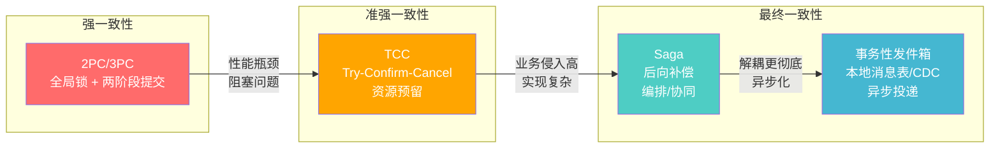
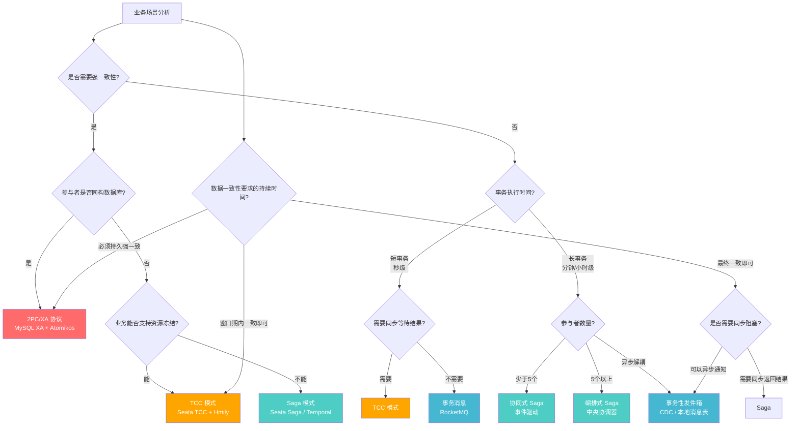

# 第55章 分布式事务——本章小结

## 一、核心知识体系回顾

本章从分布式事务的问题本质出发，系统性地覆盖了四种经典模式的理论基础、三种工程化实现技巧、两个完整实战案例，以及常见误区与练习方法。以下是贯穿全章的知识脉络：

### 1.1 问题本质：从 ACID 到 BASE

单机事务的 ACID 保证依赖数据库引擎的 WAL 日志、锁机制和 MVCC。一旦操作跨越多个服务和数据库，原子性失去了事务边界的支撑，隔离性被中间状态暴露打破，一致性需要在多个独立存储之间人工维护。

分布式系统被迫采用 BASE 原则——基本可用、软状态、最终一致性。这不是"降级"，而是在 CAP 定理约束下的工程选择：网络分区发生时，必须在一致性和可用性之间做取舍。

四大挑战贯穿全章：

| 挑战 | 具体表现 | 对方案设计的影响 |
|------|---------|----------------|
| 网络不可靠 | 消息丢失、重复、乱序、延迟 | 任何方案都需要重试和幂等机制 |
| 节点可崩溃 | 事务中途任意节点宕机 | 补偿逻辑和状态持久化不可或缺 |
| 无全局时钟 | 无法确定事件的精确全局顺序 | 时间戳不能作为一致性判断的唯一依据 |
| CAP 约束 | 一致性与可用性不可兼得 | 方案选型本质上是一致性级别的选择 |

### 1.2 四种经典模式的理论对比

本章覆盖的四种模式代表了分布式事务从强一致到最终一致的完整光谱：

**2PC/3PC 协议**

2PC 由 Jim Gray 于 1978 年提出，通过协调者（Coordinator）和参与者（Participant）的两阶段交互实现原子提交。Prepare 阶段协调者询问所有参与者是否可以提交，Commit 阶段根据所有参与者的投票结果决定提交或回滚。3PC 在 Prepare 和 Commit 之间增加 PreCommit 阶段，引入超时机制缓解 2PC 的阻塞问题。

核心局限：
- **阻塞性**：Prepare 阶段后参与者锁定资源，等待协调者的最终指令；如果协调者宕机，参与者无限期阻塞
- **单点故障**：协调者是全局唯一的决策者，故障后系统无法推进
- **性能瓶颈**：全局锁导致并发能力随参与者数量线性下降
- **网络分区下的一致性风险**：部分参与者可能在 Commit 前超时提交

实际生产中，XA 协议（基于 2PC）仅在同构数据库、强一致性且并发量不高的场景（如金融核心账务）中使用。Seata 的 AT 模式在底层借鉴了两阶段思想，但通过 undo_log 机制避免了全局锁。

**Saga 模式**

1987 年由 Garcia-Molina 和 Salem 提出。核心思想：将长事务拆分为一系列本地子事务 T₁, T₂, ..., Tₙ，每个子事务 Tᵢ 有对应的补偿操作 Cᵢ。如果某个子事务失败，则逆序执行已完成子事务的补偿操作。

两种协调方式：
- **编排式（Orchestration）**：由中央 Saga 协调器管理全局流程，显式定义步骤顺序。适合复杂业务逻辑、需要集中控制的场景
- **协同式（Choreography）**：通过事件驱动实现松耦合，每个服务监听事件并发布新事件。适合简单流程、参与者数量少的场景

Saga 的核心挑战是**补偿逻辑的设计**——补偿操作必须是幂等的、可重试的，且要考虑补偿本身失败的极端情况。

**TCC 模式**

TCC（Try-Confirm-Cancel）通过资源预留提供比 Saga 更强的隔离保证：
- **Try**：冻结资源（如冻结账户余额、预留库存），不实际消耗
- **Confirm**：确认消耗，将冻结资源转为实际消耗
- **Cancel**：释放冻结资源，恢复到 Try 之前的状态

TCC 需要处理两个特有问题：
- **空回滚**：Try 请求未到达（网络超时），但 Cancel 先到达并执行。需要通过事务状态标记识别空回滚
- **悬挂**：Cancel 执行后，迟到的 Try 才到达并冻结了资源。需要通过事务状态标记拒绝悬挂的 Try

**事务性发件箱（Transactional Outbox）**

解决微服务中的"双写难题"——业务数据写入数据库和消息发布到消息队列无法保证原子性。四种实现方式：

| 实现方式 | 原理 | 优势 | 劣势 |
|---------|------|------|------|
| 事务性发件箱（轮询） | 同一事务写业务数据+消息表，后台轮询发送 | 简单可靠 | 轮询延迟、数据库压力 |
| 本地消息表 | 状态机管理消息生命周期 | 状态清晰、可审计 | 需要维护消息状态表 |
| CDC（binlog） | 监听数据库变更日志实时捕获 | 无侵入、低延迟 | 依赖 binlog 格式、运维复杂 |
| RocketMQ 事务消息 | 半消息 + 本地事务 + 提交/回滚 | 原生支持、性能高 | 绑定 RocketMQ 技术栈 |

### 1.3 工程化实现要点

理论到生产之间存在巨大鸿沟。本章三个核心技巧章节覆盖了关键的工程细节：

**Saga 编排器的工程实现**

一个生产级 Saga 编排器必须处理：
- **步骤定义与 DAG 依赖**：支持串行、并行、条件分支的流程编排
- **状态持久化**：Saga 执行状态必须持久化到数据库，进程重启后能恢复执行
- **重试与超时策略**：指数退避重试（如 1s → 2s → 4s → 8s），全局超时控制
- **补偿触发**：正向步骤失败时，逆序触发已完成步骤的补偿操作
- **并发安全**：多个 Saga 实例并发执行时的状态隔离

**TCC 资源预留的工程实现**

- **事务状态表设计**：记录每个分支事务的状态（init/tried/confirmed/cancelled）
- **空回滚防御**：Cancel 到达时检查 Try 是否执行过，未执行则直接标记为已回滚
- **悬挂防御**：Try 到达时检查是否已 Cancel，已 Cancel 则拒绝执行
- **幂等保证**：Confirm 和 Cancel 操作必须幂等，通过事务 ID + 状态去重

**消息最终一致的工程实现**

- **轮询发送器**：定时扫描未发送的消息，批量投递到 MQ，失败重试
- **CDC 监听器**：通过 Debezium 等工具监听 binlog，实时捕获数据变更
- **消费者幂等**：消费者通过消息 ID + 唯一键实现幂等处理，防止重复消费
- **死信队列**：重试多次仍失败的消息转入死信队列，人工介入处理

### 1.4 实战案例复盘

**案例一：Seata 电商订单 Saga**

以电商下单为场景，演示了如何使用 Seata 框架实现订单创建、库存扣减、资金冻结的分布式事务。重点展示了：
- Seata 的 AT 模式如何通过拦截 SQL 自动生成回滚日志（undo_log）
- Saga 模式下补偿操作的设计（库存回补、资金解冻）
- 分布式事务上下文的传播（XID 在服务间传递）

**案例二：RocketMQ 事务消息银行转账**

以银行跨行转账为场景，演示了 RocketMQ 事务消息的完整实现流程：
- 半消息（Half Message）的发送与本地事务执行
- 事务回查（Transaction Check Back）机制——协调者定期检查未确认的半消息
- 消费者的幂等设计（通过转账流水号去重）
- 超时与重试的工程处理

### 1.5 常见误区

| 误区 | 根因 | 正确做法 |
|------|------|---------|
| 补偿遗漏 | 只写正向逻辑，忽略补偿分支 | 每个正向步骤必须配套补偿逻辑，代码审查时逐项检查 |
| 空回滚与悬挂 | TCC 时序问题未处理 | 引入事务状态表，Try/Cancel 执行前先查状态 |
| 幂等性缺失 | 重试机制导致重复执行 | 所有 Confirm/Cancel/消费者操作必须幂等 |
| 过度使用分布式事务 | 能用本地事务解决的场景强行引入 | 能用本地事务 > 能用最终一致性 > 必须用强一致性 |
| 忽视监控告警 | 上线后缺乏分布式事务的可观测性 | 部署 Prometheus + Grafana，监控事务成功率、补偿触发率、超时率 |

## 二、方案选型决策框架

面对具体的业务场景，选择正确的方案比实现更重要。以下是经过本章验证的决策框架：

### 2.1 选型对比矩阵

| 维度 | 2PC/3PC (XA) | TCC | Saga | 事务消息/发件箱 |
|------|-------------|-----|------|--------------|
| 一致性级别 | 强一致 | 准强一致 | 最终一致 | 最终一致 |
| 性能 | 低（全局锁） | 中（资源预留） | 高（无锁） | 高（异步） |
| 实现复杂度 | 低（协议固定） | 高（三个接口 + 防悬挂） | 中（设计补偿逻辑） | 中（设计消息表） |
| 业务侵入 | 无（数据库层） | 高（需冻结资源） | 低（写补偿） | 低（写消息表） |
| 资源锁定 | 全局锁、持有时间长 | 冻结资源、时间短 | 无锁 | 无锁 |
| 适用场景 | 同构数据库、金融核心 | 资金类、高一致性要求 | 长事务、跨服务编排 | 异步解耦、事件驱动 |
| 典型框架 | MySQL XA、Atomikos | Seata TCC、Hmily | Seata Saga、Temporal | RocketMQ、Debezium |
| 补偿机制 | 无需（直接回滚） | Cancel 释放冻结 | 后向补偿 | 消息重投 |

### 2.2 选型决策流程

### 2.3 经验法则

**能用本地事务解决的，绝不用分布式事务。** 这是分布式事务设计的第一原则。很多"分布式事务"问题的本质是服务拆分过度——把本应在同一个服务中完成的操作硬拆到多个服务，再用分布式事务缝合。正确的做法是重新审视服务边界。

**能用最终一致性的，不用强一致性。** 强一致性意味着性能代价和系统复杂度的显著增加。只有资金扣减、库存扣减等涉及核心资产的操作才需要强一致性。

**能用 Saga 的，不用 TCC。** TCC 的实现复杂度（三个接口 + 防空回滚 + 防悬挂 + 幂等）远高于 Saga。除非业务场景要求在最终提交前保证中间状态的隔离（如账户余额不能被并发扣减），否则优先选择 Saga。

**分布式事务是最后的手段，不是第一选择。** 在引入分布式事务之前，先考虑：
1. 能否通过服务边界调整避免跨服务事务？
2. 能否通过异步消息解耦？
3. 能否通过数据冗余减少跨库查询？
4. 能否通过兜底 + 对账机制实现最终一致？

## 三、监控与运维关键指标

分布式事务上线后，监控和运维是保证稳定性的生命线。以下是必须关注的核心指标：

| 指标 | 含义 | 告警阈值 | 优化方向 |
|------|------|---------|---------|
| 事务成功率 | 成功完成的事务占总事务的比例 | < 99.9% | 排查失败原因，优化补偿逻辑 |
| 补偿触发率 | 需要执行补偿的事务比例 | > 1% | 分析补偿原因，优化正向逻辑 |
| 事务平均耗时 | 从发起到完成的平均时间 | P99 > 5s | 优化慢步骤，调整超时配置 |
| 超时事务数 | 超时未完成的事务数量 | > 0/min | 检查网络、节点健康状态 |
| 消息积压量 | 未消费的消息数量 | > 1000 | 扩容消费者、优化消费逻辑 |
| 死信消息数 | 多次重试仍失败的消息 | > 0 | 人工介入排查，修复业务异常 |
| 资源冻结时长 | TCC Try 到 Confirm/Cancel 的时间 | > 30s | 缩短事务执行窗口，优化 Confirm 速度 |

**监控架构建议：**

分布式事务执行链路
    ↓ (Span/Trace 数据)
Jaeger / SkyWalking (链路追踪)
    ↓ (指标数据)
Prometheus (指标采集)
    ↓ (可视化 + 告警)
Grafana Dashboard (事务成功率/耗时/补偿率)
    ↓ (异常告警)
企业微信 / 钉钉 / 邮件 (告警通知)

## 四、核心公式与模型

| 概念 | 公式/模型 | 应用场景 |
|------|-----------|---------|
| 吞吐量 | QPS = 并发数 / 平均延迟（Little 定律） | 容量规划：知道目标 QPS 和单次延迟，可算出所需并发连接数 |
| 可用性 | SLA = 正常运行时间 / 总时间 | 99.9% = 8.76 小时/年停机；99.99% = 52.6 分钟/年停机 |
| 尾延迟 | P99 = 排序后第 99 百分位的值 | 尾延迟比平均延迟更能反映用户体验，关注 P99/P999 |
| 容量规划 | 所需资源 = 目标 QPS × 单次请求资源消耗 | 评估数据库连接数、线程池大小、MQ 消费者数量 |
| 补偿时间窗口 | T_compensate = T_try + T_network + T_execute | TCC 模式下资源冻结的最短时间，影响系统吞吐量 |
| 消息最终一致延迟 | T_consistency = T_produce + T_deliver + T_consume | 事件驱动方案下数据达到最终一致的时间窗口 |

## 五、关键设计检查清单

### 架构设计阶段

- [ ] 明确每个操作需要的一致性级别（强一致 / 准强一致 / 最终一致）
- [ ] 评估是否真的需要分布式事务，能否通过服务边界调整避免
- [ ] 根据决策流程选择合适的事务模式
- [ ] 设计补偿操作的完整逻辑，包括补偿失败的兜底方案
- [ ] 评估系统的性能需求和事务模式的性能特征是否匹配

### 编码实现阶段

- [ ] 每个 TCC 服务实现了 Try、Confirm、Cancel 三个接口
- [ ] Confirm 和 Cancel 操作具有幂等性（通过事务 ID + 状态去重）
- [ ] TCC 场景处理了空回滚（Try 未到达时 Cancel 先到）
- [ ] TCC 场景处理了悬挂（Cancel 后 Try 才到达）
- [ ] Saga 补偿操作覆盖了所有可能的失败路径
- [ ] 消息消费者实现了幂等处理
- [ ] 所有远程调用设置了合理的超时时间
- [ ] 重试策略使用指数退避，避免雪崩

### 部署运维阶段

- [ ] 部署了分布式事务的链路追踪（Jaeger / SkyWalking）
- [ ] 配置了事务成功率、补偿触发率的监控告警
- [ ] 配置了消息积压量、死信队列的监控告警
- [ ] 制定了分布式事务故障的应急回滚方案
- [ ] 进行了压力测试，验证事务模式在目标并发下的性能
- [ ] 数据库层面：确认 undo_log 表（Seata AT）或事务状态表已创建

## 六、延伸学习路径

### 深入理论

- **学术论文**：Garcia-Molina & Salem 1987 —— "Sagas"（Saga 模式原始论文）；Jim Gray & Andreas Reuter 1993 —— "Transaction Processing: Concepts and Techniques"（事务处理圣经）
- **分布式系统经典**：Martin Kleppmann《Designing Data-Intensive Applications》第 7 章（分布式事务与一致性）；Pat Helland 2007 —— "Life beyond Distributed Transactions"

### 深入实践

- **Seata 源码阅读**：从 `io.seata.rm.AbstractResourceManager` 入口，跟踪 AT 模式的 SQL 拦截和 undo_log 生成流程
- **RocketMQ 事务消息源码**：`TransactionMQProducer` → `TransactionSendResult` → 半消息存储 → 事务回查机制
- **Temporal / Cadence**：美团 Cadence 的开源实现 Temporal，提供更强大的 Saga 编排能力，支持可视化的流程编排和调试

### 推荐书籍

- 《分布式事务实战》—— 系统性介绍各种分布式事务方案的工程实现
- 《微服务架构设计模式》Chris Richardson —— 第 8 章专门讨论 Saga 模式
- 《凤凰架构》周志明 —— 从架构演进角度理解分布式事务的位置

### 推荐开源项目

| 项目 | 地址 | 特点 |
|------|------|------|
| Seata | github.com/seata/seata | 阿里开源，AT/TCC/Saga/XA 四种模式 |
| Hmily | github.com/chination-sd/hmily | 轻量级 TCC 框架，Apache 孵化 |
| Temporal | github.com/temporalio/temporal | 强大的工作流引擎，Saga 编排首选 |
| Debezium | github.com/debezium/debezium | CDC 工具，监听 binlog 实现发件箱模式 |
| RocketMQ | github.com/apache/rocketmq | 唯一原生支持事务消息的主流 MQ |

## 七、思考题

**基础题**

1. 2PC 协议中，如果协调者在 Commit 阶段宕机，参与者会处于什么状态？3PC 如何缓解这个问题？
2. Saga 模式的编排式（Orchestration）和协同式（Choreography）各有什么优缺点？各适合什么场景？
3. 事务性发件箱（Transactional Outbox）如何解决"双写难题"？它的四种实现方式各自的核心思路是什么？

**进阶题**

4. TCC 模式中，如何设计一个事务状态表来同时防御空回滚和悬挂？请给出表结构设计和判断逻辑。
5. 在一个电商系统中，订单创建需要调用库存服务、积分服务、优惠券服务。请根据本章的选型框架，分析应该选择哪种分布式事务方案，并说明理由。
6. 如果一个 Saga 的补偿操作本身也失败了，应该如何处理？请设计一个完整的兜底方案。

**架构题**

7. 在高并发秒杀场景下（QPS > 10000），如何在保证库存一致性的同时最大化系统吞吐量？请综合运用本章知识给出架构方案。
8. 当前主流的分布式事务方案都在一致性、性能、复杂度之间做权衡。你认为未来分布式事务的发展方向是什么？是否有希望实现"鱼和熊掌兼得"的方案？
