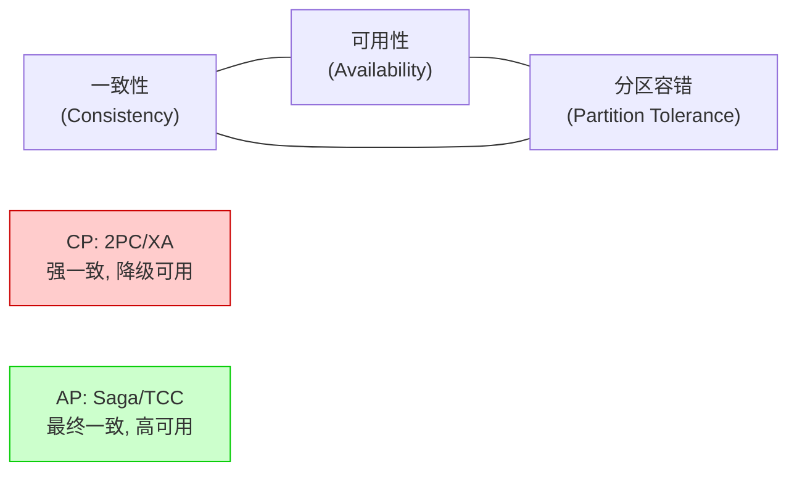
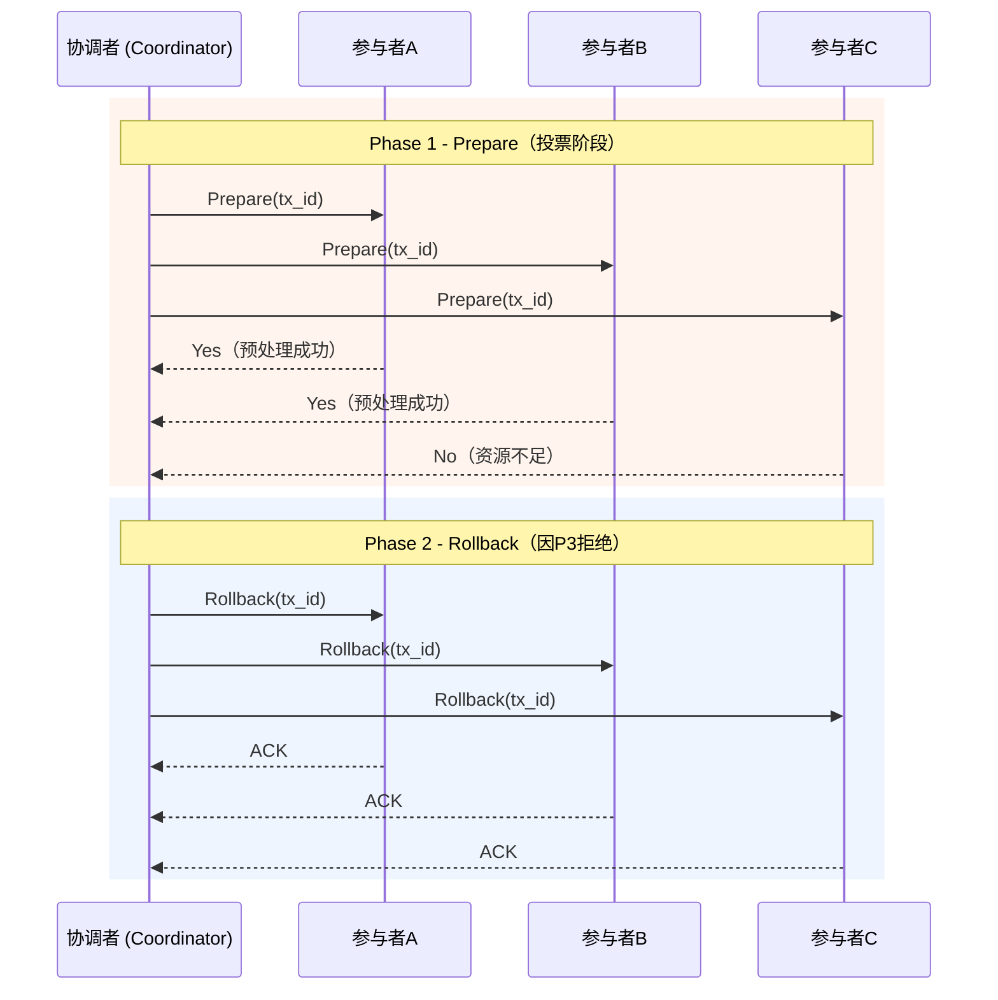
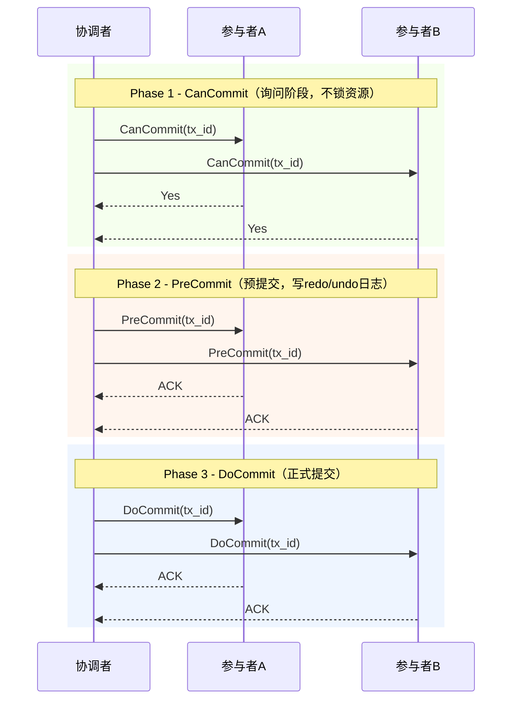
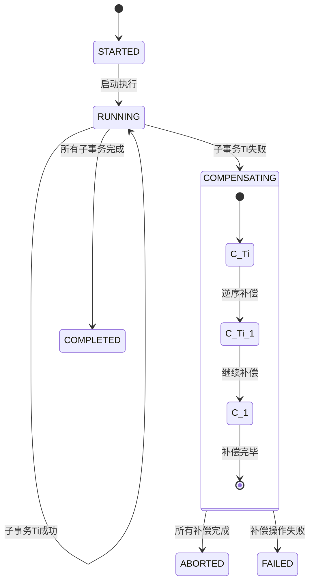
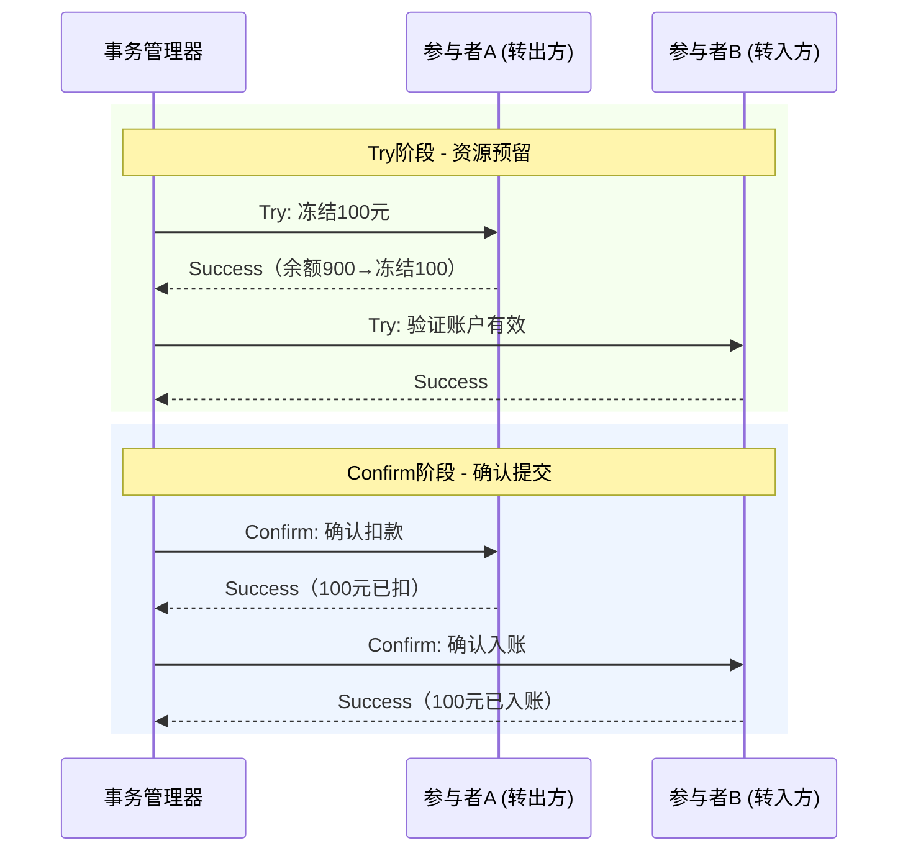
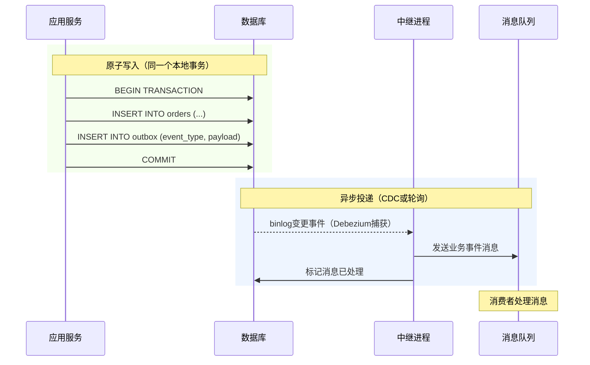
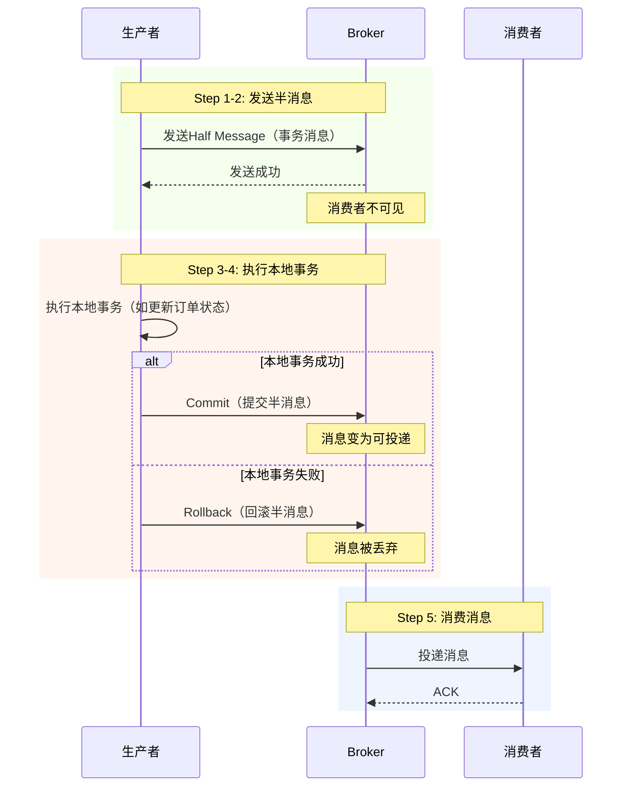
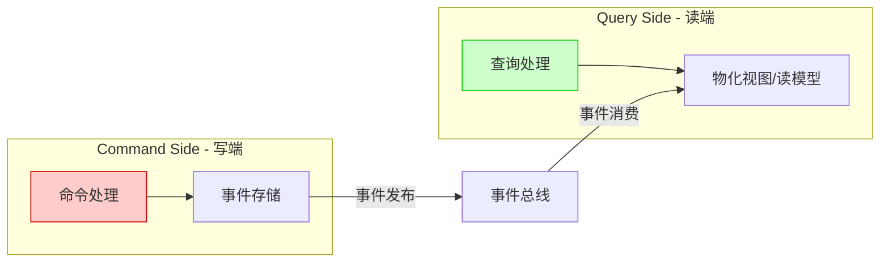

# 第55章 分布式事务：跨服务数据一致性的工程实践

***

## 章节定位

分布式事务是微服务架构中最具挑战性的工程问题之一。当一个业务操作需要跨越多个服务、多个数据库时，如何保证所有参与者要么全部成功、要么全部回滚，是每一个分布式系统设计者都必须面对的核心难题。传统的单机ACID事务在分布式场景下不再适用，取而代之的是一系列基于最终一致性的分布式事务模式。本章从经典理论到现代框架，系统性地探讨分布式事务的方方面面。

***

## 核心内容概览

**2PC（两阶段提交协议）** 是分布式事务的经典理论基础。它通过协调者（Coordinator）和参与者（Participant）的两阶段交互——Prepare阶段和Commit阶段——来实现跨节点的原子提交。然而2PC存在阻塞问题和单点故障风险，3PC（三阶段提交）通过引入PreCommit阶段部分缓解了这些问题，但在异步网络中仍然无法完全避免不一致。理解2PC/3PC的原理和局限，是理解现代分布式事务方案的前提。

**Saga模式** 是微服务架构中最流行的分布式事务方案。它将一个长事务分解为一系列本地事务，每个本地事务都有对应的补偿操作。Saga支持前向恢复（Forward Recovery）和后向补偿（Backward Compensation）两种错误处理策略，通过状态机来管理Saga的执行流程。相比2PC，Saga不锁定资源，具有更好的可扩展性和性能。

**TCC（Try-Confirm-Cancel）模式** 通过资源预留的方式实现比Saga更强的隔离保证。Try阶段预留资源，Confirm阶段确认提交，Cancel阶段释放资源。TCC适用于对一致性要求较高、业务逻辑能够支持资源冻结的场景。

**事务性发件箱与消息驱动一致性** 解决了微服务中的"双写"问题。事务性发件箱模式（Transactional Outbox）、本地消息表模式（Local Message Table）、最大努力通知模式（Best-Effort Notification）提供了不同级别的可靠性保证。RocketMQ的事务消息机制则在消息中间件层面提供了原生的分布式事务支持。

**Seata框架** 是阿里巴巴开源的分布式事务解决方案，提供了AT、TCC、Saga和XA四种事务模式。Seata通过全局事务管理器（Transaction Coordinator）协调各分支事务，是目前Java生态中最成熟的分布式事务框架。

**幂等性设计** 是分布式事务的安全网。由于网络故障和超时重试，同一个操作可能被多次执行。幂等性设计确保重复执行不会产生副作用，是所有分布式事务方案的必要补充。

**事件溯源与CQRS** 代表了分布式一致性的现代范式。事件溯源通过记录所有状态变更事件来替代存储当前状态，天然支持审计、时间旅行和跨服务数据同步。CQRS将读写分离，使系统可以独立扩展命令端和查询端。这种模式与Saga结合使用，可以构建高度可靠且可审计的分布式系统。

**可观测性** 是分布式事务从开发到生产的关键桥梁。分布式追踪串联跨服务调用链，指标监控量化事务健康度，分级告警确保问题及时响应。没有可观测性的分布式事务系统，出了问题将无从排查。

***

## 学习目标

完成本章学习后，读者应能理解2PC/3PC协议的工作原理和局限性，掌握Saga和TCC两种主流分布式事务模式的设计与实现，运用事务性发件箱和本地消息表解决双写问题，理解事件溯源和CQRS在分布式一致性中的应用，使用Seata框架实现分布式事务，构建分布式事务的可观测性体系，并在系统设计中做出合理的分布式事务方案选择。

***

## 本章结构

| 小节 | 主题 | 核心内容 |
|------|------|----------|
| 01 | 理论基础 | 2PC/3PC协议、Saga状态机、TCC模型、分布式事务分类、事件溯源与CQRS |
| 02 | 核心技巧 | Saga编排与协同、TCC资源预留、事务性发件箱实现、幂等性设计、可观测性与运维 |
| 03 | 实战案例 | 电商订单Saga实现、TCC账户转账、Seata集成、RocketMQ事务消息、状态机可视化 |
| 04 | 常见误区 | 补偿遗漏、悬挂与空回滚、幂等性缺失、过度使用分布式事务、补偿超时陷阱 |
| 05 | 练习方法 | Saga状态机实现、TCC框架搭建、发件箱模式实验、性能对比测试、故障注入 |
| 06 | 本章小结 | 核心概念回顾、方案选型框架、未来趋势、延伸阅读 |


***

# 第55章 分布式事务 理论基础

***

## 55.1 分布式事务的问题定义

在单机数据库中，事务的ACID属性由数据库引擎保证：原子性（Atomicity）确保事务中的所有操作要么全部成功、要么全部回滚；一致性（Consistency）确保事务执行前后数据库满足所有完整性约束；隔离性（Isolation）确保并发事务之间互不干扰；持久性（Durability）确保已提交的事务数据不会丢失。

然而在分布式环境中，一个业务操作可能涉及多个服务、多个数据库、多种存储系统。以电商下单为例，一个订单创建操作可能需要：在订单数据库中创建订单记录，在库存服务中扣减商品库存，在支付服务中冻结用户资金，在积分服务中增加用户积分。这些操作分布在不同的服务中，每个服务有自己的数据库，传统的单机事务无法跨越这些边界。

分布式事务面临的核心挑战包括：网络不可靠——节点之间的消息可能丢失、重复、乱序或延迟；节点可能崩溃——任何参与节点都可能在事务执行过程中的任意时刻发生故障；没有全局时钟——分布式系统中不存在所有节点共享的精确时钟，无法确定事件的全局顺序；CAP约束——在网络分区发生时，系统必须在一致性和可用性之间做出权衡。

CAP定理指出，在网络分区（Partition Tolerance）不可避免的分布式系统中，系统设计者必须在一致性（Consistency）和可用性（Availability）之间做出选择。对于分布式事务而言，这意味着：

- **CP系统（一致性 + 分区容错）**：选择强一致性，牺牲可用性。典型代表是基于2PC/XA的分布式事务——在网络分区时拒绝服务以保证数据一致性。适用于金融核心、库存扣减等不能出错的场景。
- **AP系统（可用性 + 分区容错）**：选择高可用性，牺牲强一致性。典型代表是Saga和TCC模式——在正常情况下提供服务，通过补偿机制在事后达到最终一致性。适用于电商下单、社交互动等可以容忍短暂不一致的场景。
- **CA系统（一致性 + 可用性）**：在单机数据库中可以实现，但在分布式环境下不存在——因为网络分区是不可避免的。



根据事务参与者和资源的类型，分布式事务可以分为以下几类：同构分布式事务——所有参与者使用相同类型的数据库（如都是MySQL），可以通过XA协议实现强一致性；异构分布式事务——参与者使用不同类型的存储系统（如MySQL + Redis + Elasticsearch），无法使用XA协议；长事务——事务执行时间很长（分钟甚至小时级别），不适合锁定资源的方案；消息驱动事务——通过消息队列实现跨服务的数据一致性。

***

## 55.2 2PC：两阶段提交协议

2PC（Two-Phase Commit）是分布式事务最经典的协议，由Jim Gray在1978年提出。它通过一个协调者（Coordinator）和多个参与者（Participant）的两阶段交互来实现跨节点的原子提交。

**角色定义**：协调者负责发起和管理整个事务的提交过程；参与者是事务涉及的各个资源管理器（如数据库），它们执行本地事务并响应协调者的指令。

**Prepare阶段（投票阶段）**：协调者向所有参与者发送Prepare请求；每个参与者执行本地事务的预处理（写redo/undo日志），但不提交；如果本地预处理成功，参与者回复"Yes"（同意提交）；如果失败，参与者回复"No"（拒绝提交）。

**Commit阶段（决定阶段）**：如果所有参与者都回复"Yes"，协调者发送Commit指令，所有参与者提交本地事务；如果有任何一个参与者回复"No"或超时，协调者发送Rollback指令，所有参与者回滚本地事务。

2PC协议的交互流程如下图所示：



```python
# 2PC协议简化实现
class TwoPhaseCoordinator:
    def __init__(self, participants: list):
        self.participants = participants
        self.transaction_log = TransactionLog()

    async def execute(self, transaction: Transaction):
        tx_id = generate_tx_id()
        self.transaction_log.write_prepare(tx_id, transaction)

        # Phase 1: Prepare
        votes = []
        for participant in self.participants:
            try:
                vote = await participant.prepare(tx_id, transaction)
                votes.append(vote)
            except TimeoutError:
                votes.append(False)

        # Phase 2: Commit or Rollback
        if all(votes):
            self.transaction_log.write_commit(tx_id)
            for participant in self.participants:
                await participant.commit(tx_id)
        else:
            self.transaction_log.write_rollback(tx_id)
            for participant in self.participants:
                await participant.rollback(tx_id)

class TwoPhaseParticipant:
    def __init__(self, db_connection):
        self.db = db_connection
        self.prepared_txns = {}

    async def prepare(self, tx_id: str, transaction) -> bool:
        """执行本地事务预处理，写redo/undo日志"""
        try:
            # 执行本地操作但不提交
            local_ops = transaction.get_local_operations()
            for op in local_ops:
                await self.db.execute_no_commit(op)

            # 写prepare日志
            await self.db.write_prepare_log(tx_id)
            self.prepared_txns[tx_id] = transaction
            return True
        except Exception:
            return False

    async def commit(self, tx_id: str):
        """提交本地事务"""
        await self.db.commit()
        await self.db.write_commit_log(tx_id)
        del self.prepared_txns[tx_id]

    async def rollback(self, tx_id: str):
        """回滚本地事务"""
        await self.db.rollback()
        del self.prepared_txns[tx_id]
```

**2PC的核心问题**：

阻塞问题：在Prepare阶段之后、Commit阶段之前，如果协调者崩溃，参与者将处于不确定状态——它已经投了"Yes"票，但不知道最终决定是提交还是回滚。此时参与者必须等待协调者恢复，期间资源被锁定，无法处理其他事务。

单点故障：协调者是整个协议的单点。如果协调者在Commit阶段发送了部分Commit消息后崩溃，部分参与者提交了事务，部分参与者还在等待，导致数据不一致。

性能问题：2PC需要至少两轮网络通信，且在Prepare和Commit之间存在全局锁，这使得事务的响应时间和吞吐量都受到严重影响。

***

## 55.3 3PC：三阶段提交协议

3PC（Three-Phase Commit）是对2PC的改进，它在Prepare和Commit之间增加了一个PreCommit阶段，将协议分为CanCommit、PreCommit和DoCommit三个阶段。

**CanCommit阶段**：协调者询问所有参与者是否可以提交事务。参与者检查自身状态，如果可以提交则回复"Yes"。这个阶段不执行任何实际操作，不会锁定资源。

**PreCommit阶段**：如果所有参与者都同意提交，协调者发送PreCommit指令，参与者执行本地事务预处理（写redo/undo日志）。如果有参与者拒绝或超时，协调者发送Abort指令。

**DoCommit阶段**：协调者发送最终的Commit或Abort指令，参与者执行提交或回滚。

3PC的三阶段交互流程如下图所示：



3PC相比2PC的关键改进是：引入了超时机制——如果参与者在PreCommit之后长时间收不到DoCommit指令，它可以选择提交事务（因为既然已经进入PreCommit，说明所有参与者都同意提交）。这在一定程度上缓解了2PC的阻塞问题。

然而3PC也有明显的局限性：它增加了协议的复杂度和网络通信轮次；在异步网络中，超时机制可能导致不一致——如果网络分区导致部分参与者收到了DoCommit而另一部分没有，超时提交会导致分裂脑（Split-Brain）问题。因此3PC在实际工程中很少被直接使用，更多是作为理论参考。

***

## 55.4 Saga模式：理论模型

Saga模式由Hector Garcia-Molina和Kenneth Salem在1987年的论文"Sagas"中提出。其核心思想是：将一个长事务T分解为一系列子事务T1, T2, ..., Tn，每个子事务Ti都有一个对应的补偿事务Ci。如果某个子事务Ti失败，则按照逆序执行补偿事务Ci-1, Ci-2, ..., C1，将系统恢复到一致状态。

形式化地说，一个Saga可以表示为两种执行序列：
- 成功路径：T1, T2, T3, ..., Tn
- 失败路径：T1, T2, ..., Ti, Ci, Ci-1, ..., C1（其中Ti失败）

Saga模式的关键约束包括：每个子事务必须是原子的——它要么完全成功，要么完全回滚；补偿事务必须是可交换的——补偿的执行效果不依赖于执行顺序（在实际实现中通常要求按逆序执行）；补偿事务必须是幂等的——因为网络重试可能导致补偿操作被多次执行；子事务之间应该尽量松耦合——一个子事务的执行不应该依赖于另一个子事务的中间状态。

**前向恢复（Forward Recovery）** 是当子事务失败时，系统尝试通过重试或其他手段使该子事务成功，而不是回滚整个Saga。前向恢复适用于临时性故障（如网络抖动、服务短暂不可用）的场景。

**后向补偿（Backward Compensation）** 是当子事务失败时，按照逆序执行补偿事务，将系统恢复到Saga开始之前的状态。后向补偿是Saga模式的主要错误处理策略。

**Saga状态机** 是管理Saga执行流程的核心组件。一个典型的Saga状态机包含以下状态：STARTED（已启动）、COMPLETED（已完成）、COMPENSATING（补偿中）、FAILED（已失败）、ABORTED（已中止）。状态机根据每个子事务的执行结果决定状态转换。

编排式Saga的执行流程如下图所示：



```python
from enum import Enum
from typing import Callable, Any

class SagaState(Enum):
    STARTED = "STARTED"
    RUNNING = "RUNNING"
    COMPENSATING = "COMPENSATING"
    COMPLETED = "COMPLETED"
    FAILED = "FAILED"
    ABORTED = "ABORTED"

class SagaStep:
    def __init__(self, name: str, action: Callable, compensation: Callable):
        self.name = name
        self.action = action
        self.compensation = compensation

class SagaStateMachine:
    def __init__(self, saga_id: str):
        self.saga_id = saga_id
        self.state = SagaState.STARTED
        self.steps: list[SagaStep] = []
        self.executed_steps: list[tuple[str, Any]] = []
        self.current_step = 0

    def add_step(self, step: SagaStep):
        self.steps.append(step)

    async def execute(self, context: dict) -> SagaResult:
        self.state = SagaState.RUNNING

        for i, step in enumerate(self.steps):
            self.current_step = i
            try:
                result = await step.action(context)
                self.executed_steps.append((step.name, result))
                context[f"{step.name}_result"] = result
            except Exception as e:
                self.state = SagaState.COMPENSATING
                await self._compensate(context)
                return SagaResult.failure(self.saga_id, step.name, str(e))

        self.state = SagaState.COMPLETED
        return SagaResult.success(self.saga_id)

    async def _compensate(self, context: dict):
        """按逆序执行补偿操作"""
        for step_name, result in reversed(self.executed_steps):
            step = next(s for s in self.steps if s.name == step_name)
            try:
                await step.compensation(context)
            except Exception as e:
                # 补偿失败需要记录并报警，可能需要人工介入
                log.error(f"Saga {self.saga_id} compensation failed: "
                         f"{step_name}: {e}")
                self.state = SagaState.FAILED
                return

        self.state = SagaState.ABORTED
```

***

## 55.5 Saga的两种协调方式

Saga模式有两种协调方式：编排（Orchestration）和协同（Choreography），它们在架构复杂度、耦合度和可观测性方面各有优劣。

**编排式Saga（Orchestration）** 使用一个中央的Saga编排器（Orchestrator）来管理整个Saga的执行流程。编排器持有Saga的完整定义（包括所有步骤和补偿逻辑），按顺序触发每个子事务，并根据执行结果决定下一步操作。编排器通常需要持久化其状态，以便在崩溃后能够恢复执行。

编排式Saga的优势在于：流程集中管理，易于理解和调试；每个参与服务只需要实现自己的业务逻辑和补偿逻辑，不需要知道Saga的全局流程；编排器可以实现复杂的重试、超时和回退策略。编排式Saga的劣势在于：编排器是单点，需要高可用保障；编排器与所有参与服务之间存在耦合。

**协同式Saga（Choreography）** 没有中央协调器，每个服务监听事件总线上的事件，并根据事件决定自己的下一步操作。例如，订单服务发出"订单已创建"事件，库存服务收到后执行库存预留并发出"库存已预留"事件，支付服务收到后执行扣款并发出"支付已完成"事件。

协同式Saga的优势在于：服务之间松耦合，通过事件通信；没有单点瓶颈。协同式Saga的劣势在于：流程分散在多个服务中，难以理解全局流程；当Saga步骤增多时，事件链变得复杂，调试困难；补偿逻辑分散在各服务中，难以保证补偿的正确性。

在实际工程中，编排式Saga更为常用，特别是在Saga步骤较多（超过3个）的场景下。协同式Saga更适合步骤较少、服务间天然松耦合的场景。

***

## 55.6 TCC模式：Try-Confirm-Cancel

TCC（Try-Confirm-Cancel）模式是另一种重要的分布式事务方案。与Saga不同，TCC在Try阶段就完成了资源预留，提供了更好的隔离保证。

**Try阶段（尝试执行）**：执行业务检查并预留资源。资源预留的含义是：不执行实际的业务操作，而是将需要的资源"冻结"。例如，在转账场景中，Try阶段不实际转出资金，而是将转账金额从可用余额中冻结；在库存场景中，Try阶段不实际扣减库存，而是将商品数量从可用库存中预留。

**Confirm阶段（确认执行）**：如果所有参与者的Try阶段都成功，则执行Confirm操作，将预留的资源真正消耗。Confirm操作必须满足以下条件：幂等性——Confirm可能因为网络重试而被多次执行，多次执行的结果必须与一次执行相同；不做业务检查——Confirm阶段只执行实际操作，不再做业务检查（因为在Try阶段已经检查过）。

**Cancel阶段（取消执行）**：如果某个参与者的Try阶段失败，则对已经成功Try的参与者执行Cancel操作，释放预留的资源。Cancel操作同样必须满足幂等性，且不做业务检查。

TCC面临两个特殊问题：空回滚——如果Try请求因为网络原因没有到达参与者，但Cancel请求先到达了，参与者需要能识别这是一个空回滚，直接返回成功而不做任何操作；悬挂——如果Cancel请求先到达并执行完毕，之后Try请求才到达，参与者需要能识别这种悬挂情况，拒绝执行Try操作。

TCC模式的交互流程如下图所示：



```python
class TCCParticipant:
    """TCC参与者基类"""

    def __init__(self):
        self.transaction_records = {}

    async def try_operation(self, tx_id: str, params: dict) -> bool:
        """Try阶段：资源预留"""
        # 检查是否已经收到过Cancel（防止悬挂）
        if tx_id in self.transaction_records:
            record = self.transaction_records[tx_id]
            if record.status == "CANCELLED":
                return False  # 已被Cancel，拒绝Try（防悬挂）

        # 执行业务检查和资源预留
        success = await self._do_try(tx_id, params)
        if success:
            self.transaction_records[tx_id] = TransactionRecord(
                tx_id=tx_id, status="TRIED"
            )
        return success

    async def confirm_operation(self, tx_id: str) -> bool:
        """Confirm阶段：确认提交（幂等）"""
        if tx_id not in self.transaction_records:
            return True  # 幂等：未找到记录视为已确认

        record = self.transaction_records[tx_id]
        if record.status == "CONFIRMED":
            return True  # 幂等返回

        if record.status != "TRIED":
            return False  # 状态不正确

        success = await self._do_confirm(tx_id)
        if success:
            record.status = "CONFIRMED"
        return success

    async def cancel_operation(self, tx_id: str) -> bool:
        """Cancel阶段：释放资源（幂等，支持空回滚）"""
        if tx_id not in self.transaction_records:
            # 空回滚：Try未到达，记录Cancel状态
            self.transaction_records[tx_id] = TransactionRecord(
                tx_id=tx_id, status="CANCELLED"
            )
            return True

        record = self.transaction_records[tx_id]
        if record.status == "CANCELLED":
            return True  # 幂等返回

        success = await self._do_cancel(tx_id)
        if success:
            record.status = "CANCELLED"
        return success
```

TCC与Saga的核心区别在于：TCC提供了更好的隔离性——通过资源预留，中间状态不会暴露给其他事务；但TCC的实现复杂度更高——每个参与者都需要实现三个接口，且需要处理空回滚和悬挂问题；TCC对业务的侵入性更强——业务逻辑需要支持资源冻结和解冻。

***

## 55.7 事务性发件箱与消息驱动一致性

在微服务架构中，数据库更新和消息发送的"双写"问题是一个经典的分布式事务挑战。事务性发件箱模式、本地消息表模式和最大努力通知模式提供了不同级别的解决方案。

**事务性发件箱（Transactional Outbox）模式** 的核心思想是：在更新业务数据的同一个数据库事务中，将需要发送的消息写入一个"发件箱"表。这样保证了业务数据更新和消息记录的原子性。然后一个独立的中继进程（Relay）轮询发件箱表，将消息发送到消息队列。

事务性发件箱的工作流程如下图所示：



**CDC（Change Data Capture）方式** 是轮询方式的改进。通过监听数据库的变更日志（如MySQL的binlog、PostgreSQL的WAL），CDC工具（如Debezium）可以实时捕获发件箱表的变更并发送到消息队列，避免了轮询带来的延迟和数据库压力。

**本地消息表（Local Message Table）模式** 与事务性发件箱类似，但消息表同时承担了消息存储和异步处理的双重角色。消息表中的记录通常有一个状态字段，通过状态机管理消息的生命周期：PENDING → SENDING → CONFIRMED 或 RETRYING → FAILED。

**最大努力通知（Best-Effort Notification）模式** 是最简单的消息驱动一致性方案。它不保证消息一定被送达，但在正常情况下会尽力发送消息。适用于对一致性要求较低的场景。

**RocketMQ事务消息** 是消息中间件原生支持的分布式事务方案。它通过"半消息"（Half Message）机制实现：生产者先发送半消息到Broker，此时消费者不可见；生产者执行本地事务；根据本地事务的结果，生产者向Broker发送Commit或Rollback指令；如果Broker长时间没有收到指令，会回查生产者的本地事务状态。

RocketMQ事务消息的完整流程如下图所示：



```python
# RocketMQ事务消息实现
class TransactionMQProducer:
    def __init__(self, mq_client, local_tx_checker):
        self.mq_client = mq_client
        self.local_tx_checker = local_tx_checker

    async def send_transaction_message(
        self, topic: str, body: bytes, local_tx_action: Callable
    ):
        # Step 1: 发送半消息
        half_msg = await self.mq_client.send_half_message(topic, body)
        tx_id = half_msg.transaction_id

        try:
            # Step 2: 执行本地事务
            tx_result = await local_tx_action()

            # Step 3: 根据结果Commit或Rollback
            if tx_result:
                await self.mq_client.commit_message(tx_id)
            else:
                await self.mq_client.rollback_message(tx_id)
        except Exception as e:
            # 异常时Rollback半消息
            await self.mq_client.rollback_message(tx_id)
            raise

    async def check_local_transaction(self, tx_id: str) -> str:
        """Broker回查本地事务状态"""
        return await self.local_tx_checker.check(tx_id)
```

***

## 55.8 Seata框架与分布式事务分类

Seata（Simple Extensible Autonomous Transaction Architecture）是阿里巴巴开源的分布式事务框架，它提供了四种事务模式：AT模式、TCC模式、Saga模式和XA模式。

**AT模式（Automatic Transaction）** 是Seata最具特色的模式。它通过拦截业务SQL，自动生成回滚日志（undo_log），在全局事务提交时异步清理回滚日志，在全局事务回滚时根据回滚日志自动补偿。AT模式对业务代码零侵入，是最容易使用的分布式事务方案。

AT模式的工作原理：一阶段——拦截业务SQL，解析SQL语义，记录修改前的数据镜像（before image）和修改后的数据镜像（after image）到undo_log表，然后执行业务SQL并提交本地事务；二阶段提交——异步清理undo_log记录；二阶段回滚——根据undo_log中的before image数据，生成反向SQL执行回滚。

**TCC模式** 在Seata中是对标准TCC模式的封装，提供了全局事务管理、超时控制和异常处理能力。

**Saga模式** 在Seata中基于状态机实现，支持通过JSON或YAML定义Saga流程，提供了可视化的流程设计器。

**XA模式** 基于数据库的XA协议实现强一致性，但性能较差，适合对一致性要求极高的场景。

```java
// Seata AT模式使用示例
@Service
public class OrderService {

    @GlobalTransactional(timeoutMills = 60000, name = "create-order")
    public void createOrder(OrderDTO orderDTO) {
        // 1. 创建订单（本地事务，自动生成undo_log）
        orderMapper.insert(orderDTO);

        // 2. 调用库存服务（远程调用，Seata自动传播全局事务上下文）
        inventoryClient.deduct(orderDTO.getProductId(), orderDTO.getCount());

        // 3. 调用账户服务（远程调用）
        accountClient.debit(orderDTO.getUserId(), orderDTO.getTotalAmount());

        // 如果任何一步失败，Seata自动回滚所有参与者的本地事务
    }
}

// Seata TCC模式使用示例
@LocalTCC
public interface AccountTCCAction {

    @TwoPhaseBusinessAction(
        name = "debitAction",
        commitMethod = "commit",
        rollbackMethod = "rollback"
    )
    boolean tryDebit(
        @BusinessActionContextParameter(paramName = "userId") String userId,
        @BusinessActionContextParameter(paramName = "amount") BigDecimal amount
    );

    boolean commit(BusinessActionContext context);
    boolean rollback(BusinessActionContext context);
}
```

分布式事务的性能影响是不可忽视的。相比无事务的场景，分布式事务通常会带来以下性能开销：额外的网络通信——全局事务管理器与各参与者之间的协调需要多次网络往返；资源锁定——在事务执行期间，参与者可能需要锁定相关资源，降低并发能力；日志写入——回滚日志、事务日志的写入增加了I/O开销；补偿开销——Saga和TCC模式在失败时需要执行补偿操作，增加了额外的延迟。

## 55.9 事件溯源与CQRS：现代分布式一致性范式

传统的分布式事务关注的是"如何在多个服务之间保持数据一致"，而事件溯源（Event Sourcing）和CQRS（Command Query Responsibility Segregation）则从根本上改变了思考方式——不再关注"如何同步当前状态"，而是关注"如何记录所有状态变更"。

### 事件溯源的核心思想

事件溯源的核心思想是：不存储实体的当前状态，而是存储导致状态变化的所有事件。实体的当前状态通过回放事件序列来重建。这种模式天然适合分布式系统，因为事件是不可变的、有序的、可审计的。

以银行账户为例，传统方式存储的是账户的当前余额：

```sql
-- 传统方式：只存储当前状态
SELECT balance FROM accounts WHERE id = 'ACC001';  -- 当前余额 = 5000
```

事件溯源方式存储的是所有交易事件：

```sql
-- 事件溯源：存储所有状态变更事件
SELECT * FROM events WHERE aggregate_id = 'ACC001' ORDER BY sequence;
-- 序列1: AccountCreated(amount=10000)
-- 序列2: MoneyDeposited(amount=3000)
-- 序列3: MoneyWithdrawn(amount=2000)
-- 序列4: MoneyTransferred(amount=6000, target='ACC002')
-- 当前余额 = 10000 + 3000 - 2000 - 6000 = 5000
```

事件溯源在分布式事务中的优势：

- **天然的审计日志**：每个状态变更都有完整的事件记录，满足合规审计需求
- **时间旅行能力**：可以通过回放事件到任意时间点，重建历史状态
- **解耦发布**：事件写入后可以通过事件总线分发给所有关注方，天然支持跨服务数据同步
- **补偿简化**：不需要编写逆向的补偿逻辑——只需发布一个"反转事件"即可

### CQRS：读写分离的架构模式

CQRS将系统的命令（写操作）和查询（读操作）分离到不同的模型和服务中。在分布式事务场景中，CQRS通常与事件溯源结合使用：



**命令端**负责处理业务命令（如下单、支付），将命令转换为事件写入事件存储。**查询端**消费事件并构建针对特定查询场景优化的物化视图。这种分离使得写端和读端可以独立扩展和优化。

### 事件溯源在分布式事务中的应用模式

**Saga + 事件溯源**：将Saga的每个步骤和补偿操作都建模为事件。Saga的执行过程本身也是一个事件流，可以通过回放事件来恢复Saga的执行状态。这比传统的数据库持久化Saga状态更可靠、更可审计。

**最终一致性保证**：事件溯源天然支持最终一致性。写端将事件写入本地事件存储后立即返回，不需要等待所有消费端处理完成。消费端通过持续消费事件流来保持与写端的最终一致。如果消费端出现故障，可以从事件存储的任意位置重新消费。

**事件溯源的挑战**：

- **事件模式演进**：事件一旦写入就不可变，但如果业务需求变化需要修改事件结构，需要实现事件版本管理（Upcaster）机制
- **快照机制**：事件数量增多后，回放事件重建状态的开销很大。需要定期创建快照（Snapshot），只回放快照之后的事件
- **最终一致性的延迟**：读模型的更新是异步的，写入事件后立即查询可能读到旧数据。需要在用户体验上做好处理（如乐观UI更新）

### 何时选择事件溯源/CQRS

事件溯源并非银弹，它适合以下场景：

- **高合规要求**：金融、医疗等需要完整审计日志的行业
- **复杂业务逻辑**：业务规则频繁变化，需要完整的历史记录来分析和调试
- **事件驱动架构**：系统本身已经采用事件驱动架构，事件溯源是自然的延伸
- **最终一致性可接受**：读写延迟对用户体验影响不大

不适合的场景：

- **简单CRUD系统**：事件溯源的复杂度远超收益
- **强实时一致性**：所有操作必须立即反映到读端的场景
- **团队经验不足**：事件溯源的学习曲线陡峭，需要团队有足够的架构经验

***

## 本节小结

本节从理论层面系统性地探讨了分布式事务的各个核心概念。2PC协议通过两阶段交互实现原子提交，但存在阻塞和单点故障问题；3PC通过引入PreCommit阶段部分缓解了这些问题，但在异步网络中仍存在局限。Saga模式通过将长事务分解为短事务和补偿操作，提供了更好的可扩展性；TCC模式通过资源预留提供了更强的隔离保证。事务性发件箱和消息驱动一致性方案解决了微服务中的双写问题。Seata框架则在工程层面提供了完整的分布式事务解决方案。理解这些理论基础，是在实际系统中正确应用分布式事务的前提。


***

# 第55章 分布式事务 核心技巧

***

## 55.10 Saga编排器的工程实现

在工程实践中，Saga编排器是分布式事务最常用的实现方式。一个健壮的Saga编排器需要处理重试、超时、补偿、并发和持久化等复杂场景。以下是一个生产级Saga编排器的核心实现。

```python
import asyncio
import json
import uuid
from datetime import datetime, timedelta
from enum import Enum
from dataclasses import dataclass, field
from typing import Optional, Callable, Any, Awaitable

class StepStatus(Enum):
    PENDING = "PENDING"
    RUNNING = "RUNNING"
    SUCCEEDED = "SUCCEEDED"
    FAILED = "FAILED"
    COMPENSATING = "COMPENSATING"
    COMPENSATED = "COMPENSATED"
    COMPENSATION_FAILED = "COMPENSATION_FAILED"

class SagaStatus(Enum):
    STARTED = "STARTED"
    RUNNING = "RUNNING"
    COMPENSATING = "COMPENSATING"
    COMPLETED = "COMPLETED"
    FAILED = "FAILED"
    ABORTED = "ABORTED"

@dataclass
class StepDefinition:
    name: str
    action: Callable[[dict], Awaitable[Any]]
    compensation: Callable[[dict], Awaitable[Any]]
    retry_count: int = 3
    retry_delay: float = 1.0
    timeout: float = 30.0

@dataclass
class StepExecution:
    name: str
    status: StepStatus
    result: Any = None
    error: Optional[str] = None
    attempts: int = 0
    started_at: Optional[datetime] = None
    completed_at: Optional[datetime] = None

@dataclass
class SagaExecution:
    saga_id: str
    status: SagaStatus
    context: dict
    steps: list[StepExecution] = field(default_factory=list)
    created_at: datetime = field(default_factory=datetime.utcnow)
    updated_at: datetime = field(default_factory=datetime.utcnow)

class SagaOrchestrator:
    def __init__(self, saga_store, event_publisher):
        self.saga_store = saga_store
        self.event_publisher = event_publisher
        self._definitions: dict[str, list[StepDefinition]] = {}

    def define(self, saga_type: str, steps: list[StepDefinition]):
        self._definitions[saga_type] = steps

    async def start(self, saga_type: str, context: dict) -> str:
        saga_id = str(uuid.uuid4())
        steps_def = self._definitions[saga_type]

        execution = SagaExecution(
            saga_id=saga_id,
            status=SagaStatus.STARTED,
            context=context,
            steps=[
                StepExecution(name=s.name, status=StepStatus.PENDING)
                for s in steps_def
            ]
        )
        await self.saga_store.save(execution)
        await self._execute_steps(saga_type, execution)
        return saga_id

    async def _execute_steps(self, saga_type: str, execution: SagaExecution):
        steps_def = self._definitions[saga_type]
        execution.status = SagaStatus.RUNNING

        for i, step_def in enumerate(steps_def):
            step_exec = execution.steps[i]
            step_exec.status = StepStatus.RUNNING
            step_exec.started_at = datetime.utcnow()
            step_exec.attempts += 1
            await self.saga_store.save(execution)

            # 带重试和超时的执行
            success = await self._execute_with_retry(
                step_def, step_exec, execution.context
            )

            if success:
                step_exec.status = StepStatus.SUCCEEDED
                step_exec.completed_at = datetime.utcnow()
                execution.context[f"{step_def.name}_result"] = step_exec.result
                await self.event_publisher.publish(
                    "saga.step.completed",
                    {"saga_id": execution.saga_id, "step": step_def.name}
                )
            else:
                step_exec.status = StepStatus.FAILED
                step_exec.completed_at = datetime.utcnow()
                execution.status = SagaStatus.COMPENSATING
                await self.saga_store.save(execution)
                await self._compensate(saga_type, execution, i)
                return

        execution.status = SagaStatus.COMPLETED
        execution.updated_at = datetime.utcnow()
        await self.saga_store.save(execution)

    async def _execute_with_retry(
        self, step_def: StepDefinition, step_exec: StepExecution, context: dict
    ) -> bool:
        for attempt in range(step_def.retry_count):
            try:
                result = await asyncio.wait_for(
                    step_def.action(context),
                    timeout=step_def.timeout
                )
                step_exec.result = result
                return True
            except asyncio.TimeoutError:
                step_exec.error = f"Step {step_def.name} timed out"
            except Exception as e:
                step_exec.error = str(e)
                step_exec.attempts = attempt + 1
                if attempt < step_def.retry_count - 1:
                    await asyncio.sleep(step_def.retry_delay * (2 ** attempt))
        return False

    async def _compensate(self, saga_type: str, execution: SagaExecution,
                          failed_step: int):
        steps_def = self._definitions[saga_type]

        for i in range(failed_step - 1, -1, -1):
            step_def = steps_def[i]
            step_exec = execution.steps[i]

            if step_exec.status != StepStatus.SUCCEEDED:
                continue

            step_exec.status = StepStatus.COMPENSATING
            await self.saga_store.save(execution)

            try:
                await asyncio.wait_for(
                    step_def.compensation(execution.context),
                    timeout=step_def.timeout
                )
                step_exec.status = StepStatus.COMPENSATED
            except Exception as e:
                step_exec.status = StepStatus.COMPENSATION_FAILED
                step_exec.error = f"Compensation failed: {e}"
                execution.status = SagaStatus.FAILED
                await self.saga_store.save(execution)
                await self.event_publisher.publish(
                    "saga.compensation_failed",
                    {"saga_id": execution.saga_id, "step": step_def.name}
                )
                return

        execution.status = SagaStatus.ABORTED
        execution.updated_at = datetime.utcnow()
        await self.saga_store.save(execution)
```

这个编排器的关键设计包括：指数退避重试——每次重试的延迟加倍（retry_delay * 2^attempt），避免频繁重试对下游服务造成压力；超时控制——每个步骤有独立的超时设置，防止长时间阻塞；持久化状态——每个步骤执行前后都持久化Saga状态，确保编排器崩溃后可以恢复执行；事件发布——关键状态变化时发布事件，方便监控和告警。

***

## 55.11 TCC资源预留的工程实现

TCC模式的工程实现需要处理几个关键问题：资源冻结的存储设计、空回滚和悬挂的检测、Confirm/Cancel的幂等保证。

```python
import uuid
from decimal import Decimal
from datetime import datetime
from typing import Optional

class FrozenRecord:
    """冻结记录"""
    def __init__(self, tx_id: str, account_id: str, amount: Decimal):
        self.tx_id = tx_id
        self.account_id = account_id
        self.amount = amount
        self.status = "FROZEN"  # FROZEN, CONFIRMED, CANCELLED
        self.created_at = datetime.utcnow()
        self.updated_at = datetime.utcnow()

class AccountTCCService:
    """账户TCC服务：实现资金冻结、确认和释放"""

    def __init__(self, account_repo, frozen_repo):
        self.account_repo = account_repo
        self.frozen_repo = frozen_repo

    async def try_freeze(self, tx_id: str, account_id: str,
                         amount: Decimal) -> bool:
        # 检查是否已经被Cancel过（防悬挂）
        existing = await self.frozen_repo.get_by_tx_id(tx_id)
        if existing and existing.status == "CANCELLED":
            return False  # 已经Cancel，拒绝Try

        if existing and existing.status == "FROZEN":
            return True  # 幂等：已冻结

        account = await self.account_repo.get(account_id)
        if not account:
            return False

        # 计算可用余额
        frozen_total = await self.frozen_repo.get_frozen_total(account_id)
        available = account.balance - frozen_total

        if available < amount:
            return False  # 余额不足

        # 创建冻结记录
        frozen = FrozenRecord(tx_id=tx_id, account_id=account_id, amount=amount)
        await self.frozen_repo.save(frozen)
        return True

    async def confirm(self, tx_id: str) -> bool:
        frozen = await self.frozen_repo.get_by_tx_id(tx_id)

        if not frozen:
            return True  # 幂等：未找到视为已确认

        if frozen.status == "CONFIRMED":
            return True  # 幂等

        if frozen.status != "FROZEN":
            return False

        # 实际扣款
        account = await self.account_repo.get(frozen.account_id)
        account.balance -= frozen.amount
        await self.account_repo.save(account)

        # 更新冻结状态
        frozen.status = "CONFIRMED"
        frozen.updated_at = datetime.utcnow()
        await self.frozen_repo.save(frozen)
        return True

    async def cancel(self, tx_id: str) -> bool:
        frozen = await self.frozen_repo.get_by_tx_id(tx_id)

        if not frozen:
            # 空回滚：Try未到达，记录Cancel标记
            frozen = FrozenRecord(
                tx_id=tx_id, account_id="", amount=Decimal("0")
            )
            frozen.status = "CANCELLED"
            await self.frozen_repo.save(frozen)
            return True

        if frozen.status == "CANCELLED":
            return True  # 幂等

        if frozen.status != "FROZEN":
            return False

        # 释放冻结
        frozen.status = "CANCELLED"
        frozen.updated_at = datetime.utcnow()
        await self.frozen_repo.save(frozen)
        return True
```

TCC实现中的关键技巧包括：防悬挂——通过在冻结表中记录Cancel标记，后续到达的Try请求可以检测到并拒绝；空回滚——当Cancel发现没有对应的冻结记录时，插入一条CANCELLED状态的记录，既处理了空回滚又为后续可能到达的Try提供了防悬挂标记；幂等性——通过检查冻结记录的当前状态来实现Confirm和Cancel的幂等性。

***

## 55.12 事务性发件箱的CDC实现

基于CDC（Change Data Capture）的事务性发件箱实现避免了轮询带来的延迟和数据库压力。以下使用Debezium监听MySQL binlog的方案。

```python
import json
from datetime import datetime

class OutboxService:
    """事务性发件箱服务"""

    def __init__(self, db_session, outbox_repo):
        self.db_session = db_session
        self.outbox_repo = outbox_repo

    async def save_with_outbox(
        self, entity, outbox_event: dict
    ):
        """在同一事务中保存实体和发件箱消息"""
        async with self.db_session.begin():
            # 保存业务实体
            self.db_session.add(entity)

            # 保存发件箱消息
            outbox_msg = OutboxMessage(
                id=str(uuid.uuid4()),
                aggregate_type=outbox_event["aggregate_type"],
                aggregate_id=str(outbox_event["aggregate_id"]),
                event_type=outbox_event["event_type"],
                payload=json.dumps(outbox_event["payload"]),
                created_at=datetime.utcnow()
            )
            self.db_session.add(outbox_msg)
        # 事务提交后，Debezium通过binlog捕获outbox表的变更

class DebeziumOutboxRelay:
    """基于Debezium CDC的发件箱中继"""

    def __init__(self, kafka_consumer, message_producer):
        self.consumer = kafka_consumer
        self.producer = message_producer

    async def start(self):
        """消费Debezium捕获的变更事件"""
        async for message in self.consumer:
            event = self._transform_to_event(message)
            if event:
                await self.producer.publish(
                    topic=event["event_type"],
                    key=event["aggregate_id"],
                    value=json.dumps(event["payload"])
                )

    def _transform_to_event(self, cdc_message) -> Optional[dict]:
        """将CDC变更事件转换为业务事件"""
        payload = cdc_message.get("payload", {})
        after = payload.get("after")
        if not after:
            return None

        return {
            "event_type": after["event_type"],
            "aggregate_id": after["aggregate_id"],
            "payload": json.loads(after["payload"])
        }
```

Debezium配置示例（connect-distributed.properties）：

```properties
# Debezium MySQL Connector配置
name=outbox-connector
connector.class=io.debezium.connector.mysql.MySqlConnector
database.hostname=mysql-host
database.port=3306
database.user=debezium
database.password=secret
database.server.id=1
database.server.name=outbox
database.include.list=outbox_db
table.include.list=outbox_db.outbox_messages
transforms=outbox
transforms.outbox.type=io.debezium.transforms.outbox.EventRouter
transforms.outbox.table.field.event.type=event_type
transforms.outbox.table.field.event.key=aggregate_id
transforms.outbox.route.by.field=event_type
```

***

## 55.13 幂等性设计的工程实践

幂等性是分布式事务的基石。无论是Saga的补偿操作、TCC的Confirm/Cancel，还是消息的重复消费，都需要幂等性保证。

**幂等键方案**：客户端为每个请求生成唯一的幂等键（通常是UUID），服务端在处理请求前先检查该键是否已处理过。这要求服务端维护一个幂等键存储，记录已处理的幂等键和对应的结果。

**数据库唯一约束方案**：利用数据库的唯一约束来实现幂等性。例如，订单号设置为唯一索引，重复创建相同订单号的请求会因违反唯一约束而被拒绝。

**乐观锁方案**：使用版本号或时间戳实现乐观锁。每次更新时检查版本号是否匹配，如果不匹配说明数据已被修改，拒绝本次更新。

```python
class IdempotentService:
    """幂等性服务实现"""

    def __init__(self, idempotency_repo, business_repo):
        self.idempotency_repo = idempotency_repo
        self.business_repo = business_repo

    async def process_with_idempotency(
        self, idempotency_key: str, operation: Callable
    ) -> dict:
        # 检查是否已处理
        existing = await self.idempotency_repo.get(idempotency_key)
        if existing:
            return json.loads(existing.response)

        # 使用分布式锁防止并发请求
        lock = await self.acquire_lock(idempotency_key)
        if not lock:
            # 等待并重试
            await asyncio.sleep(0.1)
            existing = await self.idempotency_repo.get(idempotency_key)
            if existing:
                return json.loads(existing.response)
            raise ConcurrencyError("Failed to acquire idempotency lock")

        try:
            result = await operation()
            # 记录处理结果
            await self.idempotency_repo.save(IdempotencyRecord(
                key=idempotency_key,
                response=json.dumps(result),
                created_at=datetime.utcnow()
            ))
            return result
        except Exception:
            await self.release_lock(idempotency_key)
            raise
```

幂等性设计的关键原则包括：幂等键的生命周期管理——过期时间需要大于最大的重试窗口，但不能无限保留；幂等检查与业务执行的原子性——幂等检查和业务执行必须在同一个临界区内，否则并发请求可能绕过幂等检查；区分幂等和去重——幂等保证的是"执行多次效果等同于执行一次"，去重保证的是"同一请求只处理一次"，两者虽然相关但不完全相同。

***

## 55.14 分布式事务方案选型

在实际工程中，选择合适的分布式事务方案需要综合考虑多个因素：

| 方案 | 一致性保证 | 性能影响 | 实现复杂度 | 适用场景 |
|------|-----------|---------|-----------|---------|
| 2PC/XA | 强一致 | 高 | 中 | 同构数据库、金融核心 |
| Saga | 最终一致 | 低 | 中 | 长事务、跨服务编排 |
| TCC | 最终一致（强隔离） | 中 | 高 | 资金操作、库存预留 |
| 事务性发件箱 | 最终一致 | 低 | 低 | 事件驱动、数据同步 |
| Seata AT | 最终一致 | 中 | 低 | Java微服务、快速接入 |
| RocketMQ事务消息 | 最终一致 | 低 | 低 | 消息驱动的最终一致 |

选型决策框架：首先评估一致性需求——是否需要强一致，还是最终一致即可；然后评估事务类型——是短事务还是长事务，参与者是否同构；接着评估性能要求——可接受的延迟和吞吐量；最后评估实现成本——团队的技术栈和开发周期。

## 55.15 分布式事务的可观测性与运维

分布式事务在生产环境中运行时，可观测性（Observability）是确保系统稳定运行的关键。由于分布式事务涉及多个服务、多次网络通信和复杂的补偿逻辑，一旦出现问题，排查难度远高于单机事务。

### 分布式追踪：串联跨服务调用链

分布式追踪（Distributed Tracing）是分布式事务可观测性的基石。通过为每个事务分配全局唯一的Trace ID，并在每次跨服务调用时传播这个ID，可以将分散在多个服务中的日志、指标和事件串联成一条完整的调用链。

主流的分布式追踪方案包括：

- **OpenTelemetry**：CNCF孵化的统一可观测性标准，支持Traces、Metrics和Logs三大支柱。推荐作为首选方案，因为它避免了厂商锁定
- **Jaeger**：Uber开源的分布式追踪系统，适合大规模微服务架构
- **Zipkin**：Twitter开源的分布式追踪系统，社区成熟

在分布式事务中，追踪的关键信息包括：每个子事务的开始时间、结束时间和持续时间；每个子事务的执行结果（成功/失败/补偿中）；补偿操作的触发原因和执行过程；事务状态的变更历史。

### 指标监控：量化事务健康度

分布式事务需要监控的核心指标包括：

| 指标类别 | 具体指标 | 告警阈值建议 |
|---------|---------|------------|
| 吞吐量 | 事务TPS、成功/失败事务数 | 低于历史均值50%告警 |
| 延迟 | 事务P50/P99延迟 | P99超过SLA阈值告警 |
| 补偿率 | 补偿事务占总事务比例 | 超过5%告警 |
| 补偿延迟 | 补偿操作平均耗时 | 超过正常值3倍告警 |
| 挂起事务 | 处于RUNNING状态超过阈值的事务数 | 超过0告警 |
| 死信队列 | 消息驱动事务的死信消息数 | 超过0告警 |

### 告警与降级策略

分布式事务的告警应该分级处理：

- **P0（立即响应）**：补偿失败导致数据不一致、事务长时间挂起（超过最大超时）、全局事务管理器不可用
- **P1（30分钟内响应）**：补偿率异常升高、事务P99延迟超标、消息队列积压
- **P2（工作时间内响应）**：单个参与者响应变慢、日志采集异常、监控指标缺失

降级策略方面，当检测到分布式事务链路中的某个参与者不可用时，应该：

1. **快速失败**：对新请求立即返回降级响应，避免请求堆积
2. **熔断保护**：使用断路器模式（如Sentinel、Hystrix）自动熔断异常链路
3. **补偿兜底**：对于已经进入事务流程但因降级中断的请求，确保触发补偿操作恢复一致性

***

## 本节小结

本节从工程实践角度详细介绍了分布式事务的核心实现技巧。Saga编排器的实现需要处理重试、超时、补偿和状态持久化等复杂场景。TCC模式需要解决资源预留、空回滚和悬挂检测等问题。事务性发件箱通过CDC机制避免了轮询的开销。幂等性设计是所有分布式事务方案的安全网。分布式事务的可观测性是生产环境稳定运行的关键保障，需要从追踪、指标和告警三个维度构建完整的监控体系。在实际系统设计中，需要根据一致性需求、性能要求和实现成本综合选择合适的方案。


***

# 第55章 分布式事务 实战案例

***

## 55.16 电商订单的Saga分布式事务

电商下单是最典型的分布式事务场景。一个完整的订单创建流程涉及订单服务、库存服务、支付服务和通知服务，任何一个环节失败都需要回滚之前已完成的操作。

```python
# 定义订单创建Saga
class CreateOrderSaga:
    def __init__(self, orchestrator: SagaOrchestrator):
        orchestrator.define("create_order", [
            StepDefinition(
                name="create_order",
                action=self._create_order,
                compensation=self._cancel_order,
                retry_count=2,
                timeout=10.0
            ),
            StepDefinition(
                name="reserve_inventory",
                action=self._reserve_inventory,
                compensation=self._release_inventory,
                retry_count=3,
                timeout=15.0
            ),
            StepDefinition(
                name="process_payment",
                action=self._process_payment,
                compensation=self._refund_payment,
                retry_count=2,
                timeout=30.0
            ),
            StepDefinition(
                name="confirm_order",
                action=self._confirm_order,
                compensation=self._cancel_order,
                retry_count=2,
                timeout=10.0
            ),
            StepDefinition(
                name="send_notification",
                action=self._send_notification,
                compensation=self._noop,  # 通知无需补偿
                retry_count=3,
                timeout=5.0
            )
        ])

    async def _create_order(self, ctx: dict) -> dict:
        order = Order(
            user_id=ctx["user_id"],
            items=ctx["items"],
            total_amount=ctx["total_amount"],
            status="PENDING"
        )
        result = await self.order_service.create(order)
        ctx["order_id"] = result.id
        return {"order_id": result.id}

    async def _cancel_order(self, ctx: dict):
        if "order_id" in ctx:
            await self.order_service.cancel(ctx["order_id"])

    async def _reserve_inventory(self, ctx: dict) -> dict:
        result = await self.inventory_service.batch_reserve(
            order_id=ctx["order_id"],
            items=ctx["items"]
        )
        ctx["reservation_id"] = result.reservation_id
        return {"reservation_id": result.reservation_id}

    async def _release_inventory(self, ctx: dict):
        if "reservation_id" in ctx:
            await self.inventory_service.release(ctx["reservation_id"])

    async def _process_payment(self, ctx: dict) -> dict:
        result = await self.payment_service.charge(
            user_id=ctx["user_id"],
            amount=ctx["total_amount"],
            order_id=ctx["order_id"]
        )
        ctx["payment_id"] = result.payment_id
        return {"payment_id": result.payment_id}

    async def _refund_payment(self, ctx: dict):
        if "payment_id" in ctx:
            await self.payment_service.refund(ctx["payment_id"])

    async def _confirm_order(self, ctx: dict) -> dict:
        await self.order_service.confirm(ctx["order_id"])
        return {"status": "CONFIRMED"}

    async def _send_notification(self, ctx: dict):
        await self.notification_service.send_order_created(
            user_id=ctx["user_id"],
            order_id=ctx["order_id"]
        )

    async def _noop(self, ctx: dict):
        pass  # 通知操作无需补偿
```

在生产环境中，Saga的执行还需要考虑以下问题：Saga状态持久化——编排器需要将Saga的执行状态持久化到数据库，确保编排器崩溃后可以恢复执行；并发控制——同一个订单的Saga不应该被并发执行，需要通过分布式锁或幂等键来防止；超时兜底——如果Saga长时间处于RUNNING状态，需要有超时机制触发补偿或告警。

***

## 55.17 TCC实现跨服务转账

转账是TCC模式的经典应用场景。资金操作对一致性要求很高，不允许出现中间状态（如扣款成功但入账失败导致资金丢失）。

```python
class TransferService:
    """TCC转账服务"""

    def __init__(self, from_account_tcc, to_account_tcc, tx_log):
        self.from_account = from_account_tcc
        self.to_account = to_account_tcc
        self.tx_log = tx_log

    async def transfer(self, from_id: str, to_id: str,
                       amount: Decimal) -> TransferResult:
        tx_id = str(uuid.uuid4())

        # 记录事务开始
        await self.tx_log.save(TransactionLog(
            tx_id=tx_id, status="STARTED",
            from_id=from_id, to_id=to_id, amount=amount
        ))

        try:
            # Try阶段：冻结转出方资金
            from_ok = await self.from_account.try_freeze(
                tx_id, from_id, amount
            )
            if not from_ok:
                await self._rollback(tx_id)
                return TransferResult.insufficient_funds(tx_id)

            # Try阶段：验证转入方账户有效
            to_ok = await self.to_account.try_prepare(
                tx_id, to_id, amount
            )
            if not to_ok:
                await self._rollback(tx_id)
                return TransferResult.invalid_account(tx_id)

            # Confirm阶段
            await self.from_account.confirm(tx_id)
            await self.to_account.confirm(tx_id)

            await self.tx_log.update(tx_id, "COMPLETED")
            return TransferResult.success(tx_id)

        except Exception as e:
            await self._rollback(tx_id)
            return TransferResult.error(tx_id, str(e))

    async def _rollback(self, tx_id: str):
        try:
            await self.from_account.cancel(tx_id)
        except Exception:
            pass  # Cancel幂等，忽略错误
        try:
            await self.to_account.cancel(tx_id)
        except Exception:
            pass
        await self.tx_log.update(tx_id, "ROLLED_BACK")

class TransferTargetTCCService:
    """转入方TCC服务"""

    def __init__(self, account_repo):
        self.account_repo = account_repo
        self.pending_records = {}

    async def try_prepare(self, tx_id: str, account_id: str,
                          amount: Decimal) -> bool:
        # 验证账户存在且状态正常
        account = await self.account_repo.get(account_id)
        if not account or account.status != "ACTIVE":
            return False

        # 记录待入账
        self.pending_records[tx_id] = {
            "account_id": account_id,
            "amount": amount
        }
        return True

    async def confirm(self, tx_id: str) -> bool:
        if tx_id not in self.pending_records:
            return True  # 幂等

        record = self.pending_records.pop(tx_id)
        account = await self.account_repo.get(record["account_id"])
        account.balance += record["amount"]
        await self.account_repo.save(account)
        return True

    async def cancel(self, tx_id: str) -> bool:
        self.pending_records.pop(tx_id, None)
        return True
```

***

## 55.18 Seata AT模式集成实战

Seata的AT模式是Java微服务中最易用的分布式事务方案。以下是一个完整的集成示例。

```java
// 1. 引入Seata依赖 (pom.xml)
// <dependency>
//     <groupId>io.seata</groupId>
//     <artifactId>seata-spring-boot-starter</artifactId>
//     <version>1.7.0</version>
// </dependency>

// 2. 配置文件 (application.yml)
// seata:
//   enabled: true
//   application-id: order-service
//   tx-service-group: my_tx_group
//   registry:
//     type: nacos
//     nacos:
//       server-addr: 127.0.0.1:8848
//   config:
//     type: nacos
//     nacos:
//       server-addr: 127.0.0.1:8848

// 3. 业务代码
@Service
public class OrderServiceImpl implements OrderService {

    @Autowired
    private OrderMapper orderMapper;
    @Autowired
    private StorageFeignClient storageClient;
    @Autowired
    private AccountFeignClient accountClient;

    @Override
    @GlobalTransactional(name = "create-order", timeoutMills = 60000)
    public OrderResult createOrder(OrderRequest request) {
        // 本地事务：创建订单
        Order order = new Order();
        order.setUserId(request.getUserId());
        order.setProductId(request.getProductId());
        order.setCount(request.getCount());
        order.setTotalAmount(request.getTotalAmount());
        order.setStatus(OrderStatus.CREATED);
        orderMapper.insert(order);

        // 远程调用：扣减库存（Seata自动传播全局事务ID）
        storageClient.deduct(request.getProductId(), request.getCount());

        // 远程调用：扣减余额
        accountClient.debit(request.getUserId(), request.getTotalAmount());

        // 更新订单状态
        order.setStatus(OrderStatus.CONFIRMED);
        orderMapper.updateById(order);

        return OrderResult.success(order.getId());
    }
}

// 4. 库存服务（分支事务）
@Service
public class StorageServiceImpl implements StorageService {

    @Override
    @Transactional
    public void deduct(String productId, Integer count) {
        // AT模式下，Seata自动拦截这条SQL
        // 生成before image和after image到undo_log表
        storageMapper.deduct(productId, count);
    }
}

// 5. 账户服务（分支事务）
@Service
public class AccountServiceImpl implements AccountService {

    @Override
    @Transactional
    public void debit(String userId, BigDecimal amount) {
        // 检查余额
        Account account = accountMapper.selectByUserId(userId);
        if (account.getBalance().compareTo(amount) < 0) {
            throw new RuntimeException("余额不足");
        }
        // AT模式自动拦截
        accountMapper.debit(userId, amount);
    }
}
```

Seata AT模式的undo_log表结构：

```sql
CREATE TABLE undo_log (
    id BIGINT AUTO_INCREMENT PRIMARY KEY,
    branch_id BIGINT NOT NULL,
    xid VARCHAR(128) NOT NULL,
    context VARCHAR(128) NOT NULL,
    rollback_info LONGBLOB NOT NULL,
    log_status INT NOT NULL,
    log_created DATETIME NOT NULL,
    log_modified DATETIME NOT NULL,
    ext VARCHAR(100),
    UNIQUE KEY ux_undo_log (xid, branch_id)
) ENGINE = InnoDB;
```

***

## 55.19 RocketMQ事务消息实战

RocketMQ的事务消息机制在消息中间件层面提供了分布式事务支持，适用于"先执行本地事务、再发送消息"的场景。

```java
// 事务消息生产者
@Component
public class OrderEventProducer {

    @Autowired
    private RocketMQTemplate rocketMQTemplate;

    public void sendOrderCreatedEvent(Order order) {
        // 发送事务消息
        rocketMQTemplate.sendMessageInTransaction(
            "order-topic",
            MessageBuilder.withPayload(new OrderCreatedEvent(
                order.getId(), order.getUserId(), order.getTotalAmount()
            )).build(),
            order  // 传递给本地事务执行器
        );
    }
}

// 事务消息监听器
@RocketMQTransactionListener
public class OrderTransactionListener
        implements RocketMQLocalTransactionListener {

    @Autowired
    private OrderService orderService;

    @Override
    public RocketMQLocalTransactionState executeLocalTransaction(
            Message msg, Object arg) {
        Order order = (Order) arg;
        try {
            // 执行本地事务：更新订单状态
            orderService.confirmOrder(order.getId());
            return RocketMQLocalTransactionState.COMMIT;
        } catch (Exception e) {
            return RocketMQLocalTransactionState.ROLLBACK;
        }
    }

    @Override
    public RocketMQLocalTransactionState checkLocalTransaction(Message msg) {
        // Broker回查：检查本地事务状态
        OrderCreatedEvent event = (OrderCreatedEvent) msg.getPayload();
        Order order = orderService.getOrder(event.getOrderId());

        if (order == null) {
            return RocketMQLocalTransactionState.UNKNOWN;
        }

        switch (order.getStatus()) {
            case CONFIRMED:
                return RocketMQLocalTransactionState.COMMIT;
            case CANCELLED:
                return RocketMQLocalTransactionState.ROLLBACK;
            default:
                return RocketMQLocalTransactionState.UNKNOWN;
        }
    }
}
```

RocketMQ事务消息的完整流程：生产者发送半消息到Broker，Broker存储半消息但不投递给消费者；Broker返回发送结果给生产者；生产者根据发送结果执行本地事务；生产者根据本地事务结果向Broker发送Commit或Rollback指令；如果是Commit，Broker将半消息标记为可投递，消费者可以消费到这条消息；如果Broker长时间没有收到指令（默认60秒），会主动向生产者发送回查请求。

***

## 55.20 基于状态机的Saga可视化

在复杂业务场景中，Saga的流程可能非常复杂。使用状态机引擎可以将Saga流程定义为可配置、可可视化的状态图。

```python
# 基于状态机的Saga定义
saga_definition = {
    "name": "create_order",
    "states": {
        "INIT": {
            "on": {
                "START": {
                    "target": "ORDER_CREATED",
                    "action": "create_order",
                    "compensation": "cancel_order"
                }
            }
        },
        "ORDER_CREATED": {
            "on": {
                "SUCCESS": {
                    "target": "INVENTORY_RESERVED",
                    "action": "reserve_inventory",
                    "compensation": "release_inventory"
                },
                "FAILURE": {
                    "target": "COMPENSATING"
                }
            }
        },
        "INVENTORY_RESERVED": {
            "on": {
                "SUCCESS": {
                    "target": "PAYMENT_PROCESSED",
                    "action": "process_payment",
                    "compensation": "refund_payment"
                },
                "FAILURE": {
                    "target": "COMPENSATING"
                }
            }
        },
        "PAYMENT_PROCESSED": {
            "on": {
                "SUCCESS": {
                    "target": "ORDER_CONFIRMED",
                    "action": "confirm_order",
                    "compensation": "cancel_order"
                },
                "FAILURE": {
                    "target": "COMPENSATING"
                }
            }
        },
        "ORDER_CONFIRMED": {
            "type": "final"
        },
        "COMPENSATING": {
            "on": {
                "COMPENSATED": {
                    "target": "COMPENSATED"
                },
                "COMPENSATION_FAILED": {
                    "target": "FAILED"
                }
            }
        },
        "COMPENSATED": {
            "type": "final"
        },
        "FAILED": {
            "type": "final"
        }
    }
}

class StateMachineSagaExecutor:
    def __init__(self, definition: dict, action_handlers: dict):
        self.definition = definition
        self.handlers = action_handlers
        self.state = "INIT"
        self.history = []

    async def execute(self, context: dict):
        while self.state not in self._get_final_states():
            state_def = self.definition["states"][self.state]
            event_handlers = state_def.get("on", {})

            for event, transition in event_handlers.items():
                if event == "FAILURE":
                    continue  # FAILURE由异常触发

                try:
                    action_name = transition["action"]
                    handler = self.handlers[action_name]
                    await handler(context)
                    self.history.append((self.state, event, transition["target"]))
                    self.state = transition["target"]
                    break
                except Exception:
                    self.state = "COMPENSATING"
                    await self._compensate(context)
                    return

    def _get_final_states(self) -> set:
        return {
            name for name, state in self.definition["states"].items()
            if state.get("type") == "final"
        }
```

***

## 本节小结

本节通过多个实战案例展示了分布式事务在真实业务场景中的应用。电商订单的Saga实现展示了编排式分布式事务的完整流程；TCC转账展示了资源预留模式在资金操作中的应用；Seata AT模式展示了如何以最小的代码侵入实现分布式事务；RocketMQ事务消息展示了消息中间件原生支持的分布式事务方案；状态机Saga展示了如何将复杂的事务流程可视化和可配置化。这些案例覆盖了分布式事务的主要应用场景，可以作为实际项目中的参考实现。


***

# 第55章 分布式事务 常见误区

***

## 55.21 补偿逻辑的完整性遗漏

分布式事务中最常见的误区是补偿逻辑不完整。开发者往往只考虑了正常业务操作的逆操作，但忽略了正常操作过程中产生的副作用。

**误区一：补偿只回滚主数据，忽略关联数据**。例如，订单创建时同时创建了积分记录和优惠券使用记录，但补偿时只取消了订单，没有回滚积分和优惠券。这导致数据不一致——订单取消了但积分仍然增加，优惠券仍然被标记为已使用。

**误区二：补偿操作的可见性问题**。补偿操作本身也是业务操作，需要对外部系统可见。例如，支付退款需要通知用户，库存释放需要通知仓库系统。如果补偿操作只是在数据库层面回滚，而没有通知相关系统，会导致上下游数据不一致。

**误区三：补偿顺序错误**。补偿操作应该按照逆序执行——最后成功的步骤最先补偿。如果补偿顺序错误，可能导致中间状态的数据被错误处理。例如，如果先释放库存再退款，退款可能因为库存已释放而产生数据不一致。

正确的做法是：为每个业务操作列出所有副作用，确保补偿操作覆盖所有副作用；补偿操作应该像正常业务操作一样记录日志、发送通知；严格按逆序执行补偿。

***

## 55.22 TCC的空回滚与悬挂问题

TCC模式有两个容易被忽略的特殊问题：空回滚和悬挂。

**空回滚**：在分布式事务中，如果Try请求因为网络超时没有到达参与者，但Cancel请求先到达了，参与者需要执行一个"空回滚"——没有对应的Try操作，但仍然需要返回成功。如果不处理空回滚，Cancel会因为找不到对应的冻结记录而失败，导致整个事务无法完成。

**悬挂**：悬挂是空回滚的后续问题。如果Cancel先到达并执行了空回滚，之后Try请求才到达，此时如果参与者执行了Try操作，就会产生"悬挂"——资源被冻结但永远不会被Confirm或Cancel。

```python
# 错误的TCC实现：没有处理空回滚和悬挂
class BadTCCService:
    async def try_operation(self, tx_id, params):
        # 没有检查是否已被Cancel
        frozen = self.freeze_resource(params)
        return frozen

    async def cancel_operation(self, tx_id):
        frozen = self.get_frozen_record(tx_id)
        if not frozen:
            raise Exception("Record not found")  # 空回滚时会失败
        self.release_resource(frozen)

# 正确的TCC实现：处理空回滚和悬挂
class GoodTCCService:
    async def try_operation(self, tx_id, params):
        # 检查是否已被Cancel（防悬挂）
        record = self.get_record(tx_id)
        if record and record.status == "CANCELLED":
            return False  # 已Cancel，拒绝Try

        if record and record.status == "FROZEN":
            return True  # 幂等

        frozen = self.freeze_resource(tx_id, params)
        return frozen

    async def cancel_operation(self, tx_id):
        record = self.get_record(tx_id)
        if not record:
            # 空回滚：记录Cancel标记
            self.save_record(tx_id, status="CANCELLED")
            return True  # 空回滚成功

        if record.status == "CANCELLED":
            return True  # 幂等

        self.release_resource(record)
        return True
```

***

## 55.23 幂等性设计的常见缺陷

**缺陷一：幂等检查与业务执行不是原子的**。如果幂等检查和业务执行之间存在时间窗口，两个并发请求可能同时通过幂等检查，导致操作被执行两次。解决方案是使用分布式锁或数据库唯一约束来保证原子性。

**缺陷二：幂等键过期时间不合理**。如果幂等键的过期时间太短，超过过期时间的重试请求会被当作新请求处理。如果过期时间太长，会占用大量存储空间。需要根据业务场景设置合理的过期时间。

**缺陷三：只对正向操作做幂等，忽略补偿操作**。Saga的补偿操作和TCC的Cancel操作同样需要幂等性保证。网络重试可能导致补偿操作被多次执行，如果补偿操作不是幂等的，可能导致数据不一致（如重复退款）。

**缺陷四：幂等性粒度不对**。幂等性的粒度应该与业务操作的粒度一致。例如，如果幂等键是订单级别，那么同一个订单的所有操作都共享幂等键——这可能导致后续操作（如发货）被误判为重复请求。

***

## 55.24 过度使用分布式事务

**误区一：所有跨服务调用都需要分布式事务**。事实上，很多场景可以接受最终一致性，不需要分布式事务。例如，订单创建后发送通知邮件，如果邮件发送失败可以重试，不需要回滚订单。过度使用分布式事务会增加系统复杂度和性能开销。

**误区二：将分布式事务作为唯一的一致性保障**。分布式事务应该是最后的手段，而不是首选方案。在设计系统时，应该首先考虑是否可以通过服务合并、数据冗余、最终一致性等方式避免分布式事务。例如，将相关的数据放在同一个服务中，通过本地事务保证一致性。

**误区三：忽略分布式事务的性能影响**。分布式事务通常会带来额外的网络通信、资源锁定和日志写入开销。在高并发场景下，这些开销可能成为系统的性能瓶颈。需要在一致性和性能之间做出合理的权衡。

正确的做法是：只在真正需要强一致性的场景使用分布式事务；优先考虑通过架构设计避免分布式事务；如果必须使用分布式事务，选择最轻量级的方案（如事务性发件箱优于TCC，TCC优于2PC）。

***

## 55.25 补偿操作的超时与重试陷阱

**陷阱一：补偿操作的无限重试**。如果补偿操作因为业务逻辑错误（如账户已注销）而失败，无限重试是没有意义的。需要区分可重试的错误（如网络超时）和不可重试的错误（如业务规则违反），对不可重试的错误及时告警并转入人工处理。

**陷阱二：补偿操作的超时设置不当**。如果补偿操作的超时时间太短，可能因为网络延迟或下游服务响应慢而误判为失败。如果超时时间太长，可能阻塞整个Saga的完成。需要根据下游服务的实际响应时间设置合理的超时。

**陷阱三：补偿操作的幂等性未覆盖所有分支**。补偿操作可能因为超时而被重试，但在超时的情况下，操作可能已经执行成功但响应没有及时返回。如果补偿操作不是幂等的，重试可能导致重复退款或其他不一致。

```python
class RobustCompensationHandler:
    """健壮的补偿处理器"""

    # 可重试的错误类型
    RETRYABLE_ERRORS = {
        "TimeoutError", "ConnectionError", "ServiceUnavailable"
    }

    # 不可重试的错误类型
    NON_RETRYABLE_ERRORS = {
        "AccountNotFound", "InsufficientBalance", "InvalidOperation"
    }

    async def execute_compensation(
        self, compensation: Callable, context: dict,
        max_retries: int = 5
    ):
        last_error = None
        for attempt in range(max_retries):
            try:
                await compensation(context)
                return CompensationResult.SUCCESS
            except Exception as e:
                error_type = type(e).__name__
                last_error = e

                if error_type in self.NON_RETRYABLE_ERRORS:
                    # 不可重试：立即告警并转入人工处理
                    await self.alert_manual_intervention(context, e)
                    return CompensationResult.MANUAL_INTERVENTION

                if error_type in self.RETRYABLE_ERRORS:
                    # 可重试：指数退避
                    delay = min(2 ** attempt * 0.5, 30)
                    await asyncio.sleep(delay)
                    continue

                # 未知错误：重试但记录详细日志
                log.warning(f"Unknown error in compensation: {e}")
                await asyncio.sleep(2 ** attempt)

        # 重试耗尽
        await self.alert_manual_intervention(context, last_error)
        return CompensationResult.FAILED
```

***

## 本节小结

本节总结了分布式事务实践中的常见误区和陷阱。补偿逻辑的完整性、TCC的空回滚与悬挂、幂等性设计、分布式事务的合理使用、补偿操作的超时与重试，这些都是在实际项目中容易被忽略但可能导致严重问题的关键点。避免这些误区需要在设计阶段就充分考虑各种异常场景，并在测试阶段进行充分的故障注入测试。


***

# 第55章 分布式事务 练习方法

***

## 55.26 实现一个Saga状态机引擎

第一个练习是从零实现一个Saga状态机引擎。这个练习可以帮助深入理解Saga模式的核心机制，包括状态管理、补偿逻辑和错误处理。

**基础练习**：实现一个简单的Saga执行器，支持定义步骤序列、执行正向操作、在失败时执行逆向补偿。要求每个步骤支持重试和超时控制。

**进阶练习**：为Saga执行器添加持久化能力。将Saga的执行状态（当前步骤、已完成步骤、执行结果）保存到数据库，支持从断点恢复执行。模拟编排器崩溃的场景，验证恢复机制的正确性。

**高级练习**：实现并行步骤支持。某些Saga步骤之间没有依赖关系，可以并行执行以提高性能。需要处理并行步骤中部分成功部分失败的场景——如果某个并行步骤失败，需要等待其他并行步骤完成后再执行补偿。

测试要点包括：正常流程——所有步骤都成功，验证最终状态为COMPLETED；单步失败——在第3步失败，验证前两步的补偿操作被正确执行；补偿失败——某个补偿操作失败，验证系统进入FAILED状态并记录详细信息；编排器崩溃——在执行过程中模拟编排器崩溃，验证恢复机制。

***

## 55.27 搭建TCC框架并处理边界场景

第二个练习是搭建一个完整的TCC框架，并重点处理空回滚和悬挂等边界场景。

**基础练习**：实现一个TCC参与者框架，包含Try、Confirm和Cancel三个接口。使用数据库存储冻结记录，支持通过事务ID查询冻结状态。

**进阶练习**：添加空回滚和悬挂处理。在Cancel接口中，如果没有找到对应的冻结记录，插入一条CANCELLED状态的记录。在Try接口中，检查是否已有CANCELLED记录，如果有则拒绝执行。

**高级练习**：实现TCC事务管理器（Transaction Manager），协调多个参与者的Try、Confirm和Cancel操作。支持超时检测——如果Try阶段超过指定时间仍有参与者未响应，自动触发Cancel。

测试场景包括：正常流程——所有参与者Try成功，Confirm成功；部分Try失败——某个参与者Try失败，验证已成功的参与者被Cancel；空回滚——模拟Try未到达，直接发送Cancel；悬挂——Cancel先到达，之后Try到达，验证Try被拒绝；Confirm/Cancel幂等——多次调用Confirm或Cancel，验证结果正确。

***

## 55.28 实现事务性发件箱模式

第三个练习是实现完整的事务性发件箱模式，包括发件箱表设计、中继进程和消费端处理。

**基础练习**：设计发件箱表结构（id, aggregate_type, aggregate_id, event_type, payload, created_at, processed），实现在同一事务中写入业务数据和发件箱消息。实现轮询中继进程，定期扫描未处理的发件箱消息并发送到消息队列。

**进阶练习**：将轮询方式改为CDC方式。使用Debezium监听数据库的binlog，实时捕获发件箱表的变更。对比轮询和CDC两种方式的延迟、数据库压力和实现复杂度。

**高级练习**：实现消息的去重和顺序保证。在消费端实现幂等处理，防止消息重复消费。对于同一聚合体的事件，保证按创建顺序消费。

测试要点：原子性验证——在事务提交前模拟崩溃，验证业务数据和发件箱消息都没有被持久化；可靠性验证——模拟消息发送失败，验证中继进程会重试；顺序性验证——对同一订单的多个事件，验证消费顺序与创建顺序一致。

***

## 55.29 分布式事务性能对比测试

第四个练习是对不同分布式事务方案进行性能对比测试，帮助理解各方案的性能特征。

**测试方案**：实现以下四种方案的转账场景——无分布式事务（直接转账）、Seata AT模式、TCC模式、Saga模式。使用相同的业务逻辑和数据库配置，确保对比的公平性。

**测试指标**：吞吐量（TPS）——每秒完成的事务数；延迟（Latency）——事务从开始到完成的时间；资源占用——CPU、内存、网络带宽的使用情况；数据库压力——数据库连接数、锁等待时间。

```python
import asyncio
import time
from dataclasses import dataclass

@dataclass
class BenchmarkResult:
    scheme: str
    total_txns: int
    duration_seconds: float
    tps: float
    avg_latency_ms: float
    p99_latency_ms: float
    error_count: int

async def benchmark_distributed_txn(
    scheme: str, txn_func, num_txns: int, concurrency: int
) -> BenchmarkResult:
    """分布式事务性能基准测试"""
    semaphore = asyncio.Semaphore(concurrency)
    latencies = []
    errors = 0

    async def single_txn():
        nonlocal errors
        async with semaphore:
            start = time.monotonic()
            try:
                await txn_func()
                latency = (time.monotonic() - start) * 1000
                latencies.append(latency)
            except Exception:
                errors += 1

    start_time = time.monotonic()
    tasks = [single_txn() for _ in range(num_txns)]
    await asyncio.gather(*tasks)
    duration = time.monotonic() - start_time

    latencies.sort()
    return BenchmarkResult(
        scheme=scheme,
        total_txns=num_txns,
        duration_seconds=duration,
        tps=num_txns / duration,
        avg_latency_ms=sum(latencies) / len(latencies) if latencies else 0,
        p99_latency_ms=latencies[int(len(latencies) * 0.99)] if latencies else 0,
        error_count=errors
    )

# 运行对比测试
async def run_comparison():
    configs = [
        ("No-TXN", no_txn_transfer, 10000, 100),
        ("Seata-AT", seata_at_transfer, 10000, 100),
        ("TCC", tcc_transfer, 10000, 100),
        ("Saga", saga_transfer, 10000, 100),
    ]

    results = []
    for scheme, func, num, conc in configs:
        result = await benchmark_distributed_txn(scheme, func, num, conc)
        results.append(result)
        print(f"{scheme}: TPS={result.tps:.1f}, "
              f"AvgLatency={result.avg_latency_ms:.1f}ms, "
              f"P99={result.p99_latency_ms:.1f}ms, "
              f"Errors={result.error_count}")

    return results
```

预期结果分析：无事务方案性能最好但不保证一致性；Seata AT模式性能较好，但undo_log的写入会增加I/O开销；TCC模式性能中等，资源冻结增加了额外的数据库操作；Saga模式性能较好，但补偿操作会增加失败场景的延迟。

***

## 55.30 故障注入与混沌工程

第五个练习是通过故障注入测试分布式事务的容错能力。

**测试场景**：网络分区——在Saga执行过程中模拟参与者之间的网络分区，验证编排器能否正确处理超时和重试；服务崩溃——在TCC的Try阶段模拟参与者崩溃，验证事务管理器能否正确触发Cancel；消息丢失——模拟消息队列的消息丢失，验证事务性发件箱的重试机制；数据库故障——在2PC的Prepare阶段模拟数据库故障，验证协议的恢复机制。

使用Chaos Mesh或类似工具在Kubernetes环境中注入故障，观察分布式事务系统在各种故障下的行为。重点关注：数据一致性——故障恢复后数据是否一致；可用性——系统在故障期间是否仍能提供服务；恢复时间——从故障发生到系统恢复一致需要多长时间。

***

## 本节小结

本节提供了五个递进式的练习，覆盖了分布式事务的核心实践技能。从Saga状态机引擎的实现，到TCC框架的边界场景处理，再到事务性发件箱的完整实现，以及性能对比测试和故障注入测试。这些练习不仅帮助理解分布式事务的原理，更重要的是培养在实际项目中设计和实现分布式事务方案的能力。建议按照顺序完成练习，每个练习都在前一个的基础上增加复杂度。


***

# 第55章 分布式事务 本章小结

***

## 核心概念回顾

本章系统性地探讨了分布式事务的理论基础、工程实现和最佳实践。以下是对本章核心概念的回顾：

**2PC与3PC协议** 是分布式事务的理论基石。2PC通过Prepare和Commit两阶段实现跨节点的原子提交，但存在阻塞和单点故障问题。3PC通过引入PreCommit阶段和超时机制部分缓解了这些问题，但在异步网络中仍存在局限。理解这些经典协议有助于理解现代分布式事务方案的设计动机。

**Saga模式** 是微服务架构中最流行的分布式事务方案。它将长事务分解为一系列本地事务和补偿操作，支持编排和协同两种协调方式。编排式Saga通过中央协调器管理流程，适合复杂场景；协同式Saga通过事件驱动实现松耦合，适合简单场景。Saga的关键优势在于不锁定资源，具有良好的可扩展性。

**TCC模式** 通过资源预留提供比Saga更强的隔离保证。Try阶段冻结资源，Confirm阶段确认提交，Cancel阶段释放资源。TCC需要处理空回滚和悬挂等特殊场景，实现复杂度较高，但适用于对一致性要求较高的资金和库存操作。

**事务性发件箱模式** 解决了微服务中的双写问题。通过在同一事务中写入业务数据和发件箱消息，保证了两者的原子性。CDC方式（如Debezium）相比轮询方式具有更低的延迟和更小的数据库压力。

**RocketMQ事务消息** 在消息中间件层面提供了分布式事务支持。通过半消息和事务状态回查机制，实现了本地事务与消息发送的原子性。

**Seata框架** 提供了AT、TCC、Saga和XA四种事务模式。AT模式通过自动拦截SQL和生成回滚日志，实现了对业务代码零侵入的分布式事务。

**幂等性设计** 是所有分布式事务方案的安全网。幂等键、数据库唯一约束和乐观锁是实现幂等性的三种主要方式。

**事件溯源与CQRS** 从根本上改变了分布式一致性的思考方式。通过记录所有状态变更事件而非当前状态，事件溯源天然支持审计、时间旅行和跨服务数据同步。CQRS将读写分离，使得命令端和查询端可以独立扩展。

**可观测性** 是分布式事务生产运行的关键保障。分布式追踪（如OpenTelemetry）串联跨服务调用链，指标监控量化事务健康度，分级告警确保问题及时响应。缺乏可观测性的分布式事务系统就像没有仪表盘的飞机——飞得再好也无法掌控。

***

## 设计决策框架

在实际系统设计中，选择合适的分布式事务方案需要遵循以下决策框架：

**第一步：评估一致性需求**。如果业务要求强一致（如金融核心系统），考虑2PC/XA或Seata AT模式。如果可以接受短暂的不一致（如电商下单），考虑Saga或TCC模式。如果一致性要求很低（如发送通知），考虑事务性发件箱或最大努力通知。

**第二步：评估事务类型**。如果是短事务（毫秒级完成），可以考虑Seata AT或TCC。如果是长事务（分钟甚至小时级），必须使用Saga。如果参与者包含异构存储系统，不能使用XA。

**第三步：评估性能要求**。如果吞吐量要求很高，优先考虑事务性发件箱或协同式Saga。如果延迟要求严格，避免使用2PC/XA。如果可以接受中等性能损失，Seata AT是最佳选择。

**第四步：评估实现成本**。如果团队使用Java技术栈，Seata是最成熟的选择。如果需要对业务零侵入，Seata AT模式最合适。如果业务逻辑支持资源冻结，TCC提供最好的隔离性。如果追求简单可靠，事务性发件箱是最稳健的方案。

**第五步：设计补偿策略**。无论选择哪种方案，都需要设计完整的补偿策略。补偿操作必须覆盖所有业务副作用，必须是幂等的，必须有重试和告警机制。补偿失败时需要有兜底方案（如人工介入）。

***

## 分布式事务的未来趋势

分布式事务领域正在经历几个重要的演进趋势。事件驱动架构（Event-Driven Architecture）正在成为主流，通过事件溯源（Event Sourcing）和CQRS模式，很多传统的分布式事务场景可以被转化为事件驱动的最终一致性方案。服务网格（Service Mesh）开始在基础设施层面提供分布式事务支持，将事务协调逻辑从业务代码中剥离出来。云原生数据库（如CockroachDB、TiDB）通过分布式SQL引擎提供了跨节点的ACID事务支持，在一定程度上简化了分布式事务的实现。

***

## 延伸阅读

**经典论文**：Hector Garcia-Molina和Kenneth Salem的"Sagas"（1987）提出了Saga模式；Jim Gray的"Notes on Database Operating Systems"（1978）描述了2PC协议；C. Mohan等人的"Principles of Transaction Processing"是事务处理领域的权威教材。

**开源项目**：Seata（https://github.com/seata/seata）是阿里巴巴开源的分布式事务框架；Axon Framework提供了基于CQRS和Event Sourcing的分布式事务支持；Temporal和Cadence提供了基于Workflow的分布式事务编排能力。

**实践指南**：Chris Richardson的"Microservices Patterns"详细介绍了微服务架构中的分布式事务模式；Martin Kleppmann的"Designing Data-Intensive Applications"从数据密集型系统的角度分析了分布式事务的权衡；Sam Newman的"Building Microservices"提供了微服务架构下分布式事务的实用建议。

***

## 关键要点总结

分布式事务是微服务架构中不可避免的挑战，但并非所有场景都需要分布式事务。在设计系统时，应该首先考虑通过架构设计（如服务合并、数据冗余）避免分布式事务。如果必须使用分布式事务，选择最轻量级的方案，并确保补偿逻辑的完整性和幂等性。分布式事务不是银弹，它带来了一致性保证的同时，也带来了性能开销和系统复杂度。在一致性和可用性之间做出合理的权衡，是分布式系统设计的核心能力。
