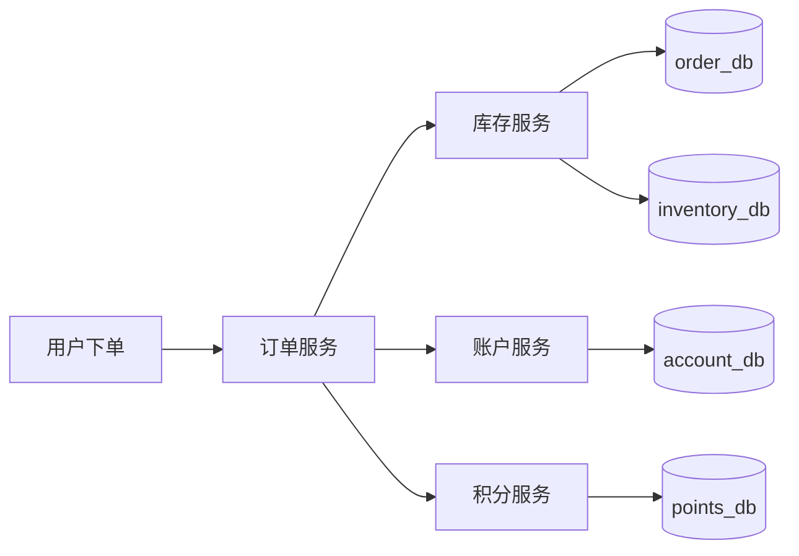
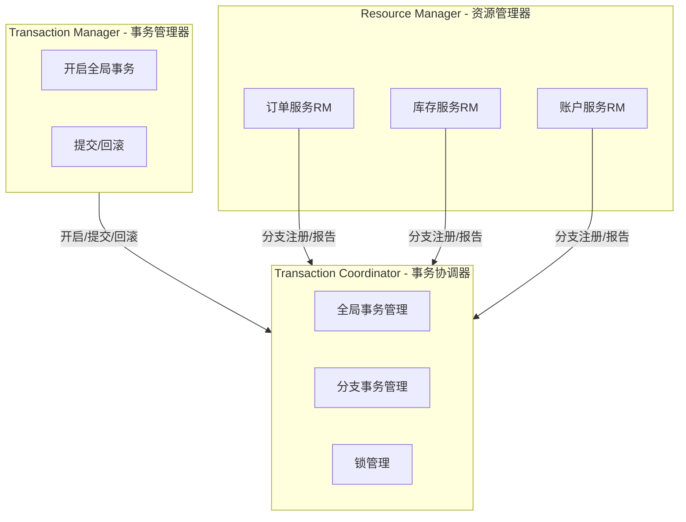
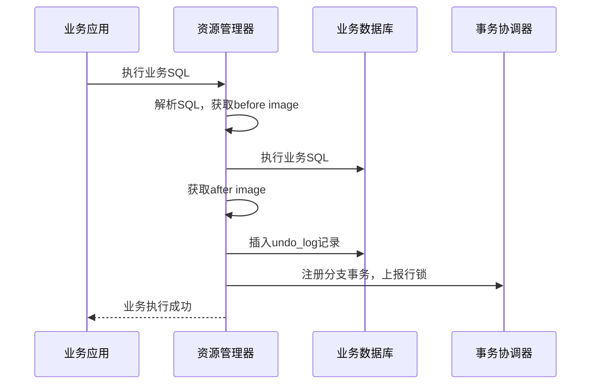
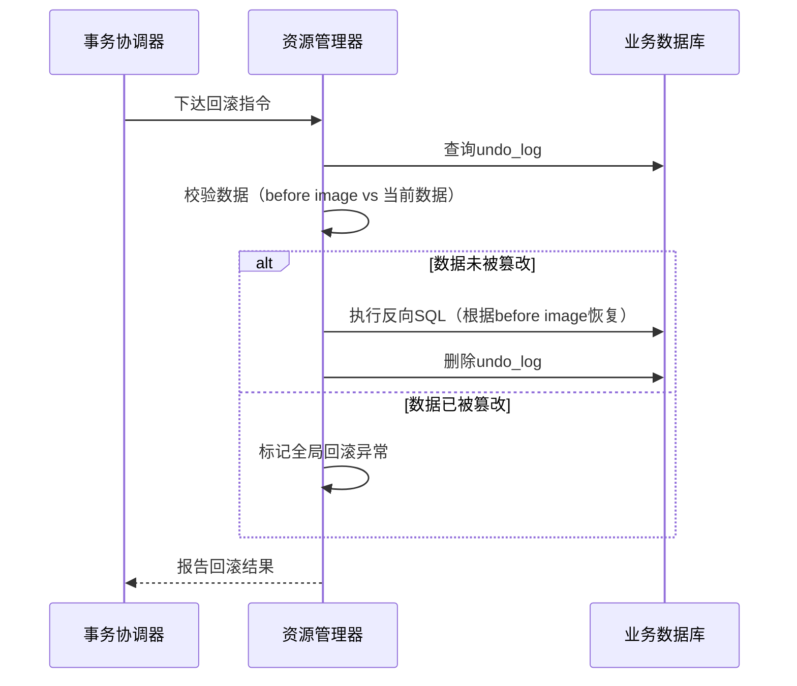
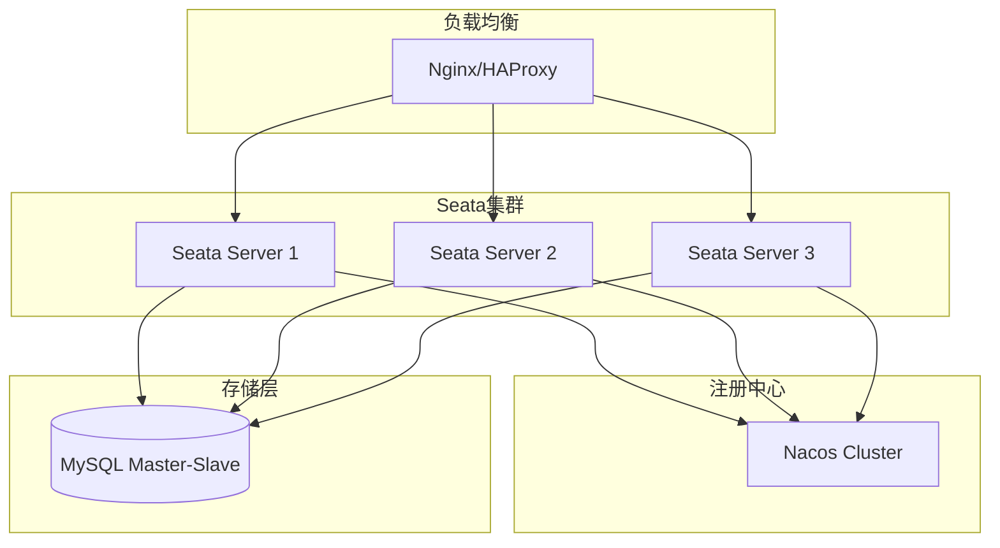

## 案例一：Seata分布式事务实战

### 1. 案例背景与问题引入

#### 1.1 业务场景：电商下单扣减链路

在电商系统中，一笔订单的完成需要跨越多个微服务协同工作：



以一笔普通订单为例，核心流程为：

1. **订单服务**：创建订单记录，状态设为"待支付"
2. **库存服务**：扣减商品库存，记录扣减流水
3. **账户服务**：冻结并扣减用户余额，记录交易明细
4. **积分服务**：根据订单金额计算并增加用户积分

上述操作分布在四个独立的数据库中，每个服务拥有自己的数据源。如果在分布式环境下不引入事务协调机制，就会产生经典的分布式一致性问题。

#### 1.2 不用分布式事务会怎样

假设订单创建成功，但在扣减库存时库存服务宕机了，此时：

- 订单已存在（order_db中有一条"待支付"记录）
- 库存未扣减（inventory_db中库存未变化）
- 余额未冻结（account_db无任何变更）

用户可能看到订单已创建，但实际库存未扣减。如果库存服务恢复后没有补偿机制，就会出现**超卖**。更严重的情况是，订单服务和库存服务都成功了，但账户服务失败——钱没扣但货发了，或者货扣了但钱没冻。

这就是分布式事务要解决的核心问题：**跨服务、跨数据库的操作要么全部成功，要么全部回滚**。

#### 1.3 为什么选择Seata

市面上解决分布式事务的方案有多种，选择Seata的核心考量如下：

| 方案 | 一致性模型 | 性能 | 侵入性 | 适用场景 | 选择理由 |
|------|-----------|------|--------|---------|---------|
| 两阶段提交（2PC） | 强一致 | 低 | 低 | 同构数据库 | 跨服务不适用，性能瓶颈 |
| TCC | 最终一致 | 高 | 高（需手写补偿） | 高性能场景 | 代码侵入大，开发成本高 |
| 本地消息表 | 最终一致 | 高 | 中 | 异步场景 | 实时性不够，实现复杂 |
| **Seata AT模式** | **最终一致** | **较高** | **极低（注解即可）** | **常规CRUD** | **开发效率最优，社区活跃** |
| Seata TCC模式 | 最终一致 | 高 | 高 | 高性能场景 | 与纯TCC方案类似 |
| Seata Saga模式 | 最终一致 | 高 | 中 | 长事务 | 适合异步长流程 |

Seata的AT模式（Automatic Transaction）对业务代码几乎零侵入，只需一个 `@GlobalTransactional` 注解即可开启全局事务，这对已有的微服务改造成本最低。同时Seata还支持TCC、Saga、XA等多种模式，可根据场景灵活选择。

---

### 2. Seata架构原理

#### 2.1 核心角色

Seata的架构包含三个核心角色：



- **TC（Transaction Coordinator）**：事务协调器，独立部署的服务（Seata Server），负责全局事务的开启、提交、回滚，以及分支事务的注册和状态管理
- **TM（Transaction Manager）**：事务管理器，嵌入在业务服务中，负责界定全局事务的边界（哪里开始、哪里结束），并向TC申请开启或提交/回滚全局事务
- **RM（Resource Manager）**：资源管理器，嵌入在业务服务中，负责向TC注册分支事务、报告分支执行状态，并执行TC下达的提交或回滚指令

#### 2.2 AT模式执行流程

AT模式是Seata最常用的模式，其核心机制是在不修改业务SQL的前提下，通过**自动生成回滚日志**来实现事务控制。

**一阶段（执行并记录 undo_log）：**



关键步骤详解：

1. **解析SQL**：Seata的SQL解析器（基于Druid）分析业务SQL，提取表名、更新条件、涉及的字段
2. **记录前置镜像（before image）**：在业务SQL执行前，根据条件查询当前数据状态，保存为before image
3. **执行业务SQL**：正常执行原始SQL，不作任何修改
4. **记录后置镜像（after image）**：在业务SQL执行后，查询更新后的数据状态，保存为after image
5. **生成undo_log**：将before image和after image打包为undo_log，插入到 `undo_log` 表中
6. **加行锁**：对涉及的数据库行加全局锁（通过TC协调），防止其他全局事务并发修改
7. **注册分支**：向TC注册本分支事务，上报行锁信息

**二阶段提交：**

- 删除对应的undo_log记录
- 释放行锁
- 整个过程无需回滚，开销极小

**二阶段回滚：**



关键步骤详解：

1. **查询undo_log**：根据XID（全局事务ID）和branch ID查找对应的undo_log
2. **数据校验**：将当前数据库中的数据与before image对比，确认数据未被其他事务篡改
3. **执行反向SQL**：根据before image中的数据，自动生成反向补偿SQL。例如 `UPDATE amount SET price = 100` 的反向操作是将price恢复为before image中的值
4. **清理undo_log**：回滚完成后删除undo_log记录
5. **释放锁**：释放全局行锁

#### 2.3 undo_log表结构

每个参与Seata事务的数据库都需要创建 `undo_log` 表：

```sql
CREATE TABLE IF NOT EXISTS `undo_log`
(
    `branch_id`     BIGINT       NOT NULL COMMENT '分支事务ID',
    `xid`           VARCHAR(128) NOT NULL COMMENT '全局事务ID',
    `context`       VARCHAR(128) DEFAULT NULL COMMENT '序列化上下文',
    `rollback_info` LONGBLOB     NOT NULL COMMENT '回滚信息（序列化的before/after image）',
    `log_status`    INT          NOT NULL COMMENT '日志状态：0=正常，1=已回滚',
    `log_created`   DATETIME     NOT NULL COMMENT '创建时间',
    `log_modified`  DATETIME     NOT NULL COMMENT '修改时间',
    `ext`           VARCHAR(100) DEFAULT NULL COMMENT '扩展字段',
    PRIMARY KEY (`xid`, `branch_id`),
    KEY `idx_log_created` (`log_created`)
) ENGINE = InnoDB DEFAULT CHARSET = utf8mb4 COMMENT = 'AT模式回滚日志表';
```

---

### 3. 环境搭建

#### 3.1 技术选型与版本

| 组件 | 版本 | 说明 |
|------|------|------|
| Seata Server | 2.1.0 | 事务协调器 |
| Spring Boot | 3.2.x | 应用框架 |
| Spring Cloud Alibaba | 2023.x | 微服务框架 |
| Seata Spring Boot Starter | 2.1.0 | 客户端SDK |
| Nacos | 2.3.x | 注册中心与配置中心 |
| MySQL | 8.0 | 业务数据库 |
| MyBatis-Plus | 3.5.x | ORM框架 |

#### 3.2 部署Seata Server

**方式一：Docker部署（推荐用于开发和测试）**

```bash
# 拉取镜像
docker pull seataio/seata-server:2.1.0

# 启动Seata Server
docker run -d \
  --name seata-server \
  -p 8091:8091 \
  -p 7091:7091 \
  -e SEATA_PORT=8091 \
  -e STORE_MODE=db \
  -e STORE_DB_TYPE=mysql \
  -e STORE_DB_HOST=127.0.0.1 \
  -e STORE_DB_PORT=3306 \
  -e STORE_DB_USER=root \
  -e STORE_DB_PASSWORD=root \
  -e STORE_DB_DATABASE=seata_server \
  seataio/seata-server:2.1.0
```

**方式二：手动部署**

从 [Seata GitHub Releases](https://github.com/seata/seata/releases) 下载对应版本的压缩包，解压后修改配置：

```properties
# conf/registry.conf — 注册中心配置
registry.type = nacos
registry.nacos.application = seata-server
registry.nacos.group = SEATA_GROUP
registry.nacos.namespace = seata
registry.nacos.server-addr = 127.0.0.1:8848

# conf/config.conf — 存储配置
store.mode = db
store.db.datasource = druid
store.db.db-type = mysql
store.db.driver-class-name = com.mysql.cj.jdbc.Driver
store.db.url = jdbc:mysql://127.0.0.1:3306/seata_server?useUnicode=true&amp;characterEncoding=utf8&amp;serverTimezone=Asia/Shanghai
store.db.user = root
store.db.password = root
```

初始化Seata Server的存储表：

```sql
-- seata_server数据库
CREATE DATABASE IF NOT EXISTS seata_server;
USE seata_server;

-- 全局事务表
CREATE TABLE IF NOT EXISTS `global_table`
(
    `xid`                       VARCHAR(128)  NOT NULL,
    `transaction_id`            BIGINT,
    `status`                    TINYINT       NOT NULL,
    `application_id`            VARCHAR(32),
    `transaction_service_group` VARCHAR(32),
    `transaction_name`          VARCHAR(128),
    `timeout`                   INT,
    `begin_time`                BIGINT,
    `application_data`          VARCHAR(2000),
    `gmt_create`                DATETIME,
    `gmt_modified`              DATETIME,
    PRIMARY KEY (`xid`),
    KEY `idx_gmt_modified_status` (`gmt_modified`, `status`),
    KEY `idx_transaction_id` (`transaction_id`)
) ENGINE = InnoDB DEFAULT CHARSET = utf8mb4;

-- 分支事务表
CREATE TABLE IF NOT EXISTS `branch_table`
(
    `branch_id`         BIGINT       NOT NULL,
    `xid`               VARCHAR(128) NOT NULL,
    `transaction_id`    BIGINT,
    `resource_group_id` VARCHAR(32),
    `resource_id`       VARCHAR(256),
    `branch_type`       VARCHAR(8),
    `status`            TINYINT,
    `client_id`         VARCHAR(64),
    `application_data`  VARCHAR(2000),
    `gmt_create`        DATETIME,
    `gmt_modified`      DATETIME,
    PRIMARY KEY (`branch_id`),
    KEY `idx_xid` (`xid`)
) ENGINE = InnoDB DEFAULT CHARSET = utf8mb4;

-- 全局锁表
CREATE TABLE IF NOT EXISTS `lock_table`
(
    `row_key`        VARCHAR(128) NOT NULL,
    `xid`            VARCHAR(128),
    `transaction_id` BIGINT,
    `branch_id`      BIGINT       NOT NULL,
    `resource_id`    VARCHAR(256),
    `table_name`     VARCHAR(32),
    `pk`             VARCHAR(36),
    `gmt_create`     DATETIME,
    `gmt_modified`   DATETIME,
    PRIMARY KEY (`row_key`),
    KEY `idx_branch_id` (`branch_id`)
) ENGINE = InnoDB DEFAULT CHARSET = utf8mb4;
```

#### 3.3 客户端工程搭建

以Spring Cloud Alibaba微服务工程为例，创建以下模块结构：

seata-demo/
├── seata-demo-order/          # 订单服务
├── seata-demo-inventory/      # 库存服务
├── seata-demo-account/        # 账户服务
└── seata-demo-common/         # 公共模块（实体、DTO）

**父POM核心依赖：**

```xml
<dependencyManagement>
    <dependencies>
        <dependency>
            <groupId>com.alibaba.cloud</groupId>
            <artifactId>spring-cloud-alibaba-dependencies</artifactId>
            <version>2023.0.1.0</version>
            <type>pom</type>
            <scope>import</scope>
        </dependency>
    </dependencies>
</dependencyManagement>
```

**各服务的POM依赖（以订单服务为例）：**

```xml
<dependencies>
    <dependency>
        <groupId>org.springframework.boot</groupId>
        <artifactId>spring-boot-starter-web</artifactId>
    </dependency>
    <dependency>
        <groupId>org.springframework.cloud</groupId>
        <artifactId>spring-cloud-starter-openfeign</artifactId>
    </dependency>
    <dependency>
        <groupId>com.alibaba.cloud</groupId>
        <artifactId>spring-cloud-starter-alibaba-seata</artifactId>
    </dependency>
    <dependency>
        <groupId>com.baomidou</groupId>
        <artifactId>mybatis-plus-boot-starter</artifactId>
        <version>3.5.5</version>
    </dependency>
    <dependency>
        <groupId>com.mysql</groupId>
        <artifactId>mysql-connector-j</artifactId>
    </dependency>
</dependencies>
```

**各服务的application.yml配置：**

```yaml
spring:
  application:
    name: seata-demo-order
  cloud:
    nacos:
      server-addr: 127.0.0.1:8848
      discovery:
        namespace: seata
        group: DEFAULT_GROUP
  datasource:
    url: jdbc:mysql://127.0.0.1:3306/order_db?useUnicode=true&amp;characterEncoding=utf8&amp;serverTimezone=Asia/Shanghai
    username: root
    password: root
    driver-class-name: com.mysql.cj.jdbc.Driver

  seata:
    enabled: true
    application-id: ${spring.application.name}
    tx-service-group: my_tx_group
    registry:
      type: nacos
      nacos:
        application: seata-server
        group: SEATA_GROUP
        namespace: seata
    config:
      type: nacos
      nacos:
        server-addr: 127.0.0.1:8848
        namespace: seata
        group: SEATA_GROUP
```

**Seata Server端的事务组映射配置（在Nacos或file.conf中）：**

```properties
# 事务组 → Seata Server集群的映射
service.vgroup-mapping.my_tx_group = default
service.vgroup-mapping.my_tx_group = default
```

---

### 4. 核心代码实现

#### 4.1 数据库初始化

每个服务对应独立的数据库，执行以下建表脚本：

```sql
-- ===== order_db =====
CREATE TABLE `t_order`
(
    `id`            BIGINT PRIMARY KEY AUTO_INCREMENT,
    `user_id`       BIGINT       NOT NULL COMMENT '用户ID',
    `product_id`    BIGINT       NOT NULL COMMENT '商品ID',
    `count`         INT          NOT NULL COMMENT '数量',
    `amount`        DECIMAL(10, 2) NOT NULL COMMENT '总金额',
    `status`        TINYINT      NOT NULL DEFAULT 0 COMMENT '0-待支付 1-已支付 2-已取消',
    `create_time`   DATETIME     NOT NULL DEFAULT CURRENT_TIMESTAMP,
    `update_time`   DATETIME     NOT NULL DEFAULT CURRENT_TIMESTAMP ON UPDATE CURRENT_TIMESTAMP,
    INDEX `idx_user_id` (`user_id`)
) ENGINE = InnoDB DEFAULT CHARSET = utf8mb4 COMMENT = '订单表';

-- ===== inventory_db =====
CREATE TABLE `t_inventory`
(
    `id`            BIGINT PRIMARY KEY AUTO_INCREMENT,
    `product_id`    BIGINT   NOT NULL COMMENT '商品ID',
    `total`         INT      NOT NULL COMMENT '总库存',
    `used`          INT      NOT NULL DEFAULT 0 COMMENT '已用库存',
    `residual`      INT      NOT NULL COMMENT '剩余库存',
    UNIQUE INDEX `idx_product_id` (`product_id`)
) ENGINE = InnoDB DEFAULT CHARSET = utf8mb4 COMMENT = '库存表';

-- ===== account_db =====
CREATE TABLE `t_account`
(
    `id`            BIGINT PRIMARY KEY AUTO_INCREMENT,
    `user_id`       BIGINT         NOT NULL COMMENT '用户ID',
    `total`         DECIMAL(10, 2) NOT NULL COMMENT '总额度',
    `used`          DECIMAL(10, 2) NOT NULL DEFAULT 0.00 COMMENT '已用额度',
    `residual`      DECIMAL(10, 2) NOT NULL COMMENT '剩余额度',
    UNIQUE INDEX `idx_user_id` (`user_id`)
) ENGINE = InnoDB DEFAULT CHARSET = utf8mb4 COMMENT = '账户表';

-- 每个业务数据库都要创建undo_log表（见2.3节）
```

#### 4.2 公共模块（seata-demo-common）

```java
/**
 * 统一响应体
 */
public class Result<T> {
    private int code;
    private String message;
    private T data;

    public static <T> Result<T> ok(T data) {
        Result<T> r = new Result<>();
        r.code = 200;
        r.message = "success";
        r.data = data;
        return r;
    }

    public static <T> Result<T> fail(String message) {
        Result<T> r = new Result<>();
        r.code = 500;
        r.message = message;
        return r;
    }
}
```

#### 4.3 库存服务（seata-demo-inventory）

**Feign客户端接口：**

```java
@FeignClient(value = "seata-demo-inventory")
public interface InventoryFeignClient {

    @PostMapping("/inventory/deduct")
    Result<Void> deduct(@RequestBody InventoryDeductRequest request);
}
```

**Service实现：**

```java
@Service
@Slf4j
public class InventoryServiceImpl implements InventoryService {

    @Autowired
    private InventoryMapper inventoryMapper;

    /**
     * 扣减库存（注意：这里不需要@GlobalTransactional）
     * 它作为一个分支事务，由TC统一协调
     */
    @Override
    public void deduct(Long productId, int count) {
        // 1. 查询当前库存
        Inventory inventory = inventoryMapper.selectByProductId(productId);
        if (inventory == null) {
            throw new RuntimeException("商品不存在: " + productId);
        }
        if (inventory.getResidual() < count) {
            throw new RuntimeException("库存不足，商品: " + productId
                    + "，剩余: " + inventory.getResidual() + "，需要: " + count);
        }

        // 2. 扣减库存（UPDATE语句会被Seata拦截并生成undo_log）
        int affected = inventoryMapper.deduct(productId, count);
        if (affected == 0) {
            throw new RuntimeException("库存扣减失败，可能已被其他事务锁定");
        }
        log.info("库存扣减成功: 商品={}, 数量={}, 剩余={}", productId, count,
                inventory.getResidual() - count);
    }
}
```

**Mapper层：**

```java
@Mapper
public interface InventoryMapper {

    @Select("SELECT id, product_id, total, used, residual FROM t_inventory WHERE product_id = #{productId}")
    Inventory selectByProductId(@Param("productId") Long productId);

    @Update("UPDATE t_inventory SET residual = residual - #{count}, used = used + #{count} WHERE product_id = #{productId} AND residual >= #{count}")
    int deduct(@Param("productId") Long productId, @Param("count") int count);
}
```

**Controller：**

```java
@RestController
@RequestMapping("/inventory")
@Slf4j
public class InventoryController {

    @Autowired
    private InventoryService inventoryService;

    @PostMapping("/deduct")
    public Result<Void> deduct(@RequestBody InventoryDeductRequest request) {
        inventoryService.deduct(request.getProductId(), request.getCount());
        return Result.ok(null);
    }
}
```

#### 4.4 账户服务（seata-demo-account）

**Feign客户端接口：**

```java
@FeignClient(value = "seata-demo-account")
public interface AccountFeignClient {

    @PostMapping("/account/freeze")
    Result<Void> freeze(@RequestBody AccountFreezeRequest request);
}
```

**Service实现：**

```java
@Service
@Slf4j
public class AccountServiceImpl implements AccountService {

    @Autowired
    private AccountMapper accountMapper;

    @Override
    public void freeze(Long userId, BigDecimal amount) {
        // 1. 查询账户
        Account account = accountMapper.selectByUserId(userId);
        if (account == null) {
            throw new RuntimeException("账户不存在: " + userId);
        }
        if (account.getResidual().compareTo(amount) < 0) {
            throw new RuntimeException("余额不足，用户: " + userId
                    + "，剩余: " + account.getResidual() + "，需要: " + amount);
        }

        // 2. 冻结金额（扣减可用额度，增加冻结额度）
        int affected = accountMapper.freeze(userId, amount);
        if (affected == 0) {
            throw new RuntimeException("余额冻结失败");
        }
        log.info("余额冻结成功: 用户={}, 金额={}", userId, amount);
    }
}
```

**Mapper层：**

```java
@Mapper
public interface AccountMapper {

    @Select("SELECT id, user_id, total, used, residual FROM t_account WHERE user_id = #{userId}")
    Account selectByUserId(@Param("userId") Long userId);

    @Update("UPDATE t_account SET residual = residual - #{amount}, used = used + #{amount} WHERE user_id = #{userId} AND residual >= #{amount}")
    int freeze(@Param("userId") Long userId, @Param("amount") BigDecimal amount);
}
```

#### 4.5 订单服务（seata-demo-order）——全局事务入口

订单服务是整个下单链路的发起方，也是全局事务的TM所在：

```java
@Service
@Slf4j
public class OrderServiceImpl implements OrderService {

    @Autowired
    private OrderMapper orderMapper;
    @Autowired
    private InventoryFeignClient inventoryFeignClient;
    @Autowired
    private AccountFeignClient accountFeignClient;

    /**
     * 创建订单 —— 核心方法
     * @GlobalTransactional 标记此方法为全局事务的起点
     * Seata会：
     *   1. 向TC注册一个全局事务，获得XID
     *   2. 将XID通过Feign调用的HTTP Header传递给下游服务
     *   3. 下游服务检测到XID后，自动加入全局事务作为分支
     *   4. 方法正常结束时，TC提交所有分支
     *   5. 方法抛出异常时，TC回滚所有分支
     */
    @Override
    @GlobalTransactional(
        name = "create-order",
        rollbackFor = Exception.class,
        timeoutMills = 60000
    )
    public void createOrder(CreateOrderRequest request) {
        Long orderId = generateOrderId();
        log.info("开始创建全局事务，订单ID: {}", orderId);

        // 1. 创建订单（本地事务）
        Order order = new Order();
        order.setId(orderId);
        order.setUserId(request.getUserId());
        order.setProductId(request.getProductId());
        order.setCount(request.getCount());
        order.setAmount(request.getPrice().multiply(new BigDecimal(request.getCount())));
        order.setStatus(0); // 待支付
        orderMapper.insert(order);
        log.info("订单创建成功: {}", orderId);

        // 2. 远程调用：扣减库存（自动携带XID，成为分支事务）
        InventoryDeductRequest deductRequest = new InventoryDeductRequest();
        deductRequest.setProductId(request.getProductId());
        deductRequest.setCount(request.getCount());
        Result<Void> inventoryResult = inventoryFeignClient.deduct(deductRequest);
        if (inventoryResult.getCode() != 200) {
            throw new RuntimeException("库存扣减失败: " + inventoryResult.getMessage());
        }
        log.info("库存扣减完成，订单: {}", orderId);

        // 3. 远程调用：冻结余额（自动携带XID，成为分支事务）
        AccountFreezeRequest freezeRequest = new AccountFreezeRequest();
        freezeRequest.setUserId(request.getUserId());
        freezeRequest.setAmount(order.getAmount());
        Result<Void> accountResult = accountFeignClient.freeze(freezeRequest);
        if (accountResult.getCode() != 200) {
            throw new RuntimeException("余额冻结失败: " + accountResult.getMessage());
        }
        log.info("余额冻结完成，订单: {}", orderId);

        // 4. 全部成功，TC会在方法返回后提交所有分支
        log.info("全局事务提交，订单: {}", orderId);
    }

    private Long generateOrderId() {
        // 实际项目中应使用分布式ID生成器（雪花算法等）
        return System.currentTimeMillis() * 100 + ThreadLocalRandom.current().nextInt(100);
    }
}
```

**Feign配置（确保XID透传）：**

```java
/**
 * Feign请求拦截器：将Seata的XID通过HTTP Header传递给下游服务
 * Spring Cloud Alibaba Seata 2.x 已自动配置此拦截器
 * 如使用老版本或自定义Feign配置，需手动添加：
 */
@Component
public class FeignRequestInterceptor implements RequestInterceptor {
    @Override
    public void apply(RequestTemplate template) {
        String xid = RootContext.getXID();
        if (StringUtils.isNotBlank(xid)) {
            template.header("TX_XID", xid);
        }
    }
}
```

**Controller：**

```java
@RestController
@RequestMapping("/order")
@Slf4j
public class OrderController {

    @Autowired
    private OrderService orderService;

    @PostMapping("/create")
    public Result<Long> createOrder(@RequestBody CreateOrderRequest request) {
        try {
            orderService.createOrder(request);
            return Result.ok(null);
        } catch (Exception e) {
            log.error("下单失败", e);
            return Result.fail(e.getMessage());
        }
    }
}
```

---

### 5. 运行验证

#### 5.1 正常流程验证

启动Nacos、Seata Server、三个微服务后，调用下单接口：

```bash
curl -X POST http://localhost:8081/order/create \
  -H "Content-Type: application/json" \
  -d '{
    "userId": 1,
    "productId": 1001,
    "count": 2,
    "price": 99.00
  }'
```

预期结果：三个数据库中分别写入了订单、库存扣减、余额冻结记录。

```sql
-- 验证 order_db
SELECT * FROM t_order ORDER BY id DESC LIMIT 1;
-- +--------+---------+------------+-------+--------+--------+
-- | id     | user_id | product_id | count | amount | status |
-- +--------+---------+------------+-------+--------+--------+
-- | xxxxxx |       1 |       1001 |     2 | 198.00 |      0 |
-- +--------+---------+------------+-------+--------+--------+

-- 验证 inventory_db
SELECT * FROM t_inventory WHERE product_id = 1001;
-- residual 应减少了2

-- 验证 account_db
SELECT * FROM t_account WHERE user_id = 1;
-- residual 应减少了198.00
```

#### 5.2 异常回滚验证

模拟账户服务异常（在账户服务的freeze方法中临时添加异常）：

```java
// 模拟异常：在余额冻结前抛出异常
if (true) {
    throw new RuntimeException("模拟账户服务异常");
}
```

重新调用下单接口，预期结果：

- 订单被创建后回滚（order_db中无该记录或被回滚）
- 库存被扣减后回滚（inventory_db中residual恢复）
- 余额冻结操作未执行（因为异常发生在账户服务内部）
- 三个数据库数据保持一致

检查undo_log表（回滚后应为空）：

```sql
SELECT COUNT(*) FROM undo_log;
-- 应为0，说明回滚完成且日志已清理
```

#### 5.3 异常场景对照表

| 场景 | 异常位置 | 预期行为 | 数据一致性 |
|------|---------|---------|-----------|
| 库存不足 | 库存服务deduct方法抛异常 | 订单创建回滚，库存未变，余额未冻 | ✅ 一致 |
| 余额不足 | 账户服务freeze方法抛异常 | 订单创建回滚，库存恢复，余额未变 | ✅ 一致 |
| 库存服务宕机 | Feign调用超时 | 订单创建回滚，库存未变，余额未冻 | ✅ 一致 |
| 账户服务宕机 | Feign调用超时 | 订单创建回滚，库存恢复，余额未变 | ✅ 一致 |
| 全部成功 | 无异常 | 订单创建，库存扣减，余额冻结 | ✅ 一致 |

---

### 6. 常见问题与排错指南

#### 6.1 XID丢失导致分支未加入全局事务

**现象**：调用链路中断，下游服务的修改未被回滚。

**排查步骤**：

1. 检查Feign配置是否正确，确认Header中携带了 `TX_XID`
2. 检查Seata自动装配是否生效：启动日志中搜索 `seata` 相关配置
3. 确认 `spring.seata.enabled = true` 且 `tx-service-group` 配置正确

**常见原因**：
- 自定义了Feign配置但未添加XID拦截器
- 使用了RestTemplate而非Feign，未手动传递XID
- Spring Boot自动装配冲突，排除了Seata的自动配置

#### 6.2 undo_log表不存在

**现象**：业务执行正常但报错 `table undo_log doesn't exist`。

**解决**：在每个业务数据库中执行2.3节的undo_log建表语句。注意每个参与事务的数据库都需要这张表。

#### 6.3 全局锁等待超时

**现象**：并发下单时出现 `Lock conflict` 或 `Global lock acquire timeout`。

**原因**：两个全局事务同时修改同一行数据，Seata通过全局锁保证串行化执行。如果等待时间过长会超时。

**解决方案**：

```yaml
# 调整客户端超时配置
seata:
  client:
    lock:
      retryTimes: 30           # 重试次数（默认30）
      retryPolicy: FixedDelay  # 重试策略
  service:
    global-transaction-timeout: 60000  # 全局事务超时（毫秒）
```

优化业务逻辑，减少全局锁持有时间——将非核心操作移出全局事务范围。

#### 6.4 序列化异常

**现象**：回滚时报 `java.io.StreamCorruptedException`。

**原因**：undo_log中的回滚数据序列化/反序列化失败，通常是数据库字段类型不匹配或应用了不同的序列化方式。

**解决**：确保undo_log表的 `rollback_info` 字段为 `LONGBLOB` 类型；检查是否升级了Seata版本但未清理旧的undo_log数据。

#### 6.5 数据源代理未生效

**现象**：业务正常执行但Seata未拦截SQL，无undo_log生成。

**排查**：

```java
// 确认数据源是否被Seata代理
@PostConstruct
public void checkDataSource() {
    DataSource ds = dataSource;
    log.info("数据源类型: {}", ds.getClass().getName());
    // 正常应显示: io.seata.rm.datasource.DataSourceProxy
    // 如果显示: com.zaxxer.hikari.HikariDataSource 则代理未生效
}
```

**常见原因**：
- 使用了自定义的DataSourceBeanPostProcessor，覆盖了Seata的代理逻辑
- 使用了多数据源但未对每个数据源都配置Seata代理
- 在较新版本的Spring Boot中，DataSource自动装配优先级导致Seata代理被覆盖

---

### 7. 性能优化与生产实践

#### 7.1 undo_log清理策略

undo_log表会持续增长，需要定期清理已完成的记录：

```sql
-- 建议保留最近7天的undo_log
DELETE FROM undo_log
WHERE gmt_create < DATE_SUB(NOW(), INTERVAL 7 DAY)
  AND log_status = 0;

-- 添加定时任务（MySQL Event Scheduler）
CREATE EVENT IF NOT EXISTS evt_cleanup_undo_log
    ON SCHEDULE EVERY 1 DAY
    DO
    DELETE FROM undo_log
    WHERE gmt_create < DATE_SUB(NOW(), INTERVAL 7 DAY)
      AND log_status = 0;
```

#### 7.2 事务粒度控制

全局事务的粒度越小，持锁时间越短，并发性能越好：

```java
// ❌ 反面示例：把非核心操作也放在全局事务中
@GlobalTransactional
public void createOrder(CreateOrderRequest request) {
    orderMapper.insert(order);          // 核心：需要事务保护
    inventoryFeignClient.deduct(req);   // 核心：需要事务保护
    accountFeignClient.freeze(req);     // 核心：需要事务保护
    notificationFeignClient.send(req);  // 非核心：不应在事务内
    logService.saveLog(req);            // 非核心：不应在事务内
    pointsFeignClient.add(req);         // 非核心：可用本地消息表异步处理
}

// ✅ 正确示例：只将核心操作纳入全局事务
@GlobalTransactional
public void createOrder(CreateOrderRequest request) {
    orderMapper.insert(order);
    inventoryFeignClient.deduct(req);
    accountFeignClient.freeze(req);
}

// 非核心操作在全局事务提交后再执行
public void createOrderWithNotification(CreateOrderRequest request) {
    createOrder(request);  // 全局事务在方法返回时提交
    notificationFeignClient.send(request);  // 事务外执行
    pointsFeignClient.add(request);         // 或使用本地消息表异步处理
}
```

#### 7.3 连接池配置优化

Seata代理数据源后会增加额外的连接开销，需要适当调大连接池：

```yaml
spring:
  datasource:
    hikari:
      maximum-pool-size: 30    # 比单体应用适当调大
      minimum-idle: 10
      connection-timeout: 10000
      max-lifetime: 1800000
```

#### 7.4 监控与告警

在生产环境中，需要对Seata进行全方位监控：

| 监控维度 | 指标 | 告警阈值 | 说明 |
|---------|------|---------|------|
| 全局事务 | commit成功率 | < 99.9% | 成功率骤降说明系统异常 |
| 全局事务 | 平均耗时 | > 3s | 耗时过长影响并发 |
| 分支事务 | rollback率 | > 5% | 回滚率高说明业务异常频繁 |
| 全局锁 | 等待超时次数 | > 10次/分钟 | 锁竞争激烈 |
| undo_log | 表行数 | > 100万 | 需要加速清理 |
| TC Server | CPU/内存 | > 80% | 协调器资源不足 |

#### 7.5 高可用部署

Seata Server的高可用部署架构：



关键要点：

- Seata Server至少部署2个实例，通过Nacos注册实现自动故障转移
- 存储层使用MySQL主从复制，TC数据存储在主库，从库提供读能力
- Nacos集群同样需要3个节点保证高可用
- 业务服务通过Nacos发现TC实例，TC宕机时自动切换

---

### 8. 经验总结与最佳实践

#### 8.1 AT模式适用边界

AT模式适合绝大多数CRUD场景，但有以下限制：

| 限制 | 说明 | 替代方案 |
|------|------|---------|
| 不支持DDL | undo_log机制无法回滚表结构变更 | 将DDL操作排除在事务外 |
| 必须有主键 | SQL解析需要通过主键定位行数据 | 确保所有表有主键 |
| 存在天然的锁竞争 | 全局锁 + 数据库行锁的双重锁定 | 优化事务粒度，或改用TCC模式 |
| 长事务性能差 | undo_log占用存储，锁持有时间长 | 将长事务拆分为短事务，或用Saga模式 |

#### 8.2 开发规范清单

1. **一个全局事务 = 一个 `@GlobalTransactional` 方法**，不要嵌套
2. **全局事务中只放核心数据操作**，通知、日志、缓存等放事务外
3. **每个业务数据库都要建undo_log表**，缺一不可
4. **保证SQL有主键**，AT模式的SQL解析依赖主键定位
5. **Feign调用链路不要绕过**，确保XID透传
6. **配置合理的超时时间**，默认60秒可能不适合所有场景
7. **生产环境必须清理undo_log**，否则表会无限增长
8. **回滚时保证幂等**，补偿操作必须可重复执行
9. **监控不可少**，重点关注commit/rollback成功率和锁等待
10. **压测先行**，上线前在类生产环境充分压测全局事务的性能影响

#### 8.3 演进路线建议

根据业务复杂度和技术团队能力，推荐以下演进路径：

阶段一（初期）：Seata AT模式
  └── 快速落地，解决基本的分布式事务问题

阶段二（中期）：AT + 本地消息表混合
  └── 核心链路用AT保证实时一致性
  └── 非核心链路用本地消息表异步最终一致

阶段三（成熟期）：TCC + Saga
  └── 高性能核心链路切换为TCC模式，去掉undo_log开销
  └── 长流程异步链路用Saga模式
  └── 建立完善的分布式事务监控体系

Seata的价值不仅在于提供了分布式事务的技术方案，更重要的是它以极低的接入成本让微服务架构下的数据一致性问题有了标准化的解决路径。理解其AT模式的undo_log机制、全局锁原理，是正确使用和优化Seata的基础。在实际项目中，应结合业务特点选择合适的事务模式，并持续关注性能指标，不断调优事务粒度和系统配置。
