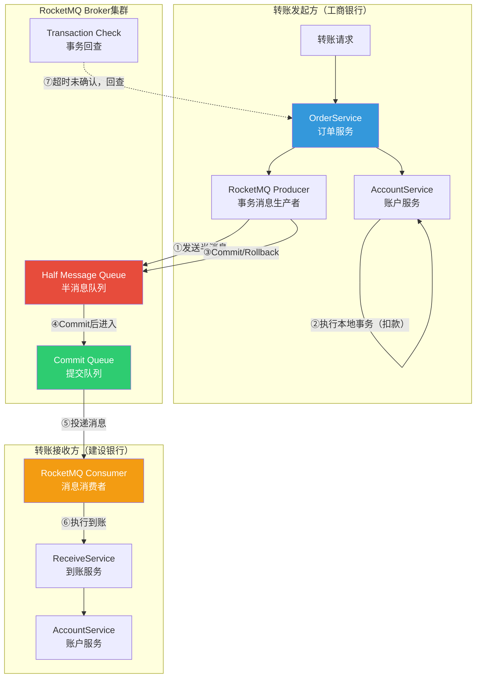
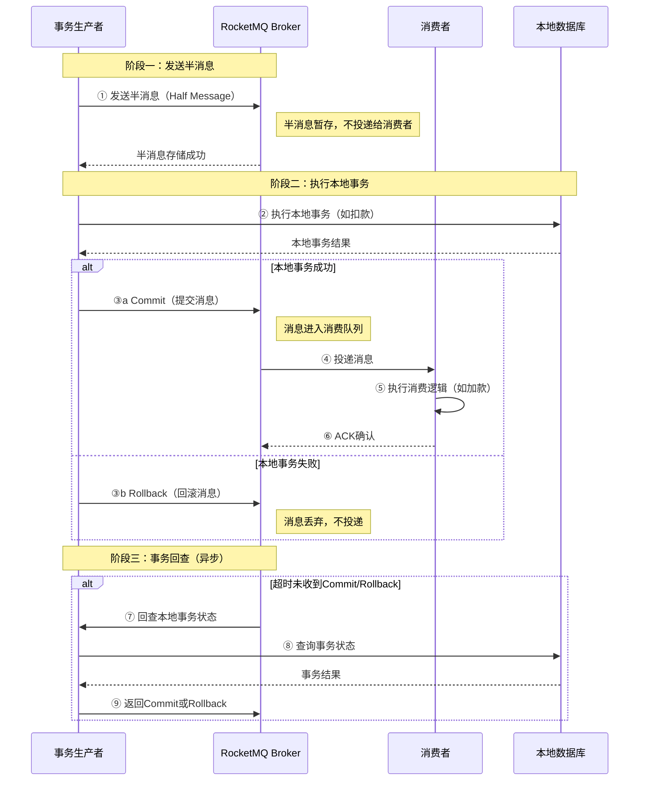
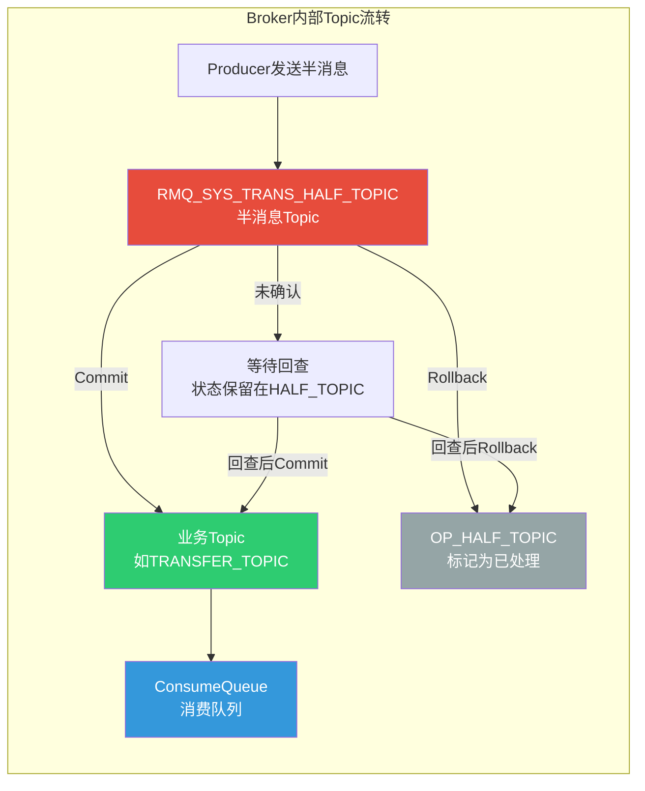
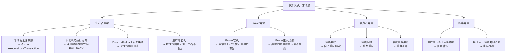
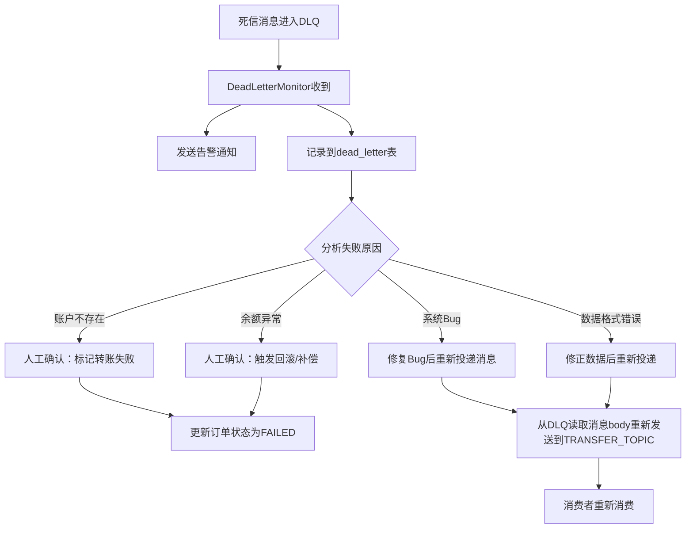
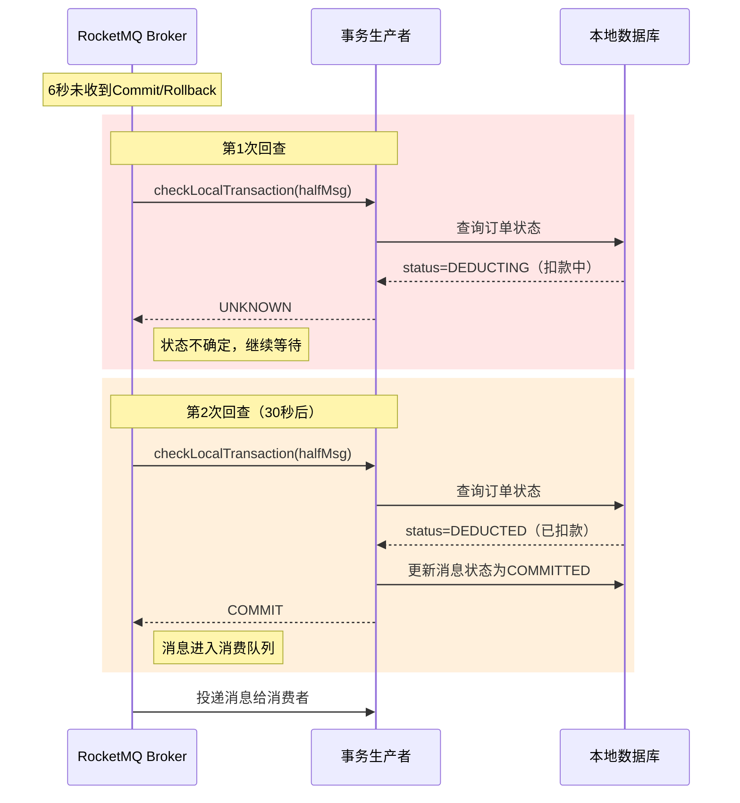
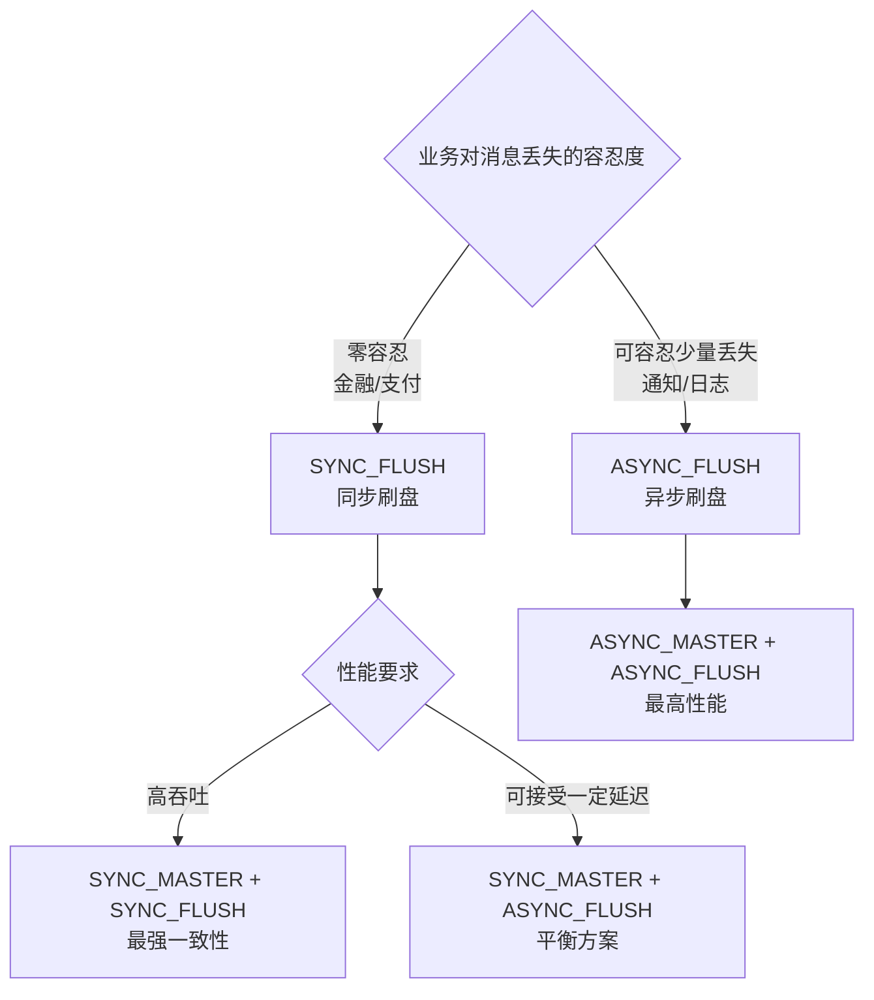
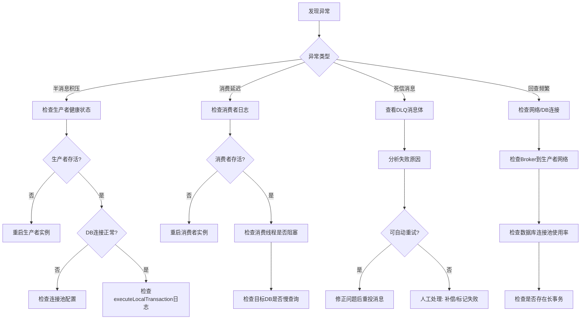

# 55.13 案例二：RocketMQ事务消息实战——从半消息原理到银行跨行转账的最终一致性落地

---

## 一、为什么选择RocketMQ事务消息作为分布式事务实战案例

在分布式事务的所有方案中，**消息驱动的一致性模型**是实际生产中使用频率最高的一种。它的核心优势在于：通过消息队列将同步的跨服务调用转化为异步的消息投递，天然实现了服务解耦和流量削峰，同时借助事务消息的原子性保证本地事务与消息发送的强一致。

而在众多消息中间件中，**RocketMQ是唯一原生支持事务消息的主流MQ**。Kafka直到3.x版本才引入Exactly-Once语义（且与RocketMQ的实现方式不同），Pulsar的事务支持仍在演进中。RocketMQ的事务消息机制由阿里巴巴在2012年设计，历经双11万亿级消息的验证，是事务消息领域事实上的标准实现。

### 1.1 真实场景：银行跨行转账

考虑一个典型的跨行转账场景：

用户A（工商银行） → 转账500元 → 用户B（建设银行）

这个看似简单的操作涉及两个独立的银行系统，每个系统有自己的数据库和事务边界。核心矛盾是：

| 阶段 | 操作 | 风险 |
|------|------|------|
| 1 | 从A账户扣款500元 | 扣款成功后，网络断开，B账户未到账 |
| 2 | 向B账户加款500元 | 如果直接同步调用，A扣款但B加款失败，数据不一致 |
| 3 | 记录转账流水 | 流水记录失败不影响资金安全，但影响可追溯性 |

如果用本地事务解决——把两个银行的操作放在一个数据库事务中——这在物理上不可能，因为它们是两个独立的系统。这就是典型的**跨系统分布式事务**问题。

### 1.2 为什么不用其他方案

| 方案 | 不适用的原因 |
|------|-------------|
| 2PC/XA | 跨银行系统不可能共享事务协调器；银行系统不支持XA协议 |
| TCC | 银行系统通常不暴露"冻结/确认/取消"三个接口；对接成本极高 |
| Saga | 需要银行系统支持补偿操作（如"反向转账"），合规和审批流程不允许 |
| 本地消息表 | 可行但需要自行实现消息投递的可靠性，运维成本高 |
| **RocketMQ事务消息** | **原生支持，一次API调用即可实现本地事务与消息的原子性** |

RocketMQ事务消息的核心优势：

1. **原子性保证**：本地事务执行结果与消息发送结果要么都成功，要么都失败
2. **零额外存储**：不需要额外的消息表或binlog监听，RocketMQ broker内部管理半消息状态
3. **回查机制**：即使协调者宕机，broker也会主动回查本地事务状态，保证最终一致
4. **高性能**：半消息不进入消费队列，不影响消费性能；事务提交后消息投递延迟<10ms

### 1.3 本案例的技术架构



---

## 二、RocketMQ事务消息的核心原理

### 2.1 三阶段交互模型

RocketMQ事务消息的核心是**半消息（Half Message）+ 本地事务 + 状态回查**的三阶段交互：



### 2.2 半消息的存储机制

半消息（Half Message）是RocketMQ事务消息的核心概念。它本质上是一条**被特殊标记的消息**：

| 属性 | 说明 |
|------|------|
| 存储位置 | 暂存在Broker的`RMQ_SYS_TRANS_HALF_TOPIC`内部Topic中 |
| 可见性 | 对消费者**不可见**，直到被Commit |
| 持久化 | 与普通消息一样写入CommitLog，保证不丢失 |
| TTL | 默认48小时，超时自动Rollback |
| 回查 | 每条半消息最多回查15次（默认），超过则Rollback |

#### 内部Topic机制详解

RocketMQ事务消息在Broker内部使用了两个特殊的内部Topic来管理消息生命周期：



- **RMQ_SYS_TRANS_HALF_TOPIC**：所有半消息暂存于此，消费者订阅的业务Topic不会看到这里的任何消息
- **RMQ_SYS_TRANS_OP_HALF_TOPIC**：标记已处理的半消息（Commit或Rollback过的），用于Broker清理已确认的消息
- **消息流转**：半消息发送时写入HALF_TOPIC → Commit时将消息复制到业务Topic → 同时在OP_HALF_TOPIC中记录该消息已处理 → Broker定期清理OP_HALF_TOPIC中已标记的消息

这个设计的精妙之处在于：**半消息和已确认消息的存储完全隔离**。消费者只订阅业务Topic，完全感知不到事务消息的存在。这意味着事务消息机制对消费端是**零侵入**的。

### 2.3 事务回查机制

事务回查是RocketMQ保证最终一致性的最后一道防线。当生产者发送半消息后因宕机、网络超时等原因未能提交Commit/Rollback时，Broker会主动发起回查：

回查触发条件：
  1. 半消息存储后超过6秒未收到Commit/Rollback（首次回查）
  2. 每次回查间隔递增（默认 6s, 30s, 30s, ...）
  3. 最大回查次数：15次（可配置）
  4. 超过最大次数：自动Rollback，丢弃半消息

回查的实现要求生产者实现`TransactionListener`接口，提供`checkLocalTransaction`方法，让Broker查询本地事务的执行状态。

**回查的触发时机与间隔策略：**

| 回查次数 | 距上次间隔 | 累计等待时间 | 说明 |
|----------|-----------|-------------|------|
| 第1次 | 6秒 | 6秒 | 首次触发，快速响应短暂网络抖动 |
| 第2次 | 30秒 | 36秒 | 进入稳态回查间隔 |
| 第3次 | 30秒 | 66秒 | 持续回查 |
| ... | 30秒 | ... | 递增至最大次数 |
| 第15次 | 30秒 | ~436秒 | 最后一次回查，之后自动Rollback |

**回查结果的三种语义：**

- `COMMIT`：本地事务已成功，Broker将半消息投递到消费队列
- `ROLLBACK`：本地事务失败或未执行，Broker丢弃半消息
- `UNKNOWN`：本地事务状态不确定（如事务仍在执行中），Broker安排下次回查

### 2.4 与本地消息表方案的对比

| 维度 | RocketMQ事务消息 | 本地消息表 |
|------|-----------------|-----------|
| 额外存储 | 无（Broker内部管理） | 需要额外的消息表 |
| 实现复杂度 | 低（实现Listener接口） | 中（需实现轮询/CDC） |
| 消息可靠性 | Broker保证 | 需自行保证轮询/推送可靠性 |
| 回查机制 | 内置，自动回查 | 需自行实现定时任务 |
| 对业务侵入 | 仅需实现回调接口 | 需要维护消息表、状态机 |
| 适用MQ | 仅RocketMQ | 任意MQ |
| 运维成本 | 低 | 中（消息表膨胀、清理） |

---

## 三、环境搭建与基础配置

### 3.1 RocketMQ部署

**生产环境推荐使用Docker Compose部署Broker集群：**

```yaml
# docker-compose-rocketmq.yml
version: '3.8'

services:
  # NameServer - 路由注册中心
  namesrv:
    image: apache/rocketmq:5.3.1
    container_name: rocketmq-namesrv
    ports:
      - "9876:9876"
    command: sh mqnamesrv
    environment:
      JAVA_OPTS: "-Xms256m -Xmx256m"
    networks:
      - rocketmq-net

  # Broker Master
  broker:
    image: apache/rocketmq:5.3.1
    container_name: rocketmq-broker
    ports:
      - "10911:10911"
      - "10909:10909"
    depends_on:
      - namesrv
    volumes:
      - ./broker.conf:/opt/rocketmq-5.3.1/conf/broker.conf
      - ./broker-logs:/root/logs
      - ./broker-store:/root/store
    command: sh mqbroker -n namesrv:9876 -c /opt/rocketmq-5.3.1/conf/broker.conf
    environment:
      JAVA_OPTS: "-Xms512m -Xmx512m"
    networks:
      - rocketmq-net

  # RocketMQ Dashboard（可选，监控界面）
  dashboard:
    image: apacherocketmq/rocketmq-dashboard:latest
    container_name: rocketmq-dashboard
    ports:
      - "18080:8080"
    depends_on:
      - namesrv
    environment:
      JAVA_OPTS: "-Drocketmq.namesrv.addr=namesrv:9876"
    networks:
      - rocketmq-net

networks:
  rocketmq-net:
    driver: bridge
```

**Broker配置文件（关键参数）：**

```properties
# broker.conf
brokerClusterName=DefaultCluster
brokerName=broker-a
brokerId=0
deleteWhen=04
fileReservedTime=48
brokerRole=ASYNC_MASTER
flushDiskType=ASYNC_FLUSH

# 事务消息相关配置
transactionTimeout=6000                    # 事务超时时间（ms）
transactionCheckInterval=6000              # 回查间隔（ms）
transactionCheckMax=15                     # 最大回查次数

# 性能调优
sendMessageThreadPoolNums=16
pullMessageThreadPoolNums=32
```

### 3.2 RocketMQ 5.x 新特性说明

RocketMQ 5.x 引入了多项与事务消息相关的重要改进：

| 特性 | 5.x 变化 | 对事务消息的影响 |
|------|---------|-----------------|
| gRPC协议 | 新增gRPC通信协议，兼容TCP | 事务消息可通过gRPC发送，降低网络开销 |
| 消息轨迹 | 内置消息轨迹追踪 | 可追踪半消息从发送到Commit/Rollback的全生命周期 |
| 消费过滤 | 基于SQL的消费过滤增强 | 事务消息Commit后可被更精确地过滤 |
| 控制台增强 | Dashboard支持事务消息查看 | 可直观查看半消息积压量、回查状态 |

### 3.3 Maven依赖

```xml
<dependencies>
    <!-- RocketMQ客户端 -->
    <dependency>
        <groupId>org.apache.rocketmq</groupId>
        <artifactId>rocketmq-client</artifactId>
        <version>5.3.1</version>
    </dependency>
    
    <!-- Spring Boot集成（可选） -->
    <dependency>
        <groupId>org.apache.rocketmq</groupId>
        <artifactId>rocketmq-spring-boot-starter</artifactId>
        <version>2.3.1</version>
    </dependency>
    
    <!-- 数据库 -->
    <dependency>
        <groupId>com.mysql</groupId>
        <artifactId>mysql-connector-j</artifactId>
        <version>8.0.33</version>
    </dependency>
    
    <!-- 连接池 -->
    <dependency>
        <groupId>com.zaxxer</groupId>
        <artifactId>HikariCP</artifactId>
        <version>5.1.0</version>
    </dependency>
</dependencies>
```

---

## 四、完整实战：银行跨行转账

### 4.1 数据库设计

**转账发起方（工商银行）数据库：**

```sql
-- 用户账户表
CREATE TABLE t_account (
    id BIGINT PRIMARY KEY AUTO_INCREMENT,
    account_no VARCHAR(32) NOT NULL UNIQUE COMMENT '账户号',
    bank_code VARCHAR(16) NOT NULL COMMENT '银行编码（ICBC/CCB等）',
    balance DECIMAL(18,2) NOT NULL DEFAULT 0.00 COMMENT '账户余额',
    frozen_amount DECIMAL(18,2) NOT NULL DEFAULT 0.00 COMMENT '冻结金额（预留字段，用于TCC等方案）',
    version INT NOT NULL DEFAULT 0 COMMENT '乐观锁版本号',
    updated_at TIMESTAMP DEFAULT CURRENT_TIMESTAMP ON UPDATE CURRENT_TIMESTAMP,
    INDEX idx_account_no (account_no)
) ENGINE=InnoDB COMMENT='用户账户表';

-- 转账订单表
CREATE TABLE t_transfer_order (
    id BIGINT PRIMARY KEY AUTO_INCREMENT,
    order_no VARCHAR(64) NOT NULL UNIQUE COMMENT '转账订单号',
    from_account VARCHAR(32) NOT NULL COMMENT '转出账户',
    to_account VARCHAR(32) NOT NULL COMMENT '转入账户',
    to_bank_code VARCHAR(16) NOT NULL COMMENT '转入银行编码',
    amount DECIMAL(18,2) NOT NULL COMMENT '转账金额',
    status TINYINT NOT NULL DEFAULT 0 COMMENT '状态：0-待处理 1-扣款中 2-已扣款 3-转账完成 4-转账失败',
    fail_reason VARCHAR(256) DEFAULT NULL COMMENT '失败原因',
    created_at TIMESTAMP DEFAULT CURRENT_TIMESTAMP,
    updated_at TIMESTAMP DEFAULT CURRENT_TIMESTAMP ON UPDATE CURRENT_TIMESTAMP,
    INDEX idx_from_account (from_account),
    INDEX idx_status (status)
) ENGINE=InnoDB COMMENT='转账订单表';

-- 本地消息表（用于事务消息的状态记录，辅助回查）
CREATE TABLE t_transaction_message (
    id BIGINT PRIMARY KEY AUTO_INCREMENT,
    message_id VARCHAR(128) NOT NULL UNIQUE COMMENT 'RocketMQ消息ID',
    order_no VARCHAR(64) NOT NULL COMMENT '关联订单号',
    message_body TEXT NOT NULL COMMENT '消息体JSON',
    status TINYINT NOT NULL DEFAULT 0 COMMENT '状态：0-待确认 1-已提交 2-已回滚 3-未知(待回查)',
    retry_count INT NOT NULL DEFAULT 0 COMMENT '回查次数',
    created_at TIMESTAMP DEFAULT CURRENT_TIMESTAMP,
    updated_at TIMESTAMP DEFAULT CURRENT_TIMESTAMP ON UPDATE CURRENT_TIMESTAMP,
    INDEX idx_message_id (message_id),
    INDEX idx_order_no (order_no),
    INDEX idx_status (status)
) ENGINE=InnoDB COMMENT='本地事务消息记录';
```

> **关于本地消息表的定位**：虽然RocketMQ事务消息本身在Broker内部管理半消息状态，但我们仍然维护一张`t_transaction_message`表。这张表的作用不是存储消息，而是作为**回查时的本地状态快照**。当Broker发起回查时，`checkLocalTransaction`可以通过查询这张表快速判断本地事务的执行结果，而不需要每次都去扫描订单表。这是一种**空间换时间**的优化策略。

**转账接收方（建设银行）数据库：**

```sql
-- 账户表（结构同上）
CREATE TABLE t_account (
    id BIGINT PRIMARY KEY AUTO_INCREMENT,
    account_no VARCHAR(32) NOT NULL UNIQUE,
    bank_code VARCHAR(16) NOT NULL,
    balance DECIMAL(18,2) NOT NULL DEFAULT 0.00,
    frozen_amount DECIMAL(18,2) NOT NULL DEFAULT 0.00,
    version INT NOT NULL DEFAULT 0,
    updated_at TIMESTAMP DEFAULT CURRENT_TIMESTAMP ON UPDATE CURRENT_TIMESTAMP,
    INDEX idx_account_no (account_no)
) ENGINE=InnoDB;

-- 到账记录表
CREATE TABLE t_receive_record (
    id BIGINT PRIMARY KEY AUTO_INCREMENT,
    order_no VARCHAR(64) NOT NULL UNIQUE COMMENT '原始转账订单号',
    to_account VARCHAR(32) NOT NULL COMMENT '收款账户',
    from_account VARCHAR(32) NOT NULL COMMENT '付款账户',
    from_bank_code VARCHAR(16) NOT NULL COMMENT '付款银行',
    amount DECIMAL(18,2) NOT NULL COMMENT '到账金额',
    status TINYINT NOT NULL DEFAULT 0 COMMENT '状态：0-待处理 1-已到账 2-处理失败',
    created_at TIMESTAMP DEFAULT CURRENT_TIMESTAMP,
    updated_at TIMESTAMP DEFAULT CURRENT_TIMESTAMP ON UPDATE CURRENT_TIMESTAMP,
    INDEX idx_order_no (order_no)
) ENGINE=InnoDB COMMENT='到账记录表';
```

### 4.2 核心实体与枚举

```java
/**
 * 转账订单状态
 */
public enum TransferStatus {
    PENDING(0, "待处理"),
    DEDUCTING(1, "扣款中"),
    DEDUCTED(2, "已扣款"),
    COMPLETED(3, "转账完成"),
    FAILED(4, "转账失败");
    
    private final int code;
    private final String desc;
    
    TransferStatus(int code, String desc) {
        this.code = code;
        this.desc = desc;
    }
    
    // getters...
}

/**
 * 本地事务消息状态
 */
public enum TransactionMsgStatus {
    PENDING(0, "待确认"),
    COMMITTED(1, "已提交"),
    ROLLBACKED(2, "已回滚"),
    UNKNOWN(3, "未知（待回查）");
    
    private final int code;
    private final String desc;
    
    TransactionMsgStatus(int code, String desc) {
        this.code = code;
        this.desc = desc;
    }
    
    // getters...
}

/**
 * 转账消息体（跨系统传递的数据结构）
 */
@Data
@Builder
public class TransferMessage {
    private String orderNo;          // 转账订单号
    private String fromAccount;      // 付款账户
    private String fromBankCode;     // 付款银行
    private String toAccount;        // 收款账户
    private String toBankCode;       // 收款银行
    private BigDecimal amount;       // 转账金额
    private LocalDateTime transferTime; // 转账时间
    private String remark;           // 转账备注
}
```

### 4.3 转账发起方：TransactionListener实现

这是整个事务消息方案的核心——实现RocketMQ的`TransactionListener`接口，将本地事务的执行和状态查询解耦为两个回调方法：

```java
import org.apache.rocketmq.spring.annotation.RocketMQTransactionListener;
import org.apache.rocketmq.spring.core.RocketMQLocalTransactionListener;
import org.apache.rocketmq.spring.core.RocketMQLocalTransactionState;
import org.springframework.messaging.Message;

/**
 * 事务消息监听器 —— 转账发起方的核心组件
 * 
 * 职责：
 * 1. executeLocalTransaction: 执行本地事务（扣款）
 * 2. checkLocalTransaction: 回查本地事务状态（供Broker调用）
 * 
 * 关键原则：
 * - executeLocalTransaction 中不要做任何非原子操作（如发HTTP请求）
 * - 所有与本地事务相关的状态都必须能通过数据库查询确定
 * - checkLocalTransaction 必须是幂等的，且不能有副作用
 */
@RocketMQTransactionListener
public class TransferTransactionListener implements RocketMQLocalTransactionListener {

    private final TransferOrderMapper orderMapper;
    private final AccountMapper accountMapper;
    private final TransactionMessageMapper messageMapper;

    // 构造器注入（此处省略）

    /**
     * 执行本地事务
     * 
     * 在半消息发送成功后，RocketMQ客户端会同步调用此方法。
     * 此方法的返回值决定了半消息是Commit还是Rollback。
     * 
     * @param msg 半消息（携带业务数据）
     * @param arg 附加参数（生产者send时传入）
     * @return RocketMQLocalTransactionState.COMMIT / ROLLBACK / UNKNOWN
     */
    @Override
    public RocketMQLocalTransactionState executeLocalTransaction(Message msg, Object arg) {
        // 1. 解析消息体
        String messageBody = new String((byte[]) msg.getPayload(), StandardCharsets.UTF_8);
        TransferMessage transferMsg = JsonUtils.parseObject(messageBody, TransferMessage.class);
        
        String orderNo = transferMsg.getOrderNo();
        
        try {
            // 2. 检查是否为回查重入（幂等保护）
            TransferOrder existingOrder = orderMapper.selectByOrderNo(orderNo);
            if (existingOrder != null &amp;&amp; existingOrder.getStatus() >= TransferStatus.DEDUCTED.getCode()) {
                // 本地事务已执行成功，直接Commit
                return RocketMQLocalTransactionState.COMMIT;
            }
            
            // 3. 开启本地事务：扣款 + 记录订单 + 记录消息状态
            // 注意：这里假设Mapper方法在同一个数据库事务中执行
            // Spring默认的@Transactional会保证原子性
            
            // 3a. 创建转账订单
            TransferOrder order = TransferOrder.builder()
                    .orderNo(orderNo)
                    .fromAccount(transferMsg.getFromAccount())
                    .toAccount(transferMsg.getToAccount())
                    .toBankCode(transferMsg.getToBankCode())
                    .amount(transferMsg.getAmount())
                    .status(TransferStatus.DEDUCTING.getCode())
                    .build();
            orderMapper.insert(order);
            
            // 3b. 扣款（直接减少余额，不使用冻结字段）
            int affected = accountMapper.deductBalance(
                    transferMsg.getFromAccount(),
                    transferMsg.getAmount()
            );
            if (affected == 0) {
                // 余额不足，回滚
                return RocketMQLocalTransactionState.ROLLBACK;
            }
            
            // 3c. 更新订单状态为"已扣款"
            orderMapper.updateStatus(orderNo, TransferStatus.DEDUCTED.getCode());
            
            // 3d. 记录事务消息状态（用于回查）
            TransactionMessage txMsg = TransactionMessage.builder()
                    .messageId(msg.getHeaders().get("id", String.class))
                    .orderNo(orderNo)
                    .messageBody(messageBody)
                    .status(TransactionMsgStatus.PENDING.getCode())
                    .build();
            messageMapper.insert(txMsg);
            
            // 4. 本地事务全部成功，Commit消息
            // 在Commit之前，将消息状态标记为已提交
            messageMapper.updateStatus(txMsg.getMessageId(), TransactionMsgStatus.COMMITTED.getCode());
            
            return RocketMQLocalTransactionState.COMMIT;
            
        } catch (Exception e) {
            // 5. 异常处理：标记消息为待回查状态
            log.error("执行本地事务异常, orderNo={}", orderNo, e);
            try {
                messageMapper.updateStatus(
                    msg.getHeaders().get("id", String.class),
                    TransactionMsgStatus.UNKNOWN.getCode()
                );
            } catch (Exception ex) {
                log.error("更新消息状态异常", ex);
            }
            return RocketMQLocalTransactionState.UNKNOWN;
        }
    }

    /**
     * 回查本地事务状态
     * 
     * 当Broker在超时时间内未收到Commit/Rollback时，会调用此方法。
     * 此方法必须：
     * 1. 只读查询，不修改任何状态
     * 2. 幂等，多次调用返回相同结果
     * 3. 快速返回（不能有耗时操作）
     * 
     * @param msg 半消息
     * @return COMMIT / ROLLBACK / UNKNOWN（UNKNOWN会触发下次回查）
     */
    @Override
    public RocketMQLocalTransactionState checkLocalTransaction(Message msg) {
        String messageId = msg.getHeaders().get("id", String.class);
        
        // 1. 查询本地消息记录
        TransactionMessage txMsg = messageMapper.selectByMessageId(messageId);
        
        if (txMsg == null) {
            // 消息记录不存在 → 本地事务未执行或已回滚
            log.info("回查：消息记录不存在，回滚, messageId={}", messageId);
            return RocketMQLocalTransactionState.ROLLBACK;
        }
        
        // 2. 根据消息记录状态判断
        switch (TransactionMsgStatus.values()[txMsg.getStatus()]) {
            case COMMITTED:
                // 已提交，确认Commit
                return RocketMQLocalTransactionState.COMMIT;
            case ROLLBACKED:
                // 已回滚，确认Rollback
                return RocketMQLocalTransactionState.ROLLBACK;
            case UNKNOWN:
            case PENDING:
                // 状态不确定，查询订单表辅助判断
                TransferOrder order = orderMapper.selectByOrderNo(txMsg.getOrderNo());
                if (order == null) {
                    // 订单不存在 → 本地事务未执行成功
                    return RocketMQLocalTransactionState.ROLLBACK;
                }
                if (order.getStatus() >= TransferStatus.DEDUCTED.getCode()) {
                    // 订单已扣款成功 → 本地事务成功
                    // 更新消息状态并Commit
                    messageMapper.updateStatus(messageId, TransactionMsgStatus.COMMITTED.getCode());
                    return RocketMQLocalTransactionState.COMMIT;
                }
                // 订单还在处理中或失败 → 继续等待下次回查
                return RocketMQLocalTransactionState.UNKNOWN;
            default:
                return RocketMQLocalTransactionState.UNKNOWN;
        }
    }
}
```

### 4.4 转账发起方：Service层

```java
@Service
@Slf4j
public class TransferService {

    private final RocketMQTemplate rocketMQTemplate;
    private final TransferOrderMapper orderMapper;
    private final AccountMapper accountMapper;

    // 构造器注入（省略）

    /**
     * 发起转账请求
     * 
     * 流程：
     * 1. 参数校验 + 幂等检查
     * 2. 发送事务消息（半消息）
     * 3. 半消息发送成功后，RocketMQ自动调用executeLocalTransaction执行本地事务
     * 4. 本地事务成功 → 半消息Commit → 消费者收到消息 → 执行到账
     * 5. 本地事务失败 → 半消息Rollback → 消费者收不到消息
     * 
     * 注意：此方法不需要加@Transactional注解。
     * 本地事务（扣款）由TransactionListener.executeLocalTransaction在独立事务中执行。
     * 如果在此方法上加@Transactional，会将半消息发送包裹在数据库事务中，
     * 导致：事务未提交时executeLocalTransaction可能看不到事务内的数据，且MQ发送超时会拖长事务持有连接的时间。
     * 
     * @param request 转账请求
     * @return 转账订单号
     */
    public String transfer(TransferRequest request) {
        // 1. 参数校验
        validateTransferRequest(request);
        
        // 2. 预检查：查询付款账户余额（仅校验，不修改数据）
        Account fromAccount = accountMapper.selectByAccountNo(request.getFromAccount());
        if (fromAccount == null) {
            throw new BusinessException("付款账户不存在");
        }
        if (fromAccount.getBalance().compareTo(request.getAmount()) < 0) {
            throw new BusinessException("余额不足");
        }
        
        // 3. 生成订单号（幂等键）
        String orderNo = generateOrderNo();
        
        // 4. 构建转账消息
        TransferMessage transferMsg = TransferMessage.builder()
                .orderNo(orderNo)
                .fromAccount(request.getFromAccount())
                .fromBankCode(fromAccount.getBankCode())
                .toAccount(request.getToAccount())
                .toBankCode(request.getToBankCode())
                .amount(request.getAmount())
                .transferTime(LocalDateTime.now())
                .remark(request.getRemark())
                .build();
        
        // 5. 发送事务消息
        // 注意：这里只发送半消息，不执行本地事务
        // 本地事务由TransactionListener.executeLocalTransaction执行
        String messageBody = JsonUtils.toJsonString(transferMsg);
        Message<String> message = MessageBuilder.withPayload(messageBody)
                .setHeader("ORDER_NO", orderNo)
                .build();
        
        TransactionSendResult sendResult = rocketMQTemplate.sendMessageInTransaction(
                "TRANSFER_TOPIC",      // Topic
                message,               // 消息体
                transferMsg            // 附加参数（传递给executeLocalTransaction的arg）
        );
        
        if (sendResult.getSendStatus() != SendStatus.SEND_OK) {
            throw new BusinessException("事务消息发送失败: " + sendResult.getSendStatus());
        }
        
        log.info("转账请求已提交, orderNo={}, messageId={}", 
                 orderNo, sendResult.getTransactionId());
        
        return orderNo;
    }
    
    /**
     * 查询转账状态
     */
    public TransferStatusVO queryTransferStatus(String orderNo) {
        TransferOrder order = orderMapper.selectByOrderNo(orderNo);
        if (order == null) {
            throw new BusinessException("订单不存在");
        }
        return TransferStatusVO.builder()
                .orderNo(order.getOrderNo())
                .status(TransferStatus.values()[order.getStatus()])
                .amount(order.getAmount())
                .fromAccount(order.getFromAccount())
                .toAccount(order.getToAccount())
                .createdAt(order.getCreatedAt())
                .build();
    }

    private void validateTransferRequest(TransferRequest request) {
        if (request.getAmount() == null || request.getAmount().compareTo(BigDecimal.ZERO) <= 0) {
            throw new BusinessException("转账金额必须大于0");
        }
        if (request.getAmount().compareTo(new BigDecimal("500000")) > 0) {
            throw new BusinessException("单笔转账不能超过50万元");
        }
        if (StringUtils.isBlank(request.getFromAccount()) || StringUtils.isBlank(request.getToAccount())) {
            throw new BusinessException("付款/收款账户不能为空");
        }
        if (request.getFromAccount().equals(request.getToAccount())) {
            throw new BusinessException("不能向自己转账");
        }
    }
    
    private String generateOrderNo() {
        // 格式：日期 + 时间戳后6位 + 随机数，保证唯一性
        return "TX" + LocalDate.now().format(DateTimeFormatter.BASIC_ISO_DATE) 
               + String.format("%06d", System.currentTimeMillis() % 1000000)
               + String.format("%04d", new Random().nextInt(10000));
    }
}
```

### 4.5 转账接收方：消费者实现

```java
/**
 * 到账消息消费者
 * 
 * 消费者只需要关注：收到消息后执行到账逻辑。
 * 消息的可靠性由RocketMQ的重试机制和ACK机制保证。
 * 
 * 关键设计：
 * 1. 幂等性：通过orderNo去重，防止重复消费
 * 2. 本地事务：到账操作在本地事务中完成
 * 3. 异常处理：消费失败触发重试（最多16次）
 */
@Component
@Slf4j
public class TransferConsumer {

    private final ReceiveService receiveService;

    // 构造器注入（省略）

    /**
     * 消费转账消息
     * 
     * RocketMQ默认配置：
     * - 最大重试次数：16次
     * - 重试间隔：10s, 30s, 1min, 2min, ... 递增
     * - 超过重试次数进入死信队列（DLQ）
     */
    @RocketMQMessageListener(
            topic = "TRANSFER_TOPIC",
            consumerGroup = "transfer-consumer-group",
            consumeMode = ConsumeMode.ORDERLY  // 顺序消费，保证同一账户的转账顺序
    )
    public void onMessage(String messageBody, MessageExt messageExt) {
        log.info("收到转账消息, msgId={}, body={}", messageExt.getMsgId(), messageBody);
        
        TransferMessage transferMsg = JsonUtils.parseObject(messageBody, TransferMessage.class);
        String orderNo = transferMsg.getOrderNo();
        
        try {
            // 1. 幂等检查：防止重复消费
            ReceiveRecord existing = receiveService.queryByOrderNo(orderNo);
            if (existing != null &amp;&amp; existing.getStatus() == 1) {
                log.info("订单已到账，跳过重复消费, orderNo={}", orderNo);
                return; // 直接返回ACK，不抛异常
            }
            
            // 2. 执行到账（本地事务：创建到账记录 + 加款）
            receiveService.receiveTransfer(transferMsg);
            
            log.info("到账成功, orderNo={}, amount={}", orderNo, transferMsg.getAmount());
            
        } catch (DuplicateKeyException e) {
            // 并发消费时的唯一键冲突，视为已处理
            log.warn("订单已处理（并发冲突）, orderNo={}", orderNo);
            
        } catch (Exception e) {
            log.error("到账处理失败, orderNo={}, 将触发重试", orderNo, e);
            // 抛出异常，RocketMQ会自动重试
            throw new RuntimeException("到账处理失败: " + e.getMessage(), e);
        }
    }
}
```

### 4.6 到账服务实现

```java
@Service
@Slf4j
public class ReceiveService {

    private final ReceiveRecordMapper recordMapper;
    private final AccountMapper accountMapper;

    // 构造器注入（省略）

    /**
     * 执行到账操作
     * 
     * 关键点：
     * 1. 整个操作在本地事务中完成（Spring @Transactional）
     * 2. 使用数据库唯一键保证幂等性
     * 3. 使用乐观锁更新余额，防止并发问题
     */
    @Transactional(rollbackFor = Exception.class)
    public void receiveTransfer(TransferMessage transferMsg) {
        String orderNo = transferMsg.getOrderNo();
        
        // 1. 创建到账记录（利用唯一键保证幂等）
        ReceiveRecord record = ReceiveRecord.builder()
                .orderNo(orderNo)
                .toAccount(transferMsg.getToAccount())
                .fromAccount(transferMsg.getFromAccount())
                .fromBankCode(transferMsg.getFromBankCode())
                .amount(transferMsg.getAmount())
                .status(1) // 已到账
                .build();
        
        try {
            recordMapper.insert(record);
        } catch (DuplicateKeyException e) {
            // 唯一键冲突 → 已经到账过了，直接返回
            log.info("到账记录已存在（幂等），orderNo={}", orderNo);
            return;
        }
        
        // 2. 收款账户加款
        int affected = accountMapper.addBalance(
                transferMsg.getToAccount(),
                transferMsg.getAmount()
        );
        
        if (affected == 0) {
            throw new RuntimeException("收款账户不存在: " + transferMsg.getToAccount());
        }
        
        log.info("到账完成, orderNo={}, toAccount={}, amount={}", 
                 orderNo, transferMsg.getToAccount(), transferMsg.getAmount());
    }
    
    public ReceiveRecord queryByOrderNo(String orderNo) {
        return recordMapper.selectByOrderNo(orderNo);
    }
}
```

### 4.7 Mapper接口

```java
@Mapper
public interface AccountMapper {

    @Select("SELECT * FROM t_account WHERE account_no = #{accountNo}")
    Account selectByAccountNo(@Param("accountNo") String accountNo);
    
    /**
     * 扣款（直接减少余额）
     * WHERE条件中 balance >= amount 防止透支
     */
    @Update("UPDATE t_account SET balance = balance - #{amount}, " +
            "version = version + 1 " +
            "WHERE account_no = #{accountNo} AND balance >= #{amount}")
    int deductBalance(@Param("accountNo") String accountNo, 
                      @Param("amount") BigDecimal amount);
    
    /**
     * 加款
     */
    @Update("UPDATE t_account SET balance = balance + #{amount}, " +
            "version = version + 1 WHERE account_no = #{accountNo}")
    int addBalance(@Param("accountNo") String accountNo, 
                   @Param("amount") BigDecimal amount);
}

@Mapper
public interface TransferOrderMapper {

    @Insert("INSERT INTO t_transfer_order (order_no, from_account, to_account, " +
            "to_bank_code, amount, status) VALUES (#{orderNo}, #{fromAccount}, " +
            "#{toAccount}, #{toBankCode}, #{amount}, #{status})")
    @Options(useGeneratedKeys = true)
    int insert(TransferOrder order);
    
    @Select("SELECT * FROM t_transfer_order WHERE order_no = #{orderNo}")
    TransferOrder selectByOrderNo(@Param("orderNo") String orderNo);
    
    @Update("UPDATE t_transfer_order SET status = #{status} WHERE order_no = #{orderNo}")
    int updateStatus(@Param("orderNo") String orderNo, @Param("status") int status);
}

@Mapper
public interface TransactionMessageMapper {

    @Insert("INSERT INTO t_transaction_message (message_id, order_no, message_body, status) " +
            "VALUES (#{messageId}, #{orderNo}, #{messageBody}, #{status})")
    @Options(useGeneratedKeys = true)
    int insert(TransactionMessage txMsg);
    
    @Select("SELECT * FROM t_transaction_message WHERE message_id = #{messageId}")
    TransactionMessage selectByMessageId(@Param("messageId") String messageId);
    
    @Update("UPDATE t_transaction_message SET status = #{status}, " +
            "retry_count = retry_count + 1, updated_at = NOW() " +
            "WHERE message_id = #{messageId}")
    int updateStatus(@Param("messageId") String messageId, @Param("status") int status);
    
    @Select("SELECT COUNT(*) FROM t_transaction_message WHERE status = #{status}")
    long countByStatus(@Param("status") int status);
}

@Mapper
public interface ReceiveRecordMapper {

    @Insert("INSERT INTO t_receive_record (order_no, to_account, from_account, " +
            "from_bank_code, amount, status) VALUES (#{orderNo}, #{toAccount}, " +
            "#{fromAccount}, #{fromBankCode}, #{amount}, #{status})")
    @Options(useGeneratedKeys = true)
    int insert(ReceiveRecord record);
    
    @Select("SELECT * FROM t_receive_record WHERE order_no = #{orderNo}")
    ReceiveRecord selectByOrderNo(@Param("orderNo") String orderNo);
}
```

---

## 五、异常场景与容错处理

### 5.1 异常场景全景图

事务消息的健壮性取决于对各种异常场景的正确处理。以下是完整的异常分类：



### 5.2 各异常场景的处理策略

| 异常场景 | 发生概率 | 影响 | 处理策略 |
|---------|---------|------|---------|
| 半消息发送失败 | 低 | 转账未发起，无数据不一致 | 返回错误给用户，不执行本地事务 |
| 本地事务执行异常 | 中 | 可能部分操作已执行 | 事务回滚 + 返回UNKNOWN + 依赖回查 |
| Commit发送失败 | 低 | 半消息悬挂 | Broker回查 + executeLocalTransaction重入时幂等检查 |
| 生产者宕机 | 低 | 半消息待确认 | Broker回查 + 数据库状态辅助判断 |
| 消费失败 | 中 | 到账延迟 | 自动重试 + 死信队列人工处理 |
| 消费重复 | 中 | 重复到账 | 幂等检查（数据库唯一键） |
| Broker主从延迟 | 极低 | 半消息丢失 | 同步刷盘 + 主从同步复制（牺牲性能换可靠性） |

### 5.3 死信队列处理

当消费者重试16次仍然失败时，消息进入死信队列（DLQ）。需要人工干预：

```java
/**
 * 死信队列监控（定时任务）
 * 
 * 定期扫描死信队列中的转账消息，进行人工处理或告警
 */
@Component
@Slf4j
public class DeadLetterMonitor {

    private final DefaultMQPushConsumer dlqConsumer;

    @PostConstruct
    public void init() {
        dlqConsumer = new DefaultMQPushConsumer("dlq-monitor-group");
        dlqConsumer.setNamesrvAddr("localhost:9876");
        
        // 订阅死信队列
        dlqConsumer.subscribe("TRANSFER_TOPIC", "%DLQ%transfer-consumer-group");
        
        dlqConsumer.registerMessageListener((MessageListenerConcurrently) (msgs, context) -> {
            for (MessageExt msg : msgs) {
                log.error("死信消息: topic={}, msgId={}, body={}", 
                         msg.getTopic(), msg.getMsgId(), 
                         new String(msg.getBody()));
                
                // 1. 发送告警（短信/邮件/钉钉）
                alertService.sendAlert("转账消息进入死信队列", 
                    "msgId=" + msg.getMsgId() + ", body=" + new String(msg.getBody()));
                
                // 2. 尝试分析失败原因
                TransferMessage transferMsg = JsonUtils.parseObject(
                    new String(msg.getBody()), TransferMessage.class);
                
                // 3. 记录到数据库，供人工处理
                deadLetterMapper.insert(DeadLetterRecord.builder()
                        .msgId(msg.getMsgId())
                        .topic(msg.getTopic())
                        .body(new String(msg.getBody()))
                        .retryCount(msg.getReconsumeTimes())
                        .cause("消费重试超过最大次数")
                        .build());
            }
            return ConsumeConcurrentlyStatus.CONSUME_SUCCESS;
        });
        
        dlqConsumer.start();
    }
}
```

**死信消息的处理流程：**



### 5.4 事务回查的完整流程

回查是RocketMQ事务消息的"兜底机制"，理解其完整流程对排查问题至关重要：



### 5.5 半消息悬挂问题与解决方案

**半消息悬挂**（Half Message Hanging）是指半消息长时间处于未确认状态，Broker持续回查但生产者始终无法给出明确结果。这通常由以下原因导致：

| 原因 | 表现 | 解决方案 |
|------|------|---------|
| 生产者宕机 | 回查无响应，最终Rollback | 确保生产者高可用（多实例部署） |
| 数据库连接池耗尽 | executeLocalTransaction执行超时 | 监控连接池使用率，动态扩容 |
| 本地事务执行时间过长 | 回查时状态仍为UNKNOWN | 优化事务执行速度，拆分为小事务 |
| checkLocalTransaction死循环 | 持续返回UNKNOWN | 检查回查逻辑，确保能通过订单表状态判断 |

**防护措施：**

```java
/**
 * 防止半消息悬挂的兜底策略
 * 
 * 在checkLocalTransaction中增加超时判断：
 * 如果订单创建时间超过最大允许时间（如5分钟），
 * 无论状态如何都强制决定Commit或Rollback，
 * 避免无限回查。
 */
@Override
public RocketMQLocalTransactionState checkLocalTransaction(Message msg) {
    String messageId = msg.getHeaders().get("id", String.class);
    TransactionMessage txMsg = messageMapper.selectByMessageId(messageId);
    
    if (txMsg == null) {
        return RocketMQLocalTransactionState.ROLLBACK;
    }
    
    // 兜底：如果消息创建超过5分钟仍处于PENDING/UNKNOWN，强制判断
    if (txMsg.getCreatedAt() != null) {
        long elapsed = System.currentTimeMillis() - txMsg.getCreatedAt().getTime();
        long maxHangingTime = 5 * 60 * 1000; // 5分钟
        
        if (elapsed > maxHangingTime) {
            log.warn("半消息悬挂超时，强制判断, messageId={}, elapsed={}ms", 
                    messageId, elapsed);
            // 查询订单表做最终判断
            TransferOrder order = orderMapper.selectByOrderNo(txMsg.getOrderNo());
            if (order != null &amp;&amp; order.getStatus() >= TransferStatus.DEDUCTED.getCode()) {
                messageMapper.updateStatus(messageId, TransactionMsgStatus.COMMITTED.getCode());
                return RocketMQLocalTransactionState.COMMIT;
            }
            // 订单不存在或未完成扣款 → Rollback
            messageMapper.updateStatus(messageId, TransactionMsgStatus.ROLLBACKED.getCode());
            return RocketMQLocalTransactionState.ROLLBACK;
        }
    }
    
    // 正常回查逻辑（同前文）
    switch (TransactionMsgStatus.values()[txMsg.getStatus()]) {
        case COMMITTED:
            return RocketMQLocalTransactionState.COMMIT;
        case ROLLBACKED:
            return RocketMQLocalTransactionState.ROLLBACK;
        case UNKNOWN:
        case PENDING:
            TransferOrder order = orderMapper.selectByOrderNo(txMsg.getOrderNo());
            if (order == null) {
                return RocketMQLocalTransactionState.ROLLBACK;
            }
            if (order.getStatus() >= TransferStatus.DEDUCTED.getCode()) {
                messageMapper.updateStatus(messageId, TransactionMsgStatus.COMMITTED.getCode());
                return RocketMQLocalTransactionState.COMMIT;
            }
            return RocketMQLocalTransactionState.UNKNOWN;
        default:
            return RocketMQLocalTransactionState.UNKNOWN;
    }
}
```

---

## 六、生产级优化与最佳实践

### 6.1 消息发送的可靠性优化

```java
/**
 * 事务消息生产者配置
 * 
 * 生产环境必须配置的关键参数：
 */
@Configuration
public class RocketMQProducerConfig {

    @Bean
    public RocketMQTemplate rocketMQTemplate() {
        RocketMQTemplate template = new RocketMQTemplate();
        
        // NameServer地址（多实例用分号分隔）
        template.setNamesrvAddr("10.0.1.10:9876;10.0.1.11:9876;10.0.1.12:9876");
        
        // 发送失败重试次数（默认2次）
        template.setRetryTimesWhenSendFailed(3);
        
        // 异步发送失败重试次数
        template.setRetryTimesWhenSendAsyncFailed(3);
        
        // 发送超时时间（ms）
        template.setSendMsgTimeout(5000);
        
        // 消息体最大值（默认4MB）
        template.setMaxMessageSize(4 * 1024 * 1024);
        
        // 生产者组名（事务消息必须设置）
        template.setProducerGroup("transfer-producer-group");
        
        // 发送失败时的重试策略
        template.setRetryNextBroker(false);
        
        return template;
    }
}
```

### 6.2 幂等性设计模式

幂等性是分布式系统中最关键的非功能性需求之一。以下是RocketMQ消费端幂等的几种实现模式：

```java
/**
 * 幂等性保障的三种模式
 */
public class IdempotentPatterns {

    /**
     * 模式一：数据库唯一键（推荐）
     * 利用数据库的唯一索引约束，重复插入自动失败
     */
    @Transactional
    public void receiveWithUniqueKey(TransferMessage msg) {
        // INSERT INTO t_receive_record (order_no, ...) VALUES (...)
        // 如果order_no有唯一索引，重复插入会抛DuplicateKeyException
        recordMapper.insert(record);
        accountMapper.addBalance(msg.getToAccount(), msg.getAmount());
    }
    
    /**
     * 模式二：状态机检查
     * 通过业务状态判断是否已处理
     */
    @Transactional
    public void receiveWithStateMachine(TransferMessage msg) {
        ReceiveRecord record = recordMapper.selectByOrderNo(msg.getOrderNo());
        if (record != null) {
            if (record.getStatus() == 1) {
                return; // 已到账，跳过
            }
            if (record.getStatus() == 0) {
                // 处理中，等待
                throw new RuntimeException("正在处理中，请稍后重试");
            }
        }
        // 执行到账...
    }
    
    /**
     * 模式三：Redis分布式锁（高并发场景）
     * 在Redis中设置处理标记，防止并发重复处理
     */
    public void receiveWithRedisLock(TransferMessage msg) {
        String lockKey = "transfer:receive:" + msg.getOrderNo();
        boolean locked = redisTemplate.opsForValue()
                .setIfAbsent(lockKey, "1", 24, TimeUnit.HOURS);
        if (!locked) {
            log.info("已在处理中，跳过, orderNo={}", msg.getOrderNo());
            return;
        }
        try {
            // 执行到账...
            receiveService.receiveTransfer(msg);
        } catch (Exception e) {
            // 处理失败，删除锁标记，允许重试
            redisTemplate.delete(lockKey);
            throw e;
        }
    }
}
```

**三种模式的对比选型：**

| 模式 | 实现复杂度 | 性能 | 可靠性 | 适用场景 |
|------|-----------|------|--------|---------|
| 数据库唯一键 | 低 | 中（依赖DB） | 高 | 大多数场景，推荐首选 |
| 状态机检查 | 低 | 中 | 高 | 业务状态流转清晰的场景 |
| Redis分布式锁 | 中 | 高（内存操作） | 中（Redis故障风险） | 高并发、低延迟要求的场景 |

### 6.3 监控与可观测性

```java
/**
 * 事务消息监控指标
 * 
 * 关键监控维度：
 * 1. 半消息积压量（生产者发送但未Commit/Rollback的消息数）
 * 2. 事务回查频率（异常信号）
 * 3. 消费延迟（消费端处理能力）
 * 4. 死信消息数（需要人工干预）
 */
@Component
public class TransactionMetrics {

    private final TransactionMessageMapper messageMapper;
    private final MeterRegistry meterRegistry;

    /**
     * 定时任务：每分钟采集事务消息指标
     */
    @Scheduled(fixedRate = 60000)
    public void collectMetrics() {
        // 1. 待确认的半消息数量
        long pendingCount = messageMapper.countByStatus(TransactionMsgStatus.PENDING.getCode());
        meterRegistry.gauge("rocketmq.tx.pending_messages", pendingCount);
        
        // 2. 待回查的消息数量（UNKNOWN状态）
        long unknownCount = messageMapper.countByStatus(TransactionMsgStatus.UNKNOWN.getCode());
        meterRegistry.gauge("rocketmq.tx.unknown_messages", unknownCount);
        
        // 3. 已提交消息数量（成功率计算）
        long committedCount = messageMapper.countByStatus(TransactionMsgStatus.COMMITTED.getCode());
        long rollbackedCount = messageMapper.countByStatus(TransactionMsgStatus.ROLLBACKED.getCode());
        long total = committedCount + rollbackedCount;
        double successRate = total > 0 ? (double) committedCount / total : 0;
        meterRegistry.gauge("rocketmq.tx.success_rate", successRate);
        
        // 4. 告警：半消息积压超过阈值
        if (pendingCount > 100) {
            log.warn("半消息积压告警: pendingCount={}", pendingCount);
            alertService.sendAlert("事务消息积压", 
                "待确认消息数: " + pendingCount + "，请检查生产者状态");
        }
        
        // 5. 告警：回查消息过多
        if (unknownCount > 50) {
            log.warn("回查消息过多告警: unknownCount={}", unknownCount);
            alertService.sendAlert("事务消息回查过多", 
                "待回查消息数: " + unknownCount + "，可能存在生产者异常");
        }
    }
}
```

**关键监控指标与告警阈值：**

| 指标 | 含义 | 正常范围 | 告警阈值 | 处理动作 |
|------|------|---------|---------|---------|
| `rocketmq.tx.pending_messages` | 未确认的半消息数 | 0-10 | >100 | 检查生产者健康状态 |
| `rocketmq.tx.unknown_messages` | 待回查消息数 | 0-5 | >50 | 检查网络/数据库连接 |
| `rocketmq.tx.success_rate` | 事务成功率 | >0.99 | <0.95 | 排查失败原因 |
| 死信队列消息数 | 消费失败最终兜底 | 0 | >0 | 人工介入处理 |
| 消费延迟（Consumer Lag） | 消费者积压量 | <1000 | >10000 | 扩容消费者实例 |

### 6.4 性能调优参数

| 参数 | 默认值 | 生产推荐值 | 说明 |
|------|--------|-----------|------|
| `transactionTimeout` | 6000ms | 6000ms | 事务超时时间，超过后触发回查 |
| `transactionCheckInterval` | 6000ms | 6000ms | 回查间隔 |
| `transactionCheckMax` | 15 | 15 | 最大回查次数，超过后Rollback |
| `sendMessageThreadPoolNums` | 16 | 32-64 | 发送线程数，根据CPU核数调整 |
| `flushDiskType` | ASYNC_FLUSH | SYNC_FLUSH（高可靠） | 刷盘策略 |
| `brokerRole` | ASYNC_MASTER | SYNC_MASTER（高可靠） | 主从同步策略 |
| 消费者`consumeThreadMin` | 20 | 50-100 | 消费线程最小数 |
| 消费者`consumeThreadMax` | 64 | 128-256 | 消费线程最大数 |
| 消费者`pullBatchSize` | 32 | 64 | 每次拉取消息数 |

**刷盘策略的选择逻辑：**



---

## 七、端到端测试

### 7.1 使用Testcontainers搭建测试环境

在集成测试中，使用Testcontainers可以自动启动RocketMQ容器，避免依赖外部环境：

```xml
<!-- 测试依赖 -->
<dependency>
    <groupId>org.testcontainers</groupId>
    <artifactId>testcontainers</artifactId>
    <version>1.19.8</version>
    <scope>test</scope>
</dependency>
<dependency>
    <groupId>org.testcontainers</groupId>
    <artifactId>junit-jupiter</artifactId>
    <version>1.19.8</version>
    <scope>test</scope>
</dependency>
```

```java
/**
 * RocketMQ Testcontainers配置
 * 
 * 自动拉起NameServer和Broker容器，测试结束后自动清理
 */
@TestConfiguration
public class RocketMQTestContainer {

    @Container
    static GenericContainer<?> namesrv = new GenericContainer<>("apache/rocketmq:5.3.1")
            .withCommand("sh mqnamesrv")
            .withExposedPorts(9876)
            .waitingFor(Wait.forLogMessage(".*The Name Server boot success.*", 1));

    @Container
    static GenericContainer<?> broker = new GenericContainer<>("apache/rocketmq:5.3.1")
            .withCommand("sh mqbroker -n namesrv:9876")
            .withExposedPorts(10911, 10909)
            .dependsOn(namesrv)
            .waitingFor(Wait.forLogMessage(".*The broker.*boot success.*", 1));

    @DynamicPropertySource
    static void configure(DynamicPropertyRegistry registry) {
        registry.add("rocketmq.name-server", 
            () -> namesrv.getHost() + ":" + namesrv.getMappedPort(9876));
    }
}
```

### 7.2 测试场景设计

```java
@SpringBootTest
@Import(RocketMQTestContainer.class)
@Slf4j
class TransferIntegrationTest {

    @Autowired
    private TransferService transferService;
    
    @Autowired
    private ReceiveService receiveService;
    
    @Autowired
    private AccountMapper accountMapper;

    /**
     * 场景一：正常转账
     * 验证：扣款成功 → 消息Commit → 到账成功
     */
    @Test
    void testNormalTransfer() throws Exception {
        // Given: 用户A有10000元
        BigDecimal initialBalance = new BigDecimal("10000.00");
        accountMapper.deductBalance("ICBC-001", BigDecimal.ZERO); // 确保余额
        // ... 初始化数据
        
        // When: 转账500元
        TransferRequest request = TransferRequest.builder()
                .fromAccount("ICBC-001")
                .toAccount("CCB-001")
                .amount(new BigDecimal("500.00"))
                .remark("测试转账")
                .build();
        
        String orderNo = transferService.transfer(request);
        
        // Then: 等待异步处理完成（使用Awaitility替代Thread.sleep）
        await().atMost(10, TimeUnit.SECONDS)
               .untilAsserted(() -> {
            TransferOrder order = orderMapper.selectByOrderNo(orderNo);
            assertEquals(TransferStatus.DEDUCTED.getCode(), order.getStatus());
        });
        
        Account fromAccount = accountMapper.selectByAccountNo("ICBC-001");
        assertEquals(new BigDecimal("9500.00"), fromAccount.getBalance());
    }

    /**
     * 场景二：余额不足
     * 验证：扣款失败 → 消息Rollback → 无转账发生
     */
    @Test
    void testInsufficientBalance() {
        // Given: 用户A有100元
        // When: 转账500元
        TransferRequest request = TransferRequest.builder()
                .fromAccount("ICBC-002")
                .toAccount("CCB-001")
                .amount(new BigDecimal("500.00"))
                .build();
        
        // Then: 应该抛出余额不足异常
        assertThrows(BusinessException.class, () -> {
            transferService.transfer(request);
        });
    }

    /**
     * 场景三：幂等性测试
     * 验证：同一条消息重复消费不会重复到账
     */
    @Test
    void testIdempotentConsume() {
        // Given: 一条已到账的消息
        TransferMessage msg = TransferMessage.builder()
                .orderNo("TX20260101-TEST")
                .fromAccount("ICBC-001")
                .toAccount("CCB-001")
                .amount(new BigDecimal("100.00"))
                .build();
        
        // 第一次消费
        receiveService.receiveTransfer(msg);
        Account afterFirst = accountMapper.selectByAccountNo("CCB-001");
        BigDecimal balanceAfterFirst = afterFirst.getBalance();
        
        // 第二次消费（重复）
        receiveService.receiveTransfer(msg);
        Account afterSecond = accountMapper.selectByAccountNo("CCB-001");
        
        // Then: 余额不变
        assertEquals(balanceAfterFirst, afterSecond.getBalance());
    }

    /**
     * 场景四：事务回查测试
     * 验证：半消息未Commit时，回查能正确判断本地事务状态
     */
    @Test
    void testTransactionCheck() {
        // Given: 本地事务已执行（已扣款），但Commit未发送
        // When: Broker发起回查
        // Then: checkLocalTransaction应返回COMMIT
        
        // 模拟回查消息
        Message<String> msg = MessageBuilder.withPayload("test")
                .setHeader("id", "test-message-id")
                .build();
        
        TransferTransactionListener listener = new TransferTransactionListener(/* inject */);
        RocketMQLocalTransactionState state = listener.checkLocalTransaction(msg);
        
        assertEquals(RocketMQLocalTransactionState.COMMIT, state);
    }
    
    /**
     * 场景五：半消息悬挂超时测试
     * 验证：超过最大悬挂时间后，回查能强制做出决定
     */
    @Test
    void testHangingMessageTimeout() {
        // Given: 一条创建超过5分钟但仍为PENDING状态的消息
        // When: 回查触发
        // Then: 应该根据订单状态强制Commit或Rollback，不再返回UNKNOWN
        // （具体测试逻辑依赖于mock数据库返回的数据）
    }
}
```

### 7.3 测试覆盖矩阵

| 测试场景 | 覆盖的异常路径 | 验证的一致性 |
|---------|---------------|-------------|
| 正常转账 | 无异常 | 扣款与消息发送原子性 |
| 余额不足 | 本地事务失败 | Rollback正确丢弃半消息 |
| 幂等消费 | 重复消息投递 | 重复消费不改变状态 |
| 回查成功 | Commit丢失 | 回查补偿最终Commit |
| 半消息悬挂 | 长时间未确认 | 超时兜底机制 |

---

## 八、常见误区与避坑指南

### 8.1 误区一：executeLocalTransaction中做远程调用

```java
// ❌ 错误：在executeLocalTransaction中调用远程接口
@Override
public RocketMQLocalTransactionState executeLocalTransaction(Message msg, Object arg) {
    // 这个HTTP调用可能超时，导致本地事务状态不确定
    httpClient.post("http://risk-service/check", transferMsg);
    
    // 本地事务执行
    accountMapper.deductBalance(...);
    return RocketMQLocalTransactionState.COMMIT;
}
```

**正确做法**：`executeLocalTransaction`中只做本地数据库操作，不做任何远程调用。远程校验应该在发送半消息之前完成。

**为什么这很重要？** 如果远程调用超时但实际已成功，本地事务的执行结果将变为不确定。此时Broker回查时，`checkLocalTransaction`无法判断远程调用是否成功，只能返回UNKNOWN。如果远程调用一直超时，就会导致半消息无限悬挂。

### 8.2 误区二：忘记幂等保护

```java
// ❌ 错误：消费端没有幂等检查
@RocketMQMessageListener(topic = "TRANSFER_TOPIC", ...)
public void onMessage(String messageBody) {
    TransferMessage msg = JsonUtils.parseObject(messageBody, TransferMessage.class);
    // 重复消费时会重复到账！
    accountMapper.addBalance(msg.getToAccount(), msg.getAmount());
}
```

**正确做法**：消费端必须通过数据库唯一键、状态机或分布式锁实现幂等。

**RocketMQ的重试机制保证消息"至少一次投递"（at-least-once），而不是"恰好一次投递"（exactly-once）。** 在以下场景中，消息可能被重复投递：
- 消费者处理成功但ACK发送前网络断开
- Broker等待ACK超时后自动重投
- 消费者重启后重新拉取未ACK的消息

### 8.3 误区三：半消息发送后不检查SendStatus

```java
// ❌ 错误：没有检查半消息发送结果
TransactionSendResult result = rocketMQTemplate.sendMessageInTransaction(...);
// 直接返回，不检查结果
return orderNo;
```

**正确做法**：必须检查`getSendStatus()`，发送失败时不能执行本地事务。

**需要注意的是**：`sendMessageInTransaction`返回`SEND_OK`只表示半消息已成功存储到Broker。如果返回其他状态（如`SEND_FLUSH_TIMEOUT`、`SEND_NOT_OK`），说明Broker可能没有完整持久化半消息，此时执行本地事务可能导致数据不一致。

### 8.4 误区四：在Service层方法上加@Transactional

```java
// ❌ 容易引起混淆的做法
@Transactional  // 这个事务包裹了sendMessageInTransaction调用
public String transfer(TransferRequest request) {
    // ... 业务逻辑
    TransactionSendResult result = rocketMQTemplate.sendMessageInTransaction(...);
    return orderNo;
}
```

**为什么这是问题？**

1. **事务边界错位**：`@Transactional`包裹的是`sendMessageInTransaction`调用，但实际的本地事务（扣款）是在`executeLocalTransaction`中执行的。这两个事务不在同一个数据库连接中
2. **连接池压力**：如果MQ发送超时（5秒），数据库连接会被长时间占用
3. **数据可见性**：事务内的读操作可能看不到其他并发事务的修改（取决于隔离级别）

**正确做法**：Service层的`transfer()`方法不需要`@Transactional`。预检查（余额查询）在无事务环境下执行即可（读到的可能是稍旧的数据，但这不影响正确性，因为最终的扣款在`executeLocalTransaction`中通过乐观锁保证一致性）。

### 8.5 误区五：回查逻辑有副作用

```java
// ❌ 错误：回查逻辑中更新了状态
@Override
public RocketMQLocalTransactionState checkLocalTransaction(Message msg) {
    // 回查应该只读，不应该修改任何状态
    messageMapper.updateStatus(messageId, 1); // 错误！
    return RocketMQLocalTransactionState.COMMIT;
}
```

**正确做法**：回查逻辑应该是**纯读操作**，不修改任何业务状态。如果需要更新消息表状态，这在实践中是一个常见的折中——因为消息表本身不是业务表，更新它的状态不会影响业务一致性。但应遵循以下原则：
- 只更新`t_transaction_message`表的status字段
- 不更新任何业务表（订单表、账户表）
- 更新操作必须是幂等的（多次更新结果相同）

### 8.6 误区六：忽略消息体的序列化兼容性

```java
// ❌ 错误：直接修改TransferMessage字段，不考虑历史消息
@Data
public class TransferMessage {
    private String orderNo;
    private BigDecimal amount;
    // 新增字段，没有默认值
    private String currency;  // 历史消息中没有这个字段，反序列化时为null
}
```

**正确做法**：消息体的字段变更必须遵循**向前兼容**原则：
- 新增字段必须有默认值（如`@Builder.Default`）
- 不删除、不重命名已有字段
- 字段类型变更时确保旧格式可兼容
- 考虑使用Schema Registry管理消息格式版本

```java
// ✅ 正确：新增字段有默认值
@Data
@Builder
public class TransferMessage {
    private String orderNo;
    private BigDecimal amount;
    @Builder.Default
    private String currency = "CNY";  // 历史消息反序列化时使用默认值
    @Builder.Default
    private Integer version = 1;      // 消息格式版本号
}
```

---

## 九、生产运维Runbook

### 9.1 常见故障排查流程



### 9.2 紧急处理预案

| 故障场景 | 紧急处理 | 根因修复 |
|---------|---------|---------|
| Broker宕机 | 切换到从Broker（需提前配置主从同步） | 增加Broker节点，配置故障转移 |
| 生产者全部不可用 | 从DB中找出PENDING订单，手动Commit或Rollback | 提高生产者可用性（多实例部署） |
| 消费者全部不可用 | 消息会在Broker中堆积，不会丢失 | 扩容消费者实例，增加消费线程数 |
| 数据库不可用 | 事务消息机制本身正常，但本地事务会失败 | 数据库高可用方案（主从、分库分表） |
| 网络分区 | 半消息可能悬挂，等待恢复后回查补偿 | 多机房部署，减少单点故障 |

### 9.3 定期维护任务

| 维护任务 | 执行频率 | 目的 |
|---------|---------|------|
| 清理`tx_transaction_message`历史数据 | 每周 | 防止表膨胀（保留近30天数据） |
| 检查半消息积压量 | 每小时 | 及时发现生产者异常 |
| 检查死信队列 | 每天 | 处理消费失败的消息 |
| 审查回查日志 | 每周 | 识别潜在的系统不稳定信号 |
| 压力测试 | 每月 | 验证系统在高负载下的稳定性 |

---

## 十、方案扩展：与Seata的混合使用

在实际项目中，RocketMQ事务消息常与Seata配合使用，形成**混合事务架构**：

| 场景 | 方案 | 说明 |
|------|------|------|
| 同一服务内的多表操作 | Seata AT模式 | 零侵入，自动回滚 |
| 跨服务同步调用 | Seata TCC模式 | 强一致性，资源预留 |
| 跨服务异步解耦 | RocketMQ事务消息 | 最终一致性，高吞吐 |
| 事件通知 + 后续处理 | RocketMQ事务消息 | 事件驱动架构 |

典型混合架构：
  
  用户下单 → [Seata AT] 订单创建 + 库存扣减（强一致）
             ↓
           [RocketMQ事务消息] 通知积分服务、优惠券服务（最终一致）
             ↓
           积分服务消费 → [Seata AT] 积分累加 + 积分流水记录

**选择决策框架：**

```mermaid
flowchart TD
    A{需要跨服务事务?} -->|否| B[本地事务<br/>@Transactional]
    A -->|是| C{需要强一致性?}
    C -->|是| D{服务是否可控?}
    C -->|否| E[RocketMQ事务消息<br/>最终一致性]
    D -->|是| F{是否需要高吞吐?}
    D -->|否| G[Try-Confirm模式<br/>手动补偿]
    F -->|是| H[RocketMQ事务消息]
    F -->|否| I[Seata TCC模式]
    G --> J[本地消息表 + 重试]
```

---

## 十一、本案例小结

### 核心要点回顾

| 要点 | 内容 |
|------|------|
| 事务消息本质 | 半消息 + 本地事务 + 状态回查的三阶段交互 |
| 核心接口 | `TransactionListener`：`executeLocalTransaction` + `checkLocalTransaction` |
| 一致性保证 | 本地事务与消息发送原子性 + Broker回查机制 |
| 幂等性 | 消费端必须实现幂等，推荐数据库唯一键 |
| 生产建议 | 事务回查要快速返回且无副作用；消费端要处理重试和死信 |

### 方案优缺点

**优势：**
- 对业务代码侵入小，只需实现Listener接口
- 不需要额外存储（对比本地消息表）
- 内置回查机制，运维成本低
- 天然支持异步解耦和流量削峰

**局限：**
- 仅支持RocketMQ，不适用于Kafka/Pulsar等MQ
- 本地事务执行期间宕机可能导致半消息悬挂
- 不支持强一致性（最终一致性）
- 回查逻辑需要设计好，否则可能导致数据不一致

### 适用场景

- 跨系统数据同步（如银行间转账、支付通知）
- 事件驱动架构中的分布式事务
- 需要异步解耦的业务流程
- 对性能要求高、不能接受全局锁的场景

### 技术选型速查表

| 你的情况 | 推荐方案 |
|---------|---------|
| 同数据库多表事务 | 本地事务（@Transactional） |
| 同服务跨库事务 | Seata AT模式 |
| 跨服务同步、强一致 | Seata TCC模式 |
| 跨服务异步、最终一致 | **RocketMQ事务消息**（本案例） |
| 跨服务异步、无MQ | 本地消息表 + 重试 |
