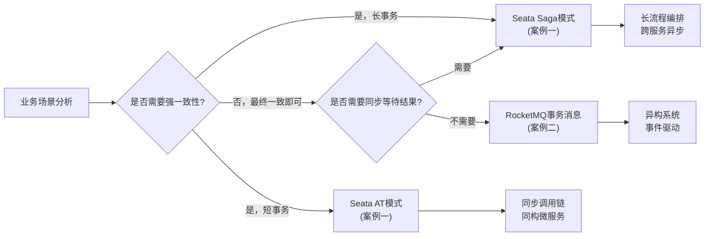

# 第55章 分布式事务：实战案例

---

## 为什么需要实战案例

理论学得再扎实，代码写不出来等于零。分布式事务的每一种模式——2PC、Saga、TCC、事务消息——都有其特定的适用场景和实现陷阱。本章通过两个高还原度的实战案例，将理论基础和核心技巧落地为可运行的生产级代码，帮助读者完成从"理解原理"到"能写出来"的跨越。

两个案例分别覆盖了分布式事务最典型的两大方向：

| 维度 | 案例一：Seata实战 | 案例二：RocketMQ事务消息实战 |
|------|-------------------|---------------------------|
| **场景** | 电商下单——订单创建 + 库存扣减 + 资金冻结 | 银行跨行转账——跨系统最终一致性 |
| **核心技术** | Seata AT模式 + Saga模式 | RocketMQ半消息 + 事务回查 |
| **一致性级别** | 强一致（AT）/ 最终一致（Saga） | 最终一致 |
| **服务耦合度** | 中（需要注册Seata TC） | 低（仅需MQ连接） |
| **适用场景** | 同构微服务间的短事务 | 异构系统间的异步消息驱动事务 |
| **学习重点** | 框架集成、undo_log机制、补偿逻辑 | 半消息原理、回查实现、幂等设计 |

---

## 案例一：Seata实战——电商订单的分布式事务实现

### 场景描述

电商平台大促期间，用户下单需要同时完成三个操作：

1. **订单服务**：创建订单记录，标记为"待支付"
2. **库存服务**：扣减对应商品的可售库存
3. **支付服务**：冻结用户账户中的对应金额

这三个操作分布在三个独立的服务和数据库中。任何一个环节失败，其他环节必须回滚，否则会出现"库存已扣但用户没付钱"或"钱被冻结但订单不存在"的脏数据。

### Seata两种模式的对比与选择

| 对比维度 | Seata AT模式 | Seata Saga模式 |
|---------|-------------|---------------|
| **工作原理** | 拦截SQL，自动生成undo_log | 定义补偿操作，状态机驱动 |
| **业务侵入** | 零侵入（仅需@GlobalTransactional注解） | 低侵入（需编写补偿逻辑） |
| **隔离性** | 读写隔离（全局锁） | 无锁（最终一致） |
| **性能** | 中（有全局锁开销） | 高（无锁） |
| **适用事务长度** | 短事务（毫秒级） | 长事务（秒到分钟级） |
| **回滚方式** | 基于undo_log自动回滚 | 基于补偿操作逆序回滚 |
| **典型场景** | 同步调用链、短事务 | 长流程编排、跨服务异步 |

### 案例覆盖内容

本案例将完整演示以下内容：

- **环境搭建**：Seata Server（TC）部署、客户端依赖配置、数据源代理配置
- **AT模式实现**：使用`@GlobalTransactional`注解实现订单创建 + 库存扣减 + 资金冻结
- **Saga模式实现**：定义Saga流程（JSON描述）、编写补偿操作、状态机驱动执行
- **异常模拟与回滚验证**：模拟库存不足、资金不足、网络超时等异常场景，验证数据一致性
- **性能测试**：对比本地事务、AT模式、Saga模式的吞吐量和延迟

### 核心代码预览

```java
// Seata AT模式——电商下单的核心入口
@Service
public class OrderService {

    @GlobalTransactional(timeoutMills = 60000, name = "create-order")
    public OrderResult createOrder(OrderCreateDTO dto) {
        // 1. 创建订单（本地事务，自动生成undo_log）
        Order order = orderMapper.create(dto);
        
        // 2. 扣减库存（远程调用，Seata自动传播全局事务上下文）
        inventoryClient.deduct(dto.getProductId(), dto.getQuantity());
        
        // 3. 冻结资金（远程调用）
        accountClient.freeze(dto.getUserId(), dto.getTotalAmount());
        
        // 如果任何一步抛出异常，Seata自动回滚所有参与者的本地事务
        return OrderResult.success(order.getOrderNo());
    }
}
```

### 学习目标

完成本案例后，读者应该能够：

1. 独立部署和配置Seata Server及客户端
2. 使用AT模式实现零侵入的分布式事务
3. 使用Saga模式处理长事务编排
4. 理解Seata的undo_log机制和全局锁原理
5. 在生产环境中选择合适的Seata事务模式

---

## 案例二：RocketMQ事务消息实战——银行跨行转账的最终一致性

### 场景描述

银行跨行转账是分布式事务最经典的场景之一：

用户A（工商银行） → 转账500元 → 用户B（建设银行）

两个银行是完全独立的系统，拥有各自的数据库和事务边界。核心矛盾是：

| 阶段 | 操作 | 风险 |
|------|------|------|
| 1 | 从A账户扣款500元 | 扣款成功后，网络断开，B账户未到账 |
| 2 | 向B账户加款500元 | 如果直接同步调用，A扣款但B加款失败，数据不一致 |
| 3 | 记录转账流水 | 流水记录失败不影响资金安全，但影响可追溯性 |

### 为什么选择RocketMQ事务消息

| 方案 | 不适用的原因 |
|------|-------------|
| 2PC/XA | 跨银行系统不可能共享事务协调器；银行系统不支持XA协议 |
| TCC | 银行系统通常不暴露"冻结/确认/取消"三个接口；对接成本极高 |
| Saga | 需要银行系统支持补偿操作（如"反向转账"），合规和审批流程不允许 |
| 本地消息表 | 可行但需要自行实现消息投递的可靠性，运维成本高 |
| **RocketMQ事务消息** | **原生支持，一次API调用即可实现本地事务与消息的原子性** |

RocketMQ事务消息的四大核心优势：

1. **原子性保证**：本地事务执行结果与消息发送结果要么都成功，要么都失败
2. **零额外存储**：不需要额外的消息表或binlog监听，Broker内部管理半消息状态
3. **回查机制**：即使协调者宕机，Broker也会主动回查本地事务状态，保证最终一致
4. **高性能**：半消息不进入消费队列，不影响消费性能；事务提交后消息投递延迟<10ms

### 案例覆盖内容

本案例从半消息原理到生产部署，完整覆盖以下内容：

**核心原理：**
- 半消息（Half Message）的存储机制和可见性控制
- 三阶段交互模型：发送半消息 → 执行本地事务 → 状态回查
- 事务回查的触发条件、间隔策略和最大次数控制

**完整实现：**
- 数据库设计：转账订单表、账户表、本地消息表、到账记录表
- TransactionListener实现：executeLocalTransaction + checkLocalTransaction
- 消费者实现：幂等消费、重试机制、死信队列处理
- Mapper层：乐观锁扣款、唯一键幂等

**异常场景处理：**
- 半消息发送失败
- 本地事务执行异常
- Commit/Rollback发送失败（Broker回查补偿）
- 生产者宕机
- 消费失败与重试
- 消费重复（幂等保障）
- Broker主从延迟

**生产级优化：**
- 消息发送可靠性配置
- 幂等性设计三种模式（唯一键/状态机/Redis锁）
- 监控指标与告警（半消息积压、回查频率、死信消息）
- 性能调优参数

### 核心代码预览

```java
// TransactionListener实现——事务消息的核心
@RocketMQTransactionListener
public class TransferTransactionListener implements RocketMQLocalTransactionListener {

    @Override
    public RocketMQLocalTransactionState executeLocalTransaction(Message msg, Object arg) {
        TransferMessage transferMsg = parseMessage(msg);
        
        try {
            // 幂等检查：防止回查重入
            if (isAlreadyDeducted(transferMsg.getOrderNo())) {
                return RocketMQLocalTransactionState.COMMIT;
            }
            
            // 执行本地事务：扣款 + 记录订单 + 记录消息状态
            // 这些操作在同一个本地数据库事务中完成
            transferService.executeLocalTransfer(transferMsg);
            
            return RocketMQLocalTransactionState.COMMIT;
        } catch (Exception e) {
            return RocketMQLocalTransactionState.UNKNOWN;
        }
    }

    @Override
    public RocketMQLocalTransactionState checkLocalTransaction(Message msg) {
        // 回查：只读查询，不修改任何状态
        String messageId = msg.getHeaders().get("id", String.class);
        return transferService.checkTransactionStatus(messageId);
    }
}
```

### 学习目标

完成本案例后，读者应该能够：

1. 理解RocketMQ半消息的内部实现原理
2. 实现TransactionListener接口处理事务消息
3. 设计完整的幂等消费方案
4. 处理死信队列和异常恢复
5. 在生产环境中部署和监控事务消息系统

---

## 两个案例的关联与递进

两个案例并非独立存在，而是构成了分布式事务方案选型的完整图谱：



**从案例一到案例二的递进关系：**

1. 案例一解决的是**同步场景**下的分布式事务：订单、库存、资金需要同时成功或失败，用户需要立即看到结果
2. 案例二解决的是**异步场景**下的分布式事务：跨银行转账不需要立即到账，允许短暂的不一致，但最终必须一致
3. 两个案例共同展示了分布式事务的**核心取舍**：一致性 vs 性能、强一致 vs 最终一致、同步 vs 异步

---

## 阅读建议

**如果你是初学者：**
- 先阅读案例一的AT模式部分，理解Seata的零侵入特性
- 再阅读案例二的原理部分，理解半消息机制
- 最后动手搭建环境，跑通两个案例的代码

**如果你是有经验的开发者：**
- 直接阅读案例二的异常场景处理和幂等设计部分，这些是生产中最容易踩坑的地方
- 对照案例一的Saga模式，思考如何在自己的项目中设计补偿逻辑

**如果你是架构师：**
- 重点关注两个案例开头的"方案选型"部分，理解为什么在这个场景下选择这种方案
- 结合本章的方案选型指南，建立分布式事务方案选择的决策框架

**动手实践的优先级：**
1. 搭建Seata Server环境，跑通AT模式的demo（30分钟）
2. 实现一个简单的RocketMQ事务消息生产者（1小时）
3. 模拟异常场景，验证数据一致性（2小时）
4. 对比AT模式和Saga模式的性能差异（1小时）

---

## 前置知识回顾

阅读本章实战案例前，建议确保掌握以下内容：

| 知识点 | 所需程度 | 对应章节 |
|--------|---------|---------|
| 2PC/3PC协议原理 | 了解 | 55.2-55.3 |
| Saga模式的补偿机制 | 熟悉 | 55.4-55.5 |
| TCC的资源预留思想 | 了解 | 55.6 |
| 事务性发件箱模式 | 熟悉 | 55.7 |
| Seata的四种事务模式 | 了解 | 55.8 |
| Saga编排器的工程实现 | 熟悉 | 55.9 |
| 消息最终一致的工程实现 | 熟悉 | 55.11 |
