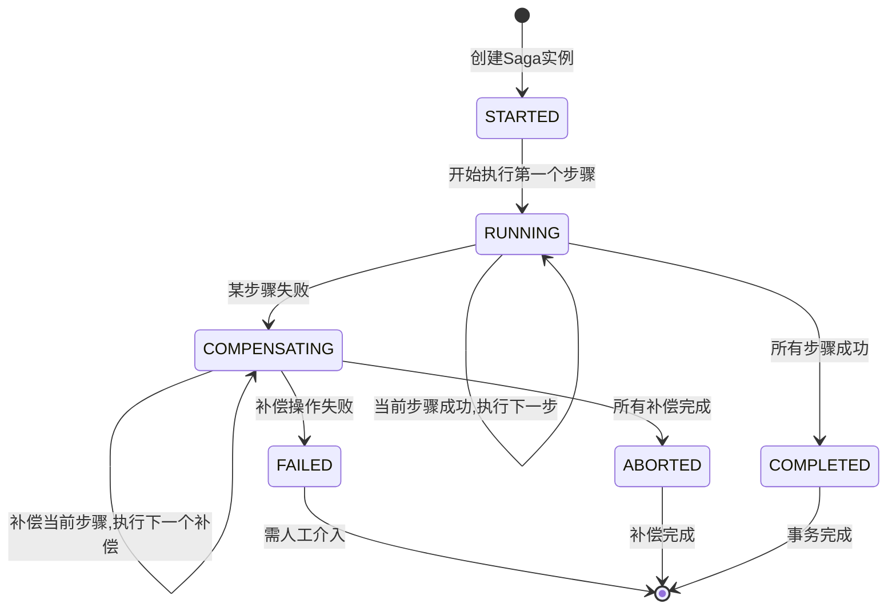

# Saga状态机：从理论模型到生产级工程实现

理论篇介绍了Saga的基本概念——将长事务拆分为短事务序列，通过补偿操作实现最终一致性。但在生产环境中，一个"理论上正确"的Saga定义距离"能稳定运行的系统"之间，隔着状态持久化、重试策略、补偿编排、并发安全、崩溃恢复等一系列工程难题。本节从零搭建一个生产级Saga状态机，逐一拆解每个关键设计决策。

## 状态机设计：从概念到可执行模型

### 状态定义

Saga状态机的核心是状态的精确定义。一个完整的Saga执行涉及两级状态：Saga整体状态和每个步骤的执行状态。

**Saga级状态**描述整个事务的宏观生命周期：

| 状态 | 含义 | 触发条件 |
|------|------|----------|
| STARTED | Saga已创建，尚未开始执行 | 编排器初始化Saga实例 |
| RUNNING | 正在按序执行步骤 | 第一个步骤开始执行 |
| COMPENSATING | 某步骤失败，正在逆序补偿 | 正向执行中某个步骤失败 |
| COMPLETED | 所有步骤成功完成 | 最后一个步骤执行成功 |
| FAILED | 补偿过程中出现不可恢复错误 | 补偿操作本身失败 |
| ABORTED | 补偿全部完成，Saga终止 | 所有补偿操作执行完毕 |

**步骤级状态**描述单个步骤的执行细节：

| 状态 | 含义 | 后续可能状态 |
|------|------|-------------|
| PENDING | 等待执行 | RUNNING |
| RUNNING | 正在执行 | SUCCEEDED, FAILED |
| SUCCEEDED | 执行成功 | — |
| FAILED | 执行失败 | — |
| COMPENSATING | 正在补偿 | COMPENSATED, COMPENSATION_FAILED |
| COMPENSATED | 补偿完成 | — |
| COMPENSATION_FAILED | 补偿失败 | — |

两级状态的组合决定了Saga的完整状态空间。理解这个状态空间是设计正确状态转换逻辑的前提。

### 状态转换图



### 状态转换的合法性校验

生产级编排器必须校验每次状态转换的合法性。非法的状态转换（如从COMPLETED转到COMPENSATING）通常意味着存在严重的并发Bug或数据损坏。建议在状态机内部加入断言检查：

```python
class StateTransitionError(Exception):
    """非法状态转换异常"""
    pass

# 合法的状态转换矩阵
VALID_TRANSITIONS = {
    SagaState.STARTED: {SagaState.RUNNING},
    SagaState.RUNNING: {SagaState.COMPENSATING, SagaState.COMPLETED},
    SagaState.COMPENSATING: {SagaState.ABORTED, SagaState.FAILED},
}

def validate_transition(current: SagaState, target: SagaState):
    if target not in VALID_TRANSITIONS.get(current, set()):
        raise StateTransitionError(
            f"非法状态转换: {current.value} → {target.value}"
        )
```

这层校验不是可有可无的防御性编程——在分布式环境下，状态机可能因为网络重试、并发竞争等原因收到重复或乱序的状态更新请求，合法转换校验是防止数据腐败的最后一道闸门。

## 执行引擎：正向执行与反向补偿

### 正向执行流程

执行引擎的核心逻辑是一个有限状态机驱动的循环。每一轮迭代执行一个步骤，根据执行结果决定状态转换方向。

```python
import asyncio
import uuid
import json
from datetime import datetime
from enum import Enum
from dataclasses import dataclass, field
from typing import Optional, Callable, Any, Awaitable, Dict, List

class SagaState(Enum):
    STARTED = "STARTED"
    RUNNING = "RUNNING"
    COMPENSATING = "COMPENSATING"
    COMPLETED = "COMPLETED"
    FAILED = "FAILED"
    ABORTED = "ABORTED"

class StepStatus(Enum):
    PENDING = "PENDING"
    RUNNING = "RUNNING"
    SUCCEEDED = "SUCCEEDED"
    FAILED = "FAILED"
    COMPENSATING = "COMPENSATING"
    COMPENSATED = "COMPENSATED"
    COMPENSATION_FAILED = "COMPENSATION_FAILED"

@dataclass
class StepDefinition:
    """Saga步骤定义"""
    name: str
    action: Callable[[dict], Awaitable[Any]]           # 正向执行逻辑
    compensation: Callable[[dict], Awaitable[Any]]     # 补偿执行逻辑
    retry_count: int = 3                                # 最大重试次数
    retry_delay: float = 1.0                            # 初始重试延迟(秒)
    retry_backoff: str = "exponential"                  # 退避策略
    timeout: float = 30.0                               # 步骤超时时间(秒)
    idempotency_key_extractor: Optional[Callable] = None  # 幂等键提取器

@dataclass
class StepExecution:
    """步骤执行记录"""
    name: str
    status: StepStatus = StepStatus.PENDING
    result: Any = None
    error: Optional[str] = None
    attempts: int = 0
    started_at: Optional[datetime] = None
    completed_at: Optional[datetime] = None

@dataclass
class SagaInstance:
    """Saga运行实例"""
    saga_id: str
    saga_name: str
    state: SagaState = SagaState.STARTED
    context: Dict = field(default_factory=dict)
    steps: List[StepExecution] = field(default_factory=list)
    current_step_index: int = 0
    version: int = 0                    # 乐观锁版本号
    created_at: datetime = field(default_factory=datetime.utcnow)
    updated_at: datetime = field(default_factory=datetime.utcnow)

class SagaOrchestrator:
    """生产级Saga编排器"""

    def __init__(self, state_store: 'SagaStateStore', metrics: 'SagaMetrics' = None):
        self.state_store = state_store
        self.metrics = metrics or NullSagaMetrics()

    async def execute(self, instance: SagaInstance, definitions: List[StepDefinition]) -> SagaInstance:
        """执行Saga的主流程"""
        # 状态转换: STARTED → RUNNING
        instance.state = SagaState.RUNNING
        instance.current_step_index = 0
        await self.state_store.save(instance)

        # 正向执行所有步骤
        for i, step_def in enumerate(definitions):
            instance.current_step_index = i
            step_exec = StepExecution(name=step_def.name)
            instance.steps.append(step_exec)

            success = await self._execute_step_with_retry(instance, step_def, step_exec)

            if not success:
                # 步骤失败,进入补偿流程
                instance.state = SagaState.COMPENSATING
                await self.state_store.save(instance)
                await self._compensate(instance, definitions, failed_index=i)
                return instance

            # 步骤成功,持久化状态
            await self.state_store.save(instance)

        # 所有步骤成功
        instance.state = SagaState.COMPLETED
        await self.state_store.save(instance)
        return instance

    async def _execute_step_with_retry(
        self, instance: SagaInstance, step_def: StepDefinition, step_exec: StepExecution
    ) -> bool:
        """带重试的步骤执行"""
        step_exec.status = StepStatus.RUNNING
        step_exec.started_at = datetime.utcnow()

        for attempt in range(1, step_def.retry_count + 1):
            step_exec.attempts = attempt

            try:
                result = await asyncio.wait_for(
                    step_def.action(instance.context),
                    timeout=step_def.timeout
                )
                # 步骤成功
                step_exec.status = StepStatus.SUCCEEDED
                step_exec.result = result
                step_exec.completed_at = datetime.utcnow()
                instance.context[f"{step_def.name}_result"] = result
                self.metrics.step_succeeded(instance.saga_id, step_def.name, attempt)
                return True

            except asyncio.TimeoutError:
                error_msg = f"步骤 '{step_def.name}' 执行超时 ({step_def.timeout}s)"
                step_exec.error = error_msg
                self.metrics.step_timeout(instance.saga_id, step_def.name)

            except Exception as e:
                error_msg = f"步骤 '{step_def.name}' 执行失败: {str(e)}"
                step_exec.error = error_msg

                # 确定性故障不重试
                if self._is_deterministic_failure(e):
                    self.metrics.step_deterministic_failure(instance.saga_id, step_def.name)
                    break

            # 计算退避延迟
            if attempt < step_def.retry_count:
                delay = self._calculate_backoff(step_def.retry_delay, attempt, step_def.retry_backoff)
                await asyncio.sleep(delay)

        # 所有重试耗尽
        step_exec.status = StepStatus.FAILED
        step_exec.completed_at = datetime.utcnow()
        self.metrics.step_failed(instance.saga_id, step_def.name, step_exec.attempts)
        return False

    async def _compensate(
        self, instance: SagaInstance, definitions: List[StepDefinition], failed_index: int
    ):
        """逆序补偿已执行的步骤"""
        # 收集需要补偿的步骤（只补偿已成功执行的）
        steps_to_compensate = []
        for i in range(failed_index - 1, -1, -1):
            step_exec = instance.steps[i]
            if step_exec.status == StepStatus.SUCCEEDED:
                steps_to_compensate.append((i, definitions[i], step_exec))

        for idx, step_def, step_exec in steps_to_compensate:
            step_exec.status = StepStatus.COMPENSATING
            await self.state_store.save(instance)

            success = await self._compensate_step(instance, step_def, step_exec)

            if not success:
                # 补偿失败,Saga进入FAILED状态
                instance.state = SagaState.FAILED
                await self.state_store.save(instance)
                self.metrics.compensation_failed(instance.saga_id, step_def.name)
                return

            step_exec.status = StepStatus.COMPENSATED
            await self.state_store.save(instance)

        # 所有补偿完成
        instance.state = SagaState.ABORTED
        await self.state_store.save(instance)
        self.metrics.saga_aborted(instance.saga_id)

    async def _compensate_step(
        self, instance: SagaInstance, step_def: StepDefinition, step_exec: StepExecution
    ) -> bool:
        """执行单个步骤的补偿操作（带重试）"""
        for attempt in range(1, step_def.retry_count + 1):
            try:
                await asyncio.wait_for(
                    step_def.compensation(instance.context),
                    timeout=step_def.timeout
                )
                return True
            except Exception as e:
                if attempt >= step_def.retry_count:
                    step_exec.error = f"补偿失败: {str(e)}"
                    return False
                delay = self._calculate_backoff(step_def.retry_delay, attempt, step_def.retry_backoff)
                await asyncio.sleep(delay)
        return False

    def _is_deterministic_failure(self, error: Exception) -> bool:
        """判断是否为确定性故障（不应重试）"""
        # 业务异常、参数错误等不应重试
        deterministic_types = (
            ValueError,           # 参数错误
            PermissionError,      # 权限不足
        )
        if isinstance(error, deterministic_types):
            return True
        # HTTP 4xx 等可通过异常类型判断
        if hasattr(error, 'status_code'):
            return 400 <= error.status_code < 500
        return False

    def _calculate_backoff(self, base_delay: float, attempt: int, strategy: str) -> float:
        """计算退避延迟"""
        if strategy == "exponential":
            return base_delay * (2 ** (attempt - 1))
        elif strategy == "linear":
            return base_delay * attempt
        else:
            return base_delay
```

### 关键设计决策解析

**为什么要步骤前后各持久化一次？** 因为编排器可能在任何时刻崩溃。如果只在步骤完成后持久化，崩溃恢复时无法判断"这个步骤到底有没有开始执行"——是该重试还是跳过？前后各写一次，崩溃恢复时看到RUNNING状态就知道需要重试，看到SUCCEEDED就知道可以跳过。

**为什么补偿也需要重试？** 补偿操作和正向操作面临完全相同的基础设施风险——网络超时、数据库连接池耗尽、服务暂时不可用。如果补偿因为暂时性故障失败就放弃，系统将停留在不一致状态。补偿的重试策略可以更激进（更多的重试次数、更长的超时时间），因为此时已经没有正向操作在竞争资源。

**为什么补偿重试次数可以和正向操作不同？** 正向操作通常有明确的业务超时要求（用户不愿等太久），而补偿操作没有用户在等待，可以容忍更长的执行时间。生产实践中通常将补偿的重试次数设为正向操作的2-3倍。

## 状态持久化：崩溃恢复的基础

### 存储方案选型

| 存储方案 | 一致性 | 性能 | 运维复杂度 | 适用场景 |
|----------|--------|------|-----------|----------|
| 关系型数据库 | 强 | 中 | 低 | Saga步骤少（<10），并发低 |
| Redis | 最终一致 | 高 | 中 | 高并发、低延迟要求 |
| MongoDB | 最终一致 | 中高 | 中 | 上下文数据结构复杂 |
| ZooKeeper | 强 | 低 | 高 | 极端一致性要求 |

生产中最常见的选择是关系型数据库——Saga的执行频率通常不会太高（不像热点缓存那样每秒数万次），但对一致性的要求很高。MySQL/PostgreSQL完全能满足需求，且运维成本最低。

### 数据库表设计

```sql
CREATE TABLE saga_instance (
    id BIGINT AUTO_INCREMENT PRIMARY KEY,
    saga_id VARCHAR(64) NOT NULL,           -- Saga全局唯一ID
    saga_name VARCHAR(128) NOT NULL,         -- Saga类型名称
    state VARCHAR(32) NOT NULL,              -- Saga级状态
    context JSON NOT NULL,                   -- 执行上下文(序列化)
    current_step_index INT NOT NULL DEFAULT 0,
    version INT NOT NULL DEFAULT 0,          -- 乐观锁版本号
    created_at DATETIME NOT NULL,
    updated_at DATETIME NOT NULL,
    completed_at DATETIME DEFAULT NULL,      -- 完成/终止时间
    UNIQUE KEY uk_saga_id (saga_id),
    INDEX idx_state (state),
    INDEX idx_created_at (created_at)
);

CREATE TABLE saga_step_execution (
    id BIGINT AUTO_INCREMENT PRIMARY KEY,
    saga_id VARCHAR(64) NOT NULL,            -- 关联的Saga ID
    step_name VARCHAR(128) NOT NULL,         -- 步骤名称
    step_index INT NOT NULL,                 -- 步骤顺序号
    status VARCHAR(32) NOT NULL,             -- 步骤级状态
    result JSON DEFAULT NULL,                -- 执行结果
    error TEXT DEFAULT NULL,                 -- 错误信息
    attempts INT NOT NULL DEFAULT 0,         -- 尝试次数
    started_at DATETIME DEFAULT NULL,
    completed_at DATETIME DEFAULT NULL,
    INDEX idx_saga_id (saga_id),
    UNIQUE KEY uk_saga_step (saga_id, step_index)
);
```

### 崩溃恢复流程

编排器启动时，扫描处于非终态（非COMPLETED、非ABORTED、非FAILED）的Saga实例，根据其状态决定恢复策略：

```python
class SagaRecoveryManager:
    """Saga崩溃恢复管理器"""

    def __init__(self, orchestrator: SagaOrchestrator, state_store: SagaStateStore):
        self.orchestrator = orchestrator
        self.state_store = state_store

    async def recover_incomplete_sagas(self):
        """恢复所有未完成的Saga"""
        incomplete = await self.state_store.find_incomplete()
        for instance in incomplete:
            await self._recover_one(instance)

    async def _recover_one(self, instance: SagaInstance):
        """恢复单个Saga实例"""
        if instance.state == SagaState.RUNNING:
            # 正向执行中断: 找到最后一个RUNNING状态的步骤
            last_running = self._find_last_running_step(instance)
            if last_running and last_running.status == StepStatus.RUNNING:
                # 步骤在执行中崩溃,重新执行该步骤
                last_running.status = StepStatus.PENDING
                last_running.error = "崩溃恢复: 步骤执行中断"
            # 从断点继续执行
            definitions = self._load_definitions(instance.saga_name)
            await self.orchestrator.resume_from_step(instance, definitions, instance.current_step_index)

        elif instance.state == SagaState.COMPENSATING:
            # 补偿中断: 找到最后一个RUNNING状态的补偿步骤
            last_running = self._find_last_compensating_step(instance)
            if last_running:
                last_running.status = StepStatus.SUCCEEDED  # 假设之前的补偿已完成
            # 继续补偿
            definitions = self._load_definitions(instance.saga_name)
            await self.orchestrator.resume_compensation(instance, definitions)

    def _find_last_running_step(self, instance: SagaInstance) -> Optional[StepExecution]:
        """找到最后一个RUNNING状态的步骤"""
        for step in reversed(instance.steps):
            if step.status == StepStatus.RUNNING:
                return step
        return None

    def _find_last_compensating_step(self, instance: SagaInstance) -> Optional[StepExecution]:
        """找到最后一个COMPENSATING状态的步骤"""
        for step in reversed(instance.steps):
            if step.status == StepStatus.COMPENSATING:
                return step
        return None
```

恢复策略的核心原则是"宁可多执行一次，不可遗漏执行"——所有操作（正向和补偿）都必须是幂等的，这样才能安全地重试。

## 并发控制：多实例下的安全执行

### 分布式锁

当Saga编排器部署为多实例时，同一个Saga实例可能被两个实例同时拾取并执行。分布式锁确保同一时刻只有一个实例在执行某个Saga。

```python
import redis.asyncio as redis

class DistributedSagaLock:
    """基于Redis的Saga分布式锁"""

    def __init__(self, redis_client: redis.Redis):
        self.redis = redis_client

    async def acquire(self, saga_id: str, holder_id: str, ttl_seconds: int = 60) -> bool:
        """获取Saga执行锁"""
        lock_key = f"saga:lock:{saga_id}"
        return await self.redis.set(lock_key, holder_id, nx=True, ex=ttl_seconds)

    async def release(self, saga_id: str, holder_id: str) -> bool:
        """释放Saga执行锁"""
        lock_key = f"saga:lock:{saga_id}"
        # 使用Lua脚本保证原子性: 只有持有者才能释放
        lua_script = """
        if redis.call("get", KEYS[1]) == ARGV[1] then
            return redis.call("del", KEYS[1])
        else
            return 0
        end
        """
        result = await self.redis.eval(lua_script, 1, lock_key, holder_id)
        return result == 1
```

### 乐观并发控制

对于Saga状态更新，乐观锁比悲观锁更适合——Saga的执行频率不高，锁竞争概率低，乐观锁的开销更小。

```python
async def save_with_optimistic_lock(self, instance: SagaInstance):
    """使用乐观锁保存Saga状态"""
    new_version = instance.version + 1
    result = await self.db.execute(
        """UPDATE saga_instance
           SET state = %s, context = %s, current_step_index = %s,
               version = %s, updated_at = NOW()
           WHERE saga_id = %s AND version = %s""",
        (instance.state.value, json.dumps(instance.context),
         instance.current_step_index, new_version,
         instance.saga_id, instance.version)
    )
    if result.rowcount == 0:
        raise ConcurrencyConflictError(
            f"Saga {instance.saga_id} 并发冲突: 版本 {instance.version} 已过期"
        )
    instance.version = new_version
```

### 幂等性设计

幂等性是并发安全的基石。Saga中需要幂等的场景：

| 场景 | 风险 | 幂等实现 |
|------|------|----------|
| 正向步骤执行 | 网络重试导致重复调用 | 幂等键 + 去重表 |
| 补偿步骤执行 | 重试导致重复补偿 | 状态检查 + 唯一约束 |
| 状态持久化 | 并发写入覆盖 | 乐观锁版本号 |
| 崩溃恢复 | 重复执行已执行的步骤 | 状态机判断步骤是否已执行 |

幂等键的典型提取方式：

```python
# 方式一: 使用业务ID作为幂等键
idempotency_key_extractor=lambda ctx: ctx["order_id"]

# 方式二: 使用Saga ID + 步骤名组合
idempotency_key_extractor=lambda ctx: f"{ctx['saga_id']}:deduct_inventory"

# 方式三: 使用业务操作的唯一约束
# 例如: 订单号唯一索引, 转账流水号唯一索引
```

## 重试策略的工程细节

### 故障分类与重试决策

```python
class RetryDecider:
    """重试决策器: 根据异常类型决定是否重试"""

    RETRYABLE_EXCEPTIONS = (
        ConnectionError,        # 网络连接失败
        TimeoutError,          # 超时
        ConnectionRefusedError # 服务拒绝连接
    )

    NON_RETRYABLE_EXCEPTIONS = (
        ValueError,            # 参数校验失败
        PermissionError,       # 权限不足
        KeyError,              # 缺少必要字段
    )

    @staticmethod
    def should_retry(error: Exception, status_code: int = None) -> bool:
        """判断是否应该重试"""
        # 确定性故障: 不重试
        if isinstance(error, RetryDecider.NON_RETRYABLE_EXCEPTIONS):
            return False

        # HTTP状态码判断
        if status_code is not None:
            if 400 <= status_code < 500:  # 4xx客户端错误
                return False
            if status_code == 404:        # 资源不存在
                return False
            if status_code == 429:        # 限流,应该重试但需要退避
                return True

        # 暂时性故障: 重试
        if isinstance(error, RetryDecider.RETRYABLE_EXCEPTIONS):
            return True

        # 默认: 不重试（保守策略）
        return False
```

### 退避策略对比

| 策略 | 公式 | 特点 | 适用场景 |
|------|------|------|----------|
| 固定延迟 | delay = base | 简单，但可能加剧竞争 | 低并发、非共享资源 |
| 线性退避 | delay = base × attempt | 均匀分散重试请求 | 中等并发 |
| 指数退避 | delay = base × 2^(attempt-1) | 快速拉开重试间隔 | 高并发、共享资源 |
| 指数退避+抖动 | delay = base × 2^(attempt-1) + random | 避免惊群效应 | 多实例同时重试 |

生产建议：**指数退避 + 随机抖动**。多个Saga实例同时重试时，纯指数退避会导致请求在同一时刻集中到达，形成"惊群效应"。加入随机抖动可以将重试请求均匀分散在时间窗口内。

```python
import random

def calculate_backoff_with_jitter(
    base_delay: float, attempt: int, max_delay: float = 30.0
) -> float:
    """指数退避 + 随机抖动"""
    exponential_delay = base_delay * (2 ** (attempt - 1))
    jitter = random.uniform(0, exponential_delay * 0.5)
    return min(exponential_delay + jitter, max_delay)
```

## 上下文管理：步骤间的数据传递

### 上下文设计原则

Saga上下文（Context）是步骤之间传递数据的载体。设计良好的上下文能减少步骤间的耦合，提高可维护性。

**原则一：只存必要的数据。** 上下文会被序列化存储到数据库，过大的上下文会增加存储和传输开销。只存步骤间确实需要传递的数据。

**原则二：明确数据来源。** 每个字段都应该有明确的产生者（哪个步骤写入）和消费者（哪个步骤读入）。避免隐式依赖。

**原则三：补偿不依赖其他步骤的运行时状态。** 补偿操作执行时，其他服务的状态可能已经改变。补偿应该使用Saga上下文中的快照数据，而不是实时查询。

```python
# 上下文结构示例: 电商下单Saga
context = {
    # 全局标识
    "saga_id": "saga-20260626-001",
    "order_id": "ORD-20260626-0001",
    "user_id": "U-12345",

    # 步骤产出数据
    "create_order_result": {"order_id": "ORD-20260626-0001", "status": "CREATED"},
    "deduct_inventory_result": {"deducted": 2, "remaining": 8},
    "freeze_payment_result": {"frozen_amount": 199.00, "frozen_id": "FZ-001"},

    # 业务参数
    "product_id": "P-67890",
    "quantity": 2,
    "total_amount": 199.00,

    # 快照数据（用于补偿）
    "inventory_snapshot": {"before": 10, "after": 8},
    "balance_snapshot": {"before": 500.00, "after": 301.00}
}
```

### 上下文快照机制

对于需要精确回滚的场景，可以在每个步骤执行前自动保存上下文快照：

```python
class ContextSnapshotManager:
    """上下文快照管理器"""

    def __init__(self):
        self.snapshots: Dict[str, Dict] = {}

    def take_snapshot(self, step_name: str, context: Dict):
        """执行前保存快照"""
        self.snapshots[step_name] = json.loads(json.dumps(context))

    def restore_snapshot(self, step_name: str, context: Dict) -> Dict:
        """恢复到指定步骤执行前的状态"""
        if step_name in self.snapshots:
            return self.snapshots[step_name]
        return context
```

## 可观测性：监控、日志与追踪

### 监控指标

Saga状态机需要采集的关键指标：

| 指标 | 类型 | 告警阈值 | 含义 |
|------|------|----------|------|
| saga_started_total | Counter | — | Saga启动总数 |
| saga_completed_total | Counter | — | Saga成功完成总数 |
| saga_failed_total | Counter | > 10/min | Saga失败总数（含补偿失败） |
| saga_duration_seconds | Histogram | p99 > 30s | Saga端到端执行时间 |
| saga_compensation_rate | Gauge | > 5% | 补偿率 = 补偿次数 / 总执行次数 |
| saga_step_retry_total | Counter | — | 步骤重试总次数 |
| saga_step_timeout_total | Counter | > 5/min | 步骤超时总次数 |
| saga_stuck_total | Gauge | > 0 | 卡住的Saga（STARTED/RUNNING超过阈值时间） |

补偿率是最值得关注的指标。正常的补偿率应该在1%-3%之间。如果补偿率突然升高，说明某个下游服务出现了问题；如果补偿率持续为0，可能是补偿逻辑没有正确执行（补偿遗漏）。

### 结构化日志

```python
import structlog

logger = structlog.get_logger("saga")

def log_saga_event(event_type: str, saga_id: str, **kwargs):
    """统一的Saga日志格式"""
    logger.info(
        event_type,
        saga_id=saga_id,
        timestamp=datetime.utcnow().isoformat(),
        **kwargs
    )

# 使用示例
log_saga_event(
    "saga_step_executed",
    saga_id="saga-001",
    step_name="deduct_inventory",
    status="SUCCEEDED",
    duration_ms=120,
    attempt=1
)
```

### 分布式追踪

将Saga ID注入到分布式追踪的Trace Context中，可以实现从Saga维度查看完整的调用链路：

```python
from opentelemetry import trace

async def execute_step_with_tracing(self, step_def, instance):
    tracer = trace.get_tracer("saga-orchestrator")
    with tracer.start_as_current_span(
        f"saga.{step_def.name}",
        attributes={
            "saga.id": instance.saga_id,
            "saga.step": step_def.name,
            "saga.step_index": instance.current_step_index,
        }
    ) as span:
        try:
            result = await step_def.action(instance.context)
            span.set_status(trace.StatusCode.OK)
            return result
        except Exception as e:
            span.set_status(trace.StatusCode.ERROR, str(e))
            raise
```

## 常见陷阱与应对

### 陷阱一：补偿遗漏

开发者在编写正向逻辑时往往不会同步编写补偿逻辑。防御措施：

1. **编排器启动时校验**：检查每个步骤是否都注册了补偿操作，缺少补偿的步骤拒绝执行
2. **代码审查清单**：将"是否编写了补偿逻辑"纳入Code Review检查项
3. **补偿覆盖率告警**：监控每个Saga类型的补偿覆盖率，覆盖率突变触发告警

### 陷阱二：补偿操作依赖外部服务

如果退款补偿需要调用支付网关，而网关此时不可用，补偿就会失败。应对策略：

- **异步补偿队列**：补偿请求进入队列，服务恢复后自动执行
- **本地事务优先**：补偿操作优先使用本地数据库事务完成，减少外部依赖
- **降级策略**：支付网关不可用时，记录待补偿标记，等恢复后批量处理

### 陷阱三：Saga执行记录无限增长

随着时间推移，Saga执行记录会越来越多。处理策略：

```sql
-- 定期清理已完成的Saga记录（保留90天）
DELETE FROM saga_step_execution
WHERE saga_id IN (
    SELECT saga_id FROM saga_instance
    WHERE state IN ('COMPLETED', 'ABORTED', 'FAILED')
      AND completed_at < DATE_SUB(NOW(), INTERVAL 90 DAY)
);

DELETE FROM saga_instance
WHERE state IN ('COMPLETED', 'ABORTED', 'FAILED')
  AND completed_at < DATE_SUB(NOW(), INTERVAL 90 DAY);
```

### 陷阱四：补偿顺序依赖

理论上补偿操作应该不依赖执行顺序，但实践中常常不是这样。例如：先扣库存再冻结资金，补偿时应该先解冻资金再恢复库存（逆序），因为资金解冻失败的影响比库存恢复失败更严重。设计原则：**补偿顺序反映业务风险的优先级**。

## 与理论模型的映射

最后，将本节的工程实现映射回理论模型，帮助读者建立完整的知识链路：

| 理论概念 | 工程实现 | 对应代码 |
|----------|----------|----------|
| 子事务 Ti | StepDefinition + action | 每个步骤的执行逻辑 |
| 补偿事务 Ci | StepDefinition + compensation | 每个步骤的补偿逻辑 |
| 正向恢复 | 重试机制 + 退避策略 | `_execute_step_with_retry` |
| 后向补偿 | 逆序补偿流程 | `_compensate` |
| Saga状态机 | SagaState + 状态转换校验 | `VALID_TRANSITIONS` |
| 编排式协调 | SagaOrchestrator | `execute` 主流程 |
| 协同式协调 | 事件驱动 + 消息总线 | 本节未涉及（适用于步骤少的场景） |
| 状态持久化 | saga_instance + saga_step_execution 表 | `state_store.save` |
| 并发控制 | 分布式锁 + 乐观锁 | `DistributedSagaLock` |

## 小结

Saga状态机是分布式事务中使用最广泛的模式，其工程实现的核心挑战在于：状态的精确定义与持久化、执行引擎的正向推进与反向补偿、崩溃恢复的断点续传、多实例下的并发安全、以及全链路的可观测性。理解每个设计决策背后的权衡，才能在生产环境中正确使用Saga模式。

状态机不是一成不变的模板——不同的业务场景可能需要扩展状态（如增加SUSPENDED暂停状态、增加TIMED_OUT超时状态）。核心原则不变：**每个状态转换都有明确的触发条件，每次转换都有持久化保证，每个操作都支持幂等重试。**
