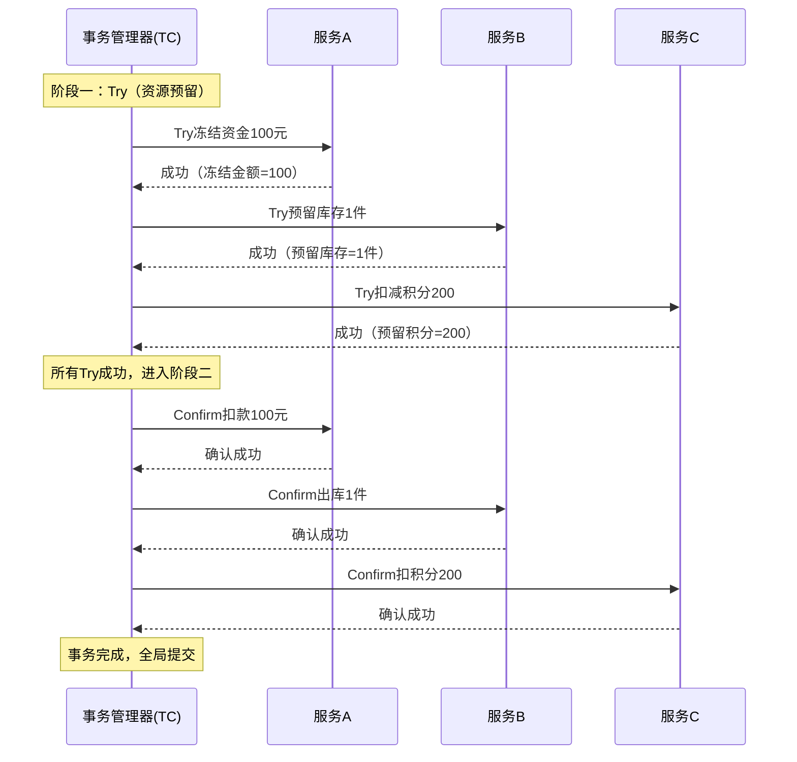
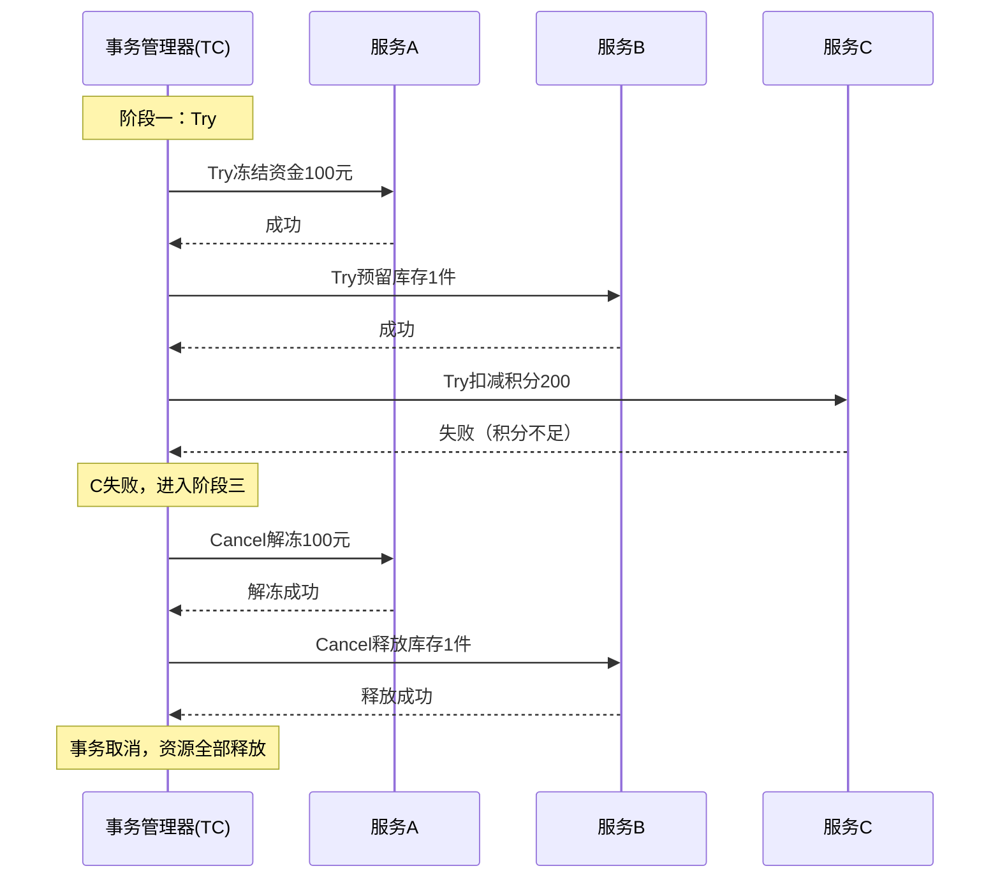
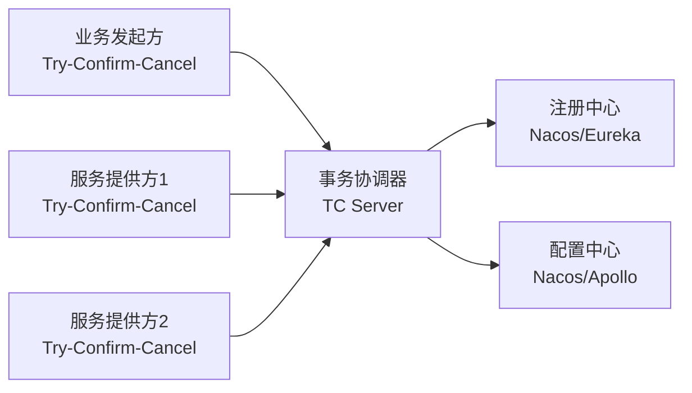
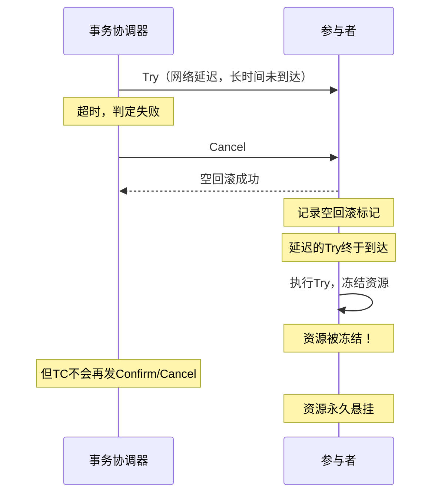

## TCC资源预留：分布式事务的核心利器

TCC（Try-Confirm-Cancel）是一种业务层面的分布式事务解决方案，通过**资源预留**机制，在不锁定数据库资源的前提下实现跨服务的最终一致性。与传统的2PC/XA方案相比，TCC将事务控制权从业务框架交还给开发者，以更大的灵活性换取更高的性能和可用性。本节将从原理到实战，全面剖析TCC的核心机制。

---

### 一、TCC的基本原理

#### 1.1 什么是TCC

TCC是Try-Confirm-Cancel三个英文单词的首字母缩写，由Pat Helland在2007年发表的论文《Life beyond Distributed Transactions: an Apostate's Opinion》中提出的思想演化而来。其核心理念是：**将一个分布式事务拆分为三个阶段，每个阶段都是本地事务，通过业务逻辑而非数据库锁来保证一致性。**

与2PC由事务协调器驱动数据库锁不同，TCC完全在应用层实现：

- **Try（尝试/预留）**：检查业务可行性，预留必要的资源。不是真正的业务操作，而是"冻结"资源。
- **Confirm（确认/提交）**：在所有Try都成功后，使用预留的资源执行真正的业务操作。Confirm必须是幂等的。
- **Cancel（取消/回滚）**：在任何一个Try失败时，释放所有已预留的资源。Cancel也必须是幂等的。

#### 1.2 TCC三阶段详解



如果任何一个Try失败，流程变为：



#### 1.3 TCC的本质：业务补偿型事务

TCC的本质是一种**业务补偿型**分布式事务。它与Saga模式的主要区别在于：

| 对比维度 | TCC | Saga |
|---------|-----|------|
| 事务粒度 | Try阶段预留资源，粒度更细 | 直接执行业务，事后补偿 |
| 隔离性 | Try阶段实现软隔离，其他事务看到"冻结"状态 | 无隔离，中间状态对外可见 |
| 资源占用 | Try阶段不锁定数据库资源 | 补偿操作可能涉及复杂的反向逻辑 |
| 一致性 | 强一致（Try全部成功才Confirm） | 最终一致（补偿可能延迟） |
| 业务侵入 | 高（需要实现三个接口） | 中（需要实现正向+补偿接口） |
| 适用场景 | 资金、库存等需要预留的场景 | 长事务、跨多系统的编排场景 |

---

### 二、资源预留机制深度解析

#### 2.1 资源预留的数据库设计

TCC的资源预留需要对数据库表进行改造，增加**冻结字段**来记录预留状态。这是TCC方案落地的基础。

以电商扣款为例，原始账户表：

```sql
-- 原始表结构
CREATE TABLE t_account (
    id BIGINT PRIMARY KEY AUTO_INCREMENT,
    user_id BIGINT NOT NULL,
    balance DECIMAL(18,2) NOT NULL DEFAULT 0.00,
    frozen_amount DECIMAL(18,2) NOT NULL DEFAULT 0.00,
    update_time TIMESTAMP DEFAULT CURRENT_TIMESTAMP ON UPDATE CURRENT_TIMESTAMP,
    UNIQUE KEY uk_user_id (user_id)
);
```

其中 `balance` 是可用余额，`frozen_amount` 是冻结金额。两者之和才是账户的"真实总额"。

业务规则：
- `可用余额 >= 0`（不允许透支）
- `冻结金额 >= 0`
- 真实总额 = balance + frozen_amount

#### 2.2 三个阶段的SQL实现

**Try阶段 — 冻结资源：**

```sql
-- Try：检查余额是否充足，并冻结资金
UPDATE t_account
SET frozen_amount = frozen_amount + #{tryAmount},
    balance = balance - #{tryAmount}
WHERE user_id = #{userId}
  AND balance >= #{tryAmount};
-- 如果影响行数为0，说明余额不足，Try失败
```

这里的关键点是：Try使用 `UPDATE` 而非 `SELECT`，通过SQL的原子性同时完成"检查"和"预留"。如果只用 `SELECT` 检查再 `UPDATE`，在并发场景下会出现竞态条件。

**Confirm阶段 — 确认扣款：**

```sql
-- Confirm：将冻结金额确认为真正的扣款
UPDATE t_account
SET frozen_amount = frozen_amount - #{confirmAmount}
WHERE user_id = #{userId}
  AND frozen_amount >= #{confirmAmount};
-- 确认后：balance不变（已在Try阶段扣减），frozen_amount减少
```

**Cancel阶段 — 释放冻结：**

```sql
-- Cancel：释放冻结，恢复可用余额
UPDATE t_account
SET balance = balance + #{cancelAmount},
    frozen_amount = frozen_amount - #{cancelAmount}
WHERE user_id = #{userId}
  AND frozen_amount >= #{cancelAmount};
-- 解冻后：balance增加（恢复），frozen_amount减少
```

#### 2.3 冻结字段的设计模式对比

不同业务场景下，冻结字段的设计模式有所不同：

| 模式 | 适用场景 | 字段设计 | 示例 |
|------|---------|---------|------|
| 金额冻结 | 资金扣减 | `frozen_amount` | 账户余额冻结 |
| 数量冻结 | 库存扣减 | `frozen_quantity` | 商品库存预留 |
| 状态冻结 | 订单锁定 | `status + lock_flag` | 订单状态标记为"处理中" |
| 时间冻结 | 资源占用 | `reserved_until` | 会议室预定、座位锁定 |
| 组合冻结 | 复合资源 | 多字段联合 | 机酒套餐（机票+酒店同时冻结） |

---

### 三、TCC框架实战：以Seata为例

#### 3.1 Seata TCC架构

Seata是目前最主流的分布式事务框架之一，原生支持TCC模式。其TCC架构包含三个核心角色：



- **TC（Transaction Coordinator）**：事务协调器，负责驱动全局事务的提交和回滚。Seata Server独立部署。
- **TM（Transaction Manager）**：事务管理器，发起全局事务的开启、提交和回滚。
- **RM（Resource Manager）**：资源管理器，管理分支事务的Try/Confirm/Cancel。

#### 3.2 Seata TCC完整示例

以"转账"场景为例，跨两个银行账户进行资金划转：

**第一步：定义TCC接口**

```java
@LocalTCC
public interface TransferTccAction {

    @TwoPhaseBusinessAction(
        name = "transferDebit",
        commitMethod = "confirm",
        rollbackMethod = "cancel"
    )
    boolean tryDebit(
        @BusinessActionContextParameter(paramName = "userId") Long userId,
        @BusinessActionContextParameter(paramName = "amount") BigDecimal amount
    );

    boolean confirm(BusinessActionContext context);
    boolean cancel(BusinessActionContext context);
}
```

**第二步：实现Try逻辑**

```java
@Component
public class TransferTccActionImpl implements TransferTccAction {

    @Override
    @Transactional
    public boolean tryDebit(Long userId, BigDecimal amount) {
        // 1. 查询当前余额
        Account account = accountMapper.selectByUserId(userId);

        // 2. 检查余额是否充足
        if (account.getBalance().compareTo(amount) < 0) {
            throw new TccBusinessException("余额不足");
        }

        // 3. 冻结资金（Try核心操作）
        int rows = accountMapper.freezeAmount(userId, amount);
        if (rows == 0) {
            throw new TccBusinessException("冻结失败，并发冲突");
        }

        // 4. 记录冻结流水（用于幂等判断）
        FreezeRecord record = new FreezeRecord();
        record.setUserId(userId);
        record.setAmount(amount);
        record.setXid(context.getXid());
        record.setStatus("TRY");
        freezeRecordMapper.insert(record);

        return true;
    }
}
```

**第三步：实现Confirm逻辑**

```java
    @Override
    @Transactional
    public boolean confirm(BusinessActionContext context) {
        Long userId = Long.parseLong(context.getActionContext("userId").toString());
        BigDecimal amount = new BigDecimal(context.getActionContext("amount").toString());
        String xid = context.getXid();

        // 幂等检查：防止重复Confirm
        FreezeRecord record = freezeRecordMapper.selectByXid(xid, userId);
        if (record == null || "CONFIRMED".equals(record.getStatus())) {
            return true; // 已处理过，直接返回
        }

        // 确认扣款：减少冻结金额（balance已在Try阶段扣减）
        int rows = accountMapper.confirmDeduction(userId, amount);
        if (rows == 0) {
            throw new TccBusinessException("确认扣款失败");
        }

        // 更新流水状态
        freezeRecordMapper.updateStatus(xid, userId, "CONFIRMED");
        return true;
    }
```

**第四步：实现Cancel逻辑**

```java
    @Override
    @Transactional
    public boolean cancel(BusinessActionContext context) {
        Long userId = Long.parseLong(context.getActionContext("userId").toString());
        BigDecimal amount = new BigDecimal(context.getActionContext("amount").toString());
        String xid = context.getXid();

        // 幂等检查：防止重复Cancel
        FreezeRecord record = freezeRecordMapper.selectByXid(xid, userId);
        if (record == null || "CANCELLED".equals(record.getStatus())) {
            return true; // 已处理过或Try未执行，直接返回
        }

        // 释放冻结资金：增加可用余额，减少冻结金额
        int rows = accountMapper.releaseFrozen(userId, amount);
        if (rows == 0) {
            throw new TccBusinessException("释放冻结失败");
        }

        // 更新流水状态
        freezeRecordMapper.updateStatus(xid, userId, "CANCELLED");
        return true;
    }
```

#### 3.3 TCC接口的幂等性实现策略

幂等性是TCC的**生命线**。Confirm和Cancel可能被TC重复调用（网络抖动、TC重试等），必须保证多次执行结果一致。

常见的幂等实现方式：

```java
// 策略1：基于全局事务ID（XID）去重
// 每个分支事务以XID为幂等键，记录执行状态
if (freezeRecordMapper.existsByXid(xid, userId, "CONFIRMED")) {
    return true; // 已Confirm，跳过
}

// 策略2：基于数据库唯一索引
// 插入流水时使用唯一约束，重复插入自动失败
@Insert("INSERT INTO t_operation_log (xid, user_id, action) VALUES (#{xid}, #{userId}, #{action})")
@Options(useGeneratedKeys = false)
int insertLog(@Param("xid") String xid, @Param("userId") Long userId, @Param("action") String action);
// 唯一索引：UNIQUE KEY uk_xid_user_action (xid, user_id, action)

// 策略3：基于Redis分布式锁
// 以XID+服务名为锁键，防重入
String lockKey = "tcc:confirm:" + xid + ":" + serviceName;
Boolean locked = redisTemplate.opsForValue().setIfAbsent(lockKey, "1", 30, TimeUnit.MINUTES);
if (!locked) {
    return true; // 已在处理中
}
```

---

### 四、TCC的三大经典问题

#### 4.1 空回滚问题

**场景描述**：当Try请求因网络超时或服务不可用而**未到达**参与者时，TC会认为该分支事务失败，直接发起Cancel。但参与者从未执行过Try，此时Cancel应该如何处理？

**问题本质**：Cancel在Try未执行的情况下被调用，如果不加处理直接执行回滚逻辑（如解冻资金），会导致**负数冻结**或数据异常。

**解决方案**：在Cancel中判断Try是否执行过。

```java
@Override
public boolean cancel(BusinessActionContext context) {
    String xid = context.getXid();
    Long branchId = context.getBranchId();

    // 检查Try是否执行过
    FreezeRecord record = freezeRecordMapper.selectByXidAndBranchId(xid, branchId);
    if (record == null) {
        // 空回滚：Try未执行过，直接返回，不执行任何操作
        log.info("空回滚检测：Try未执行，跳过Cancel. xid={}, branchId={}", xid, branchId);

        // 记录空回滚标记，防止后续悬挂
        FreezeRecord空回滚 = new FreezeRecord();
        空回滚.setXid(xid);
        空回滚.setBranchId(branchId);
        空回滚.setStatus("CANCELLED_EMPTY");
        freezeRecordMapper.insert(空回滚);
        return true;
    }

    // 正常回滚逻辑...
}
```

#### 4.2 悬挂问题

**场景描述**：Cancel比Try**先到达**（因为网络延迟或重试），Cancel已经执行完毕（包括空回滚），之后Try请求才迟到并执行。此时Try执行的预留操作永远不会被Confirm或Cancel，导致资源**永久冻结**。

**问题本质**：Cancel执行后Try才到达，形成"悬挂"——资源被冻结但无人处理。



**解决方案**：在Try中检查是否已执行过Cancel。

```java
@Override
public boolean tryDebit(Long userId, BigDecimal amount, BusinessActionContext context) {
    String xid = context.getXid();
    Long branchId = context.getBranchId();

    // 悬挂检测：如果已经Cancel过（含空回滚），拒绝Try
    FreezeRecord cancelRecord = freezeRecordMapper.selectCancelledByXidAndBranchId(xid, branchId);
    if (cancelRecord != null) {
        log.warn("悬挂检测：已存在Cancel记录，拒绝Try. xid={}, branchId={}", xid, branchId);
        return false;
    }

    // 正常Try逻辑...
}
```

#### 4.3 幂等问题

**场景描述**：由于网络超时、TC重试等原因，同一个Confirm或Cancel可能被调用多次。如果业务逻辑不是幂等的，就会造成数据不一致。

**问题本质**：分布式环境下，"至少一次"投递是常态，"恰好一次"是奢望。TCC的Confirm/Cancel必须容忍重复调用。

**解决方案的层次化设计**：

┌─────────────────────────────────────────────────────────┐
│                    幂等保障体系                           │
├─────────────────────────────────────────────────────────┤
│ 第一层：数据库唯一约束                                    │
│   → 操作流水表使用UNIQUE索引，重复插入自动失败             │
├─────────────────────────────────────────────────────────┤
│ 第二层：状态机检查                                        │
│   → 更新前检查当前状态，只有合法状态才执行                  │
│   → 如：只有"TRY"状态才能变为"CONFIRMED"                 │
├─────────────────────────────────────────────────────────┤
│ 第三层：Redis防重                                         │
│   → 分布式锁或SET NX控制并发                             │
│   → 适用于高并发场景                                      │
├─────────────────────────────────────────────────────────┤
│ 第四层：乐观锁版本号                                      │
│   → UPDATE ... WHERE version = #{version}               │
│   → 版本号不匹配则更新失败                                │
└─────────────────────────────────────────────────────────┘

---

### 五、TCC性能优化

#### 5.1 Try阶段的优化

Try是TCC中最关键的阶段，其性能直接决定整体吞吐量。

**批量预留**：将多个资源的Try合并为一次批量操作，减少数据库交互次数。

```java
// 批量冻结示例
public boolean tryFreezeBatch(List<FreezeItem> items) {
    StringBuilder sql = new StringBuilder(
        "UPDATE t_account SET frozen_amount = frozen_amount + CASE user_id "
    );
    List<Object> params = new ArrayList<>();

    for (FreezeItem item : items) {
        sql.append("WHEN ? THEN ? ");
        params.add(item.getUserId());
        params.add(item.getAmount());
    }

    sql.append("END, balance = balance - CASE user_id ");
    for (FreezeItem item : items) {
        sql.append("WHEN ? THEN ? ");
        params.add(item.getUserId());
        params.add(item.getAmount());
    }
    sql.append("END WHERE user_id IN (");
    sql.append(String.join(",", Collections.nCopies(items.size(), "?")));
    sql.append(") AND balance >= CASE user_id ");
    for (FreezeItem item : items) {
        sql.append("WHEN ? THEN ? ");
        params.add(item.getUserId());
        params.add(item.getAmount());
    }
    sql.append("END");

    return jdbcTemplate.update(sql.toString(), params.toArray()) == items.size();
}
```

**异步化Try**：对于非实时性要求高的场景，可以将多个参与者的Try并行发起。

```java
// 使用CompletableFuture并行发起Try
CompletableFuture<Boolean> tryA = CompletableFuture.supplyAsync(
    () -> serviceA.tryReserve(xid, paramA)
);
CompletableFuture<Boolean> tryB = CompletableFuture.supplyAsync(
    () -> serviceB.tryReserve(xid, paramB)
);

// 等待所有Try完成
CompletableFuture.allOf(tryA, tryB).join();

// 检查结果
if (!tryA.get() || !tryB.get()) {
    // 任一失败，触发Cancel
    tcGlobal.commit(xid); // 或 rollback
}
```

#### 5.2 冷热数据分离

对于账户余额这类频繁变动的数据，可以采用**冷热分离**策略：

```sql
-- 热表：记录频繁变动的冻结/解冻操作
CREATE TABLE t_account_hot (
    user_id BIGINT PRIMARY KEY,
    balance DECIMAL(18,2),
    frozen_amount DECIMAL(18,2),
    version BIGINT DEFAULT 0,
    KEY idx_update_time (update_time)
);

-- 冷表：记录历史流水（按月分表）
CREATE TABLE t_account_flow_202606 (
    id BIGINT PRIMARY KEY AUTO_INCREMENT,
    user_id BIGINT,
    xid VARCHAR(64),
    flow_type ENUM('FREEZE','CONFIRM','RELEASE'),
    amount DECIMAL(18,2),
    create_time TIMESTAMP DEFAULT CURRENT_TIMESTAMP,
    KEY idx_xid (xid),
    KEY idx_user_time (user_id, create_time)
) PARTITION BY RANGE (TO_DAYS(create_time));
```

#### 5.3 超时与重试策略

TCC的超时配置需要精心调优，过短会导致误判，过长会影响用户体验：

```yaml
# Seata TCC超时配置示例
seata:
  tcc:
    # Try阶段超时（建议3-10秒）
    try-timeout: 5000
    # Confirm/Cancel阶段超时（建议10-30秒）
    confirm-timeout: 15000
    cancel-timeout: 15000
    # 最大重试次数（Confirm/Cancel）
    max-retry: 3
    # 重试间隔（指数退避）
    retry-interval: 1000
    retry-multiplier: 2
```

---

### 六、TCC的业务改造要点

#### 6.1 接口设计规范

每个TCC参与者必须对外暴露三个接口，命名规范：

┌─────────────────────────────────────────────────────────┐
│                  TCC接口命名规范                          │
├─────────────────────────────────────────────────────────┤
│ Try接口：   {业务动作}Try                                │
│   例：debitTry, reserveTry, lockTry                     │
│                                                         │
│ Confirm接口：{业务动作}Confirm                           │
│   例：debitConfirm, reserveConfirm, lockConfirm         │
│                                                         │
│ Cancel接口： {业务动作}Cancel                            │
│   例：debitCancel, reserveCancel, lockCancel            │
└─────────────────────────────────────────────────────────┘

接口参数中必须包含 `xid`（全局事务ID）和 `branchId`（分支事务ID），这是Seata TC用来做幂等控制的关键标识。

#### 6.2 异常处理策略

TCC中不同阶段的异常处理策略差异很大：

| 阶段 | 异常类型 | 处理策略 | 影响范围 |
|------|---------|---------|---------|
| Try | 业务异常（余额不足等） | 直接抛出，触发全局回滚 | 安全，资源可正确释放 |
| Try | 网络异常 | TC自动重试，触发Cancel | 可能产生空回滚 |
| Try | 系统异常（DB故障等） | 重试后仍失败则回滚 | 可能产生空回滚+悬挂 |
| Confirm | 业务异常 | 重试，最多N次后告警 | 需人工干预 |
| Confirm | 网络异常 | TC自动重试 | 依赖幂等保证 |
| Confirm | 系统异常 | 重试+告警 | 最危险，需要完善的补偿机制 |
| Cancel | 业务异常 | 重试 | 依赖幂等保证 |
| Cancel | 网络异常 | TC自动重试 | 依赖幂等保证 |
| Cancel | 系统异常 | 重试+告警 | 最危险，资源无法释放 |

#### 6.3 事务日志设计

完整的TCC事务日志是排查问题和保障数据一致性的关键：

```sql
CREATE TABLE t_tcc_transaction_log (
    id BIGINT PRIMARY KEY AUTO_INCREMENT,
    xid VARCHAR(128) NOT NULL COMMENT '全局事务ID',
    branch_id BIGINT NOT NULL COMMENT '分支事务ID',
    action_name VARCHAR(64) NOT NULL COMMENT 'TCC动作名称',
    status ENUM('TRIED','CONFIRMED','CANCELLED','CANCELLED_EMPTY') NOT NULL,
    user_id BIGINT,
    amount DECIMAL(18,2),
    error_msg TEXT,
    retry_count INT DEFAULT 0,
    create_time TIMESTAMP DEFAULT CURRENT_TIMESTAMP,
    update_time TIMESTAMP DEFAULT CURRENT_TIMESTAMP ON UPDATE CURRENT_TIMESTAMP,
    UNIQUE KEY uk_xid_branch (xid, branch_id),
    KEY idx_status (status),
    KEY idx_create_time (create_time)
) COMMENT 'TCC事务日志表';
```

---

### 七、TCC的局限性与替代方案

#### 7.1 TCC的主要局限

1. **业务侵入性强**：每个参与者需要实现三个接口，且需要设计冻结字段。对于已有系统，改造成本较高。
2. **不适合长事务**：Try阶段冻结的资源在Confirm/Cancel之前一直占用，如果事务持续时间过长，资源利用率低下。
3. **不支持嵌套事务**：TCC本身不支持事务嵌套，需要借助其他机制（如事务编排器）来实现。
4. **数据一致性窗口**：在Try成功到Confirm执行之间，存在短暂的数据不一致窗口（冻结状态）。

#### 7.2 与其他方案的选型建议

选择决策树：

需要强一致性？
├── 是 → 参与方在同一数据库？
│   ├── 是 → 使用本地事务 + 事件表
│   └── 否 → 需要资源预留？
│       ├── 是 → 使用 TCC
│       └── 否 → 使用 2PC/XA（或Seata AT模式）
└── 否 → 最终一致即可？
    ├── 业务逻辑简单？ → 使用 Saga
    └── 需要编排复杂流程？ → 使用 事务编排器 + TCC/Saga混合

#### 7.3 TCC+Saga混合模式

在实际项目中，常常需要混合使用TCC和Saga：

- **核心资金操作**：使用TCC，确保资源预留和强一致性
- **外围通知操作**：使用Saga，通过消息队列实现最终一致
- **编排层**：使用事务编排器协调TCC和Saga事务

```java
// 混合模式示例：核心扣款用TCC，通知邮件用Saga
@Transactional
public void processOrder(OrderDTO order) {
    // 1. TCC事务：扣款（强一致）
    tccTransactionManager.begin("debitTcc");
    tccTransactionManager.enlist(debitTccAction, order);
    tccTransactionManager.commit();

    // 2. Saga事务：发送通知邮件（最终一致）
    sagaManager.execute(new SendEmailSaga(order.getUserId(), order.getId()));
}
```

---

### 八、生产环境最佳实践

#### 8.1 监控体系

TCC系统需要完善的监控覆盖：

监控维度          │ 监控指标                  │ 告警阈值
──────────────────┼──────────────────────────┼──────────────
Try阶段          │ 成功率、平均耗时、P99耗时   │ 成功率<99%
                  │ 并发冻结数、冻结总额       │ 冻结总额>日交易额50%
Confirm阶段      │ 成功率、重试次数、P99耗时   │ 重试次数>3次/分钟
Cancel阶段       │ 成功率、空回滚率、悬挂检测   │ 空回滚率>5%
事务整体          │ 超时事务数、未完成事务数     │ 超时事务>10/小时
资源维度          │ 冻结余额占比、冻结库存占比   │ 冻结占比>30%

**关键告警规则**：

```bash
# 悬挂检测脚本（定期扫描）
# 查找Try已执行但超过30分钟未Confirm/Cancel的事务
SELECT xid, branch_id, user_id, amount, create_time
FROM t_tcc_transaction_log
WHERE status = 'TRIED'
  AND TIMESTAMPDIFF(MINUTE, create_time, NOW()) > 30;
# 此类事务必须告警并人工处理！
```

#### 8.2 容错与降级

TCC系统在异常场景下的降级策略：

1. **Try阶段降级**：当参与者不可用时，TC可以快速失败并触发全局回滚，不影响其他参与者。
2. **Confirm阶段降级**：如果Confirm持续失败，需要进入人工介入流程。设计一个"待确认"队列，记录待处理的事务，由定时任务反复重试。
3. **Cancel阶段降级**：Cancel失败是最危险的，需要多级保障：
   - 第一级：TC自动重试（3次）
   - 第二级：定时任务扫描重试（每5分钟）
   - 第三级：人工介入（告警+工单）

#### 8.3 测试策略

TCC系统的测试需要覆盖多个层次：

| 测试类型 | 测试内容 | 工具/方法 |
|---------|---------|----------|
| 单元测试 | Try/Confirm/Cancel逻辑正确性 | JUnit + Mock |
| 空回滚测试 | Try未执行时Cancel的处理 | 构造网络延迟模拟 |
| 悬挂测试 | Cancel先于Try到达的处理 | 时序控制 + 拦截器 |
| 幂等测试 | Confirm/Cancel重复调用 | 循环调用验证 |
| 并发测试 | 高并发下的资源预留 | JMeter + 多线程 |
| 故障注入 | 网络断开、DB宕机、TC重启 | Chaos Engineering |

---

### 九、常见误区与纠正

| 误区 | 纠正 |
|------|------|
| "TCC不需要考虑幂等" | Confirm/Cancel必须幂等，这是TCC的生命线 |
| "Try阶段可以不做任何操作" | Try必须真正预留资源，否则无法实现隔离性 |
| "Cancel就是简单的回滚" | Cancel必须处理空回滚和悬挂，不能简单回滚 |
| "TCC适用于所有场景" | TCC适合资源可预留的场景，不适合长事务和复杂流程 |
| "冻结字段可有可无" | 冻结字段是TCC的基础设计，没有冻结就没有预留 |
| "Confirm失败就一直重试" | 需要设置最大重试次数，超过后进入人工介入 |
| "TCC的隔离性等同于数据库事务" | TCC只提供软隔离（冻结状态），不是真正的隔离级别 |

---

### 十、总结

TCC分布式事务的核心价值在于通过**资源预留**机制，在不锁定数据库资源的前提下实现跨服务的事务一致性。掌握TCC需要理解三个关键点：

1. **资源预留是基础**：数据库表必须设计冻结字段，Try阶段通过UPDATE原子地完成检查和预留。
2. **三大问题必须解决**：空回滚、悬挂、幂等是TCC的"三座大山"，每一个都需要在代码层面显式处理。
3. **监控和容错是保障**：生产环境必须有完善的监控体系和多级容错策略，确保异常事务能被及时发现和处理。

TCC不是银弹，但在需要资源预留和强一致性的场景下，它是目前最成熟、最可靠的方案。与Saga、2PC等方案结合使用，可以构建出既能保证核心业务一致性，又能兼顾系统整体可用性的分布式事务架构。
