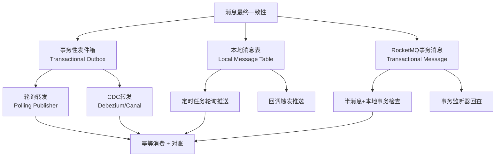
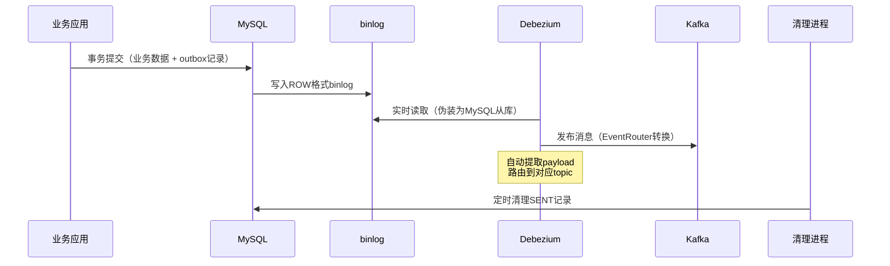
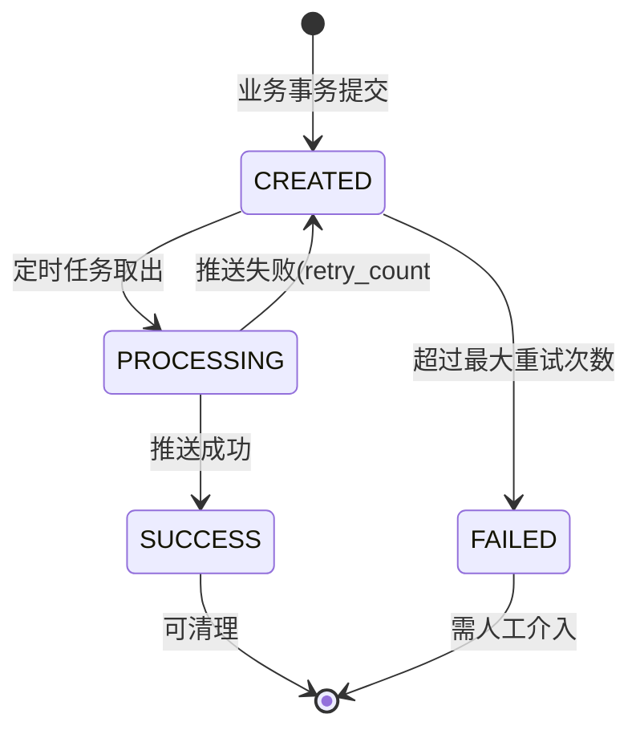
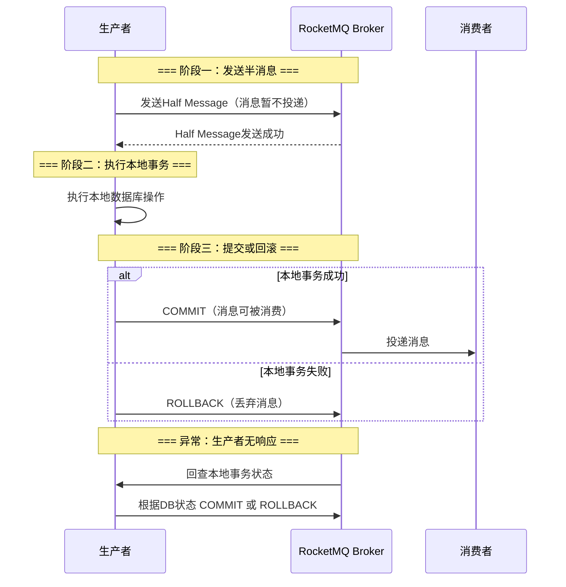
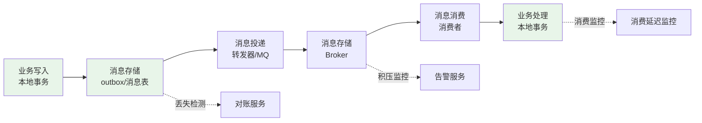
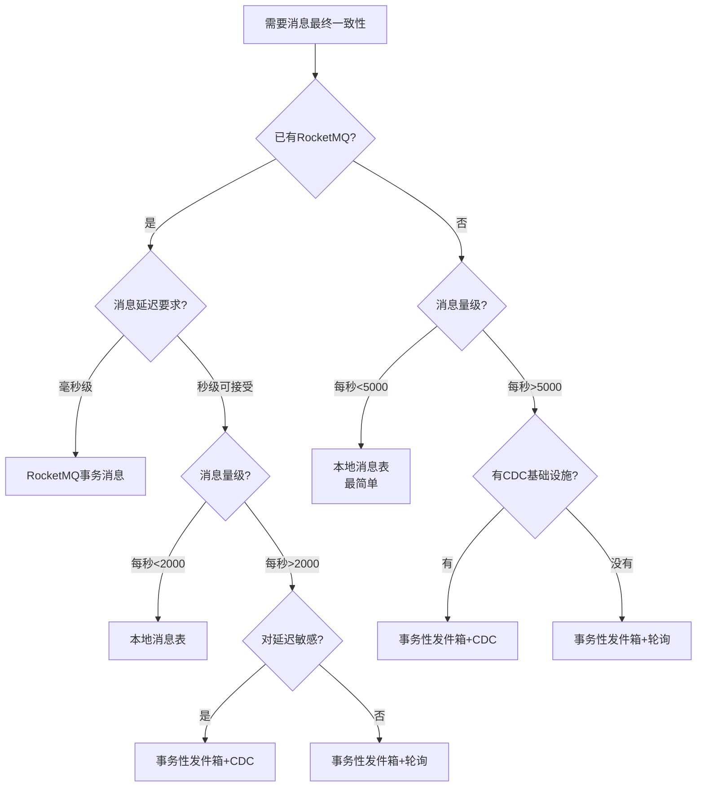

# 三、消息最终一致的工程实现

理论章节介绍了事务性发件箱和本地消息表的基本概念，本节从工程角度深入拆解——给出完整的生产级代码、剖析每种方案的适用边界、以及落地时必须处理的边界问题。消息最终一致的核心目标是：**通过本地事务与消息发送的原子化，保证跨服务的数据最终达到一致状态**。

## 1. 方案全景：三种主流实现

消息最终一致在工程上有三条主要实现路径，每条路径在延迟、复杂度和适用场景上各有侧重：



| 维度 | 事务性发件箱 | 本地消息表 | RocketMQ事务消息 |
|------|------------|-----------|----------------|
| **核心思想** | 消息写入outbox表与业务数据同事务，后台进程转发 | 消息写入本地消息表与业务数据同事务，定时任务推送 | RocketMQ提供半消息机制，本地事务执行后确认/回滚 |
| **额外依赖** | 数据库（已有） | 数据库（已有） | RocketMQ |
| **消息延迟** | 秒级（轮询）/ 毫秒级（CDC） | 秒级（定时任务间隔） | 毫秒级（Broker实时投递） |
| **实现复杂度** | 中 | 低 | 低（MQ内置支持） |
| **可靠性** | 高 | 高 | 高（依赖MQ可靠性） |
| **适用场景** | 通用，异步解耦 | 消息量中等，架构简单 | 已有RocketMQ基础设施 |

## 2. 方案一：事务性发件箱的生产级实现

### 2.1 Outbox表的完整设计

理论部分给出了基础表结构，生产环境需要补充更多字段以支撑运维和排查：

```sql
CREATE TABLE outbox (
    id              BIGINT PRIMARY KEY AUTO_INCREMENT,
    -- 事件标识
    aggregate_id    VARCHAR(64) NOT NULL COMMENT '聚合根ID',
    aggregate_type  VARCHAR(64) NOT NULL COMMENT '聚合类型',
    event_type      VARCHAR(128) NOT NULL COMMENT '事件类型，如order.created',
    -- 消息内容
    topic           VARCHAR(256) NOT NULL COMMENT '目标topic',
    message_key     VARCHAR(128) COMMENT '消息key（同聚合保证有序）',
    payload         TEXT NOT NULL COMMENT 'JSON格式事件载荷',
    headers         JSON COMMENT '自定义消息头（如trace-id）',
    -- 状态管理
    status          ENUM('PENDING','SENDING','SENT','FAILED') NOT NULL DEFAULT 'PENDING',
    retry_count     INT NOT NULL DEFAULT 0,
    max_retries     INT NOT NULL DEFAULT 5,
    last_error      TEXT COMMENT '最近一次错误信息',
    -- 时间戳
    created_at      TIMESTAMP NOT NULL DEFAULT CURRENT_TIMESTAMP,
    updated_at      TIMESTAMP NOT NULL DEFAULT CURRENT_TIMESTAMP ON UPDATE CURRENT_TIMESTAMP,
    sent_at         TIMESTAMP NULL,
    -- 索引
    INDEX idx_status_created (status, created_at),
    INDEX idx_aggregate (aggregate_type, aggregate_id),
    INDEX idx_failed (status, retry_count) WHERE status = 'FAILED'
) ENGINE=InnoDB DEFAULT CHARSET=utf8mb4 COMMENT='事务性发件箱';
```

**关键设计点：**

- **status增加SENDING状态**：防止轮询器和CDC同时处理同一条消息。轮询器在取出消息时将status从PENDING更新为SENDING（使用`SELECT ... FOR UPDATE`或乐观锁），发送完成后更新为SENT。这样即使两个进程同时扫描，也不会重复发送
- **last_error字段**：记录最后一次失败原因，排查问题时不需要翻日志，直接查表
- **headers字段**：传递trace-id、源服务名等元数据，方便下游链路追踪
- **复合索引 idx_failed**：专门为失败重试场景优化，避免全表扫描

### 2.2 轮询转发器：生产级实现

理论部分的轮询代码是入门级，生产环境需要处理更多边界情况：

```python
import time
import json
import logging
import threading
from dataclasses import dataclass
from typing import Optional
import pymysql
from kafka import KafkaProducer, KafkaError

logger = logging.getLogger(__name__)

@dataclass
class PollerConfig:
    poll_interval: float = 1.0        # 轮询间隔（秒）
    batch_size: int = 100             # 每批查询数量
    send_timeout: float = 10.0        # 单条发送超时（秒）
    max_retries: int = 5              # 最大重试次数
    claim_lock_timeout: int = 30      # 锁定超时（秒）
    shutdown_timeout: float = 30.0    # 优雅关闭超时（秒）

class ProductionOutboxRelay:
    """
    生产级Outbox轮询转发器
    
    核心设计：
    1. 原子化claim：取出即锁定，防止多实例重复消费
    2. 指数退避重试：失败后逐渐加大重试间隔
    3. 优雅关闭：收到信号后等待当前批次完成
    4. 健康检查：提供/health端点供Kubernetes探针调用
    """

    def __init__(self, db_config: dict, kafka_config: dict,
                 config: PollerConfig = None):
        self.config = config or PollerConfig()
        self.db_config = db_config
        self.kafka_config = kafka_config
        self._shutdown = threading.Event()
        self._healthy = False
        self._stats = {
            'sent': 0, 'failed': 0, 'retried': 0,
            'last_poll_time': None, 'last_poll_count': 0
        }

    def _get_db(self):
        """获取数据库连接（每次轮询新建，避免连接泄漏）"""
        return pymysql.connect(**self.db_config)

    def _get_producer(self):
        """创建Kafka生产者"""
        return KafkaProducer(
            bootstrap_servers=self.kafka_config['brokers'],
            value_serializer=lambda v: json.dumps(v, ensure_ascii=False).encode('utf-8'),
            key_serializer=lambda k: k.encode('utf-8') if k else None,
            acks='all',
            retries=3,
            max_in_flight_requests_per_connection=1,  # 单分区内保序
            linger_ms=5,       # 批量发送优化
            batch_size=16384
        )

    def run(self):
        """主循环"""
        producer = self._get_producer()
        db = self._get_db()
        logger.info("Outbox relay started")

        try:
            while not self._shutdown.is_set():
                try:
                    count = self._poll_and_send(db, producer)
                    self._stats['last_poll_count'] = count
                    self._stats['last_poll_time'] = time.time()
                    self._healthy = True
                except Exception as e:
                    logger.error(f"Poll cycle failed: {e}")
                    self._healthy = False
                    # 数据库连接可能已断开，重建
                    try:
                        db.close()
                    except Exception:
                        pass
                    db = self._get_db()

                self._shutdown.wait(timeout=self.config.poll_interval)
        finally:
            producer.flush(timeout=5)
            producer.close(timeout=5)
            db.close()
            logger.info("Outbox relay stopped")

    def _poll_and_send(self, db, producer) -> int:
        """一轮轮询：claim → 发送 → 更新状态"""
        with db.cursor() as cursor:
            # === 步骤1：原子化claim消息 ===
            # 使用 UPDATE ... LIMIT 模式批量claim
            # 先更新状态为SENDING，再查询要发送的消息
            claim_sql = """
                UPDATE outbox 
                SET status = 'SENDING', updated_at = NOW()
                WHERE status = 'PENDING' 
                  AND retry_count < %s
                ORDER BY created_at ASC
                LIMIT %s
            """
            cursor.execute(claim_sql, (self.config.max_retries, self.config.batch_size))
            db.commit()

            # === 步骤2：取出已claim的消息 ===
            cursor.execute(
                "SELECT id, topic, message_key, payload, retry_count "
                "FROM outbox WHERE status = 'SENDING' "
                "ORDER BY created_at ASC LIMIT %s",
                (self.config.batch_size,)
            )
            messages = cursor.fetchall()

            if not messages:
                return 0

            # === 步骤3：逐条发送到Kafka ===
            sent_ids = []
            failed_ids = {}

            for msg_id, topic, key, payload, retry_count in messages:
                try:
                    data = json.loads(payload) if isinstance(payload, str) else payload
                    future = producer.send(topic=topic, key=key, value=data)
                    future.get(timeout=self.config.send_timeout)
                    sent_ids.append(msg_id)
                    self._stats['sent'] += 1
                except Exception as e:
                    failed_ids[msg_id] = str(e)
                    self._stats['failed'] += 1

            # === 步骤4：批量更新状态 ===
            if sent_ids:
                placeholders = ','.join(['%s'] * len(sent_ids))
                cursor.execute(
                    f"UPDATE outbox SET status='SENT', sent_at=NOW(), "
                    f"updated_at=NOW() WHERE id IN ({placeholders})",
                    sent_ids
                )

            for msg_id, error in failed_ids.items():
                cursor.execute(
                    "UPDATE outbox SET status=CASE "
                    "  WHEN retry_count + 1 >= max_retries THEN 'FAILED' "
                    "  ELSE 'PENDING' END, "
                    "retry_count = retry_count + 1, "
                    "last_error = %s, "
                    "updated_at = NOW() "
                    "WHERE id = %s",
                    (error[:500], msg_id)  # 错误信息截断防止超长
                )
                self._stats['retried'] += 1

            db.commit()
            return len(sent_ids)

    def shutdown(self):
        """优雅关闭"""
        self._shutdown.set()

    @property
    def health(self) -> dict:
        return {
            'healthy': self._healthy,
            'stats': self._stats.copy()
        }
```

**与入门代码的关键差异：**

1. **原子化claim**：先UPDATE状态再SELECT取出，避免多实例重复消费。轮询器多实例部署时，每个实例只处理自己claim的消息
2. **失败分级处理**：重试次数未达上限的消息回退为PENDING等待重试，超过上限的标记为FAILED触发告警
3. **错误信息持久化**：last_error字段保存截断后的错误信息（500字符上限），方便排查
4. **连接容错**：轮询异常后主动重建数据库连接，避免使用已断开的连接

### 2.3 CDC转发架构

当消息量超过每秒5000条，或对延迟要求低于1秒时，轮询方式的数据库压力成为瓶颈。此时应切换到基于CDC（Change Data Capture）的转发架构。



**Debezium部署配置（Docker Compose）：**

```yaml
version: '3.8'
services:
  debezium:
    image: quay.io/debezium/connect:2.5
    environment:
      BOOTSTRAP_SERVERS: kafka:9092
      GROUP_ID: outbox-connector
      CONFIG_STORAGE_TOPIC: connect-configs
      OFFSET_STORAGE_TOPIC: connect-offsets
    ports:
      - "8083:8083"
    depends_on:
      - kafka

  # 注册connector
  register-connector:
    image: curlimages/curl
    depends_on:
      - debezium
    command: >
      curl -X POST http://debezium:8083/connectors
      -H "Content-Type: application/json"
      -d '{
        "name": "outbox-connector",
        "config": {
          "connector.class": "io.debezium.connector.mysql.MySqlConnector",
          "database.hostname": "mysql",
          "database.port": "3306",
          "database.user": "debezium",
          "database.password": "***",
          "database.server.id": "184054",
          "database.include.list": "order_service",
          "table.include.list": "order_service.outbox",
          "database.serverTimezone": "Asia/Shanghai",
          "converters": "outbox",
          "transforms": "outbox",
          "transforms.outbox.type": "io.debezium.transforms.outbox.EventRouter",
          "transforms.outbox.table.field.event.key": "message_key",
          "transforms.outbox.table.field.event.type": "event_type",
          "transforms.outbox.table.field.event.payload": "payload",
          "transforms.outbox.route.topic.replacement": "${routedByValue}",
          "transforms.outbox.table.expand.json.payload": "true",
          "tombstones.on.delete": "false",
          "snapshot.mode": "initial"
        }
      }'
```

**CDC方式需要配套的记录清理**：Debezium自动监控outbox表的INSERT事件，但不会自动清理已发送的记录。需要一个独立的清理进程：

```python
async def cleanup_sent_records(db, retention_hours=1):
    """清理已发送超过指定时间的outbox记录"""
    result = await db.execute(
        "DELETE FROM outbox WHERE status = 'SENT' "
        "AND sent_at < DATE_SUB(NOW(), INTERVAL %s HOUR) "
        "LIMIT 5000",
        (retention_hours,)
    )
    if result.rowcount > 0:
        logger.info(f"Cleaned {result.rowcount} sent records")

    # 清理FAILED记录（保留用于排查，定期归档）
    await db.execute(
        "DELETE FROM outbox WHERE status = 'FAILED' "
        "AND updated_at < DATE_SUB(NOW(), INTERVAL 7 DAY) "
        "AND retry_count >= max_retries "
        "LIMIT 1000"
    )
```

## 3. 方案二：本地消息表的完整实现

### 3.1 与事务性发件箱的异同

本地消息表（Local Message Table）与事务性发件箱的思想一致——都是通过本地事务保证业务数据和消息记录的原子写入。关键区别在于：

| 维度 | 事务性发件箱 | 本地消息表 |
|------|------------|-----------|
| **消息内容** | 通用事件载荷（JSON） | 业务自定义格式 |
| **消息目的地** | 必须是消息队列 | 可以是MQ、HTTP回调、数据库轮询 |
| **转发机制** | 轮询/CDC | 定时任务主动推送 |
| **表结构** | 标准化（outbox表） | 自定义（与业务强关联） |
| **记录清理** | 发送后删除或归档 | 消费后删除 |
| **典型框架** | 无（通用模式） | 无（通用模式） |

### 3.2 消息表设计与状态机

```sql
CREATE TABLE local_message (
    id              BIGINT PRIMARY KEY AUTO_INCREMENT,
    -- 业务关联
    business_id     VARCHAR(64) NOT NULL COMMENT '业务唯一标识（如订单号）',
    business_type   VARCHAR(64) NOT NULL COMMENT '业务类型',
    -- 消息内容
    message_type    VARCHAR(128) NOT NULL COMMENT '消息类型',
    target_url      VARCHAR(512) COMMENT '回调地址（HTTP模式）',
    payload         TEXT NOT NULL COMMENT '消息体JSON',
    -- 状态管理
    status          ENUM('CREATED','PROCESSING','SUCCESS','FAILED') NOT NULL DEFAULT 'CREATED',
    retry_count     INT NOT NULL DEFAULT 0,
    max_retries     INT NOT NULL DEFAULT 5,
    next_retry_at   TIMESTAMP NULL COMMENT '下次重试时间',
    last_error      TEXT,
    -- 时间戳
    created_at      TIMESTAMP NOT NULL DEFAULT CURRENT_TIMESTAMP,
    updated_at      TIMESTAMP NOT NULL DEFAULT CURRENT_TIMESTAMP ON UPDATE CURRENT_TIMESTAMP,
    processed_at    TIMESTAMP NULL,
    -- 索引
    INDEX idx_status_retry (status, next_retry_at),
    INDEX idx_business (business_type, business_id)
) ENGINE=InnoDB DEFAULT CHARSET=utf8mb4 COMMENT='本地消息表';
```

状态机流转：



### 3.3 业务写入示例

```java
@Service
public class OrderService {

    @Autowired private OrderRepository orderRepo;
    @Autowired private LocalMessageRepository messageRepo;

    @Transactional  // 本地事务：业务数据 + 消息原子写入
    public Order createOrder(CreateOrderRequest request) {
        // 1. 创建订单
        Order order = new Order();
        order.setId(generateId());
        order.setUserId(request.getUserId());
        order.setTotalAmount(request.getTotalAmount());
        order.setStatus(OrderStatus.CREATED);
        orderRepo.save(order);

        // 2. 写入本地消息（同一个事务）
        LocalMessage msg = new LocalMessage();
        msg.setBusinessId(order.getId());
        msg.setBusinessType("order");
        msg.setMessageType("order.created");
        msg.setTargetUrl("http://inventory-service/api/deduct");
        msg.setPayload(buildPayload(order));
        msg.setStatus("CREATED");
        messageRepo.save(msg);

        return order;
    }
}
```

### 3.4 定时推送器

```python
import time
import logging
import requests
from datetime import datetime

logger = logging.getLogger(__name__)

class MessageRelay:
    """本地消息表推送器"""

    def __init__(self, db, poll_interval=2, batch_size=50):
        self.db = db
        self.poll_interval = poll_interval
        self.batch_size = batch_size

    def run(self):
        while True:
            try:
                self._process_batch()
            except Exception as e:
                logger.error(f"Relay batch failed: {e}")
            time.sleep(self.poll_interval)

    def _process_batch(self):
        with self.db.cursor() as cursor:
            # 1. 原子取出一批消息（FOR UPDATE SKIP LOCKED 防并发）
            cursor.execute(
                "SELECT id, business_id, message_type, target_url, payload "
                "FROM local_message "
                "WHERE status = 'CREATED' "
                  "AND (next_retry_at IS NULL OR next_retry_at <= NOW()) "
                "ORDER BY created_at ASC "
                "LIMIT %s FOR UPDATE SKIP LOCKED",
                (self.batch_size,)
            )
            messages = cursor.fetchall()

            if not messages:
                return

            # 2. 逐条推送
            for msg_id, biz_id, msg_type, target_url, payload in messages:
                # 标记为处理中
                cursor.execute(
                    "UPDATE local_message SET status='PROCESSING', "
                    "updated_at=NOW() WHERE id=%s", (msg_id,)
                )
                self.db.commit()

                try:
                    # 3. HTTP推送 或 发送到MQ
                    resp = requests.post(
                        target_url,
                        json={"type": msg_type, "businessId": biz_id, "data": payload},
                        timeout=10
                    )
                    resp.raise_for_status()

                    # 4. 推送成功
                    cursor.execute(
                        "UPDATE local_message SET status='SUCCESS', "
                        "processed_at=NOW(), updated_at=NOW() WHERE id=%s",
                        (msg_id,)
                    )
                    self.db.commit()

                except Exception as e:
                    # 5. 推送失败：指数退避
                    cursor.execute(
                        "UPDATE local_message SET "
                        "status = CASE WHEN retry_count + 1 >= max_retries "
                        "  THEN 'FAILED' ELSE 'CREATED' END, "
                        "retry_count = retry_count + 1, "
                        "last_error = %s, "
                        "next_retry_at = DATE_ADD(NOW(), "
                        "  INTERVAL LEAST(POWER(2, retry_count), 3600) SECOND), "
                        "updated_at = NOW() "
                        "WHERE id = %s",
                        (str(e)[:500], msg_id)
                    )
                    self.db.commit()
                    logger.warning(f"Message {msg_id} (biz={biz_id}) failed: {e}")
```

**关键实现细节：**

- **`FOR UPDATE SKIP LOCKED`**：MySQL 8.0+支持的语法，取出记录时加排他锁，但跳过已被其他进程锁定的记录。多实例部署时天然防重复消费
- **指数退避的next_retry_at**：不依赖sleep阻塞，而是记录下次重试时间，下次轮询时自然过滤。间隔公式为`min(2^retry_count, 3600)秒`，即1s→2s→4s→...→最大1小时
- **PROCESSING中间状态**：推送过程中状态为PROCESSING，避免超时后被其他实例误取

## 4. 方案三：RocketMQ事务消息

### 4.1 半消息机制原理

RocketMQ原生提供事务消息支持，通过"半消息"（Half Message）机制实现本地事务与消息发送的原子性。



### 4.2 生产者端完整实现

```java
@Service
@Slf4j
public class OrderTransactionProducer {

    @Autowired private RocketMQTemplate rocketMQTemplate;
    @Autowired private OrderRepository orderRepo;
    @Autowired private OutboxRepository outboxRepo;

    /**
     * 发送事务消息：下单+通知库存扣减
     */
    public void createOrderWithNotification(CreateOrderRequest request) {
        // 1. 构建消息体
        OrderCreatedEvent event = new OrderCreatedEvent();
        event.setOrderId(generateOrderId());
        event.setUserId(request.getUserId());
        event.setItems(request.getItems());
        event.setTotalAmount(request.getTotalAmount());

        // 2. 发送半消息（此时消息不会被消费者看到）
        Message<OrderCreatedEvent> msg = MessageBuilder
            .withPayload(event)
            .setHeader("KEYS", event.getOrderId())
            .build();

        rocketMQTemplate.sendMessageInTransaction(
            "order-events",     // topic
            msg,
            event               // 传递给本地事务检查器的arg
        );
    }
}

/**
 * 事务监听器：执行本地事务 + 回查
 */
@Component
@Slf4j
public class OrderTransactionListener implements RocketMQLocalTransactionListener {

    @Autowired private OrderRepository orderRepo;
    @Autowired private OutboxRepository outboxRepo;

    /**
     * 本地事务执行：在发送半消息后、Broker确认前被调用
     */
    @Override
    public RocketMQLocalTransactionState executeLocalTransaction(
            Message msg, Object arg) {
        OrderCreatedEvent event = (OrderCreatedEvent) arg;

        try {
            // 1. 创建订单（与outbox同事务）
            Order order = new Order();
            order.setId(event.getOrderId());
            order.setUserId(event.getUserId());
            order.setStatus(OrderStatus.PENDING);
            orderRepo.save(order);

            // 2. 写入outbox（同一事务中，保证原子性）
            OutboxMessage outboxMsg = new OutboxMessage();
            outboxMsg.setAggregateId(event.getOrderId());
            outboxMsg.setEventType("order.created");
            outboxMsg.setTopic("order-events");
            outboxMsg.setPayload(toJson(event));
            outboxMsg.setStatus("SENT");  // 已通过MQ发送，直接标记SENT
            outboxRepo.save(outboxMsg);

            // 3. 本地事务提交，通知Broker可以投递消息
            return RocketMQLocalTransactionState.COMMIT;

        } catch (Exception e) {
            log.error("Local transaction failed for order {}", event.getOrderId(), e);
            return RocketMQLocalTransactionState.ROLLBACK;
        }
    }

    /**
     * 事务回查：Broker未收到COMMIT/ROLLBACK时调用
     * 用于网络异常等场景的恢复
     */
    @Override
    public RocketMQLocalTransactionState checkLocalTransaction(Message msg) {
        String orderId = msg.getHeaders().get("KEYS", String.class);

        // 检查订单是否已创建
        Optional<Order> order = orderRepo.findById(orderId);

        if (order.isPresent() &amp;&amp; order.get().getStatus() != OrderStatus.PENDING) {
            // 订单已提交，确认消息
            return RocketMQLocalTransactionState.COMMIT;
        } else if (order.isPresent()) {
            // 订单存在但未完成，等待
            return RocketMQLocalTransactionState.UNKNOWN;
        } else {
            // 订单不存在，回滚
            return RocketMQLocalTransactionState.ROLLBACK;
        }
    }
}
```

**RocketMQ事务消息的关键约束：**

- **半消息不支持延迟和事务消息嵌套**：发送半消息时不能设置延迟级别
- **回查机制**：Broker默认每30秒回查一次，最多回查15次（可配置）。超过次数后消息被丢弃
- **本地事务与消息的最终一致依赖回查**：如果生产者在执行完本地事务后、发送COMMIT前宕机，回查机制是唯一的恢复手段

## 5. 消费端幂等性工程

无论选择哪种消息最终一致方案，消费端都必须实现幂等性。这是"最终一致"方案中不可省略的一环。

### 5.1 去重表方案（推荐）

```java
@Service
@Slf4j
public class OrderEventHandler {

    @Autowired private ProcessedMessageRepository processedRepo;

    @Transactional
    public void handleOrderCreated(OrderCreatedEvent event) {
        String msgId = event.getEventId();

        // 1. 检查是否已处理（唯一索引保证原子性）
        if (processedRepo.existsByMessageId(msgId)) {
            log.info("Duplicate message {} skipped", msgId);
            return;
        }

        // 2. 执行业务逻辑
        inventoryService.deduct(event.getItems());
        notificationService.send(event.getUserId(), "订单创建成功");

        // 3. 记录已处理（同一事务，利用唯一约束防并发）
        try {
            ProcessedMessage record = new ProcessedMessage();
            record.setMessageId(msgId);
            record.setProcessedAt(Instant.now());
            processedRepo.save(record);
        } catch (DuplicateKeyException e) {
            // 并发插入的兜底：说明另一个线程已处理
            log.warn("Concurrent duplicate for {}", msgId);
        }
    }
}

-- 去重表
CREATE TABLE processed_message (
    message_id  VARCHAR(128) PRIMARY KEY COMMENT '消息唯一ID',
    processed_at TIMESTAMP NOT NULL DEFAULT CURRENT_TIMESTAMP,
    INDEX idx_cleanup (processed_at)
) ENGINE=InnoDB;

-- 定时清理（保留7天即可，覆盖最大重试窗口）
DELETE FROM processed_message 
WHERE processed_at < DATE_SUB(NOW(), INTERVAL 7 DAY) 
LIMIT 10000;
```

### 5.2 幂等性方案选型

| 方案 | 原理 | 适用场景 | 注意事项 |
|------|------|---------|---------|
| **去重表+唯一索引** | message_id为主键，重复插入被拒绝 | 通用场景（最推荐） | 需定期清理 |
| **业务唯一约束** | 利用业务字段的唯一索引（如订单号） | 创建类操作 | 仅适用于INSERT |
| **Redis去重** | SETNX + TTL | 高性能、允许极低概率丢失 | 非持久化，重启丢数据 |
| **乐观锁** | UPDATE WHERE version=N | 更新类操作 | affected_rows=0说明重复 |
| **状态机** | 状态只能单向流转 | 有明确状态的业务 | 最优雅，设计要求高 |

**经验法则**：新项目优先选去重表方案——实现简单、可靠持久、不依赖额外组件。已有Redis基础设施的高频场景可以用Redis去重作为第一层过滤，去重表作为兜底。

## 6. 消息可靠性保障链路

消息从生产到消费的完整链路中，每个环节都有失败可能。以下是端到端的可靠性设计：



### 6.1 对账机制

对账是消息可靠性的最后一道防线——定期比对业务数据和消息状态，发现不一致时自动修复：

```python
class ReconciliationService:
    """对账服务：比对业务数据和消息状态，发现并修复不一致"""

    def __init__(self, db):
        self.db = db

    def reconcile_order_events(self):
        """对账订单事件"""
        with self.db.cursor() as cursor:
            # 1. 查找有业务数据但outbox中无对应消息的订单
            cursor.execute("""
                SELECT o.id, o.created_at FROM orders o
                WHERE NOT EXISTS (
                    SELECT 1 FROM outbox ob 
                    WHERE ob.aggregate_id = o.id 
                      AND ob.event_type = 'order.created'
                      AND ob.status IN ('SENT', 'PENDING', 'SENDING')
                )
                AND o.created_at > DATE_SUB(NOW(), INTERVAL 1 HOUR)
            """)
            missing = cursor.fetchall()

            for order_id, created_at in missing:
                # 2. 重新发布缺失的消息
                self._republish_missing_event(order_id, "order.created")
                logger.warning(f"Reconciled missing outbox for order {order_id}")

            # 3. 查找已发送但超过24小时未被消费的消息
            cursor.execute("""
                SELECT id, aggregate_id, event_type, sent_at FROM outbox
                WHERE status = 'SENT'
                  AND sent_at < DATE_SUB(NOW(), INTERVAL 24 HOUR)
            """)
            unacked = cursor.fetchall()

            for msg_id, agg_id, evt_type, sent_at in unacked:
                logger.error(
                    f"Message {msg_id} (agg={agg_id}, event={evt_type}) "
                    f"sent but unacknowledged for >24h"
                )
                # 触发告警，可能需要人工排查
```

### 6.2 消息积压处理

当消费速度跟不上生产速度时，积压会不断增长。分级处理策略：

```python
class BackpressureHandler:
    """消息积压分级处理"""

    THRESHOLDS = {
        'normal': 1000,     # PENDING消息 < 1000：正常
        'warning': 5000,    # 1000-5000：告警
        'critical': 20000,  # 5000-20000：紧急
        'emergency': 50000  # >50000：启动降级
    }

    def check_and_act(self, db):
        pending_count = self._get_pending_count(db)

        if pending_count < self.THRESHOLDS['normal']:
            return  # 正常，无操作

        elif pending_count < self.THRESHOLDS['warning']:
            self._alert("warning", f"消息积压 {pending_count}")

        elif pending_count < self.THRESHOLDS['critical']:
            self._alert("critical", f"消息积压严重 {pending_count}")
            self._scale_up_consumers()

        else:
            self._alert("emergency", f"消息积压紧急 {pending_count}")
            # 启动降级：跳过非关键消费者，只保留核心链路
            self._enable_degraded_mode()
            self._scale_up_consumers(instances=3)

    def _get_pending_count(self, db):
        with db.cursor() as cursor:
            cursor.execute("SELECT COUNT(*) FROM outbox WHERE status = 'PENDING'")
            return cursor.fetchone()[0]
```

## 7. 生产环境监控

### 7.1 关键监控指标

```sql
-- 1. 消息积压量（按状态分组）
SELECT status, COUNT(*) as count
FROM outbox 
GROUP BY status;

-- 2. 消息延迟分布（从创建到发送的时间）
SELECT 
    CASE 
        WHEN TIMESTAMPDIFF(SECOND, created_at, sent_at) < 1 THEN '<1s'
        WHEN TIMESTAMPDIFF(SECOND, created_at, sent_at) < 5 THEN '1-5s'
        WHEN TIMESTAMPDIFF(SECOND, created_at, sent_at) < 30 THEN '5-30s'
        ELSE '>30s'
    END as latency_bucket,
    COUNT(*) as count
FROM outbox 
WHERE status = 'SENT' AND sent_at > DATE_SUB(NOW(), INTERVAL 1 HOUR)
GROUP BY latency_bucket;

-- 3. 发送成功率（最近1小时）
SELECT 
    SUM(CASE WHEN status = 'SENT' THEN 1 ELSE 0 END) as sent,
    SUM(CASE WHEN status = 'FAILED' THEN 1 ELSE 0 END) as failed,
    ROUND(
        SUM(CASE WHEN status = 'SENT' THEN 1 ELSE 0 END) * 100.0 / 
        NULLIF(SUM(CASE WHEN status IN ('SENT', 'FAILED') THEN 1 ELSE 0 END), 0),
        2
    ) as success_rate
FROM outbox 
WHERE updated_at > DATE_SUB(NOW(), INTERVAL 1 HOUR);

-- 4. 各event_type的消息量分布
SELECT event_type, COUNT(*) as count, 
       AVG(TIMESTAMPDIFF(MILLISECOND, created_at, COALESCE(sent_at, NOW()))) as avg_latency_ms
FROM outbox 
WHERE created_at > DATE_SUB(NOW(), INTERVAL 1 HOUR)
GROUP BY event_type ORDER BY count DESC;
```

### 7.2 Prometheus + Grafana对接

```python
from prometheus_client import Counter, Histogram, Gauge

# 指标定义
OUTBOX_SENT_TOTAL = Counter(
    'outbox_messages_sent_total', 
    'Total messages sent', 
    ['topic', 'event_type']
)
OUTBOX_FAILED_TOTAL = Counter(
    'outbox_messages_failed_total', 
    'Total messages failed',
    ['topic', 'event_type']
)
OUTBOX_PENDING = Gauge(
    'outbox_pending_count',
    'Number of pending messages'
)
OUTBOX_LATENCY = Histogram(
    'outbox_send_latency_seconds',
    'Time from message creation to sending',
    buckets=[0.1, 0.5, 1, 2, 5, 10, 30, 60]
)

# 在转发器中埋点
def _on_send_success(self, event_type, topic, latency_seconds):
    OUTBOX_SENT_TOTAL.labels(topic=topic, event_type=event_type).inc()
    OUTBOX_LATENCY.observe(latency_seconds)

def _on_send_failure(self, event_type, topic):
    OUTBOX_FAILED_TOTAL.labels(topic=topic, event_type=event_type).inc()

def _update_pending_gauge(self, count):
    OUTBOX_PENDING.set(count)
```

## 8. 三种方案对比与选型

| 维度 | 事务性发件箱 | 本地消息表 | RocketMQ事务消息 |
|------|------------|-----------|----------------|
| **实现原理** | outbox表+转发进程 | 消息表+定时推送 | 半消息+本地事务回查 |
| **额外依赖** | 数据库 | 数据库 | RocketMQ |
| **消息延迟** | 秒级~毫秒级 | 秒级 | 毫秒级 |
| **吞吐上限** | 高（CDC可到万级/秒） | 中（受限于DB轮询） | 高（MQ原生支持） |
| **实现复杂度** | 中 | 低 | 低 |
| **运维复杂度** | 中（转发进程/CDC） | 低 | 低 |
| **故障恢复** | 自动（重试+对账） | 自动（重试） | 自动（回查） |
| **多语言支持** | 好（DB通用） | 好（DB通用） | 依赖MQ SDK |

### 选型决策流程



**经验法则**：

1. **没有RocketMQ时，优先选本地消息表**——实现最简单，一个定时任务即可
2. **消息量大时，切到事务性发件箱+CDC**——轮询在万级吞吐下成为瓶颈
3. **已有RocketMQ时，直接用事务消息**——MQ原生支持，代码量最少
4. **任何方案都需要消费端幂等**——这是"最终一致"的硬性要求，不可省略
5. **对账机制是最后一道防线**——不要只依赖消息投递，定期对账发现并修复不一致

## 9. 常见陷阱与排错

### 陷阱一：outbox表和业务表不在同一个数据库

事务性发件箱的前提是业务数据和outbox记录在同一个数据库事务中。如果分库（业务表在A库，outbox在B库），就无法用本地事务保证原子性——回到双写难题。

**解决方案**：outbox表必须与业务表同库。分库场景下，每个库有自己的outbox表，由独立的转发器处理。

### 陷阱二：转发器多实例导致重复发送

不加控制地部署多个转发器实例，会导致同一条消息被发送多次。

**解决方案**：使用原子化claim（先UPDATE状态再SELECT）或数据库行锁（SELECT FOR UPDATE），确保每条消息只被一个实例处理。

### 陷阱三：失败消息阻塞后续消息

一条格式错误的消息持续失败并重试，会阻塞后续正常消息的发送（因为轮询按时间顺序处理）。

**解决方案**：设置max_retries，超过上限后标记为FAILED跳过。或者在轮询时用独立线程处理失败重试队列，不阻塞主队列。

### 陷阱四：消费者处理成功但ACK失败

消费者成功处理了消息，但ACK到Broker时网络超时，Broker重新投递，导致重复消费。

**解决方案**：消费端幂等是必须的。去重表方案可以兜底这种场景。

### 陷阱五：outbox表膨胀拖慢数据库

不清理的outbox表会持续增长，导致轮询查询变慢、索引膨胀。

**解决方案**：设计时就规划清理策略。SENT记录保留1-24小时后删除，FAILED记录保留7天后归档。高吞吐场景使用按月分区表。

## 10. 本节小结

消息最终一致性通过"本地事务原子写入+异步转发"解决分布式系统的双写难题。本节深入拆解了三种工程实现：

1. **事务性发件箱**：最通用的方案，通过outbox表+转发进程实现，CDC方式可支撑万级吞吐
2. **本地消息表**：最简单的方案，通过消息表+定时推送实现，适合中低吞吐场景
3. **RocketMQ事务消息**：最便捷的方案（前提是使用RocketMQ），通过半消息+回查机制实现，毫秒级延迟

三种方案的核心思想一致——将"写业务数据"和"发送消息"这两个操作通过本地事务原子化，消除消息丢失风险。消费端的幂等性是端到端最终一致的必要配套。对账机制是兜底防线，定期比对业务数据和消息状态，发现并修复不一致。

工程落地的优先级：**幂等消费 > 原子化写入 > 可靠转发 > 对账修复 > 监控告警**。任何一步缺失都可能引入数据不一致风险。
