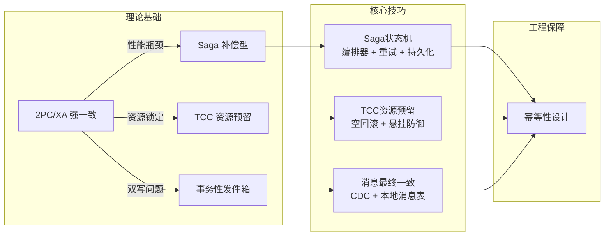
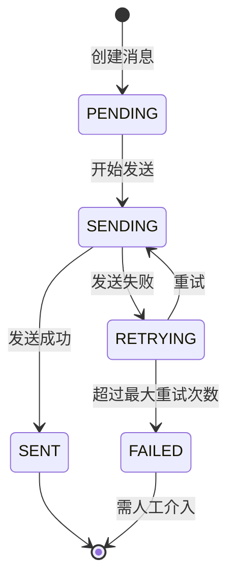
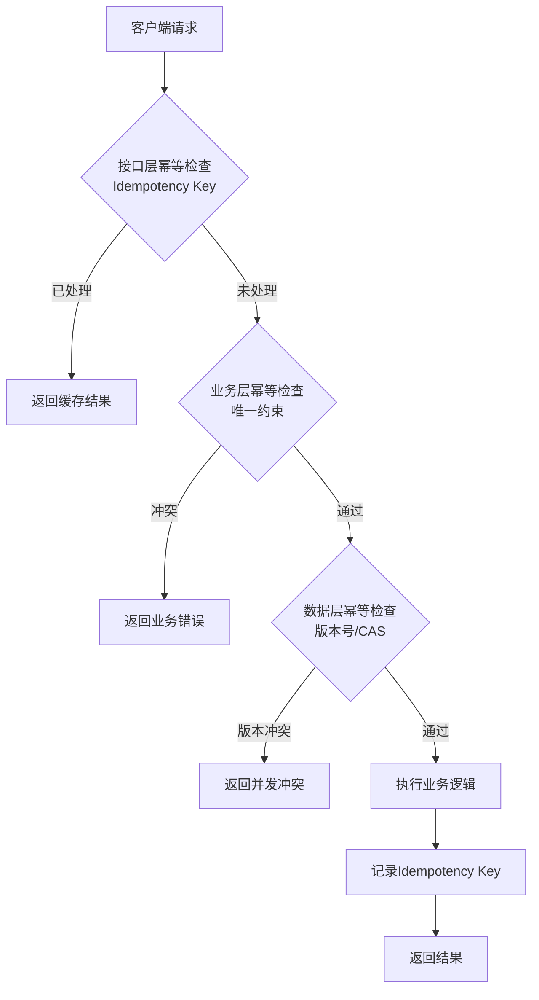

# 核心技巧：分布式事务的工程化实现

理论基础回答了"分布式事务是什么、为什么难"，核心技巧则要回答"怎么落地、怎么避坑"。本节聚焦三类最主流的工程化方案——Saga状态机、TCC资源预留、消息最终一致性——从架构设计、关键实现细节到生产环境的防御机制，逐一拆解。

## 本节内容导航

| 技巧 | 核心思想 | 一致性级别 | 业务侵入度 | 适用场景 |
|------|----------|-----------|-----------|----------|
| [Saga状态机](01-一Saga状态机.md) | 长事务拆分为短事务 + 补偿操作 | 最终一致 | 低（写补偿逻辑） | 长事务、跨服务编排、步骤多 |
| [TCC资源预留](02-二TCC资源预留.md) | Try预留 → Confirm确认 / Cancel释放 | 最终一致（强隔离） | 高（需冻结/解冻） | 资金操作、库存预留、高一致要求 |
| [消息最终一致](03-三消息最终一致.md) | 本地事务 + 消息投递原子化 | 最终一致 | 低（写消息表） | 异步解耦、事件驱动、数据同步 |



## 从理论到工程：三个关键跨越

理论模型到生产代码之间存在巨大的鸿沟。理解这个鸿沟，才能避免"学了理论但写不了代码"的尴尬。

### 跨越一：状态管理从概念到持久化

理论章节介绍了Saga的状态机（STARTED → RUNNING → COMPENSATING → COMPLETED/FAILED），但在生产环境中，状态机必须持久化到数据库。原因很简单：编排器可能在任何时刻崩溃。如果状态只保存在内存中，崩溃后重启就无法知道"执行到哪一步了"，导致重复执行或遗漏。

持久化策略的核心原则：

- **步骤执行前后各写一次**：进入步骤时记录RUNNING状态，步骤完成时记录SUCCEEDED/FAILED状态，确保崩溃恢复时能准确判断
- **补偿执行前后各写一次**：补偿开始时记录COMPENSATING，补偿完成时记录COMPENSATED，避免补偿被重复执行
- **使用数据库事务保证原子性**：业务数据更新和状态记录必须在同一个本地事务中提交，否则可能出现"业务成功但状态未更新"的不一致

一个常见的错误是只在步骤完成后写状态。假设编排器在步骤执行中途崩溃，数据库里没有这条步骤的任何记录，恢复时无法判断该步骤是否已执行——重试可能重复执行，跳过可能遗漏操作。正确做法是"进入即记录"：

```python
async def execute_step(self, saga_id: str, step: StepDefinition):
    # 1. 进入步骤时立即持久化RUNNING状态
    await self.state_store.update_step_status(
        saga_id, step.name, StepStatus.RUNNING
    )
    try:
        result = await asyncio.wait_for(
            step.action(self.context),
            timeout=step.timeout
        )
        # 2. 成功时持久化SUCCEEDED
        await self.state_store.update_step_status(
            saga_id, step.name, StepStatus.SUCCEEDED, result=result
        )
        return result
    except Exception as e:
        # 3. 失败时持久化FAILED
        await self.state_store.update_step_status(
            saga_id, step.name, StepStatus.FAILED, error=str(e)
        )
        raise
```

### 跨越二：异常处理从"理想情况"到"所有可能"

理论模型假设网络是可靠的、参与者会正常响应。但生产环境必须考虑：

- **超时后参与者到底做了什么？** 请求可能在参与者执行前超时，也可能在参与者执行后但响应返回前超时。前者需要重试，后者需要幂等
- **补偿失败怎么办？** 补偿操作本身也可能失败。此时Saga陷入"半补偿"状态，需要告警并触发人工介入
- **部分Commit消息丢失怎么办？** 协调者发送了Commit指令但部分参与者没有收到，需要超时后自动重试
- **编排器自身宕机怎么办？** 编排器进程被OOM Kill、宿主机断电、容器被驱逐——这些场景下，状态持久化必须能经受住突然中断的考验

异常处理的关键在于**穷举思维**：列出系统中每一个可能出错的环节（网络、数据库、第三方服务、自身进程），为每种故障设计对应的恢复路径。没有"理论上不会发生"的故障——在网络世界里，所有理论上可能的故障最终都会发生。

### 跨越三：并发安全从单线程到多实例

理论模型通常假设只有一个协调者在工作。但生产环境中，编排器可能有多个实例、消息可能被并行消费。此时必须考虑：

- **分布式锁**：同一Saga实例不能被两个线程同时执行
- **幂等性**：同一操作被执行两次，结果必须和执行一次相同
- **乐观并发控制**：通过版本号检测并发修改，避免覆盖其他实例的更新

并发安全问题在测试环境中极难复现，但在生产环境中几乎必然出现。一个典型的场景是：编排器A正在执行Saga实例#123的步骤2，此时A的GC暂停了2秒，监控系统认为A已死亡，将#123重新分配给编排器B。B从步骤2开始执行，A恢复后继续执行步骤2的后半段——两个实例同时操作同一个Saga实例，导致数据不一致。解决方案是基于数据库行锁的悲观并发控制，或者基于版本号的乐观并发控制。

## 技巧一：Saga状态机的工程实现要点

Saga是微服务架构中使用最广泛的分布式事务模式。理论部分已经介绍了Saga的基本概念和两种协调方式（编排式和协同式），工程实现需要解决以下关键问题。

### 编排器的核心职责

一个生产级Saga编排器需要承担五项核心职责：

**流程定义与注册**：将Saga的步骤序列（包括每个步骤的执行逻辑和补偿逻辑）注册到编排器中。定义时需要为每个步骤配置重试策略（次数、延迟）、超时时间、并发控制策略。

```python
# 步骤定义的完整配置示例
StepDefinition(
    name="deduct_inventory",
    action=deduct_inventory_action,        # 执行逻辑
    compensation=restore_inventory_action,  # 补偿逻辑
    retry_count=3,                          # 最多重试3次
    retry_delay=1.0,                        # 初始延迟1秒
    retry_backoff="exponential",            # 指数退避
    timeout=15.0,                           # 15秒超时
    idempotency_key_extractor=lambda ctx: ctx["order_id"]  # 幂等键提取
)
```

**执行引擎**：按顺序执行步骤，处理成功/失败分支。执行引擎的核心是一个循环：取出下一个步骤 → 重试执行 → 判断结果 → 决定前进还是补偿。

```python
class SagaExecutor:
    async def run(self, saga_id: str):
        steps = await self.state_store.get_pending_steps(saga_id)
        for step in steps:
            try:
                await self.execute_step(saga_id, step)
            except RetryExhausted:
                # 步骤彻底失败，触发补偿
                await self.compensate(saga_id, completed_steps)
                return SagaStatus.COMPENSATED
        await self.state_store.update_saga_status(saga_id, SagaStatus.COMPLETED)

    async def compensate(self, saga_id: str, completed_steps: list):
        """逆序执行已成功步骤的补偿操作"""
        for step in reversed(completed_steps):
            await self.state_store.update_step_status(
                saga_id, step.name, StepStatus.COMPENSATING
            )
            try:
                await asyncio.wait_for(
                    step.compensation(self.context),
                    timeout=step.timeout
                )
                await self.state_store.update_step_status(
                    saga_id, step.name, StepStatus.COMPENSATED
                )
            except Exception as e:
                # 补偿失败——最危险的场景，必须告警并停止
                logger.critical(
                    "Saga %s step %s compensation failed: %s",
                    saga_id, step.name, e
                )
                await self.alert_service.send(
                    f"补偿失败: Saga={saga_id}, Step={step.name}, Error={e}"
                )
                raise CompensationFailed(saga_id, step.name)
```

**重试与超时**：指数退避是标准策略——第1次重试等1秒，第2次等2秒，第3次等4秒。这样既给了下游服务恢复时间，又不会在短时间内发送大量重试请求。超时控制通过`asyncio.wait_for`实现，每个步骤有独立的超时时间。

**补偿编排**：失败后按逆序执行已成功步骤的补偿操作。关键细节：跳过未执行的步骤、记录每步补偿状态、补偿失败时停止并告警。

**状态持久化**：使用Saga执行记录表持久化整个执行过程。表结构至少包含：Saga实例ID、当前状态、上下文数据（JSON序列化）、各步骤执行状态和结果、创建/更新时间。

### 重试策略的设计考量

不是所有失败都值得重试。重试策略需要区分两种失败类型：

**暂时性故障**（值得重试）：网络抖动、服务短暂过载、数据库连接池耗尽。这些故障通常在几秒内恢复，重试大概率成功。

**确定性故障**（不应重试）：业务校验失败（余额不足、库存为零）、参数错误（格式不合法）、权限不足。重试一万次也不会成功。

实践中常用的判断依据：

| 故障类型 | 典型表现 | 是否重试 | 理由 |
|---------|---------|---------|------|
| 网络超时 | TimeoutError, ConnectionTimeout | 是 | 网络抖动通常秒级恢复 |
| 连接拒绝 | ConnectionRefused | 是 | 服务重启后恢复 |
| HTTP 5xx | 500, 502, 503, 504 | 是 | 服务端临时故障 |
| HTTP 400 | BadRequest | 否 | 参数错误，重试无意义 |
| HTTP 401/403 | Unauthorized/Forbidden | 否 | 认证授权问题 |
| HTTP 404 | NotFound | 否 | 资源不存在 |
| 业务异常 | 余额不足, 库存为零 | 否 | 业务状态不满足 |
| 数据库死锁 | DeadlockDetected | 是 | 重新执行可能成功 |

一个容易忽视的细节是**故障类型的动态判定**。同一个HTTP 503错误，如果是服务重启导致的（通常几秒恢复），重试是合理的；如果是服务已经被下线（永远不会恢复），重试就是浪费。实践中可以通过错误码细分（如503带"Service Unavailable"是临时故障，带"Gateway Timeout"可能是永久故障），或者引入断路器（Circuit Breaker）——连续失败超过阈值后停止重试，等服务恢复后再尝试。

### 补偿操作的设计原则

补偿操作不是"反向操作"，而是"消除影响"。这个区别至关重要：

- **反向操作**：执行一个与原操作完全相反的操作（如+100的反向是-100）
- **消除影响**：将系统状态恢复到操作执行前的状态（可能需要查询当前状态再计算差值）

举一个具体例子：订单创建Saga中，步骤1是"扣减库存10件"，步骤2是"创建订单"，步骤3是"扣减余额"。如果步骤3失败，需要补偿步骤1和步骤2。步骤1的补偿不是简单地"+10件库存"，因为在这期间可能发生了其他库存变动——正确做法是查询当前库存，计算差值后恢复。

设计补偿操作的五条原则：

1. **幂等性**：补偿可能被执行多次（重试、网络重复），必须保证多次执行效果与一次相同
2. **可交换性**：多个补偿操作之间的执行顺序不影响最终结果（理想情况，实践中通常按逆序）
3. **不依赖外部状态**：补偿操作不应依赖其他服务的实时状态，否则可能导致补偿失败
4. **记录补偿原因**：补偿执行时记录触发补偿的步骤和错误信息，便于排查问题
5. **超时设置**：补偿操作也需要超时控制，避免无限等待

### Saga模式的两种协调方式对比

编排式（Orchestration）和协同式（Choreography）是Saga的两种实现方式，各有优劣：

| 维度 | 编排式（Orchestration） | 协同式（Choreography） |
|------|----------------------|---------------------|
| 控制流 | 集中在编排器 | 分散在各服务 |
| 可观测性 | 高（状态集中管理） | 低（需要分布式追踪） |
| 耦合度 | 编排器依赖所有服务 | 服务间通过事件解耦 |
| 事务逻辑 | 集中定义，易于理解和修改 | 分散在各服务，修改需协调 |
| 单点风险 | 编排器是单点 | 无单点 |
| 适用规模 | 步骤少（<10步） | 步骤多，服务多 |
| 典型框架 | Seata Saga, Temporal | Spring Cloud Event, Axon |

实践中大多数团队选择编排式，因为可观测性和可维护性在微服务架构中更为关键。协同式适合高度解耦的事件驱动架构，但调试和排查问题的难度显著增加。

## 技巧二：TCC资源预留的工程实现要点

TCC模式通过资源预留提供了比Saga更强的隔离性，但实现复杂度也显著更高。理论部分介绍了TCC的三个阶段，工程实现需要重点解决空回滚、悬挂、幂等三大问题。

### 空回滚的检测与处理

空回滚发生在以下时序：协调者发起Try → Try请求因网络延迟未到达参与者 → 协调者超时，发起Cancel → Cancel先于Try到达参与者。

参与者收到Cancel时发现没有对应的Try记录，这就是空回滚。处理策略：在Cancel处理逻辑中，如果未找到对应的Try记录，插入一条"已取消"的标记记录，然后返回成功。

```python
async def cancel(self, tx_id: str) -> bool:
    frozen = await self.frozen_repo.get_by_tx_id(tx_id)
    if frozen is None:
        # 空回滚：Try未到达，记录Cancel标记
        marker = FrozenRecord(
            tx_id=tx_id,
            account_id="EMPTY_ROLLBACK",
            amount=Decimal("0"),
            status="CANCELLED"
        )
        await self.frozen_repo.save(marker)
        return True
    # ... 正常Cancel逻辑
```

空回滚的检测有一个关键细节：**Cancel标记必须与正常的Cancel记录共用同一个唯一索引**。否则后续迟到的Try请求会绕过悬挂检测，导致资源被错误冻结。

### 悬挂的检测与预防

悬挂发生在以下时序：协调者发起Cancel → Cancel到达并执行完毕 → 之后Try才到达参与者（网络延迟导致）。此时如果Try正常执行，资源被预留但永远不会被Confirm或Cancel，形成"悬挂"。

处理策略：在Try处理逻辑中，检查是否已经存在该事务的Cancel记录。如果存在，说明Cancel已经执行过了，拒绝这次Try操作。

```python
async def try_freeze(self, tx_id: str, account_id: str, amount: Decimal) -> bool:
    existing = await self.frozen_repo.get_by_tx_id(tx_id)
    if existing and existing.status == "CANCELLED":
        return False  # 已被Cancel，拒绝Try（防悬挂）
    # ... 正常Try逻辑
```

悬挂问题在高并发场景下更容易出现。一个典型的场景是：协调者在100ms内连续发起Try和Cancel（因为上游超时），但Cancel在50ms内到达参与者，Try在200ms后才到达。如果Try没有防悬挂检查，资源就会被永久冻结。

### Confirm和Cancel的幂等保证

Confirm和Cancel操作都可能因为网络重试而被多次执行。幂等保证通过状态检查实现：

| 当前状态 | 收到Confirm | 收到Cancel | 说明 |
|---------|------------|-----------|------|
| FROZEN | 执行Confirm → CONFIRMED | 执行Cancel → CANCELLED | 正常流程 |
| CONFIRMED | 直接返回成功 | 返回失败（已确认） | 幂等 |
| CANCELLED | 返回失败（已取消） | 直接返回成功 | 幂等 |
| 不存在 | 直接返回成功 | 插入CANCELLED标记 | 空回滚/已处理 |

### TCC的数据库表设计

TCC服务需要维护一张冻结记录表，记录每次资源预留的状态：

```sql
CREATE TABLE tcc_frozen_record (
    id BIGINT AUTO_INCREMENT PRIMARY KEY,
    tx_id VARCHAR(64) NOT NULL,          -- 全局事务ID
    account_id VARCHAR(64) NOT NULL,      -- 账户ID
    amount DECIMAL(20, 4) NOT NULL,       -- 冻结金额
    status ENUM('FROZEN', 'CONFIRMED', 'CANCELLED') NOT NULL,
    created_at DATETIME NOT NULL,
    updated_at DATETIME NOT NULL,
    UNIQUE KEY uk_tx_id (tx_id),          -- tx_id唯一索引
    INDEX idx_account_status (account_id, status)
);
```

关键设计点：tx_id唯一索引防止并发重复冻结；account_id + status组合索引支持"查询某账户的所有冻结记录"和"计算冻结总额"两种查询。

### TCC的资源冻结窗口设计

TCC的Try阶段冻结资源后，资源在Confirm/Cancel之前处于"冻结"状态。这个冻结窗口的大小直接影响用户体验和系统吞吐：

- **窗口太短**：Confirm/Cancel必须在极短时间内完成，否则用户看到"余额被冻结"的时间过长
- **窗口太长**：资源被长时间占用，影响其他交易
- **最佳实践**：冻结窗口应覆盖整个全局事务的执行时间。可以通过设置冻结记录的TTL（Time-To-Live）来自动清理超时的冻结记录

```python
# 冻结记录的TTL清理任务
async def cleanup_expired_freezes(self):
    """清理超过30分钟未处理的冻结记录"""
    expired = await self.db.query(
        "SELECT * FROM tcc_frozen_record "
        "WHERE status = 'FROZEN' AND created_at < NOW() - INTERVAL 30 MINUTE"
    )
    for record in expired:
        # 超时未Confirm/Cancel，自动Cancel并告警
        await self.cancel(record.tx_id)
        await self.alert_service.send(
            f"冻结超时自动释放: tx_id={record.tx_id}, "
            f"account={record.account_id}, amount={record.amount}"
        )
```

## 技巧三：消息最终一致的工程实现要点

消息最终一致性通过本地事务与消息发送的原子化来保证数据一致性。理论部分介绍了事务性发件箱和本地消息表两种模式，工程实现需要重点解决消息可靠投递、消费幂等、消息积压处理等问题。

### 事务性发件箱的两种实现路径

**轮询方式**：一个后台进程定期扫描发件箱表，取出未发送的消息并投递到消息队列。实现简单，但存在延迟（取决于轮询间隔）和数据库压力（频繁全表扫描）。

```python
class PollingOutboxRelay:
    def __init__(self, db_session, message_producer, poll_interval=5):
        self.db = db_session
        self.producer = message_producer
        self.poll_interval = poll_interval  # 秒

    async def run(self):
        while True:
            messages = await self.db.query(
                "SELECT * FROM outbox_messages "
                "WHERE status = 'PENDING' "
                "ORDER BY created_at ASC LIMIT 100"
            )
            for msg in messages:
                try:
                    await self.producer.publish(
                        topic=msg.event_type,
                        key=msg.aggregate_id,
                        value=msg.payload
                    )
                    msg.status = 'SENT'
                    msg.sent_at = datetime.utcnow()
                except Exception as e:
                    msg.retry_count += 1
                    msg.last_error = str(e)
                    if msg.retry_count >= 10:
                        msg.status = 'FAILED'
            await self.db.commit()
            await asyncio.sleep(self.poll_interval)
```

**CDC方式**：通过Debezium等工具监听数据库binlog，实时捕获发件箱表的变更。延迟极低（秒级），不增加数据库查询压力，但架构更复杂，需要维护Kafka Connect集群。

两种方式的对比：

| 维度 | 轮询方式 | CDC方式 |
|------|---------|---------|
| 延迟 | 秒到分钟级（取决于轮询间隔） | 秒级 |
| 数据库压力 | 有（定期查询） | 无（读binlog） |
| 架构复杂度 | 低 | 高（需Kafka Connect + Debezium） |
| 可靠性 | 中（依赖轮询进程） | 高（binlog保证不丢） |
| 适用场景 | 消息量小、延迟可接受 | 消息量大、延迟敏感 |

**第三种路径：数据库触发器**：在MySQL中通过触发器（Trigger）将变更写入发件箱表，与业务数据写入在同一个事务中完成。这种方式延迟极低（事务提交即触发），但触发器的维护成本高、调试困难，且部分云数据库不支持触发器。适合已有触发器基础设施的团队。

### 本地消息表的状态机

本地消息表通过状态机管理消息的完整生命周期。每个状态转换都必须是原子的：



状态机的关键约束：

- **PENDING → SENDING的原子性**：使用数据库行锁（`SELECT ... FOR UPDATE`）或乐观锁（版本号）确保同一消息不会被两个消费者同时取出
- **SENDING → SENT的原子性**：消息发送成功后更新状态，使用数据库事务保证"发送消息"和"更新状态"的原子性（或使用事务性发件箱）
- **失败重试的退避策略**：与Saga重试类似，使用指数退避避免对消息队列造成压力

### 消息消费的幂等性

消息消费者必须处理消息重复投递。常见原因：网络超时导致生产者重试、消息队列的at-least-once语义、消费者重启后重新消费。

幂等消费的三种方案：

**方案一：唯一ID + 去重表**

```python
async def consume_with_dedup(self, message):
    msg_id = message.headers["message-id"]
    # 检查是否已处理
    exists = await self.db.query(
        "SELECT 1 FROM processed_messages WHERE msg_id = %s", msg_id
    )
    if exists:
        return  # 已处理，跳过
    # 处理消息
    await self.process(message)
    # 记录已处理
    await self.db.execute(
        "INSERT INTO processed_messages (msg_id, processed_at) VALUES (%s, NOW())",
        msg_id
    )
```

**方案二：业务唯一约束**

利用数据库的唯一约束实现幂等。例如订单号唯一索引，重复创建相同订单号的请求会因违反唯一约束而被拒绝。

**方案三：乐观锁（版本号）**

适用于更新操作。每次更新时检查版本号是否匹配：

```sql
UPDATE account SET balance = balance - 100, version = version + 1
WHERE id = 123 AND version = 5;
```

如果affected rows为0，说明数据已被修改，本次操作是重复的。

三种方案的选型指南：

| 方案 | 适用场景 | 优点 | 缺点 |
|------|---------|------|------|
| 唯一ID+去重表 | 通用场景，消息有唯一ID | 实现简单，语义清晰 | 需要额外存储，有清理成本 |
| 业务唯一约束 | 创建类操作（订单、流水） | 零额外代码，数据库保证 | 不适用于更新操作 |
| 乐观锁 | 更新类操作（余额、库存） | 无需额外存储 | 并发高时冲突率高 |

### 消息积压的处理策略

当消费者处理速度跟不上生产速度时，会出现消息积压。处理策略：

1. **水平扩展消费者**：增加消费者实例，利用消息队列的分区并行消费。Kafka的消费者组机制天然支持这一扩展方式
2. **批量消费**：消费者一次拉取多条消息批量处理，减少网络往返。适合可以批量操作的场景（如批量更新库存）
3. **降级处理**：积压严重时，跳过非关键步骤（如通知、日志），只处理核心业务。例如订单创建成功后，优先处理库存扣减，延迟发送确认邮件
4. **告警与监控**：设置积压阈值告警，及时发现问题。建议配置三级告警：积压>1000条黄色告警，>10000条橙色告警，>100000条红色告警并自动扩容

## 幂等性设计：分布式事务的安全网

幂等性不是某个特定模式的专属需求，而是所有分布式事务方案的基础设施。无论是Saga的补偿操作、TCC的Confirm/Cancel、还是消息的重复消费，都需要幂等性保证。

### 幂等性的三层防线

**第一层：接口幂等**——通过幂等键（Idempotency Key）实现。客户端为每个请求生成唯一标识，服务端在处理前检查该标识是否已处理。适用于API网关层和对外接口。

**第二层：业务幂等**——通过业务唯一约束实现。例如订单号唯一、转账流水号唯一、操作类型+操作对象+操作时间的组合唯一。适用于业务逻辑层。

**第三层：数据幂等**——通过乐观锁（版本号/CAS）实现。每次更新时校验数据版本，避免并发覆盖。适用于数据访问层。

三层防线的关系：接口幂等是第一道闸门，拦截大部分重复请求；业务幂等是第二道闸门，处理绕过接口层的重复；数据幂等是最后一道防线，保证并发安全。



### 幂等键的生命周期管理

幂等键不能永久保留（存储无限增长），也不能过短（重试窗口内必须有效）。管理策略：

- **过期时间**：设置为最大重试窗口的2-3倍。例如最大重试3次、每次间隔最长10秒，则过期时间设为60-90秒
- **定期清理**：后台任务定期删除过期的幂等键记录
- **存储选型**：高频场景用Redis（TTL天然支持），低频场景用数据库

### 幂等与去重的区别

虽然经常混用，但两者有本质区别：

- **幂等（Idempotency）**：保证"执行多次效果等同于执行一次"。即使操作被执行了多次，最终结果是正确的
- **去重（Deduplication）**：保证"同一请求只被处理一次"。通过识别并丢弃重复请求来实现

去重是实现幂等的手段之一，但幂等还有其他实现方式（如业务唯一约束、乐观锁）。

## 三种技巧的对比与选型

| 对比维度 | Saga状态机 | TCC资源预留 | 消息最终一致 |
|---------|-----------|------------|------------|
| **一致性级别** | 最终一致 | 最终一致（强隔离） | 最终一致 |
| **隔离性** | 弱（中间状态可见） | 强（资源已冻结） | 弱（消息延迟期间） |
| **性能** | 高（无锁） | 中（资源预留开销） | 高（异步） |
| **实现复杂度** | 中 | 高 | 中 |
| **业务侵入** | 低（写补偿逻辑） | 高（三个接口+防悬挂） | 低（写消息表） |
| **额外存储** | Saga执行记录表 | 冻结记录表 | 发件箱/消息表 |
| **失败处理** | 后向补偿 | Cancel释放资源 | 消息重投 |
| **典型延迟** | 秒级 | 秒级 | 秒到分钟级 |
| **适用事务长度** | 长事务（分钟级） | 短事务（秒级） | 无限制 |
| **并发能力** | 高 | 中 | 高 |

### 选型决策指南

**选Saga的场景**：
- 事务步骤多（>3步），涉及多个微服务
- 业务能接受中间状态短暂可见
- 团队对分布式事务经验有限（Saga最易上手）
- 长事务场景（执行时间分钟级）

**选TCC的场景**：
- 资金类操作，对一致性要求高
- 业务天然支持资源冻结（余额、库存、座位）
- 对中间状态可见性敏感（如不允许"看到扣了款但没发货"）
- 短事务，执行时间秒级

**选消息最终一致的场景**：
- 操作之间可以异步解耦
- 下游服务可以容忍秒到分钟级延迟
- 消息量大，需要高吞吐
- 已有成熟的消息中间件（RocketMQ、Kafka）

**混合使用**：实际系统中经常组合使用多种模式。例如电商订单系统：订单创建用Saga编排流程（创建订单→扣减库存→冻结余额→创建支付单），其中资金冻结用TCC保证隔离性，订单状态变更通过消息队列异步通知下游服务（仓储、物流、通知）。

## 生产环境的防御性设计

### 补偿遗漏检测

Saga的补偿逻辑由开发者手动编写，容易遗漏。防御措施：

1. **补偿覆盖率检查**：每个成功的步骤都必须有对应的补偿操作。在编排器启动时校验，缺少补偿的步骤拒绝执行
2. **补偿执行监控**：记录每个Saga实例的补偿执行情况，未补偿的步骤触发告警
3. **定期对账**：定期比对业务数据和Saga执行记录，发现不一致及时修复

### TCC超时处理

TCC的Try、Confirm、Cancel都有超时可能。超时处理策略：

| 超时阶段 | 处理策略 | 关键注意点 |
|---------|---------|-----------|
| Try超时 | 协调者认为Try失败，发起Cancel | Cancel可能触发空回滚 |
| Confirm超时 | 协调者重试Confirm（幂等保证） | Confirm必须幂等 |
| Cancel超时 | 协调者重试Cancel（幂等保证） | Cancel必须幂等 |
| 全部超时 | Saga/TCC状态机记录异常，触发人工介入 | 记录完整超时链路 |

### 消息丢失的检测与恢复

消息最终一致方案的核心风险是消息丢失。检测方法：

1. **消息跟踪**：为每条消息生成唯一ID，在生产者、消息队列、消费者三端记录处理状态
2. **对账机制**：定期比对发件箱表和消费记录表，发现未消费的消息重新投递
3. **死信队列**：多次消费失败的消息进入死信队列，由专门的消费程序处理

### 分布式事务的监控指标

生产环境必须建立完善的监控体系，以下是关键指标：

| 指标 | 含义 | 告警阈值建议 |
|------|------|------------|
| Saga执行成功率 | 成功完成的Saga占比 | <99%黄色，<95%红色 |
| Saga平均执行时间 | 从开始到完成的平均耗时 | >30s黄色，>60s红色 |
| 补偿触发率 | 需要补偿的Saga占比 | >5%黄色，>10%红色 |
| 补偿失败率 | 补偿操作失败的占比 | >0%立即告警 |
| TCC冻结超时数 | 超时未Confirm/Cancel的冻结 | >0立即告警 |
| 消息积压量 | 待消费的消息数量 | >1000黄色，>10000红色 |
| 消息消费延迟 | 消息从产生到消费的时间差 | >30s黄色，>120s红色 |

### 分布式事务的日志规范

排查分布式事务问题时，日志是最重要的线索。日志必须包含：

[2026-06-26 10:30:15.123] [INFO] [SagaRunner] saga_id=ORD-20260626-001
    step=deduct_inventory status=RUNNING
    context={"order_id":"ORD-001","items":[{"sku":"A001","qty":2}]}
    attempt=1/3 timeout=15.0s

[2026-06-26 10:30:16.456] [ERROR] [SagaRunner] saga_id=ORD-20260626-001
    step=deduct_inventory status=FAILED
    error="InventoryServiceTimeout: connection refused after 15.0s"
    attempt=3/3 exhausted=true

[2026-06-26 10:30:16.457] [WARN] [SagaRunner] saga_id=ORD-20260626-001
    entering_compensation
    completed_steps=["create_order","deduct_inventory"]
    compensation_plan=["restore_inventory","cancel_order"]

[2026-06-26 10:30:16.800] [INFO] [SagaRunner] saga_id=ORD-20260626-001
    step=restore_inventory status=COMPENSATED duration=343ms

关键要素：每条日志必须包含Saga实例ID（用于串联完整链路）、步骤名称、状态、耗时、上下文快照。使用结构化日志（JSON格式）便于ELK等日志系统检索。

## 常见陷阱与应对

### 陷阱一：补偿操作本身失败

补偿操作和正常操作一样，可能因为网络、数据库、服务故障而失败。应对策略：

- 补偿操作必须幂等，支持无限重试
- 设置最大重试次数，超过后触发告警
- 记录补偿失败的详细信息，便于人工介入
- 设计"补偿日志"，记录每次补偿尝试的结果

补偿失败是分布式事务中最危险的场景——系统处于不一致状态，且自动恢复机制已耗尽。此时需要人工介入，但人工介入的前提是系统提供了足够的上下文信息（哪些步骤已成功、哪些已补偿、当前数据状态）。设计"补偿工作台"——一个可视化界面，展示每个Saga实例的状态、各步骤执行情况、补偿进度——可以大幅降低人工处理的难度。

### 陷阱二：补偿操作依赖其他服务

如果补偿操作需要调用其他服务（如退款需要调用支付网关），而该服务此时不可用，补偿就会失败。应对策略：

- 补偿操作应尽量减少外部依赖
- 对外部依赖设置合理的超时和重试
- 设计"异步补偿"机制——补偿请求进入队列，服务恢复后自动执行

```python
class AsyncCompensationQueue:
    """异步补偿队列：补偿操作失败时入队，服务恢复后自动重试"""

    async def enqueue(self, saga_id: str, step_name: str, compensation_fn, context):
        await self.db.execute(
            "INSERT INTO compensation_queue "
            "(saga_id, step_name, context_json, status, retry_count, next_retry_at) "
            "VALUES (%s, %s, %s, 'PENDING', 0, NOW())",
            saga_id, step_name, json.dumps(context)
        )

    async def process_queue(self):
        """定期扫描并执行补偿队列"""
        pending = await self.db.query(
            "SELECT * FROM compensation_queue "
            "WHERE status = 'PENDING' AND retry_count < 10 "
            "AND next_retry_at <= NOW() "
            "ORDER BY created_at ASC LIMIT 50"
        )
        for item in pending:
            try:
                compensation_fn = self.get_compensation_fn(item.step_name)
                await compensation_fn(json.loads(item.context_json))
                item.status = 'COMPLETED'
            except Exception:
                item.retry_count += 1
                item.next_retry_at = datetime.utcnow() + timedelta(
                    seconds=min(300, 2 ** item.retry_count)
                )
            await self.db.commit()
```

### 陷阱三：Saga步骤间的数据传递

Saga的上下文（Context）在步骤之间传递数据。如果步骤A的输出是步骤B的输入，而步骤A的补偿需要撤销这个输出，就会出现问题。应对策略：

- 上下文设计时明确哪些数据是只读的、哪些是可变的
- 补偿操作不依赖其他步骤的上下文数据
- 使用"快照"机制——每个步骤执行前保存上下文快照，补偿时恢复到快照状态

```python
class SagaContext:
    """Saga上下文：支持快照和恢复"""

    def __init__(self):
        self._data = {}
        self._snapshots = {}  # step_name -> snapshot

    def snapshot(self, step_name: str):
        """步骤执行前保存快照"""
        self._snapshots[step_name] = copy.deepcopy(self._data)

    def restore(self, step_name: str):
        """补偿时恢复到快照"""
        if step_name in self._snapshots:
            self._data = self._snapshots[step_name]

    def set(self, key, value):
        self._data[key] = value

    def get(self, key, default=None):
        return self._data.get(key, default)
```

### 陷阱四：网络分区下的脑裂

在Saga编排器多实例部署时，网络分区可能导致两个实例同时认为自己是主节点，同时执行同一个Saga。应对策略：

- 使用分布式锁（如Redis RedLock）确保同一Saga只有一个实例执行
- 使用数据库行锁（`SELECT ... FOR UPDATE`）实现悲观并发控制
- 使用乐观锁（版本号）检测并发修改

### 陷阱五：补偿操作的时序问题

补偿操作需要按逆序执行，但"逆序"在并发环境下并不简单。例如Saga有步骤A→B→C，C失败后需要补偿B和A。如果B和A的补偿被并行执行，可能产生竞态条件：B的补偿释放了资源，A的补偿还没开始，此时另一个事务可能读到不一致的状态。应对策略：补偿操作严格按逆序串行执行，不并行。虽然增加了延迟，但保证了正确性。

### 陷阱六：分布式事务中的时钟漂移

分布式系统中各节点的时钟不可能完全同步。如果Saga的超时判断依赖本地时钟，可能出现：编排器A认为已超时（本地时钟快了2秒），发起补偿；参与者B认为未超时（本地时钟慢了2秒），继续执行。结果是B执行成功但A已启动补偿，导致数据不一致。应对策略：使用NTP同步时钟，超时时间留足余量（至少比预期最大执行时间多50%），或者使用逻辑时钟（Lamport Timestamp）替代物理时钟。

## 分布式事务框架选型

手工实现分布式事务编排器成本极高，生产环境建议使用成熟的框架。以下是主流框架的对比：

| 框架 | 语言 | 支持模式 | 特点 | 适用场景 |
|------|------|---------|------|---------|
| Seata | Java | AT/TCC/Saga/XA | 阿里开源，AT模式自动补偿，生态完善 | Java微服务，阿里云生态 |
| Temporal | Go/多语言 | Saga/Workflow | 代码即工作流，强类型，可观测性极佳 | 复杂长事务，多语言团队 |
| Axon Framework | Java | Saga/Event Sourcing | CQRS+ES原生支持，事件驱动架构 | 事件驱动系统 |
| Eventuate Tram | Java | Saga/Outbox | 出自Chris Richardson，模式纯正 | 学习和中小项目 |
| DTM | Go/多语言 | 2PC/TCC/Saga/XA/Msg | 轻量级，支持多语言，HTTP/gRPC | Go项目，轻量需求 |

选型建议：Java团队首选Seata（生态最完善）；需要复杂工作流编排选Temporal（代码即流程，调试方便）；Go项目选DTM（轻量且多模式支持）。不建议从零手写编排器——除非你的需求非常特殊（如极致性能、特殊协议），否则框架的成熟度和社区支持远超自研。

## 小结

本节从工程实现角度深入剖析了分布式事务的三大核心技巧。Saga状态机通过编排器管理流程、重试、补偿和持久化，是使用最广泛的方案。TCC资源预留通过冻结机制提供强隔离性，但需要处理空回滚和悬挂等边界情况。消息最终一致性通过本地事务与消息投递的原子化实现异步解耦，是高吞吐场景的首选。幂等性设计是所有方案的基础设施，贯穿于接口层、业务层和数据层。

三者并非互斥关系，实际系统中经常组合使用。例如，订单创建用Saga编排流程，其中资金冻结用TCC保证隔离性，订单状态变更通过消息队列异步通知下游服务。理解每种技巧的适用边界和组合方式，是在生产环境中正确使用分布式事务的关键。

生产环境的核心挑战不在于"怎么实现"，而在于"怎么防御"。补偿失败、网络分区、时钟漂移、并发脑裂——这些异常场景在测试环境中极难复现，但在生产环境中几乎必然出现。建立完善的监控体系、日志规范和告警机制，是分布式事务从"能跑"到"能用"的关键跨越。
