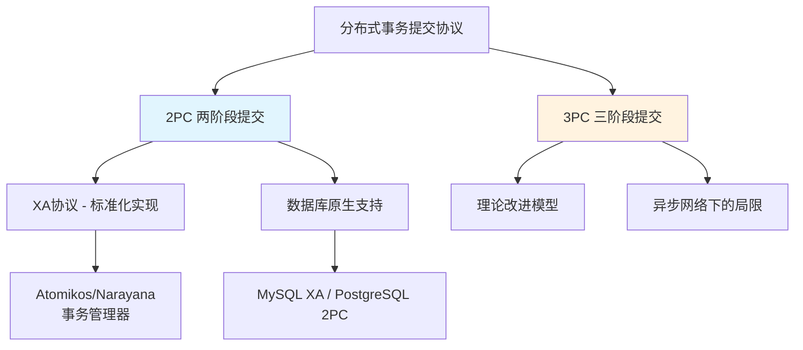
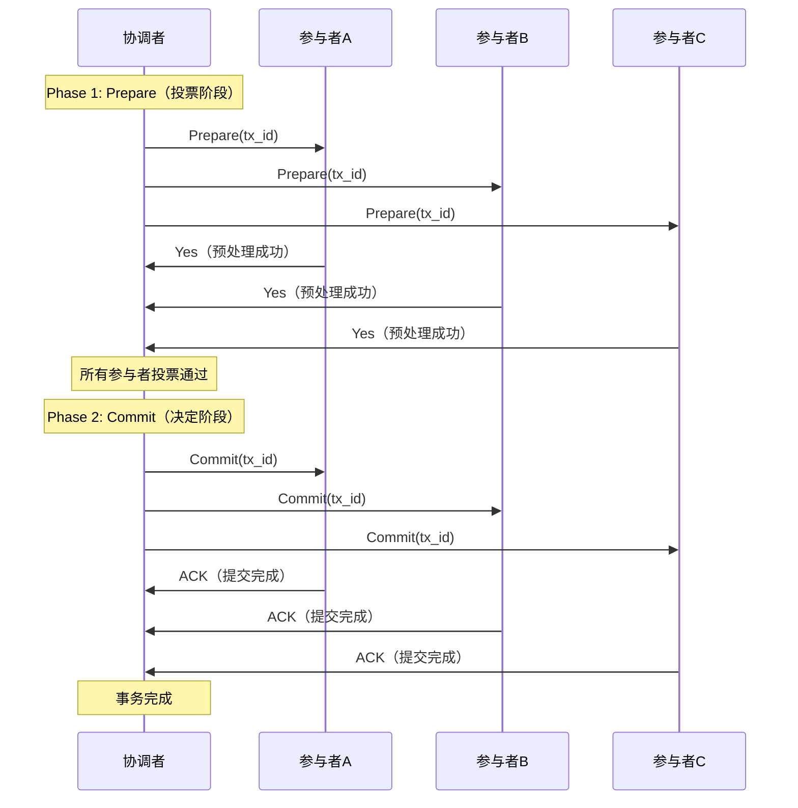
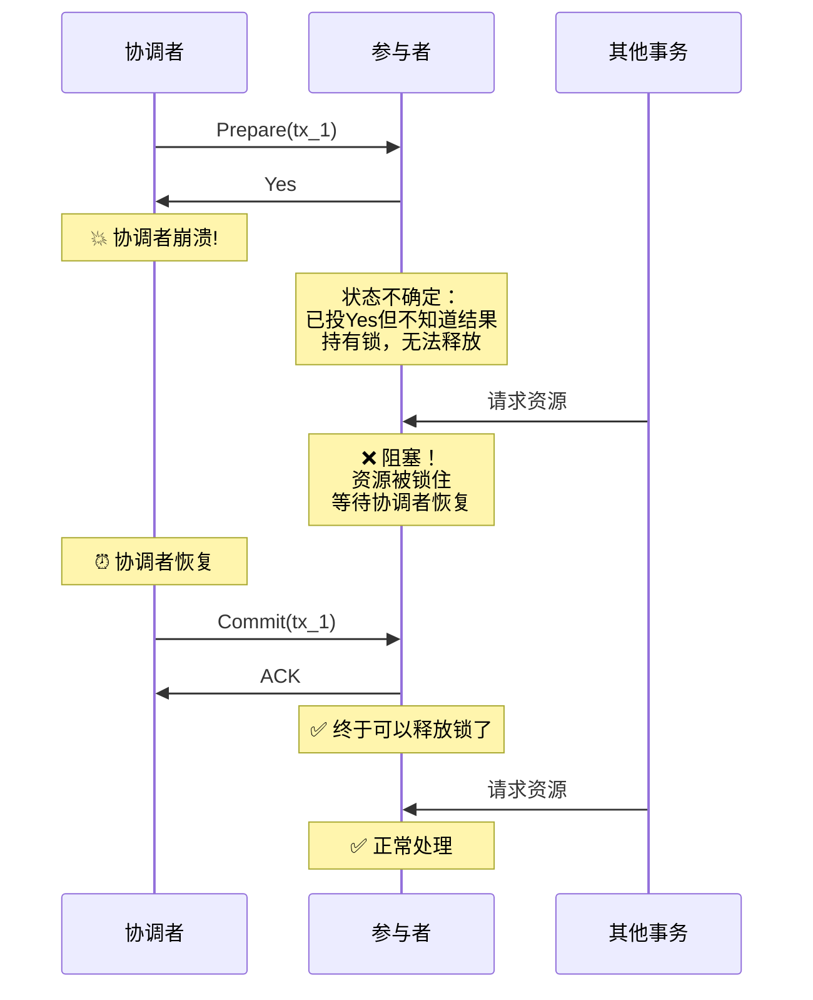
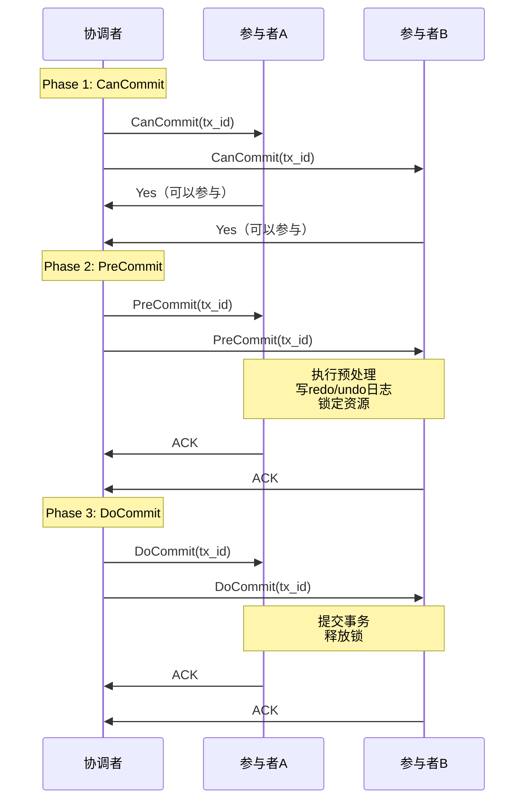
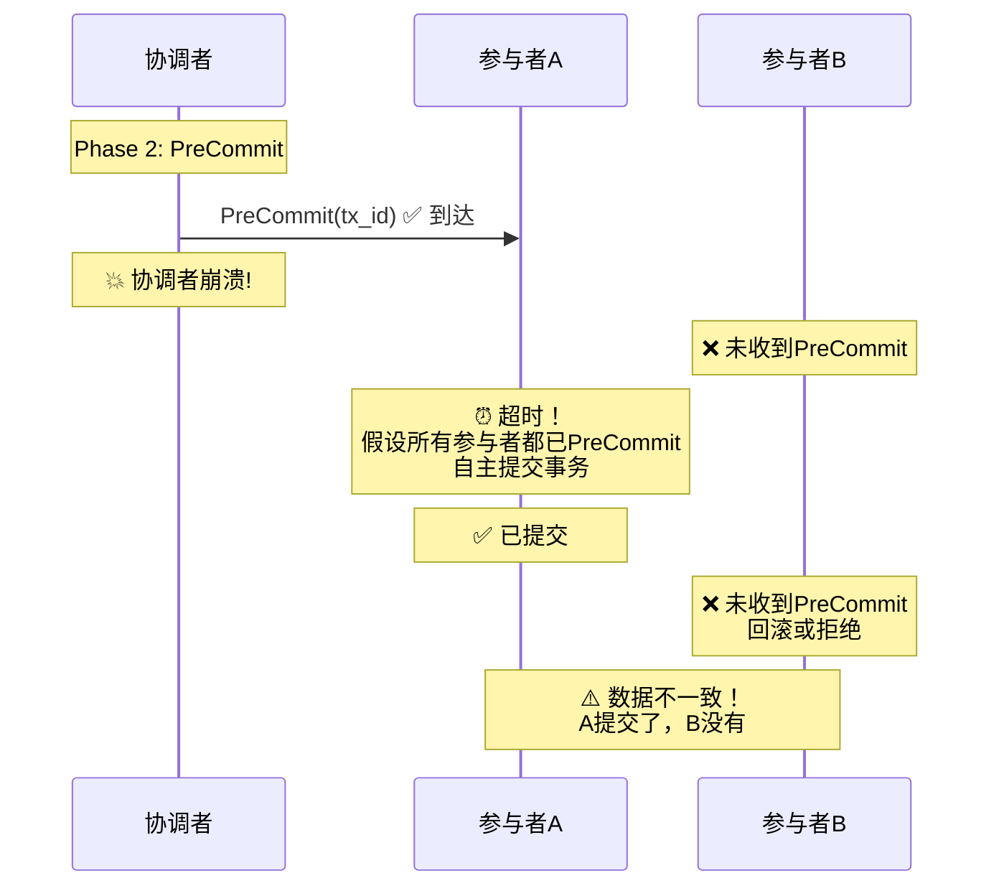
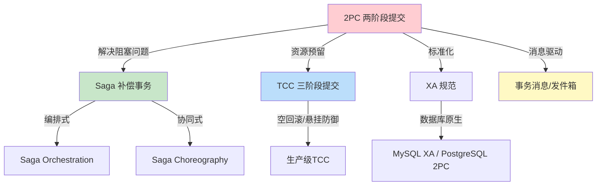

# 2PC与3PC协议：分布式事务提交的理论基石

## 概述与背景

在单机数据库中，一条 `BEGIN...COMMIT` 就能保证数据的原子性。数据库引擎通过 WAL（Write-Ahead Logging）日志、锁机制和 MVCC 来确保事务的 ACID 属性。但当系统拆分为微服务、数据分散在多个独立数据库之后，这个看似简单的保证突然变成了分布式系统中最棘手的问题。

想象一个电商下单场景：订单服务创建订单、库存服务扣减库存、支付服务冻结资金、积分服务累加积分。这四个操作分散在四个独立的服务和数据库中。如果库存扣减成功但支付冻结失败，如何保证订单不会出现"库存已扣但用户没付钱"的脏数据？

分布式事务提交协议正是为了解决这个问题而诞生的。**2PC（Two-Phase Commit，两阶段提交）** 和 **3PC（Three-Phase Commit，三阶段提交）** 是分布式事务领域最经典的两个协议，它们定义了多个参与者如何协调完成一个跨越多个节点的原子操作。理解这两个协议的原理和局限，是理解后续所有分布式事务方案（Saga、TCC、事务消息等）的理论前提。



## 2PC协议：两阶段提交

### 历史渊源

2PC协议由 IBM 研究员 Jim Gray 和 Leslie Lamport 在 1978 年发表的论文 "A Simple, Probabilistic Algorithm for Resolving the Two-Phase Locking Deadlock" 中提出（后在 1981 年的 "The Transaction Concept" 中进一步完善）。它是分布式数据库和事务处理领域最重要的基础协议之一，被写入了 SQL 标准（SQL-92 中的 `BEGIN DISTRIBUTED TRANSACTION`），并成为 XA 规范的核心。

### 协议角色

2PC定义了两类角色：

- **协调者（Coordinator）**：负责发起和管理整个事务的提交过程。协调者决定事务最终是提交还是回滚，是整个协议的"大脑"。在数据库系统中，协调者通常由发起事务的数据库实例或独立的事务管理器（如 Atomikos、Narayana）担任。
- **参与者（Participant）**：事务涉及的各个资源管理器（如数据库实例）。参与者执行本地事务，管理本地资源的锁定和释放，并响应协调者的指令。

### 协议流程

2PC将事务提交分为两个阶段：**Prepare阶段（投票阶段）** 和 **Commit阶段（决定阶段）**。

#### 阶段一：Prepare（投票）

1. 协调者向所有参与者发送 `Prepare` 请求
2. 每个参与者收到请求后：
   - 执行本地事务的预处理（写 redo/undo 日志）
   - 将本地事务状态设置为 "prepared"（已准备好提交）
   - **不提交**本地事务，**释放除事务锁以外的锁**（但保留排他锁直到阶段二）
3. 如果本地预处理成功，参与者回复 `Yes`（同意提交）
4. 如果失败，参与者回复 `No`（拒绝提交）
5. 参与者在回复之后，**必须保证即使发生故障也能完成提交或回滚**——这是2PC正确性的关键约束

#### 阶段二：Commit（决定）

- **所有参与者都回复 `Yes`**：协调者向所有参与者发送 `Commit` 指令，所有参与者提交本地事务，释放所有锁，回复 `ACK`
- **任一参与者回复 `No` 或超时**：协调者向所有参与者发送 `Rollback` 指令，所有参与者回滚本地事务，释放所有锁，回复 `ACK`



### 代码实现

以下是一个2PC协议的简化实现，展示协调者和参与者的核心逻辑：

```python
import asyncio
import uuid
from enum import Enum
from dataclasses import dataclass, field
from typing import Optional

class TxState(Enum):
    """事务状态"""
    INIT = "INIT"
    PREPARED = "PREPARED"
    COMMITTED = "COMMITTED"
    ROLLED_BACK = "ROLLED_BACK"
    UNKNOWN = "UNKNOWN"  # 协调者崩溃后参与者的不确定状态

@dataclass
class TransactionLog:
    """事务日志，用于协调者崩溃恢复"""
    tx_id: str
    state: TxState
    participants: list[str] = field(default_factory=list)
    votes: dict[str, bool] = field(default_factory=dict)

class TwoPhaseCoordinator:
    """2PC协调者"""
    
    def __init__(self, participants: list):
        self.participants = participants
        self.tx_log: dict[str, TransactionLog] = {}
    
    async def execute(self, operations: dict) -> bool:
        """执行分布式事务"""
        tx_id = str(uuid.uuid4())
        
        # 记录事务日志（写持久化存储）
        log = TransactionLog(tx_id=tx_id, state=TxState.INIT,
                           participants=[p.name for p in self.participants])
        self.tx_log[tx_id] = log
        
        # Phase 1: Prepare（投票阶段）
        votes = await self._prepare_phase(tx_id, log)
        
        # Phase 2: Commit or Rollback（决定阶段）
        if all(votes.values()):
            return await self._commit_phase(tx_id, log)
        else:
            return await self._rollback_phase(tx_id, log)
    
    async def _prepare_phase(self, tx_id: str, log: TransactionLog) -> dict:
        """阶段一：向所有参与者发送Prepare请求"""
        votes = {}
        for participant in self.participants:
            try:
                vote = await asyncio.wait_for(
                    participant.prepare(tx_id),
                    timeout=30  # 30秒超时
                )
                votes[participant.name] = vote
                log.votes[participant.name] = vote
            except asyncio.TimeoutError:
                votes[participant.name] = False  # 超时视为拒绝
            except Exception:
                votes[participant.name] = False
        return votes
    
    async def _commit_phase(self, tx_id: str, log: TransactionLog) -> bool:
        """阶段二（提交）：所有投票通过，发送Commit"""
        log.state = TxState.COMMITTED
        acks = []
        for participant in self.participants:
            try:
                ack = await participant.commit(tx_id)
                acks.append(ack)
            except Exception:
                # 协调者需要重试，直到所有参与者都收到Commit
                pass  # 生产环境需要重试机制和持久化
        return len(acks) == len(self.participants)
    
    async def _rollback_phase(self, tx_id: str, log: TransactionLog) -> bool:
        """阶段二（回滚）：任一投票失败，发送Rollback"""
        log.state = TxState.ROLLED_BACK
        for participant in self.participants:
            try:
                await participant.rollback(tx_id)
            except Exception:
                pass  # 协调者需要重试
        return True

class TwoPhaseParticipant:
    """2PC参与者"""
    
    def __init__(self, name: str, db_connection):
        self.name = name
        self.db = db_connection
        self.prepared_txns: dict[str, TxState] = {}
    
    async def prepare(self, tx_id: str) -> bool:
        """Prepare阶段：执行本地预处理，写redo/undo日志"""
        try:
            # 执行本地操作（不提交）
            await self.db.execute_pending_operations()
            # 写prepare日志（持久化，确保崩溃后可恢复）
            await self.db.write_prepare_log(tx_id)
            self.prepared_txns[tx_id] = TxState.PREPARED
            return True
        except Exception:
            return False
    
    async def commit(self, tx_id: str) -> bool:
        """Commit阶段：提交本地事务"""
        await self.db.commit()
        await self.db.write_commit_log(tx_id)
        self.prepared_txns.pop(tx_id, None)
        return True
    
    async def rollback(self, tx_id: str) -> bool:
        """Rollback阶段：回滚本地事务"""
        await self.db.rollback()
        self.prepared_txns.pop(tx_id, None)
        return True
```

### 2PC的核心问题

2PC虽然是分布式事务的经典协议，但它存在几个严重的问题，这些问题直接影响了它在生产环境中的可用性。

#### 1. 同步阻塞（Blocking）

2PC最严重的问题是**同步阻塞**。在Prepare阶段之后、Commit阶段之前，如果协调者崩溃，参与者将陷入"悬而未决"的状态：

- 参与者已经投了 `Yes` 票，表示"我准备好提交了"
- 但参与者不知道最终决定是提交还是回滚
- 参与者**必须持有锁并等待**协调者恢复
- 在等待期间，被锁定的资源无法被其他事务访问

这个等待时间可能是无限的——如果协调者永久崩溃，参与者将永远阻塞。在高并发场景下，这会导致大量事务排队等待，系统吞吐量急剧下降。



#### 2. 单点故障（Single Point of Failure）

协调者是整个协议的单点。如果协调者在Commit阶段发送了部分Commit消息后崩溃：

- 部分参与者已经提交了事务
- 部分参与者还在等待Commit消息
- 造成**数据不一致**——有些节点提交了，有些节点没有

虽然协调者可以通过主备切换来提高可用性，但这增加了系统复杂度，且主备切换过程中仍有窗口期可能导致不一致。

#### 3. 数据不一致（Inconsistency）

当协调者在Commit阶段只向部分参与者发送了Commit消息后崩溃时：

- 收到Commit的参与者：已提交，资源已释放
- 未收到Commit的参与者：仍在等待，资源被锁定
- 即使协调者恢复并重发Commit，也存在时间窗口内的不一致

这种不一致在理论上可以通过协调者的持久化日志和恢复机制来解决，但实际实现中仍然存在复杂的边界情况。

#### 4. 性能瓶颈

2PC需要至少两轮网络通信（Prepare + Commit），且在Prepare和Commit之间存在全局锁：

- **延迟**：至少2个RTT（Round-Trip Time），在跨机房场景下可能达到数十毫秒
- **吞吐量**：全局锁导致并发度受限，所有事务串行化
- **资源占用**：参与者在Prepare后必须持有锁，直到收到Commit或Rollback

以一个典型的电商系统为例：如果每个订单涉及3个参与者（订单、库存、支付），一次2PC事务至少需要6次网络往返（Prepare 3次 + Commit 3次），加上本地日志写入和锁等待，整体延迟可能达到100ms以上。在秒杀场景下，这个延迟是不可接受的。

### XA协议：2PC的工业标准化

XA（eXtended Architecture）是 X/Open 组织制定的分布式事务标准，它在2PC协议的基础上定义了事务管理器（TM）、资源管理器（RM）和应用（AP）之间的接口规范。

XA将2PC协议标准化为以下API调用：

- `xa_start`：开始一个全局事务分支
- `xa_end`：结束事务分支的活跃状态
- `xa_prepare`：准备提交（对应2PC的Prepare阶段）
- `xa_commit`：提交事务（对应2PC的Commit阶段）
- `xa_rollback`：回滚事务（对应2PC的Rollback阶段）
- `xa_recover`：事务管理器崩溃恢复时，查询未完成的事务

**XA事务的典型生命周期**：

```sql
-- MySQL XA事务示例
XA START 'tx_001';            -- 开始XA事务
INSERT INTO orders (id, user_id, amount) VALUES (1, 1001, 99.9);
UPDATE inventory SET count = count - 1 WHERE product_id = 101;
XA END 'tx_001';              -- 结束活跃状态
XA PREPARE 'tx_001';          -- 准备提交（Phase 1）
XA COMMIT 'tx_001';           -- 最终提交（Phase 2）
```

**XA的主流实现**：

| 事务管理器 | 特点 | 适用场景 |
|-----------|------|---------|
| Atomikos | Java开源，嵌入式或独立部署 | 中小规模Java应用 |
| Narayana | Red Hat开源，JBoss内置 | 大型企业应用 |
| MySQL内置XA | 数据库原生支持 | MySQL同构场景 |
| PostgreSQL 2PC | 原生支持PREPARE TRANSACTION | PostgreSQL同构场景 |

**XA的局限性**：

- 只支持同构数据库（都是关系型数据库）
- 性能差——全局锁导致并发度极低
- 不支持非SQL资源（Redis、MQ等）
- 事务管理器本身的高可用也是问题

### 2PC的适用场景

尽管存在上述问题，2PC/XA在特定场景下仍然是合理的选择：

1. **同构数据库的强一致性需求**：当所有参与者都是关系型数据库，且业务对一致性要求极高（如金融核心系统），XA提供了标准化的解决方案
2. **短事务**：事务执行时间很短（毫秒级），锁持有时间有限，阻塞问题不严重
3. **低并发场景**：并发度不高，全局锁的性能影响可以接受
4. **已有数据库支持**：MySQL、PostgreSQL、Oracle等主流数据库都原生支持XA事务，无需额外引入框架

**不适用的场景**：高并发、长事务、异构存储、微服务架构——这些场景需要考虑3PC或更现代的方案。

## 3PC协议：三阶段提交

### 为什么需要3PC

2PC的核心问题是**阻塞**：协调者崩溃后，参与者不知道最终决定，只能无限期等待。3PC（Three-Phase Commit）的提出者 Thomas Lindsay、Jim Gray、Bruce Lindsay 等人（1979年论文 "Nested Transactions in Distributed Systems" 以及后续工作）试图通过在Prepare和Commit之间增加一个额外的阶段来缓解这个问题。

3PC的核心改进是：**引入超时机制，让参与者在协调者崩溃后能够自主决定提交**。

### 协议流程

3PC将事务提交分为三个阶段：**CanCommit**、**PreCommit** 和 **DoCommit**。

#### 阶段一：CanCommit（确认可提交）

1. 协调者向所有参与者发送 `CanCommit` 请求
2. 参与者检查自身状态，确认是否可以参与事务
3. 如果可以，回复 `Yes`；如果不行，回复 `No`
4. **这个阶段不执行任何实际操作，不锁定任何资源**

CanCommit阶段的本质是一个"轻量级投票"——它让协调者提前知道是否有参与者无法参与，避免在PreCommit阶段浪费资源。

#### 阶段二：PreCommit（预提交）

- **所有参与者回复 `Yes`**：协调者向所有参与者发送 `PreCommit` 指令
  - 参与者执行本地事务预处理（写 redo/undo 日志）
  - 将本地事务状态设置为 "prepared"
  - **锁定资源**
  - 回复 `ACK`
- **任一参与者回复 `No` 或超时**：协调者发送 `Abort` 指令
  - 参与者回滚本地操作
  - 释放资源

#### 阶段三：DoCommit（最终提交）

- **协调者发送 `Commit`**：参与者提交本地事务，释放所有锁
- **协调者发送 `Abort`**：参与者回滚本地事务，释放所有锁
- **协调者崩溃，参与者超时**：参与者自动提交事务（关键改进！）



### 3PC的超时机制

3PC最关键的改进是**参与者的超时自主决策**：

- **在PreCommit之后**，如果参与者长时间收不到DoCommit指令，它假设协调者已经崩溃，且所有参与者都已经进入了PreCommit状态（因为只有所有参与者都同意，协调者才会进入PreCommit）
- 因此参与者可以**安全地提交事务**
- 这消除了2PC中的无限阻塞问题

```python
class ThreePhaseParticipant:
    """3PC参与者，支持超时自主提交"""
    
    def __init__(self, name: str, db_connection):
        self.name = name
        self.db = db_connection
        self.state = TxState.INIT
        self.prepared_txns: dict[str, TxState] = {}
    
    async def can_commit(self, tx_id: str) -> bool:
        """CanCommit阶段：仅检查状态，不执行操作"""
        try:
            # 检查本地资源是否可用
            available = await self.db.check_resource_availability()
            return available
        except Exception:
            return False
    
    async def pre_commit(self, tx_id: str) -> bool:
        """PreCommit阶段：执行预处理，写日志，锁定资源"""
        try:
            await self.db.execute_pending_operations()
            await self.db.write_prepare_log(tx_id)
            self.prepared_txns[tx_id] = TxState.PREPARED
            self.state = TxState.PREPARED
            return True
        except Exception:
            return False
    
    async def do_commit(self, tx_id: str) -> bool:
        """DoCommit阶段：提交事务"""
        await self.db.commit()
        await self.db.write_commit_log(tx_id)
        self.prepared_txns.pop(tx_id, None)
        self.state = TxState.COMMITTED
        return True
    
    async def do_commit_with_timeout(self, tx_id: str, timeout: float = 60.0):
        """
        带超时的DoCommit：协调者崩溃时自主提交
        这是3PC的关键改进
        """
        try:
            # 等待协调者的DoCommit指令
            await asyncio.wait_for(self._wait_for_do_commit(tx_id), timeout=timeout)
        except asyncio.TimeoutError:
            # 超时：假设协调者已崩溃，所有参与者都已PreCommit
            # 安全地提交事务
            if tx_id in self.prepared_txns:
                await self.do_commit(tx_id)
    
    async def _wait_for_do_commit(self, tx_id: str):
        """等待协调者发送DoCommit"""
        # 实际实现中会监听网络消息
        pass
```

### 3PC相比2PC的改进

| 维度 | 2PC | 3PC |
|------|-----|-----|
| 阶段数 | 2个（Prepare + Commit） | 3个（CanCommit + PreCommit + DoCommit） |
| 阻塞问题 | 严重：协调者崩溃后参与者无限等待 | 缓解：参与者可超时自主提交 |
| 资源锁定时机 | Prepare阶段即锁定 | PreCommit阶段才锁定（延迟锁定） |
| 网络通信轮次 | 至少2轮 | 至少3轮 |
| 协议复杂度 | 低 | 高 |
| 实际使用 | 广泛（XA标准） | 极少（理论模型） |

### 3PC的局限性

尽管3PC在理论上解决了阻塞问题，但它在实际工程中很少被直接使用，原因如下：

#### 1. 异步网络中的不一致

3PC的超时提交机制依赖于一个假设：**如果协调者在发送PreCommit后崩溃，所有参与者都已经进入了PreCommit状态**。但在异步网络中，这个假设不成立：

- 网络分区可能导致部分参与者收到了PreCommit，而另一部分没有
- 超时后，收到PreCommit的参与者会提交事务
- 没有收到PreCommit的参与者会回滚或拒绝
- **结果：部分提交、部分回滚——数据不一致**

这本质上是CAP定理的体现：在网络分区（Partition）发生时，3PC选择了可用性（Availability），牺牲了一致性（Consistency）。



#### 2. 额外的网络开销

3PC比2PC多了一轮网络通信（CanCommit阶段），增加了至少一个RTT的延迟。在跨机房或跨地域部署的场景下，这个额外的延迟可能达到数十毫秒。

#### 3. 实现复杂度

3PC需要处理三个阶段的状态转换、超时计时器、自主提交逻辑等，实现复杂度远高于2PC。而2PC已经有成熟的XA标准和众多实现（Atomikos、Narayana等），3PC则没有标准化的工业实现。

#### 4. 与CAP定理的冲突

3PC试图同时满足一致性和可用性，但在异步网络中这本身就是不可能的。CAP定理告诉我们，在网络分区发生时，只能在C和A之间选择。3PC的超时提交机制本质上是选择了A而牺牲了C。

## 2PC与3PC的深度对比

### 核心差异总结

| 维度 | 2PC | 3PC |
|------|-----|-----|
| **提出时间** | 1978年 | 1979年 |
| **协议阶段** | 2个 | 3个 |
| **阻塞问题** | 严重（无限阻塞） | 缓解（超时自主提交） |
| **数据一致性** | 强一致（在无故障情况下） | 可能不一致（异步网络中） |
| **资源锁定时机** | Prepare阶段 | PreCommit阶段（延迟锁定） |
| **网络通信轮次** | 2轮 | 3轮 |
| **协调者单点问题** | 严重 | 部分缓解 |
| **工业标准化** | 有（XA规范） | 无 |
| **实际使用** | 广泛 | 极少（理论参考） |
| **CAP选择** | 偏C（一致性） | 偏A（可用性） |

### 性能对比

在典型的3节点事务场景下：

| 指标 | 2PC | 3PC |
|------|-----|-----|
| 最小网络往返 | 6次（3 Prepare + 3 Commit） | 9次（3 CanCommit + 3 PreCommit + 3 DoCommit） |
| 最小延迟（RTT=1ms） | ~6ms | ~9ms |
| 最小延迟（RTT=10ms，跨机房） | ~60ms | ~90ms |
| 锁持有时间 | Prepare → Commit（整个阶段二） | PreCommit → DoCommit（更短） |
| 并发吞吐量 | 低（全局锁时间长） | 略好（延迟锁定） |

### 失败场景分析

| 失败场景 | 2PC行为 | 3PC行为 |
|---------|---------|---------|
| 参与者在Prepare前崩溃 | 协调者超时，回滚所有 | 协调者超时，回滚所有 |
| 参与者在Prepare后崩溃 | 协调者收不到投票，回滚所有 | 协调者收不到投票，回滚所有 |
| 协调者在Prepare后崩溃 | 参与者阻塞等待（核心问题） | 参与者超时自主提交（缓解） |
| 协调者在Commit中途崩溃 | 部分提交、部分等待（不一致） | 部分提交、部分回滚（不一致） |
| 网络分区（协调者可达） | 可通过重试恢复 | CanCommit阶段可提前发现 |
| 网络分区（协调者不可达） | 参与者无限阻塞 | 参与者超时自主提交 |

## 从2PC/3PC到现代分布式事务

2PC和3PC的局限性催生了一系列现代分布式事务方案。理解这些方案如何解决2PC/3PC的问题，是深入掌握分布式事务的关键。

### 现代方案如何解决2PC/3PC的问题

| 2PC/3PC的问题 | 现代方案的解决思路 |
|---------------|-------------------|
| 全局锁导致阻塞和低性能 | Saga：不锁定资源，用补偿代替回滚 |
| 协调者单点故障 | Saga编排器：持久化状态，支持故障恢复 |
| 长事务锁定资源时间过长 | TCC：资源预留（冻结），缩短锁持有时间 |
| 强一致性导致可用性低 | 最终一致性：异步消息 + 补偿 |
| 同构数据库限制 | TCC/Saga：支持异构存储（MySQL+Redis+MQ） |

### 分布式事务方案演进图谱



**关键洞察**：现代分布式事务方案并不是要"替代"2PC，而是在2PC的基础上，根据不同的业务场景和一致性需求，选择合适的折中方案。Saga牺牲了一致性换取可用性和性能；TCC在一致性和性能之间找到了平衡；事务消息则通过异步化进一步提升了吞吐量。

## 常见误区与最佳实践

### 误区一：2PC能保证100%的一致性

**事实**：2PC只能保证"所有参与者都提交"或"所有参与者都回滚"的原子性，但它无法处理协调者在Commit阶段中途崩溃的情况。此时可能出现部分参与者已提交、部分参与者未提交的不一致状态。实际生产中需要配合协调者的持久化日志和恢复机制来最大程度保证一致性。

### 误区二：3PC比2PC更好，应该优先使用

**事实**：3PC虽然缓解了阻塞问题，但在异步网络中可能导致数据不一致（Split-Brain），且没有标准化的工业实现。在实际工程中，2PC/XA仍然是同构数据库场景的标准方案，而3PC更多作为理论参考。真正的"更好"方案是根据场景选择Saga、TCC等现代方案。

### 误区三：分布式事务能用就用

**事实**：分布式事务是"最后的手段"，不是"第一选择"。经验法则：
- 能用本地事务解决的，绝不用分布式事务
- 能用最终一致性的，不用强一致性
- 能用Saga的，不用TCC（实现复杂度更低）
- 能用消息异步化的，不用同步协调

### 误区四：XA事务性能差就不能用

**事实**：XA事务的性能确实不如无事务场景，但在特定条件下是合理的：
- 事务执行时间短（毫秒级），锁持有时间有限
- 并发度不高，全局锁的影响可控
- 对一致性要求极高（如金融核心账务）
- 同构数据库，无需额外框架

### 最佳实践

1. **事务日志必须持久化**：无论是协调者还是参与者，事务状态必须写入持久化存储，否则崩溃恢复无法进行
2. **超时机制不可少**：设置合理的超时时间，避免无限阻塞
3. **幂等性设计**：所有事务操作（Prepare、Commit、Rollback）都必须支持幂等重试
4. **监控和告警**：监控事务的执行时间、成功率、阻塞等待时间，设置告警阈值
5. **降级策略**：当分布式事务超时或失败时，有明确的降级方案（如重试、人工介入、补偿）

## 本节小结

2PC和3PC是分布式事务提交协议的理论基石。2PC通过协调者和参与者的两阶段交互实现原子提交，是XA规范和众多分布式事务框架的基础；3PC通过引入CanCommit阶段和超时机制，部分缓解了2PC的阻塞问题，但在异步网络中可能导致数据不一致。

理解2PC/3PC的原理和局限，是理解后续所有分布式事务方案的前提。Saga、TCC、事务消息等现代方案，本质上都是在2PC/3PC的基础上，根据不同的业务场景和一致性需求做出的工程折中。在实际系统设计中，没有"最好"的方案，只有"最适合"的方案——架构师的核心能力就是根据业务场景做出合理的取舍。
