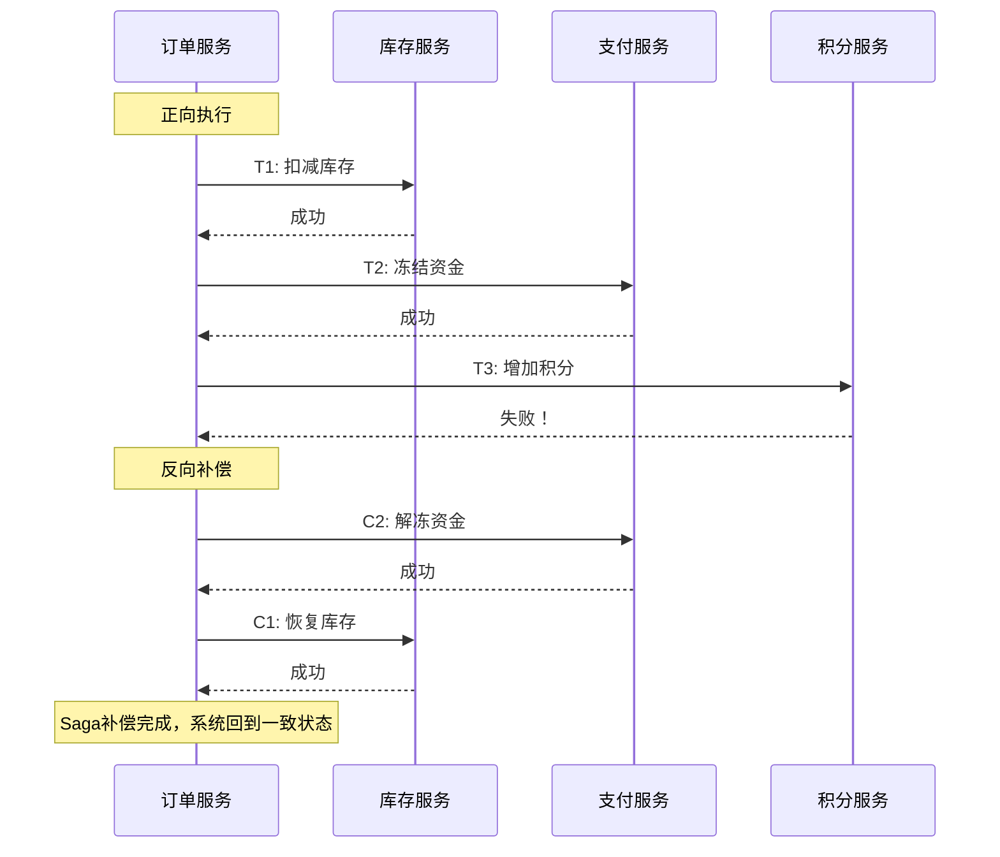
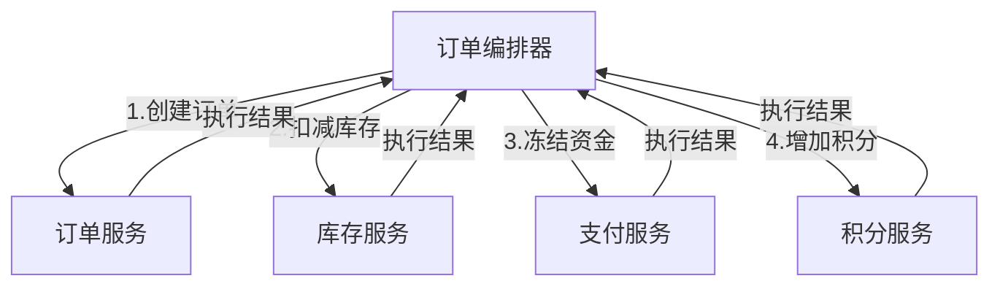
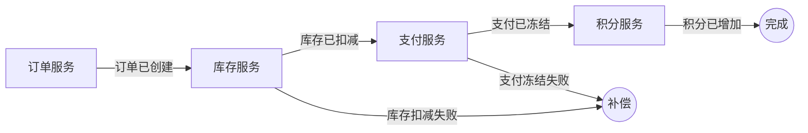
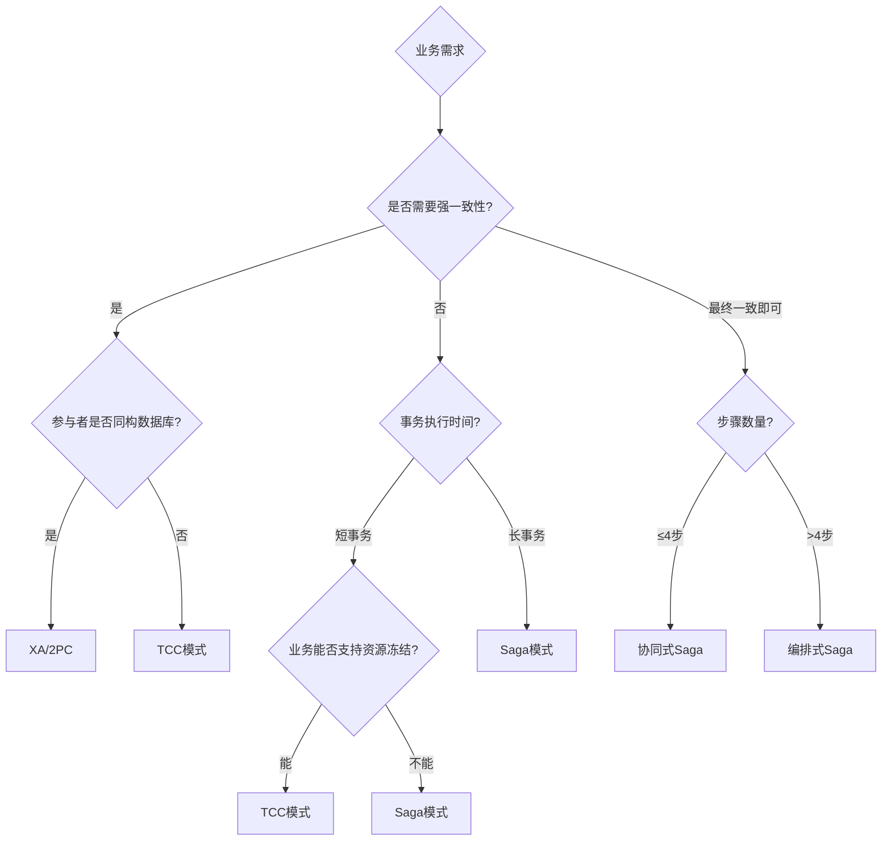
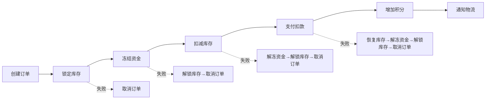
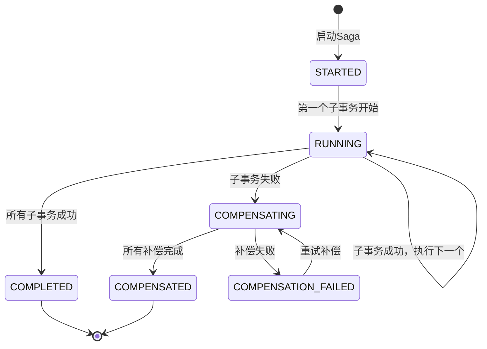

# Saga模式：长事务的补偿之道

## 1. 概述与起源

### 1.1 什么是Saga

Saga模式是一种将长事务（Long Lived Transaction）拆分为一系列短事务的分布式事务解决方案。每个短事务称为一个**子事务（Local Transaction）**，都有对应的**补偿操作（Compensating Transaction）**。如果某个子事务失败，系统会按照反向顺序依次执行已完成子事务的补偿操作，实现**最终一致性**。

Saga的核心思想可以用一句话概括：**用补偿代替回滚**。

在单机数据库中，事务失败可以通过undo log直接回滚，所有操作要么全部生效要么全部不生效。但在微服务架构下，一个业务操作可能跨越多个服务和数据库，无法用单个数据库事务包裹。Saga通过"正向执行 + 反向补偿"的方式，在不锁定全局资源的前提下，实现了跨服务的事务一致性。

### 1.2 历史背景

Saga模式由 **Hector Garcia-Molina** 和 **Kenneth Salem** 在1987年的论文《Sagas》中提出，发表于ACM SIGMOD国际会议。最初是为了解决长时事务（如长时间运行的工程设计事务、大型批处理作业）在传统锁机制下的性能问题。

传统事务使用锁来保证原子性，但长事务持有锁的时间可能长达数分钟甚至数小时，导致其他事务长时间阻塞。Garcia-Molina和Salem提出了一种不使用长时间锁的替代方案：将长事务分解为一系列可以独立提交的子事务，每个子事务执行完后立即释放锁。如果后续步骤失败，通过执行补偿操作来撤销已完成子事务的效果。

随着微服务架构的兴起，Saga模式被重新发现并广泛应用。Netflix、Uber、Airbnb等公司都在生产环境中大量使用Saga模式来处理跨服务的业务流程。

### 1.3 Saga解决的核心问题

在微服务架构中，以下场景天然需要Saga：

| 场景 | 涉及服务 | 典型问题 |
|------|----------|----------|
| 电商下单 | 订单、库存、支付、积分、物流 | 库存已扣但支付失败，如何恢复？ |
| 银行转账 | 转出账户、转入账户、清算系统 | 转出成功但转入失败，资金去哪了？ |
| 旅行预订 | 机票、酒店、租车、景点门票 | 机票已订但酒店无房，如何取消？ |
| 外卖配送 | 商家接单、骑手调度、用户支付 | 商家已备餐但骑手取消，如何处理？ |

这些问题的共同特点是：操作跨多个独立服务，每个服务有自己的数据库，无法用单个ACID事务覆盖全部操作。

## 2. 核心原理

### 2.1 基本模型

一个Saga由一系列子事务 $T_1, T_2, ..., T_n$ 和对应的补偿事务 $C_1, C_2, ..., C_n$ 组成。执行规则如下：

正向执行：T_1 → T_2 → ... → T_n（顺序执行所有子事务）

补偿执行：C_n → C_{n-1} → ... → C_1（反向补偿已完成的子事务）

**成功路径**：所有子事务 $T_1$ 到 $T_n$ 全部执行成功，Saga完成。

**失败路径**：假设 $T_k$ 失败（$k \leq n$），则反向执行补偿操作 $C_{k-1} \to C_{k-2} \to ... \to C_1$。

### 2.2 电商下单的Saga示例

以电商下单为例，展示Saga的完整执行过程：



对应的伪代码：

```python
class OrderSaga:
    """电商下单Saga"""

    def execute(self, order):
        steps = [
            SagaStep(
                name="扣减库存",
                action=lambda: inventory_service.deduct(order.sku, order.quantity),
                compensation=lambda: inventory_service.restore(order.sku, order.quantity),
            ),
            SagaStep(
                name="冻结资金",
                action=lambda: payment_service.freeze(order.userId, order.amount),
                compensation=lambda: payment_service.unfreeze(order.userId, order.amount),
            ),
            SagaStep(
                name="增加积分",
                action=lambda: points_service.add(order.userId, order.points),
                compensation=lambda: points_service.deduct(order.userId, order.points),
            ),
        ]

        completed_steps = []
        for step in steps:
            try:
                step.action()
                completed_steps.append(step)
            except Exception as e:
                # 按反向顺序执行补偿
                for s in reversed(completed_steps):
                    safe_compensate(s)
                raise SagaFailed(f"步骤 {step.name} 失败: {e}")

        return order
```

### 2.3 补偿操作的设计原则

补偿操作不是简单的"反向操作"，而是需要遵循严格的语义约束：

**语义等价性**：补偿操作必须使系统状态等价于该子事务未执行的状态。例如，"扣减库存100件"的补偿是"增加库存100件"，而不是"设置库存为某个固定值"。

**幂等性**：补偿操作可能被重复执行（网络重试、进程重启），因此必须是幂等的。多次执行和一次执行的效果相同。

**可交换性**：在并发场景下，补偿操作可能与其他操作并发执行，设计时需要考虑执行顺序的影响。

**补偿失败处理**：如果补偿操作本身也失败了，系统需要有兜底机制，如重试、人工介入、记录日志供后续修复。

| 设计原则 | 含义 | 反例 |
|----------|------|------|
| 语义等价 | 状态回到未执行状态 | 用固定值覆盖而非增量操作 |
| 幂等 | 多次执行效果相同 | 扣减积分时用累加而非set |
| 可重试 | 网络抖动时自动恢复 | 没有重试机制的补偿 |
| 兜底 | 补偿失败有最终手段 | 补偿失败后无人处理 |

**注意**：有些操作在业务语义上是**不可补偿**的。例如"发送短信通知"无法真正撤销——用户已经看到了短信。对于不可补偿的操作，通常将其放在Saga的最后一步执行，或者将其设计为可重试但不产生副作用的操作。

## 3. 两种协调方式

Saga有两种主流的协调方式：**编排式（Orchestration）** 和 **协同式（Choreography）**。两者在架构设计、适用场景、优劣权衡上有显著差异。

### 3.1 编排式Saga（Orchestration）

编排式Saga由一个**中央编排器（Orchestrator）** 统一管理所有子事务的执行顺序、条件判断和补偿逻辑。所有参与者只与编排器交互，彼此之间不直接通信。



**编排器的职责**：

1. **流程定义**：声明式地定义子事务的执行顺序、条件分支和补偿策略
2. **状态管理**：持久化Saga的执行状态，支持故障恢复
3. **错误处理**：捕获子事务失败，触发补偿流程
4. **重试控制**：管理子事务的重试策略（指数退避、最大重试次数）
5. **超时管理**：监控子事务的执行时间，超时自动触发补偿

**编排器示例代码**：

```python
class OrderOrchestrator:
    """订单Saga编排器"""

    def __init__(self):
        self.state_store = SagaStateStore()  # 持久化Saga状态

    def start(self, order_request):
        saga_id = str(uuid.uuid4())
        saga = SagaDefinition(
            id=saga_id,
            steps=[
                SagaStep("创建订单", self.create_order, self.cancel_order),
                SagaStep("扣减库存", self.deduct_inventory, self.restore_inventory),
                SagaStep("冻结资金", self.freeze_payment, self.unfreeze_payment),
                SagaStep("增加积分", self.add_points, self.deduct_points),
            ],
            compensation_strategy="reverse",  # 反向补偿
        )

        self.state_store.save(saga_id, saga, status="STARTED")
        return self.execute(saga)

    def execute(self, saga):
        for i, step in enumerate(saga.steps):
            try:
                result = step.action(saga.context)
                saga.context.update(result)
                saga.completed_steps.append(i)
                self.state_store.save(saga.id, saga, status="RUNNING")
            except Exception as e:
                self.state_store.save(saga.id, saga, status="COMPENSATING")
                self.compensate(saga, i)
                self.state_store.save(saga.id, saga, status="COMPENSATED")
                raise

        self.state_store.save(saga.id, saga, status="COMPLETED")
        return saga.context

    def compensate(self, saga, failed_index):
        for i in range(failed_index - 1, -1, -1):
            step = saga.steps[i]
            self._safe_compensate(step, saga.context)

    def _safe_compensate(self, step, context):
        """安全补偿：最多重试3次"""
        for attempt in range(3):
            try:
                step.compensation(context)
                return
            except Exception:
                if attempt == 2:
                    # 补偿失败，记录日志，等待人工介入
                    logger.critical(f"补偿操作 {step.name} 失败，需人工处理")
                    self.alert_ops(step, context)
```

**编排式的优势**：

- **流程清晰**：所有逻辑集中在编排器中，易于理解和维护
- **状态集中**：Saga状态统一管理，故障恢复简单
- **解耦参与者**：服务之间不需要互相了解，只与编排器交互
- **容易变更**：修改流程只需改编排器，不需要改动参与者

**编排式的劣势**：

- **单点风险**：编排器是单点，宕机会影响整个流程
- **职责过重**：编排器承担了所有业务逻辑，容易变成"上帝类"
- **性能瓶颈**：所有请求都经过编排器，可能成为性能瓶颈

### 3.2 协同式Saga（Choreography）

协同式Saga没有中央编排器，各服务通过**事件驱动**的方式自主协调。每个服务完成自己的子事务后发布事件，其他服务监听相关事件并执行自己的子事务。



**协同式的执行流程**：

```python
# ===== 订单服务 =====
class OrderService:
    """发布订单创建事件"""

    def create_order(self, order):
        # 执行本地事务
        order = self.db.save(order)
        # 发布事件
        event_bus.publish("order.created", {
            "order_id": order.id,
            "user_id": order.user_id,
            "items": order.items,
        })
        return order

# ===== 库存服务 =====
class InventoryService:
    """监听订单创建事件，扣减库存"""

    @listen("order.created")
    def on_order_created(self, event):
        try:
            for item in event["items"]:
                self.db.deduct(item["sku"], item["quantity"])
            event_bus.publish("inventory.deducted", {
                "order_id": event["order_id"],
            })
        except StockInsufficient:
            # 库存不足，发布补偿事件
            event_bus.publish("inventory.deduct_failed", {
                "order_id": event["order_id"],
            })

# ===== 支付服务 =====
class PaymentService:
    """监听库存扣减事件，冻结资金"""

    @listen("inventory.deducted")
    def on_inventory_deducted(self, event):
        try:
            self.db.freeze(event["user_id"], event["amount"])
            event_bus.publish("payment.frozen", {
                "order_id": event["order_id"],
            })
        except InsufficientBalance:
            event_bus.publish("payment.freeze_failed", {
                "order_id": event["order_id"],
            })

    @listen("inventory.deduct_failed")
    def on_inventory_deduct_failed(self, event):
        """库存扣减失败，无需补偿（尚未执行任何操作）"""
        pass
```

**协同式的优势**：

- **无单点故障**：没有中央编排器，任何服务宕机不影响其他服务
- **松耦合**：服务之间通过事件解耦，可以独立部署和扩展
- **高性能**：无需经过中心节点，延迟更低
- **天然异步**：事件驱动架构本身就是异步的，吞吐量高

**协同式的劣势**：

- **流程分散**：业务逻辑分散在各个服务中，难以理解和调试
- **循环依赖**：服务之间可能形成隐式的循环依赖
- **事务追踪困难**：一个Saga涉及的所有事件散落在多个服务中，排查问题需要跨服务追踪
- **补偿逻辑复杂**：每个服务都需要自己管理补偿逻辑，容易遗漏
- **变更困难**：修改流程可能需要同时改动多个服务

### 3.3 两种方式的对比

| 维度 | 编排式（Orchestration） | 协同式（Choreography） |
|------|------------------------|----------------------|
| 架构 | 中央编排器统一调度 | 事件驱动，自主协调 |
| 耦合度 | 低（服务只与编排器交互） | 极低（服务间通过事件通信） |
| 可理解性 | 高（流程集中可见） | 低（流程分散在各服务中） |
| 可维护性 | 高（改一处即可） | 低（需改动多个服务） |
| 单点风险 | 有（编排器是单点） | 无 |
| 扩展性 | 受编排器限制 | 理论上无限扩展 |
| 调试难度 | 低（状态集中） | 高（需要分布式追踪） |
| 适用场景 | 步骤多（>5步）、流程复杂 | 步骤少（2-4步）、逻辑简单 |
| 典型框架 | Seata Saga、Temporal、Camunda | Spring Cloud Stream、Kafka |

**选择建议**：

- 子事务数量 ≤ 4个且流程简单：优先选择**协同式**
- 子事务数量 > 4个或流程包含条件分支：选择**编排式**
- 团队经验有限：选择**编排式**（更容易理解和维护）
- 对延迟要求极高：选择**协同式**（无中心节点开销）
- 需要强审计追踪：选择**编排式**（状态集中管理）

## 4. Saga的执行保证

### 4.1 隔离性问题

Saga最大的理论缺陷是**缺乏隔离性**。在2PC中，所有操作在Prepare阶段完成后才统一提交，中间状态对外不可见。但Saga的子事务是独立提交的，中间状态可能被其他事务读到。

**脏读问题**：假设用户A和用户B同时购买同一件商品（库存仅剩1件）：

时间线：
T1(A): 扣减库存 → 成功（库存=0）
T1(B): 扣减库存 → 失败（库存不足）
T2(A): 冻结资金 → 成功
T2(A): 增加积分 → 失败！
  → 补偿T2(A): 解冻资金
  → 补偿T1(A): 恢复库存

问题：在T1(A)和T2(A)之间，用户B看到库存为0，下单失败。
但T2(A)最终补偿了，库存恢复为1。如果B在这期间放弃了购买，
这1件库存就"浪费"了。

**读脏写问题**：服务B读取了服务A的中间状态数据，但A后续补偿了该数据，导致B基于错误数据做出了决策。

### 4.2 常见的隔离性解决方案

**语义锁（Semantic Lock）**：在子事务中为数据加上"语义锁"标记，其他事务读到带锁标记的数据时知道该数据处于不确定状态，可以选择等待或拒绝操作。

```python
class InventoryService:
    def deduct_with_semantic_lock(self, sku, quantity):
        # 1. 加语义锁（状态=PROCESSING）
        self.db.execute("""
            UPDATE inventory
            SET status = 'PROCESSING', quantity = quantity - %s
            WHERE sku = %s AND quantity >= %s AND status = 'AVAILABLE'
        """, (quantity, sku, quantity))

    def restore(self, sku, quantity):
        # 恢复库存，状态回到AVAILABLE
        self.db.execute("""
            UPDATE inventory
            SET status = 'AVAILABLE', quantity = quantity + %s
            WHERE sku = %s
        """, (quantity, sku))
```

**交换语义（Commutative Updates）**：设计子事务使其操作满足交换律，即操作顺序不影响最终结果。例如，"增加100积分"和"增加200积分"无论以什么顺序执行，最终结果都是增加300积分。

**悲观视图（Pessimistic View）**：在Saga开始前锁定所有需要的资源，确保中间状态不被其他事务干扰。这实际上退化为类2PC的方式，牺牲了Saga的性能优势。

**重读值（Read-Your-Write）**：读取数据时只信任自己之前写入的值，不读取其他事务的中间状态。例如，支付服务在检查用户余额时，只看自己之前冻结的资金，不看库存服务的中间状态。

| 隔离方案 | 实现复杂度 | 性能影响 | 适用场景 |
|----------|-----------|----------|----------|
| 语义锁 | 中 | 低 | 通用场景，最常用 |
| 交换语义 | 低 | 无 | 操作可交换的场景（计数器、余额） |
| 悲观视图 | 低 | 高 | 强一致性要求的场景 |
| 重读值 | 中 | 无 | 服务只关心自己数据的场景 |

### 4.3 幂等性保证

Saga中的每个子事务和补偿操作都必须是幂等的，因为网络超时可能导致重试，进程重启可能导致重复执行。

**幂等实现方案**：

```python
class IdempotentHandler:
    """基于唯一ID的幂等处理器"""

    def __init__(self, db):
        self.db = db

    def execute(self, request_id, operation):
        # 1. 检查是否已执行过
        existing = self.db.query(
            "SELECT status FROM idempotent_records WHERE request_id = %s",
            (request_id,)
        )

        if existing and existing.status == "COMPLETED":
            return existing.result  # 直接返回上次结果

        if existing and existing.status == "PROCESSING":
            return None  # 正在处理中，等待或跳过

        # 2. 标记为处理中
        self.db.execute("""
            INSERT INTO idempotent_records (request_id, status)
            VALUES (%s, 'PROCESSING')
            ON CONFLICT (request_id) DO NOTHING
        """, (request_id,))

        # 3. 执行操作
        try:
            result = operation()
            # 4. 标记为完成
            self.db.execute("""
                UPDATE idempotent_records
                SET status = 'COMPLETED', result = %s
                WHERE request_id = %s
            """, (json.dumps(result), request_id))
            return result
        except Exception as e:
            # 5. 标记为失败
            self.db.execute("""
                UPDATE idempotent_records
                SET status = 'FAILED', error = %s
                WHERE request_id = %s
            """, (str(e), request_id))
            raise
```

## 5. Saga vs 其他分布式事务方案

### 5.1 Saga vs 2PC

| 维度 | Saga | 2PC |
|------|------|-----|
| 一致性 | 最终一致 | 强一致（阻塞式） |
| 隔离性 | 无（需额外机制补偿） | 有（全局锁） |
| 性能 | 高（无锁） | 低（全局锁、阻塞等待） |
| 可用性 | 高（单个服务故障不影响其他） | 低（协调者/参与者阻塞） |
| 实现复杂度 | 中（需设计补偿逻辑） | 低（协议固定） |
| 适用事务长度 | 长事务 | 短事务 |
| 资源占用 | 低 | 高（持有锁直到全局提交） |
| 典型超时 | 分钟级 | 秒级 |

**关键权衡**：2PC通过全局锁保证了强一致性，但代价是性能和可用性。Saga放弃了强一致性和隔离性，换来了高性能和高可用。在微服务架构下，网络延迟和分区是常态，2PC的阻塞等待可能导致级联故障，因此Saga成为了更务实的选择。

### 5.2 Saga vs TCC

| 维度 | Saga | TCC |
|------|------|-----|
| 一致性 | 最终一致 | 准强一致 |
| 隔离性 | 无 | 通过资源冻结实现 |
| 业务侵入 | 低（只需补偿逻辑） | 高（需实现Try/Confirm/Cancel） |
| 实现复杂度 | 中 | 高（三个接口 + 防悬挂 + 空回滚） |
| 资源占用 | 无预留 | 需要冻结资源 |
| 性能 | 高 | 中（冻结操作有开销） |
| 适用场景 | 流程长、步骤多 | 资金类、对一致性要求高 |

**关键权衡**：TCC通过资源冻结（Try阶段）提供了比Saga更强的隔离性，但代价是业务侵入高——每个服务都需要实现Try/Confirm/Cancel三个接口。Saga的业务侵入更低，只需要在正常操作之外提供一个补偿操作。

### 5.3 方案选型决策



## 6. 实际应用场景

### 6.1 场景一：电商订单履约

电商订单履约是Saga最经典的应用场景。一个完整的订单流程涉及库存、支付、物流、积分等多个服务。

**Saga流程**：



**关键设计决策**：

1. 将"锁定库存"放在第一步，因为库存是最稀缺的资源
2. "增加积分"放在支付成功之后，避免补偿积分的复杂性
3. "通知物流"作为最后一步，且设计为可重试、不产生副作用的操作
4. 每个步骤设置30秒超时，超时自动触发补偿

### 6.2 场景二：跨行转账

跨行转账是Saga在金融领域的典型应用。不同银行的系统是独立的，无法用2PC协调。

```python
class TransferSaga:
    """跨行转账Saga"""

    def execute(self, transfer):
        # 步骤1：冻结转出账户资金
        source_frozen = bank_a.freeze(transfer.from_account, transfer.amount)
        # 步骤2：通知转入银行
        try:
            bank_b.credit(transfer.to_account, transfer.amount)
        except Exception:
            # 补偿：解冻转出账户资金
            bank_a.unfreeze(transfer.from_account, transfer.amount)
            raise
        # 步骤3：扣减转出账户资金（从冻结变为实际扣减）
        try:
            bank_a.confirm_debit(transfer.from_account, transfer.amount)
        except Exception:
            # 补偿：退回转入资金 + 解冻转出资金
            bank_b.debit(transfer.to_account, transfer.amount)
            bank_a.unfreeze(transfer.from_account, transfer.amount)
            raise

        return {"status": "success", "transfer_id": transfer.id}
```

**注意**：金融场景对Saga的可靠性要求极高。实践中通常需要增加以下保障：

- **对账机制**：定期核对转出和转入的金额是否一致
- **人工干预入口**：补偿失败时自动通知运维人员
- **幂等令牌**：防止网络重试导致重复转账

### 6.3 场景三：旅行预订平台

旅行预订涉及机票、酒店、租车等多个供应商，是最适合Saga的场景之一——步骤多、执行时间长、每个步骤都可能失败。

**编排式实现要点**：

1. 定义清晰的补偿优先级：已付款的服务优先补偿
2. 处理部分补偿：某些供应商可能拒绝退款，需要记录并标记
3. 支持超时补偿：供应商API可能长时间无响应，需要超时后自动补偿
4. 提供补偿重试队列：补偿失败的操作进入重试队列，定期重试

## 7. Saga模式的工程挑战

### 7.1 补偿失败怎么办

补偿操作本身也可能失败（网络超时、服务宕机、业务规则冲突）。这是Saga模式最棘手的问题之一。

**多层防御策略**：

第1层：自动重试
  └─ 补偿失败后，以指数退避策略自动重试（最多3次）

第2层：持久化重试队列
  └─ 自动重试耗尽后，将补偿操作写入重试队列，由后台Job持续重试

第3层：告警与人工介入
  └─ 重试队列超过24小时仍未成功，触发告警通知运维人员

第4层：对账与修复
  └─ 通过定期对账发现不一致数据，由财务/运维人员手动修复

```python
class CompensationRetryHandler:
    """补偿重试处理器"""

    def compensate_with_retry(self, step, context, max_retries=3):
        for attempt in range(max_retries):
            try:
                step.compensation(context)
                return True
            except Exception as e:
                wait_time = 2 ** attempt  # 指数退避：1s, 2s, 4s
                time.sleep(wait_time)
                logger.warning(f"补偿重试 {attempt+1}/{max_retries}: {step.name}")

        # 自动重试耗尽，进入持久化重试队列
        self.enqueue_compensation(step, context)
        self.send_alert(step, context)
        return False

    def enqueue_compensation(self, step, context):
        """将失败的补偿操作写入数据库重试队列"""
        db.execute("""
            INSERT INTO compensation_retry_queue
            (step_name, context, status, created_at, next_retry_at)
            VALUES (%s, %s, 'PENDING', NOW(), NOW() + INTERVAL '5 minutes')
        """, (step.name, json.dumps(context)))
```

### 7.2 Saga的可观测性

Saga的可观测性是生产环境中的关键需求。一个典型的Saga可能跨越多个服务、执行数十个操作，如果没有良好的可观测性，排查问题将极其困难。

**需要监控的指标**：

| 指标 | 含义 | 告警阈值 |
|------|------|----------|
| Saga完成率 | 正常完成的Saga比例 | < 99% |
| Saga补偿率 | 触发补偿的Saga比例 | > 5% |
| 平均执行时间 | Saga从开始到完成的耗时 | > 30s |
| P99执行时间 | 99分位耗时 | > 60s |
| 补偿成功率 | 补偿操作成功执行的比例 | < 95% |
| 死信队列积压 | 补偿重试队列中等待处理的数量 | > 100 |

**分布式追踪集成**：通过OpenTelemetry等分布式追踪工具，为每个Saga生成唯一的Trace ID，将所有子事务的执行记录串联起来。

```python
from opentelemetry import trace

tracer = trace.get_tracer("order-saga")

class TracedSagaOrchestrator:
    def execute_step(self, step, context):
        with tracer.start_as_current_span(f"saga.{step.name}") as span:
            span.set_attribute("saga.id", context.saga_id)
            span.set_attribute("saga.step", step.name)
            span.set_attribute("saga.step_index", step.index)
            try:
                result = step.action(context)
                span.set_attribute("saga.result", "success")
                return result
            except Exception as e:
                span.set_attribute("saga.result", "failed")
                span.set_attribute("saga.error", str(e))
                raise
```

### 7.3 Saga的状态持久化

Saga的执行状态必须持久化到数据库或持久化存储中。否则，编排器进程重启后将丢失所有Saga的执行进度，导致部分子事务已执行但无法继续或补偿。

**状态机设计**：



**状态表设计**：

```sql
CREATE TABLE saga_instances (
    saga_id         VARCHAR(64) PRIMARY KEY,
    saga_type       VARCHAR(64) NOT NULL,
    status          VARCHAR(20) NOT NULL,  -- STARTED/RUNNING/COMPENSATING/COMPLETED/COMPENSATED
    current_step    INT NOT NULL DEFAULT 0,
    total_steps     INT NOT NULL,
    context         JSONB NOT NULL,         -- Saga上下文数据
    error_message   TEXT,
    created_at      TIMESTAMP DEFAULT NOW(),
    updated_at      TIMESTAMP DEFAULT NOW(),
    completed_at    TIMESTAMP
);

CREATE TABLE saga_steps (
    saga_id         VARCHAR(64) REFERENCES saga_instances(saga_id),
    step_index      INT NOT NULL,
    step_name       VARCHAR(64) NOT NULL,
    status          VARCHAR(20) NOT NULL,   -- PENDING/EXECUTED/COMPENSATED
    request_data    JSONB,
    response_data   JSONB,
    error_message   TEXT,
    started_at      TIMESTAMP,
    completed_at    TIMESTAMP,
    PRIMARY KEY (saga_id, step_index)
);

CREATE INDEX idx_saga_status ON saga_instances(status);
CREATE INDEX idx_saga_created ON saga_instances(created_at);
```

### 7.4 超时与死信处理

Saga中的子事务可能因为服务宕机、网络分区等原因长时间无响应。必须为每个子事务设置超时时间，超时后自动触发补偿。

**超时策略**：

```python
class SagaTimeoutConfig:
    """Saga超时配置"""
    step_timeout = 30          # 单步超时：30秒
    saga_timeout = 300         # 整体超时：5分钟
    compensation_timeout = 60  # 补偿超时：60秒
    max_retry_count = 3        # 最大重试次数
    retry_interval = 5         # 重试间隔：5秒
```

**死信队列处理**：当补偿操作超过最大重试次数仍失败时，将其移入死信队列（Dead Letter Queue），由专门的后台任务处理：

```python
class DeadLetterProcessor:
    """死信队列处理器"""

    def process(self):
        while True:
            items = db.query("""
                SELECT * FROM compensation_retry_queue
                WHERE status = 'FAILED'
                AND retry_count >= 3
                ORDER BY created_at ASC
                LIMIT 100
            """)

            for item in items:
                # 1. 发送告警
                alert_ops_team(item)

                # 2. 尝试自动修复（如果可以推断出修复逻辑）
                if self.can_auto_fix(item):
                    self.auto_fix(item)
                else:
                    # 标记为需要人工介入
                    db.update(item.id, status="MANUAL_INTERVENTION")

            time.sleep(60)
```

## 8. 主流框架与工具

### 8.1 框架对比

| 框架 | 语言 | 协调方式 | 特点 | 适用场景 |
|------|------|----------|------|----------|
| Seata Saga | Java | 编排式 | 阿里开源，状态机驱动，与Spring生态深度集成 | 电商、金融（Java生态） |
| Temporal | Go/多语言 | 编排式 | 代码即工作流，强类型，故障恢复完善 | 复杂业务流程 |
| Camunda 7/8 | Java | 编排式 | BPMN 2.0标准，可视化流程设计 | 企业级工作流 |
| eventuate-tram | Java | 协同式 | 基于事务消息，轻量级 | 简单事件驱动场景 |
| Axon Framework | Java | 两者皆可 | CQRS/ES架构，事件溯源 | 领域驱动设计项目 |
| Durable Functions | C#/JS/Python | 编排式 | Azure云原生，Serverless友好 | 云原生应用 |

### 8.2 Seata Saga简介

Seata是阿里巴巴开源的分布式事务解决方案，提供AT、TCC、Saga和XA四种模式。其中Saga模式基于**状态机引擎**驱动：

```json
{
  "Name": "CreateOrderSaga",
  "States": {
    "CreateOrder": {
      "Type": "ServiceTask",
      "ServiceName": "orderService",
      "ServiceMethod": "create",
      "CompensateState": "CancelOrder",
      "Next": "DeductInventory"
    },
    "DeductInventory": {
      "Type": "ServiceTask",
      "ServiceName": "inventoryService",
      "ServiceMethod": "deduct",
      "CompensateState": "RestoreInventory",
      "Next": "FreezePayment"
    },
    "FreezePayment": {
      "Type": "ServiceTask",
      "ServiceName": "paymentService",
      "ServiceMethod": "freeze",
      "CompensateState": "UnfreezePayment",
      "Next": "AddPoints"
    },
    "AddPoints": {
      "Type": "ServiceTask",
      "ServiceName": "pointsService",
      "ServiceMethod": "add",
      "CompensateState": "DeductPoints",
      "Next": "Succeed"
    },
    "CancelOrder": { "Type": "Compensate", "Next": "Fail" },
    "RestoreInventory": { "Type": "Compensate", "Next": "CancelOrder" },
    "UnfreezePayment": { "Type": "Compensate", "Next": "RestoreInventory" },
    "DeductPoints": { "Type": "Compensate", "Next": "UnfreezePayment" },
    "Succeed": { "Type": "Succeed" },
    "Fail": { "Type": "Fail" }
  }
}
```

Seata Saga的状态机定义清晰地描述了：每个子事务的执行逻辑（ServiceTask）、对应的补偿状态（CompensateState）、以及执行流向（Next）。状态机引擎负责按定义驱动执行，处理异常和补偿。

### 8.3 Temporal简介

Temporal是Uber开源的工作流引擎，采用**代码即工作流**的理念——直接用编程语言编写工作流逻辑，而不是XML/JSON配置文件。

```go
// Temporal Go SDK 示例
func OrderSaga(ctx workflow.Context, order Order) error {
    // 指数退避重试策略
    retryPolicy := &amp;temporal.RetryPolicy{
        InitialInterval:    time.Second,
        BackoffCoefficient: 2.0,
        MaximumInterval:    time.Minute,
        MaximumAttempts:    3,
    }

    ao := workflow.ActivityOptions{
        StartToCloseTimeout: 30 * time.Second,
        RetryPolicy:         retryPolicy,
    }
    ctx = workflow.WithActivityOptions(ctx, ao)

    // 正向执行
    err := workflow.ExecuteActivity(ctx, DeductInventory, order).Get(ctx, nil)
    if err != nil {
        return err  // Temporal自动处理补偿
    }

    err = workflow.ExecuteActivity(ctx, FreezePayment, order).Get(ctx, nil)
    if err != nil {
        // 自动补偿已执行的活动
        workflow.ExecuteActivity(ctx, RestoreInventory, order).Get(ctx, nil)
        return err
    }

    err = workflow.ExecuteActivity(ctx, AddPoints, order).Get(ctx, nil)
    if err != nil {
        workflow.ExecuteActivity(ctx, UnfreezePayment, order).Get(ctx, nil)
        workflow.ExecuteActivity(ctx, RestoreInventory, order).Get(ctx, nil)
        return err
    }

    return nil
}
```

Temporal的核心优势：

- **故障恢复**：工作流状态自动持久化，进程崩溃后从上次状态恢复
- **版本管理**：支持工作流逻辑的版本化升级，旧版本工作流继续运行
- **超时管理**：内置超时和心跳机制，无需手动实现
- **可观测性**：提供Web UI查看工作流执行历史

## 9. 常见误区与最佳实践

### 9.1 典型误区

**误区一：补偿 = 回滚**

补偿操作不是数据库的ROLLBACK。ROLLBACK可以精确恢复到事务前的状态，而补偿是在业务层面"做相反的事情"。补偿操作可能因为执行时机不同而产生不同的效果。

错误理解：补偿 = 完全撤销，恢复到原始状态
正确理解：补偿 = 使系统状态在语义上等价于未执行的状态

例如，"增加积分100"的补偿是"扣减积分100"，但如果期间用户已经消费了部分积分，扣减操作可能因为余额不足而失败。这种情况下需要有兜底机制（如标记为欠分、人工处理）。

**误区二：忽略幂等性**

开发者经常忘记将补偿操作设计为幂等的。在以下场景中，重复执行是必然的：

- 网络超时后重试
- 编排器进程重启后重新执行未完成的补偿
- 消息队列重复投递

如果补偿操作不是幂等的，重复执行会导致"多扣"或"多加"，造成数据不一致。

**误区三：把所有操作都放入Saga**

能用本地事务解决的场景，不应该引入Saga。例如，同一个服务内的两个数据库操作，可以直接用数据库事务保证原子性，没有必要拆成两个子事务再加补偿。

**经验法则**：Saga只用于跨服务、跨数据库的操作。同一个服务内的操作用本地事务，同一个数据库的操作用数据库事务。

**误区四：补偿放在最后才设计**

补偿逻辑应该在设计子事务的同时就设计好，而不是所有子事务都实现了再去想怎么补偿。有些操作在事后才意识到"无法补偿"，导致整个Saga设计返工。

**误区五：忽略并发问题**

Saga的子事务之间可能存在并发冲突。例如，两个Saga同时操作同一件商品的库存，可能会出现超卖。需要通过语义锁或其他隔离机制来处理。

### 9.2 最佳实践总结

1. **补偿优先设计**：每个子事务在设计时就同步设计其补偿操作，确保补偿在业务上可行
2. **幂等性内置**：所有子事务和补偿操作天然幂等，通过唯一请求ID去重
3. **渐进式补偿**：优先尝试自动补偿，失败后进入重试队列，最终兜底人工介入
4. **状态持久化**：Saga的每一步状态都持久化到数据库，支持故障恢复
5. **超时兜底**：每个子事务设置合理超时，超时自动触发补偿，避免无限等待
6. **分布式追踪**：通过Trace ID串联所有子事务，支持端到端追踪和调试
7. **补偿队列**：补偿失败的操作进入持久化队列，由后台Job持续重试
8. **定期对账**：通过定时对账任务发现不一致数据，作为最终兜底
9. **选择合适的协调方式**：步骤少用协同式，步骤多用编排式，不要一刀切
10. **避免过度设计**：不是所有业务都需要Saga，简单的跨服务操作可以用TCC或事务消息

## 10. 深入思考：Saga的理论边界

### 10.1 CAP定理下的Saga

Saga在CAP定理中选择了**AP**（可用性+分区容错性），放弃了强一致性。这意味着在网络分区发生时，Saga可能暂时出现数据不一致，但系统仍然可用。Saga通过补偿机制在网络恢复后最终达到一致状态。

这是Saga的核心设计哲学：**与其为了强一致性牺牲可用性，不如接受短暂的不一致，通过补偿最终达到一致**。

### 10.2 Saga与事件溯源的关系

事件溯源（Event Sourcing）是Saga的天然搭档。在事件溯源架构中，每个状态变更都以事件的形式持久化。Saga可以：

- 监听事件流来触发子事务
- 通过事件重放来恢复Saga状态
- 通过事件审计来排查问题

两者结合可以构建出高度可靠、可观测的分布式系统。但事件溯源增加了系统的复杂度，适合对可靠性和审计要求极高的场景（如金融交易、供应链管理）。

### 10.3 Saga的未来趋势

- **Serverless化**：Temporal、Azure Durable Functions等工作流引擎使Saga的运行环境从持久化服务器转向Serverless
- **声明式Saga**：通过DSL或配置文件定义Saga流程，而非编写代码，降低开发者门槛
- **AI辅助补偿**：通过机器学习预测补偿失败的风险，提前采取预防措施
- **跨组织Saga**：在供应链、多方协作等场景中，跨组织边界的Saga协调将成为重要课题
