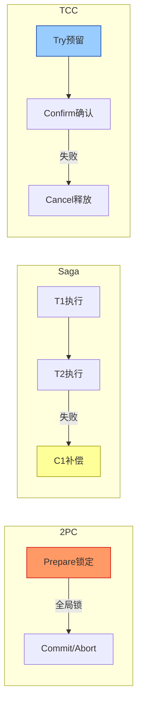
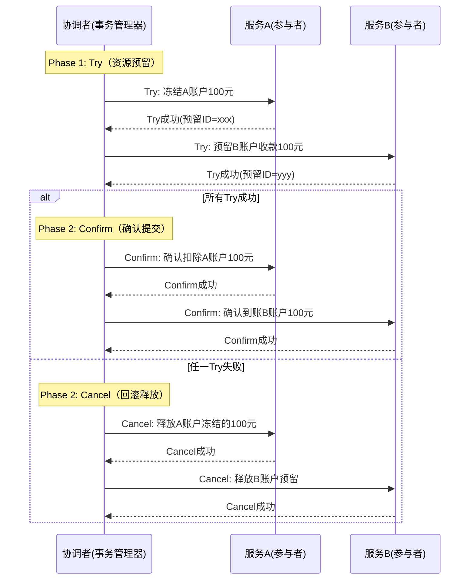
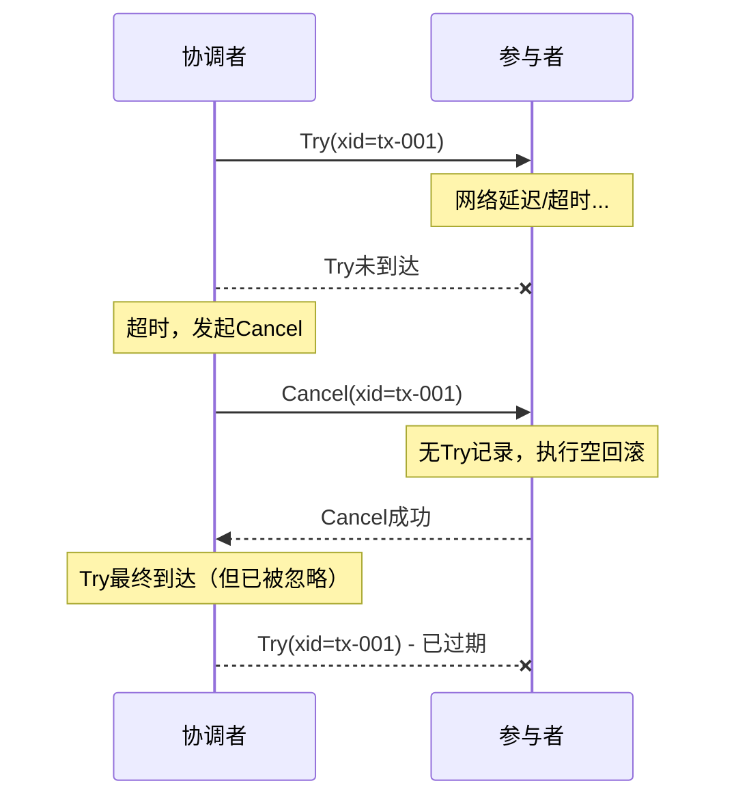
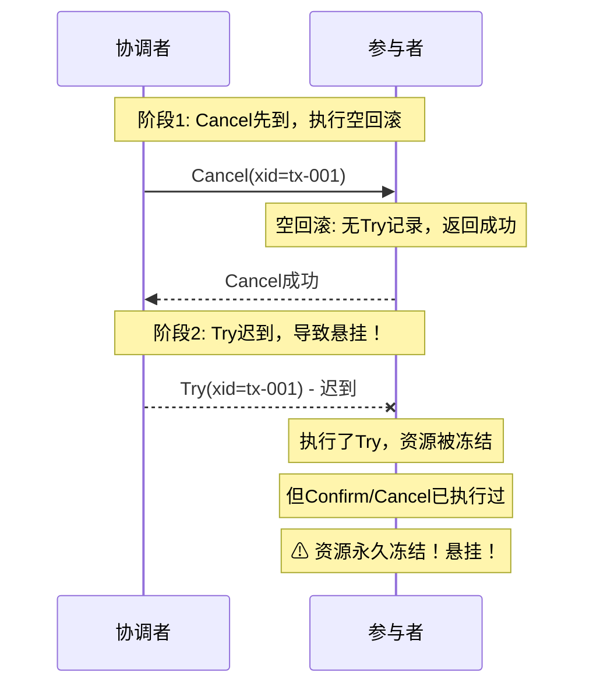
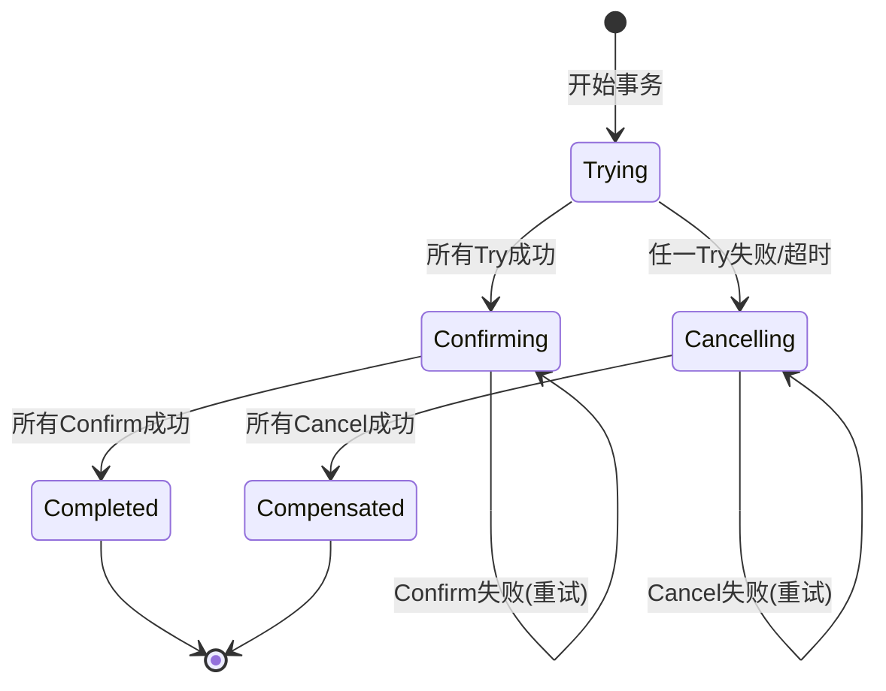

# TCC模式：Try-Confirm-Cancel

## 一、为什么需要TCC

回顾本章前面介绍的2PC和Saga，两者各有致命短板：

- **2PC** 通过全局锁实现强一致性，但性能极差，协调者单点故障会导致整个系统阻塞。
- **Saga** 放弃了隔离性，采用后向补偿实现最终一致性，但补偿窗口内其他事务能看到脏数据（例如"已扣库存、未创建订单"的中间状态）。

在金融转账、账户余额扣减等场景中，中间状态的可见性是不可接受的——你绝不希望另一个事务读到"钱已从A扣除、但尚未到账B"的半成品状态。TCC（Try-Confirm-Cancel）正是为解决这个问题而生：**它通过在Try阶段预留资源（而非真正消耗），在Confirm阶段才真正提交，从而提供比Saga更强的隔离保证，同时避免2PC的全局锁问题。**



## 二、TCC的历史与理论背景

### 2.1 起源

TCC的概念最早由Pat Helland在2007年的论文《Life beyond Distributed Transactions: an Apostate's Opinion》中系统阐述。Helland是微软SQL Server事务引擎的前首席架构师，他在文中指出：在大规模分布式系统中，传统ACID事务无法扩展，而应用层必须承担起"事务协调"的责任。TCC正是这一思想的工程化实践——将事务语义从数据库层提升到应用层，通过Try/Confirm/Cancel三个接口实现应用级的"分布式事务"。

### 2.2 与其他模式的定位关系

| 维度 | 2PC | Saga | TCC |
|------|-----|------|-----|
| 一致性级别 | 强一致 | 最终一致 | 准强一致（预留期间隔离） |
| 资源锁定方式 | 全局锁（数据库级） | 无锁 | 应用级资源冻结 |
| 业务侵入性 | 无（XA协议） | 低（需写补偿） | 高（需实现三个接口） |
| 隔离性 | 完全隔离 | 无隔离 | Try阶段冻结后隔离 |
| 典型应用场景 | 同构数据库强一致 | 长事务、异步编排 | 资金、余额、库存类 |
| 代表框架 | MySQL XA、Atomikos | Seata Saga、Temporal | Seata TCC、Hmily、ByteTCC |

**核心区别**：Saga在T1执行完就释放资源，其他事务能看到中间状态；TCC在Try阶段只是预留（冻结），Confirm才真正消耗，Cancel直接释放，因此预留期间其他事务看到的是"冻结态"而非"中间态"。

## 三、TCC的核心原理

### 3.1 三阶段模型

TCC将每个分布式事务参与者的服务接口分为三个方法：



**Try（尝试/预留）**：执行业务检查，预留必需的资源。这一步不做真正的业务操作，而是将资源从"可用"变为"冻结"状态。例如：
- 转账场景：检查余额是否充足，将转账金额从可用余额中冻结（扣减可用余额，增加冻结余额）
- 库存场景：检查库存是否充足，将扣减数量从可用库存中预留（扣减可用库存，增加预扣库存）

**Confirm（确认/提交）**：确认执行业务操作，消耗Try阶段预留的资源。Confirm必须满足两个要求：幂等性（重复执行结果相同）和不抛业务异常（因为协调者不会重试失败的Confirm）。

**Cancel（取消/回滚）**：释放Try阶段预留的资源，恢复到事务开始前的状态。Cancel同样必须满足幂等性要求。

### 3.2 与数据库事务的类比

TCC本质上是将数据库事务的ACID语义提升到了应用层：

数据库事务:       BEGIN → SQL操作 → COMMIT / ROLLBACK
TCC分布式事务:    Try(预留) → Confirm(确认) / Cancel(释放)

但有一个关键区别：数据库事务中，BEGIN到COMMIT之间数据对其他事务不可见（取决于隔离级别）；而TCC中，Try预留的资源状态取决于具体实现——如果冻结余额放在同一个数据库字段中，其他事务需要主动感知"冻结态"才能实现隔离。

### 3.3 资源冻结的实现方式

资源冻结是TCC的核心。以"账户余额冻结"为例，有三种常见实现：

**方式一：扩展字段（推荐）**

在账户表中增加冻结字段，Try阶段将金额从可用余额移到冻结余额：

```sql
-- 账户表结构
CREATE TABLE account (
    id          BIGINT PRIMARY KEY,
    user_id     BIGINT NOT NULL,
    balance     DECIMAL(12,2) NOT NULL DEFAULT 0,  -- 可用余额
    frozen      DECIMAL(12,2) NOT NULL DEFAULT 0,  -- 冻结余额
    version     INT NOT NULL DEFAULT 0              -- 乐观锁版本号
);

-- Try: 冻结100元
UPDATE account
SET balance = balance - 100,
    frozen = frozen + 100,
    version = version + 1
WHERE user_id = 1001
  AND balance >= 100
  AND version = #{oldVersion};

-- Confirm: 确认扣款（冻结余额转出）
UPDATE account
SET frozen = frozen - 100,
    version = version + 1
WHERE user_id = 1001
  AND frozen >= 100;

-- Cancel: 释放冻结（冻结余额回到可用）
UPDATE account
SET balance = balance + 100,
    frozen = frozen - 100,
    version = version + 1
WHERE user_id = 1001
  AND frozen >= 100;
```

**方式二：预留记录**

创建一条冻结记录，Try时插入，Confirm时确认，Cancel时删除：

```sql
-- Try: 插入冻结记录
INSERT INTO account_freeze (xid, user_id, amount, status, create_time)
VALUES ('tx-001', 1001, 100, 'TRIED', NOW());

-- Confirm: 更新状态为已确认
UPDATE account_freeze SET status = 'CONFIRMED' WHERE xid = 'tx-001';

-- Cancel: 删除冻结记录
DELETE FROM account_freeze WHERE xid = 'tx-001';
```

**方式三：状态机字段**

在业务表中增加状态字段，通过状态流转实现：

```sql
-- 订单状态: CREATED → FROZEN → CONFIRMED / CANCELLED
UPDATE orders SET status = 'FROZEN', frozen_amount = 100
WHERE order_id = 10001 AND status = 'CREATED';
```

三种方式的对比：

| 方式 | 优点 | 缺点 | 适用场景 |
|------|------|------|----------|
| 扩展字段 | 查询高效，一个UPDATE搞定 | 需修改表结构，冻结态需业务感知 | 金融、余额类 |
| 预留记录 | 业务表不动，冻结记录可审计 | 需额外表，查询需JOIN | 审计要求高 |
| 状态机 | 业务语义清晰，易于理解 | 状态过多时管理复杂 | 订单、工单类 |

## 四、TCC必须处理的两大特殊问题

### 4.1 空回滚（Empty Rollback）

**定义**：Try请求因网络超时等原因未到达参与者，但协调者已判定失败并发出Cancel请求，参与者收到Cancel后发现没有对应的Try记录，此时Cancel应正常执行（"空回滚"），而非报错。

**产生原因**：分布式网络的不可靠性。Try和Cancel可能走不同的网络路径，Cancel可能比Try先到达。

**时序图**：



**防御方案**：在Cancel处理逻辑中检查是否存在对应的Try记录。若不存在，记为空回滚并正常返回成功。

```java
public boolean cancel(String xid) {
    // 查询是否有对应的Try记录
    FreezeRecord record = freezeDao.findByXid(xid);
    if (record == null) {
        // 空回滚：Try未执行，直接返回成功
        log.info("空回滚检测: xid={}, 无Try记录, 直接返回", xid);
        return true;
    }
    // 正常回滚逻辑
    accountDao.unfreeze(record.getUserId(), record.getAmount());
    freezeDao.delete(xid);
    return true;
}
```

### 4.2 悬挂（Suspension）

**定义**：Cancel先于Try到达并执行了空回滚，之后Try请求才姗姗来迟到达参与者。如果此时Try仍然执行了资源预留，那么这笔预留永远不会被Confirm或Cancel，形成"悬挂"——资源被永久冻结。

**产生原因**：空回滚 + Try迟到。这是分布式系统中消息乱序的典型场景。

**时序图**：



**防御方案**：在Try处理前检查是否已存在该xid的Cancel记录。若存在，说明这是迟到的Try，应拒绝执行。

```java
public boolean tryFreeze(String xid, long userId, BigDecimal amount) {
    // 防悬挂检测
    CancelRecord cancelRecord = cancelDao.findByXid(xid);
    if (cancelRecord != null) {
        // 悬挂防护：已有Cancel记录，拒绝执行Try
        log.warn("悬挂防护: xid={}, 已存在Cancel记录, 拒绝Try", xid);
        return false;
    }
    // 正常Try逻辑
    accountDao.freeze(userId, amount);
    freezeDao.insert(new FreezeRecord(xid, userId, amount, "TRIED"));
    return true;
}
```

### 4.3 空回滚 + 悬挂的联合防御数据库设计

生产环境中通常用一张统一的事务控制表同时解决空回滚和悬挂：

```sql
CREATE TABLE tcc_transaction_control (
    xid             VARCHAR(64) PRIMARY KEY,   -- 全局事务ID
    branch_id       VARCHAR(64) NOT NULL,       -- 分支事务ID
    status          TINYINT NOT NULL,           -- 0=初始 1=已Try 2=已Confirm 3=已Cancel
    try_time        DATETIME,                   -- Try执行时间
    confirm_time    DATETIME,                   -- Confirm执行时间
    cancel_time     DATETIME,                   -- Cancel执行时间
    retry_count     INT DEFAULT 0,              -- 重试计数
    create_time     DATETIME NOT NULL,
    update_time     DATETIME NOT NULL
);
```

三个阶段的逻辑：

```java
// Try: 检查Cancel记录防悬挂
public boolean tryPhase(String xid, String branchId) {
    int affected = jdbc.update(
        "INSERT INTO tcc_transaction_control (xid, branch_id, status, try_time, create_time, update_time) " +
        "SELECT ?, ?, 1, NOW(), NOW(), NOW() " +
        "WHERE NOT EXISTS (SELECT 1 FROM tcc_transaction_control WHERE xid = ? AND status = 3)",
        xid, branchId, xid
    );
    if (affected == 0) {
        log.warn("悬挂防护: xid={}已有Cancel记录, Try被拒绝", xid);
        return false;
    }
    return true;
}

// Confirm: 幂等检查
public boolean confirmPhase(String xid) {
    int affected = jdbc.update(
        "UPDATE tcc_transaction_control SET status = 2, confirm_time = NOW(), update_time = NOW() " +
        "WHERE xid = ? AND status = 1", xid
    );
    return affected > 0 || isAlreadyConfirmed(xid);
}

// Cancel: 空回滚检测 + 幂等
public boolean cancelPhase(String xid) {
    // 先检查是否已存在记录
    Integer status = jdbc.queryForObject(
        "SELECT status FROM tcc_transaction_control WHERE xid = ?", Integer.class, xid
    );
    if (status == null) {
        // 空回滚：插入Cancel记录，后续Try会检测到
        jdbc.update(
            "INSERT INTO tcc_transaction_control (xid, branch_id, status, cancel_time, create_time, update_time) " +
            "VALUES (?, ?, 3, NOW(), NOW(), NOW())",
            xid, "empty-rollback"
        );
        return true;
    }
    if (status == 3) return true;  // 已Cancel，幂等返回
    // 正常Cancel
    jdbc.update(
        "UPDATE tcc_transaction_control SET status = 3, cancel_time = NOW(), update_time = NOW() " +
        "WHERE xid = ? AND status IN (0, 1)", xid
    );
    return true;
}
```

## 五、Confirm和Cancel的幂等性保证

TCC框架在网络异常时会重试Confirm和Cancel，因此这两个操作必须是幂等的——多次执行与一次执行效果相同。

### 5.1 幂等性的三种实现策略

**策略一：唯一约束（数据库层面）**

利用数据库唯一索引保证操作只执行一次：

```sql
-- Confirm日志表，xid+branch_id唯一索引
CREATE TABLE tcc_confirm_log (
    xid         VARCHAR(64),
    branch_id   VARCHAR(64),
    confirm_time DATETIME,
    PRIMARY KEY (xid, branch_id)
);

-- Confirm时先插入日志，插入失败说明已执行过
INSERT INTO tcc_confirm_log (xid, branch_id, confirm_time)
VALUES ('tx-001', 'branch-001', NOW());
-- 如果主键冲突，说明已Confirm过，直接返回成功
```

**策略二：状态机（业务层面）**

利用业务状态字段的原子更新保证幂等：

```sql
-- Confirm: 只有状态为FROZEN才能确认
UPDATE account SET frozen = frozen - 100, balance = balance
WHERE user_id = 1001 AND frozen >= 100;
-- affected=0 说明已确认过，幂等
```

**策略三：去重表（通用方案）**

维护一张去重表，操作前先查询：

```java
public boolean confirm(String xid) {
    // 幂等检查
    if (dedupDao.exists(xid, "CONFIRM")) {
        return true;  // 已执行过
    }
    // 执行Confirm逻辑
    accountDao.confirmDeduct(userId, amount);
    // 记录去重
    dedupDao.insert(xid, "CONFIRM");
    return true;
}
```

### 5.2 幂等性对比

| 策略 | 优点 | 缺点 | 适用场景 |
|------|------|------|----------|
| 唯一约束 | 可靠性最高，数据库保证 | 需额外表，有写入开销 | 金融类高可靠场景 |
| 状态机 | 无额外开销，业务语义清晰 | 需要业务表有状态字段 | 有状态流转的业务 |
| 去重表 | 通用，不侵入业务表 | 需维护去重表，需定期清理 | 通用场景 |

## 六、TCC协调者的设计

### 6.1 协调者的职责

协调者（Transaction Manager）负责：
1. 记录全局事务和各分支事务的状态
2. 按顺序调用各参与者的Try/Confirm/Cancel
3. 处理超时和失败的重试逻辑
4. 确保所有参与者最终达到一致状态

### 6.2 协调者的核心状态机



### 6.3 协调者的伪代码实现

```python
class TCCTransactionManager:
    def __init__(self, participants):
        self.participants = participants
        self.tx_log = TransactionLog()  # 持久化事务日志

    def execute(self, tx_id, context):
        """执行TCC全局事务"""
        branches = []
        try:
            # Phase 1: 执行所有Try
            for p in self.participants:
                branch_id = f"{tx_id}-{p.name}"
                result = p.try_phase(tx_id, branch_id, context)
                branches.append((p, branch_id, result))
                self.tx_log.record_try(tx_id, branch_id, result)

                if not result.success:
                    # 某个Try失败，触发全部Cancel
                    raise TryFailedException(f"{p.name} Try失败")

            # 所有Try成功，进入Phase 2
            self.tx_log.record_phase(tx_id, "CONFIRMING")

            # Phase 2: 执行所有Confirm（幂等）
            for p, branch_id, _ in branches:
                self._safe_confirm(p, tx_id, branch_id)

            self.tx_log.record_phase(tx_id, "COMPLETED")
            return TransactionResult.success(tx_id)

        except Exception as e:
            # Phase 2: 执行所有Cancel（幂等）
            self.tx_log.record_phase(tx_id, "CANCELLING")
            for p, branch_id, _ in branches:
                self._safe_cancel(p, tx_id, branch_id)
            self.tx_log.record_phase(tx_id, "COMPENSATED")
            return TransactionResult.fail(tx_id, str(e))

    def _safe_confirm(self, participant, tx_id, branch_id):
        """安全的Confirm调用，带重试和幂等保证"""
        for attempt in range(MAX_RETRY):
            try:
                participant.confirm_phase(tx_id, branch_id)
                return  # Confirm成功（幂等，重复调用无副作用）
            except Exception as e:
                log.warning(f"Confirm失败, attempt={attempt}: {e}")
                time.sleep(backoff(attempt))
        # 重试耗尽仍失败，记录告警（需人工介入或定时任务补偿）
        alert_service.alert(tx_id, branch_id, "CONFIRM_FAILED")

    def _safe_cancel(self, participant, tx_id, branch_id):
        """安全的Cancel调用，带重试和幂等保证"""
        for attempt in range(MAX_RETRY):
            try:
                participant.cancel_phase(tx_id, branch_id)
                return
            except Exception as e:
                log.warning(f"Cancel失败, attempt={attempt}: {e}")
                time.sleep(backoff(attempt))
        alert_service.alert(tx_id, branch_id, "CANCEL_FAILED")
```

## 七、TCC的性能优化

### 7.1 并行Try

当各参与者之间无依赖时，可以并行执行Try以降低延迟：

```java
// 并行执行所有Try
CompletableFuture<Boolean> tryA = CompletableFuture.supplyAsync(
    () -> participantA.tryPhase(xid, branchA, context));
CompletableFuture<Boolean> tryB = CompletableFuture.supplyAsync(
    () -> participantB.tryPhase(xid, branchB, context));
CompletableFuture<Boolean> tryC = CompletableFuture.supplyAsync(
    () -> participantC.tryPhase(xid, branchC, context));

// 等待所有Try结果
CompletableFuture.allOf(tryA, tryB, tryC).join();
boolean allSuccess = tryA.get() &amp;&amp; tryB.get() &amp;&amp; tryC.get();
```

### 7.2 异步Confirm/Cancel

Confirm和Cancel不需要同步等待，可以异步执行以提升吞吐：

```java
// 异步Confirm（不阻塞调用方）
CompletableFuture.runAsync(() -> {
    for (Participant p : participants) {
        p.confirmPhase(xid);
    }
});
```

但需注意：异步Confirm意味着协调者无法立即感知Confirm失败，需要配合定时任务扫描未完成的事务进行补偿。

### 7.3 超时控制

Try的超时时间应尽可能短，避免资源长时间冻结：

```java
// Try超时设置建议
@TccTransaction(
    tryTimeout = 3000,      // Try: 3秒
    confirmTimeout = 5000,  // Confirm: 5秒
    cancelTimeout = 5000    // Cancel: 5秒
)
public class TransferService { ... }
```

### 7.4 资源冻结时长控制

冻结时长直接影响系统并发能力。优化策略：

| 策略 | 说明 | 效果 |
|------|------|------|
| 快速Confirm | Try成功后立即发起Confirm | 冻结时间最短 |
| 批量Confirm | 多个Try完成后批量Confirm | 减少网络调用 |
| 超时自动Cancel | Try超时后自动释放冻结 | 防止资源泄漏 |
| 冻结时长监控 | 监控平均冻结时长并告警 | 及时发现异常 |

## 八、TCC vs Saga vs 2PC：场景化对比

### 8.1 转账场景

场景: A向B转账100元

2PC方式:
  1. 锁定A和B的账户行（全局锁）
  2. 扣减A余额、增加B余额
  3. 提交/释放锁
  缺点: 两行数据被锁定，其他操作全部等待

Saga方式:
  1. T1: 扣减A余额100元
  2. T2: 增加B余额100元
  3. 若T2失败，C1: 增加A余额100元（补偿）
  缺点: T1执行后、T2执行前，A的余额已减少，
        此时另一个事务读到的是扣减后的值

TCC方式:
  1. Try-A: 冻结A账户100元（可用余额-100，冻结+100）
  2. Try-B: 预留B账户收款100元
  3. 全部Try成功 → Confirm-A, Confirm-B
  4. 任一Try失败 → Cancel-A, Cancel-B
  优点: Try期间A的冻结状态对其他事务可见,
        不会出现"钱已扣但未到账"的脏读

### 8.2 电商下单场景

场景: 创建订单 + 扣减库存 + 冻结资金 + 增加积分

TCC实现:
  1. Try-订单: 创建订单，状态=FROZEN
  2. Try-库存: 预扣库存（可用库存-1，预扣+1）
  3. Try-资金: 冻结支付金额（可用余额-金额，冻结+金额）
  4. Try-积分: 不需要冻结，延迟到Confirm阶段处理
  5. 全部Try成功 → Confirm全部
  6. 任一Try失败 → Cancel已Try的参与者

### 8.3 选型决策要点

| 你的情况 | 推荐方案 | 理由 |
|----------|----------|------|
| 资金/余额类强一致需求 | TCC | 需要资源冻结保证隔离性 |
| 事务步骤多(>5步) | Saga | TCC每个步骤需三个接口，复杂度随步骤爆炸 |
| 业务无法支持资源冻结 | Saga | TCC的前提是资源可冻结 |
| 高并发低延迟 | Saga/消息 | TCC的预留有额外开销 |
| 异构资源(MySQL+Redis+MQ) | TCC | 不依赖特定存储的事务协议 |
| 跨团队/跨部门 | Saga | TCC对每个参与者要求高，协调成本大 |

## 九、主流TCC框架对比

### 9.1 Seata TCC

Seata是阿里巴巴开源的分布式事务框架，其TCC模式的核心特点：

- **与AT模式共存**：同一个框架提供AT和TCC两种模式，可按业务粒度混合使用
- **一阶段直接提交**：Try阶段的数据库操作直接提交（不开启本地事务回滚），通过业务冻结实现隔离
- **防悬挂全局控制**：框架层面提供空回滚和悬挂检测

```java
@LocalTCC
public interface AccountTccService {

    @TwoPhaseBusinessAction(name = "freeze", commitMethod = "confirm", rollbackMethod = "cancel")
    boolean tryFreeze(
        @BusinessActionContextParameter(paramName = "userId") Long userId,
        @BusinessActionContextParameter(paramName = "amount") BigDecimal amount
    );

    boolean confirm(BusinessActionContext context);
    boolean cancel(BusinessActionContext context);
}
```

### 9.2 Hmily

Hmily是Apache孵化的分布式事务框架，专注于TCC模式：

- **异步重试**：Confirm/Cancel失败后异步重试，不阻塞主流程
- **SPI扩展**：高度可扩展的插件化架构
- **多存储支持**：支持Redis、Zookeeper、数据库等多种事务日志存储

### 9.3 ByteTCC

由原先的tcc-transaction演进而来：

- **注解驱动**：通过 `@TCC` 注解声明事务边界
- **事件机制**：通过事件总线实现Confirm/Cancel的异步执行
- **轻量级**：无需额外的事务协调器，嵌入应用进程

### 9.4 框架对比

| 特性 | Seata TCC | Hmily | ByteTCC |
|------|-----------|-------|---------|
| 事务日志存储 | 文件/数据库/Redis | Redis/数据库/ZK | 数据库/Redis |
| Confirm/Cancel重试 | 同步+异步 | 异步 | 异步(事件驱动) |
| 防悬挂 | 支持 | 支持 | 支持 |
| 与Spring集成 | 原生支持 | 原生支持 | 原生支持 |
| 社区活跃度 | 高(Apache) | 中(Apache) | 低 |
| 生产案例 | 阿里系大规模使用 | 中小企业 | 少 |

## 十、常见误区与踩坑经验

### 误区一：Confirm/Cancel不写幂等

**问题**：框架重试Confirm时重复执行了业务逻辑（如重复扣款）。

**纠正**：Confirm和Cancel必须100%幂等。用唯一约束、状态机或去重表三选一。

### 误区二：忽略空回滚

**问题**：Try超时后Cancel到达参与者，但参与者报错"无对应Try记录"，导致事务卡死。

**纠正**：Cancel逻辑必须处理"Try不存在"的情况，正常返回成功。

### 误区三：Try阶段做过多业务逻辑

**问题**：Try阶段执行了耗时操作（如调用第三方接口、发送短信），导致资源长时间冻结。

**纠正**：Try只做资源检查和预留，其他操作放到Confirm阶段。

### 误区四：冻结金额 = 业务金额

**问题**：Try冻结100元，Confirm时又扣了100元，总共扣了200元。

**纠正**：Confirm阶段只需将冻结金额转出（frozen -= 100），不要重复扣可用余额。

### 误区五：Cancel后不做日志告警

**问题**：Cancel频繁执行但无人关注，说明上游Try经常失败，系统设计有问题。

**纠正**：Cancel率是TCC系统的核心监控指标，异常升高时需告警排查。

### 误区六：所有场景都用TCC

**问题**：简单的异步通知也用TCC，导致不必要的复杂度。

**纠正**：TCC适合对隔离性要求高的场景（资金、库存）。简单场景用本地事务或消息队列即可。

## 十一、生产环境的监控与运维

### 11.1 核心监控指标

| 指标 | 含义 | 告警阈值 |
|------|------|----------|
| Try成功率 | Try成功/总数 | < 99% |
| Confirm成功率 | Confirm成功/Confirm总数 | < 99.9% |
| Cancel率 | Cancel数/总事务数 | > 5% |
| 空回滚率 | 空回滚数/Cancel数 | > 10% |
| 悬挂事务数 | 未处理的悬挂事务 | > 0 |
| 平均冻结时长 | Try到Confirm/Cancel的平均时间 | > 5s |
| Confirm平均耗时 | Confirm操作的平均响应时间 | > 1s |
| 待重试队列积压 | 未完成Confirm/Cancel的事务数 | > 100 |

### 11.2 运维脚本

```bash
# 查询悬挂事务
mysql -e "
SELECT xid, branch_id, status, create_time
FROM tcc_transaction_control
WHERE status = 1  -- 已Try未Confirm/Cancel
  AND create_time < DATE_SUB(NOW(), INTERVAL 10 MINUTE)
ORDER BY create_time ASC
LIMIT 100;

# 查询空回滚事务
SELECT xid, branch_id, status, cancel_time
FROM tcc_transaction_control
WHERE branch_id = 'empty-rollback'
  AND create_time > DATE_SUB(NOW(), INTERVAL 1 HOUR);

# 查询Confirm失败需重试的事务
SELECT xid, branch_id, retry_count, update_time
FROM tcc_transaction_control
WHERE status = 1
  AND retry_count < 3
  AND update_time < DATE_SUB(NOW(), INTERVAL 1 MINUTE);
"
```

## 十二、总结

TCC模式通过Try-Confirm-Cancel三阶段实现应用级的分布式事务，核心价值在于：

1. **比Saga更强的隔离性**：通过资源冻结而非直接消耗，避免中间状态脏读
2. **比2PC更好的性能**：不依赖全局锁，资源锁定在应用层且粒度更细
3. **高可靠性的代价**：需要实现三个接口、处理空回滚和悬挂、保证幂等性

**经验法则**：TCC是分布式事务工具箱中最"重"的方案——它提供的隔离性最强，但实现复杂度也最高。在选择TCC之前，先问自己两个问题：第一，业务是否真的需要资源冻结级别的隔离？第二，团队是否有能力维护TCC的三接口+防悬挂逻辑？如果两个答案都是"否"，Saga或消息队列可能是更务实的选择。
