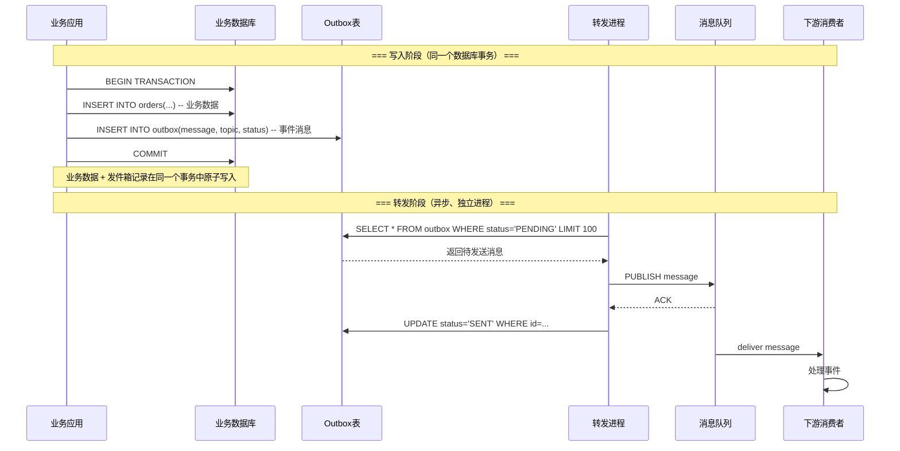
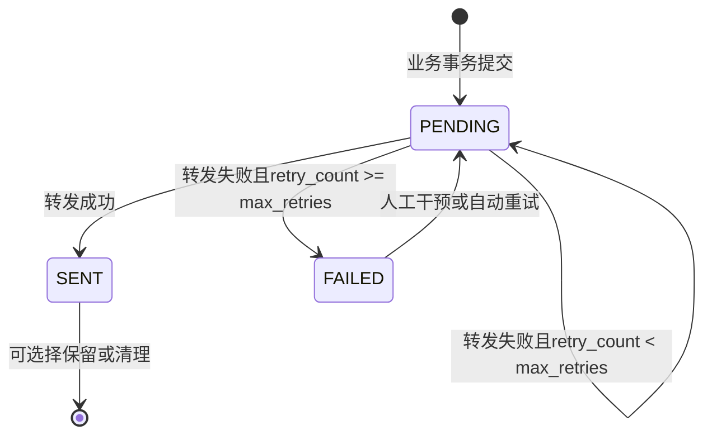
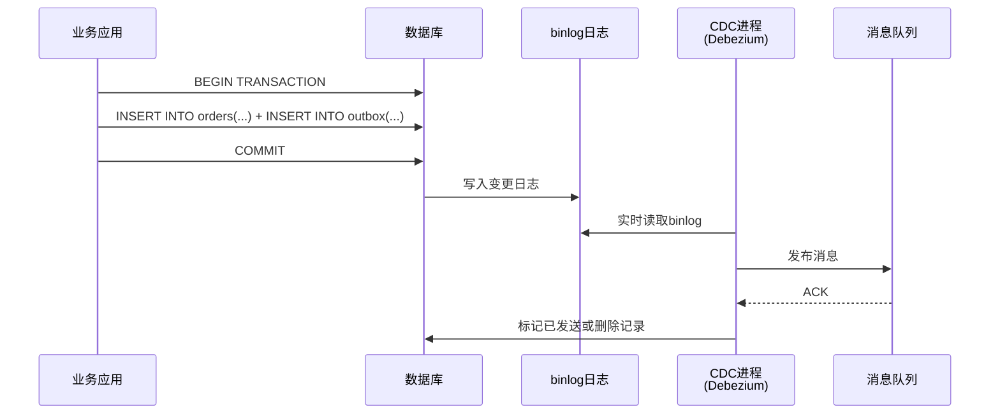
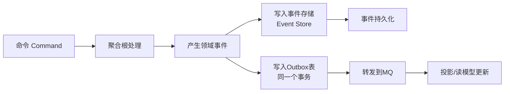
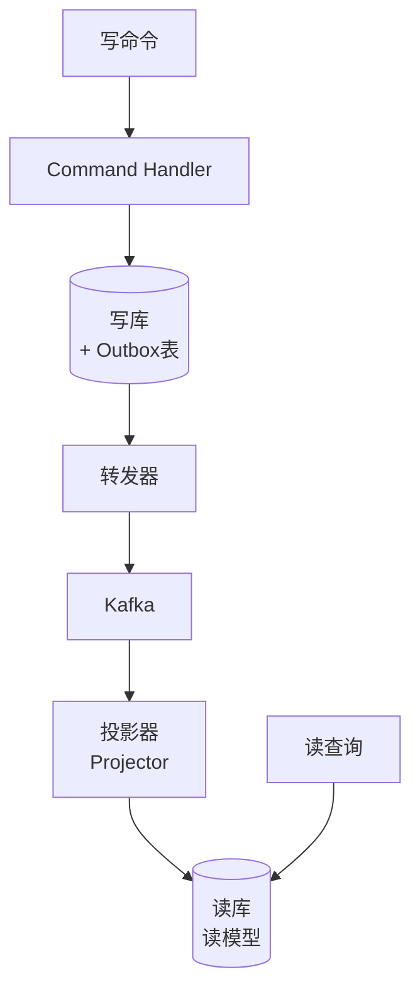
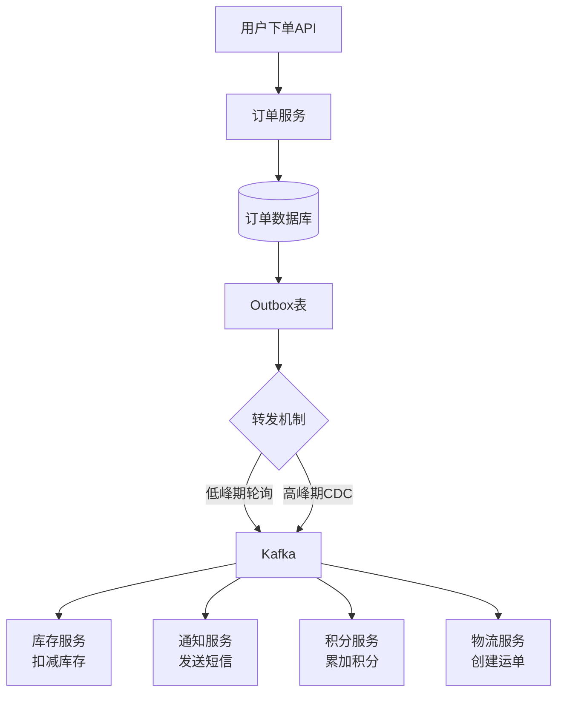
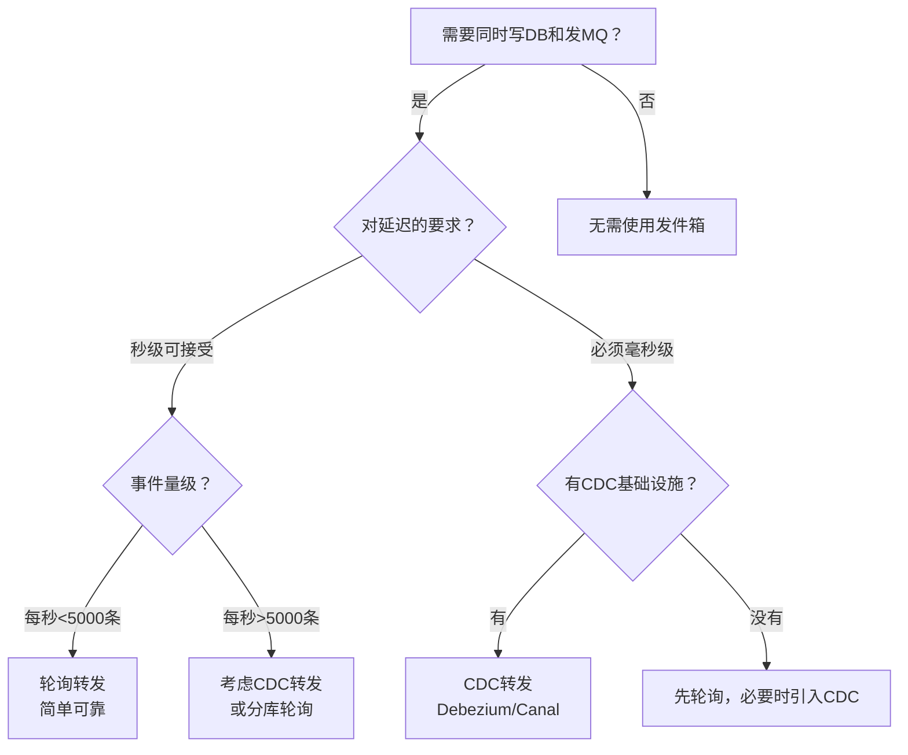

# 四、事务性发件箱（Transactional Outbox）

## 1. 问题引出：双写难题

在微服务架构中，一个常见的需求是：**业务数据写入数据库后，同时需要发布一条消息通知下游服务**。例如，订单服务在数据库中创建订单后，需要向消息队列发送一条"订单已创建"事件，供库存服务、通知服务等消费。

这引出了分布式系统中最经典的问题之一——**双写难题（Dual Write Problem）**。

### 1.1 双写难题的本质

业务操作需要同时修改两个系统：
  1. 写入数据库（业务数据持久化）
  2. 发布消息到消息队列（事件通知）

但这两个操作不在同一个事务中，无法保证原子性。

可能的失败场景如下：

| 失败场景 | 数据库状态 | 消息队列状态 | 后果 |
|----------|-----------|-------------|------|
| 数据库写成功，消息发送前崩溃 | 新数据已入库 | 无消息发出 | 下游服务不知道事件发生，数据不一致 |
| 消息发送成功，数据库提交前崩溃 | 旧数据/无数据 | 消息已发出 | 下游收到"幽灵事件"，处理不存在的数据 |
| 数据库写成功，消息发送超时 | 新数据已入库 | 不确定是否送达 | 最终状态不确定，可能数据不一致 |

核心矛盾在于：**数据库事务和消息发送是两个独立的操作，无法用一个原子操作同时保证两者都成功或都失败。** 要么先写库再发消息（可能消息丢失），要么先发消息再写库（可能消息发出但事务回滚）。

从时间线角度看，双写难题本质是一个**分布式一致性问题**。假设数据库提交时刻为 T1，消息发送时刻为 T2，由于 T1 和 T2 之间没有全局时钟同步，系统无法判断"提交后是否成功发送"这一事实。这个时间窗口越长，不一致的风险越大。

### 1.2 为什么不能用"先发消息再写库"

一种直觉方案是先发送消息到MQ，然后写数据库，失败则发送一条"补偿消息"。但这个方案存在致命缺陷：

- **消息已经到达下游并被消费**，补偿消息可能来不及阻止下游处理
- **补偿消息本身也可能发送失败**，引入了更复杂的故障模式
- **无法保证消息顺序**：下游可能先收到补偿消息，后收到原始消息
- **违反业务语义**：某些事件不应该被"撤销"（如扣款事件）
- **补偿消息的语义模糊**：是"撤销上一条消息"还是"抵消效果"？下游消费者很难正确处理

这个方案的问题本质上是把一个双写问题变成了**三写问题**（原始消息 + 业务数据 + 补偿消息），复杂度不降反升。

因此，**双写难题需要一个更可靠的解决方案**。

## 2. 事务性发件箱模式

### 2.1 核心思想

事务性发件箱（Transactional Outbox）模式的核心思想非常简洁：

> **将消息写入与业务数据写入放在同一个数据库事务中，然后由一个独立的进程将消息从数据库异步地发布到消息队列。**

具体做法是在业务数据库中创建一张 **发件箱表（outbox table）**，每条待发送的消息作为一行记录插入这张表。由于插入发件箱记录和业务数据操作在同一个本地数据库事务中，所以它们要么一起成功，要么一起回滚。之后，一个独立的进程（称为 **转发器/Publisher** 或 **轮询器/Poller**）扫描发件箱表，将消息发布到消息队列，发布成功后将该记录标记为已发送或删除。

这个设计的巧妙之处在于：它利用了数据库事务的 ACID 特性，把"可靠消息发送"这个分布式问题转化成了一个**本地事务问题**。发件箱表本质上是消息的"持久化暂存区"，数据库成了消息的"安全网"。

### 2.2 工作流程



这个流程保证了**消息不会丢失**：即使转发进程宕机，发件箱中的消息仍然安全地存储在数据库中，重启后会继续发送。

### 2.3 与直接发送的区别

| 维度 | 直接发送（先库后MQ） | 事务性发件箱 |
|------|---------------------|-------------|
| 事务保证 | 无保证，两步分离 | 本地事务原子保证 |
| 消息丢失风险 | 事务提交后、发送前崩溃会丢失 | 零丢失（消息已入库） |
| 幽灵消息风险 | 不存在 | 不存在（事务回滚则无消息） |
| 实现复杂度 | 低 | 中（需要额外表和转发进程） |
| 延迟 | 实时 | 有毫秒到秒级延迟（取决于轮询间隔） |
| 对MQ的依赖 | 发送时MQ必须可用 | 发送时MQ可以不可用（稍后重试） |
| 事务边界 | 数据库事务和消息发送跨两个系统 | 数据库事务统一管理 |

## 3. 发件箱表设计

### 3.1 表结构

发件箱表的设计需要考虑以下关键字段：

```sql
CREATE TABLE outbox (
    -- 主键
    id            BIGINT PRIMARY KEY AUTO_INCREMENT,

    -- 事件标识
    aggregate_id  VARCHAR(64) NOT NULL COMMENT '聚合根ID（如订单ID）',
    aggregate_type VARCHAR(64) NOT NULL COMMENT '聚合类型（如order）',
    event_type    VARCHAR(128) NOT NULL COMMENT '事件类型（如order.created）',

    -- 消息内容
    topic         VARCHAR(256) NOT NULL COMMENT '目标topic',
    message_key   VARCHAR(128) COMMENT '消息key（用于分区有序性）',
    payload       TEXT NOT NULL COMMENT '事件载荷（JSON格式）',

    -- 状态管理
    status        ENUM('PENDING', 'SENT', 'FAILED') NOT NULL DEFAULT 'PENDING',
    retry_count   INT NOT NULL DEFAULT 0 COMMENT '已重试次数',
    max_retries   INT NOT NULL DEFAULT 5 COMMENT '最大重试次数',

    -- 时间戳
    created_at    TIMESTAMP NOT NULL DEFAULT CURRENT_TIMESTAMP,
    updated_at    TIMESTAMP NOT NULL DEFAULT CURRENT_TIMESTAMP ON UPDATE CURRENT_TIMESTAMP,
    sent_at       TIMESTAMP NULL COMMENT '发送成功时间',

    -- 索引优化
    INDEX idx_status_created (status, created_at),
    INDEX idx_aggregate (aggregate_type, aggregate_id)
) ENGINE=InnoDB DEFAULT CHARSET=utf8mb4 COMMENT='事务性发件箱';
```

**字段设计要点：**

- **aggregate_id + aggregate_type**：标识这条消息属于哪个业务实体，便于按聚合维度查询和去重
- **event_type**：下游消费者可以根据事件类型做不同的路由处理
- **message_key**：同一聚合的事件使用相同的key，确保在Kafka等支持分区有序的MQ中保序
- **status + retry_count**：支持失败重试和死信处理
- **created_at**：转发器按创建时间顺序处理，保证事件的因果顺序
- **payload**：使用TEXT而非VARCHAR，因为事件载荷可能较大（特别是包含完整业务快照时）

**设计注意事项：**

- **不要在发件箱表上使用外键约束**——发件箱的生命周期独立于业务数据，外键会引入不必要的耦合
- **message_key 的设计**应遵循 `{aggregate_type}:{aggregate_id}` 的格式，这保证同一聚合的事件路由到同一个MQ分区，从而保证顺序
- **payload 建议存储完整事件快照**而非增量变更，这样下游可以独立重建状态，无需回溯事件链

### 3.2 状态流转



### 3.3 表分区策略

当事件量达到每秒数千条以上时，发件箱表会快速膨胀。MySQL InnoDB 支持按时间分区，可以极大提升清理效率：

```sql
-- 按月分区（清理时直接DROP PARTITION，比DELETE快几个数量级）
CREATE TABLE outbox (
    id            BIGINT PRIMARY KEY AUTO_INCREMENT,
    aggregate_id  VARCHAR(64) NOT NULL,
    aggregate_type VARCHAR(64) NOT NULL,
    event_type    VARCHAR(128) NOT NULL,
    topic         VARCHAR(256) NOT NULL,
    message_key   VARCHAR(128),
    payload       TEXT NOT NULL,
    status        ENUM('PENDING', 'SENT', 'FAILED') NOT NULL DEFAULT 'PENDING',
    retry_count   INT NOT NULL DEFAULT 0,
    max_retries   INT NOT NULL DEFAULT 5,
    created_at    TIMESTAMP NOT NULL DEFAULT CURRENT_TIMESTAMP,
    updated_at    TIMESTAMP NOT NULL DEFAULT CURRENT_TIMESTAMP ON UPDATE CURRENT_TIMESTAMP,
    sent_at       TIMESTAMP NULL
) PARTITION BY RANGE (UNIX_TIMESTAMP(created_at)) (
    PARTITION p_2026_06 VALUES LESS THAN (UNIX_TIMESTAMP('2026-07-01')),
    PARTITION p_2026_07 VALUES LESS THAN (UNIX_TIMESTAMP('2026-08-01')),
    PARTITION p_2026_08 VALUES LESS THAN (UNIX_TIMESTAMP('2026-09-01')),
    PARTITION p_future  VALUES LESS THAN MAXVALUE
);

-- 月初自动创建新分区的存储过程
DELIMITER //
CREATE PROCEDURE add_outbox_partition(IN partition_date DATE)
BEGIN
    DECLARE part_name VARCHAR(32);
    DECLARE next_month DATE;
    DECLARE boundary BIGINT;

    SET next_month = DATE_ADD(partition_date, INTERVAL 1 MONTH);
    SET part_name = CONCAT('p_', DATE_FORMAT(partition_date, '%Y_%m'));
    SET boundary = UNIX_TIMESTAMP(next_month);

    SET @sql = CONCAT(
        'ALTER TABLE outbox REORGANIZE PARTITION p_future INTO (',
        'PARTITION ', part_name, ' VALUES LESS THAN (', boundary, '), ',
        'PARTITION p_future VALUES LESS THAN MAXVALUE)'
    );
    PREPARE stmt FROM @sql;
    EXECUTE stmt;
    DEALLOCATE PREPARE stmt;
END //
DELIMITER ;

-- 删除上月分区（直接释放空间，无需DELETE）
ALTER TABLE outbox DROP PARTITION p_2026_04;
```

**分区策略的关键优势：** `DROP PARTITION` 操作是原子的元数据操作，耗时毫秒级，而等量的 `DELETE` 可能需要数秒甚至数分钟，还会产生大量碎片和 undo log。对于高吞吐系统，分区是必须的。

## 4. 两种转发机制

事务性发件箱的核心在于"如何将消息从数据库表转发到消息队列"。主流方案有两种：**轮询转发（Polling）** 和 **变更数据捕获（CDC）**。

### 4.1 轮询转发（Polling Publisher）

轮询转发是最简单的实现方式：一个定时任务周期性地查询发件箱表中 `status='PENDING'` 的记录，逐条发送到消息队列。

```python
import time
import json
import pymysql
from kafka import KafkaProducer

class OutboxPoller:
    """
    轮询式发件箱转发器
    周期性扫描outbox表，将PENDING消息发布到Kafka

    关键设计：
    1. 查询和更新分两个事务处理，避免长时间持有事务锁
    2. 批量查询 + 逐条发送，平衡吞吐和错误隔离
    3. 发送失败只增加重试计数，不阻塞后续消息
    """

    def __init__(self, db_config, kafka_config, poll_interval=1, batch_size=100):
        self.db_config = db_config
        self.producer = KafkaProducer(
            bootstrap_servers=kafka_config['brokers'],
            value_serializer=lambda v: json.dumps(v).encode('utf-8'),
            acks='all',  # 等待所有副本确认
            retries=3,
            max_in_flight_requests_per_connection=1  # 保证单分区内的顺序
        )
        self.poll_interval = poll_interval  # 轮询间隔（秒）
        self.batch_size = batch_size

    def _get_connection(self):
        """每次轮询创建新连接，避免长连接超时问题"""
        return pymysql.connect(**self.db_config)

    def run(self):
        """主循环：持续轮询并转发"""
        while True:
            try:
                self.poll_and_send()
            except Exception as e:
                print(f"[ERROR] Poll cycle failed: {e}")
            time.sleep(self.poll_interval)

    def poll_and_send(self):
        """
        一轮轮询：查询PENDING消息，逐条发送并更新状态。

        事务边界设计：
        - 查询阶段：快速读取PENDING消息（短事务）
        - 发送阶段：逐条发送到Kafka（无事务）
        - 更新阶段：批量更新状态（短事务）
        这样避免了"查询→发送→更新"整个过程在一个长事务中，
        长事务会锁住outbox表影响业务写入。
        """
        # 1. 阶段一：查询待发送消息（独立短事务）
        messages = self._fetch_pending()
        if not messages:
            return

        # 2. 阶段二：逐条发送到MQ（无数据库事务）
        results = []
        for msg_id, topic, key, payload in messages:
            success = self._send_to_kafka(topic, key, payload)
            results.append((msg_id, success))

        # 3. 阶段三：批量更新状态（独立短事务）
        self._update_status(results)

    def _fetch_pending(self):
        """查询PENDING消息（短事务）"""
        conn = self._get_connection()
        try:
            with conn.cursor() as cursor:
                cursor.execute(
                    "SELECT id, topic, message_key, payload "
                    "FROM outbox "
                    "WHERE status = 'PENDING' "
                    "ORDER BY created_at ASC "
                    "LIMIT %s",
                    (self.batch_size,)
                )
                return cursor.fetchall()
        finally:
            conn.close()

    def _send_to_kafka(self, topic, key, payload):
        """发送单条消息到Kafka，返回是否成功"""
        try:
            future = self.producer.send(
                topic=topic,
                key=key.encode('utf-8') if key else None,
                value=json.loads(payload)
            )
            future.get(timeout=10)  # 等待发送确认
            return True
        except Exception as e:
            print(f"[WARN] Failed to send msg to {topic}: {e}")
            return False

    def _update_status(self, results):
        """批量更新发送结果（短事务）"""
        if not results:
            return

        conn = self._get_connection()
        try:
            with conn.cursor() as cursor:
                sent_ids = [msg_id for msg_id, ok in results if ok]
                failed_ids = [msg_id for msg_id, ok in results if not ok]

                if sent_ids:
                    placeholders = ','.join(['%s'] * len(sent_ids))
                    cursor.execute(
                        f"UPDATE outbox SET status='SENT', sent_at=NOW() "
                        f"WHERE id IN ({placeholders})",
                        sent_ids
                    )

                if failed_ids:
                    placeholders = ','.join(['%s'] * len(failed_ids))
                    cursor.execute(
                        f"UPDATE outbox SET retry_count = retry_count + 1, "
                        f"updated_at = NOW() WHERE id IN ({placeholders})",
                        failed_ids
                    )

            conn.commit()
        finally:
            conn.close()


if __name__ == '__main__':
    poller = OutboxPoller(
        db_config={'host': 'localhost', 'user': 'root', 'password': '***', 'database': 'orders'},
        kafka_config={'brokers': ['localhost:9092']},
        poll_interval=1,   # 每秒轮询一次
        batch_size=100      # 每次最多取100条
    )
    poller.run()
```

**轮询转发的优缺点：**

| 优点 | 缺点 |
|------|------|
| 实现简单，无外部依赖 | 轮询间隔决定了事件延迟的下限 |
| 对数据库压力可控（可调batch_size） | 高频轮询产生大量无效SQL查询 |
| 天然支持批量处理 | 数据库需要为status+created_at维护索引 |
| 容易排查问题（直接查看表数据） | 在高吞吐场景下可能成为瓶颈 |
| 转发进程宕机不影响数据安全 | 单进程轮询难以水平扩展 |

**适用场景：** 事件量不大（每秒几百到几千条）、对延迟要求不苛刻（秒级可接受）、追求架构简单的场景。

### 4.2 基于CDC的转发

CDC（Change Data Capture，变更数据捕获）方案利用数据库的**变更日志**（如MySQL的binlog）来实时捕获发件箱表的变更，然后转发到消息队列。



以Debezium + MySQL为例：

```json
{
  "name": "outbox-connector",
  "config": {
    "connector.class": "io.debezium.connector.mysql.MySqlConnector",
    "database.hostname": "mysql-host",
    "database.port": "3306",
    "database.user": "debezium",
    "database.password": "***",
    "database.server.id": "184054",
    "database.include.list": "order_service",
    "table.include.list": "order_service.outbox",

    "transforms": "outbox",
    "transforms.outbox.type": "io.debezium.transforms.outbox.EventRouter",

    "transforms.outbox.table.field.event.key": "message_key",
    "transforms.outbox.table.field.event.type": "event_type",
    "transforms.outbox.table.field.event.payload": "payload",
    "transforms.outbox.route.topic.replacement": "${routedByValue}",

    "transforms.outbox.table.expand.json.payload": "true",
    "tombstones.on.delete": "false",

    "database.serverTimezone": "Asia/Shanghai",
    "decimal.handling.mode": "string",
    "time.precision.mode": "connect"
  }
}
```

**Debezium Outbox EventRouter** 的工作方式：

1. Debezium监控outbox表的binlog变更（需要MySQL开启ROW格式的binlog）
2. 每检测到一行INSERT，提取 `message_key`、`event_type`、`payload` 等字段
3. 根据 `event_type` 或自定义路由逻辑确定目标topic（通过 `route.topic.replacement` 模板）
4. 构建Kafka消息并发布
5. 发布成功后，在outbox表中DELETE或UPDATE该记录（通过额外的JDBC Sink Connector或业务应用处理）

**Outbox EventRouter 的路由机制：**

默认情况下，EventRouter 使用 `route.topic.replacement` 配置中的占位符来决定目标topic：

```properties
# 基于event_type路由到不同topic
transforms.outbox.route.topic.replacement=${routedByValue}

# 如果需要更复杂的路由，可以使用RegexRouter
transforms=outbox,route
transforms.route.type=org.apache.kafka.connect.transforms.RegexRouter
transforms.route.regex=(.*)
transforms.route.replacement=$1-events
```

**CDC转发的优缺点：**

| 优点 | 缺点 |
|------|------|
| 接近实时（毫秒级延迟） | 需要额外部署Debezium/Canal等中间件 |
| 不产生无效的轮询SQL | 对binlog格式有要求（需ROW格式） |
| 天然保证事件顺序 | 运维复杂度高（CDC进程本身需要高可用） |
| 吞吐量高，可处理海量事件 | 需要处理schema变更、DDL同步等边界问题 |
| 不增加业务数据库的查询负载 | CDC组件的学习曲线较陡 |

**适用场景：** 事件量大（每秒数千到数万条）、对延迟敏感（毫秒级）、有成熟的中间件基础设施的场景。

### 4.3 轮询 vs CDC 选型对比

| 维度 | 轮询转发 | CDC转发 |
|------|---------|---------|
| 延迟 | 100ms-2s（取决于轮询间隔） | 1-10ms |
| 数据库压力 | 增加查询负载（每次轮询都查表） | 零额外查询（读binlog） |
| 运维复杂度 | 低（一个进程+定时任务） | 高（Debezium+Kafka Connect） |
| 依赖 | 仅数据库和MQ | MySQL binlog + Kafka Connect + Debezium |
| 水平扩展 | 需要自行实现分片 | Debezium自带分片支持 |
| 数据清理 | 需要在转发后UPDATE/DELETE | 删除需要额外处理（JDBC Sink） |
| 故障恢复 | 简单（重启进程即可） | 需要管理offset恢复 |
| 适合团队 | 小团队、快速迭代 | 大团队、有中间件运维能力 |

## 5. 消息消费与幂等性

### 5.1 消息可能重复发送

事务性发件箱保证了**消息不会丢失**，但不能保证**消息不会重复**。在以下场景中，消息可能被重复发送：

- 转发器发送消息到MQ后、更新数据库状态前宕机，重启后同一条消息会再次发送
- MQ的ACK丢失导致消息被重新投递
- CDC进程的offset回退导致重复发送
- Kafka的 `unclean.leader.election.enable=true` 导致已提交消息的重复消费

因此，**消费者必须实现幂等性**。这不是"可选的最佳实践"，而是**正确性要求**。

### 5.2 幂等消费策略

```java
/**
 * 幂等消费示例：基于唯一事件ID去重
 *
 * 关键设计：去重检查和业务逻辑在同一个数据库事务中，
 * 利用event_id的唯一约束作为并发安全的最终防线。
 */
@Service
public class OrderEventHandler {

    @Autowired
    private ProcessedEventRepository processedRepo;

    @Autowired
    private InventoryService inventoryService;

    @Autowired
    private NotificationService notificationService;

    @Transactional
    public void handleOrderCreated(OrderCreatedEvent event) {
        // 1. 检查该事件是否已处理过
        if (processedRepo.existsByEventId(event.getEventId())) {
            log.info("Event {} already processed, skipping", event.getEventId());
            return;
        }

        // 2. 执行业务逻辑（在同一事务中）
        try {
            // 扣减库存
            inventoryService.deduct(event.getSkuId(), event.getQuantity());
            // 发送通知
            notificationService.sendOrderConfirmation(event.getOrderId());

            // 3. 记录事件已处理（在同一事务中，利用数据库唯一性约束防并发）
            processedRepo.save(new ProcessedEvent(event.getEventId(), Instant.now()));
        } catch (DuplicateKeyException e) {
            // 并发重复插入的兜底处理：两个线程同时通过existsBy检查，
            // 都尝试插入，只有一个成功，另一个捕获此异常
            log.warn("Concurrent duplicate event {}, skipping", event.getEventId());
        }
    }
}
```

```sql
-- 已处理事件记录表
CREATE TABLE processed_events (
    event_id    VARCHAR(128) PRIMARY KEY COMMENT '事件唯一ID',
    processed_at TIMESTAMP NOT NULL DEFAULT CURRENT_TIMESTAMP,
    INDEX idx_processed_at (processed_at)
) ENGINE=InnoDB;

-- 定期清理超过30天的记录（防止表无限膨胀）
-- 通常由定时任务执行
DELETE FROM processed_events WHERE processed_at < DATE_SUB(NOW(), INTERVAL 30 DAY);
```

### 5.3 幂等性方案对比

| 幂等方案 | 实现方式 | 适用场景 | 优缺点 |
|----------|---------|---------|--------|
| 数据库唯一约束 | 利用event_id作为主键或唯一索引 | 所有场景（最通用） | 简单可靠，但需要额外表 |
| 业务唯一键 | 用业务字段（如订单号）做幂等键 | 业务天然有唯一标识 | 无需额外表，但依赖业务设计 |
| Redis去重 | SETNX设置事件ID + TTL | 高性能、允许短暂数据不一致 | 快但非持久化，重启可能丢失 |
| 乐观锁 | 数据库版本号校验 | 更新操作 | 适合单条记录更新，不适合批量 |
| 状态机 | 业务状态只能单向流转 | 有明确状态流转的业务 | 最优雅，但业务设计要求高 |

### 5.4 幂等处理的性能优化

当事件吞吐量很高时，`processed_events` 表的写入可能成为瓶颈。以下是几种优化手段：

**方案一：Redis + 数据库双重去重**

```java
// 先用Redis快速过滤已处理事件（O(1)操作）
String redisKey = "processed:" + event.getEventId();
if (redis.setnx(redisKey, "1", Duration.ofDays(1))) {
    // Redis中不存在，可能是新事件
    // 再用数据库唯一约束做最终兜底
    processedRepo.save(new ProcessedEvent(event.getEventId(), Instant.now()));
    // 业务逻辑...
} else {
    // Redis中已存在，直接跳过
    log.info("Event {} already processed (Redis), skipping", event.getEventId());
}
```

**方案二：批量去重**

```java
// 一次性查出一批事件的已处理状态，减少数据库交互
Set<String> eventIds = events.stream().map(Event::getEventId).collect(toSet());
Set<String> processed = processedRepo.findAllByEventIdIn(eventIds)
    .stream().map(ProcessedEvent::getEventId).collect(toSet());

for (Event event : events) {
    if (!processed.contains(event.getEventId())) {
        // 处理事件...
    }
}
```

## 6. 高级话题

### 6.1 事件版本管理与Schema演进

事件发布后，下游消费者可能长期依赖事件的payload结构。随着业务迭代，事件schema不可避免地会变化。发件箱模式需要配套的版本管理策略：

```json
{
  "event_version": "2.1",
  "event_id": "evt_abc123",
  "event_type": "order.created",
  "timestamp": "2026-06-25T10:30:00Z",
  "payload": {
    "order_id": "ORD_001",
    "total_amount": 299.00,
    "currency": "CNY",
    "items": [...]
  },
  "metadata": {
    "source": "order-service",
    "correlation_id": "req_xyz789",
    "schema_version": "order.created.v2"
  }
}
```

**版本演进原则：**

| 原则 | 说明 | 示例 |
|------|------|------|
| 只加不删 | 新版本只新增字段，不删除旧字段 | v2新增`discount_amount`字段 |
| 向后兼容 | 新版payload包含旧版所有字段 | v2消费者可以安全地忽略新增字段 |
| 渐进迁移 | 新旧版本共存，逐步迁移消费者 | 同时发布v1和v2事件，消费者逐步升级 |
| 版本标记 | payload中携带版本号，消费者按版本处理 | `event_version: "2.1"` |

```java
// 消费者按版本适配
public void handleOrderCreated(JsonNode payload) {
    int version = payload.get("event_version").asInt(1);
    switch (version) {
        case 1 -> handleV1(payload);   // 旧版逻辑
        case 2 -> handleV2(payload);   // 新版逻辑（包含额外字段）
        default -> log.warn("Unknown event version: {}", version);
    }
}
```

### 6.2 事件溯源与发件箱

事务性发件箱与事件溯源（Event Sourcing）天然契合。在事件溯源架构中，**事件本身就是业务状态的唯一真相源**，发件箱表可以作为事件存储的出口通道：



事件存储表和发件箱表在同一个事务中写入，保证了事件的持久化和发布是原子的。在事件溯源中，发件箱的一个额外好处是：**事件的重放有了可靠的数据源**——即使MQ中的消息被删除或过期，发件箱表中仍然保留着完整的事件历史。

### 6.3 与Outbox的变体：Inbox模式

**Inbox模式**是Outbox模式的镜像——它解决的是**消息接收端**的幂等和有序性问题。将接收到的消息先写入本地Inbox表（在同一个事务中处理业务逻辑），然后在事务外删除Inbox记录：

接收消息 -> 写入Inbox表 -> 在同一事务中处理业务逻辑 -> 删除Inbox记录

Outbox（发送端）+ Inbox（接收端）的组合，构成了一个完整的**"恰好一次"语义**的端到端消息传递系统：

| 模式 | 解决的问题 | 位置 |
|------|-----------|------|
| Outbox | 发送端：保证消息不丢失 | 生产者 |
| Inbox | 接收端：保证消息不重复、不乱序 | 消费者 |

Inbox模式在微服务架构中的典型应用：当消费者从MQ收到消息后，将消息ID写入本地Inbox表并处理业务逻辑，整个操作在同一个本地事务中。如果消费者崩溃重启，重新消费到的消息会因为Inbox表中的唯一约束而被跳过。

### 6.4 与CQRS的配合

在CQRS（命令查询职责分离）架构中，事务性发件箱扮演着关键角色：



写模型负责处理命令并产生事件，通过outbox可靠地发布到MQ。投影器消费事件并更新读模型。这种架构下，outbox保证了写端的事件不会丢失，而投影器的幂等性保证了读模型的一致性。

### 6.5 发件箱表的清理策略

发件箱表会持续增长，必须有清理机制：

```sql
-- 方案一：发送后直接删除（推荐，最简洁）
DELETE FROM outbox WHERE status = 'SENT' AND sent_at < DATE_SUB(NOW(), INTERVAL 1 HOUR);

-- 方案二：发送后归档（适合需要审计的场景）
INSERT INTO outbox_archive SELECT * FROM outbox WHERE status = 'SENT' AND sent_at < DATE_SUB(NOW(), INTERVAL 7 DAY);
DELETE FROM outbox WHERE status = 'SENT' AND sent_at < DATE_SUB(NOW(), INTERVAL 7 DAY);

-- 方案三：使用TTL + 分区删除（高吞吐场景推荐）
ALTER TABLE outbox DROP PARTITION p_old; -- 按月分区时使用
```

**清理策略选择建议：**

| 场景 | 推荐策略 | 理由 |
|------|---------|------|
| 无需审计 | 直接删除 | 简单高效，立即释放空间 |
| 需要审计追踪 | 归档后删除 | 保留历史记录，满足合规要求 |
| 高吞吐场景 | 分区表 + 分区删除 | 比DELETE快几个数量级，不产生大量碎片 |

**清理注意事项：**

- 清理间隔不要设置太短——SENT记录保留一段时间有助于**问题排查和消息重放**
- 如果使用CDC转发，清理前要确认CDC进程已经消费完这些记录
- 清理FAILED记录前，先检查是否需要人工干预或重新投递

### 6.6 多租户与多Topic路由

在微服务架构中，一个服务可能需要向不同的topic发送不同类型的消息。可以通过配置化的方式实现灵活路由：

```python
# 事件类型到topic的路由配置
EVENT_TOPIC_ROUTING = {
    'order.created':     'order-events',
    'order.paid':        'order-events',
    'order.cancelled':   'order-events',
    'inventory.low':     'inventory-alerts',
    'payment.completed': 'payment-events',
}

# 写入发件箱时自动路由
def publish_event(aggregate_id, aggregate_type, event_type, payload):
    topic = EVENT_TOPIC_ROUTING.get(event_type, 'default-events')
    message_key = f"{aggregate_type}:{aggregate_id}"  # 同一聚合的消息保证有序

    with db.transaction():
        # 业务操作（示例）
        db.execute("INSERT INTO orders(...) VALUES(...)", order_data)

        # 写入发件箱（同一事务）
        db.execute(
            "INSERT INTO outbox(aggregate_id, aggregate_type, event_type, "
            "topic, message_key, payload, status) "
            "VALUES(%s, %s, %s, %s, %s, %s, 'PENDING')",
            (aggregate_id, aggregate_type, event_type, topic, message_key,
             json.dumps(payload))
        )
```

## 7. 常见误区与最佳实践

### 7.1 常见误区

**误区一：认为事务性发件箱能保证"恰好一次"投递**

真相：发件箱只保证**消息不丢失**，不能保证**消息不重复**。消息可能被重复投递，消费者必须实现幂等。"恰好一次"语义是通过Outbox（不丢失）+ 幂等消费（不重复）共同实现的。

**误区二：转发失败就无限重试**

真相：对于持久性失败（如消息格式错误、topic不存在），无限重试会导致发件箱表堆积。应该设置最大重试次数，超过阈值后标记为FAILED并触发告警，由人工或死信队列处理。典型的重试策略是指数退避：首次立即重试，之后间隔 1s、2s、4s、8s，最多重试5次。

**误区三：轮询间隔设置过短**

真相：将轮询间隔设为10ms并不能获得10ms的延迟——数据库查询本身有开销，高频率轮询会消耗大量数据库连接和CPU资源。对于大多数场景，500ms到2秒的间隔足够。如果需要更低延迟，应使用CDC方案。

**误区四：在分布式事务中使用发件箱**

真相：发件箱解决的是**单个服务的双写问题**（本地事务保证），不解决跨服务的分布式事务。跨服务事务需要Saga、TCC等模式。发件箱可以作为Saga中"发布事件"步骤的可靠实现。

**误区五：忽略发件箱表的空间管理**

真相：不清理的发件箱表会无限膨胀，最终拖慢整个数据库。必须在设计时就规划清理策略，包括SENT状态的归档/删除、FAILED状态的处理、以及表的分区策略。

**误区六：发件箱中的消息可以作为"事件存储"使用**

真相：发件箱表的设计目标是**临时缓冲**而非持久存储。SENT记录会被清理，schema也是面向转发优化的。如果需要完整的事件历史用于回溯或审计，应该使用专门的事件存储（Event Store）。

### 7.2 最佳实践

| 实践 | 说明 |
|------|------|
| **业务表和发件箱表在同一个数据库** | 这是事务性发件箱的基石，分库则无法使用本地事务保证原子性 |
| **使用message_key保证同聚合有序** | 相同aggregate_id的消息使用相同key，利用MQ的分区有序性 |
| **消费者必须幂等** | 发件箱不保证不重复，幂等是消费端的硬性要求 |
| **监控发件箱表积压量** | 当PENDING数量持续增长时，说明转发速度跟不上产生速度或转发进程异常 |
| **设置重试上限和死信处理** | 避免一条坏消息阻塞整个转发流程 |
| **选择合适的转发机制** | 低吞吐用轮询，高吞吐用CDC；不要过度设计 |
| **保留足够的事件字段** | aggregate_id、event_type、payload等字段为调试和重放提供便利 |
| **设计清理策略** | 上线前就规划好SENT/FAILED记录的生命周期管理 |
| **转发进程要有高可用** | 轮询器用主备或分布式锁；CDC用Kafka Connect的集群模式 |
| **payload存完整快照** | 下游可以独立重建状态，不依赖事件回溯链 |

## 8. 实际案例：电商订单系统

### 8.1 架构全景



### 8.2 核心代码

```java
@Service
@Transactional
public class OrderService {

    @Autowired private OrderRepository orderRepo;
    @Autowired private OutboxRepository outboxRepo;

    public Order createOrder(CreateOrderRequest request) {
        // 1. 业务逻辑：创建订单
        Order order = new Order(
            generateOrderId(),
            request.getUserId(),
            request.getItems(),
            request.getTotalAmount(),
            OrderStatus.CREATED
        );
        orderRepo.save(order);

        // 2. 写入发件箱：同一个事务
        OutboxMessage msg = new OutboxMessage();
        msg.setAggregateId(order.getId());
        msg.setAggregateType("order");
        msg.setEventType("order.created");
        msg.setTopic("order-events");
        msg.setMessageKey(order.getId());
        msg.setPayload(buildPayload(order));
        msg.setStatus("PENDING");
        outboxRepo.save(msg);

        // 3. 事务提交：订单 + 发件箱原子写入
        return order;
        // 方法返回后Spring事务管理器自动COMMIT
    }

    public Order cancelOrder(String orderId, String reason) {
        Order order = orderRepo.findById(orderId)
            .orElseThrow(() -> new OrderNotFoundException(orderId));

        order.setStatus(OrderStatus.CANCELLED);
        order.setCancelReason(reason);
        orderRepo.save(order);

        // 发布取消事件
        OutboxMessage msg = new OutboxMessage();
        msg.setAggregateId(orderId);
        msg.setAggregateType("order");
        msg.setEventType("order.cancelled");
        msg.setTopic("order-events");
        msg.setMessageKey(orderId);
        msg.setPayload(Map.of("orderId", orderId, "reason", reason));
        msg.setStatus("PENDING");
        outboxRepo.save(msg);

        return order;
    }
}
```

### 8.3 监控告警

```sql
-- 监控发件箱积压量（核心监控指标）
SELECT
    status,
    COUNT(*) as count,
    MIN(created_at) as oldest_pending,
    MAX(created_at) as newest,
    AVG(TIMESTAMPDIFF(SECOND, created_at, COALESCE(sent_at, NOW()))) as avg_seconds
FROM outbox
GROUP BY status;

-- 按事件类型分组统计（定位哪类事件积压）
SELECT
    event_type,
    status,
    COUNT(*) as count,
    AVG(TIMESTAMPDIFF(SECOND, created_at, COALESCE(sent_at, NOW()))) as avg_delay_seconds
FROM outbox
WHERE created_at > DATE_SUB(NOW(), INTERVAL 1 HOUR)
GROUP BY event_type, status
ORDER BY count DESC;
```

**Prometheus + Grafana 监控方案：**

```yaml
# prometheus.yml 中的自定义指标采集
- job_name: 'outbox-metrics'
  static_configs:
    - targets: ['outbox-exporter:9100']
  metrics_path: /metrics

# 关键告警规则（alertmanager）
groups:
  - name: outbox-alerts
    rules:
      - alert: OutboxBacklogHigh
        expr: outbox_pending_count > 1000
        for: 1m
        labels:
          severity: warning
        annotations:
          summary: "发件箱积压超过1000条"

      - alert: OutboxLagTooHigh
        expr: outbox_oldest_pending_age_seconds > 60
        for: 30s
        labels:
          severity: critical
        annotations:
          summary: "发件箱最老消息超过60秒未发送"

      - alert: OutboxFailureRateHigh
        expr: rate(outbox_send_failures_total[5m]) > 0.1
        for: 2m
        labels:
          severity: critical
        annotations:
          summary: "发件箱发送失败率持续偏高"
```

**Grafana Dashboard 核心面板：**

| 面板名称 | 指标 | 用途 |
|----------|------|------|
| PENDING积压量 | `outbox_pending_count` | 实时积压趋势 |
| 最老消息延迟 | `outbox_oldest_pending_age_seconds` | 发送延迟监控 |
| 发送吞吐量 | `rate(outbox_messages_sent_total[5m])` | 转发速率 |
| 失败率 | `rate(outbox_send_failures_total[5m])` | 错误告警 |
| 消息年龄分布 | `outbox_pending_age_bucket` | 积压严重程度 |
| 各事件类型分布 | `outbox_pending_count by event_type` | 定位热点 |

## 9. 生产环境常见问题与排查

### 9.1 发件箱积压不断增长

**症状：** PENDING数量持续上升，最老消息延迟越来越大。

**排查思路：**

1. **检查转发进程是否存活** —— `ps aux | grep outbox_poller`
2. **检查MQ是否可用** —— Kafka连接是否正常，topic是否存在
3. **检查发送成功率** —— 查看FAILED数量和失败原因
4. **评估产生速率 vs 消费速率** —— 可能是业务量激增导致

**解决方案：**

转发进程宕机 -> 重启进程
MQ不可用    -> 等待MQ恢复，转发器会自动重试
批量过大    -> 减小batch_size，降低单次处理时间
数据库慢    -> 检查索引是否命中，是否有锁等待

### 9.2 消息顺序错乱

**症状：** 下游收到事件的顺序与业务发生顺序不一致。

**原因分析：**

- 未设置 `message_key`，消息被随机分配到不同分区
- 轮询转发的 `ORDER BY created_at` 精度不够（毫秒级并发时可能乱序）
- 多个转发进程并行处理时没有协调

**解决方案：**

1. 确保同一聚合的消息使用相同的message_key
2. 对于严格有序要求，将相关事件路由到同一个topic分区
3. 使用单进程轮询（牺牲吞吐换取顺序）

### 9.3 发件箱表死锁

**症状：** 业务写入和转发进程产生死锁。

**原因分析：**

转发进程在UPDATE outbox记录时持有的锁与业务事务INSERT outbox记录的间隙锁冲突。

**解决方案：**

1. 转发进程的查询和更新使用独立的数据库连接
2. 分离查询和更新为两个短事务
3. 业务写入时避免大事务（减少锁持有时间）
4. 在outbox表上使用较小的事务隔离级别

## 10. 方案选型指南

在实际项目中，选择是否使用事务性发件箱，以及选择哪种转发机制，可以参考以下决策树：



### 与其他分布式事务方案的关系

| 方案 | 解决的核心问题 | 与发件箱的关系 |
|------|---------------|---------------|
| 2PC/3PC | 强一致的跨库事务 | 发件箱是2PC的替代方案，用最终一致换取高可用 |
| TCC | 跨服务的资源预留 | TCC处理业务层面的一致性，发件箱处理事件发布的可靠性 |
| Saga | 长事务的补偿机制 | Saga中的每一步事件发布可用发件箱保证可靠性 |
| 消息最终一致 | 基于MQ的最终一致性 | 发件箱是实现"可靠消息发送"的标准手段 |

**事务性发件箱不是一个独立的分布式事务方案，而是一个基础设施级别的模式**，它解决的是"可靠事件发布"这个横切关注点，可以与上述任何方案组合使用。

## 11. 本节小结

事务性发件箱模式通过一个简洁的设计——**将消息写入和业务数据操作放在同一个本地事务中**——优雅地解决了分布式系统中的双写难题。它不追求强一致性，而是保证消息不丢失，配合消费端的幂等处理，实现端到端的最终一致性。

关键要点回顾：

1. **双写难题**是分布式系统的固有问题：数据库写入和消息发送无法原子化
2. **事务性发件箱**通过本地事务原子写入业务数据+消息，彻底消除消息丢失风险
3. **轮询转发**简单可靠，适合中低吞吐；**CDC转发**实时高效，适合高吞吐场景
4. **消费者幂等**是必要的配套措施，推荐基于事件ID的数据库唯一约束去重
5. **发件箱表需要生命周期管理**：清理策略、分区设计、告警监控缺一不可
6. **事件schema需要版本管理**：只加不删，向后兼容，渐进迁移
7. 发件箱是**基础设施模式**，可与Saga、TCC、CQRS等上层方案组合使用
8. **生产环境关注三件事**：积压监控、顺序保证、表空间管理
