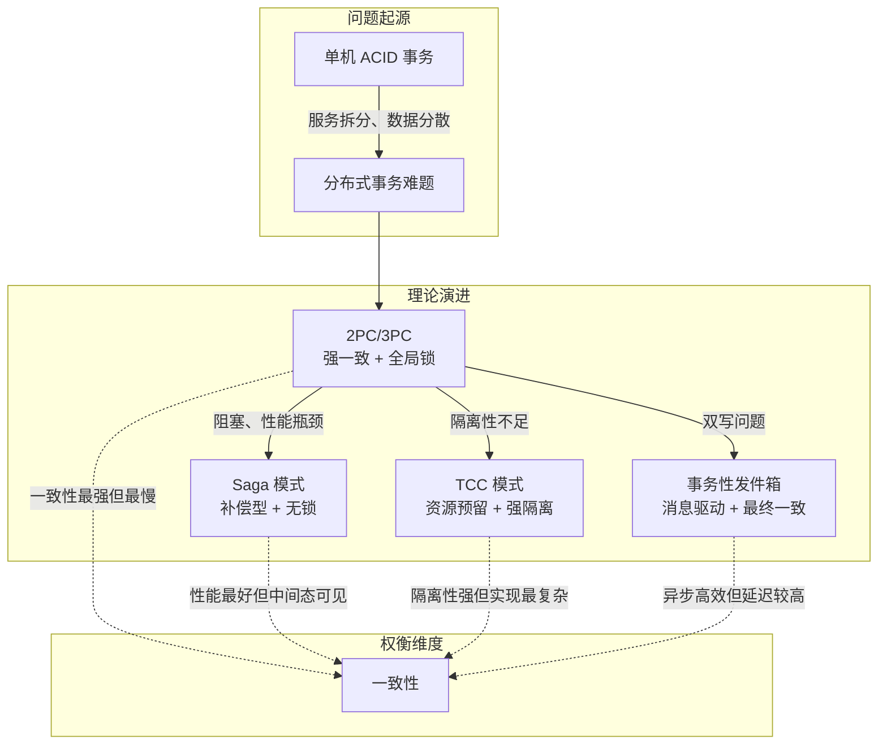
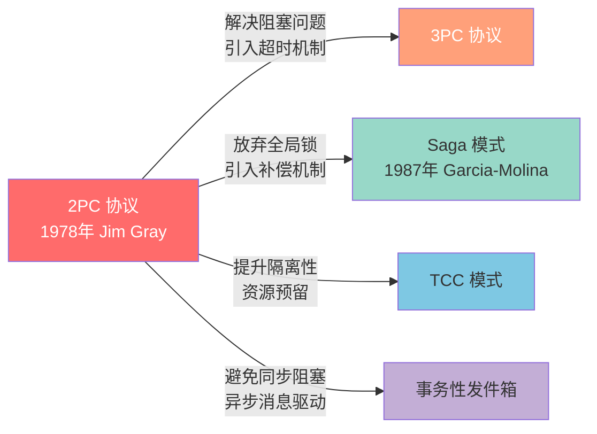
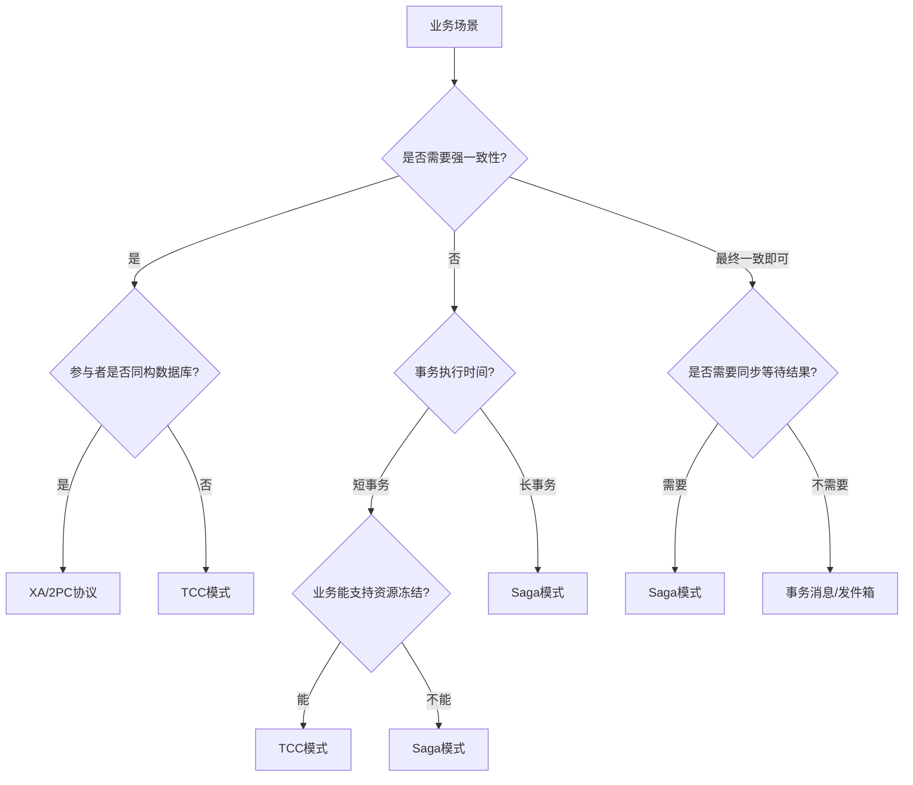

# 理论基础：分布式事务的四大经典模式

分布式事务是微服务架构中最具挑战性的工程问题。当一个业务操作需要跨越多个服务、多个数据库时，如何保证数据一致性就成了核心难题。单机数据库的ACID事务——BEGIN一个事务、COMMIT提交——在分布式场景下不再适用。取而代之的，是一系列在一致性、性能和复杂度之间做出不同权衡的分布式事务模式。

本节从理论层面系统梳理四大经典模式：**2PC/3PC协议**（强一致的基石）、**Saga模式**（最终一致的主流方案）、**TCC模式**（资源预留的隔离保证）、**事务性发件箱**（消息驱动的双写解法）。理解这些理论，是正确选择和应用后续工程技巧的前提。

## 本节内容导航

| 理论 | 核心思想 | 一致性级别 | 资源锁定 | 适用场景 |
|------|----------|-----------|---------|----------|
| [2PC/3PC协议](01-一2PC3PC协议.md) | 协调者两阶段投票 + 提交/回滚 | 强一致 | 全局锁、阻塞 | 同构数据库、对一致性要求极高 |
| [Saga模式](02-二Saga模式.md) | 长事务拆为短事务 + 逆序补偿 | 最终一致 | 无锁 | 跨服务编排、长事务、步骤多 |
| [TCC模式](03-三TCC模式.md) | Try预留 → Confirm确认 / Cancel释放 | 最终一致（强隔离） | 冻结资源 | 资金操作、库存预留、高一致性 |
| [事务性发件箱](04-四事务性发件箱.md) | 本地事务 + 消息写入原子化 | 最终一致 | 无锁 | 异步解耦、事件驱动、数据同步 |

## 从单机到分布式：为什么需要这些理论

### ACID在分布式环境下的崩塌

在单机数据库中，事务的ACID属性由数据库引擎保证：

- **原子性（Atomicity）**——事务中的所有操作要么全部成功，要么全部回滚。数据库引擎通过undo日志实现。
- **一致性（Consistency）**——事务执行前后，数据库满足所有完整性约束（外键、唯一性、检查约束等）。
- **隔离性（Isolation）**——并发事务之间互不干扰。通过锁机制和MVCC实现不同隔离级别。
- **持久性（Durability）**——已提交的事务数据不会丢失。通过redo日志和WAL（Write-Ahead Log）保证。

然而在分布式环境中，ACID的每一个属性都面临严峻挑战：

| ACID属性 | 单机环境的保证机制 | 分布式环境的挑战 |
|----------|-------------------|----------------|
| 原子性 | 单个数据库引擎的undo日志 | 跨服务操作无法用单个数据库事务包裹，需要额外的协调机制 |
| 一致性 | 数据库约束自动检查 | 多个数据库之间的数据可能不一致，约束检查无法跨库执行 |
| 隔离性 | 锁/MVCC在单库内保证 | 中间状态可能被其他服务读到，全局隔离几乎不可能实现 |
| 持久性 | redo日志 + WAL保证 | 部分提交、部分失败时，已提交的数据可能需要回滚 |

分布式系统被迫退而求其次，采用**BASE原则**：

- **基本可用（Basically Available）**——系统在出现故障时仍然可用，但响应时间或功能可能有所降级
- **软状态（Soft State）**——允许系统中的数据存在中间状态，且中间状态不影响整体可用性
- **最终一致性（Eventually Consistent）**——系统保证在没有新更新的情况下，最终所有副本都会达到一致状态

BASE不是妥协，而是在分布式约束（CAP定理）下的务实选择。

### 分布式事务的四大核心挑战

**网络不可靠**是分布式系统的第一大挑战。节点之间的消息可能丢失、重复、乱序或延迟。TCP协议只能保证"最终可达"，无法保证"即时到达"。网络分区（Partition）是常态而非异常。这意味着：一个请求发出后，你不知道它到底到达了对方没有；一个响应返回后，你不知道它是对方处理后的结果还是超时后的自动重试。

**节点可崩溃**是第二大挑战。任何参与节点都可能在事务执行过程中的任意时刻宕机——数据库可能在写入redo日志后崩溃，应用服务可能在调用远程接口后超时，协调者可能在发送Commit指令的途中断电。

**没有全局时钟**是第三大挑战。分布式系统中不存在所有节点共享的精确物理时钟。不同节点的系统时钟可能存在数百毫秒的偏差，这使得通过时间戳确定事件的全局顺序变得不可能。

**CAP约束**是第四大挑战。Eric Brewer在2000年提出的CAP定理指出：在网络分区发生时，系统必须在一致性（Consistency）和可用性（Availability）之间做出权衡，不可能同时满足三者。这是所有分布式事务方案设计的根本约束。

### 四大理论模式的演进逻辑

这四种理论模式不是随机出现的，而是对2PC缺陷的不同方向的改进：

## 55.1-55.3 2PC/3PC协议：强一致的基石与局限

### 2PC协议的工作原理

2PC（Two-Phase Commit）由Jim Gray在1978年提出，是分布式事务最经典的协议。它引入两个角色：**协调者（Coordinator）**负责发起和管理整个事务的提交过程；**参与者（Participant）**是事务涉及的各个资源管理器（如数据库），它们执行本地事务并响应协调者的指令。

协议分为两个阶段：

**Prepare阶段（投票阶段）**：协调者向所有参与者发送Prepare请求；每个参与者执行本地事务的预处理（写redo/undo日志），但不提交；如果本地预处理成功，参与者回复"Yes"（同意提交）；如果失败或超时，参与者回复"No"（拒绝提交）。

**Commit阶段（决定阶段）**：如果所有参与者都回复"Yes"，协调者发送Commit指令，所有参与者提交本地事务；如果有任何一个参与者回复"No"或超时，协调者发送Rollback指令，所有参与者回滚本地事务。

2PC的核心优势在于提供了**强一致性保证**——要么所有参与者全部提交，要么全部回滚，不存在中间状态。

### 2PC的三大致命缺陷

然而2PC在实际工程中面临三大问题，这些问题促使了后续方案的诞生：

**阻塞问题**：在Prepare阶段之后、Commit阶段之前，如果协调者崩溃，参与者将处于不确定状态——它已经投了"Yes"票，但不知道最终决定是提交还是回滚。此时参与者必须等待协调者恢复，期间资源被锁定，无法处理其他事务。在高并发场景下，这可能导致大量事务被阻塞，系统吞吐量急剧下降。

**单点故障**：协调者是整个协议的单点。如果协调者在Commit阶段发送了部分Commit消息后崩溃，部分参与者提交了事务，部分参与者还在等待，导致数据不一致。虽然可以通过协调者集群化（如Raft共识）来缓解，但这大大增加了系统复杂度。

**性能瓶颈**：2PC需要至少两轮网络通信，且在Prepare和Commit之间存在全局锁。这意味着：事务的响应时间至少是两次网络往返的延迟之和；在事务执行期间，所有参与者的关键资源都被锁定，无法处理其他事务。在互联网高并发场景下，这种性能代价通常是不可接受的。

### 3PC协议的改进与局限

3PC（Three-Phase Commit）在Prepare和Commit之间增加了一个PreCommit阶段，将协议分为CanCommit、PreCommit和DoCommit三个阶段。核心改进在于引入了**超时机制**：如果参与者在PreCommit之后长时间收不到DoCommit指令，它可以选择提交事务（因为既然已经进入PreCommit，说明所有参与者都同意提交）。

但3PC在实际工程中很少被直接使用，原因在于：它增加了协议的复杂度和网络通信轮次（从2轮变成3轮）；在异步网络中，超时机制可能导致不一致——如果网络分区导致部分参与者收到了DoCommit而另一部分没有，超时提交会导致**分裂脑（Split-Brain）**问题。

**理论定位**：2PC/3PC的价值不在于直接应用（实际生产中已很少直接使用原生2PC），而在于理解它的缺陷——阻塞、单点、性能——正是这些缺陷催生了Saga、TCC等现代分布式事务方案。XA协议（基于2PC）在同构数据库场景下仍然可用，但越来越多的系统转向补偿型或资源预留型方案。

## 55.4-55.5 Saga模式：最终一致的主流方案

### Saga的理论模型

Saga模式由Hector Garcia-Molina和Kenneth Salem在1987年的论文"Sagas"中提出。其核心思想是：**将一个长事务T分解为一系列子事务T1, T2, ..., Tn，每个子事务Ti都有一个对应的补偿事务Ci**。

形式化地说，一个Saga可以表示为两种执行序列：

- **成功路径**：T1, T2, T3, ..., Tn
- **失败路径**：T1, T2, ..., Ti, Ci, Ci-1, ..., C1（其中Ti失败）

例如在电商下单场景中：

T1: 创建订单 → T2: 扣减库存 → T3: 冻结资金 → T4: 增加积分
如果T3（冻结资金）失败：
C2: 恢复库存 → C1: 取消订单

Saga模式的关键约束包括：

1. **每个子事务必须是原子的**——它要么完全成功，要么完全回滚（通过补偿）
2. **补偿事务必须是幂等的**——因为网络重试可能导致补偿操作被多次执行
3. **补偿事务不等于反向操作**——补偿的目的是"消除影响"，而非简单地执行相反操作
4. **子事务之间应尽量松耦合**——一个子事务的执行不应该依赖另一个子事务的中间状态

### Saga的两种错误处理策略

**前向恢复（Forward Recovery）**：当子事务因临时性故障（网络抖动、服务短暂不可用）失败时，系统通过重试使该子事务成功，而不是回滚整个Saga。前向恢复适用于临时性故障场景，能提高Saga的成功率。

**后向补偿（Backward Compensation）**：当子事务因确定性故障（余额不足、库存为零）失败或重试耗尽时，按照逆序执行补偿事务，将系统恢复到Saga开始之前的状态。后向补偿是Saga模式的主要错误处理策略。

### 编排式 vs 协同式：两种协调方式

Saga模式有两种协调方式，在架构复杂度、耦合度和可观测性方面各有优劣：

**编排式Saga（Orchestration）**：使用一个中央的Saga编排器（Orchestrator）管理整个流程。编排器持有Saga的完整定义，按顺序触发每个子事务，根据执行结果决定下一步操作。

| 维度 | 编排式Saga | 协同式Saga |
|------|-----------|-----------|
| 流程管理 | 集中在编排器中 | 分散在各服务中 |
| 耦合度 | 编排器与所有服务耦合 | 服务间通过事件松耦合 |
| 可观测性 | 高（流程清晰可见） | 低（需追踪事件链） |
| 单点风险 | 编排器是单点（需高可用） | 无单点 |
| 适用场景 | 步骤多（>3步）、复杂流程 | 步骤少、天然松耦合 |

**协同式Saga（Choreography）**：没有中央协调器，每个服务监听事件总线上的事件，并根据事件决定下一步操作。例如订单服务发出"订单已创建"事件→库存服务执行库存预留→支付服务执行扣款。

在实际工程中，编排式Saga更为常用。原因很直接：当Saga步骤增多时，协同式方案的事件链变得复杂，调试困难，补偿逻辑分散在各服务中难以保证正确性。编排器虽然引入了单点，但通过集群化部署（如Temporal、Cadence）可以有效解决高可用问题。

**Saga状态机**是管理Saga执行流程的核心组件，典型状态包括：STARTED（已启动）→ RUNNING（执行中）→ COMPLETED（已完成）/ COMPENSATING（补偿中）→ FAILED（已失败）/ ABORTED（已中止）。

## 55.6 TCC模式：资源预留的隔离保证

### TCC的三阶段模型

TCC（Try-Confirm-Cancel）模式是另一种重要的分布式事务方案。与Saga不同，TCC在Try阶段就完成了资源预留，提供了更好的隔离保证。

**Try阶段（尝试执行）**：执行业务检查并预留资源。资源预留的含义是：不执行实际的业务操作，而是将需要的资源"冻结"。例如在转账场景中，Try阶段不实际转出资金，而是将转账金额从可用余额中冻结到冻结余额；在库存场景中，Try阶段不实际扣减库存，而是将商品数量从可用库存中预留到冻结库存。

**Confirm阶段（确认执行）**：如果所有参与者的Try阶段都成功，执行Confirm操作，将预留的资源真正消耗。Confirm操作必须满足两个条件：**幂等性**（可能因网络重试被多次执行，结果必须与一次执行相同）和**不做业务检查**（只执行实际操作，不再做业务检查）。

**Cancel阶段（取消执行）**：如果某个参与者的Try阶段失败，对已经成功Try的参与者执行Cancel操作，释放预留的资源。Cancel同样必须幂等。

### TCC的两大特殊问题

**空回滚**：如果Try请求因为网络原因没有到达参与者，但Cancel请求先到达了，参与者需要识别这是一个空回滚——没有对应的Try记录，直接返回成功而不做任何操作。如果不处理空回滚，Cancel可能会释放不存在的资源，导致数据错误。

**悬挂**：如果Cancel请求先到达并执行完毕，之后Try请求才到达，参与者需要识别这种悬挂情况，拒绝执行Try操作。否则资源被预留但永远不会被Confirm或Cancel，形成"悬挂"——资源被永久冻结。

### TCC vs Saga：核心区别

| 对比维度 | TCC | Saga |
|---------|-----|------|
| 资源处理 | Try阶段预留（冻结），Confirm/Cancel阶段消费/释放 | 直接执行，失败时通过补偿恢复 |
| 隔离性 | 强（资源已冻结，中间状态不可见） | 弱（中间状态可能被其他事务读到） |
| 实现复杂度 | 高（三个接口 + 空回滚 + 悬挂防御） | 中（正向操作 + 补偿操作） |
| 业务侵入 | 高（业务必须支持资源冻结/解冻） | 低（只需实现补偿逻辑） |
| 适用场景 | 资金操作、库存预留、高一致性要求 | 跨服务编排、长事务、步骤多 |

TCC的核心优势是**强隔离性**——通过资源预留，中间状态不会暴露给其他事务。但代价是更高的实现复杂度和业务侵入性。实践中Saga的使用频率远高于TCC，TCC主要应用于对一致性要求极高的资金类场景。

## 55.7 事务性发件箱与消息驱动一致性

### 双写问题：微服务的顽疾

在微服务架构中，数据库更新和消息发送的"双写"问题是一个经典的分布式事务挑战。典型场景：订单服务需要在更新订单状态的同时发送"订单已创建"消息给下游服务。如果先写库再发消息，库写成功但消息发送失败，下游服务不知道订单已创建；如果先发消息再写库，消息发送成功但库写失败，下游服务收到了一个不存在的订单的消息。

无论哪种顺序，都无法保证数据库更新和消息发送的原子性。

### 四种解决方案

**事务性发件箱（Transactional Outbox）**：在同一个数据库事务中，将业务数据和需要发送的消息一起写入数据库。消息写入一个"发件箱"表，由独立的中继进程（Relay）轮询发件箱表并将消息发送到消息队列。核心优势：业务数据更新和消息记录的原子性由数据库事务保证，从根本上解决了双写问题。

**CDC方式（Change Data Capture）**：是轮询方式的改进。通过监听数据库的变更日志（如MySQL的binlog、PostgreSQL的WAL），CDC工具（如Debezium）实时捕获发件箱表的变更并发送到消息队列。优势：延迟极低（秒级），不增加数据库查询压力。代价：需要维护额外的CDC基础设施。

**本地消息表（Local Message Table）**：与事务性发件箱类似，消息表同时承担消息存储和异步处理的双重角色。通过状态机管理消息的生命周期：PENDING → SENDING → CONFIRMED 或 RETRYING → FAILED。

**最大努力通知（Best-Effort Notification）**：最简单的方案，不保证消息一定被送达，但在正常情况下会尽力发送。适用于对一致性要求较低的场景（如通知推送、日志记录）。

### RocketMQ事务消息：消息中间件原生支持

RocketMQ通过"半消息"（Half Message）机制在消息中间件层面提供原生的分布式事务支持：

1. 生产者发送半消息到Broker，此时消费者不可见
2. 生产者执行本地事务
3. 根据本地事务结果，向Broker发送Commit或Rollback指令
4. 如果Broker长时间没有收到指令，会回查生产者的本地事务状态

这种方案将事务协调的责任转移到了消息中间件，简化了业务端的实现。

### 四种方案的对比

| 方案 | 一致性保证 | 延迟 | 架构复杂度 | 适用场景 |
|------|-----------|------|-----------|---------|
| 事务性发件箱 | 强（同一事务） | 秒到分钟级（轮询） | 中 | 通用，最常用 |
| CDC + 发件箱 | 强（binlog保证） | 秒级 | 高（需Debezium） | 高吞吐、低延迟 |
| 本地消息表 | 强（同一事务） | 秒级 | 中 | 中小规模 |
| RocketMQ事务消息 | 强（半消息机制） | 秒级 | 低（MQ内置） | 已用RocketMQ的场景 |

## 方案选型总览

理解四种理论模式后，面对具体业务场景如何选择？核心原则是：**能用本地事务解决的，绝不用分布式事务；能用最终一致性的，不用强一致性；能用Saga的，不用TCC**。

| 维度 | 2PC/3PC | Saga | TCC | 事务消息/发件箱 |
|------|---------|------|-----|---------------|
| 一致性级别 | 强一致 | 最终一致 | 准强一致 | 最终一致 |
| 性能 | 低（全局锁） | 高（无锁） | 中（资源预留） | 高（异步） |
| 实现复杂度 | 低（协议固定） | 中（需设计补偿） | 高（三个接口+防悬挂） | 中（需设计消息表） |
| 业务侵入 | 无（XA） | 低（写补偿逻辑） | 高（需支持资源冻结） | 低（写消息表） |
| 资源锁定 | 全局锁、时间长 | 无锁 | 冻结资源、时间短 | 无锁 |
| 典型框架 | MySQL XA、Atomikos | Seata Saga、Temporal | Seata TCC、Hmily | RocketMQ、Kafka |

## 小结

本节从理论层面系统梳理了分布式事务的四大经典模式。它们的演进逻辑清晰：**2PC/3PC协议**通过两阶段交互实现原子提交，但存在阻塞和单点故障问题，性能难以满足互联网场景需求；**Saga模式**通过补偿机制避免了全局锁，成为微服务架构中使用最广泛的方案；**TCC模式**通过资源预留提供了更强的隔离保证，适用于资金类高一致性场景；**事务性发件箱**通过消息驱动实现了异步解耦，是高吞吐场景的首选。

理解这些理论模式的核心权衡——**一致性 vs 性能 vs 复杂度**——是在实际系统中正确应用分布式事务的前提。理论基础回答了"分布式事务是什么、有哪些方案"，后续的核心技巧章节将回答"怎么落地、怎么避坑"。
