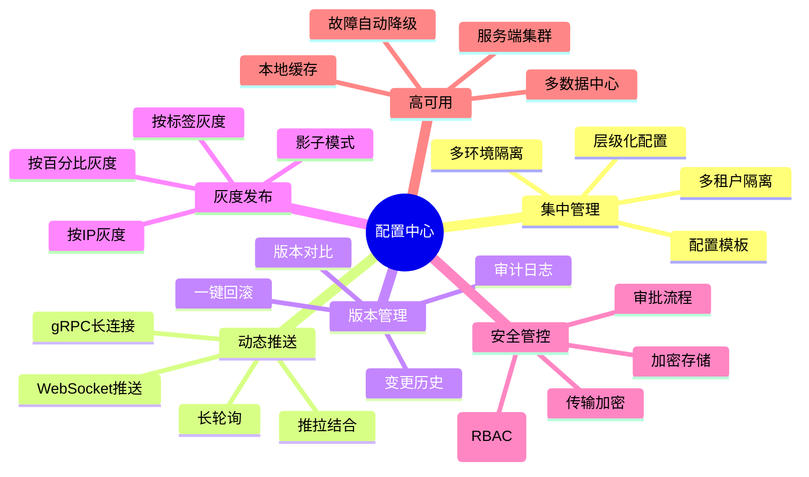
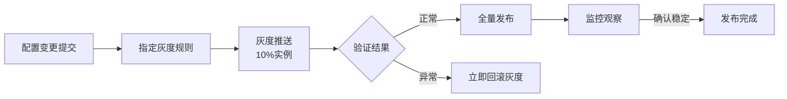
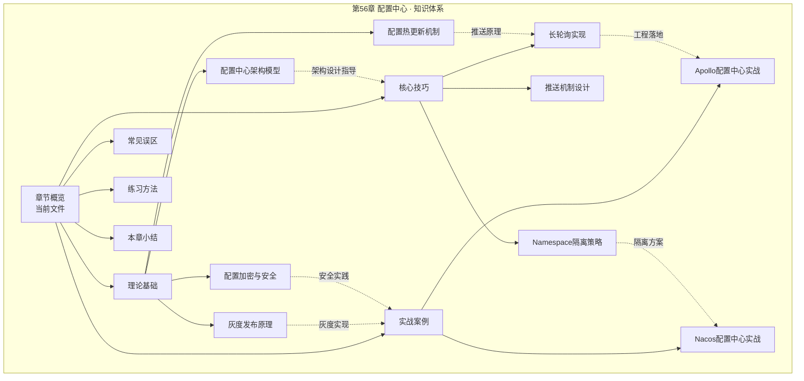
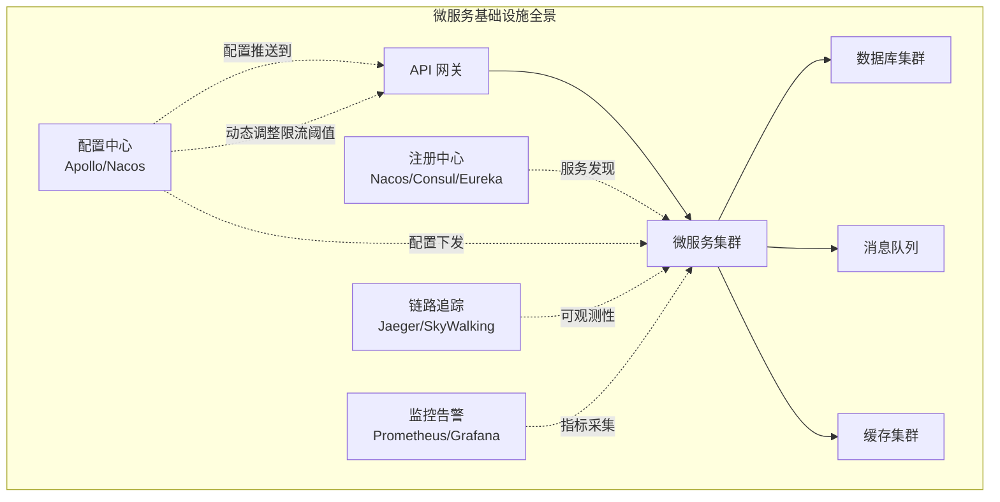
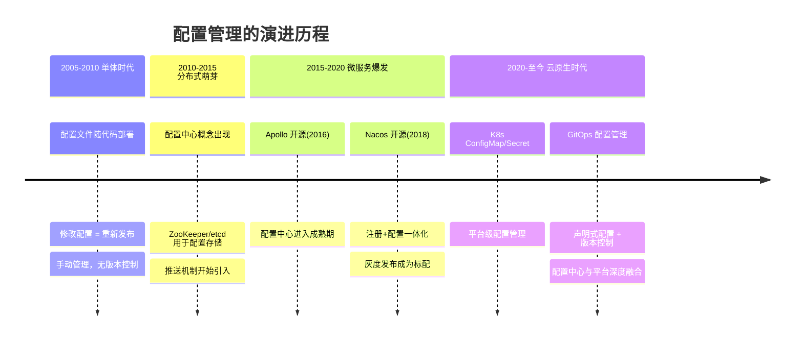

# 第56章 配置中心 · 章节概览

***

## 为什么需要配置中心

在单体应用时代，配置文件（如 application.properties、.yaml）与代码一起打包部署。修改一个数据库连接池参数，需要改代码、走 CI/CD、重新发布——这个过程可能耗时数小时，而修改本身只花了几秒钟。

当系统演进到微服务架构后，这个问题被急剧放大。一个典型的微服务系统可能有 200-500 个服务实例，每个实例的配置项可能有数百个。假设系统有 5 种环境（DEV / SIT / UAT / PRE / PROD），每个环境有 3 套集群，配置项总量轻松达到：

500 个服务 × 300 个配置项 × 5 环境 × 3 集群 = 2,250,000 个配置值

面对这个规模，传统的方式完全不可行：

| 传统方式 | 带来的问题 |
|---------|-----------|
| 配置文件打包在代码中 | 每次修改都要重新部署，发布周期长 |
| 配置文件分散在各服务器 | 修改一个配置需要登录多台机器，容易遗漏 |
| 配置变更无审批流程 | 误操作直接上线，故障率高 |
| 无版本管理 | 配置改坏了无法回滚，排查困难 |
| 敏感配置明文存储 | 数据库密码、API 密钥等散落在代码仓库中 |

配置中心正是为了解决这些问题而生。它通过**集中管理、动态推送、版本控制、灰度发布**四大核心能力，将配置从代码中解耦出来，成为微服务架构的基础设施组件之一。

### 什么时候不需要配置中心

并非所有项目都适合引入配置中心。以下场景可以暂时不引入：

| 场景 | 原因 | 更好的方案 |
|------|------|-----------|
| 单体应用，服务实例 < 5 | 配置量小，修改频率低 | 本地配置文件 + 环境变量 |
| 配置几乎不变（一年改几次） | 投入产出比低 | 配置文件 + CI/CD 重新部署 |
| 团队 < 10 人，无多环境需求 | 沟通成本低于工具成本 | Git 仓库管理配置文件 |
| Kubernetes 原生部署，配置简单 | K8s ConfigMap/Secret 已够用 | 直接使用 K8s 原生方案 |

判断是否需要配置中心的核心标准是**配置变更频率 × 服务规模 × 环境数量**。当三者的乘积超过人工管理的阈值时，配置中心的价值才会显现。

***

## 配置中心的核心能力模型

一个成熟的配置中心需要同时满足以下六个维度的能力要求：

### 能力一：集中管理

配置中心最基本的功能是将所有服务的配置集中存储和管理。这不仅仅是把配置文件搬到一个平台上，更重要的是提供**层级化的配置组织模型**：

- **环境维度**：DEV → SIT → UAT → PRE → PROD，每个环境的配置相互隔离
- **集群维度**：同一环境下，不同数据中心的集群可以有不同的配置（如数据库地址不同）
- **服务维度**：每个服务有自己独立的配置空间
- **实例维度**：个别实例需要特殊的配置覆盖（如调试模式）

典型的配置层级结构如下：

application                    # 全局公共配置（所有服务共享）
  ├── database.pool.size=100
  ├── log.level=INFO
  └── redis.timeout=3000

payment-service               # 服务级配置（仅支付服务使用）
  ├── callback.url=https://pay.example.com/notify
  ├── retry.max=3
  └── timeout.ms=5000

payment-service[10.0.1.5]     # 实例级配置（特定实例覆盖）
  └── log.level=DEBUG

配置的继承与覆盖遵循**就近原则**：实例级 > 服务级 > 全局级。这种层级模型使得配置的组织从"一锅粥"变成了"树状结构"，极大地提升了可维护性。

### 能力二：动态推送

配置变更后，客户端需要及时感知到变更并更新本地配置。这是配置中心区别于"把配置文件放在 Git 仓库"的核心能力。主流的推送机制有三种：

| 机制 | 实时性 | 实现复杂度 | 兼容性 | 适用场景 |
|------|--------|-----------|--------|---------|
| 长轮询（Long Polling） | 秒级 | 低 | 好（基于HTTP） | 大多数场景 |
| WebSocket 推送 | 毫秒级 | 中 | 需要支持WS的网络 | 对实时性要求极高的场景 |
| gRPC 长连接 | 毫秒级 | 中 | 需要 gRPC 支持 | 已有 gRPC 技术栈的场景 |

**长轮询**是目前使用最广泛的机制。Apollo 和 Nacos 1.x 均采用此方案。其工作原理是：客户端向服务端发送 HTTP 请求，服务端 hold 住该请求（不立即返回），当配置发生变更时立即返回变更通知；如果超时（通常 60 秒）仍无变更，返回空响应，客户端立即发起下一次轮询。这种方式兼顾了实时性和实现简单性的优点。

推拉结合（Push + Pull）是更健壮的方案：推送通道负责实时通知"有变更"，客户端收到通知后再主动拉取最新配置值。这样即使推送通道短暂中断，客户端也能通过定期拉取兜底，避免配置长时间不一致。

### 能力三：版本管理

每一次配置变更都应该被记录为一个版本，包含以下信息：

版本号: v27
Namespace: production/payment-service
Key: retry.max
旧值: 3
新值: 5
变更人: zhangsan
变更时间: 2025-01-15 14:30:00
变更原因: 大促期间第三方支付网关响应变慢，增加重试次数
审批人: lisi

版本管理的核心价值在于**可追溯**和**可回滚**。当配置变更导致线上故障时，运维人员可以在分钟级别回滚到任意历史版本，而不是手动查找并修改配置。

### 能力四：灰度发布

灰度发布是配置变更安全性的关键保障。其核心思想是**先小范围验证，再全量推广**：

常见的灰度策略包括：

- **基于 IP 列表**：指定若干测试机接收新配置，适合定向验证
- **基于标签（Label）**：给实例打上标签（如 canary: true），按标签分组灰度
- **基于百分比**：随机选择指定比例的实例接收新配置，适合大规模渐进式发布
- **影子模式**：新配置仅写入日志不实际生效，用于验证配置格式和影响范围

### 能力五：安全管控

配置中心存储了大量敏感信息——数据库密码、Redis 密钥、API Token、证书私钥。这些信息一旦泄露，可能导致严重的安全事故。配置中心必须提供全链路的安全保障：

- **存储安全**：敏感配置使用 AES-256 加密存储，密钥由独立的 KMS（密钥管理系统）托管
- **传输安全**：客户端与服务端之间使用 mTLS 加密通信
- **访问控制**：基于 RBAC 的权限管理，不同角色对不同 Namespace 有不同操作权限
- **审计日志**：所有配置的读取、修改、发布操作全部记录，满足合规审计要求

### 能力六：高可用

配置中心本身也是一个分布式系统，也需要保证高可用。如果配置中心宕机导致所有服务无法获取配置，那就是典型的"基础设施单点故障"。高可用设计包括：

- **服务端集群**：Config Service 无状态设计，可水平扩展；至少部署 3 个节点
- **客户端本地缓存**：将配置缓存在本地文件系统（磁盘 + 内存双层缓存），配置中心不可用时自动降级使用缓存
- **多级降级策略**：L1（内存缓存）→ L2（本地文件缓存）→ L3（远程配置中心）

Apollo 的本地缓存机制是一个经典设计：客户端启动时从 Config Service 拉取全量配置并写入本地文件（约 `/opt/data/xxx/apollo-cache/`），运行时优先读内存缓存，内存缓存未命中则读本地文件，最后才走网络。即使配置中心完全不可用，服务也能基于本地缓存正常运行。

***

## 配置中心的分类体系

从架构模式和适用场景来看，配置中心可以分为以下几类：

| 分类 | 代表产品 | 核心特征 | 适用场景 |
|------|---------|---------|---------|
| **专业配置中心** | Apollo | 独立部署、功能完备、灰度+权限+审计齐全 | 大型企业微服务系统 |
| **注册+配置一体** | Nacos、Consul | 注册中心与配置中心合一、减少运维组件 | 中小型微服务、希望统一管理 |
| **平台原生方案** | K8s ConfigMap/Secret、AWS Parameter Store | 与容器/云平台深度集成 | 云原生部署、K8s 生态 |
| **通用分布式 KV** | etcd、ZooKeeper、Redis | 配置作为 KV 存储的特例、需要二次封装 | 需要 Watch 机制的基础设施配置 |
| **GitOps 方案** | ArgoCD + ConfigMap、Flux CD | 配置存储在 Git、声明式同步到集群 | GitOps 流程、K8s 原生环境 |

每种分类的核心权衡在于：**功能完备性 vs 部署复杂度 vs 与现有技术栈的融合度**。选型时不应追求"最强"，而应追求"最适合"。

***

## 本章知识体系全景

本章从理论到实战，系统性地覆盖配置中心的完整知识体系。以下是各部分的定位和核心内容：

### 理论基础：知其所以然

理论部分构建配置中心的完整知识框架，回答"为什么这样设计"的核心问题：

| 小节 | 主题 | 核心问题 |
|------|------|---------|
| 56.1 | 配置中心架构模型 | 配置中心由哪些组件构成？各组件的职责边界是什么？ |
| 56.2 | 配置存储的一致性模型 | 最终一致 vs 强一致如何选？Apollo 的一致性策略是什么？ |
| 56.3 | 配置变更推送机制 | 长轮询、WebSocket、UDP 三种推送方式的原理和适用场景 |
| 56.4 | Apollo 架构详解 | Config Service、Admin Service、Portal、SDK 四层架构的协作方式 |
| 56.5 | Nacos 架构详解 | Namespace/Group/DataId 三级模型与 gRPC 长连接推送 |
| 56.6 | 灰度发布与版本管理 | 灰度策略设计、版本链表结构、回滚机制 |
| 56.7 | 配置加密与安全 | AES 加密存储、KMS 密钥管理、RBAC 权限控制 |

### 核心技巧：知其然且能行之

核心技巧部分聚焦工程实操，提供可直接落地的代码和方案：

| 小节 | 主题 | 你会学到什么 |
|------|------|------------|
| 长轮询 | Long Polling 完整实现 | 从零实现一个支持心跳、超时重连、本地缓存的长轮询客户端 |
| 推送机制 | 推拉结合的架构设计 | 如何在长轮询基础上叠加 WebSocket 推送，实现毫秒级配置变更通知 |
| Namespace 隔离 | 多环境多租户配置管理 | DEV/SIT/UAT/PRE/PROD 的隔离方案，跨环境配置继承与覆盖策略 |

### 实战案例：Apollo 与 Nacos

两个主流配置中心的完整实战案例，覆盖从搭建到生产的全流程：

| 案例 | 技术栈 | 实战内容 |
|------|--------|---------|
| Apollo 实战 | Spring Boot + Apollo + MySQL | 单元测试环境搭建、配置发布全流程、灰度发布实操、版本回滚演练 |
| Nacos 实战 | Spring Cloud + Nacos + MySQL | 多环境 Namespace 配置、Group 分组管理、配置监听与动态刷新 |

### 常见误区：避坑指南

配置中心领域最典型的工程陷阱，每一条都来自真实的生产事故：

- **过度动态化**：把本应静态的配置（如数据库地址）也做成动态的，增加不必要的复杂度
- **配置风暴**：高频变更配置导致客户端和服务端压力骤增，需设置变更频率限制
- **缓存一致性**：配置变更后部分实例已更新、部分实例还在用旧值的窗口期问题
- **敏感信息泄露**：API 密钥、数据库密码等敏感配置未加密直接存储
- **Namespace 爆炸**：为每个小团队都创建独立 Namespace，导致管理成本急剧上升
- **忽略本地缓存**：未配置本地缓存或缓存路径不合理，配置中心故障时服务直接不可用

### 练习方法与本章小结

练习部分提供循序渐进的动手实验，从搭建一个最小配置中心到实现完整的灰度发布流程。本章小结汇总核心知识点，给出配置中心选型决策框架，并推荐延伸阅读材料。

***

## 主流配置中心方案对比

在选择配置中心之前，需要理解各主流方案的定位差异：

| 维度 | Apollo | Nacos | Spring Cloud Config | etcd |
|------|--------|-------|---------------------|------|
| **定位** | 专业配置中心 | 注册中心 + 配置中心 | Spring 生态配置方案 | 通用分布式 KV |
| **开源方** | 携程 | 阿里巴巴 | Spring 社区 | CoreOS (CNCF) |
| **配置推送** | 长轮询 | 长轮询 / gRPC (2.0) | Git Webhook + Bus | Watch 机制 |
| **灰度发布** | 原生支持（IP/标签/百分比） | 支持（IP/Label） | 不原生支持 | 不支持 |
| **版本管理** | 完善（历史/对比/回滚） | 支持版本对比和回滚 | 依赖 Git 历史 | 依赖 Revision |
| **权限控制** | 完善（RBAC + 审批） | 基础（Namespace 级别） | 依赖 Git 权限 | 基于角色 |
| **多语言** | Java / .NET / Go | Java / Go / Python | Java 为主 | 所有语言 |
| **高可用** | 客户端多级缓存 + 服务端集群 | 客户端缓存 + Raft 集群 | 依赖 Git 高可用 | Raft 集群 |
| **运维复杂度** | 中（需部署 Portal + Config + Admin + DB） | 低（单进程多模式） | 低（基于 Git） | 低（但需二次封装） |
| **适用场景** | 大型微服务系统，需要完善灰度和权限 | 需要注册中心 + 配置中心统一管理 | Spring Cloud 技术栈 | 需要轻量级 KV + Watch |

**选型建议**：

- **企业级微服务（首选 Apollo）**：配置变更频繁、灰度发布需求强、需要完善的权限管理和审计
- **阿里云生态 / 轻量级（首选 Nacos）**：已使用 Nacos 作为注册中心、配置量适中、希望统一管理
- **Spring Cloud 项目（可选 Spring Cloud Config）**：配置变更不频繁、团队熟悉 Spring 生态、不需要复杂灰度
- **Kubernetes / 基础设施配置（可选 etcd）**：K8s 已有 etcd、适合存储基础设施级别的配置（如路由规则）

### 云原生时代的配置管理补充

Kubernetes 的 ConfigMap 和 Secret 提供了平台级的配置管理能力，但与专业配置中心存在本质差异：

| 对比维度 | K8s ConfigMap/Secret | Apollo/Nacos |
|---------|---------------------|-------------|
| 动态更新 | 需要 Pod 重启或 sidecar 同步 | 应用内热更新，无需重启 |
| 灰度发布 | 不原生支持，需 ArgoCD Rollout | 原生支持按 IP/标签/百分比灰度 |
| 版本管理 | 依赖 etcd Revision，回滚操作复杂 | 完善的版本历史 + 一键回滚 |
| 权限控制 | 依赖 K8s RBAC（Namespace 级别） | 细粒度的 Namespace + Key 级别权限 |
| 多集群同步 | 需要额外工具（如 Velero） | 内置多集群/多数据中心支持 |

实际生产中，两者并非互斥关系。许多团队采用**互补方案**：K8s ConfigMap 管理环境级别的基础配置（如 JVM 参数），Apollo/Nacos 管理业务级别的动态配置（如限流阈值、功能开关）。

***

## 配置中心在架构体系中的位置

配置中心不是孤立存在的，它与微服务架构中的其他基础设施组件紧密协作：

配置中心与其他组件的关键协作点：

- **与注册中心的协同**：Nacos 同时承担注册中心和配置中心的角色，减少了运维复杂度；Apollo 则需要与 Eureka/Nacos 等注册中心配合使用
- **与 API 网关的协同**：限流规则、路由策略、熔断阈值等网关配置可以通过配置中心动态下发，无需重启网关。例如，大促前动态调高限流阈值，大促后恢复默认值
- **与监控系统的协同**：配置变更事件可以被监控系统采集，与业务指标关联分析。典型场景：配置变更后 QPS 下降，自动触发告警，快速定位是否是配置变更引起的故障
- **与 CI/CD 的协同**：配置变更纳入 CI/CD 流水线，通过自动化审批和灰度流程保障变更安全。部分团队将配置变更与代码变更关联，实现"配置即代码"的管理理念
- **与服务网格的协同**：在 Istio/Envoy 架构下，路由规则、熔断策略等可以作为配置中心的管理对象，通过配置中心统一下发到 Sidecar 代理

***

## 从历史演进看配置管理

理解配置中心的发展历程，有助于理解其设计决策背后的权衡：

每个阶段的技术演进都源于实际问题的驱动：

1. **单体时代**的痛点是"改配置要重新部署"——配置中心解决了配置与代码的解耦
2. **分布式萌芽期**的痛点是"配置分散在各节点"——集中管理解决了配置的统一治理
3. **微服务爆发期**的痛点是"配置变更不安全"——灰度发布和版本管理解决了变更风险
4. **云原生时代**的挑战是"如何与容器编排平台融合"——K8s 原生配置管理与传统配置中心互补

值得注意的是，技术演进不是简单的替代关系。即使在 2026 年，Apollo 和 Nacos 仍然是企业微服务架构的主流选择，GitOps 方案在 Kubernetes 环境中快速增长，而 etcd 作为基础设施配置的底层存储依然不可替代。**多种方案共存、各司其职**，这才是当前配置管理的真实图景。

***

## 关键指标速查

配置中心自身的健康状态需要关注以下核心指标：

| 指标 | 含义 | 典型目标值 | 监控方法 | 告警阈值建议 |
|------|------|-----------|---------|-------------|
| 配置读取延迟 | 客户端获取配置的端到端延迟 | P99 < 50ms | 客户端埋点 + APM | P99 > 200ms 触发告警 |
| 配置推送延迟 | 配置变更后客户端感知的延迟 | P99 < 3s | 变更时间戳对比 | P99 > 10s 触发告警 |
| 推送成功率 | 配置变更成功推送到目标实例的比例 | > 99.99% | 服务端推送日志 | < 99.9% 触发告警 |
| Config Service 可用性 | 配置读取服务的在线率 | > 99.99% | 健康检查 + 告警 | 连续失败 3 次触发告警 |
| 本地缓存命中率 | 客户端从本地缓存读取配置的比例 | 正常 > 95% | 客户端指标上报 | < 80% 说明网络或服务异常 |
| 配置变更 QPS | 单位时间内配置变更的次数 | 依业务而定 | Admin Service 日志 | 突增 10x 触发告警（防误操作） |
| 配置项总数 | 当前管理的配置项数量 | 依业务而定 | Portal 统计 | 超过阈值需评估是否需要拆分 |

### 配置中心运维要点

- **定期备份**：配置数据库（如 Apollo 的 ApolloConfigDB）需纳入备份策略，建议每日全量 + 实时 binlog
- **容量规划**：单个 Namespace 的配置项建议不超过 1000 个，超过时考虑拆分
- **版本清理**：历史版本保留策略建议 90 天，超过后归档或清理，避免数据库膨胀
- **混沌测试**：定期模拟配置中心宕机，验证客户端本地缓存降级机制是否正常工作

***

> 本章概览为你提供了配置中心的全局视角。接下来，我们将从理论基础出发，逐层深入配置中心的架构设计、推送机制和安全实践，并通过 Apollo 和 Nacos 两个实战案例，将知识转化为可落地的工程能力。
