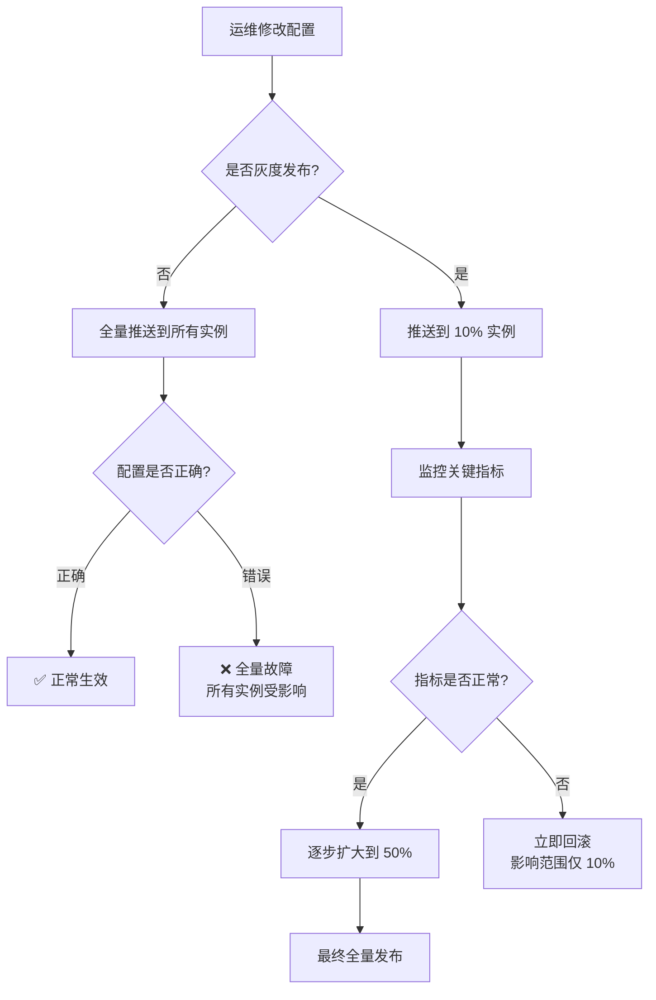
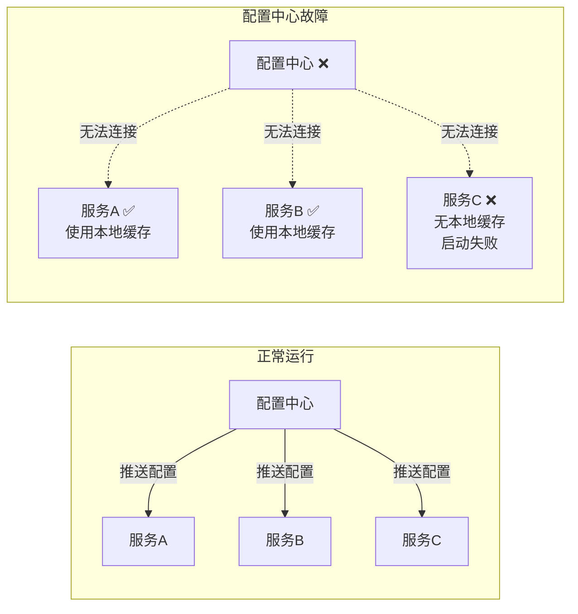
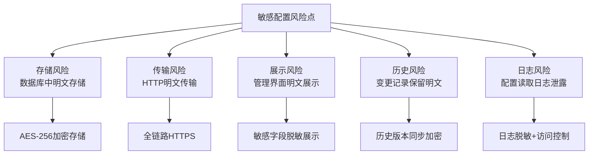
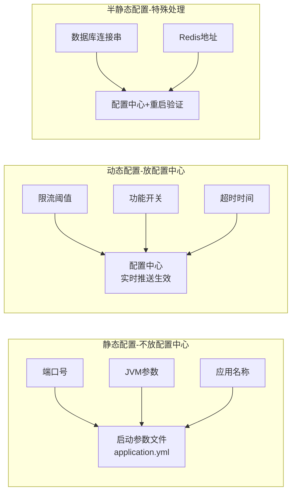
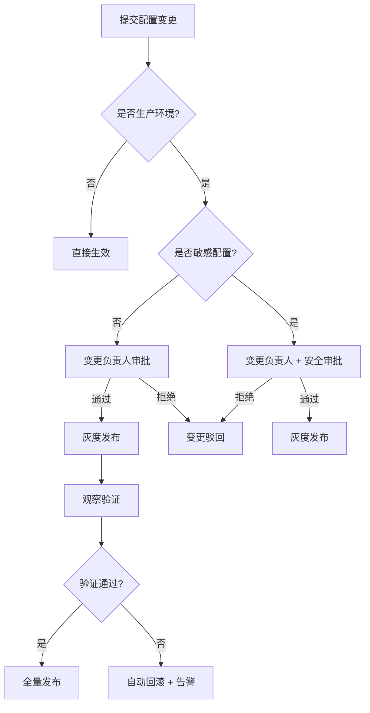
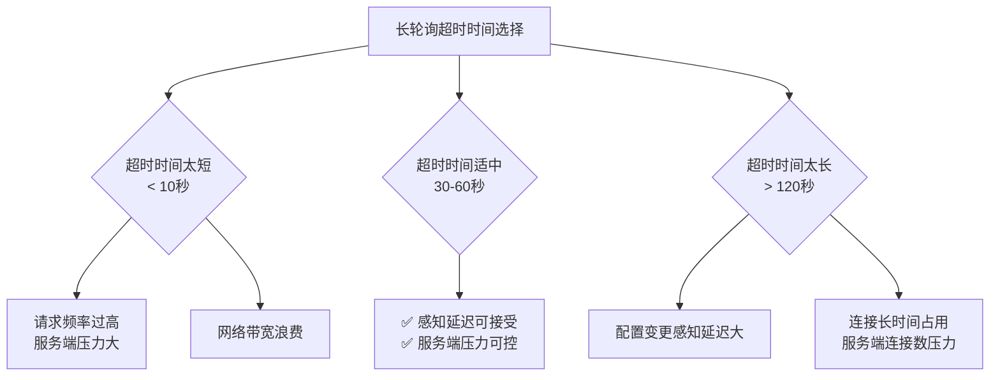
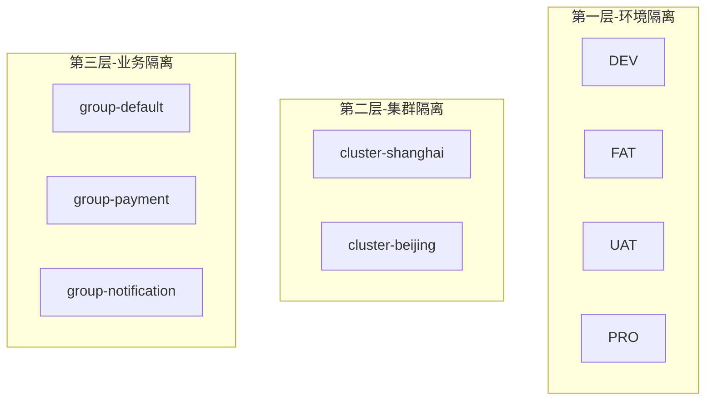

# 配置中心常见误区与避坑指南

配置中心是微服务架构的核心基础设施，但"用起来"和"用好"之间存在巨大鸿沟。许多团队在引入配置中心后，由于对底层机制理解不足、工程实践不规范，反而引入了新的故障源。根据行业经验，配置相关的线上故障在所有微服务事故中占比约 15%-25%，而其中绝大多数都可以通过规范化流程避免。本节系统梳理配置中心领域最常见的误区，分析其根因，给出经过生产验证的正确做法。

---

## 误区一：配置变更不加灰度，全量发布"一把梭"

### 问题现象

很多团队修改配置后直接全量推送到所有实例。一次数据库连接池大小的误配（将最大连接数从 50 写成了 5000），瞬间打满数据库连接上限，导致整个集群雪崩。更隐蔽的场景是：将某个服务的超时时间从 3000ms 改成了 300ms，所有下游调用开始超时，级联故障在几分钟内扩散到整个服务链路。

### 根因分析

配置变更本质上等同于一次"热部署"——它可以在不重启服务的情况下改变程序行为。但与代码部署不同的是，配置变更通常没有编译检查、单元测试和回归验证的保护层。全量发布意味着一次错误的配置会同时影响所有实例，没有任何缓冲地带。更危险的是，配置变更的传播速度远快于代码部署——一个 API 调用即可在秒级推送到所有实例。



### 正确做法

**灰度发布的三步走策略**：

**第一步：确定灰度范围**。选择一个流量较小但具有代表性的实例组作为灰度目标。在 Apollo 中通过灰度 IP 列表指定，在 Nacos 中通过 Label 或 IP 白名单实现。选择灰度实例时，优先选非核心链路的服务实例，避免直接在交易、支付等核心路径上做首次灰度。

**第二步：观察验证**。灰度发布后，至少观察 10-15 分钟，重点关注以下指标：

| 监控指标 | 正常表现 | 异常信号 |
|---------|---------|---------|
| 错误率 (Error Rate) | 无明显波动 | 出现突增或持续上升 |
| 响应延迟 (P99 Latency) | 保持稳定 | 出现明显劣化 |
| CPU/内存使用率 | 平稳 | 持续攀升不回落 |
| GC 频率 | 正常节奏 | Full GC 频繁触发 |
| 下游依赖错误 | 无变化 | 超时或拒绝连接增多 |
| 业务指标（订单量/登录数） | 正常波动 | 出现断崖式下降 |

**第三步：逐步全量**。确认灰度实例运行正常后，按 10% → 30% → 50% → 100% 的梯度逐步扩大范围。每一步都需监控确认。

```python
# 灰度发布控制流程
class GrayReleaseManager:
    def __init__(self, config_client, monitor_client):
        self.config_client = config_client
        self.monitor_client = monitor_client
        self.gradients = [0.1, 0.3, 0.5, 1.0]
        self.observe_duration = 600  # 10分钟
        self.error_threshold = 0.01  # 错误率阈值 1%
        self.latency_threshold = 1.5  # P99延迟放大倍数

    async def safe_release(self, namespace: str, key: str,
                           new_value: str, operator: str):
        """安全的灰度发布流程"""
        # 记录发布前的基线指标
        baseline = await self.monitor_client.get_baseline(
            namespace, window=300
        )

        for i, ratio in enumerate(self.gradients):
            print(f"[Step {i+1}/{len(self.gradients)}] "
                  f"灰度比例: {ratio*100:.0f}%")

            # 推送灰度配置
            gray_ips = self._select_gray_instances(ratio)
            await self.config_client.gray_publish(
                namespace, key, new_value,
                gray_ips=gray_ips, operator=operator
            )

            # 观察等待
            await asyncio.sleep(self.observe_duration)

            # 采集灰度实例指标
            current = await self.monitor_client.get_metrics(
                gray_ips, window=300
            )

            # 判断是否异常
            if self._has_anomaly(baseline, current):
                print(f"⚠️  检测到异常，回滚灰度配置")
                await self.config_client.rollback_gray(
                    namespace, key, operator
                )
                await self._alert_release_failure(
                    namespace, key, operator, ratio
                )
                return False

            print(f"✅ 灰度比例 {ratio*100:.0f}% 验证通过")

        print(f"🎉 全量发布完成")
        return True

    def _has_anomaly(self, baseline: dict, current: dict) -> bool:
        """检测灰度实例是否存在异常"""
        # 错误率突增
        if current["error_rate"] > max(
            baseline["error_rate"] + self.error_threshold,
            baseline["error_rate"] * 3
        ):
            return True
        # 延迟劣化
        if (current["p99_latency"] >
                baseline["p99_latency"] * self.latency_threshold):
            return True
        # CPU 飙升
        if current["cpu_usage"] > 0.85:
            return True
        return False
```

### 高级提醒

即使有灰度流程，也建议在配置中心中预留"一键回滚"按钮。Apollo 支持版本历史回滚，Nacos 也支持配置版本对比和回滚。确保每次配置变更后，变更记录中包含：变更人、变更原因、变更时间和预期影响范围。对于关键配置（如数据库连接串、限流阈值），建议设置"变更前必须人工审批"的流程门禁。

---

## 误区二：配置本地缓存缺失，配置中心宕机即全线崩溃

### 问题现象

配置中心本身也是一个服务，也会宕机。当配置中心不可用时，如果客户端没有本地缓存，所有依赖配置的服务将无法启动，甚至已运行的服务因无法读取配置而报错，形成"配置中心单点故障导致全局雪崩"的灾难场景。

### 根因分析

许多团队将配置中心当作"绝对可靠"的基础设施，忽略了分布式系统的基本现实——**任何组件都可能故障**。配置中心的可用性通常在 99.9%-99.99% 之间，这意味着每年仍有数小时到数十分钟的不可用时间。更现实的场景是：配置中心的数据库主从切换、网络抖动、配置中心自身发布升级，都会导致短暂不可用。如果没有本地缓存，即使 10 秒的不可用也会导致所有服务启动失败。



### 正确做法

**三级缓存策略**是生产环境的标配：

| 缓存层级 | 存储位置 | 加载时机 | 数据新鲜度 | 容灾价值 |
|---------|---------|---------|-----------|---------|
| L1：内存缓存 | JVM/进程内存 | 配置拉取后 | 实时（推送更新） | 高——配置中心短暂不可用时使用 |
| L2：本地文件缓存 | 磁盘（如 `/data/apollo-cache/`） | 服务启动时 | 每次成功拉取后更新 | 极高——进程重启后仍可使用 |
| L3：默认值/代码常量 | 源代码 | 编译时 | 固定 | 最后防线——服务首次部署时使用 |

Apollo 客户端 SDK 内置了完善的本地缓存机制：启动时首先从本地文件缓存加载配置（L2），然后尝试连接配置中心拉取最新配置并更新缓存。即使配置中心完全不可用，服务也能启动并使用缓存的配置正常运行。

```java
// Apollo客户端的三级缓存加载策略（伪代码）
public class ApolloConfigLoader {
    
    public Config load(String appId, String namespace) {
        Config config = null;
        
        // 第一步：尝试从配置中心加载最新配置
        try {
            config = fetchFromConfigService(appId, namespace);
            saveToLocalCache(config);  // 成功后更新本地缓存
            return config;
        } catch (Exception e) {
            log.warn("无法连接配置中心，使用本地缓存: {}", e.getMessage());
        }
        
        // 第二步：从本地文件缓存加载
        try {
            config = loadFromLocalCache(appId, namespace);
            if (config != null) {
                log.info("使用本地缓存配置，配置可能不是最新版本");
                return config;
            }
        } catch (Exception e) {
            log.warn("本地缓存加载失败: {}", e.getMessage());
        }
        
        // 第三步：使用代码中的默认值
        log.warn("使用代码默认配置，配置中心和本地缓存均不可用");
        return getDefaultConfig();
    }
}
```

**关键配置项的本地缓存文件示例**：

/opt/data/apollo-cache/
├── application/
│   ├── application.properties    # 最新配置快照
│   └── application.properties.md5 # 配置文件的MD5
├── database/
│   ├── database.properties
│   └── database.properties.md5
└── redis/
    ├── redis.properties
    └── redis.properties.md5

**额外建议**：对核心业务配置（如数据库连接串、限流阈值），在代码层面提供合理的默认值作为最后一道防线。即使三层缓存全部失效，服务仍能以降级模式运行而非完全崩溃。同时，本地缓存文件的更新必须是原子操作（先写临时文件再 rename），避免进程在缓存写入过程中崩溃导致缓存文件损坏。

---

## 误区三：敏感信息明文存储，配置中心变成"密码保险箱"

### 问题现象

数据库密码、API 密钥、支付密钥等敏感配置以明文形式存储在配置中心。一旦配置中心的数据库被注入攻击、或者内部人员通过管理界面直接查看，所有敏感信息将暴露无遗。更有甚者，将第三方服务的 Token 明文存放在配置中，一旦泄露可能导致严重的安全事故。

### 根因分析

配置中心的管理界面通常面向团队全员开放，开发、测试、运维都可能有访问权限。如果敏感信息以明文存储，意味着任何有配置读取权限的人都能看到数据库密码。更危险的是，配置变更历史中也保留了密码的明文记录——即使你后来修改了密码，旧密码仍然可以在历史版本中找到。



### 正确做法

**配置加密的完整方案**应该覆盖存储、传输、展示、审计四个层面：

**1. 存储加密——信封加密模式（Envelope Encryption）**

使用"数据密钥加密数据 + 主密钥加密数据密钥"的信封加密模式。主密钥（Master Key）由 KMS（密钥管理服务）管理，数据密钥（Data Key）由配置中心自己管理。这种模式的优势在于：主密钥不需要暴露给配置中心服务，数据密钥可以定期轮换而不影响已加密数据的解密。

```python
import os
import json
import base64
from cryptography.hazmat.primitives.ciphers.aead import AESGCM

class ConfigEncryptionService:
    """配置加密服务——信封加密模式"""
    
    def __init__(self, kms_client):
        self.kms_client = kms_client
        self.data_key_cache = {}  # key_id -> data_key
    
    async def encrypt_config(self, plaintext: str,
                             key_id: str = "default") -> dict:
        """加密配置值，返回加密信封"""
        # 获取或生成数据密钥
        data_key = await self._ensure_data_key(key_id)
        
        # AES-256-GCM 加密
        aesgcm = AESGCM(data_key)
        nonce = os.urandom(12)  # 96-bit nonce
        ciphertext = aesgcm.encrypt(
            nonce, plaintext.encode('utf-8'), None
        )
        
        # 返回加密信封：{encrypted_key, nonce, ciphertext}
        return {
            "encrypted": True,
            "key_id": key_id,
            "nonce": base64.b64encode(nonce).decode(),
            "ciphertext": base64.b64encode(ciphertext).decode()
        }
    
    async def decrypt_config(self, envelope: dict) -> str:
        """解密配置值"""
        if not envelope.get("encrypted"):
            return envelope.get("ciphertext", "")
        
        data_key = await self._get_data_key(envelope["key_id"])
        nonce = base64.b64decode(envelope["nonce"])
        ciphertext = base64.b64decode(envelope["ciphertext"])
        
        aesgcm = AESGCM(data_key)
        plaintext = aesgcm.decrypt(nonce, ciphertext, None)
        return plaintext.decode('utf-8')
    
    async def _ensure_data_key(self, key_id: str) -> bytes:
        """确保数据密钥存在，不存在则请求KMS生成"""
        if key_id in self.data_key_cache:
            return self.data_key_cache[key_id]
        
        # 请求KMS生成新的数据密钥
        result = await self.kms_client.generate_data_key(
            key_id=key_id, algorithm="AES_256"
        )
        self.data_key_cache[key_id] = result.plaintext_key
        return result.plaintext_key
```

**2. 传输安全——全链路 HTTPS**

客户端与配置中心之间必须使用 HTTPS 通信。在内网环境中，可以使用自签证书 + 内部 CA 来降低证书管理成本。特别注意：配置中心与 Config Service 之间的长轮询连接也必须走 HTTPS，否则配置推送过程中的敏感信息可能被中间人截获。

**3. 展示脱敏——管理界面敏感字段遮盖**

在配置管理界面中，对包含密码、密钥等敏感内容的配置项，默认展示为 `****`。需要查看原文时，记录操作日志并发送审计告警。

| 配置示例 | 界面展示 | 查看原文操作 |
|---------|---------|-------------|
| `db.password=abc123` | `db.password=****` | 需要二次验证 + 审计日志 |
| `api.key=sk-xxxx` | `api.key=****` | 需要管理员审批 + 审计日志 |
| `server.port=8080` | `server.port=8080` | 普通展示，无需特殊处理 |

**4. 历史版本加密——变更记录同步保护**

配置变更历史中存储的也应该是加密后的内容，而非明文。回滚操作时先解密再应用。特别注意：配置的 Diff 对比功能在加密模式下也需要特殊处理，否则 Diff 视图会直接暴露明文密码。

**5. 日志脱敏——防止配置读取日志泄露**

在应用日志中，配置读取操作的日志必须对敏感字段脱敏：

```java
// 错误做法——日志中直接打印配置值
log.info("Loaded config: db.url={}, db.password={}", 
         dbUrl, dbPassword);

// 正确做法——敏感字段脱敏
log.info("Loaded config: db.url={}, db.password=****", 
         dbUrl);
```

---

## 误区四：配置过度动态化，应该重启生效的配置也塞进配置中心

### 问题现象

一些团队将所有配置都放到配置中心，包括数据库驱动类名、JVM 启动参数、线程池核心线程数等只能在启动时确定的参数。结果是：配置修改了但不生效（因为需要重启才能应用），或者运行时强行热更新导致状态不一致和诡异 Bug。

### 根因分析

配置可以分为三大类，其动态性完全不同：

| 配置类别 | 特征 | 典型参数 | 是否适合动态更新 |
|---------|------|---------|----------------|
| **静态配置** | 只在启动时读取一次，运行期间不会变化 | 端口号、日志级别（部分框架）、JVM 参数、数据库驱动类名、应用名称 | ❌ 不适合——改了也不生效 |
| **半静态配置** | 运行期间可能变化，但变更频率极低 | 数据库连接串、Redis 地址、服务注册地址 | ⚠️ 谨慎——变更后需要连接池重建 |
| **动态配置** | 频繁变更，需要实时生效 | 限流阈值、功能开关、日志级别、超时时间、灰度规则 | ✅ 适合——配置中心的核心价值 |



### 正确做法

**第一原则：只将真正需要动态更新的配置放入配置中心。** 判断标准是：这个配置修改后，是否需要在不重启服务的情况下生效？如果答案是"不需要"或"不确定"，就不要放入配置中心。

**第二原则：动态更新需要考虑状态重建。** 某些配置虽然理论上可以动态更新，但更新后需要重建相关资源。例如修改数据库连接池大小，不是简单改个数字就行，需要优雅地关闭旧连接池、创建新连接池、迁移活跃连接。

```python
class DynamicConfigHandler:
    """配置动态更新的安全处理模式"""
    
    def __init__(self):
        self.pool_size = 50
        self.connection_pool = None
    
    async def on_config_change(self, key: str, old_value: str,
                                new_value: str):
        """配置变更回调——区分安全变更和需要重建的变更"""
        
        if key == "db.pool.max_size":
            # 需要重建连接池——非原子操作，需要谨慎处理
            old_size = int(old_value)
            new_size = int(new_value)
            
            if new_size == old_size:
                return  # 无变化，跳过
            
            if new_size < old_size:
                # 缩小连接池——需要先确认当前活跃连接可以释放
                active = self.connection_pool.active_count
                if active > new_size:
                    print(f"⚠️  当前活跃连接 {active} 超过目标 "
                          f"池大小 {new_size}，等待连接释放")
                    # 设置目标大小，等待自然缩容
                    self.connection_pool.target_size = new_size
                    return
            
            # 扩大或安全缩小——创建新连接池，逐步切换
            await self._graceful_pool_resize(new_size)
            
        elif key == "feature.toggle.new_ui":
            # 功能开关——安全变更，直接更新内存标记即可
            self.feature_flags["new_ui"] = (new_value == "true")
            print(f"✅ 功能开关 new_ui 更新为 {new_value}")
            
        elif key == "rate_limit.qps":
            # 限流阈值——直接更新内存中的限流器参数
            self.rate_limiter.update_qps(int(new_value))
            print(f"✅ 限流阈值更新为 {new_value} QPS")
    
    async def _graceful_pool_resize(self, new_size: int):
        """优雅地调整连接池大小"""
        # 创建新连接池
        new_pool = await create_connection_pool(
            max_size=new_size,
            url=self.db_url
        )
        
        # 等待新连接池就绪
        await new_pool.warmup()
        
        # 原子切换
        old_pool = self.connection_pool
        self.connection_pool = new_pool
        
        # 优雅关闭旧连接池
        await old_pool.drain(timeout=30)
        print(f"✅ 连接池大小调整为 {new_size}")
```

**第三原则：区分"发布"和"生效"。** 配置推送到配置中心只是"发布"，应用加载配置才算"生效"。对于需要重启才能生效的配置，必须在文档和流程中明确标注。

---

## 误区五：配置格式混乱，缺乏统一规范

### 问题现象

项目运行半年后，配置中心里充斥着各种命名风格、格式不一的配置项：有的用 `camelCase`，有的用 `snake_case`，有的用 `kebab-case`；有的配置项用缩写（`connPoolSize`），有的用全称（`database_connection_pool_maximum_size`）；同类配置散落在不同的 namespace 中，查找和管理极其困难。

### 根因分析

配置项的命名和组织看似小事，但在团队规模扩大后，混乱的配置规范会显著降低运维效率，增加误操作概率。一个典型的配置中心可能有上千个配置项，如果没有统一的命名规范和组织方式，查找一个配置可能需要翻遍整个配置列表。更严重的问题是：不同开发者按自己的习惯命名，导致同一含义的配置出现多种写法（如 `timeout` vs `time_out` vs `timeoutMs`），引发配置读取错误。

### 正确做法

**配置命名规范——推荐使用 `kebab-case`（短横线分隔）**：

# 推荐格式：kebab-case，语义清晰
database.pool.max-size=50
database.pool.min-idle=10
database.connection.timeout-ms=3000
redis.cluster.nodes=10.0.0.1:6379,10.0.0.2:6379

# 不推荐：camelCase（与属性文件惯例不一致）
database.pool.maxSize=50

# 不推荐：snake_case（在某些框架中不友好）
database_pool_max_size=50

# 不推荐：缩写（可读性差）
dbPoolSz=50

**配置分组规范——按功能域组织**：

| 功能域 | 前缀 | 示例 |
|-------|------|-----|
| 数据库 | `database.*` | `database.pool.max-size` |
| 缓存 | `redis.*` | `redis.timeout-ms` |
| 消息队列 | `mq.*` | `mq.consumer.concurrency` |
| 限流 | `rate-limit.*` | `rate-limit.qps` |
| 功能开关 | `feature.*` | `feature.dark-launch.new-api` |
| 日志 | `logging.*` | `logging.level.root` |
| 超时 | `timeout.*` | `timeout.http.client-ms` |

**配置 Namespace 组织规范**：

# Apollo/Nacos 命名空间规划
├── application          # 应用公共配置（所有服务共享）
│   ├── database         # 数据库配置
│   ├── redis            # 缓存配置
│   └── mq               # 消息队列配置
├── service-order        # 订单服务专属配置
│   ├── biz-rules        # 业务规则
│   └── gray-rules       # 灰度规则
├── service-payment      # 支付服务专属配置
└── infra                # 基础设施配置
    ├── monitoring       # 监控配置
    └── security         # 安全配置

**配置文档化——每个配置项必须有注释说明**：

```properties
# ========================================
# 数据库连接池配置
# 说明：控制服务与MySQL数据库的连接池参数
# 负责人：DBA团队
# 最后更新：2026-06-15 by @zhangsan
# ========================================

# 连接池最大连接数
# 建议值：QPS × 平均查询耗时(秒) × 1.5（安全系数）
# 生产环境建议：50-200，视数据库承受能力而定
# 配置变更影响：需要重建连接池，建议灰度发布
database.pool.max-size=50

# 连接超时时间（毫秒）
# 建议值：1000-5000，根据网络环境调整
# 配置变更影响：立即生效，无需重启
database.connection.timeout-ms=3000
```

---

## 误区六：配置变更无审计，出了问题无法追溯

### 问题现象

线上出现配置相关的故障后，团队花几个小时排查，最终发现是某人修改了某个配置项。但无法确定是谁改的、什么时候改的、改之前是什么值、为什么要改。更常见的情况是：多人同时修改配置，互相覆盖了对方的变更，导致部分实例生效、部分实例未生效的"半更新"状态。

### 根因分析

配置变更是线上事故的高频原因之一。根据经验，配置相关的故障在所有线上事故中占比约 15%-25%。如果没有完善的审计机制，事后排查将极其困难。审计机制的缺失往往源于团队对"配置变更的风险"认识不足——很多人认为配置变更只是"改个参数"，不值得建立正式的变更流程。

### 正确做法

**配置审计的四个维度**：

| 审计维度 | 记录内容 | 实现方式 |
|---------|---------|---------|
| **谁操作的** | 操作人账号、IP地址、操作终端 | 配置中心自带审计日志 |
| **什么时候** | 操作时间、发布生效时间 | 时间戳精确到毫秒 |
| **改了什么** | 变更前值、变更后值、变更范围 | 版本对比 + Diff 展示 |
| **为什么改** | 变更原因、关联工单、审批记录 | 强制填写变更说明 + 工单关联 |

**配置变更的审批流程设计**：



**强制变更说明——禁止空白提交**：

在配置中心的发布 API 中拦截没有填写变更说明的请求：

```python
async def publish_with_audit(self, namespace: str, key: str,
                              value: str, operator: str,
                              change_reason: str,
                              ticket_id: str = None):
    """带审计的配置发布"""
    # 校验变更说明不能为空
    if not change_reason or len(change_reason.strip()) < 10:
        raise ConfigPublishError(
            "变更说明不能为空，且不得少于10个字符。"
            "请说明：1)为什么改 2)改了什么 3)影响范围"
        )
    
    # 获取变更前的值
    old_value = await self.config_store.get(namespace, key)
    
    # 记录审计日志
    audit_log = {
        "timestamp": datetime.utcnow().isoformat(),
        "operator": operator,
        "ip": self._get_client_ip(),
        "namespace": namespace,
        "key": key,
        "old_value": self._mask_sensitive(old_value),
        "new_value": self._mask_sensitive(value),
        "change_reason": change_reason,
        "ticket_id": ticket_id,
        "action": "publish"
    }
    await self.audit_store.save(audit_log)
    
    # 发布配置
    await self.config_store.publish(namespace, key, value)
    
    # 发送变更通知（邮件/钉钉/企微）
    await self._notify_change(audit_log)
    
    return audit_log
```

---

## 误区七：长轮询超时配置不当，导致配置推送延迟或服务端压力过大

### 问题现象

某些团队将长轮询的超时时间设置得过短（如 5 秒），导致客户端频繁轮询，配置中心服务端压力巨大；或者设置得过长（如 300 秒），导致配置变更后客户端长时间感知不到。

### 根因分析

长轮询的核心机制是：客户端发起 HTTP 请求 → 服务端 hold 住该请求 → 直到配置变更或超时返回。超时时间的选择直接影响两个方面：配置变更的感知延迟和客户端对服务端的请求频率。超时时间太短，配置中心需要处理大量的空轮询请求（配置未变更时），浪费服务端资源；超时时间太长，配置变更后客户端需要等待下一次轮询才能感知，延迟不可控。



### 正确做法

**推荐的超时时间配置**：

| 场景 | 推荐超时时间 | 理由 |
|------|------------|------|
| 一般业务服务 | 60 秒 | Apollo 默认值，平衡了延迟和服务端压力 |
| 对实时性要求极高的服务（如限流阈值） | 30 秒 | 牺牲更多服务端资源换取更快感知 |
| 大规模客户端（>10000） | 120 秒 | 减轻服务端连接数压力 |
| 内网环境 + WebSocket 可用 | 不适用 | WebSocket 是真正的推送，无需轮询超时 |

**长轮询的容错处理要点**：

```python
class RobustLongPollingClient:
    """健壮的长轮询客户端"""
    
    def __init__(self, server_url: str, poll_timeout: int = 60):
        self.server_url = server_url
        self.poll_timeout = poll_timeout
        self.retry_count = 0
        self.max_retries = 5
        self.base_retry_interval = 1  # 秒
    
    async def poll_loop(self):
        """长轮询主循环——含完善的容错处理"""
        while self._running:
            try:
                # 正常轮询
                await self._do_poll()
                self.retry_count = 0  # 成功后重置重试计数
                
            except ConnectionError:
                # 连接失败——指数退避重试
                self.retry_count += 1
                if self.retry_count > self.max_retries:
                    # 超过最大重试次数，切换到全量拉取模式
                    log.error("长轮询连接失败超过最大重试次数，"
                              "切换到全量拉取模式")
                    await self._full_sync_with_local_fallback()
                
                wait_time = min(
                    self.base_retry_interval * (2 ** self.retry_count),
                    60  # 最大等待60秒
                )
                log.warning(f"长轮询连接失败，{wait_time}秒后重试 "
                           f"({self.retry_count}/{self.max_retries})")
                await asyncio.sleep(wait_time)
                
            except TimeoutError:
                # 超时是正常的——直接发起下一次轮询
                continue
                
            except Exception as e:
                # 未知异常——记录日志，短暂等待后重试
                log.error(f"长轮询异常: {e}")
                await asyncio.sleep(5)
    
    async def _full_sync_with_local_fallback(self):
        """全量同步——配置中心不可用时使用本地缓存"""
        try:
            # 尝试全量拉取
            configs = await self._fetch_all_configs()
            self._update_cache(configs)
            log.info("全量同步成功")
        except Exception:
            # 全量拉取也失败——使用本地文件缓存
            log.warning("全量同步失败，使用本地文件缓存")
            local_configs = self._load_local_cache()
            self._update_cache(local_configs)
```

---

## 误区八：Namespace 隔离使用不当，环境配置互相污染

### 问题现象

开发人员在测试环境修改了一个配置，结果生产环境的对应服务也收到了变更通知；或者不同业务线的配置混在同一个 Namespace 中，互相影响。更隐蔽的场景是：测试环境的 Namespace 中残留了调试配置（如将日志级别设为 DEBUG），发布到生产时忘记清理，导致生产环境日志量暴增。

### 根因分析

Namespace（命名空间）是配置中心实现多环境、多租户隔离的核心机制。但很多团队对 Namespace 的理解不够深入，导致隔离粒度不合理。常见问题包括：开发和生产共享同一个 Namespace、不同服务的配置混在同一 Namespace、环境维度的隔离没有通过 Namespace 而是通过不同的集群实现。

### 正确做法

**Namespace 的最佳实践分层**：



**Apollo 的 Namespace 组织建议**：

| Namespace 类型 | 命名规范 | 说明 | 是否共享 |
|---------------|---------|------|---------|
| application | `application` | 公共配置，所有服务共享 | ✅ 跨服务共享 |
| 自定义 Public | `database-public` | 跨服务的共享中间件配置 | ✅ 跨服务共享 |
| 自定义 Private | `service-order` | 特定服务的专属配置 | ❌ 仅服务自身可见 |
| 环境维度 | 通过环境隔离实现 | DEV/FAT/UAT/PRO 各自独立 | ❌ 跨环境不共享 |

**Nacos 的三级隔离结构**：

Namespace（环境隔离）
  └── Group（业务分组隔离）
        └── DataId（具体配置文件）

示例：
Namespace: production
  └── Group: PAYMENT_SERVICE
        └── DataId: payment-service.properties
  └── Group: ORDER_SERVICE  
        └── DataId: order-service.properties

**常见错误和正确做法对比**：

❌ 错误：所有服务的配置都塞在同一个 Namespace
   Namespace: production
     - database.pool.size=50       # 这是订单服务的？
     - payment.timeout-ms=5000     # 和谁相关？
     - notification.retry-count=3   # 哪个服务的？

✅ 正确：按服务拆分，配置归属清晰
   Namespace: production
     Group: ORDER_SERVICE
       - database.pool.size=50
       - timeout.order-query-ms=3000
     Group: PAYMENT_SERVICE
       - database.pool.size=100
       - timeout.payment-ms=5000
     Group: NOTIFICATION_SERVICE
       - notification.retry-count=3
       - notification.interval-ms=1000

---

## 误区九：忽视配置中心的容量规划与性能监控

### 问题现象

配置中心上线初期运行良好，随着业务增长，配置项数量从几百膨胀到上万，客户端从十几个增长到上千个。配置中心的内存占用飙升、推送延迟增大、服务端频繁 GC，最终影响配置变更的实时性和可用性。

### 根因分析

配置中心通常在项目初期快速搭建，很少有人会做详细的容量规划。但配置中心的资源消耗与配置项数量、客户端数量、变更频率三个因素直接相关：

| 资源消耗因素 | 影响维度 | 容量估算方法 |
|-------------|---------|-------------|
| 配置项数量 | Config Service 内存占用 | 每个配置项约占 1-5KB 内存（含元数据） |
| 客户端数量 | 长轮询连接数 | 每个客户端占 1 个 HTTP 连接 |
| 变更频率 | 数据库写入压力 | 每次变更涉及版本记录 + 缓存更新 |
| 客户端拉取频率 | Config Service 读取压力 | 启动时全量拉取，运行时增量查询 |

### 正确做法

**配置中心必须监控的核心指标**：

```yaml
# Prometheus 采集配置
# Config Service 核心指标
- job_name: 'config-service'
  metrics_path: '/actuator/prometheus'
  static_configs:
    - targets: ['config-service-1:8080', 'config-service-2:8080']
  metrics:
    # 长轮询连接数
    - config_long_poll_connections_total
    # 配置推送延迟
    - config_push_latency_seconds{quantile="0.99"}
    # 内存使用
    - jvm_memory_used_bytes{area="heap"}
    # GC 频率
    - jvm_gc_pause_seconds_count
    # HTTP 请求错误率
    - http_server_requests_seconds_count{status=~"5.."}
```

**推荐的监控告警阈值**：

| 监控指标 | 警告阈值 | 严重阈值 | 说明 |
|---------|---------|---------|------|
| 长轮询连接数 | > 5000 | > 10000 | 超出承载能力可能影响推送 |
| 推送延迟 P99 | > 5s | > 30s | 配置变更通知不及时 |
| Config Service 堆内存 | > 70% | > 85% | 内存不足可能触发 Full GC |
| Full GC 频率 | > 1次/小时 | > 3次/小时 | Full GC 会导致推送延迟飙升 |
| 配置中心 API 错误率 | > 1% | > 5% | 影响客户端配置读取 |
| 数据库连接池使用率 | > 70% | > 90% | 数据库成为瓶颈 |

---

## 误区十：配置回滚机制形同虚设，出故障时手忙脚乱

### 问题现象

配置变更导致线上故障后，团队试图回滚配置，却发现：不知道回滚到哪个版本；回滚操作需要手动修改配置内容并重新发布；回滚操作本身因为操作人员紧张而出错。

### 根因分析

回滚是配置变更的最后一道防线。但在日常运维中，回滚操作极少被使用，导致团队对回滚流程不熟悉。等到真正需要回滚时，才发现回滚机制不够便捷、回滚信息不够充分。更常见的情况是：配置变更历史被定期清理，导致无法找到正确的回滚目标版本。

### 正确做法

**回滚机制的四个必备能力**：

| 能力 | 说明 | 实现方式 |
|------|------|---------|
| **版本可追溯** | 能看到每次变更的历史记录 | 配置中心版本管理功能 |
| **一键回滚** | 点一下按钮即可回滚到指定版本 | 配置中心 UI 回滚按钮 |
| **回滚验证** | 回滚后自动验证配置是否生效 | 回滚后触发健康检查 |
| **回滚通知** | 回滚操作自动通知相关人员 | Webhook/邮件/钉钉通知 |

**建议的回滚演练机制**：

每月一次配置回滚演练流程：
1. 选择一个非关键配置项
2. 修改配置值（如将超时时间从 3000ms 改为 3500ms）
3. 等待配置生效
4. 执行回滚操作
5. 验证配置恢复到原始值
6. 记录演练结果和发现的问题
7. 优化回滚流程（如有问题）

---

## 误区十一：测试环境与生产环境配置不一致，部署时才发现配置不兼容

### 问题现象

开发团队在测试环境中一切正常，配置项齐全、功能正常。部署到生产环境后，由于生产环境的配置结构、命名空间、配置值与测试环境不同，导致服务启动失败或行为异常。最常见的场景是：测试环境使用内存数据库，配置项为 `database.embedded.enabled=true`；生产环境使用 MySQL，但这个配置项在生产 Namespace 中不存在，服务启动时读取不到配置而报错。

### 根因分析

测试环境和生产环境的配置"看起来一样"，但实际上存在诸多差异：配置项的命名可能不同（开发人员在两个环境中分别手动创建了配置）、某些配置项只存在于一个环境、配置值的默认值可能不同。这种差异在手动管理配置时非常常见，尤其是在没有配置模板（Configuration Template）的团队中。

### 正确做法

**配置模板化——从源头消除环境差异**：

使用配置模板（如 Apollo 的 `application-{env}.properties` 或 Nacos 的 Profile 机制），确保所有环境的配置项结构一致，仅值不同。

```yaml
# application-dev.yml — 测试环境
database:
  host: localhost
  port: 3306
  pool:
    max-size: 10      # 测试环境用小连接池

# application-prod.yml — 生产环境
database:
  host: ${DB_HOST}    # 生产环境从环境变量读取
  port: 3306
  pool:
    max-size: 100     # 生产环境用大连接池
```

**配置一致性校验——部署前自动检查**：

在 CI/CD 流水线中加入配置一致性检查步骤，对比测试环境和生产环境的配置项列表，确保没有遗漏。

```python
async def validate_config_parity(self, test_env: str, prod_env: str):
    """校验测试环境和生产环境的配置一致性"""
    test_configs = await self._get_all_config_keys(test_env)
    prod_configs = await self._get_all_config_keys(prod_env)
    
    missing_in_prod = test_configs - prod_configs
    missing_in_test = prod_configs - test_configs
    
    if missing_in_prod:
        print(f"⚠️  生产环境缺少以下配置项（测试环境有）:")
        for key in sorted(missing_in_prod):
            print(f"   - {key}")
    
    if missing_in_test:
        print(f"ℹ️  测试环境缺少以下配置项（生产环境有）:")
        for key in sorted(missing_in_test):
            print(f"   - {key}")
    
    if missing_in_prod:
        raise ConfigParityError(
            f"配置一致性校验失败：生产环境缺少 {len(missing_in_prod)} 个配置项"
        )
```

---

## 误区十二：配置中心选型不当，用大炮打蚊子或小马拉大车

### 问题现象

小团队（5-10 人）搭建了 Apollo 集群（需要至少 3 个服务组件 + MySQL + Eureka），运维成本远超收益；或者大型团队（100+人）只用了简单的 Consul KV 存储，缺乏灰度发布、版本管理、权限控制等企业级功能，配置管理混乱不堪。

### 根因分析

配置中心的选型需要综合考虑团队规模、技术栈、运维能力、功能需求四个维度。选型过大，运维成本高、学习曲线陡峭；选型过小，功能不足、无法满足企业级需求。很多团队在选型时只关注"功能列表"，忽略了"运维复杂度"这个关键因素。

### 正确做法

**配置中心选型决策矩阵**：

| 维度 | Apollo | Nacos | Consul KV | Spring Cloud Config |
|------|--------|-------|-----------|-------------------|
| 最佳场景 | 大型企业，Java 技术栈 | 中大团队，多语言支持 | 小团队，基础设施配置 | Spring Cloud 项目 |
| 运维复杂度 | 高（3个组件+MySQL+Eureka） | 中（单组件+MySQL） | 中（集群+Raft） | 低（Git 仓库即可） |
| 灰度发布 | ✅ 原生支持 | ✅ 支持 | ❌ 不支持 | ❌ 不支持 |
| 版本管理 | ✅ 完善 | ✅ 支持 | ❌ 有限 | ✅ Git 天然支持 |
| 权限控制 | ✅ 细粒度 | ✅ 基础 | ✅ ACL | ❌ 依赖 Git 权限 |
| 多语言支持 | ⚠️ 以 Java 为主 | ✅ 多语言 SDK | ✅ 多语言 | ⚠️ Spring 生态 |
| 社区活跃度 | 高 | 高 | 中 | 中 |

**选型建议**：

- **10 人以下小团队**：优先考虑 Nacos（轻量、多语言）或 Spring Cloud Config（如果用 Spring Boot）
- **10-50 人中型团队**：Nacos 是性价比最高的选择，功能丰富且运维相对简单
- **50 人以上大型团队**：Apollo 的企业级功能（灰度发布、权限控制、审计日志）更匹配需求
- **非 Java 技术栈**：Nacos 或 Consul，Apollo 的非 Java SDK 支持有限

---

## 误区速查表

为了便于快速定位问题，以下是本节所有误区的对照速查表：

| 误区 | 典型症状 | 根因 | 正确做法 |
|------|---------|------|---------|
| 不加灰度全量发布 | 一次误配置导致全局故障 | 缺乏渐进式发布机制 | 10%→30%→50%→100% 梯度发布 |
| 无本地缓存 | 配置中心宕机导致全线崩溃 | 过度依赖配置中心可用性 | L1内存+L2文件+L3默认值三级缓存 |
| 敏感信息明文 | 密码在管理界面/日志中泄露 | 缺乏加密和脱敏机制 | 信封加密+HTTPS+展示脱敏+日志脱敏 |
| 过度动态化 | 配置改了但不生效/行为异常 | 不区分静态/动态配置 | 严格按动态性分类，静态配置不入中心 |
| 配置格式混乱 | 新人无法快速定位配置 | 无命名和组织规范 | 统一 kebab-case + 功能域前缀 + Namespace 分层 |
| 无审计追踪 | 出故障后无法追溯 | 变更记录不完善 | 审计四维度 + 强制变更说明 + 工单关联 |
| 长轮询超时不当 | 服务端压力大/推送延迟大 | 超时参数未根据场景调整 | 一般场景 60s，高实时 30s，大规模 120s |
| Namespace 隔离混乱 | 环境间配置污染 | 隔离粒度不合理 | 环境→集群→业务三层隔离 |
| 缺乏容量规划 | 业务增长后配置中心性能劣化 | 未评估配置项/客户端增长 | 监控核心指标 + 设置告警阈值 |
| 回滚机制形同虚设 | 故障时回滚手忙脚乱 | 回滚流程未演练 | 版本可追溯 + 一键回滚 + 月度演练 |
| 测试/生产配置不一致 | 部署后才发现配置缺失 | 手动管理配置导致差异 | 配置模板化 + 部署前一致性校验 |
| 选型不当 | 运维成本过高或功能不足 | 未根据团队规模和需求选型 | 对照决策矩阵，匹配团队实际场景 |

---

## 总结

配置中心的常见误区可以归纳为三类：

**架构层面**（误区一、二、四）：灰度发布、本地缓存、配置分类是配置中心可靠运行的基石。这三个问题处理不好，配置中心反而会成为故障源。

**安全层面**（误区三、六）：敏感信息保护和变更审计是生产环境的合规要求，也是事后追溯的重要依据。

**运维层面**（误区五、七、八、九、十、十一、十二）：命名规范、长轮询调优、Namespace 隔离、容量规划、回滚演练、环境一致性、工具选型是配置中心长期健康运行的保障。

核心原则只有一个：**把配置变更当作一次代码部署来对待**——有审查、有灰度、有监控、有回滚、有审计。配置中心提供了变更的通道，但变更的质量控制需要靠流程和纪律来保障。选型时要量力而行，运维时要持续改进。记住：配置中心不是"装了就好"的基础设施，它是需要持续投入和精心维护的核心系统。
