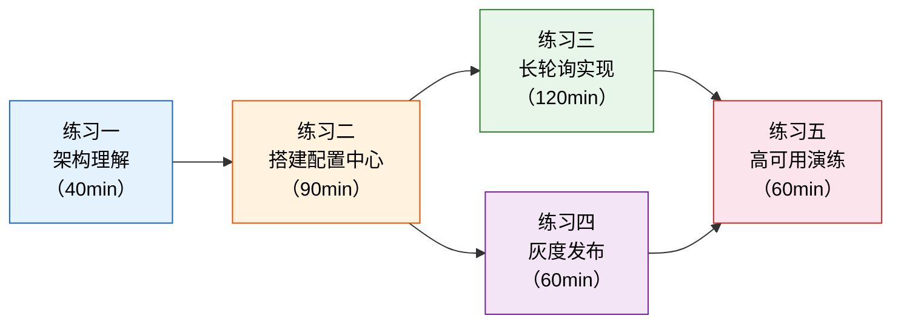

# 练习方法：从搭建到生产的配置中心实战

> 练习是将知识转化为能力的唯一途径。本节提供五组递进式练习，覆盖配置中心从入门到精通的完整能力谱系——从理解架构模型，到动手搭建配置中心、实现长轮询推送、完成灰度发布全流程，再到高可用验证和性能调优。每组练习都附带明确的目标、可执行的步骤、参考代码和自检清单。

---

## 练习设计思路

本章练习遵循"道→法→术→器"的递进逻辑：

| 练习 | 层次 | 核心目标 | 预计时间 | 前置知识 |
|------|------|---------|---------|---------|
| 练习一：架构理解 | 道 | 理解配置中心的核心架构模型和设计权衡 | 40分钟 | 本章理论基础 |
| 练习二：搭建配置中心 | 法 | 从零搭建一个可用的 Apollo 单机环境 | 90分钟 | Docker基础、MySQL基础 |
| 练习三：长轮询实现 | 术 | 手动实现一个生产级长轮询客户端 | 120分钟 | Python/Java基础、HTTP协议 |
| 练习四：灰度发布全流程 | 术 | 完成配置灰度发布→全量→回滚的完整链路 | 60分钟 | 练习二 |
| 练习五：高可用与故障演练 | 器 | 验证配置中心的降级机制和故障恢复能力 | 60分钟 | 练习二、练习三 |



---

## 练习一：架构理解与方案选型（预计40分钟）

### 目标

能够画出配置中心的完整架构图，解释各组件的职责边界，并根据业务场景做出合理的技术选型。

### 步骤

#### 1. 绘制配置中心核心架构图（15分钟）

不看书，凭记忆画出配置中心的四层架构（Portal → Admin Service → Config Service → 客户端SDK），标注以下关键信息：

- 每个组件的职责（一句话描述）
- 组件间的数据流向（用箭头标注）
- 数据库中至少包含哪几张核心表（hint：配置项表、发布记录表、变更通知表）

然后对照本章 56.1 节的架构图，找出遗漏的部分。

**自检问题**：
- Config Service 和 Admin Service 为什么要分开部署？
- 客户端SDK为什么需要本地缓存？如果去掉本地缓存会怎样？
- release_message 表在配置推送中扮演什么角色？

#### 2. 配置中心方案选型练习（15分钟）

假设你所在的团队正在做一个新项目，请根据以下场景选择最合适的配置中心方案，并说明理由：

| 场景 | 约束条件 | 你的选择 | 理由 |
|------|---------|---------|------|
| 场景A：大型电商平台，200+微服务，强灰度需求 | Java技术栈，团队熟悉Spring，需要完善的权限管理和审批流程 | | |
| 场景B：初创公司，5个微服务，已有Nacos做注册中心 | 资源有限，不想维护多套基础设施，配置量适中 | | |
| 场景C：Kubernetes原生环境，全部服务容器化 | 已有etcd集群，不想引入额外中间件，配置变更不频繁 | | |
| 场景D：金融系统，配置一致性要求极高，容不得半秒不一致 | 对一致性要求高于可用性，配置项不多但关键 | | |

**参考答案要点**：
- 场景A → Apollo（完善的灰度发布、RBAC权限、审批流程）
- 场景B → Nacos（注册中心+配置中心统一管理，降低运维成本）
- 场景C → K8s ConfigMap/Secret + etcd Watch（平台原生，无需额外组件）
- 场景D → etcd/Consul（CP模型，强一致性保证）

#### 3. 写出配置中心的核心指标（10分钟）

在不翻阅本章内容的情况下，列出你认为配置中心需要监控的核心指标（至少6个），并给出你认为合理的基线值。然后对照本章"关键指标速查"部分，检查是否有遗漏。

**预期你能列出的指标**：
- 配置读取延迟（P99 < 50ms）
- 配置推送延迟（P99 < 3s）
- 推送成功率（> 99.99%）
- Config Service 可用性（> 99.99%）
- 本地缓存命中率（正常 > 95%）
- 配置变更 QPS
- 长轮询连接数
- 内存使用量

### 检查标准

- [ ] 能独立画出配置中心四层架构图，标注各组件职责
- [ ] 能根据业务场景选择合适的配置中心方案并给出合理理由
- [ ] 能列出至少8个核心监控指标及基线值
- [ ] 理解 AP/CP 模型在配置中心场景下的选型权衡

---

## 练习二：从零搭建 Apollo 配置中心（预计90分钟）

### 目标

使用 Docker Compose 从零搭建一个完整的 Apollo 单机环境（Portal + Config Service + Admin Service + MySQL），并完成配置的创建、修改和动态推送验证。

### 步骤

#### 1. 环境准备（10分钟）

确保本机已安装 Docker 和 Docker Compose：

```bash
# 检查 Docker 版本
docker --version        # 需要 Docker 20.10+
docker compose version  # 需要 Docker Compose V2

# 确认端口未被占用（Apollo 默认使用 8070/8080/8090）
ss -tlnp | grep -E '8070|8080|8090|3306'
```

#### 2. 编写 Docker Compose 文件（15分钟）

创建项目目录和 Docker Compose 配置：

```bash
mkdir -p ~/apollo-standalone &amp;&amp; cd ~/apollo-standalone
```

```yaml
# docker-compose.yml
version: "3.8"

services:
  mysql:
    image: mysql:8.0
    container_name: apollo-mysql
    environment:
      MYSQL_ROOT_PASSWORD: root123
      MYSQL_DATABASE: ApolloConfigDB
    ports:
      - "3306:3306"
    volumes:
      - mysql-data:/var/lib/mysql
      - ./sql:/docker-entrypoint-initdb.d
    healthcheck:
      test: ["CMD", "mysqladmin", "ping", "-h", "localhost"]
      interval: 10s
      timeout: 5s
      retries: 5

  configservice:
    image: apolloconfig/apollo-configservice:2.4.0
    container_name: apollo-configservice
    environment:
      SPRING_DATASOURCE_URL: jdbc:mysql://mysql:3306/ApolloConfigDB?characterEncoding=utf8
      SPRING_DATASOURCE_USERNAME: root
      SPRING_DATASOURCE_PASSWORD: root123
      APOLLO_CONFIG_SERVICE_NAME: apollo-configservice
      EUREKA_SERVICE_URL: http://localhost:8761/eureka/
    ports:
      - "8080:8080"
    depends_on:
      mysql:
        condition: service_healthy

  adminservice:
    image: apolloconfig/apollo-adminservice:2.4.0
    container_name: apollo-adminservice
    environment:
      SPRING_DATASOURCE_URL: jdbc:mysql://mysql:3306/ApolloConfigDB?characterEncoding=utf8
      SPRING_DATASOURCE_USERNAME: root
      SPRING_DATASOURCE_PASSWORD: root123
      APOLLO_ADMIN_SERVICE_NAME: apollo-adminservice
      EUREKA_SERVICE_URL: http://localhost:8761/eureka/
    ports:
      - "8090:8090"
    depends_on:
      mysql:
        condition: service_healthy

  portal:
    image: apolloconfig/apollo-portal:2.4.0
    container_name: apollo-portal
    environment:
      SPRING_DATASOURCE_URL: jdbc:mysql://mysql:3306/ApolloPortalDB?characterEncoding=utf8
      SPRING_DATASOURCE_USERNAME: root
      SPRING_DATASOURCE_PASSWORD: root123
      APOLLO_PORTAL_NAME: apollo-portal
      APOLLO_PORTAL_ENVIRONMENTS: dev
    ports:
      - "8070:8070"
    depends_on:
      - configservice
      - adminservice

volumes:
  mysql-data:
```

> **注意**：上面的配置是一个简化版本。实际搭建时，需要先初始化 Apollo 的数据库 schema。Apollo 官方提供了建表 SQL 脚本，需下载到 `./sql/` 目录下。

#### 3. 下载 Apollo 初始化脚本并启动（20分钟）

```bash
# 下载 Apollo 源码中的 SQL 初始化脚本
curl -L https://raw.githubusercontent.com/ctripframework/apollo/master/scripts/sql/apolloconfigdb.sql \
  -o sql/apolloconfigdb.sql

curl -L https://raw.githubusercontent.com/ctripframework/apollo/master/scripts/sql/apolloportaldb.sql \
  -o sql/apolloportaldb.sql

# 启动所有服务
docker compose up -d

# 查看启动日志，等待所有服务就绪
docker compose logs -f --tail=50

# 验证服务健康（Config Service 和 Admin Service 注册到 Eureka 后才算就绪）
curl http://localhost:8080/health
curl http://localhost:8090/health
curl http://localhost:8070
```

#### 4. 在 Portal 上创建应用和配置（20分钟）

打开浏览器访问 `http://localhost:8070`，使用默认账号 `apollo / admin` 登录。

操作步骤：

1. 创建应用
   - 应用ID: demo-service
   - 应用名称: Demo Service
   
2. 创建配置项（在 demo-service 的 dev 环境下）
   - Key: greeting.message
   - Value: Hello from Apollo!
   - Comment: 测试配置
   
3. 创建更多配置项
   - Key: feature.enable-new-ui
   - Value: false
   - Comment: 新UI功能开关
   
4. 发布配置
   - 点击"发布"按钮
   - 填写发布原因: "初始化配置"
   - 确认发布

#### 5. 验证配置动态推送（25分钟）

编写一个简单的 Spring Boot 应用来验证配置的动态推送：

```java
// pom.xml 核心依赖
/*
<dependency>
    <groupId>com.ctrip.framework.apollo</groupId>
    <artifactId>apollo-client</artifactId>
    <version>2.4.0</version>
</dependency>
*/

// application.yml
/*
app:
  id: demo-service
apollo:
  bootstrap:
    enabled: true
    eagerLoad:
      enabled: true
  meta:
    http://localhost:8080
server:
  port: 8888
*/

@RestController
public class ConfigDemoController {

    @Value("${greeting.message:default}")
    private String greetingMessage;

    @GetMapping("/greeting")
    public String greeting() {
        return greetingMessage;
    }

    @GetMapping("/greeting/live")
    public String liveGreeting() {
        // 通过 Apollo 的 Config API 获取实时配置
        Config config = ApolloAppConfig.getConfig();
        return config.getProperty("greeting.message", "default");
    }
}
```

验证步骤：

```bash
# 1. 启动 Spring Boot 应用
# 2. 访问 http://localhost:8888/greeting，确认返回初始值
# 3. 在 Apollo Portal 中修改 greeting.message 的值
# 4. 点击发布，等待 1-3 秒
# 5. 再次访问 http://localhost:8888/greeting/live，确认返回新值
# 6. 对比 /greeting（@Value 注入，可能需要重启）和 /greeting/live（Config API，实时生效）的差异
```

### 关键观察点

完成搭建后，请思考并记录以下观察：

| 观察点 | 你的发现 |
|--------|---------|
| 配置修改到生效的延迟 | 通常在1-3秒内（长轮询机制） |
| Config Service 和 Admin Service 是否共享同一个数据库 | 是（ApolloConfigDB） |
| Portal 使用的数据库是否与 Service 不同 | 是（ApolloPortalDB） |
| 发布配置后 release_message 表是否新增记录 | 是（Config Service 通过扫描此表通知客户端） |
| 本地缓存文件存储在哪个目录 | ~/.apollo/config-cache/ |

### 检查标准

- [ ] Apollo 四个组件全部启动成功（Portal、Config Service、Admin Service、MySQL）
- [ ] 能在 Portal 上创建应用、添加配置项并发布
- [ ] Spring Boot 应用能通过 Config API 实时获取配置变更
- [ ] 能说出 Config Service 和 Admin Service 的职责差异
- [ ] 能说出 release_message 表在配置推送中的作用

---

## 练习三：从零实现长轮询客户端（预计120分钟）

### 目标

用 Python 从零实现一个生产级的长轮询配置客户端，包含以下核心能力：初始加载、长轮询监听、本地缓存降级、超时重连退避、配置变更回调。

### 步骤

#### 1. 基础长轮询框架（30分钟）

```python
"""
长轮询配置客户端 - 基础版
功能：连接Config Service，通过长轮询监听配置变更
"""
import asyncio
import aiohttp
import hashlib
import json
import logging
import os
import time
from pathlib import Path
from typing import Callable, Optional, Any

logging.basicConfig(level=logging.INFO, format='%(asctime)s [%(levelname)s] %(message)s')
logger = logging.getLogger(__name__)


class LongPollingClient:
    """生产级长轮询配置客户端"""
    
    def __init__(
        self,
        config_server_url: str,
        app_id: str,
        namespace: str = "application",
        cluster: str = "default",
        local_cache_dir: str = "/tmp/apollo-cache",
        poll_timeout: int = 60,
    ):
        self.server_url = config_server_url.rstrip("/")
        self.app_id = app_id
        self.namespace = namespace
        self.cluster = cluster
        self.cache_dir = Path(local_cache_dir)
        self.cache_dir.mkdir(parents=True, exist_ok=True)
        self.poll_timeout = poll_timeout
        
        # 配置缓存（key -> value）
        self._config_cache: dict[str, str] = {}
        # 配置的 MD5（namespace -> md5）
        self._config_md5: dict[str, str] = {}
        # 变更回调函数列表
        self._change_listeners: list[Callable] = []
        # 运行状态
        self._running = False
        # 重试策略参数
        self._retry_count = 0
        self._max_retry_delay = 30.0
        self._base_retry_delay = 1.0
    
    def on_change(self, listener: Callable):
        """注册配置变更监听器"""
        self._change_listeners.append(listener)
    
    async def start(self):
        """启动客户端"""
        self._running = True
        logger.info(f"Starting client for app={self.app_id}, ns={self.namespace}")
        
        # 第一步：初始加载
        await self._initial_load()
        
        # 第二步：启动长轮询主循环
        await self._poll_loop()
    
    async def stop(self):
        """停止客户端"""
        self._running = False
        logger.info("Client stopped")
    
    async def _initial_load(self):
        """启动时全量拉取配置"""
        url = f"{self.server_url}/configs/{self.app_id}/{self.cluster}/{self.namespace}"
        try:
            async with aiohttp.ClientSession() as session:
                async with session.get(url, timeout=aiohttp.ClientTimeout(total=10)) as resp:
                    if resp.status == 200:
                        text = await resp.text()
                        self._parse_and_cache(text)
                        self._save_local_cache()
                        logger.info(f"Initial load: {len(self._config_cache)} config keys")
                    else:
                        logger.warning(f"Initial load failed: HTTP {resp.status}, using local cache")
                        self._load_local_cache()
        except Exception as e:
            logger.error(f"Initial load error: {e}, falling back to local cache")
            self._load_local_cache()
    
    async def _poll_loop(self):
        """长轮询主循环"""
        while self._running:
            try:
                await self._do_long_poll()
                self._reset_retry()  # 成功后重置重试计数
            except asyncio.CancelledError:
                break
            except Exception as e:
                logger.error(f"Poll error: {e}")
                delay = self._calculate_retry_delay()
                logger.info(f"Retrying in {delay:.1f}s (attempt #{self._retry_count})")
                await asyncio.sleep(delay)
    
    async def _do_long_poll(self):
        """执行一次长轮询请求"""
        url = f"{self.server_url}/notifications"
        params = {
            "appId": self.app_id,
            "cluster": self.cluster,
            "notifications": self._build_notifications_param(),
        }
        # 客户端超时要略大于服务端的 hold 时间
        timeout = aiohttp.ClientTimeout(total=self.poll_timeout + 10)
        
        async with aiohttp.ClientSession() as session:
            async with session.get(url, params=params, timeout=timeout) as resp:
                if resp.status == 200:
                    # 有变更通知
                    body = await resp.json()
                    logger.info(f"Change notification received: {body}")
                    await self._handle_change(body)
                elif resp.status == 204:
                    # 无变更，继续下一轮
                    logger.debug("No changes (204)")
                else:
                    logger.warning(f"Unexpected status: {resp.status}")
    
    async def _handle_change(self, changes: list):
        """处理配置变更"""
        for change in changes:
            ns = change.get("namespace", self.namespace)
            new_md5 = change.get("md5", "")
            
            if self._config_md5.get(ns) == new_md5:
                logger.debug(f"MD5 match for {ns}, skipping")
                continue
            
            # 拉取最新配置
            await self._fetch_and_update(ns)
    
    async def _fetch_and_update(self, ns: str):
        """拉取最新配置并更新缓存"""
        url = f"{self.server_url}/configs/{self.app_id}/{self.cluster}/{ns}"
        async with aiohttp.ClientSession() as session:
            async with session.get(url) as resp:
                if resp.status == 200:
                    text = await resp.text()
                    old_config = dict(self._config_cache)
                    self._parse_and_cache(text)
                    self._save_local_cache()
                    
                    # 触发变更回调
                    for listener in self._change_listeners:
                        try:
                            await listener(ns, old_config, self._config_cache)
                        except Exception as e:
                            logger.error(f"Listener error: {e}")
    
    def _parse_and_cache(self, text: str):
        """解析配置响应并更新内存缓存"""
        data = json.loads(text)
        for key, value in data.get("configurations", {}).items():
            self._config_cache[key] = value
        self._config_md5[data.get("namespaceName", self.namespace)] = data.get("md5", "")
    
    def _build_notifications_param(self) -> str:
        """构建长轮询通知参数"""
        notifications = []
        for ns, md5 in self._config_md5.items():
            notifications.append({"namespaceName": ns, "notificationId": md5})
        return json.dumps(notifications)
    
    def _save_local_cache(self):
        """持久化到本地文件（L2缓存）"""
        cache_file = self.cache_dir / f"{self.app_id}_{self.namespace}.json"
        cache_file.write_text(json.dumps(self._config_cache, ensure_ascii=False, indent=2))
    
    def _load_local_cache(self):
        """从本地文件加载缓存"""
        cache_file = self.cache_dir / f"{self.app_id}_{self.namespace}.json"
        if cache_file.exists():
            self._config_cache = json.loads(cache_file.read_text())
            logger.info(f"Loaded {len(self._config_cache)} keys from local cache")
    
    def _calculate_retry_delay(self) -> float:
        """指数退避 + 随机抖动"""
        import random
        self._retry_count += 1
        delay = min(
            self._base_retry_delay * (2 ** (self._retry_count - 1)),
            self._max_retry_delay
        )
        jitter = random.uniform(0, delay * 0.3)
        return delay + jitter
    
    def _reset_retry(self):
        """成功后重置重试计数"""
        self._retry_count = 0
    
    def get(self, key: str, default: Any = None) -> Any:
        """获取配置值（优先内存 > 本地文件 > 默认值）"""
        return self._config_cache.get(key, default)


# ========== 使用示例 ==========
async def main():
    client = LongPollingClient(
        config_server_url="http://localhost:8080",
        app_id="demo-service",
        namespace="application",
    )
    
    # 注册变更监听器
    async def on_config_change(namespace, old_config, new_config):
        logger.info(f"Config changed in {namespace}!")
        for key in set(old_config.keys()) | set(new_config.keys()):
            old_val = old_config.get(key, "(new)")
            new_val = new_config.get(key, "(deleted)")
            if old_val != new_val:
                logger.info(f"  {key}: {old_val} -> {new_val}")
    
    client.on_change(on_config_change)
    
    try:
        await client.start()
    except KeyboardInterrupt:
        await client.stop()


if __name__ == "__main__":
    asyncio.run(main())
```

#### 2. 增强：添加本地缓存三级降级（20分钟）

在基础版本上，实现完整的三级缓存降级机制：

```python
class ConfigCache:
    """三级缓存降级模型"""
    
    def __init__(self, cache_dir: str, default_config: dict = None):
        self._memory: dict[str, str] = {}            # L1: 内存（最快，微秒级）
        self._file_dir = Path(cache_dir)              # L2: 本地文件（毫秒级）
        self._file_dir.mkdir(parents=True, exist_ok=True)
        self._defaults = default_config or {}          # L3: 内嵌默认值（兜底）
    
    def get(self, key: str) -> Optional[str]:
        """优先级：L1 → L2 → L3"""
        # L1: 内存缓存
        if key in self._memory:
            return self._memory[key]
        
        # L2: 本地文件
        value = self._read_file(key)
        if value is not None:
            self._memory[key] = value  # 回填L1
            return value
        
        # L3: 默认值
        return self._defaults.get(key)
    
    def put(self, key: str, value: str):
        """更新时同时写入L1和L2"""
        self._memory[key] = value
        self._write_file(key, value)
    
    def _read_file(self, key: str) -> Optional[str]:
        filepath = self._file_dir / f"{key}.cache"
        if filepath.exists():
            return filepath.read_text()
        return None
    
    def _write_file(self, key: str, value: str):
        filepath = self._file_dir / f"{key}.cache"
        filepath.write_text(value)


# 验证降级机制
def test_cache_fallback():
    """模拟降级场景"""
    cache = ConfigCache("/tmp/test-cache", {"db.host": "localhost"})
    
    # 场景1: 正常读取（三级都为空，返回默认值）
    assert cache.get("db.host") == "localhost"
    
    # 场景2: 写入后从内存读取（L1命中）
    cache.put("db.port", "3306")
    assert cache.get("db.port") == "3306"
    
    # 场景3: 模拟进程重启（清空内存，从文件恢复）
    cache._memory = {}
    assert cache.get("db.port") == "3306"  # L2命中，回填L1
    
    print("All cache fallback tests passed!")


test_cache_fallback()
```

#### 3. 增强：添加 Metrics 埋点（20分钟）

为客户端添加关键指标的采集，便于后续监控：

```python
import time
from dataclasses import dataclass, field

@dataclass
class ClientMetrics:
    """客户端运行指标"""
    poll_success_count: int = 0
    poll_error_count: int = 0
    poll_total_duration_ms: float = 0
    config_update_count: int = 0
    cache_hit_memory: int = 0
    cache_hit_file: int = 0
    cache_hit_default: int = 0
    last_success_time: float = 0
    last_error_time: float = 0
    last_error_msg: str = ""
    
    def record_poll_success(self, duration_ms: float):
        self.poll_success_count += 1
        self.poll_total_duration_ms += duration_ms
        self.last_success_time = time.time()
    
    def record_poll_error(self, error_msg: str):
        self.poll_error_count += 1
        self.last_error_time = time.time()
        self.last_error_msg = error_msg
    
    def get_avg_poll_duration_ms(self) -> float:
        if self.poll_success_count == 0:
            return 0
        return self.poll_total_duration_ms / self.poll_success_count
    
    def to_dict(self) -> dict:
        return {
            "poll_success": self.poll_success_count,
            "poll_error": self.poll_error_count,
            "avg_poll_duration_ms": round(self.get_avg_poll_duration_ms(), 2),
            "config_updates": self.config_update_count,
            "cache_hit_memory": self.cache_hit_memory,
            "cache_hit_file": self.cache_hit_file,
            "cache_hit_default": self.cache_hit_default,
            "last_success": self.last_success_time,
            "last_error": self.last_error_msg,
        }
```

#### 4. 编写测试用例（30分钟）

编写一个测试文件验证各核心功能：

```python
"""长轮询客户端测试"""
import pytest
import asyncio
import json
from unittest.mock import AsyncMock, patch, MagicMock


class TestLongPollingClient:
    
    def setup_method(self):
        """每个测试方法前初始化"""
        self.client = LongPollingClient(
            config_server_url="http://mock-server:8080",
            app_id="test-app",
            namespace="test-ns",
            local_cache_dir="/tmp/test-apollo-cache",
        )
    
    def test_config_cache_put_and_get(self):
        """测试缓存的基本读写"""
        cache = ConfigCache("/tmp/test-cache")
        cache.put("key1", "value1")
        assert cache.get("key1") == "value1"
        assert cache.get("nonexistent", "default") == "default"
    
    def test_cache_file_persistence(self):
        """测试文件持久化（模拟重启后恢复）"""
        cache = ConfigCache("/tmp/test-cache-persist")
        cache.put("persist-key", "persist-value")
        # 清空内存，模拟重启
        cache._memory = {}
        # 从文件恢复
        assert cache.get("persist-key") == "persist-value"
    
    def test_retry_delay_exponential_backoff(self):
        """测试指数退避策略"""
        import random
        random.seed(42)
        
        client = self.client
        delays = []
        for _ in range(5):
            delay = client._calculate_retry_delay()
            delays.append(round(delay, 2))
        
        # 第一次重试延迟应该最小
        assert delays[0] < delays[1]
        # 后续延迟递增
        assert delays[1] < delays[3]
    
    def test_retry_count_reset(self):
        """测试成功后重试计数重置"""
        self.client._retry_count = 5
        self.client._reset_retry()
        assert self.client._retry_count == 0
    
    def test_notifications_param_format(self):
        """测试长轮询参数格式"""
        self.client._config_md5 = {"application": "abc123"}
        param = self.client._build_notifications_param()
        parsed = json.loads(param)
        assert len(parsed) == 1
        assert parsed[0]["namespaceName"] == "application"
    
    def test_change_listener_invoked(self):
        """测试变更回调被触发"""
        callback_called = []
        
        async def callback(ns, old, new):
            callback_called.append((ns, old, new))
        
        self.client.on_change(callback)
        assert len(self.client._change_listeners) == 1


if __name__ == "__main__":
    pytest.main([__file__, "-v"])
```

### 自测验证

```bash
# 运行单元测试
pip install pytest pytest-asyncio
pytest test_long_polling.py -v

# 启动客户端（需要先完成练习二搭建的 Apollo 环境）
python long_polling_client.py

# 在 Apollo Portal 修改配置，观察客户端日志输出变更通知
```

### 检查标准

- [ ] 长轮询客户端能成功连接 Config Service 并接收配置变更
- [ ] 本地缓存三级降级（内存→文件→默认值）工作正常
- [ ] 网络断开后能按指数退避策略自动重连
- [ ] 配置变更回调函数被正确触发
- [ ] 单元测试全部通过
- [ ] 能解释通知窗口期（超时间隙）的补偿机制

---

## 练习四：灰度发布全流程演练（预计60分钟）

### 目标

在 Apollo 环境中完成灰度发布的完整链路：创建灰度配置 → 指定灰度实例 → 验证灰度效果 → 全量发布 → 紧急回滚。

### 步骤

#### 1. 准备灰度发布环境（10分钟）

在 Apollo Portal 中为 demo-service 的 production 环境创建以下配置：

```properties
# 功能开关
feature.enable-new-checkout=true
feature.checkout-timeout-ms=5000

# 性能参数  
service.connection-pool.size=100
service.request-timeout-ms=3000
```

#### 2. 灰度发布操作（20分钟）

**第一步：提交灰度配置**

1. 在 Apollo Portal 中打开 demo-service → production
2. 修改 feature.checkout-timeout-ms 从 5000 改为 8000
3. 不要直接点击"发布"，而是点击"灰度发布"
4. 选择灰度策略：按 IP 列表
5. 指定灰度实例IP（选择 1-2 个测试实例）
6. 填写灰度原因："大促前测试超时调整对延迟的影响"
7. 发布灰度配置

**第二步：验证灰度效果**

```bash
# 在灰度实例上验证配置已更新
curl http://<灰度实例IP>:8888/greeting/live
# 应返回新配置值

# 在非灰度实例上验证配置未变更
curl http://<非灰度实例IP>:8888/greeting/live
# 应返回旧配置值
```

记录验证结果：

| 实例 | IP | 是否灰度 | 配置值 | 预期 | 实际 |
|------|-----|---------|--------|------|------|
| 实例A | x.x.x.x | 是 | 8000 | 8000 | |
| 实例B | x.x.x.x | 否 | 5000 | 5000 | |

**第三步：全量发布**

1. 确认灰度实例运行正常，无异常日志
2. 在灰度发布页面点击"全量发布"
3. 填写发布原因："灰度验证通过，全量推发"
4. 确认发布

**第四步：验证全量生效**

```bash
# 所有实例应该都获取到了新配置
for ip in <实例IP列表>; do
    echo "Instance $ip: $(curl -s http://$ip:8888/greeting/live)"
done
```

#### 3. 紧急回滚演练（20分钟）

**模拟线上故障**：假设全量发布后发现新配置导致接口超时率升高，需要紧急回滚。

1. 在 Apollo Portal 打开 demo-service → production
2. 点击"版本历史"
3. 找到全量发布之前的版本（灰度发布前的版本）
4. 点击该版本右侧的"回滚"按钮
5. 填写回滚原因："新配置导致超时率升高，紧急回滚"
6. 确认回滚

```bash
# 验证回滚生效（所有实例恢复到旧配置）
curl http://<实例IP>:8888/greeting/live
# 应返回回滚前的旧值
```

#### 4. 记录与反思（10分钟）

完成演练后，回答以下问题：

| 问题 | 你的回答 |
|------|---------|
| 灰度发布和全量发布的区别是什么？ | |
| 灰度发布可以设置哪些策略？各适合什么场景？ | |
| 回滚操作的本质是什么？（提示：与发布操作的关系） | |
| 如果灰度验证发现问题，应该先回滚灰度还是直接回滚全部？ | |
| 生产环境中，谁有权限执行灰度发布和回滚操作？ | |

### 检查标准

- [ ] 成功执行灰度发布，仅指定实例收到新配置
- [ ] 成功执行全量发布，所有实例收到新配置
- [ ] 成功回滚到历史版本，配置恢复
- [ ] 能解释灰度发布的三种策略（IP/标签/百分比）
- [ ] 能描述回滚操作的底层机制（版本链表 + release_message）

---

## 练习五：高可用与故障演练（预计60分钟）

### 目标

验证配置中心在各种故障场景下的表现，包括 Config Service 宕机、数据库故障、网络分区等，并验证客户端的降级和恢复机制。

### 步骤

#### 1. 测试 Config Service 宕机降级（15分钟）

```bash
# 场景：Config Service 不可用时，客户端应使用本地缓存正常运行

# 1. 确认客户端已正常获取配置
python long_polling_client.py &amp;
# 记录当前配置值

# 2. 停止 Config Service
docker stop apollo-configservice

# 3. 验证客户端仍然能获取配置（从本地缓存）
# 客户端日志应显示 "falling back to local cache"

# 4. 重启 Config Service
docker start apollo-configservice

# 5. 验证客户端自动恢复长轮询连接
# 客户端日志应显示 "connection recovered"
```

记录观察结果：

| 故障场景 | 客户端行为 | 配置是否可用 | 恢复时间 |
|---------|-----------|------------|---------|
| Config Service 宕机 | 使用本地缓存 + 指数退避重试 | 是（缓存值） | |
| Config Service 恢复 | 自动重连 + 全量同步 | 是（最新值） | |

#### 2. 测试配置推送的完整性（15分钟）

```bash
# 场景：在长轮询断开期间发生多次配置变更，恢复后是否都能收到

# 1. 客户端正常连接中
# 2. 停止客户端的网络（模拟网络分区）
# 3. 在 Apollo Portal 连续修改配置 3 次（间隔各 5 秒）
# 4. 恢复网络
# 5. 观察客户端是否获取到最终值（注意：可能只收到最终值，而非中间值）
```

**关键观察**：长轮询通知的是"配置的 MD5 变化"，不是"逐次变更"。如果客户端断开期间配置被修改了 3 次，恢复后客户端只会收到一次通知并拉取最终配置——中间的变更版本不会被逐个通知。

#### 3. 测试本地缓存的一致性（15分钟）

```bash
# 场景：本地缓存文件的内容是否与远端一致

# 1. 正常获取配置后，检查本地缓存文件
cat /tmp/apollo-cache/demo-service_application.json

# 2. 在 Apollo 修改配置并发布

# 3. 再次检查本地缓存文件是否更新
cat /tmp/apollo-cache/demo-service_application.json

# 4. 模拟异常退出（kill -9 客户端进程），重启后检查缓存
kill -9 <client_pid>
python long_polling_client.py
# 重启后应从本地缓存加载，然后全量同步更新
```

#### 4. 撰写故障演练报告（15分钟）

将上述演练结果整理为一份简短的故障演练报告：

```markdown
# 配置中心故障演练报告

## 演练时间
202X-XX-XX

## 演练环境
- Apollo版本: 2.4.0
- 部署方式: Docker Compose 单机
- 客户端: Python 长轮询客户端

## 故障场景与结果

### 场景1: Config Service 宕机
- **预期行为**: 客户端使用本地缓存，配置可用性不中断
- **实际行为**: [填写]
- **恢复时间**: [填写]
- **结论**: [通过/未通过]

### 场景2: 网络分区（长轮询断开）
- **预期行为**: 客户端使用本地缓存，恢复后自动全量同步
- **实际行为**: [填写]
- **中间配置丢失情况**: [填写]
- **结论**: [通过/未通过]

### 场景3: 本地缓存一致性
- **预期行为**: 缓存文件与远端配置保持一致
- **实际行为**: [填写]
- **结论**: [通过/未通过]

## 改进建议
[根据演练结果提出改进点]
```

### 检查标准

- [ ] Config Service 宕机时客户端能通过本地缓存正常运行
- [ ] Config Service 恢复后客户端能自动重连并同步最新配置
- [ ] 能解释"通知窗口期"中配置变更可能丢失的风险及补偿方式
- [ ] 能说出本地缓存的一致性保障机制（定期全量同步 + 启动时加载）
- [ ] 完成故障演练报告的撰写

---

## 进阶挑战

完成以上五组练习后，如果你希望进一步深入，可以尝试以下进阶挑战：

### 挑战一：实现配置加密与解密（60分钟）

```python
"""
挑战：实现配置值的 AES 加密存储
要求：
1. 配置在 Apollo 中以密文存储
2. 客户端 SDK 自动解密后提供给应用
3. 密钥不存储在配置中心，而是通过环境变量注入
"""
from cryptography.fernet import Fernet

class EncryptedConfigClient:
    def __init__(self, encryption_key: bytes):
        self.cipher = Fernet(encryption_key)
    
    def decrypt_config(self, encrypted_value: str) -> str:
        """解密配置值"""
        return self.cipher.decrypt(encrypted_value.encode()).decode()
    
    def get_decrypted(self, client, key: str) -> str:
        """获取并解密配置"""
        raw = client.get(key)
        if raw and raw.startswith("ENC(") and raw.endswith(")"):
            return self.decrypt_config(raw[4:-1])
        return raw

# 使用示例
key = Fernet.generate_key()
# 或从环境变量获取: key = os.environ['CONFIG_ENCRYPTION_KEY'].encode()
encryptor = EncryptedConfigClient(key)
# encrypted = encryptor.cipher.encrypt(b"my-secret-password").decode()
# 在 Apollo 中存储: db.password=ENC(encrypted)
```

### 挑战二：实现配置变更的审计日志（30分钟）

在长轮询客户端中添加审计日志功能，记录每次配置变更的时间、key、旧值、新值、变更来源（远程推送/本地回滚/初始化加载）。

### 挑战三：多环境配置自动同步工具（90分钟）

编写一个工具，读取 Git 仓库中的配置文件，自动同步到 Apollo 的多个环境中。要求：

1. 从 Git 仓库读取配置（每个环境一个文件夹）
2. 格式化为 Apollo 的配置格式
3. 通过 Apollo Admin Service API 批量创建配置项
4. 支持 dry-run 模式（只检查差异不实际推送）
5. 配置推送前自动创建备份

```bash
# 工具使用示例
python config_sync.py \
  --git-repo ./config-repo \
  --apollo-admin-url http://localhost:8090 \
  --app-id demo-service \
  --envs dev,sit,prod \
  --dry-run

# 输出示例
# [DRY RUN] Environment: dev
#   + 3 new keys (feature.xxx, feature.yyy, feature.zzz)
#   ~ 2 changed keys (db.pool.size: 50 -> 100, log.level: DEBUG -> INFO)
#   - 1 deleted keys (legacy.flag)
# [DRY RUN] Environment: sit
#   No changes detected
```

---

## 练习总结

完成全部练习后，你应该具备以下能力：

| 能力维度 | 掌握程度检查 |
|---------|-------------|
| **架构理解** | 能画出配置中心四层架构图，解释各组件职责和数据流 |
| **方案选型** | 能根据业务场景（规模、一致性要求、技术栈）选择合适的配置中心方案 |
| **环境搭建** | 能从零搭建 Apollo/Nacos 单机和集群环境 |
| **长轮询实现** | 能实现包含本地缓存、重连退避、变更回调的生产级客户端 |
| **灰度发布** | 能执行灰度→全量→回滚的完整链路，理解各步骤的底层机制 |
| **高可用验证** | 能设计并执行故障演练，验证降级机制的有效性 |
| **安全实践** | 能实现配置加密存储和访问控制 |

> **下一步学习建议**：将练习中实现的代码部署到真实的多节点环境中，模拟生产级别的配置管理场景。重点关注配置推送的延迟、本地缓存的一致性、以及配置中心本身的高可用保障。
