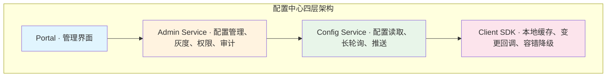
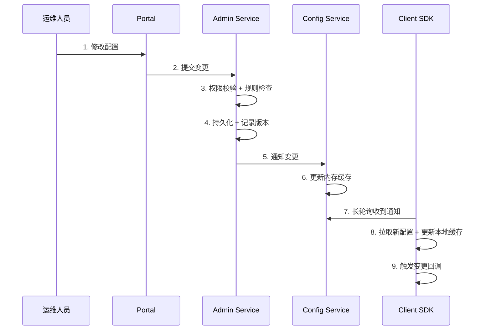
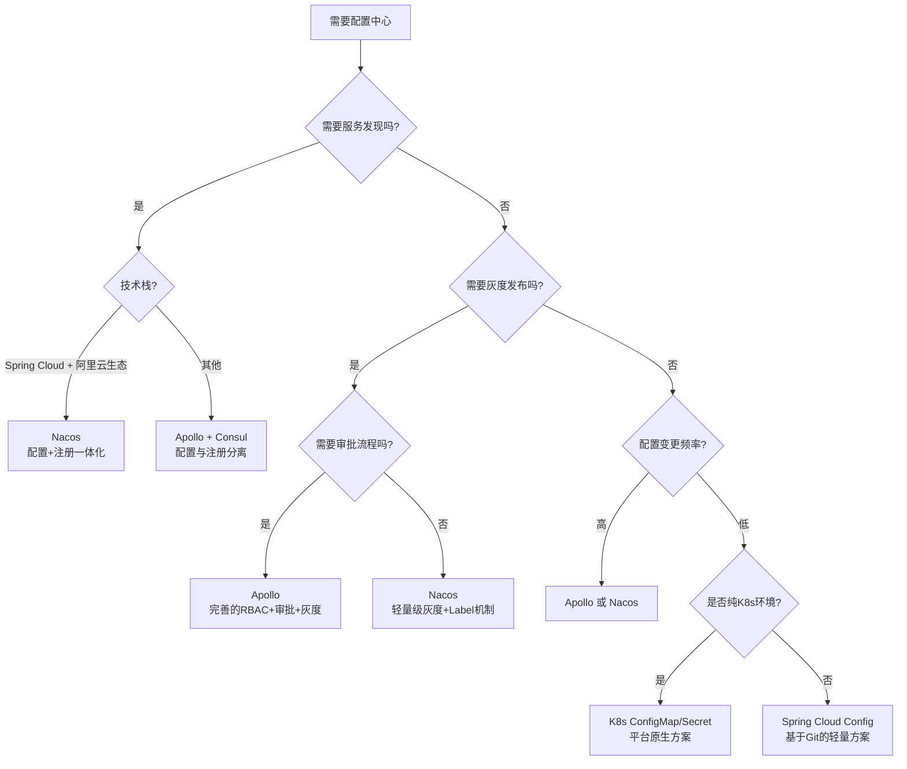
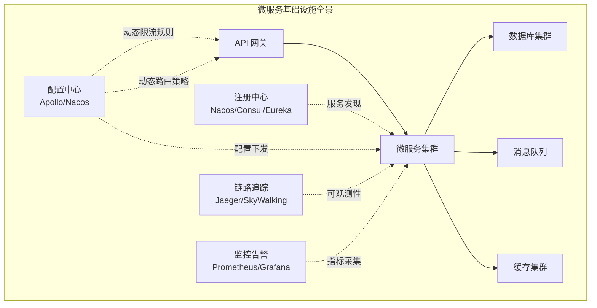

## 本章小结

本章从理论到实战，系统性地覆盖了配置中心的完整知识体系。本节将所有内容收束为一张清晰的知识图谱，帮助读者建立全局视角，形成可复用的认知框架。

---

## 一、核心知识点全景回顾

### 1.1 架构层：理解配置中心的"骨架"

配置中心由四个核心组件构成——Portal（管理界面）、Admin Service（业务逻辑层）、Config Service（数据分发层）、Client SDK（客户端组件）。理解这四个组件的职责边界和协作关系，是掌握配置中心的第一步。

**关键设计决策回顾：**

| 决策 | 原因 | 收益 |
|------|------|------|
| Config Service 与 Admin Service 分离 | 读流量远大于写流量 | 读写独立扩展，故障隔离 |
| Client SDK 嵌入应用进程 | 启动时需要本地缓存兜底 | 零外部依赖启动，微秒级读取 |
| 基于数据库的变更通知（Apollo） | 降低运维成本，不依赖 MQ | 只需 MySQL 即可运行 |
| 三级本地缓存（L1内存→L2文件→L3远程） | 配置中心不应成为启动瓶颈 | 配置中心宕机，应用仍可运行 |

### 1.2 机制层：理解配置变更如何"流动"

配置从修改到生效，经历一条完整的数据流。理解这条链路上的每个环节，是排查配置问题的基础。

**三种推送机制对比：**

| 机制 | 实时性 | 实现复杂度 | 兼容性 | 代表方案 |
|------|--------|-----------|--------|---------|
| 短轮询 | 取决于轮询间隔（秒~分） | 极低 | 任何 HTTP 客户端 | 早期方案 |
| 长轮询 | 秒级（变更即返回） | 中等 | 基于 HTTP，兼容性好 | Apollo、Nacos 1.x |
| 推模式（WebSocket/gRPC） | 毫秒级 | 中高 | 需要长连接支持 | Nacos 2.x（gRPC） |

**配置热更新的三种刷新模型：**

- **同步生效**：配置变更后立即影响下一次业务调用（如限流阈值、开关标志）
- **异步生效**：配置变更后需要过渡期才能完全生效（如线程池参数、连接池大小）
- **延迟生效**：配置变更需等待特定条件才生效（如日志级别切换、灰度规则生效）

### 1.3 实践层：掌握核心工程技巧

本章介绍的三大核心技巧，覆盖了配置中心工程落地的关键环节：

**技巧一：长轮询的完整实现**

长轮询不是简单的 HTTP 请求循环。一个生产级的长轮询客户端需要处理：

- 心跳检测：连接建立后定期发送心跳，检测服务端存活
- 超时重连：服务端 hold 超时（默认 60 秒）后自动发起下一次轮询
- 异常降级：网络断开时自动切换到本地缓存，不影响应用运行
- MD5 比对：拉取配置时携带本地 MD5，服务端未变化则返回 304，减少传输

**技巧二：推送机制的演进**

从长轮询到 WebSocket/gRPC 推送，核心变化是"拉"到"推"的转变：

- 长轮询的瓶颈在于：客户端需要在超时后重新建立连接，存在短暂的"不感知窗口"
- WebSocket/gRPC 推送消除了这个窗口，实现了真正的实时推送
- 推拉结合（长轮询作为兜底 + WebSocket/gRPC 作为主通道）是最佳实践

**技巧三：Namespace 隔离策略**

Namespace 是多环境多租户配置管理的核心抽象：

Namespace（环境维度）
  └── Group（业务维度，Nacos）/ Cluster（集群维度，Apollo）
        └── DataId / Key（具体配置）

隔离策略的设计要点：
- 环境隔离：DEV/SIT/UAT/PRE/PROD 各有独立 Namespace，配置互不干扰
- 跨环境继承：子环境可以继承父环境的配置，只覆盖差异项
- 权限隔离：不同 Namespace 配置独立的 RBAC 权限，开发人员只看到开发环境

### 1.4 实战层：Apollo 与 Nacos 的完整落地

| 维度 | Apollo | Nacos |
|------|--------|-------|
| **定位** | 专业配置中心（携程开源） | 注册中心 + 配置中心一体化（阿里开源） |
| **配置模型** | App → Cluster → Namespace | Namespace → Group → DataId |
| **推送机制** | 长轮询（HTTP） | 长轮询（1.x）/ gRPC 长连接（2.x） |
| **灰度发布** | 原生支持（IP/标签/百分比三种策略） | 支持（IP/Label） |
| **版本管理** | 完善（历史/对比/回滚） | 支持版本对比和回滚 |
| **权限控制** | 完善（RBAC + 审批流程） | 基础（Namespace 级别） |
| **高可用** | 客户端三级缓存 + 服务端集群 | 客户端缓存 + 服务端集群 |
| **适用场景** | 大型企业，配置变更频繁，需要灰度和审批 | 中小型项目，需要注册+配置统一管理 |

**Apollo 实战要点：**
- 搭建顺序：Portal → Admin Service → Config Service → Client SDK
- 灰度发布三步走：指定灰度规则 → 推送灰度实例 → 观察验证后全量发布
- 回滚操作：版本历史页 → 选择目标版本 → 一键回滚

**Nacos 实战要点：**
- 部署模式：单机（开发）→ 集群（生产，3 节点起）
- 多环境管理：通过 Namespace 实现 DEV/SIT/UAT/PROD 隔离
- 动态刷新：`@RefreshScope` + `@Value` 或 `configService.addListener()`

### 1.5 安全层：配置中心的安全保障

配置中心存储了大量敏感信息（数据库密码、API 密钥、证书私钥），安全管控是生产环境的底线要求。

| 安全维度 | 措施 | 说明 |
|---------|------|------|
| 存储安全 | AES-256 加密存储 | 敏感配置在数据库中以密文存储，密钥由独立 KMS 托管 |
| 传输安全 | mTLS 双向认证 | 客户端与服务端之间加密通信，防止中间人攻击 |
| 访问控制 | RBAC 角色权限 | 开发/运维/管理员对不同 Namespace 有不同操作权限 |
| 变更管控 | 审批流程 + 灰度发布 | 敏感配置变更需审批通过，先灰度验证再全量发布 |
| 审计追溯 | 全量操作日志 | 谁在什么时间修改了什么配置，所有操作可追溯 |

---

## 二、关键公式与决策模型

### 2.1 性能指标公式

| 概念 | 公式 | 应用场景 |
|------|------|---------|
| 吞吐量 | QPS = 并发数 / 平均响应时间（Little 定律） | 估算 Config Service 需要承载的 QPS |
| 可用性 | SLA = 正常运行时间 / 总时间 × 100% | 99.9% = 年停机 8.76 小时；99.99% = 年停机 52.6 分钟 |
| 尾延迟 | P99 = 排序后第 99 百分位值 | 衡量配置读取的最差体验 |
| 收敛时间 | T_converge = 最慢客户端的重连间隔 + 网络延迟 | 评估配置变更在所有实例生效的时间 |
| 容量规划 | 总资源 = QPS × 单次请求资源开销 | 估算 MySQL 连接数、内存占用 |

### 2.2 配置中心选型决策树

### 2.3 降级策略模型

配置中心的高可用依赖多级降级策略。在设计降级方案时，需要回答三个问题：

| 降级层级 | 数据源 | 失效条件 | 恢复方式 |
|---------|--------|---------|---------|
| L1 内存缓存 | 进程内 ConcurrentHashMap | 进程重启 | 启动时从 L2/L3 加载 |
| L2 本地文件缓存 | 磁盘 JSON 文件 | 文件损坏或被删除 | 从 L3 重新拉取并持久化 |
| L3 远程 Config Service | 服务端集群 | 网络断开或服务端宕机 | 网络恢复后自动重连 |
| L4 MySQL 直连 | 数据库 | 数据库宕机 | 数据库恢复后通过 Config Service 提供服务 |

**核心原则：应用永远不应该因为配置中心宕机而无法启动。**

---

## 三、最佳实践清单

### 3.1 设计阶段

- [ ] **明确配置分类**：区分静态配置（数据库地址等，不需要动态变更）和动态配置（超时时间、限流阈值等，需要热更新）
- [ ] **设计 Namespace 层级**：按环境（DEV/SIT/UAT/PRE/PROD）划分 Namespace，规划好层级继承关系
- [ ] **制定灰度发布策略**：确定灰度范围（IP/标签/百分比）、观察时间窗口、回滚触发条件
- [ ] **设计容错降级方案**：配置中心不可用时的降级路径，本地缓存的过期和更新策略
- [ ] **规划安全管控体系**：敏感配置加密存储、RBAC 权限模型、审批流程设计

### 3.2 实现阶段

- [ ] **配置项命名规范**：采用统一的命名规则（如 `{服务}.{模块}.{参数}`），避免配置项混乱
- [ ] **配置值类型校验**：在 Admin Service 侧校验配置值的格式和范围，防止非法值发布
- [ ] **变更回调的线程安全**：使用 volatile 引用或 AtomicReference 替换配置对象，避免并发读写问题
- [ ] **本地缓存的兜底逻辑**：Client SDK 启动时必须先读本地缓存再连远程，保证离线启动能力
- [ ] **配置变更的可观测性**：每次配置变更都记录日志和审计信息，支持事后追溯

### 3.3 部署阶段

- [ ] **Config Service 至少部署 3 个节点**：无状态设计，前端通过 Nginx 或 SLB 负载均衡
- [ ] **MySQL 主从复制**：配置存储使用主从架构，读写分离提升性能
- [ ] **网络隔离**：Config Service 只暴露读取端口，Admin Service 的写入端口仅内网可达
- [ ] **监控告警配置**：配置读取延迟、推送成功率、本地缓存命中率等核心指标接入监控
- [ ] **压测验证**：上线前进行压力测试，验证配置中心在峰值流量下的稳定性

### 3.4 运维阶段

- [ ] **配置变更走审批**：所有生产环境的配置变更必须经过审批流程
- [ ] **灰度发布常态化**：任何配置变更都先灰度 10% 实例，观察 10-15 分钟后再全量
- [ ] **定期检查缓存一致性**：监控各实例的本地缓存版本号，确认配置收敛
- [ ] **版本回滚演练**：定期演练版本回滚操作，确保回滚流程可靠
- [ ] **容量规划**：随着服务规模增长，及时扩容 Config Service 节点和 MySQL 实例

---

## 四、常见误区速查

| 误区 | 后果 | 正确做法 |
|------|------|---------|
| 配置变更不灰度，全量"一把梭" | 一次错误配置影响全部实例，故障爆炸半径大 | 先灰度 10%→观察→逐步全量 |
| 过度动态化，静态配置也走配置中心 | 增加不必要的复杂度和网络依赖 | 数据库地址等不变的配置留在本地文件 |
| 高频变更配置（"配置风暴"） | 客户端和服务端压力骤增，推送延迟上升 | 合并批量变更，设置变更频率上限 |
| 忽视本地缓存，完全依赖远程 | 配置中心宕机时应用无法启动 | 三级缓存兜底，L2 文件缓存必须持久化 |
| 敏感配置明文存储 | 数据库密码、API Key 泄露导致安全事故 | AES 加密存储，密钥托管在 KMS |
| 不做版本管理，改坏了无法回滚 | 故障恢复时间从分钟级上升到小时级 | 每次变更记录版本，支持一键回滚 |
| 配置变更后不监控业务指标 | 配置错误未被及时发现，影响持续扩大 | 灰度后观察错误率、延迟、资源使用率 |
| 忽视多环境配置差异 | 测试环境的配置误用到生产环境 | 严格 Namespace 隔离，环境间配置不共享 |

---

## 五、配置中心在架构体系中的位置

配置中心不是孤立存在的，它与微服务架构中的其他基础设施组件紧密协作：

**与其他组件的协作要点：**

| 组件 | 协作方式 | 实际场景 |
|------|---------|---------|
| 注册中心 | Nacos 同时提供注册+配置，减少运维复杂度 | 服务注册后自动获取配置 |
| API 网关 | 限流规则、路由策略通过配置中心动态下发 | 大促前动态调整限流阈值 |
| 链路追踪 | 配置变更事件被采集，与链路数据关联 | 定位"修改配置后延迟升高"的根因 |
| 监控告警 | 配置变更与业务指标关联分析 | 配置发布后自动触发告警规则 |
| CI/CD | 配置变更纳入流水线，自动化审批和灰度 | 代码发布时自动同步配置变更 |

---

## 六、关键监控指标速查

配置中心自身的健康状态需要持续关注以下核心指标：

| 指标 | 含义 | 目标值 | 监控方法 |
|------|------|--------|---------|
| 配置读取延迟 | 客户端获取配置的端到端延迟 | P99 < 50ms | 客户端埋点 + APM |
| 配置推送延迟 | 配置变更后客户端感知的延迟 | P99 < 3s | 变更时间戳对比 |
| 推送成功率 | 配置变更成功推送到目标实例的比例 | > 99.99% | 服务端推送日志 |
| Config Service 可用性 | 配置读取服务的在线率 | > 99.99% | 健康检查 + 告警 |
| 本地缓存命中率 | 客户端从本地缓存读取配置的比例 | 正常 > 95% | 客户端指标上报 |
| 配置变更 QPS | 单位时间内配置变更的次数 | 依业务而定 | Admin Service 日志 |
| 长轮询连接数 | 当前活跃的长轮询连接数量 | 远低于上限 | Config Service 指标 |
| MySQL 慢查询数 | 配置读写涉及的慢查询 | 0 | 数据库慢查询日志 |

---

## 七、延伸学习路径

### 7.1 按角色的学习建议

| 角色 | 学习路径 | 重点章节 | 预计时间 |
|------|---------|---------|---------|
| **架构师** | 架构模型 → 选型对比 → 一致性模型 → 常见误区 | 架构设计、CAP 权衡、高可用设计 | 4-6 小时 |
| **后端开发** | 长轮询实现 → 推送机制 → 热更新刷新 → Apollo/Nacos 集成 | 代码实现、并发安全、SDK 集成 | 6-8 小时 |
| **运维工程师** | 部署实战 → 监控告警 → 高可用 → 版本回滚 | 部署运维、故障处理、容量规划 | 4-6 小时 |
| **技术负责人** | 章节概览 → 方案选型 → 安全管控 → 常见误区 | 选型决策、安全合规、成本评估 | 2-3 小时 |

### 7.2 深入方向

**源码阅读（推荐优先级）：**
1. **Apollo Client SDK**：理解三级缓存、长轮询、变更回调的完整实现
2. **Nacos Config Module**：对比 Apollo，理解 gRPC 推送和 AP/CP 双模式
3. **etcd Watch 机制**：理解基于 Raft 的 Watch 实现，与长轮询方案对比

**论文与设计文档：**
- 《Apollo 配置中心设计文档》（携程技术团队公开分享）
- 《Nacos 架构设计与原理》（阿里巴巴开源文档）
- 论文：*"Design and Implementation of a Configuration Service for Distributed Systems"*

**推荐开源项目：**

| 项目 | 定位 | 适合学习的点 |
|------|------|-------------|
| Apollo（ctripcorp/apollo） | 企业级配置中心 | 灰度发布、RBAC、版本管理的完整实现 |
| Nacos（alibaba/nacos） | 注册+配置一体化 | gRPC 长连接、AP/CP 双模式、Namespace 管理 |
| Spring Cloud Config（spring-cloud/spring-cloud-config） | Spring 生态配置 | Git 集成、Webhook 触发、Bus 通知机制 |
| etcd（etcd-io/etcd） | 通用分布式 KV | Watch 机制、Raft 共识、Lease 租约 |
| K8s ConfigMap | 平台级配置 | 声明式配置、与 Pod 生命周期的绑定方式 |

### 7.3 生产环境常见问题排查清单

| 问题现象 | 可能原因 | 排查步骤 |
|---------|---------|---------|
| 配置修改后不生效 | 客户端未订阅该 Namespace / 长轮询断开 | ① 检查客户端订阅的 Namespace 是否正确 ② 检查长轮询连接状态 ③ 检查 Config Service 是否推送成功 |
| 部分实例生效，部分未生效 | 网络分区 / 部分实例本地缓存损坏 | ① 对比各实例的本地缓存版本号 ② 检查未生效实例的网络连通性 ③ 清除本地缓存重启 |
| 应用启动失败，报配置读取异常 | Config Service 不可用 + 本地缓存损坏 | ① 检查 Config Service 可用性 ② 检查本地缓存文件是否存在 ③ 手动拷贝一份正常的缓存文件 |
| 配置推送延迟超过 10 秒 | Config Service 负载过高 / 数据库慢查询 | ① 检查 Config Service 的 CPU 和内存 ② 检查 MySQL 慢查询日志 ③ 检查长轮询连接数是否接近上限 |
| 灰度发布后指标异常 | 配置值本身有问题 | ① 立即回滚灰度配置 ② 在测试环境复现 ③ 检查配置值的格式和范围 |

---

## 八、思考题

1. **架构设计**：为什么 Apollo 选择将 Config Service 和 Admin Service 部署在同一个 JVM 进程中，而不是完全独立部署？这种设计的权衡是什么？
2. **一致性权衡**：在什么业务场景下，配置中心需要考虑强一致性？如果需要，你会如何在 Apollo 的架构上实现？
3. **性能优化**：当系统有 5000 个服务实例，每个实例都对同一个 Namespace 发起长轮询时，Config Service 如何高效管理这些连接？有哪些优化手段？
4. **故障处理**：假设凌晨 3 点配置中心数据库主库宕机，从库尚未同步完成。此时有新服务实例需要启动。请设计一套完整的应急处理方案。
5. **安全实践**：数据库密码存在配置中心的加密配置中，应用启动时需要解密。请设计一个安全的密钥管理方案，确保密钥不在配置中心和应用之间明文传输。
6. **架构演进**：如果你的团队从单体应用迁移到微服务架构，你会如何分阶段引入配置中心？请给出一个可执行的迁移路线图。

---

> 本章从"为什么需要配置中心"出发，经过架构模型、热更新机制、推送策略、灰度发布、安全管控的理论学习，到 Apollo 和 Nacos 的完整实战，再到常见误区的避坑指南，构建了配置中心从认知到落地的完整知识链路。配置中心作为微服务架构的基础设施，其核心价值在于**将配置从代码中解耦，让配置变更从"小时级部署"缩短到"秒级生效"**。掌握本章内容后，你已经具备了在生产环境中设计、部署和运维配置中心的完整能力。
