# 第56章 配置中心：分布式配置管理的工程实践

---

## 章节定位

配置中心是微服务架构中的基础设施组件，负责集中管理所有服务的配置信息。在单体应用时代，配置文件通常与应用代码打包在一起，修改配置需要重新部署。而在微服务架构中，服务数量可能达到数百甚至数千个，配置项成千上万，传统的配置文件方式已经无法满足需求。

配置中心通过提供统一的配置管理、动态配置推送、配置版本管理和灰度发布等能力，成为微服务架构不可或缺的基础设施。本章从架构设计到工程实践，系统性地探讨配置中心的方方面面——从底层的一致性模型和推送机制，到上层的灰度发布和安全管控；从传统的Apollo、Nacos方案，到现代的Kubernetes ConfigMap、GitOps和Service Mesh配置管理。

---

## 核心内容概览

**Apollo配置中心** 是携程开源的分布式配置管理中心，由Config Service、Admin Service、Portal和客户端SDK四部分组成。Apollo支持配置的实时推送、灰度发布、版本管理和回滚，是国内使用最广泛的配置中心之一。

**Nacos配置中心** 是阿里巴巴开源的注册中心和配置中心一体化解决方案。Nacos的配置管理支持Namespace和Group的多级隔离，通过长轮询机制实现配置的近实时推送。Nacos 2.0引入gRPC协议，进一步提升了推送效率。

**配置热更新机制** 是配置中心的核心能力。长轮询（Long Polling）是目前最主流的实现方式——客户端定期向服务端发送请求，服务端hold住请求直到配置变更或超时。推送机制通过WebSocket或gRPC实现更实时的配置更新，但实现复杂度更高。

**灰度发布与配置版本管理** 是配置中心的高级能力。灰度发布允许将新配置先推送给部分实例进行验证，确认无误后再全量发布。配置版本管理记录每次配置变更的历史，支持快速回滚到任意历史版本。

**配置加密与安全** 是生产环境的必备能力。数据库密码、API密钥等敏感配置需要加密存储，在传输和使用过程中需要解密。配置中心需要提供加密存储、安全传输和访问控制等安全机制。

**Kubernetes ConfigMap/Secrets** 是云原生环境中的配置管理原语。ConfigMap和Secrets将配置数据与容器镜像解耦，支持运行时更新。但与专业配置中心相比，K8s原生配置缺乏灰度发布、版本管理和实时推送等高级能力。

**GitOps配置管理** 以Git仓库作为配置的唯一真实来源（Single Source of Truth），通过声明式方式管理配置变更。ArgoCD和Flux等GitOps工具实现了配置的自动化同步和配置漂移检测。

**Service Mesh配置管理** 在Istio等Service Mesh中，流量管理、负载均衡、熔断降级等策略以配置的形式下发到Sidecar代理。VirtualService、DestinationRule和EnvoyFilter等资源构成了Service Mesh的配置体系。

**Namespace与隔离** 是多环境、多租户配置管理的基础。通过Namespace实现开发、测试、预发布和生产环境的配置隔离，通过Group实现同一环境下不同业务线的配置隔离。

**配置中心监控与可观测性** 是保障配置中心稳定运行的关键。通过Metrics、日志和分布式追踪三大支柱，实现配置中心的全链路可观测。

---

## 学习目标

完成本章学习后，读者应能：
1. 理解配置中心的核心架构模型和一致性保证机制
2. 掌握长轮询和推送机制的完整实现
3. 运用灰度发布和版本管理进行安全的配置变更
4. 在Spring Boot等应用框架中集成配置热更新
5. 使用Apollo、Nacos、Spring Cloud Config、etcd、Consul等配置中心方案
6. 在Kubernetes环境中使用ConfigMap/Secrets管理配置
7. 利用GitOps和Service Mesh实现现代配置管理
8. 设计合理的配置监控、告警和安全体系
9. 识别和规避配置中心使用中的常见陷阱

---

## 本章结构

| 小节 | 主题 | 核心内容 |
|------|------|----------|
| 56.1-56.8 | 理论基础 | 配置中心架构模型、一致性保证、推送机制、Apollo/Nacos架构、灰度发布、加密安全、配置隔离 |
| 56.9-56.15 | 核心技巧 | 长轮询完整实现、Spring Boot集成、灰度发布工程、事件驱动、HA设计、监控可观测性、性能调优 |
| 56.16-56.23 | 实战案例 | Apollo集成、Nacos管理、Spring Cloud Config、etcd配置、Consul KV、K8s ConfigMap、Istio、GitOps |
| 56.24-56.30 | 常见误区 | 配置风暴、缓存一致性、安全泄露、过度动态化、并发安全、HA依赖、配置漂移、生产事故 |
| 56.31-56.35 | 练习方法 | 搭建配置中心、长轮询实现、灰度发布实验、配置加密实践、高可用验证 |
| 56.36 | 本章小结 | 核心概念回顾、方案选型框架、延伸阅读 |

---

---

# 第56章 配置中心 理论基础

---

从理论到实践，我们首先需要理解配置中心的核心架构和设计原理。只有掌握了底层的一致性模型、推送机制和安全模型，才能在后续的实践中做出正确的技术选择和架构决策。

---

## 56.1 配置中心的核心架构模型

配置中心的本质是一个分布式键值存储系统，但与通用KV存储不同，它需要额外支持配置的变更通知、版本管理、灰度发布和安全管控等能力。一个完整的配置中心通常包含以下核心组件。

**配置管理服务（Config Service）** 是配置中心的核心，负责配置的存储、读取和变更通知。Config Service需要保证高可用和高性能——配置读取是高频操作，每个服务启动时都需要拉取配置，运行过程中也可能频繁读取配置。通常Config Service采用无状态设计，可以水平扩展，配置数据存储在数据库中并缓存在内存中。

**配置管理后台（Admin Service）** 负责配置的变更操作，包括创建、修改、删除和发布。Admin Service通常需要更严格的操作审计和权限控制。配置变更通过Admin Service写入数据库后，需要通知Config Service更新缓存并推送给客户端。

**配置门户（Portal）** 是面向用户的Web管理界面，提供配置的可视化管理、版本对比、灰度发布和审批流程等功能。

**客户端SDK** 嵌入到业务应用中，负责从Config Service拉取配置、监听配置变更并更新本地缓存。客户端SDK需要处理网络异常、服务端故障等场景，确保在任何情况下都能提供可用的配置值（即使是过期的缓存值）。

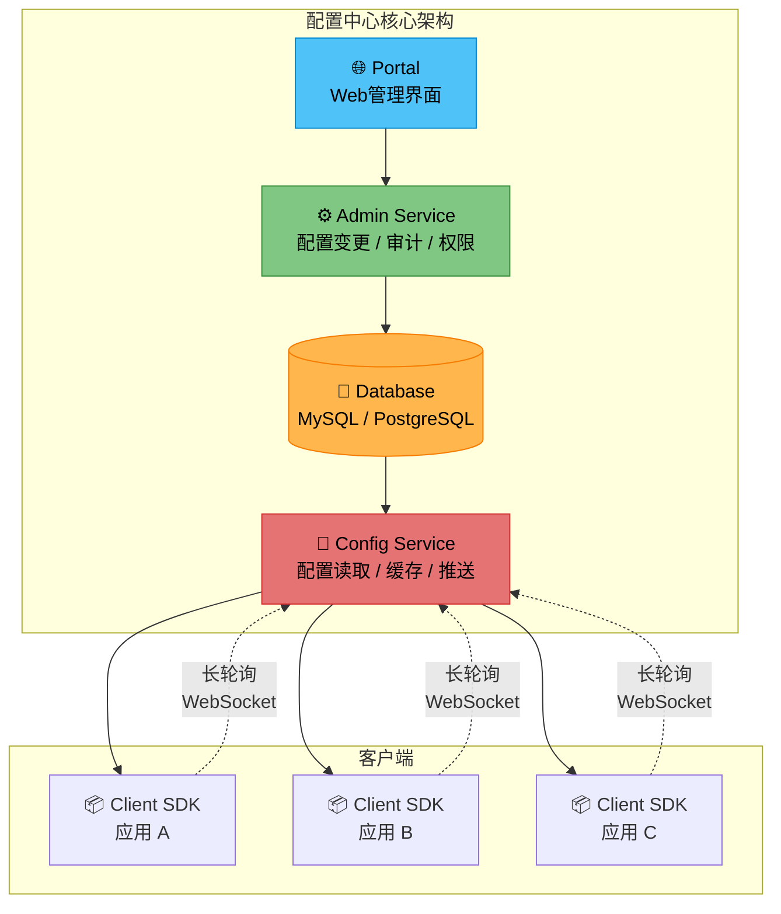

配置中心需要解决的核心技术问题包括：

| 技术问题 | 描述 | 解决方案 |
|----------|------|----------|
| **一致性** | 多个客户端在短时间内看到的配置应该是一致的 | 最终一致性或强一致性模型 |
| **可用性** | 即使配置中心服务端不可用，客户端也能继续运行 | 本地缓存降级、默认值兜底 |
| **实时性** | 配置变更后，客户端应尽快感知到变更 | 长轮询、WebSocket推送、gRPC流 |
| **安全性** | 敏感配置需要加密存储和传输 | AES加密、HTTPS、RBAC、审计日志 |

---

## 56.2 配置存储的一致性模型

配置中心的数据一致性模型需要在强一致性和可用性之间做出权衡。根据CAP理论，在分布式系统中一致性（Consistency）、可用性（Availability）和分区容忍性（Partition tolerance）三者不可兼得。配置中心通常选择AP（可用性+分区容忍性）或CP（一致性+分区容忍性）模型。不同的配置中心采用了不同的策略。

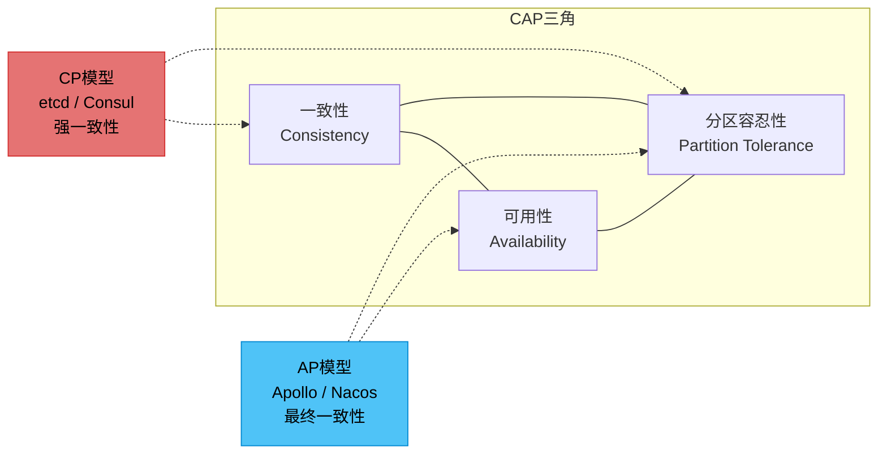

**最终一致性模型** 是大多数配置中心的选择。配置变更先写入主数据库，然后异步同步到其他节点和缓存。在同步完成之前，不同的客户端可能看到不同版本的配置。这种模型的优势是高性能和高可用，劣势是短暂的不一致窗口（通常在毫秒到秒级）。Apollo和Nacos都采用这种模型。

**强一致性模型** 少数配置中心（如基于etcd的配置中心）采用。配置变更通过Raft协议复制到多数节点后才返回成功，保证所有客户端看到的配置是一致的。这种模型的代价是更高的写入延迟（需要等待多数节点确认）和在节点故障时的可用性下降（需要多数节点存活才能写入）。

**读己之写一致性模型** 是一种折中策略，保证写入者能立即读到自己的写入结果，但其他客户端可能还有短暂的延迟。这种模型适合配置管理后台——管理员修改配置后应该立即看到最新值。

**Apollo的一致性策略** 是一种务实的折中。配置变更写入MySQL数据库后，通过消息机制通知所有Config Service实例更新内存缓存。客户端通过长轮询感知配置变更，长轮询的超时时间通常是60秒。这意味着在最坏情况下，配置变更的传播延迟是一个长轮询周期（约60秒）。但Apollo提供了"强制拉取"机制——客户端在收到变更通知后立即拉取最新配置。

| 一致性模型 | 写入延迟 | 传播延迟 | 可用性 | 适用场景 | 代表方案 |
|------------|----------|----------|--------|----------|----------|
| 最终一致性 | 低（单次写入） | 秒级到分钟级 | 高 | 大多数应用配置 | Apollo、Nacos |
| 强一致性 | 高（需要多数确认） | 毫秒级 | 中等 | 关键配置（如限流阈值） | etcd、Consul |
| 读己之写 | 中等 | 对写入者无延迟 | 高 | 配置管理后台 | 自定义实现 |

```python
"""配置中心一致性模型的实现"""
import asyncio
from abc import ABC, abstractmethod
from dataclasses import dataclass, field
from typing import Optional
from enum import Enum


class ConsistencyLevel(Enum):
    EVENTUAL = "eventual"
    STRONG = "strong"
    READ_YOUR_WRITES = "read_your_writes"


@dataclass
class ConfigVersion:
    """配置版本信息"""
    key: str
    value: str
    version: int
    md5: str
    modified_at: float


class ConfigConsistencyModel(ABC):
    """配置中心一致性保证的抽象基类"""

    @abstractmethod
    async def write(self, key: str, value: str) -> bool:
        """写入配置"""
        pass

    @abstractmethod
    async def read(self, key: str) -> Optional[str]:
        """读取配置"""
        pass


class EventualConsistencyModel(ConfigConsistencyModel):
    """
    最终一致性：配置变更异步传播

    写入延迟：低（单次写入即返回）
    传播延迟：秒级到分钟级
    可用性：高（写入不依赖读节点状态）
    适用场景：大多数应用配置（功能开关、业务规则参数等）
    """

    def __init__(self, primary_store, replica_stores: list):
        self.primary = primary_store
        self.replicas = replica_stores
        self._replication_lag = 0.0

    async def write(self, key: str, value: str) -> bool:
        # 写入主存储，立即返回
        await self.primary.put(key, value)
        # 异步同步到副本（不阻塞写入）
        asyncio.create_task(self._async_replicate(key, value))
        return True

    async def read(self, key: str) -> Optional[str]:
        # 读取时可能读到旧值（副本尚未同步）
        return await self.primary.get(key)

    async def _async_replicate(self, key: str, value: str):
        """异步复制到所有副本"""
        tasks = [replica.put(key, value) for replica in self.replicas]
        await asyncio.gather(*tasks, return_exceptions=True)


class StrongConsistencyModel(ConfigConsistencyModel):
    """
    强一致性：配置变更通过Raft共识协议同步

    写入延迟：高（需要多数节点确认）
    传播延迟：毫秒级（写入成功时已同步）
    可用性：中等（需要多数节点存活）
    适用场景：关键配置（限流阈值、熔断参数等）
    """

    def __init__(self, quorum_size: int, all_nodes: list):
        self.quorum_size = quorum_size
        self.nodes = all_nodes

    async def write(self, key: str, value: str) -> bool:
        """通过Raft协议写入，需要多数节点确认"""
        # 向所有节点发起写入请求
        results = await asyncio.gather(*[
            node.append_entry(key, value) for node in self.nodes
        ])
        # 统计成功数量
        success_count = sum(1 for r in results if r is True)
        # 只有达到Quorum才认为写入成功
        return success_count >= self.quorum_size

    async def read(self, key: str) -> Optional[str]:
        """从Leader节点读取，保证读到最新值"""
        leader = await self._find_leader()
        return await leader.get(key)

    async def _find_leader(self):
        """查找当前的Leader节点"""
        for node in self.nodes:
            if await node.is_leader():
                return node
        raise RuntimeError("No leader available")


class ReadYourWritesModel(ConfigConsistencyModel):
    """
    读己之写：保证写入者能立即读到自己的写入

    写入延迟：中等
    传播延迟：对写入者无延迟，其他客户端秒级
    可用性：高
    适用场景：配置管理后台
    """

    def __init__(self, store):
        self.store = store
        # 为每个写入者维护一个版本标记
        self._writer_versions: dict[str, int] = {}

    async def write(self, key: str, value: str, writer_id: str = "default") -> bool:
        version = await self.store.put(key, value)
        self._writer_versions[writer_id] = version
        return True

    async def read(self, key: str, reader_id: str = "default") -> Optional[str]:
        writer_version = self._writer_versions.get(reader_id, 0)
        return await self.store.get_after_version(key, writer_version)
```

---

## 56.3 配置变更的推送机制

配置变更是配置中心最核心的功能之一。配置变更后如何及时通知客户端，是配置中心设计的关键问题。目前主流的推送机制有三种：长轮询、WebSocket推送和gRPC流。

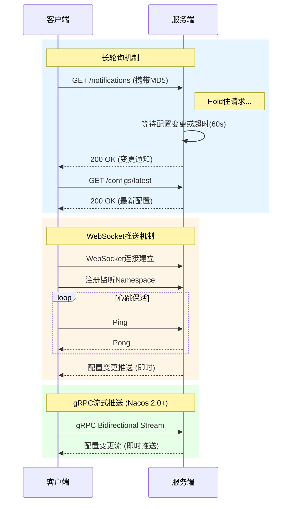

**长轮询（Long Polling）** 是目前最主流的实现方式。客户端向服务端发送HTTP请求，服务端hold住这个请求，直到配置发生变更或达到超时时间（通常60秒）。如果配置发生变更，服务端立即返回变更的配置标识（如配置的MD5值），客户端收到通知后拉取最新配置。如果超时，服务端返回"无变更"，客户端立即发起下一次长轮询。

长轮询的优势在于：实现简单，基于标准HTTP协议，不需要特殊的网络环境支持；兼容性好，可以穿越大部分代理和防火墙；服务端压力可控——每个客户端只维持一个短连接（请求-响应模式）。长轮询的劣势在于：实时性不如WebSocket和gRPC，在极端情况下可能有一个超时周期的延迟。

**WebSocket推送** 提供更实时的配置变更通知。客户端与服务端建立WebSocket连接，配置变更时服务端主动推送通知。WebSocket的优势是实时性好（毫秒级通知），劣势是需要维护大量长连接，对服务端的连接管理能力要求较高，且在某些网络环境下（如企业内网代理）可能不支持WebSocket。

**gRPC流式推送** 是Nacos 2.0引入的新机制。通过gRPC的双向流（Bidirectional Streaming），客户端和服务端之间建立持久的双向通道，配置变更时服务端通过流直接推送。gRPC流的优势是：基于HTTP/2多路复用，连接效率高；Protocol Buffers序列化，数据传输效率高；原生支持流式通信，无需轮询。Nacos 2.0通过gRPC长连接替代了HTTP长轮询，大幅提升了配置推送的效率和实时性。

**UDP广播** 适用于同一数据中心内的配置推送。服务端通过UDP广播将配置变更通知发送给所有客户端。UDP的优势是无连接、开销小，劣势是不可靠（UDP包可能丢失）、不支持跨数据中心。在实际生产中，UDP广播很少单独使用，通常作为长轮询的补充手段。

| 推送机制 | 实时性 | 实现复杂度 | 网络兼容性 | 连接管理 | 适用场景 |
|----------|--------|------------|------------|----------|----------|
| 长轮询 | 秒级 | 低 | 优秀（HTTP） | 轻量 | 通用场景，首选方案 |
| WebSocket | 毫秒级 | 中等 | 一般（部分代理不支持） | 重度 | 实时性要求高的场景 |
| gRPC流 | 毫秒级 | 中等 | 较好（HTTP/2） | 中等 | Nacos 2.0+，微服务场景 |
| UDP广播 | 毫秒级 | 低 | 差（仅同网段） | 无 | 同数据中心补充推送 |

```python
"""长轮询客户端实现"""
import asyncio
import aiohttp
import hashlib
import logging
import random
from typing import Callable

log = logging.getLogger(__name__)


class LongPollingConfigClient:
    """长轮询配置客户端"""

    def __init__(self, server_url: str, app_id: str, cluster: str):
        self.server_url = server_url
        self.app_id = app_id
        self.cluster = cluster
        self.config_cache: dict[str, str] = {}
        self.config_md5: dict[str, str] = {}
        self.change_callbacks: list[Callable] = []
        self._running = False
        self._retry_delay = 1.0
        self._max_retry_delay = 60.0

    async def start(self):
        """启动长轮询"""
        self._running = True
        await self._initial_load()
        await asyncio.gather(
            self._long_poll_loop(),
            self._periodic_full_sync()
        )

    async def _initial_load(self):
        """启动时全量拉取配置"""
        async with aiohttp.ClientSession() as session:
            url = f"{self.server_url}/configs/{self.app_id}/{self.cluster}"
            async with session.get(url) as resp:
                configs = await resp.json()
                for key, value in configs.items():
                    self.config_cache[key] = value
                    self.config_md5[key] = hashlib.md5(
                        value.encode()
                    ).hexdigest()
        log.info(f"Initial load completed: {len(self.config_cache)} configs")

    async def _long_poll_loop(self):
        """长轮询主循环"""
        async with aiohttp.ClientSession() as session:
            while self._running:
                try:
                    url = f"{self.server_url}/notifications"
                    params = {
                        "appId": self.app_id,
                        "cluster": self.cluster,
                        "notifications": self._build_notification_str()
                    }
                    async with session.get(
                        url, params=params,
                        timeout=aiohttp.ClientTimeout(total=90)
                    ) as resp:
                        if resp.status == 200:
                            changes = await resp.json()
                            if changes:
                                await self._handle_changes(changes)
                            self._retry_delay = 1.0  # 重置重试延迟
                except asyncio.TimeoutError:
                    pass  # 超时正常，重新发起轮询
                except aiohttp.ClientError as e:
                    log.warning(f"Long poll network error: {e}")
                    await asyncio.sleep(self._retry_delay)
                    self._retry_delay = min(
                        self._retry_delay * 2, self._max_retry_delay
                    )
                except Exception as e:
                    log.error(f"Long poll unexpected error: {e}")
                    await asyncio.sleep(self._retry_delay)

    async def _handle_changes(self, changes: list):
        """处理配置变更"""
        for change in changes:
            namespace = change["namespace"]
            new_md5 = change["md5"]

            if self.config_md5.get(namespace) != new_md5:
                new_config = await self._fetch_config(namespace)
                old_config = self.config_cache.get(namespace)
                self.config_cache[namespace] = new_config
                self.config_md5[namespace] = new_md5

                for callback in self.change_callbacks:
                    try:
                        await callback(namespace, old_config, new_config)
                    except Exception as e:
                        log.error(f"Change callback error: {e}")

    async def _periodic_full_sync(self):
        """定期全量同步，防止增量更新遗漏"""
        while self._running:
            await asyncio.sleep(300)  # 每5分钟全量同步一次
            try:
                await self._initial_load()
            except Exception as e:
                log.error(f"Periodic sync error: {e}")

    def _build_notification_str(self) -> str:
        """构建通知参数字符串"""
        notifications = []
        for ns, md5 in self.config_md5.items():
            notifications.append(f"{ns}:{md5}")
        return ",".join(notifications)

    def on_change(self, callback: Callable):
        """注册配置变更回调"""
        self.change_callbacks.append(callback)
```

---

## 56.4 Apollo配置中心架构详解

Apollo是携程开源的分布式配置管理中心，其架构设计是配置中心领域的经典参考。

**Config Service** 是Apollo的核心服务，负责配置的读取和推送。Config Service是无状态的，可以水平扩展。它从数据库加载配置并缓存在内存中，客户端通过Config Service读取配置。当配置发生变更时，Config Service通过长轮询的hold住机制通知客户端。

Config Service内部维护了一个通知机制：当Admin Service修改配置后，会向消息队列发送变更通知，Config Service订阅这个通知并更新内存缓存。同时，Config Service维护了一个"变更通知队列"——客户端的长轮询请求会注册到这个队列中，当配置变更时，Config Service从队列中取出所有等待的请求并返回变更通知。

**Admin Service** 负责配置的变更操作。Admin Service提供RESTful API，支持配置的创建、修改、删除和发布。Admin Service与Config Service共享同一个数据库，但职责不同——Admin Service负责写入，Config Service负责读取。

**Portal** 是面向用户的Web管理界面，提供配置的可视化管理功能。Portal通过调用Admin Service的API来操作配置。Portal支持多环境管理——同一个Portal可以管理多个环境（DEV、FAT、UAT、PRO）的配置，每个环境有独立的Admin Service。

**客户端SDK** 提供多语言支持（Java、.NET、Go等）。客户端SDK的核心功能包括：配置拉取——启动时从Config Service全量拉取配置；配置缓存——将配置缓存在本地文件系统，确保Config Service不可用时仍能使用缓存配置；变更监听——通过长轮询监听配置变更；失败容错——网络异常时使用本地缓存。

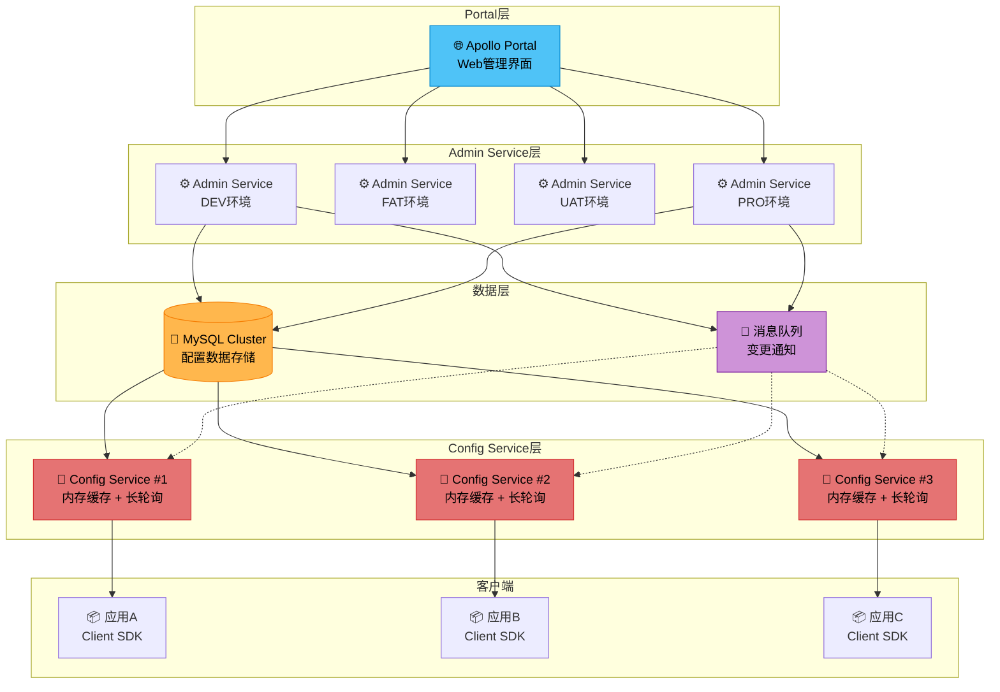

Apollo的配置发布流程：

1. 开发者在Portal上修改配置并提交
2. Admin Service将配置变更写入MySQL数据库
3. Admin Service通过消息队列通知所有Config Service实例
4. Config Service实例更新内存缓存
5. 正在等待长轮询的客户端立即收到变更通知
6. 客户端拉取最新配置并更新本地缓存

Apollo的核心设计决策：

| 设计决策 | 选择 | 理由 |
|----------|------|------|
| 存储层 | MySQL | 成熟稳定，运维成本低，支持事务 |
| 缓存层 | 进程内内存 | 读取性能最高，单实例百万级QPS |
| 推送机制 | 长轮询 | 实现简单，HTTP兼容性好 |
| 服务发现 | 客户端直连 + 硬编码Meta Server | 简化架构，不依赖额外组件 |
| 多环境 | 独立Admin Service实例 | 环境隔离彻底，互不影响 |

---

## 56.5 Nacos配置中心架构详解

Nacos是阿里巴巴开源的注册中心和配置中心一体化解决方案。Nacos的配置管理模块与Apollo有相似之处，但也有显著差异。

**Namespace/Group/DataId三级结构** 是Nacos配置管理的核心模型。Namespace用于环境隔离（如DEV、PROD），Group用于业务分组（如DEFAULT_GROUP、PAYMENT_GROUP），DataId用于标识具体的配置文件。这种三级结构提供了灵活的配置组织和隔离能力。

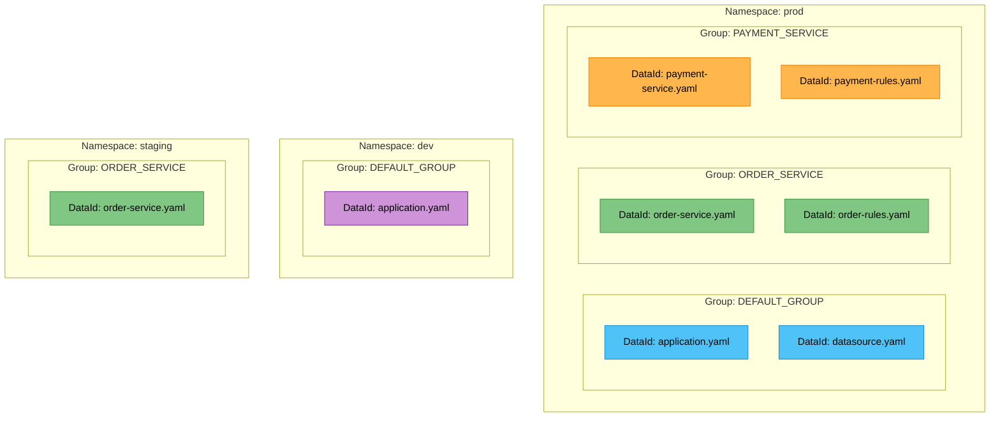

**配置的存储**：Nacos将配置数据存储在MySQL数据库中（也支持内嵌的Derby数据库用于单机模式）。配置内容以明文或加密形式存储，支持配置内容的版本管理。

**配置变更的推送机制**：Nacos 1.x采用长轮询机制实现配置变更通知。客户端启动时向Nacos Server注册监听，然后定期发送长轮询请求。当配置变更时，Nacos Server立即返回变更通知，客户端收到通知后拉取最新配置。Nacos 2.0版本引入了gRPC协议，通过长连接实现更高效的配置推送——客户端与服务端建立gRPC双向流连接，配置变更时服务端通过流直接推送新配置，无需客户端轮询。

**配置的灰度发布**：Nacos支持配置的灰度发布，可以将新配置只推送给指定的IP列表或指定的标签（Label）。灰度发布允许在小范围内验证配置变更的正确性，降低配置变更的风险。

**Nacos 2.0的架构改进**：

| 对比维度 | Nacos 1.x | Nacos 2.0 |
|----------|-----------|-----------|
| 通信协议 | HTTP | gRPC |
| 配置推送 | 长轮询 | gRPC双向流 |
| 连接方式 | 短连接 | 长连接 |
| 实时性 | 秒级 | 毫秒级 |
| 服务发现 | HTTP心跳 | gRPC心跳 |
| 性能 | 中等 | 显著提升 |

```python
"""Nacos配置管理客户端"""
import asyncio
import aiohttp
import hashlib
import logging
from typing import Callable, Optional

log = logging.getLogger(__name__)


class NacosConfigClient:
    """Nacos配置管理客户端"""

    def __init__(self, server_addr: str, namespace: str):
        self.server_addr = server_addr
        self.namespace = namespace
        self.config_cache: dict[str, str] = {}

    async def get_config(self, data_id: str, group: str) -> Optional[str]:
        """获取配置"""
        cache_key = f"{self.namespace}:{group}:{data_id}"
        if cache_key in self.config_cache:
            return self.config_cache[cache_key]

        url = (f"http://{self.server_addr}/nacos/v1/cs/configs"
               f"?dataId={data_id}&amp;group={group}"
               f"&amp;tenant={self.namespace}")
        async with aiohttp.ClientSession() as session:
            async with session.get(url) as resp:
                if resp.status == 200:
                    content = await resp.text()
                    self.config_cache[cache_key] = content
                    return content
                return None

    async def publish_config(self, data_id: str, group: str,
                             content: str) -> bool:
        """发布配置"""
        url = f"http://{self.server_addr}/nacos/v1/cs/configs"
        data = {
            "dataId": data_id,
            "group": group,
            "tenant": self.namespace,
            "content": content
        }
        async with aiohttp.ClientSession() as session:
            async with session.post(url, data=data) as resp:
                return resp.status == 200

    async def listen_config(self, data_id: str, group: str,
                            callback: Callable):
        """监听配置变更（长轮询）"""
        content_md5 = ""
        while True:
            try:
                url = (f"http://{self.server_addr}/nacos/v1/cs/configs/listener"
                       f"?Listening-Configs="
                       f"{data_id}%02{group}%02{content_md5}%01")
                async with aiohttp.ClientSession() as session:
                    async with session.post(
                        url,
                        timeout=aiohttp.ClientTimeout(total=30)
                    ) as resp:
                        body = await resp.text()
                        if body.strip():
                            new_content = await self.get_config(
                                data_id, group
                            )
                            if new_content:
                                content_md5 = hashlib.md5(
                                    new_content.encode()
                                ).hexdigest()
                                await callback(data_id, group, new_content)
            except Exception as e:
                log.error(f"Listen config error: {e}")
                await asyncio.sleep(5)
```

---

## 56.6 配置灰度发布与版本管理

**灰度发布（Gray/Canary Release）** 是配置变更安全性的关键保障。配置灰度发布允许将新配置先推送给部分实例进行验证，确认无误后再全量发布。

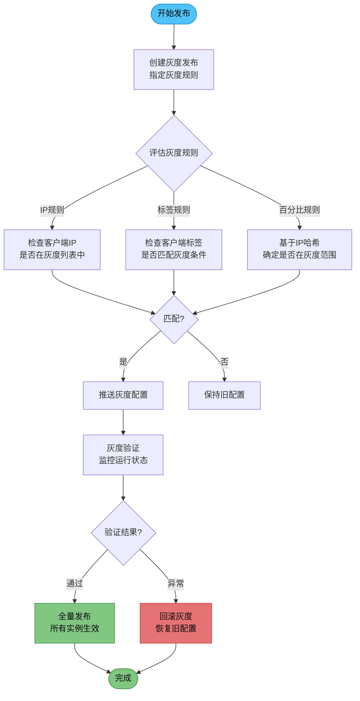

灰度发布的实现方式通常包括：

- **基于IP的灰度**：指定哪些IP的客户端接收新配置。适合小范围验证，精确控制。
- **基于标签的灰度**：给客户端打上标签（如机房、数据中心、服务版本），只推送匹配标签的客户端。适合按维度灰度。
- **基于百分比的灰度**：随机选择指定百分比的客户端接收新配置。适合大规模渐进式发布。

**配置版本管理** 记录每次配置变更的历史，支持查看历史版本、版本对比和回滚。版本管理的核心数据结构是一个版本链表——每个版本包含配置内容、变更时间、变更人和变更说明。

```python
"""配置版本管理"""
from datetime import datetime
from dataclasses import dataclass


@dataclass
class ConfigVersion:
    """配置版本"""
    version_id: int
    namespace: str
    key: str
    value: str
    created_by: str
    created_at: datetime
    comment: str


class ConfigVersionManager:
    """配置版本管理器"""

    def __init__(self, config_repo, version_repo):
        self.config_repo = config_repo
        self.version_repo = version_repo

    async def publish(self, namespace: str, key: str, value: str,
                      operator: str, comment: str,
                      gray_rules: dict = None):
        """发布配置（支持灰度规则）"""
        version = ConfigVersion(
            version_id=await self._next_version_id(namespace, key),
            namespace=namespace, key=key, value=value,
            created_by=operator, created_at=datetime.utcnow(),
            comment=comment
        )
        await self.version_repo.save(version)

        if gray_rules:
            await self._gray_publish(namespace, key, value, gray_rules)
        else:
            await self._full_publish(namespace, key, value)

    async def rollback(self, namespace: str, key: str,
                       target_version: int, operator: str):
        """回滚到指定版本"""
        version = await self.version_repo.get(
            namespace, key, target_version
        )
        if not version:
            raise VersionNotFound(namespace, key, target_version)

        await self.publish(
            namespace, key, version.value, operator,
            f"回滚到版本 {target_version}"
        )

    async def diff(self, namespace: str, key: str,
                   version_a: int, version_b: int) -> dict:
        """版本对比"""
        va = await self.version_repo.get(namespace, key, version_a)
        vb = await self.version_repo.get(namespace, key, version_b)
        return {
            "version_a": version_a,
            "version_b": version_b,
            "content_a": va.value,
            "content_b": vb.value,
            "diff": self._compute_diff(va.value, vb.value)
        }

    async def history(self, namespace: str, key: str,
                      limit: int = 50) -> list:
        """获取配置变更历史"""
        return await self.version_repo.list_versions(
            namespace, key, limit=limit
        )
```

---

## 56.7 配置加密与安全

生产环境中的敏感配置（如数据库密码、API密钥、证书私钥）需要特殊的安全保护。配置中心需要提供全链路的配置安全保障。

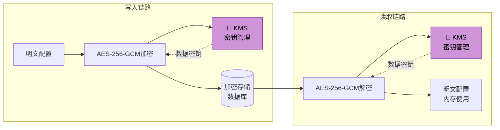

**加密存储**：敏感配置在数据库中以加密形式存储。加密算法通常使用AES-256-GCM（认证加密，同时保证机密性和完整性），密钥由密钥管理系统（KMS）管理。采用信封加密（Envelope Encryption）模式——KMS管理主密钥（Master Key），主密钥加密数据密钥（Data Key），数据密钥加密实际配置数据。

**安全传输**：配置在客户端和服务端之间的传输需要使用HTTPS/TLS。对于特别敏感的配置（如证书私钥），可以额外使用应用层加密。

**访问控制**：配置中心需要提供基于角色的访问控制（RBAC）。不同角色对不同Namespace和配置项有不同的读写权限。配置变更需要审批流程——关键配置的变更需要经过审批才能发布。

**审计日志**：所有配置的读取和变更操作都需要记录审计日志。审计日志包括操作人、操作时间、操作类型、操作内容和操作结果。审计日志需要独立存储，防止被篡改。

| 安全能力 | 实现方式 | 重要性 |
|----------|----------|--------|
| 加密存储 | AES-256-GCM + KMS信封加密 | ★★★★★ |
| 安全传输 | HTTPS/TLS + mTLS | ★★★★★ |
| 访问控制 | RBAC + Namespace级权限 | ★★★★☆ |
| 审计日志 | 独立存储 + 不可篡改 | ★★★★☆ |
| 密钥轮换 | 定期轮换主密钥 | ★★★☆☆ |
| 敏感标记 | 配置项级别标记 | ★★★☆☆ |

```python
"""配置加密器"""
import base64
import hashlib
from Crypto.Cipher import AES


class ConfigEncryptor:
    """配置加密器 - 使用AES-256-GCM + KMS信封加密"""

    def __init__(self, kms_client):
        self.kms_client = kms_client
        self._data_key_cache: dict[str, bytes] = {}

    async def encrypt(self, plaintext: str, key_id: str) -> str:
        """加密配置值"""
        data_key = await self._get_data_key(key_id)
        cipher = AES.new(data_key, AES.MODE_GCM)
        ciphertext, tag = cipher.encrypt_and_digest(
            plaintext.encode('utf-8')
        )
        # 组合：nonce(16字节) + tag(16字节) + ciphertext
        encrypted = cipher.nonce + tag + ciphertext
        return base64.b64encode(encrypted).decode('utf-8')

    async def decrypt(self, ciphertext: str, key_id: str) -> str:
        """解密配置值"""
        data_key = await self._get_data_key(key_id)
        raw = base64.b64decode(ciphertext)
        nonce = raw[:16]
        tag = raw[16:32]
        encrypted_data = raw[32:]
        cipher = AES.new(data_key, AES.MODE_GCM, nonce=nonce)
        plaintext = cipher.decrypt_and_verify(encrypted_data, tag)
        return plaintext.decode('utf-8')

    async def _get_data_key(self, key_id: str) -> bytes:
        """从KMS获取数据密钥（带缓存）"""
        if key_id not in self._data_key_cache:
            result = await self.kms_client.generate_data_key(key_id)
            self._data_key_cache[key_id] = result.plaintext_key
            # 设置缓存过期，定期轮换数据密钥
        return self._data_key_cache[key_id]

    async def rotate_key(self, key_id: str):
        """密钥轮换：生成新的数据密钥并重新加密所有配置"""
        # 1. 生成新的数据密钥
        new_result = await self.kms_client.generate_data_key(key_id)
        self._data_key_cache[key_id] = new_result.plaintext_key
        # 2. 重新加密所有使用旧密钥的配置（异步批量处理）
        # 此处省略批量重加密逻辑
```

```python
"""配置审计日志"""
from dataclasses import dataclass
from datetime import datetime


@dataclass
class AuditLog:
    """审计日志条目"""
    action: str
    namespace: str
    key: str
    operator: str
    client_ip: str
    timestamp: datetime
    old_value_hash: str = ""
    new_value_hash: str = ""
    comment: str = ""


class ConfigAuditLogger:
    """配置审计日志管理器"""

    def __init__(self, audit_repo):
        self.audit_repo = audit_repo

    async def log_read(self, namespace: str, key: str,
                       operator: str, client_ip: str):
        """记录配置读取操作"""
        await self.audit_repo.save(AuditLog(
            action="READ", namespace=namespace, key=key,
            operator=operator, client_ip=client_ip,
            timestamp=datetime.utcnow()
        ))

    async def log_change(self, namespace: str, key: str,
                         old_value_hash: str, new_value_hash: str,
                         operator: str, comment: str):
        """记录配置变更操作"""
        await self.audit_repo.save(AuditLog(
            action="CHANGE", namespace=namespace, key=key,
            old_value_hash=old_value_hash,
            new_value_hash=new_value_hash,
            operator=operator, comment=comment,
            timestamp=datetime.utcnow()
        ))

    async def log_publish(self, namespace: str, key: str,
                          version: int, operator: str,
                          publish_type: str = "FULL"):
        """记录配置发布操作"""
        await self.audit_repo.save(AuditLog(
            action="PUBLISH", namespace=namespace, key=key,
            operator=operator,
            comment=f"version={version}, type={publish_type}",
            timestamp=datetime.utcnow()
        ))
```

---

## 56.8 Namespace与配置隔离

配置隔离是多环境、多租户配置管理的基础。合理的隔离策略可以避免环境间配置混淆导致的事故。

**环境隔离**：通过Namespace实现开发（DEV）、测试（FAT/UAT）、预发布（PRE）和生产（PROD）环境的配置隔离。每个环境有独立的配置集，互不干扰。客户端通过启动参数指定所属的Namespace。

**业务隔离**：通过Group实现同一环境下不同业务线的配置隔离。例如，订单服务和支付服务可以使用不同的Group，避免配置冲突。

**灰度隔离**：灰度发布本质上也是一种隔离——新配置只对部分实例可见。灰度隔离通常通过标签或IP规则实现。

```yaml
# Nacos配置隔离示例
spring:
  cloud:
    nacos:
      config:
        server-addr: nacos-server:8848
        # Namespace: 环境隔离
        namespace: prod-env-uuid
        # Group: 业务隔离
        group: ORDER_SERVICE
        # DataId: 配置文件标识
        shared-configs:
          - data-id: common-config.yaml
            group: SHARED_CONFIG
            refresh: true
          - data-id: datasource-config.yaml
            group: SHARED_CONFIG
            refresh: false
```

配置隔离的最佳实践：

| 实践 | 说明 | 原因 |
|------|------|------|
| 严格环境隔离 | 生产环境的配置绝不能出现在非生产环境中 | 防止测试配置污染生产环境 |
| 共享配置抽取 | 公共配置（如数据库连接池配置）抽取到共享配置文件中 | 避免重复，便于统一管理 |
| 配置命名规范 | 使用统一的命名规范（如{服务名}-{功能}-{环境}） | 便于搜索和管理 |
| 权限隔离 | 不同环境由不同的管理员负责 | 减少误操作风险 |
| 配置模板化 | 使用变量占位符，不同环境只替换变量值 | 减少配置冗余 |

---

## 本节小结

本节从理论层面系统性地探讨了配置中心的核心架构和关键技术。配置中心通过Config Service、Admin Service、Portal和客户端SDK的协作，实现了配置的集中管理、实时推送、版本管理和灰度发布。长轮询是目前最主流的配置变更推送机制，在实时性和实现复杂度之间取得了良好的平衡。配置加密和访问控制是生产环境的必备能力。Namespace和Group的多级隔离为多环境、多租户的配置管理提供了基础。

---

---

# 第56章 配置中心 核心技巧

---

理解了配置中心的理论基础之后，接下来我们进入工程实现的核心技巧。从长轮询的完整实现到配置热更新的框架集成，从灰度发布的工程实践到高可用的架构设计，每一项技巧都是生产环境中不可或缺的能力。

---

## 56.9 长轮询机制的完整实现

长轮询是配置中心最核心的推送机制。一个生产级的长轮询实现需要处理并发、超时、重试和优雅降级等复杂场景。

### 服务端实现

```python
"""长轮询服务端实现"""
import asyncio
import hashlib
import json
import logging
from typing import Callable, Dict, Optional
from dataclasses import dataclass, field

log = logging.getLogger(__name__)


@dataclass
class ConfigItem:
    """配置项"""
    namespace: str
    key: str
    value: str
    md5: str
    version: int
    last_modified: float


class LongPollingServer:
    """长轮询服务端实现"""

    def __init__(self, config_store):
        self.config_store = config_store
        # 等待通知的客户端请求队列
        # key: namespace, value: list of (client_id, old_md5, Future)
        self._waiters: Dict[str, list] = {}
        self._lock = asyncio.Lock()

    async def poll_notifications(self, client_id: str,
                                 notifications: dict,
                                 timeout: float = 60.0) -> dict:
        """
        长轮询端点：客户端发送当前配置的MD5，
        服务端hold住请求直到配置变更或超时
        """
        changed = {}

        # 检查是否有已变更的配置
        for namespace, client_md5 in notifications.items():
            server_md5 = await self.config_store.get_md5(namespace)
            if server_md5 and server_md5 != client_md5:
                changed[namespace] = server_md5

        if changed:
            return changed

        # 没有变更，注册等待
        future = asyncio.get_event_loop().create_future()

        async with self._lock:
            for ns in notifications:
                if ns not in self._waiters:
                    self._waiters[ns] = []
                self._waiters[ns].append(
                    (client_id, notifications[ns], future)
                )

        try:
            # 等待变更通知或超时
            changed = await asyncio.wait_for(future, timeout=timeout)
            return changed
        except asyncio.TimeoutError:
            return {}  # 超时，返回空（无变更）
        finally:
            # 清理等待队列，移除该客户端的所有注册
            async with self._lock:
                for ns in notifications:
                    if ns in self._waiters:
                        self._waiters[ns] = [
                            (cid, md5, f) for cid, md5, f in self._waiters[ns]
                            if cid != client_id
                        ]

    async def notify_change(self, namespace: str):
        """配置变更时通知所有等待的客户端"""
        new_md5 = await self.config_store.get_md5(namespace)

        async with self._lock:
            waiters = self._waiters.pop(namespace, [])

        # 逐个通知等待中的客户端
        for client_id, old_md5, future in waiters:
            if not future.done() and old_md5 != new_md5:
                future.set_result({namespace: new_md5})
                log.info(f"Notified client {client_id} of change in {namespace}")
```

### 客户端实现

```python
"""长轮询客户端实现"""
import asyncio
import aiohttp
import hashlib
import logging
from typing import Callable, Dict, Optional
from dataclasses import dataclass

log = logging.getLogger(__name__)


class LongPollingClient:
    """长轮询客户端实现"""

    def __init__(self, server_url: str, local_cache_dir: str):
        self.server_url = server_url
        self.local_cache = LocalConfigCache(local_cache_dir)
        self.config_store: Dict[str, ConfigItem] = {}
        self.change_callbacks: list[Callable] = []
        self._retry_delay = 1.0
        self._max_retry_delay = 60.0

    async def start_polling(self):
        """启动长轮询主循环"""
        while True:
            try:
                notifications = {
                    ns: item.md5
                    for ns, item in self.config_store.items()
                }

                async with aiohttp.ClientSession() as session:
                    async with session.post(
                        f"{self.server_url}/notifications",
                        json={"notifications": notifications},
                        timeout=aiohttp.ClientTimeout(total=90)
                    ) as resp:
                        if resp.status == 200:
                            changes = await resp.json()
                            if changes:
                                await self._apply_changes(changes)
                            self._retry_delay = 1.0  # 重置重试延迟
                        else:
                            log.warning(f"Poll failed: {resp.status}")
                            await asyncio.sleep(self._retry_delay)
                            self._retry_delay = min(
                                self._retry_delay * 2,
                                self._max_retry_delay
                            )

            except asyncio.TimeoutError:
                pass  # 超时是正常的，重新发起轮询
            except Exception as e:
                log.error(f"Poll error: {e}, retry in {self._retry_delay}s")
                await asyncio.sleep(self._retry_delay)
                self._retry_delay = min(
                    self._retry_delay * 2, self._max_retry_delay
                )

    async def _apply_changes(self, changes: dict):
        """应用配置变更"""
        for namespace, new_md5 in changes.items():
            new_value = await self._fetch_config(namespace)
            old_value = self.config_store.get(namespace)
            self.config_store[namespace] = ConfigItem(
                namespace=namespace, key=namespace,
                value=new_value, md5=new_md5,
                version=(old_value.version + 1 if old_value else 1),
                last_modified=asyncio.get_event_loop().time()
            )
            # 更新本地文件缓存
            self.local_cache.save(namespace, new_value, new_md5)
            # 触发回调
            for callback in self.change_callbacks:
                try:
                    await callback(namespace, old_value, new_value)
                except Exception as e:
                    log.error(f"Callback error: {e}")

    def get_config(self, namespace: str, default: str = "") -> str:
        """获取配置值（优先内存缓存，其次本地文件缓存）"""
        if namespace in self.config_store:
            return self.config_store[namespace].value
        cached = self.local_cache.load(namespace)
        return cached if cached else default
```

### 长轮询实现的关键要点

| 要点 | 实现方式 | 原因 |
|------|----------|------|
| 指数退避重试 | 初始延迟1秒，最大60秒，每次翻倍 | 避免服务端故障时频繁重试造成压力 |
| 本地缓存降级 | 内存缓存 → 文件缓存 → 默认值 | 确保配置中心不可用时应用仍可运行 |
| 批量通知 | 一次请求携带多个配置的MD5 | 减少网络请求次数 |
| 超时处理 | 客户端超时设为90秒（大于服务端60秒） | 避免客户端和服务端同时超时 |
| 连接复用 | 使用aiohttp.ClientSession复用连接 | 减少TCP握手开销 |

---

## 56.10 配置热更新的Spring Boot集成

在Spring Boot应用中，配置热更新需要与Spring的属性刷新机制集成。以下展示了如何在Spring Boot中实现配置的动态刷新。

```java
// 1. 自定义配置源：将Apollo配置集成到Spring Environment
@Component
public class ApolloConfigSource extends PropertySource<Map<String, String>>
        implements ApplicationContextAware {

    private final Map<String, String> properties = new ConcurrentHashMap<>();
    private Config config;

    public ApolloConfigSource() {
        super("apollo-config");
    }

    @PostConstruct
    public void init() {
        ConfigChangeListener changeListener = changeEvent -> {
            for (String key : changeEvent.changedKeys()) {
                ConfigChange change = changeEvent.getChange(key);
                properties.put(key, change.getNewValue());
                publishRefreshEvent(key, change.getOldValue(),
                                   change.getNewValue());
            }
        };
        ConfigService.getAppConfig().addChangeListener(changeListener);
    }

    @Override
    public Object getProperty(String name) {
        return properties.get(name);
    }

    private void publishRefreshEvent(String key, String oldVal, String newVal) {
        applicationContext.publishEvent(
            new ConfigRefreshedEvent(this, key, oldVal, newVal)
        );
    }
}

// 2. @RefreshScope注解支持：配置变更时自动销毁并重建Bean
@RefreshScope
@Service
public class PaymentService {

    @Value("${payment.rate-limit:100}")
    private int rateLimit;

    @Value("${payment.timeout:5000}")
    private long timeout;

    // 配置变更时，Spring会销毁这个Bean并在下次访问时重新创建
    // rateLimit和timeout会自动更新为新值
}

// 3. 配置变更事件监听：自定义刷新逻辑
@Component
public class ConfigRefreshHandler {

    @EventListener
    public void onConfigRefresh(ConfigRefreshedEvent event) {
        log.info("Config refreshed: {} = {} -> {}",
                 event.getKey(), event.getOldValue(), event.getNewValue());

        // 根据不同的配置项执行不同的刷新逻辑
        if ("payment.rate-limit".equals(event.getKey())) {
            rateLimiter.setRate(Integer.parseInt(event.getNewValue()));
        }
    }
}

// 4. 非@RefreshScope的动态刷新：适合热更新频繁的配置
@Component
public class DynamicConfigHolder {

    private volatile Map<String, String> configMap = new ConcurrentHashMap<>();

    @ApolloConfigChangeListener
    public void onChange(ConfigChangeEvent changeEvent) {
        for (String key : changeEvent.changedKeys()) {
            configMap.put(key, changeEvent.getChange(key).getNewValue());
        }
    }

    public String getValue(String key) {
        return configMap.get(key);
    }

    public int getIntValue(String key, int defaultValue) {
        String val = configMap.get(key);
        return val != null ? Integer.parseInt(val) : defaultValue;
    }
}
```

**@RefreshScope vs DynamicConfigHolder的选择**：

| 对比维度 | @RefreshScope | DynamicConfigHolder |
|----------|---------------|---------------------|
| 刷新方式 | 销毁并重建Bean | 原地更新Map |
| 线程安全 | Spring保证（重建期间不可访问） | 需要volatile + ConcurrentHashMap |
| 性能影响 | 重建Bean有开销 | 几乎无开销 |
| 适用场景 | 低频变更的配置 | 高频变更的配置（如限流阈值） |
| 使用复杂度 | 低（注解即可） | 中等（需自行实现） |

---

## 56.11 灰度发布的工程实现

配置灰度发布的核心是将配置变更限制在特定范围内。以下实现支持基于IP、标签和百分比三种灰度策略。

```python
"""灰度发布管理器"""
import hashlib
from datetime import datetime


class GrayReleaseManager:
    """灰度发布管理器"""

    def __init__(self, config_repo, gray_rule_repo):
        self.config_repo = config_repo
        self.gray_rule_repo = gray_rule_repo

    async def create_gray_release(
        self, namespace: str, key: str,
        new_value: str, operator: str,
        gray_type: str, gray_rules: list
    ):
        """
        创建灰度发布
        gray_type: "ip" | "label" | "percentage"
        gray_rules: ["10.0.0.1", "10.0.0.2"] 或
                    [{"label": "datacenter", "value": "dc1"}] 或
                    10 (百分比)
        """
        release = GrayRelease(
            namespace=namespace, key=key,
            new_value=new_value, operator=operator,
            gray_type=gray_type, gray_rules=gray_rules,
            status="GRAYING", created_at=datetime.utcnow()
        )
        await self.gray_rule_repo.save(release)
        await self.config_repo.save_gray_config(release)

    async def evaluate_gray_rules(
        self, namespace: str, key: str,
        client_info: dict
    ) -> tuple[bool, str]:
        """
        评估客户端是否在灰度范围内
        client_info: {"ip": "10.0.0.1", "labels": {"datacenter": "dc1"}}
        返回: (is_gray, config_value)
        """
        release = await self.gray_rule_repo.get_active_gray(
            namespace, key
        )
        if not release:
            value = await self.config_repo.get_config(namespace, key)
            return False, value

        if self._match_gray(release, client_info):
            return True, release.new_value
        else:
            old_value = await self.config_repo.get_old_config(namespace, key)
            return False, old_value

    def _match_gray(self, release: 'GrayRelease', client_info: dict) -> bool:
        """判断客户端是否匹配灰度规则"""
        if release.gray_type == "ip":
            return client_info.get("ip") in release.gray_rules
        elif release.gray_type == "label":
            for rule in release.gray_rules:
                label_key = rule["label"]
                label_value = rule["value"]
                if client_info.get("labels", {}).get(label_key) == label_value:
                    return True
            return False
        elif release.gray_type == "percentage":
            # 基于客户端IP的哈希实现确定性百分比灰度
            ip_hash = hashlib.md5(
                client_info.get("ip", "").encode()
            ).hexdigest()
            return int(ip_hash[:8], 16) % 100 < release.gray_rules
        return False

    async def full_publish(self, namespace: str, key: str, operator: str):
        """灰度验证通过后，全量发布"""
        release = await self.gray_rule_repo.get_active_gray(namespace, key)
        if not release:
            return
        await self.config_repo.promote_gray_to_formal(namespace, key)
        release.status = "PUBLISHED"
        await self.gray_rule_repo.save(release)

    async def rollback_gray(self, namespace: str, key: str, operator: str):
        """回滚灰度发布"""
        release = await self.gray_rule_repo.get_active_gray(namespace, key)
        if release:
            release.status = "ROLLED_BACK"
            await self.gray_rule_repo.save(release)
            await self.config_repo.remove_gray_config(namespace, key)
```

灰度发布的完整流程：

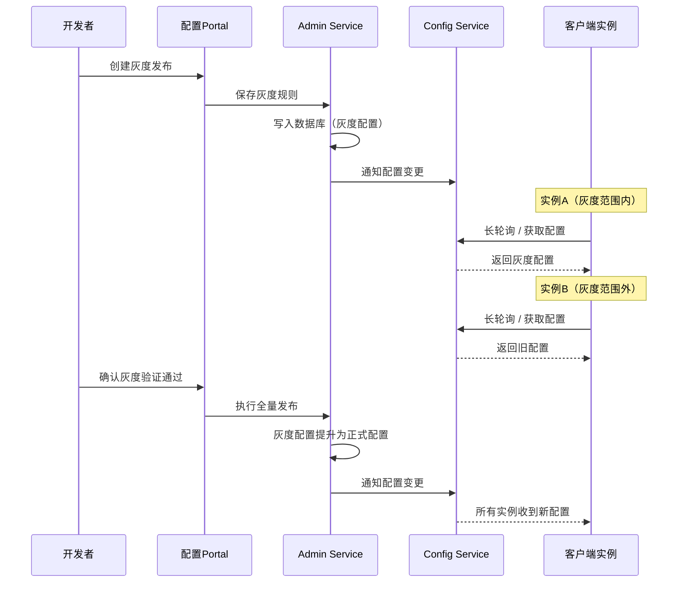

---

## 56.12 配置变更通知与事件驱动

配置变更的及时通知是配置中心的关键能力。除了长轮询之外，还可以通过事件驱动的方式实现更灵活的配置变更处理。

```python
"""配置变更事件总线"""
import asyncio
from typing import Callable, Any
from dataclasses import dataclass
from enum import Enum


class ConfigChangeType(Enum):
    ADDED = "ADDED"
    MODIFIED = "MODIFIED"
    DELETED = "DELETED"


@dataclass
class ConfigChangeEvent:
    """配置变更事件"""
    namespace: str
    key: str
    old_value: Any
    new_value: Any
    change_type: ConfigChangeType
    timestamp: float
    operator: str


class ConfigChangeBus:
    """配置变更事件总线"""

    def __init__(self):
        self._subscribers: dict[str, list[Callable]] = {}

    def subscribe(self, pattern: str, callback: Callable):
        """
        订阅配置变更事件
        pattern支持通配符：如 "payment.*" 匹配所有payment开头的配置
        """
        if pattern not in self._subscribers:
            self._subscribers[pattern] = []
        self._subscribers[pattern].append(callback)

    async def publish(self, event: ConfigChangeEvent):
        """发布配置变更事件"""
        for pattern, callbacks in self._subscribers.items():
            if self._match_pattern(pattern, event.key):
                for callback in callbacks:
                    try:
                        await callback(event)
                    except Exception as e:
                        log.error(f"Config change callback error: {e}")

    def _match_pattern(self, pattern: str, key: str) -> bool:
        """简单的通配符匹配"""
        if pattern == "*":
            return True
        if pattern.endswith("*"):
            return key.startswith(pattern[:-1])
        if pattern.startswith("*"):
            return key.endswith(pattern[1:])
        return pattern == key


# 使用示例：动态限流器
class DynamicRateLimiter:
    """动态限流器：根据配置变更自动调整限流参数"""

    def __init__(self, config_change_bus: ConfigChangeBus):
        self.rate = 100
        config_change_bus.subscribe(
            "rate-limit.*", self._on_rate_limit_change
        )

    async def _on_rate_limit_change(self, event: ConfigChangeEvent):
        if event.change_type == ConfigChangeType.MODIFIED:
            new_rate = int(event.new_value)
            self.rate = new_rate
            log.info(f"Rate limit updated to {new_rate}")


class DynamicCircuitBreaker:
    """动态熔断器：根据配置变更自动调整熔断参数"""

    def __init__(self, config_change_bus: ConfigChangeBus):
        self.failure_threshold = 5
        self.recovery_timeout = 30
        config_change_bus.subscribe(
            "circuit-breaker.*", self._on_cb_change
        )

    async def _on_cb_change(self, event: ConfigChangeEvent):
        if "failure-threshold" in event.key:
            self.failure_threshold = int(event.new_value)
        elif "recovery-timeout" in event.key:
            self.recovery_timeout = int(event.new_value)
```

---

## 56.13 配置的高可用设计

配置中心作为基础设施，其可用性直接影响所有依赖它的服务。配置中心的高可用设计需要考虑多个层面。

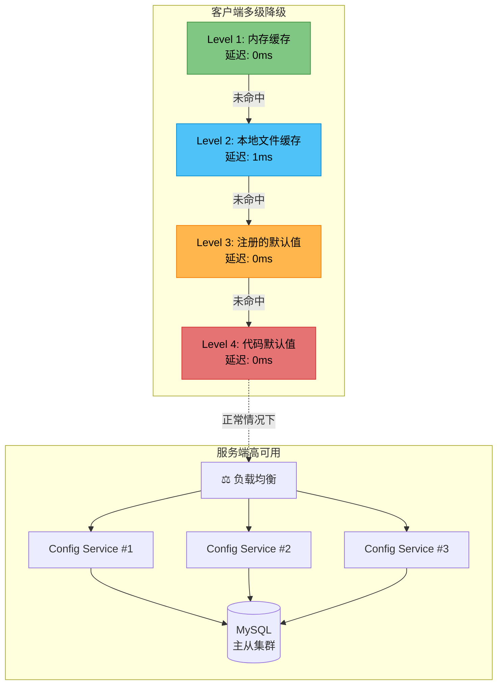

**服务端高可用**：Config Service部署多个实例，通过负载均衡对外提供服务。配置数据存储在高可用的数据库中（如MySQL主从集群），配置缓存在每个实例的内存中。即使数据库不可用，Config Service仍然可以使用内存缓存提供服务。

**客户端容错**：客户端SDK需要在任何情况下都能提供可用的配置值。容错策略采用多级降级：

| 降级层级 | 数据源 | 延迟 | 可用性 | 数据新鲜度 |
|----------|--------|------|--------|------------|
| Level 1 | 内存缓存 | 0ms | 极高 | 最近一次同步 |
| Level 2 | 本地文件缓存 | 1ms | 高 | 上次成功同步 |
| Level 3 | 注册的默认值 | 0ms | 中等 | 应用启动时注册 |
| Level 4 | 代码中的默认值 | 0ms | 100% | 编译时确定 |

**数据备份与恢复**：配置数据需要定期备份，支持从备份中快速恢复。Apollo支持将配置数据导出为文本文件，可以作为备份和迁移的手段。

```python
"""高可用配置客户端"""
import asyncio
from typing import Optional


class HighAvailabilityConfigClient:
    """高可用配置客户端 - 多级降级"""

    def __init__(self, servers: list[str], local_cache_dir: str):
        self.servers = servers
        self.memory_cache: dict[str, str] = {}
        self.file_cache = FileCache(local_cache_dir)
        self.default_values: dict[str, str] = {}
        self._current_server = 0

    def get_config(self, key: str, default: str = "") -> str:
        """获取配置值（多级降级）"""
        # Level 1: 内存缓存
        if key in self.memory_cache:
            return self.memory_cache[key]

        # Level 2: 本地文件缓存
        file_value = self.file_cache.get(key)
        if file_value is not None:
            self.memory_cache[key] = file_value
            return file_value

        # Level 3: 注册的默认值
        if key in self.default_values:
            return self.default_values[key]

        # Level 4: 调用方提供的默认值
        return default

    async def fetch_from_server(self, key: str) -> Optional[str]:
        """从服务端获取配置（支持故障转移）"""
        for i in range(len(self.servers)):
            server_idx = (self._current_server + i) % len(self.servers)
            server = self.servers[server_idx]
            try:
                value = await self._fetch_from(server, key)
                self._current_server = server_idx
                self.memory_cache[key] = value
                self.file_cache.set(key, value)
                return value
            except Exception:
                continue  # 故障转移
        return None  # 所有服务器不可用

    async def start_background_sync(self, interval: float = 30.0):
        """后台定期同步配置"""
        while True:
            await asyncio.sleep(interval)
            try:
                for key in list(self.memory_cache.keys()):
                    value = await self.fetch_from_server(key)
                    if value:
                        self.memory_cache[key] = value
            except Exception as e:
                log.error(f"Background sync error: {e}")
```

---

## 56.14 配置中心监控与可观测性

配置中心作为基础设施组件，其自身的稳定运行至关重要。通过Metrics、日志和分布式追踪三大支柱，构建配置中心的全链路可观测体系。

### 核心监控指标

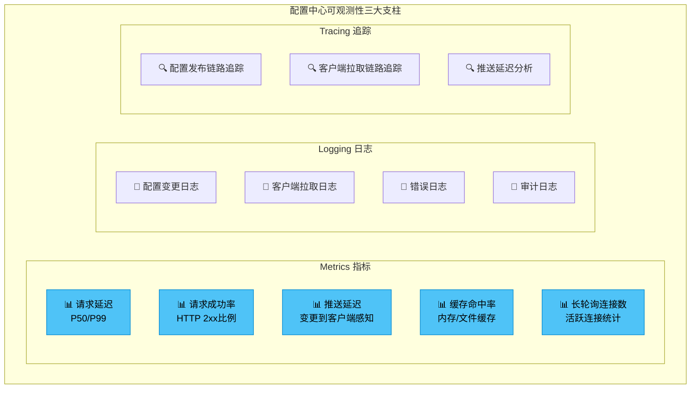

| 指标类别 | 指标名称 | 描述 | 告警阈值建议 |
|----------|----------|------|--------------|
| 请求延迟 | `config_read_latency_p99` | 配置读取P99延迟 | > 100ms |
| 请求延迟 | `config_push_latency_p99` | 配置推送P99延迟 | > 5000ms |
| 请求成功率 | `config_read_success_rate` | 配置读取成功率 | < 99.9% |
| 推送效果 | `config_push_lag_seconds` | 推送延迟（变更到客户端感知） | > 60s |
| 缓存效率 | `config_cache_hit_rate` | 内存缓存命中率 | < 95% |
| 连接状态 | `long_poll_active_connections` | 活跃长轮询连接数 | 异常波动 |
| 系统资源 | `config_service_memory_usage` | 内存使用率 | > 80% |
| 系统资源 | `config_service_cpu_usage` | CPU使用率 | > 70% |

### Prometheus Metrics集成

```python
"""配置中心Metrics导出"""
from prometheus_client import Counter, Histogram, Gauge, Summary

# 请求指标
CONFIG_READ_LATENCY = Histogram(
    'config_read_latency_seconds',
    'Configuration read latency',
    ['namespace', 'client_app'],
    buckets=[0.001, 0.005, 0.01, 0.025, 0.05, 0.1, 0.25, 0.5, 1.0]
)

CONFIG_READ_TOTAL = Counter(
    'config_read_total',
    'Total configuration read requests',
    ['namespace', 'status']
)

CONFIG_PUSH_LATENCY = Histogram(
    'config_push_latency_seconds',
    'Configuration push latency (change to client receipt)',
    ['namespace'],
    buckets=[0.1, 0.5, 1.0, 2.0, 5.0, 10.0, 30.0, 60.0]
)

# 缓存指标
CONFIG_CACHE_HITS = Counter(
    'config_cache_hits_total',
    'Cache hit count',
    ['cache_level']  # memory, file, default
)

CONFIG_CACHE_MISSES = Counter(
    'config_cache_misses_total',
    'Cache miss count',
    ['cache_level']
)

# 连接指标
LONG_POLL_ACTIVE = Gauge(
    'long_poll_active_connections',
    'Number of active long polling connections',
    ['namespace']
)

LONG_POLL_TIMEOUTS = Counter(
    'long_poll_timeouts_total',
    'Long polling timeout count',
    ['namespace']
)

# 配置变更指标
CONFIG_CHANGES_TOTAL = Counter(
    'config_changes_total',
    'Total configuration changes',
    ['namespace', 'operator']
)

CONFIG_GRAY_RELEASE_ACTIVE = Gauge(
    'config_gray_release_active',
    'Number of active gray releases',
    ['namespace']
)


class MetricsCollector:
    """Metrics收集器"""

    def __init__(self):
        pass

    def record_read(self, namespace: str, client_app: str,
                    latency: float, success: bool):
        """记录配置读取指标"""
        CONFIG_READ_LATENCY.labels(
            namespace=namespace, client_app=client_app
        ).observe(latency)
        CONFIG_READ_TOTAL.labels(
            namespace=namespace,
            status="success" if success else "error"
        ).inc()

    def record_push_latency(self, namespace: str, latency: float):
        """记录推送延迟"""
        CONFIG_PUSH_LATENCY.labels(namespace=namespace).observe(latency)

    def record_cache_hit(self, level: str):
        """记录缓存命中"""
        CONFIG_CACHE_HITS.labels(cache_level=level).inc()

    def record_cache_miss(self, level: str):
        """记录缓存未命中"""
        CONFIG_CACHE_MISSES.labels(cache_level=level).inc()

    def set_active_connections(self, namespace: str, count: int):
        """设置活跃连接数"""
        LONG_POLL_ACTIVE.labels(namespace=namespace).set(count)
```

### Grafana Dashboard配置

```yaml
# Grafana Dashboard JSON (关键面板配置)
# 以下为面板定义的简化版本

dashboard:
  title: "配置中心监控大盘"
  panels:
    - title: "配置读取延迟 P99"
      type: graph
      targets:
        - expr: "histogram_quantile(0.99, rate(config_read_latency_seconds_bucket[5m]))"
          legendFormat: "{{namespace}}"

    - title: "配置读取QPS"
      type: graph
      targets:
        - expr: "sum(rate(config_read_total[5m])) by (namespace)"
          legendFormat: "{{namespace}}"

    - title: "推送延迟 P50/P99"
      type: graph
      targets:
        - expr: "histogram_quantile(0.50, rate(config_push_latency_seconds_bucket[5m]))"
          legendFormat: "P50 {{namespace}}"
        - expr: "histogram_quantile(0.99, rate(config_push_latency_seconds_bucket[5m]))"
          legendFormat: "P99 {{namespace}}"

    - title: "缓存命中率"
      type: stat
      targets:
        - expr: "sum(rate(config_cache_hits_total[5m])) / (sum(rate(config_cache_hits_total[5m])) + sum(rate(config_cache_misses_total[5m])))"

    - title: "活跃长轮询连接数"
      type: graph
      targets:
        - expr: "long_poll_active_connections"
          legendFormat: "{{namespace}}"
```

### 告警规则配置

```yaml
# Prometheus AlertManager 告警规则
groups:
  - name: config-center
    rules:
      - alert: ConfigCenterHighLatency
        expr: histogram_quantile(0.99, rate(config_read_latency_seconds_bucket[5m])) > 0.1
        for: 5m
        labels:
          severity: warning
        annotations:
          summary: "配置中心读取延迟过高"
          description: "Namespace {{ $labels.namespace }} P99延迟超过100ms"

      - alert: ConfigCenterPushLag
        expr: histogram_quantile(0.99, rate(config_push_latency_seconds_bucket[5m])) > 30
        for: 3m
        labels:
          severity: critical
        annotations:
          summary: "配置推送延迟过高"
          description: "Namespace {{ $labels.namespace }} 推送延迟超过30秒"

      - alert: ConfigCenterHighErrorRate
        expr: sum(rate(config_read_total{status="error"}[5m])) / sum(rate(config_read_total[5m])) > 0.01
        for: 5m
        labels:
          severity: critical
        annotations:
          summary: "配置中心错误率过高"
          description: "配置读取错误率超过1%"

      - alert: ConfigCenterLowCacheHitRate
        expr: sum(rate(config_cache_hits_total[5m])) / (sum(rate(config_cache_hits_total[5m])) + sum(rate(config_cache_misses_total[5m]))) < 0.90
        for: 10m
        labels:
          severity: warning
        annotations:
          summary: "配置中心缓存命中率过低"
          description: "缓存命中率低于90%，可能影响性能"

      - alert: ConfigCenterMemoryHigh
        expr: config_service_memory_usage > 0.80
        for: 5m
        labels:
          severity: warning
        annotations:
          summary: "配置中心内存使用率过高"
          description: "内存使用率超过80%"
```

---

## 56.15 配置中心性能调优指南

配置中心在大规模场景下（数万个配置项、数千个客户端实例）需要进行性能调优，以保证低延迟和高吞吐。

### 服务端调优

| 调优维度 | 优化策略 | 效果 |
|----------|----------|------|
| 内存缓存 | 使用ConcurrentHashMap存储配置，避免锁竞争 | 读取QPS提升5-10倍 |
| 数据库连接池 | 合理配置连接池大小（建议20-50） | 减少数据库连接等待 |
| 长轮询队列 | 使用asyncio实现异步非阻塞 | 单实例支撑万级连接 |
| 批量推送 | 同一配置变更批量通知所有等待者 | 减少通知延迟 |
| 序列化 | 使用Protocol Buffers替代JSON | 推送数据量减少60-80% |
| 数据库索引 | 为Namespace+Key添加联合索引 | 查询延迟降低一个数量级 |

### 客户端调优

| 调优维度 | 优化策略 | 效果 |
|----------|----------|------|
| 连接复用 | 使用连接池复用HTTP连接 | 减少TCP握手开销 |
| 本地缓存 | 内存缓存 + 文件缓存双层缓存 | 服务端不可用时零延迟 |
| 批量拉取 | 一次请求携带多个配置项的MD5 | 减少网络请求次数 |
| 压缩传输 | 启用gzip压缩 | 大配置文件传输速度提升50% |
| 预热加载 | 服务启动时提前加载所有配置 | 避免启动后首次访问延迟 |

### 容量规划参考

| 规模 | 配置项数量 | 客户端实例 | 推荐部署 |
|------|------------|------------|----------|
| 小型 | < 1,000 | < 100 | 单机Nacos/Apollo |
| 中型 | 1,000 - 10,000 | 100 - 1,000 | 3节点集群 |
| 大型 | 10,000 - 100,000 | 1,000 - 10,000 | 5+节点集群 + 读写分离 |
| 超大型 | > 100,000 | > 10,000 | 分层架构 + 多集群 + 就近访问 |

```python
"""性能调优示例：批量配置拉取"""
import asyncio
import aiohttp
from typing import Dict, List
import hashlib


class BatchConfigFetcher:
    """批量配置拉取器 - 减少网络请求次数"""

    def __init__(self, server_url: str, batch_size: int = 50):
        self.server_url = server_url
        self.batch_size = batch_size

    async def fetch_configs(self, keys: List[str]) -> Dict[str, str]:
        """批量拉取配置"""
        results = {}
        # 按batch_size分组
        for i in range(0, len(keys), self.batch_size):
            batch = keys[i:i + self.batch_size]
            batch_results = await self._fetch_batch(batch)
            results.update(batch_results)
        return results

    async def _fetch_batch(self, keys: List[str]) -> Dict[str, str]:
        """拉取一批配置"""
        url = f"{self.server_url}/configs/batch"
        async with aiohttp.ClientSession() as session:
            async with session.post(
                url,
                json={"keys": keys},
                timeout=aiohttp.ClientTimeout(total=30),
                headers={"Accept-Encoding": "gzip"}
            ) as resp:
                if resp.status == 200:
                    return await resp.json()
                return {}
```

---

## 本节小结

本节从工程实践角度详细介绍了配置中心的核心实现技巧。长轮询机制的完整实现需要处理并发、超时、重试和优雅降级。配置热更新需要与Spring Boot等应用框架的属性刷新机制集成。灰度发布通过IP、标签或百分比规则实现配置的安全变更。配置变更事件总线提供了灵活的事件驱动配置处理能力。高可用设计通过多级缓存、故障转移和数据备份确保配置中心的可靠性。监控可观测性通过Metrics、日志和追踪三大支柱保障配置中心的稳定运行。性能调优指南为大规模场景下的配置中心提供了容量规划和优化策略。

---

---

# 第56章 配置中心 实战案例

---

理论和技巧的最终目标是落地到实际项目中。本节通过Apollo、Nacos、Spring Cloud Config、etcd、Consul等主流配置中心的集成实战，以及Kubernetes ConfigMap、Service Mesh和GitOps等现代配置管理技术，展示配置中心在不同技术栈和基础设施环境中的应用方式。

---

## 56.16 Apollo配置中心集成实战

以下是一个完整的Apollo配置中心集成示例，覆盖客户端接入和配置管理。

```java
// 1. Apollo客户端配置 (application.properties)
// app.id=order-service
// apollo.meta=http://apollo-config-service:8080
// apollo.bootstrap.enabled=true
// apollo.bootstrap.eagerLoad.enabled=true
// apollo.cluster=default
// apollo.env=PRO

// 2. Spring Boot集成
@Configuration
@EnableApolloConfig({"application", "database", "redis"})
public class ApolloConfig {

    @ApolloJsonValue("${payment.supported.methods}")
    private List<String> paymentMethods;

    @Value("${order.max.items:50}")
    private int maxOrderItems;

    @Value("${database.connection.timeout:30000}")
    private long dbConnectionTimeout;
}

// 3. 监听配置变更
@Component
public class OrderConfigChangeListener {

    @ApolloConfigChangeListener(value = {"application"})
    public void onApplicationChange(ConfigChangeEvent changeEvent) {
        for (String key : changeEvent.changedKeys()) {
            ConfigChange change = changeEvent.getChange(key);
            log.info("Config changed: {} from [{}] to [{}]",
                     key, change.getOldValue(), change.getNewValue());

            switch (key) {
                case "order.max.items":
                    refreshMaxOrderItems(change.getNewValue());
                    break;
                case "order.timeout.seconds":
                    refreshOrderTimeout(change.getNewValue());
                    break;
            }
        }
    }

    private void refreshMaxOrderItems(String newValue) {
        int newMax = Integer.parseInt(newValue);
        orderRateLimiter.setMaxItems(newMax);
    }
}

// 4. 配置类实现动态刷新
@Component
@RefreshScope
public class OrderProperties {

    @Value("${order.max.items:50}")
    private int maxItems;

    @Value("${order.timeout.seconds:1800}")
    private int timeoutSeconds;

    @Value("${order.enable.auto.cancel:true}")
    private boolean enableAutoCancel;
    // getter方法...
}
```

Apollo的配置发布流程：登录Apollo Portal → 选择AppId和环境 → 修改配置项 → 提交（进入审批流程）→ 审批通过 → 发布（选择灰度或全量）→ Config Service更新缓存 → 客户端感知变更。

---

## 56.17 Nacos配置管理实战

```yaml
# application.yml - Spring Cloud Nacos配置
spring:
  application:
    name: order-service
  profiles:
    active: ${SPRING_PROFILES_ACTIVE:dev}
  cloud:
    nacos:
      config:
        server-addr: ${NACOS_SERVER_ADDR:127.0.0.1:8848}
        namespace: ${NACOS_NAMESPACE:dev}
        group: ORDER_SERVICE
        file-extension: yaml
        shared-configs:
          - data-id: common-config.yaml
            group: SHARED_CONFIG
            refresh: true
          - data-id: datasource-config.yaml
            group: SHARED_CONFIG
            refresh: false
          - data-id: redis-config.yaml
            group: SHARED_CONFIG
            refresh: true
        extension-configs:
          - data-id: order-feature-flags.yaml
            group: ORDER_SERVICE
            refresh: true
```

```java
// Nacos配置动态刷新
@RestController
@RefreshScope
@RequestMapping("/api/orders")
public class OrderController {

    @Value("${order.max-items-per-page:20}")
    private int maxItemsPerPage;

    @Value("${order.enable-express-tracking:true}")
    private boolean enableExpressTracking;

    @NacosConfigurationProperties(
        dataId = "order-business-rules.yaml",
        groupId = "ORDER_SERVICE",
        autoRefreshed = true
    )
    @Autowired
    private OrderBusinessRules businessRules;

    @GetMapping("/{orderId}")
    public Order getOrder(@PathVariable String orderId) {
        Order order = orderService.getOrder(orderId);
        if (enableExpressTracking) {
            order.setExpressInfo(expressService.track(orderId));
        }
        return order;
    }
}

// Nacos配置变更监听
@Component
public class NacosConfigListener {

    @NacosConfigListener(
        dataId = "order-service.yaml",
        groupId = "ORDER_SERVICE",
        timeout = 3000
    )
    public void onConfigChange(String newConfig) {
        log.info("Order service config changed: {}", newConfig);
        YamlPropertiesFactoryBean yaml = new YamlPropertiesFactoryBean();
        yaml.setResources(new ByteArrayResource(newConfig.getBytes()));
        Properties props = yaml.getObject();

        String newRateLimit = props.getProperty("order.rate-limit");
        if (newRateLimit != null) {
            rateLimiter.updateRate(Integer.parseInt(newRateLimit));
        }
    }
}
```

Nacos Namespace管理最佳实践：使用UUID作为Namespace ID，通过描述信息区分环境；为每个微服务创建独立的Group；公共配置放在SHARED_CONFIG Group中；使用Profile机制管理同一服务在不同环境下的配置差异。

---

## 56.18 Spring Cloud Config实战

Spring Cloud Config是Spring Cloud生态中的配置中心解决方案，基于Git存储配置，适合已有Git基础设施的团队。

```yaml
# Config Server配置 (application.yml)
server:
  port: 8888
spring:
  cloud:
    config:
      server:
        git:
          uri: https://github.com/company/config-repo
          default-label: main
          search-paths: '{application}'
          username: ${GIT_USERNAME}
          password: ${GIT_PASSWORD}
          repos:
            order-service:
              pattern: order-service*
              uri: https://github.com/company/order-config
              label: release
        encrypt:
          enabled: true
```

```yaml
# Config Client配置 (bootstrap.yml)
spring:
  application:
    name: order-service
  cloud:
    config:
      uri: http://config-server:8888
      fail-fast: true
      retry:
        max-attempts: 5
        initial-interval: 1000
      profile: ${SPRING_PROFILES_ACTIVE:dev}
      label: main
```

Spring Cloud Config的动态刷新方式：

| 刷新方式 | 实现 | 实时性 | 适用场景 |
|----------|------|--------|----------|
| 手动刷新 | POST /actuator/refresh | 需手动触发 | 单服务刷新 |
| Bus广播刷新 | POST /actuator/bus-refresh | 消息驱动 | 所有服务同时刷新 |
| Bus指定刷新 | POST /actuator/bus-refresh/order-service | 消息驱动 | 指定服务刷新 |

```bash
# 配置加密
curl http://config-server:8888/encrypt -d 'my-secret-password'
# 输出: AQBv8k7f8k9f8k9f8k9f8k9f8k9f8k9f8k9f8k9f8k9f8k9f

# 在配置文件中使用加密值
# database.password={cipher}AQBv8k7f8k9f8k9f8k9f8k9f8k9f8k9f8k9f8k9f8k9f8k9f
```

Spring Cloud Config与Git的集成优势：配置版本管理——Git天然提供版本历史和回滚能力；分支策略——可以使用Git分支管理不同环境的配置；代码审查——配置变更可以通过Pull Request进行代码审查；审计追踪——Git的commit history提供了完整的配置变更审计。

---

## 56.19 etcd配置管理实战

etcd是CoreOS开发的分布式键值存储，常用于Kubernetes的配置和状态存储。etcd也可以作为轻量级的配置中心使用。

```python
"""基于etcd的配置中心"""
import etcd3
import json
import asyncio
from typing import Callable


class EtcdConfigCenter:
    """基于etcd的配置中心"""

    def __init__(self, etcd_hosts: list[tuple[str, int]]):
        self.client = etcd3.client(
            host=etcd_hosts[0][0],
            port=etcd_hosts[0][1]
        )
        self.prefix = "/config/"

    def get_config(self, namespace: str, key: str,
                   default: str = "") -> str:
        """获取配置"""
        full_key = f"{self.prefix}{namespace}/{key}"
        value, _ = self.client.get(full_key)
        return value.decode('utf-8') if value else default

    def set_config(self, namespace: str, key: str, value: str):
        """设置配置"""
        full_key = f"{self.prefix}{namespace}/{key}"
        self.client.put(full_key, value.encode('utf-8'))

    def get_namespace_configs(self, namespace: str) -> dict:
        """获取整个Namespace的配置"""
        prefix = f"{self.prefix}{namespace}/"
        result = {}
        for value, metadata in self.client.get_prefix(prefix):
            key = metadata.key.decode('utf-8').replace(prefix, "")
            result[key] = value.decode('utf-8')
        return result

    def watch_config(self, namespace: str, key: str,
                     callback: Callable):
        """监听配置变更"""
        full_key = f"{self.prefix}{namespace}/{key}"
        events_iterator, cancel = self.client.watch(full_key)

        async def _watch_loop():
            for event in events_iterator:
                new_value = event.value.decode('utf-8') if event.value else ""
                await callback(namespace, key, new_value)

        asyncio.create_task(_watch_loop())
        return cancel

    def watch_prefix(self, namespace: str, callback: Callable):
        """监听整个Namespace的配置变更"""
        prefix = f"{self.prefix}{namespace}/"
        events_iterator, cancel = self.client.watch_prefix(prefix)

        async def _watch_loop():
            for event in events_iterator:
                key = event.key.decode('utf-8').replace(prefix, "")
                new_value = event.value.decode('utf-8') if event.value else ""
                change_type = "PUT" if isinstance(
                    event, etcd3.events.PutEvent
                ) else "DELETE"
                await callback(namespace, key, new_value, change_type)

        asyncio.create_task(_watch_loop())
        return cancel
```

```yaml
# etcd配置存储示例（层级结构）
/config/prod/order-service/database/host: "db-master.prod.internal"
/config/prod/order-service/database/port: "3306"
/config/prod/order-service/database/name: "order_db"
/config/prod/order-service/database/password: "{encrypted}xxx"
/config/prod/order-service/redis/host: "redis.prod.internal"
/config/prod/order-service/redis/port: "6379"
/config/prod/order-service/feature-flags/enabled-new-checkout: "true"
```

| 对比维度 | etcd | Apollo | Nacos |
|----------|------|--------|-------|
| 一致性 | 强一致（Raft） | 最终一致 | 最终一致 |
| 推送机制 | Watch（原生支持） | 长轮询 | 长轮询/gRPC |
| 版本管理 | Lease + 历史版本 | 完整版本管理 | 版本管理 |
| 灰度发布 | 不支持 | 完整支持 | 支持 |
| Web界面 | 不支持 | 内置Portal | 内置控制台 |
| 运维成本 | 低 | 高 | 中 |

---

## 56.20 Consul KV配置管理实战

Consul是HashiCorp开发的服务网格和配置管理工具。Consul的KV存储可以作为轻量级配置中心使用。

```python
"""基于Consul KV的配置中心"""
import consul
import json
from typing import Callable


class ConsulConfigCenter:
    """基于Consul KV的配置中心"""

    def __init__(self, host: str, port: int, token: str = None):
        self.client = consul.Consul(
            host=host, port=port, token=token
        )
        self.prefix = "config/"

    def get_config(self, namespace: str, key: str,
                   default: str = "") -> str:
        """获取配置"""
        full_key = f"{self.prefix}{namespace}/{key}"
        _, data = self.client.kv.get(full_key)
        if data and data['Value']:
            return data['Value'].decode('utf-8')
        return default

    def set_config(self, namespace: str, key: str, value: str):
        """设置配置"""
        full_key = f"{self.prefix}{namespace}/{key}"
        self.client.kv.put(full_key, value)

    def get_all_configs(self, namespace: str) -> dict:
        """获取Namespace下所有配置"""
        prefix = f"{self.prefix}{namespace}/"
        _, data = self.client.kv.get(prefix, recurse=True)
        result = {}
        if data:
            for item in data:
                key = item['Key'].replace(prefix, "")
                result[key] = item['Value'].decode('utf-8')
        return result

    def watch_config(self, namespace: str, key: str,
                     callback: Callable, interval: float = 5.0):
        """监听配置变更（基于Blocking Query）"""
        full_key = f"{self.prefix}{namespace}/{key}"
        index = None

        while True:
            idx, data = self.client.kv.get(
                full_key, index=index, wait='60s'
            )
            if idx != index:
                index = idx
                value = data['Value'].decode('utf-8') if data else ""
                callback(namespace, key, value)
```

| 对比维度 | Consul KV | etcd | Apollo |
|----------|-----------|------|--------|
| 核心定位 | 服务发现+配置管理 | 分布式KV存储 | 专业配置中心 |
| 推送机制 | Blocking Query | Watch | 长轮询 |
| ACL支持 | 原生Token认证 | RBAC | RBAC |
| 多数据中心 | 原生支持 | 需要额外方案 | 多环境 |
| 服务发现 | 内置 | 不支持 | 不支持 |
| 运维成本 | 低 | 低 | 高 |

---

## 56.21 Kubernetes ConfigMap与Secrets

在Kubernetes环境中，ConfigMap和Secrets是原生的配置管理资源。它们将配置数据与容器镜像解耦，支持运行时更新。

### ConfigMap管理

```yaml
# 1. 创建ConfigMap（从字面值）
apiVersion: v1
kind: ConfigMap
metadata:
  name: order-service-config
  namespace: production
data:
  order.max-items: "50"
  order.timeout-seconds: "1800"
  order.enable-auto-cancel: "true"
  application.yaml: |
    server:
      port: 8080
    spring:
      datasource:
        url: jdbc:mysql://db-master:3306/order_db
        pool-size: 20
    feature-flags:
      enable-new-checkout: true
      enable-express-tracking: true

---
# 2. 创建ConfigMap（从文件）
apiVersion: v1
kind: ConfigMap
metadata:
  name: nginx-config
data:
  nginx.conf: |
    server {
        listen 80;
        location / {
            proxy_pass http://backend:8080;
        }
    }

---
# 3. 在Pod中使用ConfigMap
apiVersion: v1
kind: Pod
metadata:
  name: order-service
spec:
  containers:
    - name: order-service
      image: order-service:1.0.0
      # 方式1：环境变量注入
      env:
        - name: ORDER_MAX_ITEMS
          valueFrom:
            configMapKeyRef:
              name: order-service-config
              key: order.max-items
      # 方式2：挂载为文件
      volumeMounts:
        - name: config-volume
          mountPath: /config
  volumes:
    - name: config-volume
      configMap:
        name: order-service-config
```

### Secrets管理

```yaml
# 1. 创建Secret（从字面值，Base64编码）
apiVersion: v1
kind: Secret
metadata:
  name: order-service-secrets
  namespace: production
type: Opaque
data:
  database-password: cGFzc3dvcmQxMjM=    # base64(password123)
  api-key: c2VjcmV0LWFwaS1rZXk=          # base64(secret-api-key)

---
# 2. 在Pod中使用Secret
apiVersion: apps/v1
kind: Deployment
metadata:
  name: order-service
spec:
  template:
    spec:
      containers:
        - name: order-service
          env:
            - name: DATABASE_PASSWORD
              valueFrom:
                secretKeyRef:
                  name: order-service-secrets
                  key: database-password
          volumeMounts:
            - name: secret-volume
              mountPath: /etc/secrets
              readOnly: true
      volumes:
        - name: secret-volume
          secret:
            secretName: order-service-secrets
```

### ConfigMap/Secrets的更新机制

当ConfigMap或Secret的内容发生变更时，Kubernetes支持两种更新方式：

| 更新方式 | 机制 | 延迟 | 适用场景 |
|----------|------|------|----------|
| 环境变量注入 | Pod重启后才更新 | 需要重启 | 不常变更的配置 |
| 卷挂载（Volume Mount） | kubelet自动更新文件 | 分钟级 | 需要热更新的配置 |
| 手动触发滚动更新 | kubectl rollout restart | 分钟级 | 需要立即生效 |

### ConfigMap vs 专业配置中心

| 对比维度 | K8s ConfigMap | Apollo/Nacos |
|----------|---------------|--------------|
| 配置存储 | etcd（K8s内部） | MySQL + 内存缓存 |
| 变更推送 | kubelet轮询更新文件 | 长轮询/WebSocket/gRPC |
| 推送延迟 | 分钟级 | 秒级 |
| 灰度发布 | 不支持 | 支持 |
| 版本管理 | K8s资源版本（有限） | 完整版本管理 |
| 回滚能力 | kubectl rollout undo | Portal一键回滚 |
| 跨集群同步 | 不支持 | 支持 |
| 管理界面 | kubectl / Dashboard | 专业Portal |
| 多租户隔离 | Namespace隔离 | Namespace + Group |
| 适用场景 | K8s环境中的基础设施配置 | 应用业务配置 |

```yaml
# 生产实践：ConfigMap + 外部配置中心结合使用
apiVersion: apps/v1
kind: Deployment
metadata:
  name: order-service
spec:
  template:
    spec:
      containers:
        - name: order-service
          env:
            # 基础配置通过K8s ConfigMap/Secret注入
            # （服务端口、数据库密码等基础设施配置）
            - name: DATABASE_PASSWORD
              valueFrom:
                secretKeyRef:
                  name: order-service-secrets
                  key: database-password
            - name: NACOS_SERVER_ADDR
              value: "nacos-server:8848"
            - name: NACOS_NAMESPACE
              valueFrom:
                configMapKeyRef:
                  name: infra-config
                  key: nacos-namespace
          volumeMounts:
            - name: config-volume
              mountPath: /config
      volumes:
        - name: config-volume
          configMap:
            name: order-service-config
```

这种混合模式的最佳实践：K8s ConfigMap/Secrets管理基础设施配置（数据库连接串、服务端口、密钥等），外部配置中心管理业务配置（功能开关、限流阈值、业务规则等）。基础设施配置变更频率低、对实时性要求不高，适合用K8s原生资源；业务配置变更频繁、需要灰度发布和实时推送，适合用专业配置中心。

---

## 56.22 Service Mesh中的配置管理（Istio）

在Istio Service Mesh中，流量管理、负载均衡、熔断降级等策略以配置的形式下发到Sidecar代理（Envoy）。这些配置通过Kubernetes CRD（Custom Resource Definition）的方式定义。

### VirtualService：流量路由配置

```yaml
# 通过VirtualService配置流量路由
apiVersion: networking.istio.io/v1beta1
kind: VirtualService
metadata:
  name: order-service-routing
  namespace: production
spec:
  hosts:
    - order-service
  http:
    # 基于Header的灰度路由
    - match:
        - headers:
            x-canary:
              exact: "true"
      route:
        - destination:
            host: order-service
            subset: canary
    # 默认路由到稳定版本
    - route:
        - destination:
            host: order-service
            subset: stable
      timeout: 30s
      retries:
        attempts: 3
        perTryTimeout: 10s
---
# DestinationRule定义服务子集
apiVersion: networking.istio.io/v1beta1
kind: DestinationRule
metadata:
  name: order-service-dr
spec:
  host: order-service
  trafficPolicy:
    connectionPool:
      tcp:
        maxConnections: 100
      http:
        h2UpgradePolicy: DEFAULT
        http1MaxPendingRequests: 100
        http2MaxRequests: 1000
        maxRequestsPerConnection: 10
    outlierDetection:
      consecutive5xxErrors: 5
      interval: 30s
      baseEjectionTime: 60s
      maxEjectionPercent: 50
  subsets:
    - name: stable
      labels:
        version: v1
    - name: canary
      labels:
        version: v2
```

### EnvoyFilter：高级配置注入

```yaml
# 通过EnvoyFilter配置限流
apiVersion: networking.istio.io/v1alpha3
kind: EnvoyFilter
metadata:
  name: rate-limit-filter
  namespace: production
spec:
  workloadSelector:
    labels:
      app: order-service
  configPatches:
    - applyTo: HTTP_FILTER
      match:
        context: SIDECAR_INBOUND
        listener:
          filterChain:
            filter:
              name: envoy.filters.network.http_connection_manager
              subFilter:
                name: envoy.filters.http.router
      patch:
        operation: INSERT_BEFORE
        value:
          name: envoy.filters.http.ratelimit
          typed_config:
            "@type": type.googleapis.com/envoy.extensions.filters.http.ratelimit.v3.RateLimit
            domain: order-service
            failure_mode_deny: false
            rate_limit_service:
              grpc_service:
                envoy_grpc:
                  cluster_name: rate_limit_cluster
              transport_api_version: V3
```

### Service Mesh配置管理与传统配置中心的对比

| 对比维度 | Istio CRD配置 | 传统配置中心 |
|----------|---------------|--------------|
| 配置对象 | 流量路由、熔断、限流策略 | 应用业务配置 |
| 配置方式 | Kubernetes YAML CRD | REST API / Portal |
| 配置下发 | Sidecar代理自动同步 | SDK拉取/推送 |
| 变更延迟 | 秒级（xDS推送） | 秒级（长轮询） |
| 版本管理 | K8s资源版本 | 专用版本管理 |
| 灰度能力 | VirtualService原生支持 | 配置中心灰度功能 |

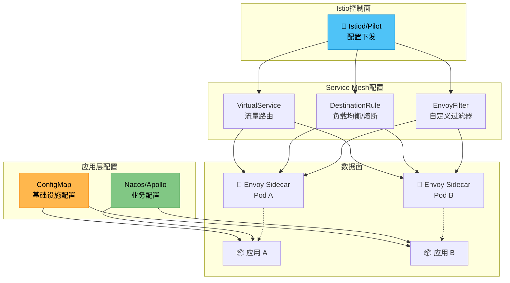

---

## 56.23 GitOps配置管理

GitOps是一种以Git仓库作为配置和基础设施唯一真实来源（Single Source of Truth）的运维实践。通过声明式方式和自动化同步工具，实现配置的版本化管理和自动化部署。

### GitOps工作流程

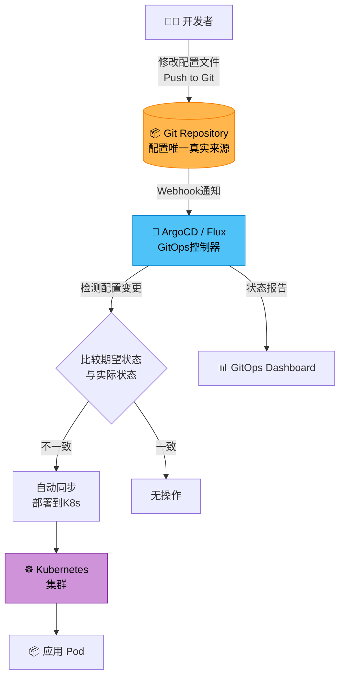

### ArgoCD应用配置示例

```yaml
# ArgoCD Application定义
apiVersion: argoproj.io/v1alpha1
kind: Application
metadata:
  name: order-service-production
  namespace: argocd
spec:
  project: default
  source:
    repoURL: https://github.com/company/k8s-configs
    targetRevision: main
    path: apps/order-service/production
  destination:
    server: https://kubernetes.default.svc
    namespace: production
  syncPolicy:
    automated:
      prune: true        # 自动删除不在Git中的资源
      selfHeal: true     # 自动修复手动修改（配置漂移检测）
    syncOptions:
      - CreateNamespace=true
    retry:
      limit: 5
      backoff:
        duration: 5s
        factor: 2
        maxDuration: 3m
```

### GitOps目录结构

k8s-configs/
├── apps/
│   ├── order-service/
│   │   ├── base/                          # 基础配置
│   │   │   ├── kustomization.yaml
│   │   │   ├── deployment.yaml
│   │   │   ├── service.yaml
│   │   │   ├── configmap.yaml
│   │   │   └── hpa.yaml
│   │   ├── production/                    # 生产环境覆盖
│   │   │   ├── kustomization.yaml
│   │   │   ├── replicas-patch.yaml
│   │   │   └── resource-patch.yaml
│   │   ├── staging/                       # 预发布环境
│   │   │   ├── kustomization.yaml
│   │   │   └── replicas-patch.yaml
│   │   └── dev/                           # 开发环境
│   │       ├── kustomization.yaml
│   │       └── replicas-patch.yaml
│   └── payment-service/
│       └── ...
├── infrastructure/
│   ├── cert-manager/
│   ├── ingress-nginx/
│   └── monitoring/
└── argocd-apps/
    ├── order-service.yaml
    └── payment-service.yaml

### GitOps vs 传统配置管理

| 对比维度 | GitOps | 传统配置中心 | K8s ConfigMap |
|----------|--------|--------------|---------------|
| 配置来源 | Git仓库（唯一真实来源） | 配置中心数据库 | etcd |
| 变更方式 | Git Push + 自动同步 | Portal/API修改 | kubectl apply |
| 版本管理 | Git历史（天然支持） | 配置中心版本管理 | K8s资源版本 |
| 审计追踪 | Git commit history | 审计日志 | K8s审计日志 |
| 回滚能力 | git revert | 配置中心回滚 | kubectl rollout undo |
| 配置漂移检测 | 自动检测并修复 | 不支持 | 不支持 |
| 声明式管理 | ✅ | 部分支持 | ✅ |
| 实时推送 | 不支持（分钟级同步） | 支持（秒级推送） | 不支持 |

### GitOps配置漂移检测与修复

GitOps的核心能力之一是配置漂移检测——自动比较Git中的期望状态与Kubernetes中的实际状态，发现不一致时自动修复。

```yaml
# Flux GitOps配置漂移检测
apiVersion: kustomize.toolkit.fluxcd.io/v1
kind: Kustomization
metadata:
  name: order-service
  namespace: flux-system
spec:
  interval: 5m                           # 每5分钟检查一次
  path: ./apps/order-service/production
  prune: true
  sourceRef:
    kind: GitRepository
    name: k8s-configs
  healthChecks:
    - apiVersion: apps/v1
      kind: Deployment
      name: order-service
      namespace: production
  timeout: 3m
```

---

## 本节小结

本节通过多个实战案例展示了配置中心在不同技术栈和基础设施环境中的应用。Apollo提供了完整的配置管理能力，Nacos通过Namespace和Group提供灵活的隔离，Spring Cloud Config基于Git天然支持版本管理，etcd通过Watch机制提供强一致性推送，Consul提供与服务发现一体化的配置管理。在云原生环境中，K8s ConfigMap/Secrets提供了原生的配置管理能力，Service Mesh通过CRD实现了流量管理配置的声明式管理，GitOps通过Git仓库实现了配置的版本化和自动化管理。选择哪种方案取决于团队的技术栈、基础设施环境、一致性和实时性需求。

---

---

# 第56章 配置中心 常见误区

---

从错误中学习往往比从成功中学习更深刻。配置中心在生产环境中积累了大量事故经验。本节通过分析常见误区和真实生产事故，帮助读者建立正确的配置管理实践，避免重蹈覆辙。

---

## 56.24 配置风暴问题

配置风暴是指配置变更导致大量客户端同时重新拉取配置，对配置中心服务端造成巨大压力的现象。这通常发生在以下场景：

- **全量配置发布**：一次性修改大量配置项，触发所有客户端同时拉取
- **服务重启**：大量服务同时重启时会同时拉取配置
- **配置中心故障恢复**：配置中心短暂不可用后恢复，大量积压的请求同时到达

**解决方案**：客户端拉取配置时添加随机延迟——在收到配置变更通知后，客户端等待一个随机的时间（如0-10秒）再拉取配置，分散服务端压力；配置分批发布——将大量配置变更分批发布，每批之间间隔一定时间；客户端本地缓存——客户端优先使用本地缓存的配置，只有在配置变更通知到达时才拉取新配置；服务端限流——在配置中心服务端添加限流机制，保护后端数据库。

```python
"""防配置风暴的客户端实现"""
import asyncio
import random
import time
import logging

log = logging.getLogger(__name__)


class StormResilientConfigClient:
    """防配置风暴的客户端实现"""

    def __init__(self, server_url: str, cache_dir: str):
        self.server_url = server_url
        self.local_cache = FileCache(cache_dir)
        self.last_fetch_time: dict[str, float] = {}
        self._min_fetch_interval = 1.0  # 最小拉取间隔
        self._jitter_range = (0, 10)    # 随机延迟范围（秒）

    async def on_config_change_notification(self, namespace: str):
        """收到配置变更通知后的处理"""
        # 随机延迟，分散服务端压力
        delay = random.uniform(*self._jitter_range)
        log.info(f"[{namespace}] Delaying fetch by {delay:.1f}s")
        await asyncio.sleep(delay)

        # 检查最小拉取间隔
        last_fetch = self.last_fetch_time.get(namespace, 0)
        if time.time() - last_fetch < self._min_fetch_interval:
            log.info(f"[{namespace}] Skipping fetch (too frequent)")
            return

        # 拉取新配置
        new_config = await self._fetch_config(namespace)
        if new_config:
            self.local_cache.set(namespace, new_config)
            self.last_fetch_time[namespace] = time.time()
```

---

## 56.25 缓存一致性问题

配置中心的缓存一致性是一个容易被忽视的问题。配置变更后，配置中心的内存缓存、客户端的内存缓存和本地文件缓存可能存在不一致。

**误区一：配置中心服务端缓存未及时更新**。配置变更写入数据库后，如果Config Service的内存缓存没有及时更新，客户端可能读到旧的配置。Apollo通过消息机制通知Config Service更新缓存，但如果消息丢失或延迟，缓存可能不一致。

**误区二：客户端缓存过期策略不当**。如果客户端缓存的过期时间太短，会频繁从服务端拉取配置，增加服务端压力。如果过期时间太长，配置变更后客户端长时间使用旧配置。

**误区三：多实例缓存不同步**。同一个服务的多个实例可能在不同时刻拉取到新配置，导致短暂的行为不一致。例如，部分实例使用新的限流阈值，部分实例仍使用旧的限流阈值。

**解决方案**：配置中心服务端缓存应该在配置变更时立即更新，而不是等待缓存过期；客户端缓存应该配合变更通知使用——缓存的值作为降级方案，正常情况下通过变更通知触发更新；对于需要严格一致性的配置，客户端可以在每次使用配置前先向服务端确认版本号。

---

## 56.26 敏感信息泄露风险

配置中心存储了大量敏感信息（如数据库密码、API密钥、证书私钥），如果安全措施不当，可能导致严重的安全事故。

**误区一：敏感配置明文存储**。很多团队为了方便，将数据库密码等敏感配置以明文形式存储在配置中心。如果配置中心数据库被入侵，所有敏感信息都会泄露。

**误区二：配置传输未加密**。配置在客户端和服务端之间通过HTTP明文传输，可能被中间人攻击窃取。

**误区三：访问控制缺失**。所有服务都可以读取所有配置，没有基于Namespace或配置项的访问控制。一个低权限的服务可能读取到其他服务的敏感配置。

**误区四：审计日志不完整**。配置的读取和变更操作没有记录审计日志，发生安全事件时无法追溯。

**解决方案**：所有敏感配置必须加密存储，使用KMS管理加密密钥；配置传输必须使用HTTPS；实现基于角色的访问控制（RBAC），不同服务只能访问自己需要的配置；所有配置操作必须记录审计日志；定期轮换加密密钥和敏感配置（如数据库密码）。

---

## 56.27 过度动态化的设计陷阱

过度动态化是指将太多不需要动态调整的配置放入配置中心，导致系统复杂度增加而收益有限。

**误区一：将所有配置都放入配置中心**。很多配置（如数据库连接池大小、线程池大小）在运行时变更可能导致不稳定的行为。这些配置应该在服务重启时生效，而不是热更新。

**误区二：配置变更没有审批流程**。关键配置（如限流阈值、熔断参数）的变更应该经过审批，而不是任何人都可以直接修改。缺乏审批流程的配置变更可能导致生产事故。

**误区三：配置变更没有回滚机制**。配置变更后如果发现问题，需要能够快速回滚到之前的版本。如果配置中心不支持版本管理和回滚，配置变更的风险会大大增加。

```yaml
# 适合放入配置中心的配置
feature-flags:
  enable-new-checkout: true        # 功能开关
  enable-express-tracking: true    # 功能开关

rate-limiting:
  api-rate-limit: 1000             # 限流阈值
  burst-limit: 2000                # 突发限流

business-rules:
  max-order-items: 50              # 业务规则参数
  order-expire-hours: 24           # 业务规则参数

# 不适合放入配置中心的配置（应该用配置文件或环境变量）
database:
  url: jdbc:mysql://...            # 数据库连接串
  pool-size: 20                    # 连接池大小（重启生效）
  driver-class-name: com.mysql.cj.jdbc.Driver

thread-pool:
  core-size: 10                    # 核心线程数（重启生效）
  max-size: 50                     # 最大线程数（重启生效）
  queue-capacity: 1000             # 队列容量（重启生效）

logging:
  level: INFO                      # 日志级别（极少变更）
  path: /var/log/app               # 日志路径（环境相关）
```

**判断标准**：如果一个配置变更后需要重启服务才能正确生效，或者变更后可能引起服务状态不一致（如连接池重建、线程池调整），那么这个配置就不适合放入配置中心进行热更新。适合热更新的配置通常具有"无状态"特性——变更后新请求立即使用新值，不需要清理旧状态。

---

## 56.28 并发安全与配置竞争

在多运维人员同时修改配置、或自动化脚本并发写入配置的场景下，并发安全是一个容易被忽视但极其重要的问题。

**误区一：多人同时修改同一配置项**。两个运维人员同时在Portal上修改同一个配置项，后提交的会覆盖先提交的修改，导致先提交者的修改丢失。这在紧急修复场景下尤为危险——两个团队同时修改不同配置项，但使用了"覆盖发布"语义，导致后发布者覆盖了先发布者的所有修改。

**误区二：自动化脚本与手动操作并发**。CI/CD流水线自动修改配置的同时，运维人员也在手动修改，两者互相覆盖。

**误区三：配置发布与回滚的竞争**。灰度发布过程中同时进行回滚操作，可能导致配置状态不一致。

**解决方案**：使用乐观锁（Optimistic Locking）机制——每次配置变更时携带版本号，服务端在写入时检查版本号是否与当前版本一致。如果不一致，说明有其他人已经修改了配置，写入失败并提示操作者刷新后重试。

```python
"""配置并发安全：乐观锁机制"""
from dataclasses import dataclass


@dataclass
class ConfigItem:
  """配置项（带版本号）"""
  namespace: str
  key: str
  value: str
  version: int = 1
  updated_by: str = ""
  updated_at: str = ""


@dataclass
class SaveResult:
  success: bool
  new_version: int = 0
  conflict: bool = False
  current_version: int = 0
  current_value: str = ""
  message: str = ""

  @classmethod
  def success(cls, new_version: int):
      return cls(success=True, new_version=new_version)

  @classmethod
  def conflict(cls, current_version: int, current_value: str, message: str):
      return cls(
          success=False, conflict=True,
          current_version=current_version,
          current_value=current_value, message=message
      )


class ConfigEditManager:
  """配置编辑管理（支持乐观锁）"""

  def __init__(self, config_repo):
      self.config_repo = config_repo

  async def save_config(self, namespace: str, key: str,
                        new_value: str, expected_version: int,
                        operator: str) -> SaveResult:
      current = await self.config_repo.get(namespace, key)

      if current.version != expected_version:
          return SaveResult.conflict(
              current_version=current.version,
              current_value=current.value,
              message="配置已被其他人修改，请刷新后重试"
          )

      current.value = new_value
      current.version += 1
      current.updated_by = operator
      current.updated_at = "now"
      await self.config_repo.save(current)

      return SaveResult.success(new_version=current.version)
```

---

## 56.29 配置中心自身的可用性依赖

配置中心作为基础设施，其自身的可用性至关重要。但如果配置中心成为所有服务的强依赖，配置中心的任何故障都会影响所有服务。

**误区：服务启动时强依赖配置中心**。如果服务启动时必须从配置中心获取配置，配置中心不可用时服务就无法启动。这将配置中心的可用性与所有服务的可用性绑定在一起。

**解决方案**：本地缓存优先——服务启动时优先使用本地文件缓存的配置，配置中心作为更新源而非唯一来源；默认值兜底——关键配置在代码中定义默认值，当配置中心和本地缓存都不可用时使用默认值；配置预热——在服务启动阶段，如果配置中心不可用，使用预热的缓存配置继续启动，后台异步重试拉取最新配置。

```python
"""弹性配置加载器"""
import asyncio
from typing import Optional


class ResilientConfigLoader:
    """弹性配置加载器 - 多级降级"""

    def __init__(self, config_center, local_cache, defaults: dict):
        self.config_center = config_center
        self.local_cache = local_cache
        self.defaults = defaults

    async def load_config(self, key: str) -> str:
        # 优先级：配置中心 > 本地缓存 > 默认值
        try:
            value = await asyncio.wait_for(
                self.config_center.get_config(key),
                timeout=5.0
            )
            if value:
                self.local_cache.set(key, value)
                return value
        except Exception:
            pass

        # 降级：本地缓存
        cached = self.local_cache.get(key)
        if cached:
            return cached

        # 最终降级：默认值
        return self.defaults.get(key, "")
```

---

## 56.30 配置漂移检测与预防

配置漂移（Configuration Drift）是指系统的实际配置状态与期望的配置状态逐渐偏离的现象。配置漂移可能由手动修改、自动化脚本错误、环境差异等多种原因引起。

### 配置漂移的常见原因

| 漂移原因 | 描述 | 风险等级 |
|----------|------|----------|
| 手动修改 | 运维人员直接在生产环境手动修改配置 | 高 |
| 自动化不完整 | 部分配置通过自动化管理，部分通过手动管理 | 高 |
| 环境差异 | 不同环境的配置不一致，但应该一致 | 中 |
| 遗忘变更 | 修改了配置但没有记录或同步到其他环境 | 中 |
| 回滚不完整 | 回滚时只回滚了部分配置 | 高 |

### 配置漂移检测方案

```python
"""配置漂移检测器"""
import hashlib
import asyncio
from datetime import datetime
from typing import Dict, List
from dataclasses import dataclass


@dataclass
class DriftDetectionResult:
    """漂移检测结果"""
    key: str
    expected_value: str
    actual_value: str
    drift_type: str  # "missing", "mismatch", "extra"
    detected_at: datetime


class ConfigDriftDetector:
    """配置漂移检测器"""

    def __init__(self, config_center, git_source=None):
        self.config_center = config_center
        self.git_source = git_source
        self._baseline: Dict[str, str] = {}

    def set_baseline(self, configs: Dict[str, str]):
        """设置配置基线（期望状态）"""
        self._baseline = configs.copy()

    async def detect_drift(self) -> List[DriftDetectionResult]:
        """检测配置漂移"""
        results = []

        # 获取实际状态
        actual = await self.config_center.get_all_configs()

        # 检查每个配置项
        for key, expected_value in self._baseline.items():
            if key not in actual:
                results.append(DriftDetectionResult(
                    key=key,
                    expected_value=expected_value,
                    actual_value="",
                    drift_type="missing",
                    detected_at=datetime.utcnow()
                ))
            elif actual[key] != expected_value:
                results.append(DriftDetectionResult(
                    key=key,
                    expected_value=expected_value,
                    actual_value=actual[key],
                    drift_type="mismatch",
                    detected_at=datetime.utcnow()
                ))

        # 检查多余的配置项
        for key in actual:
            if key not in self._baseline:
                results.append(DriftDetectionResult(
                    key=key,
                    expected_value="",
                    actual_value=actual[key],
                    drift_type="extra",
                    detected_at=datetime.utcnow()
                ))

        return results

    async def auto_remediate(self, results: List[DriftDetectionResult]):
        """自动修复配置漂移"""
        for result in results:
            if result.drift_type == "missing":
                # 补充缺失的配置
                await self.config_center.set_config(
                    result.key, result.expected_value
                )
            elif result.drift_type == "mismatch":
                # 恢复期望值
                await self.config_center.set_config(
                    result.key, result.expected_value
                )
            # "extra" 类型的配置项通常不自动删除，需要人工确认
```

### 配置漂移预防最佳实践

| 预防措施 | 实施方式 | 效果 |
|----------|----------|------|
| GitOps声明式管理 | 所有配置存储在Git仓库，自动同步 | 根本解决漂移 |
| 定期漂移检测 | 每5-15分钟比较期望状态和实际状态 | 及时发现漂移 |
| 自动修复 | 检测到漂移后自动恢复期望状态 | 减少人工干预 |
| 变更审计 | 所有配置变更通过自动化流程，禁止手动修改 | 减少漂移来源 |
| 配置锁定 | 对关键配置实施锁定，防止意外修改 | 防止误操作 |

---

## 56.31 生产环境配置事故案例

### 案例一：配置风暴导致的雪崩效应

**事故背景**：某电商平台在大促前进行全量配置变更（修改了50+个配置项），触发所有2000个服务实例同时拉取配置。

**事故过程**：
1. 运维人员在Apollo上发布了50个配置项的变更
2. 所有2000个实例同时收到长轮询通知
3. 2000个实例同时发起配置拉取请求
4. Config Service实例被打满，数据库连接池耗尽
5. 新的服务实例启动时无法拉取配置，启动失败
6. 部分已运行的服务实例长轮询超时后重试，加重服务端压力

**影响**：配置中心不可用持续15分钟，影响了大促前的准备流程。

**根因分析**：全量配置变更没有分批发布，客户端没有随机延迟机制，服务端没有限流保护。

**修复措施**：
- 客户端添加0-10秒的随机延迟
- 服务端添加限流机制（每秒最多处理500个配置拉取请求）
- 运维流程要求：大批量配置变更必须分批发布，每批间隔至少60秒

### 案例二：配置漂移导致的线上故障

**事故背景**：某SaaS平台在预发布环境验证了一个限流配置变更（QPS从1000调整为500），但发布到生产环境时忘记修改生产环境的配置。

**事故过程**：
1. 预发布环境的限流配置变更验证通过
2. 运维人员手动修改了预发布环境的Apollo配置
3. 忘记在生产环境也修改该配置
4. 预发布环境的配置通过合并流程被同步到生产环境
5. 生产环境的限流QPS意外从1000降为500
6. 大量正常请求被限流拒绝

**影响**：限流误触发导致约30%的API请求失败，持续20分钟。

**根因分析**：配置变更没有在生产环境通过正式的发布流程操作，手动修改配置后没有验证实际生效的值。

**修复措施**：
- 禁止直接在Portal上修改生产环境配置
- 配置变更必须通过CI/CD流水线发布
- 添加配置变更后的自动化验证（比较期望值和实际值）

### 案例三：敏感配置泄露

**事故背景**：某金融公司的Nacos配置中心中存储了数据库密码，但使用明文存储。

**事故过程**：
1. 开发人员在本地Nacos测试环境中查看配置
2. 将配置截图发送到技术支持群中
3. 截图中包含数据库密码明文
4. 群中多人可以看到该截图
5. 数据库密码被泄露

**影响**：数据库密码泄露，需要紧急轮换所有相关密码。

**根因分析**：敏感配置没有加密存储，也没有对敏感配置的访问进行标记和告警。

**修复措施**：
- 所有敏感配置使用AES-256-GCM加密存储
- 集成KMS进行密钥管理
- 敏感配置项标记为"SENSITIVE"，在Portal上显示为掩码
- 敏感配置的读取操作触发审计日志告警

### 案例四：配置中心HA设计缺陷

**事故背景**：某互联网公司的Apollo Config Service部署了3个实例，但共享同一个MySQL数据库。MySQL主从切换时Config Service全部不可用。

**事故过程**：
1. MySQL主库发生故障
2. MySQL自动切换到从库
3. Config Service的3个实例同时检测到数据库异常
4. Config Service内存缓存已过期，需要从数据库重新加载
5. 所有Config Service实例同时尝试连接新主库
6. 新主库在启动瞬间负载过高，无法响应
7. Config Service持续不可用，客户端长轮询超时

**影响**：配置中心不可用10分钟，客户端使用本地缓存运行，但新配置无法下发。

**根因分析**：Config Service没有在数据库切换时优雅降级，内存缓存的过期策略不合理。

**修复措施**：
- Config Service的内存缓存设置为不过期（除非主动刷新）
- 数据库故障时Config Service继续使用内存缓存服务
- 添加数据库连接重试机制（指数退避，初始延迟5秒）
- 定期进行故障注入测试

---

## 本节小结

本节总结了配置中心使用中的常见误区和生产事故。配置风暴、缓存一致性、敏感信息泄露、过度动态化、并发安全、可用性依赖和配置漂移，这些问题是配置中心在生产环境中最常见的挑战。通过真实事故案例的分析，我们可以看到：配置变更的分批发布和客户端随机延迟是防止配置风暴的关键；加密存储和访问控制是防止敏感信息泄露的必要措施；自动化配置管理（GitOps）是防止配置漂移的根本方案。在架构设计阶段就应该充分考虑这些问题，通过客户端缓存降级、配置加密、乐观锁、漂移检测等技术手段来构建健壮的配置管理体系。

---

---

# 第56章 配置中心 练习方法

---

理论和实战的结合需要通过练习来巩固。本节提供了五个递进式的练习，从搭建一个简易配置中心到验证高可用能力，帮助读者深入理解配置中心的核心原理和工程实践。

---

## 56.32 从零搭建一个简易配置中心

第一个练习是从零实现一个简易的配置中心，包含服务端和客户端两部分。

**基础练习**：实现一个基于HTTP的配置服务，支持配置的CRUD操作。配置存储在SQLite或内存中。实现一个简单的客户端SDK，支持从服务端拉取配置和本地缓存。

核心功能要求：
- `POST /configs` —— 创建或更新配置
- `GET /configs/{namespace}/{key}` —— 获取配置
- `GET /configs/{namespace}` —— 获取Namespace下所有配置
- `DELETE /configs/{namespace}/{key}` —— 删除配置

**进阶练习**：为配置服务添加长轮询机制。实现`GET /notifications`端点，支持客户端发送当前配置的MD5，服务端hold住请求直到配置变更或超时。

**高级练习**：添加配置版本管理。每次配置变更创建一个新版本，支持查看历史版本列表和回滚到指定版本。实现简单的Web管理界面。

**测试要点**：基本CRUD、长轮询超时和变更通知、并发安全（多个客户端同时修改同一个配置）。

---

## 56.33 实现配置变更的长轮询与推送

第二个练习是深入实现配置变更的推送机制，对比长轮询和WebSocket两种方式。

**长轮询完善**：重点处理以下场景——客户端超时重试、配置变更立即通知、并发轮询（多个客户端同时长轮询）、网络异常恢复。

**WebSocket推送实现**：

```python
"""WebSocket配置推送服务端"""
import asyncio
import websockets
import json


class WebSocketConfigServer:
    """WebSocket配置推送服务端"""

    def __init__(self, config_store):
        self.config_store = config_store
        self.connections: dict[str, set] = {}

    async def handler(self, websocket, path):
        """处理WebSocket连接"""
        register_msg = await websocket.recv()
        register = json.loads(register_msg)
        namespace = register["namespace"]

        if namespace not in self.connections:
            self.connections[namespace] = set()
        self.connections[namespace].add(websocket)

        try:
            async for message in websocket:
                data = json.loads(message)
                if data.get("type") == "ping":
                    await websocket.send(json.dumps({"type": "pong"}))
        finally:
            self.connections[namespace].discard(websocket)

    async def notify_change(self, namespace: str, key: str, new_value: str):
        """通知所有监听该Namespace的客户端"""
        if namespace in self.connections:
            message = json.dumps({
                "type": "config_change",
                "namespace": namespace,
                "key": key,
                "value": new_value
            })
            dead_connections = set()
            for ws in self.connections[namespace]:
                try:
                    await ws.send(message)
                except websockets.exceptions.ConnectionClosed:
                    dead_connections.add(ws)
            self.connections[namespace] -= dead_connections


class WebSocketConfigClient:
    """WebSocket配置推送客户端"""

    def __init__(self, server_url: str, namespace: str):
        self.server_url = server_url
        self.namespace = namespace
        self.config_cache: dict[str, str] = {}
        self.change_callbacks: list = []

    async def connect(self):
        """建立WebSocket连接并监听配置变更"""
        async with websockets.connect(self.server_url) as ws:
            await ws.send(json.dumps({
                "type": "register",
                "namespace": self.namespace
            }))

            async for message in ws:
                data = json.loads(message)
                if data["type"] == "config_change":
                    key = data["key"]
                    value = data["value"]
                    old_value = self.config_cache.get(key)
                    self.config_cache[key] = value
                    for callback in self.change_callbacks:
                        await callback(key, old_value, value)
```

**对比实验**：在同一配置变更场景下，分别使用长轮询和WebSocket，测量从配置变更到客户端收到通知的延迟。同时监测服务端的连接数、内存占用和CPU使用率。

---

## 56.34 配置灰度发布实验

第三个练习是实现配置的灰度发布功能，并验证灰度策略的正确性。

**基础练习**：实现基于IP的灰度发布。创建灰度发布时指定允许的IP列表，只有匹配IP的客户端才能获取到新配置。

**进阶练习**：实现基于百分比的灰度发布。使用客户端IP的哈希值实现确定性百分比灰度——同一个IP每次都会得到相同的结果。

**高级练习**：实现灰度发布的完整生命周期（创建 → 验证 → 全量发布或回滚）。在灰度期间监控匹配灰度规则的实例的运行状态，如果发现异常自动触发回滚。

**测试要点**：灰度准确性、灰度一致性（同一客户端不会忽新忽旧）、全量发布、灰度回滚。

---

## 56.35 配置加密实践

第四个练习是实现配置的加密存储和传输。

**基础练习**：实现配置值的AES加密和解密。在配置写入时自动加密，在读取时自动解密。

**进阶练习**：集成KMS进行密钥管理。支持密钥轮换。

**高级练习**：实现配置的RBAC访问控制。不同角色（管理员、开发者、只读用户）对不同Namespace有不同的读写权限。记录所有配置操作的审计日志。

```python
"""安全配置服务"""
class SecureConfigService:
    """安全配置服务"""

    def __init__(self, config_repo, encryptor, acl_manager, audit_logger):
        self.config_repo = config_repo
        self.encryptor = encryptor
        self.acl = acl_manager
        self.audit = audit_logger

    async def get_config(self, namespace: str, key: str,
                         operator: str) -> str:
        # 检查权限
        if not await self.acl.check_read(namespace, operator):
            raise PermissionDenied(namespace, key, operator)

        # 读取加密的配置
        encrypted_value = await self.config_repo.get(namespace, key)
        if encrypted_value is None:
            return None

        # 解密
        plaintext = await self.encryptor.decrypt(encrypted_value, namespace)

        # 记录审计日志
        await self.audit.log_read(namespace, key, operator)

        return plaintext

    async def set_config(self, namespace: str, key: str, value: str,
                         operator: str, sensitive: bool = False):
        # 检查权限
        if not await self.acl.check_write(namespace, operator):
            raise PermissionDenied(namespace, key, operator)

        # 加密敏感配置
        if sensitive:
            stored_value = await self.encryptor.encrypt(value, namespace)
        else:
            stored_value = value

        old_value = await self.config_repo.get(namespace, key)
        await self.config_repo.set(namespace, key, stored_value)

        # 记录审计日志
        await self.audit.log_change(
            namespace, key,
            hash(old_value) if old_value else None,
            hash(stored_value),
            operator, "配置更新"
        )
```

**测试要点**：加密正确性、访问控制、审计完整性、密钥轮换。

---

## 56.36 配置中心高可用验证

第五个练习是验证配置中心在各种故障场景下的高可用能力。

**故障场景测试**：
- 配置中心服务端不可用 → 客户端使用本地缓存继续运行
- 数据库不可用 → Config Service使用内存缓存提供服务
- 网络分区 → 客户端降级策略

**性能测试**：
- 并发配置拉取 → 测量配置中心的吞吐量和延迟
- 配置变更推送 → 在大量客户端监听的情况下测量推送延迟
- 内存占用 → 监控配置中心在大量配置和大量客户端场景下的内存

```python
"""配置中心高可用测试"""
async def ha_test_config_center():
    """配置中心高可用测试"""
    # 场景1：服务端不可用，客户端使用缓存
    client = ConfigClient("http://config-center:8080")

    config = await client.get_config("payment.timeout")
    assert config == "5000"

    # 模拟服务端不可用
    await stop_config_server()

    # 客户端仍能获取配置（使用缓存）
    config = await client.get_config("payment.timeout")
    assert config == "5000"  # 缓存值

    # 恢复服务端
    await start_config_server()

    # 客户端能正常获取新配置
    await update_config("payment.timeout", "3000")
    await asyncio.sleep(65)  # 等待长轮询周期
    config = await client.get_config("payment.timeout")
    assert config == "3000"
```

---

## 本节小结

本节提供了五个递进式的练习，覆盖了配置中心的核心实践技能。从简易配置中心的搭建，到长轮询和WebSocket推送机制的实现，再到灰度发布、配置加密和高可用验证。建议按照顺序完成练习，每个练习都在前一个的基础上增加复杂度和实战性。

---

---

# 第56章 配置中心 本章小结

---

## 核心概念回顾

本章系统性地探讨了配置中心的架构设计、核心机制和工程实践。以下是对本章核心概念的回顾：

**配置中心的架构模型** 由四部分组成：Config Service负责配置的存储和读取，Admin Service负责配置的变更操作，Portal提供Web管理界面，客户端SDK嵌入到业务应用中。这种分层架构实现了读写分离和职责分离，便于扩展和维护。

**配置变更的推送机制** 是配置中心的核心能力。长轮询是目前最主流的实现方式——客户端发送请求，服务端hold住直到配置变更或超时。WebSocket和gRPC流提供更实时的推送但实现复杂度更高。选择哪种机制取决于实时性要求和网络环境。

**Apollo配置中心** 是国内使用最广泛的配置中心。它由Config Service、Admin Service、Portal和Java SDK四部分组成，支持配置的实时推送、灰度发布、版本管理和多环境管理。Apollo的设计思想——读写分离、长轮询推送、本地缓存降级——是配置中心领域的经典参考。

**Nacos配置中心** 通过Namespace/Group/DataId三级结构提供了灵活的配置隔离能力。Nacos 2.0引入gRPC协议实现了更高效的配置推送。Nacos同时提供注册中心和配置中心功能，减少了基础设施组件的数量。

**Spring Cloud Config** 基于Git存储配置，天然支持版本管理和代码审查。它与Spring Cloud生态深度集成，适合使用Spring Cloud技术栈的团队。

**etcd和Consul KV** 是通用的分布式键值存储，也可以作为轻量级配置中心。etcd提供强一致性的Watch机制，Consul提供与服务发现一体化的配置管理。

**Kubernetes ConfigMap/Secrets** 是云原生环境中的原生配置管理方案。ConfigMap和Secrets将配置数据与容器镜像解耦，但缺乏灰度发布、版本管理和实时推送等高级能力。生产实践中通常与专业配置中心结合使用。

**Service Mesh配置管理** 在Istio中通过VirtualService、DestinationRule和EnvoyFilter等CRD实现流量管理配置的声明式管理，配置通过xDS协议自动下发到Sidecar代理。

**GitOps配置管理** 以Git仓库作为配置的唯一真实来源，通过ArgoCD/Flux等工具实现配置的自动化同步和漂移检测。

---

## 方案选型框架

| 方案 | 实时性 | 管理功能 | 运维成本 | 一致性 | 适用场景 |
|------|--------|---------|---------|--------|----------|
| Apollo | 高（长轮询） | 完整 | 中高 | 最终一致 | Java微服务、大型团队 |
| Nacos | 高（长轮询/gRPC） | 完整 | 中 | 最终一致 | Java微服务、注册中心一体化 |
| Spring Cloud Config | 中（手动/Bus刷新） | 基础 | 低 | 基于Git | Spring Cloud生态 |
| etcd | 高（Watch） | 弱 | 低 | 强一致 | K8s环境、轻量级配置 |
| Consul KV | 中（Blocking Query） | 基础 | 低 | 最终一致 | 服务发现一体化 |
| K8s ConfigMap | 低（kubelet轮询） | 无 | 低 | 最终一致 | K8s基础设施配置 |
| Istio CRD | 高（xDS推送） | 流量管理 | 中 | 最终一致 | Service Mesh流量配置 |
| GitOps | 低（分钟级同步） | 完整 | 中 | 基于Git | 声明式配置管理 |

**选型建议**：

- **Java微服务团队**：首选Apollo（功能完整）或Nacos（注册中心一体化）
- **Spring Cloud生态**：Spring Cloud Config + Bus
- **Kubernetes环境**：ConfigMap（基础设施配置）+ Nacos/Apollo（业务配置）
- **Service Mesh环境**：Istio CRD（流量配置）+ 外部配置中心（业务配置）
- **追求声明式管理**：GitOps（ArgoCD/Flux）
- **轻量级需求**：etcd或Consul KV
- **强一致性需求**：etcd（基于Raft协议）

---

## 配置管理的最佳实践总结

| 实践领域 | 最佳实践 |
|----------|----------|
| 配置分类 | 只将真正需要动态调整的配置放入配置中心 |
| 隔离策略 | 严格环境隔离，Namespace隔离环境，Group隔离业务 |
| 变更流程 | 灰度发布 → 验证 → 全量发布 → 监控 |
| 安全保障 | 加密存储、HTTPS传输、RBAC访问控制、审计日志 |
| 高可用 | 本地缓存降级、多级降级（内存→文件→默认值）、定期同步 |
| 监控告警 | 请求延迟、推送延迟、缓存命中率、错误率、连接数 |
| 防配置风暴 | 随机延迟、分批发布、服务端限流 |
| 防配置漂移 | GitOps声明式管理、定期漂移检测、自动修复 |
| 性能优化 | 批量拉取、连接复用、内存缓存、压缩传输 |

---

## 延伸阅读

**官方文档**：Apollo官方文档（https://www.apolloconfig.com/）、Nacos官方文档（https://nacos.io/）、Spring Cloud Config参考文档。

**架构设计**：携程Apollo配置中心的设计文档是理解配置中心架构设计的优秀参考资料。它详细介绍了Apollo的架构决策、技术选型和性能优化策略。

**最佳实践**：最小化配置项数量——只将真正需要动态调整的配置放入配置中心；配置项命名规范——使用统一的命名规范便于管理和搜索；配置分类管理——按功能模块组织配置；配置变更流程——建立规范的配置变更流程，包括审批、灰度和回滚。

---

## 关键要点总结

配置中心是微服务架构的基础设施，其设计和使用直接影响系统的可维护性和稳定性。在选择配置中心方案时，需要根据团队技术栈、功能需求和运维能力综合考虑。无论选择哪种方案，本地缓存降级、配置加密、访问控制和版本管理都是必须具备的核心能力。

配置中心的设计原则是：**宁可使用过期的缓存配置，也不能因为配置中心不可用导致服务不可用**。安全性方面，所有敏感配置必须加密存储，所有配置操作必须记录审计日志。配置变更应该遵循灰度发布的原则，降低变更风险。

在云原生时代，配置管理正在向声明式、自动化、可观测的方向演进。GitOps提供了声明式的配置管理范式，Service Mesh提供了基础设施层面的流量管理配置，Kubernetes ConfigMap/Secrets提供了原生的配置管理能力。将这些技术与传统的配置中心结合使用，可以构建出更加健壮和灵活的配置管理体系。
