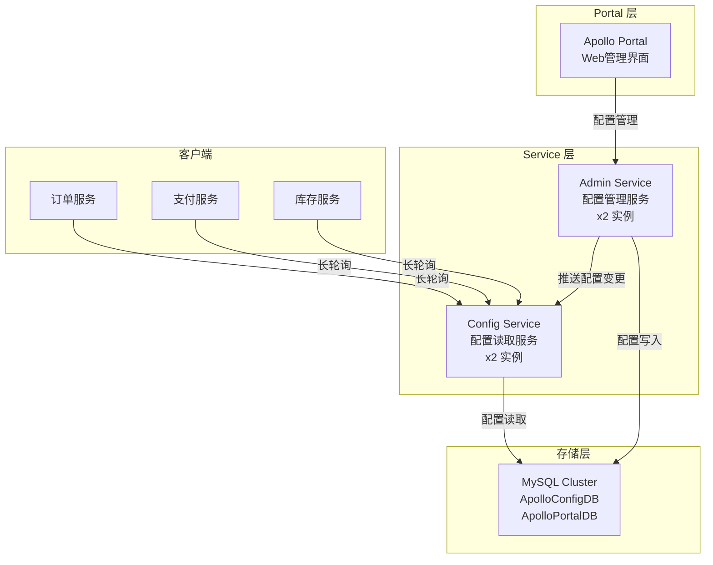
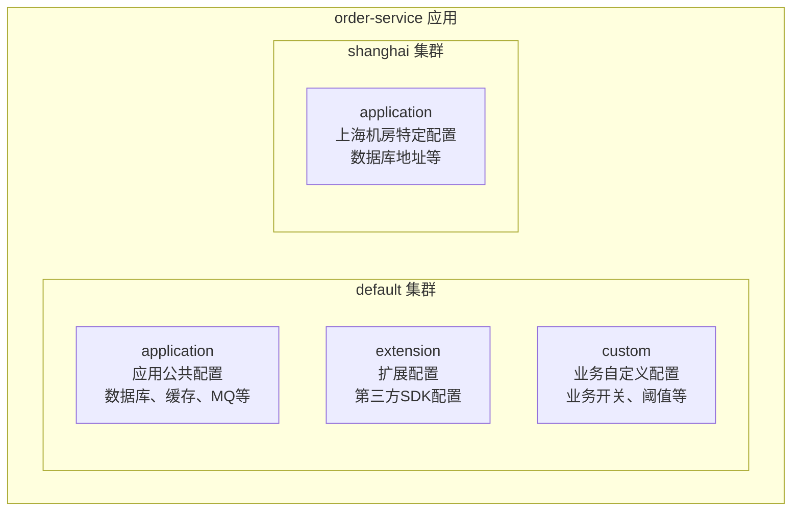
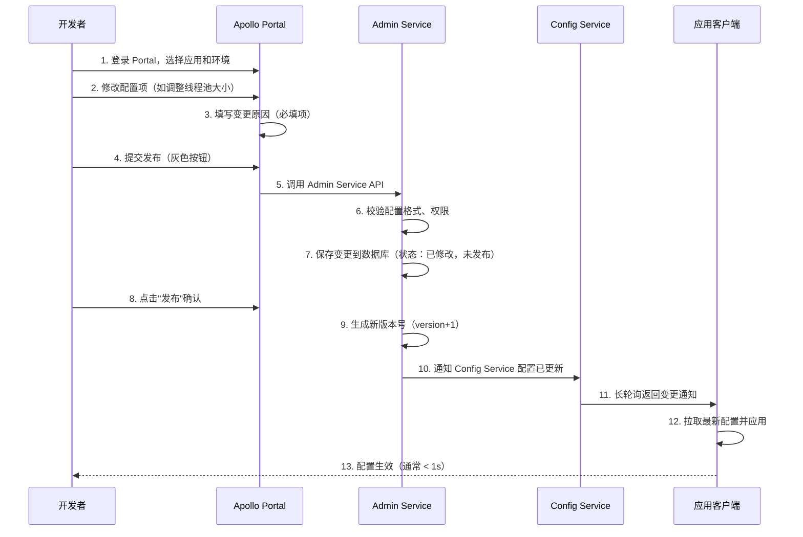
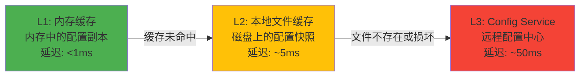

## 案例一：Apollo配置中心实战

> 本案例以某互联网公司的「订单交易系统」为背景，完整演示 Apollo 配置中心从零搭建到生产级应用的全过程。涵盖环境搭建、多环境配置管理、配置发布全流程、灰度发布实操、版本回滚演练、配置加密与安全管控六大核心场景。

***

### 1. 案例背景与业务场景

#### 1.1 业务概况

「订单交易系统」是一个典型的电商业务中台，日均订单量约 500 万笔，高峰期 QPS 可达 3 万。系统由 12 个微服务组成，部署在 3 套环境（DEV / SIT / PROD）中，共有约 80 个服务实例。

#### 1.2 配置管理痛点

在引入 Apollo 之前，团队面临以下典型问题：

| 痛点 | 具体表现 | 造成的后果 |
|------|---------|-----------|
| 配置与代码耦合 | 数据库连接池、超时时间等写死在 application.yml | 每次调参都要走 CI/CD 重新部署 |
| 配置分散管理 | 各服务的配置文件散落在 Git 仓库的不同分支 | 跨服务修改一个公共参数需要改多处 |
| 敏感信息泄露 | 数据库密码、API Key 明文写在代码仓库中 | 存在安全隐患，审计无法通过 |
| 无法动态调参 | 大促前需要紧急调大连接池，只能重启服务 | 发布窗口紧张，每次重启影响用户 |
| 无变更追溯 | 配置改错后无法快速定位谁改了什么 | 故障排查耗时长，平均恢复时间 > 30 分钟 |
| 缺少灰度机制 | 配置变更直接全量生效 | 配置错误影响全部实例，故障爆炸半径大 |

#### 1.3 为什么选择 Apollo

经过技术选型对比（详见本章概览中的方案对比表），团队选择 Apollo 的核心理由：

1. **完善的灰度发布能力**：支持按 IP、标签、百分比三种灰度策略，符合团队「先灰度、再全量」的变更流程
2. **成熟的版本管理**：每次变更自动记录版本号、变更人、变更原因，支持一键回滚到任意历史版本
3. **完善的权限控制**：基于 RBAC 的权限模型，配置的修改、发布、审批流程可配置
4. **本地缓存容灾**：即使配置中心不可用，客户端仍可使用本地缓存正常运行
5. **丰富的客户端 SDK**：原生支持 Spring Boot，集成成本极低

***

### 2. 环境搭建

#### 2.1 架构总览

Apollo 的生产级部署需要以下组件协同工作：



Apollo 采用三层架构设计：

- **Portal 层**：Web 管理界面，提供配置的增删改查、灰度发布、版本管理等操作入口
- **Service 层**：分为 Admin Service（负责配置的管理和持久化）和 Config Service（负责配置的读取和推送），两者的分离使得读写可以独立扩展
- **存储层**：两个 MySQL 数据库 —— ApolloConfigDB 存储配置数据，ApolloPortalDB 存储用户权限、环境信息等管理数据

#### 2.2 快速搭建开发环境

##### 方案一：Docker Compose 一键部署（推荐）

```yaml
# docker-compose.yml
version: '3.8'

services:
  # MySQL 数据库
  apollo-mysql:
    image: mysql:8.0
    container_name: apollo-mysql
    environment:
      MYSQL_ROOT_PASSWORD: apollo2024
      MYSQL_DATABASE: ApolloConfigDB
    ports:
      - "3306:3306"
    volumes:
      - ./sql/apolloconfigdb.sql:/docker-entrypoint-initdb.d/apolloconfigdb.sql
      - ./sql/apolloportaldb.sql:/docker-entrypoint-initdb.d/apolloportaldb.sql
      - mysql-data:/var/lib/mysql
    command: >
      --character-set-server=utf8mb4
      --collation-server=utf8mb4_unicode_ci
      --default-authentication-plugin=mysql_native_password

  # Eureka 注册中心（服务发现与注册）
  apollo-eureka:
    image: springcloud/eureka:2.3.2.RELEASE
    container_name: apollo-eureka
    environment:
      SPRING_PROFILES_ACTIVE: default
    ports:
      - "8761:8761"
    volumes:
      - eureka-data:/var/lib/eureka
    command: >
      --eureka.client.register-with-eureka=false
      --eureka.client.fetch-registry=false
      --server.wait-time-in-ms-when-sync-empty=0
    healthcheck:
      test: ["CMD", "curl", "-f", "http://localhost:8761/actuator/health"]
      interval: 15s
      timeout: 5s
      retries: 5

  # Config Service（配置读取服务）
  apollo-configservice:
    image: apolloconfig/apollo-configservice:2.4.0
    container_name: apollo-configservice
    environment:
      SPRING_DATASOURCE_URL: jdbc:mysql://apollo-mysql:3306/ApolloConfigDB?characterEncoding=utf8&amp;serverTimezone=Asia/Shanghai
      SPRING_DATASOURCE_USERNAME: root
      SPRING_DATASOURCE_PASSWORD: apollo2024
      APOLLO_EUREKA_SERVICE_URL: http://localhost:8761/eureka/
      EUREKA_DEFAULT_ZONE: http://localhost:8761/eureka/
    ports:
      - "8080:8080"
    depends_on:
      - apollo-mysql

  # Admin Service（配置管理服务）
  apollo-adminservice:
    image: apolloconfig/apollo-adminservice:2.4.0
    container_name: apollo-adminservice
    environment:
      SPRING_DATASOURCE_URL: jdbc:mysql://apollo-mysql:3306/ApolloConfigDB?characterEncoding=utf8&amp;serverTimezone=Asia/Shanghai
      SPRING_DATASOURCE_USERNAME: root
      SPRING_DATASOURCE_PASSWORD: apollo2024
      APOLLO_EUREKA_SERVICE_URL: http://localhost:8761/eureka/
      EUREKA_DEFAULT_ZONE: http://localhost:8761/eureka/
    ports:
      - "8090:8090"
    depends_on:
      - apollo-mysql

  # Portal（管理界面）
  apollo-portal:
    image: apolloconfig/apollo-portal:2.4.0
    container_name: apollo-portal
    environment:
      SPRING_DATASOURCE_URL: jdbc:mysql://apollo-mysql:3306/ApolloPortalDB?characterEncoding=utf8&amp;serverTimezone=Asia/Shanghai
      SPRING_DATASOURCE_USERNAME: root
      SPRING_DATASOURCE_PASSWORD: apollo2024
      APOLLO_EUREKA_SERVICE_URL: http://localhost:8761/eureka/
      EUREKA_DEFAULT_ZONE: http://localhost:8761/eureka/
      APOLLO_PORTAL_ENVS: dev,sit,prod
      APOLLO_META_SERVICE_URL_dev: http://apollo-configservice:8080
      APOLLO_META_SERVICE_URL_sit: http://apollo-configservice-sit:8080
      APOLLO_META_SERVICE_URL_prod: http://apollo-configservice-prod:8080
    ports:
      - "8070:8070"
    depends_on:
      - apollo-configservice
      - apollo-adminservice

volumes:
  mysql-data:
  eureka-data:
```

启动命令：

```bash
# 拉取镜像并启动
docker-compose up -d

# 检查所有服务状态
docker-compose ps

# 初始化 Portal 环境（首次启动后执行）
curl -X POST http://localhost:8070/openapi/v1/envs \
  -H 'Content-Type: application/json' \
  -d '{"envs": ["dev", "sit", "prod"]}'
```

启动后访问 `http://localhost:8070`，使用默认账号 `apollo / admin` 登录。

##### 方案二：本地源码编译

```bash
# 1. 克隆代码
git clone https://github.com/ctripcorp/apollo.git
cd apollo

# 2. 创建两个数据库
mysql -u root -p < scripts/sql/apolloconfigdb.sql
mysql -u root -p < scripts/sql/apolloportaldb.sql

# 3. 配置数据库连接
# 修改各模块的 application.yml 中的数据库连接信息

# 4. 编译打包
mvn clean package -DskipTests

# 5. 按顺序启动
# 5.1 启动 Config Service
java -jar apollo-configservice/target/apollo-configservice-*.jar

# 5.2 启动 Admin Service
java -jar apollo-adminservice/target/apollo-adminservice-*.jar

# 5.3 启动 Portal
java -jar apollo-portal/target/apollo-portal-*.jar
```

#### 2.3 数据库初始化要点

ApolloConfigDB 包含以下核心表：

```sql
-- App 表：应用注册信息
CREATE TABLE `App` (
  `Id` int(10) unsigned NOT NULL AUTO_INCREMENT,
  `AppId` varchar(500) NOT NULL DEFAULT '' COMMENT '应用AppId',
  `AppName` varchar(500) NOT NULL DEFAULT '' COMMENT '应用名称',
  `OwnerName` varchar(500) NOT NULL DEFAULT '' COMMENT '部门Owner',
  `OwnerEmail` varchar(500) NOT NULL DEFAULT '' COMMENT 'Owner邮箱',
  `Uid` varchar(500) NOT NULL DEFAULT '' COMMENT '应用Owner的账号',
  PRIMARY KEY (`Id`),
  UNIQUE KEY `AppId_UNIQUE` (`AppId`(64))
) ENGINE=InnoDB DEFAULT CHARSET=utf8mb4 COMMENT='应用信息表';

-- Cluster 表：集群信息（如 default、shanghai、beijing）
CREATE TABLE `Cluster` (
  `Id` int(10) unsigned NOT NULL AUTO_INCREMENT,
  `Name` varchar(500) NOT NULL DEFAULT '' COMMENT '集群名称',
  `AppId` varchar(500) NOT NULL DEFAULT '' COMMENT '应用AppId',
  `ParentClusterName` varchar(500) NOT NULL DEFAULT 'default' COMMENT '父集群',
  `DataChange_CreatedBy` varchar(128) NOT NULL DEFAULT '' COMMENT '创建人邮箱前缀',
  PRIMARY KEY (`Id`)
) ENGINE=InnoDB DEFAULT CHARSET=utf8mb4 COMMENT='集群表';

-- Namespace 表：命名空间
CREATE TABLE `Namespace` (
  `Id` int(10) unsigned NOT NULL AUTO_INCREMENT,
  `AppId` varchar(500) NOT NULL DEFAULT '' COMMENT '应用AppId',
  `ClusterName` varchar(500) NOT NULL DEFAULT 'default' COMMENT '集群名称',
  `NamespaceName` varchar(500) NOT NULL DEFAULT '' COMMENT '命名空间名称',
  `Comment` varchar(500) NOT NULL DEFAULT '' COMMENT '备注',
  PRIMARY KEY (`Id`)
) ENGINE=InnoDB DEFAULT CHARSET=utf8mb4 COMMENT='命名空间表';

-- Item 表：配置项
CREATE TABLE `Item` (
  `Id` int(10) unsigned NOT NULL AUTO_INCREMENT COMMENT '自增Id',
  `NamespaceId` int(10) unsigned NOT NULL DEFAULT 0 COMMENT '命名空间Id',
  `Key` varchar(128) NOT NULL DEFAULT '' COMMENT '配置项Key',
  `LineNum` int(10) unsigned NOT NULL DEFAULT 0 COMMENT '行号',
  `Comment` varchar(1024) NOT NULL DEFAULT '' COMMENT '备注',
  `Value` text COMMENT '配置项Value',
  `DataChange_LastTime` timestamp NOT NULL DEFAULT CURRENT_TIMESTAMP ON UPDATE CURRENT_TIMESTAMP COMMENT '最后修改时间',
  PRIMARY KEY (`Id`),
  UNIQUE KEY `UK_NamespaceId_Key_LineNum` (`NamespaceId`,`Key`,`LineNum`)
) ENGINE=InnoDB DEFAULT CHARSET=utf8mb4 COMMENT='配置项表';
```

**关键设计解读**：Apollo 的配置层级结构为 `App → Cluster → Namespace → Item`。一个 App 可以有多个 Cluster（如 default、shanghai），每个 Cluster 下可以有多个 Namespace（如 application、jdbc、redis），每个 Namespace 下包含多个 Key-Value 配置项。这种四级模型支持了灵活的多环境、多集群、多租户配置管理。

#### 2.4 环境验证清单

部署完成后，按以下清单验证环境就绪状态：

```bash
# 1. 验证 Config Service 健康状态
curl http://localhost:8080/health
# 预期返回: {"status":"UP"}

# 2. 验证 Admin Service 健康状态
curl http://localhost:8090/health
# 预期返回: {"status":"UP"}

# 3. 验证 Portal 可访问
curl -I http://localhost:8070
# 预期返回: HTTP/1.1 200 OK

# 4. 验证 Eureka 注册中心
curl http://localhost:8761/eureka/apps
# 预期返回: XML 格式的应用注册信息，包含 ConfigService 和 AdminService

# 5. 创建第一个应用（通过 API）
curl -X POST http://localhost:8070/openapi/v1/apps \
  -H 'Content-Type: application/json' \
  -d '{
    "appId": "order-service",
    "name": "订单交易系统",
    "ownerName": "kyle",
    "ownerEmail": "kyle@company.com"
  }'
```

***

### 3. 多环境配置管理实战

#### 3.1 Namespace 规划设计

在 Apollo 中，Namespace 是配置组织的核心单元。本案例为订单交易系统设计如下 Namespace 结构：



各 Namespace 的职责划分：

| Namespace | 类型 | 内容 | 变更频率 | 典型配置项 |
|-----------|------|------|---------|-----------|
| application | Public | 所有服务共享的公共配置 | 中（周级别） | 日志级别、线程池大小、超时时间 |
| jdbc | Private | 数据库连接配置 | 低（月级别） | 连接池参数、分库分表规则 |
| redis | Private | 缓存连接配置 | 低（月级别） | Redis 集群地址、连接池参数 |
| mq | Private | 消息队列配置 | 中（按需调整） | Topic 配置、消费者并发数 |
| custom | Private | 业务自定义配置 | 高（日级别） | 功能开关、限流阈值、降级策略 |

#### 3.2 核心配置项设计

##### application Namespace（公共配置）

```properties
# ============== 日志配置 ==============
logging.level.root=INFO
logging.level.com.company.order=INFO
logging.pattern.console=%d{yyyy-MM-dd HH:mm:ss.SSS} [%thread] %-5level %logger{36} - %msg%n

# ============== 线程池配置 ==============
thread.pool.core-size=20
thread.pool.max-size=100
thread.pool.queue-capacity=500
thread.pool.keep-alive=60

# ============== HTTP 客户端配置 ==============
http.client.connect-timeout=3000
http.client.read-timeout=5000
http.client.max-connections=200

# ============== 序列化配置 ==============
serialization.date-format=yyyy-MM-dd HH:mm:ss
serialization.write-dates-as-timestamps=false
```

##### jdbc Namespace（数据库配置）

```properties
# ============== 主库配置 ==============
jdbc.master.url=jdbc:mysql://10.0.1.100:3306/order_db?useUnicode=true&amp;characterEncoding=utf8mb4&amp;serverTimezone=Asia/Shanghai
jdbc.master.username=order_user
jdbc.master.password=ENC(加密后的密码)
jdbc.master.driver-class-name=com.mysql.cj.jdbc.Driver

# ============== 连接池配置 ==============
jdbc.pool.maximum-pool-size=50
jdbc.pool.minimum-idle=10
jdbc.pool.connection-timeout=30000
jdbc.pool.idle-timeout=600000
jdbc.pool.max-lifetime=1800000

# ============== 从库配置 ==============
jdbc.slave.url=jdbc:mysql://10.0.1.101:3306/order_db?useUnicode=true&amp;characterEncoding=utf8mb4&amp;serverTimezone=Asia/Shanghai
jdbc.slave.username=order_readonly
jdbc.slave.password=ENC(加密后的密码)

# ============== 分库分表规则 ==============
jdbc.sharding.orders.table-count=16
jdbc.sharding.orders.shard-key=user_id
```

##### custom Namespace（业务自定义配置）

```properties
# ============== 功能开关 ==============
feature.order-cancel.enabled=true
feature.coupon-combine.enabled=true
feature.points-back.enabled=false
feature.flash-sale.mode=normal

# ============== 业务阈值 ==============
order.cancel.timeout-hours=24
order.auto-confirm.days=7
coupon.batch-size=100
points.exchange-ratio=0.01

# ============== 限流配置 ==============
rate-limit.create-order.qps=5000
rate-limit.payment.qps=3000
rate-limit.query.qps=10000

# ============== 降级策略 ==============
fallback.payment.strategy=queue
fallback.inventory.strategy=deduct
fallback.coupon.strategy=skip
```

#### 3.3 Spring Boot 客户端集成

##### 步骤一：引入依赖

```xml
<!-- pom.xml -->
<dependency>
    <groupId>com.ctrip.framework.apollo</groupId>
    <artifactId>apollo-client</artifactId>
    <version>2.4.0</version>
</dependency>
```

##### 步骤二：配置 AppId 和 Meta Server

```yaml
# application.yml（本地配置，仅用于指定连接 Apollo 的必要信息）
app:
  id: order-service

apollo:
  bootstrap:
    enabled: true
    eagerLoad:
      enabled: true  # 启动时就加载配置，避免配置延迟导致的启动异常
    namespaces: application,jdbc,redis,custom
  cache-dir: /data/app/apollo/cache  # 本地缓存目录
  meta:
    server: http://apollo-configservice:8080  # 开发环境
```

**关键说明**：`app.id` 是 Apollo 识别应用的唯一标识，必须与 Portal 中注册的 AppId 一致。`apollo.bootstrap.namespaces` 指定需要加载的 Namespace 列表，多个 Namespace 用逗号分隔。

##### 步骤三：启用 Apollo 配置注解

在 Spring Boot 启动类或配置类上添加 `@EnableApolloConfig` 注解，激活 Apollo 配置加载能力：

```java
@SpringBootApplication
@EnableApolloConfig  // 启用 Apollo 配置中心
public class OrderServiceApplication {
    public static void main(String[] args) {
        SpringApplication.run(OrderServiceApplication.class, args);
    }
}
```

**多 Namespace 场景**：如果需要监听多个 Namespace 的变更，可以在注解中指定：

```java
@EnableApolloConfig(value = {"application", "custom"})
public class ApolloConfig {
    // 该配置类会监听 application 和 custom 两个 Namespace 的变更
}
```

**注意事项**：从 Apollo 1.6.0+ 开始，如果在 `application.yml` 中配置了 `apollo.bootstrap.enabled=true`，则不需要显式添加 `@EnableApolloConfig` 注解，Apollo 会自动启用。但显式添加注解可以使意图更清晰，推荐保留。

##### 步骤五：使用 @Value 注入配置

```java
@Service
public class OrderService {

    // 基础类型注入
    @Value("${feature.order-cancel.enabled:true}")
    private boolean cancelEnabled;

    @Value("${order.cancel.timeout-hours:24}")
    private int cancelTimeoutHours;

    @Value("${rate-limit.create-order.qps:5000}")
    private int createOrderQps;

    // Apollo 配置变更后自动刷新，无需重启服务
    public boolean canCancelOrder(Order order) {
        if (!cancelEnabled) {
            return false;
        }
        long hoursSinceCreated = ChronoUnit.HOURS.between(
            order.getCreatedAt(), LocalDateTime.now()
        );
        return hoursSinceCreated < cancelTimeoutHours;
    }
}
```

##### 步骤六：使用 @ConfigurationProperties 批量注入

```java
@Configuration
@ConfigurationProperties(prefix = "jdbc.pool")
public class DataSourcePoolProperties {
    
    private int maximumPoolSize = 20;
    private int minimumIdle = 5;
    private long connectionTimeout = 30000;
    private long idleTimeout = 600000;
    private long maxLifetime = 1800000;

    // getter/setter 省略

    /**
     * 将配置转化为 HikariCP 的配置对象
     */
    public HikariConfig toHikariConfig() {
        HikariConfig config = new HikariConfig();
        config.setMaximumPoolSize(maximumPoolSize);
        config.setMinimumIdle(minimumIdle);
        config.setConnectionTimeout(connectionTimeout);
        config.setIdleTimeout(idleTimeout);
        config.setMaxLifetime(maxLifetime);
        return config;
    }
}
```

##### 步骤七：监听配置变更事件

```java
@Component
public class ApolloConfigChangeListener {

    private static final Logger log = LoggerFactory.getLogger(ApolloConfigChangeListener.class);

    /**
     * 监听 application Namespace 的变更
     */
    @ApolloConfigChangeListener(value = "application", interestedKeys = {"thread.pool.core-size", "thread.pool.max-size"})
    public void onThreadPoolConfigChange(ConfigChangeEvent changeEvent) {
        log.info("=== 线程池配置发生变更 ===");
        
        for (String key : changeEvent.changedKeys()) {
            ConfigChange change = changeEvent.getChange(key);
            log.info("配置变更: key={}, 旧值={}, 新值={}, 变更类型={}",
                change.getPropertyName(),
                change.getOldValue(),
                change.getNewValue(),
                change.getChangeType());
        }

        // 动态调整线程池参数（不重启服务）
        int coreSize = changeEvent.getChange("thread.pool.core-size").getNewValue() != null
            ? Integer.parseInt(changeEvent.getChange("thread.pool.core-size").getNewValue())
            : 20;
        int maxSize = changeEvent.getChange("thread.pool.max-size").getNewValue() != null
            ? Integer.parseInt(changeEvent.getChange("thread.pool.max-size").getNewValue())
            : 100;
        
        threadPoolExecutor.setCorePoolSize(coreSize);
        threadPoolExecutor.setMaximumPoolSize(maxSize);
        log.info("线程池参数已动态调整: core={}, max={}", coreSize, maxSize);
    }

    /**
     * 监听功能开关变更
     */
    @ApolloConfigChangeListener("custom")
    public void onFeatureFlagChange(ConfigChangeEvent changeEvent) {
        for (String key : changeEvent.changedKeys()) {
            if (key.startsWith("feature.") &amp;&amp; key.endsWith(".enabled")) {
                ConfigChange change = changeEvent.getChange(key);
                log.info("功能开关变更: {} {} -> {}",
                    key, change.getOldValue(), change.getNewValue());
            }
        }
    }

    /**
     * 监听数据库密码变更（触发数据源重建）
     */
    @ApolloConfigChangeListener(value = "jdbc", interestedKeys = {"jdbc.master.password"})
    public void onDataSourcePasswordChange(ConfigChangeEvent changeEvent) {
        if (changeEvent.isChanged("jdbc.master.password")) {
            log.warn("数据库密码变更，需要重建数据源连接池");
            // 触发数据源重新初始化
            dataSourceInitializer.rebuild();
        }
    }
}
```

**核心原理**：Apollo 客户端通过长轮询（Long Polling）机制监听配置变更。当 Admin Service 发布新配置后，Config Service 会立即通知正在长轮询的客户端。客户端 SDK 拉取到最新配置后，自动解析并触发 `@ApolloConfigChangeListener` 注解的方法。整个过程通常在 1 秒内完成。

***

### 4. 配置发布全流程实操

#### 4.1 完整的发布流程

Apollo 的配置发布遵循严格的流程管控，以下是本案例的实际操作步骤：



#### 4.2 实操演示：调整数据库连接池

以下是一个完整的配置发布场景 —— 大促前紧急调大数据库连接池：

**背景**：双 11 大促预热期，订单服务 QPS 预计从日常 5000 飙升至 30000。当前数据库连接池 maximum-pool-size 为 20，无法支撑高并发。

**Step 1：在 Portal 中定位配置项**

操作路径：Apollo Portal → 选择环境(PROD) → order-service 应用 → jdbc Namespace
搜索关键字：maximum-pool-size
当前值：20

**Step 2：修改配置值**

修改 maximum-pool-size 从 20 → 80
修改 minimum-idle 从 5 → 20

**Step 3：填写变更说明**

变更原因：双11大促预热，订单服务QPS预估30000，需扩大连接池
变更人：kyle
审批人：tech-lead（线上环境需要审批）
关联工单：JIRA-2024-1111

**Step 4：灰度发布（先灰度 10% 实例）**

操作路径：发布 → 灰度发布 → 选择 IP 列表
灰度实例：10.0.1.5, 10.0.1.6（2台测试机）
观察时间：10 分钟

**Step 5：观察灰度实例表现**

```bash
# 在灰度实例上验证配置是否生效
# 方法一：通过 Apollo OpenAPI 查询已发布配置
curl http://10.0.1.5:8080/actuator/apollo-env

# 方法二：通过应用日志确认
grep "pool size" /var/log/order-service/app.log | tail -5
# 预期输出：HikariPool - Pool size = 80

# 方法三：监控数据库连接数变化
mysql -e "SHOW STATUS LIKE 'Threads_connected';"
# 灰度实例的连接数应从 20 增长到 80
```

**Step 6：全量发布**

灰度观察 10 分钟无异常后：
操作路径：发布 → 全量发布
确认发布到所有实例

**Step 7：发布后验证**

```bash
# 验证所有实例配置一致性
for ip in 10.0.1.{1..10}; do
    echo "=== $ip ==="
    curl -s "http://$ip:8080/actuator/configprops" | \
        python3 -c "import sys,json; d=json.load(sys.stdin); print(d.get('maximumPoolSize','N/A'))"
done

# 监控 QPS 和延迟
# 预期：QPS 从 5000 提升至 25000+，P99 延迟 < 100ms
```

#### 4.3 通过 API 自动化发布

对于需要集成到 CI/CD 流水线的场景，可以使用 Apollo OpenAPI 实现自动化配置发布：

```bash
#!/bin/bash
# Apollo 配置发布脚本

APOLLO_PORTAL_URL="http://apollo-portal:8070"
APP_ID="order-service"
ENV="prod"
CLUSTER="default"
NAMESPACE="custom"
AUTH_TOKEN="your-open-api-token"

# 函数：发布配置
publish_config() {
    local key=$1
    local value=$2
    local change_comment=$3

    echo ">>> 发布配置: ${key}=${value}"

    # 1. 修改配置项
    curl -X PUT "${APOLLO_PORTAL_URL}/openapi/v1/envs/${ENV}/apps/${APP_ID}/clusters/${CLUSTER}/namespaces/${NAMESPACE}/items" \
        -H "Content-Type: application/json" \
        -H "Authorization: ${AUTH_TOKEN}" \
        -d "{
            \"key\": \"${key}\",
            \"value\": \"${value}\",
            \"comment\": \"${change_comment}\"
        }"

    # 2. 触发发布
    curl -X POST "${APOLLO_PORTAL_URL}/openapi/v1/envs/${ENV}/apps/${APP_ID}/clusters/${CLUSTER}/namespaces/${NAMESPACE}/releases" \
        -H "Content-Type: application/json" \
        -H "Authorization: ${AUTH_TOKEN}" \
        -d "{
            \"releaseTitle\": \"自动化发布\",
            \"releaseComment\": \"${change_comment}\",
            \"requiredAuthorizationPolicyId\": 0
        }"

    echo ">>> 发布完成"
}

# 大促限流配置
publish_config "rate-limit.create-order.qps" "30000" "双11大促-订单创建限流提升"
publish_config "rate-limit.payment.qps" "20000" "双11大促-支付限流提升"

# 大促功能开关
publish_config "feature.flash-sale.mode" "aggressive" "双11大促-秒杀模式切换为激进模式"

echo ">>> 所有配置发布完成"
```

***

### 5. 灰度发布实战

#### 5.1 灰度发布策略对比

Apollo 支持三种灰度策略，适用于不同的场景：

| 策略 | 原理 | 适用场景 | 操作方式 |
|------|------|---------|---------|
| IP 列表灰度 | 指定具体的实例 IP 接收新配置 | 定向验证、小范围测试 | 手动输入 IP |
| 标签灰度 | 给实例打标签，按标签分组 | 按机房/集群灰度 | 给 Pod 打 label |
| 百分比灰度 | 随机选择指定比例的实例 | 大规模渐进式发布 | 设置百分比数字 |

#### 5.2 场景一：新功能开关灰度验证

**背景**：「优惠券合并使用」功能开发完成，需要先在少量实例上验证配置开关是否正常工作。

**Step 1：创建灰度规则**

操作路径：order-service → custom Namespace → feature.coupon-combine.enabled
当前值：false
灰度值：true
灰度策略：IP 列表
灰度 IP：10.0.1.5, 10.0.1.6（2台测试机，占总实例 20%）

**Step 2：验证灰度实例行为**

```java
// 在代码中，通过 Apollo 配置控制功能开关
@Component
public class CouponCombineService {

    @Value("${feature.coupon-combine.enabled:false}")
    private boolean couponCombineEnabled;

    public List<Coupon> combineCoupons(Long userId, List<Long> couponIds) {
        if (!couponCombineEnabled) {
            // 未开启时：只允许使用一张优惠券
            return Collections.singletonList(couponRepository.findById(couponIds.get(0)));
        }
        // 开启时：允许合并多张优惠券
        return couponRepository.findByIds(couponIds);
    }
}
```

```bash
# 验证灰度实例（10.0.1.5）已开启合并功能
curl -X POST "http://10.0.1.5:8080/api/coupon/combine" \
  -H "Content-Type: application/json" \
  -d '{"userId": 12345, "couponIds": [1, 2, 3]}'
# 预期返回：3 张优惠券的合并结果

# 验证非灰度实例（10.0.1.1）仍保持旧逻辑
curl -X POST "http://10.0.1.1:8080/api/coupon/combine" \
  -H "Content-Type: application/json" \
  -d '{"userId": 12345, "couponIds": [1, 2, 3]}'
# 预期返回：仅第 1 张优惠券的结果
```

**Step 3：全量发布**

灰度验证通过后（通常观察 30 分钟以上），点击「全量发布」将配置推送到所有实例。

#### 5.3 场景二：基于百分比的渐进式发布

**背景**：调整订单创建接口的超时时间，从 3 秒改为 5 秒。由于涉及核心链路，需要渐进式发布以控制故障爆炸半径。

**百分比灰度的原理**：Apollo 在收到百分比灰度指令后，会根据实例的启动顺序（或随机种子）选择指定比例的实例标记为灰度实例。灰度实例接收新配置，非灰度实例保持旧配置。百分比灰度的优势在于不需要知道具体 IP，适合大规模集群（如 50+ 实例）的渐进式发布。

**四阶段渐进式发布流程**：

阶段    百分比   观察时间   关注指标                        决策条件
------  ------  --------  -----------------------------  ---------------------------
第一阶段  10%     10 分钟   P99延迟、错误率、超时率          错误率 < 0.1% → 进入第二阶段
第二阶段  30%     10 分钟   P99延迟、错误率、数据库连接数     延迟增幅 < 10% → 进入第三阶段
第三阶段  60%     15 分钟   全链路指标、资源利用率            所有指标正常 → 进入第四阶段
第四阶段 100%     持续观察  全量指标 + 业务指标              稳定 30 分钟后关闭观察窗口

**Step 1：创建百分比灰度规则**

操作路径：order-service → jdbc Namespace → http.client.read-timeout
当前值：3000（3 秒）
灰度值：5000（5 秒）
灰度策略：百分比
灰度比例：10%

**Step 2：监控灰度实例指标**

```bash
# 通过 Prometheus 查询灰度实例的延迟分布
# 假设灰度实例 IP 为 10.0.1.5 和 10.0.1.6
curl -G "http://prometheus:9090/api/v1/query" \
  --data-urlencode 'query=histogram_quantile(0.99, rate(http_request_duration_seconds_bucket{instance=~"10.0.1.[56].*"}[5m]))' \
  | python3 -c "import sys,json; print(json.load(sys.stdin)['data']['result'])"

# 关注以下指标：
# 1. P99 延迟：应保持在合理范围（如 < 500ms）
# 2. 错误率：should be < 0.1%
# 3. 超时率：调整超时后不应出现更多超时
```

**Step 3：逐步提升百分比**

Apollo Portal 操作路径：
1. 进入灰度发布页面 → 修改百分比为 30% → 确认
2. 等待 10 分钟 → 检查 Grafana 仪表盘
3. 确认无异常后 → 修改百分比为 60% → 确认
4. 再次等待 15 分钟 → 确认无异常
5. 点击「全量发布」→ 配置推送到所有实例

**Step 4：发布后回归验证**

```bash
# 验证所有实例的超时配置已统一
for ip in 10.0.1.{1..10}; do
    timeout=$(curl -s "http://$ip:8080/actuator/configprops" | \
        python3 -c "import sys,json; d=json.load(sys.stdin); print(d.get('readTimeout','N/A'))" 2>/dev/null)
    echo "Instance $ip: readTimeout=$timeout"
done

# 预期：所有实例 readTimeout=5000
```

#### 5.4 灰度发布过程中的回滚机制

灰度发布过程中如果发现问题，可以随时执行以下回滚操作：

```bash
# 方式一：Portal 操作
# 在灰度发布页面点击"回滚灰度"，立即将灰度实例恢复为旧配置

# 方式二：通过 API 回滚灰度
curl -X DELETE "${APOLLO_PORTAL_URL}/openapi/v1/envs/${ENV}/apps/${APP_ID}/clusters/${CLUSTER}/namespaces/${NAMESPACE}/gray-configuration" \
    -H "Authorization: ${AUTH_TOKEN}"

# 回滚后验证
curl -s "http://10.0.1.5:8080/actuator/configprops" | \
    python3 -c "import sys,json; print(json.load(sys.stdin)['orderTimeout'])"
# 预期返回：3000（恢复为旧值 3 秒）
```

**灰度回滚的时效性**：Apollo 的灰度回滚是即时生效的。点击回滚按钮后，Config Service 立即通知灰度实例恢复旧配置，整个过程通常在 1-3 秒内完成。

***

### 6. 版本管理与回滚演练

#### 6.1 版本历史结构

Apollo 为每次发布自动创建版本记录，版本号递增：

Version 1: 初始配置（首次发布）
Version 2: 调整日志级别 INFO → WARN
Version 3: 新增功能开关 feature.flash-sale.mode
Version 4: 大促调整线程池 core=20→80, max=100→200
Version 5: 紧急修复：回滚 Version 4 的线程池配置

#### 6.2 回滚操作完整演示

**场景**：Version 4 发布了线程池配置变更，上线后发现高并发场景下线程池过大导致 OOM，需要紧急回滚。

**Step 1：确认回滚目标**

```bash
# 查看当前版本信息
curl -X GET "${APOLLO_PORTAL_URL}/openapi/v1/envs/${ENV}/apps/${APP_ID}/clusters/${CLUSTER}/namespaces/${NAMESPACE}/releases/latest" \
    -H "Authorization: ${AUTH_TOKEN}"

# 返回示例：
# {
#   "releaseKey": "20241111143000-xxxxxx",
#   "releaseTitle": "大促调整线程池配置",
#   "configurations": {
#     "thread.pool.core-size": "80",
#     "thread.pool.max-size": "200"
#   }
# }
```

**Step 2：执行版本回滚**

```bash
# 通过 API 回滚到指定版本
curl -X POST "${APOLLO_PORTAL_URL}/openapi/v1/envs/${ENV}/apps/${APP_ID}/clusters/${CLUSTER}/namespaces/${NAMESPACE}/rollback" \
    -H "Content-Type: application/json" \
    -H "Authorization: ${AUTH_TOKEN}" \
    -d "{
        \"releaseVersion\": 3,
        \"reason\": \"Version 4线程池配置导致OOM，紧急回滚到Version 3\"
    }"

# 返回：{"code":0,"message":"rollback success"}
```

**Step 3：验证回滚结果**

```bash
# 验证所有实例已恢复旧配置
for ip in 10.0.1.{1..10}; do
    echo "Instance $ip:"
    curl -s "http://$ip:8080/actuator/configprops" | \
        python3 -c "
import sys, json
d = json.load(sys.stdin)
print(f'  core-size={d.get(\"coreSize\",\"?\")}, max-size={d.get(\"maxSize\",\"?\")}')
"
done
# 预期：所有实例 core-size=20, max-size=100
```

#### 6.3 回滚后的版本记录

回滚操作本身也会创建一个新的版本（Version 5），该版本的内容等同于 Version 3。这样做的好处是：

1. **完整的变更链路**：可以清晰地看到「谁、在什么时间、基于什么版本、回滚了什么配置」
2. **二次前进的基线**：如果需要重新调整线程池参数，可以在 Version 5 的基础上创建 Version 6，而不是直接修改 Version 3
3. **审计合规**：满足金融、电商等行业的合规审计要求

***

### 7. 配置加密与安全管控

#### 7.1 敏感配置加密

Apollo 内置了配置加密功能。在 Portal 中输入配置值时使用 `ENC(...)` 包裹密文，Apollo 会自动解密：

```properties
# 在 Portal 中配置的值（密文存储）
jdbc.master.password=ENC(2kfh3j5k7h2g4j5k6h7j8k9l0)

# 在应用中获取到的值（自动解密为明文）
jdbc.master.password=MyS3cur3P@ssw0rd!
```

**加密配置步骤**：

```bash
# 1. 生成加密密钥
java -cp apollo-core.jar com.ctrip.framework.apollo.core.utils.EncryptUtil

# 2. 在 Portal 中配置密钥
# Portal → 系统参数 → config.encrypt.key = your-secret-key

# 3. 使用加密工具加密敏感值
echo -n "MyS3cur3P@ssw0rd!" | openssl enc -aes-256-cbc -a -pass pass:your-secret-key
# 输出：2kfh3j5k7h2g4j5k6h7j8k9l0

# 4. 在配置值中使用 ENC() 包裹
jdbc.master.password=ENC(2kfh3j5k7h2g4j5k6h7j8k9l0)
```

#### 7.2 RBAC 权限控制

Apollo 的权限模型分为三个层次：

| 层次 | 权限范围 | 角色 | 操作权限 |
|------|---------|------|---------|
| 应用级别 | 单个应用的所有配置 | App管理员 / 普通用户 | 创建/修改/发布 |
| Namespace 级别 | 特定 Namespace 的配置 | Namespace管理员 | 修改/发布该 Namespace |
| 环境级别 | 特定环境的所有配置 | 项目管理员 | 跨 Namespace 发布 |

**实际权限配置示例**：

团队角色分配：
- kyle（技术负责人）：所有环境的 App 管理员权限
- zhangsan（后端开发）：DEV 和 SIT 环境的普通用户权限
- lisi（运维工程师）：PROD 环境的发布审批权限
- wangwu（测试工程师）：SIT 环境的只读权限

审批流程（PROD 环境）：
开发者提交修改 → kyle 或 lisi 审批 → 发布生效

#### 7.3 审计日志

所有配置操作都会被记录到审计日志中：

```sql
-- 查询某应用近期的所有配置变更
SELECT 
    datachange_createdby AS 操作人,
    namespacename AS 命名空间,
    key AS 配置键,
    value AS 配置值,
    comment AS 变更原因,
    datachange_createtime AS 操作时间
FROM AuditLog
WHERE appid = 'order-service'
  AND datachange_createtime >= '2024-11-01'
ORDER BY datachange_createtime DESC;
```

***

### 8. 生产环境高可用保障

#### 8.1 本地缓存三级降级

Apollo 客户端的配置读取遵循三级降级策略，确保即使配置中心完全不可用，应用也能正常运行：



**本地缓存文件结构**：

/data/app/apollo/cache/order-service/
├── application.properties          # 当前生效的配置快照
├── application.properties.bak      # 上一次的配置快照（用于回滚）
├── application_md5                  # 配置文件的 MD5 校验值
└── application_gray.properties      # 灰度配置（如果有）

**降级策略配置**：

```yaml
apollo:
  cache-dir: /data/app/apollo/cache
  bootstrap:
    enabled: true
  # 配置中心不可用时的最大重试间隔
  # 超过此间隔后，客户端不再频繁请求，而是以固定频率（5分钟）重试
  max-retry-interval: 300000
```

#### 8.2 Config Service 集群部署

生产环境的 Config Service 必须以集群模式部署，至少 3 个节点：

Config Service 集群：
├── config-service-1 (10.0.1.201:8080)    # 上海机房
├── config-service-2 (10.0.1.202:8080)    # 上海机房
└── config-service-3 (10.0.2.201:8080)    # 北京机房（容灾）

服务注册：
所有 Config Service 实例注册到同一个 Eureka 集群
客户端通过 Eureka 获取所有 Config Service 地址
客户端随机选择一个节点进行长轮询

#### 8.3 关键监控指标

```yaml
# Prometheus 监控配置
groups:
  - name: apollo_client_alerts
    rules:
      # 配置拉取失败率告警
      - alert: ApolloConfigFetchFailureRate
        expr: rate(apollo_config_fetch_failure_total[5m]) / rate(apollo_config_fetch_total[5m]) > 0.01
        for: 5m
        labels:
          severity: warning
        annotations:
          summary: "Apollo 配置拉取失败率超过 1%"
          description: "当前失败率: {{ $value | humanizePercentage }}"

      # 本地缓存过期告警
      - alert: ApolloLocalCacheStale
        expr: time() - apollo_local_cache_last_update_timestamp > 600
        for: 2m
        labels:
          severity: critical
        annotations:
          summary: "Apollo 本地缓存超过 10 分钟未更新"
          description: "可能 Config Service 不可达，当前为降级模式"

      # 配置推送延迟告警
      - alert: ApolloConfigPushLatencyHigh
        expr: apollo_config_push_latency_p99 > 3000
        for: 5m
        labels:
          severity: warning
        annotations:
          summary: "Apollo 配置推送延迟 P99 超过 3 秒"
```

***

### 9. 常见问题与排查指南

#### 9.1 问题排查速查表

| 现象 | 可能原因 | 排查步骤 | 解决方案 |
|------|---------|---------|---------|
| 应用启动报 `appId not found` | AppId 未在 Portal 注册 | 检查 application.yml 中的 app.id | 在 Portal 中注册对应的应用 |
| 配置变更后不生效 | 长轮询断开 | 检查网络连通性，查看客户端日志 | 检查防火墙规则，确认 8080 端口可达 |
| 应用启动慢 | eagerLoad 未开启 | 检查 bootstrap 配置 | 设置 apollo.bootstrap.eagerLoad.enabled=true |
| 配置值为 null | Namespace 未加载 | 检查 bootstrap.namespaces 配置 | 确认所需 Namespace 已在列表中 |
| 多环境配置混乱 | 环境配置错误 | 检查 META-INF/env.properties | 确认 env 文件内容与目标环境一致 |
| 敏感配置明文泄露 | 未使用 ENC() 加密 | 检查配置值格式 | 使用 ENC() 包裹敏感配置值 |

#### 9.2 典型故障案例

**故障一：配置中心宕机导致的连锁反应**

现象：Apollo Portal 和 Config Service 同时不可用，客户端日志持续报错
原因：Config Service 的 Eureka 服务注册失败，导致客户端无法获取 Config Service 地址
影响：新启动的应用无法获取配置；已运行的应用不受影响（本地缓存）
恢复：重启 Eureka 服务 → Config Service 自动重新注册 → 客户端恢复正常
教训：Eureka 是单点依赖，生产环境必须集群部署

**故障二：灰度发布遗漏导致的配置不一致**

现象：部分用户的订单创建接口返回超时，但大部分用户正常
原因：灰度发布后忘了全量发布，灰度实例配置为 5 秒超时，非灰度实例仍为 3 秒超时
影响：约 20% 的请求命中非灰度实例，出现超时
恢复：执行全量发布
教训：灰度发布必须建立检查清单，确认是否全量发布

**故障三：@Value 注入的配置变更后不自动刷新**

现象：通过 Portal 修改了线程池大小，但应用中的 @Value 变量值未更新
原因：@Value 注入的字段在 Bean 初始化时赋值，Apollo 的变更监听器虽然触发了，
     但没有对应的处理逻辑来更新 @Value 字段
影响：配置修改表面上成功，实际上应用仍在使用旧值
恢复：在 @ApolloConfigChangeListener 中手动调用重新赋值逻辑，
     或改用 @ConfigurationProperties（支持自动刷新）
教训：@Value 只在启动时注入一次，运行时动态变更需要配合 Listener；
     推荐对需要动态变更的配置使用 @ConfigurationProperties + Environment.refresh()

**故障四：多环境配置串台引发线上事故**

现象：生产环境订单服务连接到了测试数据库，导致线上数据被测试脚本污染
原因：本地环境文件 META-INF/env.properties 被误提交到生产分支，
     内容为 env=dev，导致生产实例连接了 DEV 环境的 Config Service
影响：线上数据被污染，需要紧急回滚并修复数据
恢复：修正 env.properties → 重新部署 → 修复被污染的数据
教训：META-INF/env.properties 必须纳入 CI/CD 的环境变量覆盖机制，
     生产环境通过环境变量 APOLLO_ENV=prod 注入，禁止依赖文件配置

**故障五：配置中心密码轮换后连接失败**

现象：数据库密码在运维侧轮换后，所有服务启动失败，报 Access Denied
原因：Apollo 中存储的旧密码通过 ENC() 加密后未同步更新，
     应用拉取到的仍是加密后的旧密码
影响：服务全部无法启动，需要人工干预
恢复：在 Portal 中更新加密密码 → 重新发布 → 重启服务
教训：密码轮换流程必须包含「Apollo 配置更新」步骤，
     建议建立密码轮换 SOP 文档，明确各系统的更新顺序

***

### 10. 实施效果与经验总结

#### 10.1 量化效果

| 指标 | 引入 Apollo 前 | 引入 Apollo 后 | 改善幅度 |
|------|---------------|---------------|---------|
| 配置变更耗时 | 30-60 分钟（含部署） | 1-3 秒（动态生效） | 降低 99.9% |
| 配置导致的故障次数 | 月均 3-5 次 | 月均 0-1 次 | 降低 80% |
| 故障恢复时间 | 30-60 分钟 | 1-3 分钟（一键回滚） | 降低 95% |
| 敏感信息泄露风险 | 明文存储，高风险 | 加密存储，低风险 | 风险等级降低 |
| 大促调参效率 | 提前 2 小时操作 | 实时生效，秒级调整 | 效率提升 100% |

#### 10.2 经验教训

**必须做的事**：

1. **配置分层设计**：不要把所有配置塞到一个 Namespace 里。按职责划分 Namespace（application / jdbc / redis / custom），便于独立管理和灰度
2. **本地缓存保护**：确保本地缓存目录有足够磁盘空间（建议至少 500MB），并配置监控告警
3. **变更审批流程**：线上环境的配置变更必须走审批流程，禁止直连数据库修改配置
4. **配置命名规范**：统一命名规范（如 `feature.xxx.enabled`、`rate-limit.xxx.qps`），降低理解成本

**不要做的事**：

1. **不要过度动态化**：数据库地址、服务端口等部署级配置不应该通过配置中心动态下发，这些应该在部署时确定
2. **不要忽略版本号**：每次配置变更都要填写变更原因和关联工单，方便事后追溯
3. **不要跳过灰度**：即使是看似安全的配置变更，也应该先灰度验证，再全量发布
4. **不要在配置中存储大文本**：Apollo 适合存储 Key-Value 型配置，不适合存储超过 1KB 的大文本

#### 10.3 后续演进方向

1. **与 K8s ConfigMap 融合**：对于已容器化的服务，考虑将 Apollo 与 K8s ConfigMap 联动，实现平台级配置管理
2. **GitOps 配置管理**：将配置变更纳入 Git 管理，通过 CI/CD 流水线自动发布到 Apollo
3. **配置即代码（Configuration as Code）**：将环境配置、发布流程定义为代码模板，实现环境的快速复制和重建
4. **配置审计报表**：基于 Apollo 的审计日志，构建配置变更的统计报表，追踪变更趋势和异常模式

***

> 本案例完整演示了 Apollo 配置中心从搭建到生产的全流程。核心收获：Apollo 通过集中管理、动态推送、版本控制、灰度发布四大能力，将配置变更的风险和成本降低了两个数量级。在实际落地时，重点把握好「Namespace 规划」「灰度发布流程」「本地缓存容灾」三个关键环节，就能充分发挥 Apollo 的价值。
>
> **关键收获速查**：
>
> | 维度 | 核心要点 | 典型收益 |
> |------|---------|---------|
> | 架构设计 | Portal + Admin + Config 三层分离，读写独立扩展 | 单独扩容 Config Service 应对高并发 |
> | Namespace 规划 | 按职责划分 Namespace（应用/中间件/业务），支持独立灰度 | 大促调参从小时级降到秒级 |
> | 客户端集成 | bootstrap 加载 + @Value/@ConfigurationProperties + Listener | 配置变更 1 秒内生效，无需重启 |
> | 灰度发布 | IP / 标签 / 百分比三种策略，渐进式降低风险 | 故障爆炸半径控制在 10% 以内 |
> | 版本管理 | 自动版本记录 + 一键回滚，完整变更链路 | 故障恢复时间从 30 分钟降到 3 分钟 |
> | 安全管控 | ENC() 加密 + RBAC 权限 + 审计日志 | 满足等保/PCI-DSS 合规要求 |
> | 高可用 | 本地三级缓存 + Eureka 集群 + 多机房部署 | 配置中心不可用时应用仍正常运行 |
